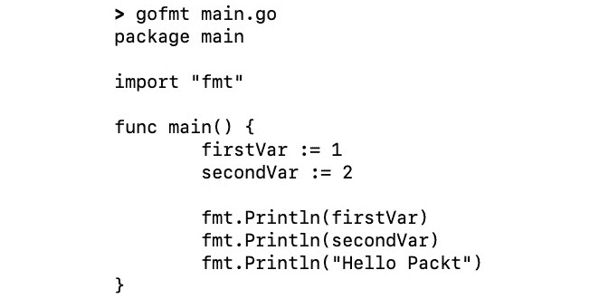

# 20

# 使用 Go 工具

概述

本章将教你如何利用 Go 工具来提高和构建你的代码。它还将帮助你使用 Go 工具构建和改进代码，并使用 `go build` 创建二进制文件。此外，你还将学习如何使用 `goimports` 清理库导入，使用 `go vet` 检测可疑结构，以及使用 Go 竞态检测器识别代码中的竞态条件。

到本章结束时，你将能够使用 `go run` 运行代码，使用 `gofmt` 格式化代码，使用 `go doc` 自动生成文档，以及使用 `go get` 下载第三方包。

# 技术要求

对于本章，你需要 Go 版本 1.21 或更高版本。本章的代码可以在[`github.com/PacktPublishing/Go-Programming-From-Beginner-to-Professional-Second-Edition-/tree/main/Chapter20`](https://github.com/PacktPublishing/Go-Programming-From-Beginner-to-Professional-Second-Edition-/tree/main/Chapter20)找到。

# 简介

在前面的章节中，你学习了如何生成并发和经过良好测试的代码。虽然与其它语言相比，Go 使得创建并发和经过良好测试的代码任务变得更加容易，但这些任务本质上可能很复杂。这就是学习使用工具来编写更好的代码，从而简化复杂性的时候。

在本章中，你将了解 Go 工具。Go 提供了几个工具来帮助你编写更好的代码。例如，在前面的章节中，你遇到了 `go build`，你用它来将代码构建成可执行文件。你还遇到了 `go test`，你用它来测试你的代码。还有一些其他工具以不同的方式提供帮助。例如，`goimports` 工具将检查你是否有了使代码正常工作所需的所有导入语句，如果没有，它将添加它们。它还可以检查是否有任何导入语句不再需要，并删除它们。虽然这看起来很简单，但它意味着你不再需要担心导入，而可以专注于你正在编写的代码。或者，你可以使用 Go 竞态检测器来查找代码中隐藏的竞态条件。当你开始编写并发代码时，这是一个极其宝贵的工具。

Go 语言提供的工具是它受欢迎的原因之一。它们提供了一种标准方式来检查代码的格式问题、错误和竞态条件，这在专业环境中开发软件时非常有用。本章的练习提供了如何使用这些工具来改进代码的实际示例。

# go build 工具

`go build`工具将 Go 源代码编译成可执行格式。在创建软件时，你用人类可读的编程语言编写代码。然后，代码需要被转换成机器可读的格式以便执行。这是通过编译器完成的，它将机器指令从源代码编译出来。要使用 Go 代码完成此操作，你可以使用`go build`。

## 练习 20.01 – 使用`go build`工具

在这个练习中，你将了解`go build`工具。这个工具会将你的 Go 源代码编译成一个二进制文件。要使用它，请在命令行上运行`go build`工具，并使用`–o`标志来指定输出文件或可执行文件名：

```go
go build -o name_of_the_binary_to_create source_file.go
```

如果省略了`–o`标志，输出文件将使用包含源文件的包或文件夹命名。

让我们开始吧：

1.  创建一个名为`Exercise20.01`的新目录。在该目录内，创建一个名为`main.go`的新文件。

1.  运行以下两个命令来创建练习的 Go 模块：

    ```go
    go mod init
    go mod tidy
    ```

1.  将以下代码添加到文件中，以创建一个简单的`Hello` `World`程序：

    ```go
    package main
    import "fmt"
    func main() {
      fmt.Println("Hello World")
    }
    ```

1.  要运行程序，你需要打开你的终端并导航到创建`main.go`文件的目录。然后，通过编写以下内容来运行`go build`工具：

    ```go
    go build -o hello_world main.go
    ```

1.  这将创建一个名为`hello_world`的可执行文件，你可以通过在命令行上运行它来执行这个二进制文件：

    ```go
    ./hello_world
    ```

输出将如下所示：

```go
Hello World
```

在这个练习中，你使用了`go build`工具将你的代码编译成二进制文件并执行它。

# `go run`工具

`go run`工具与`go build`类似，因为它也会编译 Go 代码。然而，细微的区别在于`go build`会输出一个二进制文件，你可以执行它，而`go run`工具不会创建一个需要执行的二进制文件。它将代码编译并运行，最终没有二进制文件输出。如果你想要快速检查代码是否按预期工作，而不需要创建和运行二进制文件，这很有用。这在测试代码时常用，这样你可以快速运行代码，而无需创建执行二进制文件。

## 练习 20.02 – 使用`go run`工具

在这个练习中，你将了解`go run`工具。这个工具可以用作编译和运行代码的单步快捷方式，如果你想要快速检查代码是否工作，这很有用。要使用它，请在命令行上按照以下格式运行`go run`工具：

```go
go run source_file.go
```

执行以下步骤：

1.  创建一个名为`Exercise20.02`的新目录。在该目录内，创建一个名为`main.go`的新文件。

1.  运行以下两个命令来创建这个练习的 Go 模块：

    ```go
    go mod init
    go mod tidy
    ```

1.  将以下代码添加到文件中，以创建一个简单的`Hello` `Packt`程序：

    ```go
    package main
    import "fmt"
    func main() {
      fmt.Println("Hello Packt")
    }
    ```

1.  现在，你可以使用`go run`工具来运行程序：

    ```go
    go run main.go
    ```

这将执行代码并在一步中运行它，给出以下输出：

```go
Hello Packt
```

在这个练习中，你使用了`go run`工具一次性编译和运行一个简单的 Go 程序。这有助于快速检查你的代码是否按预期工作。

# gofmt 工具

`gofmt`工具用于保持你的代码整洁和一致的风格。在大型软件项目中，一个重要但经常被忽视的因素是代码风格。在整个项目中保持一致的代码风格对于可读性很重要。当你必须阅读他人的代码，或者甚至几个月后阅读自己写的代码时，保持一致的样式可以使你无需太多努力就能专注于逻辑。在阅读代码时解析不同的样式只是又一件需要担心的事情，并可能导致错误。为了克服这个问题，Go 自带了一个工具，可以自动以一致的方式格式化你的代码，称为`gofmt`。这意味着在你的项目以及使用`gofmt`工具的其他 Go 项目中，代码将保持一致。因此，它将通过纠正间距和缩进来修复代码的格式，并尝试对齐你的代码的各个部分。

## 练习 20.03 – 使用 gofmt 工具

在这个练习中，你将学习如何使用`gofmt`工具格式化你的代码。当你运行`gofmt`工具时，它将显示它认为文件应该如何看起来，具有正确的格式，但它不会更改文件。如果你想让`gofmt`自动将文件更改为正确的格式，你可以使用带有`-w`选项的`gofmt`，这将更新文件并保存更改。让我们开始吧：

1.  创建一个名为`Exercise20.03`的新目录。在该目录中，创建一个名为`main.go`的新 Go 文件。

1.  运行以下两个命令以创建此练习的 Go 模块：

    ```go
    go mod init
    go mod tidy
    ```

1.  将以下代码添加到文件中，以创建一个格式错误的 `Hello` `Packt` 程序：

    ```go
    package main
    import "fmt"
    func main(){
      firstVar := 1
      secondVar := 2
      fmt.Println(firstVar)
      fmt.Println(secondVar)
      fmt. Println("Hello Packt")
    }
    ```

1.  然后，在你的终端中运行`gofmt`以查看文件将看起来如何：

    ```go
    gofmt main.go
    ```

    这将显示文件应该如何格式化才能使其正确。以下是预期的输出：



图 20.1：gofmt 的预期输出

然而，这仅显示它将做出的更改；它不会更改文件。这样做是为了你可以确认你对这些更改感到满意。

1.  要更改文件并保存这些更改，你需要添加`-w`选项：

    ```go
    gofmt -w main.go
    ```

    这将更新文件并保存更改。然后，当你查看文件时，它应该看起来像这样：

    ```go
    package main
    import "fmt"
    func main() {
      firstVar := 1
      secondVar := 2
      fmt.Println(firstVar)
      fmt.Println(secondVar)
      fmt.Println("Hello Packt")
    }
    ```

你可能会观察到，在`gofmt`工具使用后，格式错误的代码已经被重新对齐。间距和缩进已经被修复，`func`和`main()`之间的新行已经被删除。

注意

在保存时对代码进行多次`gofmt`。值得研究如何使用你选择的 IDE 来做这件事，以便`gofmt`工具可以自动运行并修复代码中的任何间距或缩进错误。

在这个练习中，你使用了 `gofmt` 工具将格式错误的文件重新格式化为整洁的状态。当你刚开始编码时，这可能会显得毫无意义且令人烦恼。然而，随着你的技能提高，并开始处理更大的项目时，你将开始欣赏整洁和一致代码风格的重要性。

# goimports 工具

Go 附带的另一个有用工具是 `goimports`，它可以自动添加文件中需要的导入。软件工程的一个关键部分不是重新发明轮子，而是重用他人的代码。在 Go 中，你通过在文件的 `import` 部分开始导入库来实现这一点。然而，每次需要使用这些导入时，添加它们可能会变得繁琐。你还可以不小心留下未使用的导入，这可能会带来安全风险。更好的方法是使用 `goimports` 自动为你添加导入。它还会删除未使用的导入，并将剩余的导入按字母顺序重新排序，以提高可读性。

## 练习 20.04 – 使用 goimports 工具

在这个练习中，你将学习如何使用 `goimports` 来管理简单 Go 程序中的导入。当你运行 `goimports` 工具时，它将输出它认为文件应该如何看起来，导入已修复。或者，你可以使用 `-w` 选项运行 `goimports`，这将自动更新文件中的导入并保存更改。让我们开始吧：

1.  创建一个名为 `Exercise20.04` 的新目录。在该目录中，创建一个名为 `main.go` 的新文件。

1.  运行以下两个命令来为这个练习创建 Go 模块：

    ```go
    go mod init
    go mod tidy
    ```

1.  将以下代码添加到文件中，以创建一个具有错误导入的简单 `Hello Packt` 程序：

    ```go
    package main
    import (
      "net/http"
      "fmt"
    )
    func main() {
      fmt.Println("Hello")
      log.Println("Packt")
    }
    ```

    你会注意到 `log` 库没有被导入，并且 `net/http` 导入未被使用。

1.  在你的终端中，运行 `goimports` 工具来查看导入如何变化：

    ```go
    goimports main.go
    ```

    这将显示它将如何更改文件以进行修复。以下是预期的输出：


图 20.2：goimports 的预期输出

这不会更改文件，但显示了文件将如何更改。如你所见，`net/http` 导入已被删除，而 `log` 导入已被添加。

1.  要将这些更改写入文件，请添加 `-w` 选项：

    ```go
    goimports -w main.go
    ```

1.  这将更新文件，使其看起来如下：

    ```go
    package main
    import (
      "fmt"
      "log"
    )
    func main() {
      fmt.Println("Hello")
      log.Println("Packt")
    }
    ```

在这个练习中，你学习了如何使用 `goimports` 工具。你可以使用这个工具来检测不正确和未使用的导入语句，并自动修复它们。许多 IDE 都内置了开启 `goimports` 的方式，这样当保存文件时，它会自动为你修复导入。

# go vet 工具

`go vet`工具用于对 Go 代码进行静态分析。虽然 Go 编译器可以找到并通知你你可能犯的错误，但它会错过某些事情。因此，创建了`go vet`工具。这听起来可能微不足道，但其中一些问题可能在代码部署后很长时间内才会被发现，其中最常见的是在使用`Printf`函数时传递错误的参数数量。它还会检查无用的赋值，例如，如果你设置了一个变量然后从未使用过这个变量。它还会检测当非指针接口传递给`unmarshal`函数时的情况。编译器不会注意到这一点，因为它是有效的；然而，`unmarshal`函数将无法将数据写入接口。这可能会在调试时造成麻烦，但使用`go vet`工具可以在问题成为问题之前及早捕捉并修复它。

## 练习 20.05 – 使用 go vet 工具

在这个练习中，你将使用`go vet`工具来查找在使用`Printf`函数时常见的错误。你将用它来检测传递给`Printf`函数的参数数量是否正确。让我们开始吧：

1.  在名为`Exercise20.05`的新目录中，创建一个名为`main.go`的新 go 文件：

1.  运行以下两个命令来为这个练习创建 Go 模块：

    ```go
    go mod init
    go mod tidy
    ```

1.  将以下代码添加到文件中，以创建一个简单的`Hello` `Packt`程序：

    ```go
    package main
    import "fmt"
    func main() {
      helloString := "Hello"
      packtString := "Packt"
      jointString := fmt.Sprintf("%s", helloString, packtString)
      fmt.Println(jointString)
    }
    ```

    如你所见，`jointString`变量使用了`fmt.Sprintf`将两个字符串合并为一个。然而，`%s`格式字符串是不正确的，并且只格式化了一个输入字符串。当你构建这段代码时，它将编译成一个二进制文件，没有任何错误。然而，当你运行程序时，输出将不会如预期。幸运的是，`go vet`工具正是为此而创建的。

1.  对你创建的文件运行`go vet`工具：

    ```go
    go vet main.go
    ```

1.  这将显示它在代码中发现的任何问题：


图 20.3：go vet 的预期输出

如你所见，`go vet`在文件的第 9 行识别到了一个问题。`Sprintf`调用需要`1`个参数，但我们给了它`2`个。

1.  更新`Sprintf`调用，使其可以处理我们想要发送的两个参数：

    ```go
    package main
    import "fmt"
    func main() {
      helloString := "Hello"
      packtString := "Packt"
      jointString := fmt.Sprintf("%s %s", helloString, packtString)
      fmt.Println(jointString)
    }
    ```

1.  现在，你可以再次运行`go vet`并检查是否还有问题：

    ```go
    go vet main.go
    ```

    它应该返回空结果，让你知道文件没有更多的问题。

1.  现在，运行程序：

    ```go
    go run main.go
    ```

在对字符串进行修正后的输出如下：

```go
Hello Packt
```

在这个练习中，你学习了如何使用`go vet`工具来检测编译器可能遗漏的问题。虽然这是一个非常基础的例子，但`go vet`可以检测到像将非指针传递给`unmarshal`函数或检测到不可达代码这样的错误。你被鼓励将`go vet`作为构建过程的一部分来运行，以便在这些问题进入你的程序之前捕捉到它们。

# Go 竞争检测器

Go 的竞态条件检测器被添加到 Go 中，以便开发者可以检测竞态条件。正如我们在*第十八章*中提到的，*并发工作*，你可以使用 goroutines 来并发运行代码的一部分。然而，即使是经验丰富的程序员也可能犯下错误，允许不同的 goroutines 同时访问相同的资源。这被称为竞态条件。竞态条件的问题在于一个 goroutine 可以在另一个 goroutine 读取资源的过程中修改资源，这意味着资源可能会被损坏。虽然 Go 已经将并发作为语言的第一等公民，但并发代码的机制并不能防止竞态条件。此外，由于并发的固有性质，竞态条件可能在你代码部署很久之后才会显现出来。这也意味着它们往往是瞬时的，这使得它们难以调试和修复。这就是为什么 Go 的竞态条件检测器被创建出来的原因。

这个工具通过使用一个检测异步内存访问的算法来工作，但它的缺点是只能在代码执行时这样做。因此，你需要运行代码才能检测到竞态条件。幸运的是，它已经被集成到 Go 工具链中，因此我们可以用它来自动完成这项工作。

## 练习 20.06 – 使用 Go 竞态条件检测器

在这个练习中，你将创建一个包含竞态条件的基本程序。你将使用 Go 竞态条件检测器来查找竞态条件。你将学习如何识别问题所在，然后学习减轻竞态条件的方法。让我们开始吧：

1.  在`Exercise20.06`目录中创建一个新的目录。在该目录内，创建一个名为`main.go`的新文件。

1.  运行以下两个命令来创建这个练习的 Go 模块：

    ```go
    go mod init
    go mod tidy
    ```

1.  将以下代码添加到文件中，以创建一个具有竞态条件的简单程序：

    ```go
    package main
    import "fmt"
    func main() {
      finished := make(chan bool)
      names := []string{"Packt"}
      go func() {
        names = append(names, "Electric")
        names = append(names, "Boogaloo")
        finished <- true
      }()
      for _, name := range names {
        fmt.Println(name)
      }
      <-finished
    }
    ```

    如你所见，有一个名为`names`的数组，里面有一个项目。然后一个 goroutine 开始向其中添加更多名字。同时，主 goroutine 正试图打印出数组中的所有项目。因此，这两个 goroutines 同时访问了相同的资源，这就是竞态条件。

1.  使用`race`标志激活运行前面的代码：

    ```go
    go run --race main.go
    ```

运行此命令将给出以下输出：

```go
Packt
==================
WARNING: DATA RACE
Write at 0x00c0000aa000 by goroutine 6:
  main.main.func1()
      /Users/samcoyle/go/src/github.com/packt-book/Go-Programming---From-Beginner-to-Professional-Second-Edition-/Chapter20/Exercise20.06/main.go:10 +0xe0
Previous read at 0x00c0000aa000 by main goroutine:
  main.main()
      /Users/samcoyle/go/src/github.com/packt-book/Go-Programming---From-Beginner-to-Professional-Second-Edition-/Chapter20/Exercise20.06/main.go:14 +0x170
Goroutine 6 (running) created at:
  main.main()
      /Users/samcoyle/go/src/github.com/packt-book/Go-Programming---From-Beginner-to-Professional-Second-Edition-/Chapter20/Exercise20.06/main.go:9 +0x168
==================
Found 1 data race(s)
exit status 66
```

在输出中，你可以看到一个警告，告诉你有关竞态条件的信息。它告诉你代码在`main.go:10`和`main.go:15`行中读取并写入相同的资源，如下所示：

```go
  names = append(names, "Electric")
  for _, name := range names {
```

如你所见，在两种情况下，都是访问`names`数组，所以问题就出在这里。这种情况发生的原因是程序在等待`finished`通道之前就开始打印`names`。

1.  一种解决方案是在打印项目之前等待`finished`通道：

    ```go
      <-finished
      for _, name := range names {
        fmt.Println(name)
      }
    ```

1.  这意味着在开始打印之前，所有项目都将被添加到数组中。你可以通过再次运行程序并激活`--race`标志来确认这个解决方案：

    ```go
    go run --race main.go
    ```

1.  这应该会正常运行程序，不会显示竞争条件警告。修正后的预期输出如下：

    ```go
    Packt
    Electric
    Boogaloo
    ```

    最终修复了竞争条件的程序将如下所示：

    ```go
    package main
    import "fmt"
    func main() {
      finished := make(chan bool)
      names := []string{"Packt"}
      go func() {
        names = append(names, "Electric")
        names = append(names, "Boogaloo")
        finished <- true
      }()
      <-finished
      for _, name := range names {
        fmt.Println(name)
      }
    }
    ```

虽然这个练习中的程序相当简单，解决方案也是如此，但鼓励你回到 *第十八章*，*并发工作*，并使用那里的 `--race` 标志。这将提供一个更好的示例，说明 Go 竞争检测器如何帮助你。

注意

Go 竞争检测器通常被专业软件开发者用来确认他们的解决方案中不包含任何隐藏的竞争条件。

# go doc 工具

`go doc` 工具用于为 Go 中的包和函数生成文档。许多软件项目的文档部分常常被忽视。这是因为编写文档可能很繁琐，而且保持其更新状态可能更加繁琐。因此，Go 提供了一个工具来自动生成代码中包声明和函数的文档。你只需在函数和包的开始处添加注释。然后，这些注释将被提取并与函数头结合。

这样就可以与他人分享，帮助他们了解如何使用你的代码。要为包及其函数生成文档，你可以使用 `go doc` 工具。这种类型的文档在处理大型项目时非常有用，其他人们需要使用你的代码。通常，在专业环境中，不同的团队会负责程序的不同部分；每个团队都需要与其他团队沟通，了解包中可用的函数以及如何调用它们。为此，他们可以使用 `go doc` 为他们编写的代码生成文档，并与其他团队共享。

## 练习 20.07 – 实现 go doc 工具

在这个练习中，你将了解 `go doc` 工具以及如何用它来生成代码的文档。让我们开始吧：

1.  创建一个名为 `Exercise20.07` 的新目录。在该目录内，创建一个名为 `main.go` 的新文件。

1.  运行以下两个命令来为这个练习创建 Go 模块：

    ```go
    go mod init
    go mod tidy
    ```

1.  将以下代码添加到你创建的 `main.go` 文件中：

    ```go
    package main
    import "fmt"
    // Add returns the total of two integers added together
    func Add(a, b int) int {
      return a + b
    }
    // Multiply returns the total of one integer multiplied by the other
    func Multiply(a, b int) int {
      return a * b
    }
    func main() {
      fmt.Println(Add(1, 1))
      fmt.Println(Multiply(2, 2))
    }
    ```

    这创建了一个简单的程序，其中包含两个函数：一个名为 `Add` 的函数，用于添加两个数字，另一个名为 `Multiply` 的函数，用于乘以两个数字。

1.  运行以下命令来编译和执行文件：

    ```go
    go run main.go
    ```

1.  输出将如下所示：

    ```go
    2
    4
    ```

1.  你会注意到，两个函数上方都有注释，注释以函数名称开头。这是 Go 的一个约定，让你知道这些注释可以用作文档。这意味着你可以使用 `go doc` 工具为代码创建文档。在 `main.go` 文件所在的同一目录下运行以下命令：

    ```go
    go doc -all
    ```

这将为代码生成文档并输出如下：


图 20.4：go doc 的预期输出

在这个练习中，你学习了如何使用`go doc`工具为你创建的 Go 包及其函数生成文档。你可以使用它为其他你创建的包生成文档，并与其他人共享，如果他们想使用你的代码。如果你想捕获这些文档，可以使用`godoc package/path >` `output.txt`。

# go get 工具

`go get`工具允许你下载和使用不同的库。虽然 Go 默认自带了一大批包，但与可用的第三方包数量相比，就显得微不足道了。这些包提供了额外的功能，你可以在代码中使用它们来增强代码。然而，为了让你的代码使用这些包，你需要在你的电脑上安装它们，以便编译器在编译你的代码时包含它们。要下载这些包，你可以使用`go get`工具。

## 练习 20.08 – 实现 go get 工具

在这个练习中，你将学习如何使用`go get`下载第三方包。让我们开始吧：

1.  在名为`Exercise20.08`的新目录中创建一个新文件，命名为`main.go`。

1.  运行以下两个命令来为这个练习创建 go 模块：

    ```go
    go mod init
    go mod tidy
    ```

1.  将以下代码添加到你创建的`main.go`文件中：

    ```go
    package main
    import (
      "fmt"
      "log"
      "net/http"
      "github.com/gorilla/mux"
    )
    func exampleHandler(w http.ResponseWriter, r *http.Request) {
      w.WriteHeader(http.StatusOK)
      fmt.Fprintf(w, "Hello Packt")
    }
    func main() {
      r := mux.NewRouter()
      r.HandleFunc("/", exampleHandler)
      log.Fatal(http.ListenAndServe(":8888", r))
    }
    ```

1.  这是一个简单的 Web 服务器，你可以通过运行以下命令来启动它：

    ```go
    go run main.go
    ```

1.  然而，Web 服务器使用了一个名为`mux`的第三方包。在导入部分，你会看到它是从`github.com/gorilla/mux`导入的。但由于我们没有在本地存储这个包，当我们尝试运行程序时会出现错误：

    ```go
    main.go:8:2: no required module provides package github.com/gorilla/mux; to add it:
       go get github.com/gorilla/mux
    ```

1.  要获取第三方包，你可以使用`go get`。这将本地下载它，以便我们的 Go 代码可以使用它：

    ```go
    go get github.com/gorilla/mux
    ```

1.  现在你已经下载了包，你可以再次运行 Web 服务器：

    ```go
    go run main.go
    ```

    这次，它应该可以无错误地运行：


图 20.5：运行 Web 服务器时的预期输出

1.  当网络服务器正在运行时，你可以在你的网络浏览器中打开`http://localhost:8888`并检查它是否工作：


图 20.6：在 Firefox 中查看时的 Web 服务器输出

在这个练习中，你学习了如何使用`go get`工具下载第三方包。这允许使用 Go 标准包之外的工具和包。

## 活动 20.01 – 使用 gofmt、goimport、go vet 和 go get 来纠正文件

想象一下，你正在对一个编写糟糕的项目进行工作。该文件包含格式错误的文件、缺少导入和位置不当的日志消息。你希望使用本章中学习的 Go 工具来修正文件并找出其中的任何问题。在这个活动中，你将使用 `gofmt`、`goimport`、`go vet` 和 `go get` 来修复文件并找出其中的任何问题。这个活动的步骤如下：

1.  创建一个名为 `Activity20.01` 的目录。

1.  创建一个名为 `main.go` 的文件。

1.  为你的活动代码添加 Go 模块。

1.  将 `Activity20.01/example` 目录中的代码添加到 `main.go` 中，以便你可以正确格式化并安装其依赖项。

1.  修复任何格式问题。

1.  修复 `main.go` 中缺失的导入。

1.  使用 `go vet` 检查编译器可能遗漏的任何问题。

1.  确保第三方 `gorilla/mux` 包已下载到你的本地计算机。

    这是预期的输出：


图 20.7：运行代码时的预期输出

你可以通过在浏览器中访问 `http://localhost:8888` 来检查这是否成功：


图 20.8：通过 Firefox 访问 Web 服务器时的预期输出

注意

本活动的解决方案可以在本书的 GitHub 仓库中找到：[`github.com/PacktPublishing/Go-Programming-From-Beginner-to-Professional-Second-Edition-/tree/main/Chapter20/Activity20.01`](https://github.com/PacktPublishing/Go-Programming-From-Beginner-to-Professional-Second-Edition-/tree/main/Chapter20/Activity20.01)。

下面是示例代码的修正：

```go
package main
import (
  "log"
  "fmt"
  "github.com/gorilla/mux"
)
// ExampleHandler handles the http requests sent to this webserver
Func ExampleHandler(w http.ResponseWriter, r *http.Request) {
  w.WriteHeader(http.StatusOK)
  fmt.Fprintf(w, "Hello Packt")
  return
  log.Println("completed")
}
func main() {
  r := mux.NewRouter()
  r.HandleFunc("/", ExampleHandler)
  log.Fatal(http.ListenAndServe(":8888", r))
}
```

你现在已经在一次编码练习中看到了几个 Go 工具的实际应用。

# 摘要

当程序员编写代码时，Go 工具是无价的。在本章中，你学习了 `go build` 以及如何将你的代码编译成可执行文件。然后，你学习了在项目开发中保持整洁代码的一致性为何很重要，以及你可以如何使用 `gofmt` 自动美化代码。这可以通过 `goimports` 进一步改进，它可以删除不必要的导入以提高安全性，并自动添加你可能忘记添加的导入。

之后，你了解了 `go vet` 以及它如何帮助你找到编译器可能遗漏的任何错误。你还学习了如何使用 Go 竞态检测器来找到代码中隐藏的竞态条件。然后，你学习了如何为你的代码生成文档，这有助于在处理大型项目时进行协作。最后，你了解了如何使用 `go get` 工具下载第三方包，这允许你使用在线上可用的许多 Go 包来增强你的代码。

在下一章中，你将学习如何在云中运行你的 Go 代码，以及开发者在这种情况下的考虑因素。
