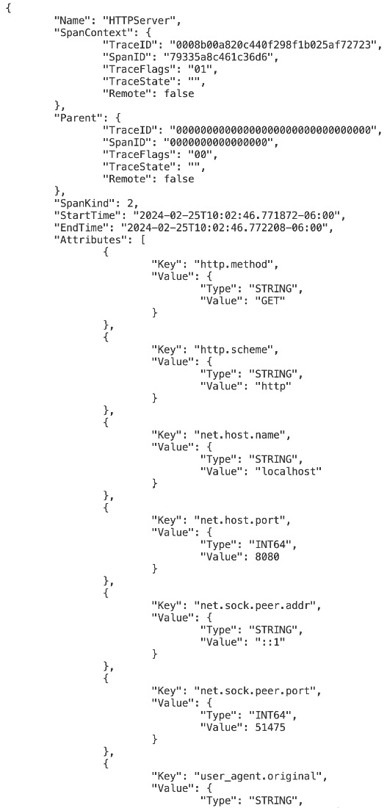

# 21

# 云端 Go

概述

本章将向您展示如何将您的 Go 应用程序提升到部署准备就绪的下一个级别。它将涵盖您必须考虑的因素，以确保您的 Go 应用程序在部署到您的服务器或云基础设施后能够可靠地运行，通过演示如何通过一个名为**Prometheus**的开源监控和警报工具包向系统中添加监控能力来展示这一点。本章还将讨论如何使用编排器运行您的应用程序，以及您从中获得的所有即开即用的好处。最后，本章将涵盖**OpenTelemetry**允许的见解，以及容器化您的 Go 应用程序代码的最佳实践。

在本章结束时，您将能够可靠地部署您的 Go 应用程序，并凭借对系统的宝贵见解来确保其成功。

# 技术要求

对于本章，您需要 Go 版本 1.21 或更高版本。本章的代码可以在[`github.com/PacktPublishing/Go-Programming-From-Beginner-to-Professional-Second-Edition-/tree/main/Chapter21`](https://github.com/PacktPublishing/Go-Programming-From-Beginner-to-Professional-Second-Edition-/tree/main/Chapter21)找到。

# 简介

在上一章中，您学习了各种 Go 工具，这些工具使开发者能够编写更好的代码并提高生产力。我们介绍了使用`go build`和`go run`命令编译和运行 Go 代码的 Go 工具。然后我们探讨了如何使用`gofmt`格式化 Go 代码。我们还看到了通过`goimports`和`go get`命令行工具与 Go 生态系统依赖项一起工作的力量。在代码中有了功能依赖项之后，我们可以使用`Go vet`工具和`Go race`检测器看到可能存在的问题。最后，任何好的代码都伴随着通过`Go doc`工具进行适当的文档，从而形成一个全面的项目。上一章使您在 Go 生态系统中拥有了触手可及的工具。

在本章中，我们关注的是在项目的某个阶段，您的应用程序开发之旅将引导您进入最终领域：部署应用程序。但是，在您点击部署按钮或运行最终命令之前，有一些基本考虑因素是确保您的应用程序在其目标环境中可靠且高效运行的关键。

您的 Go 应用程序将部署在哪里取决于许多因素。这可能是由利益相关者和领导层主导的决定，基于现有基础设施，或者甚至基于您项目或客户群的规格。无论目的地如何，您的 Go 代码都将能够打包并运送到那里。然而，确保您的项目为部署做好准备的责任在于您自己。

本章将向您介绍在云中成功运行应用程序的方法，以及您在将其部署到云中或您选择的任何地方之前可能需要考虑的一些事项。我们将涵盖监控、编排、跟踪和容器化等主题，为您提供知识和工具，以有效地导航云基础设施的复杂性。

首先，我们将讨论在云原生环境中监控应用程序性能和健康的重要性。我们将探讨如何将 Prometheus 等监控系统集成到您的 Go 应用程序中，使您能够收集关键指标并对其持续行为获得洞察。

接下来，我们将深入探讨使用 OpenTracing 的分布式跟踪和日志领域。通过将跟踪和日志集成到您的 Go 应用程序中，您将能够了解请求和响应在微服务之间的流动。这将为您提供额外的洞察，使调试问题变得轻而易举——希望如此——并为您提供洞察，以便未来可能进行性能优化。

最后，我们将介绍 Go 应用程序的基本容器化实践，包括镜像优化、依赖关系管理和安全考虑。您将学习如何构建健壮的容器镜像，以便在任何环境中部署。这将使我们能够无缝过渡到解决使用 Kubernetes 等平台编排应用程序的挑战。编排器允许您以更大的规模对应用程序进行可伸缩性、弹性和易于管理的操作。

到本章结束时，您将准备好自信地将 Go 应用程序部署到云中，并拥有确保其可靠性、可伸缩性、性能以及在生产环境中的可见性的知识和工具。让我们开始吧！

# 使您的应用程序可通过 Prometheus 等系统进行监控

监控是维护任何应用程序健康和性能的关键方面，无论使用何种语言。在资源动态且分布式的云原生环境中，监控尤为重要。在软件工程中，监控和可观察性之间有一些细微的差别。

监控方面更多地依赖于通过预定义的指标和阈值收集数据来检测和警报问题，以定义系统的整体健康状况，而可观察性则更加注重调查，并深入理解系统行为和性能，以便在复杂环境中进行有效的调试和故障排除。为了专注于启用监控能力和对我们应用程序健康状况的洞察，我们将在本书的这一章节中专注于监控而不是可观察性。

当涉及到在应用程序上启用监控功能时，Prometheus 是一个强大的工具。它基于拉取模型运行，定期从配置了指标的应用程序中抓取指标。这些指标随后存储在时间序列数据库中，允许开发者在实时中查询、可视化和发出警报。作为一名 Go 开发者，将 Prometheus 集成到应用程序中可以使您获得有关其性能和行为的宝贵见解。

要使您的 Go 应用程序可由 Prometheus 监控，您需要使用捕获其内部状态和性能相关信息的指标对其进行配置。这涉及到向您的应用程序代码库中添加配置代码，以暴露 Prometheus 可以抓取的指标端点。

Prometheus Go 客户端库提供了一种方便的方法，可以将指标配置到您的 Go 应用程序中。它提供了一系列指标类型，允许您捕获应用程序行为的各个方面：

+   **计数器**：用于随时间跟踪事件发生次数的单调递增值。当应用程序重新启动时，它们重置为零，并且对于测量事件频率（如请求数或错误数）非常有用。

+   **仪表**：在特定时间点对特定值的瞬时测量。它们可以增加或减少，并代表系统的当前状态，例如 CPU 使用率、内存消耗或活动连接数。

+   **直方图**：一种跟踪值随时间分布的方法，使您能够了解数据的变异性和分布范围。它们将观察结果收集到可配置的桶中，并提供诸如百分位数、中位数和平均值等指标，这些指标对于理解响应时间、延迟和请求持续时间非常有用。

+   **摘要**：与直方图类似，摘要提供了对数据分布的更准确表示，特别是对于高基数数据集。它们动态计算分位数和百分位数，允许您以精确和细粒度分析数据分布，这使得它们适合于测量延迟、持续时间和响应时间分布。

一旦您使用上述适合您所需指标和用例的指标类型对应用程序进行了配置，接下来您需要暴露指标端点供 Prometheus 抓取。这些端点通常以与 Prometheus 展示格式兼容的格式提供指标，如`/metrics`。

Prometheus 使用名为抓取配置的配置文件来定义它应该抓取指标的目标。您需要配置 Prometheus 以抓取您的应用程序指标端点，并指定抓取间隔以定期收集数据。

使用 Prometheus 从你的 Go 应用程序收集指标后，你现在可以使用像 Grafana 这样的工具来可视化它们，并基于预定义的阈值或条件设置警报。这允许你主动监控应用程序的健康状况和性能，并在必要时采取纠正措施。

## 练习 21.01 – 创建具有 /healthz 端点的应用程序

我们刚刚概述了监控的工作原理，这是一个强大的工具，你可以用它来捕获指标，以及你如何可视化这些指标并用于改进你的项目。现在，我们将看看这在代码中是什么样的：

1.  在名为 `Exercise21.01` 的目录下创建一个新的目录。在该目录内，创建一个名为 `main.go` 的新文件。

1.  运行以下两个命令以创建用于练习的 `go` 模块：

    ```go
    go mod init
    go mod tidy
    ```

1.  将以下代码添加到文件中，以创建一个我们可以监控的简单应用程序：

    ```go
    package main
    import (
      "fmt"
      "net/http"
      "time"
      "github.com/prometheus/client_golang/prometheus"
      "github.com/prometheus/client_golang/prometheus/promhttp"
    )
    ```

1.  添加我们将用于监控端点调用次数的计数器指标：

    ```go
    var (
      healthzCounter = prometheus.NewCounter(prometheus.CounterOpts{
        Name: "healthz_calls_total",
        Help: "Total number of calls to the healthz endpoint.",
      })
    )
    ```

1.  将指标注册到 Prometheus：

    ```go
    func init() {
      prometheus.MustRegister(healthzCounter)
    }
    ```

1.  定义 `/`healthz 端点的处理器：

    ```go
    func main() {
      http.HandleFunc("/healthz", func(w http.ResponseWriter, r *http.Request) {
        healthzCounter.Inc()
        w.WriteHeader(http.StatusOK)
        fmt.Println("Monitoring endpoint invoked! Counter was incremented!")
      })
    ```

1.  定义一个用于查看指标的处理器：

    ```go
      http.Handle("/metrics", promhttp.Handler())
    ```

1.  定义并启动服务器，然后关闭函数：

    ```go
      server := &http.Server{
        Addr: ":8080",
        ReadTimeout: 10 * time.Second,
        WriteTimeout: 10 * time.Second,
      }
      fmt.Println("Server listening on port 8080...")
      if err := server.ListenAndServe(); err != nil {
        fmt.Printf("Error starting server: %s\n", err)
      }
    }
    ```

1.  要运行程序，你需要打开你的终端，导航到包含 `main.go` 文件的目录。然后，通过编写以下内容来运行 `go build` 工具：

    ```go
    go build -o monitored_app main.go
    ```

1.  这将创建一个名为 `monitored_app` 的可执行文件，你可以在命令行上运行它来执行二进制文件：

    ```go
    ./monitored_app
    ```

输出将如下所示：

```go
Server listening on port 8080...
```

服务器现在正在监听请求。你现在可以通过在网页浏览器中导航到 `/healthz` 端点，或者通过 `curl` 命令执行 HTTP 请求来访问该端点。导航到网页浏览器并刷新页面几次：`http://localhost:8080/healthz`。

如果你回到你的终端，你会看到计数器随着每个请求增加，换句话说，每次你刷新网页：

```go
Monitoring endpoint invoked! Counter was incremented!
Monitoring endpoint invoked! Counter was incremented!
Monitoring endpoint invoked! Counter was incremented!
```

你将看到与你对该端点的 web 服务器请求次数相同数量的输出行。现在我们已经向服务器发送了一些请求，我们在监控的应用程序上生成了一些数据。我们可以在 `http://localhost:8080/metrics` 查看可用的 Prometheus 指标。

如果你访问网页浏览器的 `/metrics` 端点，你将看到我们创建的指标，以及许多其他用三个点缩写的指标，因为太多而无法在页面上很好地列出：

```go
...
# HELP healthz_calls_total Total number of calls to the healthz endpoint.
# TYPE healthz_calls_total counter
healthz_calls_total 3
# HELP promhttp_metric_handler_requests_in_flight Current number of scrapes being served.
# TYPE promhttp_metric_handler_requests_in_flight gauge
promhttp_metric_handler_requests_in_flight 1
# HELP promhttp_metric_handler_requests_total Total number of scrapes by HTTP status code.
# TYPE promhttp_metric_handler_requests_total counter
promhttp_metric_handler_requests_total{code="200"} 0
promhttp_metric_handler_requests_total{code="500"} 0
promhttp_metric_handler_requests_total{code="503"} 0
```

你可以看到我们的自定义指标：

```go
healthz_calls_total 3
```

我们调用了我们的端点三次；因此，我们看到计数器值为 `3`。

你看到的额外指标是由 Prometheus 客户端库本身提供的，与 Go 运行时指标相关，包括内存分配、垃圾回收、goroutines 以及其他运行时统计信息。这些指标在你在 Go 应用程序中导入和使用 Prometheus 客户端库时自动暴露。

在这个练习中，您使用 Prometheus 为 HTTP 服务器上的一个端点定义了一个计数器指标。通过使用 Prometheus 对您的 Go 应用程序进行仪表化并遵循监控的最佳实践，您可以在云原生环境中获得对其行为和性能的宝贵见解。通过 Prometheus，我们看到了如何使用它来定义应用程序的监控能力。

通过添加额外的自定义指标来扩展示例，可以使团队在早期发现问题，有效地调试他们的应用程序，并确保 Go 应用程序在生产级环境中的可靠性和可伸缩性。Prometheus 还能够在满足某些标准时对指标进行警报，证明它在深入了解您的应用程序时是一个相当强大的工具。

# 通过 OpenTelemetry 实现深入洞察

在当今复杂的分布式系统环境中，了解我们的应用程序的行为和性能对于维护可靠性和性能至关重要。现在，我们将探讨另一个现成的有用监控工具。**OpenTelemetry**是深入了解分布式系统功能和性能的关键工具。OpenTelemetry，通常被称为 OTel，提供了一种标准化的方法来收集和关联系统各个组件的数据。

通过将 OpenTelemetry 集成到您的 Go 应用程序中，您可以无缝地捕获遥测数据，包括跟踪、指标和日志，从而全面了解您系统的工作情况。让我们看看 OpenTelemetry 包含的三个主要支柱：

+   **跟踪**使我们能够跟踪请求在穿越不同的服务和组件时的流动，提供了关于延迟、依赖关系和错误传播的宝贵见解。为了跟踪，我们在服务边界之间创建和传播跟踪上下文，以实现端到端请求流的可见性。这使得我们能够可视化请求在系统中的流动，识别性能瓶颈，诊断错误，并优化资源利用。

+   **指标**为我们系统的健康和性能提供了一个量化的视角，使我们能够监控关键指标并识别潜在的瓶颈或异常。OpenTelemetry 提供了一种收集指标的方法，类似于提供对我们应用程序健康和性能的洞察。

+   **日志**提供了我们应用程序中事件和动作的叙述，有助于故障排除和调试工作。这也允许我们在分布式系统中跟踪信息流，并在应用程序内部事件发生时捕获日志。

要在应用程序中利用 OpenTelemetry 的力量，您必须首先使用必要的仪器库和**软件开发工具包**或**SDK**来对应用程序进行仪器化。这与我们在本章前一部分中看到您必须对应用程序进行 Prometheus 仪器化的过程类似。对于 OpenTelemetry 来说，这是一个将 OpenTelemetry SDK 集成到代码库并配置跟踪、指标和日志仪器化的类似过程。

让我们看看这些在实际中是什么样子。

## 练习 21.02 – 使用 OpenTelemetry 进行可查询日志和跟踪

我们现在理解了 OpenTelemetry 允许开发者使用的监控能力。我们将现在看看它是如何帮助创建结构化日志的，这些日志使开发者能够更容易地在以后查询他们的日志，以及了解 OpenTelemetry 中的跟踪是什么样的。

在名为 `Exercise21.02` 的新目录中创建一个名为 `main.go` 的新 Go 文件，然后执行以下操作：

1.  运行以下两个命令来为练习创建一个 `go` 模块：

    ```go
    go mod init
    go mod tidy
    ```

1.  将以下代码添加到文件中，包括我们 OpenTelemetry 监控所需的所有导入：

    ```go
    package main
    import (
      "context"
      "fmt"
      "log"
      "net/http"
      "time"
      "go.opentelemetry.io/contrib/instrumentation/net/http/otelhttp"
      "go.opentelemetry.io/otel"
      "go.opentelemetry.io/otel/exporters/otlp/otlptrace"
      "go.opentelemetry.io/otel/exporters/otlp/otlptrace/otlptracegrpc"
      "go.opentelemetry.io/otel/exporters/otlp/otlptrace/otlptracehttp"
      "go.opentelemetry.io/otel/exporters/stdout/stdouttrace"
      sdktrace "go.opentelemetry.io/otel/sdk/trace"
      "go.opentelemetry.io/otel/trace"
      "go.uber.org/zap"
    )
    ```

1.  创建一个初始化跟踪导出器的函数：

    ```go
    func initTraceExporter(ctx context.Context) *otlptrace.Exporter {
      traceExporter, err := otlptracegrpc.New(
        ctx,
        otlptracegrpc.WithEndpoint("http://localhost:4317),
      )
      if err != nil {
        log.Fatalf("failed to create trace exporter: %v", err)
      }
      return traceExporter
    }
    ```

1.  创建一个初始化日志导出器的函数：

    ```go
    func initLogExporter(ctx context.Context) *otlptrace.Exporter {
      logExporter, err := otlptracehttp.New(
        ctx,otlptracehttp.WithEndpoint("http://localhost:4318/v1/logs"),
      )
      if err != nil {
        log.Fatalf("failed to create log exporter: %v", err)
      }
      return logExporter
    }
    ```

1.  创建一个初始化结构化日志器的函数：

    ```go
    func initLogger() *zap.Logger {
      logger, err := zap.NewProduction()
      if err != nil {
        log.Fatalf("failed to create logger: %v", err)
      }
      return logger
    }
    ```

1.  创建一个初始化跟踪提供者的函数：

    ```go
    func initTracerProvider(traceExporter *otlptrace.Exporter) *sdktrace.TracerProvider {
      exp, err := stdouttrace.New(stdouttrace.WithPrettyPrint())
      if err != nil {
        log.Println("failed to initialize stdouttrace exporter:", err)
      }
      bsp := sdktrace.NewBatchSpanProcessor(exp)
      tp := sdktrace.NewTracerProvider(
        sdktrace.WithBatcher(traceExporter),
        sdktrace.WithSpanProcessor(bsp),
      )
      return tp
    }
    ```

    然后，定义一个 HTTP 处理器，该处理器将处理传入的监控请求并捕获日志信息，以及为传入的请求启动跨度：

    ```go
    func handler(w http.ResponseWriter, r *http.Request){
      ctx := r.Context()
      span := trace.SpanFromContext(ctx)
      defer span.End()
      logger := zap.NewExample().Sugar()
      logger.Infow("Received request",
        "service", "exercise22.02",
        "httpMethod", r.Method,
        "httpURL", r.URL.String(),
        "remoteAddr", r.RemoteAddr,
      )
      w.WriteHeader(http.StatusOK)
      fmt.Fprintf(w, "Monitoring endpoint invoked!")
    }
    ```

1.  最后，定义一个 `main()` 函数，在其中调用我们刚刚定义的所有初始化辅助函数：

    ```go
    func main() {
      ctx := context.Background()
      traceExporter := initTraceExporter(ctx)
      defer traceExporter.Shutdown(context.Background())
      logExporter := initLogExporter(ctx)
      defer logExporter.Shutdown(context.Background())
      tp := initTracerProvider(traceExporter)
      otel.SetTracerProvider(tp)
      logger := initLogger()
      defer logger.Sync()
    ```

1.  使用 OpenTelemetry 仪器包装 HTTP 处理器，启动 HTTP 服务器，并关闭 `main()` 函数：

    ```go
      httpHandler := otelhttp.NewHandler(http.HandlerFunc(handler), "HTTPServer")
      http.Handle("/", httpHandler)
      server := &http.Server{
        Addr: ":8080",
        ReadTimeout: 10 * time.Second,
        WriteTimeout: 10 * time.Second,
      }
      fmt.Println("Server listening on port 8080...")
      if err := server.ListenAndServe(); err != nil {
        fmt.Printf("Error starting server: %s\n", err)
      }
    }
    ```

1.  要运行程序，您需要打开您的终端并导航到创建 `main.go` 文件的目录。然后，通过编写以下内容来运行 `go build` 工具：

    ```go
    go build -o monitored_app main.go
    ```

1.  这将创建一个名为 `monitored_app` 的可执行文件，您可以通过在命令行上运行它来执行该二进制文件：

    ```go
    ./monitored_app
    ```

输出将如下所示：

```go
Server listening on port 8080...
```

服务器现在正在监听请求。您现在可以通过在网页浏览器中导航到 `/healthz` 端点或通过 `curl` 命令执行 HTTP 请求来导航到该端点。在网页浏览器中导航到端点，然后重新加载页面几次：`http://localhost:8080/healthz`。

网页现在将显示以下内容：

```go
Monitoring endpoint invoked!
```

如果您回到您的终端，您将看到我们定义的结构化日志：

```go
{"level":"info","msg":"Received request","service":"exercise22.02","httpMethod":"GET","httpURL":"/healthz","remoteAddr":"[::1]:51082"}
```

您还将看到跟踪信息导出到标准输出的结果，这样我们就可以在终端中看到跟踪。在这里，您可以看到部分输出，缩短以方便查看：



图 21.1：OpenTelemetry 跟踪输出 – 这张图片旨在显示输出和文本；可读性不是关键

在这个练习中，您使用了 OpenTelemetry 来获取有关应用程序的有价值监控洞察，包括请求的结构化日志和跟踪信息。日志有助于提供有关发生情况的信息，我们看到了如何根据您的用例和项目结构化日志以包含相关信息。从那里，您可以使用日志的不同方面进行查询。例如，我们的日志包括服务名称、使用的 HTTP 方法和调用的端点。我们可以轻松地基于所有服务请求或特定端点的所有请求创建查询。这可以为团队提供有价值的洞察，以便在他们的项目中实践。我们还看到了使用 OpenTelemetry 的跟踪信息。如果有子请求，这些信息对于时间洞察和执行流程非常有用。我们还可以使用不同的导出器或 UI 工具来可视化这些结果，以便在更复杂的用例中更容易地看到我们的请求流程中正在发生什么。

# 将您的 Go 应用程序放入容器的最佳实践

近年来，容器化技术彻底改变了软件工程师部署和管理软件应用的方式。通过将应用程序及其依赖项封装进轻量级、可移植的容器中，容器化技术为我们的应用程序提供了众多好处，包括一致性、可扩展性和便携性。这种方法在各个行业中得到了广泛应用，并被认为是最现代软件开发和部署工作流程的标准实践。

容器化对于当今的软件至关重要，因为它通过将应用程序及其依赖项打包成一个单一单元来确保一致性，消除了臭名昭著且令人讨厌的“在我的机器上它工作”问题。这种一致性扩展到不同的环境，包括生产环境，降低了配置漂移的风险。它还允许按需进行可扩展性，因为当应用程序轻量级且在容器中启动快速时，添加或删除应用程序实例是高效的。最后，容器可以在本地、**云服务提供商**（**CSPs**）或混合环境中运行。因此，了解如何将您的 Go 应用程序依赖项打包到容器中，以运行您的 Go 代码，确保其一致性、可扩展性和便携性是至关重要的。

Docker 是容器化生态系统中的大玩家，作为最广泛使用的容器化平台之一。Docker 提供了一个容器化引擎、镜像管理、容器编排以及广泛集成的生态系统。它提供了创建、部署和管理容器的工具、工作流程和基础设施。

在容器化您的 Go 应用程序时，有一些最佳实践需要牢记：

+   **利用 Go 模块进行依赖管理**：Go 模块为管理 Go 应用程序的依赖提供了一个便捷的方式。在容器化您的 Go 应用程序时，请确保您正在使用 Go 模块来有效地管理依赖。本书在*第九章*，*使用 Go 模块定义* *项目*中早期就介绍了 Go 模块。

+   **保持容器轻量**：容器化的一个基本原理是保持容器轻量。这意味着最小化容器镜像的大小，以减少部署时间和资源使用。在为 Go 应用程序构建容器镜像时，使用多阶段构建来编译您的应用程序二进制文件，并将必要的文件复制到最终的镜像中。此外，利用基于 Alpine 或 scratch 的镜像作为基础镜像，进一步减小镜像大小。

+   **优化 Dockerfile 指令**：在为您的 Go 应用程序编写 Dockerfile 时，优化 Dockerfile 指令以提高构建性能并减小镜像大小。使用多阶段构建将构建环境与最终生产镜像分开，最小化最终镜像的大小。此外，通过按从最少变化到最多变化的顺序排列您的 Dockerfile 指令，利用 Docker 的层缓存机制，确保在重建镜像时只执行必要的步骤。

+   **保护您的容器环境**：在容器化您的 Go 应用程序时，安全性应该是首要考虑的。遵循安全最佳实践，例如使用最小和可信的基础镜像，使用像 **Trivy** 这样的工具扫描容器镜像以查找漏洞，并在可能的情况下通过运行非 root 用户来应用最小权限原则。此外，确保敏感信息，如凭证或 API 密钥，不会硬编码到您的容器镜像中，而是在运行时作为环境变量提供或挂载为机密信息。最后，考虑利用 Chainguard 镜像增强 Dockerfile 的安全性，通过依赖其增强的安全措施来提高容器镜像的安全性。

+   **实现健康检查和日志记录**：在您的 Go 应用程序中实现健康检查和日志记录，以提高容器化环境中的可观察性和可靠性。定义健康检查端点，以便容器编排平台如 Kubernetes 能够监控应用程序的健康状况，并自动重启不健康的容器。此外，使用结构化日志提供有关应用程序行为的宝贵见解，使解决问题和在生产环境中调试问题变得更加容易。

+   **使用容器编排平台**：我们将在本章的下一节讨论为什么这很重要。

现在我们已经了解到了解如何容器化我们的 Go 应用程序的重要性，让我们看看在实践中这看起来是什么样子。

## 练习 21.03 – 为 Go 应用程序创建 Dockerfile

要容器化您的 Go 应用程序，您需要创建一个 Dockerfile，这是一个包含 Docker 如何构建应用程序镜像的指令的文本文件。让我们通过创建一个简单 Go 应用程序的 Dockerfile 的过程，然后看看如何构建和运行容器。我们将使用本章前面的 `Exercise21.01` 目录中的代码：

1.  在 `Exercise21.03` 目录下创建一个名为 `main.go` 的新文件：

1.  将 `Exercise21.03/main.go`、`Exercise21.03/go.mod` 和 `Exercise21.03/go.sum` 的内容复制到新目录中。

1.  创建一个包含指令的新文件 `Dockerfile`。

1.  以官方的 Go 镜像作为基础镜像：

    ```go
    FROM golang:latest AS builder
    ```

1.  确保 Go 编译器构建一个静态链接的二进制文件，包括二进制文件内的所有必要库：

    ```go
    ENV CGO_ENABLED=0
    ```

1.  设置容器内的工作目录：

    ```go
    WORKDIR /app
    ```

1.  复制 Go 模块文件和监控应用程序的代码：

    ```go
    COPY go.mod go.sum ./
    COPY main.go ./
    RUN go mod download
    ```

1.  构建 Go 二进制文件：

    ```go
    RUN go build -o monitored_app .
    ```

1.  开始一个新的阶段以创建一个最小的最终镜像：

    ```go
    FROM scratch
    ```

1.  将二进制文件复制到我们的最终阶段：

    ```go
    COPY --from=builder /app/monitored_app /.
    ```

1.  暴露我们将用于与应用程序交互的端口：

    ```go
    EXPOSE 8080
    ```

1.  运行我们的监控应用程序：

    ```go
    CMD ["./monitored_app"]
    ```

1.  现在我们已经填充了 `Dockerfile` 文件的内容，我们可以在终端中运行以下命令来构建我们的 Docker 镜像：

    ```go
    docker build -t monitored-app .
    ```

1.  我们可以使用以下命令运行我们的 Docker 容器，该命令将基于我们监控的应用程序镜像启动一个容器，并将主机机器上的端口 `8080` 映射到容器的端口 `8080`：

    ```go
    docker run -p 8080:8080 monitored-app
    ```

1.  我们现在可以通过我们一直在访问的相同 URL 访问我们的应用程序：`http://localhost:8080/healthz`。

我们仍然看到了与之前相同的应用程序输出：

```go
Monitoring endpoint invoked! Counter was incremented!
```

我们现在已经看到了如何将我们的 Go 应用程序转换为轻量级、短暂的容器，并使用 Docker 命令运行它。Docker 是一个平台，它使我们能够通过将我们的 Go 应用程序依赖项打包到一个可移植的容器中，从而在 Docker 容器中构建、传输和运行我们的应用程序，该容器可以在不同的环境中部署。

让我们现在扩展这个可移植性和容器编排的想法。

# 使您的应用程序准备好与 Kubernetes 等编排器一起工作

**Kubernetes**，通常缩写为 **K8s**，已成为容器编排和管理的既定标准。它提供了自动化部署、扩展和管理容器化应用程序的能力。在其核心，Kubernetes 抽象了管理单个容器的复杂性，并为跨机器集群编排容器化工作负载提供了一个统一的 API 和控制平面。当您想要简化现代、云原生应用程序的部署和管理时，编排器如 Kubernetes 就是您所依赖的。

在当今动态且快速发展的软件领域中，微服务架构和容器化已成为主流，Kubernetes 提供了一个可扩展且具有弹性的平台，用于部署和运行这些分布式应用程序。然而，它并非没有其复杂性和学习曲线。

为了使你的应用程序能够与 Kubernetes 等编排器协同工作，你需要做几件事情：

+   **容器化你的应用程序**：将你的 Go 应用程序及其依赖项打包到 Docker 容器中，正如我们在上一节中看到的。

+   **部署你的容器化应用程序**：一旦你构建了容器镜像，你需要将其部署到你的 Kubernetes 集群中。这通常涉及将容器镜像推送到容器注册库（如 Docker Hub、**Google Container Registry**（**GCR**）或**Amazon Elastic Container Registry**（**Amazon ECR**）），然后使用 Kubernetes 部署清单将其部署到你的 Kubernetes 集群中。

+   **定义 Kubernetes 资源**：在 Kubernetes 中，你使用如 Deployments、Services、ConfigMaps 和 Secrets 等 Kubernetes 资源来定义应用程序的期望状态。你需要创建描述这些资源的 Kubernetes 清单（YAML 文件），并指定 Kubernetes 应该如何管理你的 Go 应用程序。

+   **处理应用程序生命周期**：Kubernetes 管理应用程序的生命周期，包括扩展、滚动更新和监控。确保你的应用程序通过实现健康检查、就绪性探测、优雅关闭以及日志/指标工具来实现与 Kubernetes 的良好协同工作。

+   **服务发现和负载均衡**：使用 Kubernetes 服务在集群内部和外部客户端中公开你的应用程序。这允许应用程序的其他部分发现并与你的 Go 应用程序通信，并使 Kubernetes 能够对应用程序的多个实例进行负载均衡。

+   **监控和日志记录**：使用 Prometheus、Grafana、Fluentd、OpenTelemetry 等工具对你的 Go 应用程序进行监控和日志记录。以结构化格式发出指标、日志和跟踪信息，以便 Kubernetes 可以收集和分析它们。这让你能够了解在 Kubernetes 中运行的应用程序的健康状况和性能。

通过遵循这些步骤，你可以成功地将你的 Go 应用程序部署并运行在如 Kubernetes 环境这样的编排器中。熟悉 Kubernetes 概念和最佳实践对于确保你的应用程序在生产环境中平稳高效地运行至关重要。你还应该认识到，为了跟上与 Kubernetes 协同工作的步伐，你需要面对一个更加复杂的环境和学习曲线。

# 摘要

本章内容非常精彩，它扩展了我们对于运行我们编写的 Go 应用程序的理解。我们学习了如何在云端运行我们的 Go 代码，并且这些代码被完美地打包，为我们提供了确保服务成功的监控洞察。

我们从理解为什么以及如何使用 Prometheus 来监控我们的 Go 应用程序代码开始。这为使用 OpenTelemetry 获取更丰富的应用程序洞察提供了一个很好的过渡。然后，我们展示了如何使用 Docker 容器化我们的应用程序，并探讨了如何在如 Kubernetes 这样的编排环境中运行这个容器化应用程序。在这一章以及整本书中，我们覆盖了大量的内容。

在本书的整个过程中，我们学习了 Go 语言的基础，包括变量和各种类型声明。我们使用 Go 语言进入了控制流和数据规则的学习，还涵盖了使用泛型和接口等一些处理复杂数据类型的新特性。我们通过代码重用、错误处理以及如何通过 Go 模块和包来处理大规模项目，介绍了适用于 Go 语言的良好软件工程实践。我们还简要提到了时间和文件以及系统。

本书将我们的技能提升到了专业水平，展示了使用 Go 进行调试的最佳实践，构建最先进的 CLI 应用程序，以及如何通过连接数据库、与 Web 服务器和客户端协作来进行应用程序开发。我们通过涵盖 Go 的并发原语、强大的测试实践，甚至突出 Go 生态系统提供的最佳工具，将所有内容完美地串联起来。最后，我们看到了如何在云端运行我们的 Go 代码，并深入了解我们的应用程序性能。这本书应该为你提供将 Go 知识转化为专业 Go 开发者的工具和知识！
