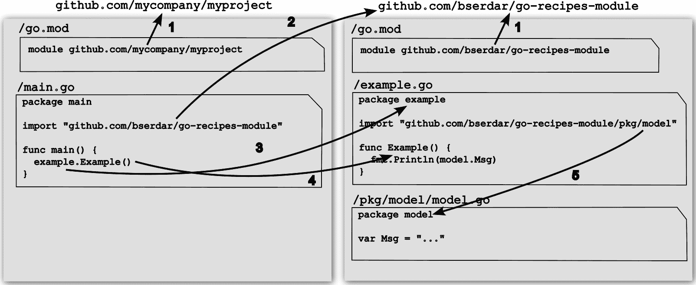

# 1

# 项目组织

本章介绍如何开始一个新项目，组织源代码树，以及管理您在开发程序时所需的包。一个良好的项目结构非常重要，因为当其他开发者处理您的项目或尝试使用其中的组件时，他们可以快速轻松地找到他们需要的东西。本章将首先回答您在开始新项目时可能遇到的一些问题。然后，我们将探讨如何使用 Go 包系统，与标准库和第三方包一起工作，并使其他开发者更容易使用您的包。

本章包括以下内容：

+   创建模块

+   创建源代码树

+   构建和运行程序

+   导入第三方包

+   导入特定版本的包

+   使用内部包以减少 API 表面积

+   使用模块的本地副本

+   工作区

+   管理模块的版本

# 模块和包

首先，关于模块和包的一些简要介绍可能会有所帮助。一个 `main` 包，构建它将生成一个可执行文件。您可以在不生成二进制文件的情况下运行 `main` 包（更具体地说，Go 构建系统首先构建包，在临时位置生成二进制文件，然后运行它）。要使用另一个包，您需要导入它。模块有助于组织多个包以及项目内包引用的解析。一个 `go.mod` 文件，以及该模块内容的校验和将被添加到 `go.sum` 文件中。模块还有助于您管理程序的版本。

一个包的所有文件都存储在文件系统中的单个目录下。每个包都使用 `package` 指令声明一个名称，该名称由包中的所有源文件共享。包名称通常与包含文件的目录名称相匹配，但这并不一定。例如，`main` 包通常不在名为 `main/` 的目录下。包的目录决定了包的“导入路径”。您使用 `import <importPath>` 语句将另一个包导入到当前包中。一旦导入了一个包，您就使用该包中声明的名称，通过其包名称（这不一定与目录名称相同）来使用这些名称。

模块名称指向模块内容在互联网上版本控制系统中的存储位置。在撰写本文时，这不是一个硬性要求，因此您实际上可以创建不遵循此约定的模块名称。应避免这样做，以防止未来与构建系统的潜在不兼容性。您的模块名称应该是这些模块包的导入路径的一部分。特别是，那些第一个组件（第一个 `/` 之前的部分）没有 `.` 的模块名称是为标准库保留的。

这些概念在 *图 1.1* 中得到了说明。



图 1.1 – 模块和包

1.  在 `go.mod` 中声明的模块名称是模块可以找到的仓库路径。

1.  `main.go` 中的导入路径定义了导入的包可以找到的位置。Go 构建系统将使用此导入路径定位包，然后通过扫描包路径的父目录来定位包含该包的模块。一旦找到模块，它将被下载到模块缓存中。

1.  在导入模块中定义的包名是你用来访问该包符号的包名。这可以与导入路径的最后一部分不同。在我们的例子中，包名是 `example`，但这个包的导入路径是 `github.com/bserdar/go-recipes-module`。

1.  `Example` 函数位于 `example` 包中。

1.  `example` 包还导入了同一模块中包含的另一个包。构建系统将识别这个包是同一模块的一部分，并使用下载的模块版本解决引用。

# 技术要求

你需要在你的计算机上安装一个较新的 Go 版本来构建和运行本章中的示例。本书中的示例使用的是**Go 版本 1.22**。本章的代码可以在[`github.com/PacktPublishing/Go-Recipes-for-Developers/tree/main/src/chp1`](https://github.com/PacktPublishing/Go-Recipes-for-Developers/tree/main/src/chp1)找到。

# 创建模块

当你开始一个新的项目时，首先要做的是为它创建一个模块。模块是 Go 管理依赖的方式。

## 如何操作...

1.  创建一个目录来存储新的模块。

1.  在那个目录下，使用 `go mod init <moduleName>` 创建新的模块。`go.mod` 文件标记了模块的根目录。除非该目录也有 `go.mod` 文件，否则此目录下的任何包都将成为该模块的一部分。尽管构建系统支持嵌套模块，但从中获得的收益并不多。

1.  要导入同一模块中的包，使用 `moduleName/packagePath`。当 `moduleName` 与模块在互联网上的位置相同时，你引用的内容不会有歧义。

1.  对于模块下的包，模块的根是包含 `go.mod` 文件的最近父目录。模块根目录下的所有其他包引用都将在这个目录树中进行查找。

1.  首先创建一个目录来存储项目文件。你的当前目录可以在文件系统的任何位置。我见过人们使用一个常见的目录来存储他们的工作，例如 `$HOME/projects`（或在 Windows 中为 `\user\myUser\projects`）。你也可以选择使用类似于模块名称的目录结构，例如 `$HOME/github.com/mycompany/mymodule`（或在 Windows 中为 `\user\myUser\github.com\mycompany\mymodule`）。根据你的操作系统，你可能找到一个更合适的位置。

警告

不要在你的 Go 安装目录的 `src/` 下工作。那是 Go 标准库的源代码。

小贴士

你不应该有一个环境变量 `GOPATH`；如果你必须保留它，不要在其下工作。这个变量曾用于旧的操作模式（Go 版本 <1.13），现在已被 Go 模块系统所取代。

在本章中，我们将使用一个简单的程序，该程序在网页浏览器中显示表单并将输入的信息存储在数据库中。

在创建模块目录后，使用 `go mod init`。以下命令将在 `projects` 目录下创建一个 `webform` 目录，并在其中初始化一个 Go 模块：

```go
$ cd projects
$ mkdir webform
$ go mod init github.com/examplecompany/webform
```

这将在该目录下创建一个 `go.mod` 文件，其外观如下：

```go
module github.com/PacktPublishing/Go-Recipes-for-Developers/chapter1/webform
go 1.21.0
```

使用一个描述你的模块位置的名称。始终使用类似 `<host>.<domain>/location/to/module` 的 URL 结构（例如，`github.com/bserdar/jsonom`）。特别是，模块名称的第一个组成部分应该有一个点（`.`）（Go 构建系统会检查这一点）。

因此，即使你可以将模块命名为 `webform` 或 `mywork/webform`，也不要这样做。然而，你可以使用类似 `workspace.local/webform` 的名称。如果有疑问，请使用代码仓库名称。

# 创建源树

一旦你有了一个新的模块，就是时候决定你将如何组织源文件了。

## 如何操作...

根据项目，有几种已建立的约定：

+   使用标准布局，例如 [`github.com/golang-standards/project-layout`](https://github.com/golang-standards/project-layout)。

+   焦点狭窄的库可以将所有导出名称放在模块根目录下，实现细节可以可选地存储在内部包中。仅生成单个可执行文件且具有相对较少或没有可重用组件的模块也可以使用扁平的目录结构。

对于像我们这样的生成可执行文件的项目，[`github.com/golang-standards/project-layout`](https://github.com/golang-standards/project-layout) 中描述的结构是合适的。因此，让我们遵循这个模板：

```go
webform/
  go.mod
  cmd/
    webform/
      main.go
  web/
    static/
  pkg/
    ...
  internal/
    ...
  build/
    ci/
    package/
  configs/
```

在这里，`cmd/webform` 目录将包含 `main` 包。正如你所见，这是一个包名与其所在目录不匹配的例子。Go 构建系统将使用目录名创建可执行文件，因此当你将在 `cmd/webform` 目录下构建 `main` 包时，你会得到一个名为 `webform` 的可执行文件。如果你在单个模块内构建了多个可执行文件，你可以通过在 `cmd/` 目录下创建一个与程序名匹配的单独的 `main` 包来容纳它们。

`pkg/` 目录将包含程序的导出包。这些是可以被其他项目导入和重用的包。

如果你有一些在这个项目外不可用的包，你应该将它们放在`internal/`目录下。Go 构建系统识别这个目录，并且不允许你从包含`internal/`目录的外部包导入`internal/`下的包。使用这种设置，我们`webform`程序的所有包都将能够访问`internal/`下的包，但它将无法被导入此模块的包访问。

`web/`目录将包含任何与 Web 相关的资产。在这个例子中，我们将有一个包含静态网页的`web/static`目录。如果你有任何服务器端模板，你也可以添加`web/templates`来存储。

`build/package`目录应包含打包脚本和云、容器、打包系统（`dep`、`rpm`、`pkg`等）的配置。

`build/ci`目录应包含持续集成工具脚本和配置。如果你使用的持续集成工具需要将其文件放在除这个目录之外的特定目录中，你可以创建符号链接，或者简单地将这些文件放在工具需要的目录中而不是`/build/ci`。

`configs/`目录应包含配置文件模板和默认配置。

你也可以看到在模块根目录下有`main`包的项目，消除了`cmd/`目录。当模块只有一个可执行文件时，这是一个常见的布局：

```go
webform/
  go.mod
  go.sum
  main.go
  internal/
    ...
  pkg/
    ...
```

然后还有一些没有`main`包的模块。这些通常是你可以导入到你的项目中的库。例如，[`github.com/google/uuid`](https://github.com/google/uuid) 包含使用平面目录结构的流行 UUID 实现。

# 构建和运行程序

现在你已经有一个模块和一些 Go 文件的源树，你可以构建或运行你的程序。

## 如何做到这一点...

+   使用`go build`来构建当前包

+   使用`go build ./path/to/package`在给定目录下构建包

+   使用`go build <moduleName>`构建模块

+   使用`go run`来运行当前的`main`包

+   使用`go run ./path/to/main/package`在给定目录下构建和运行`main`包

+   使用`go run <moduleName/mainpkg>`在给定目录下构建和运行模块的`main`

让我们编写一个启动 HTTP 服务器的`main`函数。以下片段是`cmd/webform/main.go`：

```go
package main
import (
    "net/http"
)
func main() {
    server := http.Server{
        Addr:    ":8181",
        Handler: http.FileServer(http.Dir("web/static")),
    }
    server.ListenAndServe()
}
```

目前，`main`只导入标准库的`net/http`包。它启动一个服务器，为`web/static`目录下的文件提供服务。注意，为了使这生效，你必须从模块根目录运行程序：

```go
$ go run ./cmd/webform
```

总是运行`main`包；避免使用`go run main.go`。这将运行`main.go`，排除`main`包中的任何其他文件。如果你在`main`包中有其他包含辅助函数的`.go`文件，它将失败。

如果你从这个目录之外运行此程序，它将无法找到`web/static`目录；因为它是一个**相对路径**，它是相对于当前目录解析的。

当你通过`go run`运行程序时，程序的可执行文件会被放置在一个临时目录中。要构建可执行文件，请使用以下命令：

```go
$ go build ./cmd/webform
```

这将在当前目录中创建一个二进制文件。二进制文件的名字将由主包的最后一个部分决定——在这种情况下，是`webform`。要使用不同的名字构建二进制文件，请使用以下命令：

```go
$ go build -o wform ./cmd/webform
```

这将构建一个名为`wform`的二进制文件。

# 导入第三方包

大多数项目将依赖于必须导入到它们中的第三方库。Go 模块系统管理这些依赖。

## 如何做到这一点...

1.  找到你项目中需要使用的包的导入路径。

1.  将必要的导入添加到你在外部包中使用的源文件中。

1.  使用`go get`或`go mod tidy`命令将模块添加到`go.mod`和`go.sum`中。如果模块之前没有下载，这一步也会下载模块。

小贴士

你可以使用[`pkg.go.dev`](https://pkg.go.dev)来发现包。这也是你发布 Go 项目文档的地方。

让我们在上一节中添加一个数据库到我们的程序，这样我们就可以存储由网页表单提交的数据。对于这个练习，我们将使用`SQLite`数据库。

将`cmd/webform/main.go`文件修改为导入数据库包并添加必要的数据库初始化代码：

```go
package main
import (
    "net/http"
    "database/sql"
    _ "modernc.org/sqlite"
    "github.com/PacktPublishing/Go-Recipes-for-Developers/src/chp1/
    webform/pkg/commentdb"
)
func main() {
    db, err := sql.Open("sqlite", "webform.db")
    if err != nil {
        panic(err)
    }
    commentdb.InitDB(db)
    server := http.Server{
        Addr:    ":8181",
        Handler: http.FileServer(http.Dir("web/static")),
    }
    server.ListenAndServe()
}
```

`_ "modernc.org/sqlite"`这一行将`SQLite`驱动程序导入到项目中。下划线是`sqlite`包不是直接由这个文件使用，只是为了它的副作用。如果没有空白标识符，编译器会抱怨导入没有被使用。在这种情况下，`modernc.org/sqlite`包是一个数据库驱动程序，当你导入它时，它的`init()`函数将注册所需的驱动程序到标准库中。

下一个声明从我们的模块中导入`commentdb`包。注意，使用完整的模块名称来导入包。构建系统将识别这个导入声明的前缀作为当前模块名称，并将其转换为本地文件系统引用，在这种情况下，是`webform/pkg/commentdb`。

在`db, err := sql.Open("sqlite", "webform.db")`这一行，我们使用`database/sql`包的`Open`函数来启动一个`SQLite`数据库实例。`sqlite`命名了数据库驱动程序，它是由导入的`_ "modernc.org/sqlite"`注册的。

`commentdb.InitDB(db)`语句将调用`commentdb`包中的一个函数。

现在，让我们看看`commentdb.InitDB`是什么样子。这是`webform/pkg/commentdb/initdb.go`文件：

```go
package commentdb
import (
    "context"
    "database/sql"
)
const createStmt=`create table if not exists comments (
email TEXT,
comment TEXT)`
func InitDB(conn *sql.DB) {
    _, err := conn.ExecContext(context.Background(), createStmt)
    if err != nil {
        panic(err)
    }
}
```

如你所见，这个函数会在尚未创建的情况下创建数据库表。

注意 `InitDB` 的首字母大写。如果一个包中声明的符号名的第一个字母是大写，则该符号可以从其他包访问（即，它是 *导出的*）。如果不是，该符号只能在声明它的包中使用（即，它 *未导出的*）。`createStmt` 常量未导出，对其他包不可见。

让我们构建程序：

```go
$ go build ./cmd/webform
  cmd/webform/main.go:7:2: no required module provides package modernc.org/sqlite; to add it:
      go get modernc.org/sqlite
```

你可以运行 `go get modernc.org/sqlite` 将模块添加到你的项目中。或者，你可以运行以下命令：

```go
$ go get
```

这将获取所有缺失的模块。或者，你可以运行以下命令：

```go
$ go mod tidy
```

`go mod tidy` 将下载所有缺失的包，更新 `go.mod` 和 `go.sum` 以包含更新的依赖项，并删除对任何未使用模块的引用。`go get` 只会下载缺失的模块。

# 导入特定版本的包

有时，你需要第三方包的特定版本，因为 API 不兼容或依赖于特定的行为。

## 如何操作...

+   要获取特定版本的包，指定版本标签：

    ```go
    $ go get modernc.org/sqlite@v1.26.0
    ```

+   要获取特定主版本的包的最新版本，请使用以下命令：

    ```go
    $ go get gopkg.in/yaml.v3
    ```

    或者，使用以下命令：

    ```go
    $ go get github.com/ory/dockertest/v3
    ```

+   要导入最新可用的版本，请使用以下命令：

    ```go
    $ go get modernc.org/sqlite
    ```

+   你也可以指定不同的分支。以下命令将从一个 `devel` 分支获取模块，如果存在的话：

    ```go
    $ go get modernc.org/sqlite@devel
    ```

+   或者，你可以获取一个特定的提交：

    ```go
    $ go get modernc.org/sqlite@a8c3eea199bc8fdc39391d5d261eaa3577566050
    ```

如你所见，你可以使用 `@` `revision` 习惯用法来获取模块的特定版本：

```go
$ go get modernc.org/sqlite@v1.26.0
```

URL 的修订部分由版本控制系统评估，在这种情况下是 `git`，因此可以使用任何有效的 `git` 修订语法。

小贴士：

你可以通过检查你的 Go 安装下的 `src/cmd/go/alldocs.go` 文件来找出支持的版本控制系统。

这也意味着你可以使用分支：

```go
$ go get modernc.org/sqlite@master
```

小贴士

[`gopkg.in`](https://gopkg.in) 服务将版本号转换为与 Go 构建系统兼容的 URL。请参阅该网站上的说明了解如何使用它。

# 与模块缓存一起工作

模块缓存是一个目录，Go 构建系统在其中存储下载的模块文件。本节描述了如何与模块缓存一起工作。

## 如何操作...

默认情况下，模块缓存位于 `$GOPATH/pkg/mod`，当未设置 `GOPATH` 时为 `$HOME/go/pkg/mod`：

+   默认情况下，Go 构建系统在模块缓存下创建只读文件，以防止意外修改。

+   要验证模块缓存未被修改且反映了模块的原始版本，请使用以下命令：

    ```go
    go mod verify
    ```

+   要清理模块缓存，请使用以下命令：

    ```go
    go clean -modcache
    ```

关于模块缓存的权威信息来源是 Go Modules 参考 ([`go.dev/ref/mod`](https://go.dev/ref/mod))。

# 使用内部包来减少 API 表面积

并非所有代码都是可重用的。较小的 API 表面积使得其他人更容易适应和使用你的代码。因此，你不应该导出仅针对你程序的 API。

## 如何操作...

创建 `internal` 包以隐藏其他包的实现细节。任何在 `internal` 包下的内容只能从包含该 `internal` 包的包中导入 – 即，任何在 `myproject/internal` 下的内容只能从 `myproject` 下的包中导入 – 那就是任何在 `myproject` 下的内容。

在我们的例子中，我们将数据库访问代码放入一个包中，以便其他程序可以访问。然而，将 HTTP 路由暴露给其他人没有意义，因为它们是特定于这个程序的。所以，我们将它们放在 `webform/internal` 包下。

这是 `internal/routes/routes.go` 文件：

```go
package routes
import (
    "database/sql"
    "github.com/gorilla/mux"
    "net/http"
)
func Build(router *mux.Router, conn *sql.DB) {
    router.Path("/form").
        Methods("GET").HandlerFunc(func(w http.ResponseWriter, r 
        *http.Request) {
        http.ServeFile(w, r, "web/static/form.html")
    })
    router.Path("/form").
        Methods("POST").HandlerFunc(func(w http.ResponseWriter, r 
        *http.Request) {
        handlePost(conn, w, r)
    })
}
func handlePost(conn *sql.DB, w http.ResponseWriter, r *http.Request) {
    email := r.PostFormValue("email")
    comment := r.PostFormValue("comment")
    _, err := conn.ExecContext(r.Context(), "insert into comments 
    (email,comment) values (?,?)",
    email, comment)
    if err != nil {
        http.Error(w, err.Error(), http.StatusInternalServerError)
        return
    }
    http.Redirect(w, r, "/form", http.StatusFound)
}
```

然后，我们将 `main.go` 文件更改为使用内部包：

```go
package main
import (
    "database/sql"
    "net/http"
    "github.com/gorilla/mux"
    _ "modernc.org/sqlite"
    "github.com/PacktPublishing/Go-Recipes-for-Developers/src/chp1/
    webform/internal/routes"
    "github.com/PacktPublishing/Go-Recipes-for-Developers/src/chp1/
    webform/pkg/commentdb"
)
func main() {
    db, err := sql.Open("sqlite", "webform.db")
    if err != nil {
        panic(err)
    }
    commentdb.InitDB(db)
    r := mux.NewRouter()
    routes.Build(r, db)
    server := http.Server{
        Addr:    ":8181",
        Handler: r,
    }
    server.ListenAndServe()
}
```

# 使用模块的本地副本

有时，您将工作在多个模块上，或者从存储库下载一个模块，对其进行一些更改，然后想使用更改后的版本而不是存储库上的版本。

## 如何操作...

使用 `go.mod` 中的 `replace` 指令指向包含模块的本地目录。

让我们回到我们的例子 – 假设你想对 `sqlite` 包做一些更改：

1.  克隆它：

    ```go
    $ ls
      webform
    $ git clone git@gitlab.com:cznic/sqlite.git
    $ ls
      sqlite
      webform
    ```

1.  修改您项目下的 `go.mod` 文件以指向模块的本地副本。`go.mod` 变为以下内容：

    ```go
    module github.com/PacktPublishing/Go-Recipes-for-Developers/chapter1/webform
    go 1.22.1
    replace modernc.org/sqlite => ../sqlite
    require (
        github.com/gorilla/mux v1.8.1
        modernc.org/sqlite v1.27.0
    )
    ...
    ```

1.  您现在可以在系统上的 `sqlite` 模块中进行更改，并且这些更改将构建到您的应用程序中。

# 在多个模块上工作 – 工作空间

有时你需要与多个相互依赖的模块一起工作。一个方便的方法是通过定义工作空间来实现。工作空间只是一组模块。如果工作空间内的某个模块引用了同一工作空间内另一个模块的包，它将本地解析而不是从网络上下载该模块。

## 如何操作...

1.  要创建工作空间，你必须有一个包含所有工作模块的父目录：

    ```go
    $ cd ~/projects
    $ mkdir ws
    $ cd ws
    ```

1.  然后，使用以下命令启动工作空间：

    ```go
    $ go work init
    ```

    这将在当前目录下创建一个 `go.work` 文件。

1.  将您正在工作的模块放入此目录。

    让我们用我们的例子来演示这一点。假设我们有以下目录结构：

    ```go
    $HOME/
      projects/
        ws/
           go.work
           webform
           sqlite
    ```

    现在，我们想要将两个模块 `webform` 和 `sqlite` 添加到工作空间中。为此，使用以下命令：

    ```go
    $ go work use ./webform
    $ go work use ./sqlite
    ```

    这些命令将两个模块添加到您的工作空间中。任何来自 `webform` 模块的 `sqlite` 引用现在将解析为使用模块的本地副本。

# 管理您模块的版本

Go 工具使用语义版本控制系统。这意味着版本号采用 `X.Y.z` 的形式，具体如下：

+   `X` 用于主要发布，这些发布可能不是向后兼容的。

+   `Y` 用于增量但向后兼容的小版本发布进行递增

+   `z` 用于向后兼容的补丁进行递增

你可以在 [`semver.org`](https://semver.org) 上了解更多关于语义版本化的信息。

## 如何操作...

+   要发布补丁或小版本，请使用新版本号标记包含您更改的分支：

    ```go
    $ git tag v1.0.0
    $ git push origin v1.0.0
    ```

+   如果你想要发布一个与先前版本不兼容的新版本，你应该增加该模块的主版本号。要发布模块的新主要版本，使用一个新的分支：

    ```go
    $ git checkout -b v2
    ```

    然后，将 `go.mod` 中的模块名称更改为以 `/v2` 结尾，并更新源树中的所有引用以使用模块的 `/v2` 版本。

例如，假设你发布了 `webform` 模块的第一版，`v1.0.0`。然后，你决定你想要添加新的 API 端点。这不会是一个破坏性变更，所以你只需简单地增加次要版本号——`v1.1.0`。但后来发现你添加的一些 API 造成了问题，所以你移除了它们。现在，这是一个破坏性变更，所以你应该发布带有它的 `v2.0.0`。你该如何做到这一点呢？

答案是，你在版本控制系统中使用一个新的分支。创建 `v2` 分支：

```go
$ git checkout -b v2
```

然后，将 `go.mod` 更改为反映新版本：

```go
module github.com/PacktPublishing/Go-Recipes-for-Developers/chapter1/webform/v2
go 1.22.1
require (
  ...
)
```

如果模块中有多个包，你必须更新源树，以便该模块内对包的任何引用也使用 `v2` 版本。

提交并推送新分支：

```go
$ git add go.mod
$ git commit -m "New version"
$ git push origin v2
```

要使用新版本，你现在必须导入包的 `v2` 版本：

```go
import "github.com/PacktPublishing/Go-Recipes-for-Developers/chapter1/webform/v2/pkg/commentdb"
```

# 摘要和进一步阅读

本章重点介绍了设置和管理 Go 项目的概念和机制。这绝对不是一份详尽的参考，但这里提供的食谱应该能让你掌握有效使用 Go 构建系统的基本知识。

Go 模块的确切指南是 Go Modules 参考 ([`go.dev/ref/mod`](https://go.dev/ref/mod))。

查看关于依赖管理的详细讨论，请访问 *管理依赖项* 链接 ([`go.dev/doc/modules/managing-dependencies`](https://go.dev/doc/modules/managing-dependencies))。

在下一章中，我们将开始处理文本数据。
