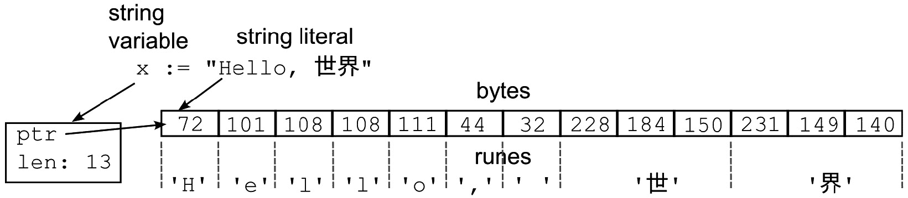

# 2

# 字符串操作

字符串是 Go 中的基本数据类型之一。

Go 使用不可变的 UTF-8 编码字符串。对于新开发者来说，这可能会令人困惑；毕竟，这可以工作：

```go
x:="Hello"
x+=" World"
fmt.Println(x)
// Prints Hello World
```

我们不是刚刚修改了`x`吗？是的，我们确实修改了。在这里不可变的是`"Hello"`和`" World"`字符串。所以，字符串本身是不可变的，但字符串变量`x`是可变的。要修改字符串变量，你需要创建字节数组或 runes（它们是可变的）的切片，然后与它们一起工作，最后将它们转换回字符串。

UTF-8 是用于 Web 和互联网技术的最常见编码。这意味着每次你在 Go 程序中处理文本时，你都在处理 UTF-8 字符串。如果你必须以不同的编码处理数据，你首先将其转换为 UTF-8，处理它，然后再将其编码回原始编码。

UTF-8 是一种变长编码，每个码点使用一个到四个字节。大多数码点代表一个字符，但也有一些代表其他信息，如格式化。这可能会引起一些意外。例如，字符串的长度（即它占用的字节数）与字符数不同。要找到字符串中的字符数，你需要逐个计数。当你切片字符串时，你必须注意码点边界。

Go 使用`rune`类型来表示码点。因此，字符串可以被视为字节序列，也可以被视为 rune 序列。这如图*图 2.1*所示。在这里，`x`是一个字符串变量，它指向不可变的字符串，这是一个字节序列，也可以被视为 rune 序列。尽管 UTF-8 是一种变长编码，但`rune`是一个固定长度的 32 位类型（`uint32`）。较小的码点，如以下字符`H`，是一个 32 位的十进制数，72，而字节`H`是一个 8 位值。



图 2.1 – 字符串、字节和 rune

在本章中，我们将探讨一些涉及字符串和文本的常见操作。本章包含的食谱如下：

+   创建字符串

+   格式化字符串

+   合并字符串

+   大写、小写和标题大小写比较

+   处理国际化字符串

+   处理编码

+   迭代字符串的字节和 rune

+   分割

+   正则表达式

+   逐行或逐字读取字符串

+   去除空白

+   模板

# 创建字符串

在这个食谱中，我们将探讨如何在程序中创建字符串。

## 如何做到这一点...

+   使用字符串字面量。Go 中有两种字符串字面量：

    +   使用解释字符串字面量，用双引号括起来：

        ```go
        x := "Hello world"
        ```

    +   在解释字符串字面量中，你必须转义某些字符：

        ```go
        x:="This is how you can include a \" in your string literal"
        y:="You can also use a newline \n, tab \t"
        ```

    +   你可以包括 Unicode 码点或十六进制字节，使用`\'`转义：

        ```go
        w:="\u65e5 本\U00008a9e"
        x:="\xff"
        ```

在解释字符串中，你不能有换行符或未转义的引号：

+   使用反引号创建原始字符串字面量。原始字符串字面量可以包含任何字符（包括换行符），但不能包含反引号。在原始字面量中无法转义反引号。

    ```go
    x:=`This is a
    multiline raw string literal.
    Backslash will print as backslash \`
    ```

如果需要在原始字符串字面量中包含反引号，请这样做：

```go
x:=`This is a raw string literal with `+"`"+` in it`
```

# 字符串格式化

Go 标准库提供了多种在文本模板中替换值的方法。在这里，我们将讨论 `fmt` 包中的文本格式化工具。它们提供了一种简单方便的方法来在文本模板中替换值。

## 如何做到这一点...

+   使用 `fmt.Print` 系列函数来格式化值

+   `fmt.Print` 将使用其默认格式打印一个值

+   字符串值将按原样打印

+   数字值将首先被转换为字符串，作为整数、十进制数，或者使用科学记数法表示大指数

+   布尔值将打印为 `true` 或 `false`

+   结构化值将按字段列表打印

如果一个 `Print` 函数以 `ln` 结尾（例如 `fmt.Println`），将在字符串后输出一个新行。

如果一个 `Print` 函数以 `f` 结尾（例如 `fmt.Println`），则该函数将接受一个格式参数，该参数将用作模板，并将值替换到其中。

`fmt.Sprintf` 将格式化一个字符串并返回它。

`fmt.Fprintf` 将格式化一个字符串并将其写入 `io.Writer`，这可以是文件、网络连接等。

`fmt.Printf` 将格式化一个字符串并将其写入标准输出。

## 它是如何工作的...

所有这些函数都使用 `%[选项]动词>` 格式从参数列表中消耗一个参数。要在输出中产生一个 `%` 字符，请使用 `%%`：

```go
func main() {
     fmt.Printf("Print integers using %%d: %d|\n", 10)
    // Print integers using %d: 10|
     fmt.Printf("You can set the width of the printed number, left 
     aligned: %5d|\n", 10)
    // You can set the width of the printed number, left 
    // aligned:    10|
     fmt.Printf("You can make numbers right-aligned with a given 
     width: %-5d|\n", 10)
    // You can make numbers right-aligned with a given width: 10   |
     fmt.Printf("The width can be filled with 0s: %05d|\n", 10)
    // The width can be filled with 0s: 00010|
     fmt.Printf("You can use multiple arguments: %d %s %v\n", 10, 
     "yes", true)
    // You can use multiple arguments: 10 yes true
     fmt.Printf("You can refer to the same argument multiple times : 
     %d %s %[2]s  %v\n", 10, "yes", true)
    // You can refer to the same argument multiple times : 10 yes 
    // yes  true
     fmt.Printf("But if you use an index n, the next argument will be 
     selected from n+1 : %d %s %[2]s %[1]v  %v\n", 10, "yes", true)
    // But if you use an index n, the next argument will be selected 
    // from n+1 : 10 yes yes 10  yes
     fmt.Printf("Use %%v to use the default format for the type: %v %v 
     %v\n", 10, "yes", true)
    // Use %v to use the default format for the type: 10 yes true
     fmt.Printf("For floating point, you can specify precision: 
     %5.2f\n", 12.345657)
    // For floating point, you can specify precision: 12.35
     fmt.Printf("For floating point, you can specify precision: 
     %5.2f\n", 12.0)
    // For floating point, you can specify precision: 12.00
    type S struct {
         IntValue    int
         StringValue string
    }
    s := S{
         IntValue:    1,
         StringValue: `foo "bar"`,
    }
    // Print the field values of a structure, in the order they are 
    // declared
    fmt.Printf("%v\n", s)
    // {1 foo "bar"}
    // Print the field names and values of a structure
    fmt.Printf("%+v\n", s)
    //{IntValue:1 StringValue:foo "bar"}
}
```

# 字符串组合

Go 标准库提供了多种从组件构建字符串的方法。最佳方法取决于你处理的是哪种类型的字符串，以及它们的长度。本节展示了构建字符串的几种方法。

## 如何做到这一点...

+   要组合少量固定数量的字符串，或向另一个字符串添加 runes，请使用 `+` 或 `+=` 运算符或 `string.Builder`

+   要算法性地构建一个字符串，请使用 `strings.Builder`

+   要组合字符串切片，请使用 `strings.Join`

+   要组合 URL 路径的一部分，请使用 `path.Join`

+   要从路径段构建文件系统路径，请使用 `filepath.Join`

## 它是如何工作的...

要构建常量值或进行简单的连接，请使用 `+` 或 `+=` 运算符：

```go
var TwoLines = "This is the first line \n"+
"This is the second line"
func ThreeLines(newLine string) string {
   return TwoLines+"\n"+newLine
}
```

你可以用相同的方式向字符串添加 runes：

```go
func AddNewLine(line string) string {
  return line+string('\n')
}
```

小贴士

在性能意识强烈的团队中，使用 `+` 运算符进行字符串连接可能会引起争议。确实，`+` 运算符可能会变得低效，因为多次添加可能会创建不必要的临时字符串来存储中间结果。同样正确的是，对于某些用例，编译器可以生成比手动编写的更好的代码。然而，除非你在 `for` 循环中使用 `+` 运算符创建字符串，否则它们很少是性能问题的原因。例如，`x+y` 几乎总是优于 `fmt.Sprintf("%s%s",x,y)`。如果有疑问，请编写基准测试并测量。以下是我笔记本电脑上的结果：

`BenchmarkXPlusY-12          98628536             ``11.31 ns/op`

`BenchmarkSprintf-12         12120278``97.70 ns/op`

`BenchmarkBuilder-12         33077902             ``34.89 ns/op`

对于非平凡情况，其中你必须添加许多短字符串来构建一个更长的字符串，请使用 `strings.Builder`。尽管 `strings.Builder` 看起来像是字节切片的便利前端，但它做得更多。它从底层字节切片中创建字符串而不进行复制，因此它几乎总是优于使用字节切片然后从中创建字符串。

提示

这是一个示例，说明为什么你应该优先选择标准库函数而不是第三方库或手动优化。这些函数经过积极优化，并依赖于 Go 内部功能，而不创建可移植性问题：

```go
builder := strings.Builder{} // Zero-value is ready to use
for i:=0; i< 10000; i++ {
   builder.WriteString(getShortString(i))
}
fmt.Println(builder.String())
```

使用 `strings.Join` 来合并字符串切片。如果你正在处理文件名并且需要合并多级目录，请使用 `filepath.Join` 以避免平台特定的分隔符字符。`filepath.Join` 在 Windows 平台上使用 `\`，在基于 Linux 的平台上使用 `/`。如果你正在处理 URL 并且需要合并多个段，请使用 `path.Join`，它始终使用 `/` 来合并部分：

```go
package main
import (
     "fmt"
     "path"
     "path/filepath"
     "strings"
)
func main() {
     words := []string{"foo", "bar", "baz"}
     fmt.Println(strings.Join(words, " "))
    // foo bar baz
     fmt.Println(strings.Join(words, ""))
    // foobarbaz
     fmt.Println(path.Join(words...))
    // foo/bar/baz
     fmt.Println(filepath.Join(words...))
    // foo/bar/baz or foo\bar\baz, depending on the host system
     paths := []string{"/foo", "//bar", "baz"}
     fmt.Println(strings.Join(paths, " "))
    // /foo //bar baz
     fmt.Println(path.Join(paths...))
    // /foo/bar/baz
     fmt.Println(filepath.Join(paths...))
    // /foo/bar/baz or \foo\bar\baz depending on the host system
}
```

# 处理字符串大小写

当处理文本数据时，与字符串大小写相关的问题经常出现。文本搜索应该是大小写敏感的还是不敏感的？我们如何将字符串转换为小写或大写？在本节中，我们将探讨一些用于以可移植方式处理这些常见问题的方法。

## 如何做到这一点...

+   使用 `strings.ToUpper` 和 `strings.ToLower` 函数分别将字符串转换为大写和小写。

+   当处理具有特殊大小写映射的语言中的文本（例如土耳其语，其中“İ”是“I”的大写形式）时，请使用 `strings.ToUpperSpecial` 和 `strings.ToLowerSpecial`

+   要将文本转换为用于标题的大写，请使用 `strings.ToTitle`

+   要进行字典序字符串比较，请使用比较运算符

+   要测试忽略大小写的字符串等价性，请使用 `strings.EqualFold`

## 它是如何工作的...

将字符串转换为大小写很简单：

```go
greet := "Hello World!"
fmt.Println(strings.ToUpper(greet))
fmt.Println(strings.ToLower(greet))
```

该程序输出以下内容：

```go
HELLO WORLD!
hello world!
```

但大小写可能因语言而异。例如，突厥语系的一些语言有特殊的情况：

```go
word := "ilk"
fmt.Println(strings.ToUpper(word))
```

这将打印以下内容：

```go
ILK
```

然而，这并不是土耳其语正确的使用大写字母的方式。让我们尝试以下操作：

```go
import (
    "fmt"
    "strings"
    "unicode"
)
func main() {
  word := "ilk"
  fmt.Println(strings.ToUpperSpecial(unicode.TurkishCase,word))
}
```

前面的程序将打印以下内容：

```go
İLK
```

标题大小写与大小写主要在处理连字符和双字母时不同——即表示为单个字符的多个字符，例如 `LJ` `(U+01C7)`：

```go
package main
import (
    "fmt"
    "strings"
)
func main() {
    fmt.Println(strings.ToTitle("LJ")) // U+01C7
    fmt.Println(strings.ToUpper("LJ"))
    fmt.Println(strings.ToLower("LJ"))
}
```

该程序打印以下内容：

```go
Lj
LJ
lj
```

大写、小写和标题大小写定义了如何使用特定的映射来打印字符串。这些都是**映射**。**折叠**是将文本转换为相同的大小写以用于比较的过程。

对于字典序大小写敏感的比较，请使用关系运算符：

```go
fmt.Prinln("a" < "b") // true
```

要以不区分大小写的方式比较两个 Unicode 字符串，请使用 `strings.EqualFold`：

```go
fmt.Println(strings.EqualFold("here", "Here")) // true
fmt.Println(strings.EqualFold("here", "Here")) // true
fmt.Println(strings.EqualFold("GÖ", "gö")) // true
```

## 还有更多...

虽然标准库 `strings` 包包括了您需要的几乎所有字符串比较函数，但在处理国际化字符串时，它们可能不足以满足需求。例如，在许多情况下，您可能希望将 `Montréal` 和 `montreal` 视为相等。`strings.EqualFold` 无法做到这一点。许多用于处理内部文本处理的辅助函数都在 `golang.org/x/text` 下的包中。

Unicode 提供了多种表示给定字符串的方法。例如，`Montréal` 中的 `é` 可以表示为一个单独的字符，`\u00e9` 或 `e`，后面跟着一个重音符号，`e\u0301`。`\u0301` 是“组合重音符号”，“◌́”或“`”和它修改了它前面的代码点。根据 Unicode 标准，`é` 和 `e` + `◌́` 是“规范等价”的。也存在兼容等价，例如 `\ufb00`，表示 `ff` 为单个代码点，以及 `ff` 序列。规范等价序列也是兼容的，但并非所有兼容序列都是规范等价的。

因此，如果您需要从文本中移除变音符号（即非间隔符号），您可以将其分解，移除变音符号，然后按以下方式重新组合：

```go
// Based on the blog post https://go.dev/blog/normalization
package main
import (
     "fmt"
     "io"
     "strings"
     "unicode"
     "golang.org/x/text/transform"
     "golang.org/x/text/unicode/norm"
)
func main() {
     isMn := func(r rune) bool {
          return unicode.Is(unicode.Mn, r) // Mn: nonspacing marks
     }
     t := transform.Chain(norm.NFD, transform.RemoveFunc(isMn), norm.
     NFC)
     rd := transform.NewReader(strings.NewReader("Montréal"), t)
     str, _ := io.ReadAll(rd)
     fmt.Println(string(str))
}
```

上述程序将打印以下内容：

```go
Montreal
```

# 处理编码

如果您的程序有可能需要处理由不同系统产生的数据，您应该了解不同的文本编码。这是一个很大的话题，但本节应该提供一些线索来触及表面。

## 如何做到这一点...

+   使用 `golang.org/x/text/encoding` 包来处理不同的编码。

+   要按名称查找编码，请使用以下之一：

    +   `golang.org/x/text/encoding/ianaindex`

    +   `golang.org/x/text/encoding/htmlindex`

+   一旦您有了编码，就可以使用它将文本转换为 UTF-8 或从 UTF-8 转换文本。

## 它是如何工作的...

使用其中一个索引来查找编码。然后，使用该编码来读取/写入数据：

```go
package main
import (
     "fmt"
     "os"
     "golang.org/x/text/encoding/ianaindex"
)
func main() {
     enc, err := ianaindex.MIME.Encoding("US-ASCII")
     if err != nil {
            panic(err)
     }
     b, err := os.ReadFile("ascii.txt")
     if err != nil {
            panic(err)
     }
     decoder := enc.NewDecoder()
     encoded, err := decoder.Bytes(b)
     if err != nil {
            panic(err)
     }
     fmt.Println(string(encoded))
}
```

# 迭代字符串的字节和字符

Go 语言的字符串可以看作是字节序列，或者看作是字符序列。本节展示了如何以这两种方式迭代字符串。

## 如何做到这一点...

要迭代字符串的字节，使用索引：

```go
for i:=0;i<len(str);i++ {
  fmt.Print(str[i]," ")
}
```

要迭代字符串的字符，使用 `range`：

```go
for index, c:=range str {
  fmt.Print(c," ")
}
```

## 它是如何工作的...

Go 语言的字符串是字节切片，因此您可能会认为可以编写一个 for 循环来迭代字符串的字节和字符。您可能会认为可以这样做：

```go
strBytes := []byte(str)
strRunes := []rune(str)
```

然而，将字符串转换为字节数组或字符数组是一个昂贵的操作。第一个操作创建了 `str` 字符串字节的可写副本，第二个操作创建了 `str` 字符串字符的可写副本。请记住，`rune` 是 `uint32`。

有两种形式的 for 循环可以迭代字符串的元素。以下 for 循环将迭代字符串的字节：

```go
str:="Hello 世界"
for i:=0;i<len(str);i++ {
  fmt.Print(str[i]," ")
}
```

输出如下：

```go
72 101 108 108 111 32 228 184 150 231 149 140
```

此外，请注意，`str[i]` 将为您提供第 i 个字节，而不是第 i 个字符。

以下形式迭代字符串的 rune：

```go
for i,r:=range str {
  fmt.Printf("( %d %d %s)", i, r, string(r))
}
```

输出如下：

```go
(0 72 H)(1 101 e)(2 108 l)(3 108 l)(4 111 o)(5 32  )(6 19990 世)(9 30028 界)
```

注意索引 - 它们按照 0、1、2、3、4、5、6、9 的顺序排列。这是因为`str[6]`包含一个 3 字节的 rune，同样`str[9]`也是。

当你处理的是`[]byte`而不是字符串时，你可以模拟 rune 迭代，如下所示：

```go
import (
  "unicode/utf8"
  "fmt"
)
str:=[]byte("Hello 世界")
for i:=0;i<len(str); {
  r, n:=utf8.DecodeRune(str[i:])
  fmt.Print("(",i,r, " ",string(r),")")
  i+=n
}
```

`utf8.DecodeRune`函数从字节切片中解码下一个 rune，并返回该 rune 以及消耗的字节数。这样，你可以在不首先将其转换为字符串的情况下解码字节切片中的 rune。

# 分割

`strings`包提供了方便的函数来分割字符串以获取字符串切片。

## 如何做到...

+   要使用分隔符将字符串分割成组件，请使用`strings.Split`。

+   要分割字符串中由空格分隔的组件，请使用`strings.Fields`。

## 它是如何工作的...

如果你需要解析由固定分隔符分隔的字符串，请使用`strings.Split`。如果你需要解析字符串中的空格分隔部分，请使用`strings.Fields`：

```go
package main
import (
     "fmt"
     "strings"
)
func main() {
     fmt.Println(strings.Split("a,b,c,d", ","))
    // ["a", "b", "c", "d"]
     fmt.Println(strings.Split("a, b, c, d", ","))
    // ["a", " b", " c", " d"]
     fmt.Println(strings.Fields("a    b   c  d  "))
    // ["a", "b", "c", "d"]
     fmt.Println(strings.Split("a---b---c--d--", "-"))
    // ["a", "", "", "b", "", "", "c", "", "d", "", ""]
}
```

注意，当分隔符重复时，`strings.Split`可能会导致一些意外。例如，使用`"-"`作为分隔符时，`"a---b"`会分割成`"a"`、`""`、`""`和`"b"`。这两个空字符串是第一个和第二个`"-"`之间以及第二个和第三个`"-"`之间的。

# 逐行或逐字读取字符串

在处理大量文本或用户输入时，有许多使用字符串流处理的使用场景。这个配方展示了如何使用`bufio.Scanner`来完成这个目的。

## 如何做到...

+   使用`bufio.Scanner`读取行、单词或自定义块。

+   创建一个`bufio.Scanner`实例

+   设置分割方法

+   在 for 循环中读取扫描的标记

## 它是如何工作的...

`Scanner`的工作方式类似于迭代器 - 每次调用`Scan()`方法都会返回`true`，如果它解析了下一个标记，或者返回`false`，如果没有更多的标记。可以通过`Text()`方法获取标记：

```go
package main
import (
     "bufio"
     "fmt"
     "strings"
)
const input = `This is a string
that has 3
lines.`
func main() {
     lineScanner := bufio.NewScanner(strings.NewReader(input))
     line := 0
     for lineScanner.Scan() {
          text := lineScanner.Text()
          line++
          fmt.Printf("Line %d: %s\n", line, text)
     }
     if err := lineScanner.Err(); err != nil {
          panic(err)
     }
     wordScanner := bufio.NewScanner(strings.NewReader(input))
     wordScanner.Split(bufio.ScanWords)
     word := 0
     for wordScanner.Scan() {
          text := wordScanner.Text()
          word++
          fmt.Printf("word %d: %s\n", word, text)
     }
     if err := wordScanner.Err(); err != nil {
          panic(err)
     }
}
```

输出如下：

```go
Line 1: This is a string
Line 2: that has 3
Line 3: lines.
word 1: This
word 2: is
word 3: a
word 4: string
word 5: that
word 6: has
word 7: 3
word 8: lines.
```

# 修剪字符串的末尾

用户输入通常很杂乱，包括在重要文本前后添加额外的空格。这个配方展示了如何使用字符串修剪函数来完成这个目的。

## 如何做到...

使用如这里所示的`strings.Trim`函数族：

```go
package main
import (
     "fmt"
     "strings"
)
func main() {
     fmt.Println(strings.TrimRight("Break-------", "-"))
    // Break
     fmt.Println(strings.TrimRight("Break with spaces-- -- --", "- "))
    // Break with spaces
     fmt.Println(strings.TrimSuffix("file.txt", ".txt"))
    // file
     fmt.Println(strings.TrimLeft(" \t   Indented text", " \t"))
    // Indented text
     fmt.Println(strings.TrimSpace(" \t \n  Indented text  \n\t"))
    // Indented text
}
```

# 正则表达式

正则表达式提供了确保文本数据与给定模式匹配、搜索模式、提取和替换文本部分的高效方法。通常，你编译一个正则表达式一次，然后多次使用该编译后的正则表达式来有效地验证、搜索、提取或替换字符串的部分。

## 验证输入

格式验证是确保来自用户输入或其他来源的数据处于可识别格式的过程。正则表达式可以成为此类验证的有效工具。

### 如何做到...

使用预编译的正则表达式来验证应该符合模式的输入值。

```go
package main
import (
     "fmt"
     "regexp"
)
var integerRegexp = regexp.MustCompile("^[0-9]+$")
func main() {
     fmt.Println(integerRegexp.MatchString("123"))   // true
     fmt.Println(integerRegexp.MatchString(" 123 ")) // false
}
```

为了确保精确匹配，请确保包含开始（`^`）和文本结束标记（`$`）；否则，您将接受匹配正则表达式的字符串**包含**的输入。

并非所有类型的输入都适合正则表达式验证。一些输入具有复杂的正则表达式（例如电子邮件或密码策略的正则表达式），因此对于这些输入，自定义验证可能更有效。

## 搜索模式

您可以使用正则表达式遍历文本数据以定位匹配模式的字符串。

### 如何操作...

使用 `regexp.Find` 函数族来搜索匹配模式的子字符串。

```go
package main
import (
     "fmt"
     "regexp"
)
func main() {
     re := regexp.MustCompile(`[0-9]+`)
     fmt.Println(re.FindAllString("This regular expression find 
     numbers, like 1, 100, 500, etc.", -1))
}
```

这里是输出结果：

```go
[1 100 500]
```

# 从字符串中提取数据

您可以使用正则表达式定位和提取在模式中出现的文本。

## 如何操作...

使用捕获组提取匹配模式的子字符串。

## 它是如何工作的...

```go
package main
import (
     "fmt"
     "regexp"
)
func main() {
     re := regexp.MustCompile(`^(\w+)=(\w+)$`)
     result := re.FindStringSubmatch(`property=12`)
     fmt.Printf("Key: %s value: %s\n", result[1], result[2])
     result = re.FindStringSubmatch(`x=y`)
     fmt.Printf("Key: %s value: %s\n", result[1], result[2])
}
```

这里是输出结果：

```go
Key: property value: 12
Key: x value: y
```

让我们看看这个正则表达式：

+   `^(\w+)`：行首由一个或多个单词字符组成的字符串（捕获组 1）

+   `=`：一个“`=`”符号

+   `(\w+)$`：由一个或多个单词字符（捕获组 2）组成的字符串，然后是行尾

注意，捕获组位于括号中。

`FindStringSubmatch` 方法返回匹配的字符串作为切片的 0th 元素，然后是每个捕获组。使用捕获组，您可以像上面那样提取数据。

# 替换字符串的部分

您可以使用正则表达式遍历文本，用其他字符串替换匹配模式的部分。

## 如何操作...

使用 `Replace` 函数族将字符串中的模式替换为其他内容：

```go
package main
import (
     "fmt"
     "regexp"
)
func main() {
     // Find numbers, capture the first digit
     re := regexp.MustCompile(`([0-9])[0-9]*`)
     fmt.Println(re.ReplaceAllString("This example replaces 
     numbers  with 'x': 1, 100, 500.", "x"))
    // This example replaces numbers  with 'x': x, x, x.
     fmt.Println(re.ReplaceAllString("This example replaces all 
     numbers with their first digits: 1, 100, 500.", "${1}"))
    // This example replaces all numbers with their first digits: 1, 
    // 1, 5.
}
```

# 模板

模板对于生成数据驱动的文本输出非常有用。`text/template` 包可以在以下环境中使用：

+   使用 `env` 映射变量创建环境敏感的配置

    ```go
    logfile: {{.env.logDir}}/log.json
    ```

+   **报告**：使用模板为命令行应用程序和报告生成输出

+   `html/template` 包提供了基于模板的 HTML 生成功能，用于构建 Web 应用程序

## 值替换

模板的主要用途是将数据元素插入到结构化文本中。本节描述了如何将程序中计算出的值插入到模板中。

### 如何操作...

使用 `{{.name}}` 语法在模板中替换一个值。

以下代码段使用不同的输入执行模板：

```go
package main
import (
     "os"
     "text/template"
)
type Book struct {
     Title   string
     Author  string
     PubYear int
}
const tp = `The book "{{.Title}}" by {{.Author}} was published in {{.PubYear}}.
`
func main() {
     book1 := Book{
          Title:   "Pride and Prejudice",
          Author:  "Jane Austen",
          PubYear: 1813,
     }
     book2 := Book{
          Title:   "The Lord of the Rings",
          Author:  "J.R.R. Tolkien",
          PubYear: 1954,
     }
     tmpl, err := template.New("book").Parse(tp)
     if err != nil {
          panic(err)
     }
     tmpl.Execute(os.Stdout, book1)
     tmpl.Execute(os.Stdout, book2)
}
```

前面的程序输出以下内容：

```go
The book "Pride and Prejudice" by Jane Austen was published in 1813.
The book "The Lord of the Rings" by J.R.R. Tolkien was published in 1954.
```

`template.New(name)` 调用创建了一个具有给定名称的空模板（稍后会有更多关于这个的介绍）。返回的模板对象代表一个模板体（在 `New()` 调用后是空的）。Go 模板引擎使用代表体的模板，以及零个或多个与该体关联的命名模板。`tmpl.Parse(tp)` 调用将 `tp` 模板解析为给定 `named` 模板的体。如果 `tp` 中有其他使用 `{{define}}` 构造定义的模板定义，那些也会保留在 `tmpl` 中。

`tmpl.Execute(os.Stdout,book1)` 执行模板，将输出写入 `os.Stdout`。第二个参数 `book1` 是用于评估模板的数据。您可以通过 "`.`" 访问它。因此，例如，当 `{{.Author}}` 被评估时，模板引擎读取 `book1.Author`，使用反射，并输出其值。换句话说，`.` 对于第一个 `tmpl.Execute` 调用是 `book1`，而对于前面示例中的第二个 `tmpl.Execute` 调用，`.` 是 `book2`。

由于这是使用反射完成的，以下产生相同的输出：

```go
tmpl.Execute(os.Stdout,map[string]any {
   "Title":"Pride and Prejudice",
   "Author":  "Jane Austen",
   "PubYear": 1813,
   })
```

## 迭代

模板可以包含使用程序中计算的切片或映射填充的表格数据或列表。模板提供了一种迭代机制来渲染此类内容。

### 如何做到这一点...

+   对于切片/数组，执行以下操作：

    ```go
    {{ range <slice> }}
      // Here, {{.}} refers the subsequent elements of the slice/array
    {{end}}
    ```

+   对于映射，执行以下操作：

    ```go
    {{ range <map> }}
      // Here, {{.}} refers to the subsequent values (not keys) of the map
      // The iteration order of the map is not guaranteed
    {{end}}
    ```

    或者，执行以下操作：

    ```go
    {{ range $key, $value := <map> }}
      // Here, {{$key}} and {{$value}} are variables that are set to
      // subsequent key-value pairs of the map
    {{end}}
    ```

### 它是如何工作的...

使用 `range` 遍历切片和映射。

使用以下方式修改前面的示例：

```go
const tpIter = `{{range .}}
The book "{{.Title}}" by {{.Author}} was published in {{.PubYear}}.
{{end}}`
```

然后，使用以下方式修改它：

```go
...
tmpl, err = template.New("bookIter").Parse(tpIter)
if err != nil {
    panic(err)
}
tmpl.Execute(os.Stdout, []Book{book1, book2})
```

这里是输出：

```go
The book "Pride and Prejudice" by Jane Austen was published in 1813.
The book "The Lord of the Rings" by J.R.R. Tolkien was published in 1954.
```

现在，请注意，`.` 是书籍的切片，因此我们可以遍历其元素。在评估 `{{range .}}` 内部的部分时，`.` 被设置为切片的连续元素 - 在第一次迭代期间，`.` 是 `book1`，在第二次迭代期间，`.` 是 `book2`。

我们将很快处理空行。

对于映射，发生相同的事情：

```go
tmpl.Execute(os.Stdout, map[int]Book{
  1: book1,
  2: book2,
  })
```

## 变量和作用域

通常需要在模板中定义局部变量以保留计算值。在模板中定义的变量遵循与在函数中定义的变量类似的范围规则 - `{{range}}`、`{{if}}`、`{{with}}` 和 `{{define}}` 块创建一个新的作用域。

在作用域中定义的变量可以在该作用域包含的所有作用域中访问，但不能在作用域外部访问。

### 如何做到这一点...

`.`（点）代表“当前对象”，如下所示：

+   在顶级作用域中，`.` 指的是作为 `Execute` 方法 `data` 参数传递的对象

+   在 `{{range}}` 内部，`.` 指的是当前的切片/数组/映射元素

+   在 `{{with <expr>}}` 内部，`.` 指的是 `<expr>` 的值

+   在 `{{define}}` 块内部，`.` 指的是传递给 `{{template "``name" <object>}}` 的对象的值

+   `.X` 指的是当前对象中名为 `X` 的成员：

    +   如果 `.` 是映射，那么 `.X` 评估为具有 `X` 键的元素

    +   如果 `.` 是一个结构体，那么 `.X` 评估为 `X` 成员变量

小贴士

注意当前对象中 `X` 的强调。如果当前对象是一个结构体，反射只能访问导出的字段，因此你不能访问未导出的变量。然而，如果当前对象是一个映射，这变成了一次键查找，并且没有这样的限制。换句话说，`{{.name}}` 只在 `.` 是映射时才有效，但 `{{.Name}}` 对 `.` 结构体和 `.` 映射都有效。

使用以下方式定义一个在当前作用域中可见的新局部变量：

```go
$name := value
```

### 它是如何工作的...

使用 `$name` 语法将计算值赋给变量，而不是每次都重新计算它：

```go
{{ $disabled := false }}
{{ if eq .Selection "1"}}
 {{ $disabled = true }}
{{ end }}
<input type="text" value="{{.Value1}}" {{if $disabled}}disabled{{end}}>
<input type="text" value="{{.Value2}}" {{if $disabled}}disabled{{end}}>
```

此模板的第一个部分等同于以下内容：

```go
disabled := false
if data.Selection == "1" {
  disabled=true
}
```

`$` 是变量名的第一个字符所必需的。如果没有它，模板引擎会认为 `name` 是一个函数。

## 更多的是 – 嵌套循环和条件

当你处理嵌套循环或条件时，作用域可能会成为一个挑战。每个 `{{range}}`、`{{if}}` 和 `{{with}}` 都创建一个新的作用域。在作用域内定义的变量只在该作用域及其所有封装的作用域中可访问。你可以使用这个特性来创建嵌套循环并仍然访问封装作用域中定义的变量：

```go
type Book struct {
     Title    string
     Author   string
     Editions []Edition
}
type Edition struct {
     Edition int
     PubYear int
}
const tp = `{{range $bookIndex, $book := .}}
{{$book.Author}}
{{range $book.Editions}}
  {{$book.Title}} Edition: {{.Edition}} {{.PubYear}}
{{end}}
{{end}}`
```

在此模板中，第一个 `range` 定义了循环索引 `$bookIndex` 和循环变量 `$book`，它们可以在嵌套作用域中使用。在这个阶段，`.` 指向 `Book` 字段的切片。下一个 `range` 遍历当前的 `$book.Editions` – 即，`.` 现在指向 `Book.Editions` 切片的连续元素。嵌套模板从封装作用域中访问 `Edition` 字段和 `Book` 字段。

# 处理空行

模板操作（即放置在模板中的代码元素）可能会导致不想要的空格和行。Go 模板系统提供了一些机制来处理这些不想要的空格。

## 如何做到这一点...

在模板分隔符旁边使用 `-`：

+   `{{-` 将会移除在此模板元素之前输出的所有空格、制表符和换行符

+   `-}}` 将会移除在此模板元素之后的所有空格、制表符和换行符

如果模板指令产生了输出，例如变量的值，它将被写入输出流。但如果模板指令没有生成任何输出，例如一个 `{{range}}` 或 `{{if}}` 语句，那么它将被替换为空字符串。如果这些语句单独占一行，那么这些行也将被写入输出，如下所示：

```go
{{range .}}
  {{if gt . 1}}
    {{.}}
  {{end}}
{{end}}
```

此模板每四行产生一次输出。如果没有内容输出，它将打印出三行空行。

通过在 `{{ }}` 构造中使用 “`-`” 来修复这个问题。`{{ -}}` 将移除之后的所有空格（包括行），而 `{{- }}` 将移除之前的所有空格，如下所示：

```go
{{range . -}}
  {{ if gt . 1 }}
    {{- . }}
  {{end -}}
{{end -}}
```

这里是输出：

```go
2
  3
  4
  5
```

我们如何去除每行的开头空格？首先，我们必须找出它们为什么在那里，如下所示：

```go
    {{- . }}
__{{end -}}
```

第一个“-”将移除值之前的所有空格。我们无法在这行中放置`-}}`或`{{- end}}`，因为这些解决方案也会删除换行符。但我们可以这样做：

```go
{{range . -}}
{{ if gt . 1 }}
  {{- . }}
{{end -}}
{{end -}}
```

这将生成以下内容：

```go
2
3
4
5
```

# 模板组合

随着模板的增长，它们可能会变得重复。为了减少这种重复，Go 模板系统提供了命名块（组件），可以在模板内部重复使用，就像程序中的函数一样。然后，最终的模板可以由这些组件组成。

## 如何实现...

你可以创建可以在多个上下文中重复使用的模板“组件”。要定义一个命名模板，使用`{{define "``name"}}`结构：

```go
{{define "template1"}}
  ...
{{end}}
{{define "template2"}}
 ...
{{end}}
```

然后，使用`{{template "name" .}}`结构调用该模板，就像它是一个具有单个参数的函数一样：

```go
{{template "template1" .}}
{{range .List}}
  {{template "template2" .}}
{{end}}
```

## 它是如何工作的...

以下示例使用命名模板打印书籍列表：

```go
package main
import (
     "os"
     "text/template"
)
const tp = `{{define "line"}}
{{.Title}} {{.Author}} {{.PubYear}}
{{end}}
Book list:
{{range . -}}
  {{template "line" .}}
{{end -}}
`
type Book struct {
     Title   string
     Author  string
     PubYear int
}
var books = []Book{
     {
          Title:   "Pride and Prejudice",
          Author:  "Jane Austen",
          PubYear: 1813,
     },
     {
          Title:   "To Kill a Mockingbird",
          Author:  "Harper Lee",
          PubYear: 1960,
     },
     {
          Title:   "The Great Gatsby",
          Author:  "F. Scott Fitzgerald",
          PubYear: 1925,
     },
     {
          Title:   "The Lord of the Rings",
          Author:  "J.R.R. Tolkien",
          PubYear: 1954,
     },
}
func main() {
     tmpl, err := template.New("body").Parse(tp)
     if err != nil {
          panic(err)
     }
     tmpl.Execute(os.Stdout, books)
}
```

在这个例子中，`tmpl`模板包含两个模板——名为`"body"`的模板（因为它是用`template.New("body")`创建的），以及名为`"line"`的模板（因为模板包含`{{define "line"}}`。）对于切片的每个元素，`"body"`模板使用`books`切片的连续元素实例化`"line"`。

这相当于以下内容：

```go
const lineTemplate = `{{.Title}} {{.Author}} {{.PubYear}}`
const bodyTemplate = `Book list:
{{range . -}}
  {{template "line" .}}
{{end -}}`
func main() {
     tmpl, err := template.New("body").Parse(bodyTemplate)
     if err != nil {
          panic(err)
     }
     _, err = tmpl.New("line").Parse(lineTemplate)
     if err != nil {
          panic(err)
     }
     tmpl.Execute(os.Stdout, books)
}
```

# 模板组合 – 布局模板

在开发 Web 应用程序时，通常希望有几个模板来指定页面布局。完整的网页是通过组合作为独立模板开发的页面组件来构建的。不幸的是，Go 模板引擎迫使你考虑替代方案，因为 Go 模板引用是静态的。这意味着你需要为每个页面创建一个单独的布局模板。

但有其他选择。

我将向你展示一个基本思路，演示如何使用模板组合，以便你可以根据你的用例进行扩展，或者如何使用一个可用的第三方库来完成这项工作。在布局模板中使用组合的关键思想是，如果你使用已定义的模板名称定义了一个新模板，新的定义将覆盖旧的模板。

## 如何实现...

+   创建一个布局模板。使用空模板或具有默认内容的模板来定义你将在每个场合重新定义的各个部分。

+   创建一个配置系统，其中你定义每个可能的组合。每个组合包括布局模板，以及定义布局模板中各个部分的模板。

+   将每个组合编译为单独的模板。

## 它是如何工作的...

创建一个布局模板：

```go
const layout=`
<!doctype html>
<html lang="en">
  <head>
  <title>{{template "pageTitle" .}}</title>
  </head>
  <body>
  {{template "pageHeader" .}}
  {{template "pageBody" .}}
  {{template "pageFooter" .}}
  </body>
</html>
{{define "pageTitle"}}{{end}}
{{define "pageHeader"}}{{end}}
{{define "pageBody"}}{{end}}
{{define "pageFooter"}}{{end}}`
```

此布局模板定义了四个没有内容的命名模板。对于每个新页面，我们可以重新创建这些组件：

```go
const mainPage=`
{{define "pageTitle"}}Main Page{{end}}
{{define "pageHeader"}}
<h1>Main page</h1>
{{end}}
{{define "pageBody"}}
This is the page body.
{{end}}
{{define "pageFooter"}}
This is the page footer.
{{end}}`
```

我们可以定义第二个页面，类似于第一个页面：

```go
const secondPage=`
{{define "pageTitle"}}Second page{{end}}
{{define "pageHeader"}}
<h1>Second page</h1>
{{end}}
{{define "pageBody"}}
This is the page body for the second page.
{{end}}`
```

现在，我们将`layout`与`mainPage`组合以获取主页的模板，然后与`secondPage`组合以获取第二页的模板：

```go
import (
  "html/template"
)
func main() {
     mainPageTmpl := template.Must(template.New("body").Parse(layout))
     template.Must(mainPageTmpl.Parse(mainPage))
     secondPageTmpl := template.Must(template.New("body").
     Parse(layout))
     template.Must(secondPageTmpl.Parse(secondPage))
     mainPageTmpl.Execute(os.Stdout, nil)
     secondPageTmpl.Execute(os.Stdout, nil)
}
```

您可以将此模式扩展到使用布局模板构建复杂的 Web 应用程序，以及一个配置文件，定义每个页面的所有有效模板组合。这样的 YAML 文件看起来如下所示：

```go
mainPage:
  - layouts/main.html
  - mainPage.html
  - fragments/status.html
detailPage:
  - layouts/2col.html
  - detailPage.html
  - fragments/status.html
...
```

当应用程序启动时，您将按照给定顺序解析每个模板的组成部分，为`mainPage`和`detailPage`构建每个模板，并将每个模板放入映射中。然后，您可以查找您想要生成的模板名称并使用解析后的模板。

# 还有更多...

Go 标准库文档始终是您获取最新信息和优秀示例的最佳来源，例如以下内容：

+   [`pkg.go.dev/strings`](https://pkg.go.dev/strings)

+   [`pkg.go.dev/text/template`](https://pkg.go.dev/text/template)

+   [`pkg.go.dev/html/template`](https://pkg.go.dev/html/template)

+   [`pkg.go.dev/fmt`](https://pkg.go.dev/fmt)

+   [`pkg.go.dev/bufio`](https://pkg.go.dev/bufio)

以下链接也很有用：

+   *万维网字符模型：字符串匹配*：[`www.w3.org/TR/charmod-norm/`](https://www.w3.org/TR/charmod-norm/)

+   *字符属性、大小写映射与名称* FAQ：[`unicode.org/faq/casemap_charprop.html`](https://unicode.org/faq/casemap_charprop.html)

+   RFC7564：PRECIS [`www.rfc-editor.org/rfc/rfc7564`](https://www.rfc-editor.org/rfc/rfc7564)

+   这是一篇关于 Unicode 规范化过程的优秀博客文章：[`go.dev/blog/normalization`](https://go.dev/blog/normalization)

+   对于所有由标准库未处理的所有编码、国际化以及 Unicode 相关的问题，在搜索其他任何内容之前，请先查看这里的包：[`pkg.go.dev/golang.org/x/text`](https://pkg.go.dev/golang.org/x/text)
