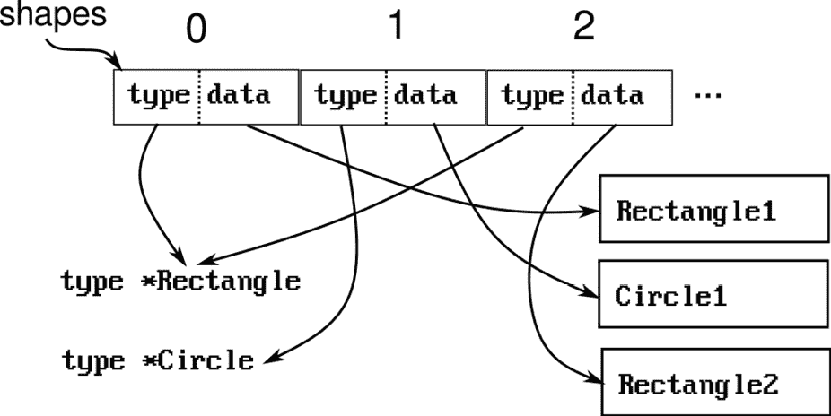

# 处理类型、结构体和接口

Go 是一种强类型语言。这意味着程序中的每个值都必须使用一组预定义的基本类型来定义。类型系统的规则决定了可以对这些值做什么，以及不同类型的值如何交互。Go 的类型系统采用了一种简化的方法；它只允许在不同兼容类型的值之间进行显式转换。

Go 还是一种静态类型语言，这意味着值的类型在编译时被显式声明和检查，而不是在运行时检查。这与 Python 或 JavaScript 这样的脚本语言不同。

在本章中，我们将探讨 Go 类型系统的一些属性，定义新类型、结构体和接口，并考虑如何有效地使用它来实现一些常见模式。

本章包含以下食谱：

+   创建新类型

+   使用组合来扩展类型

+   初始化结构体

+   处理接口

+   工厂模式

+   多态容器

# 创建新类型

您想要定义新类型的原因有很多。其中之一是确保类型安全。类型安全确保操作接收正确的数据类型。类型安全的程序没有类型错误，将程序中的错误限制为仅逻辑错误。

创建新类型的其他原因还包括以下：

+   您可以通过 *嵌入* 来在多个不同类型中共享类型的方法和数据字段。

+   在本章的后面部分，我们将探讨接口。您可以定义一组方法来实现给定的接口，以便在不同的上下文中使用该类型。

# 基于现有类型创建新类型

创建新类型允许您强制执行类型安全规则，并添加类型特定的方法。

## 如何做到...

使用以下语法根据现有类型创建新类型：

`type <NewTypeName> <ExistingTypeName>`

例如，以下声明定义了一个新的数据类型 `Duration`，作为一个无符号 64 位整数：

`type Duration uint64`

这是 Go 标准库定义 `time.Duration` 的方式。要调用 `time.Sleep(d Duration)` 函数，您现在必须使用 `time.Duration` 值，或者显式地将数值值转换为 `time.Duration` 值。

警告

当您从现有类型创建新类型时，即使现有类型已定义了方法，新类型也会创建而没有任何方法。

# 创建类型安全的枚举

在这个食谱中，我们将使用新类型定义一组常量（枚举）。

## 如何做到...

1.  定义新类型：

    ```go
    type Direction int
    ```

1.  使用新类型创建表示枚举值的常量序列。您可以使用 `iota` 为数值常量生成递增的数字：

    ```go
    const (
      DirectionLeft Direction = iota
      DirectionRight
    )
    ```

1.  在期望此新类型的函数或数据元素中使用新类型：

    ```go
    func SetDirection(dir Direction) {...}
    func main() {
      SetDirection(DirectionLeft)
      SetDirection(Direction(0))
      ...
    }
    ```

小贴士

这并不阻止某人调用 `SetDirection(Direction(3))`，这是一个无效的值。这通常只会在从用户输入或第三方来源读取枚举值时成为问题。你应该在那个点验证输入。

# 创建结构体类型

Go 结构体是一系列字段的集合。定义结构体以将相关数据字段分组，形成一个记录。这个菜谱展示了如何在程序中创建新的结构体类型。

## 如何做到这一点...

使用以下语法创建结构体类型：

```go
type NewTypeName struct {
   // List of fields
}
```

例如：

```go
type User struct {
  Username string
  Password string
}
```

# 扩展类型

Go 通过嵌入使用类型组合，并通过使用接口实现结构化类型。让我们首先检查这些意味着什么。

当你将一个现有类型嵌入到另一个类型中时，为嵌入类型定义的方法和数据字段将成为嵌入类型的方法和数据字段。如果你使用过面向对象的语言，这可能会让你觉得类似于类继承，但有一个关键的区别：如果一个类 `A` 从类 `B` 继承，那么 `A` 是 `B` 的一个实例，意味着在需要 `B` 的任何地方，你可以用一个 `A` 的实例来替换。在使用组合的情况下，如果 `A` 嵌入了 `B`，那么 `A` 和 `B` 是不同的类型，你不能在需要 `B` 的地方使用 `A`。

提示

Go 中没有类型继承。Go 选择组合而不是继承。这样做的主要原因是为了简化组合组件以构建更复杂的组件。面向对象语言中继承的大多数用例都可以通过组合、接口和结构化类型重新设计。在这里我故意使用了“*rearchitecting*”这个词：不要试图通过模拟继承来将现有的面向对象程序移植到 Go 中。相反，重新设计和重构它们，以使用组合和接口成为惯用的 Go 程序。

下一个菜谱将探讨如何实现这一点。

## 扩展基类型

首先，我们将看看我们如何扩展一个基类型，以便在新类型中共享其数据元素和方法。

## 如何做到这一点...

假设你有一些在多个数据类型之间共享的数据字段和功能。然后你可以创建一个基数据类型，并将其嵌入到多个其他数据类型中，以共享共同的部分：

```go
type Common struct {
  commonField int
}
func (a Common) CommonMethod() {}
type A struct {
  Common
  aField int
}
func (a A) AMethod() {}
type B struct {
  Common
  bField int
}
func (b B) BMethod() {}
```

在前面的代码片段中，每个结构体的字段和方法如下：

| **类型** | **字段** | **方法** |
| --- | --- | --- |
| Common | commonField | CommonMethod |
| A | commonField, aField | CommonMethod, AMethod |
| B | commonField, bField | CommonMethod, BMethod |

## 它是如何工作的...

在上一节中，我们使用了结构体嵌入来共享常见的数据元素和功能。以下示例展示了两个结构体，`Customer` 和 `Product`，它们共享相同的 `Metadata` 结构体。`Metadata` 包含记录的唯一标识符、创建日期和修改日期：

```go
type Metadata struct {
  ID string
  CreatedAt time.Time
  ModifiedAt time.Time
}
// New initializes metadata fields
func (m *Metadata) New() {
  m.ID=uuid.New().String()
  m.CreatedAt=time.Now()
  m.ModifiedAt=m.CreatedAt
}
// Customer.New() uses the promoted Metadata.New() method.
// Calling Customer.New() will initialize Customer.Metadata, but
// will not modify Customer specific fields.
type Customer struct {
  Metadata
  Name string
}
// Product.New(string) shadows `Metadata.New() method. You cannot
// call `Product.New()`, but call `Product.New(string)` or
// `Product.Metadata.New()`
type Product struct {
  Metadata
  SKU string
}
func (p *Product) New(sku string) {
  // Initialize the metadata part of product
  p.Metadata.New()
  p.SKU=sku
}
func main() {
   c:=Customer{}
   c.New() // Initialize customer metadata
   p:=Product{}
   p.New("sku") // Initialize product metadata and sku
   // p.New() // Compile error: p.New() takes a string argument
}
```

*嵌入不是继承*。嵌入结构体方法的接收者*不是*定义的结构体的副本。在上面的代码片段中，当我们调用 `c.New()` 时，`Metedata.New()` 方法得到的接收者是一个 `*Metadata` 实例，而不是 `*Customer` 实例。

# 初始化结构体

这个配方展示了如何使用结构字面量初始化包含嵌入结构的复杂数据结构。

## 如何实现...

Go 保证所有声明的变量都被初始化为其零值。如果你有一个复杂的数据结构，应该使用默认值或非空指针组件进行初始化，这并不很有用。在这种情况下，使用类似构造函数的函数来创建结构体的新实例。对于类型 `X`，已建立的约定是编写一个 `NewX` 函数，该函数初始化 `X` 或 `*X` 的实例并返回它。

这里，`NewIndex` 创建了一个初始化的 `Index` 类型的新实例：

```go
type Index struct {
   index map[string]any
   name string
}
func NewIndex(name string) *Index {
  return &Index{
    index:make(map[string]any),
    name:name,
  }
}
func (index *Index) Name() string {return index.name}
func (index *Index) Add(key string, value any) {
  index.index[key]=value
}
```

此外，请注意，`Index.name` 和 `Index.index` 字段没有导出。因此，它们只能通过 `Index` 的导出方法访问。这种模式对于防止意外修改数据字段很有用。

# 定义接口

Go 使用“结构化类型”。如果一个类型 `T` 定义了一个接口 `I` 的所有方法，那么 `T` 就实现了 `I`。这导致了一些熟悉使用命名类型语言的开发者（如 Java，其中你必须显式地*命名*组成类型）感到困惑。

Go 的接口仅仅是方法集。当一个数据类型定义了一组方法时，它也会自动实现包含其方法子集的所有接口。例如，如果数据类型 `A` 定义了一个 `func (A) F()` 方法，那么 `A` 也实现了 `interface { func F() }` 和 `interface{}` 接口。如果接口 `A` 是接口 `B` 的子集，那么实现接口 `B` 的数据类型可以在需要 `A` 的任何地方使用。

## 接口作为契约

接口可以用作“规范”，或像“契约”一样定义实现应满足的某些函数。

## 如何实现...

定义一个接口或一组接口以指定对象的预期行为。当预期有多个不同接口的实现时，这很合适。例如，标准库 `database/driver` SQL 驱动程序包定义了一组接口，这些接口应由不同的数据库驱动程序实现。

例如，以下代码片段定义了一个用于存储文件的存储后端：

```go
type Storage interface {
   Create(name string, reader io.Reader) error
   Read(name string) (io.ReadCloser,error)
   Update(name string, reader io.Reader) error
   Delete(name string) error
}
```

你可以使用实现 `Storage` 接口的对象的实例在不同的后端存储数据，例如文件系统或某些网络存储系统。

在许多情况下，用于声明接口方法的类型本身依赖于实际的实现。在这种情况下，需要一个接口系统。标准库 `database/driver` 包使用这种方法。例如，考虑以下认证提供者接口：

```go
// Authenticator uses implementation-specific credentials to create an
// implementation-specific session
type Authenticator interface {
  Login(credentials Credentials) (Session,error)
}
// Credentials contains the credentials to authenticate a user to the 
// backend
type Credentials interface {
  Serialize() []byte
  Type() string
}
// CredentialParse implementation parses backend-specific credentials 
// from []byte input
type CredentialParser interface {
  Parse([]byte) (Credentials, error)
}
// A backend-specific session identifies the user and provides a way 
// to close the session
type Session interface {
  UserID() string
  Close()
}
```

# 工厂

本节展示了常用于支持可扩展结构（如数据库驱动程序）的配方，其中导入特定的数据库驱动程序包会自动将驱动程序“注册”到工厂中。

## 如何实现...

1.  定义一个接口，或一组接口，指定实现应该如何行为。

1.  创建一个注册表（映射）和一个用于注册实现的函数。

1.  每个不同的实现都会使用 `init()` 函数将自己注册到注册表中。

1.  使用 `main` 包导入将包含在程序中的实现。

让我们使用上一节中的 `Authenticator` 示例来实现一个认证框架。我们将允许 `Authenticator` 框架的不同实现。

首先，定义一个工厂接口和一个用于存储所有已注册实现的映射：

```go
package auth
type AuthenticatorFactory interface {
   NewInstance() Authenticator
}
var registry = map[string]AuthenticatorFactory{}
```

然后，声明一个导出的 `Register` 函数：

```go
func RegisterAuthenticator(name string, factory AuthenticatorFactory) {
   registry[name]=factory
}
```

为了动态创建认证器的实例，我们需要一个类似这样的函数：

```go
func NewInstance(authType string) Authenticator {
   // Create a new instance using the selected factory.
   // If the given authType has not been registered, this will panic
   return registry[authType].NewInstance()
}
```

实现可以使用 `init()` 函数注册它们自己的工厂：

```go
type factory struct{}
func (factory) NewInstance() auth.Authenticator {
  // Create and return a new instance of db authenticator
}
func init() {
  auth.RegisterAuthenticator("dbauthenticator",factory{})
}
```

最后，你必须将这些部分拼接在一起。Go 的构建系统只会包含那些被从 `main()` 可访问的代码直接或间接使用过的包，并且实现不会被直接引用。我们必须确保这些包被导入，因此，实现被注册。所以，在 `main` 中导入它们：

```go
package main
import (
  _ "import/path/of/the/implementation"
  ...
)
```

前面的 `import` 语句将包含实现包到程序中。由于该包被包含在程序中，其 `init()` 函数将在程序初始化期间被调用，并且它提供的认证器类型将被注册。

# 在使用它们的地方定义接口

结构化类型允许你在需要使用接口时定义它，而不是预先定义导出的接口。这有时会与“鸭子类型”（如果某物像鸭子走路，像鸭子说话，那么它就是鸭子）混淆。区别在于，鸭子类型是通过在运行时查看类型的结构子集来确定数据类型兼容性的，而结构化类型是指在编译时查看类型的结构。这个配方展示了你可以如何按需定义接口。

## 如何实现...

假设你有一段如下所示的代码：

```go
type A struct {
  ...
  options  map[string]any
}
func (a A) GetOptions() map[string]any {return a.options}
type B struct {
  ...
  options map[string]any
}
func (b B) GetOptions() map[string]any {return b.options}
```

如果你想要编写一个将操作类型 `A` 或 `B`（或任何具有选项的类型）的变量的选项的函数，你可以在那里简单地定义一个接口：

```go
type withOptions interface {
  GetOptions() map[string]any
}
func ProcessOptions(item withOptions) {
  for key, value:=range item.GetOptions() {
    ...
  }
}
```

## 它是如何工作的...

记住，Go 使用结构化类型。因此，你可以创建一个指定了一组方法的接口，任何声明了这些方法的类型将自动实现该接口。因此，你可以随意创建这样的接口，并编写接受这些接口实例的函数来处理可能的大量数据类型。

如果你使用的是命名语言，你将不得不指定那些类型实现了你的接口。但在 Go 中并非如此。

这也意味着，如果你有一个接口`A`和另一个接口`B`，其中`A`声明了与`B`相同的方法，那么任何实现了`A`的类型也实现了`B`。换句话说，如果你不能导入一个接口，因为它在一个如果导入将导致循环依赖的包中，或者如果该接口没有由该包导出，你可以在当前包中简单地定义一个等效的接口。

# 使用函数作为接口

有时，你可能会遇到需要接口时却有一个函数的情况。这个示例展示了如何定义一个新的函数数据类型，它同时也实现了接口。

## 如何实现...

如果你需要实现一个没有数据元素的单一方法接口，你可以基于一个空结构体定义一个新的类型，并为该类型声明一个方法以实现该接口。或者，你也可以简单地使用该函数本身作为该接口的实现。以下摘录来自标准库`net/http`包：

```go
// An interface with a single function
type Handler interface {
     ServeHTTP(ResponseWriter, *Request)
}
// Define a new function type matching the interface method signature
type HandlerFunc func(ResponseWriter, *Request)
// Implement the method for the function type
func (h HandlerFunc) ServeHTTP(w ResponseWriter, r *Request) {
   h(w.r) // Call the underlying function
}
```

在这里，你可以在需要`Handler`接口实现的地方使用`HandlerFunc`类型的函数。

## 它是如何工作的...

Go 的类型系统将函数类型视为任何其他定义的类型。因此，你可以为函数类型声明方法。当你为函数类型声明方法时，该函数类型将自动实现定义了所有或部分这些方法的接口。

让我们通过一个示例来检查这个声明。我们可以声明一个新的空类型作为`Handler`接口的实现：

```go
type MyHandler struct{}
func (MyHandler) ServeHTTP(w ResponseWriter, r *Request) {...}
```

使用这个声明，你可以在需要`Handler`的地方使用`MyHandler`的实例。然而，请注意`MyHandler`没有数据元素，只有一个方法。因此，我们定义了一个函数类型：

`type MyHandler func(ResponseWriter,*Request)`

现在`MyHandler`是一个新的命名类型。这并不比将`MyHandler`声明为结构体有太大的不同，但在这个情况下，`MyHandler`是一个具有固定签名的函数。

由于`MyHandler`是一个命名类型，我们可以为它定义方法：

```go
func (h MyHandler) ServeHTTP(w ResponseWriter, r *Request) {
  h(w,r)
}
```

由于`MyHandler`现在定义了`ServeHTTP`方法，它实现了`Handler`接口。然而，`MyHandler`是一个函数类型，所以`h`实际上是一个具有与`ServeHTTP`相同签名的函数。正因为如此，`h(w,r)`调用才有效，`MyHandler`可以在需要`Handler`的地方使用。

# 在运行时发现数据类型的特性——测试"实现"关系

接口提供了一种调用底层数据对象的方法。如果许多不同的类型实现了相同的接口，你可以通过使用它们的公共接口来简单地使用一个函数来操作不同的数据类型。然而，很多时候，你需要访问接口中存储的底层对象。Go 提供了几种机制来实现这一点。我们将探讨`type-assertion`和`type-switch`。

## 如何做到这一点...

使用接口和类型断言来发现一个类型提供的方法。记住，接口是一组方法。实现接口中给定方法的类型自动实现该接口。

使用以下模式来确定数据类型是否有方法：

```go
func f(rd io.Reader) {
  // Is rd also an io.Writer?
  if wr, ok:= rd.(io.Writer); ok {
     // Yes, rd is an io.Writer, and wr is that writer.
     ...
  }
  // Does rd have a function ReadLine() (string,error)?
  // Define an interface here
  type hasReadLine interface {
     ReadLine() (string,error)
  }
  // And see if rd implements it:
  if readLine, ok:=rd.(hasReadLine); ok {
    // Yes, you can use readLine:
    line, err:=readLine.ReadLine()
    ...
  }
  // You can even define anonymous interfaces inline:
  if readLine, ok:=rd.(interface{ReadLine()(string,error)}); ok {
     line, err:=readLine.ReadLine()
  }
}
```

## 它是如何工作的...

类型断言有两种形式。以下形式测试`intf`接口变量是否包含`concreteValue`类型的具体值：

`value, ok:=intf.(concreteValue)`

如果接口包含该类型的值，那么`value`现在具有该值，并且`ok`变为`true`。

第二种形式测试`intf`接口中包含的具体值是否也实现了`otherIntf`接口：

`value, ok:=intf.(otherIntf)`

如果`intf`中包含的值也具有`otherIntf`声明的那些方法，那么`value`现在是一个包含与`intf`相同具体值的`otherIntf`类型接口值，并且`ok`设置为`true`。

使用这种第二种形式，你可以测试接口变量是否实现了你需要的那些方法。

你可能认为你可以使用反射来做同样的事情。反射是在运行时发现类型字段和方法名称的方法。这不是一个高效或简单的方法来检查这种类型等价性。

# 测试接口值是否是已知类型之一

类型切换用于测试接口值是否是已知的具体类型，或者是否实现了某个接口。这个示例展示了如何使用它。

## 如何做到这一点...

如果需要检查接口与多个类型，请使用类型切换而不是一系列类型断言。

以下示例使用`interface{}`来添加两个值。这两个值可以是`int`，也可以是`float64`。该函数还提供了一种覆盖加法行为的方法：如果值有一个兼容的`Add`方法，它将调用该方法：

```go
// a and b must have the same types. They can be int, float64, or 
// another type
// that has Add method.
func Add(a, b interface{}) interface{} {
  // type switch:
  // In this form, a matching case block will declare aValue
  // with the correct type
  switch aValue:=a.(type) {
    case int:
      // Here, aValue is an int
      // b must be an int!
      bValue:=b.(int)
      return aValue+bValue
    case float64:
      // Here, aValue is a float64
      // b must be a float64!
      bValue:=b.(float64)
      return aValue+bValue
    case interface { Add(interface{}) interface{} }:
      // Here, aValue is an interface {Add{interface{}) interface{}}
      return aValue.Add(b)
    default:
      // Here, aValue is not defined
      // This is an unhandled case
      return nil
  }
}
```

注意类型切换的使用方式，如果匹配，则提取接口中包含的值。这仅在情况列表只有一个类型，并且情况不是`default`情况时才有效。对于这些情况，变量简单地未定义，你只需与接口一起工作。

# 在开发过程中确保类型实现接口

在项目的开发阶段，接口类型可能会快速变化，通过添加新方法，或者通过更改参数类型或返回类型来修改现有方法签名。开发者如何确保那些接口的实现不会被这些更改破坏？

## 如何做到这一点...

假设你的团队定义了以下接口：

```go
type Car interface {
   Move(int,int)
}
```

我们还假设你使用以下结构体实现了该接口：

```go
type RaceCar struct {
   X, Y int
}
func (r *RaceCar) Move(dx, dy int) {
  r.X+=dx
  r.Y+=dy
}
```

然而，在开发后期，结果发现并非所有汽车都能成功移动，因此接口的签名更改为以下：

```go
type Car interface {
   Move(int,int) error
}
```

这个更改后，`RaceCar`不再实现`Car`。很多时候这个错误会在编译时被发现，但并不总是如此。例如，如果`*RaceCar`的实例被传递到需要`any`的函数中，编译将成功，但如果通过类型断言将该参数转换为`Car`或`*RaceCar`，将会引发运行时恐慌：

```go
rc := item.(Car)
```

假设你声明了以下：

```go
var _ Car = &RaceCar{}
```

对`Car`接口的任何修改，如果导致`*RaceCar`不再实现`Car`接口，将会导致编译错误。

所以，一般来说：声明一个接口类型的空变量，并将其分配给具体类型：

```go
type I interface {...}
type Implem struct { ... }
// If something changes in Implem or I that causes Implem
// to no longer implement interface I, this will give a
// compile-time error
var _ I = Implem{}
// Same as above, but this ensures *Implem implements I
var _ I = &Implem{}
```

如果有更改导致类型不再实现该接口，将会引发编译错误。

# 决定是否为方法使用指针接收者或值接收者

在这个菜谱中，我们将探讨如何选择方法使用指针接收者还是值接收者。

## 如何做到这一点...

通常，使用一种类型，而不是两种。这样做有两个原因：

+   代码的一致性。

+   混合值接收者和指针接收者可能导致数据竞争。

如果方法修改接收者对象，请使用指针接收者。如果方法不修改接收者对象，或者如果方法依赖于获取接收者对象的副本，你可以使用值接收者。

如果你正在实现一个不可变类型，在大多数情况下，你应该使用值接收者。

如果你的结构体很大，使用指针接收者可以减少复制开销。你可以找到不同的指南来判断一个结构体是否可以被认为是大的。如果有疑问，编写基准测试并测量。

## 它是如何工作的...

对于类型`T`，如果你使用值接收者声明了一个方法，那么这个方法既适用于`T`也适用于`*T`。该方法获取接收者的副本，而不是指向它的指针，因此对接收者进行的任何修改都不会反映到调用该方法使用的对象上。

例如，以下方法在修改一个字段的同时返回原始对象的副本：

```go
type Action struct {
   Option string
}
// Returns a copy of a with the given option. The original a is not 
// modified.
func (a Action) WithOption(option string) Action {
   a.Option=option
   return a
}
func main() {
   x:=Action{
      Option:"a",
   }
   y:=x.WithOption("b")
   fmt.Println(x.Option, y.Option) // Outputs: a b
}
```

值接收者会创建原始值的浅拷贝。如果接收者结构体包含映射、切片或其他对象的指针，则只会复制映射头、切片头或指针，而不会复制指向的对象内容。这意味着，即使在以下示例中方法获取了一个值接收者，对映射的更改也会反映在原始值和副本中：

```go
type T struct {
  m map[string]int
}
func (t T) add(k string, v int) {
   t.m[k]=v
}
func main() {
  t:=T{
     m:make(map[string]int,
  }
  t.add("a",1)
  fmt.Println(t) // [a:1]
}
```

注意这如何影响切片操作。切片是一个三元组`(pointer, len, cap)`，当你传递值接收者时，这是被复制的：

```go
type T struct {
  s []string
}
func (t T) set(i int, s string) {
  t.s[i]=s
}
func (t T) add(s string) {
  t.s=append(t.s,s)
}
func main() {
  t:=T{
    s: []string{"a","b"},
  }
  fmt.Println(t.s) // [a, b]
  // Setting a slice element contained in the value receiver will be 
  // visible here
  t.set(0,"x")
  fmt.Println(t.s) // [x, b]
  // Appending to the slice contained in the value receiver will not 
  // be visible here
  // The appended slice header is set in the copy of t, the original 
  // never sees that update
  t.add("y")
  fmt.Println(t.s) // [x, b]
}
```

指针接收器更容易处理。方法总是获取它被调用的对象的指针。在先前的例子中，使用指针接收器声明`add`方法的行为符合预期：

```go
func (t *T) add(s string) {
  t.s=append(t.s,s)
}
...
 t.add("y")
 fmt.Println(t.s) // [x, b, y]
```

在本节的开始，我也提到了混合指针和值接收器会导致数据竞争。以下是它发生的方式。

记住，当 goroutine 从另一个 goroutine 正在并发修改的变量中读取时，就会发生数据竞争。考虑以下示例，其中`Version`方法使用值接收器，这会导致创建`T`的一个副本：

```go
type T struct {
  X int
}
func (t T) Version() int  {return 1}
func (t *T) SetValue(x int) {t.X=x}
func main() {
  t:=T{}
  go func () {
     t.SetValue(1) // Writes to t.X
  }()
  ver := t.Version() // Makes a copy of t, which reads t.X
  ...
}
```

调用`t.Version()`的行为会创建变量`t`的一个副本，在它被修改的同时并发读取`t.X`，因此导致竞争。如果`t.Version`明确地从`t.X`读取，这种竞争会更明显。没有保证该读取操作将看到 goroutine 中的写入操作的效果。

# 多态容器

在这个上下文中，容器是一个包含许多对象的数据结构。本节的原则也可以应用于单个对象。换句话说，当你有一个单例多态变量或结构体字段时，你可以使用相同的思想。

## 如何实现...

1.  定义一个包含所有将存储在容器中的数据类型共有方法的接口。

1.  使用该接口声明容器类型。

1.  将实际对象的实例放入容器中。

1.  当从容器中检索对象时，你可以通过接口与对象一起工作，或者进行类型断言，获取实际类型或另一个接口，并使用它。

## 它是如何工作的...

这里有一个简单的例子，它适用于`Shape`对象。`Shape`对象是可以在图像上绘制并移动的东西：

```go
type Shape interface {
  Draw(image.Image)
  Move(dx, dy int)
}
```

`Shape`有几个实现：

```go
type Rectangle struct {
   rect image.Rectangle
   color color.Color
}
func (r *Rectangle) Draw(target image.Image) {...}
func (r *Rectangle) Move(dx, dy int) {...}
type Circle struct {
   center image.Point
   color color.Color
}
func (c *Circle) Draw(target image.Image) {...}
func (c *Circle) Move(dx, dy int) {...}
```

`*Rectangle`和`*Circle`都实现了`Shape`接口（注意`Rectangle`和`Circle`没有实现）。现在我们可以处理一个`Shapes`的切片：

```go
func Draw(target image.Image, shapes []Shape) {
  for _,shape:=range shapes {
    shape.Draw(targeT)
  }
}
```

这就是`shapes`切片的样子：



图 5.1 – 接口变量的切片

由于每个接口都包含对实际形状的指针，因此可以使用该接口调用修改对象的方法：

```go
func Move(dx, dy int, shapes []Shape) {
  for _,shape:=range shapes {
    shape.Move(dx, dy)
  }
}
```

# 通过接口未直接暴露的对象部分

在处理接口时，有许多场合需要访问底层对象。这是通过类型断言实现的，即测试接口值的类型是否满足给定的类型，如果是，则检索它。

## 如何实现...

使用类型断言或类型选择来测试接口中包含的对象的类型：

```go
func f(shape Shape) {
   if rect, ok := shape.(*Rectangle); ok {
      // shape contains a *Rectangle, and rect now points to it
   }
   switch actualShape := shape.(type) {
      case *Circle :
         // shape is a *Circle, and actualShape is a *Circle variable
      case *Rectangle:
         // shape is a *Rectangle, and actualShape is a *Rectangle 
         // variable
      default:
         // shape is not a circle or rectangle. actualShape is not 
         // defined here
   }
}
```

# 从嵌入的结构体访问嵌入的结构体

在像 Java 或 C++这样的面向对象语言中，有抽象方法或虚方法的概念，以及类型继承。这个特性的一个效果是，如果你调用基类`base`的`M`方法，那么在运行时执行的是为运行时实际对象声明的`M`的实现。换句话说，你可以调用将被其他声明覆盖的方法，但你并不知道你实际上调用的是哪个方法。

在 Go 中，有几种做同样事情的方法。这个示例展示了如何做。

## 如何做到这一点...

假设你需要编写一个循环链表数据结构，其元素将包含一个基结构体的结构体：

```go
type ListNodeHeader struct {
  next Node
  prev Node
  list *List
}
```

列表本身如下所示：

```go
type List struct {
  first Node
}
```

因此，列表指向`first`节点，这是一个列表中的任意节点，每个节点都指向下一个节点，最后一个节点指向第一个节点。

我们需要一个定义维护列表机制的`Node`接口。当然，`Node`接口将由`ListNodeHeader`实现，因此，由列表的所有节点实现：

```go
type Node interface {
  ...
}
```

列表的用户应该嵌入`ListHeader`以实现一个`list`节点：

```go
type ByteSliceElement struct {
  ListNodeHeader
  Payload []byte
}
type StringElement struct {
  ListNodeHeader
  Payload string
}
```

现在困难的部分是实现`Node`接口。假设你想要在这个列表中插入一个`ByteSliceElement`。由于`ByteSliceElement`嵌入`ListNodeHeader`，它具有所有的方法，因此实现了`Node`。然而，我们无法编写例如`Insert`方法为`ListNodeHeader`，除非我们知道实际被插入的对象。

实现这一点的其中一种方式是使用以下模式：

```go
type Node interface {
   Insert(list *List, this Node)
   getHeader() *ListNodeHeader
}
func (header *ListNodeHeader) getHeader() *ListNodeHeader {return header}
func (header *ListNodeHeader) Insert(list *List,this Node) {
   // If list is empty, this is the only node
   if list.first == nil {
      list.first = this
      header.next = this
      header.prev = this
      return
   }
   header.next=list.first
   header.prev=list.first.getHeader().prev
   header.prev.getHeader().next=this
   header.next.getHeader().prev=this
}
```

这里有几个事情在进行。首先，`Insert`方法获取要插入的节点的两个视图。如果被插入的节点是`*ByteSliceElement`，那么它获取这个节点的`Node`版本，然后它还获取嵌入在`ByteSliceElement`中的`*ListNodeHeader`作为接收者。使用这个，它可以调整`ByteSliceElement`的成员以指向前一个和下一个节点。

然而，它不能访问`Node`的`prev`和`next`成员。

一个选项是如下所示：在`Node`接口中声明一个未导出的方法，该方法将从给定的节点返回`ListNodeHeader`。另一个选项是向接口中添加`getNext/setNext`和`getPrev/setPrev`方法。

现在你已经实现了两件事：首先，任何在这个包外使用这个列表结构的用户*必须*嵌入`ListNodeHeader`以实现一个列表节点。接口中有一个未导出的方法。没有在其他包中实现这样一个接口的方法。唯一的方法是嵌入一个已经实现了它的结构体。

其次，你有一个多态的容器数据结构，其机制由一个基结构体管理。

# 检查接口是否为 nil

你可能会想知道这甚至是一个问题。毕竟，你不是只是比较 nil 吗？并不总是这样。

接口包含两个值：接口中包含的值的类型，以及指向该值的指针。如果这两个值都是 nil，则接口为 nil。存在一些情况，接口可能指向一个非 nil 类型的 nil 值，这使得接口非 nil。

你无法轻松检查这种情况。你必须避免创建包含 nil 值的接口。

## 如何做到这一点...

避免将指针转换为可能为 nil 的变量：

```go
type myerror struct{}
func (myerror) Error() string { return "" }
func main() {
   var x *myerror
   var y error
   y = x // Avoid this
   if y!=nil {
      // y is not nil!
   }
}
```

而应显式检查 nil 接口值，例如以下内容：

```go
var y error
if x!=nil {
   y=x
}
```

或者，使用值错误而不是指针。以下代码完全避免了这个问题：

`var x myerror`

`x`不可能为 nil。

## 它是如何工作的...

如我之前解释的，接口包含两个值：类型和值。你试图避免的是创建一个包含 nil 值且类型非 nil 的接口。

在接下来的声明之后，`y`接口为 nil，因为它的类型和值都是 nil：

`var y error`

在以下赋值之后，存储在`y`中的类型现在是`x`的类型，而值是 nil。因此，`y`不再为 nil：

`y=x`

这也适用于从函数返回：

```go
func f() error {
     var x *myerror
     return x
}
```

`f`函数从不返回 nil。
