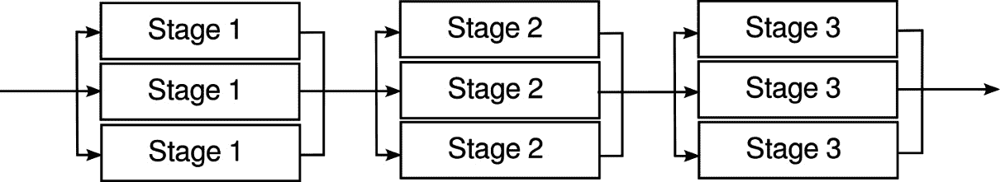
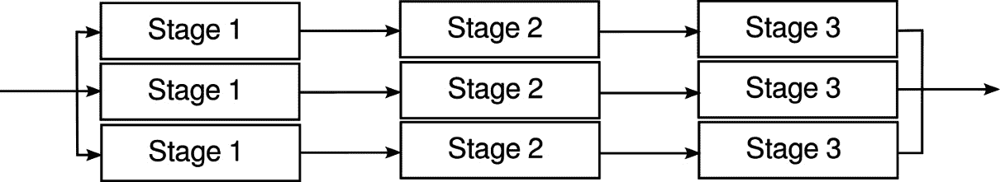

# 处理大量数据

你可以通过几种方式利用 Go 并发原语有效地处理大量数据。与线程不同，goroutines 可以创建而不需要太多开销。在程序中拥有数千个 goroutines 是很常见的。考虑到这一点，我们将探讨一些处理大量数据并发的常见模式。

本章包括以下食谱：

+   工作者池

+   连接池

+   管道

+   处理大量结果集

# 工作者池

假设你有很多数据元素（例如，图像文件），并且你想将相同的逻辑应用于每个元素。你可以编写一个处理输入实例的函数，然后在`for`循环中调用此函数。这样的程序将顺序处理输入元素，如果每个元素处理需要`t`秒，所有输入最终将在`n.t`秒内完成，其中`n`是输入的数量。

如果你想通过使用并发编程来提高吞吐量，你可以创建一个工作者 goroutine 池。你可以将下一个输入提供给空闲的工作者池成员，在处理过程中，你可以将后续输入分配给另一个成员。如果你有`p`个逻辑处理器（可以是物理处理器的核心）并行运行，结果可以在`n.t/p`秒内可用（这是一个理论上的上限，因为并行进程之间的负载分布并不总是完美的，而且还有同步和通信开销）。

接下来，我们将探讨两种实现工作者池的不同方法。

## 有限工作者池

如果每个工作者的初始化成本不高（例如，加载文件或建立网络连接可能成本较高），那么最好根据需要创建工作者，并限制工作者的数量。

### 如何做...

为每个输入创建一个新的 goroutine。使用通道作为同步计数器以限制最大工作者数量（在此，通道用作*信号量*）。如果需要，使用输出通道收集结果：

```go
// Establish a maximum pool size
const maxPoolSize = 100
func main() {
    // 1\. Initialization
    // Receive outputs from the pool via outputCh
    outputCh := make(chan Output)
    // A semaphore to limit the pool size
    sem := make(chan struct{}, maxPoolSize)
    // 2\. Read outputs
    // Reader goroutine reads results until outputCh is closed
    readerWg := sync.WaitGroup{}
    readerWg.Add(1)
    go func() {
        defer readerWg.Done()
        for result := range outputCh {
            // process result
            fmt.Println(result)
        }
    }()
    // 3\. Processing loop
    // Create the workers as needed, but the number of active workers
    // are limited by the capacity of sem
    wg := sync.WaitGroup{}
    // This loop sends the inputs to workers, creating them as 
    // necessary
    for {
        nextInput, done := getNextInput()
        if done {
            break
        }
        wg.Add(1)
        // This will block if there are too many goroutines
        sem <- struct{}{}
        go func(inp Input) {
            defer wg.Done()
            defer func() {
                <-sem
            }()
            outputCh <- doWork(inp)
        }(nextInput)
    }
    // 4\. Wait until processing is complete
    // This goroutine waits until all worker pool goroutines are done, 
    // then closes the output channel
    go func() {
        // Wait until processing is complete
        wg.Wait()
        // Close the output channel so the reader goroutine can 
        // terminate
        close(outputCh)
    }()
    // Wait until the output channel is closed
    readerWg.Wait()
    // If we are here, all goroutines are done
}
```

### 它是如何工作的...

1.  首先是初始化。我们创建两个通道：

    +   `outputCh`：工作者池的输出。每个工作者将结果写入此通道。

    +   `sem`：将用于限制活动工作者数量的信号量通道。它具有`maxPoolSize`容量。当我们启动新的工作者 goroutine 时，我们向此通道发送一个元素。只要`sem`通道中的元素少于`maxPoolSize`，发送操作就不会阻塞。当一个工作者 goroutine 完成时，它从通道接收一个元素，释放容量。由于此通道具有`maxPoolSize`容量，如果正在运行`maxPoolSize`个工作者，则发送操作将阻塞，直到 goroutine 结束并从通道接收。

1.  在开始处理之前关闭`outputCh`，这样就可以在将所有输入发送到工作者之前读取结果。由于工作者的数量有限，创建`maxPoolSize`个工作者后，工作者将阻塞，因此我们必须在创建工作者池之前开始监听输出。

1.  `wg` WaitGroup，稍后将用于等待工作者完成。在创建新工作者之前，我们向信号量通道发送一个元素。如果有`maxPoolSize`个工作者在运行，这将阻塞，直到其中之一终止。工作者处理输入，将输出写入`outputCh`并终止，从信号量接收一个元素。

1.  此 goroutine 等待跟踪工作者的 WaitGroup。当所有工作者都完成后，输出通道被关闭。这也标志着在*步骤 2*中创建的读取 WaitGroup。

1.  等待输出处理完成。程序必须等待所有输出都生成。这只有在`outputCh`关闭（在#4 发生）之后，然后释放`readerWg`才会发生。

## 固定大小的工作者池

如果创建工作者是一个昂贵的操作，固定大小的工作者池是有意义的。只需创建从公共输入通道读取的最大数量的工作者。此输入通道负责在可用的工作者之间分配工作。

### 如何做...

有几种方法可以实现这一点。我们将查看两种。

在以下函数中，使用`poolSize`个工作者创建了一个固定大小的工作者池。所有工作者都从相同的输入通道读取，并将输出写入相同的输出通道。此程序使用一个读取 goroutine 从工作者池收集结果，同时在调用者的同一个 goroutine 中提供输入：

```go
const poolSize = 50
func workerPoolWithConcurrentReader() {
    // 1\. Initialization
    // Send inputs to the pool via inputCh
    inputCh := make(chan Input)
    // Receive outputs from the pool via outputCh
    outputCh := make(chan Output)
    // 2\. Create the pool of workers
    wg := sync.WaitGroup{}
    for i := 0; i < poolSize; i++ {
        wg.Add(1)
        go func() {
            defer wg.Done()
            for work := range inputCh {
                outputCh <- doWork(work)
            }
        }()
    }
    // 3.a Reader goroutine
    // Reader goroutine reads results until outputCh is closed
    readerWg := sync.WaitGroup{}
    readerWg.Add(1)
    go func() {
        defer readerWg.Done()
        for result := range outputCh {
            // process result
            fmt.Println(result)
        }
    }()
    // 4\. Wait workers
    // This goroutine waits until all worker pool goroutines are done, 
    // then closes the output channel
    go func() {
        // Wait until processing is complete
        wg.Wait()
        // Close the output channel so the reader goroutine can 
        // terminate
        close(outputCh)
    }()
    // 5.a Send inputs
    // This loop sends the inputs to the worker pool
    for {
        nextInput, done := getNextInput()
        if done {
            break
        }
        inputCh <- nextInput
    }
    // Close the input channel, so worker pool goroutines terminate
    close(inputCh)
    // Wait until the output channel is closed
    readerWg.Wait()
    // If we are here, all goroutines are done
}
```

以下版本使用 goroutine 将工作提交给工作者池，同时在调用者的同一个 goroutine 中读取结果：

```go
func workerPoolWithConcurrentWriter() {
    // 1\. Initialization
    // Send inputs to the pool via inputCh
    inputCh := make(chan Input)
    // Receive outputs from the pool via outputCh
    outputCh := make(chan Output)
    // 2\. Create the pool of workers
    wg := sync.WaitGroup{}
    for i := 0; i < poolSize; i++ {
        wg.Add(1)
        go func() {
            defer wg.Done()
            for work := range inputCh {
                outputCh <- doWork(work)
            }
        }()
    }
    // 3.b Writer goroutine
    // Writer goroutine submits work to the worker pool
    go func() {
        for {
            nextInput, done := getNextInput()
            if done {
                break
            }
            inputCh <- nextInput
        }
        // Close the input channel, so worker pool goroutines 
        // terminate
        close(inputCh)
    }()
    // 4\. Wait workers
    // This goroutine waits until all worker pool goroutines are done, 
    // then closes the output channel
    go func() {
        // Wait until processing is complete
        wg.Wait()
        // Close the output channel so the reader goroutine can 
        // terminate
        close(outputCh)
    }()
    // 5.b Read results
    // Read results until outputCh is closed
    for result := range outputCh {
        // process result
        fmt.Println(result)
    }
}
```

### 它是如何工作的...

1.  首先是初始化。我们创建两个通道：

    +   `inputCh`：这是工作者池的输入。池中的每个工作者都在`for-range`循环中从相同的`inputCh`读取，因此当工作者收到输入时，它停止监听通道，允许另一个工作者拾取下一个输入。

    +   `outputCh`：这是工作者池的输出。所有工作者在完成时都将输出写入此通道。

1.  创建工作者池：由于这是一个固定大小的池，我们可以通过简单的 for-loop 创建工作者。需要一个`WaitGroup`，这样我们就可以等待处理完成。每个工作者从`inputCh`读取，直到它关闭，处理输入，并将输出写入`outputCh`。

该算法的其余部分对于两个示例是不同的。让我们先看看第一个案例：

1.  `outputCh`已关闭。当`outputCh`关闭时，`readerWg`被信号。

1.  当`inputCh`关闭时)，它关闭了`outputCh`。

1.  此 `for` 循环将输入发送到 `inputCh`，然后关闭 `inputCh`。这将在工作线程完成其工作后导致所有工作线程终止。当所有工作线程终止时，由 #4 处创建的 goroutine 将关闭 `outputCh`。当输出处理完成时，`readerWg` 被通知，从而终止计算。

接下来，让我们看看第二种情况：

1.  逐个读取 `inputCh`，当所有输入都发送完毕后，关闭 `inputCh`，这将导致工作线程池终止。

1.  **等待工作线程**：这些工作与前面的情况相同。

1.  `for` 循环从 `outputCh` 读取结果，直到其关闭。当所有工作线程完成时，`outputCh` 将被关闭。

## 连接池

连接池在处理稀缺资源的多个用户时非常有用，例如网络连接或数据库连接，因为建立该资源的实例可能成本高昂。使用一对通道，您可以实现一个高效的线程安全连接池。

### 如何实现...

创建一个具有 `PoolSize` 容量的连接池类型：

+   `available` 保留已建立但返回到池中的连接

+   `total` 保留连接总数，即 `available` 的数量加上正在积极使用的连接数量。

要从池中获取连接，检查 `available` 通道。如果有一个可用，则返回它。否则，检查 `total` 连接池，如果未超过限制，则创建一个新的连接。

使用此池的用户在完成使用后应通过将连接发送到 `available` 通道将连接返回到池中。

以下代码片段展示了这样一个连接池：

```go
type ConnectionPool struct {
    // This channel keeps connections returned to the pool
    available chan net.Conn
    // This channel counts the total number of connection active
    total     chan struct{}
}
func NewConnectionPool(poolSize int) *ConnectionPool {
  return &ConnectionPool {
    available: make(chan net.Conn,poolSize),
    total: make(chan struct{}, poolSize),
 }
}
func (pool *ConnectionPool) GetConnection() (net.Conn, error) {
    select {
    // If there are connections available in the pool, return one
    case conn := <-pool.available:
        fmt.Printf("Returning an idle connection.\n")
        return conn, nil
    default:
        // No connections are available
        select {
        case conn := <-pool.available:
            fmt.Printf("Returning an idle connection.\n")
            return conn, nil
        case pool.total <- struct{}{}: // Wait until pool is not full
            fmt.Println("Creating a new connection")
            // Create a new connection
            conn, err := net.Dial("tcp", "localhost:2000")
            if err != nil {
                return nil, err
            }
            return conn, nil
        }
    }
}
func (pool *ConnectionPool) Release(conn net.Conn) {
    pool.available <- conn
    fmt.Printf("Releasing a connection. \n")
}
func (pool *ConnectionPool) Close(conn net.Conn) {
    fmt.Println("Closing connection")
    conn.Close()
    <-pool.total
}
```

### 它是如何工作的...

1.  使用 `PoolSize` 初始化连接池：

    ```go
    pool := NewConnectionPool(PoolSize)
    ```

1.  这将创建两个通道，容量均为 `PoolSize`。`available` 通道将保留所有返回到池中的连接，而 `total` 将保留已建立的连接数。

1.  要获取新的连接，请使用以下方法：

    ```go
    conn, err := pool.GetConnection()
    ```

    `GetConnection` 的这种实现说明了如何建立通道优先级。如果 `available` 通道中有可用空闲连接，`GetConnection` 将返回一个空闲连接。否则，它将进入 `default` 情况，在那里它将创建一个新的连接或使用返回到 `available` 通道的连接。

    注意`GetConnection`中嵌套`select`语句的模式。这是实现通道之间优先级的常见模式。如果有可用的连接，则`case conn := <-pool.available`将被选择，并且连接将从可用的连接通道中移除。然而，如果在第一次`select`语句运行时没有可用的连接，则执行`default`情况，这将执行`conn:=<-pool.available`和`pool.total<-struct{}{}`情况之间的`select`。如果第一个情况变得可用（这发生在其他 goroutine 将连接返回到池中时），该连接将被返回给调用者。如果第二个情况变得可用（这发生在连接关闭，从而从`pool.total`中移除一个元素时），将创建一个新的连接并返回给调用者。

1.  当池的客户端完成连接时，它应该调用以下操作：

    ```go
    pool.Release(conn)
    ```

1.  这会将连接添加到`available`通道。

    如果连接变得无响应，客户端可以将其关闭。当这种情况发生时，池应该被通知，`total`应该递减，但连接不应添加到`available`。这是通过以下操作完成的：

    ```go
    pool.Close(conn)
    ```

# 管道

当你在输入上执行多个操作阶段时，你可以构建一个管道。goroutines 和 channels 可以用来构建具有不同结构的具有高吞吐量的处理管道。

## 没有扇出/扇入的简单管道

可以通过使用 channels 连接在各自 goroutine 中运行的每个阶段来构建一个简单的管道。管道的结构看起来像*图 10**.1*。


图 10.1：简单的异步管道

### 如何做到这一点...

此管道使用单独的错误通道来报告处理错误。我们使用自定义错误类型来捕获诊断信息：

```go
type PipelineError struct {
    // The stage in which error happened
    Stage   int
    // The payload
    Payload any
    // The actual error
    Err     error
}
```

每个阶段都实现为一个函数，该函数创建一个新的 goroutine。该 goroutine 从输入通道读取输入数据，并将输出写入输出通道：

```go
func Stage1(input <-chan InputPayload, errCh chan<- error) <-chan Stage2Payload {
    // 1\. Create the output channel for this stage.
    // This will be the input for the next stage
    output := make(chan Stage2Payload)
    // 2\. Create processing goroutine
    go func() {
        // 3\. Close the output channel when done
        defer close(output)
        // 4\. Process all inputs until input channel is closed
        for in := range input {
            // 5\. Process data
            err := processData(in.Id)
            // 6\. Send errors to the error channel
            if err != nil {
                errCh <- PipelineError{
                    Stage:   1,
                    Payload: in,
                    Err:     err,
                }
                continue
            }
            // 7\. Send the output to the next stage
            output <- Stage2Payload{
                Id: in.Id,
            }
        }
    }()
    return output
}
```

阶段 2 和 3 使用相同的模式实现。

管道按照以下方式组合：

```go
func main() {
    // 1\. Create the input and error channels
    errCh := make(chan error)
    inputCh := make(chan InputPayload)
    // 2\. Prepare the pipeline by attaching stages
    outputCh := Stage3(Stage2(Stage1(inputCh, errCh), errCh), errCh)
    // 3\. Feed input asynchronously
    go func() {
        defer close(inputCh)
        for i := 0; i < 1000; i++ {
            inputCh <- InputPayload{
                Id: i,
            }
        }
    }()
    // 4\. Listen to the error channel asynchronously
    go func() {
        for err := range errCh {
            fmt.Println(err)
        }
    }()
    // 5\. Read outputs
    for out := range outputCh {
        fmt.Println(out)
    }
    // 6\. Close the error channel
    close(errCh)
}
```

对于每个阶段，遵循以下步骤：

1.  为阶段创建输出通道。这将被传递到下一个阶段作为`input`通道。

1.  处理 goroutine 在阶段函数返回后继续运行。

1.  确保在处理 goroutine 终止时关闭此阶段的输出通道。

1.  从上一个阶段读取输入，直到输入通道关闭。

1.  处理输入。

1.  如果发生错误，将错误发送到错误通道。不会生成任何输出。

1.  将输出发送到下一个阶段。

警告

每个阶段都在自己的 goroutine 中运行。这意味着一旦你将有效负载传递到下一个阶段，就不应该在当前阶段访问该有效负载。如果有效负载包含指针，或者有效负载本身就是一个指针，可能会发生数据竞争。

管道设置如下：

1.  创建输入通道和错误通道。

    将阶段附加到管道中。阶段 `n` 的输出成为阶段 `n+1` 的输入。最后一个阶段的输出成为 `output` 通道。

1.  异步将输入发送到输入通道。当所有输入都发送后，关闭输入通道。这将终止第一个阶段，关闭其输出通道，该输出通道也是阶段 2 的输入通道。这个过程一直持续到所有阶段退出。

1.  启动一个 goroutine 来监听和记录错误。

1.  收集输出。

1.  关闭错误通道，以便错误收集 goroutine 终止。

## 以工人池作为阶段的管道

之前的例子为每个阶段使用了一个工作者。您可以通过将每个阶段替换为工作池来提高管道的吞吐量。结果管道如图 *图 10**.2* 所示。



图 10.2：作为阶段的工人池的管道

### 如何操作...

每个阶段现在创建多个 goroutine，所有 goroutine 都从相同的输入通道读取（扇出）。每个工作者的输出写入一个公共输出通道（扇入），它成为下一阶段的输入。由于现在有多个 goroutine 写入该输出通道，因此我们不能再在关闭输入通道时关闭阶段输出通道。相反，我们使用一个 wait group 和一个第二个 goroutine 在所有处理 goroutine 终止时关闭输出：

```go
func Stage1(input <-chan InputPayload, errCh chan<- error, nInstances int) <-chan Stage2Payload {
    // 1\. Create the common output channel
    output := make(chan Stage2Payload)
    // 2\. Close the output channel when all the processing is done
    wg := sync.WaitGroup{}
    // 3\. Create nInstances goroutines
    for i := 0; i < nInstances; i++ {
        wg.Add(1)
        go func() {
            defer wg.Done()
            // Process all inputs
            for in := range input {
                // Process data
                err := processData(in.Id)
                if err != nil {
                    errCh <- PipelineError{
                        Stage:   1,
                        Payload: in,
                        Err:     err,
                    }
                    continue
                }
                //Send output to the common output channel
                output <- Stage2Payload{
                    Id: in.Id,
                }
            }
        }()
    }
    // 4\. Another goroutine waits until all workers are done, and 
    //closes the output channel
    go func() {
        wg.Wait()
        close(output)
    }()
    return output
}
```

管道构建与上一个案例相同：

```go
func main() {
    errCh := make(chan error)
    inputCh := make(chan InputPayload)
    nInstances := 5
    // Prepare the pipeline by attaching stages
    outputCh := Stage3(Stage2(Stage1(inputCh, errCh, nInstances), 
    errCh, nInstances), errCh, nInstances)
    // Feed input asynchronously
    go func() {
        defer close(inputCh)
        for i := 0; i < 1000; i++ {
            inputCh <- InputPayload{
                Id: i,
            }
        }
    }()
    // Listen to the error channel asynchronously
    go func() {
        for err := range errCh {
            fmt.Println(err)
        }
    }()
    // Read outputs
    for out := range outputCh {
        fmt.Println(out)
    }
    // Close the error channel
    close(errCh)
}
```

### 它是如何工作的...

对于每个阶段，遵循以下步骤：

1.  创建输出通道，它将成为下一阶段的输入通道。

    在 for-range 循环中，有多个 goroutine 从相同的输入通道读取，因此当输入通道关闭时，所有这些 goroutine 都将终止。然而，我们不能使用 `defer close` 关闭输出通道，因为这会导致输出通道多次关闭（这将引发 panic）。因此，我们使用 `WaitGroup` 来跟踪工作者 goroutine。一个单独的 goroutine 等待该 wait group，当所有 goroutine 终止时，它关闭输出通道。

1.  创建 `nInstances` 个 goroutine，它们都从相同的输入通道读取，并将输出写入输出通道。在发生错误的情况下，工作者将错误发送到错误通道。

1.  这是等待工作者 goroutine 完成的 goroutine。当它们完成时，它关闭输出通道。

管道设置与上一节相同，不同之处在于初始化时还会将工作池大小发送到阶段函数。

## 具有扇出和扇入的管道

在此设置中，阶段通过专用通道依次连接，如图 *图 10**.3* 所示：



图 10.3：具有扇出和扇入的管道

### 如何操作...

每个管道阶段从给定的输入通道读取，并写入输出通道，如下所示：

```go
func Stage1(input <-chan InputPayload, errCh chan<- error) <-chan Stage2Payload {
    output := make(chan Stage2Payload)
    go func() {
        defer close(output)
        // Process all inputs
        for in := range input {
            // Process data
            err := processData(in.Id)
            if err != nil {
                errCh <- PipelineError{
                    Stage:   1,
                    Payload: in,
                    Err:     err,
                }
                continue
            }
            output <- Stage2Payload{
                Id: in.Id,
            }
        }
    }()
    return output
}
```

一个独立的`fanIn`函数接收一个输出通道列表，并使用监听每个通道的 goroutine 将它们合并：

```go
func fanIn(inputs []<-chan OutputPayload) <-chan OutputPayload {
    result := make(chan OutputPayload)
    // Listen to input channels in separate goroutines
    inputWg := sync.WaitGroup{}
    for inputIndex := range inputs {
        inputWg.Add(1)
        go func(index int) {
            defer inputWg.Done()
            for data := range inputs[index] {
                // Send the data to the output
                result <- data
            }
        }(inputIndex)
    }
    // When all input channels are closed, close the fan in ch
    go func() {
        inputWg.Wait()
        close(result)
    }()
    return result
}
```

管道是通过将每个阶段的输出组合到下一个阶段输入中，在 for 循环中设置的。生成的输出通道都导向`fanIn`函数：

```go
func main() {
    errCh := make(chan error)
    inputCh := make(chan InputPayload)
    poolSize := 5
    outputs := make([]<-chan OutputPayload, 0)
    // All Stage1 goroutines listen to a single input channel
    for i := 0; i < poolSize; i++ {
        outputCh1 := Stage1(inputCh, errCh)
        outputCh2 := Stage2(outputCh1, errCh)
        outputCh3 := Stage3(outputCh2, errCh)
        outputs = append(outputs, outputCh3)
    }
    outputCh := fanIn(outputs)
    // Feed input asynchronously
    go func() {
        defer close(inputCh)
        for i := 0; i < 1000; i++ {
            inputCh <- InputPayload{
                Id: i,
            }
        }
    }()
    // Listen to the error channel asynchronously
    go func() {
        for err := range errCh {
            fmt.Println(err)
        }
    }()
    // Read outputs
    for out := range outputCh {
        fmt.Println(out)
    }
    // Close the error channel
    close(errCh)
}
```

### 它是如何工作的...

工作阶段与简单的管道情况相同。fan-in 阶段的工作方式如下。

对于每个输出通道，fan-in 函数创建一个 goroutine，该 goroutine 从该输出通道读取数据并将其写入一个公共通道。这个公共通道成为管道的合并输出通道。fan-in 函数创建另一个 goroutine，该 goroutine 等待一个`wait`组，该组跟踪所有 goroutine。当它们都完成时，这个 goroutine 关闭输出通道。

`main`通过连接每个阶段的输出到下一个阶段的输入来构建管道。最后一个阶段的输出通道被存储在一个切片中，并传递给 fan-in 函数。fan-in 函数的输出通道成为管道的合并输出。

注意，所有这些管道变体都使用一个单独的错误通道。另一种方法是存储任何错误在有效负载中，并将其传递到下一个阶段。如果传入的有效负载有一个非 nil 的错误，所有阶段都会将其传递到下一个阶段，因此有效负载可以在管道的末尾记录为错误：

```go
type Stage2Paylaod struct {
   // Payload data
   Err error
}
func Stage2(input <-chan Stage2Payload) <-chan Stage3Payload {
    output := make(chan Stage2Payload)
    go func() {
        defer close(output)
        // Process all inputs
        for in := range input {
            // If there is error, pass it
            if in.Err!=nil {
               output <- StagerPayload {
                  Err: in.Err,
               }
               continue
             }
             ...
```

还要注意，除了简单的管道情况外，它们还以无序的方式返回结果，因为任何给定时刻有多个输入通过管道，并且无法保证它们到达输出的顺序。

# 处理大型结果集

当处理可能很大的结果集时，可能并不总是可行将所有数据加载到内存中并对其进行处理。你可能需要以受控的方式流式传输数据元素。本节展示了如何使用并发原语处理此类情况。

## 使用 goroutine 进行流式结果

在此用例中，一个 goroutine 通过通道发送查询结果。可以使用上下文来取消流式 goroutine。

### 如何做到这一点...

创建一个包含数据元素和错误信息的结构体：

```go
type Result struct {
  Err error
  // Other data elements
}
```

`StreamResults`函数运行数据库查询并创建一个 goroutine，该 goroutine 迭代查询结果。goroutine 通过通道发送每个结果：

```go
func StreamResults(
    ctx context.Context,
    db *sql.DB,
    query string,
    args ...any,
) (<-chan Result, error) {
    rows, err := db.QueryContext(ctx, query, args...)
    if err != nil {
        return nil, err
    }
    output := make(chan Result)
    go func() {
        defer rows.Close()
        defer close(output)
        var result Result
        for rows.Next() {
            // Check context cancellation
            if result.Err = ctx.Err(); result.Err != nil {
                // Context canceled. return
                output <- result
                return
            }
            // Set result fields
            result.Err = buildResult(rows, &result)
            output <- result
        }
        // If there was an error, return it
        if result.Err = rows.Err(); result.Err != nil {
            output <- result
        }
    }()
    return output, nil
}
```

如下使用流式结果：

```go
// Setup a cancelable context
cancelableCtx, cancel := context.WithCancel(ctx)
defer cancel()
// Call the streaming API
results, err := StreamResults(cancelableCtx,db,"SELECT EMAIL FROM USERS")
if err!=nil {
  return err
}
// Collect and process results
for result:=range results {
   if result.Err!=nil {
      // Handle error in the result
      continue
    }
    // Process the result
    if err:=ProcessResult(result); err!=nil {
      // Processing error. Cancel streaming results
      cancel()
      // Expect to receive at least one more message from the channel,
      // because the streaming gorutine sends the error
      for range results {}
    }
}
```

### 它是如何工作的...

尽管我们查看了一个数据库查询示例，但这种模式在处理任何生成大量数据的函数时都很有用。而不是将所有数据加载到内存中，这种模式一次加载和处理一个数据项。

`StreamResults`生成函数启动一个 goroutine 闭包，该闭包捕获生成结果所需的环境和附加信息（在这种情况下，一个`sql.Rows`实例）。生成函数创建一个通道并立即返回。goroutine 收集结果并将它们发送到通道。当所有结果都处理完毕或检测到错误时，通道被关闭。

现在轮到调用者与 goroutine 进行通信。调用者从通道中收集结果，直到通道关闭，并逐个处理它们。调用者还会检查接收到的消息中的错误字段，以处理 goroutine 检测到的任何错误。

此方案使用可取消的上下文。当上下文被取消时，goroutine 在关闭通道之前通过通道发送另一条消息，因此如果发生上下文取消，调用者必须清空通道。
