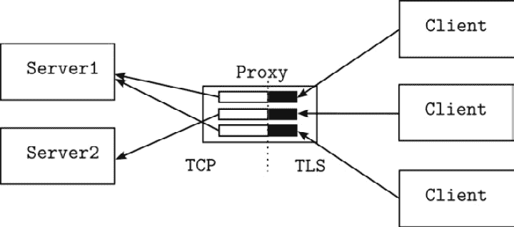

# 网络编程

网络编程是应用程序开发者的一项关键技能。关于这个主题的广泛论述将是一项艰巨的任务，因此我们将探讨您在工作中可能会遇到的一些精选示例。需要记住的一个重要观点是，网络编程是创建应用程序漏洞的主要手段。网络程序本质上也是并发的，这使得正确和安全的网络编程特别困难。因此，本节将包括一些考虑安全和可扩展性的示例。

本章包含以下示例：

+   编写 TCP 服务器

+   编写 TCP 客户端

+   编写基于行的 TCP 服务器

+   使用 TCP 连接发送/接收文件

+   编写 TLS 客户端/服务器

+   用于 TLS 终止和负载均衡的 TCP 代理

+   设置读写截止日期

+   解除阻塞的读写操作

+   编写 UDP 客户端/服务器

+   发送 HTTP 调用

+   运行 HTTP 服务器

+   设置 TLS 服务器以使用 HTTPS

+   编写 HTTP 处理器

+   在文件系统上提供静态文件

+   处理 HTML 表单

+   编写用于下载大文件的处理器

+   将 HTTP 上传文件和表单作为流处理

# TCP 网络

**传输控制协议**（**TCP**）是一种面向连接的协议，它提供了以下保证：

+   **可靠性**：发送者将知道预期的接收者是否已收到数据

+   **顺序**：消息将以发送的顺序接收

+   **错误检查**：消息将在传输过程中受到保护，防止损坏

由于这些保证，TCP 相对容易处理。它是许多高级协议（如 HTTP 和 WebSockets）的基础。在本节中，我们将探讨一些示例，展示如何编写 TCP 服务器和客户端。

# 编写 TCP 服务器

TCP 服务器是一个监听网络端口连接请求的程序。一旦与客户端建立连接，客户端和服务器之间的通信将通过 `net.Conn` 对象进行。服务器可以继续监听新的连接。这样，单个服务器就可以与多个客户端通信。

## 如何做到...

1.  选择一个将连接到客户端服务器的端口号。

    这通常是一个应用程序配置问题。前 1,024 (`0` 到 `1023`) 个端口通常需要服务器程序具有 root 权限。这些端口中的大多数都保留给了知名的服务器程序，例如端口 22 用于 ssh，或端口 80 用于 HTTP。端口 1024 及以上是临时端口。只要没有其他程序监听，您的服务器程序可以使用 1,024 及以上的任何端口号，而无需额外的权限。

    使用端口号 0 让内核选择一个随机未使用的端口。您可以创建一个监听端口 `0` 的监听器，然后查询监听器以找出所选的端口号。

1.  创建一个监听器。监听器是一种绑定 `address:port` 的机制。一旦使用端口号创建了一个监听器，同一主机或同一容器上的其他进程就无法使用该端口号来监听网络流量。

    下面的程序片段显示了如何创建监听器：

    ```go
    // The address:port to listen. If none given, use :0 to select 
    // port randomly
    addr:=":8080"
    // Create a TCP listener
    listener, err := net.Listen("tcp", addr)
    if err != nil {
      panic(err)
    }
    // Print out the address we are listening
    fmt.Println("Listening on ", listener.Addr())
    defer listener.Close()
    ```

    程序首先确定要监听的网络地址。地址的确切格式取决于选择的协议，在这个例子中是 TCP。如果没有提供主机名或 IP 地址，监听器将监听本地系统上所有可用的单播 IP 地址。如果你提供了一个主机名或 IP 地址，监听器将只监听来自给定 IP 地址的流量。这意味着如果你提供了 `localhost:1234`，监听器将只监听来自 `localhost` 的流量。它不会监听外部流量。

    上述示例打印 `listener.Addr()`。如果你提供 `:0` 作为监听地址，或者根本不提供地址，这将很有用。在这种情况下，监听器将监听一个随机端口，`listener.Addr()` 将返回客户端可以连接到的地址。

1.  监听并接受连接。使用 `Listener.Accept()` 接受传入的连接。这通常在一个循环中完成，如下所示：

    ```go
    // Listen to incoming TCP connections
    for {
      // Accept a connection
      conn, err := listener.Accept()
      if err != nil {
        fmt.Println(err)
        return
      }
      // Handle the connection in its own goroutine
      go handleConnection(conn)
    }
    ```

    在这个例子中，如果监听器被关闭，`listener.Accept` 调用将失败并返回错误。

1.  在自己的 goroutine 中处理连接。这样，监听器将继续接受连接，同时服务器在其自己的 goroutine 中与连接的客户端通信，使用为这些客户端创建的特定连接。

    简单回声服务器的连接处理器可以编写如下：

    ```go
    func handleConnection(conn net.Conn) {
      io.Copy(conn,conn)
    }
    This program will write everything it reads from the connection back to the connection, forming an echo service. When the client terminates the connection, the read operation will return `io.EOF`, terminating the copy operation.
    ```

## 它是如何工作的...

`net.Conn` 接口既有 `Read([]byte) (int,error)` 方法（这使得它成为一个 `io.Reader`），也有 `Write([]byte) (int,error)` 方法（这也使得它成为一个 `io.Writer`）。正因为如此，从连接中读取的任何内容都会被写回连接。

你可能会注意到，由于 `io.Copy`，读取的每个字节都会被写回连接，所以这不是一个基于行的协议。

# 编写 TCP 客户端

TCP 客户端连接到一个在某个主机端口上监听的 TCP 服务器。一旦建立连接，通信是双向的。换句话说，服务器和客户端的区别在于连接是如何建立的。当我们说“服务器”时，我们指的是等待监听端口的程序，当我们说“客户端”时，我们指的是连接到正在被服务器监听的主机端口的程序。一旦建立连接，双方将异步发送和接收数据。TCP 保证消息将以发送的顺序接收，并且消息不会丢失，但无法保证消息将在何时被对方接收。

## 如何实现...

1.  客户端必须知道服务器地址和端口号。这应该由环境（命令行、配置等）提供。

1.  使用`net.Dial`创建到服务器的连接：

    ```go
         conn, err := net.Dial("tcp", addr)
         if err != nil {
          // Handle error
         }
    ```

1.  使用返回的`net.Conn`对象向服务器发送数据，或从服务器接收数据：

    ```go
       // Send a line of text
       text := []byte("Hello echo server!")
       conn.Write(text)
       // Read the response
       response := make([]byte, len(text))
       conn.Read(response)
       fmt.Println(string(response))
    ```

1.  完成后关闭连接：

    ```go
    conn.Close()
    ```

这里是完整的程序：

```go
var address = flag.String("a", ":8008", "Server address")
func main() {
     flag.Parse()
     conn, err := net.Dial("tcp", *address)
     if err != nil {
          panic(err)
     }
     // Send a line of text
     text := []byte("Hello echo server!")
     conn.Write(text)
     // Read the response
     response := make([]byte, len(text))
     conn.Read(response)
     fmt.Println(string(response))
     conn.Close()
}
```

此示例演示了与服务器之间的请求-响应类型交互。这并不一定是始终如此。网络连接提供了`io.Writer`和`io.Reader`接口，并且它们可以并发使用。

# 编写基于行的 TCP 服务器

在这个菜谱中，我们将查看一个使用行而不是字节而不是字节的 TCP 服务器。在从网络连接读取行时，有一些需要注意的点，特别是与服务器安全相关。仅仅因为你在期待读取行，并不意味着客户端会发送格式良好的行。

## 如何做到这一点...

1.  使用与上一节中给出的相同结构来设置服务器。

1.  在连接处理程序中，使用`bufio.Reader`或`bufio.Scanner`读取行。

1.  使用`io.LimitedReader`包装连接以限制行长度。

让我们看看这是如何工作的。以下示例展示了如何实现连接处理程序：

```go
// Limit line length to 1KiB.
const MaxLineLength = 1024
func handleConnection(conn net.Conn) error {
  defer conn.Close()
  // Wrap the connection with a limited reader
  // to prevent the client from sending unbounded
  // amount of data
  limiter := &io.LimitedReader {
    R: conn,
    N: MaxLineLength+1, // Read one extra byte to detect long lines
  }
  reader := bufio.NewReader(limiter)
  for {
    bytes, err := reader.ReadBytes(byte('\n'))
    if err != nil {
      if err != io.EOF {
        // Some error other than end-of-stream
        return err
      }
      // End of stream. It could be because the line is too long
      if limiter.N==0 {
        // Line was too long
        return fmt.Errorf("Received a line that is too long")
      }
      // End of stream
      return nil
    }
    // Reset the limiter, so the next line can be read with
    // newlimit
    limiter.N=MaxLineLength+1
    // Process the line: send it back to client
    if _, err := conn.Write(bytes); err != nil {
      return err
    }
  }
}
```

连接处理例程首先将连接包装在`io.LimitedReader`中。这是必要的，以防止`reader.ReadBytes`在没有看到换行符的情况下读取无限量的数据。如果没有这个，恶意客户端可以发送大量数据而没有换行符，消耗所有服务器内存。对行长度设置硬限制可以防止这种攻击向量。读取每一行后，我们将`limiter.N`重置为其原始值，以便使用相同的限制读取下一行。请注意，限制器被设置为读取一个额外的字节。这是因为`io.LimitedReader`对于合法的`EOF`（意味着客户端断开连接）和超出限制的读取都返回`io.EOF`。如果读取器超出限制，这意味着最后读取的行至少比限制多一个字节，这使我们能够决定这是一条无效的行。

# 使用 TCP 连接发送/接收文件

通过 TCP 连接发送和接收文件演示了网络编程的几个重要点，即协议设计（处理何时发送什么）和编码（处理数据元素如何在线路上表示）。此示例将展示如何在 TCP 连接上传输元数据和八位字节流。

## 如何做到这一点...

1.  使用与上一节相同的结构来设置服务器。

1.  在发送端（客户端）执行以下操作：

    +   编码包含文件名、大小和模式的文件元数据并发送。

    +   发送文件内容。

    +   关闭连接。

1.  在接收端（服务器）执行以下操作：

    +   解码文件元数据。创建一个文件以存储接收到的文件内容，并使用给定的模式。

    +   接收文件内容并写入文件。

    +   在所有文件内容接收完毕后，关闭文件。

第一部分是传输关于文件的元数据。有几种方法可以实现这一点：你可以使用基于文本的编码方案，如键值对或 JSON，但这类方案的问题是它们不是固定长度的。一个简单、有效且可移植的编码方案是使用 `encoding/binary` 包的二进制编码。这并不能解决文件名的编码问题，因为文件名不是一个固定大小的字符串。因此，我们在文件元数据中包含文件名的长度，并使用恰好必要的字节数来编码文件名。

固定大小的 `fileMetadata` 结构如下：

```go
type fileMetadata struct {
     Size    uint64
     Mode    uint32
     NameLen uint16
}
```

这种结构在所有平台上都是 14 字节（8 字节的 `Size`，4 字节的 `Mode` 和 2 字节的 `NameLen`）。使用 `binary/encoding.Write`，你可以使用 `binary.BigEndian` 或 `binary.LittleEndian` 编码在网络上编码这个固定大小的结构，接收端将成功解码它。

关于字节序的更详细信息将在下一章中介绍。

客户端的其余部分如下：

```go
var address = flag.String("a", ":8008", "Server address")
var file = flag.String("file", "", "File to send")
func main() {
     flag.Parse()
     // Open the file
     file, err := os.Open(*file)
     if err != nil {
          panic(err)
     }
     // Connect the receiver
     conn, err := net.Dial("tcp", *address)
     if err != nil {
          panic(err)
     }
     // Encode file metadata
     fileInfo, err := file.Stat()
     if err != nil {
          panic(err)
     }
     md := fileMetadata{
          Size:    uint64(fileInfo.Size()),
          Mode:    uint32(fileInfo.Mode()),
          NameLen: uint16(len(fileInfo.Name())),
     }
     if err := binary.Write(conn, binary.LittleEndian, md); err != nil {
          panic(err)
     }
     // The file name
     if _, err := conn.Write([]byte(fileInfo.Name())); err != nil {
          panic(err)
     }
     // The file contents
     if _, err := io.Copy(conn, file); err != nil {
          panic(err)
     }
     conn.Close()
}
```

注意使用 `io.Copy` 来传输文件的实际内容。使用 `io.Copy`，你可以将任意大小的文件传输给接收者，而不会消耗大量的内存。

现在让我们看看服务器（接收者）：

```go
func handleConnection(conn net.Conn) {
     defer conn.Close()
     // Read the file metadata
     var meta fileMetadata
     err := binary.Read(conn, binary.LittleEndian, &meta)
     if err != nil {
          fmt.Println(err)
          return
     }
     // Do not allow file names that are too long
     if meta.NameLen > 255 {
          fmt.Println("File name too long")
          return
     }
     // Read the file name
     name := make([]byte, meta.NameLen)
     _, err = io.ReadFull(conn, name)
     if err != nil {
          fmt.Println(err)
          return
     }
     path:=filepath.Join("downloads",string(name))
     // Create the file
     file, err := os.OpenFile(
          path,
          os.O_CREATE|os.O_WRONLY,
          os.FileMode(meta.Mode),
     )
     if err != nil {
          fmt.Println(err)
          return
     }
     defer file.Close()
     // Copy the file contents
     _, err = io.CopyN(file, conn, int64(meta.Size))
     if err != nil {
          // Remove file in case of error
             os.Remove(path)
             fmt.Println(err)
             return
     }
     fmt.Printf("Received file %s: %d bytes\n", string(name), meta.
     Size)
}
```

首个操作是读取文件元数据的固定大小读取操作。然后我们读取文件名。注意在读取文件名之前的文件名长度检查。这是验证和限制所有涉及从外部系统或用户读取的大小内存分配的重要防御方法。在这里，我们拒绝长度超过 255 字节的文件名。然后，我们使用给定的模式创建文件，并使用 `io.CopyN` 从输入中读取确切的文件大小字节。如果发生错误，我们将删除部分下载的文件。

# 编写 TLS 客户端/服务器

**传输层安全性**（**TLS**）提供端到端加密，同时不泄露加密密钥以防止中间人攻击。它还提供对等方的身份验证和消息完整性保证。本食谱展示了如何设置 TLS 服务器以保护网络通信。然而，首先，关于公钥加密的一些话可能是有用的。

密码学 **密钥对** 包含一个私钥和一个公钥。私钥是保密的，公钥是公开的。

这就是密钥对如何用于加密消息：由于一方的公钥是公开的，任何人都可以创建一条消息并使用该公钥加密它，然后将其发送给拥有私钥的一方。只有私钥的所有者才能解密该消息。这也意味着，如果私钥被泄露，拥有该私钥的任何人都可以监听此类消息。

这就是如何使用密钥对来确保消息完整性：私钥的所有者可以使用其私钥创建一个消息的签名（散列）。任何拥有公钥的人都可以验证消息的完整性，也就是说，公钥可以用来验证签名是否由相应的私钥生成。

公钥以**数字证书**的形式分发。数字证书是一个文件，包含由受信任的第三方、**证书颁发机构**（CA）签名的实体的公钥。有许多知名的 CA 会将其公钥作为证书（根证书）发布，这些根证书通常包含在大多数现代操作系统中，因此当你获得一个证书时，你可以使用签发该证书的 CA 的公钥来验证其真实性。一旦验证公钥是真实的，你就可以将公钥的所有者（拥有相应的私钥）连接起来，并建立一个安全通道。

CA 的根证书通常由 CA 本身签名。

如果你需要为内部服务器创建证书，你通常通过创建一个自签名的根 CA 来为你的环境创建一个 CA。你将那个 CA 的私钥保密，并在内部发布公钥。有一些自动化工具可以帮助你为服务器创建 CA 和证书。

## 如何操作...

下面是如何设置 TLS 服务器和客户端的步骤：

1.  为你的服务器创建或购买一个 X.509 证书。如果服务器不是面向互联网的服务器，自签名证书通常就足够了。如果是面向互联网的服务器，你必须从 CA 组织之一获取证书，或者发布你自己的公钥证书，以便想要连接到你的服务器的客户端可以使用该证书进行身份验证和加密流量。

1.  对于服务器，请执行以下操作：

    +   使用`crypto/tls.LoadX509KeyPair`加载证书。

    +   使用证书创建一个`crypto/tls.Config`。

    +   使用`crypto/tls.Listen`创建一个监听器。

    +   服务器其余部分遵循相同的 TCP 服务器布局。

以下代码段说明了这些步骤：

```go
var (
   address     = flag.String(
     "a", ":4433", "Address to listen")
   certificate = flag.String(
     "c", "../server.crt", "Certificate file")
   key         = flag.String(
     "k", "../privatekey.pem", "Private key")
)
func main() {
   flag.Parse()
   // 2.1 Load the key pair
   cer, err := tls.LoadX509KeyPair(*certificate, *key)
   if err != nil {
        panic(err)
   }
   // 2.2 Create TLS configuration for the listener
   config := &tls.Config{
        Certificates: []tls.Certificate{cer},
   }
   // 2.3 Create the listener
   listener, err := tls.Listen("tcp", *address, config)
   if err != nil {
        panic(err)
        return
   }
   defer listener.Close()
   fmt.Println("Listening TLS on ", listener.Addr())
   // 2.4 Listen to incoming TCP connections
   for {
        conn, err := listener.Accept()
        if err != nil {
             fmt.Println(err)
             return
        }
        go handleConnection(conn)
   }
}
```

注意，设置服务器需要证书和私钥。一旦 TLS 监听器设置完成，其余的代码与未加密的 TCP 服务器相同。

对于客户端，请按照以下步骤操作：

1.  如果你使用的是知名 CA 的证书，请使用`crypto/x509.SystemCertPool`。如果你有自签名证书或其他自定义证书，请使用`crypto/x509.NewCertPool`创建一个空的证书池。

1.  加载服务器证书，并将其添加到证书池中。

1.  使用使用证书池初始化的 TLS 配置的`crypto/tls.Dial`。

1.  客户端其余部分遵循这里描述的相同的 TCP 客户端布局。

以下代码段展示了这些步骤：

```go
var (
     addr     = flag.String(
       "addr", "", "Server address")
     certFile = flag.String(
       "cert", "../server.crt", "TLS certificate file")
)
func main() {
     flag.Parse()
     // 3.1 Create new certificate pool
     roots := x509.NewCertPool()
     // 3.2 Load server certificate
     certData, err := os.ReadFile(*certFile)
     if err != nil {
          panic(err)
     }
     ok := roots.AppendCertsFromPEM(certData)
     if !ok {
          panic("failed to parse root certificate")
     }
     // 3.3 Connect the server
     conn, err := tls.Dial("tcp", *addr, &tls.Config{
          RootCAs: roots,
     })
     if err != nil {
          panic(err)
     }
     // 3.4 Send a line of text
     text := []byte("Hello echo server!")
     conn.Write(text)
     // Read the response
     response := make([]byte, len(text))
     conn.Read(response)
     fmt.Println(string(response))
     conn.Close()
}
```

再次强调，只有在服务器证书由操作系统未识别的 CA 签名时，才需要加载证书并将其添加到证书池中。许多使用 HTTPS 的网站都由知名的 CA 签名，这就是为什么您可以在不安装自定义证书的情况下连接到它们：操作系统已经信任该 CA。

注意

在本书的 GitHub 页面下有这个示例（[`github.com/PacktPublishing/Go-Recipes-for-Developers/tree/main/src/chp13`](https://github.com/PacktPublishing/Go-Recipes-for-Developers/tree/main/src/chp13))。

# 用于 TLS 终止和负载均衡的 TCP 代理

大多数面向互联网的应用程序都使用反向代理（入口）来将内部资源与外部世界分开。反向代理通常通过外部客户端使用加密连接（TLS）连接，并通过未加密的通道（*图 11.1*）或使用内部 CA 重新加密连接将请求转发到后端服务。反向代理通常还执行某种形式的负载均衡，以均匀分配工作。



图 13.1 – 带有轮询负载均衡和 TLS 终止的 TLS 代理

在本节中，我们将探讨这样一个反向代理，它接受来自外部主机的 TLS 流量，并使用未加密的 TCP 将流量转发到后端服务器，同时以轮询方式将这些请求分配给服务器。

作为 Go 开发者，您不太可能编写自己的反向代理或负载均衡器，因为已经有很多选项可供选择。然而，这是一个有趣的应用，我在这里包括它，以展示如何在 Go 中完成类似的事情，特别是代理本身。

## 如何操作...

在这里，我们假设代理已获得可用后端服务器的列表。很多时候，您需要使用特定平台的发现机制来找出可用的服务器：

1.  使用代理主机的证书和密钥创建一个面向外部的 TLS 接收器。

1.  监听传入的 TLS 连接。

1.  当客户端连接时，选择一个后端服务器并连接。

1.  启动一个代理 goroutine，将来自外部主机的所有流量转发到后端服务器，并将来自后端服务器的流量转发到外部主机。

1.  当其中一个连接关闭时，终止代理。

以下程序说明了这些步骤：

```go
var (
     tlsAddress      = flag.String(
       "a", ":4433", "TLS address to listen")
     serverAddresses = flag.String(
       "s", ":8080", "Server addresses, comma separated")
     certificate     = flag.String(
       "c", "../server.crt", "Certificate file")
     key             = flag.String(
       "k", "../privatekey.pem", "Private key")
)
func main() {
     flag.Parse()
     // 1\. Create external facing TLS receiver
     // Load the key pair
     cer, err := tls.LoadX509KeyPair(*certificate, *key)
     if err != nil {
          panic(err)
     }
     // Create TLS configuration for the listener
     config := &tls.Config{
          Certificates: []tls.Certificate{cer},
     }
     // Create the tls listener
     tlsListener, err := tls.Listen("tcp", *tlsAddress, config)
     if err != nil {
          panic(err)
     }
     defer tlsListener.Close()
     fmt.Println("Listening TLS on ", tlsListener.Addr())
     // Listen to incoming TLS connections
     servers := strings.Split(*serverAddresses, ",")
     fmt.Println("Forwarding to servers: ", servers)
     nextServer := 0
     for {
          // 2\. Listen to incoming TLS connections
          conn, err := tlsListener.Accept()
          if err != nil {
               fmt.Println(err)
               return
          }
          retries := 0
          for {
               // 3\. Select the next server
               server := servers[nextServer]
               nextServer++
               if nextServer >= len(servers) {
                    nextServer = 0
               }
               // Start a connection to this server
               targetConn, err := net.Dial("tcp", server)
               if err != nil {
                    retries++
                    fmt.Errorf("Cannot connect to %s", server)
                    if retries > len(servers) {
                         panic("None of the servers are available")
                    }
                    continue
               }
               // 4\. Start the proxy
               go handleProxy(conn, targetConn)
          }
     }
}
```

我们已经在之前的菜谱中介绍了设置 TLS 接收器的详细情况，所以让我们看看后端服务器是如何选择的。这个实现提供了一个所有可用后端服务器的列表。每个接受的客户端连接都被分配到列表中的下一个服务器，由`nextServer`索引指向。代理使用`net.Dial`连接选定的服务器，如果连接失败（服务器可能暂时不可用），它将跳转到列表中的下一个服务器。如果这失败了`len(servers)`次，那么所有后端服务器都不可用，程序将终止。然而，如果选择了一个服务器，将启动代理，并且主 goroutine 返回监听新的连接。

让我们看看代理处理器的编写方式：

```go
func handleProxy(conn, targetConn net.Conn) {
     defer conn.Close()
     defer targetConn.Close()
     // Copy data from the client to the server
     go io.Copy(targetConn, conn)
     // Copy data from the server to the client
     io.Copy(conn, targetConn)
}
```

如前所述，网络连接包含两个并发流，一个从客户端主机到服务器，另一个从服务器到客户端主机。这两个流可以同时包含正在传输的数据。因此，代理 TCP 连接涉及两个`io.Copy`操作，一个从服务器到客户端，另一个从客户端到服务器。此外，至少有一个操作必须在单独的 goroutine 中运行。在前面的示例中，来自外部连接到后端服务器的流量在一个单独的 goroutine 中复制，来自后端服务器到外部主机的流量在代理 goroutine 中复制。如果任一方关闭连接，复制操作将终止，这将导致最后一个复制操作终止，并关闭另一个连接。

# 设置读写截止时间

如果您不想无限期地等待连接的主机发送数据，或者等待连接的主机接收您发送的数据，您必须设置一个截止时间。

## 如何操作...

根据您的特定协议，您可以设置读写截止时间，您可以选择为单个 I/O 操作设置这些截止时间，或者全局设置：

1.  在操作之前设置截止时间：

    ```go
    conn.SetDeadline(time.Now().Add(timeoutSeconds * timeSecond))
    if n, err:=conn.Read(data); err!=nil {
      if errors.Is(err, os.ErrDeadlineExceeded) {
        // Deadline exceeded.
      } else {
        // Some other error
      }
    }
    ```

1.  如果您将在截止时间超过后继续使用连接，您必须重置截止时间：

    ```go
    conn.SetDeadline(time.Time{})
    ```

或者，设置一个未来的时间的新截止时间。

# 解锁阻塞的读写操作

有时，您可能需要根据外部事件解锁一个读写操作。这个菜谱展示了您如何解锁这样的 I/O 操作。

## 如何操作...

+   如果您无意再次重用连接，只想解锁 I/O 操作，则异步关闭连接：

    ```go
    cancel:=make(chan struct{})
    done:=make(chan struct{})
    // Close the connection if a message is sent to cancel channel
    go func() {
       select {
          case <-cancel:
             conn.Close()
          case <-done:
       }
    }()
    go handleConnection(conn)
    ```

+   如果您想解锁 I/O 操作但不终止它，将截止时间设置为现在：

    ```go
    unblock:=make(chan struct{})
    // Unblock the connection if a message is sent to unblock channel
    go func() {
      <-unblock
      conn.SetDeadline(time.Now())
    }()
    timedout:=false
    if n, err:=conn.Read(data); err!=nil {
       if errors.Is(err,os.ErrDeadlineExceeded) {
          // Reset connection deadline
          conn.SetDeadline(time.Time{})
          timedout=true
          // continue using the connection
       } else {
          // Handle error
       }
    }
    if timedout {
      // Read timedout
    } else {
      // Read did not timeout
    }
    ```

## 它是如何工作的...

TCP 读取操作会阻塞，直到有可读内容，这只有在从对等方接收到数据时才会发生。TCP 写入操作将在发送方无法再缓冲更多数据时阻塞。前面的菜谱展示了两种您可以解锁这些调用的方法。

关闭连接会在等待数据到达或等待写入数据时因连接关闭而阻塞读写操作，并返回一个错误。关闭连接会丢弃所有未读或未写的数据，并销毁为该连接分配的所有资源。

异步设置超时将为等待操作设置一个截止日期，当该截止日期通过时，操作失败但连接保持打开。你可以重置截止日期并重试操作。

# 编写 UDP 客户端/服务器

与 TCP 不同，UDP 是无连接的。这意味着你不需要与另一个对等方建立连接并来回发送数据，你只需发送数据包并接收它们。没有交付或排序保证。

UDP 的一个显著用途是**域名服务**（**DNS**）协议。UDP 也是许多流式协议（如 IP 语音、视频流等）的选择，在这些协议中，偶尔的数据包丢失是可以容忍的。网络监控工具也更倾向于使用 UDP。

尽管 UDP 是无连接的，但 UDP 网络 API 提供了与 TCP 网络 API 类似的接口。在这里，我们将展示一个简单的客户端-服务器 UDP 回显服务器，以演示如何使用这些 API。

## 如何做到这一点...

以下步骤展示了如何编写 UDP 服务器：

1.  使用`net.ResolveUDPAddr`解析服务器将监听的 UDP 地址：

    ```go
      addr, err := net.ResolveUDPAddr("udp4", *address)
      if err != nil {
        panic(err)
      }
    ```

1.  创建一个 UDP 监听器：

    ```go
      // Create a UDP connection
      conn, err := net.ListenUDP("udp4", addr)
      if err != nil {
        panic(err)
      }
      defer conn.Close()
    ```

    即使`net.ListenUDP`返回一个`*net.UDPConn`，返回的对象更像是一个监听器而不是一个连接。UDP 是无连接的，所以这个调用开始在给定地址上监听 UDP 数据包。客户端实际上并没有*连接*服务器并启动双向流；他们只是发送一个数据包。这就是为什么在下一步中，读取操作也会返回发送者的地址，以便可以发送响应。

1.  从监听器读取。这将返回对等方的远程地址：

    ```go
      // Listen to incoming UDP connections
      buf := make([]byte, 1024)
      n, remoteAddr, err := conn.ReadFromUDP(buf)
      if err != nil {
        // Handle the error
      }
      fmt.Printf("Received %d bytes from %s\n", n, remoteAddr)
    ```

1.  使用上一步获得的地址向对等方发送响应：

    ```go
      if n > 0 {
        _, err := conn.WriteToUDP(buf[:n], remoteAddr)
        if err != nil {
          // Handle the error
        }
      }
    ```

现在让我们看看 UDP 客户端：

1.  解析服务器的地址：

    ```go
      addr, err := net.ResolveUDPAddr("udp4", *serverAddress)
      if err != nil {
        panic(err)
      }
    ```

1.  创建一个 UDP 连接。这需要一个本地地址和一个远程地址。如果本地地址为 nil，则自动选择本地地址。如果远程地址为 nil，则假定是本地系统：

    ```go
      // Create a UDP connection, local address chosen randomly
      conn, err := net.DialUDP("udp4", nil, addr)
      if err != nil {
        panic(err)
      }
      fmt.Printf("UDP server %s\n", conn.RemoteAddr())
      defer conn.Close()
    ```

    再次，UDP 是无连接的。前面的`DialUDP`调用创建了一个将在后续调用中使用的套接字。它不会创建到服务器的连接。

1.  使用`conn.Write`向服务器发送数据：

    ```go
      // Send a line of text
      text := []byte("Hello echo server!")
      n, err := conn.Write(text)
      if err != nil {
        panic(err)
      }
      fmt.Printf("Written %d bytes\n", n)
    ```

1.  使用`conn.Read`从服务器读取数据：

    ```go
      // Read the response
      response := make([]byte, 1024)
      conn.ReadFromUDP(response)
    ```

# 与 HTTP 一起工作

HTTP 是一种客户端-服务器协议，其中客户端（用户代理或代理）向服务器发送请求，服务器返回响应。它是一种应用层超文本协议，是万维网的基础。

# 进行 HTTP 调用

Go 标准库提供了两种基本方式来发出 HTTP 调用以与网站和 Web 服务交互：如果你不需要配置超时、传输属性或重定向策略，只需使用共享客户端。如果你需要做额外的配置，使用`http.Client`。这个食谱演示了两种方法。

## 如何做到这一点...

+   标准库包含一个共享的 HTTP 客户端。你可以使用它来使用默认配置与 Web 服务器交互：

    ```go
    response, err := http.Get("http://example.com")
    if err!=nil {
      // Handle error
    }
    // Always close response body
    defer response.Body.Close()
    if response.StatusCode/100==2 {
      // HTTP 2xx, call was successful.
      // Work with response.Body
    }
    ```

+   如果你需要应用不同的超时值，更改重定向策略，或配置传输，创建一个新的`http.Client`，初始化它，并使用它：

    ```go
    client:=http.Client{
      // Set a timeout for all outgoing calls.
      // If the call does not complete within 30 seconds, timeout.
      Timeout: 30*time.Second,
    }
    response, err:=client.Get("http://example.com")
    if err!=nil {
      // handle error
    }
    // Always close response body
    defer response.Body.Close()
    ```

+   如果操作系统已经拥有该网站证书的 CA 证书，你可以使用 HTTPS（使用 TLS）来调用网站。这在互联网上大多数公共网站上都是这种情况：

    ```go
    response, err := http.Get("https://example.com")
    ```

+   如果你使用的是自定义 CA 的 TLS，或者如果你使用的是自签名证书，你必须创建一个包含证书的`http.Client`的`Transport`。

    +   创建一个新的证书池：

        ```go
        roots := x509.NewCertPool()
        ```

    +   加载服务器证书：

        ```go
        certData, err := os.ReadFile(*certFile)
        if err != nil {
          panic(err)
        }
        ```

    +   将证书添加到证书池中：

        ```go
        ok := roots.AppendCertsFromPEM(certData)
        if !ok {
          panic("failed to parse root certificate")
        }
        ```

    +   创建一个 TLS 配置：

        ```go
        config:=tls.Config{
          RootCAs: roots,
        }
        ```

    +   使用 TLS 配置创建一个 HTTP 传输：

        ```go
        transport := &http.Transport {
          TLSClientConfig: &config,
        }
        ```

    +   创建 HTTP 客户端：

        ```go
        client:= &http.Client{
          Transport: transport,
        }
        ```

    +   使用客户端：

        ```go
        resp, err:=client.Get(url)
        if err!=nil {
          // Handle error
        }
        defer resp.Body.Close()
        ```

小贴士

完成与响应体的工作后，始终关闭它，并尝试读取身体中所有可用的数据。`response.Body`代表到服务器的流连接。只要传输中有数据，服务器就会保留连接的资源，并且客户端保持连接打开。它还防止客户端重用 keep-alive 连接。

# 运行 HTTP 服务器

标准 Go 库提供了一个具有合理默认值的 HTTP 服务器，你可以直接使用，类似于 HTTP 客户端的实现方式。如果你需要配置传输特定设置、超时等，则可以创建一个新的`http.Server`并与之一起工作。本节描述了这两种方法。

## 如何做到这一点...

+   创建一个`http.Handler`来处理 HTTP 请求：

    ```go
    func myHandler(w http.ResponseWriter, req *http.Request) {
      if req.Method == http.MethodGet {
        // Handle an HTTP GET request
      }
      ...
    }
    ```

+   调用`http.ListenAndServe`：

    ```go
    err:=http.ListenAndServe(":8080",http.HandlerFunc(myHandler))
    log.Fatal(err)
    ```

+   `ListenAndServe`函数要么因为设置网络监听器时出错（例如，如果地址已被占用）而立即返回，要么成功开始监听。当服务器异步关闭（通过调用`server.Close()`或`server.Shutdown()`）时，它返回`ErrServerClosed`。

+   或者，你可以使用`http.Server`结构体来更好地控制服务器选项：

    +   按照描述创建一个`http.Handler`。

    +   初始化一个`http.Server`实例：

        ```go
        server := http.Server {
          // The address to listen
          Addr: ":8080",
          // The handler function
          Handler: http.HandlerFunc(myHandler),
          // The handlers must read the request within 10 seconds
          ReadTimeout: 10*time.Second,
          // The headers of a request must be read within 5 seconds
          ReadHeaderTimeout: 5*time.Second,
        }
        ```

    +   监听 HTTP 请求：

        ```go
        err:=server.ListenAndServe()
        log.Fatal(err)
        ```

小贴士

创建 HTTP 处理器的常见方法是使用请求多路复用器。关于使用请求多路复用器的食谱将在稍后介绍。

# HTTPS – 设置 TLS 服务器

要启动 TLS 服务器，你需要一个证书和一个私钥。你可以从 CA 购买一个，或者使用你的内部 CA 生成自己的证书。一旦你有了证书，你就可以使用本节中的食谱来启动你的 HTTPS 服务器。

## 如何做到这一点...

要创建 TLS HTTP 服务器，可以使用以下方法之一：

1.  使用证书和密钥文件调用 `Server.ListenAndServeTLS` 方法：

    ```go
    server := http.Server {
       Addr: ":4443",
       Handler: handler,
    }
    server.ListenAndServeTLS("cert.pem", "key.pem")
    ```

1.  要使用默认 HTTP 服务器，设置处理程序函数（或 `http.Handler`）并调用 `http.ListenAndServeTLS`：

    ```go
    http.HandleFunc("/",func(w http.ResponseWriter, req *http.Request) {
      // Handle request
    })
    http.ListenAndServeTLS("cert.pem", "key.pem")
    ```

1.  或者准备一个带有证书的 `http.Transport`：

    3.1 加载 TLS 证书：

    ```go
    cert, err := tls.LoadX509KeyPair("cert.pem", "key.pem")
    if err!=nil {
      panic(err)
    }
    ```

    3.2 使用证书创建一个 `tls.Config`：

    ```go
    tlsConfig := &tls.Config{
      Certificates: []tls.Certificate{cert},
    }
    ```

    3.3 使用 `tlsConfig` 创建一个 `http.Server`：

    ```go
    server := http.Server{
      Addr:      ":4443",
      Handler:   handler,
      TLSConfig: tlsConfig,
    }
    ```

    3.4 调用 `server.ListenAndServeTLS`

    ```go
    server.ListenAndServeTLS("","")
    ```

# 编写 HTTP 处理程序

当 HTTP 请求到达服务器时，服务器会查看 HTTP 方法（GET、POST 等）、客户端使用的域名（`Host` 标头）和 URL，以决定如何处理请求。确定哪个处理程序应该处理此类请求的机制称为 **请求多路复用器**。Go 标准库自带了一个，还有许多第三方开源的多路复用器。在本节中，我们将查看标准库多路复用器及其使用方法。

## 如何实现...

1.  对于简单情况，例如健康检查端点，您可以使用匿名函数：

    ```go
    mux := http.NewServeMux()
    mux.HandleFunc("GET /health",func(w http.ResponseWriter, req *http.Request) {
      w.Write([]byte("Ok")
    })
    ...
    server := http.Server {
      Handler: mux,
      Addr: ":8080",
      ...
    }
    server.ListenAndServe()
    ```

    前面的处理程序将响应 `GET /health` 端点请求，返回 `Ok` 和 `HTTP` `200` 状态码。

1.  您可以使用实现 `http.Handler` 接口的数据类型：

    +   创建一个新的数据类型，这可以是一个包含您将需要实现处理程序所需信息的结构：

        ```go
        // The RandomService reads random data from a source, and 
        // returns random numbers
        type RandomService struct {
          rndSource io.Reader
        }
        ```

    +   实现 `http.Handler` 接口：

        ```go
        func (svc RandomService) ServeHTTP(w http.ResponseWriter, req *http.Request) {
          // Read 4 bytes from the random number source, convert it to string
          data:= make([]byte,4)
          _,err:=svc.rndSource.Read(data)
          if err!=nil {
            // This will return an HTTP 500 error with the error message
            // as the message body
            http.Error(w,err.Error(),http.StatusInternalServerError)
            return
          }
          // Decode random data using binary little endian encoding
          value:=binary.LittleEndian.Uint32(data)
          // Write the data to the output
          w.Write([]byte(strconv.Itoa(int(value))))
        }
        ```

    +   创建处理程序类型的实例并初始化它

        ```go
        file, err:=os.Open("/dev/random")
        if err!=nil {
          panic(err)
        }
        defer file.Close()
        svc:=RandomService {
          rndSource: file,
        }
        ```

1.  创建一个多路复用器：

    ```go
    mux:=http.NewServeMux()
    ```

1.  将处理程序分配给模式。以下示例将 `/rnd` 路径的 `GET` 请求分配给在 *步骤 3* 中构建的实例。

    ```go
    mux.Handle("GET /rnd", svc)
    ```

1.  启动服务器。

    ```go
    server := http.Server {
      Handler: mux,
      Addr: ":8080",
      ...
    }
    server.ListenAndServe()
    ```

1.  一种更通用的方法涉及创建具有多个方法作为处理程序的数据类型。这种模式对于 Web 服务开发特别有用，因为它允许创建服务于特定业务域所有相关 API 的结构：

    +   创建一个数据类型。这可以是一个包含实现处理程序所需所有必要信息的结构，例如数据库连接、公钥/私钥等：

        ```go
        type UserHandler struct {
          DB *sql.DB
        }
        ```

1.  使用 `http.HandlerFunc` 的签名创建方法以实现多个 API 端点：

    ```go
    func (hnd UserHandler) GetUser(w http.ResponseWriter, req *http.Request) {
      ...
    }
    ```

1.  创建并初始化处理程序。

    ```go
    userDb, err:=sql.Open(driver, UserDBUrl)
    if err!=nil {
      panic(err)
    }
    userHandler := UserHandler {
      DB: userDb,
    }
    ```

1.  创建请求多路复用器

    ```go
    mux := http.NewServeMux()
    ```

1.  将处理程序方法分配给模式：

    ```go
    mux.Handle("GET /users/{userId}",userHandler.GetUser)
    mux.Handle("POST /users", userHandler.NewUser)
    mux.Handle("DELETE /users/{userId}", userHandler.DeleteUser)
    ```

1.  使用多路复用器启动服务器。

    ```go
    server := http.Server{
       Addr: serverAddr,
       Handler: mux,
    }
    server.ListenAndServe()
    ```

以下代码片段说明了在编写 HTTP 处理程序时如何使用标准库请求多路复用工具：

```go
func (hnd UserHandler) GetUser(w http.ResponseWriter, req *http.Request) {
  // User req.PathValue("userId") to get userId portion of /users/
  // {userId}
  // That is, if this API is invoked with GET /users/123, then after 
  // the following line `userId` is assigned to "123"
  userId:=req.PathValue("userId")
  // Get user data from the DB
  user, err:=GetUserInformation(hnd.DB,userId)
  if err!=nil {
    http.Error(w,err.Error(),http.StatusNotFound)
    return
  }
  // Marshal user data to JSON
  data, err:=json.Marshal(user)
  if err!=nil {
    http.Error(w, err.Error(),http.StatusInternalServerError)
    return
  }
  // Set the content type header. You **must** set all headers before
  // writing the body. Once the body is placed on the write, there is 
  // no way to change a header that is already written.
  w.Header().Set("Content-Type","application/json")
  w.Write(data)
}
```

# 在文件系统上提供静态文件

不是所有由 Web 应用程序提供的文件都是动态生成的。JavaScript 文件、层叠样式表和一些 HTML 页面通常以纯文本形式提供。本节展示了提供此类文件的一些方法。

## 如何实现...

静态文件可以通过多种方式通过 HTTP 提供服务：

1.  要在目录下提供所有静态文件，请使用 `http.FileServer` 创建处理程序：

    ```go
    fileHandler := http.FileServer(http.Dir("/var/www"))
    server:=http.Server{
      Addr: addr,
      Handler: fileHandler,
    }
    http.ListenAndServe()
    /var/www at the root path. That is, a GET /index.html request will serve the /var/www/index.html file with Content-Type: text/html. Similarly, a GET /css/styles.css will serve /var/www/css/styles.css with Content-Type: text/css.
    ```

1.  要在目录下提供所有静态文件，但使用不同的 URL 路径前缀，请使用 `http.StripPrefix`：

    ```go
    fileHandler := http.StripPrefix("/static/", http.FileHandler(http.Dir("/var/www"))
    ```

    上述调用将给定的文件处理程序包装在另一个处理程序中，该处理程序从 URL 路径中删除给定的前缀。对于 `GET /static/index.hml` 请求，此处理程序将提供 `/var/www/index.html`，并设置 `Content-Type: text/html`。如果路径不包含给定的前缀，这将返回 `HTTP 404` `Not Found`。

1.  要向 URL-文件名映射添加额外的逻辑，实现 `http.FileSystem` 接口，并使用 `FileServerFS` 与该文件系统一起使用。您可以将此处理程序与 `http.StripPrefix` 结合使用，以进一步更改 URL 路径处理：

    ```go
    // Serve only HTML files in the given directory
    type htmlFS struct {
      fs *http.FileSystem
    }
    // Filter file names by their extension before opening them
    func (h htmlFS) Open(name string) (http.File, error) {
      if strings.ToLower(filepath.Ext(name))==".html" {
        return h.fs.Open(name)
      }
      return nil, os.ErrNotFound
    }
    ...
    htmlHandler := http.FileHandler(htmlFS{fs:http.Dir("/var/www"))
    // htmlHandler serves all HTML files under /var/www
    ```

# 处理 HTML 表单

HTML 表单是捕获 Web 应用程序数据的一个基本组件。HTML 表单可以通过使用 `Form` HTML 元素在服务器端进行处理，或者可以使用 JavaScript 在客户端进行处理。在本节中，我们将探讨处理服务器端 HTTP 表单提交。

## 如何做到这一点...

在客户端，执行以下操作。

1.  在 `Form` HTML 元素中封装数据输入字段：

    ```go
    <form method="POST" action="/auth/login">
    <input type="text" name="userName">
    <input type="password" name="password">
    <button type="submit">Submit</button>
    </form>
    ```

    在这里，`method` 属性确定 HTTP 方法，它是 `POST`，而 `action` 属性确定 URL。请注意，此 URL 是相对于当前页面 URL 的。当表单提交时，客户端处理程序将为给定的 URL 准备一个 `POST` 请求，并将输入字段的名称-值对编码为 `application/x-www-form-urlencoded` 编码发送。

1.  在服务器端，执行以下操作：

    +   编写一个处理 `POST` 请求的处理程序。在处理程序中，执行以下操作：

        +   调用 `http.Request.ParseForm` 来处理提交的数据。

        +   从 `http.Request.PostForm` 获取提交的信息。

        +   处理请求。

    以下示例实现了一个简单的登录场景，使用提交的用户名和密码。处理程序使用一个执行实际用户验证并返回 cookie（如果登录成功）的验证器。此 cookie 包含在后续调用中识别用户的信息：

    ```go
    type UserHandler struct {
      Auth Authenticator
    }
    func (h UserHandler) HandleLogin(w http.ResponseWriter, req *http.Request) {
      // Parse the submitted form. This fills up req.PostForm
      // with the submitted information
      if err:=req.ParseForm(); err!=nil {
        http.Error(w, err.Error(), http.StatusBadRequest)
        return
      }
      // Get the submitted fields
      userName := req.PostForm.Get("userName")
      password := req.PostForm.Get("password")
      // Handle the login request, and get a cookie
      cookie,err:=h.Auth.Authenticate(userName,password);
      if err!=nil {
        // Send the user back to login page, setting an error
        // cookie containing an error message
        http.SetCookie(w,h.NewErrorCookie("Username or password 
        invalid"))
        http.Redirect(w, req, "/login.html", http.StatusFound)
        return
      }
      // Set the cookie representing user session
      http.SetCookie(w,cookie)
      // Redirect the user to the main page
      http.Redirect(w,req,"/dashboard.html",http.StatusFound)
    }
    ```

    +   将处理程序注册为处理 URL 的 `POST` 请求：

        ```go
        userHandler := UserHandler {
          Auth: authenticator,
        }
        mux := http.NewServeMux()
        mux.HandleFunc("POST /auth/login", userHandler.HandleLogin)
        mux.HandleFunc("GET /login.html", userHandler.ShowLoginPage)
        ```

提示

在处理 cookie 时必须小心。在我们的示例中，cookie 是由服务器应用程序创建并发送给客户端的。随后的对服务器的调用将包括该 cookie，以便服务器跟踪用户会话。然而，无法保证客户端提交的 cookie 是一个有效的 cookie。恶意客户端可以发送伪造或过期的 cookie。使用加密方法确保 cookie 是由服务器创建的，例如使用秘密密钥签名 cookie，或使用 JSON Web Token。

提示

上述示例还包括了使用 cookie 从一个页面发送状态信息到另一个页面的另一个用法。如果登录失败，用户将被重定向到登录页面，并带有包含错误信息的 cookie。登录页面处理程序可以检查该 cookie 的存在并显示消息。

这里给出了一个示例实现：

```go
func (h UserHandler) ShowLoginPage(w http.ResponseWriter, req *http.Request) {
  loginFormData:=map[string]any{}
  cookie, err:= req.Cookie("error_cookie")
  if err==nil {
    loginFormData["error"] = cookie.Value
    // Unset the cookie
    http.SetCookie(w, &http.cookie {
      Name: "error_cookie",
      MaxAge: 0,
    })
  }
  w.Header().Set("Content-Type","text/html")
  loginFormTemplate.Execute(w,loginFormData)
}
```

`NewErrorCookie` 方法的实现如下：

```go
func (h UserHandler) NewErrorCookie(msg string) *http.Cookie {
  return &http.Cookie {
    Name: "error_cookie",
    Value: msg,
    MaxAge: 60, // Cookie lives for 60 seconds
    Path:   "/",
  }
}
```

# 编写用于下载大文件的处理器

当 HTTP 客户端请求大文件时，通常不可行一次性加载所有文件数据然后发送给客户端。使用`io.Copy`将大内容流式传输到客户端。

## 如何操作...

这就是如何编写一个用于下载大文件的处理器：

1.  设置`Content-Type`头。

1.  设置`Content-Length`头。

1.  使用`io.Copy`写入文件内容。

这些步骤在此处展示：

```go
func DownloadHandler(w http.ResponseWriter, req *http.Request) {
  fileName := req.PathValue("fileName")
  f, err:= os.Open(filepath.Join("/data",fileName))
  if err!=nil {
    http.Error(w,err.Error(),http.StatusNotFound)
    return
  }
  defer f.Close()
  w.Header.Set("Content-Type","application/octet-stream")
  w.Header.Set("Content-Length",  strconv.Itoa(f.Length()))
  io.Copy(w,f)
}
```

# 将 HTTP 上传文件和表单作为流处理

标准库提供了处理文件上传的方法。你可以调用`http.Request.ParseMultipartForm`，并处理上传的文件。这种方法有一个问题：`ParseMultipartForm`处理所有上传直到一个给定的内存限制。它甚至可能使用临时文件。如果你处理的是大文件，这不是一个可扩展的方法。本节描述了如何在不需要创建临时文件或大内存占用的情况下处理文件上传。

## 如何操作...

在客户端，执行以下操作：

1.  创建一个使用`multipart/form-data`编码的 HTML 表单。

1.  添加你计划上传的表单字段和文件。

这里提供了一个示例：

```go
<form action="/upload" method="post" enctype="multipart/form-data">
  <input type="text" name="textField">
  <input type="file" name="fileField">
  <button type="submit">submit</button>
</form>
```

当提交此表单时，它将创建一个包含两部分的复合消息：

+   也有一个部分带有`Content-Disposition: form-data; name="textField"`。这个部分的内容将包含用户为`textField`输入字段输入的输入。

+   也有一个部分带有`Content-Disposition: form-data; name="fileField"; filename=<用户选择的文件名>`。这个部分的 内容将包含文件内容。

在服务器端，执行以下操作：

1.  使用`http.Request.MultipartReader`从请求中获取一个复合体部分读取器。如果请求不是一个复合请求（multipart/mixes 或 multipart/form-data），这将失败：

    ```go
    reader, err:=request.MultipartReader()
    if err!=nil {
      http.Error(w,"Not a multipart request",http.StatusBadRequest)
      return
    }
    ```

1.  通过调用`MultipartReader.NextPart`逐个处理提交数据的部分：

    ```go
    for {
      part, err:= reader.NextPart()
      if errors.Is(err,io.EOF) {
        break
      }
      if err!=nil {
        http.Error(w,err.Error(),http.StatusBadRequest)
        return
      }
    }
    ```

1.  使用`Content-Disposition`头检查部分是否为表单数据或文件：

    +   如果`Content-Disposition`是`form-data`但没有`filename`参数，那么这个部分包含一个表单字段。

    +   如果`Content-Disposition`是带有`filename`参数的`form-data`，那么这个部分是一个文件。你可以从体中读取文件内容。

        ```go
        formValues:=make(url.Values)
        if fileName:=part.FileName(); fileName!="" {
          // This part contains a file
          output, err:=os.Create(fileName)
          if err!=nil {
            // Handle error
          }
          defer output.Close()
          if err:=io.Copy(output,part); err!=nil {
            // Handle error
          }
        } else if fieldName := part.FormName(); fieldName!="" {
          // This part contains form data for an input field
          data, err := io.ReadAll(part)
          if err!=nil {
            // Handle error
          }
          formValues[fieldName]=append(formValues[fieldName],
          string(data))
        }
        ```
