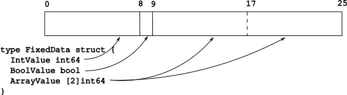
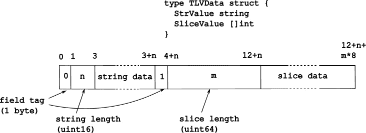

# 14

# 流式输入/输出

简单性中蕴含着灵活性和优雅。与决定实现功能丰富的流式框架的几种语言不同，Go 选择了简单的基于能力的途径：读取器是从中读取字节的东西，写入器是写入字节的东西。内存缓冲区、文件、网络连接等都是读取器和写入器，由`io.Reader`和`io.Writer`定义。文件也是一个`io.Seeker`，因为你可以随机更改读取/写入位置，但网络连接不是。文件和网络连接可以被关闭，因此它们都是`io.Closer`，但内存缓冲区不是。这种简单而优雅的抽象是编写可用于不同上下文的算法的关键。

在本章中，我们将探讨一些示例，展示如何惯用性地使用这种基于能力的流式框架。我们还将探讨如何处理文件和文件系统。本章涵盖的食谱分为以下主要部分：

+   读取器/写入器

+   处理文件

+   处理二进制数据

+   复制数据

+   处理文件系统

+   处理管道

# 读取器/写入器

记住，Go 使用结构化类型系统。这使得任何实现了`Read([]byte) (int,error)`的数据类型都是`io.Reader`，任何实现了`Write([]byte) (int,error)`的数据类型都是`io.Writer`。标准库中有许多使用这个特性的例子。在本食谱中，我们将探讨读取器和写入器的常见用法。

## 从读取器读取数据

`io.Reader`填充你传递给它的字节切片。通过传递一个切片，你实际上传递了两条信息：你想要读取多少（切片的长度）以及将读取的数据放在哪里（切片的底层数组）。

### 如何做到这一点...

1.  创建一个足够大的字节切片以容纳你想要读取的数据：

    ```go
    buffer := make([]byte,1024)
    ```

1.  将数据读取到字节切片中：

    ```go
    nRead, err := reader.Read(buffer)
    ```

1.  检查读取了多少。实际读取的字节数可能小于缓冲区大小：

    ```go
    buffer = buffer[:nRead]
    ```

1.  检查错误。如果错误是`io.EOF`，则表示读取器已到达流末尾。如果错误是其他内容，则处理错误或返回它：

    ```go
    if errors.Is(err,io.EOF) {
      // End of file reached. Return data
      return buffer, nil
    }
    if err!=nil {
      // Some other error, handle it or return
      return nil,err
    }
    ```

注意步骤*3*和*4*的顺序。返回`io.EOF`不一定是错误，它仅仅意味着已到达文件末尾或网络连接已关闭，因此你应该停止读取。缓冲区中可能还有一些数据被读取，你应该处理这些数据。读取器返回读取的数据量。

## 将数据写入写入器

1.  将要写入的数据编码为字节切片；例如，使用`json.Marshal`将你的数据编码为`[]byte`形式的 JSON 表示：

    ```go
    buffer, err:=json.Marshal(data)
    if err!=nil {
      return err
    }
    ```

1.  写入编码后的数据：

    ```go
    _, err:= writer.Write(buffer)
    if err!=nil {
      return err
    }
    ```

1.  检查并处理错误。

警告

与读取器不同，所有来自写入器的错误都应被视为错误。写入器不返回`io.EOF`。即使有错误，写入也可能已写入数据的一部分。

## 从字节切片读取和写入

读取器或写入器不一定是文件或网络连接。本节展示了如何将字节切片作为读取器和写入器进行操作。

### 如何做到这一点...

+   要从一个`[]byte`创建一个读取器，使用`bytes.NewReader`。以下示例将一个数据结构序列化为 JSON（返回一个`[]byte`），然后通过从它创建一个读取器将这个`[]byte`发送到 HTTP `POST`请求：

    ```go
    data, err:=json.Marshal(myStruct)
    if err!=nil {
      return err
    }
    rsp, err:=http.Post(postUrl, "application/json", bytes.NewReader(data))
    ```

+   要将`[]byte`用作写入器，使用`bytes.Buffer`。缓冲区会在你写入时追加到底层的字节切片。当你完成时，你可以获取缓冲区的内容：

    ```go
    buffer := &bytes.Buffer{}
    encoder := json.NewEncoder(buffer)
    if err:=encoder.Encode(myStruct); err!=nil {
       return err
    }
    data := buffer.Bytes()
    ```

`bytes.Buffer`也是一个`io.Reader`，具有单独的读取位置。写入`bytes.Buffer`将追加到底层的切片末尾。从`bytes.Buffer`读取将从底层切片的开始读取。因此，你可以读取你写入的字节，如下所示：

```go
buffer := &bytes.Buffer{}
encoder := json.NewEncoder(buffer)
if err:=encoder.Encode(myStruct); err!=nil {
   return err
}
rsp,err:=http.Post(postUrl, "application/json", buffer)
```

## 从字符串读取和写入

要从一个字符串创建一个读取器，使用`strings.NewReader`，如下所示：

```go
rsp, err:=http.Post(postUrl,"application/json",strings.NewReader(`{"key":"value"}`))
```

不要使用`bytes.NewReader([]byte(stringValue))`代替`strings.NewReader(stringValue)`。前者将字符串的内容复制到创建的字节切片中。后者不复制直接访问底层字节。

要将字符串用作`io.Writer`，使用`strings.Builder`。例如，作为`io.Writer`，`strings.Builder`可以被传递给`fmt.Fprint`函数族：

```go
query:=strings.Builder{}
args:=make([]interface{},0)
query.WriteString("SELECT id,name FROM users ")
if !createdAt.IsZero() {
  args=append(args,createdAt)
  fmt.Fprintf(&query,"where createdAt < $%d",len(args))
}
rows, err:=tx.Query(ctx,query.String(),args...)
```

# 文件处理

文件在存储系统上只是字节序列的简单集合。有两种处理文件的方式：作为随机访问的字节序列或作为字节流。我们将在本节中查看这两种类型的配方。

## 创建和打开文件

要处理文件的内容，你首先必须打开它或创建它。这个配方展示了如何做到这一点。

### 如何做到这一点...

要打开一个现有文件进行读取，使用`os.Open`：

```go
file, err := os.Open(fileName)
if err!=nil {
 // handle error
}
```

你可以从返回的文件对象中读取数据，完成后，你应该使用`file.Close()`关闭它。因此，你可以将其用作`io.Reader`或`io.ReadCloser`（`*os.File`实现了更多接口！）

如果你尝试写入文件，你将收到一个来自写入操作的错误。在我的 Linux 系统中，这个错误是一个`*fs.PathError`消息，表示`bad` `file descriptor`。

要创建一个新文件或覆盖现有文件，使用`os.Create`：

```go
file, err := os.Create(fileName)
if err!=nil {
  // handle error
}
```

如果上述调用成功，返回的文件可以读取或写入。文件是用`0o666 & ^umask`创建的。如果在此调用之前文件已经存在，它将被截断到长度为`0`。

小贴士

`umask`定义了应用程序不能设置在文件上的权限集合。在前面文本中，`0o666`表示所有者、组和其他人都可以读取和写入文件。例如，`0o022`的`umask`值将文件模式从`0o666`更改为`0o644`，这意味着所有者可以读取和写入，但组和其他人只能读取。

要打开一个现有文件进行读取/写入，使用`os.OpenFile`。这是 open/create 函数族中最通用的形式：

+   要以读写模式打开一个现有文件，请使用以下方法：

    ```go
    file, err := os.OpenFile(fileName,os.O_RDWR, 0)
    ```

    最后一个参数是`0`。这个参数仅在创建文件是一个选项时使用。我们将在稍后看到这个情况。

+   要以只读模式打开一个现有文件，请使用以下方法：

    ```go
    file, err := os.OpenFile(fileName,os.O_RDONLY, 0)
    ```

+   要以只写模式打开一个现有文件，请使用以下方法：

    ```go
    file, err := os.OpenFile(fileName,os.O_WRONLY, 0)
    ```

+   要以追加模式打开一个现有文件，请使用以下方法：

    ```go
    file, err := os.OpenFile(fileName,os.O_WRONLY|os.O_APPEND, 0)
    ```

    尝试在文件末尾之外的地方写入将会失败。

+   要打开一个现有文件或创建一个如果它不存在，请使用以下方法：

    ```go
    file, err := os.OpenFile(fileName,os.O_RDWR|os.O_CREATE, 0o644)
    ```

    上述操作将在文件存在时打开文件以供读写。如果文件不存在，它将使用`0o644 & ^umask`权限位创建。`0o644`意味着所有者可以读写（`06`），同一组的用户可以读（`04`），其他用户可以读（`04`）。

以下与`os.Create`等价；即，如果文件存在则截断并打开，如果不存在则创建：

```go
file, err:= os.Open(fileName, os.O_RDWR|os.O_CREATE|os.O_TRUNC,0o644)
```

如果你只想在文件不存在时创建文件，请使用“独占”位：

```go
file, err := os.Open(fileName, os.O_RDWR|os.O_CREATE|os.O_EXCL,0o644)
```

如果文件已经存在，这个调用将会失败。

提示

这是一种常见的确保一个进程实例正在运行的方法，或者在没有锁定资源的情况下锁定资源。例如，如果你想锁定一个目录，你可以使用这个调用来创建一个锁文件。如果其他进程已经锁定了它（在你之前创建了文件），那么它将会失败。

## 关闭文件

你应该始终显式关闭你打开的文件有两个原因：

+   当你关闭文件时，所有存储在缓冲区中的数据都会被刷新。

+   你在任何给定时间可以保持打开的文件数量是有限的。这些限制因平台而异。

以下步骤显示了如何始终如一地完成这项操作。

### 如何做到这一点...

当你完成与文件的交互后，请关闭它。尽可能使用`defer file.Close()`：

```go
file, err:=os.Open(fileName)
if err!=nil {
  // handle error
}
defer file.Close()
// Work with the file
```

如果你正在处理许多文件，不要依赖`defer`。不要这样做：

```go
for _,fileName:=range files {
   file, err:=os.Open(fileName)
   if err!=nil {
     // handle error
   }
   defer file.Close()
   // Work with file
}
```

延迟调用将在函数返回时执行，而不是在你使用它们的代码块结束时执行。上述代码将保持所有文件打开，直到函数返回，如果文件数量很多，一旦超过打开文件限制，`os.Open`将会开始失败。你可以做两件事之一。第一是显式关闭所有退出点的文件：

```go
for _,fileName:=range files {
   file, err:=os.Open(fileName)
   if err!=nil {
     return err
   }
   // Work with file
   err:=useFile(file)
   if err!=nil {
     file.Close()
     return err
   }
   err:=useFileAgain(file)
   if err!=nil {
     file.Close()
     return err
   }
   // Do more work
   file.Close()
}
```

第二种方法是使用带有`defer`的闭包：

```go
for _,fileName:=range files {
   file, err:=os.Open(fileName)
   if err!=nil {
     return err
   }
   err=func() error {
     defer file.Close()
     // Work with file
     err:=useFile(file)
     if err!=nil {
       return err
     }
     err:=useFileAgain(file)
     if err!=nil {
       return err
     }
     // Do more work
     return nil
   }()
   if err!=nil {
     return err
   }
}
```

提示

文件会被垃圾回收。如果你打开/创建文件然后直接使用文件描述符而不是使用`*os.File`来工作，垃圾回收器就不会是你的朋友。使用`runtime.KeepAlive(file)`来防止垃圾回收器在你通过文件描述符和/或系统调用与之交互时关闭文件。避免依赖垃圾回收器来关闭你的文件。始终显式关闭文件。

## 从/向文件读取/写入数据

当您以读取和写入方式打开文件时，操作系统会保留 `0`。然后如果您从文件中读取 10 个字节，当前位置将变为 `10`（假设文件大于 10 个字节）。下次您从文件中读取或写入时，您将从偏移量 `10` 开始读取内容或写入。请记住这种行为，特别是如果您正在对文件进行读写混合操作。

### 如何操作...

+   要从当前位置读取一些数据，请使用 `file.Read`：

    ```go
    file, err:=os.Open(fileName)
    if err!=nil {
      return err
    }
    // Current location: 0
    buffer:=make([]byte,100)
    // Read 100 bytes
    n, err:=file.Read(buffer)
    // Current location: n
    // n tells how many bytes actually read
    data:=buffer[:n]
    if err!=nil {
      if errors.Is(err, io.EOF) {
      }
    }
    ```

    检查 `n`（读取的字节数）和检查是否有错误顺序很重要。`io.Reader` 可能会进行部分读取并返回读取的字节数以及一个错误。这个错误可能是 `io.EOF`，表示文件中的数据少于您尝试读取的数据。例如，一个包含 10 个字节的文件将返回 `n=10` 和 `err=io.EOF`。还请注意，这种行为取决于文件当前的位置。以下代码段将文件作为字节切片的切片读取：

    ```go
    slices := make([][]byte,0)
    for {
      buffer:=make([]byte,1024)
      n, err:=file.Read(buffer)
      if n>0 {
        slices=append(slices,buffer[:n])
        buffer=make([]byte,1024)
      }
      if err!=nil {
        if errors.Is(err,io.EOF) {
          break
        }
        return err
      }
    }
    ```

    如果在先前的代码开始时文件中的当前位置是 `0`，则在每次读取操作后，当前位置将前进 `n`。请注意，除了最后一个之外，所有的字节切片都是 `1024` 字节。最后一个切片的大小可以从 `1` 到 `1024` 字节不等，具体取决于文件大小。

+   写入文件的操作类似：

    ```go
    buffer:=[]byte("Hello world!")
    n, err:=io.Write(buffer)
    if err!=nil {
      return err
    }
    ```

    写入操作不会返回 `io.EOF`。如果您写过了文件的末尾，文件将扩展以容纳写入的字节。如果写入操作不能写入所有给定的字节，错误始终是非空的，您应该检查并处理该错误。

    如果当前位置在开始时为 `0`，则在写入操作后它将是 `n`。

+   要从文件中读取所有内容，请使用 `os.ReadFile`：

    ```go
    data, err:= os.ReadFile("config.yaml")
    if err!=nil {
      // Handle error
    }
    ```

小贴士

使用 `os.ReadFile` 时要小心。它分配了一个大小与文件相同的 `[]byte`。只有当您确信您正在读取的文件大小合理时，才使用此函数。

+   要以固定大小的块读取大文件，分配一个固定大小的缓冲区并迭代读取，直到返回 `io.EOF`：

    ```go
    // Read file in 10K chunks
    buf:=make([]byte,10240)
    for {
      n, err:=file.Read(buf)
      if n>0 {
        // Process buffer contents:
        processData(buf[:n])
      }
      // Check for errors. Check for io.EOF and handle it
      if err!=nil {
        if errors.Is(err,io.EOF) {
          // End of file. We are done
          break
        }
        // Some other error
        return err
      }
    }
    ```

+   要将字节切片写入新文件，请使用 `os.WriteFile`：

    ```go
    err:=os.WriteFile("config.yaml", data, 0o644)
    ```

## 从/到特定位置读取/写入

我们之前讨论了**当前位置**的概念。本节内容是关于将当前位置移动到文件的起始位置以进行读取或写入操作。

### 如何操作...

您可以使用 `File.Seek` 来更改当前位置。

+   要将当前位置相对于文件开头设置，请使用以下方法：

    ```go
    // Move to offset 100 in file
    newLocation, err := file.Seek(100,io.SeekStart)
    ```

    返回的 `newLocation` 是文件的新当前位置。后续的读取或写入操作将从该位置开始。

+   要将当前位置相对于文件末尾设置，请使用以下方法：

    ```go
    // Move to the end of the file:
    newLocation, err := file.Seek(0,io.SeekEnd)
    ```

    这也是一种快速确定当前文件大小的方法，因为 `newLocation` 在文件末尾之前是 0 字节。

+   你可以定位到文件末尾之外的位置。从这样的位置读取将读取 0 字节。写入这样的位置将扩展文件大小以容纳在该位置写入的数据：

    ```go
    // Go to 100 after the end of file and write 1 byte
    newLocation, err:=file.Seek(100, io.SeekEnd)
    if err!=nil {
      panic(err)
    }
    // Write 1 byte.
    file.Write([]byte{0})
    // The file is 101 bytes larger now.
    ```

小贴士

当你以这种方式扩展文件时，文件末尾和新增字节之间的区域会被填充为 0s。底层平台可能会将其实现为一个**空洞**；也就是说，未写入的区域可能实际上并未分配。

+   `os.File`支持用于此类随机访问的附加方法。`File.WriteAt`将数据写入指定的位置（相对于文件开始的位置），而不会移动当前位置。`File.ReadAt`将从指定的位置读取，而不会移动当前位置：

    ```go
    // Go to offset 1000
    _,err:=file.Seek(1000,io.SeekStart)
    // Write "Hello world" to offset 10.
    n, err:=file.WriteAt([]byte("Hello world!"),10)
    if err!=nil {
      panic(err)
    }
    // Write to offset 1000, because WriteAt does not move
    // the current location
    _,err:=file.WriteAt([]byte{"offset 1000")
    buffer:=make([]byte,5)
    file.ReadAt(buffer,10)
    fmt.Println(string(buffer))
    // Prints "Hello"
    ```

## 改变文件大小

扩展文件通常是通过向其末尾写入更多数据来实现的，但如何缩小现有文件呢？这个配方描述了改变文件大小的不同方法。

### 如何操作...

+   要将文件截断到`0`大小，你可以使用截断标志打开文件：

    ```go
    file, err:=os.OpenFile("test.txt", os.O_RDWR|os.O_TRUNC,0o644)
    // File is opened and truncated to 0 size
    ```

+   如果文件已经打开，你可以使用`File.Truncate`来设置文件大小。`File.Truncate`具有双向功能——你可以扩展文件，也可以缩小它：

    ```go
    // Truncate the file to 0-size
    err:=file.Truncate(0)
    if err!=nil {
      panic(err)
    }
    // Extend the file to 100-bytes
    err=file.Truncate(100)
    if err!=nil {
      panic(err)
    }
    ```

+   你也可以通过追加内容来扩展文件。你可以通过两种方式之一来完成这个操作。你可以以追加模式打开文件：

    ```go
    file, err:=os.OpenFile("test.txt", os.O_WRONLY|os.O_APPEND,0)
    // File is opened for writing, current location is set to the
    // end of the file
    ```

    如果你以追加模式打开文件，你不能从文件的其他位置进行读写，你只能追加到它。

+   或者，你可以定位到文件末尾并从那里开始写入：

    ```go
    // Seek to the end
    _,err:=file.Seek(0,io.SeekEnd)
    if err!=nil {
      panic(err)
    }
    // Write new data to the end of the file
    _,err:=file.Write(data)
    ```

## 查找文件大小

如果文件已打开，你可以按以下方式获取文件大小：

```go
fileSize, err:= file.Seek(0,io.SeekEnd)
```

这将返回当前文件大小，包括任何已追加但尚未刷新的数据。

上述操作将移动文件指针到文件末尾。为了保留当前位置，请使用以下方法：

```go
// Get current location
currentLocation, err:=file.Seek(0,io.SeekCurrent)
if err!=nil {
  return err
}
// Find file size
fileSize, err:=file.Seek(0,io.SeekEnd)
if err!=nil {
  return err
}
// Move back to the saved location
_,err:=file.Seek(currentLocation,io.SeekStart)
if err!=nil {
  return err
}
```

如果文件未打开，请使用`os.Stat`：

```go
fileInfo, err:=os.Stat(fileName)
if err!=nil {
  return err
}
fileSize := fileInfo.Size()
```

小贴士

如果你已经打开了文件并向其中追加数据，`os.Stat`报告的文件大小可能与通过`File.Seek`获得的文件大小不同。`os.Stat`函数从目录中读取文件信息。`File.Seek`方法使用进程特定的文件信息，这些信息可能尚未反映在目录条目中。

# 处理二进制数据

如果你需要通过网络连接发送数据或将其存储在文件中，你首先必须对其进行编码（或序列化，或打包。）这是必要的，因为网络连接另一端的系统或将要读取你写入的文件的程序可能运行在不同的平台上。一种便携、易于调试但可能不是最高效的方法是使用基于文本的编码，如 JSON。如果性能至关重要或使用场景要求这样做，你可以使用二进制编码。

有许多高级的二进制编码方案。Gob ([`pkg.go.dev/encoding/gob`](https://pkg.go.dev/encoding/gob)) 是一种特定于 Go 的编码方案，可用于网络应用程序。协议缓冲区 ([`protobuf.dev`](https://protobuf.dev)) 提供了一种语言无关、可扩展、基于模式的机制，用于编码结构化数据。还有更多。在这里，我们将探讨每个软件工程师都应该了解的二进制编码基础知识。

编码数据涉及将数据元素转换成字节流。如果您有一个单字节的数据元素或已经是一系列字节的数据元素，您可以逐字编码它们。当处理多字节数据类型（`int16`、`int32`、`int64` 等）时，字节顺序变得很重要。例如，如果您有一个 `int16` 值 `0xABCD`，您应该如何将这些字节编码为 `[]byte`？有两种选择：

+   `0xABCD` 被编码为 `[]``byte{0xCD, 0xAB}`

+   `0xABCD` 被编码为 `[]``byte{0xAB, 0xCD}`

类似地，一个 32 位整数，`0x01234567`，以小端字节序编码给出 `[]byte{0x67,0x45,0x23,0x01}`，以大端字节序编码给出 `[]byte{0x01,0x23,0x45,0x67}`。大多数现代硬件使用小端字节序在内存中表示值。网络协议（如 IP）倾向于使用大端。

## 如何做到这一点...

编码二进制数据主要有两种方法：

+   第一种方法是使用固定结构。在这种方法中，数据字段的顺序和类型是固定的。例如，IPv4 头部定义了每个头部字段开始和结束的位置。这种方法无法省略字段或添加扩展。一个例子在 *图 14**.1* 中展示。



图 14.1：固定长度编码示例

+   第二种方法是使用动态编码方案，例如 `string` 字段，然后是长度，然后是字符串本身。一个 TLV 编码方案的例子在 *图 14**.2* 中展示。



图 14.2：TLV 编码示例

这个例子使用了 16 位字符串长度和 64 位切片长度编码。

使用 `encoding/binary` 对数据进行大端或小端字节序编码。

对于固定长度编码，您可以使用 `encoding.Write` 来编码，使用 `encoding.Read` 来解码数据：

```go
type Data struct {
  IntValue int64
  BoolValue bool
  ArrayValue [2]int64
}
func main() {
  output := bytes.Buffer{}
  data:=Data{
    IntValue: 1,
    BoolValue: true,
    ArrayValue: [2]int64{1,2},
  }
  // Encode data using big endian byte order
  binary.Write(&output, binary.BigEndian, data)
  stream := output.Bytes()
  fmt.Printf("Big endian encoded data   : %v\n", stream)
  // Decode data
  var value1 Data
  binary.Read(bytes.NewReader(stream), binary.BigEndian, &value1)
  fmt.Printf("Decoded data: %v\n", value1)
  // Encode data using little endian byte order
  output = bytes.Buffer{}
  binary.Write(&output, binary.LittleEndian, data)
  stream = output.Bytes()
  fmt.Printf("Little endian encoded data: %v\n", stream)
  // Decode data
  var value2 Data
  binary.Read(bytes.NewReader(stream), binary.LittleEndian, &value2)
  fmt.Printf("Decoded data: %v\n", value2)
}
```

这个程序输出以下内容：

```go
Big endian encoded data   : [0 0 0 0 0 0 0 1 1 0 0 0 0 0 0 0 1 0 0 0 0 0 0 0 2]
Decoded data: {1 true [1 2]}
Little endian encoded data: [1 0 0 0 0 0 0 0 1 1 0 0 0 0 0 0 0 2 0 0 0 0 0 0 0]
Decoded data: {1 true [1 2]}
```

在定义 `Data` 结构时，请特别注意。如果您想使用 `encoding.Read` 或 `encoding.Write`，则不能使用可变长度或平台特定的类型：

+   没有 `int`，因为 `int` 的大小是平台特定的

+   没有切片

+   没有映射

+   没有字符串

我们如何编码这些值呢？让我们看看一个 LV 编码方案来编码一个字符串值：

```go
func EncodeString(s string) []byte {
  // Allocate the output buffer for string length (int16) + 
  // len(string)
  buffer:=make([]byte, 0, len(s)+2)
  // Encode the length little endian - 2 bytes
  binary.LittleEndian.PutUint16(buffer,uint16(len(s)))
  // Copy the string bytes
  copy(buffer[2:],[]byte(s))
  return buffer
}
```

这里有一个解码字符串值的例子：

```go
func DecodeString(input []byte) (string, error) {
     // Read the string length. It must be at least 2 bytes
     if len(input) < 2 {
          return "", fmt.Errorf("invalid input")
     }
     n := binary.LittleEndian.Uint16(input)
     if int(n)+2 > len(input) {
          return "", fmt.Errorf("invalid input")
     }
     return string(input[2 : n+2]), nil
}
```

# 复制数据

`io.Copy` 从读取器读取数据并将其写入写入器，直到其中一个操作失败或读取器返回 `io.EOF`。有许多需要从读取器获取数据块并将其发送到写入器的情况。`io.Copy` 在一个抽象层上工作，允许您从文件复制数据到网络连接，或从字符串复制到文件。它还执行基于能力的优化以最小化数据复制。例如，如果平台支持 splice 系统调用，`io.Copy` 可以使用它来绕过缓冲区使用。在本节中，我们将看到 `io.Copy` 的一些用法。

## 复制文件

### 如何做到这一点...

要复制文件，请按照以下步骤操作：

1.  打开源文件。

1.  创建目标文件。

1.  使用 `io.Copy` 来复制数据。

1.  关闭两个文件。

这些步骤在此处展示：

```go
sourceFile, err:=os.Open(sourceFileName)
if err!=nil {
  panic(err)
}
defer sourceFile.Close()
targetFile, err:=os.Create(targetFileName)
if err!=nil {
  panic(err)
}
defer targetFile.Close()
if _,err:=io.Copy(targetFile,sourceFile);err!=nil {
  panic(err)
}
```

由于 `io.Copy` 与 `io.Reader` 和 `io.Writer` 一起工作，任何实现这些接口的对象都可以用作源或目标。例如，以下代码段在 HTTP 请求的响应中返回一个文件：

```go
// Handle GET /path/{fileName}
func HandleGetImage(w http.ResponseWriter, req *http.Request) {
  // Get the file name from the request
  file, err:=os.Open(req.PathValue("fileName"))
  if err!=nil {
    http.Error(w,err.Error(),http.StatusNotFound)
    return
  }
  defer file.Close()
  // Write file contents to the response writer
  io.Copy(w,file)
}
```

# 处理文件系统

文件系统有许多方面是特定于平台的。本节讨论了在文件系统中使用便携式方法的讨论。

## 处理文件名

使用 `path/filepath` 包以便携方式处理文件名。

### 如何做到这一点...

+   要从多个路径段构建路径，请使用 `filepath.Join`:

    ```go
    fmt.Println(filepath.Join("/a/b/","/c/d")
    // Prints /a/b/c
    fmt.Println(filepath.Join("/a/b/c/d/","../../x")
    // Prints a/b/x
    ```

    注意，`filepath.Join` 不允许连续的分隔符，并且正确解释 `".."`。

+   要将路径分割为其目录和文件名部分，请使用 `filepath.Split`:

    ```go
    fmt.Println(filepath.Split("/home/bserdar/work.txt"))
    // dir: "/home/bserdar" file: "work.txt"
    fmt.Println(filepath.Split("/home/bserdar/projects/"))
    // dir: "/home/bserdar/projects/" file: ""
    ```

+   避免在您的代码中使用路径分隔符（`/` 和 `\`）。使用 `filepath.Separator`，这是一个特定于平台的 rune 值。

## 创建临时目录和文件

有时，您需要创建唯一的目录名和文件名，通常用于临时数据。

### 如何做到这一点...

+   要在平台特定的默认临时文件目录下创建临时目录，请使用 `os.MkdirTemp("",prefix)`:

    ```go
    dir, err:=os.MkdirTemp("","tempdir")
    if err!=nil {
      // Handle error
    }
    // Clean up when done
    defer os.RemoveAll(dir)
    fmt.Println(dir)
    // Prints /tmp/example10287493
    ```

    创建的名称是唯一的。如果有多个调用创建临时目录，每个都会生成一个唯一的名称。

+   要在特定目录下创建临时目录，请使用 `os.MkdirTemp(dir,prefix)`:

    ```go
    // Create a temporary directory under the current directory
    dir, err:=os.MkdirTemp(".","tempdir")
    if err!=nil {
      // Handle error
    }
    // Cleanup when done
    defer os.RemoveAll(dir)
    ```

+   要创建一个名称随机部分不是后缀的临时目录，请使用 `*`。随机字符串将替换最后一个 `*` 字符：

    ```go
    dir, err:=os.MkdirTemp(".", "myapp.*.txt")
    if err!=nil {
      // Handle error
    }
    defer os.RemoveAll(dir)
    fmt.Println(dir)
    // Prints ./myapp.13984873.txt
    ```

+   要创建临时文件，请使用 `os.CreateTemp`。创建一个唯一的文件并打开以供读写。创建的文件名可以通过返回的 `file.Name` 值获得：

    ```go
    file, err:=os.CreateTemp("","app.*.txt")
    if err!=nil {
      // Handle error
    }
    fmt.Println("Temp file", file.Name)
    // Cleanup when done
    defer os.Remove(file.Name)
    defer file.Close()
    ```

与 `os.MkdirTemp` 类似，如果文件名包含 `*`，则在最后一个 `*` 字符处插入随机字符串。如果文件名不包含 `*`，则随机字符串附加在名称的末尾。

## 读取目录

使用 `os.ReadDir` 列出或发现目录下的文件。

### 如何做到这一点...

+   调用 `os.ReadDir` 获取目录的内容。这返回按名称排序的目录条目：

    ```go
    entries, err:=os.ReadDir(".")
    if err!=nil {
      // handle error
    }
    for _, entry:=range entries {
       // Name contains the file name only, not the directory
       name := entry.Name()
       if entry.IsDir() {
         // This is a directory
       } else {
         // This is not a directory. Does not mean it is a regular 
         // file Can be a named pipe, device, etc.
       }
    }
    ```

    你可能会注意到，如果你处理的是可能非常大的目录，`os.ReadDir` 并不是你的最佳选择。它返回一个无界切片，并且它还花费时间进行排序。

+   对于性能和内存敏感的应用程序，打开目录并使用 `File.ReadDir` 读取它：

    ```go
    // Open the directory
    dir, err:= os.Open("/tmp")
    if err!=nil {
      panic(err)
    }
    defer dir.Close()
    // Read directory entries unordered, 10 at a time
    for {
      entries, err:=dir.ReadDir(10)
      // Are we done reading
      if errors.Is(err, io.EOF) {
        break
      }
      if err!=nil {
        panic(err)
      }
      // There are at most 10 fileInfo entries
      for _,entry:=range entries {
        // Process the entry
      }
    }
    ```

+   以可移植的方式递归迭代目录条目，请使用 `io.fs.WalkDir`。此函数无论在哪个平台上都使用 `"/"` 作为路径分隔符。以下示例打印出 `/tmp` 下的所有文件，跳过目录：

    ```go
    err:=fs.WalkDir(os.DirFS("/"), "/tmp", func(path string,d fs.DirEntry,err error) error {
      if err!=nil {
         fmt.Println("Error during directory traversal", err)
         return err
      }
      if !d.IsDir() {
        // This is not  a directory
        fmt.Println(filepath.Join(path,d))
      }
      return nil
    })
    ```

+   要递归迭代目录条目，请使用 `filepath.WalkDir`。此函数使用特定平台的路径分隔符。以下示例递归打印出 `/tmp` 下的所有目录：

    ```go
    err:=filepath.WalkDir("/tmp", func(path string,d fs.DirEntry,err error) error {
      if err!=nil {
         fmt.Println("Error during directory traversal", err)
         return err
      }
      if d.IsDir() {
        // This is a directory
        fmt.Println(filepath.Join(path,d), " directory")
      }
      return nil
    })
    ```

# 使用管道进行工作

如果你有一段期望读取器的代码和另一段期望写入器的代码，你可以使用 `io.Pipe` 将它们连接起来。

## 将期望读取器的代码与期望写入器的代码连接起来

这种用例的一个好例子是准备一个 HTTP `POST` 请求，它需要一个读取器。如果你已经有了所有数据，或者如果你已经有了读取器（例如 `os.File`），你可以使用它。然而，如果数据是由一个接受写入器的函数产生的，请使用管道。

### 如何做到这一点...

管道是一个同步连接的读取器和写入器。也就是说，如果你向管道写入，必须有一个读取器并发地从中消费。所以请确保你将数据生产方（使用写入器的地方）放在与数据消费方（使用读取器的地方）不同的 goroutine 中。

+   使用 `io.Pipe` 创建管道读取器和管道写入器：

    ```go
    pipeReader, pipeWriter := io.Pipe()
    ```

    `pipeReader` 将读取写入到 `pipeWriter` 的所有内容。

+   在一个 goroutine 中使用 `pipeWriter` 产生数据。当所有内容都写入后，关闭 `pipeWriter`：

    ```go
    go func() {
      // Close the writer side, so the reader knows when it is done
      defer pipeWriter.Close()
      encoder:=json.NewEncoder(pipeWriter)
      if err:=encoder.Encode(payload); err!=nil {
        if errors.Is(err,io.ErrClosedPipe) {
          // The reader side terminated with error
        } else {
          // Handle error
        }
      }
    }()
    ```

+   在需要读取器的地方使用 `pipeReader`。如果函数失败并且管道中的所有内容都无法消费，请关闭 `pipeReader` 以使写入器能够终止：

    ```go
    if _, err:= http.Post(serverURL, "application/json", pipeReader); err!=nil {
      // Close the reader, so the writing goroutine terminates
      pipeReader.Close()
      // Handle error
    }
    ```

在上面的例子中，编码 JSON 数据的 goroutine 将阻塞，直到 `POST` 请求建立连接并流式传输数据。如果在过程中出现错误，`pipeReader.Close()` 确保编码 JSON 数据的 goroutine 不会泄漏。

## 使用 TeeReader 拦截读取器

在管道中，tee 管道是一种具有 T 形的配件。它将流量分成两部分。`TeeReader` 的名字就来源于此。`io.TeeReader(r io.Reader, w io.Writer) io.Reader` 函数返回一个新的读取器，它从 `r` 读取的同时将读取到的数据写入 `w`。这对于拦截通过读取器的数据非常有用。

### 如何做到这一点...

1.  创建一个管道：

    ```go
    pipeReader, pipeWriter := io.Pipe()
    ```

1.  从另一个读取器创建一个 `TeeReader`，使用 `pipeWriter` 作为接收数据的写入器：

    ```go
    file, err:=os.Open(dataFile)
    if err!=nil {
      // Handle error
    }
    defer file.Close()
    tee := io.TeeReader(file, pipeWriter)
    ```

    在这个阶段，从 `tee` 读取数据将同时从 `file` 读取数据并将其写入 `pipeWriter`。

1.  在另一个 goroutine 中使用 `pipeReader` 处理从原始读取器读取的数据：

    ```go
    go func() {
      // Copy the file to stdout
      io.Copy(os.Stdout,pipeReader)
    }()
    ```

1.  使用 `TeeReader` 读取数据：

    ```go
    _,err:=http.Post(serverURL, "text/plain", tee)
    if err!=nil {
      // Make sure pipe is closed
      pipeReader.Close()
    }
    ```

注意，使用管道至少需要另一个 goroutine，其中涉及到向管道写入或从管道读取。如果发生错误，确保所有与管道一起工作的 goroutine 通过关闭管道的一端来终止。
