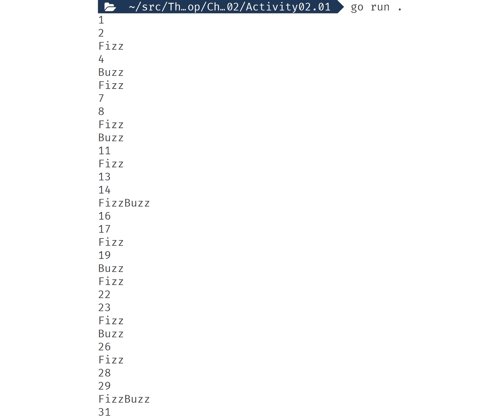

# 第二章：2. 逻辑和循环

概述

在本章中，我们将使用分支逻辑和循环来展示如何控制逻辑并选择性运行。有了这些工具，你可以根据变量的值来控制你想运行或不运行的逻辑。

到本章结束时，你将能够使用`if`、`else`和`else if`实现分支逻辑；使用`switch`语句简化复杂的分支逻辑；使用`for`循环创建循环逻辑；使用`range`遍历复杂的数据集合；以及使用`continue`和`break`来控制循环的流程。

# 简介

在上一章中，我们探讨了变量和值，以及我们如何可以在变量中临时存储数据并对该数据进行更改。现在，我们将探讨如何使用这些数据来选择性运行逻辑。这种逻辑允许你控制数据在你的软件中的流动。你可以根据变量中的值来响应并执行不同的操作。

逻辑可以用于验证用户的输入。如果我们正在编写管理银行账户的代码，并且用户要求提取一些钱，我们可以检查他们是否请求了有效的金额。我们会检查他们账户中是否有足够的钱。如果验证成功，我们会使用逻辑来更新他们的余额，转账并显示成功消息。如果验证失败，我们会显示一条解释出错原因的消息。

如果你的软件是一个虚拟世界，那么逻辑就是这个世界的物理定律。就像我们世界的物理定律一样，这些定律必须遵循，不能被打破。如果你在一条定律中存在缺陷，那么你的虚拟世界将无法顺利运行，甚至可能发生爆炸。

另一种逻辑形式是循环；使用循环可以让你多次执行相同的逻辑。使用循环的一种常见方式是遍历数据集合。对于我们的虚拟银行软件，我们会使用循环来遍历用户的交易，以便在用户请求时显示它们。

循环和逻辑使软件能够具有复杂的行为，能够对变化和动态数据做出响应。

## if 语句

`if`语句是 Go 中最基本的逻辑形式。`if`语句会根据布尔表达式运行或不运行一个逻辑块。其表示法如下：`if <布尔表达式> { <代码块> }`。

布尔表达式可以是一个简单的代码，其结果为布尔值。代码块可以是任何你也能放入函数中的逻辑。当布尔表达式为真时，代码块会运行。你只能在函数作用域中使用`if`语句。

## 练习 2.01：一个简单的 if 语句

在这个练习中，我们将使用 if 语句来控制逻辑是否运行。我们将定义一个`int`值来检查它是否是硬编码的，但在实际应用中，这可能是用户输入。然后我们将使用`%`运算符（也称为变量上的取模表达式）检查该值是奇数还是偶数。取模运算给出除法后的剩余量。我们将使用取模运算来获取除以 2 后的余数。如果我们得到余数为 0，我们知道这个数字是偶数。如果余数是 1，我们知道这个数字是奇数。取模运算的结果是`int`类型，所以我们使用`==`来获取布尔值：

1.  创建一个新的文件夹并添加一个`main.go`文件。

1.  在`main.go`中添加包和导入：

    ```go
    package main
    import "fmt"
    ```

1.  创建`main`函数：

    ```go
    func main() {
    ```

1.  定义一个带有初始值的`int`变量。这里我们将其设置为 5，这是一个奇数，但也可以设置为 6，这是一个偶数：

    ```go
      input := 5
    ```

1.  创建一个使用取模表达式的`if`语句；然后，检查结果是否等于 0：

    ```go
      if input%2 == 0 {
    ```

1.  当布尔表达式结果为`true`时，这意味着数字是偶数。然后我们使用格式包将“偶数”打印到控制台：

    ```go
        fmt.Println(input, "is even")
    ```

1.  关闭代码块：

    ```go
      }
    ```

1.  现在为奇数做同样的操作：

    ```go
      if input%2 == 1 {
        fmt.Println(input, "is odd")
      }
    ```

1.  关闭`main`：

    ```go
    }
    ```

1.  保存文件，在新的文件夹中，`运行`以下代码片段：

    ```go
    go run main.go
    ```

    以下为预期输出：

    ```go
    5 is odd
    ```

在这个练习中，我们使用了逻辑来选择性运行代码。使用逻辑来控制代码的运行，让你能够在代码中创建流程。这允许你拥有能够对其数据进行反应的代码。这些流程允许你能够对你的代码如何处理数据进行推理，使其更容易理解和维护。

尝试将输入的值改为 6，看看偶数块是如何被执行而不是奇数块的。

在下一个主题中，我们将探讨如何改进这段代码并使其更高效。

## if else 语句

在上一个练习中，我们进行了两次评估。一次评估是检查数字是否为偶数，另一次是检查它是否为奇数。正如我们所知，一个数字只能是奇数或偶数。有了这个知识，我们可以使用演绎法知道如果一个数字不是偶数，那么它一定是奇数。

使用这种演绎逻辑在编程中很常见，目的是通过避免做不必要的工作来提高程序的效率。

我们可以使用 if else 语句来表示这种逻辑。表示法如下：`if <布尔表达式> { <代码块> } else { <代码块> }`。if else 语句建立在 if 语句的基础上，并给我们第二个块。第二个块只有在第一个块不运行时才会运行；两个块不能同时运行。

## 练习 2.02：使用 if else 语句

在这个练习中，我们将更新之前的练习，使用 if else 语句：

1.  创建一个新的文件夹并添加一个`main.go`文件。

1.  在`main.go`中添加`package`和`import`：

    ```go
    package main
    import "fmt"
    ```

1.  创建`main`函数：

    ```go
    func main() {
    ```

1.  定义一个带有初始值的`int`变量，这次我们将给它赋予不同的值：

    ```go
      input := 4
    ```

1.  创建一个使用取模表达式的 `if` 语句，然后检查结果是否等于 0：

    ```go
      if input%2 == 0 {
        fmt.Println(input, "is even")
    ```

1.  这次，我们不是关闭代码块，而是开始一个新的 `else` 代码块：

    ```go
      } else {
        fmt.Println(input, "is odd")
      }
    ```

1.  关闭 `main`：

    ```go
    }
    ```

1.  保存文件，在新的文件夹中，`运行`以下代码片段：

    ```go
    go run main.go
    ```

    以下是我们预期的输出：

    ```go
    4 is even
    ```

在这个练习中，我们能够通过使用 `if` `else` 语句简化之前的代码。这不仅使代码更高效，还使代码更容易理解和维护。

在下一个主题中，我们将演示如何添加尽可能多的代码块，同时仍然只允许一个执行。

## `else if` 语句

`if` `else` 语句解决了仅针对一个或两个可能的逻辑结果运行代码的问题。这个问题解决之后，如果我们之前的练习代码只打算对非负数有效，那会怎样呢？我们需要某种能够评估多个布尔表达式但只执行一个代码块（即负数、偶数或奇数的代码块）的东西。

在那种情况下，我们不能单独使用 `if` `else` 语句；然而，我们可以通过扩展 `if` 语句来覆盖它。在这个扩展中，你可以给 `else` 语句自己的布尔表达式。这个表示法看起来是这样的：`if <布尔表达式> { <代码块> } else if <布尔表达式> { <代码块> }`。你还可以将它与最后的 `else` 语句结合起来，这看起来是这样的：`if <布尔表达式> { <代码块> } else if <布尔表达式> { <代码块> } else { <代码块> }`。在初始的 `if` 语句之后，你可以有尽可能多的 `else if` 语句。Go 从语句的顶部评估布尔表达式，并逐个评估每个布尔表达式，直到其中一个结果为 `true` 或找到 `else`。如果没有 `else` 并且没有布尔表达式结果为 `true`，则不执行任何代码块，Go 继续执行。当 Go 获取布尔 `true` 结果时，它只执行该语句的代码块，然后停止评估 `if` 语句的任何布尔表达式。

## 练习 2.03：使用 `else if` 语句

在这个练习中，我们将更新之前的练习。我们将添加对负数的检查。这个检查必须在偶数和奇数检查之前运行，因为只有一个代码块可以运行：

1.  创建一个新的文件夹并添加一个 `main.go` 文件。

1.  在 `main.go` 中添加 `package` 和 `import`：

    ```go
    package main
    import "fmt"
    ```

1.  创建 `main` 函数：

    ```go
    func main() {
    ```

1.  定义一个带有初始值的 `int` 变量，我们将给它一个负值：

    ```go
      input := -10
    ```

1.  我们的第一个布尔表达式是检查负数。如果我们找到一个负数，我们将打印一条消息说它们是不允许的：

    ```go
      if input < 0 {
        fmt.Println("input can't be a negative number")
    ```

1.  我们需要将我们的偶数检查移动到 `else if` 语句中：

    ```go
      } else if input%2 == 0 {
        fmt.Println(input, "is even")
    ```

1.  `else` 语句保持不变，然后我们关闭 `main`：

    ```go
      } else {
        fmt.Println(input, "is odd")
      }
    }
    ```

1.  保存文件，在新的文件夹中，`运行`以下代码片段：

    ```go
    go run main.go
    ```

    以下是我们预期的输出：

    ```go
    input can't be a negative number
    ```

在这个练习中，我们在`if`语句中添加了更复杂的逻辑。我们添加了一个`else if`语句，这使得复杂的评估成为可能。这个添加将通常是一个简单的分叉路口，它提供了许多道路可以选择，但仍然受到只能选择其中一条的限制。

在下一个主题中，我们将使用`if`语句的一个微妙但强大的功能，它让你保持代码整洁。

## 初始`if`语句

通常需要调用一个函数，但并不太关心返回的值。通常，你只想检查它是否正确执行，然后丢弃返回的值。例如，发送电子邮件、写入文件或将数据插入数据库；大多数情况下，如果这些类型的操作执行成功，你不需要担心它们返回的变量。不幸的是，变量并没有消失，因为它们仍然在作用域内。

为了阻止这些不想要的变量徘徊，我们可以利用我们对作用域规则的了解来消除它们。检查错误最好的方法是使用`if`语句上的“初始”语句。表示法如下：`if <initial statement>; <boolean expression> { <code block> }`。初始语句与布尔表达式位于同一部分，用`;`分隔它们。

Go 只允许在初始语句部分使用它所称为的简单语句，包括：

+   赋值和短变量赋值：

    ```go
    E.g.: i := 0
    ```

+   如数学或逻辑表达式之类的表达式：

    ```go
    E.g.: i = (j * 10) == 40
    ```

+   发送用于处理通道的语句，我们将在后面介绍。

+   增量和减量表达式：

    ```go
    E.g.: i++
    ```

一个常见的错误是尝试使用`var`定义变量。这是不允许的；你可以用短赋值来代替。

## 练习 2.04：实现初始`if`语句

在这个练习中，我们将继续构建我们之前的练习。我们将添加更多关于哪些数字可以检查为奇数或偶数的规则。由于规则众多，将它们全部放入一个布尔表达式中很难理解。我们将把所有的验证逻辑移动到一个返回`error`的函数中。这是一个用于错误的内置 Go 类型。如果错误的值为`nil`，则一切正常。如果不为`nil`，则表示有错误，你需要处理它。我们将在初始语句中调用该函数，然后检查错误：

1.  创建一个新的文件夹并添加一个`main.go`文件。

1.  在`main.go`中添加`package`和`import`：

    ```go
    package main
    import (
      "errors"
      "fmt"
    )
    ```

1.  创建一个用于验证的函数。这个函数接受一个整数并返回`error`：

    ```go
    func validate(input int) error {
    ```

1.  我们定义了一些规则，如果其中任何一个是真的，我们就使用`errors`包中的`New`函数返回一个新的`error`：

    ```go
      if input < 0 {
        return errors.New("input can't be a negative number")
      } else if input > 100 {
        return errors.New("input can't be over 100")
      } else if input%7 == 0 {
        return errors.New("input can't be divisible by 7")
    ```

1.  如果输入通过了所有的检查，返回`nil`：

    ```go
      } else {
        return nil
      }
    }
    ```

1.  创建我们的`main`函数：

    ```go
    func main() {
    ```

1.  定义一个值为`21`的变量：

    ```go
      input := 21
    ```

1.  使用初始语句调用函数；使用短变量赋值来捕获返回的错误。在布尔表达式中，使用`!=`检查错误是否不等于`nil`：

    ```go
      if err := validate(input); err != nil {
        fmt.Println(err)
    }
    ```

1.  其余的与之前相同：

    ```go
     else if input%2 == 0 {
        fmt.Println(input, "is even")
      } else {
        fmt.Println(input, "is odd")
      }
    }
    ```

1.  保存文件，然后在新建的文件夹中，`运行`以下代码片段：

    ```go
    go run main.go
    ```

    以下为预期的输出，显示错误语句：

    ```go
    input can't be divisible by 7
    ```

在这个练习中，我们使用初始语句来定义和初始化一个变量。该变量可以在布尔表达式中使用，并在相关的代码块中使用。一旦`if`语句完成，该变量就会超出作用域，并由 Go 的内存管理系统回收。

## 活动二.01：实现 FizzBuzz

当面试编程工作时，你将被要求做一些编码练习。这些问题要求你从头开始编写，并将遵循多个规则。为了给你一个概念，我们将带你通过一个经典的问题，“FizzBuzz”。

规则是这样的：

+   编写一个程序，打印出从 1 到 100 的数字。

+   如果数字是 3 的倍数，打印 "Fizz."

+   如果数字是 5 的倍数，打印 "Buzz."

+   如果数字是 3 和 5 的倍数，打印 "FizzBuzz."

这里有一些提示：

+   你可以使用`strconv.Itoa()`函数将数字转换为字符串。

+   需要评估的第一个数字必须是 1，最后一个数字必须是 100。

这些步骤将帮助你完成活动：

1.  创建一个循环，进行 100 次迭代。

1.  有一个变量用来记录到目前为止的循环次数。

1.  在循环中，使用该计数并检查它是否能被 3 或 5 整除，使用`%`运算符。

1.  仔细思考你将如何处理"FizzBuzz"的情况。

    以下截图显示了预期的输出：

    注意

    考虑到输出太大无法在此显示，只有其中一部分将在*图 2.01*中可见。

    

图 2.01：FizzBuzz 输出

注意

本活动的解决方案可以在第 686 页找到。

在下一个主题中，我们将看到如何驯服开始变得太大的`if else`语句。

## 表达式 switch 语句

虽然可以在`if`中添加任意多的`else if`语句，但最终会变得难以阅读。

当这种情况发生时，你可以使用 Go 的逻辑替代方案：`switch`。对于需要大`if`语句的情况，`switch`可以是一个更紧凑的替代方案。

`switch`的表示法在以下代码片段中显示：

```go
switch <initial statement>; <expresion> {
case <expresion>:
  <statements>
case <expresion>, <expresion>:
  <statements>
default: 
  <statements>
}
```

"初始"语句在`switch`中的作用与在先前的`if`语句中相同。表达式并不相同，因为`if`是布尔表达式。在这个表达式中，你可以有不仅仅是布尔值。cases 是检查语句是否被执行的地方。语句类似于`if`语句中的代码块，但这里不需要花括号。

初始语句和表达式都是可选的。要只有表达式，它看起来像这样：`switch <expression> {…}`。要只有初始语句，您将写`switch <initial statement>; {…}`。您可以同时省略它们，最终结果是`switch {…}`。当表达式缺失时，它就像在那里放置了`true`的值。

使用情况表达式有两种主要方式。它们可以像`if`语句或布尔表达式一样使用，其中您使用逻辑来控制语句是否执行。另一种选择是在那里放置一个字面值。在这种情况下，该值与`switch`表达式的值进行比较。如果它们匹配，则执行语句。您可以通过逗号分隔来拥有任意数量的情况表达式。如果情况有多个表达式，则从顶部情况开始检查，然后从左到右。

当一个情况匹配时，只有其语句会被执行，这与许多其他语言不同。要获得那些语言中找到的穿透行为，必须在想要该行为的每个情况的末尾添加一个`fallthrough`语句。如果在情况末尾之前调用`fallthrough`，它将在那一刻穿透并继续到下一个情况。

可以在`switch`语句的任何地方添加一个可选的`default`情况，但最佳实践是在末尾添加。`default`情况的工作方式与在`if`语句中使用`else`语句相同。

这种形式的`switch`语句称为“表达式`switch`”语句。还有一种`switch`语句的形式，称为“类型`switch`”语句，我们将在后面的章节中探讨。

## 练习 2.05：使用`switch`语句

在这个练习中，我们需要创建一个程序，根据某人出生的日期打印特定的消息。我们使用`time`包中的星期几常量集。我们将使用`switch`语句来创建一个更紧凑的逻辑结构：

1.  加载`main`包：

    ```go
    package main
    ```

1.  导入`fmt`和`time`包：

    ```go
    import (
      "fmt"
      "time"
    )
    ```

1.  定义`main`函数：

    ```go
    func main() {
    ```

1.  定义一个变量，表示某人出生的星期几。使用`time`包中的常量来完成这个操作。我们将它设置为星期一，但可以是任何一天：

    ```go
      dayBorn := time.Monday
    ```

1.  创建一个使用变量作为表达式的`switch`语句：

    ```go
      switch dayBorn {
    ```

1.  每个`case`将尝试将其表达式值与`switch`表达式值匹配：

    ```go
      case time.Monday:
      fmt.Println("Monday's child is fair of face")
      case time.Tuesday:
      fmt.Println("Tuesday's child is full of grace")
      case time.Wednesday:
      fmt.Println("Wednesday's child is full of woe")
      case time.Thursday:
      fmt.Println("Thursday's child has far to go")
      case time.Friday:
      fmt.Println("Friday's child is loving and giving")
      case time.Saturday:
      fmt.Println("Saturday's child works hard for a living")
      case time.Sunday:
      fmt.Println("Sunday's child is bonny and blithe")
    ```

1.  我们在这里使用`default`情况作为一种验证形式：

    ```go
      default:
      fmt.Println("Error, day born not valid")
      }
    ```

1.  关闭`main`函数：

    ```go
    }
    ```

1.  保存文件，然后在新的文件夹中`运行`以下代码片段：

    ```go
    go run main.go
    ```

    以下是预期的输出：

    ```go
    Monday's child is fair of face
    ```

在这个练习中，我们使用`switch`创建了一个紧凑的逻辑结构，将许多不同的可能值匹配给我们的用户特定的消息。在像这里一样使用常量时，使用`time`包中的星期几常量，看到`switch`语句的使用相当常见。

接下来，我们将使用允许我们匹配多个值的`case`功能。

## 练习 2.06：`switch`语句和多个`case`值

在这个练习中，我们将打印出一条消息，告诉我们某人出生的那天是工作日还是周末。我们只需要两个`case`，因为每个`case`可以支持检查多个值：

1.  加载`main`包：

    ```go
    package main
    ```

1.  导入`fmt`和`time`包：

    ```go
    import (
      "fmt"
      "time"
    )
    ```

1.  定义`main`函数：

    ```go
    func main() {
    ```

1.  使用`time`包的一个常量定义我们的`dayBorn`变量：

    ```go
      dayBorn := time.Sunday
    ```

1.  `switch`通过使用变量作为表达式开始：

    ```go
      switch dayBorn {
    ```

1.  这次，对于`case`，我们有星期几的常量。Go 从左到右逐个检查每个常量与`switch`表达式的匹配，逐个进行扫描。一旦 Go 找到匹配项，它就会停止评估并只运行该`case`的语句：

    ```go
      case time.Monday, time.Tuesday, time.Wednesday, time.Thursday, time.Friday:
      fmt.Println("Born on a weekday")
    ```

1.  然后，它对周末的日子也做了同样的处理：

    ```go
      case time.Saturday, time.Sunday:
      fmt.Println("Born on the weekend")
    ```

1.  我们再次使用`default`进行验证并关闭`switch`语句：

    ```go
      default:
      fmt.Println("Error, day born not valid")
      }
    ```

1.  关闭`main`函数：

    ```go
    }
    ```

1.  保存文件，然后在新的文件夹中`运行`以下代码片段：

    ```go
    go run main.go
    ```

    以下是我们预期的输出：

    ```go
    Born on the weekend
    ```

在这个练习中，我们使用了具有多个值的`case`。这允许我们构建一个非常紧凑的逻辑结构，用几行代码就能评估一周中的 7 天，并进行验证检查。这使得逻辑意图清晰，反过来也使得更改和维护变得更加容易。

接下来，我们将看看如何在`case`表达式中使用更复杂的逻辑。

有时，你会看到代码在`switch`语句中没有进行任何评估，但在`case`表达式中进行了检查。

## 练习 2.07：无表达式的`switch`语句

并非总是能够通过`switch`表达式的值来匹配值。有时，你需要匹配多个变量。有时，你需要匹配比相等检查更复杂的东西。例如，你可能需要检查一个数字是否在特定的范围内。在这些情况下，`switch`仍然有助于构建紧凑的逻辑语句，因为`case`允许与`if`布尔表达式相同的表达式范围。

在这个练习中，让我们构建一个简单的`switch`表达式，检查一天是否为周末，以展示在`case`中可以做什么：

1.  加载`main`包：

    ```go
    package main
    ```

1.  导入`fmt`和`time`包：

    ```go
    import (
      "fmt"
      "time"
    )
    ```

1.  定义`main`函数：

    ```go
    func main() {
    ```

1.  我们的`switch`表达式使用初始语句来定义我们的变量。表达式留空，因为我们不会使用它：

    ```go
    switch dayBorn := time.Sunday; {
    ```

1.  `case`正在使用一些复杂的逻辑来检查这一天是否在周末：

    ```go
      case dayBorn == time.Sunday || dayBorn == time.Saturday:
      fmt.Println("Born on the weekend")
    ```

1.  添加一个`default`语句并关闭`switch`表达式：

    ```go
      default:
      fmt.Println("Born some other day")
      }
    ```

1.  关闭`main`函数：

    ```go
    }
    ```

1.  保存文件，然后在新的文件夹中`运行`以下代码片段：

    ```go
    go run main.go
    ```

    以下截图显示了预期的输出：

    ```go
    Born on the weekend
    ```

在这个练习中，我们了解到，当简单的`switch`语句匹配不足时，你可以在`case`表达式中使用复杂的逻辑。如果你有超过几个`case`，这仍然比`if`提供了更紧凑、更易于管理逻辑语句的方法。

接下来，我们将放下逻辑结构，开始探讨我们可以多次运行相同语句的方法，以简化数据处理。

## 循环

在现实世界的应用中，您通常会需要重复运行相同的逻辑。通常需要处理多个输入并给出多个输出。循环是重复您逻辑的最简单方式。

Go 只有一个循环语句，即`for`，但它非常灵活。有两种不同的形式：第一种常用于有序集合，如数组和切片，我们将在后面详细讨论。用于有序集合的循环形式如下所示：

```go
for <initial statement>; <condition>; <post statement> {
  <statements>
}
```

`initial`语句与`if`和`switch`语句中的语句类似。`initial`语句在执行其他任何操作之前运行，并允许执行之前定义的简单语句。在每次循环之前检查条件，以确定是否应该运行语句或是否应该停止循环。与`initial`语句类似，`condition`也允许简单语句。`post`语句在每次循环结束时运行，允许执行简单语句。`post`语句主要用于递增诸如循环计数器之类的项目，这些项目将在下一次循环的`condition`中评估。语句可以是您想要作为循环一部分运行的任何 Go 代码。

`initial`、`condition`和`post`语句都是可选的，可以编写如下形式的`for`循环：

```go
for {
  <statements>
}
```

这种形式会导致一个无限循环，除非使用`break`语句手动停止循环。除了`break`之外，还有一个`continue`语句，可以用来跳过循环的单个运行的剩余部分，但不会停止整个循环。

`for`循环的另一种形式是在从返回布尔值以指示是否有更多数据可读的数据源中读取时。这种形式的例子包括从数据库、文件、命令行输入和网络套接字中读取。这种形式看起来是这样的：

```go
for <condition> {
  <statements>
}
```

这种形式只是从有序列表中读取时使用的形式的简化版本，但没有控制循环所需的逻辑，因为您使用的数据源已经构建得可以在`for`循环中轻松工作。

`for`循环的另一种形式是在遍历无序数据集合时，例如映射。我们将在后面的章节中更详细地介绍映射。在遍历这些时，您将在循环中使用`range`语句。对于映射，形式如下所示：

```go
for <key>, <value> := range <map> {
  <statements>
}
```

## 练习 2.08：使用`for i`循环

在这个练习中，我们将使用`for`循环的三个部分来创建一个变量并在循环中使用该变量。通过将变量的值打印到控制台，我们将能够看到每次迭代后变量的变化：

1.  将`package`定义为`main`并添加导入：

    ```go
    package main
    import "fmt"
    ```

1.  创建`main`函数：

    ```go
    func main() {
    ```

1.  定义一个`for`循环，在`initial`语句部分将`i`变量定义为初始值为`0`。在子句中检查`i`是否小于`5`。在`post`语句中，将`i`增加`1`：

    ```go
      for i := 0; i < 5; i++ {
    ```

1.  在循环体中，打印出`i`的值：

    ```go
        fmt.Println(i)
    ```

1.  关闭循环：

    ```go
      }
    ```

1.  关闭`main`：

    ```go
    }
    ```

1.  保存文件，并在新文件夹中`运行`以下代码片段：

    ```go
    go run main.go
    ```

    以下为预期输出：

    ```go
    0
    1
    2
    3
    4
    ```

在这个练习中，我们使用了仅在`for`循环中存在的变量。我们设置了变量，检查了它的值，修改了它，并输出了它。使用这样的循环在处理有序、数值索引的集合（如数组和切片）时非常常见。在这种情况下，我们硬编码了停止循环的值；然而，当查看数组和切片时，该值将根据集合的大小动态确定。

接下来，我们将使用`for i`循环来处理切片。

## 练习 2.09：遍历数组和切片

在这个练习中，我们将遍历一个字符串集合。我们将使用切片，但循环逻辑也将是相同的一组数组。我们将定义集合；然后创建一个循环，使用集合来控制何时停止循环，并使用一个变量来跟踪我们在集合中的位置。

数组和切片的索引工作方式意味着数字之间永远不会出现空隙，第一个数字始终是 0。内置函数`len`用于获取任何集合的长度。我们将将其用作条件的一部分，以检查何时到达集合的末尾：

1.  创建一个新的文件夹并添加一个`main.go`文件。

1.  在`main.go`中添加`package`和`import`：

    ```go
    package main
    import "fmt"
    ```

1.  创建`main`函数：

    ```go
    func main() {
    ```

1.  定义一个变量，它是一个“字符串”切片，并用数据初始化它：

    ```go
      names := []string{"Jim", "Jane", "Joe", "June"}
    ```

    我们将在下一章更详细地介绍`collection`和`string`。

1.  循环的`initial`和`post`语句与之前相同；不同之处在于`condition`，我们使用`len`来检查我们是否到达了集合的末尾：

    ```go
      for i := 0; i < len(names); i++ {
    ```

1.  其余与之前相同：

    ```go
        fmt.Println(names[i])
      }
    }
    ```

1.  保存文件，并在新文件夹中`运行`以下代码片段：

    ```go
    go run main.go
    ```

    以下为预期输出：

    ```go
    Jim
    Jane
    Joe
    June
    ```

## 循环范围

`array`和`slice`类型始终有索引号，并且这个数字始终从`0`开始。我们之前看到的`for i`循环是您在现实世界的代码中看到的最常见的这些类型的选择。

另一种集合类型`map`不提供相同的保证。这意味着您需要使用`range`。您将使用`range`而不是`for`循环的条件，并且，在每次循环中，`range`都会提供一个集合中元素的键和值，然后移动到下一个元素。

使用`range`循环时，您不需要定义停止循环的条件，因为`range`会为我们处理这个问题。

注意

**调用 map 顺序**：项目的顺序是随机的，以防止开发者依赖于 map 中元素的顺序，这意味着如果需要，你可以将其用作伪数据随机化的形式。

## 练习 2.10：遍历 Map

在这个练习中，我们将创建一个`map`，其键和值都是字符串。我们将在后面的章节中更详细地介绍`map`类型，所以如果你现在还不完全理解`map`类型，请不要担心。然后我们将使用`range`在`for`循环中遍历`map`。然后我们将键和值数据写入控制台：

1.  创建一个新的文件夹并添加一个`main.go`文件。

1.  在`main.go`中添加`package`和`import`：

    ```go
    package main
    import "fmt"
    ```

1.  创建`main`函数：

    ```go
    func main() {
    ```

1.  定义一个具有`string`键和字符串值`strings`变量的`map`，并用以下数据初始化它：

    ```go
      config := map[string]string{
      "debug":  "1",
      "logLevel": "warn",
      "version":  "1.2.1",
      }
    ```

1.  使用`range`获取数组元素的`key`和`value`并将它们赋值给变量：

    ```go
      for key, value := range config {
    ```

1.  打印出`key`和`value`变量：

    ```go
      fmt.Println(key, "=", value)
    ```

1.  关闭循环和`main`：

    ```go
      }
    }
    ```

1.  保存文件，在新文件夹中`运行`以下代码片段：

    ```go
    go run main.go
    ```

    下面的预期输出显示了一个键和值都是字符串的`map`：

    ```go
    debug = 1
    logLevel = warn
    version = 1.2.1
    ```

在这个练习中，我们使用`range`在`for`循环中，以便能够从`map`集合中读取所有数据。尽管我们使用了整数作为`map`变量键，但`map`类型不像数组和切片那样提供关于从零开始和没有间隙的保证。`range`还控制何时停止循环。

如果你不需要`key`或`value`变量，你可以使用`_`作为变量名来告诉编译器你不需要它。

## 活动 2.02：使用 range 遍历 Map 数据

假设你被提供了以下表中的数据。你必须找到具有最大计数的单词，并使用以下数据打印出单词及其计数：


图 2.02：执行活动的单词和计数数据

注意

前面的单词来自由*Rick Astley*演唱的歌曲*Never Gonna Give You Up*。

解决这个活动的步骤如下：

1.  将单词放入类似这样的`map`中：

    ```go
      words := map[string]int{
      "Gonna": 3,
      "You": 3,
      "Give": 2,
      "Never": 1,
      "Up":  4,
      }
    ```

1.  创建一个循环并使用`range`来捕获单词和计数。

1.  使用一个变量来跟踪具有最高计数的单词以及与其关联的最高计数。

1.  打印出变量。

    下面的预期输出显示了最受欢迎的单词及其计数值：

    ```go
    Most popular word: Up
    With a count of  : 4
    ```

    注意

    这个活动的解决方案可以在第 688 页找到。

接下来，我们将看看我们如何通过跳过迭代或停止循环来手动控制循环。

## `break`和`continue`

有时会需要跳过单个循环或完全停止循环的运行。可以使用变量和`if`语句来实现这一点，但有一个更简单的方法。

`continue`关键字停止当前循环的执行并开始新的循环。`post`循环逻辑运行，循环`条件`被评估。

`break` 关键字也停止当前循环的执行，并阻止任何新的循环运行。

当你想跳过集合中的一个项目时使用 `continue`；例如，如果集合中的一个项目无效，但其余项目可以处理，这可能没关系。当数据中存在错误且处理集合的其余部分没有价值时，使用 `break` 停止处理。

这里有一个示例，它生成一个介于 `0` 和 `8` 之间的随机数。循环会跳过能被 `3` 整除的数字，并在能被 `2` 整除的数字上停止。它还会打印出每个循环的 `i` 变量，以帮助我们看到 `continue` 和 `break` 是如何停止循环的其余部分执行的。

## 练习 2.11：使用 break 和 continue 控制循环

在这个练习中，我们将使用 `continue` 和 `break` 在循环中，以展示你如何控制它。我们将创建一个永远继续的循环。这意味着我们必须手动使用 `break` 来停止它。我们还将随机使用 `continue` 跳过循环。我们将通过生成一个随机数来实现这一点，如果这个数能被 `3` 整除，我们将跳过循环的其余部分：

1.  创建一个新的文件夹并添加一个 `main.go` 文件。

1.  在 `main.go` 中添加 `package` 和 `import`：

    ```go
    package main
    import (
      "fmt"
      "math/rand"
    )
    ```

1.  创建 `main` 函数：

    ```go
    func main() {
    ```

1.  创建一个空的 `for` 循环。如果你不停止它，它将永远循环：

    ```go
      for {
    ```

1.  使用 `rand` 包中的 `Intn` 来选择一个介于 0 和 8 之间的随机数：

    ```go
        r := rand.Intn(8)
    ```

1.  如果随机数能被 3 整除，打印 `"Skip"` 并使用 `continue` 跳过循环的剩余部分：

    ```go
        if r%3 == 0 {
          fmt.Println("Skip")
          continue
    ```

1.  如果随机数能被 2 整除，那么打印 `"Stop"` 并使用 `break` 停止循环：

    ```go
        } else if r%2 == 0 {
          fmt.Println("Stop")
          break
        }
    ```

1.  如果数字既不是那些东西，那么打印该数字：

    ```go
        fmt.Println(r)
    ```

1.  关闭循环和 `main`：

    ```go
      }
    }
    ```

1.  保存文件，并在新文件夹中 `运行` 以下代码片段：

    ```go
    go run main.go
    ```

    以下是将显示随机数、`Skip` 和 `Stop` 的预期输出：

    ```go
    1
    7
    7
    Skip
    1
    Skip
    1
    Stop
    ```

在这个练习中，我们创建了一个将永远循环的 `for` 循环，然后我们使用 `continue` 和 `break` 来覆盖正常的循环行为，以我们自己控制它。这种能力可以让我们减少所需的嵌套 `if` 语句和变量数量，以防止逻辑在不应该运行时运行。使用 `break` 和 `continue` 有助于清理代码并使其更容易工作。

如果你使用这样的空 `for` 循环，循环将永远继续，你必须使用 `break` 来防止无限循环。无限循环是代码中永远不会停止的循环。一旦你遇到无限循环，你需要一种方法来终止你的应用程序；你如何做将取决于你的操作系统。如果你在终端中运行你的应用程序，正常关闭终端就可以做到这一点。不要慌张——这发生在我们所有人身上——你的系统可能会变慢，但不会造成任何伤害。

接下来，我们将进行一些活动来测试你对逻辑和循环的新知识。

## 活动二.03：冒泡排序

在这个活动中，我们将通过交换值来对给定的数字切片进行排序。这种排序技术被称为`sort`包，但我不想让你使用它们；我们希望你能使用你刚刚学到的逻辑和循环。

步骤：

1.  定义一个包含未排序数字的切片。

1.  将这个切片打印到控制台。

1.  使用交换值来排序数值。

1.  完成后，将现在排序好的数字打印到控制台。

小贴士：

+   你可以使用以下方式在 Go 中进行原地交换：

    ```go
    nums[i], nums[i-1] = nums[i-1], nums[i]
    ```

+   你可以使用以下方式创建一个新的切片：

    ```go
    var nums2 []int
    ```

+   你可以使用以下方式向切片末尾添加内容：

    ```go
    nums2 = append(nums2, 1)
    ```

    以下为预期的输出：

    ```go
    Before: [5, 8, 2, 4, 0, 1, 3, 7, 9, 6]
    After : [0, 1, 2, 3, 4, 5, 6, 7, 8, 9]
    ```

    注意

    这个活动的解决方案可以在第 690 页找到。

# 摘要

在这一章中，我们讨论了逻辑和循环。这些是构建复杂软件的基础构建块。它们允许数据通过你的代码流动。它们让你能够通过在数据的每个元素上执行相同的逻辑来处理数据集合。

能够定义你代码的规则和法律是你在软件中编码现实世界的起点。如果你正在创建银行软件，并且银行有关于你可以和不可以如何使用金钱的规则，那么你也可以在你的代码中定义这些规则。

逻辑和循环是你构建所有软件的基本工具。

在下一章中，我们将探讨 Go 的类型系统和它所提供的核心类型。
