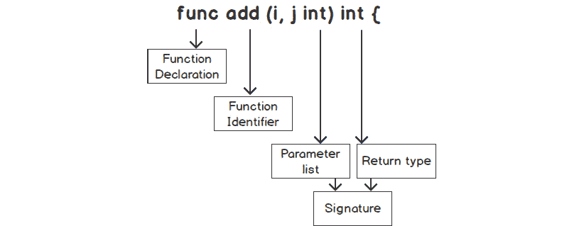
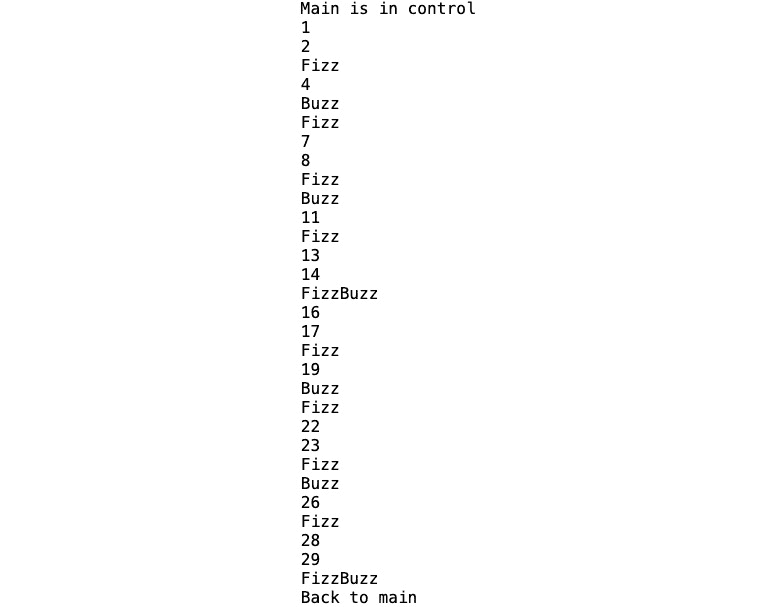
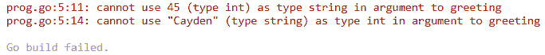
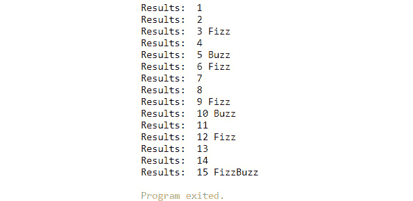
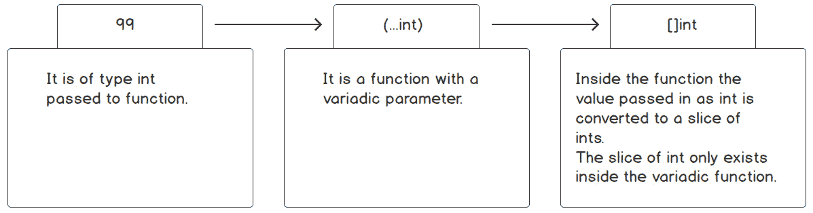
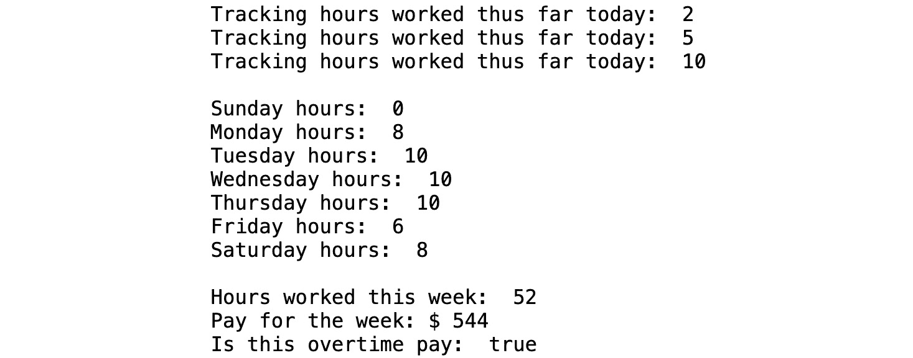

# 5. 函数

概述

本章将详细描述函数的各个部分，例如定义函数、函数标识符、参数列表、返回类型和函数体。我们还将探讨设计函数时的最佳实践，例如函数执行单一任务、如何减少代码、使函数小型化以及确保函数可重用。

到本章结束时，你将能够描述函数以及构成函数的不同部分，并评估函数的变量作用域。你将学会创建和调用函数；利用可变参数和匿名函数，并为各种结构创建闭包。你还将学会将函数用作参数和返回值；以及与函数一起使用`defer`语句。

# 简介

函数是许多语言的核心部分，Go 语言也不例外。函数是一段被声明以执行任务的代码。Go 函数可以有零个或多个输入和输出。将 Go 与其他编程语言区分开来的一个特性是它支持多个返回值；大多数编程语言都限制为只有一个返回值。

在下一节中，我们将看到 Go 函数的一些与其他语言不同的特性，例如返回多个类型。我们还将看到 Go 支持一等函数。这意味着 Go 有将变量分配给函数、将函数作为参数传递以及将函数作为函数的返回类型的能力。我们将展示如何使用函数将复杂部分分解成更小的部分。

Go 语言中的函数被视为一等公民和高级函数。一等公民是将函数分配给变量的函数。高级函数是可以接受函数作为参数的函数。Go 函数的丰富特性使它们能够在以下方式中用于各种段：

+   将函数作为参数传递给另一个函数

+   从函数中返回一个函数值

+   函数作为一种类型

+   闭包

+   匿名函数

+   将函数分配给变量

我们将查看 Go 支持的所有这些功能。

# 函数

函数是 Go 语言的关键部分，我们应该了解它们的位置。让我们考察一下使用函数的一些原因：

+   **分解复杂任务**：函数用于执行任务，但如果任务很复杂，那么应该将其分解成更小的任务。函数可以用于解决更大的问题的小任务。小任务更容易管理，使用函数解决特定任务会使整个代码库更容易维护。

+   **减少代码**：你应该使用函数的一个好迹象是在你的程序中看到相似的代码重复出现。当你有重复的代码时，它增加了维护的难度。如果你需要做一次更改，你将有多处代码需要更改。

+   **可重用性**：一旦你定义了你的函数，你可以重复使用它。它也可以被其他程序员使用。这种函数的共享将减少代码行数并节省时间，因为你不需要重新发明轮子。在设计函数时，我们应该遵循以下一些准则：

+   **单一职责**：一个函数应该执行一个任务。例如，一个函数不应该计算两点之间的距离并估计在这两点之间旅行的所需时间。应该为每个任务有一个函数。这允许更好地测试该函数并更容易维护。将函数缩小到执行单一任务是有难度的，所以如果你第一次没有做对，不要气馁。即使是经验丰富的程序员在为函数分配单一职责时也会遇到困难。

+   **体积小**：函数不应该超过数百行代码。这是代码需要重构的迹象。当我们有大型函数时，更有可能违反单一职责原则。一个好的经验法则是尝试将函数大小限制在大约 25 行代码；然而，这不是一个硬性规则。保持代码简洁的好处是它减少了调试大型函数的复杂性。它还使得编写具有更好代码覆盖率的单元测试更容易。

## 函数的部分

我们现在将探讨定义函数所涉及的不同组件。以下是一个函数的典型布局：



图 5.1：函数的不同部分

函数的不同部分在此处描述：

+   `func` 关键字。

+   `calculateTax`、`totalSum` 和 `fetchId`。

    标识符应该是描述性的，使得代码易于阅读，并使函数的目的易于理解。标识符不是必需的。你可以有一个没有名称的函数；这被称为匿名函数。匿名函数将在本章的后续部分详细讨论。

    注意

    当函数名的第一个字母是小写时，那么该函数在包外部不可导出。这意味着它们是私有的，不能从包外部调用。它们只能在包内部调用。

    使用驼峰命名法时请记住这一点。如果你想使你的函数可导出，函数名的第一个字母必须大写。

+   `name string`, `age int`)。参数是函数的局部变量。

    参数对于函数是可选的。一个函数可能没有任何参数。一个函数可以有零个或多个参数。

    当两个或多个参数具有相同的类型时，你可以使用所谓的简写参数表示法。这消除了为每个参数指定相同类型的需要。例如，如果你的参数是(`firstName string`, `lastName string`)，它们可以缩短为(`firstName`, `lastName string`)。这减少了参数输入的冗长性，并增加了函数参数列表的可读性。

+   **返回类型**：返回类型是一系列数据类型，如布尔值、字符串、映射或可以返回的另一个函数。

    在声明函数的上下文中，我们把这些类型称为返回类型。然而，在调用函数的上下文中，它们被称为返回值。

    返回类型是函数的输出。通常，它们是提供给函数的参数的结果。它们是可选的。大多数编程语言返回单个类型；在 Go 语言中，你可以返回多个类型。

+   `{}`。

    函数中的语句决定了函数做什么。函数代码是执行函数被创建来完成的任务的代码。

    如果定义了返回类型，那么函数体中需要有一个`return`语句。`return`语句使函数立即停止并返回`return`语句之后列出的值类型。返回类型列表和`return`语句中的类型必须匹配。

    在函数体中，可以有多个`return`语句。

+   **函数签名**：尽管在先前的代码片段中没有列出，但函数签名是一个术语，它指的是输入参数与返回类型的组合。这两个单元共同构成了函数签名。

    通常，当其他人使用函数时定义函数签名时，你想要努力不对其进行更改，因为这可能会对你的代码和别人的代码产生不利影响。

随着我们通过本章的进展，我们将深入探讨函数的各个部分。通过以下讨论，这些函数部分将变得更容易理解，所以如果你现在还没有完全理解所有部分，请不要担心。随着我们继续阅读本章，一切将变得清晰。

# fizzBuzz

现在我们已经研究了函数的不同部分，让我们看看这些部分如何通过各种示例来工作。让我们从一个经典的编程游戏`fizzBuzz`开始。`fizzBuzz`的规则很简单。`fizzBuzz`函数根据某些数学结果打印出各种消息。规则根据给定的数字执行以下操作之一：

+   如果数字能被`3`整除，则打印`Fizz`。

+   如果数字能被`5`整除，则打印`Buzz`。

+   如果数字能被`15`整除，则打印`FizzBuzz`。

+   否则，打印数字。

以下是实现此输出的代码片段：

```go
func fizzBuzz() {
    for i := 1; i <= 30; i++ {
        if i%15 == 0 {
            fmt.Println("FizzBuzz")
        } else if i%3 == 0 {
            fmt.Println("Fizz")
        } else if i%5 == 0 {
            fmt.Println("Buzz")
        } else {
            fmt.Println(i)
        }
    } 
}
```

现在我们来分部分查看代码：

```go
func fizzBuzz() {
```

+   `func`，如您所记得，是声明函数的关键字。这通知 Go，以下代码块将是一个函数。

+   `fizzBuzz`是我们函数的名称。在 Go 语言中，使用驼峰式命名法是惯例。

+   `()`，函数名称后面的括号是空的：我们当前实现的`FizzBuzz`游戏不需要任何输入参数。

+   参数列表`()`和开括号之间的空格将是返回类型。我们当前的实施并不需要返回类型。

+   关于`{`，与您可能了解的其他编程语言不同，Go 要求开括号与函数声明在同一行上。如果您尝试运行程序时开括号不在函数签名同一行上，您将得到一个错误。

    ```go
    for i := 1; i <= 30; i++ {
    ```

    前一行是一个`for`循环，它将`i`变量从`1`增加到`30`：

    ```go
    if i%15 == 0 {
    ```

+   `%`是取模运算符；它给出两个整数相除的余数。使用我们的函数，如果`i`是`15`，那么`15%15`将返回零。我们使用取模运算符来确定`i`是否能被`3`、`5`或`15`整除。

    注意

    随着我们越来越熟悉 Go 的概念和语言语法，代码的解释将排除我们本会多次提到的项目。

我们现在已经定义了我们的函数。它有一个特定的任务我们希望它执行，但如果我们不执行该函数，那就没有好处。那么，我们如何执行一个函数呢？我们必须调用我们的函数。当我们调用一个函数时，我们是在告诉我们的程序执行该函数。我们将在`main()`函数内部调用我们的函数。

函数可以调用其他函数。当这种情况发生时，控制权交给了被调用的函数。在被调用的函数返回数据或达到结束括号`}`后，控制权交还给调用者。让我们通过一个例子来更好地理解这一点：

```go
func main() {
  fmt.Println("Main is in control")
  fizzBuzz()
  fmt.Println("Back to main")
}
```

+   `}fmt.Println("Main is in control")`: 这条打印语句用于演示目的。它显示我们处于`main()`函数中。

+   `fizzBuzz()`: 我们现在在`main()`函数内部调用该函数。尽管我们的函数没有参数，但括号仍然是必需的，程序的控制权交给了`fizzBuzz()`函数。在`fizzBuzz()`函数完成后，控制权随后交还给`main()`函数。

+   `fmt.Println("Back to main")`: 这条打印语句用于演示目的，以显示控制权已交还给`main()`函数。

    输出将如下所示：



图 5.2：fizzBuzz 的输出

注意

即使没有输入参数，`fizzBuzz`函数后面的括号也是必需的。如果省略了它们，Go 编译器将生成一个错误，指出`fizzBuzz`已评估但未使用。这是一个常见的错误。

输出将如下所示：


图 5.3：没有括号的 fizzBuzz 输出

## 练习 5.01：创建一个函数以打印销售人员的期望评分

在这个练习中，我们将创建一个没有参数或返回类型的函数。该函数将遍历一个映射并打印映射中销售的商品名称和数量。它还将根据销售人员的销售情况打印一条声明。以下步骤将帮助您找到解决方案：

1.  使用您选择的 IDE。

1.  创建一个新文件，并将其保存为`main.go`。

1.  在`main.go`中输入以下代码。`main`将首先调用`printAge()`函数；它没有参数，也没有返回值：

    ```go
    package main
    import (
      "fmt"
    )
    func main() {
      itemsSold()
    }
    ```

1.  现在，我们将定义一个打印年龄及其消息的函数：

    ```go
    func itemsSold() {
    }
    ```

1.  在`itemsSold()`函数中，初始化一个将包含`string`到`int`键值对的映射。该映射将包含`名称`（`string`）和销售的商品数量（`int`）。名称是映射的键。我们为销售的商品数量分配了各种名称：

    ```go
      items := make(map[string]int)
      items["John"] = 41
      items["Celina"] = 109
      items["Micah"] = 24
    ```

1.  我们遍历`items`映射，将`k`分配给`key`（`名称`）和`v`分配给`value`（`商品`）：

    ```go
      for k, v := range items{
    ```

1.  我们打印出`名称`和销售的商品数量：

    ```go
        fmt.Printf("%s sold %d items and ", k, v)
    ```

1.  根据值`v`（`商品`），我们将确定打印的声明：

    ```go
        if v < 40 {
          fmt.Println("is below expectations.")
        } else if v > 40 && v <= 100 {
          fmt.Println("meets expectations.")
        } else if v > 100 {
          fmt.Println("exceeded expectations.")
        }
      }
    }
    ```

1.  打开您的终端并导航到代码目录。

1.  运行`go build`然后运行可执行文件。

    预期输出如下：

    ```go
    John sold 41 items and meets expectations.
    Celina sold 109 items and exceeded expectations.
    Micah sold 24 items and is below expectations.
    ```

在这个练习中，我们看到了函数的一些基本部分。我们展示了如何使用`func`关键字声明函数，然后是如何给我们的函数一个标识符或名称，例如`itemsSold()`。然后我们继续向函数体中添加代码。在下一个主题中，我们将扩展函数的核心部分，并学习如何使用参数将数据传递到函数中。

注意

最好在集成开发环境（IDE）中输入代码。好处是如果您输入错误，您将看到错误消息，并可以进行一些调试以解决问题。

# 参数

参数定义了可以传递给我们的函数的参数。函数可以有零个或多个参数。尽管 Go 允许我们定义多个参数，但我们应小心不要有一个很长的参数列表；这会使代码更难阅读。这也可能表明函数正在执行多个特定任务。如果是这种情况，我们应该重构函数。以下是一个代码片段的例子：

```go
func calculateSalary(lastName string, firstName string, age int, state string, country string, hoursWorked int, hourlyRate, isEmployee bool) {
// code
}
```

上述代码是一个参数列表膨胀的函数示例。参数列表应仅与函数的单个职责相关。我们应仅定义解决函数构建的特定问题的所需参数。

参数是我们函数将用于执行其任务的输入类型。函数参数是局部于函数的，这意味着它们只对那个函数可用。它们在函数的上下文之外不可用。此外，参数的顺序必须与参数类型的正确顺序匹配。

**正确：**

```go
func main() {
  greeting("Cayden", 45)
}
func greeting(name string, age int) {
  fmt.Printf("%s is %d",name, age)
}
```

正确参数匹配时的输出如下所示：

```go
Cayden is 45
```

**错误：**

```go
func main() {
  greeting(45,"Cayden")
  }
func greeting(name string, age int) {
  fmt.Printf("%s is %d",name, age)
}
```

输出如下所示：

![图 5.4：不正确的参数匹配输出]



图 5.4：不正确的参数匹配输出

在代码的不正确版本中，我们用 `age` 参数调用 `greeting()` 函数，而该参数的类型为 `integer`，而参数的类型为 `string`。你的参数序列必须与参数输入列表的序列匹配。

此外，用户可能希望对代码迭代的 数据有更多的控制。回到 `fizzBuzz` 例子，当前的实现只做 `1` 到 `100`。用户可能需要处理不同的数字范围，因此我们需要一种方法来决定循环的结束范围。我们可以将 `fizzBuzz` 函数更改为接受输入参数。这将满足用户的需求：

```go
func main() {
  fizzBuzz(10)
}
func fizzBuzz(end int) {
  for i := 1; i <= end; i++ {
    if i%15 == 0 {
      fmt.Println("FizzBuzz")
    } else if i%3 == 0 {
      fmt.Println("Fizz")
    } else if i%5 == 0 {
      fmt.Println("Buzz")
    } else {
      fmt.Println(i)
    }
  }
}
```

上述代码片段可以这样解释：

+   在 `main()` 函数中，对于 `fizzBuzz(10)`，我们将 `10` 作为参数传递给我们的 `fizzBuzz` 函数。

+   对于 `fizzBuzz(end int)`，`topEnd` 是我们的参数名，它属于 `int` 类型。

+   我们现在的函数将只迭代到我们的结束参数的值；在这个例子中，它将迭代到 `10`。

## 参数与参数的区别

这是个讨论参数与参数区别的好时机。当你定义你的函数时，以我们的例子 `fizzBuzz(end int)` 为例，它被称为参数。当你调用一个函数，如 `fizzBuzz(10)`，10 被称为参数。此外，参数和参数的名称不需要匹配。

Go 中的函数也可以定义多个参数。我们需要向我们的 `fizzBuzz` 函数添加另一个参数以适应这个增强：

```go
func main() {
  s:= 10
  e:= 20
fizzBuzz(s,e)
}
func fizzBuzz(start int, end int) {
  for i := start; i <= end; i++ {
  // code omitted for brevity
  }
}
```

上述代码片段可以这样解释：

+   关于 `fizzBuzz(s,e)`，我们现在向 `fizzBuzz` 函数传递了两个参数。当有多个参数时，它们必须通过逗号分隔。

+   关于 `func fizzBuzz(start int, end int)`，当在函数中定义多个参数时，它们通过逗号分隔，遵循名称类型、名称类型、名称类型等顺序。

我们的 `fizzBuzz` 参数比必要的更冗长。当我们有多个相同类型的输入参数时，可以通过逗号后跟类型来分隔输入名称。这被称为简写参数表示法。请看以下使用简写参数表示法的示例：

```go
func main() {
  s,e := 10,20
  fizzBuzz(s,e)
}
func fizzBuzz(start,end int) {
  // code…
}
```

上述代码片段可以这样解释：

+   使用简写参数表示法时，调用者没有变化。

+   关于 `fizzBuzz`（`start`, `end int`），`start` 和 `end` 是 `int` 类型。为了适应简写参数表示法，函数体中不需要做任何更改。

## 练习 5.02：将索引值映射到列标题

我们将要创建的函数将接受一个从 CSV 文件中获取的列标题切片。它将打印出我们感兴趣的标题的索引值映射：

1.  打开您选择的 IDE。

1.  创建一个新文件并保存为 `main.go`。

1.  在 `main.go` 中输入以下代码：

    ```go
    package main
    import (
      "fmt"
      "strings"
    )
    func main() {
      hdr :=[]string{"empid","employee","address","hours worked","hourly rate",     "manager"}
      csvHdrCol(hdr)
      hdr2 :=[]string{"employee","empid","hours worked","address",     "manager","hourly rate"}
      csvHdrCol(hdr2)
    }
    func csvHdrCol   (header []string) {
            csvHeadersToColumnIndex:= make(map[int]string)
    ```

    首先，我们将一个变量赋值给 `int` 和 `string` 的键值对。`key`（`int`）将是我们的 `header`（`string`）列的索引。索引将映射到列标题。

1.  我们遍历`header`以处理切片中的每个字符串：

    ```go
    for i, v := range header {
    ```

1.  对于每个字符串，移除字符串前后任何多余的空格。一般来说，我们应该始终假设我们的数据可能包含一些错误字符：

    ```go
     v = strings.TrimSpace(v)
    ```

1.  在我们的 `switch` 语句中，我们将所有匹配项的字母大小写转换为小写。如您所知，Go 是一种区分大小写的语言。我们需要确保匹配时的大小写相同。当我们的代码找到标题时，它会在映射中设置标题的索引值：

    ```go
                    switch strings.ToLower(v) {
                    case "employee":
                            csvHeadersToColumnIndex[i] = v
                    case "hours worked":
                            csvHeadersToColumnIndex[i] = v
                    case "hourly rate":
                            csvHeadersToColumnIndex[i] = v
          }
      }
    ```

1.  通常，我们不会打印出结果。我们应该返回 `csvHeadersToColumnIndex`，但由于我们还没有讲解如何返回值，所以我们现在将其打印出来：

    ```go
           fmt.Println(csvHeadersToColumnIndex)
    }
    ```

1.  打开您的终端并导航到代码目录。

1.  运行 `go build` 并运行可执行文件。

    预期输出如下：

    ```go
    Map[1:employee 3:hours worked 4: hourly rate]
    Map[0:employee 2:hours worked 5: hourly rate]
    ```

在这个练习中，我们看到了如何通过为我们的函数定义一个参数来接受数据，我们的函数调用者能够向函数传递参数。我们将继续发现 Go 中函数可以提供的各种能力。我们已经看到了如何将数据放入我们的函数中。在下一节中，我们将看到如何从我们的函数中获取数据。

## 函数变量作用域

在设计函数时，我们需要考虑变量作用域。变量的作用域决定了变量在应用程序的不同部分中可访问或可见的位置。在函数内部声明的变量被认为是局部变量。这意味着它们只能被函数体内的代码访问。您无法访问函数外部的变量。调用函数无法访问被调用函数内部的变量。输入参数的作用域与函数的局部变量作用域相同。

在调用函数中声明的变量作用域限定在该函数内。这意味着这些变量是函数的局部变量，且这些变量在函数外部不可访问。我们的函数无法访问调用函数的变量。要访问这些变量，它们必须作为输入参数传递给我们的函数：

```go
func main() {
  m:= "Uncle Bob"
  greeting()
}
func greeting() {
  fmt.Printf("Greeting %s", m)
}
```

![图 5.5：m 变量未定义的错误输出]


![图 5.5：m 变量未定义的错误输出]

之前的代码片段将在`func greeting()`中导致错误，指出`m`未定义。这是因为`m`变量是在`main()`内部声明的。`greeting()`函数无法访问`m`变量。为了使其能够访问，必须将`m`变量作为输入参数传递给`greeting()`函数：

```go
func main() {
  m:= "Uncle Bob"
  greeting(m)
  fmt.Printf("Hi from main: %s", s)
}
func greeting(name string) {
  fmt.Printf("Greeting %s",name)
  s:= "Slacker"
  fmt.Printf("Greeting %s",s)
}
```


图 5.6：s 变量未定义时的错误输出

之前的代码片段将在`func main()`中导致错误。错误将指出`s`未定义。这是因为`s`变量是在`greeting()`函数中声明的。`main()`函数无法访问`s`变量。`s`变量仅在`greeting()`函数体内部的代码中可见。

这些只是我们在声明和访问变量时需要考虑的一些因素。了解函数内部变量与函数外部声明的变量的作用域关系非常重要。当您尝试访问变量但未处于您尝试访问的上下文的作用域时，可能会造成一些混淆。本章中的示例应有助于您理解变量的作用域。

## 返回值

到目前为止，我们创建的函数没有任何返回值。函数通常接受输入，对这些输入执行一些操作，然后返回这些输入的结果。大多数编程语言只返回一个值。Go 允许您从函数中返回多个值。这是 Go 函数的一个特性，使其与其他编程语言区分开来。

## 练习 5.03：创建具有返回值的 fizzBuzz 函数

我们将对我们的`fizzBuzz`函数进行一些增强。我们将将其修改为只接受一个整数。如果调用者希望这样做，我们将把执行循环的责任留给调用者。此外，我们将有两个返回值。第一个将是提供的数字和相应的文本，空字符串、`fizz`、`buzz`或`fizzbuzz`。以下步骤将帮助您找到解决方案。

1.  打开您选择的 IDE。

1.  创建一个新文件，并将其保存到`$GOPATH\functions\fizzBuzzreturn\main.go`。

1.  在`main()`函数中，将变量分配给我们的函数的返回值。`n,` `s`变量分别对应从我们的函数返回的值，`int`, `string`:

    ```go
    func main() {
      for i := 1; i <= 15; i++ {
        n, s := fizzBuzz(i)
        fmt.Printf("Results:  %d %s\n", n, s)
      }
    }
    ```

1.  `fizzBuzz`函数现在返回两个值；第一个是`int`，后面跟着一个字符串。

    ```go
    func fizzBuzz(i int) (int, string) {
      switch {
    ```

1.  通过将 `if{}else{}` 语句替换为 `switch` 语句来简化 `if{}else{}` 语句。在编写代码时，您应该寻找简化事物和使代码更易读的方法。`case i%15 ==0` 等同于我们之前的 `if i%15 == 0` 语句。用我们之前的 `fmt`。`Println()` 语句替换它们，用 `return` 语句替换。`return` 语句将立即停止函数的执行并将结果返回给调用者：

    ```go
      case i%15 == 0:
        return i, "FizzBuzz"
      case i%3 == 0:
        return i, "Fizz"
      case i%5 == 0:
        return i, "Buzz"
      }
      return i, ""
    }
    ```

    预期输出如下：



图 5.7：fizzBuzz 函数的返回值输出

在这个练习中，我们看到了如何从函数中返回多个值。我们能够将变量分配给函数的多个返回值。我们还注意到分配给函数的变量与返回值的顺序相匹配。在下一节中，我们将学习在函数体中，我们可以执行裸返回，其中我们不需要在我们的返回语句中指定要返回的变量。

## 活动五.01：计算员工的工时

在这个活动中，我们将创建一个函数来计算员工一周的工作时间，这将用于计算应支付的工资金额。`developer` 结构体有一个名为 `Individual` 的字段，其类型为 `Employee`。`developer` 结构体跟踪他们收取的小时费率和每天工作的小时数。以下步骤将帮助您找到解决方案：

1.  创建一个 `Employee` 类型，包含以下字段：`Id` 为 `int`，`FirstName` 为 `string`，和 `LastName` 为 `string`。

1.  创建一个 `developer` 类型，包含以下字段：`Individual Employee`，`HourlyRate` `int`，和 `WorkWeek` `[7]int`。

1.  为一周的七天创建一个 `enum`。这将是一个 `Weekday` `int` 类型的枚举，并为每周的每一天声明一个常量。

1.  为 `Developer` 创建一个名为 `LogHours` 的指针接收器方法，该方法将 `WeekDay` 类型和 `int` 类型作为输入。将当天工作的小时数分配给 `Developer` 工作周切片。

1.  创建一个名为 `HoursWorked()` 的方法，这是一个指针接收器。该方法将返回已工作的总小时数。

1.  在 `main()` 函数中，初始化并创建一个 `Developer` 类型的变量。

1.  在 `LogHours` 方法中，调用两天的方法（例如周一和周二）。

1.  打印上一步中两天的工作时间。

1.  接下来，打印 `HoursWorked` 方法的输出结果。

    以下为预期输出：

    ```go
    Hours worked on Monday:  8
    Hours worked on Tuesday:  10
    Hours worked this week:  18
    ```

    注意

    本活动的解决方案可以在第 704 页找到。

这个活动的目的是展示将问题分解为可管理的任务以供函数实现的能力，以便我们的每个函数都有一个单一的责任。`LogHours`负责分配每天的工作时间。`HoursWorked`使用在`LogHours`中分配的值来显示每天的工作时间。我们使用了函数的返回类型来显示数据。这个练习展示了正确使用函数来解决问题。

# 裸返回

注意

返回值的函数必须将`return`语句作为函数中的最后一个语句。如果你省略了`return`语句，Go 编译器会给你以下错误：“函数末尾缺少返回。”

通常，当一个函数返回两种类型时，第二种类型是`error`类型。我们还没有讨论错误，所以在这些例子中，我们没有演示它们。了解在 Go 中，第二个返回类型通常是`error`类型是很好的。

Go 还允许忽略返回的变量。例如，假设我们对从我们的`fizzBuzz`函数返回的`int`值不感兴趣。在 Go 中，我们可以使用所谓的空标识符；它提供了一种在赋值中忽略值的方法：

```go
_, err := file.Read(bytes)
```

例如，当读取文件时，我们可能不关心读取的字节数。在这种情况下，我们可以使用空标识符`_`来忽略返回的值。当函数返回了不需要我们程序中的额外数据时，比如读取文件，它是一个很好的忽略返回值的候选。

注意

你会发现，许多函数将错误作为第二个返回值返回。你不应该忽略函数返回的错误。忽略函数返回的错误可能会导致意外的行为。错误返回值应该得到适当的处理。

```go
func main() {
  for i := 1; i <= 15; i++ {
    _, s := fizzBuzz(i)
    fmt.Printf("Results: %s\n",s)
  }
}
```

在前面的例子中，我们使用空标识符`_`来忽略返回的`int`值：

```go
    _, s := fizzBuzz(i)
```

当从函数中赋值时，你必须为返回的值提供一个占位符。在进行赋值时，占位符必须与函数的返回值数量相匹配。`_`和`s`是`int`和`string`返回值的占位符。

Go 还有一个功能允许你为返回值命名。如果你使用这个功能，它可以使得你的代码更易于阅读以及自文档化。如果你为返回变量命名，它们将受到与之前主题中讨论的局部变量相同的约束。通过命名返回值，你正在在函数中创建局部变量。然后你可以将这些返回变量的值赋值，就像你处理输入参数一样：

```go
func greeting() (name string, age int){
  name = "John"
  age = 21
  return name, age
}
```

在前面的代码中，（`name string`，`age int`）是命名的返回值。现在它们是函数的局部变量。

由于 `name` 和 `age` 是在函数的返回列表中声明的局部变量，现在您可以给它们赋值。它们可以被视为局部变量。在 `return` 语句中指定返回值。如果您没有在返回中指定变量名，它被称为 **裸返回**：

```go
func greeting() (name string, age int){
  name = "John"
  age = 21
  return 
}
```

考虑前面的代码块。这段代码与之前相同，只是返回没有命名要返回的变量。`return` 语句将返回返回列表中命名的变量。

裸返回的一个缺点是它可能在阅读代码时引起混淆。为了避免混淆和其他可能的问题，建议您避免使用裸返回功能。这可能会使跟踪要返回的变量变得困难。使用裸返回时也可能出现阴影问题：

```go
func message() (message string, err error) {
  message = "hi"
  if message == "hi"{
    err := fmt.Errorf("say bye\n")
    return
  }
  return
}
```

前面的代码将导致以下错误：


图 5.8：使用裸返回值的阴影输出

这是因为 `err` 变量在 `return` 中命名并在 `if` 语句中初始化。回想一下，在花括号内初始化的变量，例如 `for` 循环、`if` 语句和 `switch` 语句，其作用域仅限于该上下文，意味着它们只能在那些花括号内可见和访问。

## 练习 5.04：使用返回值将 CSV 索引映射到列标题

在 *练习 5.02*，*将索引值映射到列标题* 中，我们只打印了索引到列标题的结果。在这个练习中，我们将返回映射作为结果。返回的映射是索引到列标题的映射。以下步骤将帮助您找到解决方案：

1.  打开您选择的 IDE。

1.  打开上一个练习中的文件：`$GOPATH\functions\indxToColHdr\main.go`。

1.  在 `main.go` 中输入以下代码：

    ```go
    package main
    import (
      "fmt"
      "strings"
    )
    ```

1.  接下来，在 `main()` 函数中，定义列的标题。首先，我们将一个变量赋值给 `int` 和 `string` 的键值对。`key(int)` 将是 `header(string)` 列的索引。索引将映射到列标题：

    ```go
    func main() {
      hdr := []string{"empid", "employee", "address", "hours worked", "hourly     rate", "manager"}
      result := csvHdrCol(hdr)
      fmt.Println("Result:")
      fmt.Println(result)
      fmt.Println()
      hdr2 := []string{"employee", "empid", "hours worked", "address",     "manager", "hourly rate"}
      result2 := csvHdrCol(hdr2)
      fmt.Println("Result2:")
      fmt.Println(result2)
      fmt.Println()
    }
    func csvHdrCol(hdr []string) map[int]string {
      csvIdxToCol := make(map[int]string)
    ```

1.  我们遍历 `header` 来处理切片中的每个字符串：

    ```go
    for i, v := range hdr {
    ```

1.  对于每个字符串，我们移除字符串前后任何多余的空格。一般来说，我们应该始终假设我们的数据可能包含一些错误字符：

    ```go
    v = strings.TrimSpace(v)
    ```

1.  在我们的 `switch` 语句中，我们将所有匹配项的字母大小写转换为小写。如您所回忆的，Go 是一种区分大小写的语言。我们需要确保匹配时的大小写相同。当我们的代码找到标题时，它将索引值设置为映射中的标题：

    ```go
    switch strings.ToLower(v) {
        case "employee":
          csvIdxToCol[i] = v
        case "hours worked":
          csvIdxToCol[i] = v
        case "hourly rate":
          csvIdxToCol[i] = v
        }
      }
      return csvIdxToCol
    }
    ```

1.  打开终端并导航到代码目录。

1.  运行 `go build` 并运行可执行文件。

    预期的返回值输出如下：

    ```go
    Result1:
    Map[1:employee 3:hours worked 4: hourly rate]
    Result2:
    Map[0:employee 2:hours worked 5: hourly rate]
    ```

在这个练习中，我们看到了一个将 CSV 索引映射到列标题的实际例子。我们使用一个函数来解决这个复杂问题。我们能够使函数返回一个类型为 `map` 的单一值。在下一节中，我们将看到函数如何接受单个参数中的可变数量的参数值。

## 可变参数函数

可变参数函数是一个接受可变数量参数值的函数。当指定类型的参数数量未知时，使用可变参数函数是很好的。

```go
func f(parameterName …Type)
```

前面的函数是一个可变参数函数的例子。在类型前面的三个点（`…`）被称为 `Type` 到 `parameterName`。可变变量可以接受零个或多个变量作为参数：

```go
func main() {
  nums(99,100)
  nums(200)
  nums()
}
func nums(i ...int) {
  fmt.Println(i)
}
```

`nums` 函数是一个接受类型为 `int` 的可变参数函数。如前所述，你可以传递零个或多个该类型的参数。如果有多个值，你用逗号分隔它们，如 `nums(99,100)`。如果只有一个参数要传递，你只需传递该参数，如 `nums(200)`。如果没有参数要传递，你可以留空，如 `nums()`。

可变参数函数可以有其他参数。然而，如果你的函数需要多个参数，可变参数必须是函数中的最后一个参数。此外，每个函数只能有一个可变变量。以下函数是错误的，将在编译时产生错误。

**错误函数：**

```go
package main
import "fmt"
func main() {
  nums(99, 100,"James")
}
func nums(i ...int,str person) {
  fmt.Println(str)
  fmt.Println(i)
}
```


图 5.9：可变参数语法错误输出

**正确函数：**

```go
package main
import "fmt"
func main() {
  nums("James",99, 100)
}
func nums(str string, i ...int) {
  fmt.Println(str)
  fmt.Println(i)
}
```

输出将如下所示：

```go
James
[99 100]
```

到现在为止，你可能已经猜到了函数内部`Type`的实际类型是一个切片。该函数接收传入的参数并将它们转换为指定的新的切片。例如，如果可变参数类型是`int`，那么一旦你进入函数，Go 会将该可变参数`int`转换为整数切片：



图 5.10：将可变参数 int 转换为整数切片

```go
package main
import "fmt"
func main() {
  nums(99, 100)
}
func nums(i ...int) {
  fmt.Println(i)
  fmt.Printf("%T\n", i)
  fmt.Printf("Len: %d\n", len(i))
  fmt.Printf("Cap: %d\n", cap(i))
}
```

可变参数函数的输出如下：

```go
[99 100]
[] int
Len: 2
Cap: 2
```

`nums()` 函数表明 `i` 的可变类型是整数切片。一旦进入函数，`i` 将是一个整数切片。可变类型具有长度和容量，这对于切片来说是预期的。在下一个代码片段中，我们将尝试将整数切片传递给可变参数函数 `nums()`：

```go
package main
import "fmt"
func main() {
  i := []int{5,10,15}
  nums(i)
}
func nums(i ...int) {
  fmt.Println(i)
}
```


图 5.11：可变参数函数错误

为什么这个代码片段不起作用？我们刚刚证明了函数内的可变变量是`slice`类型。原因是函数期望一个类型为`int`的参数列表被转换为切片。可变函数通过将传递给函数的参数转换为指定类型的切片来工作。然而，Go 有一个机制可以将切片传递给可变参数函数。我们需要使用解包运算符；它是三个点（`…`）。当你调用一个可变参数函数，并且你想将一个切片作为参数传递给可变参数时，你需要在变量之前放置三个点：

```go
func main() {
  i := []int{5,10,15}
  nums(i…)
}
func nums(i ...int) {
  fmt.Println(i)
}
```

这个函数版本与之前的版本的区别在于对函数`nums`的调用代码。三个点放在`i`变量之后表示一个整数切片。这允许将切片传递给可变参数函数。

## 练习 5.05：求和数字

在这个练习中，我们将总结一个可变数量的参数。我们将以参数列表和切片的形式传递参数。返回值将是一个`int`类型，即我们传递给函数的值的总和。以下步骤将帮助您找到解决方案：

1.  打开您选择的 IDE。

1.  创建一个新文件并将其保存到`$GOPATH\functions\variadic\main.go`。

1.  在`main.go`中输入以下代码：

    ```go
    package main
    import (
      "fmt"
    )
    func main() {
      i := []int{5, 10, 15}
      fmt.Println(sum(5, 4))
      fmt.Println(sum(i...))
    }
    ```

1.  `sum`函数接受一个可变参数，参数类型为`int`。由于它被转换为切片，我们可以遍历这些值并返回所有传递值的总和：

    ```go
    func sum(nums ...int) int {
      total := 0
      for _, num := range nums {
        total += num
      }
      return total
    }
    ```

1.  打开终端并导航到代码目录。

1.  运行`go build`并运行可执行文件。

    求和数字的预期输出如下：

    ```go
    9
    30
    ```

在这个练习中，我们看到了通过使用可变参数，我们可以接受未知数量的参数。我们的函数允许我们求和任意数量的整数。我们可以看到，可变参数可以用于解决特定问题，其中作为参数传递的相同类型的值的数量是未知的。在下一节中，我们将探讨如何创建一个没有名称的函数并将函数赋给一个变量。

## 匿名函数

到目前为止，我们一直在使用命名函数。如您所回忆的那样，命名函数是有标识符或函数名的函数。匿名函数可以在另一个函数内声明。

匿名函数，也称为函数字面量，是没有函数名的函数，因此得名“匿名函数”。匿名函数的声明方式与命名函数的声明方式类似。唯一的不同之处在于声明中省略了函数名。匿名函数基本上可以执行 Go 中正常函数所能做的任何事情，包括接受参数和返回值。

在本节中，我们将介绍匿名函数的基本原理及其一些基本用法。稍后，您还将看到如何充分利用匿名函数。匿名函数用于以下方面：

+   闭包实现

+   `defer`语句

+   定义用于与 Goroutine 一起使用的代码块

+   定义一次使用的函数

+   将函数传递给另一个函数

    以下是一个匿名函数的基本声明：

    ```go
    func main() {
      func() {
        fmt.Println("Greeting")
      }()
    }
    ```

+   注意，我们是在另一个函数内部声明函数。与命名函数一样，您必须以`func`关键字开始声明函数。

+   在`func`关键字之后通常是函数的名称，但匿名函数没有函数名。相反，是空括号。

+   `func`关键字后面的空括号是定义函数参数的地方。

+   接下来是开括号，`{`，它标志着函数体的开始。

+   函数体仅有一行；它将打印"`Greeting`"。

+   关闭括号，`}`，表示函数的结束。

+   最后的一组括号称为执行括号。这些括号调用匿名函数。函数将立即执行。稍后，我们将看到如何在函数的另一个位置执行匿名函数。

    您也可以向匿名函数传递参数。要能够向匿名函数传递参数，它们必须在执行括号中提供：

    ```go
    func main() {
      message := "Greeting"
      func(str string) {
        fmt.Println(str)
      }(message)
    }
    ```

+   `func (str string)`: 正在声明的匿名函数有一个类型为`string`的输入参数。

+   `} (message)`: 被传递到执行括号中的参数`message`。

我们目前是在声明匿名函数时立即执行它们，但还有其他执行匿名函数的方法。您还可以将匿名函数保存到变量中。这导致了一系列不同的机会，我们将在本章中探讨：

```go
func main() {
  f := func() {
    fmt.Println("Executing an anonymous function using a variable")
  }
  fmt.Println("Line after anonymous function")
  f()
}
```

+   我们将`f`变量赋值给我们的匿名函数。

+   `f`现在为`func()`类型。

+   `f`现在可以用来调用匿名函数，方式与命名函数类似。您必须在`f`变量之后包含`()`来执行函数。

## 练习 5.06：创建一个用于计算数字平方根的匿名函数

匿名函数非常适合您想在函数内部执行的小段代码。在这里，我们将创建一个匿名函数，该函数将接受一个参数。然后它将计算平方根。以下步骤将帮助您找到解决方案：

1.  使用您选择的 IDE。

1.  创建一个新文件，并将其保存到`$GOPATH\functions\anonymousfnc\main.go`。

1.  在`main.go`中输入以下代码。我们将我们的`x`变量赋值给匿名函数。我们的匿名函数接受一个参数（`i int`）。它还返回一个`int`类型的值：

    ```go
    package main
    import (
    	"fmt"
    )
    func main() {
      j := 9
      x := func(i int)int {
        return i * i
      }
    ```

1.  注意，最后一个花括号没有`()`来执行函数。我们使用`x(j)`来调用我们的匿名函数：

    ```go
    fmt.Printf("The square of %d is %d\n", j, x(j))
    }
    ```

1.  打开终端并导航到代码目录。

1.  运行`go build`并运行可执行文件。

    预期输出如下：

    ```go
    The square of 9 is 81
    ```

在这个练习中，我们看到了如何将变量分配给函数，然后通过使用分配给它的变量来调用该函数。我们看到了当我们需要一个可能在我们程序中不可重用的小型函数时，我们可以创建一个匿名函数并将其分配给一个变量。在下一节中，我们将扩展匿名函数的使用到闭包。

# 闭包

我们已经通过一些基本示例介绍了匿名函数的语法。现在，我们已经对匿名函数的工作原理有了基本理解，我们将探讨如何使用这个强大的概念。闭包是匿名函数的一种形式。常规函数不能引用自身之外的变量；然而，匿名函数可以引用其定义之外的变量。闭包可以使用与匿名函数声明在同一级别的变量。这些变量不需要作为参数传递。当匿名函数被调用时，它可以访问这些变量：

```go
func main() {
  i := 0
  incrementor := func() int {
    i +=1
    return i
    }
  fmt.Println(incrementor())
  fmt.Println(incrementor())
  i +=10
  fmt.Println(incrementor())
}
```

**代码概要：**

1.  我们在`main()`函数中初始化一个变量`i`并将其设置为`0`。

1.  我们将`incrementor`赋值给我们的匿名函数。

1.  匿名函数增加`i`并返回它。注意，我们的函数没有任何输入参数。

1.  然后，我们打印了两次`incrementor`的结果，得到`1`和`2`。

1.  注意，在我们的函数外部，我们通过`i`增加`10`。这是一个问题。我们希望`i`是隔离的，并且不改变，因为这不是我们想要的行为。当我们再次打印`incrementor`的结果时，它将是`12`。我们希望它是`3`。我们将在下一个示例中纠正这个问题。

我们注意到前一个示例中的一个问题是，主函数中的任何代码都可以访问`i`。正如我们在示例中看到的，`i`可以在函数外部被访问和修改。这不是我们想要的行为；我们希望增量器是唯一可以改变该值的。换句话说，我们希望`i`被保护，防止其他函数修改它。唯一应该修改它的函数是我们调用匿名函数时：

```go
func main() {
  increment := incrementor()
  fmt.Println(increment())
  fmt.Println(increment())
}
func incrementor() func() int {
  i :=0
  return func() int {
    i += 1
    return i
  }
}
```

**代码概要：**

1.  我们声明了一个名为`incrementor()`的函数。这个函数的返回类型是`func()` `int`。

1.  `i := 0`：我们在`incrementor()`函数的级别初始化我们的变量；这与我们在前一个示例中所做的是类似的，只是它是在`main()`函数级别，任何在那个级别的人都可以访问`i`。只有`incrementor()`函数可以访问这个实现中的`i`变量。

1.  我们返回我们的匿名函数`func()` `int`，该函数增加`i`变量。

1.  在 `main()` 函数中，`increment:=incrementor()` 将一个变量赋值给返回 `func()` `int` 的函数。需要注意的是，`incrementor()` 在这里只执行一次。在我们的 `main()` 函数中，它不再被引用或执行。

1.  `Increment()` 是 `func()` `int` 类型。每次调用 `increment()` 都会运行匿名函数代码。即使在 `incrementor()` 执行之后，它仍然引用 `i` 变量。

## 练习 5.07：创建一个用于递减计数器的闭包函数

在这个练习中，我们将创建一个从给定起始值递减的闭包。我们将结合向匿名函数传递参数和利用闭包的知识。以下步骤将帮助您找到解决方案：

1.  打开您选择的 IDE。

1.  在 `$GOPATH\closureFnc\variadic\main.go` 创建一个新文件并保存。

1.  在 `main.go` 中输入以下代码：

    ```go
    func main() {
    import "fmt"
      counter := 4
    ```

1.  我们首先看看 `decrement` 函数。它接受一个 `int` 类型的参数，并有一个返回值 `func()int`。在之前的例子中，变量是在函数内部声明的，但在匿名函数之前。在这个练习中，我们将其作为输入参数：

    ```go
    x:= decrement(counter)
      fmt.Println(x())
      fmt.Println(x())
      fmt.Println(x())
      fmt.Println(x())
    }
    ```

1.  在匿名函数内部递减 `i`：

    ```go
    func decrement(i int) func() int {
    ```

1.  在 `main()` 函数中，我们初始化一个名为 counter 的变量，用作要递减的起始整数：

    ```go
    return func() int {
    ```

1.  `x:= decrement(counter)` : `x` 被赋值为 `func()` `int`。每次调用 `x()` 都会运行匿名函数：

    ```go
        i --
        return i
      }
    }
    ```

1.  打开终端并导航到代码目录。

1.  运行 `go build` 并运行可执行文件。

    `decrement` 函数的预期输出如下：

    ```go
    3
    2
    1
    0
    ```

在这个练习中，我们看到了闭包可以访问它们之外的变量。这使得我们的匿名函数能够修改一个普通函数无法修改的变量。在下一节中，我们将探讨函数如何作为参数传递给另一个函数。

## 函数类型

如我们所见，Go 对函数的功能支持非常丰富。在 Go 中，函数也是类型，就像 `int`、`string` 和 `bool` 一样是类型。这意味着我们可以将函数作为参数传递给其他函数，函数可以从函数中返回，函数可以被赋值给变量。我们甚至可以定义自己的函数类型。函数的类型签名定义了其输入参数和返回值的类型。为了使一个函数成为另一个函数的类型，它必须具有声明的类型函数的确切签名。让我们考察一些函数类型：

```go
type message func()
```

上述代码片段创建了一个名为 message 的新函数类型。它没有输入参数，也没有任何返回类型。

让我们再看看另一个例子：

```go
type calc func(int, int) string
```

上述代码片段创建了一个名为 calc 的新函数类型。它接受两个整型参数，其返回值类型为字符串。

现在我们已经对函数类型有了基本理解，我们可以编写一些代码来演示它们的用法：

```go
package main
import (
  "fmt"
)
type calc func(int, int) string
func main() {
  calculator(add, 5, 6)
}
func add(i, j int) string {
  result := i + j
  return fmt.Sprintf("Added %d + %d = %d", i, j, result)
}
func calculator(f calc, i, j int) {
  fmt.Println(f(i, j))
}
```

让我们逐行查看代码：

```go
type calc func(int, int) string
```

`type calc` 声明 `calc` 为 `func` 类型，确定它接受两个整数作为参数并返回一个字符串：

```go
func add(i, j int) string {
  result := i + j
  return fmt.Sprintf("Added %d + %d = %d", i, j, result)
}
```

`func add(i,j int) string` 与类型 `calc` 具有相同的签名。它接受两个整数作为参数，并返回一个字符串，说明 "Adding `i + j = result`"。函数可以像 Go 中的任何其他类型一样传递给其他函数：

```go
func calculator(f calc, i, j int) {
  fmt.Println(f(i, j))
}
```

`func calculator(f calc, i, j int)` 接受类型 `calc` 作为输入。你可能记得，`calc` 类型是一个函数类型，它接受两个 `int` 类型的参数并返回一个 `string` 类型的值。任何匹配该签名的都可以传递给该函数。`func calculator` 函数返回类型为 `calc` 的函数的结果。

在 `main` 函数中，我们调用 `calculator(add,5,6)`。我们传递给它 `add` 函数。`add` 满足 `calc func` 类型的签名。

*图 5.12* 总结了前面每个函数以及它们之间的关系。该图显示了 `func add` 是 `func calc` 类型，这允许它作为参数传递给 `func calculator`：

![图 5.12：函数类型和用法]

![图片 B14177_05_12.jpg]

图 5.12：函数类型和用法

我们刚刚看到了如何创建一个函数类型并将其作为参数传递给函数。将函数作为参数传递给另一个函数并不是那么遥远。我们将稍微修改之前的示例以反映传递函数作为参数：

```go
func main() {
  calculator(add,5,6)
  calculator(subtract,10,5)
}
func calculator(f func(int,int)int, i, j int) {
  fmt.Println(f(i, j))
}
func add(i, j int) int {
  return i + j
}
func subtract(i, j int) int {
  return i - j
}
```

+   我们将 `add` 函数的签名修改为返回 `int` 而不是字符串。

+   我们添加了一个名为 `subtract` 的第二个函数。请注意，它的函数签名与 `add` 函数相同。`subtract` 函数简单地返回两个数字相减的结果：

    ```go
    func calculator(f func(int,int)int, i, j int) {
      fmt.Println(f(i, j))
    }
    ```

+   `calculator(f func(int,int)int,i,j int)`: `calculator` 函数现在有一个类型为 `func` 的输入参数。输入参数 `f` 是一个接受两个整数并返回一个 `int` 的函数。任何满足该签名的函数都可以传递给该函数。

+   在 `main()` 函数中，`calculator` 被调用了两次：一次是用 `add` 函数和一些整数值调用，另一次是将 `subtract` 函数作为参数传递，并带有一些整数值。

将函数作为类型传递是一个非常强大的功能，只要它们的签名与传递给函数的输入参数匹配，就可以将不同的函数传递给其他函数。当你这么想的时候，这相当简单。一个函数的整数类型可以是任何整数值。同样，对于传递函数来说：只要它是正确的类型，函数可以是任何值。

函数也可以从另一个函数返回。我们在使用匿名函数和闭包时看到了这一点。在这里，我们将简要地看一下，因为我们已经在之前的章节中看到了这种语法：

```go
package main
import "fmt"
func main() {
  v:= square(9)
  fmt.Println(v())
  fmt.Printf("Type of v:  %T",v)
}
func square(x int) func() int {
  f := func() int {
    return x * x
  }
  return f
}
```

返回函数看起来如下：

```go
81
Type of v: func() int
```

+   `square(x int) func() int`: `square` 函数接受一个 `int` 类型的参数，并返回一个返回 `int` 的函数类型：

    ```go
    func square(x int) func() int {
      f := func() int {
        return x * x
      }
      return f
    }
    ```

+   在 `square` 函数体中，我们分配一个变量 `f` 给一个匿名函数，该匿名函数返回输入参数 `x` 的平方值。

+   `square` 函数的 `return` 语句返回一个匿名函数，该函数类型为 `func()` int。

+   `v` 被分配给 `square` 函数的返回值。如您所回忆的，返回值是 `func() int` 类型。

+   `v` 已被分配为 `func ()int` 类型；然而，它尚未被调用。我们将在 `print` 语句中调用它。

+   `fmt.Printf("Type of v: %T",v)`: 这条语句只是打印出 `v` 的类型，它是 `func()int`。

## 练习 5.08：创建各种函数来计算薪水

我们将创建几个函数。我们需要计算开发人员和经理的薪水。我们希望这个解决方案能够扩展到未来计算其他薪水的可能性。我们将创建计算开发人员和经理薪水的函数。然后我们将创建另一个函数，该函数将接受前面提到的函数作为输入参数。以下步骤将帮助您找到解决方案：

1.  使用您选择的 IDE。

1.  创建一个新文件，并将其保存到 `$GOPATH\function\funcAsParam\main.go`。

1.  在 `main.go` 中输入以下代码：

    ```go
    package main
    import "fmt"
    func main() {
      devSalary := salary(50,2080, developerSalary)
      bossSalary := salary(150000,25000,managerSalary)
      fmt.Printf("Boss salary: %d\n",bossSalary)
      fmt.Printf("Developer salary: %d\n",devSalary)
    }
    ```

1.  `salary` 函数接受一个接受两个整数作为参数并返回整数的函数。因此，任何匹配该签名的函数都可以作为 `salary` 函数的参数传入：

    ```go
    func salary(x,y int, f func(int,int)int)int{
    ```

1.  在 `salary()` 函数的主体中，`pay` 被分配给从 `f` 函数返回的值。它将 `x` 和 `y` 参数作为参数传递给 `f` 参数：

    ```go
      pay := f(x,y)
      return pay
    }
    ```

1.  注意，`managerSalary` 和 `developerSalary` 的签名相同，并且与 `salary` 函数的 `f` 相匹配。这意味着 `managerSalary` 和 `developerSalary` 都可以作为 `func(int,int) int` 传入：

    ```go
    func managerSalary(baseSalary,bonus int) int {
      return baseSalary + bonus
    }
    ```

1.  `devSalary` 和 `bossSalary` 被分配给 `salary` 函数的结果。由于 `developerSalary` 和 `managerSalary` 满足 `func(int,int) int` 的签名，它们各自可以作为参数传入：

    ```go
    func developerSalary(hourlyRate,hoursWorked int) int {
      return hourlyRate * hoursWorked
    }
    ```

1.  打开终端并导航到代码目录。

1.  运行 `go build` 并运行可执行文件。

    预期输出如下：

    ```go
    Boss salary: 175000
    Developer salary: 104000
    ```

在这个练习中，我们看到了函数类型可以作为另一个函数的参数。这允许函数作为另一个函数的参数。这个练习展示了我们的代码可以通过拥有一个 `salary` 函数来简化。如果将来我们需要计算测试员的薪水，我们只需要创建一个与 `salary` 函数类型匹配的函数，并将其作为参数传入。这种灵活性意味着我们不需要更改 `salary` 函数的实现。在下一节中，我们将看到如何改变函数的执行流程，特别是函数返回之后。

# 延迟调用

`defer`语句将函数的执行延迟到周围函数返回。让我们试着更好地解释一下。在一个函数内部，你有一个`defer`在你正在调用的函数之前。那个函数将基本上在你当前所在的函数完成之前执行。还是不明白？也许一个例子会使这个概念更清晰：

```go
package main
import "fmt"
func main() {
  defer done()
  fmt.Println("Main:  Start")
  fmt.Println("Main:  End")
}
func done() {
  fmt.Println("Now I am done")
}
```

`defer`例子的输出如下：

```go
Main: Start
Main: End
Now I am done
```

在`main()`函数内部，我们有一个延迟执行的函数，`defer done()`。请注意，`done()`函数没有新的或特殊的语法。它只是简单地打印到`stdout`。

接下来，我们有两个打印语句。结果很有趣。`main()`函数中的两个`print`语句首先打印。尽管延迟函数在`main()`中是第一个，但它最后打印。这不是很有趣吗？它在`main()`函数中的顺序并没有决定它的执行顺序。

延迟执行的函数通常用于执行“清理”活动。这包括释放资源、关闭文件、关闭数据库连接以及删除程序创建的配置\临时文件。`defer`函数也用于从恐慌中恢复；这将在后面的章节中讨论。

使用`defer`语句不仅限于命名函数。实际上，你可以利用`defer`语句与匿名函数一起使用。以我们之前的代码片段为例，让我们将其转换为使用匿名函数的延迟调用：

```go
package main
import "fmt"
func main() {
  defer func(){
    fmt.Println("Now I am done")
  }()
  fmt.Println("Main:  Start")
  fmt.Println("Main:  End")
}
```

+   与之前的代码相比，变化不大。我们将`done`函数中的代码提取出来，创建了一个延迟的匿名函数。

+   `defer`语句放置在`func()`关键字之前。我们的函数没有函数名。如您所回忆的，没有名字的函数是匿名函数。

+   结果与上一个例子相同。在一定程度上，可读性比将延迟函数声明为命名函数更容易，就像上一个例子中那样。

在一个函数中，也常见到有多个`defer`语句。然而，它们可能不会按照你预期的顺序执行。当在函数前使用`defer`语句时，执行顺序遵循它们前面放置的`defer`语句的顺序：

```go
package main
import "fmt"
func main() {
  defer func() {
    fmt.Println("I was declared first.")
  }()
  defer func() {
    fmt.Println("I was declared second.")
  }()
  defer func() {
    fmt.Println("I was declared third.")
  }()
  f1 := func() {
    fmt.Println("Main:  Start")
  }
  f2 := func() {
    fmt.Println("Main:  End")
  }
  f1()
  f2()
}
```

多个`defer`输出的形式如下：

```go
Main: Start
Main: End
I was declared third.
I was declared second.
I was declared first.
```

+   前三个匿名函数正在执行延迟。

+   我们声明`f1`和`f2`为`func()`类型。这两个函数是匿名函数。

+   如您所见，我们的`f1()`和`f2()`按预期执行，但多个`defer`语句的执行顺序与它们在代码中声明的顺序相反。第一个`defer`是最后一个执行的，而最后一个`defer`是第一个执行的。

使用`defer`语句时必须谨慎考虑。你应该考虑的情况是当你将`defer`语句与变量一起使用时。当一个变量被传递给延迟函数时，该变量在那一刻的值将在延迟函数中使用。如果该变量在延迟函数之后被更改，它将不会在延迟函数运行时反映出来：

```go
func main() {
  age := 25
  name := "John"
  defer personAge(name,age)
  age *= 2
  fmt.Printf("Age double %d.\n",age)
}
func personAge(name string,i int) {
    fmt.Printf("%s is %d.\n", name,i)
}
```

输出如下：

```go
Age double 50.
John is 25.
```

+   `age`:= `25`: 在`defer`函数之前，我们将`age`变量初始化为`25`。

+   `name:=` `"John"`: 在`defer`函数之前，我们将`name`变量初始化为`"John"`。

+   `defer` `personAge`(`name`,`age`): 我们声明该函数将被延迟调用。

+   `age*=2`: 在延迟函数之后，我们将年龄加倍。然后我们打印加倍后的当前`age`值。

+   `personAge`(`name` `string`, `i` `int`): 这是一个被延迟调用的函数；它只打印出人和年龄。

+   结果显示了在`main`函数中将年龄加倍后的`age`值（`25`）。

+   当程序执行到达包含`defer` `personAge(name,age)`的行时，`age`的值为`25`。在`main()`函数完成之前，延迟函数运行，`age`的值仍然是`25`。在延迟函数中使用的变量是延迟之前的值，无论之后发生什么。

## 活动编号 5.02：根据工作时间计算员工的应付款项

这个活动基于之前的活动。我们将保持相同的功能，但我们将添加三个额外的功能。在这个应用程序的版本中，我们希望给员工提供在未记录的情况下跟踪他们一天中工作时间的功能。这将使员工在一天结束时记录工作时间之前能更好地跟踪他们的工作时间。我们还将增强应用程序以计算员工的工资。应用程序将计算他们加班的工资。应用程序还将打印出每天工作了多少小时的详细信息：

1.  创建一个名为`nonLoggedHours()`的函数（`func(int)` `int`）。每次调用此函数时，它将计算未记录的员工工作时间。你将在函数内部使用闭包。

1.  创建一个名为`PayDay()`的方法（`int`, `bool`）。此方法将计算每周工资。它需要考虑加班工资。对于超过 40 小时的工作，该方法将以两倍的时薪支付。该函数将返回`int`类型的每周工资，以及`bool`类型的加班工资标志。如果员工工作了超过`40`小时，布尔值将为`true`；如果他们工作少于`40`小时，则为`false`。

1.  创建一个名为`PayDetails()`的方法。此方法将打印出员工每天的工作时间和当天的工作时间。它将打印出每周的总工作时间、每周的工资以及工资是否包含加班工资。

1.  在 `main` 函数内部，初始化一个类型为 `Developer` 的变量。将一个变量分配给 `nonLoggedHours`。打印分配给 `nonLoggedHours` 的变量，其值为 `2`、`3` 和 `5`。

1.  此外，在 `main()` 函数中，记录以下几天的时数：周一 8 小时，周二 10 小时，周三 10 小时，周四 10 小时，周五 6 小时，以及周六 8 小时。

1.  然后运行 `PayDetails()` 方法。

    以下是我们预期的输出：

![图 5.13：可支付金额活动的输出]



图 5.13：可支付金额活动的输出

注意

这个活动的解决方案可以在第 706 页找到。

这个活动的目的是在比 *活动 5.01*，*计算员工的工作时间* 更进一步，通过使用一些更高级的 Go 函数编程来实现。在这个活动中，我们将继续使用函数，就像我们之前做的那样；然而，我们将返回多个值，并从函数中返回一个函数。我们还演示了使用闭包来计算员工未记录的小时数。

# 摘要

我们已经研究了为什么函数是 Go 编程语言的一个基本组成部分，以及函数在 Go 中的各种特性，这些特性使 Go 与其他编程语言区别开来。Go 具有允许我们解决许多现实世界问题的特性。Go 中的函数服务于许多目的，包括增强代码的使用和可读性。我们学习了如何创建和调用函数。我们还研究了 Go 中使用的各种函数类型，并讨论了每种函数类型可以使用的场景。我们还阐述了闭包的概念。闭包本质上是一种匿名函数，它可以使用与匿名函数声明级别相同的变量。我们还讨论了各种参数和返回类型，并研究了 `defer`。

在下一章中，我们将探讨错误和错误类型，并学习如何构建自定义错误，从而构建一个恢复机制来处理 Go 中的错误。
