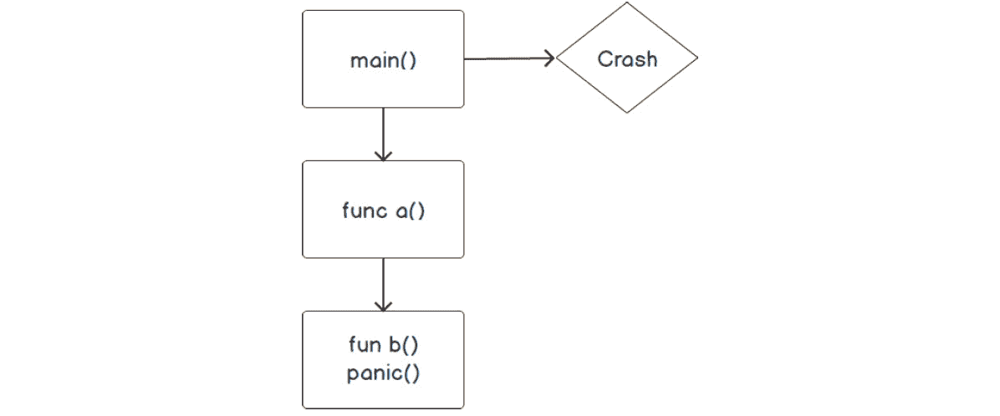
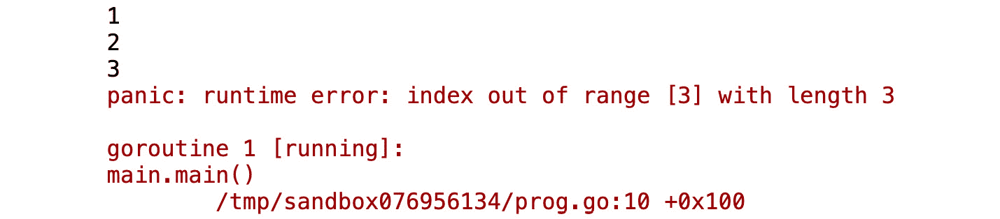
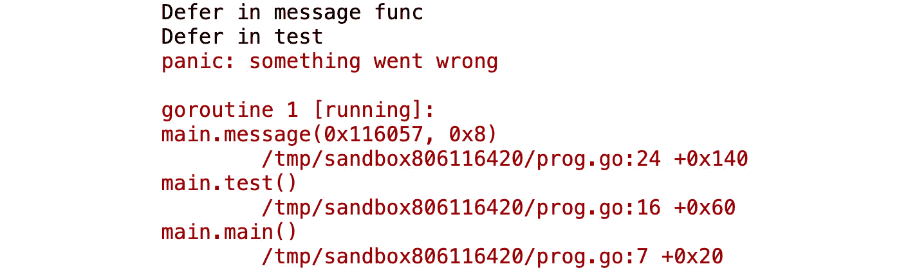
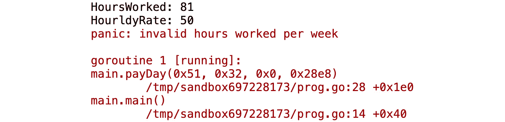
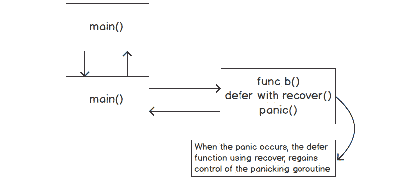
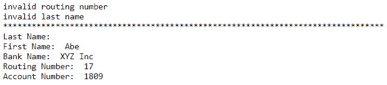
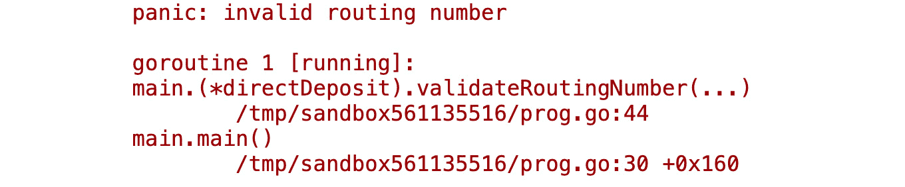

# 6. 错误

概述

在本章中，我们将通过查看 Go 标准包中的各种代码片段来了解 Go 进行错误处理的惯用方式。我们还将了解如何在 Go 中创建自定义错误类型，并查看标准库中的示例。

到本章结束时，你将能够区分不同类型的错误，并比较错误处理和异常处理。你还将能够创建错误值，并使用`panic()`来处理错误，并在恐慌后恢复。

# 简介

在上一章中，我们学习了创建函数。我们还发现函数可以作为参数传递，并从函数中返回。在本章中，我们将处理错误，并学习如何从函数中返回这些错误。

开发者并不完美，因此他们生产的代码也不完美。所有软件在某个时间点都会出现错误。在开发软件时处理错误至关重要。这些错误可能会对用户产生不同程度的负面影响。你的软件对用户的影响可能比你想象的要深远得多。

例如，让我们考虑 2003 年的东北停电事件。2003 年 8 月 14 日，美国和加拿大约有 5000 万人遭遇了为期 14 天的停电。这是由于一个控制室警报系统中的竞态条件错误。从技术上讲，竞态条件错误是指两个独立的线程试图对同一内存位置进行写操作。这种竞态条件可能导致程序崩溃。在这个例子中，它导致了超过 250 个发电厂关闭。处理竞态条件的一种方法是通过确保各种线程之间的适当同步，并允许一次只有一个线程访问内存位置进行写操作。作为开发者，确保正确处理错误非常重要。如果我们没有正确处理错误，这可能会对我们的应用程序用户及其生活方式产生负面影响，正如我们所描述的停电事件所示。

在本章中，我们将探讨错误是什么，Go 中的错误看起来像什么，以及更具体地，如何以 Go 的方式处理错误。让我们开始吧！

# 什么是错误？

错误是导致你的程序产生非预期结果的东西。这些非预期结果可能包括应用程序崩溃、数据计算错误（例如银行交易未正确处理）或没有任何结果。这些非预期结果被称为软件缺陷。由于程序员没有预料到的众多场景，任何软件在其生命周期中都会包含错误。当发生错误时，以下是一些可能的后果：

+   错误的代码可能导致程序在没有警告的情况下崩溃。

+   程序的输出不是预期的结果。

+   显示错误信息。

你可能会遇到三种类型的错误：

+   语法错误

+   运行时错误

+   语义错误

## 语法错误

语法错误是由于对编程语言的不当使用而产生的。这通常是由于代码输入错误造成的。大多数现代 IDE 都会有一些视觉方式将语法错误通知程序员；例如，参考 *图 6.1*。在大多数现代 IDE 中，语法错误可以在早期阶段被发现。当你学习一门新的编程语言时，它们可能会更频繁地发生。一些语法错误可能是由以下原因造成的：

+   循环语法使用不当

+   错误放置或省略花括号、括号或方括号

+   错误拼写的函数名或包名

+   将错误的参数类型传递给函数

下面是一个语法错误的例子：

```go
package main
import (
  "fmt"
)
func main() {
  fmt.println("Enter your city:")
}
```

输出如下所示：

```go
fmt.println("Enter your city:")
cannot refer to unexported name fmt.println
undefined: fmt.println
```

Go 是区分大小写的，所以 `println` 应该是 `Println`。

## 运行时错误

当代码被要求执行它无法完成的任务时，这些错误会发生。与语法错误不同，这些错误通常只在代码执行期间被发现。

以下是一些常见的运行时错误示例：

+   打开一个不存在的数据库连接

+   执行一个比你要迭代的切片或数组中的元素数量更大的循环

+   打开一个不存在的文件

+   执行数学运算，例如将一个数除以零

## 练习 6.01：添加数字时的运行时错误

在这个练习中，我们将编写一个简单的程序，该程序将计算数字切片的总和。这个程序将演示一个运行时错误的例子，并且在执行时会崩溃。

1.  在 `$GOPATH` 中，创建一个名为 *Exercise6.01* 的目录。

1.  在 *步骤 1* 中创建的目录内创建一个名为 `main.go` 的文件。

1.  这个程序将在 `package main` 中。导入 `fmt` 包：

    ```go
    package main
    import "fmt"
    ```

1.  在 `main` 函数中，我们将有一个包含四个元素的整数切片：

    ```go
    func main() {
      nums := []int{2, 4, 6, 8}
    ```

1.  我们将有一个变量 `total`，用于计算切片中所有整型变量的总和。使用 `for` 循环来累加变量：

    ```go
      total := 0
      for i := 0; i <= 10; i++ {
        total += nums[i]
      }
    ```

1.  接下来，我们打印出总的结果：

    ```go
      fmt.Println("Total: ", total)
    }
    ```

    我们已经在程序中引入了一个运行时错误的例子；因此，我们不会得到以下输出：

    ```go
    Total: 20
    ```

1.  在命令行中，导航到 *步骤 1* 中创建的目录。

1.  在命令行中，输入以下内容：

    ```go
    go build
    ```

    `go build` 命令将编译你的程序，并创建一个以你在 *步骤 1* 中创建的目录命名的可执行文件。

1.  输入在 *步骤 8* 中创建的文件名，然后按 *Enter* 键运行可执行文件：


图 6.1：执行后的输出

如您所见，程序崩溃了。`index out of range` 的恐慌是新手和经验丰富的 Go 开发者都常见的错误。

在这个例子中，错误，即程序中的 panic（我们将在本章后面讨论 panic 是什么），是由于在 `for` 循环中迭代次数多于切片中的实际元素数量，在我们的例子中是 10 次而不是 4 次。一个可能的解决方案是使用带有范围的 `for` 循环：

```go
package main
import "fmt"
func main() {
  nums := []int{2, 4, 6, 8}
  total := 0
  for i := range nums {
    total += nums[i]
  }
  fmt.Println("Total: ", total)
}
```

在这个练习中，我们看到了如何通过关注细节来避免运行时错误。

## 语义错误

语法错误是最容易调试的，其次是运行时错误，而逻辑错误是最难调试的。语义错误有时一开始很难发现。例如，1998 年，当火星气候轨道器发射时，其目的是研究火星气候，但由于系统中的逻辑错误，价值 2.35 亿美元的火星气候轨道器被摧毁。经过一些分析，发现地面控制器系统中的单位计算使用了英制单位，而轨道器上的软件使用了公制单位。这是一个导致导航系统在太空中错误计算其机动动作的逻辑错误。正如你所看到的，这些都是代码处理程序元素的方式中的缺陷。语义错误发生的原因可能包括：

+   计算错误

+   访问不正确的资源（文件、数据库、服务器、变量等）

+   变量取反设置不正确（不等号与等号）

## 练习 6.02：步行距离逻辑错误

我们正在编写一个应用程序，该程序将确定我们是应该步行去目的地还是开车。如果我们的目的地距离大于或等于 2 公里，我们将开车去。如果小于 2 公里，我们将步行到目的地。我们将通过这个程序演示一个语义错误。

本练习的预期输出如下：

```go
Take the car
```

1.  在你的 `$GOPATH` 中创建一个名为 *Exercise6.02* 的目录。

1.  在 *步骤 1* 中创建的目录内保存一个名为 `main.go` 的文件。此程序将位于 `package main` 中。

1.  导入 `fmt` 包：

    ```go
    package main
    import "fmt"
    ```

1.  在 `main` 函数内部，当 `km` 大于 2 时显示一条开车信息，当 `km` 小于 2 时发送一条步行信息：

    ```go
    func main() {
      km := 2
      if  km > 2 {
        fmt.Println("Take the car")
      } else {
        fmt.Println("Going to walk today")
      }
    }
    ```

1.  在命令行中，导航到 *步骤 1* 中创建的目录。

1.  在命令行中，输入以下内容：

    ```go
    go build
    ```

    `go build` 命令将编译你的程序并创建一个以你在 *步骤 1* 中创建的目录命名的可执行文件。

1.  输入 *步骤 6* 中创建的文件名并按 *Enter* 键运行可执行文件。你将得到以下输出：

    ```go
    Going to walk today
    ```

程序运行没有错误，但显示的消息并不是预期的。

如前所述，程序在没有错误的情况下运行，但结果并不是我们预期的。这是因为我们有一个逻辑错误。我们的`if`语句没有考虑到`km`等于`2`的情况。它只是检查距离是否大于`2`。这是一个简单的修复。将`>`替换为`>=`，现在程序将给出我们预期的结果。

```go
func main() {
  km := 2
  if  km >= 2 {
    fmt.Println("Take the car")
  } else {
    fmt.Println("Going to walk today")
  }
}
```

这个简单的程序使调试逻辑错误变得容易，但在更大的程序中，这类错误可能并不容易发现。

在本章中，我们将主要关注运行时错误。了解作为程序员可能会遇到的错误类型是很有好处的。

# 使用其他编程语言进行错误处理

对于有其他编程语言背景的新 Go 程序员来说，最初可能会觉得 Go 处理错误的方法有些奇怪。Go 处理错误的方式与其他语言，如 Java、Python、C#和 Ruby 不同。那些语言执行异常处理。

以下代码片段是其他语言通过执行异常处理来处理错误的示例：

```go
//java
try {
  // code
}catch (exception e){
  // block of code to handle the error
}
//python
try:
  //code
except:
  //code
else:
  try:
  // code
  except:
  // code
finally:
  //code
```

通常，如果未处理异常，它将导致应用程序崩溃。在大多数情况下，异常处理倾向于隐式检查，而 Go 则显式检查其函数返回的错误。在异常处理范例中，任何东西都可能失败，你必须考虑到这一点。每个函数都可能抛出异常，但你不知道那个异常会是什么。

在 Go 使用的错误处理范例中，当程序员没有处理错误时，这是显而易见的，因为函数返回错误代码，你可以看到他们没有检查错误。我们将在本章后面讨论检查错误代码的细节。

大多数编程语言遵循与前面代码片段中所示类似的模式。通常是一些`try..catch..finally`块。与`try..catch..finally`块的一个争议点是程序执行的流程控制被中断，可能会遵循不同的路径。这有时会导致许多逻辑错误，并使代码的可读性变得困难。以下是如何快速查看 Go 处理错误的示例：

```go
val, err:= someFunc() err
if err !=nil{
  return err
}
return nil
```

前面的代码片段是处理错误的一个非常简单的语法。我们将在后续主题中更详细地探讨这一点。在本主题中，我们希望向您介绍 Go 如何以简洁的方式处理错误，与其他语言的语法相比。

# 错误接口类型

Go 中的错误是什么？Go 中的错误是一个值。以下是 Go 的先驱之一 Rob Pike 的引用：

“值可以被编程，由于错误是值，错误也可以被编程。错误不像异常那样特殊。它们没有什么特别之处，而未处理的异常可能会使你的程序崩溃。”

由于错误是值，它们可以被传递到函数中，从函数中返回，并且就像 Go 中的任何其他值一样进行评估。

Go 中的错误是任何实现了错误接口的东西。我们需要查看构成 Go 中错误类型的根本方面。要成为 Go 中的错误类型，它必须首先满足`type error interface`：

```go
//https://golang.org/pkg/builtin/#error
type error interface {
  Error()string
}
```

Go 语言最奇妙的地方在于其语言特性的简单设计。这一点可以通过错误接口轻易地看出。Go 的标准库使用了错误接口。为了满足错误接口，只需要两件事：

+   方法名，`Error()`

+   `Error()`方法返回一个字符串

这就是两个要求。重要的是要理解错误类型是一个接口类型。任何错误值都可以描述为一个字符串。在 Go 中进行错误处理时，函数将返回一个错误值。Go 语言在整个标准库中都使用这一点。

查看以下代码片段，以作为错误讨论的起点：

```go
package main
import (
  "fmt"
  "strconv"
)
func main() {
  v := "10"
  if s, err := strconv.Atoi(v); err == nil {
    fmt.Printf("%T, %v\n", s, s)
  }else{
    fmt.Println(err)
  }
  v = "s2"
  s, err := strconv.Atoi(v) 
  if err != nil{
    fmt.Println(s, err)
  }
}
```

我们不会深入每个函数的细节，但会关注代码中的错误部分。在*第五章* *函数*中，我们提到函数可以返回多个值。这是一个大多数语言都没有的强大功能。它特别强大，尤其是在处理错误值时。`strconv.Atoi()`函数返回一个`int`和一个错误，正如之前提到的示例所示。它是一个位于 Go 标准库中的函数（[`packt.live/2YvL1BV`](https://packt.live/2YvL1BV)）。对于返回错误值的函数，它应该是最后一个返回值。

在 Go 中，评估返回错误值的函数或方法是一种习惯。通常，不处理从函数返回的错误是一种坏习惯。返回并忽略错误可能导致大量的调试工作浪费。它也可能导致程序中出现未预见的后果。如果值不是 nil，那么我们有一个错误，必须决定我们想要如何处理它。根据场景，我们可能想要：

+   将错误返回给调用者

+   记录错误并继续执行

+   停止程序的执行

+   忽略它（这强烈不推荐）

+   Panic（仅在非常罕见的情况下，我们将在稍后进一步讨论）

如果错误的值为 nil，这意味着没有错误。不需要进一步的操作。

让我们进一步探讨标准包中关于错误类型的内容。我们将从查看[`packt.live/2rk6r8Z`](https://packt.live/2rk6r8Z)文件中的每一行代码开始。

```go
type errorString struct {
s string
}
```

`struct` `errorString`位于`errors`包中。该结构用于存储错误的字符串版本。`errorString`有一个名为`s`的单个字段，其类型为`string`。`errorString`及其字段`s`是不可导出的。这意味着我们无法直接访问`errorString`类型或其字段`s`。以下代码给出了尝试访问不可导出的`errorString`类型及其字段`s`的示例：

```go
package main
import (
  "errors"
  "fmt"
)
func main() {
  es := errors.errorString{}
  es.s = "slacker"
  fmt.Println(es)
}
```

![Figure 6.2: 未导出字段的预期输出]

![img/B14177_06_02.jpg]

Figure 6.2: 未导出字段的预期输出

表面上看，`errorString` 似乎既不可访问也不实用，但我们应该继续挖掘。我们仍然在标准库中：

```go
func (e *errorString) Error() string {
    return e.s
}
```

`errorString` 类型有一个实现错误接口的方法。它满足了一个名为 `Error()` 的方法，并返回一个字符串。错误接口已被满足。我们现在可以通过 `Error()` 方法访问 `errorString` 字段，`s`。这是在标准库中返回错误的方式。

您现在应该对 Go 中的错误有一个基本的理解。现在，我们应该看看如何在 Go 中创建我们自己的错误类型。

## 创建错误值

在标准库中，`error` 包有一个我们可以用来创建自定义错误的方法：

```go
// https://golang.org/src/errors/errors.go
// New returns an error that formats as the given text.
func New(text string) error {
    return &errorString{text}
}
```

重要的是要理解，`New` 函数接受一个字符串作为参数，并将其转换为 `*errors.errorString`，然后作为错误值返回。返回的错误类型的底层值是 `*errors.errorSting` 类型。

我们可以通过运行以下代码来证明这一点：

```go
package main
import (
  "errors"
  "fmt"
)
func main() {
  ErrBadData := errors.New("Some bad data")
  fmt.Printf("ErrBadData type:  %T", ErrBadData)
}
```

这里有一个来自 Go 标准库 `http` 的示例，它使用 `errors` 包创建包级变量：

```go
var (
    ErrBodyNotAllowed = errors.New("http: request method or response status       code does not allow body")
    ErrHijacked = errors.New("http: connection has been hijacked")
    ErrContentLength = errors.New("http: wrote more than the declared Content-      Length")
    ErrWriteAfterFlush = errors.New("unused")
)
```

在创建自定义错误时，在 Go 中以 `Err` 变量开头是惯用的。

## 练习 6.03：创建一个计算每周工资的应用程序

在这个练习中，我们将创建一个计算每周工资的函数。这个函数将接受两个参数，即一周内的工作小时数和时薪。该函数将检查这两个参数是否符合有效性的标准。该函数需要计算正常工资，即一周内的小时数小于或等于 40，以及加班工资，即一周内的小时数大于 40。

我们将使用 `errors.New()` 创建两个错误值。一个错误值将在时薪无效时使用。在我们的应用程序中，无效的时薪是指小于 10 或大于 75 的时薪。第二个错误值将在每周的小时数不在 0 到 80 之间时使用。

使用您选择的 IDE。一个选项是 Visual Studio Code。

1.  在您的 `$GOPATH` 内创建一个名为 *Exercise6.03* 的目录。

1.  在 *步骤 1* 创建的目录中保存一个名为 `main.go` 的文件。`main.go` 文件将在 `package main` 中。

1.  导入两个 Go 标准库，`errors` 和 `fmt`：

    ```go
    package main
    import (
      "errors"
      "fmt"
    )
    ```

1.  现在我们已经使用 `errors.New()` 声明了我们的错误变量。我们使用惯用的 Go 变量命名，以 `Err` 开头并使用驼峰式命名。我们的错误字符串为小写，不带标点符号：

    ```go
    var (
      ErrHourlyRate  = errors.New("invalid hourly rate")
      ErrHoursWorked = errors.New("invalid hours worked per week")
    )
    ```

1.  在 `main` 函数中，我们将调用我们的 `payday()` 函数三次。我们使用 `errors.New()` 声明了我们的错误变量：

    ```go
      pay, err := payDay(81, 50)
      if err != nil {
        fmt.Println(err)
      }
    ```

1.  在 `main()` 函数中，检查函数后的每个 `err`。如果 `err` 不是 `nil`，这意味着存在一个错误，我们将打印出该错误。

    创建一个接受两个参数（`hoursWorked` 和 `hourlyRate`）的 `payDay` 函数。该函数将返回一个 `int` 和一个错误：

    ```go
    func payDay(hoursWorked, hourlyRate int) (int, error) {
      if hourlyRate < 10 || hourlyRate > 75 {
        return 0, ErrHourlyRate
      }
      if hoursWorked < 0 || hoursWorked > 80 {
        return 0, ErrHoursWorked
      }
      if hoursWorked > 40 {
        hoursOver := hoursWorked - 40
        overTime := hoursOver * 2
        regularPay := hoursWorked * hourlyRate
        return regularPay + overTime, nil
      }
      return hoursWorked * hourlyRate, nil
    }
    ```

1.  我们将使用 `if` 语句检查时薪是否小于 10 或大于 75。如果 `hourlyRate` 满足这些条件，我们将返回 `0` 和我们的自定义错误 `ErrHourlyRate`。如果 `hourlyRate` 不满足这些条件，则返回的值将是 `return hoursWorked * hourlyRate, nil`。我们返回 `nil` 作为错误，因为没有错误发生：

    ```go
    func payDay(hoursWorked, hourlyRate int) (int, error) {
      if hourlyRate < 10 || hourlyRate > 75 {
        return 0, ErrHourlyRate
      }
      return hoursWorked * hourlyRate, nil
    }
    ```

1.  在*步骤 7*中，我们验证了 `hourlyRate`。现在我们需要验证 `hoursWorked`。我们将在 `payDay()` 函数中添加另一个 `if` 语句，该语句将检查 `hoursWorked` 是否小于 `0` 或大于 `80`。如果 `hoursWorked` 符合该条件，我们将返回 `0` 和错误 `ErrHoursWorked`：

    ```go
    func payDay(hoursWorked, hourlyRate int) (int, error) {
      if hourlyRate < 10 || hourlyRate > 75 {
        return 0, ErrHourlyRate
      }
      if hoursWorked < 0 || hoursWorked > 80 {
        return 0, ErrHoursWorked
      }
      return hoursWorked * hourlyRate, nil
    }
    ```

1.  在前两个步骤中，我们添加了 `if` 语句来验证传递给函数的参数。在这个步骤中，我们将添加另一个 `if` 语句来计算加班费。加班费是超过 `40` 小时的工时。超过 `40` 小时的工时是时薪的两倍。不超过 `40` 小时的工时按时薪计算：

    ```go
    func payDay(hoursWorked, hourlyRate int) (int, error) {
      if hourlyRate < 10 || hourlyRate > 75 {
        return 0, ErrHourlyRate
      }
      if hoursWorked < 0 || hoursWorked > 80 {
        return 0, ErrHoursWorked
      }
      if hoursWorked > 40 {
        hoursOver := hoursWorked - 40
        overTime := hoursOver * 2
        regularPay := hoursWorked * hourlyRate
        return regularPay + overTime, nil
      }
      return hoursWorked * hourlyRate, nil
    }
    ```

1.  在 `main()` 函数中，我们将用不同的参数三次调用 `payDay()` 函数。我们将在每次调用后检查错误，并在适用的情况下打印错误信息。如果没有错误，则打印一周的工资：

    ```go
    func main() {
      pay, err := payDay(81, 50)
      if err != nil {
        fmt.Println(err)
      }
      pay, err = payDay(80, 5)
      if err != nil {
        fmt.Println(err)
      }
      pay, err = payDay(80, 50)
      if err != nil {
        fmt.Println(err)
      }
      fmt.Println(pay)
    }
    ```

1.  在命令行中，导航到在*步骤 1*中创建的目录。

1.  在命令行中，输入以下内容：

    ```go
    go build
    ```

    `go build` 命令会编译你的程序并创建一个以你在*步骤 1*中创建的目录命名的可执行文件。

1.  输入在*步骤 12*中创建的文件名，然后按 *Enter* 运行可执行文件。

    预期的输出如下：

    ```go
    Invalid hours worked per week
    Invalid hourly rate
    4080
    ```

在这个练习中，我们展示了如何创建自定义错误消息，以便可以轻松确定数据被认为无效的原因。我们还展示了如何从函数中返回多个值以及如何检查函数的错误。在下一个主题中，我们将探讨如何在我们的应用程序中使用 panic。

# Panic

几种语言使用异常来处理错误。然而，Go 不使用异常，它使用一种称为 panic 的机制。Panic 是一个内置函数，会导致程序崩溃。它停止 Goroutine 的正常执行。

在 Go 中，panic 不是常态，与在其他语言中异常是常态不同。panic 信号表示代码内部正在发生异常情况。通常，当 panic 由运行时或开发者启动时，是为了保护程序的完整性。

错误和恐慌在目的和 Go 运行时如何处理它们方面有所不同。Go 中的错误表示发生了意外情况，但它不会对程序的完整性产生不利影响。Go 期望开发者正确处理错误。如果你没有处理错误，函数或其它程序通常不会崩溃。然而，恐慌在这方面有所不同。当发生恐慌时，除非有处理程序，否则它最终会崩溃系统。如果没有处理程序，它将一直向上传递到栈顶并崩溃程序。

我们将在本章后面讨论的一个例子是，由于索引超出范围而发生的恐慌。这在尝试访问不存在的集合的索引时很典型。如果 Go 在这种情况下不发生恐慌，可能会对程序的完整性产生不利影响，例如，程序的其它部分尝试存储或检索集合中不存在的数据。

注意

回顾 Goroutines 的相关内容。`main()`函数是一个 Goroutine。当发生恐慌时，你将在错误信息中看到“正在运行的 Goroutine”的引用。

恐慌可以被开发者引发，也可以在程序执行过程中由运行时错误引起。`panic()`函数接受一个空接口。目前，只需知道这意味着它可以接受任何类型的参数。然而，在大多数情况下，你应该将错误类型传递给`panic()`函数。对于我们的函数用户来说，了解导致恐慌的详细信息会更加直观。在 Go 中，将错误传递给 panic 函数也是一种惯例。我们还将看到如何从传递了错误类型的 panic 中恢复，这为我们处理 panic 提供了不同的选项。当发生恐慌时，它通常遵循以下步骤：

+   执行被停止

+   在恐慌函数中的任何延迟函数都将被调用

+   在恐慌函数的调用栈中的任何延迟函数都将被调用

+   它会一直向上传递到`main()`函数

+   在恐慌函数之后的语句将不会执行

+   程序随后崩溃

下面是恐慌的工作原理：



图 6.3：恐慌的工作原理

以下图展示了`main`函数中调用函数`a()`的代码。函数`a()`随后调用函数`b()`。在函数`b()`内部发生恐慌。`panic()`函数没有被上游的任何代码（函数`a()`或`main()`函数）处理，因此程序将崩溃`main()`函数。

下面是一个 Go 中发生恐慌的例子。尝试确定这个程序为什么会发生恐慌。

```go
package main
import (
  "fmt"
)
func main() {
  nums := []int{1, 2, 3}
  for i := 0; i <= 10; i++ {
    fmt.Println(nums[i])
  }
}
```

恐慌的一个例子如下：



图 6.4：恐慌示例

潜在运行时错误是在开发过程中常见的一种错误。这是一个 `索引越界` 错误。Go 生成这个恐慌是因为我们试图迭代一个比元素多的切片。Go 认为这是一个恐慌的理由，因为它使程序处于不正常的状态。

这里是一个演示如何使用恐慌的基本代码片段：

```go
package main
import (
  "errors"
  "fmt"
)
func main() {
  msg := "good-bye"
  message(msg)
  fmt.Println("This line will not get printed")
}
func message(msg string) {
  if msg == "good-bye" {
    panic(errors.New("something went wrong"))
  }
}
```

**代码摘要：**

+   函数因为传递给 `message` 函数的参数是 `"good-bye"` 而发生恐慌。

+   `panic()` 函数将打印错误信息。拥有良好的错误信息有助于调试过程。

+   在恐慌中，我们使用了 `errors.New()`，这是我们之前在创建错误类型时使用的。

+   正如你所见，`fmt.Println()` 在 `main()` 函数中不会执行。由于没有 `defer` 语句，执行会立即停止。

    此代码片段的预期输出是：


图 6.5：恐慌示例输出

在以下代码片段中，我们将看到如何使用 `panic` 和 `defer` 语句一起工作。

```go
main.go
10 func test() {
11   n := func() {
12     fmt.Println("Defer in test")
13   }
14   defer n()
15   msg := "good-bye"
16   message(msg)
17 }
18 func message(msg string) {
19   f := func() {
20     fmt.Println("Defer in message func")
21   }
22   defer f()
23   if msg == "good-bye" {
24     panic(errors.New("something went wrong"))
The full code is available at: https://packt.live/2qyujFg
```

潜规则示例的输出如下：



图 6.6：恐慌示例输出

让我们分部分理解代码：

+   我们将从 `message()` 函数中的代码开始检查，因为恐慌就是从这里开始的。当发生恐慌时，它会运行恐慌函数 `message()` 内的 `defer` 语句。

+   延迟函数 `func f()` 在 `message()` 函数中运行。

+   在调用栈向上移动，下一个函数是 `test()` 函数，它的延迟函数 `n()` 将执行。

+   最后，我们到达 `main()` 函数，执行被恐慌函数停止。`main()` 中的打印语句不会执行。

    注意

    你可能见过使用 `os.Exit()` 来停止程序的执行。`os.Exit()` 会立即停止执行并返回一个状态码。当执行 `os.Exit()` 时，不会运行任何延迟语句。在某些情况下，`panic` 比 `os.Exit()` 更受欢迎。`panic` 会运行延迟函数。

## 练习 6.04：使用 panic 在错误时崩溃程序

我们将修改 *练习 6.03*，*创建一个计算周薪的应用程序*。考虑以下场景，其中要求已经改变。我们不再需要从我们的 `payDay()` 函数返回错误值。我们已经决定不能信任程序的用户正确地响应错误。有人抱怨工资单不正确。我们认为这是由于我们的函数调用者忽略了返回的错误。

`payDay()` 函数现在将只返回工资金额，而不返回错误。当提供给函数的参数无效时，而不是返回错误，函数将恐慌。这将导致程序立即停止，因此不会处理工资单。

使用你选择的 IDE。一个选项可以是 Visual Studio Code。

1.  创建一个新文件，并将其保存在`$GOPATH\err\panicEx\main.go`。

1.  在`main.go`中输入以下代码：

    ```go
    package main
    import (
      "fmt"
      "errors"
    )
    var (
      ErrHourlyRate  = errors.New("invalid hourly rate")
      ErrHoursWorked = errors.New("invalid hours worked per week")
    )
    ```

1.  在`main`函数内部，调用`payDay()`函数，将其赋值给一个变量`pay`，然后打印它：

    ```go
    func main() {
      pay := payDay(81, 50)
      fmt.Println(pay)
    }
    ```

1.  将`payDay()`函数的返回类型更改为仅返回`int`：

    ```go
    func payDay(hoursWorked, hourlyRate int) int {
    ```

1.  在`payDay()`函数内部，将一个变量`report`赋值给匿名函数。这个匿名函数提供了传递给`payDay()`函数的参数的详细信息。尽管我们没有返回错误，但这将提供一些关于为什么函数会引发恐慌的洞察。由于它是一个 deferred 函数，它将在函数退出之前始终执行：

    ```go
    func payDay(hoursWorked, hourlyRate int) int {
      report := func() {
        fmt.Printf("HoursWorked: %d\nHourldyRate: %d\n", hoursWorked, hourlyRate)
      }
      defer report()
    }
    ```

    对于有效的`hourlyRate`和`hoursWorked`的业务规则与之前的练习相同。我们将使用`panic`函数而不是返回错误。当数据无效时，我们将引发恐慌并传递`ErrHourlyRate`或`ErrHoursWorked`作为参数。

    传递给`panic()`函数的参数有助于我们的函数用户理解恐慌的原因。

1.  当`payDay()`函数发生恐慌时，`defer`函数`report()`将向调用者提供一些关于恐慌发生原因的洞察。恐慌将沿着堆栈向上冒泡到`main()`函数，并且执行将立即停止：

    ```go
      if hourlyRate < 10 || hourlyRate > 75 {
        panic(ErrHourlyRate)
      }
      if hoursWorked < 0 || hoursWorked > 80 {
        panic(ErrHoursWorked )
      }
      if hoursWorked > 40 {
        hoursOver := hoursWorked - 40
        overTime := hoursOver * 2
        regularPay := hoursWorked * hourlyRate
        return regularPay + overTime
      }
      return hoursWorked * hourlyRate
    ```

1.  在命令行中，导航到在*步骤 1*中创建的目录。

1.  在命令行中，键入以下内容：

    ```go
    go build
    ```

    `go build`命令将编译您的程序，并创建一个以您在*步骤 1*中创建的目录命名的可执行文件。

1.  输入在*步骤 8*中创建的文件名，然后按*Enter*键运行可执行文件。

    预期的输出应如下所示：



图 6.7：恐慌练习输出

在这个练习中，我们学习了如何执行`panic`并将错误传递给`panic()`函数。这有助于用户更好地理解恐慌的原因。在下一个主题中，我们将看到如何使用`Recover`在恐慌发生后重新控制程序。

# 恢复

Go 为我们提供了在`panic`发生后重新控制程序的能力。Recover 是一个用于重新控制恐慌的 Goroutine 的函数。

`recover()`函数的签名如下：

```go
func recover() interface{}
```

`recover()`函数不接受任何参数，并返回一个空的`interface{}`。目前，一个空的`interface{}`表示可以返回任何类型。`recover()`函数将返回发送给`panic()`函数的值。

`recover()`函数仅在 deferred 函数内部有用。如您所回忆的，deferred 函数在包含函数终止之前执行。在 deferred 函数内部调用`recover()`函数将停止恐慌，通过恢复正常执行。如果`recover()`函数在 deferred 函数外部调用，它将不会停止恐慌。

以下图表显示了程序在使用`panic()`、`recover()`和`defer()`函数时采取的步骤：

![图 6.8：恢复函数流程]



![图 6.8：恢复函数流程]

图表中遵循的步骤可以这样解释：

+   `main()`函数调用`func a()`。

+   `func a()`调用`func b()`。

+   在`func b()`内部有一个 panic。

+   `panic()`函数由使用`recover()`函数的延迟函数处理。

+   延迟函数是`func b()`内部最后一个执行的函数。

+   延迟函数调用了`recover()`函数。

+   `recover()`的调用导致正常流程返回到调用者`func a()`。

+   正常流程继续，最终控制权回到`main()`函数。

以下代码片段模拟了前面的图表行为：

```go
main.go
6  func main() {
7    a()
8    fmt.Println("This line will now get printed from main() function")
9  }
10 func a() {
11   b("good-bye")
12   fmt.Println("Back in function a()")
13 }
14 func b(msg string) {
15   defer func() {
16     if r:= recover(); r!= nil{
17       fmt.Println("error in func b()",r)
18     }
19   }()
The full code is available at: https://packt.live/2E6j6ig
```

**代码摘要**

+   `main()`函数调用函数`a()`。`a()`函数调用函数`b()`。

+   函数`b()`接受一个字符串类型并将其分配给`msg`变量。如果`msg`在`if`语句中评估为`true`，将发生 panic。

+   panic 的参数是由`errors.New()`函数创建的新错误：

```go
  if msg == "good-bye" {
    panic(errors.New("something went wrong"))
  }
```

一旦发生 panic，下一个调用将是延迟函数。

延迟函数使用了`recover()`函数。从`recover()`返回的 panic 值；在这种情况下，`r`的值是一个错误类型。然后，函数打印出一些详细信息：

```go
  defer func() {
    if r:= recover(); r!= nil{
      fmt.Println("error in func b()",r)
    }
  }()
```

+   控制流程返回到函数`a()`。函数`a()`打印出一些详细信息。

+   然后，控制权返回到`main()`函数，并打印出一些详细信息然后终止：

![图 6.9：恢复示例输出]


![图 6.9：恢复示例输出]

## 练习 6.05：从 panic 中恢复

在这个练习中，我们将增强我们的`payDay()`函数以从 panic 中恢复。当我们的`payDay()`函数 panic 时，我们将检查该 panic 的错误。然后，根据错误，我们将向用户打印一条信息性消息。

使用您选择的 IDE，一个选项是 Visual Studio Code。

1.  创建一个新文件，并将其保存在`$GOPATH\err\panicEx\main.go`。

1.  在`main.go`中输入以下代码：

    ```go
    package main
    import (
      "errors"
      "fmt"
    )
    var (
      ErrHourlyRate  = errors.New("invalid hourly rate")
      ErrHoursWorked = errors.New("invalid hours worked per week")
    )
    ```

1.  使用各种参数调用`payDay()`函数，然后打印函数的返回值：

    ```go
    func main() {
      pay := payDay(100, 25)
      fmt.Println(pay)
      pay = payDay(100, 200)
      fmt.Println(pay)
      pay = payDay(60, 25)
      fmt.Println(pay)
    }
    ```

1.  然后，在您的`payDay()`函数中添加一个`defer`函数：

    ```go
    func payDay(hoursWorked, hourlyRate int) int {
      defer func() {
    ```

1.  我们可以检查`recover()`函数的返回值，如下所示：

    ```go
    if r := recover(); r != nil {
          if r == ErrHourlyRate {
    ```

    如果`r`不是`nil`，这意味着发生了 panic，我们应该执行某些操作。

1.  我们可以评估`r`并查看它是否等于我们的错误值`ErrHourlyRate`或`ErrHoursWorked`：

    ```go
            fmt.Printf("hourly rate: %d\nerr: %v\n\n", hourlyRate, r)
          }
          if r == ErrHoursWorked {
            fmt.Printf("hours worked: %d\nerr: %v\n\n", hoursWorked, r)
          }
        }
    ```

1.  如果我们的`if`语句评估为`true`，我们将打印有关数据和`recover()`函数中的错误值的一些详细信息。然后，我们打印出我们的工资是如何计算的：

    ```go
        fmt.Printf("Pay was calculated based on:\nhours worked: %d\nhourly Rate: %d\n", hoursWorked, hourlyRate)
      }()
    ```

1.  `payDay()`函数中的其余代码保持不变。要查看其描述，可以参考*练习 6.04*，*使用 panic 在错误中崩溃程序*：

    ```go
      if hourlyRate < 10 || hourlyRate > 75 {
        panic(ErrHourlyRate)
      }
      if hoursWorked < 0 || hoursWorked > 80 {
        panic(ErrHoursWorked)
      }
      if hoursWorked > 40 {
        hoursOver := hoursWorked - 40
        overTime := hoursOver * 2
        regularPay := hoursWorked * hourlyRate
        return regularPay + overTime
      }
      return hoursWorked * hourlyRate
    }
    ```

1.  在命令行中，导航到在*步骤 1*中创建的目录。

1.  在命令行中，输入以下内容：

    ```go
    go build
    ```

    `go build`命令将编译你的程序，并创建一个以你在*步骤 1*中创建的目录命名的可执行文件。

1.  输入在*步骤 10*中创建的文件名，然后按*Enter*键运行可执行文件。

    预期的输出如下：

![图 6.10：从恐慌练习输出中恢复

![图片 B14177_06_10.jpg]

图 6.10：从恐慌练习输出中恢复

在前面的练习中，我们看到了创建自定义错误并返回该错误的进展。由此，我们能够在需要时使用`panic`来崩溃程序。在前面的练习中，我们展示了从恐慌中恢复并基于传递给`panic()`函数的错误类型显示错误消息的能力。在接下来的主题中，我们将讨论在 Go 中执行错误处理时的一些基本指南。

## 处理错误和恐慌时的指南

指南仅用于指导。它们不是固定不变的。这意味着，大多数时候你应该遵循指南；然而，可能会有例外。其中一些指南已经提到过，但我们在这里进行了整合，以便快速参考：

+   当我们声明自己的错误类型时，变量需要以`Err`开头。它还应遵循驼峰命名约定。

    ```go
    var ErrExampleNotAllowd= errors.New("error example text")
    ```

+   `error`字符串应以小写字母开头，不以标点符号结尾。遵循此指南的原因之一是错误可以被返回并与其他与错误相关的信息连接。

+   如果一个函数或方法返回错误，应该对其进行评估。未评估的错误可能导致程序无法按预期运行。

+   当使用`panic()`时，将错误类型作为参数传递，而不是空值。

+   不要评估错误的字符串值。

+   适度使用`panic()`函数。

## 活动六.01：为银行应用程序创建自定义错误消息

一家银行希望在检查姓氏和有效路由号时添加一些自定义错误。他们发现直接存款程序允许使用无效的名称和路由号。银行希望在发生这些事件时有一个描述性的错误消息。我们的任务是创建两个描述性的自定义错误消息。请记住，为错误变量使用惯用的命名约定，并为错误消息使用适当的结构。

你需要做以下事情：

1.  为`InvalidLastName`和`InvalidRoutingNumber`创建两个错误值。

1.  然后，在`main()`函数中打印自定义消息，以向银行显示当遇到这些错误时他们将收到的错误消息。

    预期的输出如下：

```go
invalid last name
invalid routing number
```

在完成这个活动之后，你将熟悉创建自定义错误消息所需的步骤。

注意

本活动的解决方案可以在第 709 页找到。

## 活动六.02：验证银行客户的直接存款提交

银行对您在*活动 6.01*，*为银行应用程序创建自定义错误消息*中创建的自定义错误消息感到满意。他们非常满意，现在希望您实现两个方法。这两个方法用于验证姓氏和路由号：

1.  您需要创建一个名为`directDeposit`的结构。

1.  `directDeposit`结构将包含三个字符串字段：`lastName`、`firstName`和`bankName`。它还将包含两个名为`routingNumber`和`accountNumber`的`int`字段。

1.  `directDeposit`结构将有一个`validateRoutingNumber`方法。当路由号小于 100 时，该方法将返回`ErrInvalidRoutingNum`。

1.  `directDeposit`结构将有一个`validateLastName`方法。当`lastName`为空字符串时，它将返回`ErrInvalidLastName`。

1.  `directDeposit`结构将有一个`report`方法。它将打印出每个字段的值。

1.  在`main()`函数中，为`directDeposit`结构体的字段赋值，并调用`directDeposit`结构体的每个方法。

    预期的输出如下：



图 6.11：验证银行客户的直接存款提交

在本活动的结束时，您将学会如何从函数中返回错误，以及如何检查从函数返回的错误。您还将能够检查条件，并根据该条件返回您自己的自定义错误。

注意

本活动的解决方案可以在第 710 页找到。

## 活动 6.03：无效数据提交引发的恐慌

银行现在决定，当提交无效路由号时，他们宁愿让程序崩溃。银行认为错误的数据验证导致程序停止处理直接存款数据。您需要在无效数据提交实例上引发恐慌。在*活动 6.02*，*验证银行客户的直接存款提交*的基础上构建：

1.  将`validateRoutingNumber`方法更改为不返回`ErrInvalidRoutingNum`，而是执行一个恐慌：

    预期的输出如下：



图 6.12：无效路由号引发的恐慌

在本活动的结束时，您将能够引发`panic`并看到这对程序流程的影响。

注意

本活动的解决方案可以在第 713 页找到。

## 活动 6.04：防止因无效路由号导致应用程序崩溃

经过一些初步的 alpha 测试后，银行不再希望应用程序崩溃，相反，在本活动中，我们需要从*活动 6.03*，*无效数据提交引发的恐慌*中添加的恐慌中恢复，并打印出导致恐慌的错误：

1.  在`validateRoutingNumber`方法中添加一个`defer`函数。

1.  添加一个`if`语句来检查`recover()`函数返回的错误。如果有错误，则打印错误：

    预期的输出如下：


]

图 6.13：从无效路由号恢复恐慌

在本活动的结束时，你将引发一个恐慌，但你将能够防止它使应用程序崩溃。你将了解如何使用 `recover()` 函数，结合 `defer` 语句，来防止应用程序崩溃。

注意

本活动的解决方案可以在第 614 页找到。

# 摘要

在本章中，我们探讨了编程时可能会遇到的不同类型的错误，例如语法错误、运行时错误和语义错误。我们更关注运行时错误。这些错误更难调试。

我们探讨了在处理错误时不同语言哲学之间的差异。我们看到了与各种语言使用的异常处理相比，Go 的错误语法更容易理解。

Go 中的错误是一个值。值可以被传递给函数。只要实现了错误接口类型，任何错误都可以作为一个值。我们学习了如何轻松地创建错误。我们还了解到，我们应该以 `Err` 开头给错误值命名，后面跟着一个描述性的驼峰式命名。

接下来，我们讨论了恐慌以及恐慌与异常之间的相似性。我们还发现，恐慌与异常非常相似；然而，如果恐慌未被处理，它们将导致程序崩溃。但是，Go 有一种机制可以将程序的控制权返回到正常状态。我们通过使用 `recover()` 函数来实现这一点。从恐慌中恢复的要求需要在延迟函数中使用 `recover()` 函数。我们还学习了使用 `errors`、`panic` 和 `recover` 的一般指南。

在下一章中，我们将探讨接口及其用途，以及它们与其他编程语言实现接口的方式有何不同。我们将看到它们如何被用来解决作为程序员面临的各类问题。
