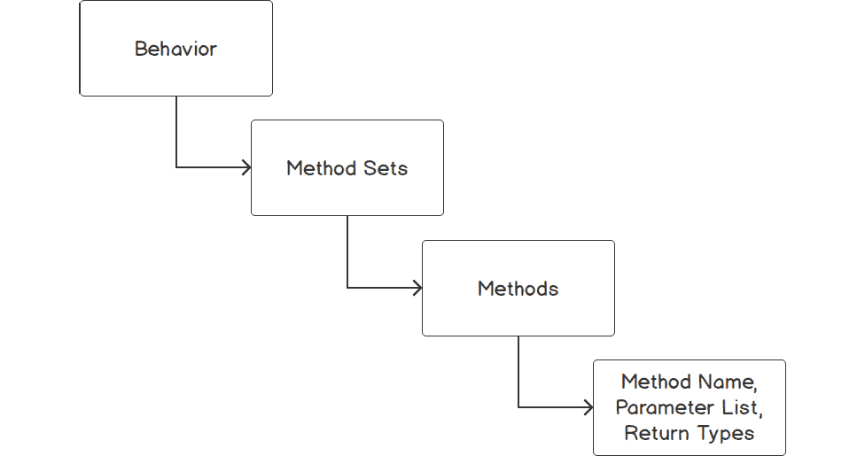
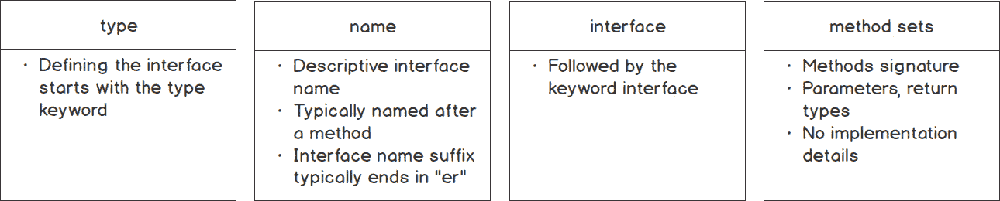
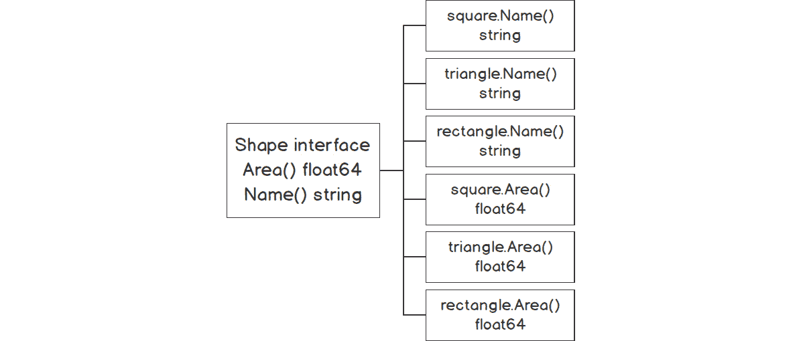
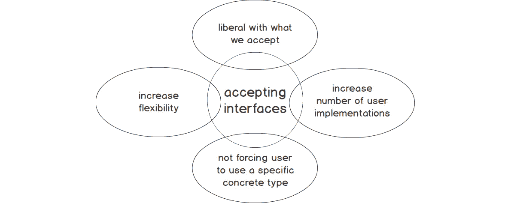
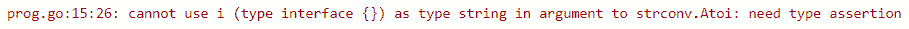
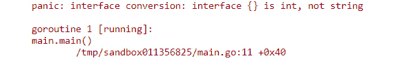
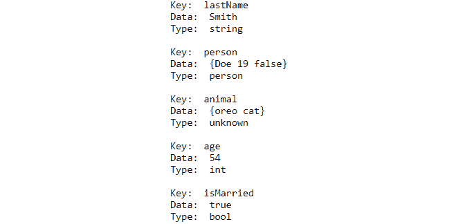

# 7. 接口

概述

本章旨在展示在 Go 语言中实现接口的过程。与其他语言相比，这相当简单，因为在 Go 中它是隐式实现的，而其他语言则需要显式地实现接口。

在开始时，你将能够为应用程序定义和声明一个接口，并在你的应用程序中实现接口。本章将向你介绍使用鸭子类型和多态，接受接口并返回结构体。

到本章结束时，你将学会使用类型断言来访问接口的底层具体值，并使用类型选择语句。

# 简介

在上一章中，我们讨论了 Go 语言中的错误处理。我们探讨了 Go 中的错误是什么。我们发现，在 Go 中，任何实现了错误接口的东西都可以被视为错误。当时，我们没有深入研究接口是什么。在本章中，我们将探讨接口是什么。

例如，你的经理要求你创建一个可以接受 JSON 数据的 API。数据包含有关各种员工的信息，例如他们的地址和他们在项目上工作的小时数。数据需要被解析到 `employee` 结构体中，这是一个相对简单的任务。然后你创建了一个名为 `loadEmployee(s string)` 的函数。该函数将接受一个格式为 JSON 的字符串，然后将该字符串解析以加载 `employee` 结构体。

你的经理对你的工作感到满意；然而，他还有另一个要求。客户需要能够接受一个包含员工数据的 JSON 格式文件。要执行的功能与之前相同。你创建了一个名为 `loadEmployeeFromFile(f *os.File)` 的另一个函数，该函数从文件中读取数据，解析数据并加载员工结构体。

你的经理还有另一个要求，即员工数据现在也应来自 HTTP 端点。你需要能够从 HTTP 请求中读取数据，因此你创建了一个名为 `loadEmployeeFromHTTP(r *Request)` 的另一个函数。

所有的三个函数都有一个共同的行为，即它们正在执行的操作。它们都需要能够读取数据。底层类型可能不同（例如 `string`、`os.File` 或 `http.Request`），但在所有情况下，行为，或者说读取数据，都是相同的。

`func loadEmployee(s string)`、`func loadEmployeeFromFile(f *os.File)` 和 `func loadEmployeeFromHTTP(r *Request)` 这三个函数都可以使用一个接口 `func loadEmployee (r io.Reader)` 来替换。`io.Reader` 是一个接口，我们将在本章后面更深入地讨论它，但就目前而言，只需说它可以用来解决给定的问题。

在本章中，我们将看到接口如何解决此类问题；通过将正在执行的行为定义为接口类型，我们可以接受任何底层具体类型。如果现在这还不清楚，请不要担心；随着本章的深入，它将开始变得清晰。我们将讨论接口如何使我们能够执行鸭子类型和多态。我们将看到接受接口和返回结构体如何减少耦合并增加函数在我们程序更多区域的使用。我们还将检查空接口，并讨论使用案例以充分利用它，包括类型断言和类型选择语句。

# 接口

接口是一组描述数据类型行为的函数。接口定义了实现该接口必须满足的行为。行为描述了该类型可以做什么。几乎一切事物都表现出某些行为。例如，猫可以喵喵叫、行走、跳跃和咕噜咕噜。所有这些都是猫的行为。汽车可以启动、停止、转弯和加速。所有这些都是汽车的行为。同样，类型的行为被称为方法。

注意

[`packt.live/2qOtKrd`](https://packt.live/2qOtKrd)提供的定义是：“Go 中的接口提供了一种指定对象行为的方式。”

描述接口有几种方式：

+   方法签名集合是一组只有方法名称、参数、类型和返回类型的方法。这是`Speaker{}`接口方法签名集合的一个例子：

    ```go
    type Speaker interface{
    Speak(message string) string
    Greet() string
    }
    ```

+   该类型的实现方法蓝图是满足接口所需的。使用`Speaker{}`接口，蓝图（接口）声明，为了满足`Speaker{}`接口，该类型必须有一个接受`string`并返回`string`的`Speak()`方法。它还必须有一个返回`string`的`Greet()`方法。

+   行为是接口类型必须表现出的。例如，`Reader{}`接口有一个`Read`方法。它的行为是读取数据，以及 Go 标准库的`Reader{}`接口：

    ```go
    type Reader interface{
    Read(b []byte)(n int, err error)
    }
    ```

+   接口可以描述为没有实现细节。`Reader{}`接口只包含方法的签名，但不包含方法的代码。接口的实现者有责任提供代码或实现细节，而不是接口本身。

    类型的行为可以是以下几种：

+   `Read()`

+   `Write()`

+   `Save()`

这些行为统称为**方法集**。行为由一组方法定义。方法集是一组方法。这些方法集包括方法名称、任何输入参数和任何返回类型。

![图 7.1：接口元素的图形表示]



图 7.1：接口元素的图形表示

当我们谈论行为时，请注意我们没有讨论实现细节。定义接口时省略了实现细节。重要的是要理解，接口声明中未指定或强制实施任何实现。我们创建的每个实现接口的类型都可以有自己的实现细节。一个名为 `Greeting()` 的方法可以通过不同的方式由各种类型实现。人的结构体类型可以以不同于动物的结构体类型的方式实现 `Greeting()`。接口关注的是类型必须展示的行为。接口的职责不是提供方法实现。这是实现接口的类型的工作。类型，通常是结构体，包含方法集的实现细节。现在我们已对接口有了基本了解，在下一个主题中，我们将探讨如何定义接口。

## 定义接口

定义接口包括以下步骤：



图 7.2：定义接口

这里是声明接口的一个例子：

```go
type Speaker interface {
  Speak() string
}
```

让我们看看这个声明的每个部分：

+   从 `type` 关键字开始，然后是名称，然后是 `interface` 关键字。

+   我们正在定义一个名为 `Speaker{}` 的接口类型。在 Go 中，用 `er` 后缀命名接口是惯用的。如果是一个单方法接口，通常将接口命名为那个方法。

+   接下来，你定义方法集。定义接口类型指定了属于它的方法（们）。在这个接口中，我们声明了一个接口类型，它有一个名为 `Speak()` 的方法，并返回一个字符串。

+   `Speaker{}` 接口的方法集是 `Speak()`。

这里是一个在 Go 中经常使用的接口：

```go
// https://golang.org/pkg/io/#Reader
type Reader interface {
    Read(p []byte) (n int, err error)
}
```

让我们看看这段代码的各个部分：

+   接口名称是 `Reader{}`。

+   方法集是 `Read()`。

+   `Read()` 方法的签名是 `(p []byte)(n int, err error)`。

接口可以有多个方法作为其方法集。让我们看看 Go 包中使用的接口：

```go
// https://golang.org/pkg/os/#FileInfo
type FileInfo interface {
        Name() string       // base name of the file
        Size() int64        // length in bytes for regular files; system-dependent for others
        Mode() FileMode     // file mode bits
        ModTime() time.Time // modification time
        IsDir() bool        // abbreviation for Mode().IsDir()
        Sys() interface{}   // underlying data source (can return nil)
}
```

如您所见，`FileInfo{}` 有多个方法。

总结来说，接口是声明方法集的类型。与其他使用接口的语言类似，它们不实现方法集。实现细节不是定义接口的一部分。在下一个主题中，我们将探讨 Go 要求你能够实现接口的条件。

## 实现接口

其他编程语言中的接口明确实现接口。明确实现意味着编程语言直接且清晰地声明该对象正在使用此接口。例如，这是在 Java 中：

```go
class Dog implements Pet
```

`Dog` 类将通过 `Pet` 接口实现。代码段明确指出 `Dog` 类将实现 `Pet`。

在 Go 中，接口是隐式实现的。这意味着一个类型将通过具有接口的所有方法和它们的签名来实现接口。以下是一个例子：

```go
package main
import (
  "fmt"
)
type Speaker interface {
  Speak() string
}
type cat struct {
}
func main() {
  c := cat{}
  fmt.Println(c.Speak())
  c.Greeting()
}
func (c cat) Speak() string {
  return "Purr Meow"
}
func (c cat) Greeting() {
  fmt.Println("Meow,Meow!!!!mmmeeeeoooowwww")
}
```

让我们将这段代码分解成几个部分：

```go
type Speaker interface {
  Speak() string
}
```

我们正在定义一个`Speaker{}`接口。它有一个描述`Speak()`行为的方法。该方法返回一个字符串。为了实现`Speaker{}`接口，类型必须具有接口声明中列出的方法。然后，我们创建一个名为`cat`的空结构体类型：

```go
type cat struct {
}
func (c cat) Speak() string {
  return "Purr Meow"
}
```

`cat`类型有一个返回字符串的`Speak()`方法。这满足了`Speaker{}`接口。现在，`cat`类型的实现者有责任提供`Speak()`方法的实现细节。

注意，没有显式声明`cat`实现了`Speaker{}`接口；它只是通过满足接口的要求来实现。

还很重要的一点是，`cat`类型有一个名为`Greeting()`的方法。类型可以拥有不需要满足`Speaker{}`接口的方法。然而，猫必须至少有满足接口所需的方法集。

输出将如下所示：

```go
Purr Meow
Meow,Meow!!!!mmmeeeeoooowwww
```

## 隐式实现接口的优势

隐式实现接口有一些优势。我们看到了当你创建一个接口时，你必须访问每个类型并明确声明该类型实现了接口。在 Go 中，满足接口的类型被认为是实现了它。没有像其他语言那样的`implements`关键字；你不需要声明一个类型实现了接口。在 Go 中，如果它具有接口的方法集和签名，它就隐式地实现了接口。

当你更改接口的方法集时，在其他语言中，你可能需要访问所有那些不满足接口的类型，并移除对类型的显式声明。但在 Go 中并非如此，因为它是隐式声明。

另一个优势是你可以为另一个包中的类型编写接口。这解耦了接口定义与其实现。我们将在*第八章*，*包*中讨论包及其作用域。

让我们看看在主包中如何使用来自不同包的接口的例子。`Stringer`接口是 Go 语言中的一个接口。它通过 Go 语言被几个包使用。一个例子是`fmt`包，它用于打印值时的格式化：

```go
type Stringer interface {
  String() string
}
```

`Stringer`是一个可以描述自身为字符串的接口类型。接口名称通常遵循方法名称，但添加了`er`后缀：

```go
package main
import (
  "fmt"
)
type Speaker interface {
  Speak() string
}
type cat struct {
  name string
  age  int
}
func main() {
  c := cat{name: "Oreo", age:9}
  fmt.Println(c.Speak())
  fmt.Println(c)
}
func (c cat) Speak() string {
  return "Purr Meow"
}
func (c cat) String() string {
  return fmt.Sprintf("%v (%v years old)", c.name, c.age)
}
```

让我们将这段代码分解成几个部分：

+   我们为`cat`类型添加了一个`String()`方法。它返回`name`和`age`字段的值。

+   当我们在`main()`中调用`fmt.Println()`方法，并使用`cat`作为参数时，`fmt.Println()`会在`cat`类型上调用`String()`方法。

+   我们的`cat`类型现在实现了两个接口；`Speaker{}`接口和`Stringer{}`接口。它具有满足这两个接口所需的方法：


图 7.3：类型可以实现多个接口

## 练习 7.01：实现接口

在这个练习中，我们将创建一个简单的程序，演示如何隐式实现接口。我们将有一个`person`结构体，它将隐式实现`Speaker{}`接口。`person`结构体将包含`name`、`age`和`isMarried`作为其字段。程序将调用我们的`person`结构体的`Speak()`方法，并显示一个显示`person`结构体`name`的消息。`person`结构体还将通过拥有一个`String()`方法来满足`Stringer{}`接口的要求。你可能还记得，在*隐式实现接口的优势*部分，`Stringer{}`接口是 Go 语言中的一个接口。它可以在打印值时用于格式化。这就是我们在这个练习中将如何使用它来格式化`person`结构体字段的打印：

1.  创建一个新的文件，并将其保存为`main.go`。

1.  我们将拥有`package` `main`，并将在这个程序中使用`fmt`包：

    ```go
    package main
    import (
      "fmt"
    )
    ```

1.  创建一个名为`Speak()`的方法的`Speaker{}`接口，该方法返回一个字符串：

    ```go
    type Speaker interface {
      Speak() string
    }
    ```

    我们已经创建了一个`Speaker{}`接口。任何想要实现我们的`Speaker{}`接口的类型都必须有一个返回字符串的`Speak()`方法。

1.  创建我们的`person`结构体，其中包含`name`、`age`和`isMarried`作为其字段：

    ```go
    type person struct {
      name      string
      age       int
      isMarried bool
    }
    ```

    我们的`person`类型包含`name`、`age`和`isMarried`字段。我们将在`main`函数中使用一个返回字符串的`Speak()`方法来打印这些字段的值。拥有一个`Speak()`方法将满足`Speaker{}`接口。

1.  在`main()`函数中，我们将初始化一个`person`类型，打印`Speak()`方法，并打印`person`字段值：

    ```go
    func main() {
      p := person{name: "Cailyn", age: 44, isMarried: false}
      fmt.Println(p.Speak())
      fmt.Println(p)
    }
    ```

1.  为`person`创建一个`String()`方法并返回一个字符串值。这将满足`Stringer{}`接口，现在它可以通过`fmt.Println()`方法被调用：

    ```go
    func (p person) String() string {
      return fmt.Sprintf("%v (%v years old).\nMarried status: %v ", p.name,     p.age, p.isMarried)
    }
    ```

1.  为`person`创建一个返回字符串的`Speak()`方法。`person`类型有一个与`Speaker{}`接口的`Speak()`方法具有相同签名的`Speak()`方法。`person`类型通过拥有一个返回字符串的`Speak()`方法来满足`Speaker{}`接口。为了满足接口，你必须有与接口相同的方法和方法签名：

    ```go
    func (p person) Speak() string {
      return "Hi my name is: " + p.name
    }
    ```

1.  打开终端并导航到代码目录。

1.  运行`go build`。

1.  修正返回的错误，并确保你的代码与这里的代码片段匹配。

1.  通过在命令行中输入可执行文件名来运行可执行文件。

    你应该得到以下输出：

    ```go
    Hi my name is Cailyn
    Cailyn (44 years old).
    Married status: false
    ```

在这个练习中，我们看到了隐式实现接口是多么简单。在下一个主题中，我们将通过让不同的数据类型，如结构体，实现相同的接口，并将这些接口传递给任何具有该接口类型的参数的函数来进一步探讨。我们将在下一个主题中更详细地探讨这是如何可能的，并了解为什么类型以各种形式出现是一个好处。

# 鸭子类型

我们一直在做的是所谓的鸭子类型。鸭子类型是计算机编程中的一个测试：“*如果它看起来像鸭子，游泳像鸭子，嘎嘎叫像鸭子，那么它一定是一只鸭子。*”如果一个类型匹配一个接口，那么你可以在使用该接口的任何地方使用该类型。鸭子类型是基于方法匹配类型，而不是预期的类型：

```go
type Speaker interface {
  Speak() string
}
```

任何匹配`Speak()`方法的都可以是`Speaker{}`接口。在实现接口时，我们本质上是通过拥有所需的方法集来符合该接口：

```go
package main
import (
  "fmt"
)
type Speaker interface {
  Speak() string
}
type cat struct {
}
func main() {
  c := cat{}
  fmt.Println(c.Speak())
}
func (c cat) Speak() string {
  return "Purr Meow"
}
```

`cat`匹配`Speaker{}`接口的`Speak()`方法，所以`cat`是`Speaker{}`：

```go
package main
import (
  "fmt"
)
type Speaker interface {
  Speak() string
}
type cat struct {
}
func main() {
  c := cat{}
  chatter(c)
}
func (c cat) Speak() string {
  return "Purr Meow"
}
func chatter(s Speaker) {
  fmt.Println(s.Speak())
}
```

让我们分部分来检查这段代码：

+   在前面的代码中，我们声明了一个`cat`类型，并为`cat`类型创建了一个名为`Speak()`的方法。这满足了`Speaker{}`接口所需的方法集。

+   我们创建了一个名为`chatter`的方法，它接受`Speaker{}`接口作为参数。

+   在`main()`函数中，我们可以将`cat`类型传递给`chatter`函数，该函数可以评估为`Speaker{}`接口。这满足了接口所需的方法集。

# 多态

多态是能够以各种形式出现的能力。例如，一个形状可以表现为正方形、圆形、矩形或任何其他形状：


图 7.4：形状的多态示例

Go 语言不像其他面向对象的语言那样进行子类化，因为 Go 没有类。面向对象编程中的子类化是从一个类继承到另一个类。通过子类化，你继承了另一个类的字段和方法。Go 通过嵌入结构和通过接口使用多态提供了类似的行为。

使用多态的一个优点是它允许重用已经编写并测试过的方法。通过接受一个接口的 API 来重用代码；如果我们的类型满足该接口，则可以将其传递给该 API。不需要为每个类型编写额外的代码；我们只需要确保我们满足接口方法的要求集。通过使用接口获得的多态性将提高代码的可重用性。如果你的 API 只接受`int`、`float`和`bool`等具体类型，则只能传递该具体类型。然而，如果你的 API 接受一个接口，那么调用者可以添加所需的方法集以满足该接口，无论底层类型如何。这种可重用性是通过允许你的 API 接受接口来实现的。任何满足接口的类型都可以传递给 API。我们已经在之前的例子中看到了这种行为。现在是时候更仔细地看看`Speaker{}`接口了。

如前所述的例子中看到的，每个具体类型都可以实现一个或多个接口。回想一下，我们的`Speaker{}`接口可以被`dog`、`cat`或`fish`类型实现：


图 7.5：由多个类型实现的 Speaker 接口

当一个函数接受一个接口作为输入参数时，任何实现了该接口的具体类型都可以作为参数传递。现在，你通过能够将各种具体类型传递给具有接口类型作为输入参数的方法或函数，实现了多态性。

让我们看看一些渐进的例子，这将使我们能够展示如何在 Go 中实现多态性：

```go
package main
import (
  "fmt"
)
type Speaker interface {
  Speak() string
}
type cat struct {
}
func main() {
  c := cat{}
  catSpeak(c)
}
func (c cat) Speak() string {
  return "Purr Meow"
}
func catSpeak(c cat) {
  fmt.Println(c.Speak())
}
```

让我们分部分来检查这段代码：

+   `cat`实现了`Speaker{}`接口。`main()`函数调用`catSpeak()`并传递一个`cat`类型。

+   在`catSpeak()`内部，它打印出其`Speak()`方法的结果。

我们将要实现一些代码，这些代码接受一个具体类型（`cat`、`dog`、`person`）并满足`Speaker{}`接口类型。使用之前的编码模式，它将看起来像以下代码片段：

```go
package main
import (
  "fmt"
)
type Speaker interface {
  Speak() string
}
type cat struct {
}
type dog struct {
}
type person struct {
  name string
}
func main() {
  c := cat{}
  d := dog{}
  p := person{name:"Heather"}
  catSpeak(c)
  dogSpeak(d)
  personSpeak(p)
}
func (c cat) Speak() string {
  return "Purr Meow"
}
func (d dog) Speak() string {
  return "Woof Woof"
}
func (p person) Speak() string {
  return "Hi my name is " + p.name +"."
}
func catSpeak(c cat) {
  fmt.Println(c.Speak())
}
func dogSpeak(d dog) {
  fmt.Println(d.Speak())
}
func personSpeak(p person) {
  fmt.Println(p.Speak())
}
```

让我们分部分来看这段代码：

```go
type cat struct {
}
type dog struct {
}
type person struct {
  name string
}
```

我们有三个具体类型（`cat`、`dog`和`person`）。`cat`和`dog`类型是空结构体，而`person`结构体有一个`name`字段：

```go
func (c cat) Speak() string {
  return "Purr Meow"
}
func (d dog) Speak() string {
  return "Woof Woof"
}
func (p person) Speak() string {
  return "Hi my name is " + p.name +"."
}
```

我们的所有类型都隐式实现了`Speaker{}`接口。每个具体类型都以与其他类型不同的方式实现它：

```go
func main() {
  c := cat{}
  d := dog{}
  p := person{name:"Heather"}
  catSpeak(c)
  dogSpeak(d)
  personSpeak(p)
}
```

在`main()`函数中，我们调用`catSpeak()`、`dogSpeak()`和`personSpeak()`来调用它们各自的`Speak()`方法。前面的代码有很多执行类似操作的重冗余函数。我们可以重构这段代码，使其更简单、更容易阅读。我们将使用实现接口时获得的一些特性来提供一个更简洁的实现：

```go
package main
import (
  "fmt"
)
type Speaker interface {
  Speak() string
}
type cat struct {
}
type dog struct {
}
type person struct {
  name string
}
func main() {
  c := cat{}
  d := dog{}
  p := person{name: "Heather"}
  saySomething(c,d,p)
}
func saySomething(say ...Speaker) {
  for _, s := range say {
    fmt.Println(s.Speak())
  }
}
func (c cat) Speak() string {
  return "Purr Meow"
}
func (d dog) Speak() string {
  return "Woof Woof"
}
func (p person) Speak() string {
  return "Hi my name is " + p.name + "."
}
```

让我们分部分来看这段代码：

```go
func saySomething(say ...Speaker)
```

我们的 `saySomething()` 函数使用可变参数。如果您还记得，可变参数可以接受零个或多个该类型的参数。有关可变函数的更多信息，请参阅 *第五章*，*函数*。参数类型是 `Speaker`。接口可以用作输入参数：

```go
func saySomething(say ...Speaker) {
  for _, s := range say {
    fmt.Println(s.Speak())
  }
}
```

我们遍历 `Speaker` 的切片。对于每种 `Speaker` 类型，我们调用 `Speak()` 方法。在我们的代码中，我们将 `cat` 和 `dog` 结构体类型传递给 `person` 函数。该函数接受一个 `Speaker{}` 接口的参数。接口中的任何方法都可以被调用。对于这些具体类型，都会调用 `Speak()` 方法。


在 `main()` 函数中，我们将通过使用接口来展示多态的使用：

```go
func main() {
  c := cat{}
  d := dog{}
  p := person{name: "Heather"}
  saySomething(c,d,p)
}
```

我们实现了每个具体类型，`cat`、`dog` 和 `person`。`cat`、`dog` 和 `person` 类型都满足 `Speaker{}` 接口。由于它们匹配接口，因此可以在使用该接口的任何地方使用这些类型。如您所见，这还包括能够将 `cat`、`dog` 和 `person` 类型传递给方法。

通过使用接口和多态，这段代码比之前的代码片段更简洁。本章开头示例展示了一个满足 `Speaker{}` 接口并调用 `Speak()` 方法的单个具体类型。然后我们向运行示例中添加了几个更多具体类型（`cat`、`dog` 和 `person`），每个类型都分别调用它们自己的 `Speak()` 方法。我们注意到那个示例中有大量冗余代码，并开始寻找更好的实现解决方案的方法。我们发现接口类型可以作为参数输入类型。通过鸭子类型和多态，我们的第三个和最后一个代码片段能够拥有一个单函数，该函数会对满足 `Speaker()` 接口的每个类型调用 `Speak()` 方法。

## 练习 7.02：使用多态计算不同形状的面积

我们将实现一个程序，该程序将计算三角形、矩形和正方形的面积。该程序将使用一个接受 `Shape` 接口的单个函数。任何满足 `Shape` 接口类型的都可以作为函数的参数传递。该函数应打印出形状的面积和名称：

1.  使用您选择的集成开发环境（IDE）。

1.  创建一个新文件并将其保存为 `main.go`。

1.  我们将有一个名为 `main` 的包，并且在这个程序中我们将使用 `fmt` 包：

    ```go
    package main
    import (
      "fmt"
    )
    ```

1.  创建一个名为 `Shape{}` 的接口，它包含两个方法集，分别是 `Area() float64` 和 `Name() string`：

    ```go
    type Shape interface {
      Area() float64
      Name() string
    }
    ```

1.  接下来，我们将创建 `triangle`、`rectangle` 和 `square` 结构体类型。这些类型将各自满足 `Shape{}` 接口。`triangle`、`rectangle` 和 `square` 具有计算形状面积所需的适当字段：

    ```go
    type triangle struct {
      base   float64
      height float64
    }
    type rectangle struct {
      length float64
      width  float64
    }
    type square struct {
      side float64
    }
    ```

1.  我们为 `triangle` 结构体类型创建了 `Area()` 和 `Name()` 方法。三角形的面积是 `底边 * 高\2`。`Name()` 方法返回形状的名称：

    ```go
    func (t triangle) Area() float64 {
      return (t.base * t.height) / 2
    }
    func (t triangle) Name() string {
      return "triangle"
    }
    ```

1.  我们为 `rectangle` 结构体类型创建了 `Area()` 和 `Name()` 方法。矩形的面积是 `长度 * 宽度`。`Name()` 方法返回形状的名称：

    ```go
    func (r rectangle) Area() float64 {
      return r.length * r.width
    }
    func (r rectangle) Name() string {
      return "rectangle"
    }
    ```

1.  我们为 `square` 结构体类型创建了 `Area()` 和 `Name()` 方法。正方形的面积是 `边长 * 边长`。`Name()` 方法返回形状的名称：

    ```go
    func (s square) Area() float64 {
      return s.side * s.side
    }
    func (s square) Name() string {
      return "square"
    }
    ```

    现在，我们的每个形状（`triangle`、`rectangle` 和 `square`）都满足 `Shape` 接口，因为它们各自都有一个 `Area()` 和 `Name()` 方法，具有适当的签名：

    

    图 7.7：Shape 类型的正方形、三角形、矩形面积

1.  现在我们将创建一个函数，该函数接受 `Shape` 接口作为可变参数。该函数将遍历 `Shape` 类型，并执行其每个 `Name()` 和 `Area()` 方法：

    ```go
    func printShapeDetails(shapes ...Shape) {
      for _, item := range shapes {
        fmt.Printf("The area of %s is: %.2f\n", item.Name(), item.Area())
      }
    }
    ```

1.  在 `main()` 函数内部，设置 `triangle`、`rectangle` 和 `square` 的字段。将所有三个传递给 `printShapeDetail()` 函数。所有三个都可以传递，因为它们各自满足 `Shape` 接口：

    ```go
    func main() {
      t := triangle{base: 15.5, height: 20.1}
      r := rectangle{length: 20, width: 10}
      s := square{side: 10}
      printShapeDetails(t, r, s)
    }
    }
    ```

1.  通过在命令行运行 `go build` 来构建程序：

    ```go
    go build
    ```

1.  修正返回的错误，并确保你的代码与这里的代码片段匹配。

1.  通过输入可执行文件名并按 *Enter* 键来运行可执行文件。

    你应该看到以下输出：

    ```go
    The area of triangle is: 155.78
    The area of rectangle is: 200.00
    The area of square is: 100.00
    ```

在这个练习中，我们看到了接口为我们的程序提供的灵活性和可重用代码。进一步地，我们将讨论通过不接受具体类型，而是接受接口和返回结构体来增加函数和方法的可重用性和降低耦合度。当我们使用接口作为 API 的输入参数时，我们是在声明一个类型需要满足该接口。当使用具体类型时，我们要求 API 的参数必须是该类型。例如，如果函数签名是 `func greeting(msg string)`，我们知道传递的参数必须是一个字符串。具体类型可以被认为是非抽象类型（`float64`、`int`、`string` 等）；然而，接口可以被认为是抽象类型，因为你在满足接口类型的方法集。底层接口类型是一个具体类型，但底层类型不是需要传递到 API 中的类型。类型必须满足接口类型定义的方法集要求。

在未来，如果我们需要传递其他类型，这意味着我们的 API 上游的代码需要更改，或者如果 API 的调用者需要更改其数据类型，它可能会要求我们更改 API 以适应它。如果我们使用接口，这不会成为问题；我们的代码的调用者需要满足接口的方法集。只要它符合接口的要求，调用者就可以更改底层类型。

# 接受接口和返回结构体

有一个 Go 谚语说“*接受接口，返回结构体*。”它可以重新表述为“接受接口，返回具体类型”。这个谚语是在谈论为你的 API（函数、方法等）接受接口，并返回结构体或具体类型。这个谚语遵循 Postel 的法律，即“*对你所做的事情要保守，对你所接受的要开放*。”我们关注的是“*对你所接受的要开放*。”通过接受接口，你增加了函数或方法的 API 的灵活性。通过这样做，你允许 API 的使用者满足接口的要求，但不必强制使用者使用具体类型。如果我们只接受具体类型，那么我们就限制了函数的使用者只能使用特定的实现。在本章中，我们将探讨前面提到的 Go 谚语，并了解为什么它是一个好的设计模式。我们将看到，当我们查看代码示例时：



图 7.8：接受接口的好处

以下示例将说明接受接口与使用具体类型相比的好处。我们将有两个函数执行相同的解码 JSON 任务，但它们的输入不同。其中一个函数比另一个函数更优越，我们将讨论为什么是这样的情况。

看以下示例：

```go
main.go
1  package main
2  import (
3    "encoding/json"
4    "fmt"
5    "io"
6    "strings"
7  )
8  type Person struct {
9    Name string `json:"name"`
10   Age  int    `json:"age"`
11 }
The full code is available at: https://packt.live/38teYHn
```

预期的输出如下：

```go
{Joe 18}
{Jane 21}
```

让我们检查这段代码的每一部分。我们将在接下来的章节中讨论这段代码的一些部分。这段代码将一些数据解码到一个结构体中。为此使用了两个函数，`loadPerson2()` 和 `loadPerson()`：

```go
func loadPerson2(s string) (Person, error) {
  var p Person
  err := json.NewDecoder(strings.NewReader(s)).Decode(&p)
  if err != nil {
  return p, err
  }
  return p, nil
}
```

`loadPerson2()` 函数接受一个具体的 `string` 类型的参数，并返回一个 `struct`。返回 `struct` 符合 "*接受接口，返回结构体*" 的半部分。然而，它的接受范围非常有限，并不开放。这限制了函数的使用范围，使其只能应用于狭窄的实现。唯一可以传递的是字符串。当然，在某些情况下这可能是可以接受的，但在其他情况下可能会出现问题。例如，如果你的函数或方法应该只接受特定的数据类型，那么你可能不想接受接口：

```go
func loadPerson(r io.Reader) (Person, error) {
  var p Person
  err := json.NewDecoder(r).Decode(&p)
  if err != nil {
    return p, err
  }
  return p, err
}
```

在这个函数中，我们接受 `io.Reader{}` 接口。`io.Reader{}` ([`packt.live/2LRG3Kv`](https://packt.live/2LRG3Kv)) 和 `io.Writer{}` ([`packt.live/2YIAJhP`](https://packt.live/2YIAJhP)) 接口是 Go 包中最常用的接口之一。`json.NewDecoder` 接受任何满足 `io.Reader{}` 接口的对象。调用者代码只需确保他们传递的对象满足 `io.Reader{}` 接口：

```go
p, err := loadPerson(strings.NewReader(s))
```

`strings.NewReader` 返回一个具有 `Read(b []byte) (n int, err error)` 方法的 `Reader` 类型，该方法满足 `io.Reader{}` 接口。它可以传递给我们的 `loadPerson()` 函数。你可能认为每个函数仍然在执行其预期功能。你会是对的，但让我们假设调用者将不再传递一个字符串，或者另一个调用者将传递一个包含 JSON 数据的文件：

```go
f, err := os.Open("data.json")
if err != nil {
  fmt.Println(err)
}
```

我们的 `loadPerson2()` 函数将无法工作；然而，我们的 `loadPerson()` 数据将工作，因为 `os.Open()` 返回的类型满足 `io.Reader{}` 接口。

假设，例如，数据将通过 HTTP 端点传入。我们将从 `*http.Request` 获取数据。再次强调，`loadPerson2()` 函数不是一个好的选择。我们将从 `request.Body` 获取数据，它恰好实现了 `io.Reader{}` 接口。

你可能会想知道接口是否适合作为输入参数。如果是这样，为什么我们还要返回它们呢？如果你返回一个接口，它会给用户增加不必要的难度。用户将不得不查找接口，然后找到方法集和方法签名：

```go
func someFunc() Speaker{} {
// code
}
```

你需要查看 `Speaker{}` 接口的定义，然后花时间查看实现代码，这对于函数的用户来说都是不必要的。如果函数的返回类型需要接口，函数的用户可以为此具体类型创建接口并在他们的代码中使用它。

当你开始遵循这个 Go 谚语时，检查 Go 标准包中是否有接口。这将增加你的函数可以提供不同实现的数量。我们的函数用户可以使用 `strings.newReader`、`http.Request.Body`、`os.File` 以及许多其他实现，就像我们的代码示例一样，通过使用 Go 标准包中的 `io.Reader{}` 接口。

## 空接口 `interface{}`

空接口是一个没有方法集和行为的接口。空接口没有指定任何方法：

```go
interface{}
```

这是一个简单但复杂的概念，需要你理解。正如你可能记得的，接口是隐式实现的；没有 `implements` 关键字。由于空接口没有指定任何方法，这意味着 Go 中的每个类型都自动实现了空接口。所有类型都满足空接口。

在以下代码片段中，我们将演示如何使用空接口。我们还将看到接受空接口的函数如何允许传递任何类型到该函数：

```go
main.go
1  package main
2  import (
3    "fmt"
4  )
5  type Speaker interface {
6    Speak() string
7  }
8  type cat struct {
9    name string
10 }
The full code is available at: https://packt.live/34dVEdB
```

预期的输出如下：

```go
({oreo}, main.cat)
({oreo}, main.cat)
(99, int)
(false, bool)
(test, string)
```

让我们分部分评估代码：

```go
func emptyDetails(s interface{}) {
  fmt.Printf("(%v, %T)\n", i, i)
}
```

该函数接受一个空的`interface{}`。由于所有类型都实现了空的`interface{}`，因此可以将任何类型传递给该函数。它将打印值和具体类型。`%v`动词打印值，`%T`动词打印具体类型：

```go
func main() {
  c := cat{name: "oreo"}
  i := 99
  b := false
  str := "test"
  catDetails(c)
  emptyDetails(c)
  emptyDetails(i)
  emptyDetails(b)
  emptyDetails(str)
}
```

我们传递`cat`类型、`integer`、`bool`和`string`。`emptyDetails()`函数将打印它们中的每一个：


图 7.9：类型 cat 实现了空接口和 Speaker 接口

`cat`类型隐式实现了空接口和`Speaker{}`接口。

现在我们对空接口有了基本的了解，我们将在接下来的主题中查看它们的各种用例，包括以下内容：

+   类型切换

+   类型断言

+   Go 包的示例

## 类型断言和切换

类型断言提供了访问接口的具体类型。请记住，`interface{}`可以是任何值：

```go
package main
import (
  "fmt"
)
func main() {
  var str interface{} ="some string"
  var i interface{} = 42
  var b interface{} = true
  fmt.Println(str)
  fmt.Println(i)
  fmt.Println(b)
}
```

类型断言的输出将如下所示：

```go
some string
42
true
```

在变量声明的每个实例中，每个变量都被声明为空接口，但对于`str`来说，其具体值是字符串，对于`i`来说是整数，对于`b`来说是布尔值。

当存在空的`interface{}`类型时，有时了解其底层具体类型是有益的。例如，您可能需要根据该类型执行数据操作。如果该类型是字符串，您将执行与整数值不同的数据修改和验证。当您消费未知模式的 JSON 数据时，这也适用。在摄入过程中，该 JSON 中的值可能是已知的。我们将在本章后面的活动中展示如何执行此类操作。我们可以使用`strconv`包执行类型转换：

```go
package main
import (
  "fmt"
  "strconv"
)
func main() {
  var str interface{} ="some string"
  var i interface{} = 42
  fmt.Println(strconv.Atoi(i))
}
```



图 7.10：需要类型断言时的错误

因此，看起来我们不能使用类型转换，因为类型不兼容类型转换。我们需要使用类型断言：

```go
v := s.(T)
```

上一条语句表示它断言接口值`s`是类型`T`，并将`v`的底层值赋值：


图 7.11：类型断言流程

考虑以下代码片段：

```go
package main
import (
  "fmt"
  "strings"
)
func main() {
  var str interface{} ="some string"
  v := str.(string)
  fmt.Println(strings.Title(v))
}
```

让我们检查前面的代码：

+   上一段代码断言`str`是`string`类型，并将其赋值给变量`v`。

+   由于`v`是`string`类型，它将以标题大小写打印。

结果如下：

```go
Some String
```

当断言匹配预期类型时，这是很好的。那么，如果`s`不是类型`T`呢？让我们看看：

```go
package main
import (
  "fmt"
  "strings"
)
func main() {
  var str interface{} = 49
  v := str.(string)
  fmt.Println(strings.Title(v))
}
```

让我们检查前面的代码：

+   `str{}`是一个空接口，具体类型是`int`。

+   类型断言正在检查`str`是否为字符串类型，但在这个场景中，它不是，所以代码会崩溃。

+   结果如下：



图 7.12：失败的类型断言

抛出恐慌不是我们期望的事情。然而，Go 有一种方法来检查`str`是否为字符串：

```go
package main
import (
  "fmt"
)
func main() {
  var str interface{} = "the book club"
  v, isValid := str.(int)
  fmt.Println(v, isValid)
}
```

让我们检查前面的代码：

+   类型断言返回两个值，基础值和布尔值。

+   `isValid`被分配给返回类型`bool`。如果它返回`true`，这表明`str`是`int`类型。这意味着断言是正确的。我们可以使用返回的布尔值来确定我们可以对`str`采取什么行动。

+   当断言失败时，它将返回`false`。返回值将是您试图断言的零值。它也不会崩溃。

有时会遇到不知道空接口具体类型的情况。这就是你将使用类型选择的时候。类型选择可以执行几种类型的断言；它类似于常规的`switch`语句。它有`case`和`default`子句。区别在于类型选择语句是对类型而不是值进行评估。

这里是一个基本的语法结构：

```go
switch v:= i.(type){
case S:
  // code to act upon the type S
}
```

让我们检查前面的代码：

```go
i.(type)
```

语法与类型断言类似，`i.(int)`，但指定的类型，在我们的例子中是`int`，被`type`关键字替换。被断言的类型`i`被分配给`v`；然后，它被与每个`case`语句进行比较。

```go
case S:
```

在`switch`类型中，语句是对类型进行评估。在常规切换中，它们是对值进行评估。在这里，它是对类型`S`进行评估。

现在我们已经对类型选择语句有了基本理解，让我们看看一个使用我们刚刚评估的语法的例子：

```go
main.go
13 func typeExample(i []interface{}) {
14   for _, x := range i {
15     switch v := x.(type) {
16     case int:
17       fmt.Printf("%v is int\n", v)
18     case string:
19       fmt.Printf("%v is a string\n",v)
20     case bool:
21       fmt.Printf("a bool %v\n", v)
22     default:
23       fmt.Printf("Unknown type %T\n", v)
24     }
25   }
26 }
The full code is available at: https://packt.live/38xWEwH
```

让我们现在分块探索代码：

```go
func main() {
  c:=cat{name:"oreo"}
  i := []interface{}{42, "The book club", true,c}
  typeExample(i)
}
```

在`main()`函数中，我们初始化一个变量`i`为接口切片。在切片中，我们有`int`、`string`、`bool`和`cat`类型：

```go
func typeExample(i []interface{})
```

函数接受接口切片：

```go
  for _, x := range i {
    switch v := x.(type) {
    case int:
      fmt.Printf("%v is int\n", v)
    case string:
      fmt.Printf("%v is a string\n",v)
    case bool:
      fmt.Printf("a bool %v\n", v)
    default:
      fmt.Printf("Unknown type %T\n", v)
    }
  }
```

`for`循环遍历接口切片。切片中的第一个值是 42。`switch`情况断言切片值 42 是`int`类型。`case int`语句将评估为`true`，并打印`42 is int`。当`for`循环遍历`cat`类型的最后一个值时，`switch`语句将不会在其`case`评估中找到该类型。由于在`case`语句中没有检查`cat`类型，所以默认将执行其打印语句。以下是代码执行的结果：

```go
42 is int
The book club is string
a bool true
Unknown type main.cat
```

## 练习 7.03：分析空的 interface{} 数据

在这个练习中，我们得到了一个映射。映射的键是一个字符串，其值是一个空的 `interface{}`。映射的值包含存储在映射值部分的不同类型的数据。我们的任务是确定每个键的值类型。我们将编写一个程序来分析 `map[string]interface{}` 的数据。理解数据的值可以是任何类型。我们需要编写逻辑来捕获我们不想查找的类型。我们将把信息存储在一个包含键名、数据和数据类型的结构体切片中：

1.  创建一个名为 `main.go` 的新文件。

1.  在文件中，我们将有一个 `main` 包，并需要导入 `fmt` 包：

    ```go
    package main
    import (
      "fmt"
    )
    ```

1.  我们将创建一个名为 `record` 的结构体，用于存储来自 `map[string]interface{}` 的键、值类型和数据。此结构体用于存储我们对映射进行的分析。`key` 字段是映射键的名称。`valueType` 字段存储映射中作为值存储的数据类型。数据字段存储我们正在分析的数据。它是一个空的 `interface{}`，因为映射中可能有各种类型的数据：

    ```go
    type record struct {
      key       string
      valueType string
      data      interface{}
    }
    ```

1.  我们将创建一个 `person` 结构体，并将其添加到我们的 `map[string]interface{}` 中：

    ```go
    type person struct {
      lastName  string
      age       int
      isMarried bool
    }
    ```

1.  我们将创建一个名为 `animal` 的结构体，并将其添加到我们的 `map[string]interface{}` 中：

    ```go
    type animal struct {
      name     string
      category string
    }
    ```

1.  创建一个 `newRecord()` 函数。`key` 参数将是我们的映射键。该函数还接受一个 `interface{}` 作为输入参数。`i` 将是传递给函数的键的映射值。它将返回一个 `record` 类型：

    ```go
    func newRecord(key string, i interface{}) record {
    ```

1.  在 `newRecord()` 函数中，我们初始化 `record{}` 并将其分配给 `r` 变量。然后我们将 `r.key` 分配给键输入参数。

1.  `switch` 语句将 `i` 的类型分配给 `v` 变量。`v` 变量的类型将与一系列 `case` 语句进行比较。如果一个类型在某个 `case` 语句中评估为 `true`，则将 `valueType` 记录分配给该类型，并将 `v` 的值分配给 `r.data`，然后返回 `record` 类型：

    ```go
      r := record{}
      r.key = key
      switch v := i.(type) {
      case int:
        r.valueType = "int"
        r.data = v
        return r
      case bool:
        r.valueType = "bool"
        r.data = v
        return r
      case string:
        r.valueType = "string"
        r.data = v
        return r
      case person:
        r.valueType = "person"
        r.data = v
        return r
    ```

1.  对于 `switch` 语句需要一个 `default` 语句。如果 `v` 的类型在 `case` 语句中没有评估为 `true`，则执行 `default`。`record.valueType` 将被标记为 `unknown`：

    ```go
      default:
        r.valueType = "unknown"
        r.data = v
        return r
      }
    }
    ```

1.  在 `main()` 函数中，我们将初始化我们的映射。映射初始化为字符串键和空接口值。然后我们将 `a` 分配给 `animal` 结构字面量，将 `p` 分配给 `person` 结构字面量。然后我们开始向映射添加各种键值对：

    ```go
    func main() {
      m := make(map[string]interface{})
      a := animal{name: "oreo", category: "cat"}
      p := person{lastName: "Doe", isMarried: false, age: 19}
      m["person"] = p
      m["animal"] = a
      m["age"] = 54
      m["isMarried"] = true
      m["lastName"] = "Smith"
    ```

1.  接下来，我们初始化一个 `record` 切片。我们遍历映射，并将记录添加到 `rs` 中：

    ```go
      rs := []record{}
      for k, v := range m {
        r := newRecord(k, v)
        rs = append(rs, r)
      }
    ```

1.  现在，打印出记录字段值。我们遍历记录切片并打印每个记录值：

    ```go
      for _, v := range rs {
        fmt.Println("Key: ", v.key)
        fmt.Println("Data: ", v.data)
        fmt.Println("Type: ", v.valueType)
        fmt.Println()
      }
    }
    ```

    预期输出如下：



图 7.13：练习的输出

这个练习展示了 Go 识别空接口底层类型的能力。正如您从结果中看到的，我们的类型切换能够识别每个类型，除了`animal`键的值，它的类型被标记为`unknown`。它甚至能够识别`person`结构体类型，并且数据具有结构体的字段值。

## 活动七点零一：计算工资和绩效评价

在这个活动中，我们将计算经理和开发者的年薪。我们将打印出开发者和经理的名字以及全年的工资。开发者的工资将基于时薪。开发者类型还将跟踪他们在一年中工作的小时数。开发者类型还将包括他们的评价。评价将需要是一个字符串键的集合。这些字符串是开发者被评价的类别，例如工作质量、团队合作、沟通等等。

这个活动的目的是通过调用一个接受接口的单个函数`payDetails()`来演示 Go 的多态性。这个`payDetails()`函数将打印出开发者类型和经理类型的工资信息。

以下步骤将有助于您找到解决方案：

1.  创建一个具有`Id`、`FirstName`和`LastName`字段的`Employee`类型。

1.  创建一个具有以下字段的`Developer`类型：`Employee`类型的`Individual`、`HourlyRate`、`HoursWorkedInYear`和`map[string]interface{}`类型的`Review`。

1.  创建一个具有以下字段的`Manager`类型：`Employee`类型的`Individual`、`Salary`和`CommissionRate`。

1.  创建一个具有`Pay()`方法并返回`string`和`float64`的`Payer`接口。

1.  `Developer`类型应通过返回`Developer`名称和基于`Developer.HourlyRate * Developer.HoursWorkInYear`计算的年工资来实现`Payer{}`接口。

1.  `Manager`类型应通过返回`Manager`名称和基于`Manager.Salary`加上(`Manager.Salary * Manager.CommissionRate`)计算的`Manager`年工资来实现`Payer{}`接口。

1.  添加一个名为`payDetails`的函数，它接受一个`Payer`接口并打印`fullName`和从`Pay()`方法返回的工资。

1.  我们现在需要计算一个开发者的评价等级。`Review`是通过`map[string]interface{}`获得的。该映射的键是一个字符串；这是开发者被评价的内容，例如工作质量、团队合作、技能等等。

1.  映射中的空`interface{}`是必需的，因为一些经理将评价作为字符串给出，而另一些则作为数字给出。以下是`string`到`integer`的映射：

    "优秀" – 5

    "良好" – 4

    "一般" – 3

    "差" – 2

    "不满意" – 1

1.  我们需要计算绩效评估值作为一个`float`类型。它是`interface{}`映射的总和除以映射的长度。考虑到评分可以是字符串或整数，所以你需要能够接受两者并将它们转换为浮点数。

    预期的输出如下：

    ```go
    Eric Davis got a review rating of 2.80
    Eric Davis got paid 84000.00 for the year
    Mr. Boss got paid 160500.00 for the year
    ```

    注意

    这个活动的解决方案可以在第 715 页找到

在这个活动中，我们看到了使用允许我们接受任何类型数据的空接口的好处。然后我们使用了类型断言和类型切换语句来根据空接口的底层具体类型执行某些任务。

# 摘要

本章介绍了使用接口时的基本和高级主题。我们了解到 Go 的接口实现与其他语言有一些相似之处；例如，接口不包含它所表示的行为的实现细节，接口是方法的蓝图。实现接口的不同类型可以在实现细节上有所不同。然而，Go 在实现接口的方式上与其他语言不同。我们了解到实现是隐式进行的，而不是像其他语言那样显式进行。

这表明 Go 不进行子类化，因此，为了实现多态性，它使用接口。它允许接口类型以不同的形式出现，例如，`Shape`接口可以表现为矩形、正方形或圆形。

我们还讨论了一个接受接口和返回结构体的设计模式。我们演示了这种模式允许其他调用者有更广泛的使用。我们检查了空接口，并看到了在不知道传递的类型或当有多个不同类型传递给 API 时如何使用它。尽管我们在运行时不知道类型，但我们展示了如何使用类型断言和类型切换来确定类型。掌握和实践这些各种工具将有助于你构建健壮和流畅的程序。

在下一章中，我们将探讨 Go 如何使用包，以及我们如何使用它们来进一步帮助构建有组织和专注的代码段。
