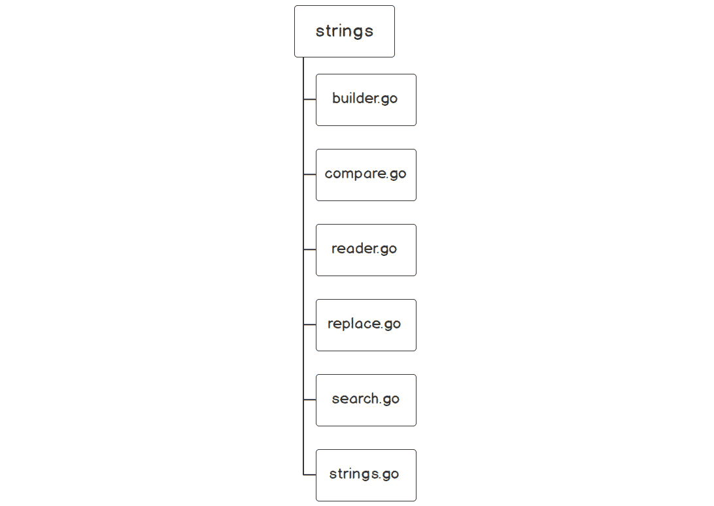
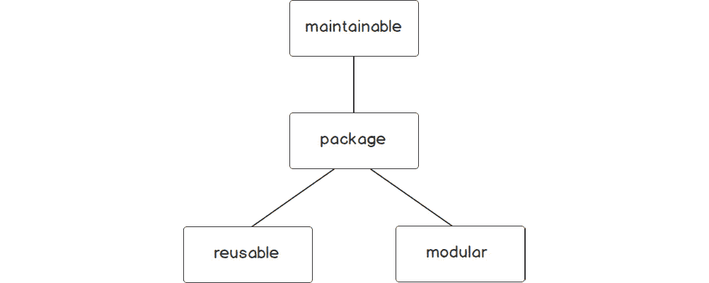
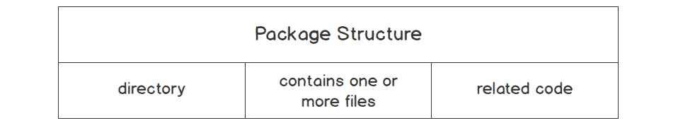
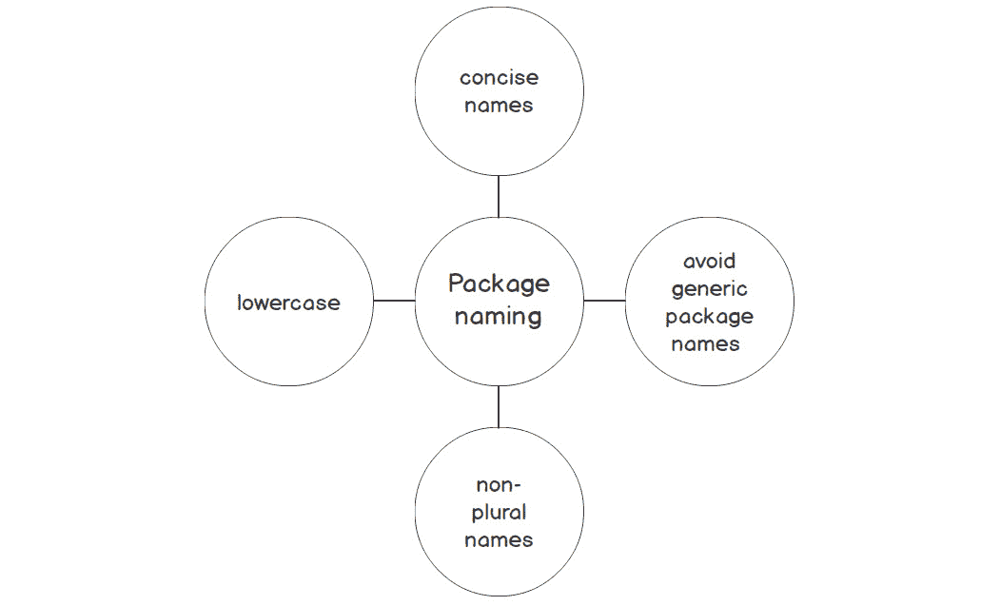
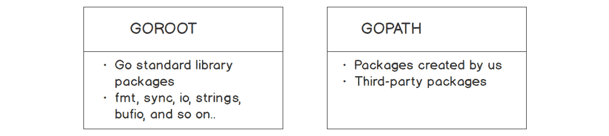
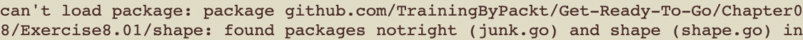
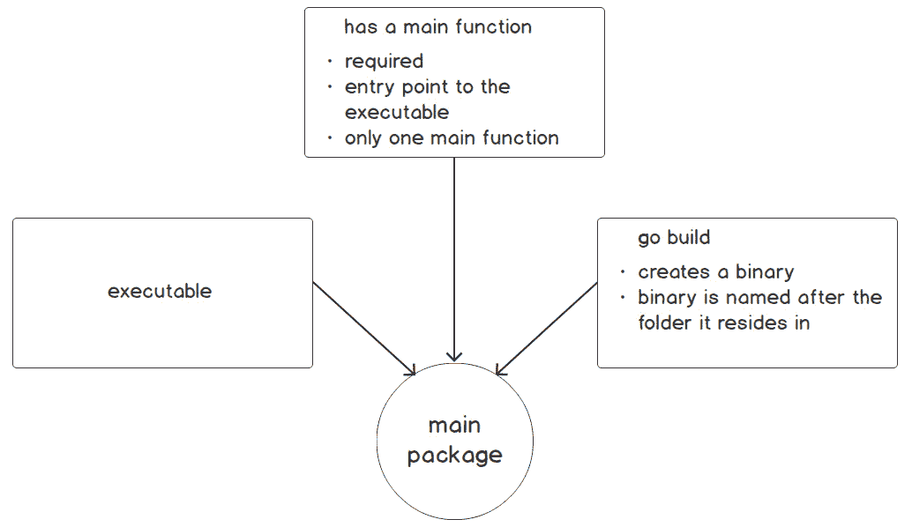
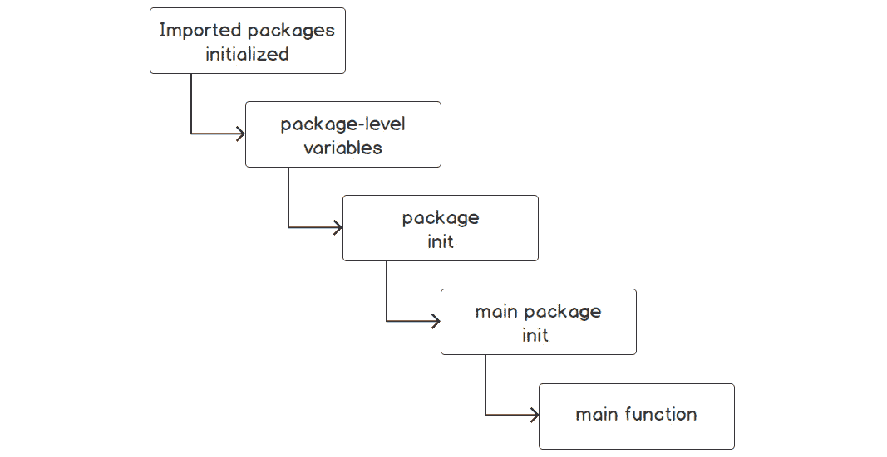
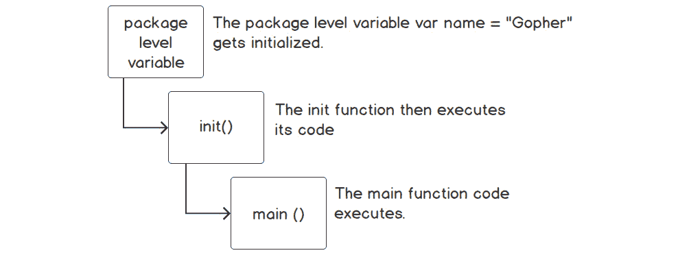
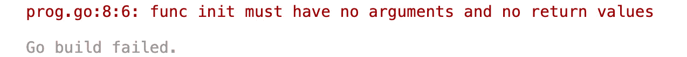

# 8. 包

概述

本章旨在展示在 Go 程序中使用包的重要性。我们将讨论如何使用包来帮助我们的代码更易于维护、重用和模块化。在本章中，您将看到它们如何为我们的代码带来结构和组织。这将在我们的练习、活动和 Go 标准库的一些示例中体现出来。

到本章结束时，您将能够描述一个包及其结构，并声明一个包。您将学习如何在一个包中评估导出和非导出名称，创建自己的包并导入自定义包。您还将能够区分可执行包和非可执行包，并创建一个包的别名。

# 简介

在上一章中，我们探讨了接口。我们看到了如何使用接口来描述类型的行怍。我们还发现，只要类型满足接口的方法集，我们就可以将不同类型传递给接受接口的函数。我们还看到了如何使用接口实现多态。

在本章中，我们将探讨 Go 如何将代码组织成包。我们将看到如何使用包来隐藏或暴露不同的 Go 结构，如结构体、接口、函数等。我们的程序在代码行数和复杂度上相对较小，大多数程序都包含在一个名为`main.go`的单个代码文件中，并在名为`main`的单个包内。在本章的后面部分，我们将探讨`package main`的重要性，所以如果您目前不理解它，请不要担心。在您作为开发团队成员工作时，情况并不总是如此。通常，您的代码库可以变得相当庞大，包含多个文件、多个库和多个团队成员。如果我们不能将代码分解成更小的、可管理的部分，这将相当受限。Go 编程语言通过将类似的概念模块化到包中来解决管理大型代码库的复杂性。Go 的创造者使用包来解决他们自己的标准库中的这个问题。在本书中，您已经使用了许多 Go 包，例如`fmt`、`string`、`os`、`ioutil`等。

让我们看看 Go 标准库中的一个包结构的例子。Go 的`strings`包封装了操作字符串的函数。通过使`strings`包只关注操作字符串的函数，我们作为 Go 开发者知道，这个函数应该包含我们进行字符串操作所需的所有内容。

Go 的字符串包结构如下（[`packt.live/35jueEu`](https://packt.live/35jueEu)）：



](img/B14177_08_01.jpg)

图 8.1：strings 包及其包含的文件](img/B14177_08_01.jpg)

上述图表显示了`strings`包及其中的文件。`strings`包中的每个文件都是以它所支持的功能命名的。代码的逻辑组织从包到文件。我们可以很容易地得出结论，`strings`包包含用于操作字符串的代码。然后我们可以进一步得出结论，`replace.go`文件包含用于替换字符串的函数。您已经可以看到，包的概念结构可以将您的代码组织成模块化的块。您从一起工作以实现某个目的的代码开始，即字符串操作，并将其存储在名为`string`的包中。然后您可以将代码进一步组织到`.go`文件中，并根据其目的命名它们。下一步是将执行单一目的的函数放入其中，该目的反映了文件名和包名。我们将在本章讨论结构化代码时进一步讨论这些概念思想。

开发可维护、可重用和模块化的软件非常重要。让我们简要讨论软件开发的核心组件中的每个这些。

### 可维护性

为了使代码可维护，它必须易于更改，并且任何更改都必须具有低风险，不会对程序产生不利影响。可维护的代码易于修改和扩展，并且易于阅读。随着代码在软件开发生命周期的不同阶段中进展，对代码的更改成本会增加。这些更改可能是由错误、增强或需求变更引起的。当代码不易维护时，成本也会增加。代码需要可维护的另一个原因是需要在行业中保持竞争力。如果你的代码不易维护，可能很难对竞争对手做出反应，竞争对手正在发布一个软件功能，该功能可能被用来超出你的应用程序销售。这只是代码需要可维护的一些原因。

### 可重用性

可重用代码是指可以在新软件中使用的代码。例如，我在现有的应用程序中有一段代码，该代码有一个函数可以返回我的邮件应用程序的地址；这个函数可能被用于新的软件中。这个返回地址的函数可以用于我新的软件中，该软件可以返回客户已下单的订单的地址。

拥有可重用代码的优势如下：

+   通过使用现有包来降低未来项目的成本。

+   由于无需重新发明轮子，它减少了交付应用程序所需的时间。

+   通过增加测试和更多使用，程序的质量将得到提高。

+   在开发周期中可以花更多的时间在其他创新领域。

+   随着您的包增长，及时为未来项目打下基础变得更加容易。

### 模块化

模块化和可重用代码在一定程度上是相关的，从某种意义上说，拥有模块化代码使得它更有可能被重用。在开发代码时，代码的组织是一个突出的问题。在一个未组织的大型程序中找到执行特定功能的代码几乎是不可能的，甚至在不知道是否有执行特定任务的代码的情况下，确定这一点也是困难的，除非有一些代码组织。模块化有助于这个领域。想法是，你的代码执行的每个离散任务都有其自己的代码部分，位于特定的位置。

Go 语言鼓励你通过使用包来开发可维护、可重用和模块化的代码。它旨在鼓励良好的软件开发实践。我们将深入了解 Go 如何利用包来完成这些任务：



图 8.2：代码包可以提供的数据类型

在下一个主题中，我们将讨论什么是包以及构成包的组件。

# 什么是包？

Go 语言遵循**不要重复自己**（**DRY**）原则。这意味着你不应该重复编写相同的代码。将你的代码重构为函数是 DRY 原则的第一步。假设你拥有数百甚至数千个你经常使用的函数，你将如何跟踪所有这些函数呢？其中一些函数可能具有共同的特征。你可能有一组执行数学运算、字符串操作、打印或基于文件的操作的函数。你可能正在考虑将它们拆分成单独的文件：


图 8.3：按文件分组函数

这可能有助于缓解一些问题。然而，如果你的字符串功能开始进一步增长呢？那么你将在一个文件或多个文件中拥有大量的字符串函数。你构建的每个程序也将不得不包含`string`、`math`和`io`的所有代码。你将不得不将代码复制到你所构建的每个应用程序中。一个代码库中的错误将需要在多个程序中修复。这种代码结构既不可维护，也不鼓励代码重用。Go 语言中的包是组织你的代码的下一步，以便于重用代码的组件。以下图表显示了从函数到源文件再到包的代码组织进展：


图 8.4：代码进度组织

Go 将代码组织到称为包的目录中以实现可重用性。包本质上是你工作区内的一个目录，包含一个或多个 Go 源文件，用于对执行任务的代码进行分组。它仅暴露必要的部分，以便使用你的包的人能够完成任务。包的概念类似于在计算机上使用目录来组织文件。

## 包结构

对于 Go 来说，一个包中有多少不同的文件并不重要。你应该根据可读性和逻辑分组将代码分成尽可能多的文件。然而，包中的所有文件必须位于同一目录下。源文件应包含相关的代码，这意味着如果包是用于配置解析，那么其中不应该包含连接到数据库的代码。包的基本结构由一个目录组成，包含一个或多个 Go 文件和相关代码。以下图表总结了包结构的核心组件：



图 8.5：包结构

Go 语言中常用包之一是`strings`包。它包含几个 Go 文件，在 Go 文档中被称为包文件。包文件是包的一部分的`.go`源文件，例如：

+   `builder.go`

+   `compare.go`

+   `reader.go`

+   `replace.go`

+   `search.go`

+   `strings.go`

## 包命名

在我们讨论如何声明一个包之前，我们需要讨论合适的 Go 包命名约定。包名对你的包非常重要。它代表了包的内容，并确定了其目的。你可以将包名视为自文档。在命名包时需要仔细考虑。包名应该简短且简洁。它不应该冗长。通常选择简单名词作为包名。以下是一些不适合作为包名的例子：

+   `stringconversion`

+   `synchronizationprimitives`

+   `measuringtime`

更好的选择可能是以下这些：

+   `strconv`

+   `sync`

+   `time`

    注意

    `strconv`、`sync`和`time`是标准库中实际存在的 Go 包。

此外，包的样式也是需要考虑的因素。以下是一些不适合 Go 包命名的样式选择：

+   `StringConversion`

+   `synchronization_primitives`

+   `measuringTime`

在 Go 语言中，包名应该全部小写，不使用下划线。不要使用驼峰式或蛇形式命名风格。存在多个复数命名的包。

鼓励使用缩写，只要它们在编程社区中熟悉或常见。包的使用者应该能够仅从其名称中轻易理解包的用途，例如：

+   `strconv` (字符串转换)

+   `regexp` (正则表达式搜索)

+   `sync` (同步)

+   `os` (操作系统)

避免使用`misc`、`util`、`common`或`data`等包名。这些包名使得用户难以理解你的包的目的。在某些情况下，可能会有一些偏离这些指南的情况，但大部分情况下，这是我们应努力追求的：



图 8.6：包命名约定

## 包声明

每个 Go 文件都以包声明开始。包声明是包的名称。可执行代码的第一行必须是包声明：

```go
package <packageName>
```

回想一下，标准库中的`strings`包包含以下 Go 源文件：

这些文件中的每一个都是以包声明开始的，尽管它们都是独立的文件。我们将从 Go 标准库中查看一个示例。在 Go 标准库中，有一个名为`strings`的包([`packt.live/35jueEu`](https://packt.live/35jueEu))。它由多个文件组成。我们只将查看包中的代码片段：`builder.go`、`compare.go`和`replace.go`。我们已删除注释和一些代码，仅为了展示包文件是以包名开始的。代码片段将不会有输出。这是一个 Go 如何将代码组织到多个文件但仍在同一包中的示例：

```go
main.go
// https://golang.org/src/strings/builder.go
1  package strings
2  import (
3    "unicode/utf8"
4    "unsafe"
5  )
6  type Builder struct {
7    addr *Builder // of receiver, to detect copies by value
8    buf  []byte
9  }
10 // https://golang.org/src/strings/compare.go
11 package strings
12 func Compare(a, b string) int {
13   if a == b {
14     return 0
15   }
The full code is available at: https://packt.live/35sihwF
```

在 Go 源文件中定义的所有函数、类型和变量都可以在该包内访问。尽管你的包可能分布在多个文件中，但它仍然是同一个包的一部分。内部，所有代码都可以跨文件访问。简单来说，代码在包内是可见的。请注意，并非所有代码在包外都是可见的。前面的代码片段来自官方 Go 库。要进一步了解代码，请访问前面的 Go 代码片段中的链接。

# 导出和非导出代码

Go 有一个非常简单的方式来确定代码是导出还是非导出。导出意味着变量、类型、函数等在包外是可见的。非导出意味着它只对包内可见。如果一个函数、类型、变量等以大写字母开头，它是可导出的；如果以小写字母开头，它是不可导出的。在`Go`中不需要担心访问修饰符。如果函数名称是首字母大写的，那么它是导出的，如果是小写，则是非导出的。

注意

只暴露我们希望其他包看到的代码是一种良好的实践。我们应该隐藏所有其他外部包不需要的内容。

让我们看看以下代码片段：

```go
package main
import ("strings"
"fmt"
)
func main() {
  str := "found me"
  if strings.Contains(str, "found") {
    fmt.Println("value found in str")
  }
}
```

这个代码片段使用了`strings`包。我们正在调用一个名为`Contains`的`strings`函数。`strings.Contains`函数搜索`str`变量，看它是否包含值"`found`"。如果`found`在`str`变量中，`strings.Contains`将返回`true`；如果"`found`"不在`str`变量中，`strings.Contains`函数将返回`false`：

```go
strings.Contains(str, "found")
```

要调用该函数，我们需要在它前面加上包名，然后是函数名。

这个函数是可导出的，因此对`strings`包外的其他人也是可访问的。我们知道它是一个导出函数，因为函数的第一个字母是大写的。

当你导入一个包时，你只能访问导出的名称。

我们可以通过查看`strings.go`文件来验证函数是否存在于`strings`包中：

```go
// https://golang.org/src/strings/strings.go
// Contains reports whether substr is within s.
    func Contains(s, substr string) bool {
    return Index(s, substr) >= 0
    }
```

下一个代码片段将尝试访问`strings`包中的未导出函数：

```go
package main
import (
  "fmt"
  "strings"
)
func main() {
  str := "found me"
  slc := strings.explode(str, 3)
  fmt.Println(slc)
}
```

函数是未导出的，因为它以小写字母开头。只有包内的代码可以访问该函数；它对包外不可见。

代码尝试调用`strings.go`包文件中的未导出函数：


图 8.7：程序输出

以下代码片段来自 Go 标准库`strings`包以及该包内的`strings.go`文件（[`packt.live/2RMxXqh`](https://packt.live/2RMxXqh)）。你可以看到`explode`函数是不可导出的，因为函数名以小写字母开头：

```go
main.go
1  // https://golang.org/src/strings/strings.go
2  // explode splits s into a slice of UTF-8 strings,
3  // one string per Unicode character up to a maximum of n (n < 0 means no limit).
4  // Invalid UTF-8 sequences become correct encodings of U+FFFD.
func explode(s string, n int) []string {
5    l := utf8.RuneCountInString(s)
6    if n < 0 || n > l {
7      n = l
8    }
9    a := make([]string, n)
10   for i := 0; i < n-1; i++ {
11     ch, size := utf8.DecodeRuneInString(s)
12     a[i] = s[:size]
13     s = s[size:]
14     if ch == utf8.RuneError {
15       a[i] = string(utf8.RuneError)
The full code is available at https://packt.live/2teXDBN.
```

## GOROOT 和 GOPATH

我们已经探讨了包是什么以及它的用途。我们有一个基本理解，多个文件可以是一个包结构的一部分。我们已经讨论了 Go 语言中命名包的惯用方法。我们已经看到所有这些基本概念在 Go 标准库中的应用。在我们开始创建自己的包之前，还有一个概念需要了解。理解 Go 编译器如何查找我们应用程序中使用的包的位置是很重要的。

Go 编译器需要一种方法来知道如何找到我们的源文件（包），以便编译器可以构建和安装它们。编译器利用两个环境变量来完成这项工作。`$GOROOT`和`$GOPATH`告诉 Go 编译器在哪里搜索由`import`语句列出的 Go 包的位置。

`$GOROOT`用于告诉 Go 编译器 Go 标准库包的位置。`$GOROOT`是针对 Go 标准库的。这是 Go 用来确定其标准库包和工具位置的方法。

`$GOPATH`是我们创建的包以及我们可能导入的第三方包的位置。在命令行中，输入以下代码：

```go
ECHO $GOPATH
```

在 `$GOPATH` 文件结构内部，有三个目录：`bin`、`pkg` 和 `src`。`bin` 目录是最容易理解的。这是 Go 在运行 `go install` 命令时放置二进制文件或可执行文件的地方。`pkg` 目录的主要用途是编译器用来存储 Go 编译器构建的包的对象文件，这是为了帮助加快程序的编译速度。`src` 目录是我们最感兴趣的，因为我们把我们的包放在这个目录中。这是放置具有 `.go` 扩展名的文件的目录。

例如，如果我们有一个位于 `$GOPATH/src/person/address/` 的包，并且我们想使用地址包，我们需要以下 `import` 语句：

```go
import "person/address"
```

另一个例子是，如果我们有一个位于 `$GOPATH/src/company/employee` 的包。如果我们对使用 `employee` 包感兴趣，则 `import` 语句如下：

```go
import "company/employee"
```

位于源代码仓库中的包将遵循类似的模式。如果我们想从 [`packt.live/2EKp357`](https://packt.live/2EKp357) 导入源代码，则在文件系统中的位置将是 `$GOPATH/src/github.com/PacktWorkshops/The-Go-Workshop/Chapter08/Exercise8.01`。

导入方式如下：

```go
import "github.com/PacktWorkshops/Get-Ready-To-Go/Chapter08/Exercise8.01"
```

下图显示了 `$GOROOT` 和 `$GOPATH` 之间的差异：



图 8.8：GOROOT 和 GOPATH 比较

我们将创建一个名为 `msg` 的简单包。此文件的位于 `$GOPATH` `$GOPATH/msg/msg.go`:

```go
package msg
import "fmt"
//Greeting greets the input parameter
func Greeting(str string) {
    fmt.Printf("Greeting %s\n", str)
}
```

包的名称是 `msg`。

它有一个导出的函数。该函数接收一个字符串并将 `"Greeting"` 打印到传递给函数的参数上。

要使用 Go 包和我们的自定义包，我们必须导入它们。`import` 声明包含路径位置和包的名称。包的名称是包含包文件的最后一个目录。例如，如果我们有位于 `$GOPATH` 位置的目录结构，`packt/chpkg/test/mpeg`，则包名将是 `mpeg`。

下面的代码片段是 `main` 包文件。它位于 `$GOPATH` 内的以下目录结构中：

`$GOPATH/demoimport/demoimport.go`:

```go
package main
import (
  "fmt"
  "msg"
)
func main() {
  fmt.Println("Demo Import App")
  msg.Greeting("George")
}
```

输出将如下所示：

```go
Greeting George
```

这个基本程序导入了 `msg` 包。由于我们已经导入了 `msg` 包，因此我们可以通过使用 `"msg.<functionName>"` 优先级来调用包中的任何可导出函数。我们知道我们的 `msg` 包有一个名为 `Greeting` 的可导出函数。我们从 `msg` 包中调用可导出的 `Greeting` 函数，并在前面的图中获得输出。

当创建一个包时，它可以在同一目录下包含多个文件。我们需要确保该目录中的每个文件都属于同一个包。如果你有一个名为 `shape` 的包，在该目录下你有两个文件，但每个文件都有不同的包声明，Go 编译器将返回一个错误：

`shape.go`

```go
package shape
```

`junk.go`

```go
package notright
```

如果你尝试进行构建，你会得到以下错误：



图 8.9：程序输出

## 包别名

Go 也有能力别名包名。你可能想使用别名名的原因有几个：

+   包名可能不容易让人理解其目的。为了清晰起见，可能最好为包别名为不同的名称。

+   包名可能太长。在这种情况下，你希望别名更加简洁，不那么冗长。

+   可能存在包路径唯一但包名相同的情况。这时，你需要使用别名来区分这两个包。

包别名的语法非常简单。你将别名名放在 `import` 包路径之前：

```go
import  f "fmt"
```

这里是一个简单示例，展示了如何使用包别名：

```go
package main
import (
  f "fmt"
  //"fmt"
)
func main() {
  f.Println("Hello, Gophers")
}
import (
  f "fmt"
```

我们正在将 `fmt` 包别名为 `f`：

```go
  f.Println("Hello, Gophers")
```

在 `main()` 函数中，我们现在能够使用 `f` 别名调用 `Println()` 函数。

## 主包

主包是一个特殊的包。Go 中有两种基本的包类型：可执行包和非可执行包。主包是 Go 中的可执行包。主包需要在其包中有一个 `main()` 函数。`main()` 函数是 Go 可执行程序的入口点。当你对主包执行 `go build` 时，它将编译包并创建一个二进制文件。二进制文件将创建在主包所在的目录中。二进制文件的名字将是它所在的文件夹名：



图 8.10：主包功能

这里是一个主包代码的简单示例：

```go
package main
import (
  "fmt"
)
func main() {
  fmt.Println("Hello Gophers!")
}
```

预期输出如下：

```go
Hello Gophers !
```

## 练习 8.01：创建一个包来计算各种形状的面积

在 *第七章*，*接口* 中，我们实现了计算不同形状面积的代码。在这个练习中，我们将所有关于形状的代码移动到一个名为 `shape` 的包中。然后，我们将更新 `shape` 包中的代码以使其可导出。然后，我们将更新 `main` 以导入我们新的 `shape` 包。然而，我们希望它在主包的 `main()` 函数中仍然执行相同的功能。

这里是我们将要转换为包的代码：

[`packt.live/36zt6gv`](https://packt.live/36zt6gv).

你应该在 `$GOPATH` 内有一个目录结构，并在相应的目录中有文件，如下面的截图所示：


图 8.11：程序目录结构

`shape.go`文件应包含整个代码：

[`packt.live/2PFsWNx`](https://packt.live/2PFsWNx)。

我们将只介绍与将此代码作为包进行构建相关的更改，有关我们已在上一章中介绍过的代码部分的详细信息，请参阅*第七章*，*接口*：

1.  在`Chapter08`目录下创建一个名为`Exercise8.01`的目录。

1.  在`Exercise8.01`目录下再创建两个名为`area`和`shape`的目录。

1.  在`Exercise8.01/area`目录下创建一个名为`main.go`的文件。

1.  在`Exercise8.01/shape`目录下创建一个名为`shape.go`的文件。

1.  打开`Exercise8.01/shape.go`文件。

1.  添加以下代码：

    ```go
    package shape
    import "fmt"
    ```

    此文件的第一行代码告诉我们这是一个名为`shape`的非可执行包。非可执行包在编译时不会产生二进制或可执行代码。回想一下，`main`包是一个可执行的包。

1.  接下来，我们需要使类型可导出。对于每个`struct`类型，我们必须利用类型名及其字段来使其可导出。可导出意味着它可以在包外部可见：

    ```go
    type Shape interface {
      area() float64
      name() string
    }
    type Triangle struct {
      Base   float64
      Height float64
    }
    type Rectangle struct {
      Length float64 
      Width  float64
    }
    type Square struct {
      Side float64
    }
    ```

1.  我们还必须通过将方法名改为小写来使方法不可导出。目前没有必要使那些方法在包外部可见：

    ```go
    Exercise8.01
    18 func PrintShapeDetails(shapes ...Shape) {
    19   for _, item := range shapes {
    20     fmt.Printf("The area of %s is: %.2f\n", item.name(), item.area())
    21   }
    22 }
    23 func (t Triangle) area() float64 {
    24   return (t.Base * t.Height) / 2
    25 }
    26 func (t Triangle) name() string {
    27   return "Triangle"
    28 }
    29 func (r Rectangle) area() float64 {
    30   return r.Length * r.Width
    31 }
    32 func (r Rectangle) name() string {
    The full code for this step is available at: https://packt.live/2rngdHf.
    ```

1.  `PrintShapeDetails`函数也需要大写首字母：

    ```go
    func PrintShapeDetails(shapes ...Shape) {
      for _, item := range shapes {
        fmt.Printf("The area of %s is: %.2f\n", item.name(), item.area())
      }
    }
    ```

1.  执行构建以确保没有编译错误：

    ```go
    go build
    ```

1.  这里是`main.go`文件的列表。通过将包作为`main`，我们知道这是一个可执行的：

    ```go
    package main
    ```

1.  `import`声明只有一个导入。它是`shape`包。路径位置是`$GOPATH`加上`import`路径声明。我们可以看到包名为`shape`，因为它是路径声明中的最后一个目录名。这里提到的`$GOPATH`可能与你的不同：

    ```go
    import (
      import "github.com/PacktWorkshops/The-Go-Workshop/Chapter08/Exercise8.01/shape"
    )
    ```

1.  在`main()`函数中，我们正在初始化`shape`包的可导出类型：

    ```go
    func main() {
      t := shape.Triangle{Base: 15.5, Height: 20.1}
      r := shape.Rectangle{Length: 20, Width: 10}
      s := shape.Square{Side: 10}
    ```

1.  然后我们调用`shape()`函数，`PrintShapeDetails`，以获取每个形状的面积：

    ```go
      shape.PrintShapeDetails(t, r, s)
    }
    ```

1.  在命令行中，进入`\Exercise8.01\area`目录结构。

1.  在命令行中，输入以下内容：

    ```go
    go build
    ```

1.  `go build`命令将编译你的程序并创建一个以`dir`区域命名的可执行文件。

1.  输入可执行文件名并按*Enter*键：

    ```go
    ./area
    ```

    预期输出如下：

    ```go
    The area of Triangle is: 155.78
    The area of Rectangle is: 200.00
    The area of Square is 100.00
    ```

我们现在有了在接口章节实现中之前拥有的功能。我们现在将`shape`功能封装在`shape`包中。我们只公开或使需要维护先前实现的函数或方法可见。`main`包更加简洁，并导入`shape`包以提供先前实现中的功能。

# `init()`函数

正如我们所讨论的，每个 Go 程序（可执行文件）都是从`main`包开始的，入口点是`main`函数。我们还应该注意另一个特殊函数，称为`init()`。每个源文件都可以有一个`init()`函数，但到目前为止，我们将从`main`包的角度来看`init`函数。当你开始编写包时，你可能需要为包提供一些初始化（`init()`函数）。`init()`函数用于设置状态或值。`init()`函数为你的包添加初始化逻辑。以下是一些`init()`函数的用法示例：

+   设置数据库对象和连接

+   包变量的初始化

+   创建文件

+   加载配置数据

+   验证或修复程序状态

`init()`函数需要以下模式来调用：

+   导入的包首先被初始化。

+   包级别的变量被初始化。

+   调用包的`init()`函数。

+   `main`被执行。

以下图表显示了典型 Go 程序遵循的执行顺序：



图 8.12：执行顺序

这里有一个简单的示例，演示了`package main`的执行顺序：

```go
package main
import (
  "fmt"
)
var name = "Gopher"
func init() {
  fmt.Println("Hello, ",name)
}
func main() {
  fmt.Println("Hello, main function")
}
```

代码的输出如下：

```go
Hello, Gopher
Hello, main function
```

让我们分部分理解这段代码：

```go
var name = "Gopher"
```

根据代码的输出，包级别的变量声明首先被执行。我们知道这一点是因为`name`变量在`init()`函数中被打印出来：

```go
func init() {
  fmt.Println("Hello, ",name)
}
```

然后`init()`函数被调用并打印出`"Hello, Gopher"`：

```go
func main() {
  fmt.Println("Hello, main function")
}
```

最后，执行`main()`函数：



图 8.13：代码片段的执行流程

`init()`函数不能有任何参数或返回值：

```go
package main
import (
  "fmt"
)
var name = "Gopher"
func init(age int) {
  fmt.Println("Hello, ",name)
}
func main() {
  fmt.Println("Hello, main function")
}
```

运行此代码片段将导致以下错误：



图 8.14：程序输出

## 练习 8.02：加载预算类别

编写一个程序，在`main`函数运行之前将预算类别加载到全局映射中。然后`main`函数应该打印映射上的数据：

1.  创建一个`main.go`文件。

1.  代码文件将属于`package main`，并且需要导入`fmt`包：

    ```go
    package main
    import "fmt"
    ```

1.  创建一个全局变量，它将包含一个键为`int`、值为`string`的预算类别映射：

    ```go
    var budgetCategories = make(map[int]string)
    ```

1.  我们需要在`main`运行之前使用一个`init()`函数来加载我们的预算类别：

    ```go
    func init() {
        fmt.Println("Initializing our budgetCategories")
        budgetCategories[1] = "Car Insurance"
        budgetCategories[2] = "Mortgage"
        budgetCategories[3] = "Electricity"
        budgetCategories[4] = "Retirement"
        budgetCategories[5] = "Vacation"
        budgetCategories[7] = "Groceries"
        budgetCategories[8] = "Car Payment"
    }
    ```

1.  由于我们的预算类别已经被加载，我们现在可以遍历这个映射并打印它们：

    ```go
    func main() {
        for k, v := range budgetCategories {
            fmt.Printf("key: %d, value: %s\n", k, v)
        }
    }
    ```

    我们将得到以下输出：

    ```go
    Initializing our budgetCategories
    key: 5, value: Vacation
    key: 7, value: Groceries
    key: 8, value: Car Payment
    key: 1, value: Car Insurance
    key: 2, value: Mortgage
    key: 3, value: Electricity
    key: 4, value: Retirement
    ```

此处的目的是演示如何使用 `init()` 函数在 `main` 函数执行之前执行数据初始化和加载。通常需要在 `main` 运行之前加载的数据是静态数据，例如下拉列表值或某种配置。如所示，数据通过 `init` 函数加载后，可以被 `main` 函数使用。在下一个主题中，我们将看到多个 `init` 函数是如何执行的。

注意

输出顺序可能不同；Go maps 不保证数据的顺序。

## 执行多个 init() 函数

一个包中可以有多个 `init()` 函数。这使您能够模块化初始化，以更好地维护代码。例如，假设您需要设置各种文件和数据库连接，并修复程序执行的环境状态。在一个 `init()` 函数中完成所有这些会使维护和调试变得复杂。多个 `init()` 函数的执行顺序是函数在代码中放置的顺序：

```go
package main
import (
  "fmt"
)
var name = "Gopher"
func init() {
  fmt.Println("Hello, ",name)
}
func init(){
  fmt.Println("Second")
}
func init(){
  fmt.Println("Third")
}
func main() {
  fmt.Println("Hello, main function")
}
```

让我们将代码分解成部分并评估它：

```go
var name = "Gopher"
```

Go 在执行 `init` 函数之前首先初始化 `name` 变量：

```go
func init(){
  fmt.Println("Hello, ",name)
}
```

这首先打印出来，因为它是在函数中的第一个 `init`：

```go
func init(){
  fmt.Println("Second")
}
```

上述内容由于是函数中的第二个 `init` 而排在第二位打印出来：

```go
func init(){
  fmt.Println("Third")
}
```

上述内容由于是函数中的第三个 `init` 而排在第三位打印出来：

```go
func main(){
  fmt.Println("Hello, main function")
}
```

最后，执行 `main()` 函数。

结果如下：

```go
Hello, Gopher
Second
Third
Hello, main function
```

## 练习 8.03：将收款人分配到预算类别

我们将扩展我们的程序，从 *练习 8.02*，*加载预算类别*，现在将收款人分配到预算类别。这类似于许多预算应用程序，试图将收款人与常用类别匹配。然后我们将打印收款人与类别的映射：

1.  创建 `main.go` 文件。

1.  将 *练习 8.02*，*加载预算类别*，[`github.com/PacktWorkshops/The-Go-Workshop/blob/master/Chapter08/Exercise8.02/main.go`](https://github.com/PacktWorkshops/The-Go-Workshop/blob/master/Chapter08/Exercise8.02/main.go) 中的代码复制到 `main.go` 文件中。

1.  在 `budgetCategories` 后添加一个 `payeeToCategory` 映射：

    ```go
    var budgetCategories = make(map[int]string)
    var payeeToCategory = make(map[string]int)
    ```

1.  添加另一个 `init()` 函数。这个 `init()` 函数将用于填充我们的新 `payeeToCategory` 映射。我们将收款人分配到类别的键值：

    ```go
    main.go
    5  func init() {
    6      fmt.Println("Initializing our budgetCategories")
    7      budgetCategories[1] = "Car Insurance"
    8      budgetCategories[2] = "Mortgage"
    9      budgetCategories[3] = "Electricity"
    10     budgetCategories[4] = "Retirement"
    11     budgetCategories[5] = "Vacation"
    12     budgetCategories[7] = "Groceries"
    13     budgetCategories[8] = "Car Payment"
    14 }
    The full code for this step is available at: https://packt.live/2Qdss1E.
    ```

1.  在 `main()` 函数中，我们将打印出收款人到类别。我们遍历 `payeeToCategory` 映射，打印键（`收款人`）。我们通过将 `payeeToCategory` 映射的值作为键传递给 `budgetCategories` 映射来打印类别：

    ```go
    func main() {
        fmt.Println("In main, printing payee to category")
        for k, v := range payeeToCategory {
            fmt.Printf("Payee: %s, Category: %s\n", k, budgetCategories[v])
        }
    }
    ```

这是预期的输出：


图 8.15：将收款人分配到预算类别

你现在创建了一个程序，在执行`main`函数之前，先执行多个`init()`函数。每个`init()`函数都将数据加载到我们的全局映射变量中。我们确定了`init`函数执行的顺序，因为显示的`print`语句。这表明`init()`函数按照它们在代码中出现的顺序打印。了解你的`init`函数的顺序很重要，因为你可能会根据代码执行的顺序得到不可预见的结果。

在即将到来的活动中，我们将使用我们查看的所有关于包的概念，并看看它们是如何一起工作的。

## 活动八.01：创建计算薪酬和绩效评估的函数

在这个活动中，我们将采取*活动 7.01*，*计算薪酬和绩效评估*，并使用包进行模块化。我们将重构来自[`packt.live/2YNnfS6`](https://packt.live/2YNnfS6)的代码：

1.  将`Developer`、`Employee`和`Manager`的类型和方法移动到它们自己的包中。类型、方法和函数必须正确导出或未导出。

1.  将包命名为`payroll`。

1.  将类型及其方法逻辑上分离到不同的包文件中。回想一下，良好的代码组织涉及将类似功能分离到单独的文件中。

1.  创建`main()`函数作为`payroll`包的别名。

1.  在`main`包中引入两个`init()`函数。第一个`init()`函数应该简单地打印一条问候消息到`stdout`。第二个`init()`应该初始化/设置键值对。

    预期的输出如下：

    ```go
    Welcome to the Employee Pay and Performance Review
    ++++++++++++++++++++++++++++++++++++++++++++++++++
    Initializing variables
    Eric Davis got a review rating of 2.80
    Eric Davis got paid 84000.00 for the year
    Mr. Boss got paid 160500.00 for the year
    ```

在这个活动中，我们看到了如何使用包来分离我们的代码，然后将代码逻辑上分离成单独的文件。我们可以看到，每个文件都构成了一个包。包中的每个文件都可以访问其他文件，无论它们是否在单独的文件中。这个活动演示了如何创建包含多个文件的包，以及如何使用这些单独的文件进一步组织我们的代码。

注意

这个活动的解决方案可以在第 720 页找到。

# 摘要

我们探讨了开发可维护、可重用和模块化软件的重要性。我们发现 Go 的包在满足这些软件开发标准方面发挥着重要作用。我们研究了包的整体结构。它由一个目录组成，可以包含一个或多个文件，并且包含相关的代码。一个包本质上是你工作空间中的一个目录，其中包含一个或多个用于分组执行任务的代码文件。它只向使用你的包的人暴露必要的部分以完成任务。我们讨论了正确命名包的重要性。我们还学习了如何命名一个包，即简洁、小写、描述性、使用非复数名称，并避免使用通用名称。包可以是可执行的或不可执行的。如果一个包是主包，那么它就是一个可执行包。主包必须有一个主函数，这是我们的包的入口点。

我们还讨论了可导出和不可导出代码的概念。当我们将函数、类型或方法的名称大写时，它对使用我们的包的其他人是可见的。将函数、类型或方法小写化使其对包外部的其他用户不可见。在创建包时，我们意识到`GOROOT`和`GOPATH`是重要的，因为它们决定了 Go 在哪里查找包。我们了解到`init`函数可以执行以下任务：初始化变量、加载配置数据、设置数据库连接或验证我们的程序状态是否已准备好执行。`init()`函数在执行时有一定的规则，以及如何利用它。本章将帮助你编写高度可管理、可重用和模块化的代码。

在下一章中，我们将研究基本的调试技术。我们将探讨各种帮助我们定位程序中错误的技术。我们还将讨论减少定位错误难度的方法以及如何在修改代码库后增加定位错误的机会。
