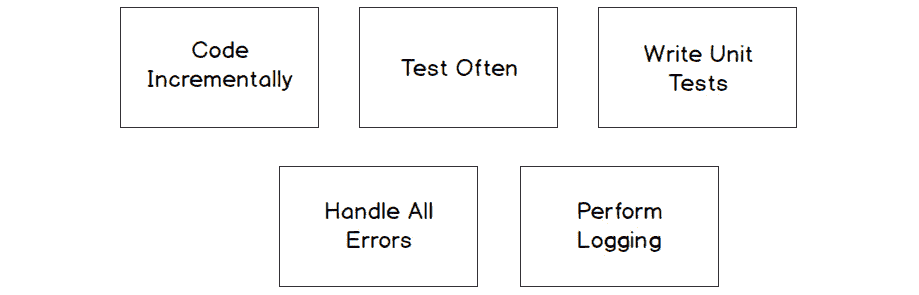
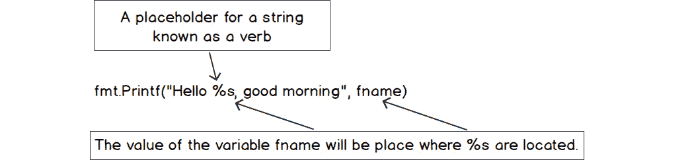
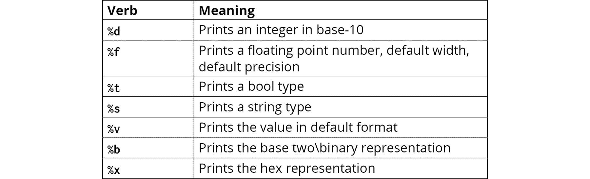
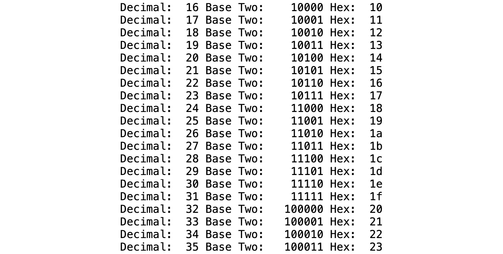
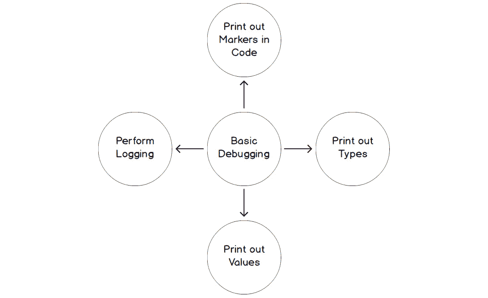
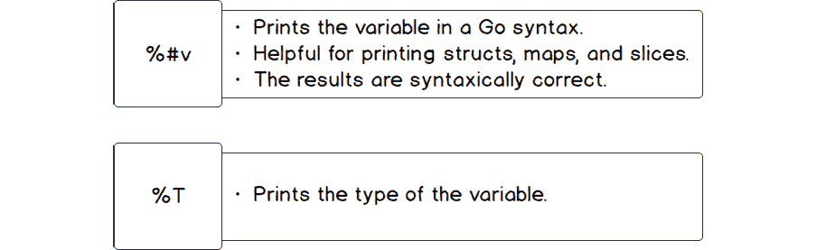
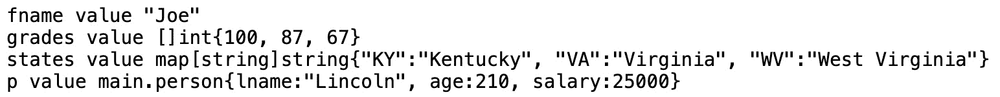
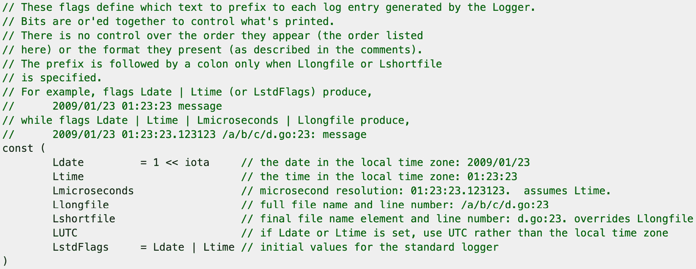
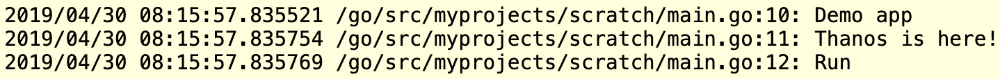
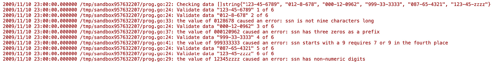

# 9. 基本调试

概述

在本章中，我们将探讨基本的调试方法。我们将探讨我们可以采取的一些主动措施来减少我们引入程序中的错误数量。一旦我们理解了这些措施，我们将研究我们可以定位错误的方法。

你将能够熟悉 Go 语言中的调试，并实现各种格式化打印的方法。你将评估基本的调试技术，并找到代码中错误的通用位置。到本章结束时，你将知道如何使用 Go 代码打印变量类型和值，以及为了调试目的记录应用程序的状态。

# 简介

当你开发软件程序时，你的程序有时会以未预期的方式表现。例如，程序可能会抛出错误并可能崩溃。崩溃是指我们的代码在中间停止功能并突然退出。也许，程序给出了意外的结果。例如，我们请求视频流服务观看电影 *Rocky 1*，但反而得到了 *Creed 1!* 或者，你将支票存入银行账户，但银行软件并没有给你账户记入，反而从你的账户中扣除。这些软件程序以未预期方式表现的情况被称为错误。有时，“错误”和“错误”可以互换使用。在 *第六章* 的 *什么是错误？* 部分，我们讨论了有三种不同类型的错误或错误：语法错误、运行时错误和逻辑错误。我们还检查了示例，并看到了发现每种类型错误位置的困难。

确定意外行为原因的过程称为调试。有各种原因的 bug 被发布到生产环境中：

+   **测试是在开发结束时进行的**：在开发生命周期中，可能会诱使我们不进行增量测试。例如，我们正在为应用程序创建多个功能，一旦我们完成所有功能，它们然后被测试。测试我们代码的更好方法可能是，在我们完成每个功能后立即对其进行测试。这被称为增量测试或以更小的块交付代码。这使我们拥有更好的代码稳定性。这是通过在继续到下一个功能之前测试一个功能来确保它正常工作来实现的。我们刚刚完成的功能可能被其他功能使用。如果我们继续之前不对其进行测试，使用我们的功能的其他功能可能会使用一个有缺陷的功能。根据错误和我们对功能所做的更改，这可能会影响我们功能的其他用户。在本章的后面部分，我们将讨论一些编码和测试增量的一些更多好处。

+   **应用程序增强或需求变更**：我们的代码在开发阶段和发布到生产阶段之间经常发生变化。一旦进入生产阶段，我们会收到用户的反馈；反馈可能是额外的需求或对代码的增强。在一个区域更改生产级代码可能会对另一个区域产生负面影响。如果开发团队使用单元测试，那么这将有助于减轻代码库变更中引入的一些 bug。通过使用单元测试，我们可以在交付代码之前运行我们的单元测试，以查看我们的变更是否产生了负面影响。我们将在后面讨论单元测试是什么。

+   **不切实际的开发时间表**：有时功能需要在非常紧张的时间框架内交付。这可能导致在最佳实践中走捷径，缩短设计阶段，进行较少的测试，以及收到不明确的需求。所有这些都会增加引入 bug 的机会。

+   **错误处理**：一些开发者可能选择不处理发生的错误。例如，应用程序加载配置数据所需的文件找不到，未处理无效数学运算（如除以零）的错误返回，或者可能无法建立与服务器的连接。如果你的程序没有正确处理这些和其他类型的错误，这可能会导致 bug。

这些只是 bug 的一些原因。bug 对我们的程序有负面影响。导致计算错误的 bug 的结果可能是致命的。在医疗行业，有一种机器用于注射一种名为肝素的药物；这种药物是血液稀释剂，用于预防血栓。如果确定肝素给药频率和剂量的代码中存在导致其故障的 bug，机器可能会过量或不足地给药。这可能会对病人产生不利影响。正如你所看到的，交付尽可能无 bug 的软件至关重要。在本章中，我们将探讨一些减少引入 bug 数量的方法以及隔离 bug 位置的方法。

# 无 bug 代码的方法

我们将简要探讨一些方法，这些方法将帮助我们最小化可能被引入代码中的 bug 数量。这些方法还将帮助我们增强对引入 bug 的代码部分的信心：



图 9.1：调试代码的不同方法

## 逐步编码并频繁测试

让我们考虑逐步开发的方法。这意味着逐步开发程序，并在添加增量代码后经常对其进行测试。这种模式将帮助你轻松跟踪 bug，因为你正在测试每一小段代码，而不是一个大的程序。

## 编写单元测试

当编写测试并发生代码更改时，单元测试可以保护代码免受潜在错误的引入。一个典型的单元测试会接受一个给定的输入并验证是否产生了预期的结果。如果代码更改前单元测试通过，但代码更改后失败，那么我们可以得出结论，我们引入了一些意外的行为。在将代码推送到生产系统之前，单元测试必须通过。

## 处理所有错误

这在 *第六章*，*错误* 中讨论过。忽略错误可能导致我们的程序出现潜在的不期望的结果。我们需要正确处理错误，以便使调试过程更容易。

## 执行日志记录

记录是我们可以用来确定程序中发生情况的另一种技术。有各种类型的日志；一些常见的日志类型包括 debug、info、warn、error、fatal 和 trace。我们不会深入到每种类型的细节；相反，我们将专注于执行 debug 类型的日志。这种类型的日志通常用于确定错误发生前的程序状态。收集的一些信息包括变量的值、正在执行的代码部分（例如函数名）、传递的参数的值、函数或方法的输出，等等。在本章中，我们将使用 Go 标准库的内置功能执行我们自己的自定义 debug 日志。Go 的内置日志包可以提供时间戳。这在尝试理解各种事件的时机时很有用。当你进行日志记录时，你需要考虑到性能的影响。根据应用程序及其负载，在高峰时段日志可能会非常详细，可能会对应用程序的性能产生负面影响。在某些情况下，它可能会导致应用程序无响应。

## 使用 fmt 格式化

`fmt` 包的一个用途是在控制台或文件系统中显示数据，例如一个包含可能有助于调试代码的信息的文本文件。我们已经多次使用了 `Println()` 函数。让我们稍微深入地看看 `fmt.Println()` 的功能。`fmt.Println()` 函数在变量之间放置空格，然后在字符串的末尾追加一个新行。`fmt.Println()` 函数打印变量的默认格式。

## 练习 9.01：使用 fmt.Println

在这个练习中，我们将使用 `fmt.Println` 打印一个 `hello` 语句：

1.  导入 `fmt` 包：

    ```go
    package main
    import (
        "fmt"
    )
    ```

1.  在 `main()` 函数中声明 `fname` 和 `lname` 变量，并将两个字符串赋给一个变量：

    ```go
    func main() {
        fname:= "Edward"
        lname:= "Scissorhands"
    ```

1.  从 `fmt` 包中调用 `Println` 方法。它将打印 `Hello:` 然后打印两个变量的值，后面跟着一个空格。然后，它将打印一个 `\n`（换行符）到标准输出：

    ```go
        fmt.Println("Hello:",fname,lname)
    ```

1.  以下语句将 `Next Line` 加上 `\n` 打印到标准输出：

    ```go
        fmt.Println("Next Line")
    }
    ```

    输出如下：

    ```go
    Hello: Edward Scissorhands
    Next Line
    ```

我们已经展示了打印消息的基本方法。在下一个主题中，我们将探讨如何格式化我们想要打印的数据。

## 使用 fmt.Printf() 格式化

`fmt` 包也有多种方式来格式化我们各种打印语句的输出。我们接下来将看看 `fmt.Printf()`。

`fmt.Printf()` 根据动词格式化字符串，并将其打印到 `stdout`。标准输出 (`stdout`) 是一个输出流。默认情况下，标准输出指向终端。该函数使用称为格式动词或有时称为格式说明符的东西。动词告诉 `fmt` 函数在哪里插入变量。例如，`%s` 打印一个字符串；它是一个字符串的占位符。这些动词基于 C 语言：




图 9.2：Printf 的解释

考虑以下示例：

```go
package main
import (
    "fmt"
)
func main() {
    fname:= "Edward"
    fmt.Printf("Hello %s, good morning",fname)
}
```

当 `fname` 变量被赋值为 `Edward` 时，当 `fmt.Printf()` 函数运行时，`%s` 动词将具有 `fname` 的值。

输出如下：

```go
Hello Edward, good morning
```

但当我们有多个变量想要打印时会发生什么？我们如何在 `fmt.Printf()` 函数中打印多个变量？让我们看看：

```go
package main
import (
    "fmt"
)
func main() {
    fname:= "Edward"
    lname:= "Scissorhands"
    fmt.Printf("Hello Mr. %s %s",fname,lname)
}
```

如前述代码所示，我们现在将 `fname` 和 `lname` 赋值给一个字符串。`fmt.Printf()` 函数有两个动词字符串和两个变量。第一个变量 `fname` 被分配给第一个 `%s`。第二个变量 `lname` 被分配给第二个 `%s`。变量按照它们在 `fmt.Printf()` 函数中的放置顺序替换动词。

输出如下：

```go
Hello Mr. Edward Scissorhands
```

`fmt.Printf()` 函数不会在其打印的字符串末尾添加换行符。如果我们想要带有换行符的输出，我们必须在字符串中添加换行符：

```go
package main
import (
    "fmt"
)
func main() {
    fname := "Edward"
    lname := "Scissorhands"
    fmt.Printf("Hello my first name is %s\n", fname)
    fmt.Printf("Hello my last name is %s", lname)
}
```

在 Go 中，你可以使用 `\` 来转义字符。这告诉我们一个字符不应该被打印，因为它有特殊含义。当你使用 `\n` 时，它表示换行。我们可以在字符串的任何地方放置换行符。

输出如下：

```go
Hello my first name is Edward
Hello my last name is Scissorhands
```

如果我们没有在字符串中放置 `\n`，结果如下：

```go
Hello my first name is EdwardHello my last name is Scissorhands
```

Go 语言有几种打印动词。我们将介绍一些常用的一些基本动词。我们将介绍其他动词，当它们与执行基本调试相关时：



图 9.3：表示动词及其含义的表格

让我们看看使用动词来打印各种数据类型的一个例子：

```go
package main
import (
    "fmt"
)
func main() {
    fname := "Joe"
    gpa := 3.75
    hasJob := true
    age := 24
    hourlyWage := 45.53
    fmt.Printf("%s has a gpa of %f.\n", fname, gpa)
    fmt.Printf("He has a job equals %t.\n", hasJob)
    fmt.Printf("He is %d earning %v per hour.\n", age, hourlyWage)
}
    fname := "Joe"
    gpa := 3.75
    hasJob := true
    age := 24
    hourlyWage := 45.53
```

+   我们初始化了各种不同类型的变量，这些变量将在我们的 `Printf()` 函数中使用：

    ```go
    fmt.Printf("%s has a gpa of %f.\n", fname, gpa)
    ```

    `%s` 是字符串的占位符；当 `Printf()` 语句运行 `fname` 变量的值时，它将替换 `%s`。`%f` 是浮点数的占位符；当 `Printf()` 语句运行 `gpa` 变量的值时，它将替换 `%f`。

+   检查此人是否有工作如下：

    ```go
    fmt.Printf("He has a job equals %t.\n", hasJob)
    ```

+   `%t` 是 `bool` 类型的占位符。当 `Printf()` 语句运行 `hasJob` 变量的值时，它将替换 `%t`。

+   打印人的年龄和每小时的工资：

    ```go
    fmt.Printf("He is %d earning %v per hour.\n", age, hourlyWage)
    ```

+   `%d` 是十进制 `int` 类型的占位符。当 `Printf` 语句运行 `age` 变量的值时，它将替换 `%d`。

    `%v` 是默认格式中值的占位符。

    以下为预期输出：

    ```go
    Joe has a gpa of 3.750000.
    He has a job equals true.
    He is 24 earning 45.53 per hour.
    ```

    注意

    我们将演示如何格式化动词，如 `gpa`，使其四舍五入到特定的位数。

## 格式化选项的附加选项

动词也可以通过添加额外的选项来格式化。在我们之前的例子中，`gpa` 变量打印了一些错误的零。在本主题中，我们将演示如何控制某些动词的打印。如果我们想在使用 `%f` 动词时四舍五入到一定的精度，我们可以通过在 `%` 符号后放置小数点和数字来实现：`%.2f`。这将指定两位小数，第二位进行四舍五入。根据以下示例，注意 `nth` 数字是如何根据 `%.nf` 动词中使用的 n(数字)来四舍五入的：

![图 9.4：舍入小数]

![img/B14177_09_04.jpg]

图 9.4：舍入小数

您也可以指定数字的整体宽度；这包括小数点。数字的宽度是指您正在格式化的数字的总字符数，包括小数点。您可以通过在小数点前放置一个数字来指定您正在格式化的数字的宽度。`%10.0f` 表示格式将具有总宽度 10；这包括小数点。如果宽度小于要格式化的内容，则用空格填充，并且它将右对齐。

让我们看看使用宽度和 `%.f` 动词一起格式化各种数字的示例：

```go
package main
import (
    "fmt"
)
func main()
{
  v := 1234.0
  v1 := 1234.6
  v2 := 1234.67
  v3 := 1234.678
  v4 := 1234.6789
  v5 := 1234.67891
    fmt.Printf("%10.0f\n", v)
    fmt.Printf("%10.1f\n", v1)
    fmt.Printf("%10.2f\n", v2)
    fmt.Printf("%10.3f\n", v3)
    fmt.Printf("%10.4f\n", v4)
    fmt.Printf("%10.5f\n", v5)
}
```

现在，让我们详细理解这段代码：

+   在 `main()` 函数中，我们声明了具有不同小数位的变量：

    ```go
    func main() {
      v := 1234.0
      v1 := 1234.6
      v2 := 1234.67
      v3 := 1234.678
      v4 := 1234.6789
      v5 := 1234.67891
    ```

+   `%10.0f` 表示总宽度为十，精度为零，使用 `v`，动词的总宽度为 4：

    ```go
        fmt.Printf("%10.0f\n", v)
    ```

+   `%10.1f` 表示总宽度为十，精度为一位，使用 `v1`，动词的总宽度为 6：

    ```go
        fmt.Printf("%10.1f\n", v1)
    ```

+   `%10.2f` 表示总宽度为十，精度为两位，使用 `v2`，动词的总宽度为 7：

    ```go
        fmt.Printf("%10.2f\n", v2)
    ```

+   `%10.3f` 表示总宽度为十，精度为三，使用 `v3`，动词的总宽度为 8：

    ```go
        fmt.Printf("%10.3f\n", v3)
    ```

+   `%10.4f` 表示总宽度为十，精度为四位，使用 `v4`，动词的总宽度为 9：

    ```go
        fmt.Printf("%10.4f\n", v4)
    ```

+   `%10.5f` 表示总宽度为十，精度为五，使用 `v5`，动词的总宽度为 10：

    ```go
        fmt.Printf("%10.5f\n", v5)
    }
    ```

    结果如下：

![图 9.5：格式化动词后的输出]

![img/B14177_09_05.jpg]

图 9.5：格式化动词后的输出

+   要使字段左对齐，您可以在 `%` 符号后使用 `–` 标志，如下所示：

    ```go
        fmt.Printf("%-10.0f\n", v)
        fmt.Printf("%-10.1f\n", v1)
        fmt.Printf("%-10.2f\n", v2)
        fmt.Printf("%-10.3f\n", v3)
        fmt.Printf("%-10.4f\n", v4)
        fmt.Printf("%-10.5f\n", v5)
    ```

    在结果之前使用相同的变量将是以下内容：


图 9.6：格式化动词左对齐后的输出

我们刚刚只是对 Go 支持动词的使用进行了初步了解。到现在为止，你应该已经对动词的工作原理有了基本的理解。我们将在接下来的主题中继续探讨使用动词以及格式化 `print` 的各种方法。这个主题为我们将要使用的基本调试技术奠定了基础。

## 练习 9.02：打印十进制、二进制和十六进制值

在这个练习中，我们将从 1 到 255 打印十进制、二进制和十六进制值。结果应该右对齐。十进制宽度应设置为三位，二进制或基 2 宽度设置为 8，十六进制宽度设置为 2。这个练习的目的是通过使用 Go 标准库包来正确格式化我们的数据输出。

所有创建的目录和文件都应该位于你的 `$GOPATH` 内：

1.  在 `Chapter09` 目录下创建一个名为 `Exercise9.02` 的目录。

1.  在 `Chapter09/Exercise9.02/` 目录下创建一个名为 `main.go` 的文件。

1.  使用 Visual Studio Code 打开 `main.go` 文件。

1.  导入以下包：

    ```go
    package main
    import (
        "fmt"
    )
    ```

1.  添加 `main()` 函数：

    ```go
    func main() {
    }
    ```

1.  在 `main()` 函数中，使用一个循环，循环次数为 255 次：

    ```go
    func main() {
      for i := 1; i <= 255; i++ {
      }
    }
    ```

1.  接下来，我们希望以以下规格格式化打印变量三种不同的方式：

    以 3 位宽度和右对齐的方式显示 `i` 的十进制值。

    以 8 位宽度和右对齐的方式显示 `i` 的二进制值。

    以 2 位宽度和右对齐的方式显示 `i` 的十六进制值。

    这段代码应该放在 `for` 循环内部：

    ```go
    func main() {
      for i := 1; i <= 255; i++ {
        fmt.Printf("Decimal: %3.d Base Two: %8.b Hex:  %2.x\n", i, i, i)
      }
    }
    ```

1.  在命令行中，使用以下代码更改目录：

    ```go
    cd Chapter09/Exercise9.02/
    ```

1.  在命令行中，输入以下内容：

    ```go
    go build
    ```

1.  使用 `go build` 命令创建的可执行文件，然后按 *Enter* 键。

程序的预期结果如下：



图 9.7：打印十进制、二进制和十六进制值后的预期输出

我们已经看到了如何使用 Go 标准库 `fmt` 包中的 `Printf()` 来格式化我们的数据。我们将利用这些知识来执行一些基本的打印代码标记的调试。我们将在下一节中了解更多关于这个内容。

# 基本调试

我们一直快乐地编写代码。关键时刻已经到来；现在是时候运行我们的程序了。我们运行程序，发现结果并不像我们预期的那样。事实上，有些地方出了大问题。我们的输入和输出不匹配。那么，我们如何找出问题所在呢？嗯，程序中出现错误是我们作为开发者都会面临的问题。然而，我们可以进行一些基本的调试来帮助我们修复这些问题，或者至少通过以下方式收集有关这些错误的信息：

+   **在代码中打印代码标记**：

    我们代码中的标记是打印语句，帮助我们识别在出现错误时程序的位置：

    ```go
    fmt.Println("We are in function calculateGPA")
    ```

+   **打印变量的类型**：

    在调试过程中，了解我们正在评估的变量类型可能是有用的：

    ```go
    fmt.Printf("fname is of type %T\n", fname)
    ```

+   **打印变量的值**：

    除了知道变量的类型外，有时了解变量中存储的值也是有价值的：

    ```go
    fmt.Printf("fname value %#v\n", fname)
    ```

+   **执行调试日志**：

    有时，可能需要将调试语句打印到文件中：可能是在生产环境中才会出现的错误。或者，我们可能希望比较不同输入到我们的代码中打印到文件中的数据结果：

    ```go
    log. Printf("fname value %#v\n", fname)
    ```

这里有一些基本的调试方法：




图 9.8：基本的调试方法

调试的第一步之一是确定 bug 在代码中的大致位置。在你开始分析任何数据之前，我们需要知道这个 bug 发生在哪里。我们通过在代码中打印标记来实现这一点。代码中的标记通常只是打印语句，帮助我们识别在出现 bug 时程序的位置。它们也用于缩小 bug 可能存在的范围。通常，这个过程涉及放置一个带有消息的打印语句，显示我们在代码中的位置。如果我们的代码到达那个点，我们就可以根据某些条件判断该区域是否是 bug 所在的地方。如果我们发现它不是，我们可能需要移除那个打印语句，并将其放置在代码的其他位置。

给定以下简单的示例，这里有一个返回错误的 bug：

```go
Incorrect value
Program exited: status 1.
```

代码报告了一个错误，但我们不知道错误来自哪里。此代码生成一个随机数，并将该随机数传递给 `func a` 和 `func b`。根据随机数的值，它将决定哪个函数中发生错误。以下代码演示了正确放置 `debug` 语句以帮助确定潜在 bug 所在代码区域的重要性：

```go
main.go
9  func main() {
10     r := random(1, 20)
11     err := a(r)
12     if err != nil {
13         fmt.Println(err)
14         os.Exit(1)
15     }
16     err = b(r)
17     if err != nil {
18         fmt.Println(err)
19         os.Exit(1)
20     }
21 }
The full code is available at: https://packt.live/35TQpl0
```

+   我们正在使用 `rand` 包生成随机数。

+   `rand.Seed()` 用于确保每次运行程序时使用 `rand.Intn` 时，降低返回相同数字的可能性。然而，如果你每次都使用相同的种子，随机数生成器在第一次运行代码时将返回相同的数字。为了最小化生成相同数字的概率，我们需要每次向种子函数提供一个唯一的数字。我们使用 `time.Now().UTC.UnixNano()` 来帮助我们的程序获得更随机的数字。不过，需要注意的是，如果你将这个操作放在循环中，循环的迭代速度可能会使得 `time.Now().UTC.UnixNano()` 生成相同的时间值。然而，对于我们的程序来说，这种情况不太可能发生，这只是一个在未来的代码中需要考虑的因素。

+   `rand.Intn((max-min)+1)+min` 开始在两个数字之间生成一个随机数。在我们的程序中，它是 1 和 20：

    ```go
    func a(i int) error {
        if i < 10 {
            fmt.Println("Error is in func a")
            return errors.New("Incorrect value")
        }
        return nil
    }
    func b(i int) error {
        if i >= 10 {
            fmt.Println("Error is in func b.)
            return errors.New("Incorrect value")
        }
        return nil
    }
    ```

+   前两个函数评估 `i` 以查看它是否在给定的范围内。如果该范围内的值返回一个错误，但也会打印一个 `debug` 语句，让我们知道错误发生的位置。

通过在代码中战略性地放置打印语句，我们可以看到错误在哪个函数中。

输出应该看起来像以下这样：

```go
Error is in func a
Incorrect value
Program exited: status 1.
```

本节介绍了调试。我们介绍了使用 `print` 语句进行调试。在下一个主题中，我们将基于打印的知识，看看如何打印变量类型。

注意

由于 `r` 的值是随机的，它可能不同，这将影响程序的结果，使其变为 `func a` 或 `func b`。

此外，如果您在 Go playground 中运行前面的程序，它每次都会给出相同的结果。这是因为 playground 缓存，所以它不遵循答案的随机性。

## 打印 Go 变量类型

在调试时，了解变量的类型通常很有用。Go 通过使用 `%T` 动词提供这种功能。Go 是区分大小写的。大写的 `%T` 表示变量的类型，而小写的 `%t` 表示 `bool` 类型：

```go
package main
import (
    "fmt"
)
type person struct {
    lname string
    age int
    salary float64
}
func main() {
    fname := "Joe"
    grades := []int{100, 87, 67}
    states := map[string]string{"KY": "Kentucky", "WV": "West Virginia", "VA": "Virginia"}
    p:= person{lname:"Lincoln", age:210,salary: 25000.00}
    fmt.Printf("fname is of type %T\n", fname)
    fmt.Printf("grades is of type %T\n", grades)
    fmt.Printf("states is of type %T\n", states)
    fmt.Printf("p is of type %T\n", p)
}
```

以下是前面代码片段的结果：

```go
fname is of type string
grades is of type []int
states is of type map[string]string
p is of type main.person
```

`%T` 在每个 `print` 语句中使用，以打印变量的具体类型。在先前的主题中，我们打印了值。我们还可以使用 `%#v` 打印类型的 Go 语法表示。能够打印出变量的 Go 表示很有用。变量的 Go 表示是可以在 Go 代码中复制粘贴的语法：



](img/B14177_09_09.jpg)

图 9.9：使用 %T 和 Go 语法表示的类型语法表示

## 练习 9.03 打印变量的 Go 表示

在这个练习中，我们将创建一个简单的程序，演示如何打印出各种变量的 Go 表示。我们将使用各种类型（如字符串、切片、映射和结构体）并打印这些类型的 Go 表示：

1.  在 `Chapter09` 目录内创建一个名为 `Exercise9.03` 的目录。

1.  在 `Chapter09/Exercise9.03/` 目录内创建一个名为 `main.go` 的文件。

1.  使用 Visual Studio Code 打开 `main.go` 文件。

1.  将以下代码添加到 `main.go` 中：

    ```go
    package main
    import (
        "fmt"
    )
    ```

1.  接下来，创建一个具有以下字段的 person 结构体：

    ```go
    type person struct {
        lname string
        age int
        salary float64
    }
    ```

1.  在 `main` 函数内部，给 `fname` 变量赋值：

    ```go
    func main() {
        fname := "Joe"
    ```

1.  创建一个 grades 变量的切片字面量：

    ```go
        grades := []int{100, 87, 67}
    ```

1.  创建一个键字符串和值字符串的 `map` 字面量，并将其分配给名为 states 的变量。这是一个包含州缩写及其相应名称的映射：

    ```go
        states := map[string]string{"KY": "Kentucky", "WV": "West Virginia",       "VA": "Virginia"}
    ```

1.  创建一个 person 字面量并将其分配给 p：

    ```go
        p:= person{lname:"Lincoln", age:210,salary: 25000.00}
    ```

1.  接下来，我们将使用`%#v`打印出我们每个变量的 Go 表示：

    ```go
        fmt.Printf("fname value %#v\n", fname)
        fmt.Printf("grades value %#v\n", grades)
        fmt.Printf("states value %#v\n", states)
        fmt.Printf("p value %#v\n", p)
    }
    ```

1.  在命令行中，使用以下代码更改目录：

    ```go
    cd Chapter09/Exercise9.03/
    ```

1.  在命令行中，输入以下内容：

    ```go
    go build
    ```

1.  输入由`go build`命令创建的可执行文件并按*Enter*键。

    你将得到以下输出：



图 9.10：Go 类型表示

在这个练习中，我们看到了如何将简单类型（如`fname`字符串）的 Go 表示打印到更复杂的类型，如`person`结构体。这是我们工具箱中的另一个工具，我们可以用它来调试；它允许我们以 Go 的方式查看数据。在下一个主题中，我们将探讨另一个帮助我们调试代码的工具。我们将探讨如何记录可用于进一步帮助调试的信息。

# 日志记录

日志记录可以帮助调试我们程序中的错误。操作系统记录各种信息，例如对资源的访问、应用程序正在做什么、系统的整体健康状况等等。这不是因为存在错误，而是为了记录，以便系统管理员更容易确定在各个时间点操作系统的情况。当操作系统执行或执行某些未预期的任务时，它允许更容易地进行调试。当我们记录应用程序时，我们应该采取同样的态度。我们需要考虑我们收集的信息以及这些信息如何帮助我们调试应用程序，如果某些操作没有按预期执行的话。

无论程序是否需要调试，我们都应该进行日志记录。日志记录有助于理解发生的事件、应用程序的健康状况、任何潜在问题以及谁正在访问我们的应用程序或数据。日志记录是程序的基础设施，当应用程序出现异常时可以加以利用。日志记录帮助我们跟踪我们可能错过的异常。在生产环境中，我们的代码可能在不同条件下执行，与开发环境相比，例如服务器请求数量的增加。

如果我们没有能力记录这些信息以及我们的代码性能，我们可能会花费无数小时试图弄清楚为什么我们的代码在生产环境中表现与开发环境不同。另一个例子是我们可能在生产中接收到一些格式不正确的数据作为请求，我们的代码没有正确处理该格式并导致不期望的行为。没有适当的日志记录，可能需要额外的时间来确定我们收到了我们没有适当处理的数据。

Go 标准库提供了一个名为`log`的包。它包括基本日志记录，可以被我们的程序使用。我们将探讨如何使用这个包来记录各种信息。

考虑以下示例：

```go
package main
import (
    "fmt"
    "log"
)
func main() {
    name := "Thanos"
    log.Println("Demo app")
    log.Printf("%s is here!",name)
    log.Print("Run")
}
```

日志函数`Println()`、`Printf()`和`Print()`执行与它们的`fmt`对应函数相同的功能，只有一个例外。当日志函数执行时，它会提供额外的详细信息，例如执行日期和时间，如下所示：

```go
2019/11/10 23:00:00 Demo app
2019/11/10 23:00:00 Thanos is here!
2019/11/10 23:00:00 Run
```

这些信息在稍后调查和审查日志时以及理解事件顺序时可能很有用。我们甚至可以获取更多要记录的详细信息。Go 日志包有一个名为`SetFlags`的函数，允许我们更加具体。

备注

这里是 Go 包提供的日志选项列表，我们可以在函数中设置这些选项（[`golang.org/src/log/log.go?s=8483:8506#L267`](https://golang.org/src/log/log.go?s=8483:8506#L267)）：



图 9.11：Go 中的标志列表

让我们在*图 9.11*中设置一些标志并观察之前的行为差异。

考虑以下示例：

```go
package main
import (
    "log"
)
func main() {
    log.SetFlags(log.Ldate | log.Lmicroseconds | log.Llongfile)
    name := "Thanos"
    log.Println("Demo app")
    log.Printf("%s is here!", name)
    log.Print("Run")
}
```

让我们逐步分析代码，以便更好地理解它：

```go
log.SetFlags(log.Ldate | log.Lmicroseconds | log.Llongfile)
```

`log.Ldate`是本地时区的日期。这是之前记录的信息。

`log.Lmicroseconds`将给出这是格式化日期的微秒数。请注意，我们尚未讨论时间；有关时间的更多详细信息，请参阅*第十章*，*关于时间*。

`log.LlongFile`将给出日志消息来源的完整文件名和行号。

输出如下：



图 9.12：输出

# 记录致命错误

使用日志包，我们还可以记录致命错误。`Fatal()`、`Fatalf()`和`Fatalln()`函数与`Print()`、`Printf()`和`Println()`类似。区别在于日志`Fatal()`函数之后跟随一个`os.Exit(1)`系统调用。日志包还有以下函数：`Panic`、`Panicf`和`Panicln`。`Panic()`函数与`Fatal`函数的区别在于`Panic`函数是可恢复的。当使用`Panic`函数时，可以使用`defer()`函数，而当使用`Fatal`函数时则不能。如前所述，`Fatal`函数调用`os.Exit()`；当调用`os.Exit()`时，`defer`函数将不会被调用。可能存在一些情况，您希望立即终止程序，而不允许恢复。例如，应用程序可能已经达到一种最佳退出状态，以防止数据损坏或产生不期望的行为。或者，您可能开发了一个由他人使用的命令行工具，您需要向您的可执行文件的调用者提供一个退出代码，以表示它已完成其任务。

在下面的代码示例中，我们将查看如何使用`log.Fataln`：

```go
package main
import (
    "log"
    "errors"
)
func main() {
    log.SetFlags(log.Ldate | log.Lmicroseconds | log.Llongfile)
    log.Println("Start of our app")
    err := errors.New("Application Aborted!")
    if err != nil {
        log.Fatalln(err)
    }
    log.Println("End of our app")
}
```

让我们逐步分析代码，以便更好地理解它：

```go
log.Println("Start of our app")
```

该语句将日期、时间和日志消息的行号打印到`stdout`：

```go
err := errors.New("We crashed!")
```

我们创建一个错误来测试`Fatal()`错误的记录：

```go
log.Fatalln(err)
```

我们记录错误然后退出程序：

```go
log.Println("End of our app")
```

这行代码没有执行，因为我们已将错误记录为`致命`，这会导致程序退出。

这里是结果。请注意，尽管这是一个错误，但它仍然记录了与打印功能相同的错误详细信息，然后退出：


图 9.13：记录致命错误

## 活动九.01：构建验证社会保障号码的程序

在这个活动中，我们将验证**社会保障号码**（**SSNs**）。我们的程序将接受不带连字符的 SSNs。我们希望记录 SSN 的验证过程，以便我们可以追踪整个过程。我们不希望我们的应用程序在 SSN 无效时停止；我们希望它记录无效号码并继续下一个：

1.  为无效的 SSN 长度创建一个名为`ErrInvalidSSNLength`的自定义错误。

1.  为具有非数字数字的 SSN 创建一个名为`ErrInvalidSSNNumbers`的自定义错误。

1.  为前缀为三个零的 SSN 创建一个名为`ErrInvalidSSNPrefix`的自定义错误。

1.  为以 9 开头的 SSN 且第四位需要 7 或 9 的 SSN 创建一个名为`ErrInvalidDigitPlace`的自定义错误。

1.  创建一个函数，如果 SSN 长度不是 9，则返回错误。

1.  创建一个函数，检查 SSN 是否长度为 9。该函数返回一个包含无效 SSN 和自定义错误`ErrInvalidSSNLength`的错误。

1.  创建一个函数，检查 SSN 是否包含所有数字。该函数返回一个包含无效 SSN 和自定义错误`ErrInvalidSSNNumbers`的错误。

1.  创建一个函数，检查 SSN 是否没有以 000 为前缀。该函数返回一个包含无效 SSN 和自定义错误`ErrInvalidSSNPrefix`的错误。

1.  创建一个函数，检查如果 SSN 以 9 开头，那么第四位需要是 7 或 9。该函数返回一个包含无效 SSN 和自定义错误`ErrInvalidDigitPlace`的错误。

1.  在`main()`函数中，创建一个 SSN 切片，以便你的程序可以验证它们中的每一个。

1.  对于你正在验证的每个 SSN，如果从用于验证的函数返回错误，则记录这些错误并继续处理切片。

1.  用于验证的示例切片如下：

    ```go
    validateSSN := []string{"123-45-6789", "012-8-678", "000-12-0962", "999-33-  3333", "087-65-4321","123-45-zzzz"}
    ```

    前面的切片应具有以下输出：



图 9.14：验证 SSN 输出

注意

这个活动的解决方案可以在第 725 页找到。

在这个活动中，我们使用了日志包来捕获信息以追踪验证 SSN 的过程。如果我们需要调试我们的 SSN 验证过程，我们可以查看日志消息并追踪 SSN 的验证失败。我们还演示了如何格式化日志消息以包含调试所需的信息。

# 摘要

在本章中，我们研究了各种简化调试过程的方法，例如逐步编码和频繁测试代码、编写单元测试、处理所有错误以及在代码上执行日志记录。

查看`fmt`包，我们发现了很多输出信息的方法，帮助我们找到 bug。`fmt`包提供了不同的打印格式、动词以及通过使用各种标志来控制动词输出的方式。

通过使用 Go 标准库中的日志功能，我们能够看到应用程序执行的详细信息。日志包允许我们看到日志事件发生的文件路径和行号。日志包附带了一些打印函数，它们模仿了`fmt`包的一些打印函数，这为我们提供了关于本章所学的动词使用的各种见解。我们还能够将日志信息保存到文件中。每次我们从日志包调用打印函数时，它都会将结果放入文件中。

我们能够通过使用 Go 提供的标准库进行基本的调试。我们查看了日志包，并了解了`time`类型。我们没有深入探讨 Go 对时间实现的细节。

在下一章中，我们将探讨 Go 中时间是如何表示的。我们将讨论与`time`类型一起使用的各种函数。我们还将演示如何将时间转换为各种时间结构（例如纳秒、微秒、毫秒、秒、分钟、小时等）。然后，我们将最终了解时间的基本类型。
