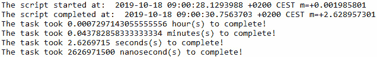
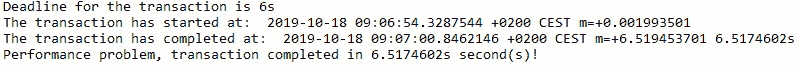
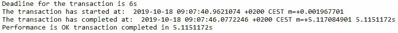

# 10. 关于时间

概述

本章演示了 Go 如何处理表示时间数据的变量，这是语言非常重要的一个方面。

到本章结束时，你将能够创建自己的时间格式，比较和管理时间，计算时间序列的持续时间，并根据用户要求格式化时间。

# 简介

前一章向您介绍了 Go 中的基本调试。在 Go 中编写代码越多，你的技能就越好；然而，开发和部署代码可能会遇到需要调试的边缘情况。前一章展示了如何使用 `fmt` 包，如何将日志记录到文件中，以及如何使用 `f` 函数格式。

本章致力于教你所有关于处理表示时间数据的变量的知识。你将学习如何以“Go 方式”完成它。首先，我们将从基本的时间创建、时间戳等开始；然后，我们将学习如何比较和操作时间，计算两个日期之间的持续时间，并创建时间戳。最后，我们将学习如何根据我们的需求格式化时间。所以，我们不要浪费时间，直接进入正题。

# 创建时间

创建时间意味着声明一个变量，该变量以特定方式格式化时间。格式化时间将在本章末尾介绍；因此，现在我们将使用 Go 提供的默认格式化。在这个主题中，我们将在脚本的 `main()` 函数中执行所有操作，所以骨架应该如下所示：

```go
package main
import "fmt"
import "time"
func main(){
  //this is where the code goes.
}
```

让我们先看看我们的骨架，并学习如何创建和操作时间变量。我们的骨架有必要的标准 `package main` 定义。我们使用 `fmt` 包将输出打印到控制台。由于我们将使用 `time` 模块，我们还需要导入它。

每当我们执行 `go run <script>.go` 时，`main()` 函数会被调用并执行其中声明的任何内容。

`time` 模块最常见的任务之一是测量脚本的执行持续时间。我们可以通过在开始和结束时捕获当前时间到变量中来实现这一点，以便我们可以计算差异并知道特定操作完成所需的时间。第一个例子如下：

```go
  start := time.Now()
  fmt.Println("The script has started at: ",start)
  fmt.Println("Saving the world...")
  time.Sleep(2 * time.Second)
  end := time.Now()
  fmt.Println("The script has completed at: ",end)
```

我们脚本的输出应该看起来像这样：

```go
The script has started at:  2019-09-27 08:19:33.8358274 +0200 CEST m=+0.001998701
Saving the world...
The script has completed at:  2019-09-27 08:19:35.8400169 +0200 CEST m=+2.006161301
```

如你所见，这看起来并不很花哨；然而，到本章结束时，你将学会如何让它更易于阅读。

考虑以下场景；你的雇主给你一个任务，开发一个小型的 Go 应用程序，根据星期几测试一个网络应用程序。你的雇主每周一凌晨 12:00 CEST 发布新网络应用程序的主要版本。从凌晨 12:00 CEST 到下午 2:00 CEST 有一个停机窗口，部署大约需要 30 分钟，你有一小时 30 分钟的时间来测试应用程序。这就是 Go 的时间模块如何帮助你。脚本在周的其他天进行“击中并逃跑”测试，但在发布日，你需要执行一个“全面”的功能测试。脚本的第一版通过参数来决定执行哪种测试，但第二版版本基于日期和小时来做出决定：


图 10.1：测试策略

考虑以下代码：

```go
  Day := time.Now().Weekday()
  Hour := time.Now().Hour()
  fmt.Println("Day: ",Day, "Hour: ",Hour)
  if Day.String() == "Monday"{
    if Hour >= 1{
      fmt.Println("Performing full blown test!")
    }else{
      fmt.Println("Performing hit-n-run test!")
    }
  }else{ fmt.Println("Performing hit-n-run test!")}
```

当前星期几被捕获在名为 `Day` 的变量中。执行的小时也被捕获在名为 `Hour` 的变量中。当这个脚本执行时，有两种类型的输出。

第一个是简单的“击中并逃跑”输出，如下所示：

```go
Day: Thursday Hour: 14
Performing hit-n-run test!
```

第二个是“全面”输出，如下所示：

```go
Day: Thursday Hour: 14
Performing full blown test!
```

在这个例子中，我们看到了执行日期如何修改应用程序的行为。

注意

实际的测试被有意省略，因为这不是本章主题的一部分。然而，输出清楚地显示了哪个部分负责控制测试。

另一个例子是为 Go 中的脚本创建日志文件名。基本思路是每天收集一个日志，并将时间戳连接到日志文件名上。其结构如下：

```go
Application_Action_Year_Month_Day
```

在 Go 中，有一个优雅且简单的方法来做这件事：

```go
import "strconv"
AppName := "HTTPCHECKER"
  Action := "BASIC"
  Date := time.Now()
  LogFileName := AppName + "_" + Action + "_" + strconv.Itoa(Date.Year()) + "_" + Date.Month().String() + "_" + strconv.Itoa(Date.Day()) + ".log"
  fmt.Println("The name of the logfile is: ",LogFileName)
}
```

输出如下所示：

```go
The name of the logfile is:  HTTPCHECKER_BASIC_2019_September_27.log
```

然而，有一个问题。如果你想要连接 `time` 类型的字符串，这些类型不是隐式可转换的，请使用需要导入到脚本顶部的 `strconv` 包：

```go
import "strconv"
```

依次，这允许你调用 `strconv.Itoa()` 函数，该函数将你的 `Year` 和 `Day` 值转换为字符串，最终让你将它们连接成一个单一的字符串。

现在我们已经学会了如何创建时间变量，让我们学习如何比较它们。

## 练习 10.1：创建一个返回时间戳的函数

在这个练习中，我们将创建一个名为 `whatstheclock` 的函数。这个函数的目标是展示如何创建一个封装了格式化的 `time.Now()` 函数的函数，并返回 `ANSIC` 格式的日期。`ANSIC` 格式将在 *格式化时间* 部分中进一步详细解释：

1.  创建一个名为 `Chapter_10_Exercise_1.go` 的文件。

1.  使用包和导入语句初始化脚本：

    ```go
    package main
    import "time"
    import "fmt"
    ```

1.  定义一个名为 `whatstheclock()` 的函数：

    ```go
    func whatstheclock() string {
      return time.Now().Format(time.ANSIC)
    }
    ```

1.  在 `main()` 函数中，定义对 `whatstheclock()` 函数的调用，并将结果打印到控制台：

    ```go
    func main(){
      fmt.Println(whatstheclock())
    }
    ```

1.  保存文件并运行代码：

    ```go
    go run Chapter_10_Exercise_1.go
    ```

    你应该看到以下输出：

    ```go
    Thu Oct 17 13:56:03 2019
    ```

在这个练习中，我们展示了如何创建一个小的函数，该函数可以返回当前时间的 ANSIC 格式。

注意

你所使用的任何类型的操作系统都会提供两种类型的时钟来测量时间；一种称为“单调时钟”，另一种称为“墙钟”。墙钟是你可以在 Windows 机器的任务栏上看到的时间；它会发生变化，通常根据你的当前位置与公共或企业 NTP 服务器同步。**NTP** 服务器代表**网络时间协议**，它用于根据原子时钟或卫星参考向客户端告知时间。

# 比较时间

在处理较小的 Go 脚本时，了解脚本何时应该运行，或者脚本应该在什么小时和分钟内完成，这对你的统计信息来说非常重要。通过统计，我们指的是知道通过执行特定操作节省了多少时间，与手动执行这些操作所需的时间成本相比。这允许我们在进一步开发功能时，测量脚本随时间改进的情况。在这个主题中，我们将查看一些实际例子，展示你如何解决这个问题。

让我们看看第一个脚本的逻辑，该脚本旨在在指定时间之前或之后不运行。这个时间可以通过另一个自动化程序到达，或者当手动放置触发文件时；每天，脚本需要在不同的时间运行，具体来说，尽可能在指定时间之后运行。

时间格式为以下 `2019-09-27T22:08:41+00:00`：

```go
  now := time.Now()
  only_after, _ := time.Parse(time.RFC3339,"2020-11-01T22:08:41+00:00")
  fmt.Println(now, only_after)
  fmt.Println(now.After(only_after))
  if now.After(only_after){
    fmt.Println("Executing actions!")
  }else{
    fmt.Println("Now is not the time yet!!")
  }
```

当我们尚未到达截止日期时，脚本的输出如下：

```go
Now is not the time yet!!
```

当我们满足条件时，输出看起来像这样：

```go
Executing actions!
```

让我们来看看这里发生了什么。我们创建了 `now` 变量，这对于执行至关重要。我们根据 RFC3339 解析了 `time` 字符串。RFC3339 指定了应该用于 `date` 和 `time` 字符串的格式。此函数返回两个值：一个值是转换成功时的输出，另一个值是存在错误时的错误。我们将输出捕获在 `only_after` 变量中，并使用一个丢弃变量来捕获任何输出；这是下划线符号 `_`。我们可以使用一个标准变量，如 `only_after_error`，但除非我们在稍后使用该变量，否则编译器会抛出一个错误，表明该变量已声明但未使用。这是通过使用 `_` 变量来规避的。基于这个逻辑，我们可以非常简单地实现 `only_before` 参数或变量。`time` 包中有两个非常有用的函数：一个称为 `After()`，另一个称为 `Before()`。它们允许我们简单地比较两个 `time` 变量。

包中还有一个名为 `Equal()` 的第三个函数。此函数允许你比较两个 `time` 变量，并根据它们是否相等返回 `true` 或 `false`。

让我们看看`Equal()`函数的一个实际例子：

```go
now := time.Now()
  now_too := now
  time.Sleep(2*time.Second)
  later := time.Now()
  if now.Equal(now_too){
    fmt.Println("The two time variables are equal!")
  }else{
    fmt.Println("The two time variables are different!")
  }
  if now.Equal(later){
    fmt.Println("The two time variables are equal!")
  }else{
    fmt.Println("The two time variables are different!")
  }
```

输出看起来像这样：

```go
The two time variables are equal!
The two time variables are different!
```

让我们看看这里会发生什么。我们有三个`time`变量，分别称为`now`、`now_too`和`later`。`time`模块的`Sleep()`函数用于模拟 2 秒的延迟。这个函数接受一个整数参数，等待给定的时间过去然后继续执行。结果是`later`变量持有不同的时间值，使我们能够展示`Equal()`函数的目的，这在输出中可以看到。

现在，是时候检查提供了哪些设施来计算两个`time`变量之间的持续时间或差异了。

# 持续时间计算

计算执行持续时间的功能在编程的许多方面都很有用。在我们的日常生活中，我们可以监控我们的基础设施可能面临的不一致和性能瓶颈。例如，如果你有一个脚本平均只需要 5 秒钟就能完成，而监控执行时间显示在一天中的某些小时或某些天有大幅增加，那么进行调查可能很明智。另一个方面与 Web 应用程序有关。测量脚本中请求-响应的持续时间可以让你了解你在应用程序中投入了多少来应对高负载，甚至允许你在一年中的某些天或周扩展你的容量。例如，如果你有一个在线商店处理产品，根据像黑色星期五或圣诞节这样的模式来调整你的容量可能很明智。

在大多数年份，你可能只需要较低容量，但那些假日如果没有足够好地调整基础设施，可能会导致收入损失。添加这样的功能到你的脚本中几乎不需要编写多少代码。现在让我们看看如何做：

```go
  Start := time.Now()
  fmt.Println("The script started at: ", Start)
  sum := 0
  for i := 1; i < 10000000000; i++ {
      sum += i
  }
  End := time.Now()
  Duration := End.Sub(Start)
  fmt.Println("The script completed at: ", End)
  fmt.Println("The task took",Duration.Hours(), "hour(s) to complete!")
  fmt.Println("The task took",Duration.Minutes(), "minutes(s) to complete!")
  fmt.Println("The task took",Duration.Seconds(), "seconds(s) to complete!")
  fmt.Println("The task took",Duration.Nanoseconds(), "nanosecond(s) to complete!")
```

如果你运行这个脚本，结果可能如下，这取决于电脑的性能：



图 10.2：测量执行时间

所需要做的只是捕捉脚本开始和结束的时间。然后，我们可以通过减去开始时间和结束时间来计算持续时间。之后，我们可以利用`Duration`变量的函数来获取完成任务所需时间的`小时()`、`分钟()`、`秒()`和`纳秒()`值。

你将获得四个分辨率，分别是：

+   小时

+   分钟

+   秒

+   纳秒

如果你需要，例如，天、周或月，那么你可以从提供的分辨率中计算出来。

在过去，我们有一个要求测量事务持续时间的任务，并且我们需要满足一个服务级别协议（SLA）。这意味着有一些应用程序需要根据产品的关键性在 1,000 毫秒或 5 秒内处理请求。接下来的脚本将向您展示这是如何实现的。您有 6 种不同的分辨率可供选择：

+   小时

+   分钟

+   第二

+   毫秒

+   微秒

+   纳秒

让我们考虑以下示例：

```go
  deadline_seconds := time.Duration((600 * 10) * time.Millisecond)
  Start := time.Now()
  fmt.Println("Deadline for the transaction is  ",deadline_seconds)
  fmt.Println("The transaction has started at: ", Start)
  sum := 0
  for i := 1; i < 25000000000; i++ {
      sum += i
  }
  End := time.Now()
  //Duration := time.Duration((End.Sub(Start)).Seconds() * time.Second)
  Duration := End.Sub(Start)
  TransactionTime := time.Duration(Duration.Nanoseconds()) * time.Nanosecond
  fmt.Println("The transaction has completed at: ", End, Duration)
  if TransactionTime <= deadline_seconds{
    fmt.Println("Performance is OK transaction completed in",TransactionTime)
  }else{
    fmt.Println("Performance problem, transaction completed in",TransactionTime,"second(s)!")
  }  
```

当我们没有满足截止时间时，输出如下：



图 10.3：未满足事务截止时间

当我们遇到截止时间时，它看起来是这样的：



图 10.4：事务截止时间满足

让我们剖析我们的例子。首先，我们使用`time.Duration()`变量为事务定义一个截止时间。根据我的经验，`Millisecond`的分辨率是最优的；然而，适应计算它确实需要一些时间。请随意使用您喜欢的任何分辨率。我们用`Start`变量标记开始，进行一些计算，并用`End`变量标记完成。魔法就在此之后发生。我们希望计算截止时间和事务持续时间之间的差异，但我们不能直接这样做。我们需要将`Duration`值转换为`Transaction`时间。这与我们创建截止时间时的方法相同。我们简单地使用`Nanosecond`分辨率，这是我们应达到的最低分辨率。然而，在这种情况下，您可以使用您想要的任何分辨率。转换后，我们可以轻松比较并决定事务是否正常。

现在，让我们看看我们如何操作时间。

# 管理时间

Go 编程语言的`time`包提供了两个函数，允许您操作时间。其中一个叫做`Sub()`，另一个叫做`Add()`。在我的经验中，这种情况并不常见。大多数情况下，当计算脚本的执行时间时，使用`Sub()`函数来告知差异。

让我们看看添加的样子：

```go
  TimeToManipulate := time.Now()
  ToBeAdded := time.Duration(10 * time.Second)
  fmt.Println("The original time:",TimeToManipulate)
  fmt.Println(ToBeAdded," duration later:",TimeToManipulate.Add(ToBeAdded))
```

执行后，以下输出欢迎我们：

```go
The original time: 2019-10-18 08:49:53.1499273 +0200 CEST m=+0.001994601
10s duration later: 2019-10-18 08:50:03.1499273 +0200 CEST m=+10.001994601
```

让我们检查这里发生了什么。我们创建了一个变量来保存我们的时间，这需要一些操作。`ToBeAdded`变量代表 10 秒的持续时间，这是我们想要添加的。`time`包的`Add()`函数期望一个`time.Duration()`类型的变量。然后，我们简单地调用我们的日期的`Add()`函数，结果在控制台上可见。`Sub()`函数的功能相当繁琐，它并不是真正用来从我们拥有的时间中移除特定持续时间的。这是可以做到的，但你需要更多的代码行来实现这一点。您可以做的另一件事是用负值构建您的持续时间。如果您将第二行替换为以下内容：

```go
ToBeAdded := time.Duration(-10 * time.Minute)
```

它将正常工作并输出以下内容：

```go
The original time: 2019-10-18 08:50:36.5950116 +0200 CEST m=+0.001994401
-10m0s duration later: 2019-10-18 08:40:36.5950116 +0200 CEST m=+599.998005599
```

这正如我们所期望的；我们已经成功计算出了 10 分钟前的时间。

## 练习 10.2：执行持续时间

在这个练习中，我们将创建一个函数，允许您计算两个`time.Time`变量之间的执行持续时间，并返回一个字符串，告诉您执行完成花费了多长时间：

按以下顺序执行以下步骤：

1.  创建一个名为`Chapter_10_Exercise_2.go`的文件。

1.  使用以下`package`和`import`语句初始化脚本：

    ```go
    package main 
    import "time"
    import "fmt"
    import "strconv"
    ```

1.  现在我们来定义我们的`elapsedTime()`函数：

    ```go
    func elapsedTime(start time.Time, end time.Time) string {
      Elapsed := end.Sub(start)
      Hours := strconv.Itoa(int(Elapsed.Hours()))
      Minutes := strconv.Itoa(int(Elapsed.Minutes()))
      Seconds := strconv.Itoa(int(Elapsed.Seconds()))
      return "The total execution time elapsed is: " + Hours + " hour(s) and " +     Minutes + " minute(s) and " + Seconds + " second(s)!"
    }
    ```

1.  现在我们准备定义我们的`main()`函数：

    ```go
    func main(){
      Start := time.Now()
      time.Sleep(2 * time.Second)
      End := time.Now()
      fmt.Println(elapsedTime(Start,End))
    }
    ```

1.  运行代码：

    ```go
    go run Chapter_10_Exercise_2.go
    ```

    以下应该是输出结果：

    ```go
    The total execution time elapsed is: 0 hour(s) and 0 minute(s) and 2   second(s)!
    ```

在这个练习中，我们创建了一个函数，展示了执行动作花费了多少小时、分钟和秒。这很有用，因为您可以在其他 Go 应用程序中重用这个函数。

现在，让我们转向时间的格式化。

# 时间格式化

到目前为止，在本章中，您可能已经注意到日期看起来相当丑陋。我的意思是，看看以下行：

```go
The transaction has started at:  2019-09-27 13:50:58.2715452 +0200 CEST   m=+0.002992801
```

这些被故意留下以迫使您思考这真的是 Go 能做的所有事情。有没有一种方法可以将这些行格式化，使它们更方便、更容易阅读？如果有，那些额外的行是什么？

在这里，我们将回答这些问题。当我们谈论时间格式化时，有两个主要概念是我们所指的。第一个选项是在我们希望我们的时间变量在打印时输出一个期望的字符串时，第二个选项是在我们希望将一个字符串解析为特定格式时。两者都有自己的用例；我将详细向您介绍如何使用这两个选项。

首先，我们将学习关于`Parse()`函数的内容。这个函数本质上有两个参数。第一个是要解析的标准，第二个是需要解析的字符串。解析的结束将产生一个可以利用内置 Go 函数的时间变量。Go 使用基于 POSIX 的日期格式。`Parse()`在您有一个处理来自不同时区的时间值的应用程序时非常有用，您希望将它们转换为同一时区，以便更好地理解和比较：

```go
Mon Jan 2 15:04:05 -0700 MST 2006
0      1     2   3   4   5      6
```

这种日期格式在 POSIX 中等于"123456"，可以从前面的示例中解码。语言中提供了常量来帮助您处理解析不同的时间字符串。

我们可以对照以下三个主要标准来解析时间：

+   RFC3339

+   UnixDate

+   ANSIC

让我们看看`Parse()`是如何工作的：

```go
  t1, _ := time.Parse(time.RFC3339,"2019-09-27T22:18:11+00:00")
  t2, _ := time.Parse(time.UnixDate,"2019-09-27T22:18:11+00:00")
  t3, _ := time.Parse(time.ANSIC,"2019-09-27T22:18:11+00:00")
  fmt.Println("RFC3339:",t1)
  fmt.Println("UnixDate",t2)
  fmt.Println("ANSIC",t3)
```

输出如下：

```go
RFC3339: 2019-19-27 22:18:11 +0000 +0000
UnixDate 0001-01-01 00:00:00 +0000 UTC
ANSIC 0001-01-01 00:00:00 +0000 UTC
```

背后发生的事情如下。我们有 `t1`、`t2` 和 `t3` 变量，它们持有时间，这些时间与指定的格式进行解析。如果转换过程中有任何错误，`_` 变量将持有错误结果。`t1` 变量的输出是唯一有意义的；`UnixDate` 和 ANSIC 是错误的，因为它们解析了错误的字符串与标准格式。`UnixDate` 期望的是它们称之为 `epoch` 的东西。`epoch` 是一个非常独特的日期；在 UNIX 系统中，它标志着时间的开始，始于 1970 年 1 月 1 日。它期望一个巨大的整数，这是从这个日期开始经过的秒数。格式期望的输入如下：`Mon Sep _27 18:24:05 2019`。提供这样的时间允许 `Parse()` 函数提供正确的输出。

既然我们已经阐明了 `Parse()` 函数，现在是时候看看 `Format()` 函数了。

Go 允许你创建自己的 `time` 变量。让我们学习如何做到这一点，然后我们将对其进行格式化：

```go
date := time.Date(2019, 9, 27, 18, 50, 48, 324359102, time.UTC)
fmt.Println(date)
```

上述代码演示了如何自己创建时间；然而，我们将查看所有这些数字的含义。其骨架语法如下：

```go
func Date(year int, month Month, day, hour, min, sec, nsec int, loc *Location)   Time
```

实质上，我们需要指定年、月、日、小时等等。我们希望根据输入变量重新格式化我们的输出；它应该如下所示：

```go
2019-09-27 18:50:48.324359102 +0000 UTC
```

时区在人们开始在大企业环境中工作之前并不重要。当你有一支全球互联的设备舰队时，能够区分时区很重要。如果你想有一个 `AddDate()` 函数，它可以用来将 `Year`、`Month` 和 `Day` 添加到你的当前时间，那么这必须允许你动态地添加到你的日期。让我们看看一个例子。给定我们之前的日期，让我们添加 1 年、2 个月和 3 天：

```go
date := time.Date(2019, 9, 27, 18, 50, 48, 324359102, time.UTC)
next_date := date.AddDate(1, 2, 3)
fmt.Prinln(next_date)
```

执行此程序后，你会得到以下输出：

```go
2020-11-30 18:50:48.324359102 +0000 UTC
```

`AddDate()` 函数接受三个参数：第一个是 `Year`，第二个是 `Month`，第三个是 `Day`。这给了你调整你拥有的脚本的精细度。为了正确理解格式化是如何工作的，你需要知道其背后的原理。

时间格式化的最后一个重要方面是了解你如何利用 `time` 包的 `LoadLocation()` 函数将你的本地时间转换为另一个时区的本地时间。我们的参考时区将是 `洛杉矶` 时区。`Format()` 函数用于告诉 Go 我们希望如何格式化输出。`In()` 函数是指我们希望格式化存在的特定时区。

让我们找出柏林的时间：

```go
Current := time.Now()
  Berlin, _ := time.LoadLocation("America/Los_Angeles")
  fmt.Println("The local current time is:",Current.Format(time.ANSIC))
  fmt.Println("The time in Berlin is: ",Current.In(Berlin).Format(time.ANSIC))
```

根据你的执行日，你应该看到以下输出：

```go
The local current time is: Fri Oct 18 08:14:48 2019
The time in Berlin is: Thu Oct 17 23:14:48 2019
```

关键在于我们得到本地时间的一个变量，然后我们使用 `time` 包的 `In()` 函数，比如说，将这个值转换为一个特定时区的值。这很简单，但很有用。

## 练习 10.03：你的时区是什么时间？

在这个练习中，我们将创建一个函数，该函数可以告诉当前时区与指定时区之间的差异。该函数将使用`LoadLocation()`函数根据位置指定位置，变量将被设置为特定的时间。`In()`位置将用于将特定的时间值转换为给定的时间区值。输出格式应为 ANSIC 标准。

按以下顺序执行以下步骤：

1.  创建一个名为`Chapter_10_Exercise_3.go`的文件。

1.  使用以下`package`和`import`语句初始化脚本：

    ```go
    package main
    import "time"
    import "fmt"
    ```

1.  现在是时候创建我们的函数`timeDiff()`了，它还将返回格式化为 ANSIC 的`Current`和`RemoteTime`变量：

    ```go
    func timeDiff(timezone string) (string, string)  {
      Current := time.Now()
      RemoteZone, _ := time.LoadLocation(timezone)
      RemoteTime := Current.In(RemoteZone)
      fmt.Println("The current time is: ",Current.Format(time.ANSIC))
      fmt.Println("The timezone:",timezone,"time is:",RemoteTime)
      return Current.Format(time.ANSIC), RemoteTime.Format(time.ANSIC)
    }
    ```

1.  定义`main()`函数：

    ```go
    func main(){
      fmt.Println(timeDiff("America/Los_Angeles"))
    }
    ```

1.  运行代码：

    ```go
    go run Chapter_10_Exercise_3.go
    ```

    输出如下所示：

    ```go
    The current time is: Thu Oct 17 15:37:02 2019
    The timezone: America/Los_Angeles time is: 2019-10-17 06:37:02.2440679 -0700   PDT
    Thu Oct 17 15:37:02 2019 Thu Oct 17 06:37:02 2019
    ```

在这个练习中，我们看到了在各个时区之间导航是多么容易。

## 活动 10.01：根据用户要求格式化日期

在这个活动中，你需要创建一个小脚本，它接受当前日期并以以下格式输出：“02:49:21 31/01/2019。”你需要利用你迄今为止学到的有关将整数转换为字符串的知识。这将允许你连接`time`变量的不同部分。记住，你不能连接字符串和整数变量。`strconv()`函数就在那里帮助你。你还需要记住，当你省略`date.Month()`命令时，它打印出月份的名称，但它也需要被转换成整数，然后再转换回带有数字的字符串。

你必须执行以下步骤以获得所需的输出：

1.  使用`time.Now()`函数捕获当前日期到一个变量中。

1.  通过将它们转换为字符串，将捕获的日期分解为`day`、`month`、`year`、`hour`、`minute`和`seconds`变量。

1.  按顺序打印出连接的变量。

    一旦脚本完成，输出应该如下所示（请注意，这取决于你何时运行代码）：

    ```go
    15:32:30 2019/10/17
    ```

    到这个活动的结束时，你应该已经学会了如何创建你自己的自定义`time`变量，并使用`strconv.Itoa()`将数字转换为字符串并将结果连接起来。

    注意

    该活动的解决方案可以在第 729 页找到。

## 活动 10.02：强制日期和时间的特定格式

这个活动需要你使用本章关于时间的知识。我们希望创建一个小脚本，打印出以下格式的日期：“02:49:21 31/01/2019。”

首先，你需要通过使用`time.Date()`函数创建一个`date`变量。然后，回想一下我们是如何访问变量的`Year`、`Month`和`Day`属性的，并按适当的顺序创建一个连接。记住，你不能连接字符串和整数变量。`strconv()`函数就在那里帮助你。你还需要记住，当你省略`date.Month()`命令时，它打印出月份的名称，但它也需要被转换成整数，然后再转换回带有数字的字符串。

你必须执行以下步骤以获得所需的输出：

1.  使用 `time.Now()` 函数将当前日期存储在一个变量中。

1.  使用 `strconv.Itoa()` 函数将捕获的 `date` 变量的适当部分保存到以下变量中：`day`、`month`、`year`、`hour`、`minute` 和 `second`。

1.  最后，使用适当的连接打印这些信息。

    预期的输出应该看起来像这样：

    ```go
    2:49:21 2019/1/31
    ```

    在完成此活动后，你应该已经学会了如何将当前日期格式化为特定的自定义格式。

    注意

    此活动的解决方案可以在第 730 页找到。

## 活动 10.03：测量经过时间

此活动要求你测量睡眠的持续时间。你应该使用 `time.Sleep()` 函数睡眠 2 秒，一旦睡眠完成，你需要计算开始和结束时间之间的差异，并显示花费了多少秒。

首先，标记执行的开始，睡眠 2 秒，然后捕获执行的结束时间在变量中。通过利用 `time.Sub()` 函数，我们可以使用 `Seconds()` 函数来输出结果。输出将略长于预期。

你必须执行以下步骤以获得所需的输出：

1.  将开始时间存储在一个变量中。

1.  创建一个持续 2 秒的睡眠变量。

1.  将结束时间存储在一个变量中。

1.  通过从结束时间减去开始时间来计算长度。

1.  打印出结果。

    根据你电脑的速度，你应该期望以下输出：

    ```go
    The execution took exactly 2.0016895 seconds!
    ```

    在完成此活动后，你应该已经学会了如何测量特定活动的经过时间。

    注意

    此活动的解决方案可以在第 730 页找到。

## 活动 10.04：计算未来的日期和时间

在此活动中，我们将计算从 `Now()` 开始的 6 小时、6 分钟和 6 秒的日期。你需要将当前时间存储在一个变量中。然后，在给定的日期上使用 `Add()` 函数添加之前提到的长度。为了方便，请使用 `time.ANSIC` 格式。然而，有一个陷阱。因为 `Add()` 函数期望一个持续时间，你需要选择一个分辨率，例如 `Second`，在添加之前创建持续时间。

你必须执行以下步骤以获得所需的输出：

1.  将当前时间存储在一个变量中。

1.  以 ANSIC 格式打印此值作为参考。

1.  使用秒作为输入计算持续时间。

1.  将持续时间添加到当前时间。

1.  以 ANSIC 格式打印出未来的日期。

    确保你的输出看起来像这样，使用字符串格式化：

    ```go
    The current time: Thu Oct 17 15:16:48 2019
    6 hours, 6 minutes and 6 seconds from now the time will be:  Thu Oct 17   21:22:54 2019
    ```

    在完成此活动后，你应该已经学会了如何通过利用 `time.Duration()` 和 `time.Add()` 函数来计算未来的特定日期。

    注意

    此活动的解决方案可以在第 731 页找到。

## 活动 10.05：在不同时区打印本地时间

这个活动需要您利用在*格式化时间*部分学到的知识。您需要加载一个东海岸城市和一个西海岸城市。然后，打印出每个城市的当前时间。

这里的关键是`LoadLocation()`函数，您需要使用`ANSIC`格式输出。记住，`LoadLocation()`函数返回两个值！

您必须执行以下步骤以获得所需的输出：

1.  将当前时间存储在一个变量中。

1.  使用`time.LoadLocation()`函数为`NYtime`和`LA`创建参考时区变量。

1.  以 ANSIC 格式打印出相应时区的当前时间。

    根据您的执行日，以下可能是您的预期输出：

    ```go
    The local current time is: Thu Oct 17 15:16:13 2019
    The time in New York is: Thu Oct 17 09:16:13 2019
    The time in Los Angeles is: Thu Oct 17 06:16:13 2019
    ```

    在这个活动结束时，您应该已经学会了如何将您的时间变量转换为特定的时区。

    注意

    这个活动的解决方案可以在第 732 页找到。

# 摘要

本章向您介绍了`go`语言的`time`包，它允许您重用其他程序员发明并融入语言的代码。目标是教会您如何创建、操作和格式化时间变量，并使您熟悉在`time`包的帮助下可以做什么。如果您想进一步改进或深入了解该包提供的功能，请查看以下链接：[`golang.org/pkg/time/`](https://golang.org/pkg/time/).

时间戳和时间操作是每个开发者必备的技能。无论您是将大或小的脚本投入生产，时间模块都能帮助您测量操作的经过时间，并在执行过程中提供操作的日志记录。最重要的是，如果使用得当，它可以帮助您轻松地将生产问题追溯到其根源。

下一章将向您介绍编码和解码 JSON，即 JavaScript 对象表示法。
