# 第十一章：11. 编码和解码（JSON）

概述

本章旨在使您熟悉 JavaScript 对象表示法（JSON）的基础知识。您将学习如何使用 Go 解析 JSON，然后获得将 JSON 转换为结构体并将其转换回 JSON 的能力。

在这里，您将学习如何描述 JSON 并将 JSON 反序列化为结构体。您还将学习如何将结构体序列化为 JSON 并将 JSON 键名设置为与结构体字段名不同的名称。到本章结束时，您将能够使用各种 JSON 标签属性来控制要转换为 JSON 的内容，反序列化未知的 JSON 结构，并使用编码进行数据传输。

# 引言

在上一章中，我们探讨了 Go 中的错误，并发现 Go 中的错误是值，这使得我们可以将错误作为函数和方法的参数传递。我们还看到 Go 函数可以返回多个值，其中一个通常是错误。我们了解到检查函数返回的错误值是一个好的实践。通过不忽略错误，它可以防止程序中出现意外的行为。在 Go 中，我们看到了可以创建自己的自定义错误类型。最后，我们探讨了恐慌并学习了如何从中恢复。

在本章中，我们将仅使用 Go 的标准库来处理 JSON。在我们开始查看如何在 Go 代码中使用 JSON 之前，让我们简要介绍一下 JSON。

# JSON

**JSON**代表**JavaScript 对象表示法**。它在许多编程语言中广泛用于传输和存储数据。通常，这是通过将数据从网络服务器传输到客户端来完成的。JSON 在 Web 应用程序中传输，甚至用于将数据存储在文件中以供后续处理。在本章中，我们将探讨这种操作的各种示例。JSON 是最简的；它不像 XML 那样冗长。它是自我描述的；这增加了其可读性和编写它的便捷性。JSON 是一种语言无关的文本格式：

![图 11.1：描述 JSON

![图片 B14177_11_01.jpg]

图 11.1：描述 JSON

JSON 广泛用作在 Web 应用程序之间交换数据以及各种服务器到服务器通信的数据格式。在应用程序中使用的常见 API 是 REST API。JSON 经常用于使用 REST API 的应用程序中。JSON 在 REST API 中使用而不是 XML 的原因之一是它比 XML 更简洁、更轻量级且更易于阅读。查看以下 JSON 和 XML，我们可以看到 JSON 更简洁、更易于阅读且更轻量级：

```go
{
"firstname":"Captain",
"lastname":"Marvel"
}
<avenger>
<firstname>Captain</firstname>
<lastname>"Marvel"</lastname>
</avenger>
```

大多数现代数据库现在也将 JSON 作为字段中的数据类型存储。静态 Web 应用程序有时使用 JSON 来渲染其网页。

JSON 格式非常结构化。构成 JSON 格式的核心部分是一系列键值对，如下图所示：

![图 11.2：JSON 键值对

![图片 B14177_11_02.jpg]

图 11.2：JSON 键值对

键始终是一个用引号括起来的字符串，而值可以包含多种数据类型。JSON 中的键值对是一个`key`名称后跟一个冒号，然后是一个`value`。如果有更多的键值对，它们将用逗号分隔。

在*图 11.2*中，有两个键值对。`firstname`键及其值为`Captain`的一个。另一组是`lastname`和`Marvel`。

JSON 可以包含数组。值位于一组括号内。在*图 11.3*中，第*3*行和第*4*行是`phonenumbers`键的值：

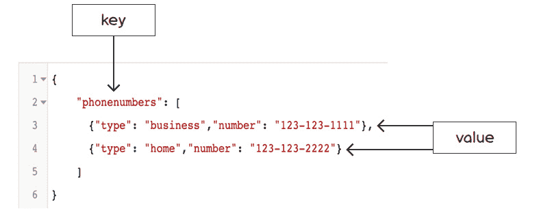

图 11.3：JSON 数组

现在，我们已经看到了键值对，让我们看看 JSON 数据类型。JSON 对象支持许多不同的数据类型；以下图表显示了这些数据类型：

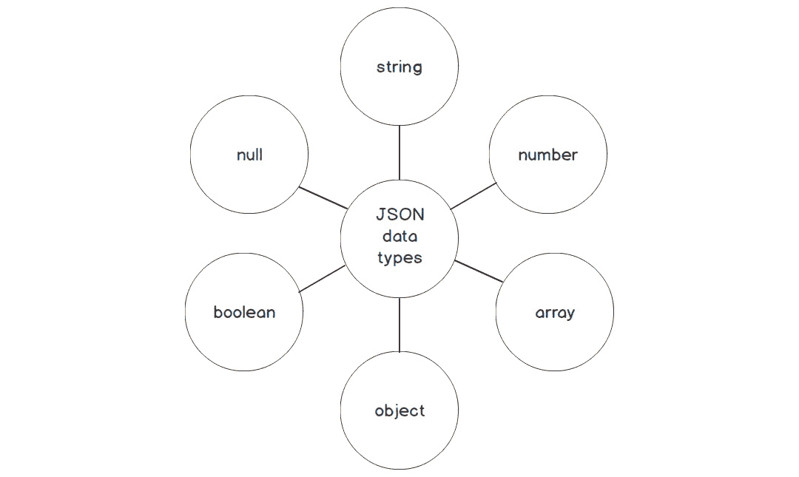

图 11.4：JSON 数据类型

这里有一些示例：

+   字符串：

    ```go
    Example: {"firstname": "Captain"}
    ```

+   数字：这可以是浮点数或整数：

    ```go
    Example: {"age": 32}
    ```

+   数组：

    ```go
    Example: {"hobbies": ["Go", "Saving Earth", "Shield"]}
    ```

+   布尔值：只能是`true`或`false`：

    ```go
    Example: {"ismarried": false}
    ```

+   空值：

    ```go
    Example: {"middlename": null}
    ```

+   对象：

    JSON 对象类似于 Go 中的结构体。以下示例展示了 Go 结构体和 JSON 对象：

    ```go
    type person struct {
      firstname string
      middlename string
      lastname string
      age int
      ismarried bool
      hobbies []string
    }
    {
      "person": {
        "firstname": "Captain",
        "middlename": null,
        "lastname": "Marvel",
        "age": 32,
        "ismarried": false,
        "hobbies": ["Go", "Saving Earth", "Shield"]
      }
    }
    ```

在本节中，我们简要介绍了 JSON。在接下来的章节中，我们将探讨 Go 如何解码和编码 JSON。

# 解析 JSON

当我们谈论解析 JSON 时，我们所说的就是我们将一个 JSON 数据结构转换为一个 Go 数据结构。将 JSON 转换为 Go 数据结构的好处是能够以原生方式处理数据。例如，如果 JSON 数据有一个字段是 Go 中的数组，那么它会被解码为一个切片。然后我们就可以像处理任何其他切片一样处理这个切片，这意味着我们可以使用`range`子句遍历切片，我们可以获取切片的长度，向切片中追加元素，等等。

如果我们事先知道我们的 JSON 的样子，我们可以在解析 JSON 时使用结构体。使用 Go 术语，我们需要能够`unmarshal` JSON 编码的数据并将结果存储在结构体中。为了能够做到这一点，我们需要导入`encoding/json`包。我们将使用 JSON 的`Unmarshal`函数。反序列化是将 JSON 解析到数据结构的过程。通常，你会听到反序列化和解码被互换使用：

```go
func Unmarshal(data []byte, v interface{}) error
```

在前面的代码中，变量`data`被定义为字节数组。变量`v`是一个结构体的指针。`Unmarshal`函数接受 JSON 数据的字节数组并将结果存储在`v`指向的值中。

`v`的参数必须是一个指针，并且不能为`nil`。如果这两个要求中的任何一个没有得到满足，那么将返回以下错误：


图 11.5：非指针作为参数传递时的 Unmarshal 错误

让我们看看以下代码作为反序列化数据的简单示例。我们将详细描述代码的每一部分，以便更好地理解程序：

```go
package main
import (
  "encoding/json"
  "fmt"
)
type greeting struct {
  Message string 
}
func main() {
  data := []byte(`
  {
  "message": "Greetings fellow gopher!"
  }
`)
  var v greeting
  err := json.Unmarshal(data, &v)
  if err != nil {
    fmt.Println(err)
  }
  fmt.Println(v.Message)
}
```

让我们分解代码以更好地理解：

```go
type greeting struct {
  Message string 
}
```

问候结构体有一个名为 `Message` 的可导出字段，其类型为 `string`：

```go
func main() {
  data := []byte(`
  {
  "message": "Greetings fellow gopher!"
  }
`)
```

注意

`` ` `` 符号是反引号，而不是单引号。它用于字符串字面量。

`json.Unmarshal` 结构体要求 JSON 编码的数据必须是字节切片：

```go
var g greeting
```

我们声明 `g` 为问候类型：

```go
  err := json.Unmarshal(data, &v)
  if err != nil {
    fmt.Println(err)
  }
```

`Unmarshal()` 函数接收 JSON 数据的字节切片，并将结果存储在由 `v` 指向的值中。

`v` 变量指向我们的问候结构体。

它将 JSON 解析到问候实例中，如下所示：

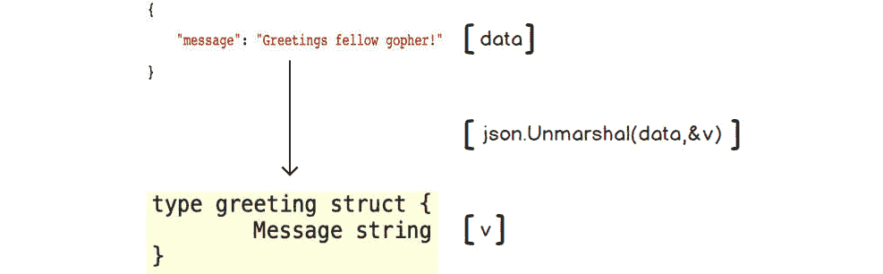

图 11.6：将 JSON 解析到 Go 结构体

现在，让我们看看解析后的输出：

```go
fmt.Println(v.Message)
```

它应该看起来像这样：

```go
Greetings fellow gopher!
```

在我们之前的示例中，JSON 序列化器将我们的字段名 `Message` 与 JSON 键 `message` 匹配。

注意

要能够将数据解析到结构体中，结构体字段必须是可导出的。结构体的字段名必须大写。只有可导出的字段才能在外部可见，包括 JSON 解析器。只有导出字段才会出现在 JSON 输出中；其他字段将被忽略。

## 结构体标签

我们可以使用结构体标签来提供有关结构体字段如何解析或序列化的转换信息。标签遵循 `` `key: `` `` "value"` `` 的格式。标签以反引号（`` ` ``）开始和结束。

考虑以下示例：

```go
type person struct {
  LastName string `json:"lname"`
}
```

使用标签给我们更多的控制。现在我们可以将结构体字段命名为任何内容，只要它是可导出的。

在此示例中将被反序列化的 `json` 字段是 `lname`。

一旦你为 JSON 解析和序列化使用了标签，如果结构体字段不可导出，则无法编译。Go 编译器足够智能，能够意识到由于与结构体字段关联了 JSON 标签，因此它必须是可导出的才能用于 JSON 序列化和反序列化过程。以下是一个示例，当 `lastname` 小写时，你会得到以下错误：

```go
type person struct {
  lastName string `json:"lname"`
}
```

这是未导出 JSON 结构体字段的错误信息：


图 11.7：未导出 JSON 结构体字段的错误

我们已经看到过这段代码，并且我们知道如何解析 JSON。然而，我们将进行一个小小的更改，那就是在我们的代码中添加一个 `struct` 标签：

```go
package main
import (
  "encoding/json"
  "fmt"
)
type greeting struct {
  SomeMessage string `json:"message"`
}
func main() {
  data := []byte(`
  {
  "message": "Greetings fellow gopher!"
  }
`)
  var g greeting
  err := json.Unmarshal(data, &g)
  if err != nil {
    fmt.Println(err)
  }
  fmt.Println(g.SomeMessage)
}
```

让我们分解代码以更好地理解：

```go
type greeting struct {
  SomeMessage string `json:"message"`
}
```

我们将 `greeting` 结构体更改为使用与 JSON 中不同的可导出字段名。

`` `json:"message"` `` 标签表示这个可导出字段对应于 JSON 数据中的 `message` 键：

```go
err := json.Unmarshal(data, &g)
```

当数据被解析时，JSON 消息值将被放置在 `SomeMessage` 结构体字段中。

我们将得到以下输出：

```go
Greetings fellow gopher!
```

Go JSON `unmarshaller` 在解码时遵循确定哪个结构体字段映射 JSON 数据的过程：

+   带有标签的导出字段。

+   一个导出字段名与 JSON 键名大小写匹配。

+   一个导出字段名与 JSON 键名大小写不敏感匹配。

+   我们还可以验证我们即将反序列化的 JSON 是否有效。

以下是将反序列化执行的代码：

```go
package main
import (
  "encoding/json"
  "fmt"
  "os"
)
type greeting struct {
  SomeMessage string `json:"message"`
}
func main() {
  data := []byte(`
  {
  message": "Greetings fellow gopher!"
  }
`)
  if !json.Valid(data) {
    fmt.Printf("JSON is not valid: %s", data)
    os.Exit(1)
  }
  //Code to perform the unmarshal
}
```

`Valid()` 函数接受一个字节数组切片作为参数，并将返回一个布尔值，指示 JSON 是否有效。对于有效的 JSON，它将显示 `True`，对于无效的 JSON，它将显示 `False`。

这在我们尝试将 JSON 反序列化到结构体之前检查我们的 JSON 可能很有用。

你认为你需要哪些结构体来处理以下 JSON？让我们看看。

```go
{
"lname": "Smith",
  "fname": "John",
  "address": {
    "street": "Sulphur Springs Rd",
      "city": "Park City",
      "state": "VA",
      "zipcode": 12345
    }
}
```

前面的 JSON 有一个嵌套的对象称为 `address`。如您从本章的介绍中回忆的那样，对象是 JSON 支持的类型之一。JSON 中对象类型的 Go 表示是结构体。我们的 `parent` 结构体需要有一个嵌套的结构体称为 `address`。

以下代码片段是反序列化多个 JSON 对象到 Go 结构体的示例：

```go
package main
import (
  "encoding/json"
  "fmt"
)
type person struct {
  Lastname  string  `json:"lname"`
  Firstname string  `json:"fname"`
  Address   address `json:"address"`
}
type address struct {
  Street  string `json:"street"`
  City    string `json:"city"`
  State   string `json:"state"`
  ZipCode int    `json:"zipcode"`
}
func main() {
  data := []byte(`
      {
      "lname": "Smith",
      "fname": "John",
      "address": {
        "street": "Sulphur Springs Rd",
        "city": "Park City",
        "state": "VA",
        "zipcode": 12345
      }
    }
  `)
  var p person
  err := json.Unmarshal(data, &p)
  if err != nil {
    fmt.Println(err)
  }
  fmt.Printf("%+v",p)
}
```

让我们分解代码以更好地理解：

```go
type person struct {
  Lastname  string  `json:"lname"`
  Firstname string  `json:"fname"`
  Address   address `json:"address"`
}
```

`person` 结构体有一个嵌套的结构体，称为 `Address`。它在 JSON 中表示为名为 `address` 的对象。`address` 结构体中的字段将具有反序列化到它们的 JSON 值：

```go
  data := []byte(`
      {
      "lname": "Smith",
      "fname": "John",
      "address": {
        "street": "Sulphur Springs Rd",
        "city": "Park City",
        "state": "VA",
        "zipcode": 12345
      }
    }
  `)
```

JSON 中的 `address` 是一个对象，它将被反序列化到我们的 `person` 结构体的 `address` 字段：

![图 11.8：未展开的 JSON 地址到 person.address]

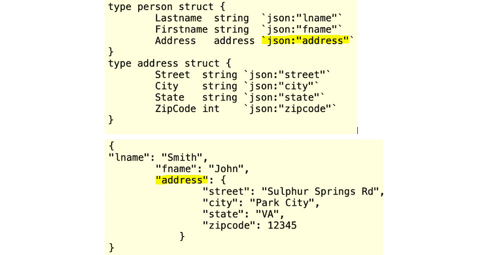

图 11.8：反序列化的 JSON 地址到 person.address

`Unmarshal()` 函数将 JSON 编码的 `data` 解码到指针 `p`：

```go
var p person
  err := json.Unmarshal(data, &p)
```

结果如下：

![图 11.9：解码 JSON 后的 person 结构体]

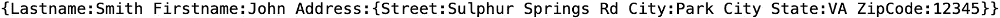

图 11.9：解码 JSON 后的 person 结构体

我们将在下一个练习中使用我们迄今为止学到的这些概念。

## 练习 11.01：反序列化学生课程

在这个练习中，我们将编写一个程序，该程序从网络请求中获取大学课程注册的 JSON。我们的程序需要将 JSON 数据反序列化到 Go 结构体中。JSON 将包含有关学生和他们所修课程的数据。在我们反序列化 JSON 之后，我们将打印结构体以进行验证。输出应如下所示：

![图 11.10：打印学生课程结构]

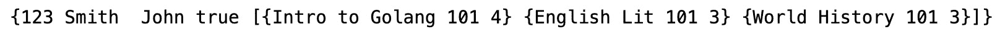

图 11.10：打印学生课程结构

所有创建的目录和文件都需要在 `$GOPATH` 内创建：

1.  在名为 `Chapter11` 的目录中创建一个名为 `Exercise11.01` 的目录。

1.  在 `Chapter11/Exercise11.01` 内创建一个名为 `main.go` 的文件。

1.  使用 Visual Studio Code 打开新创建的 `main.go` 文件。

1.  添加以下包名和导入语句：

    ```go
    package main
    import (
      "encoding/json"
      "fmt"
    )
    ```

1.  我们需要创建一个 `student` 结构体。`student` 结构体的所有字段都需要是导出的，这样我们才能将 JSON 数据反序列化到它们。每个结构体字段都需要一个 JSON 标签，该标签将是 JSON 数据字段的名称：

    ```go
    type student struct {
      StudentId     int      `json:"id"`
      LastName      string   `json:"lname"`
      MiddleInitial string   `json:"minitial"`
      FirstName     string   `json:"fname"`
      IsEnrolled    bool     `json:"enrolled"`
      Courses       []course `json:"classes"`
    }
    ```

1.  我们需要创建一个 `course` 结构体。`course` 结构体需要所有字段都是可导出的，这样我们才能将 JSON 数据解析到它们中。每个结构体字段都需要一个 JSON 标签，该标签将是 JSON 数据字段的名称：

    ```go
    type course struct {
      Name   string `json:"coursename"`
      Number int    `json:"coursenum"`
      Hours  int    `json:"coursehours"`
    }
    ```

1.  添加一个 `main()` 函数：

    ```go
    func main() {
      }
    ```

1.  在 `main()` 函数中，添加我们将要解析到我们的结构体（`student` 和 `course`）中的 JSON 数据：

    ```go
      data := []byte(`
        {
          "id": 123,
          "lname": "Smith",
          "minitial": null,
          "fname": "John",
          "enrolled": true,
          "classes": [{
            "coursename": "Intro to Golang",
            "coursenum": 101,
            "coursehours": 4
          },
        {
            "coursename": "English Lit",
            "coursenum": 101,
            "coursehours": 3
          },
        {
            "coursename": "World History",
            "coursenum": 101,
            "coursehours": 3
          }
      ]
        }
      `)
    ```

1.  声明一个 `student` 类型的变量：

    ```go
      var s student
    ```

1.  接下来，我们将 JSON 解析到我们的 `student` 结构体中。我们还将处理 `json.Unmarshal()` 方法返回的任何错误：

    ```go
      err := json.Unmarshal(data, &s)
      if err != nil {
        fmt.Println(err)
      }
    ```

1.  我们将打印 `student` 结构体，以便我们可以看到 JSON 中的所有数据：

    ```go
      fmt.Println(s)
    }
    ```

1.  通过在命令行中运行 `go build` 来构建程序：

    ```go
    go build
    ```

    修正返回的错误，并确保你的代码与这里的代码片段匹配。

1.  通过输入可执行文件名并按 *Enter* 键来运行可执行文件。

    输出如下：

![图 11.11：打印学生课程结构体]

![图片 B14177_11_10.jpg]

图 11.11：打印学生课程结构体

这个练习展示了如何成功地将 JSON 数据解析到 Go 结构体中。

# JSON 编码

我们已经研究了如何将 JSON 解析到结构体中。现在我们将做相反的操作：将结构体序列化为 JSON。当我们谈论编码 JSON 时，我们的意思是将一个 Go 结构体转换为 JSON 数据结构。这种操作通常发生在你有一个服务正在响应来自客户端的 HTTP 请求时。客户端希望数据以某种格式呈现，这通常是 JSON。另一种情况是数据存储在 NoSQL 数据库中，它需要 JSON 格式，或者甚至是一个具有 JSON 数据类型的列的传统数据库。

我们需要能够将 Go 结构体 `Marshal` 到一个 JSON 编码的结构体中。为了做到这一点，我们需要导入 `encoding/json` 包。我们将使用 `json.Marshal` 函数：

```go
func Marshal(v interface{}) ([]byte, error)
```

`v` 被编码为 JSON。通常，`v` 是一个 `struct`。`Marshal()` 函数返回一个字节切片和错误。在编码 `v` 的过程中检查是否有错误总是一个好的做法。让我们通过一个简单的例子来进一步解释 Go 结构体到 JSON 的序列化：

```go
package main
import (
  "encoding/json"
  "fmt"
)
type greeting struct {
  SomeMessage string
}
func main() {
  var v greeting
  v.SomeMessage = "Marshal me!"
  json, err := json.Marshal(v)
  if err != nil {
    fmt.Println(err)
  }
  fmt.Printf("%s",json)
}
```

让我们分解代码以更好地理解：

```go
type greeting struct {
  SomeMessage string
}
```

我们有一个只有一个可导出字段的 `struct`。注意没有 JSON 标签。你应该能够猜出该字段在 JSON 数据中是什么：

```go
json, err := json.Marshal(v)
```

以下图示显示了如何使用 `json.Marshal` 方法将 `greeting` 结构体序列化为 JSON。`marshal` 方法中的 `v` 接口参数是 `greeting` 结构体。`marshal` 方法将 `greeting` 字段 `SomeMessage` 编码为 JSON。以下图示显示了该过程：

![图 11.12：将 Go 结构体序列化为 JSON]

![图片 B14177_11_12.jpg]

图 11.12：将 Go 结构体序列化为 JSON

当我们调用`Marshal`函数时，我们传递给它一个结构体。该函数将返回一个错误和`g`的 JSON 编码。

打印语句的结果如下：

```go
{"SomeMessage":"Marshal me!"}
```

由于我们没有为结构体`greeting`提供 JSON 标签，Go `Marshal`将编码可导出字段及其值。Go `Marshal`使用字段名`SomeMessage`作为 JSON 数据中`key`字段的名称。

以下代码产生了一个不理想的结果。检查以下代码并注意未设置的结构体字段的结果。请特别注意在`main()`函数中未设置的字段。

考虑以下示例：

```go
package main
import (
  "encoding/json"
  "fmt"
)
type book struct {
  ISBN          string `json:"isbn"`
  Title         string `json:"title"`
  YearPublished int    `json:"yearpub"`
  Author        string `json:"author"`
  CoAuthor      string `json:"coauthor"`
}
func main() {
  var b book
  b.ISBN = "9933HIST"
  b.Title = "Greatest of all Books"
  b.Author = "John Adams"
  json, err := json.Marshal(b)
  if err != nil {
    fmt.Println(err)
  }
  fmt.Printf("%s", json)
} 
```

当字段值未设置时，序列化结构体数据将给出以下输出：

```go
{"isbn":"9933HIST","title":"Greatest of all Books","yearpub":0,"author":"John   Adams","coauthor":""}
```

有时候我们可能不希望当字段未设置时将结构体字段序列化为 JSON。我们的`CoAuthor`字段和`YearPublished`未设置，因此 JSON 值分别为空字符串和零。有一个我们可以利用的 JSON 标签属性，称为`omitempty`。如果它为空，它将省略结构体字段：

```go
package main
import (
  "encoding/json"
  "fmt"
)
type book struct {
  ISBN          string `json:"isbn"`
  Title         string `json:"title"`
  YearPublished int    `json:"yearpub,omitempty"`
  Author        string `json:"author"`
  CoAuthor      string `json:"coauthor,omitempty"`
}
func main() {
  var b book
  b.ISBN = "9933HIST"
  b.Title = "Greatest of all Books"
  b.Author = "John Adams"
  json, err := json.Marshal(b)
  if err != nil {
    fmt.Println(err)
  }
  fmt.Printf("%s", json)
}
```

让我们分解代码以更好地理解：

```go
  YearPublished int    `json:"yearpub,omitempty"`
  CoAuthor      string `json:"coauthor,omitempty"`
```

两个`book`字段的 JSON 标签使用`omitempty`属性。如果这些字段未设置，它们将不会出现在 JSON 中。结果如下：

```go
{"isbn":"9933HIST","title":"Greatest of all Books","author":"John Adams"}
```

当使用 JSON 标签时，你需要小心不要在值中有任何空格。使用我们之前的示例，让我们将我们的`YearPublished` JSON 标签更改为以下内容：

```go
YearPublished int    `json:"yearpub, omitempty"`
```

注意逗号和`omitempty`之间的空格。如果你使用`go vet`，这将导致以下错误：


图 11.13：Go vet 错误

另一个需要注意的事情是，如果你没有正确处理错误，你将得到一些错误的结果：

```go
{"isbn":"9933HIST","title":"Greatest of all Books","yearpub":0,"author":"John 
  Adams"}
```

即使`json.Marshal(b)`函数出错，它仍然将结构体转换为 JSON。`yearpub`值被设置为零。这就是为什么处理我们的错误很重要的原因之一。

在以下示例中，我们将简要查看其他一些 JSON 标签：

```go
package main
import (
  "encoding/json"
  "fmt"
)
type book struct {
  ISBN          string `json:"isbn"`
  Title         string `json:"title"`
  YearPublished int    `json:",omitempty"`
  Author        string `json:",omitempty"`
  CoAuthor      string `json:"-"`
}
func main() {
  var b book
  b.ISBN = "9933HIST"
  b.Title = "Greatest of all Books"
  b.Author = "John Adams"
  b.CoAuthor ="Can't see me"
  json, err := json.Marshal(b)
  if err != nil {
    fmt.Println(err)
  }
  fmt.Printf("%s", json)
}
```

让我们分解代码以更好地理解：

```go
  YearPublished int    `json:",omitempty"`
  Author        string `json:",omitempty"`
```

+   在上面的代码中，`` `json:",omitempty"` ``没有字段的值。注意 JSON 标签值以逗号开头。

+   `` `json:",omitempty"` ``如果键有值，则该字段将出现在 JSON 中。如果`Author`设置了值，它将作为`"Author" :"somevalue"`键出现在 JSON 中：

    ```go
    CoAuthor      string `json:"-"`
    ```

+   破折号用于忽略字段。该字段将不会被序列化为 JSON。

结果如下：

```go
{"isbn":"9933HIST","title":"Greatest of all Books","Author":"John Adams"}
```

以下图表总结了我们在将结构体序列化为 JSON 时与我们的结构体一起使用的不同 JSON 标签属性：

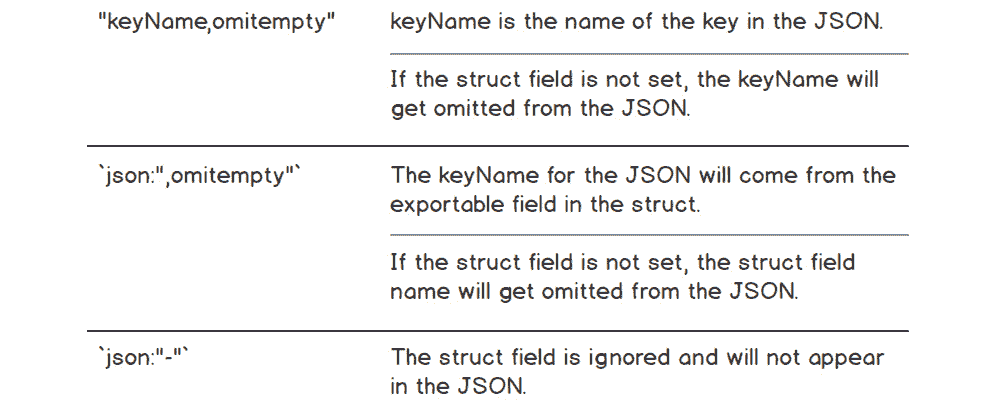

图 11.14：JSON 标签字段描述

将 JSON 输出作为一行并不是很易读，尤其是当你开始处理更大的 JSON 结构时。Go JSON 包提供了一个格式化 JSON 输出的方法。`MarshalIndent()`函数提供了与`Marshal`函数相同的功能。除了编码 JSON 之外，`MarshalIndent()`函数还可以格式化 JSON，使其易于阅读。这通常被称为“美化打印”。以下代码展示了`MarshalIndent()`函数的示例代码：

```go
func MarshalIndent(v interface{}, prefix, indent string) ([]byte, error)
```

在我们的示例中，我们不会使用前缀。它只是在我们的缩进字符串之前应用一个字符串。每个元素都将开始在新的一行上：

```go
package main
import (
  "encoding/json"
  "fmt" 
  "os"
)
type person struct {
  LastName  string  `json:"lname"`
  FirstName string  `json:"fname"`
  Address   address `json:"address"`
}
type address struct {
  Street  string `json:"street"`
  City    string `json:"city"`
  State   string `json:"state"`
  ZipCode int    `json:"zipcode"`
}
func main() {
  p := person{LastName: "Vader", FirstName: "Darth"} 
  p.Address.Street = "Galaxy Far Away" 
  p.Address.City= "Dark Side"
  p.Address.State= "Tatooine"
  p.Address.ZipCode =12345
  noPrettyPrint, err := json.Marshal(p)
  if err != nil {
    fmt.Println(err)
    os.Exit(1)
  }
  prettyPrint, err := json.MarshalIndent(p, "", "    ")
  if err != nil {
    fmt.Println(err)
    os.Exit(1)
  }
  fmt.Println(string(noPrettyPrint))
  fmt.Println()
  fmt.Println(string(prettyPrint))
}
```

让我们分解代码以更好地理解：

```go
type person struct {
  LastName  string  `json:"lname"`
  FirstName string  `json:"fname"`
  Address   address `json:"address"`
}
type address struct {
  Street  string `json:"street"`
  City    string `json:"city"`
  State   string `json:"state"`
  ZipCode int    `json:"zipcode"`
}
```

我们有两个结构体：一个`person`结构体和一个`address`结构体。`address`结构体嵌入在`person`结构体中。两个结构体都在 JSON 标签中定义了 JSON 键名。`address`结构体将在 JSON 中作为一个单独的对象：

```go
  p := person{LastName: "Vader", FirstName: "Darth"} 
  p.Address.Street = "Galaxy Far Away" 
  p.Address.City= "Dark Side"
  p.Address.State= "Tatooine"
  p.Address.ZipCode =12345
```

我们初始化`person`结构体并设置`person.Address`字段的值。每个字段都设置了值，因此在我们的 JSON 中不会有空字符串或零值：

```go
  noPrettyPrint, err := json.Marshal(p)
  if err != nil {
    fmt.Println(err)
    os.Exit(1)
  }
```

`noPrettyPrint`变量是`p`的 JSON 编码。

我们当然会检查`json.Marshal()`函数返回的任何错误：

```go
  prettyPrint, err := json.MarshalIndent(p, "", "    ")
  if err != nil {
    fmt.Println(err)
    os.Exit(1)
  }
```

`prettyPrint`变量是使用`json.MarshalIndent()`对`p`进行 JSON 编码的结果。我们将前缀参数设置为空字符串，将缩进参数设置为四个空格。

与`json.Marshal()`函数一样，我们也检查`json.MarshalIndent()`函数返回的任何错误。我们可以使用以下图中的`json.MarshalIndent()`方法来查看这些各种步骤：

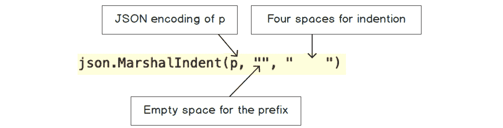

图 11.15：json.MarshalIndent()方法

然后我们使用`json.Marshal()`函数打印 JSON 编码的结果：

```go
fmt.Println(string(noPrettyPrint))
```

如您所见，JSON 的可读性略有挑战。

没有使用`MarshalIndent`的 JSON 序列化如下所示：

```go
{"lname":"Vader","fname":"Darth","address":{"street":"Galaxy Far   Away","city":"Dark Side","state":"Tatooine","zipcode":12345}}
```

我们还使用`json.MarshalIndent()`函数打印了 JSON 编码的结果：

```go
fmt.Println(string(prettyPrint))
```

使用`json.MarshalIndent()`函数的结果更容易阅读。你可以比之前打印的结果更容易地阅读输出：

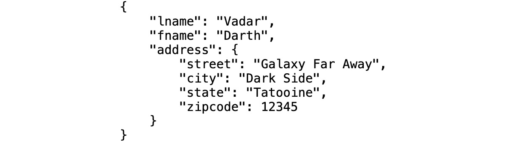

图 11.16：使用 MarshalIndent JSON 结果

## 练习 11.02：序列化学生课程

在这个练习中，我们将做与*练习 11.01*，*反序列化学生课程*相反的事情。我们将从结构体到 JSON 进行序列化。这是之前的结构体：

```go
 type student struct {
  StudentId     int      `json:"id"`
  LastName      string   `json:"lname"`
  MiddleInitial string   `json:"minitial"`
  FirstName     string   `json:"fname"`
  IsEnrolled    bool     `json:"enrolled"`
  Courses       []course `json:"classes"`
}
```

我们将对 JSON 标签进行一些修改。

所有创建的目录和文件都需要在您的`$GOPATH`内创建：

1.  创建一个名为`main.go`的文件。

1.  添加以下包名和导入语句：

    ```go
    package main
    import (
      "encoding/json"
      "fmt"
      "os"
    )
    ```

1.  创建一个`student`结构体。所有字段都将可导出。以下字段的 JSON 标签在它们被序列化时需要以下功能：

    如果未设置值，则应省略 `MiddleInitial`；`IsMarried` 不应出现在 JSON 中；`IsEnrolled` 应为字段名，如果未设置则省略：

    ```go
    type student struct {
      StudentId     int      `json:"id"`
      LastName      string   `json:"lname"`
      MiddleInitial string   `json:"mname,omitempty"`
      FirstName     string   `json:"fname"`
      IsMarried     bool   `json:"-"`
      IsEnrolled    bool     `json:"enrolled,omitempty "`
      Courses       []course `json:"classes"`
    }
    ```

1.  创建一个 `course` 结构体：

    ```go
    type course struct {
      Name   string `json:"coursename"`
      Number int    `json:"coursenum"`
      Hours  int    `json:"coursehours"`
    }
    ```

1.  创建一个名为 `newStudent()` 的函数。此函数将返回一个 `student` 结构体：

    ```go
    func newStudent(studentID int, lastName, middleInitial, firstName string,
      isMarried, isEnrolled bool) student {
      s := student{StudentId: studentID,
        LastName:      lastName,
        MiddleInitial: middleInitial,
        FirstName:     firstName,
        IsMarried:     isMarried,
        IsEnrolled:    isEnrolled,
      }
      return s
    }
    ```

1.  添加 `main()` 函数：

    ```go
    func main() {
    }
    ```

1.  在 `main()` 函数中，使用 `newStudent()` 函数创建一个 `student` 结构体，并将函数的结果赋值给变量 `s`：

    ```go
      s := newStudent(1, "Williams", "s", "Felicia", false, false)
    ```

1.  接下来，将 `s` 序列化为 JSON。我们希望 JSON 的缩进为每个字段四个空格，以便于阅读：

    ```go
      student1, err := json.MarshalIndent(s, "", "")
      if err != nil {
        fmt.Println(err)
        os.Exit(1)
      }
    ```

1.  打印 `student1`：

    ```go
      fmt.Println(string(student1))
      fmt.Println()
    ```

1.  使用 `newStudent()` 函数创建另一个 `student`：

    ```go
      s2 := newStudent(2, "Washington", "", "Bill", true, true)
    ```

1.  我们现在将为 `s2` 添加各种课程：

    ```go
      c := course{Name: "World Lit", Number: 101, Hours: 3}
      s2.Courses = append(s2.Courses, c)
      c = course{Name: "Biology", Number: 201, Hours: 4}
      s2.Courses = append(s2.Courses, c)
      c = course{Name: "Intro to Go", Number: 101, Hours: 4}
      s2.Courses = append(s2.Courses, c)
    ```

1.  接下来，将 `s2` 序列化为 JSON。我们希望 JSON 的缩进为每个字段四个空格，以便于阅读：

    ```go
      student2, err := json.MarshalIndent(s2, "", "")
      if err != nil {
        fmt.Println(err)
        os.Exit(1)
      }
    ```

1.  打印 `student2`：

    ```go
      fmt.Println(string(student2))
    }
    ```

    `student1` 打印语句的结果如下：

    ```go
    {
        "id": 1,
        "lname": "Williams",
        "mname": "S",
        "fname": "Felicia",
        "classes": null
    }
    ```

    `student2` 打印语句的结果如下：

    ```go
    {
        "id": 2,
        "lname": "Washington",
        "Fname": "Bill",
        "IsEnrolled": true,
        "classes": [
            {
                "coursename": "World Lit",
                "coursenum": 101,
                "coursehours": 3
            },
            {
                "coursename": "Biology",
                "coursenum": 201,
                "coursehours": 4
            },
            {
                "coursename": "Intro to Go",
                "coursenum": 101,
                "coursehours": 4
            }
        ]
    }
    ```

本练习的目的是演示如何编码 JSON。我们从一个结构体开始，将其编码为 JSON。我们能够通过缩进字段来改变编码，使其更容易阅读。我们还看到了如何改变字段编码到 JSON 的行为。我们看到，如果结构体字段没有数据，我们可以省略字段以避免将其编码到 JSON 中。我们展示了我们可以使用 JSON 标签以与结构体中字段名不同的名称命名 JSON 数据中的字段。我们还看到了我们甚至可以忽略结构体中的字段，这样在序列化时它们就不会出现在 JSON 中。

到目前为止，我们已经处理了在事先知道 JSON 结构且该结构不会改变的情况。在下一节中，我们将讨论如何处理当你得到一个 JSON 结构，但该结构可能会改变且不稳定的情况。

## 未知 JSON 结构

当我们事先知道 JSON 结构时，这允许我们灵活地设计我们的结构体以匹配预期的 JSON。正如我们所见，我们可以将我们的 JSON 值反序列化到目标结构体类型中。Go 提供了对结构体类型进行编码（序列化）和解码（反序列化）的支持。

有时候你可能不知道 JSON 的结构。例如，你可能在与一个为流媒体服务发布指标的第三方工具交互。这个指标是以 JSON 格式存在的；然而，它非常动态，服务于各种客户。他们经常为他们的各种客户添加新的指标。你想要订阅这个服务并报告这些不同的指标。问题是这些指标的提供者经常更改 JSON 数据。他们更改得如此频繁，以至于他们不提供更改，也没有任何规定的日程。你需要能够对新指标和旧指标进行分析，而且你不能因为要将 JSON 中的新字段添加到你的结构中而中断你的服务。你需要有能力以最小的服务中断连续报告他们的指标。

如果你的 JSON 是动态的，将其解码到结构体中就不会起作用。那么，当你不知道 JSON 结构或者它频繁变化时，你该怎么办？

在这些情况下，我们可以使用`map[string]interface{}`。JSON 数据的键将是映射的字符串键。`empty interface{}`将是那些 JSON 键的值。每个类型都实现了空接口：


图 11.17：JSON 到映射数据类型的映射

`json.Unmarshal`函数会将未知的 JSON 结构解码成键为字符串、值为空接口的映射。这很好，因为 JSON 键必须是字符串。

考虑以下示例：

```go
package main
import (
  "encoding/json"
  "fmt"
)
func main() {
  jsonData := []byte(`{"checkNum":123,"amount":200,"category":["gift","clothing"]}`)
  var v interface{}
  json.Unmarshal(jsonData, &v)
  fmt.Println(v)
}
```

让我们分解代码以便更好地理解：

```go
jsonData := []byte(`{"checkNum":123,"amount":200,"category":["gift","clothing"]}`)
```

`jsonData`代表我们给出的 JSON，但我们不知道其结构：

```go
  var v interface{}
  json.Unmarshal(jsonData, &v)
```

尽管我们不知道 JSON 结构，但我们仍然可以将其反序列化到接口中。

`jsonData`被反序列化到空接口`v`，它将是一个映射。

映射键是字符串，值是空接口。打印出`v`的结果如下：

```go
map[amount:200 category:[gift clothing] checkNum: 123]
```

`map[string]interface{}`的打印顺序与数据存储的顺序不匹配。这是因为映射是无序的，所以它们的顺序不能保证。

`v`的 Go 表示如下：

```go
v = map[string]interface{}{
  "amount": 200,
  "category": []interface{}{
    "gift",
    "clothing",
  },
  "checkNum":  123,
}
```

记住键是字符串，值是接口。即使 JSON 中有切片，值也会变成`interface{}`的切片，表示为`[]interface{}`。

我们在*第七章*，*接口*中了解到，我们有访问具体类型的能力。我们可以进行类型断言来访问`map[string]interface{}`的底层具体类型。让我们看看另一个例子，其中我们有许多数据类型可以处理。

## 练习 11.03：分析大学课程 JSON

在这个练习中，我们将分析来自大学管理办公室的数据，看看我们是否可以替换当前的大学课程成绩提交应用程序。问题是旧系统的 JSON 数据没有很好地记录。JSON 中的数据类型和结构都不清楚。在某些情况下，JSON 结构是不同的。我们需要编写一个程序，可以分析未知的 JSON 结构，并且对于结构中的每个字段，打印出数据类型和 JSON 键值对。

所有创建的目录和文件都需要在 `$GOPATH` 内创建：

1.  在名为 `Chapter11` 的目录下创建一个名为 `Exercise11.03` 的目录。

1.  在 `Chapter11/Exercise11.03` 内创建一个名为 `main.go` 的文件。

1.  使用 Visual Studio Code 打开新创建的 `main.go` 文件。

1.  添加以下 `package` 名称和 `import` 语句：

    ```go
    package main
    import (
      "encoding/json"
      "fmt"
      "os"
    )
    ```

1.  创建一个 `main()` 函数，然后将 `jsonData` 赋值给一个 `[]byte`，该 `[]byte` 将代表来自大学成绩提交程序的 `JSON`：

    ```go
    func main() {
      jsonData := []byte(`
    {
      "id": 2,
      "lname": "Washington",
      "fname": "Bill",
      "IsEnrolled": true,
      "grades":[100,76,93,50],
      "class": 
        {
          "coursename": "World Lit",
          "coursenum": 101,
          "coursehours": 3
        }
    }
    `)
    ```

1.  检查 `jsonData` 是否是有效的 `JSON`。如果不是，打印错误消息并退出应用程序：

    ```go
      if !json.Valid(jsonData) {
        fmt.Printf("JSON is not valid: %s", jsonData)
        os.Exit(1)
      }
    ```

1.  声明一个空的 `interface` 变量：

    ```go
      var v interface{}
    ```

1.  将 `jsonData` 解码到空的 `interface` 中。检查是否有任何错误。如果有错误，打印错误并退出应用程序：

    ```go
      err := json.Unmarshal(jsonData, &v)
      if err != nil {
        fmt.Println(err)
        os.Exit(1)
      }
    ```

1.  对映射中的每个值执行类型切换。为 `string`、`float64`、`bool`、`[]interface` 和 `default` 准备一个情况语句来捕获值的未知类型。每个 `case` 语句应打印数据类型、键和值。我们的类型断言流程应如图所示：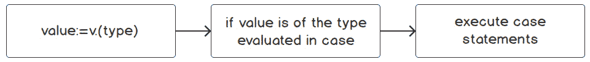

    ```go
      data := v.(map[string]interface{})
      for k, v := range data {
        switch value := v.(type) {
        case string:
          fmt.Println("(string):", k, value)
        case float64:
          fmt.Println("(float64):", k, value)
        case bool:
          fmt.Println("(bool):", k, value)
        case []interface{}:
          fmt.Println("(slice):", k)
          for i, j := range value {
            fmt.Println("    ", i, j)
          }
        default:
          fmt.Println( "(unknown):",k, value)
          }
      }
    }
    ```

1.  通过在命令行上运行 `go build` 来构建程序：

    ```go
    go build
    ```

1.  修正返回的错误，并确保你的代码与代码片段 [`packt.live/2Qr4dNx`](https://packt.live/2Qr4dNx) 相匹配。

1.  通过键入可执行文件名然后按 *Enter* 键来运行可执行文件。

    类型 `switch` 语句的输出应如下所示：

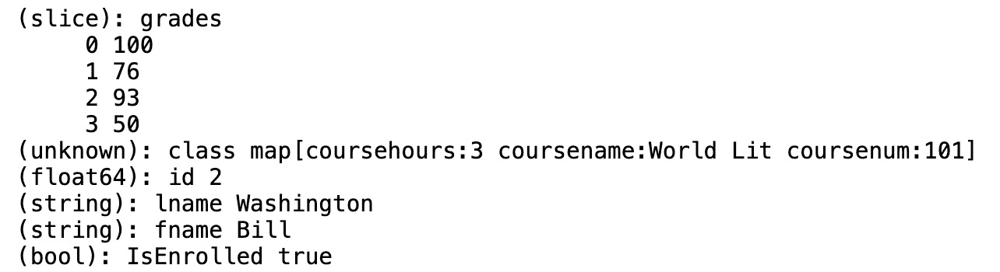

图 11.19：大学班级 JSON 的输出

注意

映射的输出可能与前面的示例不同，因为使用范围循环迭代映射并不是每次迭代都确定的。

在这个练习中，我们看到了即使不知道其内容，如何解析 JSON 结构。我们了解到通过将 JSON 解码到空的 `interface` 中，我们得到 `map[string]interface{}` 的结构。映射的键是 JSON 的字段，映射的 `interface{}` 是 JSON 的值。然后我们能够遍历映射并执行类型断言语句来获取映射值的类型和数据，以及键名。

# GOB：Go 的自有编码

Go 语言有其特有的数据编码协议，称为 `gob`。只有在编码和解码操作发生在 Go 语言环境中时，你才能使用 `gob`。如果需要与其他语言编写的软件进行通信，仅限于 Go 语言可能成为一项无法逾越的限制。对于组织内部使用的软件，编码和解码软件通常都使用相同的语言编写，因此这种情况并不常见。

如果可以使用 `gob`，它将为你提供异常高的性能和效率。例如，JSON 是一种基于字符串的协议，它需要在任何编程语言中都是可用的。这限制了 JSON 和类似协议所能实现的功能。另一方面，`Gob` 是一种基于二进制的协议，并且 `gob` 只需要为 Go 用户工作。这使得 `gob` 成为一个空间和处理器效率高的编码协议，同时仍然易于使用。

`Gob` 不需要任何配置或设置即可使用。此外，`gob` 不要求发送者和接收者的数据模型完全匹配。因此，它不仅高效快捷，而且易于使用。

虽然 Go 在类型方面非常严格，但 `gob` 则不然。`gob` 将所有数字视为相同，无论是 `int` 还是 `float`。你可以使用指针与 `gob` 一起使用，并且在编码时，`gob` 将为你从指针中提取值。`gob` 还会愉快地将值设置为指针或值类型，无论值是从指针还是值编码而来。

`Gob` 可以编码复杂类型，如结构体。`Gob` 的灵活性继续存在，因为它不要求结构体上的属性匹配。如果结构体上存在要解码的匹配属性，它将使用它；如果没有，则它将丢弃该值。这一事实还带来了额外的好处，即你可以添加新的属性，而无需担心它会破坏你的旧服务。

当在 Go 网络服务之间使用 `gob` 进行通信时，通常的做法是使用 Go 的 `rpc` 包来处理服务之间的网络通信方面。`rpc` 包提供了一种简单的方式来调用其他 Go 网络服务，并且默认情况下，`rpc` 包使用 `gob` 来处理编码任务。这意味着你将获得使用 `gob` 的所有好处，而无需进行任何额外的工作。

使用 `gob` 进行服务间通信的 `rpc` 服务将导致通信延迟降低。低延迟通信是现代软件架构设计，如微服务，得以实现的关键。

要在 Go 中直接使用 `gob` 协议进行数据编码，你使用 Go 的 `gob` 包。该包是 Go 对 `gob` 协议的实现。当使用此包进行编码时，它将返回一个 `byte` 切片。这些字节切片在处理文件和网络时在代码中很常见。这意味着已经有许多辅助函数供你利用。

Gob 不仅限于在网络解决方案中使用。你还可以使用 gob 将数据存储在文件中。将 Go 数据写入文件的一个常见用例是使数据对服务器重启具有容错性。在现代云服务器部署中，如果服务器开始出现问题，它会被杀死，你的应用程序会在新的服务器上重新启动。如果你有任何仅在内存中的重要数据，它将会丢失。通过将数据写入附加到服务器的挂载文件系统来防止这种损失。当替换服务器启动时，它会连接到相同的文件系统，在启动时，你的应用程序将从文件系统恢复数据。

使用文件进行数据容错的一个例子是在基于事务的工作负载中。在基于事务的工作负载中，丢失单个事务可能是一个大问题。为了防止这种情况发生，在应用程序处理事务的同时，将事务的备份写入磁盘。如果发生重启，应用程序会检查这些备份以确保一切正常。使用 gob 来编码这些数据将确保它们尽快写入文件系统，从而最大限度地减少数据丢失的可能性。

另一个用例是冷启动缓存预填充。当出于性能原因使用缓存时，你需要将其存储在内存中。这个缓存的规模增长到几 GB 大小并不罕见。服务器重启意味着这个缓存丢失，需要从数据库重新加载。如果很多服务器同时重启，会导致缓存踩踏，这可能会使数据库崩溃。避免这种过载情况的一种方法是将缓存的一个副本写入挂载文件系统。然后，当你的应用程序启动时，它会从文件而不是数据库中预填充其缓存。使用 gob 来编码这些数据将允许更有效地使用磁盘空间，从而反过来允许更快的读取和更有效的解码。这也意味着你的服务器可以更快地恢复在线状态。

## 练习 11.04：使用 gob 编码数据

在这个练习中，我们将使用 gob 编码和传输一个事务，然后解码。我们将使用一个虚拟网络将一个银行事务从客户端发送到服务器。这个事务是一个结构体，它还包含一个嵌入的用户结构体。这表明复杂的数据可以很容易地编码。

为了展示`gob`协议的灵活性，客户端和服务器结构体在几个方面不匹配。例如，客户端的用户是一个指针，而服务器的用户不是。金额是不同的浮点类型，客户端是`float64`，而服务器是`*float32`。一些字段在服务器类型中缺失，而在客户端类型中存在。

我们将使用`bytes`包来存储我们的编码数据。这表明一旦编码，你可以使用标准库来处理 gob 二进制数据。

**步骤：**

1.  定义`client`结构体。

1.  定义具有多种不同方式的`server`结构体。

1.  创建一个字节数组缓冲区作为虚拟网络。

1.  创建一个包含一些模拟数据的客户端值。

1.  编码客户端值。

1.  将编码后的数据写入模拟网络。

1.  创建一个充当服务器的函数。

1.  从模拟网络中读取数据。

1.  解码数据。

1.  将解码后的数据打印到控制台。

让我们开始这个练习：

1.  在名为`Chapter11`的目录中创建一个名为*Exercise11.04*的目录。

1.  在*Chapter11/Exercise11.04*中创建一个名为`main.go`的文件。

1.  使用 Visual Studio Code 打开新创建的`main.go`文件。

1.  添加以下包名和导入语句：

    ```go
    package main
    import (
      "bytes"
      "encoding/gob"
      "fmt"
      "io"
      "log"
    )
    ```

1.  创建一个表示客户端用户模型的`struct`：

    ```go
    type UserClient struct {
      ID   string
      Name string
    }
    ```

1.  创建一个表示客户端事务的`struct`。`Tx`是事务的常用缩写：

    ```go
    type TxClient struct {
      ID          string
      User        *UserClient
      AccountFrom string
      AccountTo   string
      Amount      float64
    }
    ```

1.  创建一个表示服务器端用户模型的`struct`。这个模型与客户端模型不匹配，因为它没有`Name`属性：

    ```go
    type UserServer struct {
      ID string
    }
    ```

1.  创建一个表示服务器端事务的`struct`。在这里，用户不是一个指针。金额是一个指针，但这个指针是指向`float32`的，而不是`float64`：

    ```go
    type TxServer struct {
      ID          string
      User        UserServer
      AccountFrom string
      AccountTo   string
      Amount      *float32
    }
    ```

1.  创建`main()`函数：

    ```go
    func main() {
    ```

1.  创建一个模拟网络，它是一个来自`bytes`包的缓冲区：

    ```go
      var net bytes.Buffer
    ```

1.  使用客户端`struct`创建模拟数据：

    ```go
      clientTx := &TxClient{
        ID: "123456789",
        User: &UserClient{
          ID:   "ABCDEF",
          Name: "James",
        },
        AccountFrom: "Bob",
        AccountTo:   "Jane",
        Amount:      9.99,
      }
    ```

1.  编码数据。编码数据的目标是我们的模拟网络：

    ```go
      enc := gob.NewEncoder(&net)
    ```

1.  检查错误，如果发现任何错误则退出：

    ```go
      if err := enc.Encode(clientTx); err != nil {
        log.Fatal("error encoding: ", err)
      }
    ```

1.  将数据发送到服务器：

    ```go
      serverTx, err := sendToServer(&net)
    ```

1.  检查错误，如果发现任何错误则退出：

    ```go
      if err != nil {
        log.Fatal("server error: ", err)
      }
    ```

1.  将解码后的数据打印到控制台：

    ```go
      fmt.Printf("%#v\n", serverTx)
    ```

1.  关闭`main()`函数：

    ```go
    }
    ```

1.  创建我们的`sendToServer`函数。这个函数接受一个单一的`io.Reader`接口，并返回一个服务器端事务和一个`error`：

    ```go
    func sendToServer(net io.Reader) (*TxServer, error) {
    ```

1.  创建一个变量作为解码的目标：

    ```go
      tx := &TxServer{}
    ```

1.  使用网络作为源创建一个解码器：

    ```go
      dec := gob.NewDecoder(net)
    ```

1.  解码并捕获任何错误：

    ```go
      err := dec.Decode(tx)
    ```

1.  返回解码后的数据和捕获到的任何错误：

    ```go
      return tx, err
    ```

1.  关闭函数：

    ```go
    }
    ```

1.  通过在命令行中运行`go build`来构建程序：

    ```go
    go build
    ```

1.  通过输入可执行文件名并按*Enter*键来运行可执行文件。

    类型切换语句的输出应该如下所示：

![图 11.20：Gob 输出]

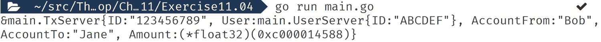

图 11.20：Gob 输出

在这个练习中，我们使用客户端类型编码了数据，将其`sent`到服务器，并输出了服务器解码的内容。从服务器返回的内容中，我们可以看到它使用了不同的类型，用户有一个 ID 但没有名字，并且`Amount`是一个 32 位的浮点指针类型。

我们可以看到 gob 多么容易和灵活，可以用来工作。当需要在服务器之间进行通信时，gob 也是一个很好的性能选择，但两个服务器都需要用 Go 编写才能利用这些功能。

在下一个活动中，我们将使用 JSON 测试我们迄今为止学到的内容。

## 活动内容 11.01：使用 JSON 模拟客户订单

在这个活动中，我们将模拟客户订单。一个在线电子商务门户需要通过其 Web 应用程序接受客户订单。当客户浏览网站时，客户将向订单添加商品。这个 Web 应用程序需要能够将 JSON 添加到 JSON 中。

**步骤：**

1.  创建一个包含所有可导出字段的`address`结构体（`Street`字符串、`City`字符串、`State`字符串和`Zipcode`整数）。

1.  创建一个包含所有可导出字段的`item`结构体（`Name`字符串、`Description`字符串、`Quantity`整数和`Price`整数）。如果描述字段没有数据，则不应在 JSON 中显示。

1.  创建一个包含所有可导出字段的`order`结构体（`TotalPrice`整数、`IsPaid`布尔值、`Fragile`布尔值和`OrderDetail []item`）。如果`Fragile`字段没有数据，则不应在 JSON 中显示。

1.  创建一个包含所有字段的`customer`结构体（`UserName`字符串、`Password`字符串、`Token`字符串、`ShipTo`地址和`PurchaseOrder`订单）。`Password`和`Token`字段永远不会出现在 JSON 中。

1.  应用程序应检查`jsonData`是否是有效的 JSON。以下代码片段是我们应用程序客户订单的一些示例 JSON：

    ```go
      jsonData := []byte(`
      {
        "username" :"blackhat",
        "shipto":  
          {
              "street": "Sulphur Springs Rd",
              "city": "Park City",
              "state": "VA",
              "zipcode": 12345
          },
        "order":
          {
            "paid":false,
            "orderdetail" : 
              [{
                "itemname":"A Guide to the World of zeros and ones",
                "desc": "book",
                "qty": 3,
                "price": 50
              }]
          }
      }
      `)
    ```

1.  应用程序应将`jsonData`解码到客户结构体中。

1.  在订单中添加两个额外的项目，包括订单中所有项目的`TotalPrice`，订单是否有易碎物品，以及所有物品是否已全额支付。

1.  打印客户订单，使其易于阅读。

    应用程序预期的输出如下：

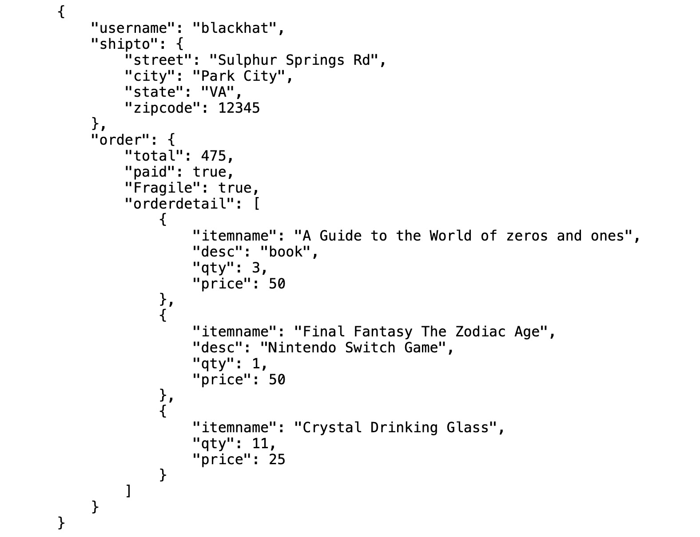

图 11.21：客户订单打印输出

我们已经看到如何将复杂数据类型如切片编码和解码到 JSON 中。我们已经检查了 JSON 是否是有效的 JSON。我们还看到了如何控制结构体中显示的字段，以及是否能够从 JSON 中省略没有数据的字段。当我们打印 JSON 时，我们能够以易于阅读的格式打印它。

注意

这个活动的解决方案可以在第 732 页找到。

# 概述

在这一章中，我们研究了 JSON 是什么以及我们如何使用 Go 将 JSON 存储在我们的结构体中。

JSON 被许多编程语言包括 Go 使用。JSON 由键值对组成。这些键值对可以是以下任何一种类型：字符串、数字、对象、数组、布尔值或 null。

Go 的标准库提供了许多使处理 JSON 变得容易的功能。这包括将 JSON 数据解码到结构体的能力。它还具有将结构体编码到 JSON 的能力。

我们已经看到，通过使用 JSON 标签，我们在 JSON 的编码和解码方面有了更大的灵活性和控制权。这些标签使我们能够命名 JSON 键名，忽略字段并且不将其编码到 JSON 中，以及当字段为空时省略字段。

Go 标准库通过使用`json.MarshalIndent()`函数，为我们提供了以易于阅读的格式打印的能力。我们同时也看到了在事先不知道 JSON 格式的情况下如何解码 JSON 结构。所有这些特性和许多其他特性都展示了 Go 标准库强大的功能。

在下一章中，我们将探讨文件和系统。这一章将介绍如何与文件系统交互，包括创建和修改文件。你还将了解文件权限以及创建使用各种标志和参数的命令行应用程序。我们还将探讨另一种存储数据格式的 CSV。下一章将包含所有这些内容以及更多。
