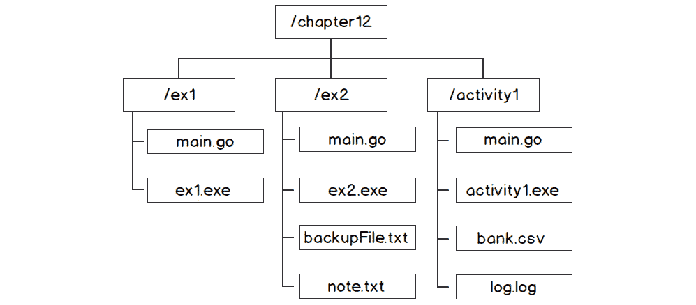
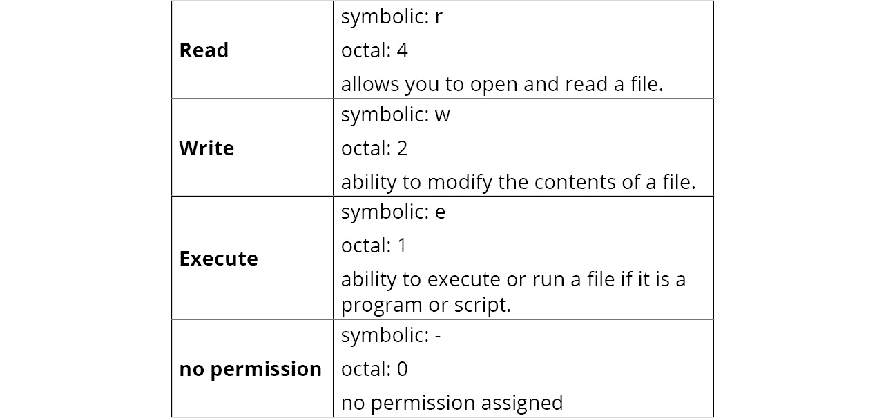
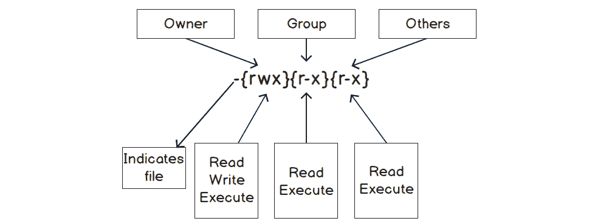
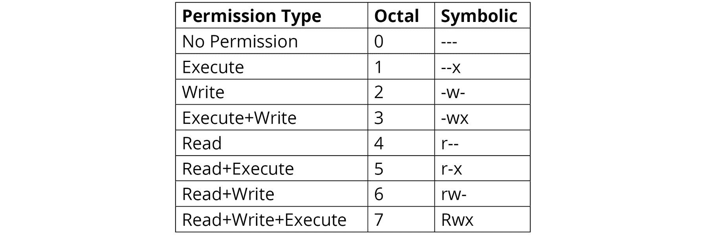
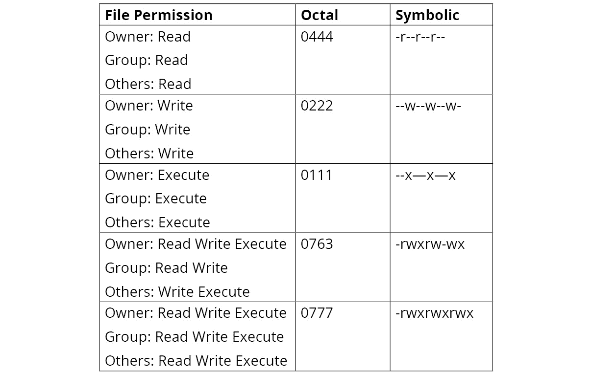
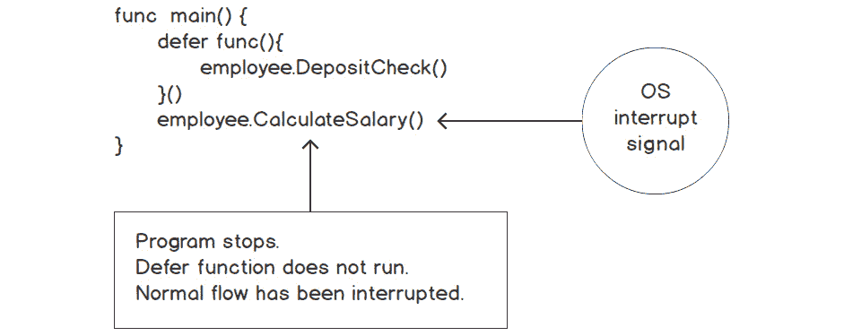
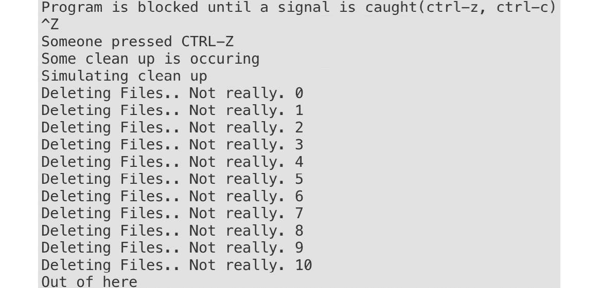
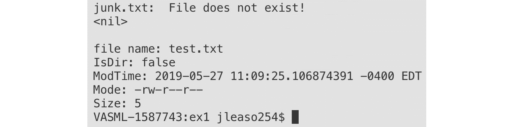

# 12. 文件和系统

概述

本章旨在帮助你了解如何与文件系统交互。这包括创建和修改文件。你还将学习如何检查文件是否存在。我们将向文件写入并保存到磁盘上。然后我们将创建一个接受各种标志和参数的命令行应用程序。我们还将能够捕获信号，并在退出程序之前确定如何处理它们。

在本章中，你将创建接受参数并显示帮助内容的命令行应用程序。到本章结束时，你将能够处理操作系统（OS）发送给应用程序的信号，并在操作系统发送信号立即停止应用程序时控制应用程序的退出。

# 简介

在上一章中，我们探讨了如何序列化和反序列化 JSON。我们能够将我们的结构体设置为 JSON 键值，并将结构体值放入 JSON 中。Go 编程语言对 JSON 的支持非常好，就像它对文件系统类型操作的支持一样好（例如，`open`、`create` 和 `modify` 文件）。

在本章中，我们将与文件系统进行交互。我们将处理的文件系统级别包括文件、目录和权限级别。我们将解决开发者在处理文件系统时面临的日常问题，包括如何编写需要从命令行接受参数的命令行应用程序。我们将学习如何创建一个能够读取和写入文件的命令行应用程序。除了讨论从操作系统接收到信号中断时会发生什么，我们还将演示在应用程序停止运行之前如何执行清理操作。我们还将处理应用程序接收到中断的场景，并处理应用程序退出的方式。有时，当应用程序正在运行时，操作系统会发送一个信号来关闭应用程序。在这种情况下，我们可能希望记录关闭时的信息以供调试；这将帮助我们了解应用程序为何关闭。我们将在本章中探讨如何做到这一点。然而，在我们开始解决这些问题之前，让我们先对文件系统有一个基本的了解。

# 文件系统

文件系统控制数据在硬盘、USB、DVD 或其他介质等设备上的命名、存储、访问和检索方式。每个特定操作系统的文件系统都会指定其命名文件的习惯，例如文件名长度、可以使用特定字符、后缀或文件扩展名的长度等。大多数文件系统都包含一些关于文件的描述符或元数据，例如文件大小、位置、访问权限、创建日期、修改日期等：


图 12.1：文件的文件系统元数据

文件通常被放置在某种层次结构中。这种结构通常由多个目录和子目录组成。文件在目录中的放置是一种组织数据并获得访问文件或目录的方式：



图 12.2：文件系统目录结构

如*图 12.2*所示，顶级目录是`Chapter12`。它包含子目录`ex1`、`ex2`和`activity1`。在这个例子中，这些子目录根据每个练习和活动组织文件。文件系统还负责谁或什么可以访问目录和文件。在下一个主题中，我们将探讨文件权限。

## 文件权限

权限是在处理文件创建和修改时需要理解的重要方面。

我们需要查看可以分配给文件的多种权限类型。我们还需要查看这些权限类型如何以符号和八进制表示法表示。

Go 使用 Unix 命名法来表示权限类型。它们以符号表示法或八进制表示法表示。三种权限类型是*读取*、*写入*和*执行*。

每个权限都有符号和八进制表示法。下表解释了权限类型及其表示方式：



图 12.3：权限

对于每个文件，都有三组个人或组指定了它们的权限：

*所有者*：

+   对于个人来说，这是一个单个人，比如 John Smith 或 root 用户。

*组*：

+   一个组通常由多个个人或其他组组成。

*其他人*：

+   那些不属于组或所有者的。

+   下面的示例展示了 Unix 机器上的一个文件及其权限：

图 12.4：权限集

+   第一个短横线表示这是一个文件；如果它是`d`，则表示这是一个目录。

+   八进制表示法可以用一个数字来显示多个权限类型。例如，如果你想使用符号表示法显示`读取`和`写入`权限，它将是`rw-`。如果这要表示为八进制数字，它将是`6`：


图 12.5：权限类型

下表展示了不同权限类型的数字和符号：



图 12.6：权限类型、八进制和符号

下表是`所有者`、`组`和`其他人`的文件权限示例：



图 12.7：基于所有者、组和其他人的权限

# 标志和参数

Go 提供了创建命令行界面工具的支持。很多时候，当我们编写可执行 Go 程序时，它们需要接受各种输入。这些输入可能包括文件位置、以调试状态运行程序的价值、获取运行程序的帮助等等。所有这些都可以通过 Go 标准库中的一个名为`flag`的包来实现。它用于允许将参数传递给程序。标志是传递给 Go 程序的参数。使用`flag`包传递给 Go 程序的标志顺序对 Go 来说并不重要。

要定义你的`flag`，你必须知道你将接受的`flag`类型。`flag`包提供了许多用于定义标志的函数。以下是一个示例列表：

```go
func Bool(name string, value bool, usage string) *bool
func Duration(name string, value time.Duration, usage string) *time.Duration
func Float64(name string, value float64, usage string) *float64
func Int(name string, value int, usage string) *int
func Int64(name string, value int64, usage string) *int64
func String(name string, value string, usage string) *string
func Uint(name string, value uint, usage string) *uint
func Uint64(name string, value uint64, usage string) *uint64
```

前述函数的参数可以这样解释：

*名称*：

+   此参数是标志的名称；它是一个字符串类型。例如，如果你传递`file`作为参数，你将可以通过以下方式从命令行访问该标志：

    ```go
    app.exe -file
    ```

*值*：

+   此参数是标志默认设置的值。

*用法*：

+   此参数用于描述标志的目的。当您错误地设置值时，它通常会出现在命令行上。

+   为标志传递错误的类型将停止程序并导致错误；将打印用法。

*返回值*：

+   这是存储标志值的变量的地址。

让我们看看一个简单的例子：

```go
package main
import (
  "flag"
  "fmt"
)
func main() {
  v := flag.Int("value", -1, "Needs a value for the flag.")
  flag.Parse()
  fmt.Println(*v)
}
```

以下图表描述了使用标志包时的前一个示例。


图 12.8：flag.Int 参数

我们将回顾图中的代码和前述代码片段。

+   变量`v`将引用`-value`或–`value`的值。

+   在调用`flag.Parse()`之前，`*v`的初始值是`-1`的默认值：

    ```go
    flag.Parse()
    ```

+   在定义标志之后，你必须调用`flag.Parse()`来将命令行解析到定义的标志中。

+   调用`flag.Parse()`将`-value`的参数放入`*v`中。

+   一旦你调用了`flag.Parse()`函数，标志将可用。

+   在命令行上执行以下`go build -o exFlag`命令，你将在名为`exFlag`的目录中获得可执行文件：


图 12.9：应用程序标志和参数

让我们看看以下代码片段中各种类型标志的使用：

```go
package main
import (
  "flag"
  "fmt"
)
func main() {
  i := flag.Int("age", -1, "your age")
  n := flag.String("name", "", "your first name")
  b := flag.Bool("married", false, "are you married?")
  flag.Parse()
  fmt.Println("Name: ", *n)
  fmt.Println("Age: ", *i)
  fmt.Println("Married: ", *b)
}
```

让我们分析前述代码：

+   我们定义了三个`Int`、`String`和`Bool`类型的标志。

+   我们随后调用`flag.Parse()`函数，将这些标志的参数放入相应的引用变量中。

+   然后，我们简单地打印这些值。

+   不带参数运行可执行文件：`./exFlag`

    ```go
    Name:  
    Age:  -1
    Married:  false
    ```

+   不提供参数运行；引用指针的值是我们定义标志类型时分配的默认值：`./exFlag -h`：

    ```go
    Usage of ./exFlag:
      -age int
        your age (default -1)
      -married
        are you married?
      -name string
        your first name
    ```

+   使用 `-h` 标志运行我们的应用程序将打印出我们在定义标志时设置的用法说明：

    `./exFlag -name=John –age 42 -married true results`：

    ```go
    Name:  John
    Age:  42
    Married:  false
    ```

有时候我们可能需要使 `flag` 对命令行应用程序成为必需。当标志是必需的时，仔细选择默认值很重要。你可以检查标志的值是否为默认值，以及它是否退出程序：

```go
package main
import (
  "flag"
  "fmt"
  "os"
)
func main() {
  i := flag.Int("age", -1, "your age")
  n := flag.String("name", "", "your first name")
  b := flag.Bool("married", false, "are you married?")
  flag.Parse()
  if *n == "" {
  fmt.Println("Name is required.")
  flag.PrintDefaults()
  os.Exit(1)
  }
  fmt.Println("Name: ", *n)
  fmt.Println("Age: ", *i)
  fmt.Println("Married: ", *b)
  if *n == "" {
  fmt.Println("Name is required.")
  flag.PrintDefaults()
  os.Exit(1)
  }
}
```

让我们详细回顾一下代码：

+   名称标志的默认值为空字符串。

+   我们检查 `*n` 的值是否为该值。如果是，我们打印一条消息通知用户 `Name` 是必需的。

+   然后我们调用 `flag.PrintDefaults()`；这会将使用说明打印给用户。

+   调用应用程序的结果是 `/exFlag --age 42 -married true`：

```go
Name is required.
  -age int
    your age (default -1)
  -married
    are you married?
  -name string
    your first name
```

## 信号

+   什么是信号？在我们的上下文中，信号是由操作系统发送到我们的程序或进程的中断。当信号被发送到我们的程序时，程序将停止正在做的事情；要么处理信号，要么如果可能的话，忽略它。我们已经看到了其他改变程序流程的 Go 命令；你可能想知道该使用哪一个。

我们在我们的应用程序中使用 `defer` 语句执行各种清理活动，如下所示：

+   资源的释放

+   文件的关闭

+   数据库连接的关闭

+   执行配置文件或临时文件的删除

在某些用例中，完成这些活动是强制性的。使用 `defer` 函数将在返回给调用者之前执行它。然而，这并不保证它总是会运行。在某些场景中，`defer` 函数不会执行；例如，操作系统对程序的干扰：

+   `os.Exit(1)`

+   *Ctrl* + *C*

+   来自操作系统的其他指令

+   前面的场景表明了可能需要使用信号的情况。信号可以帮助我们控制程序的退出。根据信号的不同，它可能会终止我们的程序。例如，应用程序正在运行，并在执行 `employee.CalculateSalary()` 后遇到操作系统的中断信号。在这种情况下，`defer` 函数将不会运行，因此，`employee.DepositCheck()` 不会执行，员工将不会收到工资。信号可以改变程序的流程。以下图表概述了我们之前讨论的场景：

图 12.10：信号改变程序的流程

+   Go 标准库内置了对信号处理的支撑；它位于 `os/signal` 包中。这个包将使我们能够使我们的程序更加健壮。当我们收到某些信号时，我们希望优雅地关闭程序。在 Go 中处理信号的第一件事是拦截或捕获你感兴趣的信号。这是通过以下方式完成的：

```go
func Notify(c chan<- os.Signal, sig ...os.Signal)
```

+   `Notify()`函数接受一个通道上的`os.Signal`数据类型，`c`。`sig`参数是一个可变参数的`os.Signal`；我们指定零个或多个我们感兴趣的`os.Signal`数据类型。

+   以下是一个处理`syscall.SIGINT`中断的示例，类似于`CTRL-C`：

```go
package main
import (
  "fmt"
  "os"
  "os/signal"
  "syscall"
)
func main() {
  sigs := make(chan os.Signal, 1)
  done := make(chan bool)
  signal.Notify(sigs,syscall.SIGINT)
  go func() {
  for {
    s := <-sigs
    switch s {
    case syscall.SIGINT:
    fmt.Println()
    fmt.Println("My process has been interrupted.  Someone might of pressed CTRL-  C")
    fmt.Println("Some clean up is occuring")
    done <- true    
    }
  }
  }()
  fmt.Println("Program is blocked until a signal is caught")
  <-done
  fmt.Println("Out of here")
}
```

+   让我们详细看看前面的代码片段：

    ```go
    sigs := make(chan os.Signal, 1)
    ```

+   我们创建了一个`os.Signal`类型的通道。`Notify`方法通过向通道发送`os.Signal`类型的值来工作。`sigs`通道用于接收`Notify`方法的通知：

    ```go
    done := make(chan bool)
    ```

+   `done`通道用于让我们知道程序何时可以退出：

    ```go
    signal.Notify(sigs,syscall.SIGINT)
    ```

+   `signal.Notify`方法将在`syscall.SIGINT`类型的`sigs`通道上接收通知：

    ```go
      go func() {
      for {
        s := <-sigs
        switch s {
        case syscall.SIGINT:
        fmt.Println("My process has been interrupted.  Someone might of pressed   CTRL-C")
        fmt.Println("Some clean up is occurring")
        done <- true    
        }
      }
    ```

+   我们创建一个匿名函数，该函数是一个 goroutine。这个函数目前只有一个 case 语句，它会阻塞，直到接收到`syscall.SIGINT`类型。

+   它将打印出各种消息。

+   我们向`done`通道发送`true`以指示我们已接收到信号。这将停止通道阻塞：

    ```go
      fmt.Println("Program is blocked until a signal is caught")
      <-done
      fmt.Println("Out of here")
    ```

+   `<-done`通道将阻塞，直到我们的程序接收到信号。

+   这里是结果：

    ```go
    Program is blocked until a signal is caught
    ^C
    My process has been interrupted.  Someone might of pressed CTRL-C
    Some clean up is occurring
    Out of here
    ```

## 练习 12.01：模拟清理

在这个练习中，我们将捕获两个信号：`SIGINT`和`SIGTSTP`。一旦捕获到这些信号，我们将模拟清理文件。我们还没有讲解如何删除文件，所以在这个例子中，我们将简单地创建一个延迟来演示我们如何在捕获到信号后运行一个函数。这是这个练习期望的输出：

1.  创建一个名为`main.go`的文件。

1.  在文件中添加包`main`和以下导入语句：

    ```go
    package main
    import (
      "fmt"
      "os"
      "os/signal"
      "syscall"
      "time"
    )
    ```

1.  在`main()`函数中，创建一个`os.Signal`类型的通道。`sigs`通道用于接收`Notify`方法的通知：

    ```go
    func main() {
      sigs := make(chan os.Signal, 1)
    ```

1.  接下来，添加一个`done`通道。`done`通道用于让我们知道程序何时可以退出：

    ```go
      done := make(chan bool)
    ```

1.  然后我们将添加一个`signal.Notify`方法。`Notify`方法通过向通道发送`os.Signal`类型的值来工作。

1.  回想一下，`signal.Notify`方法的最后一个参数是可变参数的`os.Signal`类型。

1.  `signal.Notify`方法将在通道`sigs`上接收`syscall.SIGINT`和`syscall.SIGTSTP`类型的通知。

1.  通常来说，当您按下*Ctrl* + *C*时，可能会发生`syscall.SIGINT`类型。

1.  通常来说，当您按下*Ctrl* + *Z*时，可能会发生`syscall.SIGTSTP`类型：

    ```go
      signal.Notify(sigs, syscall.SIGINT, syscall.SIGTSTP)
    ```

1.  创建一个匿名函数作为 goroutine：

    ```go
      go func() {
    ```

1.  在 goroutine 内部，创建一个无限循环。

1.  在无限循环内部，我们将从`sigs`通道接收一个值并将其存储在`s`变量中，`s := <-sigs`：

    ```go
        for {
          s := <-sigs
    ```

1.  创建一个`switch`语句来评估从通道接收到的内容。

1.  我们将有两个 case 语句来检查`syscall.SIGINT`和`syscall.SIGTSP`类型。

1.  每个 case 语句都会打印一条消息。

1.  我们还将调用我们的`cleanup()`函数。

1.  在 case 语句中的最后一个语句是将`true`发送到`done`通道以停止阻塞：

    ```go
          switch s {
          case syscall.SIGINT:
            fmt.Println()
            fmt.Println("My process has been interrupted.  Someone might of pressed CTRL-C")
            fmt.Println("Some clean up is occuring")
            cleanUp()
            done <- true
          case syscall.SIGTSTP:
            fmt.Println()
            fmt.Println("Someone pressed CTRL-Z")
            fmt.Println("Some clean up is occuring")
            cleanUp()
            done <- true
          }
        }
      }()
      fmt.Println("Program is blocked until a signal is caught(ctrl-z, ctrl-c)")
      <-done
      fmt.Println("Out of here")
    }
    ```

1.  创建一个简单的函数来模拟执行清理过程的进程：

    ```go
    func cleanUp() {
      fmt.Println("Simulating clean up")
      for i := 0; i <= 10; i++ {
        fmt.Println("Deleting Files.. Not really.", i)
        time.Sleep(1 * time.Second)
      }
    }
    ```

1.  你可以尝试运行这个程序，然后按*Ctrl + Z*和*Ctrl + C*来检查程序的不同结果。这仅在 Linux 和 macOS 上有效：

1.  现在运行代码：

    ```go
    go run main.go
    ```

    以下是对应的输出：



图 12.11：模拟清理输出

在这个练习中，我们展示了拦截中断并在应用程序关闭前执行任务的能力。我们有能力控制我们的退出。这是一个强大的功能，允许我们执行清理操作，包括删除文件、进行最后的日志记录、释放内存等。在下一个主题中，我们将创建并写入文件。我们将使用来自 Go 标准包`os`的函数。

# 创建和写入文件

Go 语言以各种方式提供支持来创建和写入新文件。我们将检查一些最常见的方法。

`os`包提供了一个简单的方式来创建文件。对于那些熟悉 Unix 世界中的`touch`命令的人来说，它与此类似。以下是该函数的签名：

```go
func Create(name string(*File, error)
```

该函数将创建一个空文件，就像`touch`命令一样。重要的是要注意，如果它已经存在，那么它将截断该文件。

`os`包中的`Create`函数的输入参数是你要创建的文件名和位置。如果成功，它将返回一个`File`类型。值得注意的是，`File`类型满足`io.Write`和`io.Read`接口。这一点在章节的后面很重要：

```go
package main
import (
  "fmt"
  "os"
)
func main() {
  f, err := os.Create("test.txt")
  if err != nil {
  panic(err)
  }
  defer f.Close()
}
```

+   上述代码只是创建了一个空文件：

    ```go
    f, err := os.Create("test.txt")
    ```

+   它创建了一个名为 test.txt 的文件。

+   如果已经存在同名文件，则它将截断该文件。

+   由于我们没有提供文件的位置，它将在我们的可执行文件所在的目录中创建文件：

    ```go
      if err != nil {
      fmt.Println(err)
      }
    ```

+   我们随后检查`os.Create`函数的错误。立即检查错误是一个好习惯，因为如果发生了错误而我们没有检查错误，这将使我们在程序中稍后调试变得困难。

+   如果出现错误，我们会感到恐慌。最好是恐慌后退出，因为如果你在一个带有 defer 函数的函数中执行 os.Exit(1)，defer 函数将不会运行。

+   如果确实发生了错误，那么它将是*PathError 类型。例如，假设我们给`os.Create`函数提供了一个错误的路径，比如/lol/test.txt。我们会得到以下错误：

    ```go
    open /lol/test.txt: no such file or directory
    ```

创建一个空文件很简单，但让我们继续使用`os.Create`并写入我们刚刚创建的文件。回想一下，`os.Create`返回一个`*os.File`类型。有两个感兴趣的方法可以用来写入文件：

+   `Write`

+   `WriteString`：

    ```go
    package main
    import (
      "os"
    )
    func main() {
      f, err := os.Create("test.txt")
      if err != nil {
      panic(err)
      }
      defer f.Close()
      f.Write([]byte("Using Write function.\n"))
      f.WriteString("Using Writestring function.\n")
    }
    ```

    让我们更详细地看看前面的代码：

    ```go
    func (f *File) Write(b []byte) (n int, err error)
    ```

+   `Write` 方法接受一个字节数组切片，并在有错误时返回写入的字节数和错误。此方法还允许 `os.File` 类型满足 `io.Write` 接口：

    ```go
    f.Write([]byte("Using Write function.\n"))
    ```

+   我们将字符串 `"Using Write function.\n"` 转换为字节数组切片。

+   然后，我们将它写入我们的 `test.txt` 文件。`Write` 方法接受 `[]byte` 类型：

    ```go
    f.WriteString("Using Writestring function.\n")
    ```

+   `WriteString` 方法的行为与 `Write` 方法相同，不同之处在于它接受一个字符串作为输入参数，而不是 `[]byte` 数据类型。

    Go 提供了在单个命令中创建和写入文件的能力。我们将利用 Go 的 `io/ioutil` 包来完成此任务。`ioutil.WriteFile` 方法是一个非常方便的方法，它提供了这种能力：

    ```go
    func WriteFile(filename string, data []byte, perm os.FileMode) error
    ```

    该方法将数据写入由文件名参数指定的文件，并使用给定的权限。如果存在错误，它将返回错误。让我们看看它是如何工作的：

    ```go
    package main
    import (
      "fmt"
      "io/ioutil"
    )
    func main() {
      message := []byte("Look!")
      err := ioutil.WriteFile("test.txt", message, 0644)
      if err != nil {
        fmt.Println(err)
      }
    }
    ```

    让我们逐部分理解这段代码：

    ```go
    err := ioutil.WriteFile("test.txt", message, 0644)
    ```

+   `WriteFile` 方法会将 `[]byte` 类型的变量消息写入 `test.txt` 文件。

+   如果 `test.txt` 文件不存在，它将以 `0644` 权限创建 `test.txt` 文件。所有者将具有读写权限，组和其他用户将具有读权限。

+   如果文件存在，它将截断文件。

`os.Create` 和 `ioutil.WriteFile` 都会在文件存在时截断文件。这可能不是我们总是希望的行为。有时我们希望在创建文件或尝试读取文件之前检查文件是否存在。幸运的是，Go 提供了一个简单的机制来检查文件是否存在：

注意

```go
junk.txt file to not exist. It also requires the test.txt file to exist in the same directory as the program's executable.
package main
import (
  "fmt"
  "os"
)
func main() {
  file, err := os.Stat("junk.txt")
  if err != nil {
  if os.IsNotExist((err)) {
    fmt.Println("junk.txt:  File does not exist!")
    fmt.Println(file)
  }
  }
  fmt.Println()
  file, err = os.Stat("test.txt")
  if err != nil {
  if os.IsNotExist((err)) {
    fmt.Println("test.txt:  File does not exist!")
  }
  }
  fmt.Printf("file name: %s\nIsDir: %t\nModTime: %v\nMode: %v\nSize: %d\n", file.Name(), file.IsDir(), file.ModTime(), file.Mode(), file.Size())
}
```

让我们更详细地看看前面的代码片段：

```go
file, err := os.Stat("junk.txt")
```

+   我们正在对 `junk.txt` 文件调用 `os.Stat()` 来检查它是否存在。如果文件存在，`os.Stat()` 方法将返回 `FileInfo` 类型。如果不存在，`FileInfo` 将是 `nil`，并且将返回错误：

    ```go
      if err != nil {
      if os.IsNotExist((err)) {
        fmt.Println("junk.txt:  File does not exist!")
        fmt.Prinln(file)
      }
      }
    ```

+   `os.Stat()` 方法可以返回多个错误。我们必须检查错误以确定错误是否是由于文件不存在。标准库提供了 `os.IsNotExist(error)`，可以用来检查错误是否是由于文件不存在。以下是结果：

    ```go
    IsNotExist returns a boolean indicating whether the error is known to report that a file or a directory does not exist. It is satisfied by ErrNotExist as well as some syscall errors.
    func os.IsNotExist(err error) bool
    ```

+   在这种情况下，打印 `file(FileInfo)` 将会是 `nil`，因为 `junk.txt` 文件不存在：

    ```go
    file, err = os.Stat("test.txt")
    ```

+   在这种情况下，`test.txt` 文件确实存在，所以 `err` 将是 `nil`，并且文件将包含 `FileInfo` 类型：

    ```go
      fmt.Printf("file name: %s\nIsDir: %t\nModTime: %v\nMode: %v\nSize: %d\n",     file.Name(), file.IsDir(), file.ModTime(), file.Mode(), file.Size())
    }
    ```

+   `FileInfo` 类型包含各种信息，了解这些信息可能很有用。

+   在 `FileInfo` 接口中可以找到以下详细信息，请参阅 [`golang.org/src/os/types.go?s=479:840#L11`](https://golang.org/src/os/types.go?s=479:840#L11)：

    ```go
    // A FileInfo describes a file and is returned by Stat and Lstat.
      type FileInfo interface {
      Name() string     // base name of the file
      Size() int64    // length in bytes for regular files; system-dependent for others
      Mode() FileMode   // file mode bits
      ModTime() time.Time // modification time
      IsDir() bool    // abbreviation for Mode().IsDir()
      Sys() interface{}   // underlying data source (can return nil)
      }
    ```

+   这里是执行代码的结果：



图 12.12: os.Stat

## 一次性读取整个文件

在这个主题中，我们将探讨两种读取文件所有内容的方法。当文件大小较小时，这两个函数是很好的选择。虽然这两个方法方便且易于使用，但它们有一个主要的缺点。那就是，如果文件大小太大，可能会耗尽系统内存。这一点很重要，需要记住，并理解我们将在这个主题中讨论的两个方法的限制。尽管这些方法是最快和最简单加载数据的方式之一，但重要的是要理解它们应该仅限于小文件，而不是大文件。

我们将要检查的第一个读取文件的方法如下：

```go
func ReadFile(filename string) ([]byte, error)
```

`ReadFile` 函数读取文件内容，并以字节切片的形式返回它，同时报告任何错误。我们将查看当使用 `ReadFile` 方法时的错误返回值：

+   一个成功的调用返回 `err == nil`。

+   在一些其他文件读取方法中，EOF 被视为错误。对于将整个文件读入内存的函数来说，情况并非如此：

    ```go
    package main
    import (
      "fmt"
      "io/ioutil"
    )
    func main() {
      content, err := ioutil.ReadFile("test.txt")
      if err != nil {
      fmt.Println(err)
      }
      fmt.Println("File contents: ")
      fmt.Println(string(content))
    }
    ```

+   对于这个代码片段，我有一个 `test.txt` 文件，它位于我的可执行文件相同的目录中。它包含以下内容：

![图 12.13：示例文本文件]

![图片 B14177_12_13.jpg]

![图 12.13：示例文本文件]

```go
content, err := ioutil.ReadFile("test.txt")
```

+   `text.txt` 的内容被分配为字节切片到变量 `content` 中。如果有任何错误，它们将被存储在 `err` 变量中：

    ```go
      fmt.Println("File contents: ")
      fmt.Println(string(content))
    ```

+   由于这是一个字节切片，必须将其转换为字符串格式以便于阅读。以下是打印语句的结果：

![图 12.14：示例输出]

![图片 B14177_12_14.jpg]

![图 12.14：示例输出]

我们将要查看的下一个函数是读取整个内容到内存的以下函数：

```go
func ReadAll(r io.Reader) ([]byte, error)
```

与 `ReadFile` 方法不同，`ReadAll` 方法接受 `io.Reader` 作为参数。这是 `ReadFile` 和 `ReadAll` 行为之间唯一的真正区别：

```go
package main
import (
  "fmt"
  "io/ioutil"
  "os"
  "strings"
)
func main() {
  f, err := os.Open("test.txt")
  if err != nil {
  fmt.Println(err)
  os.Exit(1)
  }
  content, err := ioutil.ReadAll(f)
  if err != nil {
  fmt.Println(err)
  os.Exit(1)
  }
  fmt.Println("File contents: ")
  fmt.Println(string(content))
  r := strings.NewReader("No file here.")
  c, err := ioutil.ReadAll(r)
  if err != nil {
  fmt.Println(err)
  os.Exit(1)
  }
  fmt.Println()
  fmt.Println("Contents of strings.NewReader: ")
  fmt.Println(string(c))
}
```

让我们逐部分理解代码：

```go
f, err := os.Open("test.txt")
```

+   `ioutil.ReadAll` 方法需要一个 `io.Reader` 作为参数。`os.Open` 方法返回一个 `*os.File` 类型，它满足 `io.Reader` 接口：

    ```go
      content, err := ioutil.ReadAll(f)
      if err != nil {
      fmt.Println(err)
      os.Exit(1)
      }
    ```

+   内容存储了从 `ioutil.ReadAll(f)` 方法结果中获取的 `[]byte` 数据。如果有任何错误，它们将被存储在 `err` 变量中：

    ```go
      fmt.Println("File contents: ")
      fmt.Println(string(content))
    ```

+   由于这是一个字节切片，必须将其转换为字符串格式以便于阅读。打印语句的结果如下：

![图 12.15：示例输出]

![图片 B14177_12_15.jpg]

![图 12.15：示例输出]

```go
r := strings.NewReader("No file here.")
```

+   由于 `ioutil.ReadAll` 方法接受接口，这为我们提供了更多的灵活性。如果您还记得 *第七章，接口*，当使用接口时，它允许更多的灵活性和使用：

+   我们使用 `strings.NewReader`，它接受一个字符串并返回一个实现 `io.Reader` 接口的 `Reader` 类型。这允许我们在没有文件的情况下使用 `ioutil.ReadAll()` 方法。通过这样做，我们可以在尚未提供文件时对数据进行各种测试：

    ```go
    c, err := ioutil.ReadAll(r)
    ```

+   我们可以使用 `ioutil.Readall` 方法以与 `os.Open()` 相同的方式使用 `strings.Reader()` 的结果：

    ```go
      fmt.Println()
      fmt.Println("Contents of strings.NewReader: ")
      fmt.Println(string(c))
    ```

+   以下是打印语句的结果：


图 12.16：strings.NewReader 内容

我们已经看到了各种写入文件、创建文件和从文件中读取的方法。然而，我们还没有看到如何向文件中追加数据。有时你可能想要向文件追加额外的信息。`os.OpenFile()` 方法提供了这种能力。大多数时候，你将使用 `Create` 或 `Open` 来进行打开或创建过程；然而，当你想要向文件追加数据时，你需要使用 `OpenFile`。该方法的签名如下：

```go
func OpenFile(name string, flag int, perm FileMode) (*File, error)
```

唯一一个独特的参数是 `flag` 参数。这个参数用于确定打开文件时允许执行的操作；它不要与 `FileMode` 类型混淆，后者是权限类型可以分配给文件本身的。

这里是可用于打开文件的一些标志列表（[`golang.org/src/pkg/os/file.go`](http://golang.org/src/pkg/os/file.go)）：

```go
// Flags to OpenFile wrapping those of the underlying system. Not all
// flags may be implemented on a given system.
const (
// Exactly one of O_RDONLY, O_WRONLY, or O_RDWR must be specified.
  O_RDONLY int = syscall.O_RDONLY // open the file read-only.
  O_WRONLY int = syscall.O_WRONLY // open the file write-only.
  O_RDWR   int = syscall.O_RDWR   // open the file read-write.
  // The remaining values may be or'ed in to control behavior.
  O_APPEND int = syscall.O_APPEND // append data to the file when writing.
  O_CREATE int = syscall.O_CREAT  // create a new file if none exists.
  O_EXCL   int = syscall.O_EXCL   // used with O_CREATE, file must not exist.
  O_SYNC   int = syscall.O_SYNC   // open for synchronous I/O.
  O_TRUNC  int = syscall.O_TRUNC  // truncate regular writable file when opened.
 )
```

这些标志可以在打开文件时以各种组合使用。让我们看看一些使用标志的例子：

```go
package main
import (
  "os"
)
func main() {
  f, err := os.OpenFile("junk101.txt", os.O_CREATE, 0644)
  if err != nil {
  panic(err)
  }
  defer f.Close()
}
```

让我们看看前一个例子中的 `os.OpenFile`：

```go
f, err := os.OpenFile("junk101.txt", os.O_CREATE, 0644)
```

+   使用带有 `os.O_CREATE` 文件模式的 `os.OpenFile` 将在文件不存在时创建 `junk101.txt` 文件并打开它。

让我们看看使用 `os.OpenFile` 的不同文件模式的一个例子：

```go
package main
import (
  "os"
)
func main() {
  f, err := os.OpenFile("junk101.txt", os.O_CREATE|os.O_WRONLY, 0644)
  if err != nil {
  panic(err)
  }
  defer f.Close()
  if _, err := f.Write([]byte("adding stuff\n")); err != nil {
  panic(err)
  }
}
```

让我们更详细地看看前面的代码。

```go
f, err := os.OpenFile("junk101.txt", os.O_CREATE| os.O_WRONLY, 0644)
```

+   使用带有 `os.O_CREATE` 标志的 `os.OpenFile` 将在文件不存在时创建 `junk101.txt` 文件并打开它。如果它已经存在，它将只打开文件。由于 `os.O_WRONLY` 标志，它还将允许在文件打开时进行读写操作：

    ```go
      if _, err := f.Write([]byte("adding stuff\n")); err != nil {
      panic(err)
      }
    ```

+   由于我们使用了 `os.O_WRONLY` 标志，我们可以在文件打开时写入它。

让我们看看如何向文件追加数据的一个例子：

```go
package main
import (
  "os"
)
func main() {
  f, err := os.OpenFile("junk.txt", os.O_APPEND|os.O_CREATE|os.O_WRONLY, 0644)
  if err != nil {
    panic(err)
  }
  defer f.Close()
  if _, err := f.Write([]byte("adding stuff\n")); err != nil {
    panic(err)
  }}
f, err := os.OpenFile("junk101.txt", os.O_APPEND | os.O_CREATE| os.O_WRONLY,   0644)
```

+   使用带有 `os.O_CREATE` 标志的 `os.OpenFile` 将在文件不存在时创建 `junk101.txt` 文件并打开它。如果它已经存在，它将只打开文件：

+   由于 `os.O_WRONLY` 标志，它还将允许在文件打开时进行读写操作。

+   `os.O_APPEND` 将允许你将数据追加到文件底部：

    ```go
      if _, err := f.Write([]byte("adding stuff\n")); err != nil {
      panic(err)
      }
    ```

+   由于我们使用了 `os.O_WRONLY` 标志，我们可以在文件打开时写入它。

由于我们包含了 `os.O_APPEND` 标志，数据将被追加到文件底部，而不是覆盖现有数据。以下是一些常见的权限标志组合，可用于 `os.OpenFile`：

**os.O_CREATE**

+   如果文件不存在，它将在尝试打开时创建文件。

**os.O_CREATE | os.O_WRONLY**

+   当打开文件时，你现在可以写入它。

+   文件中的任何数据都将被覆盖。

**os.O_CREATE | os.O_WRONLY | os.O_APPEND**

+   当写入文件时，它不会覆盖数据，而是将数据追加到文件末尾。

## 练习 12.02：备份文件

在处理文件时，我们通常需要在对其进行更改之前备份文件。这是在可能犯错或需要原始文件进行审计目的的情况下。在本练习中，我们将取一个名为`note.txt`的现有文件，并将其备份到`backupFile.txt`。然后我们将打开`note.txt`并在文件末尾添加一些额外的笔记。我们的目录将包含以下文件：


图 12.17：将文件备份到目录

1.  我们必须首先在可执行文件相同的目录中创建`note.txt`文件。此文件可以是空的，也可以包含一些示例数据，如下所示：

    图 12.18：notes.txt 文件内容示例

1.  创建一个名为`main.go`的 Go 文件。

1.  此程序将是`main`包的一部分。

1.  包含以下代码中的导入：

    ```go
    package main
    import (
      "errors"
      "fmt"
      "io/ioutil"
      "os"
      "strconv"
    )
    ```

1.  创建一个用于当工作文件（`note.txt`）未找到时使用的自定义错误：

    ```go
    var (
      ErrWorkingFileNotFound = errors.New("The working file is not found.")
    )
    ```

1.  创建一个执行备份操作的函数。此函数负责将工作文件的内容存储到`backup`文件中。此函数接受两个参数。`working`参数是你当前正在工作的文件的文件路径：

    ```go
    func createBackup(working, backup string) error {
    }
    ```

1.  在此函数内部，我们需要检查工作文件是否存在。在我们可以读取其内容并将其存储在我们的备份文件中之前，它必须首先存在。

1.  我们可以使用`os.IsNotExist(err)`来检查错误是否是文件不存在的情况。

1.  如果文件不存在，我们将返回我们的自定义错误：`ErrWorkingFileNotFound`：

    ```go
      // check to see if our working file exists,
      // before backing it up
      _, err := os.Stat(working)
      if err != nil {
      if os.IsNotExist(err) {
        return ErrWorkingFileNotFound
      }
      return err
      }
    ```

1.  接下来，我们需要打开工作文件并将函数返回的`os.File`存储到`workFile`变量中：

    ```go
    workFile, err := os.Open(working)
      if err != nil {
      return err
      }
    ```

1.  我们需要读取`workFile`的内容。我们将使用`ioutil.ReadAll`方法获取`workFile`的所有内容。`workFile`是`os.File`类型，它满足`io.Reader`接口；这允许我们将其传递给`ioutil.ReadFile`。

1.  检查是否有错误：

    ```go
      content, err := ioutil.ReadAll(workFile)
      if err != nil {
      return err
      }
    ```

1.  `content`变量包含`workFile`的数据，表示为字节数组。这些数据需要写入备份文件。我们将实现将`content`变量的数据写入备份文件的代码。

1.  内容存储从函数返回的`[]byte`数据。这是存储在变量中的整个文件内容。

1.  我们可以使用`ioutil.Writefile`方法。如果备份文件不存在，它将创建文件。如果备份文件已存在，它将使用`content`变量数据覆盖文件：

    ```go
      err = ioutil.WriteFile(backup, content, 0644)
      if err != nil {
      fmt.Println(err)
      }
    ```

1.  我们需要返回`nil`，表示在此阶段，我们没有遇到任何错误：

    ```go
      return nil
    }
    ```

1.  创建一个函数，用于将数据追加到我们的工作文件中。

1.  将函数命名为 `addNotes`；这将接受我们的工作文件位置和一个将被追加到工作文件的字符串参数。该函数需要返回一个错误：

    ```go
    func addNotes(workingFile, notes string) error {
    //…
      return nil
    }
    ```

1.  在 `addNotes` 函数内部，添加一行代码，将新行追加到每个笔记的字符串中。这将使每个笔记单独占一行：

    ```go
    func addNotes(workingFile, notes string) error {
      notes += "\n"
      //…
      return nil
    }
    ```

1.  接下来，我们将打开工作文件并允许向文件追加内容。`os.OpenFile()` 函数将在文件不存在时创建该文件。检查任何错误：

    ```go
    func addNotes(workingFile, notes string) error {
      notes += "\n"
      f, err := os.OpenFile(workingFile, os.O_APPEND|os.O_CREATE|os.O_WRONLY, 0644)
      if err != nil {
      return err
      }
    // …
      return nil
    }
    ```

1.  在打开文件并检查错误后，我们应该确保使用 `defer` 函数，`f.Close()`，在函数退出时关闭文件：

    ```go
    func addNotes(workingFile, notes string) error {
      notes += "\n"
      f, err := os.OpenFile(workingFile, os.O_APPEND|os.O_CREATE|os.O_WRONLY, 0644)
      if err != nil {
      return err
      }
      defer f.Close()
    //…
      return nil
    }
    ```

1.  函数的最终步骤是将笔记的内容写入 `workingFile` 变量。我们可以使用 `Write` 方法来完成此操作：

    ```go
    func addNotes(workingFile, notes string) error {
      notes += "\n"
      f, err := os.OpenFile(workingFile, os.O_APPEND|os.O_CREATE|os.O_WRONLY, 0644)
      if err != nil {
      return err
      }
      defer f.Close()
      if _, err := f.Write([]byte(notes)); err != nil {
      return err
      }
      return nil
    }
    ```

1.  在 `main()` 函数中，我们将初始化三个变量；`backupFile` 变量包含备份我们的 `workingFile` 变量的文件名，而 `data` 变量是我们将要写入 `workingFile` 变量的内容：

    ```go
    func main() {
      backupFile := "backupFile.txt"
      workingFile := "note.txt"
      data := "note"
    ```

1.  调用我们的 `createBackup()` 函数来备份我们的 `workingFile`。在调用函数后检查错误：

    ```go
      err := createBackup(workingFile, backupFile)
      if err != nil {
      fmt.Println(err)
      os.Exit(1)
      }
    ```

1.  创建一个循环，该循环将迭代 `10` 次。

1.  在每次迭代中，我们将我们的 `note` 变量设置为 `data` 变量加上我们的循环的 `i` 变量。

1.  由于我们的 `note` 变量是字符串，而我们的 `i` 变量是 `int` 类型，因此我们需要使用 `strconv.Itoa(i)` 方法将 `i` 转换为字符串。

1.  调用我们的 `addNotes()` 函数，并传递 `workingFile` 和我们的 `note` 变量。

1.  检查函数返回的任何错误：

    ```go
      for i := 1; i <= 10; i++ {
      note := data + " " + strconv.Itoa(i)
      err := addNotes(workingFile, note)
      if err != nil {
        fmt.Println(err)
        os.Exit(1)
      }
      }
    }
    ```

1.  运行程序：

    ```go
    go run main.go
    ```

1.  评估程序运行后文件的变化。

    以下是程序运行后的结果：

    

图 12.19：备份文件的结果

# CSV

文件结构最常见的方式之一是逗号分隔值。这是一个包含数据的纯文本文件，基本上表示为行和列。通常，这些文件用于交换数据。CSV 文件具有简单的结构。每条数据由逗号分隔，然后是新的一行用于另一个记录。以下是一个 CSV 文件的示例：

```go
firstName, lastName, age
Celina, Jones, 18
Cailyn, Henderson, 13 
Cayden, Smith, 42
```

+   在你的生活中，你会在某个时候遇到 CSV 文件，因为它们非常常见。Go 编程语言有一个用于处理 CSV 文件的标准化库：`encoding/csv`：

```go
package main
import (
  "encoding/csv"
  "fmt"
  "io"
  "log"
  "strings"
)
func main() {
  in := `firstName, lastName, age
Celina, Jones, 18
Cailyn, Henderson, 13 
Cayden, Smith, 42
`
  r := csv.NewReader(strings.NewReader(in))
  for {
  record, err := r.Read()
  if err == io.EOF {
    break
  }
  if err != nil {
    log.Fatal(err)
  }
  fmt.Println(record)
  }
}
```

以下创建了一个 `reader` 类型并返回它：

```go
r := csv.NewReader(strings.NewReader(in))
```

`NewReader` 方法接受一个 `io.Reader` 参数，并返回一个用于读取 CSV 数据的 `Reader` 类型：

```go
for {
  record, err := r.Read()
  if err == io.EOF {
    break
  }
```

在这里，我们正在无限循环中逐个读取每个记录。在读取每个记录后，我们首先检查它是否是文件的末尾（`io.EOF`）；如果是，则退出循环。`r.Read()` 函数读取一个记录；它是 `r` 变量的字符串切片。它返回一个 `[]string` 类型的记录。

这里是打印记录的结果：


图 12.20：CSV 示例输出

你认为是否有办法访问每个单独的值？目前，我们只看了如何打印每一行。然而，在某些情况下，我们可能只想访问年龄或名字。下一个示例将展示我们如何做到这一点：

```go
package main
import (
  "encoding/csv"
  "fmt"
  "io"
  "log"
  "strings"
)
func main() {
  in := `firstName, lastName, age
Celina, Jones, 18
Cailyn, Henderson, 13 
Cayden, Smith, 42
`
  r := csv.NewReader(strings.NewReader(in))
  header := true
  for {
  record, err := r.Read()
  if err == io.EOF {
    break
  }
  if err != nil {
    log.Fatal(err)
  }
  if !header {
    for idx, value := range record {
    switch idx {
    case 0:
      fmt.Println("First Name: ", value)
    case 1:
      fmt.Println("Last Name: ", value)
    case 2:
      fmt.Println("Age: ", value)
    }
    }
  }
  header = false
  }
}
```

我们将在本例中讨论代码的新部分：

`header := true`

我们将使用`header`变量作为标志。它将帮助我们解析 CSV 数据的标题：

```go
  for {
```

无限循环将在到达文件末尾时停止：

```go
  record, err := r.Read()
  if err == io.EOF {
```

`r.Read()`函数读取单个记录并返回一个包含该记录字段的字符串切片：

```go
    break
  }
  // Code omitted for brevity  
```

如果是文件末尾，则跳出无限循环。

```go
  if !header {
```

接下来，检查这是否是循环的第一个迭代。如果是循环的第一个迭代，那么第一行将是字段的标题；我们不希望解析标题：

```go
    for idx, value := range record {
```

遍历记录中的字段：

```go
    switch idx {  
    }
```

使用`switch`语句执行每个字段的特定解析：

```go
    }
  }
  header = false
  }
```

初始设置为`true`，在第一次通过循环后，可以将其设置为`false`。标题通常是文件的第一行。

输出如下：


图 12.21：解析 CSV 字段的输出

## 活动十二.01：解析银行交易文件

在这个活动中，我们将从银行获取交易文件。该文件是一个 CSV 文件。我们的银行还包括文件中交易的预算类别。文件如下：

```go
id,payee,spent,category
1, sheetz, 32.45, fuel
2, martins,225.52,food
3, wells fargo, 1100, mortgage
4, joe the plumber, 275, repairs
5, comcast, 110, tv
6, bp, 40, fuel
7, aldi, 120, food
8, nationwide, 150, car insurance
9, nationwide, 100, life insurance
10, jim electric, 140, utilities
11, propane, 200, utilities
12, county water, 100, utilities
13, county sewer, 105, utilities
14, 401k, 500, retirement
```

本活动的目的是创建一个命令行程序，该程序将接受两个标志：CSV 银行交易文件的位置和日志文件的位置。在应用程序开始解析 CSV 文件之前，我们将检查日志和银行文件位置是否有效。程序将解析 CSV 文件，并将遇到的任何错误记录到日志中。每次程序重启时，它还将删除之前的日志文件。

按照以下步骤完成活动：

1.  我们需要为`fuel`、`food`、`mortgage`、`repairs`、`insurance`、`utilities`和`retirement`创建预算类别类型。

1.  创建一个自定义错误，用于当找不到预算类别时。

1.  创建一个具有`ID`、`payee`、`spent`和`category`字段的结构体类型`transaction`（这是我们在第一步中创建的类型）。

1.  创建一个将接受来自银行交易文件的类别的函数。这个函数将交易类别映射到我们的类别。映射包括`fuel`和`gas`映射到`autoFuel`，`food`映射到`food`，`mortgage`映射到`mortgage`，`repairs`映射到`repairs`，`car` `insurance`和`life` `insurance`映射到`insurance`，`utilities`映射到`utilities`，其他所有内容将返回我们在上一步中创建的自定义错误。该函数将返回我们的`budgetCategory`类型和一个错误。

1.  创建一个`writeErrorToLog(msg string, err error, data string, logfile string) error.`函数。这个函数将接受`msg`、`err`和`data`字符串并将它们写入日志文件。

1.  创建一个具有以下签名的函数：`parseBankFile(bankTransactions io.Reader, logFile string) []transaction`。这个函数将遍历`bankTransaction`文件。在它循环时，使用`switch`语句并检查记录的索引。

    每个`case`语句将索引的值分配给`transaction`结构体中的相应值。当`case`语句的索引与 CSV 文件的类别匹配时，我们需要调用我们的`convertToBudgetCategory()`。这将把银行交易映射到我们的预算类别。

1.  在`main()`函数中，我们需要两个`c`标志用于交易文件，以及一个`l`标志用于日志文件的位置。

1.  银行交易文件和日志文件是必需的，因此你必须确保它们在继续之前存在。

1.  然后调用`parseBankFile()`函数并打印从函数返回的`[]transactions`。

    以下为输出：


](img/B14177_12_22.jpg)

图 12.22：交易文件格式

注意

本活动的解决方案可在第 737 页找到。

在这个活动中，我们创建了一个接受标志的命令行应用程序。我们还配置了我们的命令行应用程序以要求这些标志。在这个命令行应用程序中，我们创建和修改了文件。我们还解析了系统编程中常用的逗号分隔值（CSV）文件格式。我们能够从文件中读取并将数据存储在我们的各种结构类型中。当我们遇到错误时，我们能够继续处理 CSV 文件。当我们遇到错误时，我们将错误写入日志文件以供后续调试。这个命令行应用程序展示了在编程命令行应用程序中通常进行的实际活动（例如接受标志、要求标志、解析如 CSV 的文件、修改和创建文件以及记录）。

# 摘要

在本章中，我们了解了 Go 如何查看和使用文件权限。我们学习了文件权限可以用符号和八进制表示。我们发现 Go 标准库内置了对打开、读取、写入、创建、删除和向文件追加数据的功能的支持。我们探讨了`flag`包以及它是如何提供创建命令行应用程序以接受参数的功能的。

使用`flag`包，我们还可以打印出与我们的命令行应用程序相关的`usage`语句。

然后，我们演示了 OS 信号如何影响我们的 Go 程序；然而，通过使用 Go 标准库，我们可以捕获 OS 信号，并在适用的情况下控制我们希望如何退出我们的程序。

我们还了解到 Go 有一个用于处理 CSV 文件的标准库。在之前处理文件时，我们看到了我们还可以处理结构化为 CSV 文件的文件。Go CSV 包提供了遍历文件内容的能力。CSV 文件可以看作是类似于数据库表的行和列。在下一章中，我们将探讨如何连接到数据库并执行针对数据库的 SQL 语句。这将展示 Go 在需要后端存储数据的应用程序中的使用能力。
