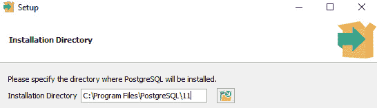
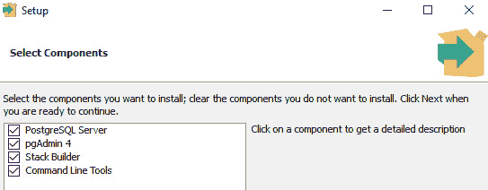
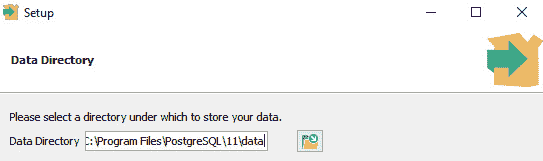
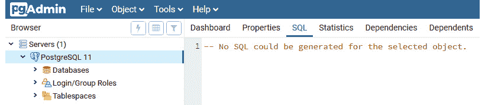
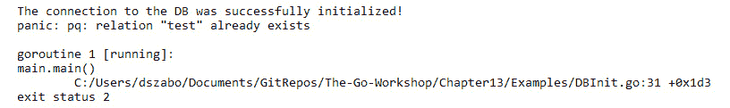
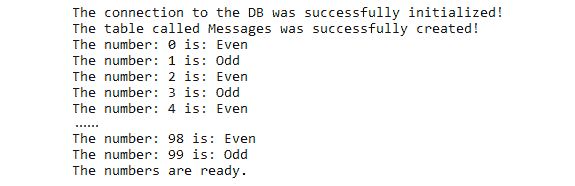
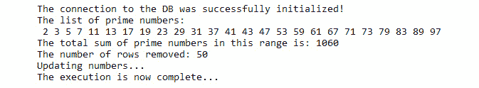
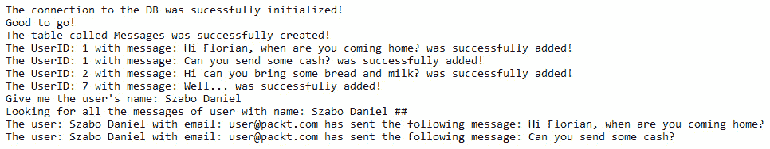

# 13. SQL 和数据库

概述

本章的目标是帮助你使用 Go 编程语言连接到 SQL 数据库。

你将开始学习如何连接到数据库，在数据库中创建表，并将数据插入到表中以及从表中检索数据。到本章结束时，你将能够更新和删除特定表中的数据，还可以截断和删除表。

# 简介

在上一章中，你学习了如何与你的 Go 应用程序运行的系统进行交互。你了解了退出代码的重要性以及如何自定义脚本以接受参数，从而增加应用程序的灵活性。你还学习了如何掌握处理应用程序接收到的不同信号。

在本章中，你将通过学习如何在 Go 中使用 SQL 和数据库来进一步提高你的 Go 技能。作为一个开发者，如果没有对持久数据存储和数据库的适当理解，你将无法胜任。我们的应用程序处理输入并产生输出，但大多数情况下，如果不是所有情况，数据库都会参与到这个过程中。这个数据库可以是内存中的（存储在计算机的 RAM 中）或基于文件的（目录中的一个文件），它可以存在于本地或远程存储上。云可以为你提供数据库服务；Azure 和 AWS 都可以帮助你实现这一点。

我们在本章中旨在让你能够流利地与这些数据库进行交流，并理解数据库的基本概念。最后，随着你通过本章的学习，你应该扩展你的技能集，以使你成为一个更好的 Go 开发者。

假设你的老板要求你创建一个可以与数据库通信的 Go 应用程序。这里的“通信”意味着任何`INSERT`、`UPDATE`、`DELETE`或`CREATE`事务都应该由应用程序处理。本章将向你展示如何做到这一点。

# 数据库

为了使本章更具吸引力，让我们看看如何在你的系统上安装一个名为`Postgres`的数据库解决方案，并为你进行配置，以便你可以尝试以下示例。

首先，我们需要从[`packt.live/2RMFPYV`](https://packt.live/2RMFPYV)获取安装程序。选择合适的版本。安装程序非常易于使用，我建议您接受默认设置：

1.  运行安装程序：

    图 13.1：选择安装目录

1.  保留默认组件：

    图 13.2：选择要安装的组件

1.  保留默认数据目录：



图 13.3：选择数据目录

它将要求输入密码，您需要记住这个密码，因为这是您数据库的主密码。`Start!123` 是本例的密码。数据库运行在本地的 5432 端口上。`pgAdmin` 图形界面工具也将被安装，一旦安装程序完成，您就可以启动 `pgAdmin` 来连接到数据库。

在浏览器中，可以使用以下链接访问管理界面：[`packt.live/2PKWc5w`](https://packt.live/2PKWc5w):



图 13.4：管理界面

一旦安装完成，我们就可以继续进行下一部分，并通过 Go 连接到数据库。

# 数据库 API 和驱动程序

为了与数据库一起工作，有一种称为“纯”Go 方法的东西，这意味着 Go 有一个 API 允许您使用不同的驱动程序连接到数据库。该 API 来自 `database/sql` 包，驱动程序有两种类型。官方 GitHub 页面提供了对大量驱动程序的本地支持（[`packt.live/2LMzcC4`](https://packt.live/2LMzcC4)），并且还有需要额外包才能运行的第三方驱动程序，例如 `SQLlite3` 包，它要求您安装 `GCC`，因为它是一个纯 C 实现。

注意

GCC 是由 GNU 项目生产的编译器系统。它将您的源代码转换为机器代码，以便您的计算机可以运行应用程序。

这里有一些驱动程序的列表：

+   **MySQL** ([`packt.live/38zk9Fw`](https://packt.live/38zk9Fw))

+   **Oracle** ([`packt.live/34cxwrP`](https://packt.live/34cxwrP))

+   **ODBC** ([`packt.live/2EfETV8`](https://packt.live/2EfETV8))

+   **Postgres** ([`packt.live/35jKEwL`](https://packt.live/35jKEwL))

API 和驱动程序方法背后的理念是，Go 提供了一个统一的接口，允许开发者与不同类型的数据库进行通信。您需要做的就是导入 API 和必要的驱动程序，然后您就可以与数据库进行通信。您不需要学习特定驱动程序的实现或该驱动程序是如何工作的，因为 API 的唯一目的是创建一个抽象层，以加速开发。

让我们来看一个例子。假设我们想要一个查询数据库的脚本。这个数据库是 MySQL。一种方法是从驱动程序开始学习如何用其语言编写代码，然后你就可以开始了。过了一段时间，你编写了很多小脚本，它们都能正确地完成工作。现在，是时候做出一个让你不高兴的管理决策了。他们决定 MySQL 不够好，他们将用基于云的数据库 AWS Athena 来替换数据库。现在，由于你为特定的驱动程序编写了脚本，你将忙于重写脚本以便它们能正常工作。这里的保障是使用统一的 API 和驱动程序组合。这意味着编写针对 API 而不是驱动程序的脚本。API 将翻译你对特定驱动程序的愿望。这样，你唯一需要做的就是更换驱动程序，脚本就能保证正常工作。你刚刚为自己节省了许多小时编写脚本和重写代码的时间，即使底层数据库已经被完全替换。

当我们在 Go 中使用数据库时，我们区分以下类型的数据库：

+   关系型数据库

+   NoSQL 数据库

+   搜索和分析数据库

# 连接到数据库

连接到数据库是最容易的事情；然而，我们需要记住一些事情。为了连接到任何数据库，我们至少需要四个条件。我们需要一个要连接的主机，我们需要连接到运行在端口的数据库，我们还需要用户名和密码。用户需要具有适当的权限，因为我们不仅想要连接，我们还希望执行特定的操作，例如查询、插入或删除数据，创建或删除数据库，以及管理用户和视图。让我们想象一下，连接到数据库就像作为一个特定的人拿着特定的钥匙走到门前。门是否打开取决于钥匙，但我们越过门槛后能做什么将取决于这个人（由他们的权限定义）。

在大多数情况下，数据库服务器支持多个数据库，并且数据库包含一个或多个表。想象一下，数据库是相互关联的逻辑容器。

让我们看看如何在 Go 中连接到数据库。为了连接，我们需要从 GitHub 获取适当的模块，这需要互联网连接。我们需要发出以下命令来获取与 Postgres 实例交互所需的包：

```go
go get github.com/lib/pq
```

一旦完成，你就可以开始编写脚本了。首先，我们将初始化我们的脚本：

```go
package main
import "fmt"
import "database/sql"
import _ "github.com/lib/pq"
```

`import _ <package name>` 是一个特殊的 `import` 语句，它告诉 Go 仅为了其副作用而导入一个包。

注意

如果你需要更多信息，请访问 [`packt.live/2PByusw`](https://packt.live/2PByusw)。

现在我们已经初始化了脚本，我们实际上可以连接到我们的数据库：

```go
db, err := sql.Open("postgres", "user=postgres password=Start!123 host=127.0.0.1 port=5432 dbname=postgres sslmode=disable")
```

这个主题是特殊的，因为 API 给我们提供了一个 `Open()` 函数，它接受各种参数。有简写的方式来完成这个任务，但我希望您了解所有参与建立连接的组件，所以我将使用较长的方法。稍后，您可以决定使用哪一个。`Postgres` 告诉函数使用 `Postgres` 驱动程序来建立连接。第二个参数是一个所谓的连接字符串，它包含 `user`、`password`、`host`、`port`、`dbname` 和 `sslmode` 参数，这些参数将用于初始化连接。在这个例子中，我们连接到标记为 `127.0.0.1` 的本地主机上的默认端口 5432，并且我们不使用 `ssl`。对于生产系统，人们倾向于更改默认端口并通过 `ssl` 对数据库服务器强制加密流量，您应该始终遵循您所使用的数据库类型的相关最佳实践。如您所见，`Open()` 函数返回两个值。一个是数据库连接，另一个是错误，如果在初始化过程中发生了错误。我们如何检查初始化是否成功？嗯，我们可以通过编写以下代码来检查是否有错误：

```go
if err != nil {
  panic(err)
}else{
  fmt.Println("The connection to the DB was successfully initialized!")
}
```

Go 中的 `panic()` 函数用于指示发生了意外的错误，我们无法优雅地处理它，因此停止执行。如果连接成功，我们打印出 `The connection to the DB was successfully initialized!` 消息。当您有一个长时间运行的应用程序时，值得加入一种检查数据库是否仍然可访问的方法，因为由于间歇性的网络错误，您可能会丢失连接，无法执行您想要执行的操作。这可以通过以下小代码片段进行检查：

```go
connectivity := db.Ping()
if connectivity != nil{
  panic(err)
}else{
  fmt.Println("Good to go!")
}
```

在这种情况下，我们使用了 `panic()` 函数来指示连接已丢失。最后，一旦我们的工作完成，我们需要终止与数据库的连接，以便删除用户会话并释放资源。在拥有数千用户同时访问同一数据库的大型企业环境中，仅在必要时使用数据库，并在工作完成后关闭连接是一个明智的决定。关闭连接有两种方法：

```go
db.Close()
defer db.Close()
```

差异在于范围。`db.Close()` 会在执行到达特定行时终止与数据库的连接，而 `defer db.Close()` 表示数据库连接应在调用它的函数超出作用域时执行。进行此操作的惯用方法是使用 `defer db.Close()`。

现在，为了进一步演示这一点，我们将创建一个表。

注意

Go 的官方 `Postgres` 模块可以在 [`packt.live/35jKEwL`](https://packt.live/35jKEwL) 找到。

# 创建表格

创建表的行为旨在创建逻辑容器，这些容器可以持久地保存属于一起的数据。许多公司出于许多原因创建表，例如跟踪员工出勤、收入跟踪和统计数据。共同的目标是为理解这些数据的应用程序提供服务。这些数据库引擎是如何控制谁可以访问什么数据的？基本上有两种方法。第一种是`CREATE`、`UPDATE`和`DELETE`。第二种方法涉及继承和角色。这种方法更稳健，更适合大型企业。在使用数据库引擎之前，通常会进行预检查以查看大小和预计使用它的用户数量。用猎枪打麻雀是没有意义的，也没有适合所有人的鞋码。一切都取决于具体情况。`Postgres`使用第二种方法，在本主题中，我们将看到如何创建 SQL 表以及如何在`Postgres`中特别创建一个表。

表创建的一般语法看起来是这样的：

```go
CREATE TABLE table_name (
    column1 datatype constrain,
    column2 datatype constrain,
    column3 datatype constrain,
    ....
);
```

在我们继续之前，我们需要明确什么是 SQL。SQL 是一个标准，代表`Postgres`、`mysql`或`mssql`服务器，它们都对`CREATE TABLE`或`INSERT`命令以相同的方式响应，因为它们都符合 SQL 标准。标准的想法不是指定引擎内部的工作方式，而是指定与它的交互应该如何发生。这些数据库引擎通常在功能、速度和存储方法方面有所不同；这就是多样性的来源。这并不是一个完整的 SQL 或数据库引擎教程。我只是想给你一个简要的解释，以便你更好地理解命令。创建表的通用命令是`CREATE TABLE`。这个命令在你连接的数据库的上下文中被理解。一个服务器可以托管多个数据库，连接到错误的数据库在执行修改结构的命令时可能会引起头疼。命令通常需要一个列名，在我们的例子中是`column1`，以及我们列中的数据类型，即`datatype`。最后，我们可以在我们的列上设置约束，这将赋予它们特殊属性。我们列支持的类型取决于数据库引擎。

这里有一些常见的数据类型：

+   INT

+   DOUBLE

+   FLOAT

+   VARCHAR，它是一个具有特定长度的字符串

约束也取决于数据库引擎，但以下是一些例子：

+   NOT NULL

+   PRIMARY KEY

+   命名函数

命名函数在每次插入新记录或更新旧记录时执行，并根据事务的评估，允许或拒绝。

我们不仅能够创建一个表，还可以清空表，移除其所有内容，或者从数据库中删除该表本身。为了清空一个表，我们使用以下命令：

```go
TRUNCATE TABLE table_name
```

为了删除表，我们使用：

```go
DROP TABLE table_name
```

现在创建一个新的表。在`Postgres`中，您可以使用默认的数据库；我们不会为示例创建单独的数据库。

我们希望初始化脚本，您可以在示例文件夹中找到它，名为`DBInit.go`：

```go
package main
import "fmt"
import "database/sql"
import _ "github.com/lib/pq"
```

现在，我们准备定义我们的`main()`函数：

```go
DBInit.go
5  func main(){
6    db, err := sql.Open("postgres", "user=postgres password=Start!123        host=127.0.0.1 port=5432 dbname=postgres sslmode=disable")
7    if err != nil {
8      panic(err)
9    }else{
10     fmt.Println("The connection to the DB was successfully          initialized!")
11   }
12 DBCreate := `
13   CREATE TABLE public.test
14   (
15     id integer,
16     name character varying COLLATE pg_catalog."default"
17   )
18   WITH (
19     OIDS = FALSE
20   )
The full code is available at: https://packt.live/34Ovy15
```

让我们分析这里发生了什么。我们初始化数据库连接，没有使用之前提到的默认用户名和密码，现在我们有了`db`变量来与数据库交互。除非执行过程中出现错误，否则以下输出将在我们的控制台上可见：

```go
The connection to the DB was successfully initialized!
The table was successfully created!
```

如果我们重新运行脚本，将出现以下错误：



图 13.5：连续执行后的失败输出

这表示表已经存在。我们创建了一个名为`DBCreate`的多行字符串，其中包含所有表创建信息。在这里，我们有一个名为`test`的表，它有一个名为`id`的整数列和一个名为`name`的字符串列。其余的是`Postgres`特定的配置。表空间定义了我们的表所在的位置。`_, err`行中的`db.Exec()`负责执行查询。

由于我们的目标是创建表，我们只关心是否有任何错误；否则，我们使用一个临时变量来捕获输出。如果`err`不是`nil`，则表示出现了错误，这我们在之前已经演示过。否则，我们假设表已按预期创建。最后，关闭数据库连接。

现在我们已经可以连接到数据库并且有一个表，我们可以插入一些数据。

# 插入数据

很久以前，当支持 SQL 数据库的 Web 应用程序时代开始蓬勃发展时，有一些勇敢的人发明了 SQL 注入攻击。一种身份验证是通过针对数据库的 SQL 查询完成的，例如，通过数学魔法将密码转换为散列函数后，所有 Web 应用程序所做的只是执行带有来自表单输入的用户名和密码的查询。许多服务器执行了类似以下操作：

```go
"SELECT password FROM Auth WHERE username=<input from user>"
```

然后，密码将被重新散列；如果两个散列匹配，则密码对用户有效。

这个问题出在`<用户输入>`部分，因为如果攻击者足够聪明，他们可以重新构造查询并运行额外的命令。例如：

```go
"SELECT password FROM Auth WHERE username=<input  from user> OR '1'='1'"
```

这个查询的问题在于`OR '1' = '1'`始终评估为`true`，并且无论用户名是什么，都会返回所有用户的密码散列。这可以进一步用于制定额外的攻击。为了防止这种情况，Go 使用了一种称为`Prepare()`语句的方法，它提供了对这些攻击的保护。

Go 有两种替换类型。在查询的情况下，我们使用`WHERE col = $1`，或者在插入或更新的情况下使用`VALUES($1,$2)`。

让我们向我们的表中添加一些值。我们将以通常的方式初始化我们的脚本。该脚本位于示例文件夹中，名为`DBInsert.go`：

```go
package main
import "fmt"
import "database/sql"
import _ "github.com/lib/pq"
```

在`main()`函数中，我们像往常一样连接到数据库：

```go
func main(){
db, err := sql.Open("postgres", "user=postgres password=Start!123 host=127.0.0.1 port=5432 dbname=postgres sslmode=disable")
if err != nil {
  panic(err)
}else{
  fmt.Println("The connection to the DB was successfully initialized!")
}
insert, err := db.Prepare("INSERT INTO test VALUES ($1, $2)")
if err != nil {
  panic(err)
}
_,err = insert.Exec(2,"second")
if err != nil {
  panic(err)
} else{
  fmt.Println("The value was successfully inserted!")
}
db.Close()
}
```

执行成功后，输出如下：

```go
The connection to the DB was successfully initialized!
The vale was successfully inserted!
```

让我们看看插入部分发生了什么。`db.Prepare()`接受一个 SQL 语句，并赋予它防止 SQL 注入攻击的保护。它是通过限制变量替换的值来工作的。在我们的例子中，我们有两个列，所以为了使替换工作，我们使用$1 和$2。你可以使用任意数量的替换；你只需要确保它们在评估时产生一个有效的 SQL 语句。当`insert`变量初始化且没有错误时，它将负责执行 SQL 语句。它找出预定义语句期望多少个参数，它的唯一目的是调用语句并执行操作。`insert.Exec(2,"second")`插入一个新元素，`id=2`和`name='second'`。如果我们检查我们的数据库，我们会看到结果。

现在我们表中已经有了一些数据，我们可以查询它。

## 练习 13.01：使用数字创建表

在这个练习中，我们将编写一个脚本，该脚本将创建一个名为`Numbers`的表，我们将存储数字。这些数字将在稍后插入。

创建两个列，`Number`和`Property`。`Number`列将存储数字，而`Property`列在创建时将是`Odd`或`Even`。

使用默认的`Postgres`数据库进行连接。数字应从 0 到 99。

按以下步骤执行以完成练习：

1.  创建一个名为`main.go`的文件。

1.  使用以下行初始化包：

    ```go
    package main
    import "fmt"
    import "database/sql"
    import _ "github.com/lib/pq"
    func main(){
    }
    ```

1.  创建一个用于后续使用的`prop` `string`变量：

    ```go
    var prop string
    ```

1.  初始化数据库连接：

    ```go
    db, err := sql.Open("postgres", "user=postgres password=Start!123 host=127.0.0.1   port=5432 dbname=postgres sslmode=disable")
    if err != nil {
      panic(err)
    }else{
      fmt.Println("The connection to the DB was successfully initialized!")
    }
    ```

1.  创建一个多行字符串来创建表：

    ```go
    TableCreate := `	
    CREATE TABLE Number
    (
      Number integer NOT NULL,
      Property text COLLATE pg_catalog."default" NOT NULL
    )
    WITH (
      OIDS = FALSE
    )
    TABLESPACE pg_default;
    ALTER TABLE Number
      OWNER to postgres;
    `
    ```

1.  创建表：

    ```go
    _,err = db.Exec(TableCreate)
    if err != nil {
      panic(err)
    } else{
      fmt.Println("The table called Messages was successfully created!")
    }
    ```

1.  插入数字：

    ```go
    insert, insertErr := db.Prepare("INSERT INTO Number VALUES($1,$2)")
    if insertErr != nil{
      panic(insertErr)
    }
    for i := 0; i < 100; i++ {
      if i % 2 == 0{
           prop = "Even"
      }else{
        prop = "Odd"
      }
      _, err = insert.Exec(i,prop)
      if err != nil{
        panic(err)
      }else{
        fmt.Println("The number:",i,"is:",prop)
      }
    }
    insert.Close()
    fmt.Println("The numbers are ready.")
    ```

1.  关闭数据库连接：

    ```go
    db.Close()
    ```

    当你执行脚本时，你应该看到以下输出：



图 13.6：成功更新属性的输出

注意

由于长度原因，*图 13.6*中省略了部分输出。

在这个练习中，我们看到了如何在数据库中创建一个新的表，以及如何使用`for`循环和`Prepare()`语句插入新记录。

# 获取数据

SQL 注入不仅关注要插入的数据。它还关注在数据库中操纵的任何数据。检索数据，更重要的是，安全地检索数据，也是我们必须优先考虑和处理的事项。当我们查询数据时，我们的结果取决于我们连接的数据库和我们想要查询的表。但我们也必须提到，数据库引擎实施的安全机制也可能阻止成功查询，除非用户具有适当的权限。我们区分两种类型的查询。有一种查询不需要参数，例如 `SELECT * FROM table`，还有一种查询需要你指定过滤条件。Go 提供了两个允许你查询数据的函数。一个叫做 `Query()` 函数，另一个叫做 `QueryRow()` 函数。这些函数的可用性取决于你交互的数据库。作为一个经验法则，你应该记住 `Query()` 函数最有可能工作。你还可以用 `Prepare()` 语句包装它们，但这不是本主题的讨论内容，因为它之前已经演示过了。相反，我们想看看这些函数是如何工作的

让我们为 `Query()` 函数创建一个脚本。

我们像往常一样初始化脚本。它可以在示例中找到，称为 `DBQuery.go`：

```go
package main
import "fmt"
import "database/sql"
import _ "github.com/lib/pq"
```

我们的 `main()` 函数将略有不同，因为我们想引入 `Scan()` 函数：

```go
func main(){
var id int
var name string
db, err := sql.Open("postgres", "user=postgres password=Start!123 host=127.0.0.1   port=5432 dbname=postgres sslmode=disable")
if err != nil {
  panic(err)
}else{
  fmt.Println("The connection to the DB was successfully initialized!")
}
rows, err := db.Query("SELECT * FROM test")
if err != nil {
  panic(err)
}
for rows.Next() {
  err := rows.Scan(&id, &name)
  if err != nil {
    panic(err)
  }
  fmt.Println(id, name)
}
err = rows.Err()
if err != nil {
  panic(err)
}
rows.Close()
db.Close()
}
```

输出应该看起来像这样：

```go
The connection to the DB was successfully initialized!
2 second
```

由于我们之前已经将此数据插入到我们的数据库中，你可以根据之前的示例添加更多数据。我们定义了 `id` 和 `name` 变量，这将有助于我们的 `Scan()` 函数。我们连接到数据库并创建我们的 `db` 变量。之后，我们将 `rows` 变量填充为 `Query()` 函数的结果，它基本上将包含表中的所有元素。接下来是难点。我们使用 `for rows.Next()` 来遍历结果行。但这还不够；我们希望将查询结果分配给相应的变量，该变量由 `rows.Scan(&id, &name)` 返回。这允许我们引用当前行的 ID 和 `NAME`，这使得我们可以更容易地处理值。最后，我们优雅地关闭 `rows` 和数据库连接。

让我们用 `Prepare()` 查询一行。

初始化看起来和之前一样。

```go
DBPrepare.go
1  package main
2  import "fmt"
3  import "database/sql"
4  import _ "github.com/lib/pq"
The full code is available at: https://packt.live/376LxJo
```

主要区别在于 `main()` 函数的开始部分：

```go
func main(){
var name string
var id int
id = 2
db, err := sql.Open("postgres", "user=postgres password=Start!123 host=127.0.0.1   port=5432 dbname=postgres sslmode=disable")
if err != nil {
  panic(err)
}else{
  fmt.Println("The connection to the DB was successfully initialized!")
}
qryrow, err := db.Prepare("SELECT name FROM test WHERE id=$1")
if err != nil{
  panic(err)
}
err = qryrow.QueryRow(id).Scan(&name)
if err != nil {
  panic(err)
}
fmt.Println("The name column value is",name,"of the row with id=",id)
qryrow.Close()
db.Close()
}
```

如果你一切都做对了，输出应该看起来大致像这样：

```go
The connection to the DB was successfully initialized!
The name column value is second of the row with id= 2
```

让我们仔细检查一下我们的`main`函数。我们定义了两个变量：`name`变量将在我们处理查询结果时使用，而`id`变量则作为我们执行的查询的灵活输入。与数据库的常规连接初始化与之前相同。然后是`SQL 注入`证明部分。我们准备了一个查询，它在意义上是动态的，因为它接受一个参数，这个参数将是我们要查找的 ID。然后，使用`qryrow`来执行`QueryRow()`函数，该函数反过来又使用我们之前指定的`id`变量，并将结果返回到`name`变量中。然后我们输出一个带有解释的字符串，说明列的值是基于指定的`id`变量。最后，关闭`qryrow`和`db`资源。

现在我们已经知道了如何从数据库中检索数据，我们需要看看如何更新我们数据库中的现有数据。

# 更新现有数据

当你使用 Go 更新一行或多行时，你会有麻烦。`sql`包没有提供任何名为`Update()`的函数；然而，有一个`Exec()`函数，它作为你查询的通用执行器。你可以使用这个函数执行`SELECT`、`UPDATE`、`DELETE`或你需要执行的任何操作。这个主题将向你展示你如何安全地做到这一点。

我们想以通常的方式开始我们的脚本。它可以在示例文件夹中找到，并命名为`DBUpdate.go`：

```go
package main
import "fmt"
import "database/sql"
import _ "github.com/lib/pq"
```

然后出现魔法。想法是更新我们作为参数给出的特定`id`变量的`name`列的值。所以，`main()`函数看起来是这样的：

```go
func main(){
db, err := sql.Open("postgres", "user=postgres password=Start!123 host=127.0.0.1 port=5432 dbname=postgres sslmode=disable")
if err != nil {
  panic(err)
}else{
  fmt.Println("The connection to the DB was successfully initialized!")
}
UpdateStatement :=`
UPDATE test 
SET name = $1 
WHERE id = $2
`
UpdateResult, UpdateResultErr := db.Exec(UpdateStatement,"well",2)
if UpdateResultErr != nil {
  panic(UpdateResultErr)
}
UpdatedRecords, UpdatedRecordsErr := UpdateResult.RowsAffected()
if UpdatedRecordsErr != nil {
  panic(UpdatedRecordsErr)
}
fmt.Println("Number of records updated:",UpdatedRecords)
db.Close()
}
```

如果一切顺利，我们将看到以下输出：

```go
The connection to the DB was successfully initialized!
Number of records updated: 1
```

注意，你可以也应该尝试不同的输入，看看脚本如何对不同的问题/错误做出反应。

让我们剖析一下这里发生了什么。我们像之前一样初始化我们的数据库连接。我们创建了一个`UpdateStatement`变量，它是一个多行字符串，并且被设计成可以输入到`Exec()`函数中，该函数接受参数。我们希望更新具有指定 ID 的列的名称。这个函数要么自己运行指定的语句，或者可以用来传递在适当位置替换的参数。这本来是完全可以的，也会为我们完成任务，但我们想确保`UPDATE`命令实际上至少更新了一条记录。为此，我们可以使用`RowsAffected()`。它将返回更新的行数，以及过程中遇到的任何错误。最后，我们在控制台上打印出更新的行数，并关闭连接。

现在是时候从我们的数据库中删除数据了。

# 删除数据

数据的删除可能由多个原因引起：我们不再需要这些数据，我们正在迁移到另一个数据库，或者我们正在替换当前解决方案。我们很幸运，因为当前的 Go 功能提供了一个非常方便的方式来执行它。这个类比与我们的记录`UPDATE`语句相同。我们制定一个`DELETE`语句并执行它；技术上我们可以修改我们的`UPDATE`脚本来从数据库中删除。

为了简化，我们只修改相关的行。

我们的`DELETE`语句将像这样替换`UPDATE`语句：

```go
DBDelete.go
12 DeleteStatement :=`
13 DELETE FROM test 
14 WHERE id = $1
15 `
The full code is available at: https://packt.live/371GoCy
```

我们更新了带有`Exec()`语句的行：

```go
DeleteResult, DeleteResultErr := db.Exec(DeleteStatement,2)
if DeleteResultErr != nil {
  panic(DeleteResultErr)
}
```

此外，我们还更新了计算更新记录的行：

```go
DeletedRecords, DeletedRecordsErr := DeleteResult.RowsAffected()
if DeletedRecordsErr != nil {
  panic(DeletedRecordsErr)
}
fmt.Println("Number of records deleted:",DeletedRecords)
```

我们执行的结果应该看起来像这样：

```go
The connection to the DB was successfully initialized!
Number of records deleted: 1
```

基本上，就是这样。经过一点修改，我们有一个可以更新或删除记录并验证的脚本。

现在，让我们看看我们如何创建一个包含质数的表。

## 练习 13.02：在数据库中存储质数

在这个练习中，我们基于*练习 13.01*，*创建数字表*，进行扩展。我们希望创建一个脚本，它将执行以下操作：首先，它会告诉我们表中有多少个质数，并按出现的顺序提供给我们。我们希望看到质数的总和。然后，我们希望从表中删除所有偶数并查看删除了多少个。我们希望将质数的总和添加到剩余的奇数中，并根据需要更新表中的记录，更改属性。使用`math/big`包进行质数测试。

按照以下步骤操作：

1.  创建一个名为`main.go`的脚本。

1.  初始化我们的脚本以执行特定操作：

    ```go
    package main
    import "fmt"
    import "database/sql"
    import _ "github.com/lib/pq"
    import "math/big"
    func main(){
    }
    ```

1.  定义四个变量供以后使用：

    ```go
    var number int64
    var prop string
    var primeSum int64
    var newNumber int64
    ```

1.  初始化数据库连接：

    ```go
    db, err := sql.Open("postgres", "user=postgres password=Start!123 host=127.0.0.1   port=5432 dbname=postgres sslmode=disable")
    if err != nil {
      panic(err)
    }else{
      fmt.Println("The connection to the DB was successfully initialized!")
    }
    ```

1.  获取所有质数的列表：

    ```go
    AllTheNumbers := "SELECT * FROM Number"
    Numbers, err := db.Prepare(AllTheNumbers)
    if err != nil {
      panic(err)
    }
    primeSum = 0
    result, err := Numbers.Query()
    fmt.Println("The list of prime numbers:")
    for result.Next(){
        err = result.Scan(&number, &prop)
        if err != nil{
        panic(err)
        }
        if big.NewInt(number).ProbablyPrime(0) {
          primeSum += number
          fmt.Print(" ",number)
        }
      }
    Numbers.Close()
    ```

1.  打印质数的总和：

    ```go
    fmt.Println("\nThe total sum of prime numbers in this range is:",primeSum)
    ```

1.  删除偶数：

    ```go
    Remove := "DELETE FROM Number WHERE Property=$1"
    removeResult, err := db.Exec(Remove,"Even")
    if err != nil {
      panic(err)
    }
    ModifiedRecords, err := removeResult.RowsAffected()
    fmt.Println("The number of rows removed:",ModifiedRecords)
    fmt.Println("Updating numbers...")
    ```

1.  使用`primeSum`更新剩余的记录并打印一个结束语：

    ```go
    Update := "UPDATE Number SET Number=$1 WHERE Number=$2 AND Property=$3"
    AllTheNumbers = "SELECT * FROM Number"
    Numbers, err = db.Prepare(AllTheNumbers)
    if err != nil {
      panic(err)
    } 
    result, err = Numbers.Query()
    for result.Next(){
        err = result.Scan(&number, &prop)
        if err != nil{
        panic(err)
        }
        newNumber = number + primeSum
        _, err = db.Exec(Update,newNumber,number,prop)
        if err != nil {
          panic(err)
        }
      }
    Numbers.Close()
    fmt.Println("The execution is now complete...")
    ```

1.  关闭数据库连接：

    ```go
    db.Close()
    ```

    一旦脚本执行，以下输出应该是可见的：

![图 13.7：计算输出]



图 13.7：计算输出

在这个练习中，我们看到了如何利用内置的 Go 函数来查找质数。我们还通过删除数字来操作表，然后执行更新操作。

注意

关闭数据库很重要，因为一旦我们的工作完成，我们确实希望释放未使用的资源。

# 截断和删除表

我们在本主题中想要实现的是完全清空一个表并删除它。为了清空表，我们可以简单地编写匹配我们表中每条记录的 `DELETE` 语句，从而从表中删除每一条记录。然而，还有一种更优雅的方法。我们可以使用 `TRUNCATE TABLE` SQL 语句。这个语句的结果是一个字面上为空的表。我们可以使用 `sql` 包中的 `Exec()` 函数。你已经知道如何通过导入来初始化包。你也知道如何连接到数据库。这次，我们只关注语句。

以下语句将实现完全的 `TRUNCATE`：

```go
EmptyTable, EmptyTableErr := db.Exec("TRUNCATE TABLE test")
if EmptyTableErr != nil {
  panic(EmptyTableErr)
}
```

这样结果是名为 `test` 的空表。

为了完全删除表，我们应该将我们的语句修改如下。

```go
DropTable, DropTableErr := db.Exec("DROP TABLE test")
if DropTableErr != nil {
  panic(DropTableErr)
}
```

如果我们检查我们的数据库引擎，我们将找不到名为 `test` 的表的任何痕迹。这从数据库的表面彻底消除了整个表。

那个主题完全是关于通过 Go 编程语言与数据库交互。现在你对如何入门有了相当的了解。

注意

对于更多信息及额外细节，你应该查看 SQL API 的官方文档，[`packt.live/2Pi5oj5`](https://packt.live/2Pi5oj5)。

## 活动十三.01：在表中存储用户数据

在这个活动中，我们将创建一个表，该表将存储用户信息，如 `ID`、`Name` 和 `Email`。我们基于你在 *创建表* 和 *插入数据* 部分获得的知识。

按照以下步骤完成此活动：

1.  创建一个小脚本，用于创建一个名为 `Users` 的表。这个表必须有三个列：`ID`、`Name` 和 `Email`。

1.  将两位用户及其数据详情添加到表中。他们应该有独特的名字、ID 和电子邮件地址。

1.  然后你需要更新第一个用户的电子邮件地址为 user@packt.com 并删除第二个用户。确保所有字段都不是 `NULL`，ID 是主键，因此需要是唯一的。

1.  当你在表中插入、更新和删除数据时，请使用 `Prepare()` 函数来防止 SQL 注入攻击。

1.  你应该使用一个结构体来存储你想要插入的用户信息，并且在插入时，使用 `for` 循环遍历结构体。

1.  一旦 `insert`、`update` 和 `delete` 调用完成，确保在适当的时候使用 `Close()`，并最终关闭数据库连接。

    成功完成后，你应该会看到以下输出：

![图 13.8：可能的输出![图 13.8：可能的输出图 13.8：可能的输出注意本活动的解决方案可以在第 745 页找到。在本活动的结束时，你应该已经学会了如何创建一个名为 `users` 的新表以及如何向该表中插入数据。## 活动十三.02：查找特定用户的消息在这个活动中，我们将基于 *活动 13.01*：*在表中存储用户数据* 进行扩展。我们需要创建一个名为 `Messages` 的新表。这个表将有两个列，两个列都应该有 280 个字符的限制：一个是 `UserID`，另一个是 `Message`。当你的表格准备就绪时，你应该添加一些带有用户 ID 的消息。确保你添加了 `UserID`，这个字段在 `users` 表中不存在。一旦你添加了数据，写一个查询，返回指定用户发送的所有消息。使用 `Prepare()` 函数来防止 SQL 注入。如果找不到指定的用户，则打印 `查询未返回任何内容，没有这样的用户：<username>`。你应该从键盘输入用户名。按以下步骤完成活动：1.  定义一个 `struct`，它包含 `userID` 和消息。1.  应该使用一个 `for` 循环来插入消息，该循环遍历之前定义的 `struct`。1.  当接收到用户输入时，确保你使用 `Prepare()` 语句来构建你的查询。    如果一切顺利，这将是你填入数据库的用户名和消息后的输出，具体取决于你如何填充数据库：

图 13.9：预期输出

注意

这个活动的解决方案可以在第 748 页找到。

如果你愿意，你可以调整脚本，以便在连续运行时不要尝试重新创建数据库。

在完成这个活动后，你应该学会如何创建一个名为 `Messages` 的新表，然后从用户那里获取输入，并根据输入搜索相关的用户和消息。

# 摘要

本章使你在与 SQL 数据库交互方面变得高效。你学习了如何创建、删除和操作数据库表。你还意识到了 Go 适合与之交互的所有不同类型的数据库。由于本章是以 `PostgreSQL` 引擎为背景编写的，你应该熟悉它的 Go 模块。有了这些知识，你现在将能够使用 Go 语言在数据库编程领域迈出自己的步伐，并且能够自给自足，因为你知道在哪里寻找问题的解决方案和额外的知识。这种知识最常见的用例是当你必须构建自动报告应用程序，从数据库中提取数据并以电子邮件的形式报告时。另一个用例是你有一个自动应用程序，用于将数据推送到数据库服务器，该服务器处理 CSV 文件或 XML 文件。这完全取决于你所处的具体情况。

在下一章中，你将学习如何通过 HTTP 客户端与 Web 界面交互，这是 Go 中最有趣的主题之一。
