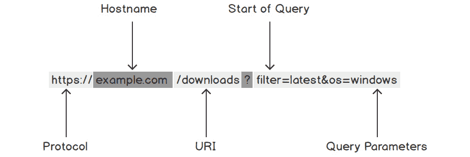

# 第十四章：14. 使用 Go HTTP 客户端

概述

本章将使你能够使用 Go HTTP 客户端通过互联网与其他系统进行通信。

你将首先学习如何使用 HTTP 客户端从 Web 服务器获取数据并向 Web 服务器发送数据。到本章结束时，你将能够将文件上传到 Web 服务器，并尝试使用自定义 Go HTTP 客户端与 Web 服务器交互。

# 简介

在上一章中，你学习了 SQL 和数据库。你学习了如何执行查询，如何创建表，如何向表中插入数据并获取数据，如何更新数据，以及如何在表中删除数据。

在本章中，你将学习 Go HTTP 客户端及其使用方法。HTTP 客户端是一种用于从或向 Web 服务器获取或发送数据的工具。最著名的 HTTP 客户端例子是网页浏览器（如 Firefox）。当你在一个网页浏览器中输入一个网址时，它会内置一个 HTTP 客户端，该客户端会向服务器发送数据请求。服务器会收集数据并将其发送回 HTTP 客户端，然后客户端会在浏览器中显示网页。同样，当你在一个网页浏览器中填写表单时，例如登录一个网站，浏览器会使用其 HTTP 客户端将表单数据发送到服务器，并根据响应采取适当的行动。

本章将探讨如何使用 Go HTTP 客户端从 Web 服务器请求数据并向服务器发送数据。你将检查可以使用 HTTP 客户端与 Web 服务器交互的不同方式以及这些交互的各种用例。网页浏览器示例将有助于解释不同的交互。作为本章的一部分，你将创建自己的 Go 程序，利用 Go HTTP 客户端从 Web 服务器发送和接收数据。

# Go HTTP 客户端及其用途

Go HTTP 客户端是 Go 标准库的一部分，具体是`net/http`库。使用它主要有两种方式。第一种是使用`net/http`库中包含的默认 HTTP 客户端。它使用简单，可以让你快速开始。第二种方式是基于默认 HTTP 客户端创建自己的 HTTP 客户端。这允许你自定义请求和各种其他事情。配置起来需要更长的时间，但它给你提供了更多的自由和控制权，可以控制你发送的请求。

当使用 HTTP 客户端时，你可以发送不同类型的请求。虽然有许多类型的请求，但我们将讨论两种主要的请求，即 GET 请求和 POST 请求。例如，如果你想从服务器检索数据，你会发送一个 GET 请求。当你在你浏览器中输入一个网址时，它会向该地址的服务器发送一个 GET 请求，然后显示它返回的数据。如果你想向服务器发送数据，你会发送一个 POST 请求。如果你想登录到一个网站，你会将你的登录详情 POST 到服务器。

在本章中，有一些练习教你关于 Go HTTP 客户端的知识。它们将教你如何使用 GET 请求以各种格式从服务器请求数据。它们还将教你如何将表单数据 POST 到 Web 服务器，类似于当你在网站上登录时，浏览器如何发送 POST 请求。这些练习还将向你展示如何将文件上传到 Web 服务器，以及如何使用自定义的 HTTP 客户端来对发送的请求有更多的控制。

# 向服务器发送请求

当你想从网络服务器检索数据时，你需要向服务器发送一个 GET 请求。在发送请求时，URL 将包含你想要获取数据的资源信息。URL 可以分解为几个关键部分。这包括协议、主机名、URI 和查询参数。其格式看起来像这样：

![图 14.1：URL 格式分解]



图 14.1：URL 格式分解

在这个例子中：

+   `协议`告诉客户端如何连接到服务器。最常用的两种协议是 HTTP 和 HTTPS。在这个例子中，我们使用了`https`。

+   `主机名`是我们想要连接的服务器的地址。在这个例子中，它是`example.com`。

+   `URI`是`/downloads`。

+   `查询参数`告诉服务器它需要任何额外的信息。在这个例子中，我们有两个参数。这些是`filter=latest`和`os=windows`。你会注意到它们与 URI 由`?`分隔。这样服务器就可以从请求中解析它们。我们将任何额外的参数与 URI 的末尾通过`&`符号连接，就像`os`参数中看到的那样。

## 练习 14.01：使用 Go HTTP 客户端向 Web 服务器发送 GET 请求

在这个练习中，你将从一个网络服务器获取数据并打印出这些数据。你将向[`www.google.com`](https://www.google.com)发送一个 GET 请求并显示服务器返回的数据：

注意

对于这个主题，你需要在你的系统上安装 Go 并设置 GOPATH。你还需要一个 IDE，你可以用它来编辑`.go`文件。

1.  打开你的 IDE，在你的 GOPATH 中创建一个新的目录`Exercise14.01`。在该目录内，创建一个新的 Go 文件，名为`main.go`。

1.  由于这是一个新的程序，您可能希望将文件的包设置为 `main()` 函数。导入 `net/http` 库、`log` 库和 `io/ioutil` 库。输入以下代码：

    ```go
    package main
    import (
        "io/ioutil"
        "log"
        "net/http"
    )
    ```

    现在您已经设置了包和所需的导入，可以开始创建一个从网络服务器获取数据的函数。您将要创建的函数将从网络服务器请求数据。

1.  创建一个返回字符串的函数：

    ```go
    func getDataAndReturnResponse() string {
    ```

1.  在那个函数内部，您可以使用默认的 Go HTTP 客户端从服务器请求数据。在这个练习中，您将请求 [`www.google.com`](https://www.google.com) 的数据。要从网络服务器请求数据，您使用 `http` 库中的 `GET` 函数，它看起来如下：

    ```go
        r, err := http.Get("https://www.google.com")
        if err != nil {
            log.Fatal(err)
        }
    ```

1.  服务器发送回的数据包含在 `r.Body` 中，所以您只需读取那些数据。要读取 `r.Body` 中的数据，您可以使用 `io/ioutil` 库中的 `ReadAll` 函数。这两个函数组合起来将看起来像这样：

    ```go
        defer r.Body.Close()
        data, err := ioutil.ReadAll(r.Body)
        if err != nil {
            log.Fatal(err)
        }
    ```

1.  在您从服务器收到响应并读取数据后，只需将那些数据作为字符串返回，它看起来像这样：

    ```go
        return string(data)
    }
    ```

    您现在创建的函数将看起来像这样：

    ```go
    func getDataAndReturnResponse() string {
        // send the GET request
        r, err := http.Get("https://www.google.com")
        if err != nil {
            log.Fatal(err)
        }
        // get data from the response body
        defer r.Body.Close()
        data, err := ioutil.ReadAll(r.Body)
        if err != nil {
            log.Fatal(err)
        }
        // return the response data
        return string(data)
    }
    ```

1.  创建一个 `main` 函数。在 `main` 函数内部，调用 `getDataAndReturnResponse` 函数并记录它返回的字符串：

    ```go
    func main() {
        data := getDataAndReturnResponse()
        log.Println(data)
    }
    ```

1.  要运行程序，打开您的终端并导航到创建 `main.go` 文件的目录。

1.  运行 `go run main.go` 来编译和执行文件：

    ```go
    go run server.go
    ```

    程序将向 [`www.google.com`](https://www.google.com) 发送 GET 请求，并在您的终端中记录响应。

    虽然看起来像是乱码，但如果将那些数据保存到名为 `response.html` 的文件中，并在您的网页浏览器中打开它，它将类似于谷歌首页。这就是当您打开网页时，您的网页浏览器在底层所做的事情。它会向服务器发送一个 GET 请求，然后显示它返回的数据。如果我们手动做这件事，它看起来会像这样：

![图 14.2：在 Firefox 中查看时请求 HTML 响应

![图片 B14177_14_02.jpg]

图 14.2：在 Firefox 中查看时请求 HTML 响应

在这个练习中，我们看到了如何向网络服务器发送 GET 请求并获取数据。您创建了一个 Go 程序，向 [`www.google.com`](https://www.google.com) 发送请求，并获取了谷歌首页的 HTML 数据。

# 结构化数据

一旦从服务器请求数据，返回的数据可以以各种格式出现。例如，如果您向 `packtpub.com` 发送请求，它将返回 Packt 网站的 HTML 数据。虽然 HTML 数据对于显示网站很有用，但它不是发送机器可读数据的理想选择。在 Web API 中常用的数据类型是 JSON。JSON 为机器可读和人类可读的数据提供了良好的结构。稍后，您将学习如何使用 Go 解析 JSON 并利用它。

## 练习 14.02：使用结构化数据与 HTTP 客户端

在这个练习中，你将使用 Go 解析结构化的 JSON 数据。服务器将返回 JSON 数据，你将使用`json.Unmarshal`函数来解析数据并将其放入结构体中：

1.  在你的 GOPATH 中创建一个新的目录，命名为`Exercise14.02`。在该目录内，再创建两个子目录，分别命名为`server`和`client`。然后，在`server`目录内创建一个名为`server.go`的文件，并写入以下代码：

    ```go
    package main
    import (
        "log"
        "net/http"
    )
    type server struct{}
    func (srv server) ServeHTTP(w http.ResponseWriter, r   *http.Request) {
        msg := "{\"message\": \"hello world\"}"
        w.Write([]byte(msg))
    }
    func main() {
        log.Fatal(http.ListenAndServe(":8080", server{}))
    }
    ```

    这创建了一个非常基础的 Web 服务器，它发送回 JSON 数据。我们将在下一章中更详细地解释它是如何工作的。现在，我们只是将其作为一个例子。

1.  一旦创建了服务器，导航到客户端目录并创建一个名为`main.go`的文件。添加`package main`并导入文件所需的包：

    ```go
    package main
    import (
        "encoding/json"
        "fmt"
        "io/ioutil"
        "log"
        "net/http"
    )
    ```

1.  然后，创建一个带有字符串参数的结构体，它可以接受来自服务器的响应。然后，向其中添加 JSON 元数据，以便它可以用于反序列化 JSON `message`参数：

    ```go
    type messageData struct {
        Message string `json:"message"`
    }
    ```

1.  接下来，创建一个你可以调用的函数，用于从服务器获取并解析数据。使用你刚刚创建的结构体作为返回值：

    ```go
    func getDataAndReturnResponse() messageData {
    ```

    当你运行 Web 服务器时，它将在`http://localhost:8080`上监听。因此，你需要向该 URL 发送 GET 请求，然后读取响应体：

    ```go
        r, err := http.Get("http://localhost:8080")
        if err != nil {
            log.Fatal(err)
        }
        defer r.Body.Close()
        data, err := ioutil.ReadAll(r.Body)
        if err != nil {
            log.Fatal(err)
        }
    ```

1.  然而，这次你将解析响应而不是简单地返回它。为此，你创建了一个结构体实例，然后将它连同响应数据一起传递给`json.Unmarshal`：

    ```go
        message := messageData{}
        err = json.Unmarshal(data, &message)
        if err != nil {
            log.Fatal(err)
        }
    ```

    这将使用来自服务器的数据填充`message`变量。

1.  然后，你需要返回结构体以完成函数：

    ```go
        return message
    ```

1.  最后，从`main()`函数中调用你刚刚创建的函数，并记录来自服务器的消息：

    ```go
    func main() {
        data := getDataAndReturnResponse()
        fmt.Println(data.Message)
    }
    ```

1.  要运行此程序，你需要执行两个步骤。第一步是在你的终端导航到`server`目录并运行以下命令。这将启动 Web 服务器：

    ```go
    go run server.go
    ```

1.  在第二个终端窗口中，导航到`client`目录并运行`go run main.go`。这将启动客户端并连接到服务器。它应该输出服务器的消息：

![图 14.3：预期输出]

![图片 B14177_14_03.jpg]

图 14.3：预期输出

在这个练习中，你向服务器发送了一个 GET 请求，并从它那里获取了结构化的 JSON 格式的数据。然后你解析了这些 JSON 数据以获取其中的消息。

## 活动十四点零一：从 Web 服务器请求数据并处理响应

假设你正在与一个 Web API 交互。你发送一个 GET 请求以获取数据，并返回一个包含名称的数组。你需要计数这些名称以找出你有多少个每种名称。在这个活动中，你将做这件事。你将向服务器发送 GET 请求，获取结构化的 JSON 数据，解析数据，并计算在响应中返回了多少个每种名称：

1.  创建一个名为`Activity14.01`的目录。

1.  创建两个子目录，一个命名为`client`，另一个命名为`server`。

1.  在`server`目录中，创建一个名为`server.go`的文件。

1.  在`server.go`中添加服务器代码。

1.  通过在服务器目录中调用`go run server.go`来启动服务器。

1.  在`client`目录中创建一个名为`main.go`的文件。

1.  在`main.go`中添加必要的导入。

1.  创建结构体以解析响应数据。

1.  创建一个名为`getDataAndParseResponse`的函数，它返回两个整数。

1.  向服务器发送一个`GET`请求。

1.  将响应解析到结构体中。

1.  遍历结构体并计算`Electric`和`Boogaloo`这两个名称的出现次数。

1.  返回计数。

1.  打印计数。

    预期的输出如下：


图 14.4：可能的输出

注意

本活动的解决方案可以在第 752 页找到。

在这个活动中，我们已经从 Web 服务器请求数据，并使用 Go HTTP 客户端处理它返回的数据。

# 向服务器发送数据

除了从服务器请求数据外，你还会想向服务器发送数据。最常见的方法是通过 POST 请求。POST 请求由两个主要部分组成：URL 和主体。POST 请求的主体是你放置要发送到服务器的数据的地方。一个常见的例子是登录表单。当我们发送登录请求时，我们将主体 POST 到 URL。Web 服务器将检查主体中的登录详情是否正确，并更新我们的登录状态。它通过告诉客户端是否成功来响应请求。在本章中，你将学习如何使用 POST 请求向服务器发送数据。

## 练习 14.03：使用 Go HTTP 客户端向 Web 服务器发送 POST 请求

在这个练习中，你将向一个包含消息的 Web 服务器发送一个 POST 请求。Web 服务器将随后以相同的消息响应，以便你可以确认它已接收：

1.  在你的 GOPATH 上创建一个新的目录，`Exercise14.03`。在该目录内，创建两个额外的目录，`server`和`client`。然后，在`server`目录内，创建一个名为`server.go`的文件，并写入以下代码：

    ```go
    package main
    import (
        "encoding/json"
        "log"
        "net/http"
    )
    type server struct{}
    type messageData struct {
        Message string `json:"message"`
    }
    func (srv server) ServeHTTP(w http.ResponseWriter, r   *http.Request) {
        jsonDecoder := json.NewDecoder(r.Body)
        messageData := messageData{}
        err := jsonDecoder.Decode(&messageData)
        if err != nil {
            log.Fatal(err)
        }
        jsonBytes, _ := json.Marshal(messageData)
        log.Println(string(jsonBytes))
        w.Write(jsonBytes)
    }
    func main() {
        log.Fatal(http.ListenAndServe(":8080", server{}))
    }
    ```

    这创建了一个非常基本的 Web 服务器，它接收一个 JSON POST 请求并将发送给它的消息返回给客户端。

1.  一旦创建了服务器，导航到客户端目录并创建一个名为`main.go`的文件。添加`package main`和文件所需的导入：

    ```go
    package main
    import (
        "bytes"
        "encoding/json"
        "fmt"
        "io/ioutil"
        "log"
        "net/http"
    )
    ```

1.  接下来，你需要创建一个结构体来发送和接收我们想要的数据。这将与服务器用于解析请求的结构体相同：

    ```go
    type messageData struct {
        Message string `json:"message"`
    }
    ```

1.  然后你需要创建一个函数来将数据 POST 到服务器。它应该接受一个`messageData`结构体参数，并返回一个`messageData`结构体：

    ```go
    func postDataAndReturnResponse(msg messageData) messageData {
    ```

1.  要将数据 POST 到服务器，你需要将结构体序列化为客户端可以发送到服务器的字节。为此，你可以使用`json.Marshal`函数：

    ```go
        jsonBytes, _ := json.Marshal(msg)
    ```

1.  现在你有了字节，你可以使用`http.Post`函数发送 POST 请求。在请求中，你只需告诉函数要发送到哪个 URL，你发送的数据类型，以及你想要发送的数据。在这种情况下，URL 是`http://localhost:8080`。你发送的内容是`application/json`，数据是刚刚创建的`jsonBytes`变量。结合起来，看起来是这样的：

    ```go
        r, err := http.Post("http://localhost:8080", "application/json", bytes.NewBuffer(jsonBytes))
        if err != nil {
            log.Fatal(err)
        }
    ```

1.  之后，函数的其余部分与上一个练习相同。你读取响应，解析数据，然后返回数据，看起来是这样的：

    ```go
        defer r.Body.Close()
        data, err := ioutil.ReadAll(r.Body)
        if err != nil {
            log.Fatal(err)
        }
        message := messageData{}
        err = json.Unmarshal(data, &message)
        if err != nil {
            log.Fatal(err)
        }
        return message
    ```

1.  然后，你只需从你的`main`函数中调用`postDataAndReturnResponse`函数。然而，这次你需要将你想发送的消息传递给函数。你只需创建一个`messageData`结构的实例，并在调用函数时传递它，这看起来是这样的：

    ```go
    func main() {
        msg := messageData{Message: "Hi Server!"}
        data := postDataAndReturnResponse(msg)
        fmt.Println(data.Message)
    }
    ```

1.  要运行这个练习，你需要执行两个步骤。第一步是导航到你的终端中的`server`目录并运行`go run server.go`。这将启动网络服务器。在第二个终端窗口中，导航到`client`目录并运行`go run main.go`。这将启动客户端并连接到服务器。它应该输出来自服务器的消息：


图 14.5：预期输出

在这个练习中，你向服务器发送了一个 POST 请求。服务器解析了请求，并将相同的信息发送回你。如果你更改发送给服务器的消息，你应该看到服务器发送回的新消息的响应。

## 在 POST 请求中上传文件

你可能想要 POST 到网络服务器的另一个常见数据示例是来自你本地计算机的文件。这就是网站允许用户上传他们的照片等的方式。正如你可以想象的那样，这比发送简单的表单数据要复杂一些。为了实现这一点，首先需要读取文件，然后将其包装成服务器可以理解的形式。然后，它可以作为一个多部分表单发送到服务器。你将学习如何使用 Go 读取文件并将其上传到服务器。

## 练习 14.04：通过 POST 请求将文件上传到网络服务器

在这个练习中，你将读取一个本地文件，然后将其上传到网络服务器。然后你可以检查网络服务器是否保存了你上传的文件：

1.  在你的 GOPATH 上创建一个新的目录，`Exercise14.04`。在该目录内，创建另外两个目录，`server`和`client`。然后，在`server`目录内，创建一个名为`server.go`的文件，并编写以下代码：

    ```go
    server.go
    9  func (srv server) ServeHTTP(w http.ResponseWriter, r      *http.Request) {
    10     uploadedFile, uploadedFileHeader, err :=          r.FormFile("myFile")
    11     if err != nil {
    12         log.Fatal(err)
    13     }
    14     defer uploadedFile.Close()
    15     fileContent, err := ioutil.ReadAll(uploadedFile)
    16     if err != nil {
    17         log.Fatal(err)
    18     }
    The full code for this step is available at: https://packt.live/2SkeZHW
    ```

    这创建了一个非常基本的网络服务器，它可以接收多部分表单 POST 请求并在表单内保存文件。

1.  一旦你创建了服务器，导航到客户端目录并创建一个名为`main.go`的文件。添加`package main`和文件所需的导入：

    ```go
    package main
    import (
        "bytes"
        "fmt"
        "io"
        "io/ioutil"
        "log"
        "mime/multipart"
        "net/http"
        "os"
    )
    ```

1.  然后你需要创建一个函数来调用，并将文件名提供给该函数。该函数将读取文件，将其上传到服务器，并返回服务器的响应：

    ```go
    func postFileAndReturnResponse(filename string) string {
    ```

1.  你需要创建一个缓冲区，可以将文件字节写入其中，然后创建一个写入器，以便字节可以写入其中：

    ```go
        fileDataBuffer := bytes.Buffer{}
        multipartWritter := multipart.NewWriter(&fileDataBuffer)
    ```

1.  使用以下命令从你的本地计算机打开文件：

    ```go
        file, err := os.Open(filename)
        if err != nil {
            log.Fatal(err)
        }
    ```

1.  一旦你打开了本地文件，你需要创建一个`formFile`。这会将文件数据包装在正确的格式中，以便上传到服务器：

    ```go
        formFile, err := multipartWritter.CreateFormFile("myFile",       file.Name())
        if err != nil {
            log.Fatal(err)
        }
    ```

1.  将本地文件的字节复制到表单文件中，然后关闭表单文件写入器，以便它知道不会再添加更多数据：

    ```go
        _, err = io.Copy(formFile, file)
        if err != nil {
            log.Fatal(err)
        }
        multipartWritter.Close()
    ```

1.  接下来，你需要创建要发送到服务器的 POST 请求。在前面的练习中，我们使用了如`http.Post`之类的快捷函数。然而，在这个练习中，我们需要对发送的数据有更多的控制。这意味着我们需要创建一个`http.Request`。在这种情况下，你正在创建一个将发送到`http://localhost:8080`的 POST 请求。由于我们正在上传文件，字节缓冲区也需要包含在请求中。它看起来如下所示：

    ```go
        req, err := http.NewRequest("POST",       "http://localhost:8080", &fileDataBuffer)
        if err != nil {
            log.Fatal(err)
        }
    ```

1.  然后你需要设置`Content-Type`请求头。这会告诉服务器文件的内容，以便它知道如何处理上传：

    ```go
        req.Header.Set("Content-Type",       multipartWritter.FormDataContentType())
    ```

1.  按照以下方式发送请求：

    ```go
        response, err := http.DefaultClient.Do(req)
        if err != nil {
            log.Fatal(err)
        }
    ```

1.  在你发送请求后，我们可以读取响应并返回其中的数据：

    ```go
        defer response.Body.Close()
        data, err := ioutil.ReadAll(response.Body)
        if err != nil {
            log.Fatal(err)
        }
        return string(data)
    ```

1.  最后，你只需要调用`postFileAndReturnResponse`函数，并告诉它要上传的文件：

    ```go
    func main() {
        data := postFileAndReturnResponse("./test.txt")
        fmt.Println(data)
    }
    ```

1.  要运行此命令，你需要执行两个步骤。第一步是在你的终端中导航到`server`目录并运行`go run server.go`。这将启动 Web 服务器：

    ```go
    go run server.go
    ```

1.  接下来，在`client`目录下创建一个名为`test.txt`的文件，并在其中放入几行文本。

1.  在第二个终端窗口中，导航到`client`目录并运行`go run main.go`。这将启动客户端并连接到服务器：

    ```go
    go run server.go
    ```

1.  客户端将读取`test.txt`并将其上传到服务器。客户端应该给出以下输出：


图 14.6：预期的客户端输出

然后，如果你导航到`server`目录，你应该会看到`test.txt`文件已经出现：


图 14.7：预期的客户端输出

在这个练习中，你使用 Go HTTP 客户端向 Web 服务器发送了一个文件。你从磁盘读取文件，将其格式化为 POST 请求，并将数据发送到服务器。

## 自定义请求头

有时候，请求不仅仅是请求或发送数据。这些信息存储在请求头中。一个非常常见的例子是授权头。当你登录到服务器时，它将响应一个授权令牌。在所有未来发送到服务器的请求中，你都会在请求头中包含此令牌，以便服务器知道是你正在发起请求。你将在稍后学习如何将授权令牌添加到请求中。

## 练习 14.05：使用 Go HTTP 客户端的自定义头和选项

在这个练习中，您将创建自己的 HTTP 客户端并设置自定义选项。您还将设置一个授权令牌在请求头中，以便服务器知道是您请求的数据：

1.  在您的 GOPATH 中创建一个新的目录，名为`Exercise14.05`。在该目录内，再创建两个目录，`server`和`client`。然后在`server`目录内，创建一个名为`server.go`的文件，并写入以下代码：

    ```go
    package main
    import (
        "log"
        "net/http"
        "time"
    )
    type server struct{}
    func (srv server) ServeHTTP(w http.ResponseWriter, r   *http.Request) {
        auth := r.Header.Get("Authorization")
        if auth != "superSecretToken" {
            w.WriteHeader(http.StatusUnauthorized)
            w.Write([]byte("Authorization token not recognized"))
            return
        }
        time.Sleep(10 * time.Second)
        msg := "hello client!"
        w.Write([]byte(msg))
    }
    func main() {
        log.Fatal(http.ListenAndServe(":8080", server{}))
    }
    ```

    这创建了一个非常基础的 Web 服务器，它接收请求，检查授权头是否正确，等待 10 秒，然后发送回数据。

1.  一旦创建了服务器，导航到客户端目录并创建一个名为`main.go`的文件。添加`package main`和文件所需的导入：

    ```go
    package main
    import (
        "fmt"
        "io/ioutil"
        "log"
        "net/http"
        "time"
    )
    ```

1.  然后，您需要创建一个函数，该函数将创建 HTTP 客户端，设置超时限制，并设置授权头：

    ```go
    func getDataWithCustomOptionsAndReturnResponse() string {
    ```

1.  您需要创建自己的 HTTP 客户端并设置超时时间为 11 秒：

    ```go
        client := http.Client{Timeout: 11 * time.Second}
    ```

1.  您还需要创建一个请求并发送到服务器。您应该创建一个带有 URL `http://localhost:8080`的 GET 请求。此请求不会发送任何数据，因此数据可以设置为 nil。您可以使用`http.NewRequest`函数来完成此操作：

    ```go
        req, err := http.NewRequest("POST",       "http://localhost:8080", nil)
        if err != nil {
            log.Fatal(err)
        }
    ```

1.  如果您再次查看服务器代码，您会注意到它检查`Authorization`请求头，并期望其值为`superSecretToken`。因此，您需要在您的请求中设置`Authorization`头：

    ```go
        req.Header.Set("Authorization", "superSecretToken")
    ```

1.  您接下来获取您创建的客户端来执行请求：

    ```go
        resp, err := client.Do(req)
        if err != nil {
            log.Fatal(err)
        }
    ```

1.  然后，您需要读取来自服务器的响应并返回数据：

    ```go
        defer resp.Body.Close()
        data, err := ioutil.ReadAll(resp.Body)
        if err != nil {
            log.Fatal(err)
        }
        return string(data)
    ```

1.  最后，您需要从`main`函数中调用您刚刚创建的函数，并记录它返回的数据：

    ```go
    func main() {
        data := getDataWithCustomOptionsAndReturnResponse()
        fmt.Println(data)
    }
    ```

1.  运行此练习，您需要执行两个步骤。第一步是导航到您的终端中的`server`目录并运行`go run server.go`。这将启动 Web 服务器。

1.  在第二个终端窗口中，导航到您创建`client`的目录。

1.  要执行客户端，请运行以下命令：

    ```go
    go run main.go
    ```

    这将启动客户端并连接到服务器。客户端将向服务器发送请求，并在 10 秒后输出以下内容：

    

图 14.8：预期输出

注意

将客户端的超时设置改为低于 10 秒，并查看会发生什么。您还可以更改或删除请求上的授权头，并查看会发生什么。

在这个练习中，您学习了如何向请求添加自定义头。您学习了添加授权头的常见示例，这在您想要与许多 API 交互时是必需的。

## 活动 14.02：使用 POST 和 GET 向 Web 服务器发送数据并检查数据是否被接收

想象你正在与一个网络 API 交互，并且你希望向网络服务器发送数据。然后你想要检查数据是否已添加。在这个活动中，你将做这件事。你将向服务器发送一个 POST 请求，然后使用 GET 请求请求数据，解析数据，并将其打印出来。

按照以下步骤获取期望的结果：

1.  创建一个名为`Activity14.02`的目录。

1.  创建两个子目录，一个名为`client`，另一个名为`server`。

1.  在`server`目录下，创建一个名为`server.go`的文件。

1.  将服务器代码添加到`server.go`文件中。

1.  通过在服务器目录中调用`go run server.go`来启动服务器。

1.  在`client`目录下，创建一个名为`main.go`的文件。

1.  在`main.go`中添加必要的导入。

1.  创建结构体以存储请求数据。

1.  创建结构体以解析响应数据。

1.  创建一个`addNameAndParseResponse`函数，将名字发送到服务器。

1.  创建一个`getDataAndParseResponse`函数，用于解析服务器响应。

1.  向服务器发送 POST 请求，以添加名字。

1.  向服务器发送 GET 请求。

1.  将响应解析到结构体中。

1.  遍历结构体并打印名字。

    这是预期的输出：


图 14.9：可能的输出

注意

这个活动的解决方案可以在第 754 页找到。

在这个活动中，你看到了如何使用 POST 请求向网络服务器发送数据，然后如何使用 GET 请求请求数据以确保它已更新。在专业编程中，以这种方式与服务器交互是非常常见的。

# 摘要

HTTP 客户端用于与网络服务器交互。它们用于向服务器发送不同类型的请求（例如，GET 或 POST 请求），然后对服务器返回的响应做出反应。网络浏览器是一种 HTTP 客户端，它将向网络服务器发送 GET 请求并显示它返回的 HTML 数据。在 Go 中，你创建了自定义的 HTTP 客户端并做了同样的事情，发送一个 GET 请求到[`www.google.com`](https://www.google.com)，然后记录服务器返回的响应。你还了解到 URL 的组成部分，以及你可以通过更改 URL 来控制从服务器请求的内容。

网络服务器不仅仅是请求 HTML 数据。你了解到它们可以以 JSON 的形式返回结构化数据，这些数据可以被解析并在你的代码中使用。数据也可以通过 POST 请求发送到服务器，允许你将表单数据发送到服务器。然而，发送到服务器的数据并不仅限于表单数据：你还可以使用 POST 请求上传文件到服务器。

也有方法自定义你发送的请求。你了解到常见的例子是授权，你会在 HTTP 请求的头部添加一个令牌，这样服务器就可以知道是谁在发起这个请求。

在本章中，你在练习中使用了某些基本的 Web 服务器。然而，你并没有学习到它们具体做了什么。在下一章中，你将更详细地了解 Web 服务器。
