# 第十五章：15. HTTP 服务器

概述

本章向您介绍创建 HTTP 服务器以接受来自互联网的请求的不同方法。您将能够理解网站是如何被访问的，以及它如何响应一个表单。您还将学习如何响应来自另一个软件程序的请求。

您将能够创建一个渲染简单消息的 HTTP 服务器。您将学习如何创建一个渲染复杂数据结构并服务于本地静态文件的 HTTP 服务器。进一步，您将创建一个渲染动态页面并处理不同路由方式的 HTTP 服务器。到本章结束时，您还将学习如何创建 REST 服务，通过表单接收数据，以及接收 JSON 数据。

# 简介

在上一章中，我们看到了如何联系远程服务器以获取一些信息，但现在我们将深入了解远程服务器是如何创建的，所以如果你已经知道如何请求信息，现在你将看到如何回复这些请求。

网络服务器是一个使用 HTTP 协议的程序，因此，HTTP 服务器用于接受来自任何 HTTP 客户端（网页浏览器、另一个程序等）的请求，并以适当的消息响应它们。当我们用浏览器浏览互联网时，它将是一个 HTTP 服务器，它会向我们的浏览器发送一个 HTML 页面，我们就能看到它。在某些其他情况下，服务器不会返回一个 HTML 页面，而是返回一个适合客户端的不同消息。

一些 HTTP 服务器提供了一个可以被另一个程序使用的 API。想想当你想要注册一个网站时，你会被问是否想要通过 Facebook 或 Google 注册。这意味着你想要注册的网站将消耗一个 Google 或 Facebook API 来获取你的详细信息。这些 API 通常会以结构化文本的形式响应，这是一种表示复杂数据结构的文本。这些服务器期望请求的方式可能不同。有些期望返回相同类型的结构化消息，而有些提供所谓的 REST API，它对使用的 HTTP 方法非常严格，并期望以 URL 参数或值的形式输入，就像网页表单中的那些。

# 如何构建基本服务器

我们可以创建的最简单的 HTTP 服务器就是一个 Hello World 服务器。这是一个将返回简单消息“Hello World”且不会做其他任何事情的服务器。它并不非常实用，但它是了解 Go 默认包提供的内容的起点，也是任何更复杂服务器的基石。目标是创建一个在您的机器的 localhost 上的特定端口运行的服务器，并接受其下的任何路径。接受任何路径意味着当您用浏览器测试服务器时，它总是会返回“Hello World”消息和状态码 200。当然，我们可以返回任何其他消息，但出于历史原因，您在学习编程时学习的最简单的项目总是某种返回“Hello World”消息的软件。在这种情况下，我们将看到如何实现并在普通浏览器中可视化，然后可能将其放在互联网上并与数十亿用户分享，尽管在实践中，用户可能更喜欢一个更有用的服务器。让我们说这是您可以创建的最基本的 HTTP 服务器。

# HTTP 处理器

为了响应 HTTP 请求，我们需要编写一些通常所说的处理请求的内容；因此，我们称这个内容为处理器。在 Go 语言中，我们有几种实现处理器接口的方法，其中之一是实现 http 包的处理器接口。这个接口有一个相当直观的方法，如下所示：

```go
ServeHTTP(w http.ResponseWriter, r *http.Request)
```

因此，每次我们需要为 HTTP 请求创建一个处理器时，我们都可以创建一个包含此方法的 struct，并可以使用它来处理 HTTP 请求。例如：

```go
type MyHandler struct {}
func(h MyHandler) ServeHTTP(w http.ResponseWriter, r *http.Request) {}
```

这是一个有效的 HTTP 处理器，您可以使用它这样：

```go
http.ListenAndServe(":8080", MyHandler{})
```

在这里，`ListenAndServe()`是一个函数，它将使用我们的处理器来处理请求；任何实现了处理器接口的结构体都是可以的。然而，我们需要让我们的服务器做些事情。

如您所见，`ServeHTTP`方法接受一个`ResponseWriter`和一个`Request`对象。您实际上可以使用它们来从请求中捕获参数并将消息写入响应。例如，最简单的事情就是让我们的服务器返回一条消息：

```go
func(h MyHandler) ServeHTTP(w http.ResponseWriter, r *http.Request) {
  w.Write([]byte("HI"))
}
```

`ListenAndServe`方法可能会返回一个错误。如果发生这种情况，我们很可能希望程序执行停止，因此一个常见的做法是将这个函数调用用致命日志包装起来：

```go
log.Fatal(http.ListenAndServe(":8080", MyHandler{}))
```

这将使执行停止并打印出`ListenAndServe`函数返回的错误信息。

## 练习 15.01：创建一个 Hello World 服务器

让我们从之前的学习内容出发，开始构建一个简单的 Hello World HTTP 服务器。

首先要做的事情是创建一个名为`hello-world-server`的文件夹。您可以通过命令行或使用您喜欢的编辑器创建它。在文件夹内，创建一个名为`main.go`的文件。在这里，我们不会使用任何外部库：

1.  添加包名：

    ```go
    package main
    ```

    这告诉编译器该文件是一个程序的入口点，可以执行。

1.  导入必要的包：

    ```go
    import (
       "log"
       "net/http"
    )
    ```

1.  现在，创建一个`handler`，这个结构将处理请求：

    ```go
    type hello struct{}
    func(h hello) ServeHTTP(w http.ResponseWriter, r *http.Request) {
       msg := "<h1>Hello World</h1>"
       w.Write([]byte(msg))
    }
    ```

1.  现在我们有了我们的`handler`，创建`main()`函数，它将启动服务器并生成带有我们消息的网页：

    ```go
    func main() {
       log.Fatal(http.ListenAndServe(":8080", hello{}))
    }
    ```

    整个文件应该看起来像这样：

    ```go
    package main
    import (
       "log"
       "net/http"
    )
    type hello struct{}
    func(h hello) ServeHTTP(w http.ResponseWriter, r *http.Request) {
       msg := "<h1>Hello World</h1"
       w.Write([]byte(msg))
    }
    func main() {
       log.Fatal(http.ListenAndServe(":8080", hello{}))
    }
    ```

1.  如果你现在进入你的终端，在你的`hello-world-server`文件夹内，并输入以下命令：

    ```go
    hello-world-server go run .
    ```

    你应该什么也看不到；程序已经开始运行。

1.  如果你现在在以下地址打开你的浏览器：

    ```go
    http://localhost:8080
    ```

    你应该看到一个带有大消息的页面：


图 15.01：Hello world 服务器

如果你现在尝试更改路径并访问*/page1*，你将再次看到以下信息：


图 15.02：Hello world 服务器子页面

恭喜！这是你的第一个 HTTP 服务器。

在这个练习中，我们创建了一个基本的 hello world 服务器，它对任何子地址上的任何请求都返回“Hello World”消息。

# 简单路由

在上一个练习中刚刚构建的服务器并不做什么。它只是响应一条消息，我们无法询问其他任何内容。在我们能够使我们的服务器更加动态之前，让我们想象我们想要创建一个在线书籍，并且我们想要能够通过更改 URL 来选择章节。目前，如果我们浏览以下页面：

```go
http://localhost:8080
http://localhost:8080/hello
http://localhost:8080/chapter1
```

我们总是看到相同的信息，但现在我们想要将不同的消息与服务器上的不同路径关联起来。我们将通过向服务器引入一些简单的路由来实现这一点。

路径是你看到 URL 中的`8080`之后的内容；它可以是单个数字、一个单词、一组由斜杠分隔的数字或字符组。为了做到这一点，我们将使用 net/http 包的另一个函数，它是：

```go
HandleFunc(pattern string, handler func(ResponseWriter, *Request))
```

这里，模式是我们想要由`handler`函数服务的路径。注意`handler`函数签名与你在上一个练习中添加到`hello`结构中的`ServeHTTP`方法具有完全相同的参数。

例如，*练习 15.01*中构建的服务器并不很有用，但我们可以通过添加除了`hello world`之外的其他页面来将其转变为更有用的东西，为了做到这一点，我们需要做一些基本的路由。这里的目的是写一本书，这本书必须有一个带有标题的欢迎页面，以及第一章。书名是`hello world`，所以我们可以保留之前所做的工作。第一章将有一个标题声明`第一章`。这本书还在进行中，所以内容仍然很贫乏并不重要；我们需要的是能够选择章节的能力，然后我们将在稍后添加内容。

## 练习 15.02：路由我们的服务器

我们现在将修改*练习 15.01*中的代码以支持不同的路径。如果你还没有完成前面的练习，现在就做，这样你将有一个这个练习的基本框架：

1.  在新文件夹中创建一个 `main.go` 文件并将之前练习中的代码添加到 `main` 函数的定义中：

    ```go
    package main
    import (
       "log"
       "net/http"
    )
    type hello struct{}
    func(h hello) ServeHTTP(w http.ResponseWriter, r *http.Request) {
       msg := "<h1>Hello World</h1"
       w.Write([]byte(msg))
    }
    ```

1.  创建 `main()` 函数：

    ```go
    func main() {
    ```

1.  然后，使用 `handle` 将 "`/chapter1`" 通过一个 `handlefunc()` 函数路由：

    ```go
      http.HandleFunc("/chapter1", func(w http.ResponseWriter, r *http.Request) {
       msg := "Chapter 1"
       w.Write([]byte(msg))
    })
    ```

    这意味着我们将路径 `/chapter1` 与返回特定信息的函数关联起来。

1.  最后，将服务器设置为监听端口并运行以下命令：

    ```go
      log.Fatal(http.ListenAndServe(":8080", hello{}))
    }
    ```

1.  现在，保存您的文件并再次使用以下命令运行服务器：

    ```go
    hello-world-server go run main.go
    ```

1.  然后，转到您的浏览器并加载以下 URL：

    `http://localhost:8080`

    `http://localhost:8080/chapter1`

    以下截图显示了主页的输出：

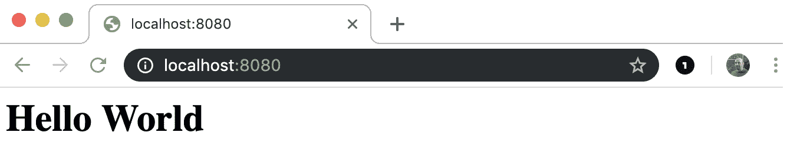

图 15.03：多页服务器 – 主页

页面 1 的输出如下截图所示：


图 15.04：多页服务器 – 第一章

注意，它们仍然显示相同的信息。这是因为我们将我们的 `hello` 设置为服务器的处理器，这覆盖了我们的特定路径。我们可以修改我们的代码如下：

```go
func main() {
   http.HandleFunc("/chapter1", func(w http.ResponseWriter, r *http.Request) {
  msg := "<h1>Chapter 1</h1>"
  w.Write([]byte(msg))
   })
   http.Handle("/", hello{})
   log.Fatal(http.ListenAndServe(":8080", nil))
}
```

发生在这里的是，您从我们的服务器的主要处理器中移除了 `hello` 处理器，并将其与主要的 `/` 路径关联起来：

```go
http.Handle("/", hello{})
```

然后，您将一个 `handler` 函数与特定的 `/chapter1` 路径关联：

```go
http.HandleFunc("/chapter1", func(w http.ResponseWriter, r *http.Request) {
   msg := "Chapter 1"
   w.Write([]byte(msg))
})
```

现在，如果您停止并再次运行我们的服务器，您将看到 `/chapter1` 路径现在返回新的信息：

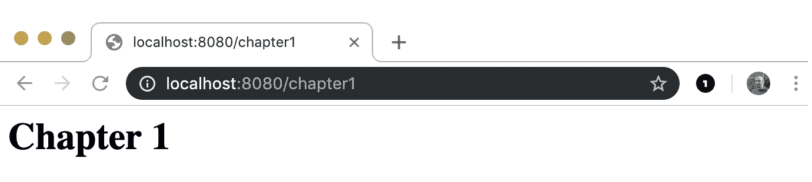

图 15.05：多页服务器重复 – 第一章

同时，所有其他路径都返回旧的 `Hello World` 信息。


图 15.06：多页服务器 – 基础页面

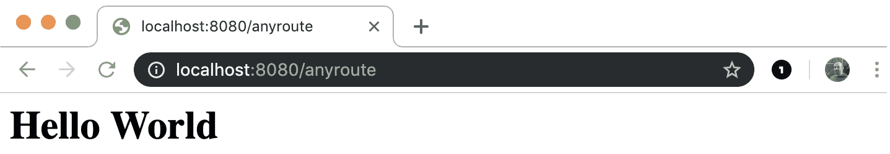

图 15.07：未设置的页面返回默认设置

# 处理器与处理器函数

如您可能已注意到的，我们之前使用了两个不同的函数，`http.Handle` 和 `http.HandleFunc`，这两个函数都以路径作为它们的第一个参数，但在第二个参数方面有所不同。这两个函数都确保特定的路径由一个函数处理。然而，`http.Handle` 期望 `http.Handler` 处理路径，而 `http.HandleFunc` 期望一个函数来做同样的事情。

如我们之前所见，`http.Handler` 是任何具有此签名的结构体：

```go
ServeHTTP(w http.ResponseWriter, r *http.Request)
```

因此，在两种情况下，都始终会有一个以 `http.ResponseWriter` 和 `*http.Request` 为参数的函数来处理路径。至于何时选择其中一个，在很多情况下可能只是个人偏好的问题，但在创建复杂项目时，例如，选择正确的方法可能很重要。这样做将确保项目的结构是最优的。不同的路由如果由属于不同包的处理程序处理，可能会显得更有组织，或者可能需要执行非常少的操作，就像我们之前的例子一样；而一个简单的函数可能就是理想的选择。

通常，对于只有几个简单页面的简单项目，你可以选择 `HandleFunc`。例如，假设你想要有静态页面，并且每个页面没有复杂的行为。在这种情况下，仅仅为了返回静态文本而使用一个空的空结构体将是过度设计。当需要设置一些参数或想要跟踪某些内容时，处理程序更为合适。作为一个一般规则，如果我们说，如果你有一个计数器，`Handler` 是最佳选择，因为你可以用一个计数为 0 的 `struct` 来初始化，然后增加它，但我们将这在 *活动 15.01* 中看到。

## 活动 15.01：向 HTML 页面添加页面计数器

想象一下，你拥有一个网站，比如有三个页面，你在上面写你的书。你的收入取决于你的网站访问量。为了了解你的网站有多受欢迎，以及你赚了多少钱，你需要跟踪访问量。

在这个活动中，你将构建一个包含三个页面、一些内容的 HTTP 服务器，并在每个页面上显示该页面迄今为止的访问次数。你将使用 `http.Handler` 方法，在这种情况下，这将帮助你泛化计数器。

为了显示动态值，你可以使用 `fmt` 包中的 `fmt.Sprintf` 函数，该函数将打印并格式化一条消息到字符串中。使用此函数，你可以构建包含字符和数字的字符串。你可以在 Go 文档中找到有关此方法的所有信息。

你将使用迄今为止所学的一切，包括如何实例化结构体、如何设置结构体的属性、指针、如何增加一个整数，以及当然，你迄今为止所学的关于 HTTP 服务器的所有内容。

观察以下步骤将提供一种优雅而有效的解决方案：

1.  创建一个名为 `page-counter` 的文件夹。

1.  创建一个名为 `main.go` 的文件。

1.  向 `http` 和 `fmt` 包添加必要的导入。

1.  定义一个名为 `PageWithCounter` 的结构体，其中包含一个整型属性 `counter`，一个 `content`，以及一个文本属性 `heading`。

1.  向结构体添加一个 `ServeHTTP` 方法，能够显示内容、标题以及总访问次数的消息。

1.  创建你的 `main` 函数，并在其中实现以下内容：

1.  实例化三个`PageWithCounter`类型的处理器，分别带有`Hello World`、`Chapter 1`和`Chapter 2`的标题和一些内容。

1.  将三个处理器添加到路由`/`、`/chapter1`和`/chapter2`。

1.  在端口`8080`上运行服务器。

当你运行服务器时，你应该看到以下内容：

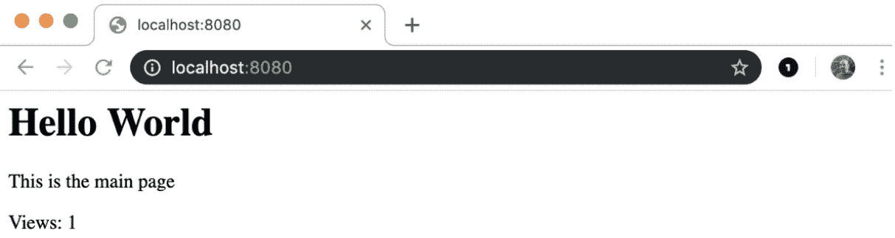

图 15.08：第一次运行服务器时的浏览器输出

如果你刷新页面，你应该看到以下内容：

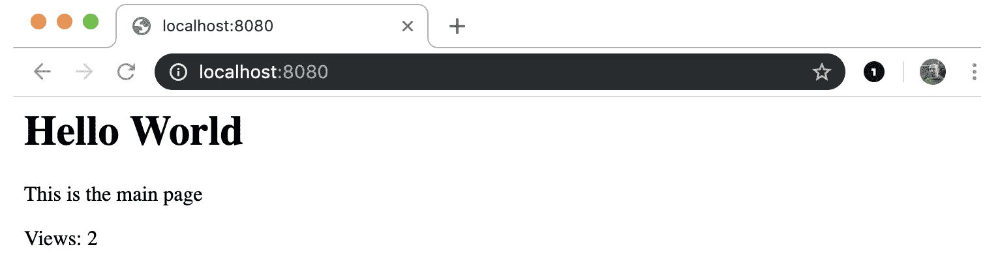

图 15.09：第二次运行服务器时的浏览器输出

接下来，在地址栏中输入`localhost:8080/chapter1`以导航到第一章。你应该能看到以下类似的内容：

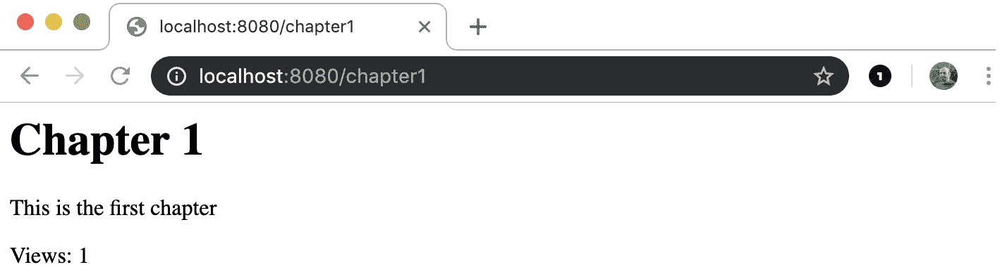

图 15.10：第一次访问 chapter1 页面时的浏览器输出

类似地，导航到第二章，你应该能看到以下查看次数的增加：

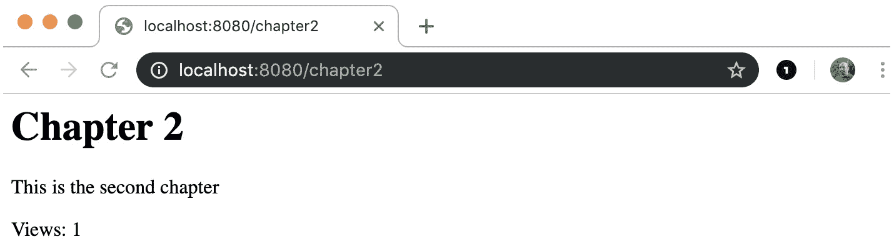

图 15.11：第一次访问 chapter2 页面时的浏览器输出

当你再次访问第一章时，你应该看到如下所示的查看次数增加：

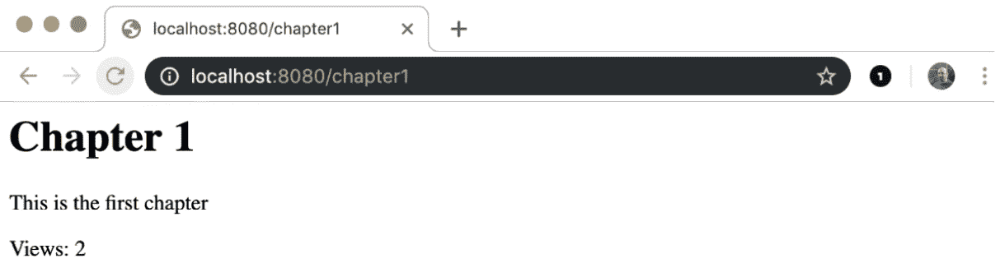

图 15.12：第二次访问 chapter1 页面时的浏览器输出

注意

本活动的解决方案可以在第 757 页找到

在这个活动中，你学习了如何创建一个服务器，该服务器能够对不同页面上的不同请求做出特定静态文本的响应，并在每个页面上都有一个计数器，每个计数器与其他计数器独立。

# 返回复杂数据结构

到目前为止我们所看到的内容在构建网站时是有用的，尽管，为了这个目的，我们仍然需要了解如何更好地渲染 HTML 页面。你可能想使用像 **revel** 或 **gin** 这样的框架来完成这个任务，尽管纯 Go 加上几个库对于生产级别的网站来说已经足够了。然而，你会发现 HTTP 服务器不仅用于构建网站，还用于构建网络服务，尤其是现在，微服务。尽管如何构建基于网络服务的项目超出了本章和本书的范围，但了解如何让你的 HTTP 服务器为不会通过浏览器由人类消费，而是由另一个程序消费的内容提供服务是很重要的。你可能已经知道什么是网络服务，即使你不知道，你也可能需要在需要修改网络服务的现有项目上工作。有几种方式可以向另一个程序（称为客户端）传递消息，但通常，它们都将涉及某种形式的结构化文本，这些文本可以很容易地被解析。格式可以是 XML 字符串，但现在最常见且轻量级的格式是 JSON。在下一个练习中，我们将看到如何构建一个数据结构并将其以 JSON 字符串的形式发送给客户端（无论是浏览器还是另一个程序）。

## 活动 15.02：使用 JSON 有效负载处理请求

在这个活动中，你将创建一个数据结构，并通过 HTTP 服务器提供服务。你将利用你已经学到的关于 JSON 和结构体的编码/解码的知识，并将其与关于 HTTP 服务器的知识结合起来。你可能已经猜到了，但在这个练习中，你已经拥有了完成它所需的所有知识，你应该能够独立完成它。现在让我们再建一本书。标题和章节都是相同的，但这次我们希望让它能够被一个程序访问，该程序将作为 JSON 文档消费服务器上的页面。该文档还将包括每个章节的查看次数，以便代码可以利用在 *活动 15.01* 中生成的代码。步骤如下：

1.  创建一个新的文件夹名为 `book-api`。

1.  在该文件夹中创建一个名为 `main.go` 的文件。

1.  添加所需的导入。

1.  创建一个名为 `PageWithCounter` 的结构体，表示一个具有标题、内容和计数器的书籍，如果需要，可以添加适当的 JSON 标签。

1.  向结构体添加一个 `ServeHTTP` 方法，能够以 JSON 文档的形式显示内容、标题以及包含总查看次数的消息。

1.  创建 `main()` 函数。

1.  实例化三个 `PageWithCounter` 类型的处理器，标题分别为 `Hello World`、`Chapter 1` 和 `Chapter 2`，并包含一些内容。

1.  将三个处理器添加到路由 `/`、`/chapter1` 和 `/chapter2`。

1.  在端口 `8080` 上运行服务器。

运行你的服务器，你应该能看到分配的以下路由：

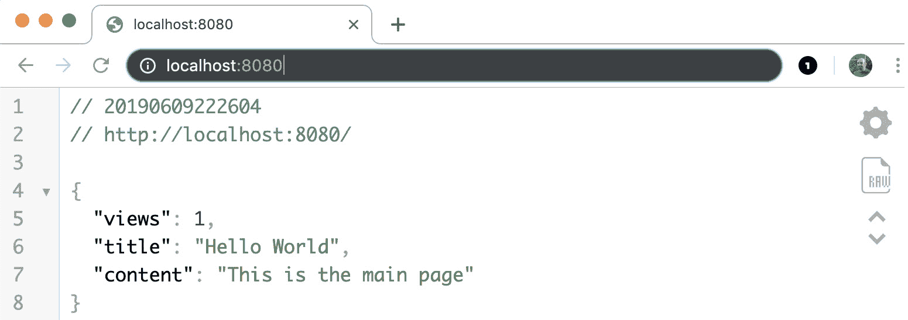

]

图 15.13：当处理器为 / 时的预期输出

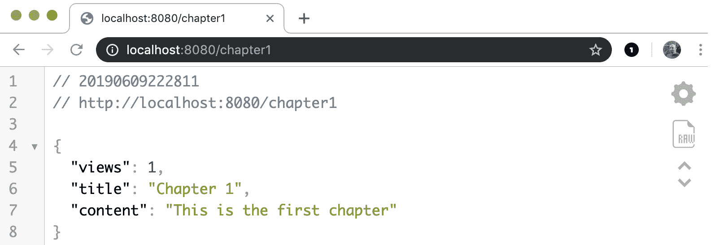

图 15.14：当处理器为 /chapter1 时的预期输出

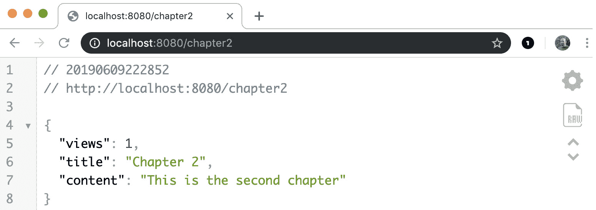

图 15.15：当处理器为 /chapter2 时的预期输出

在这个活动中，你学习了如何通过 HTTP 服务器返回复杂结构。任何类型的复杂数据结构都可以通过这种方式提供，使用标准的格式，如 JSON。

注意

本活动的解决方案可以在第 761 页找到

# 动态内容

仅提供静态内容的服务器是有用的，但可以做更多的事情。HTTP 服务器可以根据更细粒度的请求提供内容，这是通过向服务器传递一些参数来完成的。有很多种方法可以做到这一点，但一种简单的方法是将参数传递给 `querystring`。如果服务器的 URL 是：

```go
http://localhost:8080
```

然后，我们可以添加如下内容：

```go
http://localhost:8080?name=john
```

在这里，`?name=john` 这部分被称为 `querystring`，因为它是一个表示查询的字符串。在这种情况下，这个 `querystring` 设置了一个名为 `name` 的变量，其值为 `john`。这种方式通常用于 `GET` 请求中传递参数，而 `POST` 请求通常使用请求体来发送参数。这并不意味着 `GET` 请求没有请求体，但不是向 `GET` 请求传递参数的标准方式。我们将首先查看如何接受 `GET` 请求的参数，因为这种请求只需在特定地址上打开浏览器即可完成。我们将在稍后看到如何通过表单处理 `POST` 请求。

在下一个练习中，你将能够返回不同的文本作为对 HTTP 请求的响应，其中文本取决于用户在地址栏中的 `querystring` 中输入的值。

## 练习 15.03：个性化欢迎

在这个练习中，我们将再次创建一个 HTTP 服务器，它能够为我们欢呼，但与一般的 "`hello world`" 消息不同，我们将提供一个根据我们的名字的消息。想法是，通过在服务器的 URL 上打开浏览器并添加一个名为 `name` 的参数，服务器将用消息 "`hello` " 欢迎我们，后面跟着 `name` 参数的值。服务器非常简单，没有子页面，但包含这个动态元素，它是更复杂情况的一个起点：

1.  在名为 `personalised-welcome` 的新文件夹中创建一个名为 `main.go` 的文件。在文件中，添加包名：

    ```go
    package main
    ```

1.  然后，添加所需的导入：

    ```go
    import (
       "fmt"
       "log"
       "net/http"
       "strings"
    )
    ```

1.  它们都是之前练习和活动中使用的相同导入，没有新的内容。在这个练习中，我们不会使用处理器，因为它很小，但我们将使用 `http.handleFunc` 函数。

1.  现在，在导入之后添加以下代码：

    ```go
    func Hello(w http.ResponseWriter, r *http.Request) {
    ```

1.  这是定义一个可以作为 HTTP 路径处理函数使用的函数。

1.  现在，使用请求的`Query`方法将查询保存到一个变量中：

    ```go
       vl := r.URL.Query()
    ```

1.  请求对象的`URL`上的`Query`方法返回一个`map[string][]string`类型的映射，其中包含通过 URL 中的`querystring`发送的所有参数。然后我们将这个映射赋值给一个变量，`vl`。

1.  在这一点上，我们需要获取一个名为`name`的特定参数的值，因此我们从`name`参数中获取值：

    ```go
    name, ok := vl["name"]
    ```

1.  如您所见，我们有两个变量的赋值，但只有一个值来自`vl["name"]`。第二个变量`ok`是一个布尔值，它告诉我们`"name"`键是否存在。

1.  如果没有传递`name`参数，并且我们希望在变量未找到时显示错误消息，则如果变量不存在，即如果`ok`变量为假，则添加它：

    ```go
    if !ok {
       w.WriteHeader(400)
       w.Write([]byte("Missing name"))
       return
    }
    ```

1.  如果切片中不存在键，则会调用条件代码，并将`400`代码（错误请求）写入头部，同时向响应写入器发送一条消息，说明名称尚未作为参数发送。我们使用`return`语句停止执行以防止进一步的操作。

1.  在这一点上，将有效的消息写入响应写入器：

    ```go
    w.Write([]byte(fmt.Sprintf("Hello %s", strings.Join(name, ","))))
    }
    ```

1.  此代码格式化一个字符串并将名称注入其中。使用`fmt.Sprintf`函数进行格式化，而使用`strings.Join`将`name`切片转换为字符串。请注意，`name`变量被设置为`vl["name"]`的值，但`vl`是一个`map[string][]string`类型的映射，这意味着它是一个键为字符串的映射，其值为字符串切片；因此，`vl["name"]`是一个字符串切片，需要转换为单个字符串。`strings.Join`函数接受切片的所有元素，并使用`","`作为分隔符构建一个单独的字符串。也可以使用其他字符作为分隔符。

1.  你必须编写的文件的最后一部分是：

    ```go
    func main() {
       http.HandleFunc("/", Hello)
       log.Fatal(http.ListenAndServe(":8080", nil))
    }
    ```

1.  如往常一样，创建了一个`main()`函数，然后将`Hello`函数关联到路径`"/"`，并启动了服务器。以下是三个不同 URL 的输出，其中两个是有效的，一个是缺少参数的：

![图 15.16：请求带有名称“john”的页面时的服务器输出]

![图片 B14177_15_16.jpg]

图 15.16：请求带有名称“john”的页面时的服务器输出

![图 15.17：请求带有名称的页面时的服务器输出]

![图片 B14177_15_17.jpg]

图 15.17：请求带有名称的页面时的服务器输出

![图 15.18：请求不带名称的页面时服务器输出的错误消息]

![图片 B14177_15_18.jpg]

图 15.18：请求不带名称的页面时服务器输出的错误消息

# 模板化

虽然当需要在软件程序之间共享复杂数据结构时，JSON 可能是最佳选择，但在一般情况下，当 HTTP 服务器打算由人类消费时，情况并非如此。在之前的练习和活动中，选择格式化文本的方式是 `fmt.Sprintf` 函数，这对于格式化文本是好的，但在需要更动态和复杂的文本时，它就远远不够了。正如您在之前的练习中已经注意到的，当将名称作为参数传递给观察到的 URL 时，返回的消息遵循特定的模式，这就是新概念出现的地方——模板。本质上，模板就像是一个带有一些空白的文本，模板引擎将取一些值并填充这些空白，正如您在以下图中可以看到的那样：

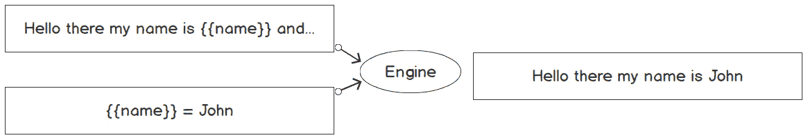


图 15.19：模板示例

如您所见，`{{name}}` 是一个占位符，当值传递给引擎时，占位符会与该值一起修改。

我们无处不在都能看到模板。我们有用于 Word 文档的模板，我们只需填写缺失的内容，就可以生成彼此不同的新文档。一位教师可能有一些用于他们课程的模板，并会从这个相同的模板中开发出不同的课程。Go 提供了两个不同的模板包，一个用于文本，一个用于 HTML。由于我们正在处理 HTTP 服务器，并且我们想要生成网页，我们将使用 HTML 模板包，但接口与文本模板库相同。尽管模板包对于任何实际应用都足够好，但还有几个其他外部包可以用来提高性能。其中之一是 `hero` 模板引擎，它比标准的 Go 模板包要快得多。

Go 模板包提供了一种占位符语言，我们可以使用如下内容：

```go
{{name}}
```

这是一个简单的搜索和替换块，但更复杂的情况可以通过条件语句来处理：

```go
{{if age}} Hello {{else}} bye {{end}}
```

在这里，如果 `age` 参数不为空，模板将显示 `Hello`；否则显示 `bye`。每个条件都需要一个 `{{end}}` 占位符来确定其结束。

然而，模板中的变量不需要是简单的数字或字符串；它们可以是对象。在这种情况下，如果我们有一个名为 `ID` 的字段的结构体，我们可以在模板中以这种方式引用该字段：

```go
{{.ID}}
```

这非常方便，意味着我们可以将结构体传递给模板，而不是传递许多单个参数。

在下一个练习中，您将看到如何使用 Go 的基本模板功能来创建带有自定义消息的页面，就像您之前所做的那样，但方式更加优雅。

## 练习 15.04：模板化我们的页面

这个练习的目的是构建一个更结构化的网页，使用模板，并用 URL 的`querystring`中的参数填充它。在这种情况下，我们想显示客户的基本信息，并在数据缺失时隐藏一些信息。一个客户有一个`id`、`name`、`surname`和`age`，如果这些数据项中的任何一个缺失，则不会显示。除非数据是`id`，就像这个例子一样，将显示错误消息：

1.  首先创建一个`server-template`文件夹，并添加一个`main.go`文件，就像通常一样，然后添加通常的包和一些导入：

    ```go
    package main
    import (
       "html/template"
       "log"
       "net/http"
       "strconv"
       "strings"
    )
    ```

1.  在这里，我们使用了两个新的导入，"`html/template`"用于我们的模板，以及"`strconv`"将字符串转换为数字（这个包也可以反过来工作，但还有更好的解决方案来格式化文本）。

1.  现在，编写以下内容：

    ```go
    var tplStr = `
    <html>
      <h1>Customer {{.ID}}
      {{if .ID }}
       <p>Details:</p>
       <ul>
       {{if .Name}}<li>Name: {{.Name}}</li>{{end}}
       {{if .Surname}}<li>Surname: {{.Surname}}</li>{{end}}
       {{if .Age}}<li>Age: {{.Age}}</li>{{end}}
       </ul>
      {{else}}
      <p>Data not available</p>
      {{end}}
    </html>
    `
    ```

1.  这是一个包含一些 HTML 和模板代码的原始字符串，这些代码被`{{}}`包裹，我们现在将对其进行分析。

1.  `{{.ID}}`基本上是一个占位符，告诉模板引擎，无论在哪里找到这段代码，它将被替换为名为`ID`的 struct 属性。Go 模板引擎与 struct 一起工作，所以基本上，一个 struct 将被传递到引擎，其属性的值将用于填充占位符。`{{if .ID}}`是一个条件，告诉模板接下来发生的事情将取决于`ID`的值。在这种情况下，如果`ID`不是一个空字符串，模板将显示客户的详细信息，否则它将显示消息`<p>Data not available</p>`，该消息被`{{else}}`和`{{end}}`占位符包裹。如您所见，第一个条件中嵌套了许多其他条件。在每个列表项中，都有一个`<li>`标签，例如，被`{{if .Name}}`包裹，并以`{{end}}`结束。

1.  现在我们有一个字符串模板，让我们创建一个具有正确属性的 struct。为了填充模板，请编写以下内容：

    ```go
    type Customer struct {
       ID int
       Name string
       Surname string
       Age int
    }
    ```

    这个结构体是自我解释的。它包含模板所需的所有属性。

1.  定义处理函数并设置一个变量到`querystring`中的值映射：

    ```go
    func Hello(w http.ResponseWriter, r *http.Request) {
       vl := r.URL.Query()
    ```

1.  实例化一个`cust`变量为`Customer`类型：

    ```go
    cust := Customer{}
    ```

1.  现在这个变量已经将其所有属性设置为默认值，我们需要从 URL 中获取传递的值。为了做到这一点，请编写以下内容：

    ```go
    id, ok := vl["id"]
    if ok {
       cust.ID, _ = strconv.Atoi(strings.Join(id, ","))
    }
    name, ok := vl["name"]
    if ok {
       cust.Name = strings.Join(name, ",")
    }
    surname, ok := vl["surname"]
    if ok {
       cust.Surname = strings.Join(surname, ",")
    }
    age, ok := vl["age"]
    if ok {
       cust.Age, _ = strconv.Atoi(strings.Join(age, ""))
    }
    ```

1.  如您所见，参数直接从值映射中获取，如果它们存在，则用于设置相关`cust`属性的值。为了检查这些参数是否存在，我们再次使用了`ok`变量，该变量被设置为具有值为`true`的布尔值，如果映射包含请求的键。最后一个属性`Age`的处理方式略有不同：

    ```go
    cust.Age, _ = strconv.Atoi(strings.Join(age, ""))
    ```

1.  这是因为`strconv.Atoi`在传入的参数实际上不是数字时会返回一个错误。一般来说，我们应该处理错误，但在这个例子中，我们只是忽略它，如果提供的年龄不是数字，我们不会显示任何与年龄相关的信息。

1.  接下来，编写：

    ```go
    tmpl, _ := template.New("test").Parse(tplStr)
    ```

1.  这创建了一个名为"`test`"的模板对象，其内容是你最初创建的字符串。我们再次忽略错误，因为我们确信我们编写的模板是有效的。然而，在生产环境中，所有错误都应该被处理。

1.  你现在可以完成函数的编写：

    ```go
       tmpl.Execute(w, cust)
    }
    ```

1.  在这里，模板实际上是通过使用`cust`结构体来执行的，内容直接发送到`w` `ResponseWriter`，而不需要手动调用`Write`方法。

1.  现在缺少的是`main`方法，它相当简单。编写以下内容：

    ```go
    func main() {
       http.HandleFunc("/", Hello)
       log.Fatal(http.ListenAndServe(":8080", nil))
    }
    ```

1.  简单来说，主路径与`Hello`函数相关联，然后启动服务器。

1.  这段代码的性能并不高，因为我们每次请求都会创建一个模板。模板可以在`main`中创建，然后传递给一个处理程序，该处理程序可以有一个类似于你刚刚编写的`Hello`函数的`ServeHTTP`方法。这里代码被保持简单，以便专注于模板。

1.  如果你现在启动服务器并访问以下页面，你应该会看到以下类似的输出：

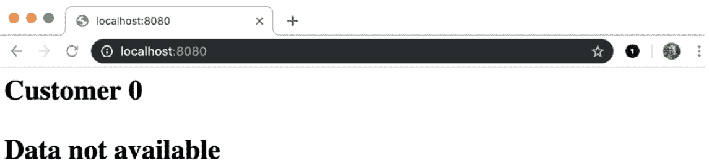

图 15.20：带有空参数的模板响应

现在，你可以在 URL 中添加一个名为`id`的查询参数，并将其设置为`1`：`localhost:8080/?id=1`：

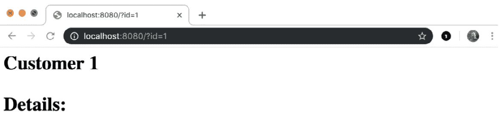

图 15.21：仅指定 ID 的模板响应

然后，你还可以通过访问地址`localhost:8080/?id=1&name=John`为名称参数添加一个值：

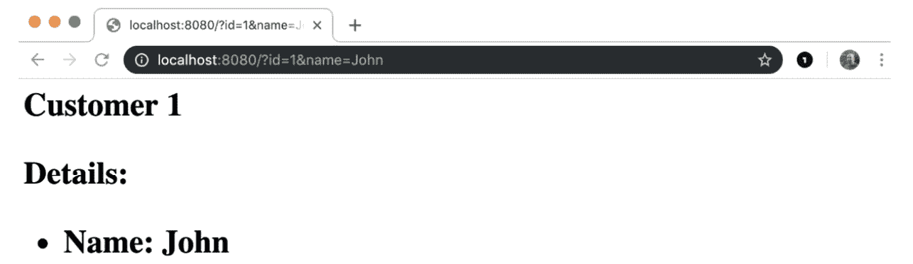

图 15.22：指定 ID 和名称的模板响应

最后，你还可以通过访问地址`localhost:8080/?id=1&name=John&age=40`添加一个年龄：

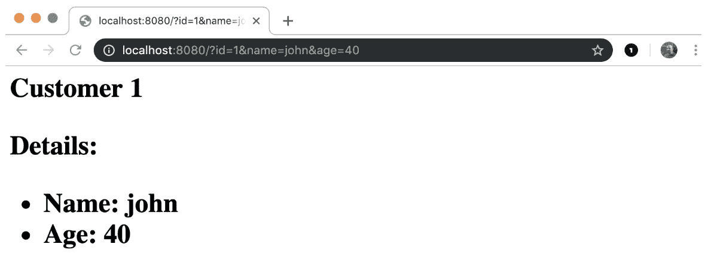

图 15.23：指定 ID、名称和年龄的模板响应

在这里，如果有效，`querystring`中的每个参数都会在 Web 应用程序中显示。

# 静态资源

在这本书中，你到目前为止所学的所有内容，直到最后一个练习，都足以构建网络应用程序和动态网站；你只需要将所有这些部分组合在一起。在本章中，你所做的是返回不同性质的消息，但这些消息都是作为字符串硬编码的。即使是动态消息，也基于在练习和活动源文件中硬编码的模板。现在让我们考虑一下。在第一个"`hello world`"服务器的例子中，消息从未改变。如果我们想修改消息并返回一个"`Hello galaxy`"的消息，我们就必须更改代码中的文本，然后重新编译和/或再次运行服务器。如果你想要出售你的简单"hello"服务器并给每个人指定一个自定义消息的选项呢？当然，你应该把源代码给每个人，这样他们就可以重新编译和运行服务器。虽然你可能想要拥抱开源代码，但这可能不是分发应用程序的理想方式，我们需要找到一种更好的方法来将消息与服务器分离。一个解决方案是提供静态文件，这些文件是由你的程序作为外部资源加载的。这些文件不会改变，也不会被编译，但会被你的程序加载和处理。一个这样的例子可能是模板，就像之前看到的，因为它们只是文本，你可以使用模板文件而不是将模板作为文本添加到你的代码中。另一个静态资源的简单例子是你想要包含在网页中的图像，或者 CSS 样式文件。你将在接下来的练习和活动中看到如何做到这一点。你将能够提供特定的文件或特定的文件夹，然后你会看到如何使用静态模板提供动态文件。

## 练习 15.05：使用静态文件创建 Hello World 服务器

在这个练习中，你将再次创建你的 hello world 服务器，但这次使用静态 HTML 文件。我们想要的是一个简单的服务器，它有一个处理函数，该函数查找具有特定名称的特定文件，该文件将作为每个路径的输出提供。在这种情况下，你需要在你的项目中创建多个文件：

1.  创建一个名为`static-file`的文件夹，并在其中创建一个名为`index.html`的文件。然后，在这个文件中插入以下代码，这是一个非常简单的 HTML 文件，包含一个标题和一个`h1`标签，其中包含我们的欢迎信息：

    ```go
    <!DOCTYPE html>
    <html lang="en">
    <head>
      <meta charset="UTF-8">
      <title>Welcome</title>
    </head>
    <body>
      <h1>Hello World</h1>
    </body>
    </html>
    ```

1.  现在，创建一个名为`main.go`的文件，并开始编写必要的导入：

    ```go
    package main
    import (
       "log"
       "net/http"
    )
    ```

1.  现在，编写`main`函数：

    ```go
    func main() {
    ```

1.  现在，编写`handler`函数：

    ```go
       http.HandleFunc("/", func (w http.ResponseWriter, r *http.Request) {
      http.ServeFile(w, r, "./index.html")
       })
    ```

1.  这就是魔法发生的地方。你可以看到一个正常的`http.HandleFunc`被调用，其第一个参数是`"/"`路径，然后传递了一个处理函数，该函数包含一条单独的指令：

    ```go
    http.ServeFile(w, r, "./index.html")
    ```

1.  这实际上是将"`index.html`"文件的内容发送到`ResponseWriter`。

1.  现在，编写最后一部分：

    ```go
       log.Fatal(http.ListenAndServe(":8080", nil))
    }
    ```

1.  如同往常一样，这启动了服务器，在出错时记录，然后退出程序。

1.  如果你现在保存文件，并且用以下方式运行程序：

    ```go
      go run main.go
    ```

    然后你打开浏览器在`localhost:8080`页面上，你应该看到以下内容：

    ![图 15.24：带有静态模板文件的 Hello world]

    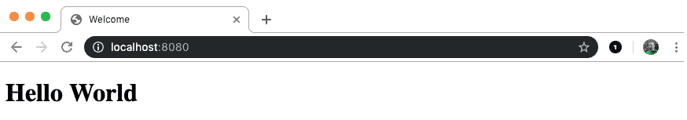

    ![图 15.24：带有静态模板文件的 Hello world]

1.  但现在，不需要停止你的服务器，只需更改 HTML 文件，`index.html`，并修改第`8`行，你看到：

    ```go
      <h1>Hello World</h1>
    ```

1.  修改`<h1>`标签中的文本：

    ```go
      <h1>Hello Galaxy</h1>
    ```

1.  保存`index.html`文件，并且不要触摸终端，也不要重新启动你的服务器，只需在同一个页面上刷新你的浏览器，你现在应该看到以下内容：![图 15.25：修改后的静态模板文件的 Hello world 服务器]

    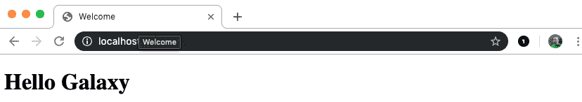

    图 15.25：修改后的静态模板文件的 Hello world 服务器

1.  因此，即使服务器正在运行，它也会选择文件的新版本。

    在这个练习中，你看到了如何使用静态 HTML 文件来服务一个网页，以及如何将静态资源从你的应用程序中分离出来，使你能够在不重新启动应用程序的情况下更改你提供的服务页面。

# 获取一些样式

到目前为止，你已经看到了如何服务一个静态页面，你可能考虑使用相同的方法服务几个页面，也许创建一个具有要服务文件名称的 handler struct 作为属性。对于大量页面来说，这可能不太实用，尽管在某些情况下这是必要的。然而，一个网页不仅仅包括 HTML 代码，还包括图片和样式，以及一些前端代码。本书的范围并不包括如何构建 HTML 页面，甚至更少涉及如何编写 JavaScript 代码或 CSS 样式表，但你需要知道如何作为我们使用一个小 CSS 文件来构建我们的示例来服务这些文档。服务静态文件和将模板放在不同的文件中，或者一般使用外部资源，是我们项目中分离关注点的好方法，使我们的项目更易于管理和维护，因此你应该尝试在所有项目中遵循这种方法。

为了将样式表添加到您的 HTML 页面中，您需要添加一个如下所示的标签：

```go
<link rel="stylesheet" href="file.css">
```

这将 CSS 文件注入页面作为“样式表”，但这在这里只是作为一个例子，以防你对学习如何编写 HTML 感兴趣。

你也看到了我们是如何逐个从文件系统中读取文件来服务的，但 Go 为我们提供了一个简单的函数来完成这项工作：

```go
http.FileServer(http.Dir("./public"))
```

实际上，`http.FileServer`创建的就是它名字所描述的：一个服务外部文件的服务器，它从`http.Dir`中定义的目录中获取文件。无论我们在"`./public`"目录中放置什么文件，都将自动可访问，并在地址栏中添加：

```go
http://localhost:8080/public/myfile.css
```

这看起来已经足够好了。然而，在现实世界的场景中，你不想暴露你的文件夹名称，并且你想为你的静态资源指定一个不同的名称。这是通过以下方式实现的：

```go
http.StripPrefix(
  "/statics/",
  http.FileServer(http.Dir("./public")),
   )
```

你可能会注意到 `http.FileServer` 函数被一个 `http.StripPrefix` 函数包装，我们使用它来将请求的路径与文件系统上的正确文件关联起来。本质上，我们希望一个 `/statics` 形式的路径可用，并将其绑定到 `public` 文件夹的内容。`StripePrefix` 函数将从请求中移除 `"/statics/"` 前缀，并将其传递给文件服务器，文件服务器将只获取要服务的文件名，并在 `public` 文件夹中搜索它。如果你不想更改路径和文件夹的名称，不需要使用这些包装器，但这个解决方案是通用的，并且适用于任何地方，所以你可以在其他项目中使用它而不用担心。

## 练习 15.06：风格化欢迎

本练习的目的是显示一个欢迎页面，利用一些外部静态资源。我们将采用与 *练习 15.05* 相同的方法，但我们将添加一些额外的文件和代码。我们将一些样式表放在一个 `static` 文件夹中，并且我们将提供它们，以便它们可以被同一服务器提供的其他页面使用：

1.  作为第一步，创建一个名为 `stylish-welcome` 的文件夹，并在该文件夹内添加一个名为 `index.html` 的文件，并包含以下内容：

    ```go
    <!DOCTYPE html>
    <html lang="en">
    <head>
      <meta charset="UTF-8">
      <title>Welcome</title>
      <link rel="stylesheet" href="/statics/body.css">
      <link rel="stylesheet" href="/statics/header.css">
      <link rel="stylesheet" href="/statics/text.css">
    </head>
    <body>
      <h1>Hello World</h1>
      <p>May I give you a warm welcome</p>
    </body>
    </html>
    ```

1.  如你所见，与之前的 HTML 相比，有一些细微的差别；我们有一个包含更多文本的段落，被 `<p>` 标签包裹，并且在 `<head>` 标签内，我们包含了三个指向外部资源的链接。

1.  现在，在你的 `stylish-welcome` 文件夹内创建一个名为 `public` 的文件夹，并在其中创建三个文件，文件名和内容如下：

    `header.css`

    ```go
    h1 {
      color: brown;
    }
    ```

    `body.css`

    ```go
    body {
      background-color: beige;
    }
    ```

    `text.css`

    ```go
    p {
      color: coral;
    }
    ```

1.  现在，回到你的主项目文件夹 `stylish-welcome`，并创建 `main.go` 文件。文件开头的内容与之前的练习中的内容完全相同：

    ```go
    package main
    import (
       "log"
       "net/http"
    )
    func main() {
       http.HandleFunc("/", func (w http.ResponseWriter, r *http.Request) {
      http.ServeFile(w, r, "./index.html")
       })
    ```

1.  现在，添加以下代码来处理静态文件：

    ```go
    http.Handle(
       "/statics/",
       http.StripPrefix(
      "/statics/",
      http.FileServer(http.Dir("./public")),
       ),
    )
    ```

1.  此代码向 "`/statics/`" 路径添加了一个处理程序，它是通过一个 `http.FileServer` 函数实现的，该函数返回一个静态文件处理程序。

1.  这个函数需要一个用于抓取的目录，我们传递一个给它作为参数：

    ```go
    http.Dir("./public")
    ```

1.  这读取你之前创建的本地 "`public`" 文件夹。

1.  现在，将以下内容添加到文件中：

    ```go
    log.Fatal(http.ListenAndServe(":8080", nil))
    }
    ```

1.  这里，服务器再次创建，`main()` 函数被关闭。如果你现在再次运行你的服务器，使用：

    ```go
      go run main.go
    ```

1.  你现在会看到以下内容：![图 15.26：样式化主页

    ![图片 B14177_15_26.jpg]

    图 15.26：样式化主页

    因此，HTML 文件现在正在从你最初创建的样式表中获取样式。

1.  现在我们来检查文件是如何注入的。如果你回顾一下 `index.html` 文件，你会看到这些行：

    ```go
    <link rel="stylesheet" href="/statics/body.css">
    <link rel="stylesheet" href="/statics/header.css">
    <link rel="stylesheet" href="/statics/text.css">
    ```

1.  因此，本质上，我们正在寻找路径 `"/statics/"` 下的文件。因此，你可以访问这些地址，你会看到：![图 15.27：body CSS 文件

    ![图片 B14177_15_27.jpg]

    图 15.27：body CSS 文件

    ![图 15.28：header CSS 文件]

    ![图片 B14177_15_28.jpg]

    图 15.28：header CSS 文件

    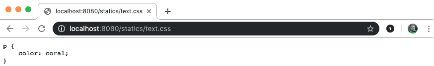

    图 15.29：text CSS 文件

1.  因此，所有样式表都已被提供。此外，你甚至可以在这里查看：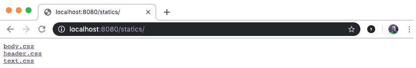

    图 15.30：在浏览器中可见的静态文件夹内容

1.  并且查看`public`文件夹中的所有文件，这些文件在`/statics/`路径下提供服务。你可以看到，如果你需要一个简单的静态文件服务器，Go 允许你通过几行代码创建一个，并且通过更多的代码，你可以使其适用于生产环境。

1.  如果你使用 Chrome 浏览器，你可以通过右键点击来检查，或者如果你有开发者工具，也可以在任何浏览器中检查，你将看到类似以下内容：

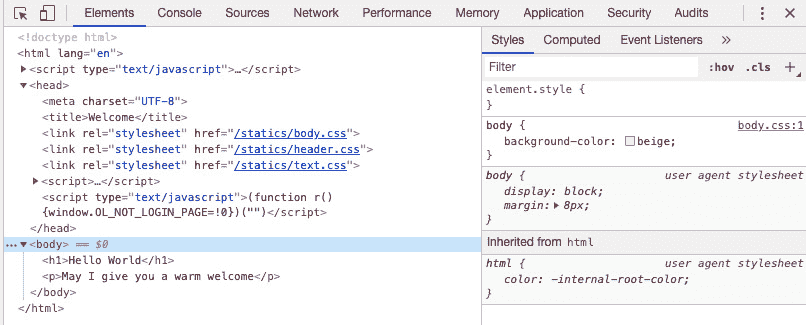

图 15.31：开发者工具显示加载的脚本

你可以看到文件已经被加载，并且样式显示为从右侧的样式表中计算得出的。

# 动态获取

静态资源通常以原样提供服务，但当你想要创建一个动态页面时，你可能想使用外部模板，这样你就可以即时使用它，这样你就可以在不重新启动服务器的情况下更改模板，或者你可以在启动时加载，这意味着你将不得不在更改后重新启动服务器（这并不完全正确，但我们需要一些并发编程的概念来实现这一点）。在启动时加载文件是为了性能原因。文件系统操作总是最慢的，即使 Go 是一种相当快的语言，你可能在想要提供页面时考虑性能，尤其是如果你有来自多个客户端的大量请求。

如你所回忆的，从前一个主题中，我们使用了标准的 Go 模板来制作动态页面。现在，我们可以将模板作为一个外部资源，并将我们的模板代码放入 HTML 文件中并加载它。模板引擎可以解析它，然后用传递的参数填充空白。为此，我们可以使用`html/template`函数：

```go
func ParseFiles(filenames ...string) (*Template, error)
```

这可以通过以下方式调用：

```go
template.ParseFiles("mytemplate.html")
```

此外，模板被加载到内存中，并准备好使用。

到目前为止，你一直是你的 HTTP 服务器的唯一用户，但在实际场景中，情况肯定不是这样。在接下来的示例中，我们将查看性能，并使用启动时加载的资源。

## 活动十五.03：外部模板

在这个活动中，你将创建一个欢迎服务器，就像你之前创建的那样，并且你必须使用模板包，就像你之前做的那样。然而，在这个活动中，我们不想让你从硬编码的字符串中创建模板，而是从一个包含所有模板占位符的 HTML 文件中创建模板。

你应该能够完成这个活动，利用你在本章和上一章中学到的知识。

此活动返回一个指向`template`的指针和一个错误列表。如果任何文件不存在或模板格式错误，则返回错误。在任何情况下，不要担心添加多个文件的可能性。坚持使用一个。

完成此活动的步骤如下：

1.  为你的项目创建一个文件夹。

1.  创建一个名为`index.html`等名称的模板，并用标准的 HTML 代码填充，包括欢迎信息和名称占位符。确保如果名称为空，信息将把“访客”这个词插入到名称应该出现的位置。

1.  创建你的`main.go`文件，并向其中添加正确的包和导入。

1.  在`main.go`文件中，创建一个包含名称的`struct`，该名称可以传递给一个模板。

1.  使用你的`index.html`文件创建一个模板。

1.  创建一个能够处理 HTTP 请求并使用`querystring`接收参数，并通过之前创建的模板显示数据的程序。

1.  将所有路径设置为服务器使用之前步骤中创建的函数或处理程序，然后创建服务器。

1.  运行服务器并检查结果。

    输出将如下所示：

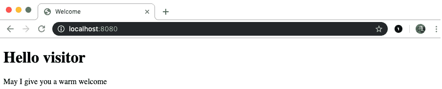

图 15.32：匿名访客页面

包含名称的访客页面看起来可能如下截图所示：

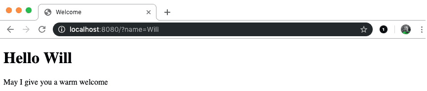

图 15.33：名为“Will”的访客页面

注意

此活动的解决方案可以在第 763 页找到

在这个活动中，你学习了如何创建一个模板化的 HTTP 处理程序作为结构体，它可以初始化为任何外部模板。你现在可以创建多个页面，使用不同的模板实例化相同的结构体。

# HTTP 方法

到目前为止，你通过网页浏览器检查了你的练习和活动的结果，只需访问一个地址，即你的 localhost，并得到一些以网页形式返回的结果。这种方式消费 HTTP 服务器使用的是所谓的`GET`方法。你在使用 HTTP 客户端时已经看到了这些方法，它们是除了`GET`或`POST`之外唯一可以使用的途径。然而，通过你的网页浏览器，你也可以使用`POST`方法，这种方法通常用于发送表单数据。虽然可以通过`GET`方法发送表单数据，但这种方法会将参数污染 URL，并且在可以发送的数据大小方面有一些限制。

还有其他常用的方法，这些是 `PUT` 和 `DELETE`，但您需要特定的客户端来使用它们。这就是为什么使用这四种方法来构建所谓的 `REST` API。还有其他方法，但本书的范围不涉及所有 HTTP 方法，而是专注于最常用的方法。`REST` API 实质上是一组 *路径* 和方法，它们响应特定的请求。公开 `REST` API 的 HTTP 服务器称为 `REST` 服务器。为了理解为什么有不同方法可用，您需要了解它们是如何使用的。如果您需要请求一些数据，您正在尝试获取这些数据，因此，`GET` 方法是最合适的。如果您相反，想要修改您已经熟悉的一个资源，您想在已知位置放置一些特定的值，您将使用 `PUT` 方法，这本质上会在已知位置更改服务器的状态。如果您需要以某种方式修改服务器的状态，您需要查找要修改的资源。例如，如果您不知道它们的 ID，您将使用 `POST` 方法。这就是为什么您经常在网上看到，关于何时使用 `POST` 和 `PUT` 的最常见解释是，前者用于添加资源，而后者用于更新资源。尽管这通常是真的，但并不总是如此，因为您也可能使用 `POST` 方法执行更新。

在下一个练习中，您将看到如何使用不同的方法，`GET` 和 `POST`，以相同的函数完成不同的事情。请注意，通常，您可能会使用更复杂的第三方库来编写更优雅的代码，但在这里，我们关注的是如何做基础，并展示标准 Go 库已经为我们提供了很多帮助来完成我们的工作。

## 练习 15.07：完成问卷

在这个练习中，您将构建一个表单，并将数据发送到另一个页面。表单将包含诸如您的姓名、姓氏和年龄等问题，这些数据将被发送到另一个页面，该页面将显示它们。您将利用您已经学到的知识，同时您还将了解如何从您的 `HTTP` 请求中获取 `posted` 参数。

1.  首先，创建一个名为 `questionnaire` 的文件夹，并在该文件夹内包含一个名为 `index.html` 的文件，其内容如下：

    ```go
    <!DOCTYPE html>
    <html lang="en">
    <head>
      <meta charset="UTF-8">
      <title>Welcome</title>
    </head>
    <body>
      <h1>Details</h1>
      <ul>
      <li>Name: {{.Name}}</li>
      <li>Surname: {{.Surname}}</li>
      <li>Age: {{.Age}}</li>
      </ul>
    </body>
    </html>
    ```

1.  这是一个显示个人信息项的正常模板。如果任何数据缺失，我们简单地将其显示为空字符串，而不是隐藏它们。

1.  现在，创建一个名为 `form.html` 的文件，并添加以下内容：

    ```go
    <!DOCTYPE html>
    <html lang="en">
    <head>
      <meta charset="UTF-8">
      <title>Form</title>
    </head>
    <body>
      <form method="post" action="/">
      <ul>
       <li>Name: <input type="text" name="name"></li>
      <li>Surname: <input type="text" name="surname"></li>
      <li>Age: <input type="text" name="age"></li>
      <li><input type="submit" name="send" value="send"></li>
      </ul>
      </form>
    </body>
    </html>
    ```

1.  这是在表单内部的一个另一页，包含三个文本输入和一个按钮。输入字段代表我们想要发送的详细信息。请注意，表单的动作设置为`"/"`，这意味着当点击按钮时，页面会被重定向到主路径，但会携带表单中的数据集。方法属性设置为`post`，这是我们之前讨论过的 HTTP 方法。

1.  现在，你必须创建实际的 Go 服务器。创建一个`main.go`文件并添加以下内容：

    ```go
    package main
    import (
       "html/template"
       "log"
       "net/http"
    )
    ```

1.  然后，为模板创建结构体：

    ```go
    type Visitor struct {
       Name string
       Surname string
       Age string
    }
    ```

    这包含了模板所需的全部属性。

1.  然后，执行以下命令：

    ```go
    type Hello struct {
       tpl *template.Template
    }
    ```

    这包含了之前看到的模板。

1.  在这一点上，你需要为处理程序创建`handler`函数，所以添加以下内容：

    ```go
    func (h Hello) ServeHTTP(w http.ResponseWriter, r *http.Request) {
       vst := Visitor{}
    ```

    这里，创建了一个新的空访客。

1.  检查请求是否为`Post`请求，因此你需要添加：

    ```go
    if r.Method == http.MethodPost {
    ```

    这检查方法与 Go `http`包提供的常量是否匹配。

1.  解析表单：

    ```go
       err := r.ParseForm()
       if err != nil {
      w.WriteHeader(400)
      return
       }
    ```

1.  如果解析表单时发生错误，我们返回`400`代码，这是一个错误请求。

1.  如果表单解析正确，我们可以继续，所以添加以下内容：

    ```go
       vst.Name =  r.Form.Get("name")
       vst.Surname = r.Form.Get("surname")
       vst.Age = r.Form.Get("age")
    }
    ```

    这里，表单中的所有参数都被分配给访客的属性。然后我们关闭`if`语句，转到处理程序函数的公共部分。

1.  由于我们有访客，无论表单是否已提交以及提交了什么值，我们最终可以返回页面，所以编写：

    ```go
       h.tpl.Execute(w, vst)
    }
    ```

1.  我们需要有一种方法来创建处理程序，所以，就像你之前做的那样，添加以下函数：

    ```go
    func NewHello(tplPath string) (*Hello, error){
       tmpl, err := template.ParseFiles(tplPath)
       if err != nil {
      return nil, err
       }
       return &Hello{tmpl}, nil
    }
    ```

1.  在这一点上，你可以编写`main()`函数，它创建处理程序，将其分配给主路径，然后将静态`form.html`文件分配给`/form`路径：

    ```go
    func main() {
       hello, err := NewHello("./index.html")
       if err != nil {
      log.Fatal(err)
       }
       http.Handle("/", hello)
       http.HandleFunc("/form", func(writer http.ResponseWriter, request *http.Request) {
      http.ServeFile(writer, request, "./form.html")
       })
       log.Fatal(http.ListenAndServe(":8080", nil))
    }
    ```

1.  运行你的服务器，你将看到以下内容，当你访问主页时：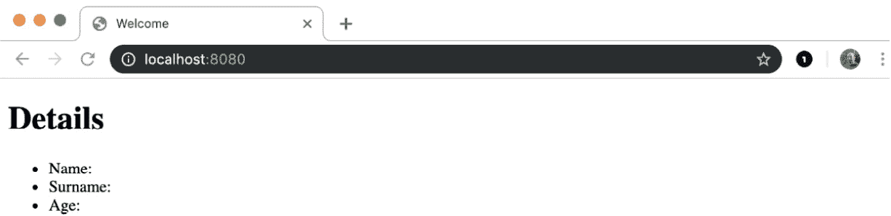

    图 15.34：空详情页面

1.  如果你访问`/form`路径，你会看到：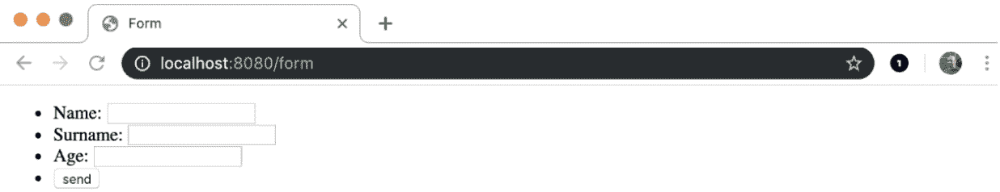

    图 15.35：空表单页面

1.  如果你填写了数据：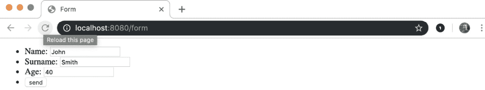

    图 15.36：已填写表单页面

1.  然后按下`send`按钮，你将被重定向到这个页面：

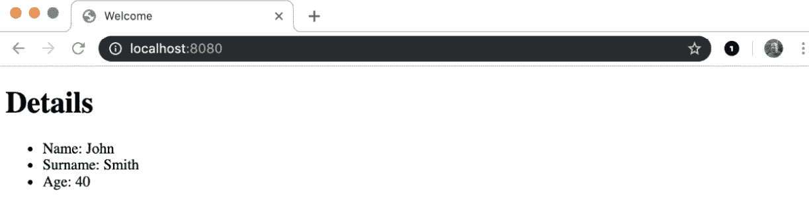

图 15.37：添加了详情的页面

这，同样，是设置了通过表单中输入的参数的详情的主页面。

# JSON 加载

并非所有 HTTP 服务器都是为了被浏览器和人类用户使用。很多时候，我们有不同的软件程序在相互通信。这些程序需要通过一个共同接受的格式相互发送消息，其中之一就是 JSON。这代表 JavaScript 对象表示法，本质上意味着它模仿了在 JavaScript（另一种编程语言）中直接创建对象的方式。它是一个简单的格式，不是特别冗长，并且易于软件解析和人类阅读。然而，作为用户，你可以使用许多工具中的任何一个来发送和接收 JSON 有效负载，其中最常见的是**Insomnia**和**Postman**，你可以在网上轻松找到它们，网址分别是[`packt.live/2RY13Dt`](https://packt.live/2RY13Dt)和[`packt.live/2RY13Dt`](https://packt.live/2RY13Dt)。

它们都是免费的，并且适用于不同的平台。你也可以使用`curl`作为命令行工具，但这会变得复杂一些。

## 练习 15.08：构建接受 JSON 请求的服务器

在这个练习中，你将构建一个接受 JSON 消息的服务器，并以另一个 JSON 消息作为响应。你将无法使用浏览器来测试它，但你可以使用像**Insomnia**或**Postman**这样的客户端来测试。示例截图将使用**Insomnia**提供，所以最好你也使用相同的工具。你将构建的服务器接受包含名字和姓氏的消息，并返回包含一些个性化问候的消息：

1.  创建一个名为`json-server`的文件夹，并在其中添加一个名为`main.go`的文件。开始向文件中添加包和导入：

    ```go
    package main
    import (
       "encoding/json"
       "fmt"
       "log"
       "net/http"
    )
    ```

    这里，导入的包是 HTTP 编程、日志记录、字符串格式化和当然，JSON 编码的常规包。

1.  在此之后，你需要为传入和传出的消息创建模型，所以编写以下内容：

    ```go
    type Request struct {
       Name string
       Surname string
    }
    type Response struct {
       Greeting string
    }
    ```

    这些结构体相当简单，只包含我们所需要的部分。

1.  现在，添加`main`函数：

    ```go
    func main() {
    ```

1.  现在将函数设置为处理 JSON 消息：

    ```go
       http.HandleFunc("/", func(wr http.ResponseWriter, req *http.Request) {
      decoder := json.NewDecoder(req.Body)
    ```

    如你所见，函数内部的第一件事是创建一个 JSON 解码器，它将解码请求的主体。

1.  作为下一步，编写以下内容：

    ```go
    var data Request
    err := decoder.Decode(&data)
    if err != nil {
       wr.WriteHeader(400)
       return
    }
    ```

1.  在这里，我们定义了一个`Request`类型的数据变量，并将 HTTP 请求的主体解码到它里面。如果发生任何错误，我们返回一个`400`错误代码表示请求无效。

1.  一旦数据被正确解码，你现在可以使用这些数据来创建响应：

    ```go
    rsp := Response{Greeting: fmt.Sprintf("Hello %s %s", data.Name, data.Surname)}
    ```

1.  在这里，请求中的名字和姓氏被合并成一个个性化的问候信息。

1.  现在剩下的就是将信息发送回请求者：

    ```go
       bts, err := json.Marshal(rsp)
       if err != nil {
      wr.WriteHeader(400)
      return
       }
       wr.Write(bts)
    })
    ```

1.  在这里，响应被编码成一个 JSON 字符串并发送，将其作为字节数组写入响应写入器。现在你可以运行服务器并打开`Insomnia`：

1.  现在，创建`main()`函数来提供页面服务：

    ```go
    func main() {
      http.HandleFunc("/", Hello)
      log.Fatal(http.ListenAndServe(":8080", nil))
    }
    ```

    运行前面的代码会产生以下输出：

![图 15.38：Insomnia 响应]

![img/B14177_15_38.jpg]

图 15.38：Insomnia 响应

如您所见，您可以使用 Insomnia 发送 `post` 请求并将 JSON 字符串发送到您的服务器。在右侧，您将看到作为 JSON 文档的响应。

# 摘要

在本章中，您已经了解了网络编程的服务器端。您学习了如何接受来自 HTTP 客户端的请求并以适当的方式响应。您学习了如何通过路径和子路径将可能的请求分离到 HTTP 服务器的不同区域。为此，您使用了一个简单的路由机制和标准的 `Go HTTP` 包。您看到了如何返回响应以适应不同的消费者：为合成客户端返回 JSON 响应，为人类访问返回 HTML 页面。您还看到了如何使用模板来格式化您的纯文本和 HTML 消息，使用标准的模板包。您学习了如何提供和使用静态资源，直接通过默认文件服务器或通过模板对象提供。您还学习了什么是 `REST` 服务，尽管我们还没有一起构建一个，但您已经拥有了创建一个所需的所有知识，只要您遵循您所得到的描述。在这个阶段，您已经了解了构建生产级 HTTP 服务器的所有基础知识，尽管您可能想要使用一些外部库来简化您的 hello world 示例，通过使用像 `gorilla mux` 或通常的整个 `gorilla` 包来更好地实现路由，这是一个在 `http` 包之上的低级抽象。您可以使用 `hero` 作为模板引擎来加快页面渲染速度。有一点需要提及的是，您可以使用本章中学到的知识创建几乎无状态的服务，但您目前无法创建一个生产级的有状态服务器，因为您不知道如何处理并发请求。这意味着我们的 `视图计数器` 还不适合生产服务器，但这将是下一章的主题。

在下一章中，您将看到 Go 如何利用 Goroutines 系统同时处理多个任务。这个特性非常重要，您可以将它应用到 HTTP 服务器和其他类型的项目中，在这些项目中您有很多并发用户或您想要同时做很多事情。
