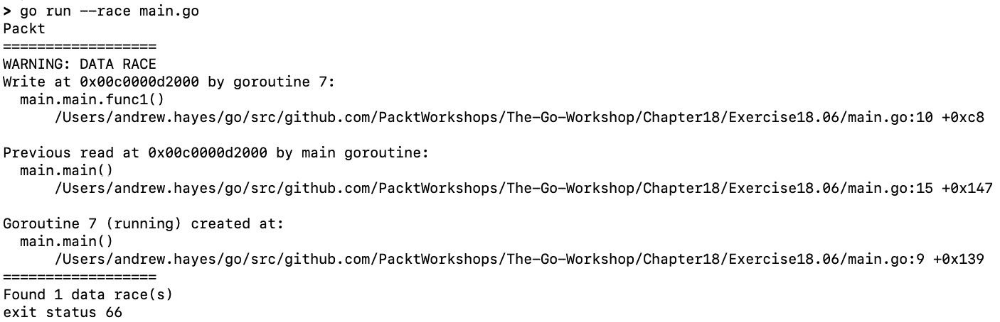
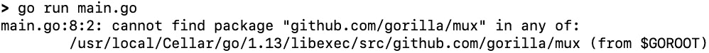

# 17. 使用 Go 工具

概述

本章将教你如何利用 Go 工具库来改进和构建你的代码。它还将帮助你使用 Go 工具构建和改进你的代码，并使用`go build`创建二进制文件。它将向你展示如何使用`goimports`清理库导入，使用`go vet`检测可疑结构，以及使用 Go 竞态检测器识别代码中的竞态条件。

到本章结束时，你将能够使用`go run`运行代码，使用`gofmt`格式化代码，使用`go doc`自动生成文档，以及使用`go get`下载第三方包。

# 简介

在上一章中，你已经学会了如何生成并发代码。虽然与其它语言相比，Go 使创建并发代码的任务变得容易得多，但并发代码本质上很复杂。这就是学习使用工具来编写更好的代码，从而简化复杂性的时候。

在本章中，你将了解 Go 工具。Go 附带了一些工具来帮助你编写更好的代码。例如，在前面的章节中，你遇到了`go build`，你用它将代码构建成可执行文件。你也遇到了`go test`，你用它来测试代码。还有一些其他工具以不同的方式帮助。例如，`goimports`工具将检查你是否有了使你的代码正常工作所需的全部导入语句，如果没有，它会添加它们。它还可以检查是否有任何导入语句不再需要，并删除它们。虽然这看起来很简单，但它意味着你不再需要担心导入，而可以专注于你正在编写的代码。或者，你可以使用 Go 竞态检测器来查找代码中隐藏的竞态条件。当你开始编写并发代码时，这是一个极其宝贵的工具。

Go 语言提供的工具是它受欢迎的原因之一。它们提供了一种标准的方式来检查代码的格式问题、错误和竞态条件，这在你在专业环境中开发软件时非常有用。本章中的练习提供了如何使用这些工具来改进你的代码的实用示例。

# go build 工具

`go build`工具将 Go 源代码编译成可执行文件。在创建软件时，你用人类可读的编程语言编写代码。然后，代码需要被翻译成机器可读的格式才能执行。这是通过编译器完成的，它从源代码编译出机器指令。要使用 Go 代码做这件事，你会使用`go build`。

## 练习 17.01：使用 go build 工具

在这个练习中，你将了解`go build`工具。它将你的 Go 源代码编译成二进制文件。要使用它，请在命令行上运行`go build`工具，如下所示：

```go
go build -o name_of_the_binary_to_create source_file.go
```

让我们开始吧：

1.  在你的 GOPATH 上创建一个名为`Exercise17.01`的新目录。在该目录内，创建一个名为`main.go`的新文件：

1.  将以下代码添加到文件中，以创建一个简单的 `Hello World` 程序：

    ```go
    package main
    import "fmt"
    func main() {
      fmt.Println("Hello World")
    }
    ```

1.  要运行程序，您需要打开您的终端并导航到您创建 `main.go` 文件所在的目录。然后，通过编写以下命令来运行 `go build` 工具：

    ```go
    go build -o hello_world main.go
    ```

1.  这将创建一个名为 `hello_world` 的可执行文件，您可以通过在命令行中运行它来执行该二进制文件：

    ```go
    > ./hello_world
    ```

    输出将如下所示：

    ```go
    Hello World
    ```

在这个练习中，您使用了 `go build` 工具将代码编译成二进制文件并执行它。

# go run 工具

`go run` 工具与 `go build` 类似，因为它会编译您的 Go 代码。然而，细微的区别在于 `go build` 会输出一个可以执行的二进制文件，而 `go run` 工具不会创建需要执行的二进制文件。它将代码编译并运行在一个步骤中，最终没有二进制文件输出。如果您想快速检查代码是否按预期工作，而不需要创建和运行二进制文件，这很有用。这通常在测试代码时使用，以便您可以快速运行代码，而无需创建执行的二进制文件。

## 练习 17.02：使用 go run 工具

在这个练习中，您将了解 `go run` 工具。这是一个用于在单个步骤中编译和运行您的代码的快捷方式，如果您想快速检查代码是否工作，这很有用。要使用它，请在命令行中按照以下格式运行 `go run` 工具：

```go
go run source_file.go
```

执行以下步骤：

1.  在您的 `GOPATH` 中创建一个名为 `Exercise17.02` 的新目录。在该目录内，创建一个名为 `main.go` 的新文件。

1.  将以下代码添加到文件中，以创建一个简单的 `Hello Packt` 程序：

    ```go
    package main
    import "fmt"
    func main() {
      fmt.Println("Hello Packt")
    }
    ```

1.  现在，您可以使用 `go run` 工具运行程序：

    ```go
    go run main.go
    ```

    这将执行代码并在一个步骤中运行它，给出以下输出：

    ```go
    Hello Packt
    ```

在这个练习中，您使用了 `go run` 工具来单步编译和运行一个简单的 Go 程序。这有助于快速检查代码是否按预期工作。

# gofmt 工具

`gofmt` 工具用于保持您的代码整洁并保持一致的样式。在处理大型软件项目时，代码风格是一个重要但常常被忽视的因素。在整个项目中保持一致的代码风格对于可读性非常重要。当您需要阅读他人的代码，或者几个月后再次阅读自己的代码时，保持一致的样式可以让您在无需太多努力的情况下专注于逻辑。在阅读代码时解析不同的样式只是又一件需要担心的事情，并可能导致错误。为了克服这个问题，Go 提供了一个名为 `gofmt` 的工具，可以自动以一致的方式格式化您的代码。这意味着，在您的项目中和使用 `gofmt` 工具的其他 Go 项目中，代码将保持一致。因此，它将通过纠正间距和缩进来修复代码的格式，并尝试对齐代码的各个部分。

## 练习 17.03：使用 gofmt 工具

在这个练习中，你将学习如何使用`gofmt`工具来格式化你的代码。当你运行`gofmt`工具时，它会显示它认为文件应该如何看起来，具有正确的格式，但它不会更改文件。如果你想让`gofmt`自动将文件更改为正确的格式，你可以使用带有`-w`选项的`gofmt`，这将更新文件并保存更改。让我们开始吧：

1.  在你的 GOPATH 中创建一个名为`Exercise17.03`的新目录。在该目录内，创建一个名为`main.go`的新 Go 文件。

1.  将以下代码添加到文件中，以创建一个格式错误的`Hello Packt`程序：

    ```go
    package main
        import "fmt"
    func
    main(){
      firstVar := 1
           secondVar :=    2
      fmt.Println(firstVar)
                      fmt.Println(secondVar)
      fmt.    Println("Hello Packt")
                        }
    ```

1.  然后，在你的终端中运行`gofmt`以查看文件将看起来如何：

    ```go
    gofmt main.go
    ```

    这将显示文件应该如何格式化以使其正确。以下是预期的输出：

    ![图 17.1：gofmt 的预期输出]

    ![img/B14177_17_01.jpg]

    图 17.1：gofmt 的预期输出

    然而，这仅显示它将做出的更改；它不会更改文件。这样做是为了你可以确认你对这些更改感到满意。

1.  要实际更改文件并保存这些更改，你需要添加`-w`选项：

    ```go
    gofmt -w main.go
    ```

    这将更新文件并保存更改。然后，当你查看文件时，它应该看起来像这样：

    ```go
    package main
    import "fmt"
    func main() {
      firstVar := 1
      secondVar := 2
      fmt.Println(firstVar)
      fmt.Println(secondVar)
      fmt.Println("Hello Packt")
    }
    ```

你可能会观察到，在使用`gofmt`工具后，格式错误的代码已经被重新对齐。间距和缩进已经被修复，`func`和`main()`之间的新行已经被删除。

注意

当你保存代码时，会进行许多`gofmt`操作。值得研究如何使用你选择的 IDE 来实现这一点，以便`gofmt`工具可以自动运行并修复代码中的任何间距或缩进错误。

在这个练习中，你使用了`gofmt`工具将格式错误的文件重新格式化为整洁的状态。当你刚开始编码时，这可能会显得毫无意义且令人烦恼。然而，随着你的技能提高，并开始处理更大的项目，你将开始欣赏整洁和一致代码风格的重要性。

# goimports 工具

Go 附带的其他有用工具是`goimports`，它可以自动添加文件中需要的导入。软件工程的一个关键部分不是重新发明轮子，而是重用他人的代码。在 Go 中，你通过在文件的`import`部分开始导入库来实现这一点。然而，每次需要使用它们时添加这些导入可能会很繁琐。你还可以意外地留下未使用的导入，这可能会带来安全风险。更好的方法是使用`goimports`来自动为你添加导入。它还会删除未使用的导入，并将剩余的导入按字母顺序重新排序，以提高可读性。

## 练习 17.04：使用 goimports 工具

在这个练习中，您将学习如何使用`goimports`来管理简单 Go 程序中的导入。当您运行`goimports`工具时，它将输出它认为文件应该如何看起来，导入已修复。或者，您可以使用带有`-w`选项的`goimports`，它会自动更新文件中的导入并保存更改。让我们开始吧：

1.  在您的 GOPATH 上创建一个名为`Exercise17.04`的新目录。在该目录内，创建一个名为`main.go`的新文件。

1.  将以下代码添加到文件中，以创建一个带有错误导入的简单`Hello Packt`程序：

    ```go
    package main
    import (
      "net/http"
      "fmt"
    )
    func main() {
      fmt.Println("Hello")
      log.Println("Packt")
    }
    ```

    您会注意到`log`库尚未导入，而`net/http`导入未使用。

1.  在您的终端中运行`goimports`工具来查看导入如何更改：

    ```go
    goimports main.go
    ```

    这将显示它将如何修改文件以纠正错误。以下为预期输出：

    

    图 17.2：goimports 的预期输出

    这不会更改文件，但显示了文件将被更改成什么样子。如您所见，`net/http`导入已被删除，而`log`导入已被添加。

1.  要将这些更改写入文件，请添加`-w`选项：

    ```go
    goimports -w main.go
    ```

1.  这将更新文件并使其看起来如下：

    ```go
    package main
    import (
      "fmt"
      "log"
    )
    func main() {
      fmt.Println("Hello")
      log.Println("Packt")
    }
    ```

    许多 IDE 都内置了开启`goimports`的方式，这样当您保存文件时，它会自动为您纠正导入。

在这个练习中，您学习了如何使用`goimports`工具。您可以使用此工具来检测不正确和未使用的导入语句，并自动纠正它们。

# go vet 工具

`go vet`工具用于对 Go 代码进行静态分析。虽然 Go 编译器可以找到并通知您可能犯的错误，但它会错过某些事情。因此，创建了`go vet`工具。这听起来可能微不足道，但其中一些问题可能在代码部署后很长时间内才会被发现，其中最常见的是在调用`Prinf`函数时传递了错误的参数数量。它还会检查无用的赋值，例如，如果您设置了一个变量然后从未使用过该变量。它还会检测当将非指针接口传递给“unmarshal”函数时的情况。编译器不会注意到这一点，因为它有效；然而，unmarshal 函数将无法将数据写入接口。这可能会在调试时造成麻烦，但使用`go vet`工具可以在问题成为问题之前及早捕捉并修复它。

## 练习 17.05：使用 go vet 工具

在这个练习中，您将使用`go vet`工具来查找在使用`Printf`函数时常见的错误。您将使用它来检测是否向`Printf`函数传递了错误的参数数量。让我们开始吧：

1.  在您的 GOPATH 上创建一个名为`Exercise17.05`的新目录。在该目录内，创建一个名为`main.go`的新 Go 文件：

1.  将以下代码添加到文件中，以创建一个简单的 `Hello Packt` 程序：

    ```go
    package main
    import "fmt"
    func main() {
      helloString := "Hello"
      packtString := "Packt"
      jointString := fmt.Sprintf("%s", helloString, packtString)
      fmt.Println(jointString)
    }
    ```

    如您所见，`jointString` 变量使用了 `fmt.Sprintf` 将两个字符串合并为一个。然而，`%s` 格式字符串是不正确的，并且只格式化了输入字符串中的一个。当您构建此代码时，它将编译成一个二进制文件，没有任何错误。但是，当您运行程序时，输出将不会如您预期的那样。幸运的是，`go vet` 工具正是为此原因而创建的。

1.  对您创建的文件运行 `go vet` 工具：

    ```go
    go vet main.go
    ```

1.  这将显示它在代码中发现的任何问题：

    图 17.3：go vet 预期输出

    如您所见，`go vet` 已经在文件的第 9 行识别到一个问题。`Sprintf` 调用需要 `1` 个参数，但我们提供了 `2` 个。

1.  更新 `Sprintf` 调用，使其能够处理我们想要发送的两个参数：

    ```go
    package main
    import "fmt"
    func main() {
      helloString := "Hello"
      packtString := "Packt"
      jointString := fmt.Sprintf("%s &s", helloString, packtString)
      fmt.Println(jointString)
    }
    ```

1.  现在，您可以再次运行 `go vet` 并检查是否还有更多问题：

    ```go
    go vet
    ```

    它应该返回空值，让您知道文件没有更多问题。

1.  现在，运行程序：

    ```go
    go run main.go
    ```

    修正后的输出是我们想要的字符串，如下所示：

    ```go
    Hello Packt
    ```

在这个练习中，您学习了如何使用 `go vet` 工具来检测编译器可能遗漏的问题。虽然这是一个非常基础的例子，但 `go vet` 可以检测诸如向 unmarshal 函数传递非指针或检测不可达代码等错误。鼓励将 `go vet` 作为构建过程的一部分运行，以在这些问题进入您的程序之前捕获它们。

# Go 竞赛检测器

Go 竞赛检测器被添加到 Go 中，以便能够检测竞争条件。正如我们在第十六章*并发工作*中提到的，您可以使用 goroutines 来并发运行代码的一部分。然而，即使是经验丰富的程序员也可能犯下错误，允许不同的 goroutines 同时访问相同的资源。这被称为竞争条件。竞争条件是问题性的，因为一个 goroutine 可能会在另一个正在读取资源的 goroutine 中间编辑资源，这意味着资源可能会被损坏。虽然 Go 已经将并发作为语言中的第一公民，但并发代码的机制并不能防止竞争条件。此外，由于并发的固有性质，竞争条件可能直到您的代码部署很长时间后才被发现。这也意味着它们往往是瞬时的，这使得它们难以调试和修复。这就是为什么创建 Go 竞赛检测器的原因。

此工具通过使用一种检测异步内存访问的算法来工作，但它的缺点是只能在代码执行时进行。因此，您需要运行代码才能检测到竞争条件。幸运的是，它已经集成到 Go 工具链中，因此我们可以用它来自动完成这项工作。

## 练习 17.06：使用 Go 竞赛检测器

在这个练习中，你将创建一个包含竞态条件的基本程序。你将使用 Go 竞态检测器来查找程序中的竞态条件。你将学习如何确定问题所在，然后学习减轻竞态条件的方法。让我们开始吧：

1.  在你的 GOPATH 中创建一个名为`Exercise17.06`的新目录。在该目录内，创建一个名为`main.go`的新文件。

1.  将以下代码添加到文件中，以创建一个具有竞态条件的简单程序：

    ```go
    package main
    import "fmt"
    func main() {
      finished := make(chan bool)
      names := []string{"Packt"}
      go func() {
        names = append(names, "Electric")
        names = append(names, "Boogaloo")
        finished <- true
      }()
      for _, name := range names {
        fmt.Println(name)
      }
      <-finished
    }
    ```

    如你所见，有一个名为`names`的数组，其中包含一个项目。然后一个 goroutine 开始向其中添加更多名称。与此同时，主 goroutine 正在尝试打印出数组中的所有项目。因此，两个 goroutine 同时访问相同的资源，这就是竞态条件。

1.  激活`race`标志运行代码：

    ```go
    go run --race main.go
    ```

    运行此命令将给出以下输出：

    

    图 17.4：使用 Go 竞态检测器时的预期输出

1.  在前面的屏幕截图中，你可以看到一个警告，告诉你有关竞态条件的信息。它告诉你代码中在`main.go:10`和`main.go:15`行中读取和写入相同的资源，如下所示：

    ```go
      names = append(names, "Electric")
    ```

    和

    ```go
      for _, name := range names {
    ```

    如你所见，在这两种情况下，都是访问`names`数组，所以问题就出在这里。这种情况发生的原因是程序在等待`finished`通道之前开始打印`names`。

1.  一种解决方案是在打印项目之前等待`finished`通道：

    ```go
      <-finished
      for _, name := range names {
        fmt.Println(name)
      }
    ```

1.  这意味着在开始打印之前，所有项目都将被添加到数组中。你可以通过再次运行程序并激活竞态标志来确认这个解决方案：

    ```go
    go run --race main.go
    ```

1.  这应该正常运行程序，并且不会显示竞态条件警告。在进行了修正之后，预期的输出如下所示：

    ```go
    Packt
    Electric
    Boogaloo
    ```

    最终修复了竞态条件的程序如下所示：

    ```go
    package main
    import "fmt"
    func main() {
      finished := make(chan bool)
      names := []string{"Packt"}
      go func() {
        names = append(names, "Electric")
        names = append(names, "Boogaloo")
        finished <- true
      }()
      <-finished
      for _, name := range names {
        fmt.Println(name)
      }
    }
    ```

尽管这个练习中的程序相当简单，解决方案也是如此，但鼓励你回到**第十六章**，**并发工作**，并在那里的活动中使用`race`标志。这将提供一个更好的工作示例，说明 Go 竞态检测器如何帮助你。

注意

Go 竞态检测器通常被专业软件开发者用来确认他们的解决方案中不包含任何隐藏的竞态条件。

# go doc 工具

`go doc`工具用于为 Go 中的包和函数生成文档。许多软件项目中经常被忽视的部分是文档。这是因为编写它可能很繁琐，而且保持其更新状态可能更加繁琐。因此，Go 自带了一个工具，可以自动生成代码中包声明和函数的文档。你只需在函数和包的开始处添加注释。然后，这些注释将被拾取并与函数头结合。

这样就可以与他人共享，帮助他们理解如何使用你的代码。要为包及其函数生成文档，你可以使用 `go doc` 工具。这种类型的文档在处理大型项目时非常有用，其他人在使用你的代码时需要了解如何使用。在专业环境中，不同的团队可能会在程序的不同部分工作；每个团队都需要与其他团队沟通，说明包中提供了哪些函数以及如何调用它们。为此，他们可以使用 `go doc` 为他们编写的代码生成文档，并与其他团队共享。

## 练习 17.07：实现 go doc 工具]

在这个练习中，你将了解 `go doc` 工具以及如何用它来生成代码的文档。让我们开始吧：

1.  在你的 GOPATH 中创建一个名为 `Exercise17.07` 的新目录。在该目录内，创建一个名为 `main.go` 的新文件。

1.  将以下代码添加到你创建的 `main.go` 文件中：

    ```go
    package main
    import "fmt"
    // Add returns the total of two integers added together
    func Add(a, b int) int {
      return a + b
    }
    // Multiply returns the total of one integers multiplied the other
    func Multiply(a, b int) int {
      return a * b
    }
    func main() {
      fmt.Println(Add(1, 1))
      fmt.Println(Multiply(2, 2))
    }
    ```

    这将创建一个包含两个函数的简单程序：一个名为 `Add` 的函数，用于添加两个数字，另一个名为 `Multiply` 的函数，用于乘以两个数字。

1.  运行以下命令来编译和执行文件：

    ```go
    go run main.go
    ```

1.  输出将如下所示：

    ```go
    2
    4
    ```

1.  你会注意到这两个函数上方都有注释，注释以函数名开头。这是 Go 的一个约定，表示这些注释可以用作文档。这意味着你可以使用 `go doc` 工具为代码创建文档。在你的 `main.go` 文件所在的目录中，运行以下命令：

    ```go
    go doc -all
    ```

1.  这将生成代码的文档并将其输出，如下所示：

![图 17.5：go doc 的预期输出

![img/B14177_17_05.jpg]

图 17.5：go doc 的预期输出

在这个练习中，你学习了如何使用 `go doc` 工具为创建的 Go 包及其函数生成文档。你可以使用它为其他包生成文档，并与他人共享，如果他们想使用你的代码的话。

# go get 工具

`go get` 工具允许你下载和使用不同的库。虽然 Go 默认附带了一系列的包，但与可用的第三方包数量相比，就显得微不足道了。这些包提供了额外的功能，你可以在自己的代码中使用它们来增强代码。然而，为了使你的代码能够使用这些包，你需要在电脑上安装它们，以便编译器在编译你的代码时包含它们。要下载这些包，你可以使用 `go get` 工具。

## 练习 17.08：实现 go get 工具

在这个练习中，你将学习如何使用 `go get` 下载第三方包。让我们开始吧：

1.  在你的 GOPATH 中创建一个名为 `Exercise17.08` 的新目录。在该目录内，创建一个名为 `main.go` 的新文件。

1.  将以下代码添加到你创建的 `main.go` 文件中：

    ```go
    package main
    import (
      "fmt"
      "log"
      "net/http"
      "github.com/gorilla/mux"
    )
    func exampleHandler(w http.ResponseWriter, r *http.Request) {
      w.WriteHeader(http.StatusOK)
      fmt.Fprintf(w, "Hello Packt")
    }
    func main() {
      r := mux.NewRouter()
      r.HandleFunc("/", exampleHandler)
      log.Fatal(http.ListenAndServe(":8888", r))
    }
    ```

1.  这是一个简单的 Web 服务器，你可以通过运行以下命令来启动它：

    ```go
    go run main.go
    ```

1.  然而，web 服务器使用了一个名为 "`mux`" 的第三方包。在导入部分，你会看到它已经被从 "`github.com/gorilla/mux`" 导入。然而，由于我们没有在本地存储这个包，当我们尝试运行程序时会出现错误：

    图 17.6：预期的错误信息

1.  要获取第三方包，你可以使用 `go get`。这将将其下载到本地，以便我们的 Go 代码可以使用它：

    ```go
    go get github.com/gorilla/mux
    ```

1.  现在你已经下载了包，你可以再次运行 web 服务器：

    ```go
    go run main.go
    ```

    这次，它应该可以无错误地运行：

    

    图 17.7：运行 web 服务器时的预期输出

1.  当 web 服务器运行时，你可以在你的网络浏览器中打开 `http://localhost:8888` 并检查它是否工作：


图 17.8：在 Firefox 中查看 web 服务器输出

在这个练习中，你学习了如何使用 `go get` 工具下载第三方包。这允许使用 Go 标准包之外的工具和包。

## 活动 17.01：使用 gofmt、goimport、go vet 和 go get 修正文件

想象你正在对一个代码编写不佳的项目进行工作。该文件包含格式错误的文件，缺失的导入，以及放置错误的位置的日志信息。你希望使用本章中学习到的 Go 工具来修正文件并查找其中的任何问题。在这个活动中，你将使用 `gofmt`、`goimport`、`go vet` 和 `go get` 来修正文件并查找其中的任何问题。这个活动的步骤如下：

1.  创建一个名为 `Activity 17.01` 的目录。

1.  创建一个名为 `main.go` 的文件。

1.  将示例代码添加到 `main.go` 中。

1.  修复任何格式问题。

1.  修复 `main.go` 中任何缺失的导入。

1.  使用 `go vet` 检查编译器可能遗漏的任何问题。

1.  确保第三方包 "`gorilla/mux`" 已经下载到你的本地计算机。

    以下是你预期的输出：


图 17.9：运行代码时的预期输出

你可以通过在浏览器中访问 `http://localhost:8888` 来检查这是否成功：


图 17.10：通过 Firefox 访问 web 服务器时的预期输出

注意

这个活动的解决方案可以在第 775 页找到。

以下是需要修正的示例代码：

```go
package main
import (
  "log"
  "fmt"
  "github.com/gorilla/mux"
)
// ExampleHandler handles the http requests send to this webserver
func 
ExampleHandler(w http.ResponseWriter, r *http.Request) {
  w.WriteHeader(http.StatusOK)
fmt.Fprintf(w, "Hello Packt")
  return
  log.Println("completed")
}
func main() {
  r := mux.NewRouter()
  r.HandleFunc("/", ExampleHandler)
  log.Fatal(http.ListenAndServe(":8888", r))
}
```

# 摘要

当程序员编写代码时，Go 工具对他们来说是无价的。在本章中，你学习了 `go build` 以及如何将你的代码编译成可执行文件。然后，你了解到在项目开发中，保持代码的一致性和整洁是多么重要，以及你可以如何使用 `gofmt` 自动美化代码。这可以通过 `goimports` 进一步改进，它可以移除不必要的导入以增强安全性，并自动添加你可能忘记添加的导入。

之后，你了解了 `go vet` 以及它如何帮助你找到编译器可能遗漏的任何错误。你还学习了如何使用 Go 竞态检测器来查找代码中隐藏的竞态条件。然后，你学习了如何为你的代码生成文档，这有助于在处理大型项目时进行更轻松的协作。最后，你了解了如何使用 `go get` 工具下载第三方包，这允许你利用在线可用的众多 Go 包来增强你自己的代码。

在下一章中，你将学习关于安全的内容。你将了解如何防止你的代码被利用，以及如何保护它免受常见的攻击向量。
