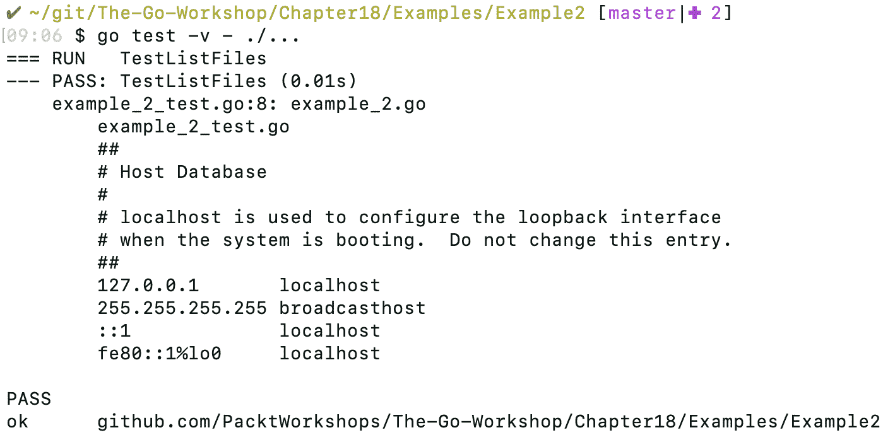
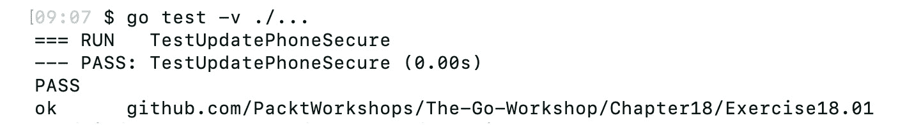
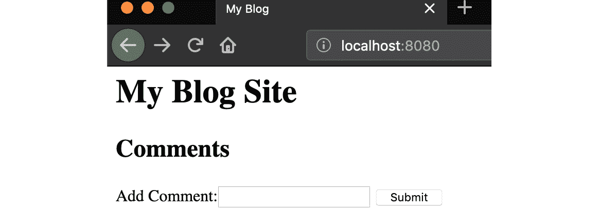
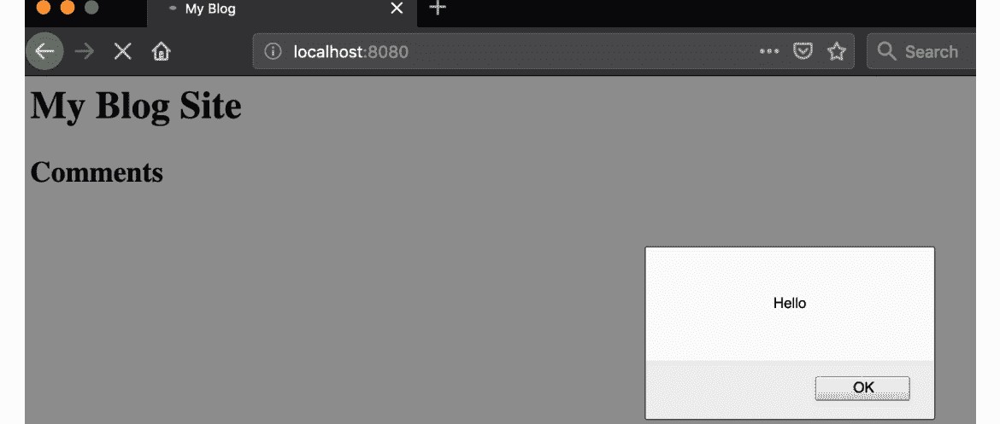
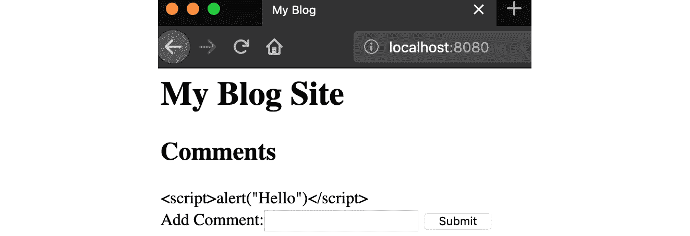
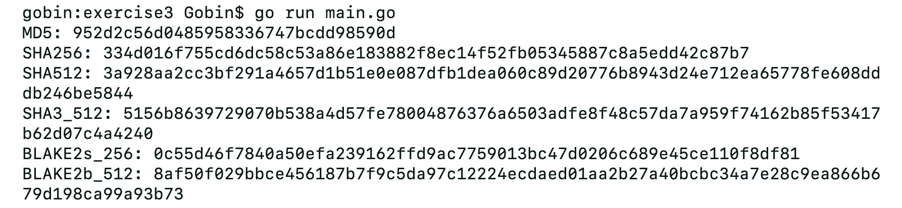
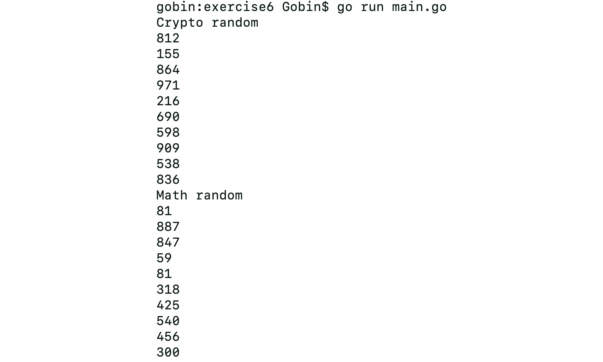
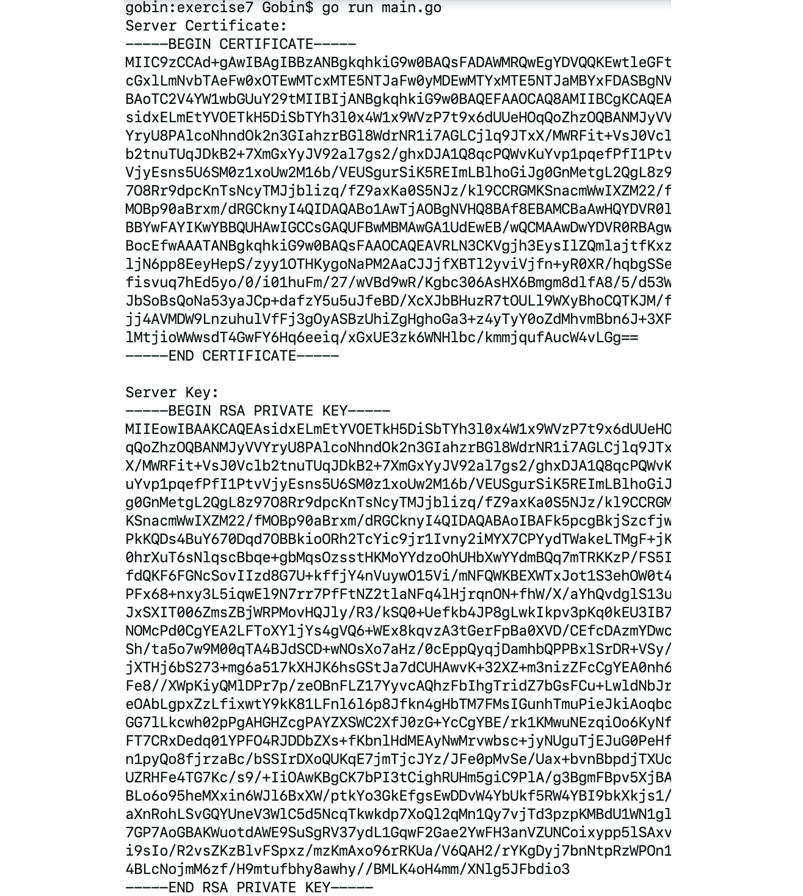
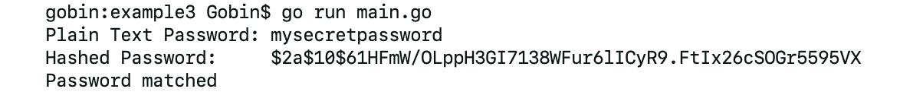
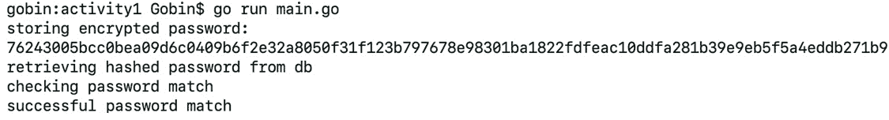

# 18. 安全

概述

本章旨在为你提供保护代码免受攻击和漏洞的基本技能。你将能够评估主要攻击向量的工作原理，实现用于数据加密和解密的加密库，并通过使用 TLS 证书实现通信安全。

到本章结束时，你将能够识别可能导致安全漏洞的常见代码问题，并重构代码以提高其安全性。

# 简介

在上一章中，我们学习了 Go 工具，如`fmt`、`vet`和`race`，这些工具旨在帮助你进行代码开发。现在，让我们看看如何通过查看常见漏洞的示例来保护你的代码。我们还将查看标准库中的包，这些包可以帮助你安全地存储数据。

安全性不能是事后考虑的事情。它应该是你代码练习的一部分，是你每天都要练习的东西。应用程序中的大多数漏洞都源于开发者不了解潜在的安全攻击，以及没有在应用程序部署前对其进行安全审查。

如果你查看任何处理敏感数据的网站，例如，银行网站，它们将具备基本的安全措施，例如使用已签名的 SSL 证书。在设计应用程序时始终考虑安全性，而不是事后添加安全层，这样可以避免重构或重新设计应用程序，这总是更好的。在本章中，我们将介绍一些主要的攻击向量以及最佳实践，这些将指导你保护你的应用程序。以下代码中的基本合理性检查将确保你默认受到大多数漏洞和攻击的保护。

# 应用程序安全

在你的应用程序开发过程中，你将无法预测它可能被攻击的所有可能方式。然而，你始终可以通过遵循安全的编码实践来尝试保护应用程序，例如在传输和静止状态下加密数据。众所周知，如果我们保护应用程序免受 SQL 注入等已知攻击向量的攻击，我们就能抵御大多数攻击。我们将讨论使用数字证书和散列敏感数据以保护其免受攻击者侵害的话题。

软件应用程序的主要攻击向量之一是命令或 SQL 注入，恶意用户输入可以改变命令或查询的行为。这可能在 SQL 查询、HTTP URL 或操作系统命令中的构建不良查询时发生。

让我们详细看看 SQL 注入和命令注入。

## SQL 注入

如果你正在开发需要存储数据的应用程序，你很可能会使用数据库。

SQL 注入是一种将恶意代码注入到你的数据库查询中的方法。尽管这是无意的，但这可能对你的应用程序产生重大影响，例如数据丢失或敏感信息泄露。

让我们看看一些示例，以了解 SQL 注入的确切内容和它是如何工作的。

以下函数接受一个`userID`参数，并使用它来查询数据库以返回属于用户的卡号：

```go
func GetCardNumber(db *sql.DB, userID string) (resp string, err error) {
  query := `SELECT CARD_NUMBER FROM USER_DETAILS WHERE USER_ID = ` + userID
  row := db.QueryRow(query)
  switch err = row.Scan(&resp); err {
  case sql.ErrNoRows:
    return resp, fmt.Errorf("no rows returned")
  case nil:
    return resp, err
  default:
    return resp, err
  }
  return
}
```

如果用户输入是`795001`，查询字符串将解析为：

```go
query := `SELECT CARD_NUMBER FROM USER_DETAILS WHERE USER_ID = 795001`
```

然而，恶意用户可以构造一个输入字符串，导致函数检索不属于用户的信息。例如，他们可以向函数传递以下输入：

```go
"" OR '1' == '1'
```

这个用户输入将生成一个查询，该查询将返回所有用户的`CARD_NUMBER`：

```go
`SELECT CARD_NUMBER FROM USER_DETAILS WHERE USER_ID = "" OR '1' == '1'
```

如您所见，在定义数据库查询时很容易出错。

除了获取未经授权的数据访问外，SQL 注入还可以用于破坏或甚至删除数据。

因此，定义查询的惯用方法是什么？我们绝对不应该通过将用户输入连接成查询字符串来构造查询。相反，使用预处理语句来定义查询，其中使用占位符传递用户参数，如下例所示：

```go
func GetCardNumberSecure(db *sql.DB, userID string) (resp string, err error){
  stmt, err := db.Prepare(`SELECT CARD_NUMBER FROM USER_DETAILS WHERE USER_ID =     ?`)
  if err != nil {
    return resp, err
  }
  defer stmt.Close()
  row := stmt.QueryRow(userID)
  switch err = row.Scan(&resp); err {
  case sql.ErrNoRows:
    return resp, fmt.Errorf("no rows returned")
  case nil:
    return resp, err
  default:
    return resp, err}
  }
  return
}
```

通过使用用户输入的占位符，我们已经减轻了潜在的 SQL 注入攻击。

## 命令注入

命令注入是另一种应警惕的注入攻击向量。注入的目的是在应用程序服务器上执行 OS 命令，这可能允许攻击者获取敏感数据、删除文件，甚至在服务器上执行恶意脚本。这种攻击可能发生在用户输入未经过滤的情况下。

我们将通过以下示例了解它是如何工作的。考虑这个函数，它接受一个字符串作为输入并使用它来列出文件：

```go
func listFiles(path string) (string, error) {
  cmd := exec.Command("bash", "-c", "ls"+path)
  var out bytes.Buffer
  cmd.Stdout = &out
  err := cmd.Run()
  if err != nil {
    return "", err
  }
  return out.String(), nil
}
```

这里有几个问题：

+   用户输入未经过滤。

+   用户可以传递任何字符串作为路径。

+   除了`path string`之外，用户还可以添加其他可以在服务器上运行的命令。

让我们通过对这个函数运行单元测试来测试这一点。以下测试运行应该证明之前列出的所有问题：

```go
package command_injection
import "testing"
func TestListFiles(t *testing.T) {
  out, err := listFiles(" .; cat /etc/hosts")
  if err != nil {
    t.Error(err)
  } else {
    t.Log(out)
  }
}
```

当您使用前面的命令运行测试时，应该得到以下输出：

```go
go test -v ./...
```



图 18.1：预期输出

如您所见，用户没有传递有效的文件名，而是传递了一个使函数返回目录中的文件以及读取服务器上的`/etc/hosts`文件的字符串。

## 练习 18.01：处理 SQL 注入

在这个练习中，我们将启用一个功能来防止 SQL 注入攻击。

注意

在这个练习中，我们将使用一个轻量级的数据库`Sqlite`，它可以在您的本地机器上内存中运行。要使用数据库，我们需要导入一个使用`cgo`的第三方 Go 库。

[`packt.live/38Bjl3a`](https://packt.live/38Bjl3a)

如果您使用的是 Windows 机器，您需要安装 GCC 并将其包含在您的路径中。您可以使用此网站上的说明为 Windows 安装 GCC：https://packt.live/38Bjl3a。

以下步骤将帮助你解决问题：

1.  创建`injection.go`并导入以下包：

    ```go
    package exercise1
    import (
      "database/sql"
      "fmt"
      "strings"
    )
    ```

1.  定义一个名为`UpdatePhone()`的函数，该函数接受一个`sql.DB`对象和一些用户信息，如 ID 和电话号码（作为字符串）：

    ```go
    func UpdatePhone(db *sql.DB, Id string, phone string) error {
      var builder strings.Builder
      builder.WriteString("UPDATE USER_DETAILS SET PHONE=")
      builder.WriteString(phone)
      builder.WriteString(" WHERE USER_ID=")
      builder.WriteString(Id)
      fmt.Printf("Running query: %s\n", builder.String())
      _, err := db.Exec(builder.String())
      if err != nil {
        return err
      }
      return nil
    }
    ```

    `UpdatePhone()`函数通过拼接输入参数中的数据将用户 ID 和电话号码插入到表中。

    `UpdatePhone()`函数中的查询字符串容易受到 SQL 注入的影响。例如，如果传递以下值的输入：

    ```go
    ID: "19853011 OR USER_ID=1007007"
    ```

    这将不仅更新用户 ID 为`"19853011"`的记录，还会更新`"1007007"`的记录。这是一个简单的例子。然而，可能会发生更糟糕的事情，比如在数据库中删除表。

1.  创建另一个名为`UpdatePhoneSecure()`的函数，该函数将安全地更新用户详细信息。而不是将输入拼接成查询，使用占位符传递参数到查询中：

    ```go
    injection.go
    20 func UpdatePhoneSecure(db *sql.DB, Id string, phone string) error {
    21   stmt, err := db.Prepare(`UPDATE USER_DETAILS SET PHONE=? WHERE        USER_ID=?`)
    22   if err != nil {
    23     return err
    24   }
    25   defer stmt.Close()
    26   result, err := stmt.Exec(phone, Id)
    27   if err != nil {
    28     return err
    29   }
    The full code for this step is available at: https://packt.live/34QWP31
    ```

1.  定义一个名为`initializeDB()`的辅助函数，用于设置数据库并加载一些测试数据：

    ```go
    func initializeDB(db *sql.DB) error {
      _, err := db.Exec(`CREATE TABLE IF NOT EXISTS USER_DETAILS (USER_ID TEXT,     PHONE TEXT, ADDRESS TEXT)`)
      if err != nil {
        return err
      }
      stmt, err := db.Prepare(`INSERT INTO USER_DETAILS (USER_ID, PHONE,     ADDRESS) VALUES (?, ?, ?)`)
      if err != nil {
        return err
      }
      for _, user := range testData {
        _, err := stmt.Exec(user.Id, user.CardNumber, user.Address)
        if err != nil {
          return err
        }
      }
      return nil
    }
    ```

    注意

    在每次测试后进行清理是一个好习惯。

1.  定义一个名为`tearDownDB()`的函数，帮助你清理数据库：

    ```go
    func tearDownDB(db *sql.DB) error {
      _, err := db.Exec("DROP TABLE USER_DETAILS")
      if err != nil {
        return err
      }
      return nil
    }
    ```

1.  我们还需要一个函数来帮助设置数据库连接。定义一个名为`getConnection()`的函数，它返回一个`*sql.DB`对象：

    ```go
    func getConnection() (*sql.DB, error) {
      conn, err := sql.Open("sqlite3", "test.DB")
      if err != nil {
        return nil, fmt.Errorf("could not open db connection %v", err)
      }
      return conn, nil
    }
    ```

1.  定义一个`TestMain()`函数，该函数执行测试数据的设置，然后运行测试。此函数还需要调用`tearDownDB()`函数来清理测试数据：

    ```go
    func TestMain(m *testing.M) {
      var err error
      db, err = getConnection()
      if err != nil {
        fmt.Println(err)
        os.Exit(1)
      }
      err = initializeDB(db)
      if err != nil {
        fmt.Println(err)
        os.Exit(1)
      }
      defer tearDownDB(db)
      if m.Run() != 0 {
        fmt.Println("error running tests")
        os.Exit(1)
      }
    }
    ```

1.  最后，定义`TestUpdatePhoneSecure()`函数，帮助你运行针对`UpdatePhoneSecure()`函数的测试：

    ```go
    injection_test.go
    77 func TestUpdatePhoneSecure(t *testing.T) {
    78   var tests = []struct {
    79     ID    string
    80     Phone string
    81     err   string
    82   }{
    83     {
    84       ID:    "1",
    85       Phone: "1234",
    86       err:   "",
    87     },
    The full code for this step is available at: https://packt.live/34MEJze
    ```

1.  使用以下命令运行测试：

    ```go
    go test -v ./...
    ```

    你应该得到以下输出：



图 18.2：预期输出

当用户输入未正确清理时，可能会发生 SQL 和命令注入。通常，我们应该避免直接将用户输入传递到 SQL 或操作系统命令中。

在这个练习中，我们学习了如何安全地编写 SQL 代码以保护应用程序免受 SQL 注入的攻击。

# 跨站脚本攻击

跨站脚本攻击（XSS）是另一种常见的攻击类型，经常被列入 OWASP（**开放网络应用安全项目**）的前十种应用程序漏洞。与 SQL 注入类似，这种漏洞也是由未清理的用户输入引起的，但在这个情况下，它不是修改数据库的行为，而是将脚本注入到网页中。

网页使用 HTML 标签构建。每个 HTML 页面都包含一些由 HTML 标签括起来的内容，如下所示：

```go
<html>
  Hello World!
</html>
```

其中一个 HTML 标签是`<script>`标签，用于嵌入可执行内容——通常是 JavaScript 代码。此标签用于在浏览器上执行客户端代码执行，例如，生成动态内容或操作数据和图像。

`<script>` 标签内的代码在网页上不可见，因此通常不会被注意到。这个 `<script>` 标签的特性可以被攻击者利用来运行恶意脚本，窃取敏感数据，监控活动或执行其他未经授权的操作。那么，恶意脚本最初是如何注入的呢？如果通过浏览器输入的用户数据没有经过清理，攻击者可以向 Web 服务器输入/注入恶意脚本，然后它可以存储在数据库中。

当受害者访问页面时，脚本会被加载到他们的浏览器中。

注意

OWASP 是一个提供有用信息以保护应用程序的组织。他们为常见的应用程序安全漏洞提供排名，如 OWASP 前 10 名：

[`packt.live/36t6RbU`](https://packt.live/36t6RbU)

你可以在 OWASP 这里找到更多信息：

[`packt.live/34ioCsZ`](https://packt.live/34ioCsZ)

## 练习 18.02：处理 XSS 攻击

在这个练习中，我们将看到如何在网页上执行 XSS 攻击，然后我们将用代码修复这个问题，使其免受此类攻击：

1.  创建一个 `main.go` 文件并导入以下包：

    ```go
    package main
    import (
      "fmt"
      "net/http"
      "text/template"
    )
    ```

1.  定义一个可以用来加载网页的示例 HTML 模板。对于多行文本赋值给变量，可以使用反引号（`` ` ``）包围的字符串：

    ```go
    var content = `<html>
    <head>
    <title>My Blog</title>
    </head>
    <body>
      <h1>My Blog Site</h1>
      <h2> Comments </h2>
      {{.Comment}}
      <formaction="/" method="post">
        Add Comment:<input type="text"name="input">
        <input type="submit" value="Submit">
      </form>
    </body>
    </html>`
    ```

1.  创建一个名为 `input` 的 `struct`，其中包含一个名为 `Comment` 的 `string` 类型的字段。这个 `struct` 将被用来包装用户评论：

    ```go
    type input struct {
      Comment string
    }
    ```

1.  创建一个 `handler()` 函数以返回 HTTP 请求的响应：

    ```go
    func handler(w http.ResponseWriter, r *http.Request) {
      var userInput = &input{
        Comment: r.FormValue("input"),
      }
      t := template.Must(template.New("test").Parse(content))
      err := t.Execute(w, userInput)
      if err != nil {
        fmt.Println(err)
      }
    }
    ```

1.  定义 `main()` 函数以运行 HTTP 服务器：

    ```go
    funcmain() {
      http.HandleFunc("/", handler)
      http.ListenAndServe(":8080", nil)
    }
    ```

1.  运行代码：

    ```go
    go run main.go
    ```

1.  在浏览器中打开 `http://localhost:8080`。你应该能看到以下页面：

    ```go
    <script>alert("Hello")</script>
    ```

    这是你将看到的内容：

    

    图 18.4：XSS 执行

1.  让我们修复我们的 Web 应用程序，使其免受 XXS 攻击。在这种情况下，解决方案就像从 `text/template` 更新到使用 `html/template` 包一样简单：

    ```go
    package main
    import (
      "fmt"
      "net/http"
      "html/template"
    )
    ```

    如果你再次运行服务器并提交相同的输入，你的输出将被 `html/template` 库转义，因此不会被当作脚本处理：



图 18.5：XSS 转义输出

在这个练习中，我们学习了在代码中正确使用模板化以保护应用程序免受跨站脚本攻击的方法。

# 密码学

Go 的标准库中包含了一个非常全面的加密库，涵盖了哈希算法、PKI 证书以及对称和非对称加密算法。

虽然拥有不同加密和哈希库的集合供我们使用很方便，但我们还需要意识到这些算法中的漏洞，以便我们可以为我们的用例选择最合适的算法。

例如，MD5 和 SHA-1 哈希算法被认为不安全用于加密数据，因为它们很容易被暴力破解。然而，它们通常被文件服务器用于提供文件校验和以进行错误检查。

## 哈希库

哈希是将明文数据转换为加密格式的过程，通过实现一个生成加密文本的算法。这个过程的结果应该是唯一的，并且哈希碰撞的概率，即两个不同的输入产生相同的输出，极不可能。哈希函数在数据库和消息的安全传输中经常被使用。

我们可以使用校验和函数来生成单向哈希。例如，要生成 MD5 校验和，我们可以使用`Sum()`函数，它接受一个`byte`数组并返回一个`byte`数组：

```go
Sum(in []byte) []byte
```

对于 SHA256，校验和函数的定义非常相似：

```go
Sum256(data []byte) [Size]byte
```

除了 MD5 之外，Go 的标准库包含 SHA1、SHA256 和 SHA512 的实现。我们将在接下来的练习中看到如何使用它们。

## 练习 18.03：使用不同的哈希库

在这个练习中，我们将学习如何在 Go 中使用不同的哈希库：

1.  创建一个`main.go`文件并导入以下加密哈希库：

    ```go
    package main
    import (
      "crypto/md5"
      "crypto/sha256"
      "crypto/sha512"
      "fmt"
      "golang.org/x/crypto/blake2b"
      "golang.org/x/crypto/blake2s"
      "golang.org/x/crypto/sha3"
    )
    ```

1.  定义一个名为`getHash()`的实用函数，它接受要哈希的输入字符串和要使用的哈希库类型。定义一个使用`hashType`输入字符串来决定使用哪种哈希库的`switch`语句：

    ```go
    func getHash(input string, hashType string) string {
    ```

1.  在`switch`语句中，添加使用 MD5、SHA256、SHA512 和 SHA3_512 的情况。`switch`情况应该使用相应的哈希库返回输入字符串的哈希值：

    ```go
      switch hashType {
      case "MD5":
        return fmt.Sprintf("%x", md5.Sum([]byte(input)))
      case "SHA256":
        return fmt.Sprintf("%x", sha256.Sum256([]byte(input)))
      case "SHA512":
        return fmt.Sprintf("%x", sha512.Sum512([]byte(input)))
      case "SHA3_512":
        return fmt.Sprintf("%x", sha3.Sum512([]byte(input)))
      default:
        return fmt.Sprintf("%x", sha256.Sum256([]byte(input)))
      }
    }
    ```

1.  添加一些标准库中没有的哈希库：

    ```go
      // from "golang.org/x/crypto/blake2s"
      case "BLAKE2s_256":
        return fmt.Sprintf("%x", blake2s.Sum256([]byte(input)))
      // from "golang.org/x/crypto/blake2b"
      case "BLAKE2b_512":
        return fmt.Sprintf("%x", blake2b.Sum512([]byte(input)))
     }
    }
    ```

    注意

    除了提到的`blake`库之外，您还可以在[`packt.live/2PiwlmH`](https://packt.live/2PiwlmH)下找到 MD4 和 SHA3 的包。

1.  定义`main()`函数并调用之前定义的`getHashutility()`函数：

    ```go
    func main() {
      fmt.Println("MD5:", getHash("Hello World!", "MD5"))
      fmt.Println("SHA256:", getHash("Hello World!", "SHA256"))
      fmt.Println("SHA512:", getHash("Hello World!", "SHA512"))
      fmt.Println("SHA3_512:", getHash("Hello World!", "SHA3_512"))
      fmt.Println("BLAKE2s_256:", getHash("Hello World!", "BLAKE2s_256"))
      fmt.Println("BLAKE2b_512:", getHash("Hello World!", "BLAKE2b_512"))
    }
    ```

1.  运行程序：

    ```go
    go run main.go
    ```

    你应该得到以下输出：



图 18.6：预期输出

在这个练习中，我们学习了如何使用 Go 中可用的不同哈希包生成密文。

注意

在前面的示例中，我们导入了某些哈希库，例如[`packt.live/2ryy9Ps`](https://packt.live/2ryy9Ps)。

`golang.org/x/`下的包仍然是 Go 项目的一部分。然而，它们仍然位于主安装之外，因此您必须运行`go get`来安装它们。

您可以在这里找到这些包的列表：[`packt.live/2tbThv7`](https://packt.live/2tbThv7)。

# 加密

加密是将数据转换为一种格式的过程，这样它就不能被未授权的接收者读取。

当处理敏感数据时，始终加密它是最佳实践。数据的性质将决定其敏感性。例如，客户的信用卡信息可以被认为是高度敏感数据，而购买的商品可能被认为不是非常敏感。

你可能会遇到“静态加密”和“传输中加密”这两个术语，它们指的是在存储（例如，在数据库中）或传输（例如，通过网络）之前应该如何加密数据。我们将在后续主题（HTTP/TLS）中涉及传输中加密。

在这个主题中，我们将关注底层加密机制。

由于（好的）加密算法本质上很复杂，一般建议始终使用现有的加密算法，而不是发明自己的。加密算法的强度应在于问题的数学复杂性，而不是加密算法工作方式的保密性。因此，“安全”的加密算法都是公开的。

Go 提供了对称加密和非对称加密库。让我们看看这两种加密类型的示例实现。

## 对称加密

在对称加密中，相同的密钥用于加密和解密。Go 标准库在 `crypto/aes` 和 `crypto/des` 下提供了常见对称加密算法的实现，如 AES 和 DES。

使用字符串密钥（例如，密码）加密输入字节数组的基本步骤如下：

在 Go 中创建密文，我们可以使用 `Seal()` 函数。我们同样使用一个 `nonce`，它是一个一次性随机序列。这里的 `dst` 输入变量是一个字节数组，用于存储加密数据：

```go
Seal(dst, nonce, plaintext, additionalData []byte) []byte
```

要解密密文，我们需要再次使用 `crypto/cipher` 库来利用 GCM 包装器：

```go
func (g *gcm) Open(dst, nonce, ciphertext, data []byte) ([]byte, error)
```

## 练习 18.04：对称加密和解密

在这个练习中，我们将利用 Go 的加密库进行对称加密，并学习如何加密和解密数据：

1.  创建一个 `main.go` 文件并导入以下包：

    `crypto/cipher`：用于块加密实现。

    `crypto/aes`：AES 是一种加密规范，`crypto/aes` 是 Go 的实现。

    `crypto/rand`：用于随机数生成。

    ```go
    package main
    import (
      "crypto/aes"
      "crypto/cipher"
      "crypto/rand"
      "fmt"
    )
    ```

1.  定义一个函数，使用 `crypto/aes` 和 `crypto/cipher` 库加密数据。以下函数接受以字节数组形式输入的数据和一个密钥字符串，该字符串通常是秘密密码。它返回加密数据：

    ```go
    func encrypt(data []byte, key string) (resp []byte, err error) {
      block, err := aes.NewCipher([]byte(key))
      if err != nil {
        return resp, err
      }
    gcm, err := cipher.NewGCM(block)
      if err != nil {
        return resp, err
      }
      nonce := make([]byte, gcm.NonceSize())
      if _, err := rand.Read(nonce); err != nil {
        return resp, err
      }
      return gcm.Seal(dst, nonce, data, []byte("test")), nil
    }
    ```

    需要存储 nonce 以进行解密。有许多方法可以做到这一点。在前面的实现中，我们通过将 nonce 传递给 `Seal()` 函数的第一个输入来实现，这是一个字节数组，`dst`。由于 `Seal()` 函数将加密数据追加到输入的字节数组中，因此生成的密文将追加到 nonce 上，并作为一个字节数组返回。如果您传递额外的数据，解密生成的密文时值必须匹配。

1.  定义一个解密数据的函数。它应该接受以字节数组形式提供的加密数据和一个字符串形式的密码短语。它应该返回解密后的数据：

    ```go
    func decrypt(data []byte, key string) (resp []byte, err error) {
      block, err := aes.NewCipher([]byte(key))
      if err != nil {
        return resp, err
      }
    gcm, err := cipher.NewGCM(block)
      if err != nil {
        return resp, err
      }
      ciphertext := data[gcm.NonceSize():]
      nonce := data[:gcm.NonceSize()]
      resp, err = gcm.Open(nil, nonce, ciphertext, []byte("test"))
      if err != nil {
        return resp, fmt.Errorf("error decrypting data: %v", err)
      }
      return resp, nil
    }
    ```

1.  定义 `main()` 函数以测试 `encrypt` 和 `decrypt` 函数：

    ```go
    func main() {
      const key = "mysecurepassword"
      encrypted, err := encrypt([]byte("Hello World!"), key)
      if err != nil {
        fmt.Println(err)
      }
    fmt.Println("Encrypted Text: ", string(encrypted))
      decrypted, err := decrypt(encrypted, key)
      if err != nil {
        fmt.Println(err)
      }
      fmt.Println("Decrypted Text: ", string(decrypted))
    }
    ```

1.  使用以下命令运行程序：

    ```go
    go run main.go
    ```

    你应该得到以下输出。

![图 19.7：预期输出

![图片 B14177_18_07.jpg]

图 18.7：预期输出

在这个练习中，我们学习了如何执行对称加密和解密。

## 非对称加密

非对称加密也称为公钥加密。这种加密机制使用一对密钥，一个公钥和一个私钥。公钥可以自由地分发给愿意与您交换数据的其他合作伙伴。如果合作伙伴想要发送加密数据，他们将使用您的公钥来加密他们的数据。这些加密数据可以通过您的私钥由您解密。

Go 标准库支持常见的非对称加密算法，如 RSA 和 DSA。

例如，使用 `rsa.EncryptOAEP()` 函数通过公钥加密数据：

```go
EncryptOAEP(hash hash.Hash,randomio.Reader,pub *PublicKey,msg []byte,label   []byte)([]byte,error)
```

使用 `rsa.DecryptOAEP()` 函数通过私钥解密密文：

```go
DecryptOAEP(hash hash.Hash, random io.Reader, priv *PrivateKey, ciphertext   []byte, label []byte) ([]byte, error)
```

加密操作接受 `rsa.PublicKey`，解密操作接受 `rsa.PrivateKey`。密钥对可以使用 `rsa.GenerateKey()` 函数生成：

```go
GenerateKey(random io.Reader, bits int) (*PrivateKey, error)
```

## 练习 18.05：非对称加密和解密

在这个练习中，我们将看到加密和解密操作的实际应用：

1.  创建一个 `main.go` 文件并导入以下包：

    `crypto/rand`：此包中的 `rand.Reader` 将用于生成 `rsa.PrivateKey` 的种子。

    `crypto/rsa`：此包是生成私钥和进行 `encrypt/decrypt` 操作所必需的。

    `crypto/sha256`：对称哈希函数将被用于生成 `rsa.PrivateKey` 的种子。

    ```go
    package main
    import (
      "crypto/rand"
      "crypto/rsa"
      "crypto/sha256"
      "fmt"
      "os"
    )
    ```

1.  定义 `main()` 函数并生成一个 `rsa` 密钥对：

    ```go
    func main() {
    privateKey, err := rsa.GenerateKey(rand.Reader, 1024)
      if err != nil {
    fmt.Printf("error generating rsa key: %v", err)
      }
    publicKey := privateKey.PublicKey
    text := []byte("My Secret Text")
    ```

1.  使用 `publicKey` 加密数据：

    ```go
      ciphertext, err := rsa.EncryptOAEP(sha256.New(), rand.Reader, &publicKey,     text, nil)
      if err != nil {
    fmt.Printf("error encrypting data: %v", err)
    os.Exit(1)
      }
    fmt.Println("Encrypted ciphertext: ", string(ciphertext)
    ```

1.  使用 `privateKey` 解密第 *3* 步的密文：

    ```go
    decrypted, err := rsa.DecryptOAEP(sha256.New(), rand.Reader, privateKey,   ciphertext, nil)
      if err != nil {
    fmt.Printf("error decrypting data: %v", err)
    os.Exit(1)
      }
      fmt.Println("Decrypted text: ", string(decrypted))
    }
    ```

1.  使用以下命令运行程序：

    ```go
    go run main.go
    ```

    你应该得到以下输出：

![图 19.8：预期输出

![图片 B14177_18_08.jpg]

图 18.8：预期输出

我们现在已经学会了如何创建 RSA 公钥并使用它来加密和解密数据。

# 随机生成器

Go 标准库提供了用于创建随机数生成器的实用库。实现提供在 `crypto/rand` 和 `math/rand` 包中。`math/rand` 库可以用来生成随机整数；然而，随机性无法保证。因此，这个库只应在数字可以一般随机且不涉及安全敏感的情况下使用。

否则，你应该始终使用 `crypto/rand`。作为旁注，`crypto/rand` 包依赖于操作系统随机性——例如，在 Linux 上它使用 `/dev/urandom`。因此，它通常比数学库实现慢。

要使用 `crypto/rand` 库生成一个介于 0 和用户定义数字之间的随机整数，我们可以使用以下函数：

```go
funcInt(rand io.Reader, max *big.Int) (n *big.Int, err error)
```

在许多场景中，我们可能需要生成一个安全的随机数，例如，在生成唯一的会话 ID 时。在这些场景中使用随机数必须是真正随机的，并且不遵循可以被推断出的模式。例如，如果攻击者可以通过查看最后几个会话 ID 来推断下一个 `sessionID`，他们可能获得对该会话的非认证访问。

让我们学习如何使用 `crypto/rand` 和 `math/rand` 库生成随机数。

## 练习 18.06：随机生成器

随机数生成是在尝试向数据引入一些熵时的一种常见活动。在这个练习中，我们将看到如何使用 `math/rand` 和 `crypto/rand` 包生成随机数：

1.  创建一个 `main.go` 文件并导入以下包：

    ```go
    package main
    import (
      "crypto/rand"
      "fmt"
      "math/big"
      math "math/rand"
    )
    ```

    `math "math/rand"`：我们添加 `math` 命名空间来区分它与 `crypto/rand` 包。

1.  在 `main()` 函数中，创建一个运行 10 次的 `for` 循环，并打印使用 `crypto/rand` 库的 `rand.Int()` 函数生成的介于 0 和 1000 之间的随机整数：

    ```go
    func main() {
      fmt.Println("Crypto random")
      for i := 1; i<=10; i++ {
        data, _:= rand.Int(rand.Reader,big.NewInt(1000))
        fmt.Println(data)
      }
    ```

1.  使用 `math/rand` 包创建另一个类似的 `for` 循环：

    ```go
      fmt.Println("Math random")
      for i := 1; i<=10; i++ {
        fmt.Println(math.Intn(1000))
      }
    }
    ```

1.  使用以下命令运行程序：

    ```go
    go run main.go
    ```

    你应该得到以下输出：



图 18.9：预期输出

虽然两个实现的输出可能看起来相似，但在使用随机数进行安全目的时，数字生成的底层机制很重要。

在这个练习中，我们看到了如何使用 `math/rand` 和 `crypto/rand` 包生成随机数。

# HTTPS/TLS

当你开发一个网络应用程序时，了解如何确保信息在传输过程中的安全是非常重要的。这可以通过使用 `crypto/tls` 包来实现。TLS 协议确保：

**身份**：使用数字证书提供客户端和服务器身份验证。

**完整性**：通过计算消息摘要确保数据在传输过程中未被篡改。

**认证**：客户端和服务器都可以要求使用公钥密码学进行认证。

**机密性**：消息在传输过程中被加密，从而保护它免受任何未授权接收者的侵害。

在以下主题中，我们将看到如何使用证书加密客户端和服务器之间的流量。

在客户端和服务器之间加密流量第一步是生成一个数字证书。

在下一个练习中，我们将生成一个自签名的 x509 证书和匹配的 RSA 私钥。此证书可以用作客户端或服务器证书。

注意

你可能会遇到 CA 这个术语，它代表证书授权机构。CA 是签发证书并将其分发给需要签发证书的用户的一方。

## 练习 18.07：生成证书和私钥

在这个练习中，我们将学习如何生成一个自签名的证书及其匹配的私钥，这些证书可用于客户端-服务器通信：

1.  创建一个 `main.go` 文件并导入以下包：

    ```go
    package main
    import (
      "crypto/rand"
      "crypto/rsa"
      "crypto/tls"
      "crypto/x509"
      "crypto/x509/pkix"
      "encoding/pem"
      "fmt"
      "io/ioutil"
      "math/big"
      "net"
      "net/http"
      "os"
      "time"
    )
    ```

    将使用加密包生成 x509 证书。

1.  要生成证书，我们首先创建一个模板。在模板中，我们可以定义证书的标准；例如，证书的过期时间设置为一年。模板需要一个随机种子，可以使用 `rand.Int()` 函数生成：

    ```go
    main.go
    28 func generate() (cert []byte, privateKey []byte, err error) {
    29   serialNumber, err := rand.Int(rand.Reader, big.NewInt(27))
    30   if err != nil {
    31     return cert, privateKey, err
    32   }
    33   notBefore := time.Now()
    // Create Certificate template
    34   ca := &x509.Certificate{
    35     SerialNumber: serialNumber,
    36     Subject: pkix.Name{
    37       Organization: []string{"example.com"},
    38     },
    The full code for this step is available at: https://packt.live/34N7jjT
    ```

1.  创建 `privateKey`，它将被用来签名证书：

    ```go
      rsaKey, err := rsa.GenerateKey(rand.Reader, 2048)
      if err != nil {
        return cert, privateKey, err
      }
    ```

1.  创建一个自签名的 `DER`（二进制加密）证书：

    ```go
      DER, err := x509.CreateCertificate(rand.Reader, ca, ca, &rsaKey.PublicKey,     rsaKey)
      if err != nil {
        return cert, privateKey, err
      }
    ```

1.  将二进制编码的 `DER` 证书转换为 ASCII 编码的 PEM 证书。PEM（**增强隐私邮件**）是一种数字证书格式：

    ```go
      b := pem.Block{
        Type:  "CERTIFICATE",
        Bytes: DER,
      }
      cert = pem.EncodeToMemory(&b)
      privateKey = pem.EncodeToMemory(
        &pem.Block{
          Type:  "RSA PRIVATE KEY",
          Bytes: x509.MarshalPKCS1PrivateKey(rsaKey),
        })
      return cert, privateKey, nil
    }
    ```

1.  定义 `main()` 函数以调用 `generate` 函数并打印输出：

    ```go
    func main() {
      serverCert, serverKey, err := generate()
      if err != nil {
        fmt.Printf("error generating server certificate: %v", err)
        os.Exit(1)
      }
      fmt.Println("Server Certificate:")
      fmt.Printf("%s\n", serverCert)
      fmt.Println("Server Key:")
      fmt.Printf("%s\n", serverKey)
    }
    ```

    你应该得到以下类似的输出：



图 18.10：预期输出

因此，我们已经成功生成了一个自签名证书和用于应用程序的私钥。在上面的输出中，“服务器证书”是公开证书，“服务器密钥”是私钥。这可以用于加密客户端和服务器之间的数据。当传输过程中有敏感数据时，它们尤其有用，例如在银行网站上。

## 练习 18.08：运行 HTTPS 服务器

在接下来的练习中，我们将学习如何使用证书加密客户端和服务器之间的流量。

我们将学习如何创建公钥证书。该证书将被用来在客户端和服务器之间编码数据：

1.  创建一个 `main.go` 文件并导入以下包：

    `crypto/rand`：用于随机数生成。

    `crypto/rsa`：为 RSA 证书提供包装。

    `crypto/tls`：为传输层安全性（TLS）协议提供包装。

    `crypto/x509`：为 X509 数字证书提供包装。

    ```go
    package main
    import (
        "crypto/rand"
        "crypto/rsa"
        "crypto/tls"
        "crypto/x509"
        "crypto/x509/pkix"
        "encoding/pem"
        "fmt"
        "io/ioutil"
        "log"
        "math/big"
        "net"
        "net/http"
        "os"
        "time"
    )
    ```

1.  定义一个名为 `runServer()` 的函数，用于运行具有 TLS 配置的 HTTP 服务器。该函数应接受证书文件路径、私钥文件路径和 PEM 编码的客户证书。在我们的 TLS 配置中，我们要求服务器和客户证书。服务器证书由客户端用于验证服务器的真实性。客户端证书由服务器验证以验证客户端：

    ```go
    main.go
    117 func runServer(certFile string, key string, clientCert []byte) (err error) {
    118   fmt.Println("starting HTTP server")
    119   http.HandleFunc("/", hello)
    120   server := &http.Server{
    121     Addr:    ":443",
    122     Handler: nil,
    123   }
    124   cert, err := tls.LoadX509KeyPair(certFile, key)
    125   if err != nil {
    126     return err
    127   }
    The full code for this step is available at: https://packt.live/39hG58K
    ```

1.  定义 `hello()` 函数，当启动 HTTP 服务器时，将其作为处理函数传递。每当服务器收到请求时，该函数将响应一些文本：

    ```go
    func hello(w http.ResponseWriter, r *http.Request) {
      fmt.Printf("%s: Ping\n", time.Now().Format(time.Stamp))
      fmt.Fprintf(w, "Pong\n")
    }
    ```

1.  现在服务器端已完成，让我们实现客户端：

    ```go
    main.go
    95  func client(caCert []byte, ClientCerttls.Certificate) (err error) {
    96    certPool := x509.NewCertPool()
    97    certPool.AppendCertsFromPEM(caCert)
    98    client := &http.Client{
    99      Transport: &http.Transport{
    100       TLSClientConfig: &tls.Config{
    101         RootCAs:      certPool,
    102         Certificates: []tls.Certificate{ClientCert},
    103       },
    104     },
    105   }
    106   resp, err := client.Get("https://127.0.0.1:443")
    107   if err != nil {
    108     return err
    109   }
    The full code for this step is available at: https://packt.live/2PS72Z2
    ```

    这定义了一个使用 TLS 实现的 HTTP 客户端。它接受 CA 证书作为参数以验证服务器的真实性。在我们的情况下，我们使用了一个自签名证书，因此服务器证书将充当 CA 证书。该函数还会接受客户的证书，以便客户端可以与服务器进行身份验证。

1.  让我们现在将这些函数结合起来，运行客户端和服务器握手。

    首先，我们为客户端和服务器生成证书和密钥。服务器使用 `goroutine` 启动并等待来自客户端的请求。客户端也在 `goroutine` 中启动，每 3 秒调用一次服务器：

```go
main.go
18 func main() {
19   serverCert, serverKey, err := generate()
20   if err != nil {
21     fmt.Printf("error generating server certificate: %v", err)
22     os.Exit(1)
23   }
24   ioutil.WriteFile("private.key", serverKey, 0600)
25   ioutil.WriteFile("cert.pem", serverCert, 0777)
26   clientCert, clientKey, err := generate()
27   if err != nil {
28     fmt.Printf("error generating client certificate: %v", err)
29     os.Exit(1)
30   }
The full code for this step is available at: https://packt.live/2t0IXpW
```

我们现在可以运行 `main()` 函数。你应该在你的控制台看到以下输出：

```go
$ cd../exercise8/
$ go run main.go
starting HTTP server
Oct 17 22:22:28: Ping
Oct 17 22:22:28: Pong
Oct 17 22:22:31: Ping
Oct 17 22:22:31: Pong
```

在这个练习中，我们展示了如何使用 TLS 协议来确保客户端和服务器之间的通信。我们学习了如何生成数字证书，并在客户端和服务器 TLS 配置中使用它们。

# 密码管理

如果你正在管理网站上的用户账户，验证用户身份的一种常见方式是通过用户名和密码的组合。这种认证机制的风险是，如果管理不当，用户凭证可能会泄露。这已经发生在世界上的许多主要网站上，并且仍然是一个令人惊讶的常见安全事件。

关于密码管理的首要规则是永远不要以明文形式存储密码（无论是在内存中还是在数据库中）。相反，实现一个经过批准的哈希算法来创建密码的单向哈希，以便你可以通过哈希来确认身份。然而，从哈希中无法检索密码。我们可以通过一个示例来观察这一过程。

以下代码展示了如何从明文字符串创建单向哈希。我们使用 `bcrypt` 包来生成哈希。然后我们执行密码与哈希的比较以验证匹配：

```go
package main
import (
  "fmt"
  "golang.org/x/crypto/bcrypt"
)
func main() {
  password := "mysecretpassword"
  encrypted, _ := bcrypt.GenerateFromPassword([]byte(password), 10)
  fmt.Println("Plain Text Password:", password)
  fmt.Println("Hashed Password:    ", string(encrypted))
  err := bcrypt.CompareHashAndPassword([]byte(encrypted), []byte(password))
  if err == nil {
    fmt.Println("Password matched")
  }
}
```

以下为预期输出：



图 18.11：预期输出

注意

**椭圆曲线数字签名算法** (ECDSA) 是一种加密算法，它通过提供使用公钥和私钥对签名和验证数据的机制来验证数据的真实性。

## 活动 18.01：使用哈希密码在应用程序中验证用户

你正在开发一个 Web 应用程序，你需要使用哈希密码来验证用户。

创建一个存储为哈希的用户密码数据库。定义一个函数，接受用户密码作为输入，并使用数据库中存储的密码验证用户。确保查询数据库的 SQL 查询不受 SQL 注入攻击。你可以按照以下步骤获取所需的输出。

1.  创建一个函数将数据加载到数据库中。

1.  创建一个函数来更新数据库中的密码。在更新数据库之前，使用`crypto/sha512`库加密输入密码。

1.  创建一个函数从数据库中检索密码并确认它是否与哈希匹配。

1.  在程序的主函数中，使用一些测试数据初始化数据库。

1.  使用定义在第 2 步中的函数更新用户密码。

    你应该得到以下输出：



图 18.12：预期输出

在这里，我们使用哈希库在数据库中安全地存储用户密码，然后使用哈希密码验证用户的身份。你可以在需要存储敏感数据的场景中使用此方法。

注意

该活动的解决方案可以在第 777 页找到。

## 活动 18.02：使用加密库创建 CA 签名的证书

证书颁发机构(CA)需要创建来签署证书。当创建新的叶证书时，应使用 CA 证书和私钥进行签名。你需要定义一个函数，使用`crypto/ecdsa`库生成 ECDSA 加密密钥。该函数需要支持创建 CA 证书以及叶证书。最后，你需要验证新创建的叶证书。

这里的目的是生成 x509 证书。你可以按照以下步骤获取所需的输出：

1.  创建一个`generateCert()`函数，使用`crypto/ecdsa`库生成 ECDSA 证书和私钥。它应该接受一个通用名称字符串、CA 证书和 CA 私钥。

    函数应具有以下定义：

    ```go
    generateCert(cn string, caCert *x509.Certificate, caPrivcrypto.PrivateKey)   (cert *x509.Certificate, privateKeycrypto.PrivateKey, err error)
    ```

1.  使用`ecdsa.GenerateKey()`函数创建一个 ECDSA 密钥。

1.  使用该密钥生成一个 x509 证书。

1.  返回生成的证书和私钥。

1.  在`main()`函数中，生成 CA 证书和私钥，以及叶证书和私钥。

1.  验证生成的叶证书。

    输出应如下所示：

    ```go
    $ go run main.go
    ca certificate generated successfully
    leaf certificate generated successfully
    leaf certificate successfully verified
    ```

在这里，我们生成 x509 公钥证书。我们还看到了如何使用根证书生成叶证书，在尝试实现自己的 PKI 服务器时非常有用。

注意

本活动的解决方案可以在第 780 页找到。

# 摘要

在本章中，我们探讨了可能被用来破坏应用程序的几种攻击类型。我们还介绍了缓解这些问题的策略，并提供了实际操作的示例。

我们已经介绍了加密库的使用，用于数据的加密和解密，无论是静态存储还是传输过程中的数据。我们还涵盖了哈希库的使用，以及如何使用它们来安全地存储用户凭证。此外，我们还展示了如何使用 TLS 配置来确保客户端和服务器之间的通信安全。有了这些工具，你现在可以开始编写安全的应用程序了。

在下一章中，我们将学习 Go 语言中一些不太为人所知的包，例如反射和 unsafe。
