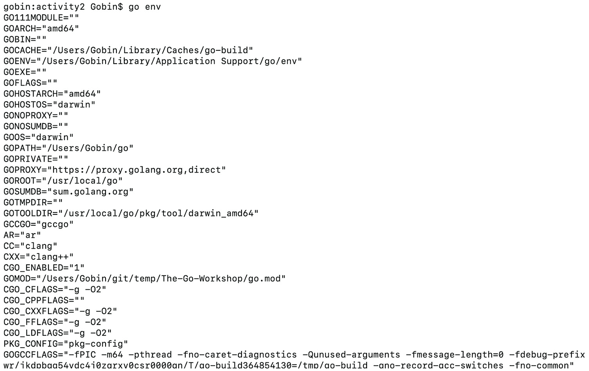
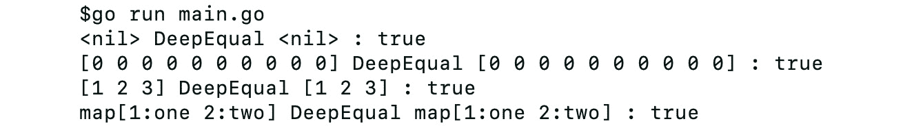
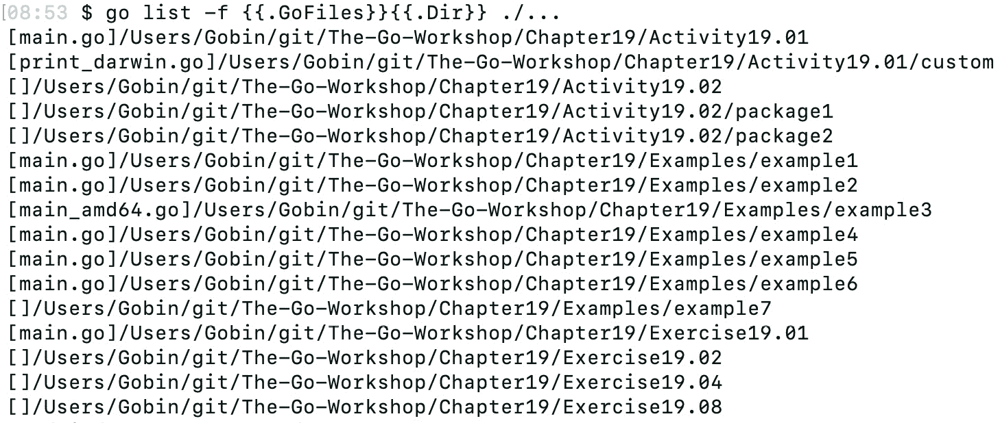
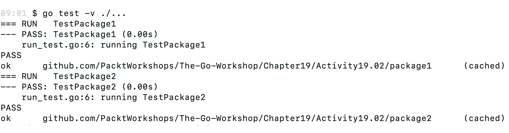

# 19. 特殊特性

概述

在本章中，我们将探讨一些在应用程序开发过程中可能非常有用的 Go 特性。

本章首先将介绍如何使用构建约束，编写适用于多个操作系统和架构的程序，并使用命令行选项构建 Go 程序。你将使用反射来检查运行时对象。到本章结束时，你将能够为你的应用程序定义构建时行为，并使用 `unsafe` 包在 Go 中访问运行时内存。

# 简介

在上一章中，我们学习了可能影响你的应用程序的漏洞以及如何减轻它们。我们学习了如何确保通信安全以及安全地存储数据。

现在我们将学习一些在 Go 语言中不太明显且难以发现的特性。如果你正在浏览标准库，可能会遇到这些特性。了解这些特性将有助于你理解执行过程中的情况，因为这些特性中的一些是隐式嵌入到语言中的。

由于 Go 语言可以在多个 **操作系统**（**OSes**）和 CPU 架构上运行，因此 Go 支持配置这些参数以构建应用程序。使用这些构建参数，你将能够执行诸如交叉编译等操作，这在其他编程语言中是非常罕见的。

如内存管理之类的概念很难掌握，因此 Go 运行时管理所有内存分配和释放，减轻了程序员管理应用程序内存足迹的负担。对于程序员偶尔需要访问内存的情况，Go 通过提供一个名为 `unsafe` 的包提供了一些灵活性，我们将在本章中学习它。

# 构建约束

Go 程序可以在不同的 OS 和不同的 CPU 架构上运行。当你构建一个 Go 程序时，你的程序的编译是在当前机器的 OS 和架构上完成的。通过使用构建约束，你可以设置条件，确定哪些文件将被考虑进行编译。如果你有一个需要针对不同 OS 进行覆盖的函数，你可以使用构建约束来有多个相同函数的定义。

你可以在 Go 标准库中看到很多这样的例子。

以下链接展示了标准库中 `os` 包在 darwin 和 Linux 上实现相同功能的示例：

+   [`packt.live/2RKfydP`](https://packt.live/2RKfydP)

+   [`packt.live/2PJN957`](https://packt.live/2PJN957)

如果你恰好遇到类似的需求，Go 语言提供了构建约束，可以用来定义构建条件。

## 构建标签

使用构建约束有两种方法。第一种方法是定义构建标签，第二种方法是使用文件名后缀。

构建标签应出现在您的源文件中的包声明之前。这些标签在构建时进行分析，并决定是否将文件包含在编译中。

让我们看看如何评估这些标签。以下标签意味着源文件将仅在 Linux 机器上考虑 `build`。因此，此文件不会在 Windows 机器上编译：

```go
// +build linux
```

我们可以使用构建标签定义多个构建约束：

```go
// +build amd64,darwin 386,!gccgo
```

这将评估为以下内容：

```go
( amd64 AND darwin ) OR (386 AND (NOT gccgo))
```

注意，在上面的例子中，我们也使用了否定来避免某些条件。

注意

确保在构建约束和代码开始（即包名）之间有一个空行。

在构建时，Go 将构建标签与环境变量进行比较，并决定如何处理这些标签。

默认情况下，Go 将读取特定的环境变量来设置构建和运行时行为。您可以通过运行以下命令来查看这些变量：

```go
go env
```



图 19.1：go env 输出

最常用的变量是 `GOOS`，它是操作系统变量，以及 `GOARCH`，它是 CPU 架构变量。您可以通过将 `GOOS` 变量设置为除当前操作系统之外的其他值来交叉编译您的应用程序。`GOOS` 变量的示例值包括 Windows、darwin 和 Linux。

让我们看看一个简单的 hello world 程序，并使用构建标签的实际操作。以下程序有一个 `build` 标签，使得 `go build` 命令忽略该文件：

```go
// +build ignore
package main
import "fmt"
func main() {
  fmt.Println("Hello World!")
}
```

如果您在当前目录下运行 `go build`，您将看到以下错误输出：

```go
$ go build
build .: cannot find module for path .
```

如果您从文件中移除 `build` 标签然后再次运行 `build`，它应该生成一个没有错误的二进制文件，如下所示：

```go
$ go run main.go
Hello World!
```

让我们看看使用 `GOOS` 变量的 `build` 标签的另一个示例。我们将演示 `build` 标签和环境变量的组合如何影响您的应用程序的编译。

我当前的操作系统 `GOOS` 变量是 `darwin`。将 `darwin` 替换为您自己的 `GOOS` 值。

要获取当前的 `GOOS` 变量，请运行以下命令：

```go
go env GOOS
```

接下来：

```go
// +build darwin
package main
import "fmt"
func main() {
  fmt.Println("Hello World!")
}
```

如果我们 `build` 此文件，它应该生成以下可执行二进制文件：

```go
$go build -o good
$./goos
Hello World!
```

现在，将您的 `GOOS` 变量设置为除您自己的以外的其他值；构建应该失败：

```go
$GOOS=linux go build -o goos
Build .: cannot find module for path .
```

在本例中，我们学习了如何使用 `GOOS` 值作为构建约束。

## 文件名

如前所述，使用构建约束的第二种方法是使用文件名后缀来定义约束。

使用此方法，您可以在操作系统或 CPU 架构或两者上定义约束。

例如，以下文件来自标准库中的 `syscall` 包。您可以看到定义在操作系统上的约束：

```go
syscall_linux.go
syscall_windows.go
syscall_darwin.go
```

在运行时包中也可以找到同时使用操作系统和 CPU 架构的另一个示例：

```go
signal_darwin_amd64.go
signal_darwin_arm.go
signal_darwin_386.go
```

要利用此方法，后缀必须具有以下形式：

```go
*_GOOS
*_GOARCH
*_GOOS_GOARCH
```

您可以在标准库中找到此命名方案的示例：

```go
stat_aix.go
source_windows_amd64.go
syscall_linux_386.go
```

让我们看看如何使用文件名来定义构建约束的例子。我们将通过 CPU 架构来定义构建约束。我们将使用 `GOARCH` 环境变量来控制构建。

我们有一个以当前 `GOARCH` 为后缀的文件。我的当前 `GOARCH` 是 `amd64`，所以文件名将是 `main_amd64.go`。请将此值替换为你的文件名。要获取你的当前 `GOARCH`，请运行以下命令：

```go
go env GOARCH
```

这将显示以下内容：

```go
$go env GOARCH
amd64
```

在我的机器上，文件名将是如下所示：

```go
main_amd64.go
```

在文件中，我们将定义一个简单的 `"Hello World"` 程序：

```go
package main
import "fmt"
func main() {
  fmt.Println("Hello World!")
}
```

输出将如下所示：

```go
$ls
main_amd64.go
$go build -o goarch
$./goarch
Hello World!
```

为了确认约束是否起作用，我们可以使用另一个 `GOARCH` 值来尝试检查构建是否失败：

```go
$ls
main_amd64.go
$GOARCH=386 go build -o goarch
build .: cannot find module for path .
```

在前面的例子中，我们学习了如何使用 CPU 架构作为构建约束来限制在特定 CPU 架构上构建文件。

# 反射

反射是检查运行时代码的机制。当你不知道或不能保证函数的输入类型时，反射非常有用。在这种情况下，反射可以用来检查对象的类型并操作对象的值。

Go 的 `reflect` 包为你提供了在运行时检查和操作对象的功能。它不仅可以用于基本类型，如 `int` 和 `string`，还可以用于检查切片、数组和结构体。

让我们创建一个简单的 `print()` 函数来演示我们如何使用反射。我们定义了一个名为 `MyPrint()` 的实用打印函数，它可以打印不同类型的对象。这是通过将接口作为函数的输入来实现的。然后，在函数内部，我们使用 `reflect` 包根据输入的类型来改变行为。考虑以下代码：

```go
package main
import (
  "fmt"
  "reflect"
)
type Animal struct {
  Name string
}
type Object struct {
  Type string
}
type Person struct {
  Name string
}
func MyPrint(input interface{}) {
  t := reflect.TypeOf(input)
  v := reflect.ValueOf(input)
  switch {
  case t.Name() == "Animal":
    fmt.Println("I am a ", v.FieldByName("Name"))
  case t.Name() == "Object":
    fmt.Println("I am a ", v.FieldByName("Type"))
  default:
    fmt.Println("I got an unknown entity")
  }
}
func main() {
  table := Object{Type: "Chair"}
  MyPrint(table)
  tiger := Animal{Name: "Tiger"}
  MyPrint(tiger)
  gobin := Person{Name: "Gobin"}
  MyPrint(gobin)
}
```

运行前面的程序，我们得到以下输出：

```go
$go run main.go
I am a Chair
I am a Tiger
I got an unknown entity
```

你可以在 `encoding/json` 和 `fmt` 等包中找到反射使用的示例。

让我们看看如何使用 `reflect` 包中的某些常见实用函数来使用反射。

# TypeOf 和 ValueOf

要使用反射，你需要熟悉在 `reflect` 包中定义的两个类型：

```go
reflect.Type
reflect.Value
```

这两种类型都提供了实用函数，可以让你访问对象的动态运行时信息。

这两个函数为你提供了对对象的 `Type` 和 `Value` 的控制：

```go
func TypeOf( interface{}) Type
func ValueOf( interface{}) Value
```

以下程序使用这两个函数来打印传递给对象的 `Type` 和 `Value`：

```go
func main() {
  var x = 5
  Print(x)
  var y = []string{"test"}
  Print(y)
  var z = map[string]string{"a": "b"}
  Print(z)
}
func Print(a interface{}) {
  fmt.Println("Type: ", reflect.TypeOf(a))
  fmt.Println("Value: ", reflect.ValueOf(a))
}
```

前一个程序的输出应该打印 `x` 的 `Type`：

```go
$ go run main.go
Type: int
Value 5
Type: []string
Value: [test]
Type: map[string]string
Value: map[a:b]
```

在这个例子中，我们观察了如何使用两个函数来打印传递给对象的 `Type` 和 `Value`。

注意

确保你谨慎地使用反射包非常重要。使用类型转换错误或调用不支持该方法的对象上的方法将导致程序崩溃。

## 练习 19.01：使用反射

在这个练习中，我们将使用反射包来检查运行时的对象：

1.  创建一个名为 `main.go` 的文件。

1.  导入以下包：

    ```go
    package main
    import (
      "fmt"
      "math"
      "reflect"
    )
    ```

1.  定义一个名为`circle`的`struct`，其中`radius`是其字段之一：

    ```go
    type circle struct {
      radius float64
    }
    ```

1.  定义另一个名为`rectangle`的`struct`，其字段为`length`和`breadth`：

    ```go
    type rectangle struct {
      length  float64
      breadth float64
    }
    ```

1.  定义一个名为`area()`的函数，它可以计算不同形状的面积。它应该接受`interface`作为其输入：

    ```go
    func area(input interface{}) float64 {
      inputType := reflect.TypeOf(input)
      if inputType.Name() == "circle" {
        val := reflect.ValueOf(input)
        radius := val.FieldByName("radius")
        return math.Pi * math.Pow(radius.Float(), 2)
      }
      if inputType.Name() == "rectangle" {
        val := reflect.ValueOf(input)
        length := val.FieldByName("length")
        breadth := val.FieldByName("breadth")
        return length.Float() * breadth.Float()
      }
      return 0
    }
    ```

    在这个函数中，我们使用`reflect.TypeOf()`从输入中获取一个`reflect.Type`对象。然后我们使用`Type.Name()`函数来获取`struct`的名称，在我们的例子中，它可以是圆或矩形。

    要检索结构体字段中的值，我们首先使用`reflect.ValueOf()`函数获取一个`reflect.Value`对象。然后我们使用`Val.FieldByName()`来获取字段值。

1.  定义一个`main()`函数并调用`area()`函数：

    ```go
    func main() {
      fmt.Printf("area of circle with radius 3 is : %f\n", area(circle{radius: 
        3}))
      fmt.Printf("area of rectangle with length 3 and breadth 7 is : %f\n", 
        area(rectangle{length: 3, breadth: 7}))
    }
    ```

1.  使用以下命令运行程序：

    ```go
    go run main.go
    ```

    当你运行程序时，你应该得到以下输出：

    ```go
    $ go run main.go
    area of circle with radius 3 is : 28.274334
    area of rectangle with length 3 and breadth 7 is : 21.000000
    ```

在这个练习中，我们学习了如何使用反射来定义函数的不同实现，在这种情况下，通过检查输入对象来确定传递的是什么对象。

## 活动第 19.01 节：使用文件名定义构建约束

你必须定义一个根据操作系统和 CPU 架构表现不同的函数。使用文件名上的构建约束来实现这种行为。一个文件应该设置操作系统约束为`darwin`，另一个设置 CPU 架构约束为`386`。

注意

将`darwin`替换为你的当前操作系统，将`386`替换为你当前机器架构之外的另一个架构。

执行以下步骤：

1.  创建一个名为`custom`的包。

1.  创建一个名为`print_darwin.go`的文件，并在包内定义一个名为`Print()`的函数。它应该打印以下文本：`I am running on a darwin machine`。

1.  在同一个包中创建另一个名为`print_386.go`的文件，并定义一个名为`Print()`的函数，该函数打印以下文本：`Hello I am running on a 386 machine`。

1.  定义一个`main()`函数并导入`custom`包。在`main()`函数中调用`custom`包中的`Print()`函数。

到活动结束时，你应该看到以下输出：

```go
$go run main.go
Hello I am running on a darwin machine.
```

在这个活动中，我们使用文件名构建约束来实现函数重载。你应该能够在 Go 标准库中看到类似的实现。

注意

这个活动的解决方案可以在第 782 页找到。

# DeepEqual

如果我们在谈论`reflect`包，则`reflect.DeepEqual()`需要提及。

Go 的基本数据类型可以使用`==`或`!=`运算符进行比较，但切片和映射不能使用这种方法进行比较。

当类型不可比较时，可以使用`reflect.DeepEqual()`函数。例如，它可以用于比较切片和映射。以下是一个使用`DeepEqual`比较映射和切片的示例：

```go
package main
import (
  "fmt"
  "reflect"
)
func main() {
  runDeepEqual(nil, nil)
  runDeepEqual(make([]int, 10), make([]int, 10))
  runDeepEqual([3]int{1, 2, 3}, [3]int{1, 2, 3})
  runDeepEqual(map[int]string{1: "one", 2: "two"}, map[int]string{2:     "two", 1: "one"})
}
func runDeepEqual(a, b interface{}) {
  fmt.Printf("%v DeepEqual %v : %v\n", a, b, reflect.DeepEqual(a, b))
}
```

在前面的例子中，我们使用`reflect.DeepEqual()`比较不同的数据类型。

以下是比较操作：

+   两个 nil 对象。

+   两个大小相同的空切片。在这里，大小很重要。

+   两个顺序相同的包含相同数据的切片。顺序不同的值将给出不同的输出。

+   两个包含相同数据的映射。在这里，键的顺序并不重要，因为映射总是无序的。

如果您运行程序，您应该得到以下输出：



图 19.2：DeepEqual 输出

# 通配符模式

`go`工具有一系列命令可以帮助您进行代码开发。例如，`go list`命令可以帮助您列出当前目录中的 Go 文件，而`go test`命令可以帮助您运行当前目录中的测试文件。

您的项目可能被组织在多个子目录中，以帮助您逻辑上组织代码。如果您想使用`go`工具一次性运行整个代码库中的命令，它支持通配符模式，这可以帮助您做到这一点。

要列出当前目录及其子目录中的所有`.go`文件，您可以使用以下相对模式：

```go
go list ./...
```

类似地，如果您想运行当前目录及其子目录中的所有测试，可以使用相同的模式：

```go
go test ./...
```

如果您仍在使用供应商目录，好消息是这个模式将忽略`./vendor`目录。

让我们在 Go 工作坊仓库上尝试通配符模式。

要列出项目中的所有`.go`文件，您可以使用通配符运行`list`命令：

```go
go list -f {{.GoFiles}}{{.Dir}} ./...
```

您应该得到类似于以下输出的结果：



图 19.3：通配符模式

# 不安全的包

Go 是一种静态类型语言，它有自己的运行时，负责内存分配和垃圾回收。因此，与 C 不同，所有与内存管理相关的任务都由运行时处理。除非您有一些特殊要求，否则您永远不需要在代码中直接处理内存。尽管如此，当有需求时，标准库中的`unsafe`包提供了让您可以窥视对象内存的功能。

如其名所示，通常不认为在您的代码中使用此包是安全的。另一个需要注意的事项是，`unsafe`包没有 Go 1 兼容性指南，这意味着功能可能在 Go 的后续版本中停止工作。

使用`unsafe`包的最简单例子可以在`math`包中找到：

```go
func Float32bits(f float32) uint32
{
  return *(*uint32)(unsafe.Pointer(&f))
}
```

这需要一个`float32`作为输入并返回`uint32`。`float32`数字被转换为`unsafe.Pointer`对象，然后解引用以转换为`uint32`。

在前面的函数中也可以找到反向转换，在`math`包中：

```go
func Float32frombits(b uint32) float32 {
  return *(*float32)(unsafe.Pointer(&b))
}
```

使用`unsafe`包的另一个例子，您可以在标准库中找到，是在从 Go 代码调用 C 程序时。这正式称为`cgo`。

注意

要在 Windows 上使 `cgo` 生效，你需要在你的机器上安装 `gcc` 编译器。你可以使用 'Minimalist GNU for Windows' ([`packt.live/2EbOKuZ`](https://packt.live/2EbOKuZ))。

在伪 C 包中提供了一些特殊函数，可以将 Go 数据类型转换为 C 数据或反之，例如：

```go
// Converts Go string to C string
func C.CString(string) *C.char
// C data with explicit length to Go []byte
func C.GoBytes(unsafe.Pointer, C.int) []byte
```

你可以像以下示例那样编写正常的 Go 代码并调用 C 代码编写的函数：

```go
package main
//#include <stdio.h>
//#include <stdlib.h>
//static void myprint(char* s) {
//  printf("%s\n", s);
//}
import "C"
import "unsafe"
func main() {
  cs := C.CString("Hello World!")
  C.myprint(cs)
  C.free(unsafe.Pointer(cs))
}
```

你可以以下面的格式定义 C 中的函数。要使用标准库中的函数，`import` 语句前面有一个注释，该注释被视为你的 C 代码的头部部分：

```go
// #include <stdio.h>
// #include <stdlib.h>
//
// static void myprint(char* s) {
//   printf("%s\n", s);
// }
```

前面的函数将输入打印到控制台。为了能够使用 C 代码，我们需要导入名为 `C` 的伪包。在 `main` 函数中，我们可以使用 C 包调用 `myprint()` 函数：

运行此程序应该得到以下输出：

```go
$ go run main.go
Hello World!
```

## 练习 19.02：使用 cgo 和 unsafe

在这个练习中，我们将学习如何使用 `unsafe` 包获取字符串的底层内存：

1.  创建一个 `main.go` 文件并执行以下导入。C 伪包需要使用 C 库：

    ```go
    package main
    // #include <stdlib.h>
    import "C"
    import (
      "fmt"
      "unsafe"
    )
    ```

1.  定义一个 `main()` 函数并声明一个 `C` 字符串：

    ```go
    func main() {
      var cString *C.char
    ```

1.  将 `cString` 变量的值设置为文本 `Hello World!\n`。处理 `C` 时，始终是一个好习惯清理分配的内存，因此添加 `C.free()` 函数调用来执行清理：

    ```go
    cString = C.CString("Hello World!\n")
      defer C.free(unsafe.Pointer(cString))
    ```

1.  声明一个变量 `b`，作为字节数组以存储将 `CString` 转换为 Go `byte` 数组后的输出：

    ```go
    var b []byte
    b = C.GoBytes(unsafe.Pointer(cString), C.int(14))
    ```

    `C.GoBytes()` 函数将 `unsafe.Pointer` 对象转换为 Go `byte` 数组。

1.  将 `byte` 数组打印到控制台：

    ```go
    fmt.Print(string(b))
    }
    ```

1.  使用以下命令运行程序：

    ```go
    go run main.go
    ```

    你应该得到以下输出：

    ```go
    $ go run main.go
    Hellow World!
    ```

在这个练习中，我们学习了如何使用 `Cgo` 并在 Go 中创建 C 对象。然后我们使用 `unsafe` 包将 `CString` 对象转换为 `unsafe.Pointer`，它直接映射到 `CString` 的内存。

## 活动 19.02：使用 Go Test 的通配符

你有一个包含多个测试文件和其中定义的多个测试用例的项目。创建多个包并在其中定义测试。使用通配符模式，使用单个命令运行项目中的所有测试用例。确保所有单元测试都使用该命令运行。

执行以下步骤：

1.  创建一个名为 `package1` 的包。

1.  创建一个名为 `run_test.go` 的文件，并定义一个单元测试 `TestPackage1`。

1.  创建一个名为 `package2` 的包。

1.  创建一个名为 `run_test.go` 的文件，并定义一个单元测试 `TestPackage2`。

1.  使用通配符模式打印 `TestPackage1` 和 `TestPackage2` 的结果：



图 19.4：使用通配符的递归测试

在这个活动中，我们学习了如何使用通配符模式递归地在项目中的所有测试文件上运行测试。当你想要在持续集成管道中自动化运行测试时，这将非常有用。

注意

这个活动的解决方案可以在第 782 页找到。

# 摘要

在本章中，我们学习了 Go 语言中一些不那么明显的特殊功能。

我们介绍了构建约束的使用方法以及如何使用`GOOS`和`GOARCH`变量进行条件编译来控制应用程序构建的行为。构建约束还可以用于在编译时忽略文件。`build`标签的另一个常见用途是为包含集成测试的文件添加标签。

我们已经看到了`reflect`包及其在运行时访问对象类型和值的函数的使用案例。反射是一种解决我们只能在运行时确定变量数据类型场景的好方法。

我们还演示了如何使用通配符在项目中的多个包上执行列表和测试。我们还学习了使用`unsafe`包在 Go 语言中访问运行时内存。`unsafe`包在使用 C 库时常用。

在本书的整个过程中，我们已经介绍了 Go 语言的基础，包括变量和各种类型声明。我们看到了 Go 语言中接口和错误的特殊行为。本书还涵盖了专注于应用程序开发的章节。处理文件和 JSON 数据在任何应用程序的开发中都非常常见，尤其是在 Web 应用程序中。关于数据库和 HTTP 服务器的章节深入探讨了如何管理数据的通信和存储。我们还探讨了如何使用 goroutines 轻松执行并发操作。最后，在本书的最后一个主题中，我们介绍了如何通过关注测试和确保应用程序的安全性来提高代码质量。最后但同样重要的是，我们探讨了 Go 语言中的特殊功能，如构建约束和`unsafe`包的使用。
