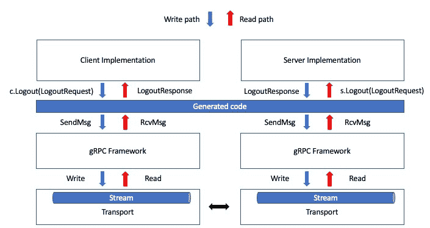

# gRPC 简介

现在我们已经对数据在网络中如何流动以及 Protobuf 如何工作有了基本的了解，我们可以进入 gRPC 世界。在本章中，目标是理解 gRPC 在 HTTP/2 上做了什么，为什么 Protobuf 是 gRPC 的完美匹配，并且看到 gRPC 是一个由行业中的主要公司支持的技术。这将让我们明白为什么 gRPC 被描述为“HTTP/2 上的 Protobuf”，并让我们在使用它时充满信心，无需担心技术太新或缺乏社区。

在本章中，我们将涵盖以下主要主题：

+   gRPC 的主要用例

+   使用 Protobuf 的优势

+   在 Protobuf 之上 gRPC 的作用

# 前提条件

你可以在[`github.com/PacktPublishing/gRPC-Go-for-Professionals/tree/main/chapter3`](https://github.com/PacktPublishing/gRPC-Go-for-Professionals/tree/main/chapter3)找到本章的代码。在本章中，我将使用 protoc 从 `.proto` 文件生成 Go 代码。这意味着你需要确保你已经安装了 protoc。你可以从 `readme.txt` 指令中下载一个 zip 文件（注意：我们打算在未来使用已知类型，所以请确保你也安装了包含文件）。在 protoc 之上，你还需要两个 protoc 插件：`protoc-gen-go` 和 `protoc-gen-go-grpc`。前者生成 Protobuf 代码，后者生成 gRPC 代码。要添加它们，你可以简单地运行以下命令：

```go
$ go install google.golang.org/protobuf/cmd/protoc-gen-go
  @latest
$ go install google.golang.org/grpc/cmd/protoc-gen-go-
  grpc@latest
```

最后，确保你的 `GOPATH` 环境变量包含在你的 `PATH` 环境变量中。通常，在安装 Golang 时这已经为你完成了，但如果你在找不到 `protoc-gen-go` 或 `protoc-gen-go-grpc` 时遇到任何错误，你需要手动完成。要获取 `GOPATH` 环境变量，你可以运行以下命令：

```go
$ go env GOPATH
```

然后，根据你的操作系统，你可以按照步骤将输出添加到你的 `PATH` 环境变量中。

# 一个成熟的技术

gRPC 不仅仅是一个你可以忽视的新酷框架，它是一个经过 Google 在规模上战斗测试超过十年的框架。最初，该项目是用于内部使用，但在 2016 年，Google 决定提供一个开源版本，这个版本不依赖于公司内部工具和架构的特定性。

之后，像 Uber 这样的公司以及更多公司迁移了它们现有的服务到 gRPC，以提高效率，同时也为了它提供的所有额外功能。此外，一些开源项目，如 etcd，它是一个在 Kubernetes 核心中使用的分布式键值存储，使用 gRPC 在多个实例之间进行通信。

最近，微软加入了构建 .NET 实现的 gRPC 项目的努力。虽然本书的目标不是解释它所做的一切，但它显然对项目表现出浓厚的兴趣。此外，像这样的公司越愿意贡献，可用的资源就越多，社区和工具也越强大。该项目得到了强有力的支持，这对我们所有人来说都是好事。

现在，所有这些都听起来很棒，但我意识到我们中的大多数人不会达到这些巨头的规模，因此了解 gRPC 的优点很重要。让我们看看它在哪些用例中表现出色。第一个大家都在谈论的用例是微服务之间的通信。这个用例很有吸引力，特别是对于多语言微服务。作为软件工程师，我们的任务是选择合适的工具，以及在不同语言中进行代码生成，以便我们能够做到这一点。

另一个用例是实时更新。正如我们所见，gRPC 给我们提供了流式传输数据的能力。这有多种形式，如服务器端流式传输，这可能有助于保持与股票价格等数据的同步。然后，我们有客户端流式传输，这可能有助于传感器将数据流式传输到后端。最后，我们还有双向流式传输，当客户端和服务器都需要意识到对方的更新时，这可能很有趣，例如在消息应用中。

另一个重要的用例是**进程间通信**（**IPC**）。这是在同一台机器上不同进程之间发生的通信。它可以用于同步两个或多个不同的应用程序，通过模块化架构实现**关注点分离**（**SOC**），或者通过应用程序沙箱化来提高安全性。

显然，我介绍了我在外面看到的 gRPC 最常见应用，但它的应用还有很多，重要的是你要在自己的用例中测试它，看看它是否符合你的要求。如果你对测试 gRPC 感兴趣，你需要开始尝试找出 Protobuf 如何减少你的有效载荷和应用程序效率。

为什么是 Protobuf？

到现在为止，你应该已经理解了 Protobuf 为我们提供了一种编写数据模式的方法，描述了我们的数据应该如何进行序列化和反序列化。然后，Protobuf 编译器（protoc）让我们从这些模式中生成一些代码，以便在代码中使用生成的类型，而这些可序列化类型正是 gRPC 用于让用户代码与请求和响应对象交互，并通过网络发送它们的二进制表示。

消息的二进制表示是 Protobuf 被用作 gRPC 默认数据模式的最大原因。数据序列化所需的字节数比传统数据模式（如 XML、JSON 等）要少得多。这意味着不仅消息可以更快地传递，而且反序列化也会更快。

重要提示

以下实验主要是为了展示 Protobuf 的性能。示例被夸大了，但这将给你一个关于 JSON 在反序列化过程中额外成本的感觉。结果可能会因运行、操作系统和硬件而异，所以如果你想运行自己的实验，你可以在 `chapter3` 文件夹中找到基准测试代码和数据（[`github.com/PacktPublishing/gRPC-Go-for-Professionals/tree/main/chapter3`](https://github.com/PacktPublishing/gRPC-Go-for-Professionals/tree/main/chapter3)）。要获取数据，你需要使用 gzip 解压缩它。你可以通过运行 `gzip -dk accounts.json.gz` 或 `gzip -dk accounts.bin.gz` 命令来完成。之后，为了运行实验，你首先需要使用 `protoc --go_out=proto -Iproto --go_opt=module=`https://github.com/PacktPublishing/gRPC-Go-for-Professionals/proto proto/*`.proto` 编译 `.proto` 文件，然后你可以在 `chapter3` 文件夹中通过运行 `go run main.go` 来执行 Go 代码。

为了证明这一点，我们可以进行一个简单的实验——我们可以生成 100,000 个账户（带有 ID 和用户名），运行 1,000 次反序列化，并计算反序列化所有数据所需的平均时间。以下是其中一个运行结果，与未修剪的（换行符和空格）JSON 相比，与 Protobuf 二进制文件：

```go
JSON: 49.773ms
PB: 9.995ms
```

然而，大多数开发者都会修剪他们的 JSON，所以这是移除换行符和空格后的结果：

```go
JSON: 38.692ms
PB: 9.712ms
```

它更好，但仍然比 Protobuf 慢得多。

最后，我们可以查看实验中使用的序列化数据大小。对于未压缩的 JSON 与未压缩的 Protobuf，我们有以下输出：

```go
1.3M  accounts.bin
3.1M  accounts.json
```

对于压缩版本（gzip），我们有以下输出：

```go
571K accounts.bin.gz
650K accounts.json.gz
```

我鼓励你更多地实验这个，特别是针对你的用例进行实验，但除非在 proto 文件设计中有重大错误，否则你会发现 Protobuf 在大小和序列化/反序列化时间方面要高效得多。

除了提供数据序列化之外，我们还发现 Protobuf 还有一个服务概念，这是客户端和服务器之间的一个合约。虽然这个概念并不专属于 gRPC（你可以生成其他框架的代码包装），但 gRPC 使用它来生成适当的 API 端点。这为我们提供了客户端和服务器两边的类型安全。如果我们尝试发送错误的数据，并且我们在编译型语言中工作，我们将得到编译错误而不是在运行时得到错误。这大大缩短了开发者的反馈循环，并减少了代码中可能失败的区域。

最后，Protobuf 本身是语言无关的。这意味着这是一个独立的数据模式，可以在多个项目中共享。如果你为某个微控制器编写了 C++代码，并将数据发送到用 Go 编写的后端，而后端又将数据发送到用 JS 编写的 Web 前端，你可以简单地共享相同的 Protobuf 文件，并使用 protoc 生成你的模型。你不必在每次不同的项目中都重写它们。这减少了在添加或更新功能时需要更新的区域，并为多个团队需要达成一致意见的接口提供了支持。

最后，Protobuf 通过创建更小的有效负载（例如，通过 gRPC）来启用更快的通信，它为我们提供了通信两端的类型安全，并且它可以在多种语言中完成所有这些，这样我们就可以为不同的任务使用合适的工具。

# gRPC 在做什么？

gRPC 被描述为“HTTP/2 上的 Protobuf”。这意味着 gRPC 将生成所有通信代码，这些代码包装在 gRPC 框架中，并站在 Protobuf 的肩膀上以序列化和反序列化数据。为了知道客户端和服务器上可用的哪些 API 端点，gRPC 将查看我们`.proto`文件中定义的服务，并从中学到生成一些元数据和所需函数所需的基本信息。

对于 gRPC，首先需要理解的是，它有多种实现。例如，在 Go 中，你得到一个纯 gRPC 实现。这意味着整个代码生成过程和通信都是用 Go 编写的。其他语言可能有类似的实现，但很多都是围绕 C 实现进行包装的。虽然在这个书的背景下我们不需要了解它们，但重要的是要知道它们是可用的，因为这解释了 protoc 编译器插件的存在。

如你所知，现在有很多种语言。有些相对较新，有些则相当古老，所以跟上每种语言的演变实际上是不切实际的。这就是为什么我们有 protoc 插件。任何对支持一种语言感兴趣的开发商或公司都可以编写这样的插件来生成代码，该代码将发送通过 HTTP/2 的 Protobuf。例如，Swift 支持就是由苹果公司添加的。

既然我们在谈论 Go 语言，我们想看看生成什么样的代码，以便了解 gRPC 是如何工作的，同时也知道如何调试以及在哪里查找函数签名。让我们从一个简单的服务开始——在`proto/account.proto`中，我们有以下内容：

```go
syntax = "proto3";
option go_package = "github.com/PacktPublishing/
  gRPC-Go-for-Professionals";
message Account {
  uint64 id = 1;
  string username = 2;
}
message LogoutRequest {
  Account account = 1;
}
message LogoutResponse {}
service AccountService {
  rpc Logout (LogoutRequest) returns (LogoutResponse);
}
```

在这个服务中，我们有一个名为`Logout`的 API 端点，它接受一个参数`LogoutRequest`（`Account`的包装器）并返回一个`LogoutResponse`参数。`LogoutResponse`是一个空消息，因为我们想发送需要停止会话的账户，我们不需要任何结果，只需要一个指示调用成功的标志。

然后，为了从这个中生成 Protobuf 和 gRPC 代码，我们将运行以下命令：

```go
$ protoc --go_out=. \
         --go_opt=module=github.com/PacktPublishing/gRPC-Go-for-
           Professionals \
         --go-grpc_out=. \
         --go-grpc_opt=module=github.com/PacktPublishing/gRPC-Go-for-
           Professionals \
         proto/account.proto
```

我们已经看到，在 Protobuf 中，消息将被转换为结构体，但现在我们还有一个包含 gRPC 通信代码的 `_grpc.pb.go` 文件。

## 服务器

首先，让我们看看服务器端生成了什么。我们将从文件的底部开始，从服务描述符开始。但在那之前，我们需要知道什么是描述符。在 Protobuf 和 gRPC 的上下文中，描述符是一个元对象，它表示 Protobuf 代码。这意味着在我们的情况下，我们有一个 Go 对象代表一个服务或其他概念。实际上，我们在上一章中没有深入探讨它，但如果你查看 `Account` 生成的代码，你也会发现提到了 `Desc`。

对于我们的 `AccountService` 服务，我们有以下描述符：

```go
var AccountService_ServiceDesc = grpc.ServiceDesc{
  ServiceName: "AccountService",
  HandlerType: (*AccountServiceServer)(nil),
  Methods: []grpc.MethodDesc{
    {
      MethodName: "Logout",
      Handler: _AccountService_Logout_Handler,
    },
  },
  Streams: []grpc.StreamDesc{},
  Metadata: "account.proto",
}
```

这意味着我们有一个名为 `AccountService` 的服务，它与名为 `AccountServiceServer` 的类型相关联，并且这个服务有一个名为 `Logout` 的方法，该方法应由名为 `_AccountService_Logout_Handler` 的函数处理。

你应该在服务描述符上方找到这个处理程序。它看起来如下（简化版）：

```go
func _AccountService_Logout_Handler(srv interface{}, ctx
  context.Context, dec func(interface{}) error, interceptor
    grpc.UnaryServerInterceptor) (interface{}, error) {
  in := new(LogoutRequest)
  if err := dec(in); err != nil {
    return nil, err
  }
  if interceptor == nil {
    return srv.(AccountServiceServer).Logout(ctx, in)
  }
  //...
}
```

这个处理程序负责创建一个类型为 `LogoutRequest` 的新对象，并在将其传递给类型为 `AccountServiceServer` 的 `Logout` 函数之前填充它。注意，这里我们假设我们总是有一个等于 `nil` 的拦截器，因为这是一个更高级的功能，但稍后我们将看到一个如何设置并使用它的例子。

最后，我们看到提到了 `AccountServiceServer` 类型。它看起来是这样的：

```go
type AccountServiceServer interface {
  Logout(context.Context, *LogoutRequest) (*LogoutResponse,
    error)
  mustEmbedUnimplementedAccountServiceServer()
}
```

这是一个包含我们的 RPC 端点函数签名和 `mustEmbedUnimplementedAccountServiceServer` 函数的类型。

在前往 `Logout` 函数之前，让我们先理解 `mustEmbedUnimplemented` **AccountServiceServer**。这对于 gRPC 来说是一个重要的概念，因为它在这里提供我们服务的向前兼容实现，这意味着我们 API 的旧版本将能够与新版本通信而不会崩溃。

如果你检查 `AccountServiceServer` 的定义，你会看到以下内容：

```go
// UnimplementedAccountServiceServer must be embedded to
  have forward compatible implementations.
type UnimplementedAccountServiceServer struct {
}
func (UnimplementedAccountServiceServer)
  Logout(context.Context, *LogoutRequest) (*LogoutResponse,
    error) {
  return nil, status.Errorf(codes.Unimplemented, "method
    Logout not implemented")
}
```

有了这个，我们可以理解这个 `UnimplementedAccountServiceServer` 类型必须在某个地方嵌入，而这个“某个地方”就是我们将在本书后面定义的类型，当我们编写 API 端点时。我们将有以下的代码：

```go
type struct Server {
  UnimplementedAccountServiceServer
}
```

这被称为类型嵌入，这是 Go 添加来自另一个类型的属性和方法的方式。你可能听说过建议优先使用组合而非继承，这正是如此。我们将 `UnimplementedAccountServiceServer` 中的方法定义添加到 `Server` 中。这将使我们能够生成默认实现，返回 `method Logout not implemented`。这意味着如果一个没有完整实现的服务器在其未实现的 API 端点之一上收到调用，它将返回错误但不会因为不存在的端点而崩溃。

一旦我们理解了这一点，`Logout` 方法的签名就很简单了。如前所述，稍后我们将定义自己的服务器类型，该类型嵌入 `UnimplementedAccountServiceServer` 类型，并将覆盖 `Logout` 函数的实现。任何对 `Logout` 的调用都将被重定向到实现，而不是默认生成的代码。

## 客户端

客户端生成的代码甚至比服务器代码还要简单。我们有一个名为 `AccountServiceClient` 的接口，其中包含所有 API 端点：

```go
type AccountServiceClient interface {
  Logout(ctx context.Context, in *LogoutRequest, opts
    ...grpc.CallOption) (*LogoutResponse, error)
}
```

我们还有该接口的实际实现，称为 `accountServiceClient`：

```go
type accountServiceClient struct {
  cc grpc.ClientConnInterface
}
func NewAccountServiceClient(cc grpc.ClientConnInterface)
  AccountServiceClient {
  return &accountServiceClient{cc}
}
func (c *accountServiceClient) Logout(ctx context.Context,
  in *LogoutRequest, opts ...grpc.CallOption)
    (*LogoutResponse, error) {
  out := new(LogoutResponse)
  err := c.cc.Invoke(ctx, "/AccountService/Logout", in,
    out, opts...)
  if err != nil {
    return nil, err
  }
  return out, nil
}
```

我们可以在这段代码中注意到一个重要的事情。我们有一个端点路由 `/AccountService/Logout`。如果你回顾一下标题为 *服务器* 的部分中描述的 `AccountService_ServiceDesc` 变量，你会发现这个路由是 `ServiceName` 和 `MethodName` 属性的连接。这将让服务器知道如何将这个请求路由到 `_AccountService_Logout_Handler` 处理器。

就这些。我们可以看到 gRPC 正在处理调用端点的所有样板代码。我们只需要通过调用 `NewAccountServiceClient` 来创建一个遵循 `AccountServiceClient` 接口的对象，然后通过这个对象，我们可以调用 `Logout` 成员。

# 读写流程

现在我们已经看到了什么是 Protobuf 和 gRPC，是时候回到我们在 *第一章* 中展示的读写流程了。这样做是为了让它更详细一些，并包括我们所学的知识。

作为快速提醒，我们在编写和读取数据时看到它们主要是三个级别。我们有用户代码、gRPC 框架和传输层。对我们来说，这里最有趣的是用户代码。我们没有在 *第一章* 中过多地深入细节，但现在我们有了更多关于 gRPC 是如何工作的知识，我们可以更清楚地理解这个过程。

用户代码层是开发者编写的并与 gRPC 框架交互的代码。对于客户端，这是调用端点，对于服务器，这是端点的实现。如果我们继续使用我们的 `AccountService` 服务，我们可以给出一个读写流程的具体例子。

我们首先可以做的就是将用户代码层分成两部分：实现和生成的代码。此外，在*第一章*中，我们提供了一个相当通用的架构，其中我们描述了整体流程并绘制了一个神秘的组件，称为`Other Actor`。现在，让我们将服务器和客户端分成两个不同的参与者，我们得到以下系统：



图 3.1 – AccountService 的读写流程专业化

重要提示

在前面的图中，我使用缩写“c”和“s”分别指代客户端和服务器。“c”是由`NewAccountServiceClient`创建的`AccountServiceClient`实例，“s”是定义在`Implementation`中的一种类型，该类型定义了`Logout`函数。

一旦我们展开这个图，我们就能看到一些重要的事情正在发生。第一个有趣的概念是生成的代码在各个不同的通信参与者之间是共享的。我们看到 gRPC Go 插件会生成一个包含服务器和客户端类型的单个文件。这意味着这个文件应该在所有用 Go 编写的参与者之间共享。

我们还可以注意到，gRPC 框架和生成的代码为我们抽象了一切。这让我们只需关注调用一个带有`Request`对象的端点，并编写处理该`Request`对象并返回`Response`对象的端点处理。这极大地限制了我们需要编写的代码量，因此使得我们的代码更容易测试，因为我们只需要关注更少的代码。

最后，需要注意的最后一件事是，我们可以限制自己只阅读生成的代码来了解我们每个端点的参数和返回类型。这很有帮助，因为生成的代码将被你的 IDE 捕获，你将获得自动完成，或者你可以简单地检查一个文件来获取你需要的信息。

# gRPC 为什么重要？

现在我们对 gRPC 有了概念，我们可以探讨它为什么重要。为了解释 gRPC 的作用，我们将将其与两种其他执行客户端/服务器通信的方式进行比较。第一种是基于 HTTP 和 JSON 的传统 REST API 架构，第二种是 GraphQL。

## REST

虽然我假设大多数阅读这本书的人对 REST API 都很熟悉，但我仍然认为介绍设计此类 API 的原则很重要。这将帮助我们理解 gRPC 在哪些方面与 REST 相似，在哪些方面不同。

REST API，就像本比较研究中提到的其他每项技术一样，是信息提供者和消费者之间的接口。在编写这样的 API 时，我们会在特定的 URL（路由）上公开端点，客户端可以使用这些端点来创建、读取、更新和删除资源。

然而，REST API 与 gRPC 和 GraphQL 不同。主要区别在于 REST 不是一个框架——它是一组可以在不同方式中实现的架构实践。主要的约束如下：

+   客户端、服务器和资源是通信过程中的主要实体。客户端从服务器请求资源，服务器返回相关资源。

+   请求和响应由 HTTP 管理。`GET`用于读取资源，`POST`用于创建资源，`PUT`用于更新资源，`PATCH`用于更新资源的一部分，`DELETE`用于删除资源。

+   请求之间不应存储任何与客户端相关的信息。这是一种无状态通信，每个请求都是独立的。

最后，尽管这样的 API 没有绑定到任何数据格式，但最常用的格式是 JSON。这主要是因为 JSON 拥有广泛的社区，许多语言和框架都能处理这种数据格式。

## GraphQL

GraphQL 被呈现为 API 的查询语言。它允许开发者编写描述可用数据的数据模式，并允许他们查询模式中存在的特定字段集。

由于它允许我们编写查询，我们可以拥有更通用的端点，并且只请求我们感兴趣的特征字段。这解决了过度获取和不足获取的问题，因为我们只获取我们请求的数据量。

在所有这些之上，由于 GraphQL 主要使用 JSON 作为数据格式，并在其数据模式中使用显式类型和注释，这使得 GraphQL 更易于阅读和自文档化。这使得这项技术在规模化的公司中更加成熟，因为我们可以在编译时进行类型检查，缩短反馈循环，我们不需要将文档和代码分开，因此它不太可能不同步。

## 与 gRPC 的比较

既然我们已经概述了每种技术的作用，我们可以开始比较它们与 gRPC。我们将重点关注这四种设计 API 方式之间的最大区别。这些区别如下：

+   用于通信的传输、数据格式和数据模式

+   API 端点的关注点分离

+   开发者在编写 API 时的流程

+   开箱即用的功能便利性

### 传输、数据格式和数据模式

在这方面，GraphQL 和 REST API 是相似的。它们都使用 HTTP/1.1 作为底层传输，并且大多数情况下，开发者使用 JSON 发送结构化数据。另一方面，gRPC 默认使用 HTTP/2 和 Protobuf。这意味着，在 gRPC 中，我们有更小的有效负载要发送，并且我们有更高效的连接处理。

当我们处理 Protobuf 而不是 JSON 时，有一些事情需要更加小心。Protobuf 根据字段的类型提供隐式默认值，并且这些默认值不会序列化到最终的二进制文件中。例如，`int32`的默认值是 0。这意味着我们无法区分值 0 被设置还是字段没有被设置。当然，有处理这种情况的方法，但这使得客户端的使用稍微复杂一些。在这方面，GraphQL 处理默认值的方式不同。我们可以将默认值作为端点的参数传递，这意味着我们可以以更用户友好的方式处理特定情况。

最后，重要的是要提到，所有这些技术都非常灵活，可以处理通过网络传输的数据格式。REST API 处理二进制和其他类型的数据，GraphQL 也可以接受二进制数据，而 gRPC 可以发送 JSON 数据。然而，这种灵活性也带来了问题。如果你在 REST API 上使用二进制，你让客户端和服务器解释这个二进制代表什么。没有类型安全，我们需要处理序列化/反序列化错误，否则这些错误将由库或框架处理。如果你使用 GraphQL 的二进制，你将大大减少可以使用的社区工具数量。最后，如果你使用 gRPC 的 JSON，你将失去 Protobuf 的所有优势。

### API 端点的关注点分离

设计 API 的关注点分离可能很棘手，可能导致问题，如未获取或过度获取。GraphQL 被设计用来解决在请求时获取过多或过少数据的问题。有了它，你可以简单地请求特定功能所需的特定字段集。虽然使用 gRPC 和 REST API 也可以做类似的事情，但当你的 API 面对外部用户时，这仍然不够用户友好。

然而，API 中的关注点分离可以帮助我们处理一些事情。首先，它可以帮助我们缩小端点的测试范围。我们不需要考虑端点可能具有的所有可能的输入和输出，我们只需要关注特定的输入和输出。

其次，拥有更小、更具体的端点将有助于 API 滥用的处理。因为我们可以清楚地知道哪个请求被发送到了哪个端点，我们可以按客户端对它们进行速率限制，从而保护我们的 API。在像 GraphQL 这样的更灵活的 API 端点中，这本质上更难实现，因为我们需要考虑是否要在整个路由、特定的输入或只是一个简单的查询上进行速率限制。

### 开发者的工作流程

这些技术的另一个重要方面，但常常被忽视的是，开发者编写 API 时的开发流程。使用 REST API 时，我们通常分别在不同的服务器和客户端上工作，这个过程容易出错。如果没有关于预期数据的规范，我们可能会陷入长时间的调试。此外，即使我们有数据规范，开发者也是人，人都会犯错误。客户端可能期望某种类型的数据，但服务器发送的却是另一种。

现在，这不仅仅是一个只影响 REST API 的问题——gRPC 和 GraphQL API 也存在这个问题。然而，问题范围缩小了，因为我们能确保只有特定类型的数据可以用作请求，另一种用作响应。这使得我们可以专注于“快乐路径”，而不是编写检查序列化和反序列化是否失败的代码。

gRPC 和 GraphQL 开发 API 的方式被称为`int`，它将在编译时告诉我们。这也使得测试范围缩小，因为我们现在可以专注于功能本身，而不是由于外部问题可能发生的许多可能的错误。

### 便利性

最后，另一个被忽视的话题是使用技术的便利性。这可能是由于社区开发工具，或者仅仅是框架自带的一些即用功能。在这种情况下，使用 JSON 的技术通常拥有更多的工具和支持。这是因为 JSON 已经广泛使用很长时间了，它因其可读性而受到青睐。

然而，即使与 JSON 支持的 API 相比缺少工具，gRPC 也是基于帮助谷歌扩展和保障其产品的原则设计的，它拥有许多你无需额外依赖就能获得的功能。gRPC 具有拦截器、TLS 认证以及许多其他内置的高端特性，作为官方框架的一部分，因此编写安全且高效的代码变得更加简单。

最后，GraphQL 是三种技术中唯一明确指出端点具有副作用的技术。这可以在 gRPC 或 REST API 中记录；然而，这不能进行静态检查。这很重要，因为它使 API 用户更加了解后台发生的事情，并可能导致更好的路由选择。

# 总结

总结来说，gRPC 是一种成熟的技术，被科技巨头和开源社区采用，用于创建高效且性能卓越的客户端/服务器通信。这不仅适用于分布式系统，也适用于使用 IPC 的本地环境。gRPC 默认使用 Protobuf，因为它具有紧凑的二进制序列化和快速反序列化能力，同时也因为其类型安全和语言无关性。在此基础上，gRPC 会生成代码，通过 HTTP/2 发送 Protobuf。它为我们生成服务器和客户端，这样我们就不必考虑通信的细节。所有细节都由 gRPC 框架处理。

在下一章，我们终于要开始动手实践了。我们将设置一个 gRPC 项目，确保我们的代码生成工作正常，并为服务器和客户端编写一些样板代码。

# 测验

1.  Protobuf 成为 gRPC 默认数据格式的其中一个原因是什么？

    1.  序列化的数据是可读的

    1.  它是动态类型的

    1.  它是类型安全的

1.  在 Go 实现中，哪个组件生成服务器/客户端代码？

    1.  Protoc

    1.  gRPC Go 插件

    1.  其他

1.  在 gRPC 生成的代码的上下文中，什么是服务描述符？

    1.  它们描述了服务有哪些端点以及如何处理请求

    1.  它们描述了如何返回响应

    1.  这两个

1.  用户代码将如何实现登出端点？

    1.  通过在生成的`Logout`函数中编写代码

    1.  通过创建生成的代码的副本并编辑它

    1.  通过使用生成的服务器中的类型嵌入并实现该类型的`Logout`

# 答案

1.  C

1.  B

1.  A

1.  C
