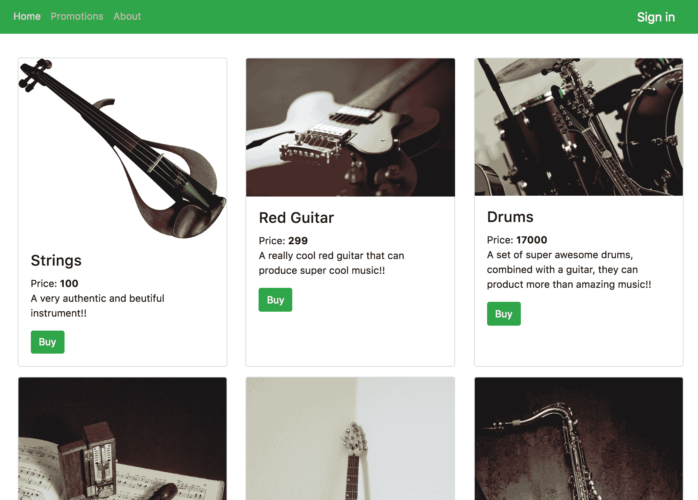
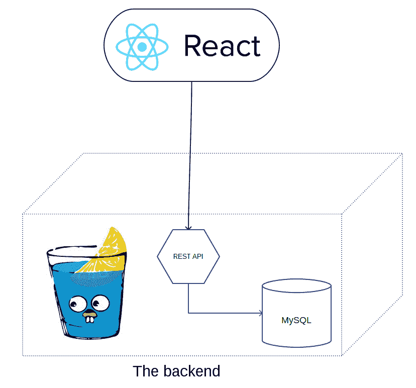

# 欢迎来到全栈 Go

本书是努力为您提供的一个非常实用且简洁的学习工具，用于在 Go 中构建全栈网络应用。学习如何在像 Go 这样的强大语言中构建全栈网络应用可以是一个非常宝贵的技能，因为它允许你独立编写完全功能化和可扩展的应用程序。Go 在业界以其性能和相对易用性而闻名。这确保了你的应用程序可以承受不断增长的数据负载和用户数量的扩展，而不会过早地出现可扩展性问题。

全栈开发者是软件创业公司的主要推动者；这是因为他们能够从零开始快速且高效地构建产品。他们通常也是大型公司中的关键成员或**领域专家**（SMEs），因为他们帮助设计软件系统，从用户界面到后端代码。即使作为一个独立开发者，学习全栈网络编程也能帮助你快速构建你的产品想法，只需周末或两天时间。

在本章中，我们将涵盖以下主题：

+   什么是全栈开发？

+   我们将构建什么？

+   本书的大纲

# 什么是全栈开发？

在我们采取任何进一步步骤之前，我们首先需要回答一个简单的问题；成为一名全栈开发者究竟意味着什么？**全栈开发者**可以被定义为一位软件工程师，他拥有在应用的前端和后端工作的技能。

网络应用的前端基本上与应用的用户界面相关。对于网络应用，构建用户界面所需的技术包括 HTML、CSS 和 JavaScript。在生产环境中，一个应用可以根据用户查看网络应用的设备类型支持不同类型的用户界面。例如，移动智能手机上的前端可能需要不同的规则来适应设备有限的屏幕尺寸，与大型桌面显示器相比。

为了使应用执行其预期完成的任务，网络应用的后端包括所有需要与应用前端通信的软件层。后端包括数据库层、安全层、用户请求处理层、所有 API 层等。网络应用的后端可以用任何成熟的编程语言编写。显然，我们将使用 Go 作为本书的后端语言。

# 我们将构建什么？

在整本书中，我们将从头开始构建一个全栈网络应用。该应用将被命名为 GoMusic；它是一个用 React.js 和 Go 编写的乐器商店。以下截图展示了主页的样式：

用户将能够浏览商店中的乐器，用他们的信用卡购买他们喜欢的乐器，并登录他们的账户查看他们现有的订单。

让我们来看看本书将要构建的应用程序架构。

# 应用程序架构

我们的应用程序架构将相对简单——我们将使用极受欢迎的 React.js 框架来编写前端代码，然后我们将使用强大的 Gin 框架来编写后端代码。Gin 附带了一系列有用的包，我们将使用这些包来构建我们的 Web 应用程序。我们还将利用**Go 对象关系映射**（**GORM**）包，这是 Go 语言中最受欢迎的**对象关系映射**（**ORM**）层之一：

我们将逐步构建我们的应用程序，从前端开始，然后转向后端。我们将涵盖现代 Web 应用程序领域的一些非常重要的概念，例如响应式 UI、RESTful API、安全性、ORM、信用卡处理、测试、基准测试等。

在介绍这些不同主题的同时，我们将涵盖构建应用程序所涉及的大多数代码。

在下一节中，我们将游览本书的概要，以及每一章将涵盖的内容。

# 本书概要

本书将涵盖众多实用主题，以帮助您获得全栈开发者所需的深入技能：

+   在第二章，*Go 的构建块*，和第三章，*Go 并发*中，我们将深入而实际地探讨 Go 语言。您将了解语言的一些关键特性以及一些流行的设计模式。

+   在第四章，*使用 React.js 的前端*，和第五章，*为 GoMusic 构建前端*中，我们将介绍如何使用 React.js 框架构建美观且响应式的应用程序。这也是我们开始构建 GoMusic Web 应用程序的地方。我们将涵盖 React 的构建块、设计模式、最佳实践等。本书项目的前端代码的大部分内容将在第四章，*使用 React.js 的前端*，和第五章，*为 GoMusic 构建前端*中介绍；然而，我们不会涵盖每一条 JavaScript 代码，以免分散注意力。所有代码都将包含在本书的 GitHub 仓库中。

+   在第六章，*使用 Gin 框架的 Go 语言 RESTful Web API*和第七章，*使用 Gin 和 React 的高级 Web Go 应用*，我们将开始使用 Gin 框架构建我们的后端代码。我们将涵盖 RESTful API、ORM、安全 Web 连接等内容。

+   在第八章，*测试和基准测试您的 Web API*，我们将学习如何使用 Go 的测试包和行业最佳实践来测试和基准测试我们的 Go 代码。

+   在第九章，*使用 GopherJS 的等价 Go 语言介绍*，我们将快速学习等价 Go 编程。等价 Go 编程是指在前后端都使用 Go 语言的实践。这是通过 GopherJS 框架实现的。第九章，*使用 GopherJS 的等价 Go 语言介绍*是一个独立的章节，因为它并不尝试使用等价 Go 重新构建 GoMusic 应用。然而，本章涵盖了如何在等价 Go 中构建 React 应用。

+   在第十章，*从这里开始往哪里去？*我们将涉及一些读者应该继续探索的主题，以扩展他们的知识范围，超越本书的内容。

让我们开始学习之旅吧！
