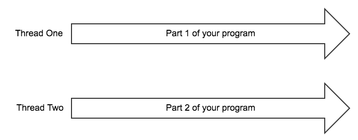
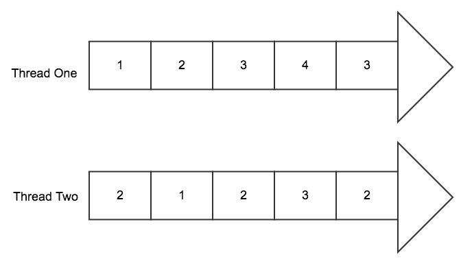
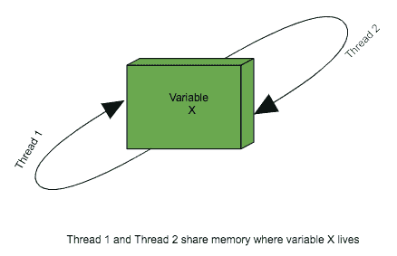
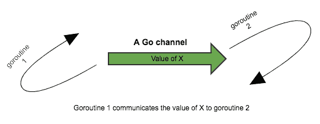

# Go 并发

欢迎来到我们学习 Go 全栈开发的旅程的第二章。在本章中，我们将继续探讨 Go 语言的基石，通过涵盖 Go 语言中的重要主题 **并发** 来实现。Go 语言的并发特性可能是同类语言中最有效且易于使用的。许多转向 Go 的开发者正是因为 Go 的并发特性。本章假设你对编程和线程的概念有一些基本了解。与上一章类似，我们将主要关注最重要的和基础的概念。

本章将涵盖以下主题：

+   什么是并发？

+   Goroutines

+   Go 通道

+   `select` 语句

+   `sync` 包

# 什么是并发？

那么，什么是并发？这个术语在软件行业中使用得很频繁，尽管并不是所有开发者都理解其含义。在本节中，我们将尝试从 Go 语言的视角揭示并发的实际含义，以及为什么它对你来说是有用的。

在 Go 中，**并发**意味着你的程序能够将自己分割成更小的部分，然后能够在不同的时间运行不同的独立部分，目标是根据可用的资源量尽可能快地执行所有任务。

前面的定义可能（对某些人来说）看起来像是在定义线程。然而，并发的概念比线程的概念更广泛。如果你对线程的概念不太熟悉，让我们首先简要地定义一下线程。

线程是操作系统提供的一个功能，它允许你并行运行程序的一部分。假设你的程序由两个主要部分组成，**第一部分**和**第二部分**，你编写代码使得**第一部分**在**线程一**上运行，而**第二部分**在**线程二**上运行。在这种情况下，你的程序的两个部分将同时并行运行；以下图表说明了这将如何看起来：



所有这些都听起来很好；然而，在现代软件中，真正独立的线程数量与你的程序需要执行的同时并发部分数量之间存在差距。在现代软件中，你可能需要数千个程序部分同时独立运行，尽管你的操作系统可能只提供了四个线程！

并发在现代软件中非常重要，因为需要尽可能快地执行独立的代码片段，而不干扰程序的总体流程。让我们以一个简单的 Web 服务器为例；Web 服务器通常接受来自 Web 客户端的请求，例如 Web 浏览器。假设一个请求来自住在欧洲的 Jack，同时另一个请求来自住在亚洲的 Chin，这个请求同时到达 Web 服务器。你不希望因为 Jack 的请求同时到达而延迟 Chin 的请求。他们的请求应该尽可能同时且独立地处理。这正是为什么并发在现代生产软件中是一个不可或缺的功能。

在 Go 和其他现代编程语言中，这个问题通过将程序切割成许多小而独立的片段，并在可用的线程之间*复用*这些片段来解决。通过视觉表示，这一点会更加清晰。

假设我们有一个由 10 个不同部分组成的软件，我们希望它们并发运行，尽管我们只有两个真实的操作系统线程。Go 有将这 10 个不同的部分取出来，安排每个部分的最佳运行时间，然后根据一些非常聪明的算法将它们分配到可用线程的能力。以下是这种做法的一个简单视图：



你的程序中的 10 个部分将感觉像是在同时运行，尽管实际上，它们被巧妙地分配，以便根据可用资源尽快完成任务。Go 负责所有关于在可用线程上调度和分配这 10 段代码的复杂性，同时为你提供一个非常干净的 API，隐藏了所有算法的复杂性。这使得你可以专注于编写满足你需求的强大软件，而不必担心诸如线程管理、低级资源分配和调度等底层概念。

让我们在下一节中看看 goroutines。

# Goroutines

现在是时候深入挖掘 Go 提供的干净 API，以便轻松编写并发软件了。

goroutine 可以简单地定义为程序中可以使用的*轻量级线程*；它不是一个真正的线程。在 Go 语言中，当你将一段代码定义为新的 goroutine 时，你实际上是在告诉 Go 运行时，你希望这段代码与其他 goroutine 并发运行。

在 Go 中，每个函数都存在于某个 goroutine 中。例如，我们在上一章中讨论的 main 函数，通常是程序的入口点函数，它在所谓的**main goroutine**上运行。

那么，如何创建一个新的 goroutine 呢？你只需在你希望并发运行的函数之前添加`go`关键字。语法相当简单：

```go
go somefunction()
```

在这里，`somefunction()` 是你希望并发运行的代码片段。每次你创建一个新的 goroutine，它都会被调度以并发运行，并且不会阻塞当前的 goroutine。

下面是一段简单但更完整的代码片段，帮助我们理解 goroutine 的概念：

```go
package main

import (
 "fmt"
 "time"
)

func runSomeLoop(n int) {
 for i := 0; i < n; i++ {
 fmt.Println("Printing:", i)
 }
}
func main() {
 go runSomeLoop(10)
 //block the main goroutine for 2 seconds
 time.Sleep(2 * time.Second)
 fmt.Println("Hello, playground")
}
```

上述代码是一个简单的程序，它在新的 goroutine 上运行一个名为 `runSomeLoop()` 的函数。这意味着 `runSomeLoop()` 将与 `main()` 函数并发运行。在程序中，我们使用了 `time` 包中的一个名为 `Sleep()` 的函数。这个函数会阻塞主 goroutine，以便给 `runSomeLoop()` 运行并完成的机会。如果我们在这个例子中不阻塞主 goroutine，主 goroutine 很可能先完成，然后程序在 `runSomeLoop()` 完全运行之前退出。在某些情况下，这是由于 goroutines 并发的事实所导致的副作用，这就是为什么调用新的 goroutine 不会阻塞当前 goroutine。

程序的输出将如下所示：

```go
Printing: 0 
Printing: 1 
Printing: 2 
Printing: 3 
Printing: 4 
Printing: 5 
Printing: 6 
Printing: 7 
Printing: 8 
Printing: 9 
Hello, playground
```

这表明 `runSomeLoop()` goroutine 在主 goroutine 睡眠时成功并发运行。当主 goroutine 唤醒时，它在退出之前打印了 `Hello, playground`。

那么，如果我们移除了阻塞主 goroutine 的 `time.Sleep()` 函数会怎样？看看下面的代码块：

```go
package main

import (
  "fmt"
)

func runSomeLoop(n int) {
  for i := 0; i < n; i++ {
    fmt.Println("Printing:", i)
  }
}
func main() {
  go runSomeLoop(10)
  fmt.Println("Hello, playground")
}
```

你将得到以下结果：

```go
Hello, playground
```

你可以看到，在主 goroutine 退出之前，`runSomeLoop()` 没有机会运行。

从内存和资源的角度来看，goroutines 非常轻量；一个生产级的 Go 程序通常会运行数百甚至数千个 goroutines。据许多 Go 用户所说，能够通过如此简单的 API 产生 goroutines 是 Go 语言最强大的特性之一。

让我们在下一节中看看 Go channels。

# Go channels

现在可以解决一个重要的问题；如果我们需要在两个不同的 goroutine 之间共享一些数据怎么办？

在使用多个线程的程序中，不同线程之间共享数据的常见方法是将共享的变量进行锁定。这通常被称为**共享内存****方法**。*以下图示展示了两个线程如何通过共享一个名为**X**的变量来共享内存：



在 Go 中，有一个非常流行的格言：

“不要通过共享内存来通信；相反，通过通信来共享内存。”

这是什么意思呢？这仅仅意味着 Go 通常不倾向于通过锁定方法在线程之间共享内存（尽管有例外）。相反，Go 更倾向于通过 Go channels 在一个 goroutine 和另一个 goroutine 之间通信。这个 *通信* 部分是通过 Go channels 实现的。以下图示展示了这种视觉上的效果：



让我们看一下下一节中的常规和缓冲通道。

# 常规通道

在 Go 中声明通道，你只需使用`make`关键字，如下所示：

```go
myChannel := make(chan int)
```

在前面的代码中，我们创建并初始化了一个名为`myChannel`的通道，它可以存储`int`类型的值。然后，这个通道可以被用来从一个 goroutine 向另一个 goroutine 发送`int`类型的值。

这是从通道接收值的步骤：

```go
//myIntValue will host the value received from the channel
myIntValue := <-myChannel
```

这是向通道发送值的步骤：

```go
myChannel <- 4
```

无论何时你在常规 Go 通道上执行发送或接收操作，你的 goroutine 都会阻塞，直到值完全发送或接收。这简单意味着，如果你通过通道发送一个值，但没有其他 goroutine 在另一端等待它，你的 goroutine 将会阻塞。另一方面，如果你尝试通过通道接收一个值，但没有其他 goroutine 在另一端发送它，你的 goroutine 也会阻塞。这种行为确保了你的代码是同步的，你的值是新鲜且最新的，并且避免了在其他编程语言中使用锁时可能遇到的许多问题。

让我们看一下展示两个 goroutine 通信的完整程序，以便更多地了解 Go 通道：

```go
package main

import (
  "fmt"
  "time"
)

func runLoopSend(n int, ch chan int) {
  for i := 0; i < n; i++ {
    ch <- i
  }
  close(ch)
}

func runLoopReceive(ch chan int) {
  for {
    i, ok := <-ch
    if !ok {
      break
    }
    fmt.Println("Received value:", i)
  }
}

func main() {
  myChannel := make(chan int)
  go runLoopSend(10, myChannel)
  go runLoopReceive(myChannel)
  time.Sleep(2 * time.Second)
}
```

在前面的代码中，我们创建了一个名为`myChannel`的通道，然后将其传递给两个 goroutine：`runLoopSend()`和`runLoopReceive()`。`runLoopSend()`函数将不断向这个通道发送值，而`runLoopReceive()`函数将不断从这个通道接收值。

以下代码将提供以下输出：

```go
Received value: 0
Received value: 1
Received value: 2
Received value: 3
Received value: 4
Received value: 5
Received value: 6
Received value: 7
Received value: 8
Received value: 9 
```

让我们首先关注`runLoopSend()`，因为在这里我们展示了一个新的概念。看看以下代码行：

```go
close(ch)
```

这个语法可以用来关闭通道。一旦通道被关闭，就不能再向它发送数据，否则将发生 panic。

现在，让我们看看`runLoopReceive`，特别是以下这一行：

```go
i, ok := <-ch
```

前面的行是一个特殊的语法，用于检查通道是否已关闭。如果通道未关闭，`ok`的值将为 true，而`i`将获取通过通道发送的值。另一方面，如果通道已关闭，`ok`将为 false。在`runLoopReceive` goroutine 中，如果`ok`为 false，我们将跳出`for`循环。

实际上，还有另一种更优雅的方式来编写这个`for`循环：

```go
  for {
    i, ok := <-ch
    if !ok {
      break
    }
    fmt.Println("Received value:", i)
  }
```

我们可以用以下代码替换前面的代码：

```go
  for i := range ch {
    fmt.Println("Received value:", i)
  }
```

`for..range`语法在通道上是允许的，因为它允许你从通道接收数据，直到通道被关闭。

程序的输出将简单地如下所示：

```go
Received value: 0
Received value: 1
Received value: 2
Received value: 3
Received value: 4
Received value: 5
Received value: 6
Received value: 7
Received value: 8
Received value: 9
```

# 缓冲通道

缓冲通道是一种特殊的通道类型，它包含一个缓冲区，可以存储多个项目。与普通通道不同，缓冲通道只有在以下情况下才会阻塞：

+   通道的缓冲区为空，我们正在尝试从通道接收一个值。

+   通道的缓冲区已满，我们正在尝试向通道发送一个值。

要声明一个缓冲通道，我们使用以下语法：

```go
myBufferedChannel := make(chan int,10)
```

之前的语法创建了一个可以容纳 10 个`int`值的缓冲通道。

要向缓冲通道发送一个值，我们使用与常规通道相同的语法。每次发送操作都将一个项目添加到缓冲区中，如下所示：

```go
myBufferedChannel <- 10
```

要从缓冲通道接收一个值，我们也使用相同的语法。每次接收操作都将从缓冲区中移除一个项目，如下所示：

```go
x := <-myBufferedChannel
```

让我们在下一节中查看`select`语句结构。

# `select`语句

`select`语句是 Go 语言中的一个重要结构。它允许你同时控制多个通道。使用`select`，你可以向不同的通道发送或接收值，然后根据第一个解除阻塞的通道执行代码。

这将通过一个示例来最好地解释；让我们看一下以下代码片段：

```go
    select {
        case i := <-ch:
          fmt.Println("Received value:", i)
        case <-time.After(1 * time.Second):
          fmt.Println("timed out")
    }
```

在前面的例子中，我们使用了`select`语句来控制两个不同的通道。第一个通道被称为`ch`，我们尝试从中接收一个值。相比之下，第二个通道是由`time.After()`函数产生的。`time.After()`函数在 Go 语言中非常流行，尤其是在`select`语句中。该函数生成一个通道，仅在指定超时后接收值，实际上产生了一个预定时间段的阻塞通道。你可以在代码中使用`time.After()`与`select`语句结合，在你想超时另一个通道的接收或发送操作时。

这里是另一个发送带有超时通道的`select`语句的示例，但这次是接收和发送操作的组合：

```go
    select {
        case i := <-ch1:
          fmt.Println("Received value on channel ch1:", i)
        case ch2 <- 10:
          fmt.Println("Sent value of 10 to channel ch2")
        case <-time.After(1 * time.Second):
          fmt.Println("timed out")
    }
```

前面的代码将在三个通道之间进行同步：`ch1`、`ch2`和`time.After()`通道。`select`语句将等待这三个通道，然后根据哪个通道先完成，执行相应的`select`情况。

`select`语句还支持`default`情况。如果没有通道准备好，`default`情况将立即执行；以下是一个示例：

```go
    select {
        case i := <-ch1:
          fmt.Println("Received value on channel ch1:", i)
        case ch2 <- 10:
          fmt.Println("Sent value of 10 to channel ch2")
        default:
          fmt.Println("No channel is ready")
    }
```

在前面的代码中，如果`ch1`和`ch2`都因`time`而阻塞，则执行`select`语句，然后触发`default`情况。

如果在`select`语句的控制下多个通道同时完成，则随机选择要执行的通道情况。

让我们在下一节中查看`sync`包。

# `sync`包

本章我们将要讨论的最后一个主题是`sync`包。当你绝对需要在 Go 中创建互斥锁时，你会使用`sync`包。尽管我们提到 Go 更倾向于使用通道在 goroutines 之间通信数据，但在某些情况下，锁或**互斥对象**（**mutex**）是不可避免的。一个在 Go 标准包中使用锁的例子是`http`包，其中使用锁来保护特定`http`服务器对象的监听器集合。这个监听器集合可以从多个 goroutines 中访问，因此它们被互斥锁保护。

在计算机编程的世界里，单词*mutex*指的是一个允许多个线程访问相同资源（如共享内存）的对象。互斥锁之所以这样命名，是因为它允许一次只有一个线程访问数据。

互斥锁在软件中的工作流程通常如下：

1.  一个线程获取互斥锁

1.  只要有一个线程拥有互斥锁，其他线程就不能获取互斥锁

1.  获取互斥锁的线程可以无干扰地访问一些资源，而其他线程不会干扰

1.  当其任务完成时，获取互斥锁的线程会释放互斥锁，以便其他线程可以再次竞争它

在 Go 中，你使用 goroutines 而不是完整的线程。所以，当你使用 Go 中的互斥锁时，它们将管理 goroutines 之间的资源访问。

让我们看看下一节中的简单互斥锁、读写互斥锁和等待组。

# 简单互斥锁

在 Go 中，一个简单的锁是互斥锁`struct`类型的指针，它属于`sync`包。我们可以创建一个互斥锁如下：

```go
var myMutex = &sync.Mutex{}
```

假设我们有一个名为`myMap`的`map[int]int`类型的 map，我们希望保护它免受多个 goroutines 的并发访问：

```go
myMutex.Lock()
myMap[1] = 100
myMutex.Unlock()
```

如果我们确保所有需要编辑`myMap`的 goroutines 都能访问`myMutex`，我们就可以保护`myMap`免受多个 goroutines 同时更改的影响。

# 读写互斥锁

Go 还支持读写锁。读写锁区分读和写操作。所以，当你只执行并发读操作时，goroutines 不会阻塞。然而，当你执行写操作时，所有其他读和写都会阻塞，直到写锁释放。像往常一样，以下是一个示例，可以最好地解释这一点：

```go
var myRWMutex = &sync.RWMutex{}
```

Go 中的读写锁由指向`sync.RWMutex`类型 Go 结构的指针表示，这是我们之前代码片段中初始化的。

要执行读操作，我们使用 Go 结构体的`RLock()`和`RUnlock()`方法：

```go
myRWMutex.RLock()
fmt.Println(myMap[1])
myRWMutex.RUnlock()
```

要执行写操作，我们使用`Lock()`和`Unlock()`方法：

```go
myRWMutex.Lock()
myMap[2] = 200
myRWMutex.Unlock()
```

`*sync.RWMutex`类型在 Go 的标准包中到处都可以找到。

# 等待组

等待组的概念对于在 Go 中构建生产级软件非常重要；它允许你在继续编写其余代码之前等待多个 goroutine 完成。

为了完全掌握等待组的优势，让我们回到一个早期的代码示例：

```go
package main

import (
  "fmt"
  "time"
)

func runLoopSend(n int, ch chan int) {
  for i := 0; i < n; i++ {
    ch <- i
  }
  close(ch)
}

func runLoopReceive(ch chan int) {
  for {
    i, ok := <-ch
    if !ok {
      break
    }
    fmt.Println("Received value:", i)
  }
}

func main() {
  myChannel := make(chan int)
  go runLoopSend(10, myChannel)
  go runLoopReceive(myChannel)
  time.Sleep(2 * time.Second)
}
```

在前面的代码中，我们必须让主 goroutine 休眠两秒钟，以便等待其他两个 goroutine 完成。然而，如果其他 goroutine 耗时超过两秒呢？这种简单的休眠方式并不能保证产生我们寻求的结果。相反，我们可以这样做：

```go
package main

import (
  "fmt"
  "sync"
)

// Create a global waitgroup:
var wg = &sync.WaitGroup{}

func main() {
  myChannel := make(chan int)
  //Increment the wait group internal counter by 2
  wg.Add(2)
  go runLoopSend(10, myChannel)
  go runLoopReceive(myChannel)
  //Wait till the wait group counter is 0
  wg.Wait()
}

func runLoopSend(n int, ch chan int) {
  //Ensure that the wait group counter decrements by one after //our function exits
  defer wg.Done()
  for i := 0; i < n; i++ {
    ch <- i
  }
  close(ch)
}

func runLoopReceive(ch chan int) {
  //Ensure that the wait group counter decrements after our  //function exits
  defer wg.Done()
  for {
    i, ok := <-ch
    if !ok {
      break
    }
    fmt.Println("Received value:", i)
  }
}
```

Go 中的`WaitGroup`结构体类型是一种包含内部计数器的类型；只要内部计数器不为`0`，等待组就会阻塞您的 goroutine。在前面的代码中，我们创建了一个指向`WaitGroup`的全局指针变量，我们称之为`wg`。这个变量将在这个简单的程序中的所有函数中可见。在我们触发两个 goroutine 之前，我们使用`wg.Add(2)`方法将等待组内部计数器增加`2`。之后，我们继续创建我们的两个 goroutine。对于每个添加的 goroutine，我们添加以下代码：

```go
defer wg.Done()
```

这使用了`defer`和`wg.Done()`方法的组合，以确保每当 goroutine 函数执行完毕时，`wg.Done()`都会被调用。`wg.Done()`方法将内部等待组计数器减一。

最后，在我们的主 goroutine 结束时，我们调用`wg.Wait()`，这将阻塞当前 goroutine，直到等待组的内部计数器为零。这将反过来迫使主 goroutine 等待直到我们程序中的所有 goroutine 完成执行。

前面代码的最终输出如下：

```go
Received value: 0
Received value: 1
Received value: 2
Received value: 3
Received value: 4
Received value: 5
Received value: 6
Received value: 7
Received value: 8
Received value: 9
```

# 摘要

在本章中，我们介绍了生产级 Go 编程世界中的关键概念。我们从实用的角度讲解了并发，然后深入探讨了 Go 提供的 API，以允许您以最小的复杂性编写高效的并发软件。

在下一章中，我们将从 Go 编程切换到前端编程，通过介绍流行的 React 框架的构建块来开始新的主题。

# 问题

1.  什么是并发？

1.  什么是线程？

1.  并发的概念与并行线程的概念有何不同？

1.  什么是 goroutine？

1.  “通过通信共享内存”是什么意思？

1.  什么是 Go 通道？

1.  正规的 Go 通道和带缓冲的 Go 通道之间的区别是什么？

1.  你应该在什么情况下使用`select`语句？

1.  `sync.Mutex`和`sync.RWMutex`之间的区别是什么？

1.  你应该在什么情况下使用等待组？

# 进一步阅读

更多信息，您可以查看以下链接：

+   **Golang 中的并发**：[`www.minaandrawos.com/2015/12/06/concurrency-in-golang/`](http://www.minaandrawos.com/2015/12/06/concurrency-in-golang/)

+   **并发不是并行**：[`blog.golang.org/concurrency-is-not-parallelism`](https://blog.golang.org/concurrency-is-not-parallelism)

+   **包** `sync`: [`golang.org/pkg/sync/`](https://golang.org/pkg/sync/)
