# 使用 React.js 的前端

在本章中，我们将迈出第一步，了解全栈的上半部分，即前端。为了正确构建任何软件产品，你需要有足够的实践经验来构建一个美观的用户界面。这对于构建其他人乐于使用的软件产品至关重要。

我们将讨论强大的 React 框架，它是目前市场上最受欢迎的前端框架之一。React 允许你构建能够实时响应数据变化的动态网站。这使得你可以构建响应式和智能的网站。今天互联网上大多数流行的网站都是用 React 构建的。我们将从非常实用的角度来介绍 React，因此我们将直接深入探讨如何编写 React 应用程序，而不是处理理论或相关主题。

在本章中，我们将讨论以下主题：

+   如何构建 React 应用程序

+   安装 React

+   JSX 和 React 元素

+   React 组件

+   属性

+   状态

+   React 开发者工具

# 先决条件和技术要求

React 框架简单来说就是一组我们可以用来构建美观、响应式 UI 的 JavaScript 模块。正因为如此，你需要一些 JavaScript 知识来理解本章内容。

一个非常好的资源，可以帮助你重新熟悉 JavaScript，可以在 [`developer.mozilla.org/en-US/docs/Web/JavaScript/A_re-introduction_to_JavaScript`](https://developer.mozilla.org/en-US/docs/Web/JavaScript/A_re-introduction_to_JavaScript) 找到。

在本章中，我们将主要使用 ES6，这可以简单地被认为是 JavaScript 的新版本。

在本章中，我们将遇到 ES6 的四个核心特性：

+   **类**：在 JavaScript 中，类可以被看作是一个*特殊函数*，在其中你可以定义内部方法。更多信息，请访问 [`developer.mozilla.org/en-US/docs/Web/JavaScript/Reference/Classes`](https://developer.mozilla.org/en-US/docs/Web/JavaScript/Reference/Classes)。

+   **箭头函数**：箭头函数是 JavaScript 的匿名函数版本。更多信息，请访问 [`developer.mozilla.org/en-US/docs/Web/JavaScript/Reference/Functions/Arrow_functions`](https://developer.mozilla.org/en-US/docs/Web/JavaScript/Reference/Functions/Arrow_functions)。

+   **let** **关键字**：`let` 关键字用于声明块作用域局部变量。更多信息，请访问 [`developer.mozilla.org/en-US/docs/Web/JavaScript/Reference/Statements/let`](https://developer.mozilla.org/en-US/docs/Web/JavaScript/Reference/Statements/let)。

+   **const** **关键字**：`const` 关键字用于声明局部作用域的常量变量，其初始值不能改变。更多信息，请访问 [`developer.mozilla.org/en-US/docs/Web/JavaScript/Reference/Statements/const`](https://developer.mozilla.org/en-US/docs/Web/JavaScript/Reference/Statements/const)。

# GoMusic 项目

在本章中，我们将利用 React 的力量为 GoMusic 商店构建一个产品页面。GoMusic 商店是我们将在整本书中构建的主要全栈项目，它基本上是一个乐器在线商店。前端将使用 React 构建，而后端将使用 Go 构建。

下面是我们今天正在构建的产品页面：

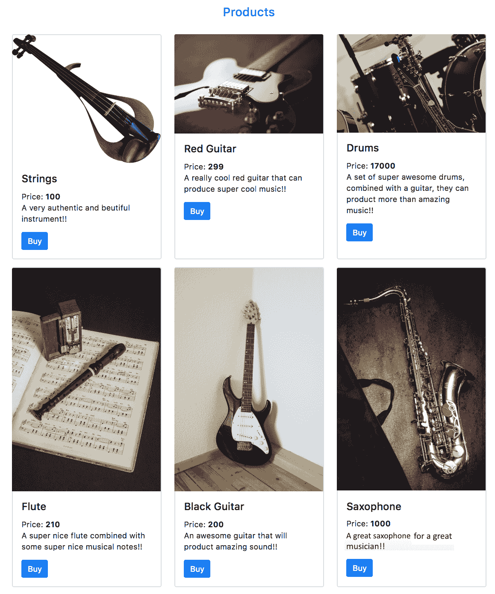

我们将采用逐步的方法来构建这个页面。这个网页将不会是普通的。我们将利用强大的 React 开发工具，在每次我们做出更改时实时更新这个页面。为了进一步展示 React 及其工具的能力，这个网页将依赖于一个 JSON 文件，该文件将包含我们试图出售的乐器信息，包括图片、名称、价格和描述。每次我们更新 JSON 文件时，网页将自动使用 JSON 文件中的新信息进行更新。

要构建 GoMusic 网站，我们需要 Node.js 和**节点包管理器**（**npm**），我们将在下一节中看到。

# Node.js 和 npm

我们还将使用 npm。npm 是一个非常流行的包，它托管了几乎所有知名的 Node.js 和 JavaScript 包。我们需要 npm 来安装 React 以及我们将用于构建 React 应用程序的辅助工具。

npm 通常与 Node.js 一起分发。所以，如果你已经在你的计算机上安装了较新的 Node.js 版本，npm 也应该在那里。

如果你还没有安装 Node.js，请访问[`nodejs.org/en/`](https://nodejs.org/en/)在你的计算机上安装 Node.js。确保你有涉及工具的最新版本。所以，如果你有 Node，但它是旧版本，请继续将其更新到新版本。

你可以在[`www.npmjs.com/get-npm`](https://www.npmjs.com/get-npm)找到有关 npm 安装的更多信息。

让我们在下一节中看看 HTML、CSS 和 Bootstrap。

# HTML、CSS 和 Bootstrap

本章主要关注 React，并假设读者熟悉前端基础知识，如 HTML 和 CSS。

对 HTML 和 CSS 有一些基本了解应该足以让你理解这一章。HTML 是用于构建网页的语言，而 CSS 是用于美化网页的语言（添加颜色等）。

如果你以前接触过 HTML 和 CSS，那就足够了。然而，如果你在继续之前更喜欢更深入地探索 HTML，请查看[`developer.mozilla.org/en-US/docs/Learn/HTML/Introduction_to_HTML`](https://developer.mozilla.org/en-US/docs/Learn/HTML/Introduction_to_HTML)。对于探索 CSS，这个链接是一个很好的资源：[`developer.mozilla.org/en-US/docs/Learn/CSS/Introduction_to_CSS`](https://developer.mozilla.org/en-US/docs/Learn/CSS/Introduction_to_CSS)。

我们将利用强大的 Bootstrap 4 框架来构建我们的前端视图，因此熟悉 Bootstrap 也会有助于本章的学习。

你可以在 [`getbootstrap.com/docs/4.1/getting-started/introduction/`](https://getbootstrap.com/docs/4.1/getting-started/introduction/) 找到有关 Bootstrap 的信息。

开始使用 Bootstrap 的一种最实用的方法是使用他们的启动模板，你可以在 [`getbootstrap.com/docs/4.1/getting-started/introduction/#starter-template`](https://getbootstrap.com/docs/4.1/getting-started/introduction/#starter-template) 找到它。

# 项目代码

对于本项目我们将涵盖的代码，有一个 GitHub 仓库，你可以在 [`github.com/PacktPublishing/Hands-On-Full-Stack-Development-with-Go/tree/master/Chapter04`](https://github.com/PacktPublishing/Hands-On-Full-Stack-Development-with-Go/tree/master/Chapter04) 找到它。

让我们在下一节中看看 React 框架。

# React 框架

React (或 React.js) 是一个用于构建网页用户界面的 JavaScript 库；它于 2013 年首次由 Facebook 发布，自那时以来其受欢迎程度呈指数级增长。该库目前由 Facebook、Instagram 以及一个充满热情的社区维护。React 可以构建性能优异且交互性强的网站。

在下一节中，我们将看到如何构建 React 应用程序。

# 如何构建 React 应用程序

要理解和构建 React 应用程序，你必须首先了解库的工作原理以及协同工作以组成你的 React 应用程序的各个部分。在本节中，我们将解释你需要遵循的步骤序列来构建一个 React 应用程序。

这里是解释如何构建 React 应用的最简单方法：

1.  为你的应用程序创建 *React 元素*：

    +   元素是 React 中最基本的构建块之一。它代表了一块视觉用户界面，例如一张图片、带有粗体字的线条或一个按钮。

    +   你可以通过混合 JSX、CSS 和 JavaScript 来创建一个元素。

1.  使用 React 组件包裹你的 *元素*：

    +   组件简单来说就是一个由 React 元素组成的 JavaScript 类或函数。

    +   一个 React 应用程序主要是由多个交换数据的 React 组件组成的。

    +   一个组件的例子可以是来自我们产品页面上的单个产品卡片！[](img/27cc65bb-a900-45f1-8a8f-53c579ca85ae.png)

1.  使用 *props* 在你的 React 组件之间传递数据：

    +   Prop 允许一个组件向另一个组件发送数据。

    +   在我们的项目中，我们通过 props 将产品图片、名称、价格和描述传递给产品卡片组件。

1.  使用 *state* 来管理和更改你 React 组件内部的数据：

    +   与 prop 不同，React 的 `state` 对象是 React 组件内部的。

    +   当你的 `state` 对象中的数据发生变化时，React 库会重新渲染受数据变化影响的应用程序部分。

    +   在我们的项目中，`state` 对象是每当新产品添加到我们的产品页面时发生变化的。

在下一节中，我们将设置我们的 React 项目。

# 设置项目

是时候设置我们的 React 项目了。在本节中，我们将安装启动项目所需的工具。

# 安装 React

现在，我们需要安装 React。幸运的是，通过引入一个名为 Create React App 的强大工具，这一步变得简单。这个工具捆绑了许多功能，允许我们创建新的 React 应用程序，实时构建它们，然后构建它们以便它们可以用于生产。

该工具可以通过 npm 软件包管理器获取。要安装工具，您需要运行以下命令：

```go
npm install -g create-react-app
```

此命令将在全局范围内安装工具，这将允许您从任何地方使用该工具。

现在，在终端中，转到您希望工具运行的位置。要创建该文件夹中的新 React 应用程序，请运行以下命令：

```go
create-react-app first-react-tutorial
```

确保您已安装最新版本的 Node 和 npm，以避免错误。

这将创建一个名为 `first-react-tutorial` 的新应用程序，位于一个同名的新文件夹下。

一旦创建了应用程序，我们就准备好编写一些代码了。但首先，让我们看看这个新应用程序的外观；导航到应用程序文件夹，然后运行 `npm start` 脚本。以下是它的样子：

```go
cd first-react-tutorial
npm start
```

这将在本地端口 `3000` 上运行您的新 React 应用程序，它也应该打开一个浏览器来查看新应用程序，URL 将是 `http://localhost:3000`。以下是一个纯 React 应用程序的外观：

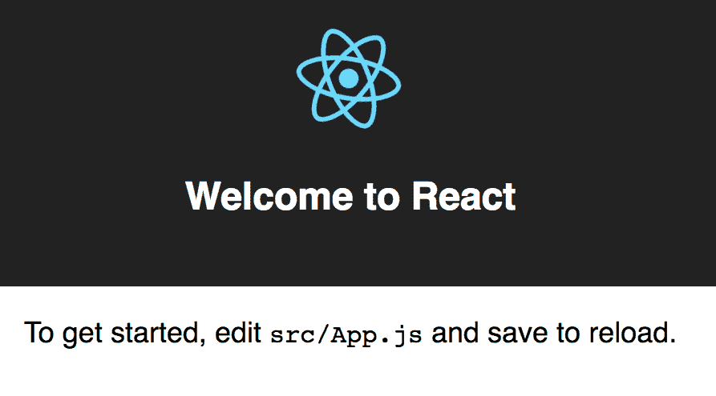

在下一节中，让我们准备新的项目。

# 准备新项目

使用 Create React App 工具生成的 React 应用程序包含了许多功能。为了本章的目的，我们只需要编写一个简单的 React 应用程序；以下是生成应用程序文件夹结构的样子：

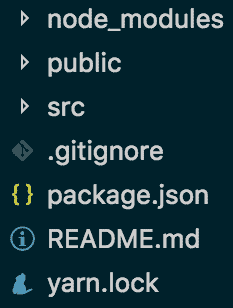

在本章中，我们将主要关注构建一个简单的 React 应用程序，因此我们不需要一些与生成应用程序一起提供的花哨功能。为了简化问题，让我们删除生成应用程序 `src` 文件夹内的所有文件和文件夹。之后，让我们只创建一个名为 `index.js` 的单个空 JavaScript 文件。以下是它的样子：

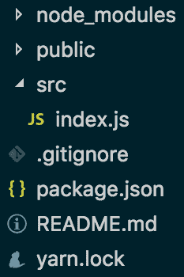

完美——现在，我们准备好编写我们的简单产品页面了。第一步是将 Bootstrap 包含到我们的 HTML 中，这样我们就可以利用 Bootstrap 强大的样式。如果您打开 `public` 文件夹，您将找到一个 `index.html` 文件。此文件包含一些初始 HTML，您可以在您的 React 应用程序中使用它。我们将稍微修改此 HTML 文件以集成 Bootstrap，并且我们还将包含一个 ID 为 `root` 的 `div`。以下是修改后的 `index.html` 应该看起来像这样：

```go
<!DOCTYPE html>
<html lang="en">
  <head>
    <meta charset="utf-8">
    <meta name="viewport" content="width=device-width, initial-scale=1, shrink-to-fit=no">
    <!-- Bootstrap CSS -->
    <link rel="stylesheet" href="https://stackpath.bootstrapcdn.com/bootstrap/4.1.1/css/bootstrap.min.css" integrity="sha384-WskhaSGFgHYWDcbwN70/dfYBj47jz9qbsMId/iRN3ewGhXQFZCSftd1LZCfmhktB" crossorigin="anonymous">

    <meta name="theme-color" content="#000000">
    <!--
      manifest.json provides metadata used when your web app is added to the
      homescreen on Android. See https://developers.google.com/web/fundamentals/engage-and-retain/web-app-manifest/
    -->
    <link rel="manifest" href="%PUBLIC_URL%/manifest.json">
    <link rel="shortcut icon" href="%PUBLIC_URL%/favicon.ico">
    <!--
      Notice the use of %PUBLIC_URL% in the tags above.
      It will be replaced with the URL of the `public` folder during the build.
      Only files inside the `public` folder can be referenced from the HTML.

      Unlike "/favicon.ico" or "favicon.ico", "%PUBLIC_URL%/favicon.ico" will
      work correctly both with client-side routing and a non-root public URL.
      Learn how to configure a non-root public URL by running `npm run build`.
    -->
    <title>React App</title>
  </head>
  <body>
    <noscript>
      You need to enable JavaScript to run this app.
    </noscript>
    <div id="root"></div>
    <!--
      This HTML file is a template.
      If you open it directly in the browser, you will see an empty page.

      You can add webfonts, meta tags, or analytics to this file.
      The build step will place the bundled scripts into the <body> tag.

      To begin the development, run `npm start` or `yarn start`.
      To create a production bundle, use `npm run build` or `yarn build`.
    -->
    <script src="img/jquery-3.3.1.slim.min.js" integrity="sha384-q8i/X+965DzO0rT7abK41JStQIAqVgRVzpbzo5smXKp4YfRvH+8abtTE1Pi6jizo" crossorigin="anonymous"></script>
    <script src="img/popper.min.js" integrity="sha384-ZMP7rVo3mIykV+2+9J3UJ46jBk0WLaUAdn689aCwoqbBJiSnjAK/l8WvCWPIPm49" crossorigin="anonymous"></script>
    <script src="img/bootstrap.min.js" integrity="sha384-smHYKdLADwkXOn1EmN1qk/HfnUcbVRZyYmZ4qpPea6sjB/pTJ0euyQp0Mk8ck+5T" crossorigin="anonymous"></script>
  </body>
</html>
```

您可以直接复制前面的代码并将其粘贴到 `public` 文件夹内的 `index.html` 文件中。

下一步是将乐器的图片放入您的项目中。您可以从本项目的 GitHub 页面下载图片：[`github.com/PacktPublishing/Hands-On-Full-Stack-Development-with-Go/tree/master/Chapter04/public/img`](https://github.com/PacktPublishing/Hands-On-Full-Stack-Development-with-Go/tree/master/Chapter04/public/img)。

在您的`public`文件夹内创建一个名为`img`的新文件夹；将所有图片复制到该文件夹中。

下一步是创建一个 JSON 文件，描述我们希望在产品页面上显示的每个乐器。正如我们之前提到的，我们的 React 应用程序将依赖于这个 JSON 文件来确定要查看哪些产品。该文件名为`cards.json`，以下是我们应该最初放入的内容：

```go
[{
 "id" : 1,
 "img" : "img/strings.png",
 "imgalt":"string",
 "desc":"A very authentic and beautiful instrument!!",
 "price" : 100.0,
 "productname" : "Strings"
}, {
 "id" : 2,
 "img" : "img/redguitar.jpeg",
 "imgalt":"redg",
 "desc":"A really cool red guitar that can produce super cool music!!",
 "price" : 299.0,
 "productname" : "Red Guitar"
},{
 "id" : 3,
 "img" : "img/drums.jpg",
 "imgalt":"drums",
 "desc":"A set of super awesome drums, combined with a guitar, they can product more than amazing music!!",
 "price" : 17000.0,
 "productname" : "Drums"
},{
 "id" : 4,
 "img" : "img/flute.jpeg",
 "imgalt":"flute",
 "desc":"A super nice flute combined with some super nice musical notes!!",
 "price" : 210.0,
 "productname" : "Flute"
}]
```

现在，我们的`public`文件夹应该看起来像这样：

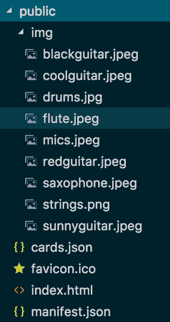

让我们在下一节中看看 JSX 和 React 元素。

# JSX 和 React 元素

JSX 可以被定义为类似于 HTML 的 JavaScript 扩展。JSX 可以在 React 中用于创建 React 元素。基本上，如果您知道 HTML，您就知道了 JSX！在 React 文档中，React 元素被简单地定义为屏幕上想要看到的内容的描述。

React 实际上并不需要 JSX 来工作——您可以用一些纯 JavaScript 替换 JSX。然而，当开发 React 应用程序时，推荐使用 JSX，并且它被 React 社区的绝大多数人所接受。让我们看看一些例子。

记得产品页面上的购买按钮吗？

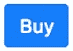

这个按钮是一个我们可以用 JSX 描述的视觉元素，如下所示：

```go
<a href="#" className="btn btn-primary">Buy</a>
```

您可以看到 JSX 看起来与 HTML 相似。在本章中，我们将注意到的两个主要区别之一是，在 JSX 中，当我们定义元素所属的类名时，我们使用`className`关键字而不是`class`。在前面的代码片段中，我使用了 Bootstrap 的 CSS 来设置我的元素的样式。

JSX 与 HTML 之间的另一个区别是 JSX 使用了驼峰式命名约定。例如，HTML 中的`tabindex`属性在 JSX 中变为`tabIndex`。

Bootstrap 按钮组件可以在[`getbootstrap.com/docs/4.1/components/buttons/`](https://getbootstrap.com/docs/4.1/components/buttons/)找到。`href`属性并不指向一个真实的链接，因为我们只构建前端部分。

由于 JSX 是 JavaScript 的扩展，您可以轻松地将它集成到 JavaScript 代码中。例如，您可以简单地这样做：

```go
const btnElement = <a href="#" className="btn btn-primary">Buy</a>;

```

您可以通过使用花括号在 JSX 中嵌入 JavaScript 代码。例如，我们可以这样做：

```go
const btnName = "Buy";
const btnElement = <a href="#" className="btn btn-primary">{btnName}</a>;

```

或者，您可以像以下代码片段那样做：

```go
const btnName = "Buy";
const btnClass = "btn btn-primary"; 
const btnElement = <a href="#" className={btnClass}>{btnName}</a>;
```

一个元素可以有子元素，就像我们会想到 HTML 元素一样。例如，以下是一个包含按钮元素的父`div`元素的示例：

```go
<div className="card-body">
   <a href="#" className="btn btn-primary">Buy</a>
</div>
```

由于 React 元素只是普通的对象，因此它们易于创建。要将 React 元素渲染到 **文档对象模型** (**DOM**) 中，我们使用 `ReactDOM.render()`，如下所示：

```go
const btnElement = <a href="#" className="btn btn-primary">Buy</a>;
ReactDOM.render(btnElement,document.getElementById('root'));
```

前面的代码会将按钮元素渲染到根 DOM 节点。

现在，我们有了足够的信息来使用 JSX 构建我们的产品卡片。作为提醒，以下是产品卡片的样子：

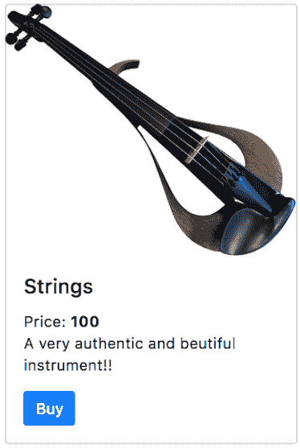

假设我们已经有了产品信息作为变量，如下所示：

```go
const img = "img/strings.png";
const imgalt = "string";
const desc = "A very authentic and beautiful instrument!!";
const price = 100;
const productName = "Strings";
```

利用我们手头的信息，以下是我们在 JSX 中如何编写一个 React 元素来表示产品卡片：

```go
 <div className="col-md-6 col-lg-4 d-flex align-items-stretch">
     <div className="card mb-3">
         
         <div className="card-body">
             <h4 className="card-title">{productname}</h4>
             Price: <strong>{price}</strong>
             <p className="card-text">{desc}</p>
             <a href="#" className="btn btn-primary">Buy</a>
     </div>
    </div>
 </div>
```

除了使用 `className` 而不是 `class`，以及使用花括号 `{}` 来承载 JavaScript 代码之外，前面的代码看起来就像一段 HTML 代码。我们只是简单地构建了一个带有几个子元素的 `div` 元素。

在前面的代码片段中，我们使用了 `div` 标签、一个 `img` 标签、一个 `h4` 标签和一个 `a` 标签来构建我们的 React 元素。所有这些标签都是任何前端开发者可能每天都会遇到的熟悉的 HTML 标签。

对于样式，我使用了 Bootstrap 的力量来使我们的产品卡片看起来很漂亮。我们使用了 Bootstrap 的网格系统来确保卡片在浏览器屏幕上的位置合适。

我们还使用了 Boostrap 的出色卡片组件，可以在以下位置找到：[`getbootstrap.com/docs/4.1/components/card/`](https://getbootstrap.com/docs/4.1/components/card/)。

所有图片都是从 [`www.pexels.com`](https://www.pexels.com) 获得的，该网站提供免费图片供你在项目中使用。

让我们在下一节中看看 React 组件。

# React 组件

在构建代表你视觉视图的元素之后，你需要用 React 组件将它们包裹起来，以便能够在你的 React 项目中正确使用它们。

一个 React 组件通常由以下部分组成：

+   我们在 *JSX 和 React 元素* 部分讨论过的 React 元素

+   Props，我们将在 *Props* 部分讨论

+   State，我们将在 *State* 部分讨论

在我们深入探讨 props 和 state 之前，让我们先了解一些基础知识。一个组件通常被编写为一个 JavaScript 类或函数。让我们编写一个简单的组件来感受它们到底是什么。

记得我们在 *JSX 和 React 元素* 部分提到的卡片元素吗？下面是它的样子：

```go
 <div className="col-md-6 col-lg-4 d-flex align-items-stretch">
     <div className="card mb-3">
         
         <div className="card-body">
             <h4 className="card-title">{productname}</h4>
             Price: <strong>{price}</strong>
             <p className="card-text">{desc}</p>
             <a href="#" className="btn btn-primary">Buy</a>
     </div>
    </div>
 </div>
```

在一个 React 生产应用中，我们需要编写一个组件来承载这个元素。以下是 React 组件的样子：

```go
import React from 'react';
class Card extends React.Component {
     render() {
         const img = "img/strings.png";
         const imgalt = "string";
         const desc = "A very authentic and beautiful instrument!!";
         const price = 100;
         const productName = "Strings";
         return (
             <div className="col-md-6 col-lg-4 d-flex align-items-stretch">
                 <div className="card mb-3">
                     
                     <div className="card-body">
                         <h4 className="card-title">{productname}</h4>
                         Price: <strong>{price}</strong>
                         <p className="card-text">{desc}</p>
                         <a href="#" className="btn btn-primary">Buy</a>
                     </div>
                 </div>
             </div>
         );
     }
}
```

在我们项目的 `src` 文件夹中，将前面的代码复制到 `index.js`。

现在，让我们检查前面的代码。以下是你需要知道的信息：

+   一个 React 组件是一个继承自 `React.Component` 类型的 JavaScript 类。

+   在 React 组件类中，最重要的方法是 `render()`，因为这个方法返回你的组件生成的 React 元素。

+   组件名称以大写字母开头，这就是为什么 `Card` 以 *C* 开头而不是 *c*。

你可能想知道为什么组件名称必须以大写字母开头。

这是因为在 React 中，一旦你创建了一个组件，你就可以在 JSX 中使用它作为一个 DOM 标签。所以为了区分原生 DOM 标签，例如`div`，和组件 DOM 标签，例如`Card`，我们使用大写字母作为组件的首字母。

由于你可以在 JSX 中使用组件作为 DOM 标签，你可以使用`reactDOM.render()`来渲染它们，如下所示：

```go
reactDOM.render(<Card/>,document.getElementById('root'));
```

上述代码将在我们的 HTML 文档的`root` `div`下渲染我们的组件。

让我们在下一节中看看 React 应用程序的设计。

# React 应用程序设计

现在我们已经了解了组件，是时候讨论如何利用组件的力量来设计一个 React 应用程序了。一个 React 应用程序由多个相互通信的组件组成。应该有一个主要容器组件，它作为其他组件的入口点。React 社区建议不要编写继承自其他组件的组件。相反，社区建议使用组合。所以，当我们谈论父组件和子组件时，我们并不是说子组件继承父组件的类，我们只是说父组件包含一个或多个子组件。

组合意味着你的所有组件类都应该继承自`React.Component`，然后父组件渲染子组件来构建你的 Web 应用程序。这最好通过一个例子来解释。

对于我们的产品页面，合适的设计将涉及两个组件：一个`CardContainer`组件，它将托管我们试图查看的产品卡片列表，以及一个`Card`组件，它将代表单个产品卡片。

`CardContainer`组件是父组件，而`Card`组件是子组件：

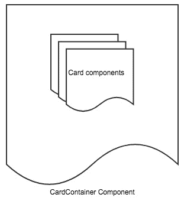

这两个对象都将继承自`React.Component`。`CardContainer`组件将渲染一系列`Card`组件来构建支持多个产品的产品页面。然而，在我们深入到`CardContainer`的代码之前，我们需要了解`CardContainer`将如何将乐器产品数据传递给`Card`，这正是下一节将要解决的问题。

让我们看看下一节中的 props 和 state。

# Props

所以，这一切看起来都很不错。然而，在现实中，由于我们有多个产品而不是一个，我们需要一个`Card`组件的列表，而不仅仅是一个。将此组件硬编码多次以对应每个产品是没有意义的。因此，我们希望只编写一次卡片组件。我们在*React 应用程序设计*部分讨论的`CardContainer`组件应该将产品信息传递给`Card`组件。所以，我们基本上有一个需要向子组件传递一些信息的父组件。

你可能会想知道：为什么我们需要`CardContainer`组件将数据传递给`Card`组件，而不是让`Card`组件自己查找数据？答案是简单的：发现 React 应用的最佳设计是在数据有意义的最高层父组件中处理数据状态，然后根据需要将数据片段传递给较小的子组件。这种设计允许子组件相互同步，并与它们的父组件同步。

在我们的应用中，处理所有产品信息数据的最高层组件是`CardContainer`，而只需要访问单个产品信息的较小子组件由`Card`组件处理。在 React 的世界里，这种从父组件到子组件的数据传递是通过`props`对象完成的。`Props`简单来说就是属性。

要访问任何 React 组件内的属性，我们只需调用`this.props`。假设产品信息已经通过 props 传递给了我们的`Card`组件。下面是`Card`代码现在的样子：

```go
import React from 'react';
class Card extends React.Component {
     render() {
         return (
             <div className="col-md-6 col-lg-4 d-flex align-items-stretch">
                 <div className="card mb-3">
                     
                     <div className="card-body">
                         <h4 className="card-title">{this.props.productname}</h4>
                         Price: <strong>{this.props.price}</strong>
                         <p className="card-text">{this.props.desc}</p>
                         <a href="#" className="btn btn-primary">Buy</a>
                     </div>
                 </div>
             </div>
         );
     }
}
```

在前面的代码中，我们简单地通过`this.props`访问了`props`对象，并且因为我们假设产品信息已经通过 props 传递给了我们，所以`props`对象包含了我们所需的所有信息。

所以，现在来回答一个重要的问题：信息是如何通过 props 从父组件（在我们的例子中是`CardContainer`）传递到子组件（在我们的例子中是`Card`）的？

答案相当简单；由于组件名称在 JSX 中成为 DOM 标签，我们可以在 JSX 中简单地表示一个组件，如下所示：

```go
 <Card img="img/strings.png" alt="strings" productName="Strings" price='100.0' desc="A very authentic and beautiful instrument!!" />
```

在前面的代码中，我们使用了 JSX 创建了一个代表单个产品卡片组件的 React 元素。元素标签名是`Card`，而 props 作为属性传递到 JSX 中。如果你看看我们在这之前覆盖的`Card`组件代码，你会发现 props 的名称与我们之前在创建的 React 元素中传递的属性名称相对应。换句话说，props 是`img`、`alt`、`productName`、`price`和`desc`。这些名称与前面 React 元素中的属性名称相同。

因此，让我们创建一个非常简单的`CardContainer`组件，它只包含两个卡片，看看效果如何。根据我们目前所知，要创建一个 React 组件，你需要做以下事情：

+   创建一个继承自`React.Component`的类

+   覆盖`React.Component`的`render()`方法

下面是代码的样式：

```go
class CardContainer extends React.Component{
 render(){
     return(
         <div>
             <Card key='1' img="img/strings.png" alt="strings" productName="Strings" price='100.0' desc="A very authentic and beautiful instrument!!" />
             <Card key='2' img="img/redguitar.jpeg" alt="redg" productName="Red Guitar" price='299.0' desc="A really cool red guitar that can produce super cool music!!" />
         </div>
     );
  }
}
```

从前面的代码中，我们需要涵盖两个重要的问题：

+   我们将两个卡片放在一个父`div`元素中。这很重要，因为`render()`方法需要返回一个单一的 React 元素。

+   即使它不是 `Card` 组件的一部分，我们也添加了一个 `key` 属性。在 React 中，`key` 属性是一个保留属性。在使用元素列表时，`key` 属性非常重要。每个项目都必须有唯一的 `key`。与它的同级项目相比，`key` 只需要在项目上是唯一的。在我们的例子中，我们有一个卡片列表，所以我们使用了 `key` prop。React 使用 `key` 来确定哪些项目需要重新渲染，哪些项目保持不变。React 组件不能通过 `props` 对象访问 `key` 属性。React 监控 `key` 是否被添加、删除或更改。然后，它决定哪些组件需要重新渲染，哪些组件不需要被修改。

前面的代码中的 `render()` 方法实际上还可以进一步重构：

```go
render() {
  //hardcoded card list
   const cards = [{
    "id" : 1,
    "img" : "img/strings.png",
    "imgalt":"string",
    "desc":"A very authentic and beautiful instrument!!",
    "price" : 100.0,
    "productname" : "Strings"
   }, {
    "id" : 2,
    "img" : "img/redguitar.jpeg",
    "imgalt":"redg",
    "desc":"A really cool red guitar that can produce super cool music!!",
    "price" : 299.0,
    "productname" : "Red Guitar"
  }];
 //get a list of JSX elements representing each card
   const cardItems = cards.map(
    card => <Card key={card.id} img={card.img} alt={card.imgalt} productName={card.productname} price={card.price} desc={card.desc} />
   );
   return (
     <div>
       {cardItems}
     </div>
    );
 }
```

在前面的代码中，我们为了简单起见仍然硬编码了产品卡片信息，但这次我们使用了 JavaScript 的 `map()` 方法来创建一个 React 元素列表。然后我们将这些元素包含在一个父 `div` 元素中，并将其作为 `render()` 方法的返回结果。

前面的代码实际上还可以进一步重构，因为它需要从卡片项中为每个属性赋值，这有点冗长。相反，React 支持以下语法：

```go
const cardItems = cards.map(
     card => <Card key={card.id} {...card} />
 );
```

在前面的语法中，我们只是使用了 `...` 来将卡片项的所有属性传递给 `Card` 组件。这段代码之所以能工作，是因为卡片对象的属性名与 `Card` 组件通过 `props` 对象期望的属性名相同。我们仍然显式地分配了 `key` 属性，因为 `Card` 对象没有 `key` 属性——它有一个 `id` 属性。

`CardContainer` 组件变成了我们产品页面的入口组件，而不是 `Card` 组件。这意味着我们应该在我们的 HTML 文档的 `root` div 下渲染 `CardContainer` 而不是 `Card`：

```go
ReactDOM.render(
     <CardContainer />,
     document.getElementById('root')
);
```

# 状态

在 React 库中，我们需要讨论的最后一个重要主题是 `state` 对象。我们已经了解到我们使用 `props` 对象从一个组件传递数据到另一个组件。然而，我们不能像在 *Props* 部分那样在生产级应用中硬编码我们的数据。乐器产品的信息需要从某处获取，而不是硬编码在我们的 React 代码中。在实际应用中，数据应该来自服务器端 API。然而，为了本章的目的，我们将从名为 `cards.json` 的 JSON 文件中获取产品信息。在 React 中，我们的应用程序数据需要存储在 `state` 对象中。

让我们看看如何在下一节中初始化和设置我们的 `state` 对象。

# 初始化状态对象

React 组件类的构造函数中应该初始化需要此状态的 `state` 对象。对于我们的产品页面，我们需要存储的数据仅仅是产品信息。以下是我们的初始化 `state` 对象的示例：

```go
class CardContainer extends React.Component {
 constructor(props) {
   //pass props to the parent component
   super(props);
   //initialize the state object for this component
   this.state = {
    cards: []
   };
 }

 /*
 Rest of the card container code
 */
}
```

组件对象的构造函数期望`props`作为参数，所以我们需要做的第一件事是将`props`传递给父`React.Component`对象。

第二步是初始化我们的组件的`state`对象。`state`对象是组件内部的，因此我们在这里初始化的`state`对象不会与其他组件共享。我们的`state`对象将包含一个名为`cards`的列表，我们将在这里存储我们的乐器产品卡片列表。

# 设置我们的状态

下一个明显的步骤是用产品卡片列表设置我们的`state`对象。要在 React 的`state`对象中设置数据，我们必须使用一个称为`setState()`的方法，它属于我们的组件对象。以下是我们使用两个产品卡片的信息设置我们的`state`对象的例子：

```go
this.setState({
    cards: [{
            "id" : 1,
            "img" : "img/strings.png",
            "imgalt":"string",
            "desc":"A very authentic and beautiful instrument!!",
            "price" : 100.0,
            "productname" : "Strings"
        }, {
            "id" : 2,
            "img" : "img/redguitar.jpeg",
            "imgalt":"redg",
            "desc":"A really cool red guitar that can produce super cool music!!",
            "price" : 299.0,
            "productname" : "Red Guitar"
        }]
});
```

我们的`CardContainer`组件的`render()`方法需要改变，如下所示：

```go
render(){
     const cards = this.state.cards;
        let items = cards.map(
            card => <Card key={card.id} {...card} />
        );
        return (
            <div className='container pt-4'>
                <h3 className='text-center text-primary'>Products</h3>
                <div className="pt-4 row">
                    {items}
                </div>
            </div>
        );
}
```

在前面的代码中，我们做了两件主要的事情：

+   从我们的`state`对象中获取了产品卡片信息

+   使用 Bootstrap 框架添加了一些额外的样式，使我们的产品页面看起来更好

显然，我们还在组件代码中硬编码我们的产品数据，这是不正确的。正如我们之前提到的，我们的产品卡片数据列表需要放在一个名为`cards.json`的文件中，我们在*准备新项目*部分创建了它。我们需要添加一些代码来从该文件中获取数据，然后相应地更改状态。我们将使用现代浏览器中常见的`fetch()`方法来获取`cards.json`文件的內容，然后我们将使用获取到的数据填充状态：

```go
fetch('cards.json')
 .then(res => res.json())
 .then((result) => {
     this.setState({
     cards: result
 });
});
```

前面的代码已经足够填充我们的`state`对象。在一个真正的生产应用中，我们会获取一个 API 地址而不是本地文件。但我们应该把代码放在哪里？

在 React 组件中，有一些生命周期方法是被支持的。生命周期方法是在组件生命周期事件发生时被调用的方法。一个组件生命周期事件的例子是当组件被挂载到树中时——每当这个事件发生时被调用的方法称为`componentDidMount()`。当你重写这个方法时，你在这里写的任何代码都会在组件挂载时执行。建议在`componentDidMount()`中编写涉及从远程位置加载数据的初始化代码。在我们的例子中，我们实际上并没有从远程位置加载数据，因为`card.json`文件位于我们的应用中，然而在一个真正的生产应用中，数据将存在于远程位置。所以，让我们在`componentDidMount()`中编写我们的初始化代码，并理解`fetch()`将来需要改变以从远程 API 获取数据：

```go
componentDidMount() {
     fetch('cards.json')
     .then(res => res.json())
     .then((result) => {
         this.setState({
         cards: result
         });
     });
 }
```

完美——这是我们完成`CardContainer`组件所需的最后一部分代码。下面是这个类的完整样子：

```go
class CardContainer extends React.Component {
 constructor(props) {
 super(props);
 this.state = {
 cards: []
 };
 }

 componentDidMount() {
 fetch('cards.json')
 .then(res => res.json())
 .then((result) => {
 this.setState({
 cards: result
 });
 });
 }

 render() {
 const cards = this.state.cards;
 let items = cards.map(
 card => <Card key={card.id} {...card} />
 );
 return (
 <div className='container pt-4'>
 <h3 className='text-center text-primary'>Products</h3>
 <div className="pt-4 row">
 {items}
 </div>
 </div>
 );
 }
}
```

我们已经覆盖了足够的内容，可以学习如何在 React 中构建一个工作的应用。

# 开发者工具

React 社区确实是一个非常热情的社区。Facebook 已经发布了一系列可用于调试和排查 React 应用的工具；你可以在[`github.com/facebook/react-devtools`](https://github.com/facebook/react-devtools)找到开发工具的仓库。这些开发工具可以作为 Chrome 扩展、Firefox 扩展或独立应用程序使用。

为了本章的目的，我们将简要介绍 Chrome 扩展，你可以在[`chrome.google.com/webstore/detail/react-developer-tools/fmkadmapgofadopljbjfkapdkoienihi`](https://chrome.google.com/webstore/detail/react-developer-tools/fmkadmapgofadopljbjfkapdkoienihi)找到它。

一旦你安装了 Chrome React 开发者工具扩展，你就可以从 Chrome 的开发者工具中运行它：

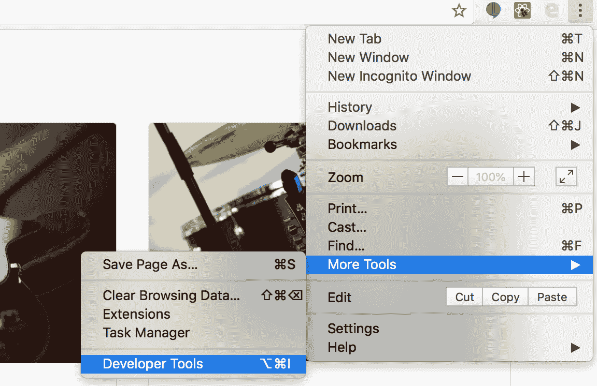

一旦你打开 Chrome 的开发者工具，你将在你的开发者工具面板中找到一个 React 选项卡：

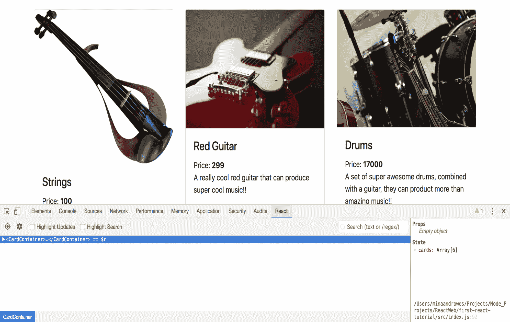

你将在该窗口中找到你的 React 组件。React 组件进入我们的产品页面是 `CardContainer`，如前一张截图所示。

对于通过开发工具暴露的每个组件，你可以深入了解子组件及其属性：

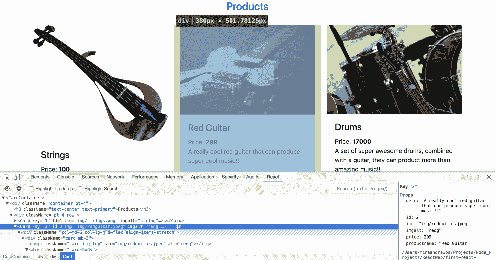

这将允许你进一步检查你的 React 应用程序并正确地排查问题，而不会带来太多复杂性。我建议你花点时间亲自尝试一下开发工具并探索它们能做什么。

# 摘要

在本章中，我们学习了如何设计和构建一个可工作的 React 应用程序。我们涵盖了使 React 运作的所有关键部分，例如 React 元素、组件、props 和状态。我们还了解了 JSX 以及它与 HTML 的相似之处。一旦你学会了 React，你会发现它是一个非常令人愉快的框架，可以用来构建网络产品。这也是为什么它在全球开发者中如此受欢迎的原因。

在下一章中，我们将利用在这里获得的知识来构建 GoMusic 网站的前端。

# 问题

1.  什么是 React？

1.  JSX 是什么？

1.  什么是 React 元素？

1.  什么是 props？

1.  什么是 React 状态？

1.  什么是 React 组件？

1.  在组件构造函数内部你应该做哪两件事？

1.  在 React 组件类中最重要的方法是什么？

1.  生命周期方法是什么意思？

1.  `key` 属性是什么，为什么它很重要？

# 进一步阅读

关于本章涵盖的内容的更多信息，你可以查看以下链接：

+   **React 网站**：[`reactjs.org/`](https://reactjs.org/)

+   **React 文档**：[`reactjs.org/docs/hello-world.html`](https://reactjs.org/docs/hello-world.html)

+   **React 教程**：[`reactjs.org/tutorial/tutorial.html`](https://reactjs.org/tutorial/tutorial.html)
