# 构建 GoMusic 的前端

现在是时候构建本书项目的第一个主要部分了。如第四章，*使用 React.js 的前端*所述，我们将构建一个在线乐器商店，我们将称之为 GoMusic。在本章中，我们将利用 React 框架的强大功能构建在线商店的大部分前端。我们的 GoMusic 商店将支持任何在线商店的基本功能：

+   用户应能够购买他们喜欢的任何产品。

+   用户应能够访问一个促销页面，该页面提供当前的销售和促销信息。

+   用户应能够创建自己的账户，并登录以获得更个性化的体验。

以下是本章我们将学习的我们前端的主要三个组件：

+   主页面，所有我们的网络应用程序的用户都应该看到

+   模态对话框窗口，有助于购买产品、创建账户和登录

+   用户页面，显示登录用户的个性化页面

在本章中，我们将涵盖以下主题：

+   编写非平凡的 React 应用程序

+   使用 Stripe 将信用卡服务集成到我们的前端中

+   在我们的代码中编写模态窗口

+   在我们的代码中设计路由

# 前置条件和技术要求

在第四章，*使用 React.js 的前端*，我们介绍了如何构建 React.js 应用程序的基础知识，所以在尝试跟随本章内容之前请先阅读它。

本章的要求与之前相同。以下是所需知识和工具的快速回顾：

+   npm.

+   React 框架。

+   你可以使用以下命令简单地安装 Create React App 工具：

```go
npm install -g create-react-app
```

+   Bootstrap 框架。

+   熟悉 ES6、HTML 和 CSS。在本章中，我们将使用 HTML 表单在多个组件中。

本章的代码和文件可以在 GitHub 上找到：[`github.com/PacktPublishing/Hands-On-Full-Stack-Development-with-Go/tree/master/Chapter05`](https://github.com/PacktPublishing/Hands-On-Full-Stack-Development-with-Go/tree/master/Chapter05).

# 构建 GoMusic

现在是时候构建我们的在线商店了。我们的第一步是使用 Create React App 工具创建一个新的 React 应用程序。打开你的终端，导航到你希望 GoMusic 应用程序存在的文件夹，然后运行以下命令：

```go
create-react-app gomusic
```

此命令将创建一个新的文件夹，命名为`gomusic`，其中将包含一个等待构建的 React 应用程序骨架。

现在通过以下命令导航到你的`gomusic`文件夹：

```go
cd gomusic
```

在内部，你可以找到三个文件夹：`node_modules`、`public`和`src`。在我们开始编写应用程序之前，我们需要从`src`文件夹中删除一些文件。

从`src`文件夹中删除以下文件：

+   `app.css`

+   `index.css`

+   `logo.svg`

接下来，我们需要进入`public`文件夹。为了简化事情，用我们项目 GitHub 页面上的内容替换您的`public`文件夹内容：[`github.com/PacktPublishing/Hands-On-Full-Stack-Development-with-Go/tree/master/Chapter05/public`](https://github.com/PacktPublishing/Hands-On-Full-Stack-Development-with-Go/tree/master/Chapter05/public)。

GitHub 页面包含的内容包含我们将在项目中使用的图像，描述我们数据的 JSON 文件，以及包含对 jQuery 和 Bootstrap 框架支持的修改后的 HTML 文件。

在下一节中，我们将查看应用中的主要页面。

# 主要页面

我们 GoMusic 应用的主要页面是所有用户都应该看到的页面，无论他们是否登录了 GoMusic 账户。有三个主要页面：

+   产品页面，也就是我们的主页

+   促销页面

+   关于页面

第一页是产品页面。以下是它的样子：

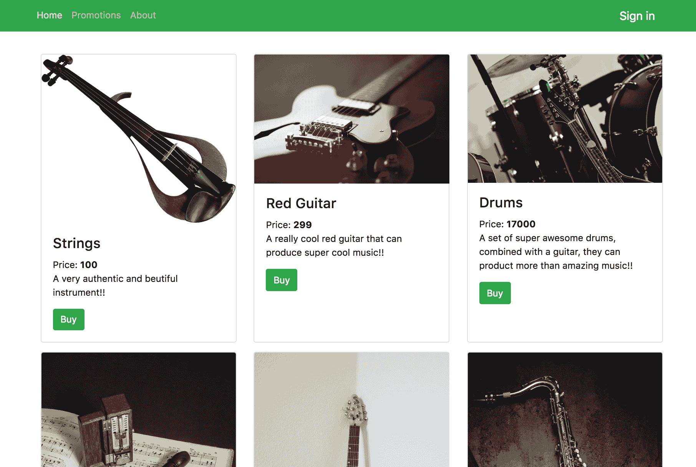

如前截图所示，我们将支持一个导航菜单，允许我们在三个主要页面之间导航。主页选项将托管产品页面，所有用户都应该看到。

第二页是我们的促销页面，它应该看起来与主页非常相似，除了它将展示更少的产品和更低的价格。这个页面中的价格应该以红色显示，以强调促销：

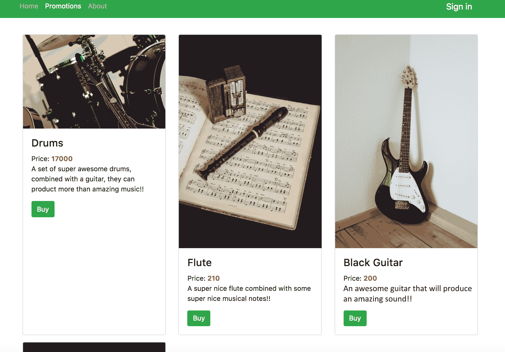

第三页是我们的关于页面，它应该只显示一些关于 GoMusic 商店的信息：

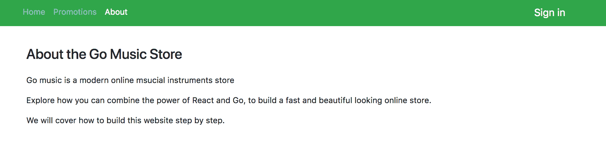

你可能也注意到了导航菜单最右边的登录选项；这个选项将打开一个模态对话框窗口，允许我们的用户创建账户并登录。我们将在“*模态对话框窗口和信用卡处理*”部分中介绍模态对话框窗口。对于我们的每个主要页面，我们将创建一个 React 组件来表示它。

在`src`文件夹中创建以下文件：

+   `Navigations.js`：这个文件将包含导航菜单组件的代码。

+   `ProductCards.js`：这个文件将包含主页和促销页面组件的代码。

+   `About.js`：这个文件将包含关于页面组件的代码。

现在，让我们从导航菜单组件开始。

# 导航菜单

我们需要构建的第一个组件是将所有主要页面连接在一起，这个组件将是导航菜单：

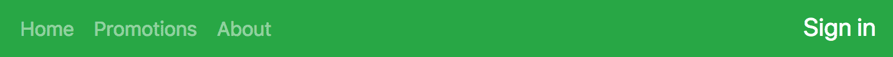

在 React 框架中，为了轻松构建一个功能齐全的导航菜单，我们需要利用一个名为`react-router-dom`的包的强大功能。要安装此包，打开您的终端，然后运行以下命令：

```go
npm install --save react-router-dom
```

一旦安装了此包，我们就可以在我们的代码中使用它。现在，让我们打开`Navigation.js`文件并开始编写一些代码。

我们需要做的第一件事是导入我们构建菜单所需的包。我们将利用两个包：

+   `react`包

+   `react-router-dom`包

我们需要从`react-router-dom`导出一个名为`NavLink`的类。`NavLink`类是一个 React 组件，我们可以在代码中使用它来创建可以导航到其他 React 组件的链接：

```go
import React from 'react';
import {NavLink} from 'react-router-dom';
```

接下来，我们需要创建一个新的 React 组件，名为`Navigation`。它的样子如下：

```go
export default class Navigation extends React.Component{
}
```

在我们的新组件内部，我们需要覆盖`render()`方法，正如第四章中提到的，*使用 React.js 的前端*，以便编写组件的视图：

```go
export default class Navigation extends React.Component{
    render(){
        //The code to describe how our menu would look like
    }
}
```

在我们的`render()`方法内部，我们将结合使用 Bootstrap 框架和导入的`NavLink`组件来构建我们的导航菜单。以下是`render()`方法内部的代码应该看起来像这样：

```go
export default class Navigation extends React.Component{
    render(){
        //The code to describe how our menu would look like
         return (
            <div>
                <nav className="navbar navbar-expand-lg navbar-dark bg-success fixed-top">
                    <div className="container">
                       <button type="button" className="navbar-brand order-1 btn btn-success"  onClick={() => { this.props.showModalWindow();}}>Sign in</button>
                        <div className="navbar-collapse" id="navbarNavAltMarkup">
                            <div className="navbar-nav">
                                <NavLink className="nav-item nav-link" to="/">Home</NavLink>
                                <NavLink className="nav-item nav-link" to="/promos">Promotions</NavLink>                             
                                <NavLink className="nav-item nav-link" to="/about">About</NavLink>
                            </div>
                        </div>
                    </div>
                </nav>
            </div>
        );
  }
}
```

代码使用 Bootstrap 框架来设置和构建导航栏。此外，当**登录**按钮被点击时，我们调用一个名为`showModalWindow()`的函数，该函数预期作为 React 属性传递给我们。这个函数的职责是显示登录模态窗口：

```go
<button type="button" className="navbar-brand order-1 btn btn-success" onClick={() => { this.props.showModalWindow();}}>Sign in</button>
```

完美：在上述代码之外，我们现在有一个可以用来显示导航菜单的功能组件。我们将在*用户页面导航菜单*部分探讨这个函数。

让我们在下一节中查看产品和促销页面。

# 产品和促销页面

现在让我们转向编写产品的页面组件。代码与我们在第四章中编写的产品页面类似，*使用 React.js 的前端*。让我们打开`ProductsCards.js`文件，然后编写以下代码：

```go
import React from 'react';

class Card extends React.Component {
    render() {
        const priceColor = (this.props.promo)? "text-danger" : "text-dark";
        const sellPrice = (this.props.promo)?this.props.promotion:this.props.price;
        return (
            <div className="col-md-6 col-lg-4 d-flex align-items-stretch">
                <div className="card mb-3">
                    
                    <div className="card-body">
                        <h4 className="card-title">{this.props.productname}</h4>
                        Price: <strong className={priceColor}>{sellprice}</strong>
                        <p className="card-text">{this.props.desc}</p>
                        <a className="btn btn-success text-white"  onClick={()=>{this.props.showBuyModal(this.props.ID,sellPrice)}}>Buy</a>
                    </div>
                </div>
            </div>
        );
    }
}
```

上述代码代表一个单独的产品卡片组件。它使用 Bootstrap 来设置我们的卡片样式。

代码几乎与我们在第四章中构建的产品卡片相同，*使用 React.js 的前端*，除了少数几个差异：

+   我们通过使用 Bootstrap 的`.btn-success`类将购买按钮的颜色更改为绿色。

+   我们添加了一个通过名为`priceColor`的变量来更改价格颜色的选项；该变量查看一个名为`promo`的属性。如果`promo`为真，我们将使用红色；如果`promo`属性为假，我们将使用黑色。

+   这里的购买按钮通过调用`showBuyModal()`函数打开一个模态窗口。我们将在*模态对话框窗口和信用卡处理*部分更详细地讨论模态窗口。

根据`promo`属性的值，代码将产生两种产品卡片风格。如果`promo`属性为假，产品卡片将看起来像这样：

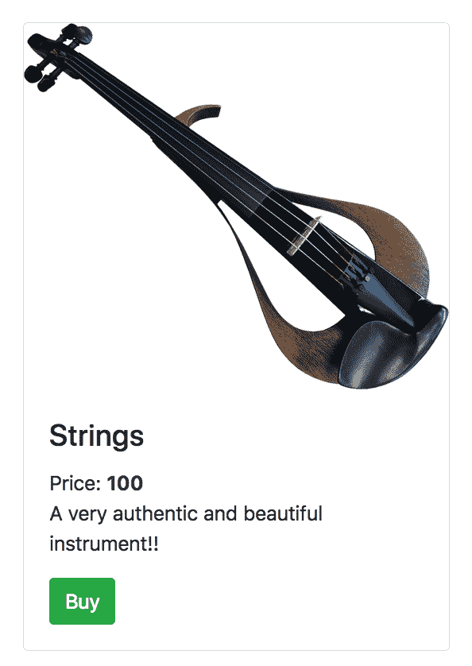

如果`promo`属性为真，产品卡片将看起来像这样：


接下来，我们需要在 `ProductsCards.js` 文件中编写的下一件事是 `CardContainer` 组件。这个组件将负责在一个页面上一起显示产品卡片。以下是我们的卡片容器在行动中的样子：

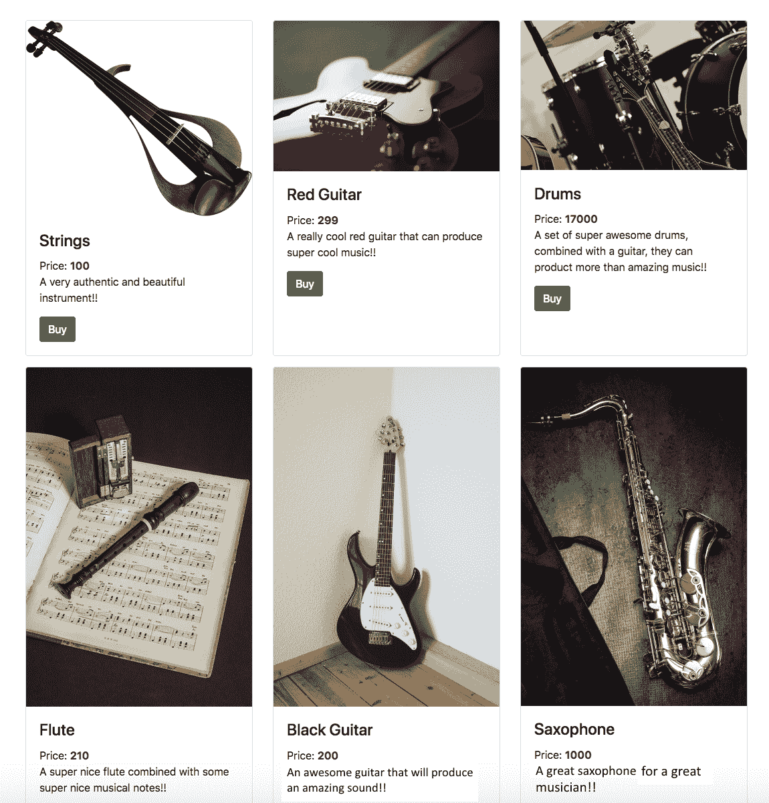

让我们创建这个组件：

```go
export default class CardContainer extends React.Component{
    //our code
}
```

该组件的外观应该与我们之前在 第四章，*使用 React.js 的前端* 中编写的组件非常相似。下一步是编写我们组件的构造函数。这个组件将依赖于一个存储卡片信息的 `state` 对象。以下是构造函数的示例：

```go
export default class CardContainer extends React.Component{
    constructor(props) {
        super(props);
        this.state = {
            cards: []
        };
    }
}
```

根据 第四章，*使用 React.js 的前端*，我们将卡片信息放在一个名为 `cards.json` 的文件中，该文件现在应该存在于我们的 `public` 文件夹中。该文件包含一个包含对象的 JSON 数组，其中每个对象包含有关一张卡片的数据，例如 ID、图片、描述、价格和产品名称。以下是文件中的示例数据：

```go
[{
    "id" : 1,
    "img" : "img/strings.png",
    "imgalt":"string",
    "desc":"A very authentic and beautiful instrument!!",
    "price" : 100.0,
    "productname" : "Strings"
}, {
    "id" : 2,
    "img" : "img/redguitar.jpeg",
    "imgalt":"redg",
    "desc":"A really cool red guitar that can produce super cool music!!",
    "price" : 299.0,
    "productname" : "Red Guitar"
},{
    "id" : 3,
    "img" : "img/drums.jpg",
    "imgalt":"drums",
    "desc":"A set of super awesome drums, combined with a guitar, they can product more than amazing music!!",
"price" : 17000.0,
    "productname" : "Drums"
}]
```

在 GoMusic 的 `public` 文件夹中，我们还添加了一个名为 `promos.json` 的文件，该文件包含有关销售和促销的数据。`promos.json` 中的数据与 `cards.json` 的数据格式相同。

现在，随着 `CardContainer` 构造函数的完成，我们需要重写 `componentDidMount()` 方法，以便编写从 `cards.json` 或 `promos.json` 获取卡片数据的代码。当显示主产品页面时，我们将从 `cards.json` 获取我们的产品卡片数据。而当我们显示促销和销售页面时，我们将从 `promos.json` 获取我们的产品卡片数据。由于卡片数据的来源不是唯一的，我们将使用一个 prop 来实现这个目的。让我们称这个 prop 为 `location`。以下是代码的示例：

```go
componentDidMount() {
 fetch(this.props.location)
 .then(res => res.json())
 .then((result) => {
 this.setState({
 cards: result
 });
 });
}
```

在前面的代码中，我们使用了流行的 `fetch()` 方法从存储在 `this.props.location` 中的地址检索数据。如果我们正在查看主产品页面，location 的值将是 `cards.json`。如果我们正在查看促销页面，location 的值将是 `promos.json`。一旦我们检索到卡片数据，我们就会将其存储在我们的 `CardContainer` 组件的 `state` 对象中。

最后，让我们编写 `CardContainer` 组件的 `render()` 方法。我们将从组件的 `state` 对象中获取产品卡片，然后将产品卡片的数据作为 props 传递给我们的 `Card` 组件。以下是代码的示例：

```go
render(){
        const cards = this.state.cards;
        let items = cards.map(
            card => <Card key={card.id} {...card} promo={this.props.promo} showBuyModal={this.props.showBuyModal}  />
        );
        return (
            <div>
                <div className="mt-5 row">
                    {items}
                </div>
            </div>
        );
}
```

我们还向卡片组件传递了 `showBuyModal` prop；这个 prop 代表我们在 *创建父 StripeProvider 组件* 部分中将要实现的函数，用于打开购买模态窗口。`showBuyModal` 函数将期望接收以卡片形式表示的产品 ID 以及产品的销售价格作为输入。

上述代码与我们在第四章，“使用 React.js 的前端”中编写的`CardContainer`代码非常相似。唯一的区别是我们现在还向`Card`组件传递了一个`promo`属性。`promo`属性让我们知道相关的产品卡片是否是促销。

让我们看一下下一节中的`About`页面。

# 关于页面

现在让我们添加一个关于页面。以下是它的样子：

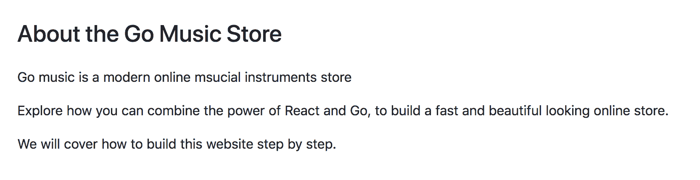

让我们在我们的项目中导航到`src`文件夹。创建一个名为`About.js`的新文件。我们将首先导入`react`包：

```go
import React from 'react';
```

接下来，我们需要编写一个 React 组件。通常，我们会创建一个新的类，该类将继承自`React.Component`。然而，我们将探索一种更适合关于页面的不同编码风格。

对于简单的组件，不需要完整类的情况下，我们简单地使用所谓的*功能组件*。以下是将`About`组件编写为功能组件时的样子：

```go
export default function About(props){
    return (
        <div className="row mt-5">
            <div className="col-12 order-lg-1">
                <h3 className="mb-4">About the Go Music Store</h3>
                <p>Go music is a modern online musical instruments store</p>
                <p>Explore how you can combine the power of React and Go, to build a fast and beautiful looking online store.</p>
                <p>We will cover how to build this website step by step.</p>
            </div>
        </div>);
}
```

功能组件只是一个接受 props 对象作为参数的函数。该函数返回一个 JSX 对象，代表我们希望组件显示的视图。前面的代码等同于编写一个继承自`React.Component`的类，然后重写`render()`方法以返回我们的视图。

在 React 的较新版本中，功能组件可以通过名为 React *Hooks*的功能支持`state`对象。React Hook 让你能够在功能组件中初始化和使用状态。以下是从 React 文档中摘取的一个简单的`state`计数器示例：

```go
 import React, { useState } from 'react';

function Example() {
  // Declare a new state variable, which we'll call "count"
  const [count, setCount] = useState(0);

  return (
    <div>
      <p>You clicked {count} times</p>
      <button onClick={() => setCount(count + 1)}>
        Click me
      </button>
    </div>
  );
}
```

我们在这里的代码中不使用 React Hooks。然而，如果你对这个功能感兴趣，你可以通过访问[`reactjs.org/docs/hooks-intro.html`](https://reactjs.org/docs/hooks-intro.html)来探索它。

在我们进入下一节之前，值得提一下，`Card`组件也可以被编写为一个功能组件，因为它相对简单，不需要构造函数或任何超出`render()`方法的特殊逻辑。

现在，让我们谈谈如何在我们的 React 应用程序中构建对话框窗口。

# 模态对话框和信用卡处理

现在是时候介绍我们网站中的模态窗口了。模态窗口是一个覆盖在您主网站上的小临时窗口。我们需要构建两个主要的模态窗口：

+   购买物品模态窗口

+   登录模态窗口

# 购买物品模态窗口概要

让我们从购买物品的模态窗口开始。当用户点击产品卡上的购买按钮时，这个模态窗口应该出现；换句话说，当你点击购买按钮时：

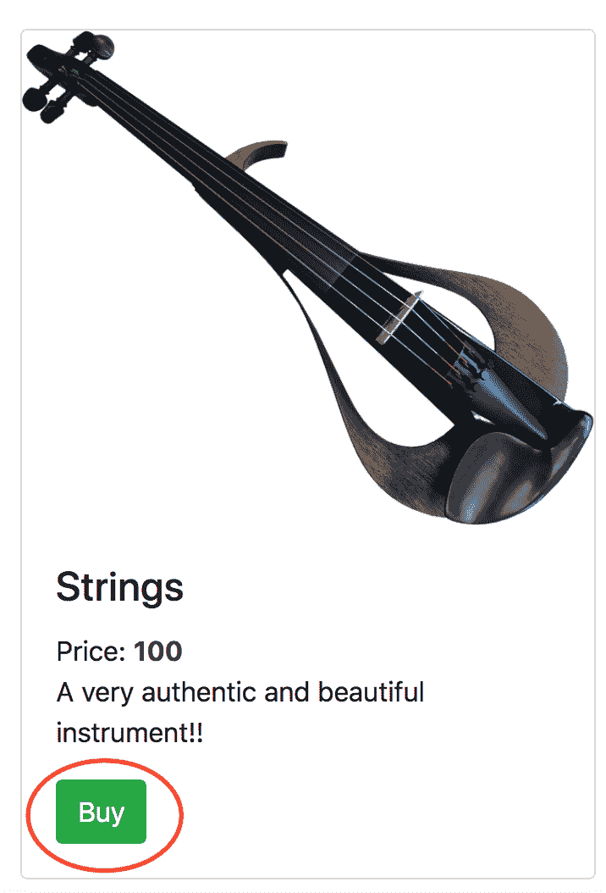

一旦点击购买按钮，以下模态窗口应该出现：

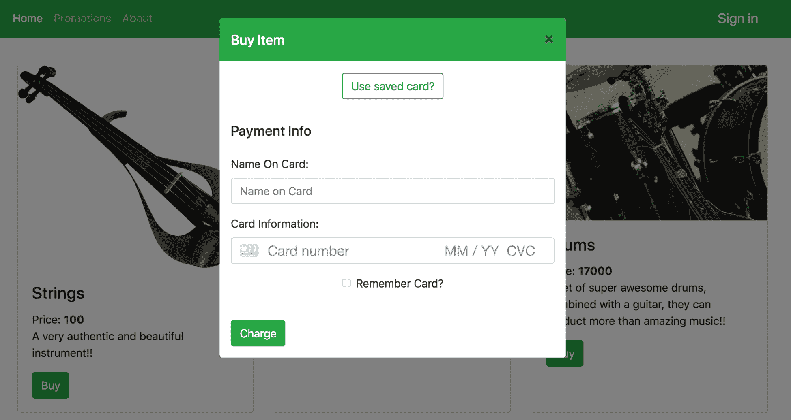

如您所见，模态窗口基本上是一个出现在我们主网站上的小窗口。它允许用户在返回主网站之前输入一些重要数据。模态窗口是任何现代网站中非常强大的工具，所以让我们开始编写一个。我们今天构建的模态窗口需要能够处理信用卡信息。

在我们开始编写代码之前，我们需要安装一个名为 `reactstrap` 的重要包。这个包通过 React 组件暴露了 Bootstrap 框架提供的功能；它有一个非常实用的 `Modal` 组件，我们可以用它来构建响应式的模态窗口。让我们从我们最喜欢的终端运行以下命令。该命令可以从项目的主文件夹中执行：

```go
npm install --save reactstrap 
```

第一步是进入 `src` 文件夹，然后创建一个名为 `modalwindows.js` 的新文件。这个文件是我们将编写所有模态窗口的地方。接下来，让我们导入 React 库：

```go
import React from 'react';
```

然后，我们从 `reactstrap` 包中导入与模态相关的组件：

```go
import { Modal, ModalHeader, ModalBody } from 'reactstrap';
```

由于我们是从“购买项目”模态窗口开始的，让我们编写一个名为 `BuyModalWindow` 的 React 组件：

```go
export class BuyModalWindow extends React.Component{
}
```

我们在这里使用 `export` 关键字，因为这个类需要导出到其他文件。再次，我们将利用 Bootstrap 前端框架的力量来构建我们的模态窗口。当我们编写我们的 `Card` 组件时，我们设计了“购买”按钮，使其通过 `#buy` ID 打开一个模态窗口。所以，这就是我们的 `#buy` 模态窗口：

```go
export class BuyModalWindow extends React.Component{
    render() {
        return (
         <Modal id="buy" tabIndex="-1" role="dialog" isOpen={props.showModal} toggle={props.toggle}>
            <div role="document">
                <ModalHeader toggle={props.toggle} className="bg-success text-white">
                    Buy Item
                </ModalHeader>
                <ModalBody>
                      {/*Credit card form*/}
                </ModalBody>
            </div>
        </Modal>
        );
    }
}
```

在前面的代码中，我们构建了一个封装了绿色标题、关闭按钮和空体的漂亮模态窗口的 React 组件。`信用卡表单` 代码尚未包含；我们将在 `*使用 React 和 Stripe 处理信用卡*` 部分中介绍。该代码使用了由 `reactstrap` 包提供的 `Modal` 组件。`reactstrap` 包还提供了一个 `ModalHeader` 组件，让我们指定模态窗口的标题外观，以及一个 `ModalBody` 组件来定义模态窗口的内容。

`Modal` 组件包含两个我们需要处理的非常重要的 React 属性：

+   **`isOpen` 属性**：一个布尔值，当需要模态窗口显示时需要设置为 true，否则值为 false

+   **`toggle` 属性**：一个回调函数，当需要时用于切换 `isOpen` 的值

让我们先对我们的代码进行快速调整。由于 `BuyModalWindow` 组件除了 `render()` 方法外不包含任何其他方法，我们可以将其编写为一个函数式组件：

```go
export function BuyModalWindow(props){
  return (
         <Modal id="buy" tabIndex="-1" role="dialog" isOpen={props.showModal} toggle={props.toggle}>
            <div role="document">
                <ModalHeader toggle={props.toggle} className="bg-success text-white">
                    Buy Item
                </ModalHeader>
                <ModalBody>
                      {/*Credit card form*/}
                </ModalBody>
            </div>
         </Modal>
        );
}
```

太好了，现在让我们填充模态窗口的空体。我们需要编写一个 `信用卡表单` 作为模态窗口的体。

在下一节中，我们将查看我们应用程序的信用卡处理。

# 使用 React 和 Stripe 处理信用卡

建立一个仅接受信用卡信息的表单的想法可能一开始看起来很简单。然而，这个过程不仅仅涉及构建一些文本框。在生产环境中，我们需要能够验证输入到信用卡的信息，并需要找出一种安全的方式来处理信用卡数据。由于信用卡信息极其敏感，我们不能像对待其他任何数据一样处理它。

幸运的是，有几种服务可供您在前端代码中处理信用卡。在本章中，我们将使用 Stripe ([`stripe.com/`](https://stripe.com/))，这是处理信用卡支付最受欢迎的服务之一。就像生产环境中的几乎所有其他网络服务一样，您需要访问其网站，创建一个账户，并获取用于产品代码的 API 密钥。使用 Stripe，注册还涉及提供您的企业银行账户，以便他们可以将钱存入您的账户。

然而，他们也提供了一些测试 API 密钥，我们可以利用这些密钥进行开发和初步测试，这正是我们今天将要使用的。

Stripe 帮助您在应用程序中处理信用卡收费的每个步骤。Stripe 验证信用卡，按照您提供的批准金额进行收费，然后将这笔钱存入您的企业银行账户。

为了完全集成 Stripe 或几乎任何其他支付服务与您的代码，您需要在前端和后端编写代码。在本章中，我们将介绍前端所需的大部分代码。我们将在稍后的章节中再次讨论此主题，当时我们将处理后端，以编写完整的集成。让我们开始吧。

由于 React 前端框架的巨大流行，Stripe 提供了特殊的 React 库和 API，我们可以使用它们来设计可以接受信用卡数据的视觉元素。这些视觉元素被称为 React Stripe 元素 ([`github.com/stripe/react-stripe-elements`](https://github.com/stripe/react-stripe-elements))。

React Stripe 元素提供以下功能：

+   他们提供了一些可以接受信用卡数据的 UI 元素，例如信用卡号码、到期日期、CVC 码和 ZIP 码。

+   他们可以对输入的数据进行高级验证。例如，对于信用卡字段，他们可以判断是否正在输入 MasterCard 或 Visa。

+   在 Stripe 元素接受它们提供的数据后，它们会为您提供代表相关信用卡的令牌 ID，然后您可以在后端输入此令牌 ID 以在您的应用程序中使用这张卡。

完美。既然我们已经对 Stripe 有足够的了解，让我们开始编写一些代码。

您必须在代码中涵盖一系列步骤，以正确地将信用卡处理与前端代码集成：

1.  创建一个 React 组件来承载您的 `Credit card form` 代码。让我们称它为 `child` React 组件；您很快就会看到为什么它是一个 `child` 组件。

1.  在该组件内部，使用 Stripe 元素，这些元素是 Stripe 提供的一些 React 组件，用于构建信用卡输入字段。这些字段只是接受信用卡信息的文本框，例如信用卡号码和到期日期。

1.  在这个 `child` 组件内部，编写代码以将验证过的信用卡令牌提交到后端。

1.  创建另一个 React 组件。这个组件将作为承载 Stripe 元素的 React 组件的父组件。父 React 组件需要执行以下操作：

    +   承载处理 Stripe API 密钥的 stripe 组件，也称为 `StripeProvider`。

    +   在 `StripeProvider` 组件内部，您需要承载 `child` React 组件。

    +   在您能够承载 `child` React 组件之前，您需要使用特殊的 Stripe 代码将其注入，该代码将 Stripe 属性和函数包裹在组件周围。将组件注入 Stripe 代码的方法称为 `injectStripe`。

让我们一步一步地实现前面的步骤。

# 创建一个承载 Stripe 元素的子 React 组件

首先，我们需要安装 Stripe react 包。在终端中，我们需要导航到我们的 `gomusic` 项目文件夹，然后运行以下命令：

```go
npm install --save react-stripe-elements
```

接下来，让我们访问位于 `frontend/public/index.html` 的 `index.html` 文件。然后，在 HTML 结束标签之前，也就是在 `</head>` 之前的一行，输入 `<script src="img/"></script>`。这将确保当最终用户在浏览器中加载我们的 GoMusic 应用程序时，Stripe 代码将被加载。

现在，让我们编写一些代码。在我们的 `src` 文件夹中，让我们创建一个名为 `CreditCards.js` 的新文件。我们首先导入我们需要的包，以便我们的代码能够正常工作：

```go
import React from 'react';
import { injectStripe, StripeProvider, Elements, CardElement } from 'react-stripe-elements';
```

是时候编写我们的 `child` React 组件了，它将承载我们的信用卡表单：

```go
class CreditCardForm extends React.Component{
    constructor(props){
        super(props);
    }
}
```

为了使我们的代码尽可能真实，我们需要遵循与处理信用卡相关的三种状态：

+   **初始状态**：尚未处理任何卡。

+   **成功状态**：卡已处理并成功。

+   **失败状态**：卡已处理但失败。

下面是表示这三种状态的代码：

```go
const INITIALSTATE = "INITIAL", SUCCESSSTATE = "COMPLETE", FAILEDSTATE = "FAILED";
class CreditCardForm extends React.Component{
    constructor(props){
        super(props);
    }
}
```

接下来，让我们编写三个方法来表示三种状态：

```go
const INITIALSTATE = "INITIAL", SUCCESSSTATE = "COMPLETE", FAILEDSTATE = "FAILED";
class CreditCardForm extends React.Component{
    constructor(props){
        super(props);
    }
    renderCreditCardInformation() {}
    renderSuccess() {}
    renderFailure(){}   
}
```

这三个方法将根据我们的当前状态被调用。我们需要在我们的 React `state` 对象中保存我们的当前状态，这样我们就可以在任何时候在组件内部检索它：

```go
const INITIALSTATE = "INITIAL", SUCCESSSTATE = "COMPLETE", FAILEDSTATE = "FAILED";
class CreditCardForm extends React.Component{
    constructor(props){
        super(props);
        this.state = {
            status: INITIALSTATE
        };
    }
    renderCreditCardInformation() {}
    renderSuccess() {}
    renderFailure(){}   
}
```

状态将根据信用卡交易的成功或失败而改变。现在是时候编写我们的 React 组件的 `render()` 方法了。我们的 `render()` 方法将简单地通过检查 `this.state.status` 来查看当前状态，然后根据状态，渲染相应的视图：

```go
const INITIALSTATE = "INITIAL", SUCCESSSTATE = "COMPLETE", FAILEDSTATE = "FAILED";
class CreditCardForm extends React.Component{
    constructor(props){
        super(props);
        this.state = {
            status: INITIALSTATE
        };
    }
    renderCreditCardInformation() {}
    renderSuccess() {}
    renderFailure(){}   

    render() {
        let body = null;
        switch (this.state.status) {
            case SUCCESSSTATE:
                body = this.renderSuccess();
                break;
            case FAILEDSTATE:
                body = this.renderFailure();
                break;
            default:
                body = this.renderCreditCardInformation();
        }

        return (
            <div>
                {body}
            </div>
        );
    }
}
```

剩下的就是编写三个渲染方法的代码了。让我们从最复杂的开始，即`renderCreditCardInformation()`方法。这里我们将使用 Stripe 元素组件。以下是该方法需要生成的视图：

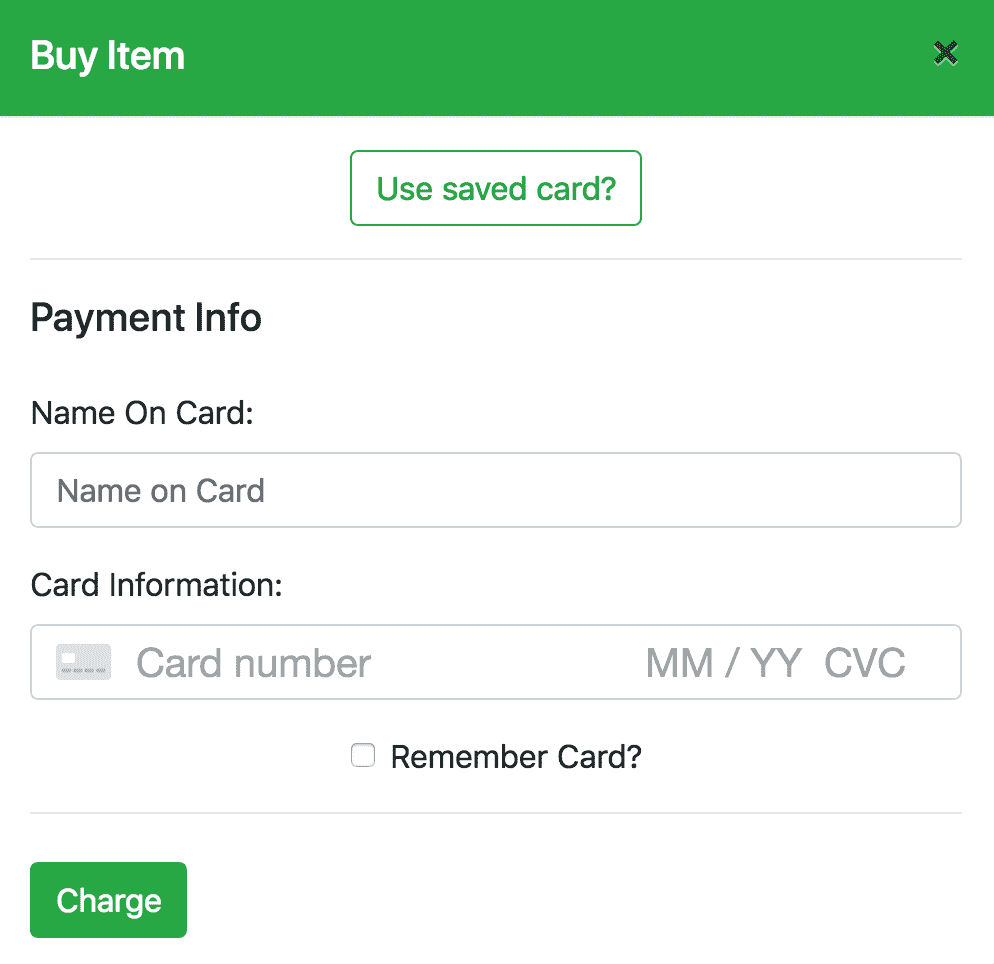

我们将首先编写代表**使用已保存卡**按钮的 JSX 元素，它在开始处，以及接近结尾处的**记住卡**复选框。我们将单独编写这些元素，因为稍后我们需要隐藏它们，不让未登录的用户看到：

```go
renderCreditCardInformation() {
        const usersavedcard = <div>
            <div className="form-row text-center">
                <button type="button" className="btn btn-outline-success text-center mx-auto">Use saved card?</button>
            </div>
            <hr />
        </div>

        const remembercardcheck = <div className="form-row form-check text-center">
            <input className="form-check-input" type="checkbox" value="" id="remembercardcheck" />
            <label className="form-check-label" htmlFor="remembercardcheck">
                Remember Card?
            </label>
        </div>;
        //return the view
    }
```

在前面的代码中，我们再次使用了 Bootstrap 框架来设计按钮和复选框。

# 利用 Stripe 元素处理信用卡信息

现在是时候设计信用卡支付信息的用户界面了。这是我们需要构建的部分：

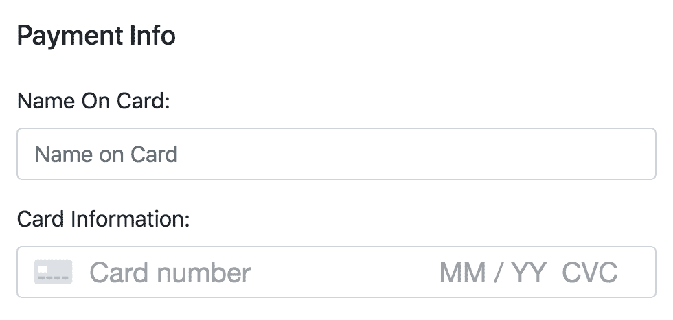

最有趣的部分是卡信息字段：

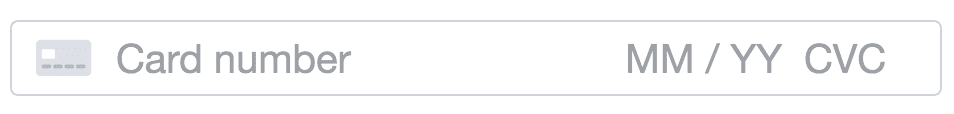

这是我们将使用 Stripe 元素组件的地方，以便将 Stripe 的 UI 和验证集成到我们的用户界面中。如果你还记得，我们在`CreditCards.js`文件的开始处导入了一个名为`CardElement`的包。`CardElement`只是一个由 Stripe 提供的 React 组件，用于在 React 应用程序中构建信用卡字段 UI。这是我们将在代码中使用的 Stripe 元素。我们可以像使用任何其他组件一样简单地利用它：

```go
<CardElement\>
```

Stripe 元素组件支持一个名为`style`的属性，它允许你定义元素的外观样式。`style`属性接受一个 JavaScript 对象，该对象定义了 Stripe 元素的外观样式。以下代码显示了一个看起来与 Bootstrap 框架视觉上相得益彰的`style`对象：

```go
const style = {
     base: {
         'fontSize': '20px',
         'color': '#495057',
         'fontFamily': 'apple-system,BlinkMacSystemFont,"Segoe UI",Roboto,"Helvetica Neue",Arial,sans-serif'
     }
 };
```

为了让我们的卡片 Stripe 元素接受前面的`style`对象，我们只需要这样做：

```go
<CardElement style={style}/>
```

完美。现在让我们构建`renderCreditCardInformation()`方法的其余部分。随着 Stripe 卡片元素的解决，我们需要构建一个 HTML 表单，该表单将托管 Stripe 卡片元素以及信用卡支付模态窗口中的“卡上姓名”字段。以下是 UI 的 JSX 代码：

```go
<div>

                <h5 className="mb-4">Payment Info</h5>
                <form>
                    <div className="form-row">
                        <div className="col-lg-12 form-group">
                            <label htmlFor="cc-name">Name On Card:</label>
                            <input id="cc-name" name='cc-name' className="form-control" placeholder='Name on Card' onChange={this.handleInputChange} type='text' />
                        </div>
                    </div>
                    <div className="form-row">
                        <div className="col-lg-12 form-group">
                            <label htmlFor="card">Card Information:</label>
                            <CardElement id="card" className="form-control" style={style} />
                        </div>
                    </div>

                </form>
</div>
```

前面的代码只显示了一个托管“卡上姓名”以及卡片元素视觉组件的 HTML 表单。我们还使用了一个名为`handleInputChange()`的方法，该方法在输入“卡上姓名”字段时触发。该方法根据 HTML 表单的新“卡上姓名”值更改我们组件的`state`对象。这是推荐的 React 处理表单的方式——创建状态以对应 HTML 表单的值：

```go
handleInputChange(event) {
     this.setState({
         value: event.target.value
     });
 }
```

是时候编写信用卡信息窗口的完整代码了，包括**记住卡**和**使用已保存卡**选项。下面是完整的`renderCreditCardInformation()`方法应该看起来像什么：

```go
renderCreditCardInformation(){
      const style = {
            base: {
                'fontSize': '20px',
                'color': '#495057',
                'fontFamily': 'apple-system,BlinkMacSystemFont,"Segoe UI",Roboto,"Helvetica Neue",Arial,sans-serif'
            }
        };
        const usersavedcard = <div>
            <div className="form-row text-center">
                <button type="button" className="btn btn-outline-success text-center mx-auto">Use saved card?</button>
            </div>
            <hr />
        </div>

        const remembercardcheck = <div className="form-row form-check text-center">
            <input className="form-check-input" type="checkbox" value="" id="remembercardcheck" />
            <label className="form-check-label" htmlFor="remembercardcheck">
                Remember Card?
            </label>
        </div>;
        return (
            <div>
                {usersavedcard}
                <h5 className="mb-4">Payment Info</h5>
                <form onSubmit={this.handleSubmit}>
                    <div className="form-row">
                        <div className="col-lg-12 form-group">
                            <label htmlFor="cc-name">Name On Card:</label>
                            <input id="cc-name" name='cc-name' className="form-control" placeholder='Name on Card' onChange={this.handleInputChange} type='text' />
                        </div>
                    </div>
                    <div className="form-row">
                        <div className="col-lg-12 form-group">
                            <label htmlFor="card">Card Information:</label>
                            <CardElement id="card" className="form-control" style={style} />
                        </div>
                    </div>
                    {remembercardcheck}
                    <hr className="mb-4" />
                    <button type="submit" className="btn btn-success btn-large" >{this.props.operation}</button>
                </form>
            </div>
        );  
}
```

上述代码使用了我们的`remembercardcheck`和`usersavedcard`元素。我们还假设存在一个名为`handleSubmit`的方法，该方法将在我们的 HTML 表单提交时触发。`handleSubmit`方法将在*提交信用卡令牌到后端*部分进行讨论。

完美。现在让我们编写`CreditCardForm`组件中剩余的方法：`renderSuccess()`和`renderFailure()`。我们首先从`renderSuccess()`开始：

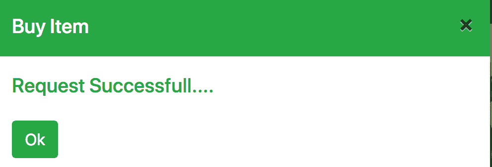

代码很简单：

```go
renderSuccess(){
        return (
            <div>
                <h5 className="mb-4 text-success">Request Successfull....</h5>
                <button type="submit" className="btn btn-success btn-large" onClick={() => { this.props.toggle() }}>Ok</button>
            </div>
        );
}
```

上述代码通过`toggle`方法与购买模态窗口相关联，该`toggle`方法将作为 prop 传递给我们的组件。如前所述，`toggle`方法可以用来打开或关闭模态窗口。由于当此代码执行时模态窗口将打开，因此当按下**确定**按钮时，模态窗口将关闭。`toggle`方法的完整语法将在我们代码的后续部分定义，具体来说，当我们在`App.js`文件中介绍主要代码时。

下面是如何查看`renderFailure()`方法的：

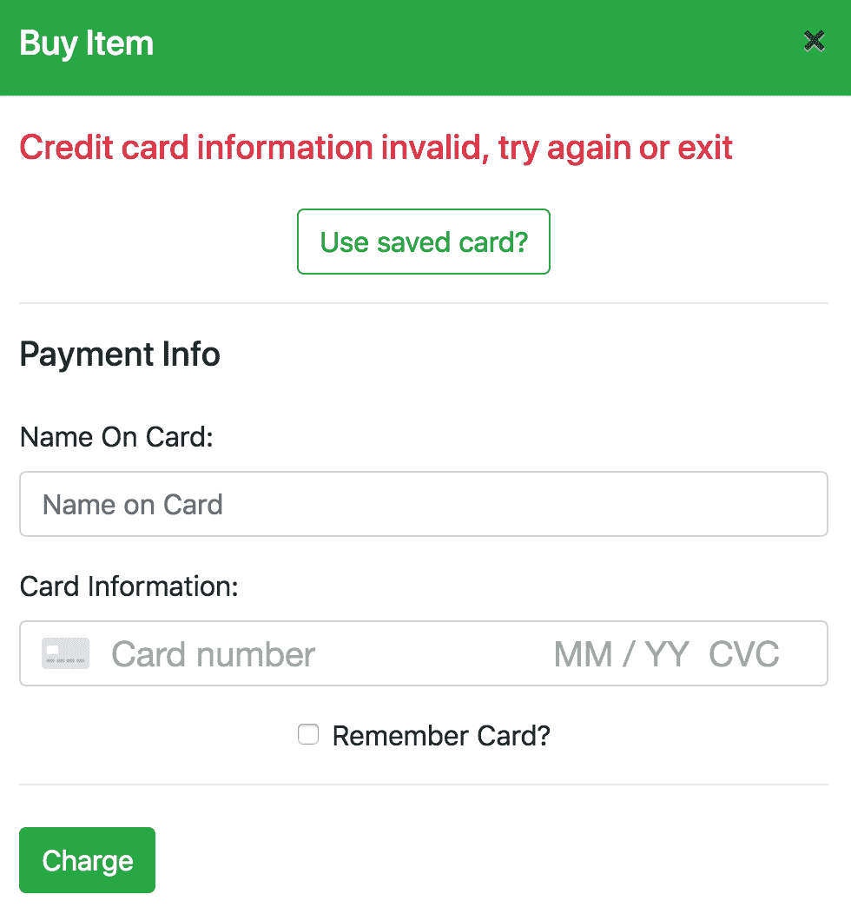

上述 UI 的代码如下所示：

```go
renderFailure(){
        return (
            <div>
                <h5 className="mb-4 text-danger"> Credit card information invalid, try again or exit</h5>
                {this.renderCreditCardInformation()}
            </div>
        );
}
```

# 将信用卡令牌提交到后端

现在让我们回到`handleSubmit()`方法，它应该在信用卡 HTML 表单提交时触发。当你使用 Stripe 元素组件时，它不仅验证信用卡信息，还返回一个代表输入的信用卡的`token`对象。这个`token`对象是你将在后端用来扣款的。

`handleSubmit()`方法代码需要处理许多事情：

1.  获取与输入的信用卡对应的令牌

1.  将令牌发送到我们的后端服务器

1.  根据结果渲染成功或失败状态

以下是代码的样式：

```go
async handleSubmit(event){
        event.preventDefault();
        console.log("Handle submit called, with name: " + this.state.value);
        //retrieve the token via Stripe's API
 let { token } = await this.props.stripe.createToken({ name: this.state.value });
        if (token == null) {
            console.log("invalid token");
            this.setState({ status: FAILEDSTATE });
            return;
        }

        let response = await fetch("/charge", {
            method: "POST",
            headers: { "Content-Type": "text/plain" },
            body: JSON.stringify({
                token: token.id,
                operation: this.props.operation,
            })
        });
        console.log(response.ok);
        if (response.ok) {
            console.log("Purchase Complete!");
            this.setState({ status: SUCCESSSTATE });
        }
}
```

如果你仔细查看前面的代码，你会注意到我们使用了名为`this.props.stripe.createToken()`的方法，我们假设它是嵌入在我们的 props 中的，以便检索信用卡令牌：

```go
let { token } = await this.props.stripe.createToken({ name: this.state.value });
```

该方法被命名为`createToken()`。我们传递了卡上姓名值作为参数（该值存储在我们的`state`对象中）。只有当我们用 Stripe 代码注入我们的 React 组件时，`createToken()`方法才可用。我们将在下一节中看到如何做到这一点。

我们还使用了 JavaScript 的`fetch()`方法，以便向相对 URL 发送 HTTP `POST`请求。`POST`请求将包括我们的 Stripe 令牌 ID 以及请求的操作类型。我们传递一个操作类型是因为我想将来使用这个请求要么从卡上取钱，要么保存卡以供以后使用。当涉及到后端代码时，我们将在适当的时候更多地讨论`POST`请求的另一端。

# 创建一个父 StripeProvider 组件

下一步是创建一个父组件来托管我们的`CreditCardForm`组件。以下是我们需要做的事情：

1.  使用 `injectStripe()` 方法将 Stripe API 代码注入到 `CreditCardForm` 组件中。

1.  将我们的 Stripe API 密钥提供给组件。这是通过 Stripe 提供的 `StripeProvider` React 组件完成的。

1.  使用 `Elements` 组件在我们的父组件中托管 `CreditCardForm` 组件。这是通过 `injectStripe()` 方法完成的。

当我们看到代码时，这会更有意义：

```go
export default function CreditCardInformation(props){
    if (!props.show) {
        return <div/>;
    }
   //inject our CreditCardForm component with stripe code in order to be able to make use of the createToken() method
    const CCFormWithStripe = injectStripe(CreditCardForm);
    return (
        <div>
            {/*stripe provider*/}
            <StripeProvider apiKey="pk_test_LwL4RUtinpP3PXzYirX2jNfR">
                <Elements>
                    {/*embed our credit card form*/}
                    <CCFormWithStripe operation={props.operation} />
                </Elements>
            </StripeProvider>
        </div>
    );
}
```

上述代码应存在于我们的 `CreditCards.js` 文件中，该文件还包含了我们的 `CreditCardForm` 组件代码。我们还传递了一个操作作为属性，后来我们用它提交了信用卡请求到我们的后端。注意 `export default` 出现在我们的 `CreditCardInformation` 组件定义的开始处。这是因为我们将在其他文件中导入和使用此组件。

现在我们已经遵循了所有步骤来编写一个可以与 Stripe 集成的信用卡表单，现在是时候回到我们的购买模式窗口，将其嵌入信用卡表单中。我们的购买模式窗口存在于 `modalwindows.js` 文件中。作为提醒，以下是之前我们覆盖的购买模式窗口的代码：

```go
export function BuyModalWindow(props) {
    return (
        <Modal id="buy" tabIndex="-1" role="dialog" isOpen={props.showModal} toggle={props.toggle}>
            <div role="document">
                    <ModalHeader toggle={props.toggle} className="bg-success text-white">
                        Buy Item
                    </ModalHeader>
                    <ModalBody>
                            {/*Credit card form*/}
                    </ModalBody>
                </div>

        </Modal>
    );
} 
```

首先，我们需要将 `CreditCardInformation` 组件导入到 `modalwindows.js` 文件中。因此，我们需要在文件中添加此行：

```go
import CreditCardInformation from './CreditCards';
```

我们现在需要做的就是将 `CreditCardInformation` 组件嵌入到模式体中：

```go
export function BuyModalWindow(props) {
    return (
        <Modal id="buy" tabIndex="-1" role="dialog" isOpen={props.showModal} toggle={props.toggle}>
            <div role="document">
                    <ModalHeader toggle={props.toggle} className="bg-success text-white">
                        Buy Item
                    </ModalHeader>
                    <ModalBody>
 <CreditCardInformation show={true} operation="Charge" toggle={props.toggle} />
                    </ModalBody>
                </div>

        </Modal>
    );
} 

```

有了这些，我们就完成了购买模式窗口。现在让我们转到登录窗口。

# 登录和注册模式窗口

在我们跳入代码之前，让我们首先探索登录和注册模式窗口应该如何看起来。点击导航栏中的登录按钮：

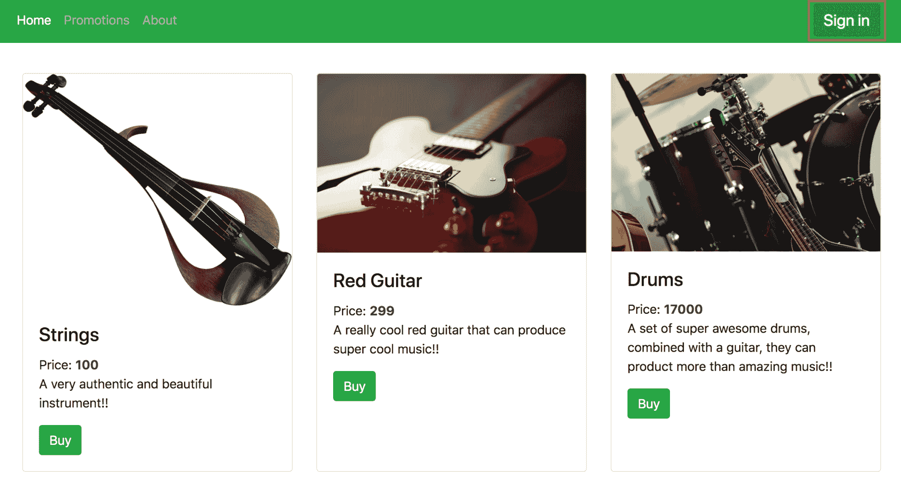

应该出现以下模式窗口：

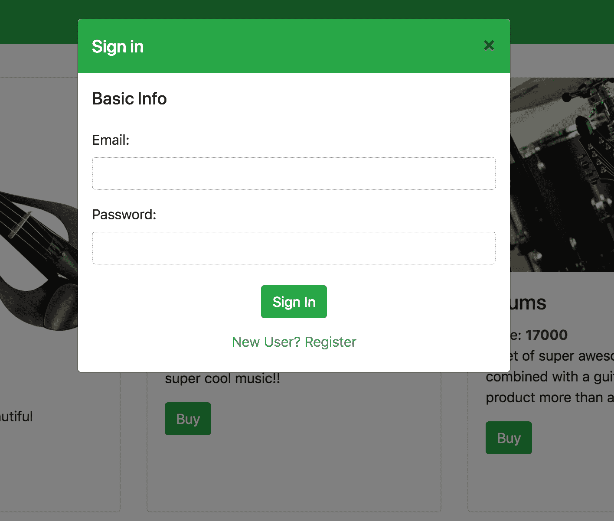

如果我们点击 **新用户？注册** 链接，模式窗口应该展开以显示新用户的注册表单：

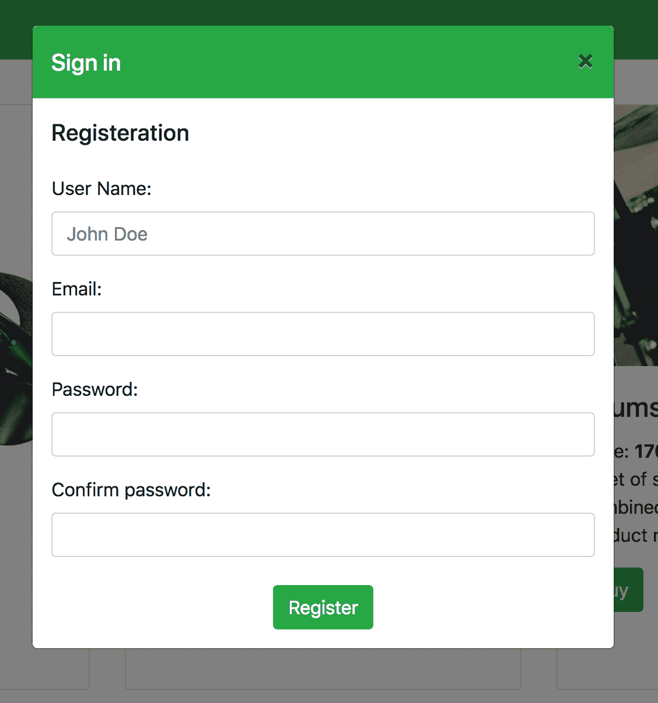

为了正确构建那些模式窗口，我们需要了解如何在 React 框架中正确处理具有多个输入的表单。

# 在 React 框架中处理表单

由于 React 框架依赖于控制你的前端状态，因此表单代表了这一愿景的挑战。这是因为，在 HTML 表单中，每个输入字段根据用户输入处理自己的状态。假设我们有一个文本框，用户对其进行了更改；文本框将根据用户输入更改其状态。然而，在 React 中，更倾向于使用 `setState()` 方法在 `state` 对象中处理任何状态变化。在 React 中处理表单有多种方法。

我们将使用各种处理 HTML 表单的方法。React 鼓励所谓的 *受控组件* 方法，这仅仅意味着你以这种方式设计你的组件，即你的 `state` 对象成为唯一的真相来源。

但如何实现呢？答案是简单的：

1.  您在组件内部监控您的 HTML 表单输入字段。

1.  每当表单输入字段更改时，您将更改您的`state`对象以保存表单输入字段的新值。

1.  您的`state`对象现在将保存您表单输入的最新值。

# 登录页面

让我们从登录页面开始。作为提醒，它看起来是这样的：

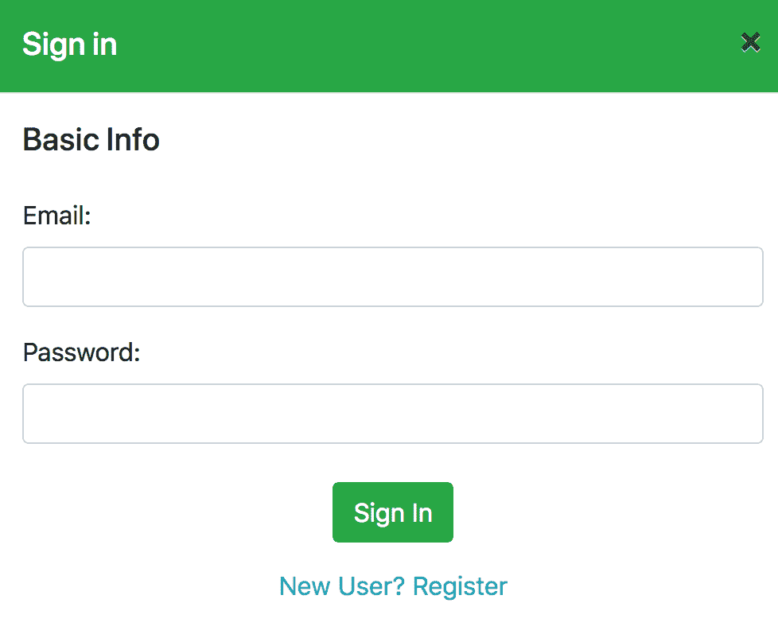

这基本上是一个包含两个文本输入字段、一个按钮、一个链接和一些标签的表单。第一步是创建一个 React 组件来托管登录表单。在`modalwindows.js`文件中，让我们创建一个新的组件，命名为`SignInForm`：

```go
class SignInForm extends React.Component{
    constructor(){
       super(props);
    }
}
```

接下来，我们需要在我们的组件中创建一个`state`对象：

```go
class SignInForm extends React.Component{
    constructor(){
       super(props);
       this.state = {
            errormessage = ''
        };
    }
}
```

我们当前的`state`对象包含一个名为`errormessage`的单个字段。每当登录过程失败时，我们将错误信息填充到`errormessage`字段中。

之后，我们需要绑定两个方法：一个用于处理表单提交，另一个用于处理表单输入更改：

```go
class SignInForm extends React.Component{
    constructor(){
       super(props);
       //this method will get called whenever a user input data into our form
       this.handleChange = this.handleChange.bind(this);
       //this method will get called whenever the HTML form gets submitted
       this.handleSubmit = this.handleSubmit.bind(this);
       this.state = {
            errormessage = ''
        };
    }
}
```

现在是时候编写我们的`render()`方法了。`render()`方法需要执行以下任务：

+   以表单形式显示标志，收集用户输入，然后提交表单

+   如果登录失败，显示错误消息，然后允许用户再次登录

以下是代码的样式：

```go
render(){
        //error message
        let message = null;
        //if the state contains an error message, show an error
        if (this.state.errormessage.length !== 0) {
            message = <h5 className="mb-4 text-danger">{this.state.errormessage}</h5>;
        }

        return (
            <div>
                {message}
                <form onSubmit={this.handleSubmit}>
                    <h5 className="mb-4">Basic Info</h5>
                    <div className="form-group">
                        <label htmlFor="email">Email:</label>
                        <input name="email" type="email" className="form-control" id="email" onChange={this.handleChange}/>
                    </div>
                    <div className="form-group">
                        <label htmlFor="pass">Password:</label>
                        <input name="password" type="password" className="form-control" id="pass" onChange={this.handleChange} />
                    </div>
                    <div className="form-row text-center">
                        <div className="col-12 mt-2">
                            <button type="submit" className="btn btn-success btn-large">Sign In</button>
                        </div>
                        <div className="col-12 mt-2">
                            <button type="submit" className="btn btn-link text-info" onClick={() => this.props.handleNewUser()}> New User? Register</button>
                        </div>
                    </div>
                </form>
            </div>
        );
    }
}
```

从前面的代码中，我们需要讨论一些重要点：

+   对于每个输入元素，都有一个名为`name`的属性。这个属性用于标识每个输入元素。这很重要，因为当我们设置我们的`state`对象以反映每个输入的值时，我们需要识别输入名称。

+   对于每个输入元素，还有一个名为`onChange`的属性。这个属性是我们如何调用我们的`handleChange()`方法，每当用户在我们的 HTML 表单中输入数据时。

+   在我们的表单末尾，如果用户决定点击“新用户？注册”链接，我们将调用一个名为`handleNewUser()`的方法，该方法通过组件属性传递给我们。我们将在下一节中介绍此方法。

让我们谈谈`handleChange()`方法，它将使用户输入到 HTML 登录表单中的数据填充我们的`state`对象。为此，我们将使用一个现代 JavaScript 特性，称为*计算属性名称*。以下是代码的样式：

```go
handleChange(event){
   const name = event.target.name;
   const value = event.target.value;
   this.setState({
         [name]: value
   });
}
```

在前面的代码中，我们使用了事件目标的`name`属性，这对应于我们在 HTML 表单中分配的名称属性。在用户输入用户名和密码后，我们的`state`对象最终将看起来像这样：

```go
state = {
    'email': 'joe@email.com',
    'password': 'pass'
}
```

我们`SignInForm`的最后一部分将是`handleSubmit()`方法。我们将在第六章中详细介绍此方法，即使用 Gin 框架的 Go 语言中的 RESTful Web APIs。因此，现在这里是一个`handleSubmit()`方法的占位符：

```go
handleSubmit(event){
    event.preventDefault();
    console.log(JSON.stringify(this.state));
}
```

# 注册表单

我们需要讨论的下一个表单是注册表单。作为提醒，它看起来是这样的：

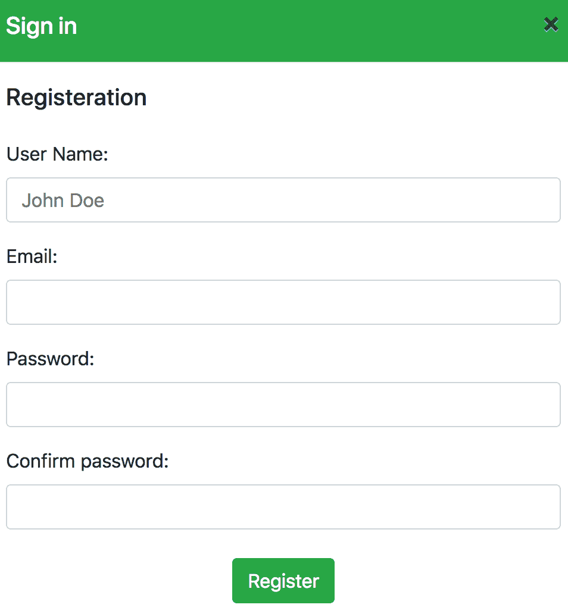

此表单将与登录表单位于同一文件中，即`modalwindows.js`。注册表单的代码将与我们刚才覆盖的登录表单的代码非常相似。区别在于注册表单比登录表单有更多字段，否则代码非常相似。以下是注册表单的代码：

```go
class Registeration extends React.Component{
    constructor(props) {
        super(props);
        this.handleSubmit = this.handleSubmit.bind(this);
        this.state = {
            errormessage: ''
        };
        this.handleChange = this.handleChange.bind(this);
        this.handleSubmit = this.handleSubmit.bind(this);
    }

    handleChange(event) {
        event.preventDefault();
        const name = event.target.name;
        const value = event.target.value;
        this.setState({
            [name]: value
        });
    }

    handleSubmit(event) {
        event.preventDefault();
        console.log(this.state);
    }

    render() {
        let message = null;
        if (this.state.errormessage.length !== 0) {
            message = <h5 className="mb-4 text-danger">{this.state.errormessage}</h5>;

        }
        return (
            <div>
                {message}
                <form onSubmit={this.handleSubmit}>
                    <h5 className="mb-4">Registeration</h5>
                    <div className="form-group">
                        <label htmlFor="username">User Name:</label>
                        <input id="username" name='username' className="form-control" placeholder='John Doe' type='text' onChange={this.handleChange} />
                    </div>

                    <div className="form-group">
                        <label htmlFor="email">Email:</label>
                        <input type="email" name='email' className="form-control" id="email" onChange={this.handleChange} />
                    </div>
                    <div className="form-group">
                        <label htmlFor="pass">Password:</label>
                        <input type="password" name='pass1' className="form-control" id="pass1" onChange={this.handleChange} />
                    </div>
                    <div className="form-group">
                        <label htmlFor="pass">Confirm password:</label>
                        <input type="password" name='pass2' className="form-control" id="pass2" onChange={this.handleChange} />
                    </div>
                    <div className="form-row text-center">
                        <div className="col-12 mt-2">
                            <button type="submit" className="btn btn-success btn-large">Register</button>
                        </div>
                    </div>
                </form>
            </div>
        );
    }
}
```

完美！这样一来，我们已经完成了登录表单和注册表单。我们只需要编写包含模态窗口代码，该代码将托管登录表单或注册表单。模态窗口需要完成以下任务：

+   显示登录表单

+   如果用户点击“新用户？注册”选项，则应显示注册表单

让我们在`modalwindows.js`文件中创建一个新的 React 组件，并命名为`SignInModalWindow`：

```go
export class SignInModalWindow extends React.Component{

}
```

为了正确设计这个组件，我们需要考虑这样一个事实，即这个组件有两种模式——具体来说，它应该为现有用户显示登录页面，还是为新用户显示新的注册页面。在 React 的世界里，我们需要利用我们的`state`对象，以跟踪我们是否显示登录页面或注册页面。初始状态是显示登录页面，然后如果用户点击“新用户？注册”链接，我们改变我们的状态到注册页面：

```go
export class SignInModalWindow extends React.Component{  
 constructor(props) {
     super(props);
     this.state = {
     showRegistrationForm: false
     };
     this.handleNewUser = this.handleNewUser.bind(this);
 }
```

在前面的代码中，除了初始化我们的`state`对象外，我们还绑定了一个名为`handleNewUser()`的方法。这个方法是我们当用户点击“新用户？注册”链接以加载注册表单而不是登录页面时调用的。这个方法应该改变我们`state`对象的值，以反映我们现在需要加载注册表单的事实：

```go
handleNewUser() {
     this.setState({
         showRegistrationForm: true
     });
 }
```

这听起来不错。然而，“新用户？注册”链接存在于`SignInForm` React 组件中，那么我们如何在`SignInForm`组件中调用`handleNewUser()`方法呢？

答案很简单：我们将方法作为属性传递给`SignInForm`，然后`SignInForm`在点击“新用户？注册”链接时调用该方法。如果你回顾几页之前的代码，你会发现我们确实在`SignInForm` React 组件中将“新用户？注册”链接链接到了一个名为`handleNewUser()`的函数属性上，该属性在点击链接时被调用。当时我们说我们会稍后介绍这个属性，现在我们就在这里。

现在剩下的`SignInModalWindow`组件部分是必需的`render()`方法，它将总结我们需要做什么。以下是`render()`方法需要执行的操作：

+   检查`state`对象。如果它显示我们需要显示注册表单，则加载`RegistrationForm`组件，否则保持`SignInForm`。

+   对于`SignInForm`，将`handleNewUser()`方法作为属性传递。这是 React 世界中的一个常见设计模式。

+   加载模态窗口代码。像往常一样，我们将利用强大的 Bootstrap 框架来美化我们的表单。

+   根据我们的 `state` 对象指示，在模态窗口中包含 `SignInForm` 或 `RegistrationForm`：

```go
render(){
        let modalBody = <SignInForm handleNewUser={this.handleNewUser} />
        if (this.state.showRegistrationForm === true) {
            modalBody = <RegisterationForm />
        }

     return (
            <Modal id="register" tabIndex="-1" role="dialog" isOpen={this.props.showModal} toggle={this.props.toggle}>
            <div role="document">
                <ModalHeader toggle={this.props.toggle} className="bg-success text-white">
                    Sign in
                    {/*<button className="close">
                        <span aria-hidden="true">&times;</span>
                     </button>*/}
                </ModalHeader>
                <ModalBody>
                    {modalBody}
                </ModalBody>
            </div>
        </Modal>
        );
    }
}
```

在下一节中，我们将查看我们应用程序中的用户页面。

# 用户页面

现在是时候讨论用户页面了——用户登录我们的应用程序后应该看到什么？以下是他们应该看到的内容：

+   他们的名字在导航菜单中，有一个登出选项

+   他们现有的订单列表

让我们看看它是如何呈现的。

导航菜单应更改为如下所示：

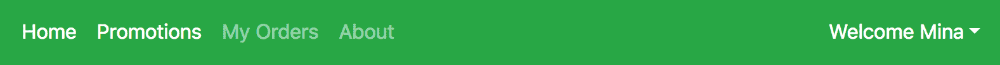

现在它允许导航到一个名为“我的订单”的页面，该页面将显示用户的先前订单。另一个不同之处在于，我们不再看到“登录”按钮，而是看到一个欢迎 <username> 下拉按钮。当你点击它时，以下选项应该出现：

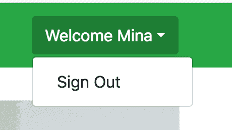

这是登出按钮，用户需要点击它来退出会话。

接下来，让我们看看“我的订单”页面：

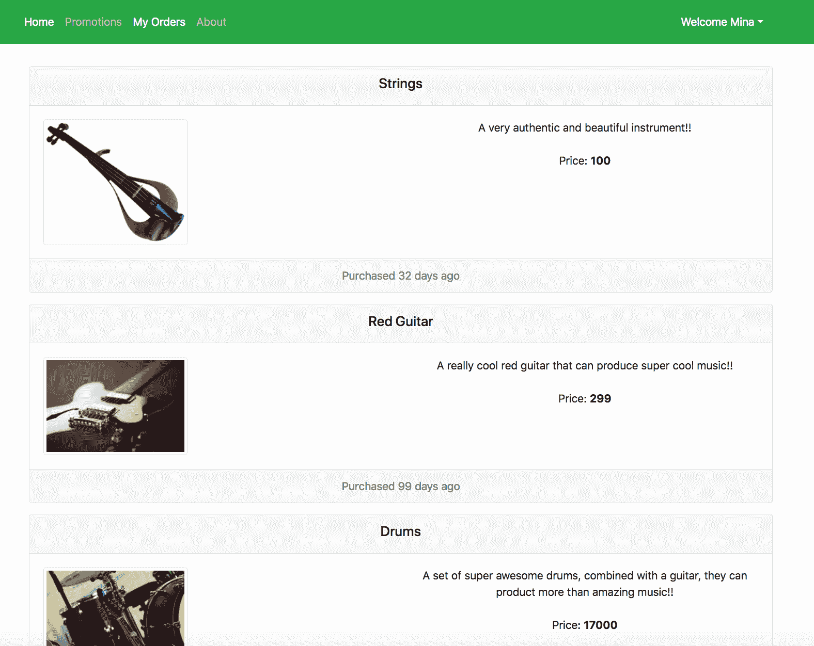

这是一个相对简单的页面，显示用户现有的订单列表。

现在，让我们为订单页面编写一些代码。

# 订单页面

让我们从编写代表“我的订单”页面的 React 组件开始。与“我的订单”页面相关的有两个组件：

+   单个订单卡片组件

+   一个父容器组件，它托管所有的订单卡片组件

让我们从单个订单卡片组件开始。这是它的样子：

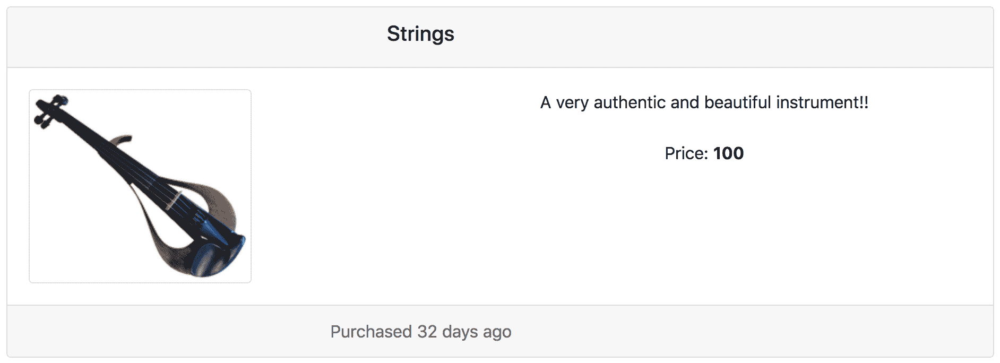

在 `src` 文件夹内创建一个名为 `orders.js` 的新文件。在那里，我们将编写我们的新组件。在文件的顶部，我们需要导入 React：

```go
import React from 'react';
```

对于单个订单卡片组件，我们可以简单地称之为 `Order`。这个组件将会很简单。因为它将被包含在一个父容器组件中，我们可以假设所有的订单信息都作为 props 传递。另外，由于我们不需要创建任何特殊的方法，让我们将其制作成一个函数式组件：

```go
function Order(props){
    return (
        <div className="col-12">
            <div className="card text-center">
                <div className="card-header"><h5>{props.productname}</h5></div>
                <div className="card-body">
                    <div className="row">
                        <div className="mx-auto col-6">
                            
                        </div>
                        <div className="col-6">
                            <p className="card-text">{props.desc}</p>
                            <div className="mt-4">
                                Price: <strong>{props.price}</strong>
                            </div>
                        </div>
                    </div>
                </div>
                <div className="card-footer text-muted">
                    Purchased {props.days} days ago
                </div>
            </div>
            <div className="mt-3" />
        </div>
    );   
}
```

如往常一样，Bootstrap 框架使得对我们的组件进行样式设计变得轻而易举。

现在让我们转向订单容器父组件。这个组件将会更复杂一些，因为我们需要在组件的 `state` 对象中存储我们的订单：

```go
export default class OrderContainer extends React.Component{
    constructor(props) {
        super(props);
        this.state = {
            orders: []
        };
    }
}
```

订单列表需要从我们应用程序的后端部分获取。正因为如此，`state` 对象应根据与我们的应用程序后端的交互而改变。现在我们先不考虑这部分，因为当我们在第六章“使用 Gin 框架的 Go 语言 RESTful Web APIs”设计应用程序的后端时，我们还需要涉及这部分。现在，让我们跳转到 `render()` 方法：

```go
render(){
        return (
            <div className="row mt-5">
                {this.state.orders.map(order => <Order key={order.id} {...order} />)}
            </div>
        );
}
```

前面的代码很简单。我们遍历我们的`state`对象中的订单，然后为每个订单对象加载一个`Order`组件。记住，当我们处理列表时，我们应该使用 React 框架的`key`属性来正确处理列表的变化，如第四章，*使用 React.js 的前端开发*中提到的。

如果你查看本章的 GitHub 代码，你会注意到我实际上是从一个静态文件中获取订单数据，以便更新`state`对象中的`orders`列表。这是临时的，因为我需要一些数据来展示视觉效果。

# 用户页面导航菜单

让我们回到位于我们的`src`文件夹中的`navigation.js`文件。我们在*导航菜单*部分已经写了一个`Navigation` React 组件，其中包含了如果用户未登录时的默认导航菜单。我们现在需要添加当用户登录时应显示的部分。第一步是编写一个新的方法，命名为`buildLoggedInMenu()`，它将显示欢迎 <用户> 下拉按钮，以及注销选项。

在`Navigation` React 组件内部，让我们添加一个新的方法：

```go
buildLoggedInMenu(){
        return (
            <div className="navbar-brand order-1 text-white my-auto">
                <div className="btn-group">
                    <button type="button" className="btn btn-success dropdown-toggle" data-toggle="dropdown" aria-haspopup="true" aria-expanded="false">
                        Welcome {this.props.user.name}
                    </button>
                    <div className="dropdown-menu">
                        <a className="btn dropdown-item" role="button">Sign Out</a>
                    </div>
                </div>
            </div>
        );
}
```

该方法使用 Bootstrap 和 JSX 来构建我们的下拉按钮和注销选项。我们假设用户名作为属性传递给我们。

现在，我们需要修改`render()`方法，以便在用户登录时更改导航菜单。我们假设一个属性被传递给我们，指定用户是否已登录。修改后的`render()`方法还需要一个新的导航链接指向我的订单页面：

```go
render(){
        return (
            <div>
                <nav className="navbar navbar-expand-lg navbar-dark bg-success fixed-top">
                    <div className="container">
                        {
                           this.props.user.loggedin ?
 this.buildLoggedInMenu()
 : <button type="button" className="navbar-brand order-1 btn btn-success" onClick={() => { this.props.showModalWindow();}}>Sign in</button>
                        }
                        <div className="navbar-collapse" id="navbarNavAltMarkup">
                            <div className="navbar-nav">
                                <NavLink className="nav-item nav-link" to="/">Home</NavLink>
                                <NavLink className="nav-item nav-link" to="/promos">Promotions</NavLink>
                                {this.props.user.loggedin ? <NavLink className="nav-item nav-link" to="/myorders">My Orders</NavLink> : null}
                                <NavLink className="nav-item nav-link" to="/about">About</NavLink>
                            </div>
                        </div>
                    </div>
                </nav>
            </div>
        );
    }
}
```

在前面的代码中，我们假设已经传给我们一个属性，告诉我们用户是否已登录（`this.props.user.loggedin`）。如果用户已登录，我们做两件事：

1.  调用`buildLoggedInMenu()`方法在导航菜单的末尾加载用户下拉按钮。

1.  添加一个指向`/myorders`路径的链接。这个链接将连接到`OrderContainer`组件。我们将在下一节中介绍如何将此链接连接到 React 组件。

# 将所有内容整合 – 路由

我们现在需要编写一个 React 组件，将所有前面的组件连接在一起。你可能认为我们已经编写了导航菜单——难道不应该将所有东西都链接起来吗？简单的答案是：还不行。在导航菜单组件中，我们使用了链接指向其他页面。然而，我们没有将这些链接连接到实际的 React 组件；`/about`链接需要连接到`About` React 组件，`/myorders`链接需要连接到`OrderContainer` React 组件，等等。

我们使用了一个名为`NavLink`的 React 组件来创建我们的链接。`NavLink`是从`react-router-dom`包中获得的，我们在*导航菜单*部分安装了它。`NavLink`组件是将链接连接到 React 组件的第一步，而第二步是另一种类型，称为`BrowserRouter`。让我们看看它是如何工作的。

创建一个名为`App.js`的新文件；它应该存在于我们的`src`文件夹中。这个文件将托管一个组件，它将作为所有其他组件的入口点。因此，我们需要在这里导入我们迄今为止创建的所有主要组件：

```go
import React from 'react';
import CardContainer from './ProductCards';
import Nav from './Navigation';
import { SignInModalWindow, BuyModalWindow } from './modalwindows';
import About from './About';
import Orders from './orders';
```

接下来，我们需要从`react-router-dom`包中导入一些组件：

```go
import { BrowserRouter as Router, Route } from "react-router-dom";
```

现在让我们编写我们的新组件：

```go
class App extends React.Component{

}
```

由于这个组件将能够访问所有其他组件，我们需要在这里存储全局信息。对于我们应用程序来说，最重要的信息之一是用户是否已登录，因为这会影响我们的应用程序页面的外观。因此，这个组件的`state`对象需要反映用户是否已登录：

```go
class App extends React.Component{
  constructor(props) {
    super(props);
    this.state = {
      user: {
        loggedin: false,
        name: ""
      }
    };
  }    
}
```

现在让我们不要担心这个状态是如何填充的，因为这将需要在编写应用程序的后端部分时解决。目前，让我们专注于如何将每个`NavLink`连接到 React 组件。

这涉及到三个步骤：

1.  添加一个`BrowserRouter`类型的组件。在我们的例子中，我们只是简单地将其命名为`Router`以简化。

1.  在`BrowserRouter`内部放置所有实例`NavLink`。在我们的例子中，所有的`NavLink`实例都在`Navigation`组件中；我们在这里将`Navigation`组件导入为`Nav`以简化。

1.  在`BrowserRouter`内部，使用我们从`react-router-dom`包中导入的`Route`组件将 URL 路径链接到 React 组件。每个 URL 路径将对应一个`NavLink`路径。

前面的步骤可以在我们的`render()`方法中实现。以下是代码的样式：

```go
render(){
    return (
      <div>
        <Router>
          <div>
            <Nav user={this.state.user} />
            <div className='container pt-4 mt-4'>
              <Route exact path="/" render={() => <CardContainer location='cards.json' />} />
 <Route path="/promos" render={() => <CardContainer location='promos.json' promo={true}/>} />
 {this.state.user.loggedin ? <Route path="/myorders" render={()=><Orders location='user.json'/>}/> : null}
 <Route path="/about" component={About} />
            </div>
            <SignInModalWindow />
            <BuyModalWindow />
          </div>
        </Router>
      </div>
    );
  }
}
```

前面的代码实现了我们之前提到的三个步骤。它还包括`SignInModalWindow`和`BuyModalWindow`。任一模态窗口只有在用户激活它们时才会显示。

我们使用了两种不同的方式将`NavLink`实例连接到 React 组件：

+   如果一个组件需要一个属性作为输入，我们使用`render`：

```go
<Route path="/promos" render={() => <CardContainer location='promos.json' promo={true}/>} />
```

+   如果一个组件不需要属性作为输入，我们可以使用`Route`组件：

```go
<Route path="/about" component={About} />
```

为了使路由概念同步，让我们看看`About`React 组件发生了什么：

+   在我们的导航菜单组件（`Navigation`在`Navigation.js`中），我们使用了从`react-router-dom`获得的`NavLink`类型来创建一个名为`/about:<NavLink className="nav-item nav-link" to="/about">About</NavLink>`的路径。

+   在我们的`App`组件中，我们将`/about`路径链接到`About`React 组件：

```go
<Router>

<div>
<Nav user={this.state.user} /> 
<div className='container pt-4 mt-4'>
{/*other routes*/}
<Route path="/about" component={About} />
</div>
{/*rest of the App component*/}
</div>
</Router>
```

现在，我们需要定义购买和登录模态窗口的`toggle`方法和`show`方法。`show`方法基本上是调用以显示购买或登录模态窗口的方法。最直接的方法是使用我们组件的`state`对象来指定模态窗口应该开启还是关闭。我们的应用程序设计为一次只能打开一个模态窗口，这就是为什么我们将从`App`组件控制它们的开启/关闭状态。

让我们先来探索购买和登录模态窗口的`show`方法：

```go
  showSignInModalWindow(){
    const state = this.state;
    const newState = Object.assign({},state,{showSignInModal:true});
    this.setState(newState);
  }

  showBuyModalWindow(id,price){
    const state = this.state;
    const newState = Object.assign({},state,{showBuyModal:true,productid:id,price:price});
    this.setState(newState);
  }
```

在这两种情况下，代码都会克隆我们的`state`对象，同时添加并设置一个布尔字段，表示目标模态窗口应该开启。在登录模态窗口的情况下，布尔字段将被称为`showSignInModal`，而在购买模态窗口的情况下，布尔字段将被称为`showBuyModal`。

现在，让我们看看登录和购买模态窗口的`toggle`方法。如前所述，`toggle`方法用于切换模态窗口的状态。在我们的案例中，我们只需要反转表示我们的模态窗口是否打开的`state`布尔字段：

```go
  toggleSignInModalWindow() {
    const state = this.state;
    const newState = Object.assign({},state,{showSignInModal:!state.showSignInModal});
    this.setState(newState);
  }

  toggleBuyModalWindow(){
    const state = this.state;
    const newState = Object.assign({},state,{showBuyModal:!state.showBuyModal});
    this.setState(newState); 
  }
```

我们`App`组件的构造函数需要绑定我们添加的新方法，以便在代码中使用：

```go
  constructor(props) {
    super(props);
    this.state = {
      user: {
        loggedin: false,
        name: ""
      }
    };
    this.showSignInModalWindow = this.showSignInModalWindow.bind(this);
    this.toggleSignInModalWindow = this.toggleSignInModalWindow.bind(this);
    this.showBuyModalWindow = this.showBuyModalWindow.bind(this);
    this.toggleBuyModalWindow = this.toggleBuyModalWindow.bind(this);
  }
```

接下来，我们需要将新方法作为 prop 对象传递给需要它们的组件。我们还需要传递`state.showSignInModal`和`state.showBuyModal`标志，因为这是我们的模态窗口组件知道模态窗口是否应该可见的方式：

```go
 render() {
    return (
      <div>
        <Router>
          <div>
            <Nav user={this.state.user} showModalWindow={this.showSignInModalWindow}/>
            <div className='container pt-4 mt-4'>
              <Route exact path="/" render={() => <CardContainer location='cards.json' showBuyModal={this.showBuyModalWindow} />} />
              <Route path="/promos" render={() => <CardContainer location='promos.json' promo={true} showBuyModal={this.showBuyModalWindow}/>} />
              {this.state.user.loggedin ? <Route path="/myorders" render={()=><Orders location='user.json'/>}/> : null}
              <Route path="/about" component={About} />
            </div>
            <SignInModalWindow showModal={this.state.showSignInModal} toggle={this.toggleSignInModalWindow}/>
            <BuyModalWindow showModal={this.state.showBuyModal} toggle={this.toggleBuyModalWindow}  productid={this.state.productid} price={this.state.price}/>
          </div>
        </Router>
      </div>
    );
  }
}
```

本章中还有两个代码片段需要介绍。

第一件事是使`App`组件可导出，因为该组件将成为我们其他组件的入口点。在`App.js`文件的末尾，让我们添加以下行：

```go
export default App;
```

我们需要编写的第二段代码是将`App`React 组件链接到我们的模板 HTML 代码的`root`元素。创建一个名为`index.js`的文件，在其中添加以下代码：

```go
import React from 'react';
import ReactDOM from 'react-dom';
import App from './App';
import registerServiceWorker from './registerServiceWorker';

ReactDOM.render(<App />, document.getElementById('root'));
registerServiceWorker();
```

这段代码使用了与 Create React App 工具一起加载的工具。

完美！随着最后一段代码的完成，我们的章节就结束了。

# 概述

本章深入探讨了如何使用 React 框架构建合适的前端应用程序。我们在构建应用程序的过程中涵盖了多个主题，例如路由、处理信用卡和表单以及典型的 React 框架设计方法。到这一点，你应该有足够的知识来在 React 框架中构建非平凡的应用程序。

在下一章中，我们将转换主题，重新回顾 Go。我们将开始介绍如何使用 Go 开源框架 Gin 构建我们的 GoMusic 应用程序的后端。

# 问题

1.  什么是`react-router-dom`？

1.  什么是`NavLink`？

1.  什么是 Stripe？

1.  我们如何在 React 中处理信用卡？

1.  什么是受控组件？

1.  什么是`BrowserRouter`？

1.  Stripe 元素是什么？

1.  `injectStripe()` 方法是什么？

1.  我们如何在 React 中处理路由？

# 进一步阅读

关于本章涵盖的主题的更多信息，请查看以下链接：

+   **React 路由包**: [`reacttraining.com/react-router/`](https://reacttraining.com/react-router/)

+   **Stripe**: [`stripe.com/`](https://stripe.com/)

+   **Stripe React 元素**: [`stripe.com/docs/recipes/elements-react`](https://stripe.com/docs/recipes/elements-react)

+   **在 React 中处理表单**: [`reactjs.org/docs/forms.html`](https://reactjs.org/docs/forms.html)
