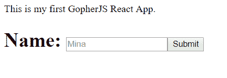
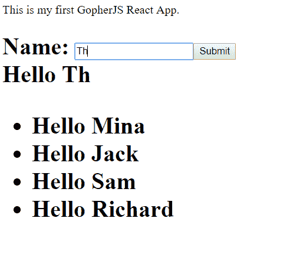
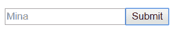
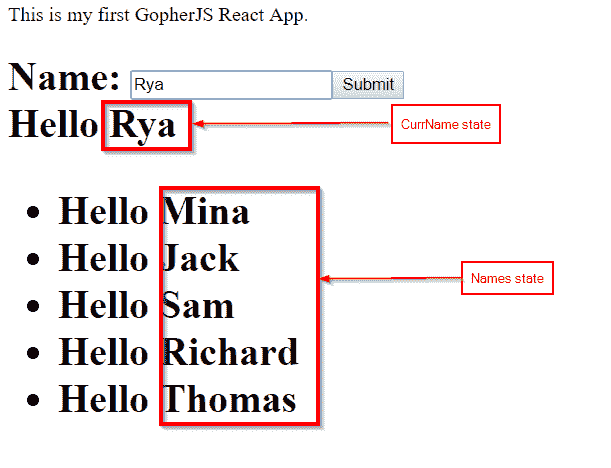
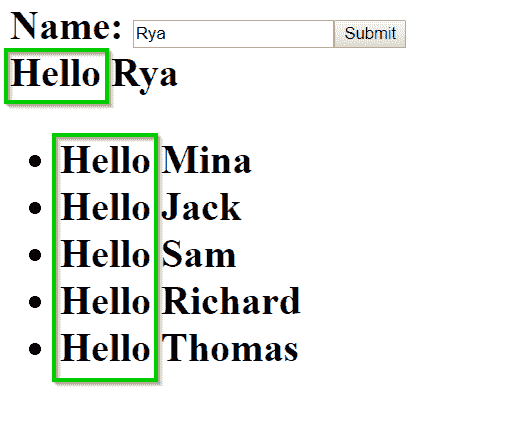
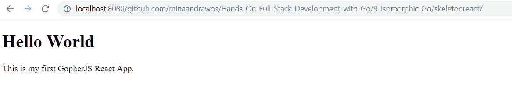
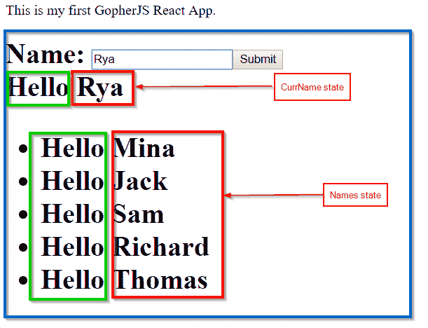

# 第九章：GopherJS 同构 Go 入门

到目前为止，我们已经介绍了如何使用 JavaScript 编写我们的前端。然而，如果你想在前端使用 Go，有一个选择。这个选择被称为 GopherJS，这是一个流行的 Go 包，结合了一套只有一个目的的命令：将 Go 代码编译成 JavaScript（也称为**转译**）。一旦 Go 代码被编译成 JavaScript，代码就可以在前端组件中像 JavaScript 一样使用。依赖于相同编程语言的前端和后端的应用程序称为**同构应用程序**。

就像任何其他软件开发方法一样，编写同构应用有其自身的优缺点。主要优点是使用你非常擅长的单一编程语言进行大部分代码编写所带来的便利性和开发速度。主要缺点是调试非平凡问题比较困难，因为你将不得不深入到生成的 JavaScript 代码中。

本章是同构 Web 开发的入门介绍。我们将介绍 GopherJS 的一些关键构建块，以及如何利用它编写可以与 Web 浏览器和 Node.js 模块交互的代码。我们还将介绍如何使用 GopherJS 编写一个简单的 React 应用程序，以及一些开源项目。

本章将涵盖以下主题：

+   GopherJS 基础

+   GopherJS 与 React

# 技术要求

要跟随本章内容，你需要以下工具：

+   安装了 Go 语言([`golang.org/doc/install`](https://golang.org/doc/install))

+   Node.js 和 npm ([`nodejs.org/en/`](https://nodejs.org/en/))

+   一个代码编辑器，例如 VS Code ([`code.visualstudio.com/`](https://code.visualstudio.com/))

本章假设读者熟悉 JavaScript、HTML、React 和 Go。

如果你还不熟悉 React，请参阅第三章*Go 并发*和第四章*使用 React.js 的前端*。

本章的代码可以在[`github.com/PacktPublishing/Hands-On-Full-Stack-Development-with-Go`](https://github.com/PacktPublishing/Hands-On-Full-Stack-Development-with-Go)找到。

# GopherJS 基础

GopherJS 是一套工具、数据类型和 Go 包，它允许你将 Go 代码编译成 JavaScript。将一种编程语言的代码编译成另一种语言也称为**转译**。GopherJS 对于不太擅长 JavaScript 的 Go 开发者非常有用，因为它允许你用 Go 编写可以与 JavaScript 模块集成的代码。这意味着你可以用 Go 编写增强应用程序前端的代码，或者可以与 Node.js 模块集成，提供 JavaScript 的灵活性与 Go 的强大功能。

GopherJS 是一个非常强大的软件，被广泛应用于众多应用中。然而，为了有效地利用 GopherJS，你需要了解其构建模块。第一步是使用`go get`命令检索包：

```go
go get -u github.com/gopherjs/gopherjs
```

此外，为了能够运行一些 GopherJS 命令，我们需要安装`source-map-support`节点模块：

```go
npm install --global source-map-support
```

这允许你在需要时从 Go 代码中调试你的代码。这在编写 GopherJS 中的非平凡应用时非常有用。

太好了，现在我们准备好更深入地探索这个包了。GopherJS 提供了一个游乐场，你可以在其中测试你的 GopherJS 代码[`gopherjs.github.io/playground/`](https://gopherjs.github.io/playground/)。

现在我们已经设置了 GopherJS，让我们来看看 GopherJS 的类型。

# GopherJS 类型

GopherJS 包含一个名为`js`的子包。此包提供了在 Go 和 JavaScript 之间桥接所需的功能。该包可以在[`godoc.org/github.com/gopherjs/gopherjs/js`](https://godoc.org/github.com/gopherjs/gopherjs/js)找到。

`js`包提供的关键功能是将 Go 类型转换为 JavaScript 类型，反之亦然。

当我们考虑数据类型时，需要支持两大类：基本类型（`int`、`float`和`string`）和构造类型（结构体和接口）。以下表格显示了 GopherJS 支持的基本类型和 JavaScript 类型之间的类型映射：

| **Go 类型** | **JavaScript 类型** |
| --- | --- |
| `bool` | `Boolean` |
| `int`和`float` | `Number` |
| `string` | `String` |
| `[]int8` | `Int8Array` |
| `[]int16` | `Int16Array` |
| `[]int32`, `[]int` | `Int32Array` |
| `[]uint8` | `Uint8Array` |
| `[]uint16` | `Uint16Array` |
| `[]uint32`, `[]uint` | `Uint32Array` |
| `[]float32` | `Float32Array` |
| `[]float64` | `Float64Array` |

例如，如果你使用 GopherJS 编译包含 Go `int`类型的代码片段，则`int`类型将变为 JavaScript 的`Number`类型。建议你坚持使用`int`类型，而不是`uint8`/`uint16`/`uint32`/`uint64`类型，以提高转换代码的性能。还建议使用`float64`而不是`float32`。

现在我们知道了不同的 GopherJS 类型，让我们继续到对象类型。

# 对象类型

基本类型很好；然而，它们只是任何真实代码片段的简单组件。那么 Go 的结构体、接口、方法、函数和 goroutine 呢？`js`包让你有能力将这些类型转换为 JavaScript。

`js`包提供的一个关键构建模块是`*js.Object`类型。这种类型只是一个本地 JavaScript 对象的容器。GopherJS 的大部分代码都涉及将 Go 对象转换为`*js.Object`或反之亦然。JavaScript 模块在我们的 Go 代码中作为`*js.Object`暴露。

现在，让我们在下一节中探讨如何从我们的 Go 代码中调用 JavaScript 函数。

# 从你的 Go 代码中调用 JavaScript 函数

通常，JavaScript 代码要么在 Node.js 上运行，要么在浏览器中运行。在 Node.js 上运行的任何代码都应该能够访问被称为*Node.js 全局对象*的内容（[`nodejs.org/api/globals.html`](https://nodejs.org/api/globals.html)）。如果你的代码最终在 Node.js 环境中运行，GopherJS 通过`js.Global`变量为你提供了访问全局对象的方式，该变量返回一个`*js.Object`，它承载着你的全局变量。然后你可以使用名为`Get`的方法访问特定的对象，然后使用名为`Call`的方法调用对象方法。让我们通过一个例子来更好地解释这一段落。

运行以下代码：

```go
package main

import (
  "github.com/gopherjs/gopherjs/js"
)

func main() {
  //the console variable is of type *js.Object
  console := js.Global.Get("console")
  /*
    the *js.Object support a method called Call which     can access the methods of console.
  */
  console.Call("log", "Hello world!!")
}
```

这将等同于编写一段类似以下样式的 Node.js JavaScript 代码：

```go
console.log("Hello World!!");
```

`js.Global`对象开启了非常有趣的可能性，因为它允许你访问 Node.js 模块并在你的 Go 代码中使用它们。例如，假设我们向我们的 node 项目中导入了一个名为`prettyjson`的 Node.js 模块，并且我们想在 Go 代码中使用它。`prettyjson`是一个真正的包，它有一个名为`render()`的方法，可以将对象转换为美观的 JSON。这在上面的代码中有所展示：

```go
package main

import (
  "fmt"

  "github.com/gopherjs/gopherjs/js"
)

func main() {
  //Some data type
  type MyType struct {
    Name string
    Projects []string
  }
  //A value from our data type
  value := MyType{Name: "mina", Projects: []string{"GopherJS", "ReactJS"}}
  /*
    Call the prettyjson module, this is equivalent to the following code in JavaScript:
        var prettyjson = require("prettyjson");
 */
  prettyjson := js.Global.Call("require", "prettyjson")

  // The line below is equivalent to 'prettyjson.render(value);' in JavaScript
  result := prettyjson.Call("render", value)
  /*
    Do something with result
    */
}
```

如前所述，JavaScript 代码也可以在浏览器上运行。浏览器可用的全局对象不同。例如，以下代码在浏览器上可以正常运行，但如果尝试在 Node.js 上运行，则不会高兴：

```go
package main

import (
  "github.com/gopherjs/gopherjs/js"
)

func main() {
  document := js.Global.Get("document")
  document.Call("write", "Hello world!!")
}
```

这是因为`"document"`是一个几乎在所有浏览器中都可用的全局对象。

在下一节中，我们将查看 GopherJS 命令。

# GopherJS 命令

我们现在拥有了足够的知识来开始探索 GopherJS 提供的命令，以便将 Go 代码编译成 JavaScript。对于你运行的任何 GopherJS 命令，确保`GOOS`标志设置为`darwin`或`linux`。如果你在 Windows 上运行，你需要从终端会话中运行以下命令：

```go
set GOOS=linux
```

接下来我们需要做的是——让我们首先准备一个环境。在安装了 GopherJS 和`source-map-support`模块之后，如之前在*GopherJS 基础知识*部分所述，在你的`GOPATH`中的 Go`src`文件夹内创建一个新的文件夹。让我们将这个新文件夹命名为`9-Isomorphic-GO`。在这个新文件夹内，创建另一个名为`node`的文件夹。这是我们编写预期与 node 包交互的代码的地方。

现在在`node`文件夹内创建一个名为`main.go`的文件。然后，将以下代码输入到文件中：

```go
package main

import (
  "github.com/gopherjs/gopherjs/js"
)

func main() {
  console := js.Global.Get("console")
  console.Call("log", "Hello world!!")
}
```

下一步是利用 GopherJS 的强大功能将前面的代码转换为 JavaScript。这可以通过使用`gopherjs build`命令简单地完成。所以，在控制台中，导航到`node`文件夹，然后输入以下内容：

```go
gopherjs build main.go
```

这将创建一个名为`main.js`的新文件，该文件将包含您的转换后的 JavaScript 代码。您会注意到`main.js`文件中有大量的 JavaScript 代码。这是因为 GopherJS 在生成的 JavaScript 文件中重新实现了 Go 运行时的关键部分，以便能够支持大量的 Go 应用程序和包。

就像任何其他 Node.js 文件一样，您只需在新的文件中输入以下命令来运行 JavaScript 代码：

```go
node main.js
```

GopherJS 还支持`install`命令。运行以下命令：

```go
gopherjs install
```

这样做将在您的`bin`文件夹中生成一个 JavaScript 文件。这类似于`go install`命令所做的工作，只不过在这种情况下结果是 JavaScript 文件，而不是可执行文件。

GopherJS 命令支持一个标志，允许我们输出压缩后的 JavaScript，这个标志是`-m`。压缩 JavaScript 涉及删除所有不必要的字符，例如空白、换行符和注释。

如果您想直接运行代码，并且已经安装了 Node.js 的`source-map-support`模块，您可以直接使用`gopherjs run`命令，它看起来是这样的：

```go
gopherjs run main.go
```

如果我们想尝试一些浏览器代码呢？

让我们回到我们创建的父文件夹，它被称为`9-Isomorphic-GO`。在该文件夹下，创建一个名为`browser`的新文件夹，然后在下面创建一个名为`main.go`的新文件。在`main.go`文件中，编写以下代码：

```go
package main

import (
  "github.com/gopherjs/gopherjs/js"
)

func main() {
  document := js.Global.Get("document")
  document.Call("write", "Hello world!!")
}
```

上述代码显然预期在浏览器上运行，因为它使用了`document`对象。我们仍然可以使用`gopherjs build`命令在这里将其转换为 JavaScript。然而，我们还有另一个选择。

在`browser`文件夹中运行以下命令：

```go
gopherjs serve
```

将启动一个网络服务器，默认情况下，它将在`localhost:8080`地址上提供服务。您对`main.go`文件所做的任何更改都将反映在提供的网页上；然而，您可能需要刷新网页才能看到更改。

如果您的 Go 代码位于运行`gopherjs serve`命令的子文件夹中，您的页面将在`localhost:8080/your/sub/folder`上提供服务，其中`your/sub/folder`指的是`main.go`文件的文件夹路径。例如，如果您的代码位于`/test/main.go`，您的页面将在`localhost:8080/test`上提供服务。

现在，让我们探索 GopherJS 为我们提供的 Go 和 JavaScript 之间的绑定。

# Go 绑定

到目前为止，我们已经探讨了如何通过 GopherJS 将 JavaScript 包嵌入到我们的 Go 代码中。然而，这可能会变得繁琐，尤其是由于 JavaScript 和 Go 包之间存在许多共享功能。幸运的是，GopherJS 支持将 Go 的大部分标准包转换为 JavaScript。兼容的 Go 包列表可以在[`github.com/gopherjs/gopherjs/blob/master/doc/packages.md`](https://github.com/gopherjs/gopherjs/blob/master/doc/packages.md)找到。

一些包，如 `os` 包，仅在 Node.js 环境中受支持。这是因为大多数包操作都不适用于浏览器。

例如，如果你查看兼容的 Go 包列表，你会发现 `encoding/csv`、`fmt` 和 `string` 包是一些受支持的包。让我们用 Go 编写以下程序：

```go
package main

import (
  "encoding/csv"
  "fmt"
  "strings"
)

func main() {
  //sample csv data
  data := "item11,item12,item13\nitem21,item22,item23\nitem31,item32,item33\n"
  //create a new csv reader
  csvReader := csv.NewReader(strings.NewReader(data))
  i := 0
  for {
    row, err := csvReader.Read()
    if err != nil {
      break
    }
    i++
    fmt.Println("Line", i, "of CSV data:", row)
  }
}
```

上述代码将产生以下输出：

```go
Line 1 of CSV data: [item11 item12 item13]
Line 2 of CSV data: [item21 item22 item23]
Line 3 of CSV data: [item31 item32 item33]
```

如果代码用 GopherJS 编译，它将生成一个 JavaScript 文件，该文件将产生相同的结果。这是 GopherJS 中一个非常强大的功能，因为我们甚至不需要在这个项目中导入 GopherJS 包来使其与 JavaScript 兼容。

让我们看看如何在下一节中从 Go 代码中导出 JavaScript 模块。

# 导出代码

当使用 GopherJS 时，一个有趣的用例是编写 Go 代码模块，然后期望这些模块被 JavaScript 模块使用。

在我们探索如何导出从 Go 代码生成的 JavaScript 模块之前，让我们先通过一些纯 JavaScript 代码来了解该语言中模块导出是如何工作的。

在我们的 `node` 文件夹内，创建一个名为 `calc` 的新文件夹。在那个文件夹中，我们将编写一个简单的 JavaScript 模块，它将允许我们添加和/或减去一些数字。

在 `calc` 文件夹内，创建一个名为 `addsub.js` 的文件。在那里，我们将创建两个函数，`add()` 和 `sub()`：

```go
function add(i,j){
    return i+j;
}

function sub(i,j){
    return i-j;
}
```

下一步需要做的是将这些两个函数导出，以便其他 JavaScript 模块可以调用它们。这是通过将两个函数赋值给 `module.exports` 来实现的：

```go
module.exports={
    Add: add,
    Sub: sub
}
```

上述代码将暴露两个函数为 `Add()` 和 `Sub()`，这样它们就可以被其他 JavaScript 文件导入和调用。

让我们创建一个名为 `calc.js` 的新文件。这就是我们将从 `addsub.js` 文件中调用导出函数的地方。要访问 `addsub.js` 中的导出函数，我们只需执行以下代码：

```go
var calc = require('./addsub.js');
```

然后，我们可以非常简单地执行我们的导出函数，如下所示：

```go
//Call Add() then save result in the add variable
var add = calc.Add(2,3);

//Call Sub() then save result in the sub variable
var sub = calc.Sub(5,2);
```

然后，我们可以像这样打印输出：

```go
console.log(add);
console.log(sub);
```

现在，我们如何在 Go 中编写与 `addsub.js` 模块等效的代码？

这很简单——我们首先在 Go 中编写我们的函数。让我们创建一个名为 `addsubgo.go` 的新文件，并在其中编写以下代码：

```go
package main

import (
 "github.com/gopherjs/gopherjs/js"
)

//The Add function
func Add(i, j int) int {
 return i + j
}

//The Sub function
func Sub(i, j int) int {
 return i - j
}
```

现在，在 Go 的主函数中，我们将利用 GopherJS 提供的一个变量，该变量被称为 `js.Module`。这个变量让你可以访问由 Node.js 设置的 `module` 变量。让我们输入以下代码：

```go
js.Module.Get("exports")
```

这在 JavaScript 代码中相当于 `module.exports`。

与 GopherJS 的大多数变量一样，`js.Module` 是 `*js.Object` 类型，这意味着我们可以调用 `Get` 或 `Set` 来获取或设置对象。考虑以下 Go 代码：

```go
exports := js.Module.Get("exports")
exports.Set("Add", Add)
exports.Set("Sub", Sub)
```

这在 JavaScript 中相当于以下代码：

```go
module.exports={
    Add: add,
    Sub: sub
}
```

这就是你需要知道的关键知识，以便通过 GopherJS 在 Go 中编写可导出的 JavaScript 代码。整个 Go 文件将看起来像这样：

```go
package main

import (
 "github.com/gopherjs/gopherjs/js"
)

func main() {
 exports := js.Module.Get("exports")
 exports.Set("Add", Add)
 exports.Set("Sub", Sub)
}

func Add(i, j int) int {
 return i + j
}

func Sub(i, j int) int {
 return i - j
}
```

我们需要通过 GopherJS 构建前面的代码，以便将其编译成 JavaScript：

```go
gopherjs build addsubgo.go
```

这将生成一个名为 `addsubgo.js` 的新文件，我们现在可以将其导入或与其他 JavaScript 文件一起使用。如果我们回到 `calc.js`，我们可以稍作修改，使其看起来像这样：

```go
//We import the compiled JavaScript file here
var calc = require('./addsubgo.js');

//Call Add() then save result in the add variable
var add = calc.Add(2,3);

//Call Sub() then save result in the sub variable
var sub = calc.Sub(5,2);

console.log(add);
console.log(sub);
```

前面的代码将产生我们预期的相同结果。

如果我们想编写一个期望对象或多个对象作为参数的函数呢？例如，看看这个：

```go
function formatnumbers(Obj){
    return "First number: " + Obj.first + " second number: " + Obj.second;
}
```

这是一个非常简单的函数，它接受一个对象作为参数。然后它返回一个包含对象字段的 `string`。该对象预期包含两个字段：`first` 和 `second`。当这个函数被调用时，我们需要传递一个对象作为参数给它。以下是调用函数的样子：

```go
//Call FormatWords then save the result in the fw variable
var fw = calc.FormatNumbers({
    first: 10,
    second: 20,
});
```

使用 GopherJS 在 Go 中编写等效代码非常容易，多亏了它。

由于 Go 是一种静态类型编程语言，我们首先需要定义我们的对象参数的数据类型。让我们继续在 `addsubgo.go` 文件中编写代码。以下是它在 Go 中的样子：

```go
type Obj struct {
  /*
For any struct type expected to be processed by GopherJS, we need to embed the *js.Object type to it, like below:
*/

  *js.Object

/*
  We then define the fields of our object
*/
  First int `js:"first"` //struct tag represents the field name in JavaScript
  Second int `js:"second"` //struct tag represents the field name in JavaScript
}
```

`struct` 类型是按照两个规则构建的：

+   在 Go struct 中嵌入 `*js.Object` 类型

+   为任何预期将被转换为 JavaScript 的字段名分配 `js` struct 标签

完美——下一步是在 Go 中编写我们的函数：

```go
func FormatNumbers(o Obj) string {
  return fmt.Sprintf("First number: %d second number: %d", o.First, o.Second)
}
```

这个函数将能够通过 GopherJS 转换为 JavaScript，因为我们创建 `Obj` 类型时遵循了这两个规则。

接下来，我们导出 `FormatNumbers()` 函数：

```go
func main() {
  exports := js.Module.Get("exports")
  exports.Set("Add", Add)
  exports.Set("Sub", Sub)
 //Make the FormatNumbers function exportable as a JavaScript module
 exports.Set("FormatNumbers", FormatNumbers)
}
```

一旦我们使用 `gopherjs build addsubgo.go` 命令构建了这段代码，我们的新函数就可以从 JavaScript 模块中调用了。

现在我们知道了如何导出我们的代码，让我们在下一节中看看 Go 方法和 goroutines。

# Go 方法

如果我们想将一个带有方法的 Go 类型暴露给 JavaScript 呢？

让我们探索一个 Go 类型。以下代码有一个 `struct` 类型，它代表一种乐器，并有一些 `getter` 和 `setter` 方法：

```go
type MI struct {
  MIType string
  Price float64
  Color string
  Age int
}

func (mi *MI) SetMIType(s string) {
  mi.MIType = s
}

func (mi *MI) GetMIType() string {
  return mi.MIType
}

func (mi *MI) SetPrice(f float64) {
  mi.Price = f
}

func (mi *MI) GetPrice() float64 {
  return mi.Price
}

func (mi *MI) SetColor(c string) {
  mi.Color = c
}

func (mi *MI) GetColor() string {
  return mi.Color
}

func (mi *MI) SetAge(a int) {
  mi.Age = a
}

func (mi *MI) GetAge() int {
  return mi.Age
}
```

假设我们想让这个类型对 JavaScript 代码可访问。GopherJS 通过一个名为 `js.MakeWrapper()` 的函数来提供帮助。这个函数可以接受一个 Go 类型作为参数，然后返回一个 `*js.Object`，它代表了具有所有可导出方法的 Go 类型。

为我们的 `MI` `struct` 类型创建一个构造函数。它看起来像这样：

```go
func New() *js.Object {
  return js.MakeWrapper(&MI{})
}
```

在我们的 `main` 函数中，我们可以通过将其添加到 `Global` 对象中来使这个构造函数对 JavaScript 可用：

```go
func main() {
  //musicalInstruments is the namespace, 'New' is the available function
  js.Global.Set("musicalInstruments", map[string]interface{}{
    "New": New,
  })
}
```

前面的代码将创建一个名为 `New()` 的 JavaScript 函数，位于名为 `musicalInstruments` 的命名空间下。

我们本可以通过模块导出或通过 `js.Module` 变量来使 `New()` 构造函数可用。但为了简单起见，目前我们将其添加到 `Global` 对象中。

假设这个代码所在的文件名为 `mi.go`。将此代码编译成 JavaScript 的 GopherJS 命令看起来像这样：

```go
gopherjs build mi.go
```

将生成一个名为`mi.js`的新文件，JavaScript 可以通过导入该文件简单地访问`MI` `struct`类型，然后从`musicalinstruments`命名空间调用`New()`函数：

```go
require("./mi.js");

var mi = musicalInstruments.New();

mi.SetAge(20);

console.log(mi.GetAge());
```

这将创建一个新的乐器对象。然后我们可以设置它的年龄。最后，我们获取年龄并将其记录到标准输出。

# Goroutines

GopherJS 支持 goroutines，因此你可以在 Go 代码中使用 goroutines，GopherJS 将处理其余部分。

一个重要的要求是，如果你需要从外部 JavaScript 调用一些阻塞代码，必须使用 goroutines。

例如，考虑以下在浏览器中运行的 JavaScript 代码：

```go
document.getElementById("myBtn").addEventListener("click", function(){
    /*SOME BLOCKING CODE*/
});
```

以下代码定义了一个回调函数，该函数在按钮被点击时执行。

这是如何在 Go 的帮助下使用 GopherJS 来处理这种情况：

```go
js.Global.Get("document").Call("getElementById", "mybtn").Call("addEventListener","call", func() {
  go func() {
        /*SOME BLOCKING CODE*/
  }()
})
```

如前述代码片段所示，我们必须在事件监听器回调代码中使用 goroutine，因为它预期要运行一些阻塞代码。

现在我们已经了解了 GopherJS 的基础知识，让我们使用 GopherJS 与 React 一起工作。

# GopherJS 与 React

在第四章中，我们介绍了流行的 React.js 框架，*React.js 前端*。由于 GopherJS 的力量，现在有几个开源项目允许你用 Go 编写 React 应用程序。在本章中，我们将通过一个示例来介绍这些开源项目之一，以提供关于如何使用 Go 构建实际 React 应用程序的想法。

# 项目

在本章中，我们将使用 React 构建一个非常简单的交互式 Web 应用程序。该应用程序包含一个输入文本和一个按钮：



每当我们输入一个名字然后点击提交，它就会被添加到屏幕上的一个列表中，旁边是单词 Hello：



文本输入是交互式的。因此，当你输入文本时，它将实时显示在屏幕上。这就是 React 所知名的这种反应性。

让我们看一下下一节中的项目架构。

# 项目申请的架构

我们即将实现的 React 应用程序很简单，所以我们不需要超过一个组件。我们的单个组件将包括输入文本、提交按钮、交互式文本和名字列表。以下是我们的组件：


为了在本节中涵盖所有关键 React 概念，我们的组件将使用 React 元素、状态、属性和表单。

该表单将包括输入文本和提交按钮：



我们的 React `state`对象将包含两个值：

+   当前正在写入的名字

+   名字列表：



我们组件的 prop 值将是显示的名字旁边的通用消息。换句话说，我们的 prop 是单词 Hello：



让我们继续在下一节中构建这个 Go 中的 React 应用程序。

# 在 Go 中构建 React 应用程序

现在是时候开始用 Go 编写我们的 React 应用程序了。我们将使用一个名为 `myitcv.io/react` 的流行包。这个包为 React 框架提供了一些 GopherJS 绑定。该包的文档可以在 [`github.com/myitcv/x/tree/master/react`](https://github.com/myitcv/x/tree/master/react) 找到。

我们需要做的第一件事是获取 `myitcv.io/react` 包，以便在我们的代码中使用它：

```go
go get -u myitcv.io/react
```

获取一个名为 `reactGen` 的工具，这个工具可以简化在 Go 中构建 React 应用程序。它可以用来自动构建骨架应用程序，这些应用程序可以作为更复杂应用程序的构建块：

```go
go get -u myitcv.io/react myitcv.io/react/cmd/reactGen
```

打开一个终端窗口，然后导航到 `reactGen` 文件夹：

```go
//In windows:
cd %GOPATH%\src\myitcv.io\react\cmd\reactGen

//or in other operating systems:
cd $GOPATH\src\myitcv.io\react\cmd\reactGen
```

输入 `go install` 命令。这应该将 `reactGen` 工具编译并部署到 `%GOPATH%\bin` 文件夹。请确保该路径存在于您的 `PATH` 环境变量中。

输入以下命令来检查是否已安装 `reactGen`：

```go
reactGen -help
```

一旦安装了 `reactGen`，我们就可以开始编写我们的应用程序了。前往 `9-Isomorphic-Go` 文件夹。在里面，我们将创建一个名为 `reactproject` 的新文件夹。在终端中，导航到 `reactproject` 文件夹，然后输入以下命令：

```go
reactGen -init minimal
```

这将为我们的 React 应用程序创建一个骨架。让我们探索生成的应用程序——里面有四个文件：

+   `main.go`：我们的应用程序的入口点。

+   `index.html`：我们的应用程序的入口 HTML 文件。

+   `app.go`：我们的 React 应用程序的 `App` 组件——这将是第一个在我们的应用程序中渲染的组件。

+   `gen_App_reactGen.go`：此文件是从 `app.go` 自动生成的。对于任何我们编写的组件，之后都会生成一些自动生成的代码，这些代码将包含使我们的组件正常工作所需的所有管道代码。这种代码生成使我们能够专注于构建 React 组件中的重要部分，如 props、states 和 elements。

在我们开始编写我们的 React 组件之前，让我们探索使用 `reactGen` 工具在 `app.go` 文件中创建的 `App` 组件：

```go
// Template generated by reactGen

package main

import (
  "myitcv.io/react"
)

type AppDef struct {
  react.ComponentDef
}

func App() *AppElem {
  return buildAppElem()
}

func (a AppDef) Render() react.Element {
  return react.Div(nil,
    react.H1(nil,
      react.S("Hello World"),
    ),
    react.P(nil,
      react.S("This is my first GopherJS React App."),
    ),
  )
}
```

上述代码创建了一个名为 `AppDef` 的 Go 结构体，它充当 React 组件。为了使 Go `struct` 类型符合 React 组件的要求，它需要满足三个条件：

+   Go 结构体的名称必须以 `Def` 后缀结尾。

+   Go 结构体必须嵌入 `react.ComponentDef` 类型。

+   `struct` 类型必须实现 `Render()` 方法，这相当于 React 的 `render()` 方法。

与 React.js 类似，`Render()` 方法必须返回 React 元素。`myitcv.io/react` 框架提供了与 React 元素相对应的方法。从前面的代码中，我们看到 `Render()` 返回以下内容：

```go
react.Div(nil,
    react.H1(nil,
      react.S("Hello World"),
    ),
    react.P(nil,
      react.S("This is my first GopherJS React App."),
    ),
  )
```

上述代码对应以下 React JSX：

```go
<div>
   <h1>Hello World</h1>
   <p>This is my first GopherJS React App.</p> 
</div>
```

每个 JSX 元素都对应于 Go 中的 `react.<element type>` 函数。总共有三个元素。第一个是 `<div>` 元素，它托管了其他两个元素。在 Go 中，这翻译为 `react.Div(nil,...other_elements)`。第一个参数是我们的元素 props。由于我们没有包含任何 props，第一个参数最终变成了 `nil`。如果我们需要添加一个 React prop——比如说，`className` prop——可以简单地这样做：

```go
react.Div(&react.DivProps{
    ClassName:"css_class_name"
  },...other_elements)
```

第二个元素是 `h1` 元素。在 Go 中，我们将其表示为 `react.H1(nil,react.S("Hello World"))`。第一个参数表示传递给元素的 props。`react.S("")` 函数简单地表示一个字符串。

第三个元素是 `P` 元素。在 Go 中，它看起来是这样的：

```go
react.P(nil, react.S("This is my first GopherJS React App."))
```

现在，让我们看看这段代码的实际效果。如果你使用的是 Windows，请将 `GOOS` 环境变量设置为 `linux`：

```go
set GOOS=linux
```

从我们的 `reactproject` 文件夹中，在终端中运行以下命令：

```go
gopherjs serve
```

这将在端口 `8080` 上为我们提供 React 应用程序。如果我们打开一个网页浏览器并访问 `localhost:8080/<src 中的 Go 项目文件夹>`，我们将看到这个简单应用程序：



现在，我们准备构建我们的自定义组件，我们将在下一节中完成。

# 构建自定义组件

在 `reactproject` 文件夹下，创建一个名为 `hello_message` 的新文件夹。在文件夹内，我们将创建一个名为 `hello_message.go` 的新文件。在文件中，我们将调用 `hellomessage` 包：

```go
package hellomessage
```

我们然后创建一个 Go 结构体来表示我们的 React 组件：

```go
import "myitcv.io/react"
type HelloMessageDef struct {
  react.ComponentDef
}
```

现在，是时候定义我们的 props 了。这可以通过包含我们期望的 props 的 `struct` 类型来完成。如前所述，我们的 prop 是消息字符串：

```go
//Naming convention is *props
type HelloMessageProps struct {
  Message string
}
```

定义 `state` 对象与 props 非常相似。需要创建一个 `struct` 类型，其中包含预期的 React `state` 对象字段。我们的 `state` 对象字段是当前写入文本输入框的名称，以及迄今为止写入的名称列表：

```go
//Naming convention is *State
type HelloMessageState struct {
  CurrName string
  Names []string
}
```

如 第四章 中所述，*使用 React.js 的前端*，React 框架会在 React 检测到 `state` 对象已更改时决定重新渲染你的组件。由于我们这里的 `state` 对象包含一个 Go 切片，未来的状态和当前状态不能简单地使用 `==` 操作符进行比较。在这种情况下，强烈建议为 React 提供一种方式来决定 React 对象是否已更改。这是通过 `Equals` 方法实现的，该方法由 `state` Go 结构体实现。以下是它的样子：

```go
func (c HelloMessageState) Equals(v HelloMessageState) bool {
 //compare CurrName between current and future states
  if c.CurrName != v.CurrName {
    return false
  }
  //compare Names between current and future states
  /*there are other ways to compare slices, below is a very simplistic approach*/
  if len(c.Names) != len(v.Names) {
    return false
  }

  for i := range v.Names {
    if v.Names[i] != c.Names[i] {
      return false
    }
  }
  return true
}
```

到目前为止，我们需要在终端中运行 `go generate` 命令来生成一些辅助代码，我们可以使用这些代码来编写组件的其余部分。运行 `go generate` 命令后，你会注意到为我们生成了一个新文件，名为 `gen_HelloMessage_reactGen.go`。不要编辑此文件。

生成的文件将为你提供一个新数据类型来使用：`*HelloMessageElem`。此类型代表我们的组件的 React 元素。

让我们回到 `hello_message.go` 中的代码，下一步是编写我们新 React 组件的构造函数。构造函数需要接受属性作为参数，并返回 React 元素作为结果。以下是它的样子：

```go
func HelloMessage(p HelloMessageProps) *HelloMessageElem {
  fmt.Println("Building element...")
  return buildHelloMessageElem(p)
}
```

由于我们的代码通过 GopherJS 编译成 JavaScript，`fmt.Println()` 函数将被翻译为 `console.log()`，这在 *Go 绑定* 部分已有说明。

接下来，我们需要定义我们组件的 `Render()` 方法。`Render()` 方法需要在我们的组件 Go 结构的非指针类型中定义。以下是一个空的 `Render()` 方法：

```go
func (r HelloMessageDef) Render() react.Element {
    return nil
}
```

现在，我们必须用以下内容填充 `Render()` 方法：

+   包含一个输入文本框和一个提交按钮的表单

+   一个字符串用于存储当前正在写入的名字

+   一系列字符串，代表输入的名字的历史记录

作为复习，请查看以下图表：



红色矩形代表我们的 React 状态，绿色矩形代表我们的属性，蓝色矩形代表我们的整个 React 组件。

回到我们的 `Render()` 方法，首先，我们需要编写文本输入元素。它是一个 `"text"` 类型的 HTML 表单输入元素。以下是它的样子：

```go
InputName := react.Input(&react.InputProps{
    Type: "text",
    Key: "FirstName",
    Placeholder: "Mina",
    Value: r.State().CurrName,
    OnChange: r,
  }, nil)
```

上述代码代表一个 React `input` 元素，由 `myitcv.io/react` 包提供。第一个参数是输入元素的属性；第二个参数是 `nil`，因为我们不需要为这个元素提供任何子元素。输入属性与我们在 JSX 格式中使用的属性相同。这里有两个值得注意的属性，我们在这里使用了：

```go
Value: r.State().CurrName,
OnChange: r,
```

`Value` 属性是输入文本的当前值。通过将 `CurrName` 字段的 `State` 对象分配给输入文本的 `Value` 字段，我们确保输入文本将根据你输入的名字而改变。

`OnChange` 属性代表每当我们的输入文本发生变化时采取的动作。该属性必须指向实现 `OnChange(event)` 方法的类型。由于我们将其分配给 `r`，我们必须实现 `OnChange`。以下是它的样子：

```go
func (r HelloMessageDef) OnChange(e *react.SyntheticEvent) {
  //we need to import "honnef.co/go/js/dom" for this to work
  //get target: our input text HTML element
  target := e.Target().(*dom.HTMLInputElement)
  //get current state
  currState := r.State()
  //change state to include new value in our input text component, as well as the existing history of names
  r.SetState(HelloMessageState{CurrName: target.Value, Names: currState.Names})
}
```

上述代码是自解释的：

+   Go React 框架提供了一个名为 `*react.SyntheticEvent` 的类型，它代表传递给 `OnChange` 方法的事件。

+   我们检索正在写入输入文本的值。

+   我们检索当前的 React 状态。这是通过使用 `State()` 方法完成的。

+   我们使用 `SetState()` 方法更改我们的 React 状态以表示新的名字。

现在，让我们回到我们的 `Render()` 方法。下一步是编写提交按钮组件。它也是一个 HTML 表单输入元素，但它是 `"Submit"` 类型。一个 `"Submit"` 类型的 HTML 表单输入元素是一个按钮。每当提交按钮被按下时，表单将被提交：

```go
InputBtn := react.Input(&react.InputProps{
    Type: "Submit",
    Value: "Submit",
  }, nil)
```

接下来，我们需要编写我们的 React 表单。表单元素将作为文本和按钮元素的父元素。我们的表单元素还将包含一个`"Name:"`字符串。

如前所述，每当提交按钮被按下时，表单将被提交。通常，当 HTML 表单被提交时，其输入数据会被发送到服务器，在那里表单的输入数据会被处理。在我们的情况下，我们想要捕获提交事件，然后而不是表单提交的默认行为，我们想要改变我们的`state`对象，将新的输入名称添加到我们的`state.Names`列表中。

在我们深入探讨如何定义表单提交时采取的操作之前，让我们回到`render`方法，并定义我们的表单：

```go
Form := react.Form(&react.FormProps{
    OnSubmit: r,
  },
    react.S("Name: "),
    InputName,
    InputBtn)
```

注意，我们定义了一个`OnSubmit` React 表单属性。这是我们如何在 Go 代码中定义表单提交时采取的操作。传递给`OnSubmit`属性的我们必须实现一个具有`OnSubmit(*react.SyntheticEvent)`签名的`OnSubmit`方法。让我们在我们的代码中实现这个方法：

```go
func (r HelloMessageDef) OnSubmit(e *react.SyntheticEvent) {
  //Prevent the default form submission action
  e.PreventDefault()
  //Add the new name to the list of names in the state object
  names := r.State().Names
  names = append(names, r.State().CurrName)
  /*
    Change the state so that the current name is now empty, and the new name gets added to the existing list of names
  */
  r.SetState(HelloMessageState{CurrName: "", Names: names})
}
```

完美——现在我们只需要完成`Render()`方法。以下是我们的自定义表单的`Render()`方法剩余任务：

+   从我们的`state`对象中获取已保存的名称列表。

+   对于列表中每个已保存的名称，将其转换为`Li`元素。这是一个表单列表元素。

+   返回一个包含以下内容的`Div`对象：

    +   定义好的表单

    +   一个包含属性消息的字符串，与`state`对象中当前保存的名称结合

    +   现有名称列表

下面是其余代码的样式：

```go
 names := r.State().Names
 fmt.Println(names)
 entries := make([]react.RendersLi, len(names))
 for i, name := range names {
   entries[i] = react.Li(nil, react.S(r.Props().Message+" "+name))
  }
  return react.Div(nil,
    Form,
    react.S(r.Props().Message+" "+r.State().CurrName),
    react.Ul(nil, entries...),
  )
```

下面是整个`Render()`方法：

```go
func (r HelloMessageDef) Render() react.Element {
  InputName := react.Input(&react.InputProps{
    Type: "text",
    Key: "FirstName",
    Placeholder: "Mina",
    Value: r.State().CurrName,
    OnChange: r,
  }, nil)
  InputBtn := react.Input(&react.InputProps{
    Type: "Submit",
    Value: "Submit",
  }, nil)
  Form := react.Form(&react.FormProps{
    OnSubmit: r,
  },
    react.S("Name: "),
    InputName,
    InputBtn)
  names := r.State().Names
  fmt.Println(names)
  entries := make([]react.RendersLi, len(names))
  for i, name := range names {
    entries[i] = react.Li(nil, react.S(r.Props().Message+" "+name))
  }
  return react.Div(nil,
    Form,
    react.S(r.Props().Message+" "+r.State().CurrName),
    react.Ul(nil, entries...),
  )
}
```

现在，我们可以运行`go generate`。

我们组件已完成；然而，还有一些工作要做。我们需要从位于`app.go`文件中的`App`组件调用我们新创建的组件。这将通过我们之前创建的`HelloMessage(p HelloMessageProps) *HelloMessageElem`构造函数来完成。构造函数接受 props 作为参数，并返回我们的自定义 React 元素。我们需要修改的代码位于我们的`App`组件的`Render()`方法下。属性对象中有一个名为`Message`的字段。我们想要传递的消息值仅仅是`"Hello"`：

```go
func (a AppDef) Render() react.Element {
  /*
    Return a react div that hosts a title, as well as our custom hello message component
  */
  return react.Div(nil,
    react.P(nil,
      react.S("This is my first GopherJS React App."),
    ),
    react.H1(nil,
      hellomessage.HelloMessage(hellomessage.HelloMessageProps{Message: "Hello"}),
    ),
  )
}
```

这就是我们的代码。如果你从`reactproject`文件夹的终端运行`gopherjs serve`命令，项目将在浏览器中的`localhost:8080/<your project folder from src>`地址下可访问。

当你准备好将你的 React 项目转换为 JavaScript 时，只需从`reactproject`文件夹中运行`gopherjs build`命令。这将生成一个`reactproject.js`文件，该文件可以从项目文件夹中的`index.html`文件中使用。如果你查看项目文件夹中的`index.html`文件，你会找到一个名为`reactproject.js`的脚本。如果你在执行构建步骤后从浏览器打开`index.html`，你会发现你的应用程序按预期工作。

# 摘要

在本章中，我们专注于使用 Go 构建同构应用。我们涵盖了将 Go 代码转换为 JavaScript 代码的一些关键主题。我们深入探讨了 GopherJS 中的 Go 绑定，并考虑了它如何帮助我们连接这两种语言。

我们还利用 GopherJS 框架构建了与 JavaScript 集成的 Go 应用程序，无论是在前端还是服务器端。我们探讨了重要的话题，例如并发性和方法。

我们还介绍了 Go React 框架，并介绍了在 Go 中构建简单 React 应用程序的过程。

在下一章中，我们将涵盖诸如云原生应用和 React Native 框架等主题，以便您可以进一步磨练您的技能。

# 问题

1.  什么是 transpling？

1.  什么是 GopherJS？

1.  `*js.Object`类型是什么？

1.  `js.Global`变量是什么？

1.  `js.Module`变量是什么？

1.  `js.MakeWrapper()`函数的作用是什么？

1.  `js` Go 结构标签的作用是什么？

1.  构建 React 组件在 Go 中的主要步骤是什么？

# 进一步阅读

更多信息，请查看以下链接：

+   **GopherJS**: [`github.com/gopherjs/gopherjs`](https://github.com/gopherjs/gopherjs)

+   **GopherJS 与 React**: [`github.com/myitcv/x/tree/master/react/_doc`](https://github.com/myitcv/x/tree/master/react/_doc)

+   **创建 GopherJS React 应用**: [`github.com/myitcv/x/blob/master/react/_doc/creating_app.md`](https://github.com/myitcv/x/blob/master/react/_doc/creating_app.md)

+   **GopherJS React 示例**: [`blog.myitcv.io/gopherjs_examples_sites/examplesshowcase/`](https://blog.myitcv.io/gopherjs_examples_sites/examplesshowcase/)
