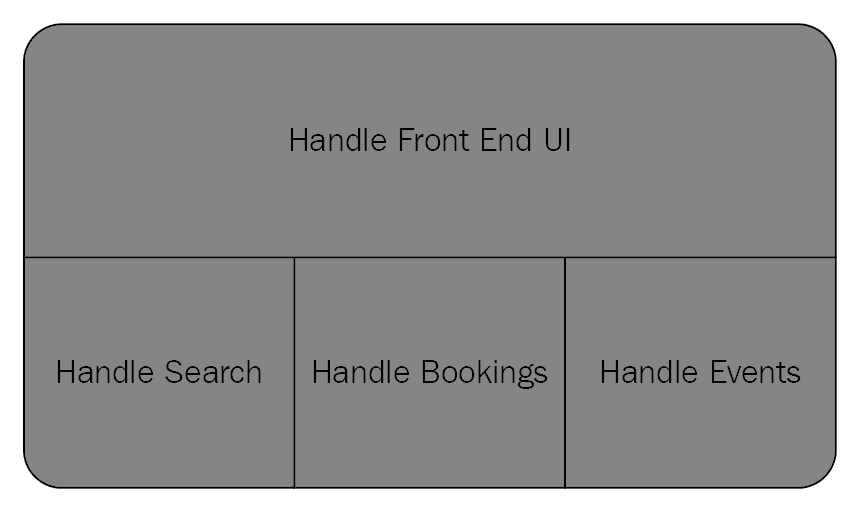
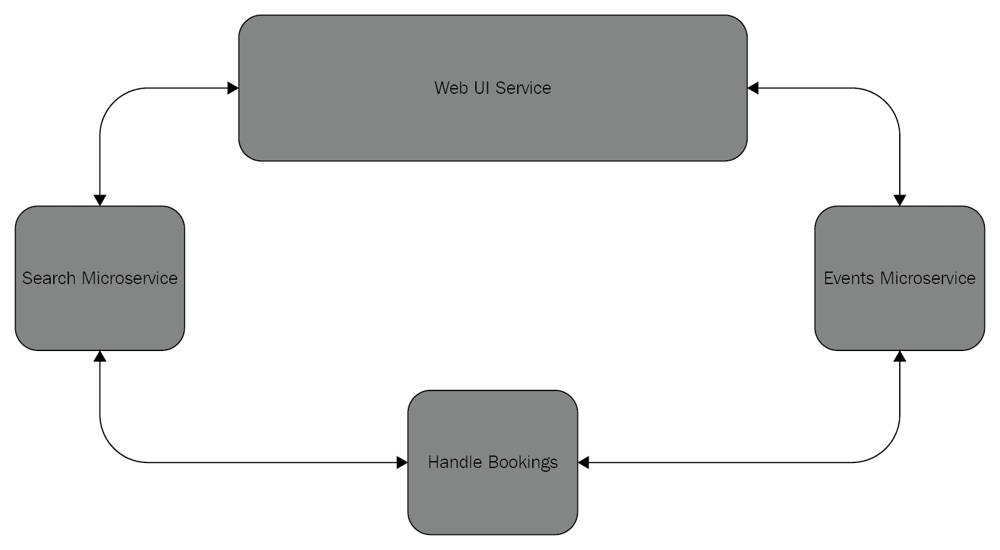
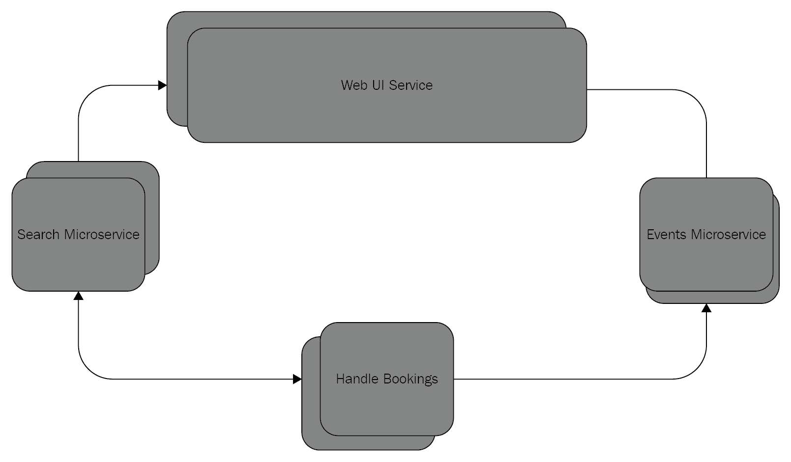
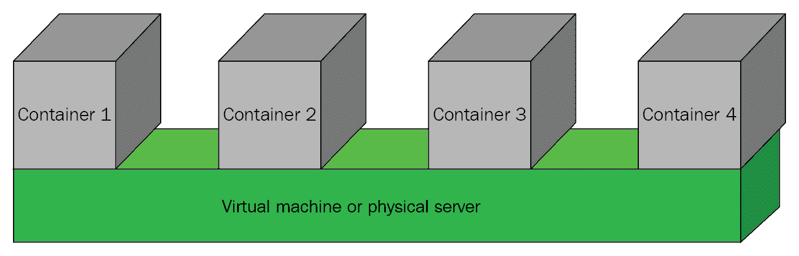
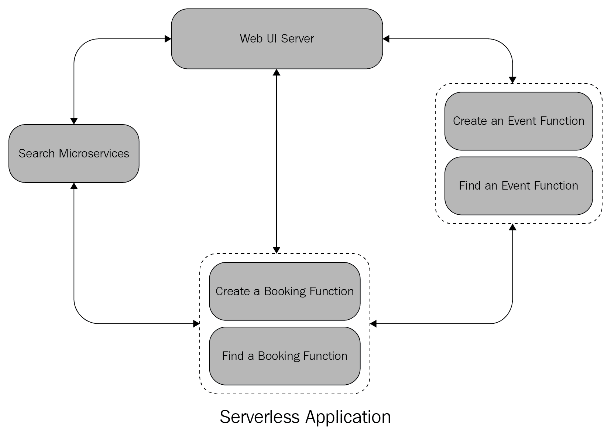

# 第十章：接下来去哪里？

欢迎来到本书的最后一章。在这本书中，我们介绍了如何使用强大的 Go 语言开发全栈 Web 软件的大量实用主题。在这一章中，我们将探讨读者应该探索的一些主题，以提升他们的技能并将他们的知识提升到新的水平。我们将重点关注两个主题：

+   云原生应用程序

+   React Native 框架

# 云原生应用程序

对于希望将应用程序扩展到无限可扩展以适应不断增长的用户需求和扩展的数据负载的人来说，云原生应用程序是一个重要的话题。**云原生应用程序**可以定义为在分布式和可扩展的基础设施上运行的应用程序。它们预计始终可用、可靠、能够实时更新，并且不会在压力下崩溃。它们通常依赖于冗余、负载均衡和各种其他技术来实现其目标。这个话题绝非微不足道。事实上，整本书都致力于如何构建云原生应用程序。在本节中，我们将介绍在构建云原生应用程序中使用的某些关键技术。

云原生应用程序并不总是部署到**云**中，如 AWS 或 Azure。它们也可以部署到支持可扩展性的组织内部基础设施上。

在接下来的章节中，我们将探讨微服务、容器、无服务器应用程序和持续交付，这些都是云原生应用程序的重要概念。

# 微服务

微服务是现代软件中一个非常流行的概念。它是指将你的应用程序的任务划分为小型自包含的软件服务。因此，而不是拥有一个涵盖广泛任务的大型应用程序，你可以为每个任务使用一个微服务。微服务使得你的应用程序非常可扩展。

微服务的概念与单体应用程序的概念相反，后者是一种所有任务都编码在一起的应用程序。

这里是一个表示事件预订应用程序的单体应用程序的例子：

下面是如何用微服务应用程序表示相同的事件预订应用程序：

前面图中的每个块代表一个负责一项特定任务的微服务。

你可以将你的微服务分散到多个服务器节点上，在多个系统上实现负载均衡。你可以使你的微服务冗余，这样如果某个服务宕机，另一个服务就会接管工作，就像什么都没发生一样。这种冗余在部署补丁和更新到你的应用程序时也非常有用。

下面是我们现在支持的冗余示例图，以确保应用程序始终可用。如果一个服务因维护或系统崩溃而关闭，另一个服务将接管：

尽管微服务在应用程序中提供了大量的可扩展性和灵活性，但它们在长期维护中可能会变得具有挑战性，特别是如果你的架构扩展到数百或数千个微服务。将需要一些特殊的监控工具来确保它们得到适当的维护和照顾。

在下一节中，我们将讨论容器概念。

# 容器

容器技术是一种相对较新的技术。然而，它已经变得非常受欢迎，以至于它已经成为云原生应用世界中关键的基础设施软件的一部分。容器允许你用隔离的用户空间或一个*容器*来包围你的软件。

容器在部署和运行可扩展的微服务中非常有用，因为它们允许你的微服务在一个包含所有微服务配置、环境变量、依赖项、运行时以及服务所需的任何其他文件或设置的隔离空间中运行。

容器允许软件开发者在同一服务器节点上部署隔离的服务，确保你的服务不受同一节点上其他服务的任何影响。容器还允许开发者通过容器镜像一次性部署一个包含微服务运行所需所有内容的微服务。容器不仅用于微服务；它们还可以用于任何可以从容器中受益的软件，例如数据库引擎。例如，使用容器镜像部署 MySQL 是部署和运行 MySQL 的一种流行方法，相对容易。目前最受欢迎的容器技术之一是 Docker([`www.docker.com`](https://www.docker.com))。

下面是一个在服务器节点上运行的一些容器的例子：

让我们在下一节中看看无服务器应用程序。

# 无服务器应用程序

无服务器应用程序是云原生应用世界中另一种相对较新的技术。它们主要用于不需要持续运行的任务。为了正确理解无服务器应用程序的概念，让我们通过一个例子来探讨。

考虑亚马逊的 AWS Lambda 服务([`aws.amazon.com/lambda/`](https://aws.amazon.com/lambda/))，该服务被全球众多应用程序使用。为了执行特定任务，该服务允许用户请求在远程运行一个函数。换句话说，你要求 AWS Lambda 为你运行一些代码。代码执行后，输出会返回给你。不维护任何有状态的数据。在 Lambda 上运行的代码或函数由你提供。

无服务器应用程序利用 AWS Lambda 等服务来运行间歇性任务，这些任务不是一直都需要运行。这为你的应用程序提供了可伸缩性，因为它减轻了仅为了执行临时任务而维护软件服务的需求。AWS Lambda 等服务也被称为 **FaaS**（**函数即服务**）。

这里有一个示例应用程序，其中一些服务被函数所替代：

让我们在下一节中看看持续交付。

# 持续交付

持续交付是一种理念，即软件应快速且频繁地以短周期发布，而不是以更长和更慢的周期发布。持续交付允许组织通过能够随时发布改进和修复来有效地持续改进其软件。

持续交付不仅仅是使用软件工具；它还涉及整个组织都需要遵守的一种思维方式。需要有一个流程，任何对软件的添加都可以快速构建、测试和部署/交付。

持续交付对于运行云原生应用程序的组织来说非常实用且有效，因为它允许增量且快速的改进，而不是可能导致生产环境中软件崩溃的巨大步骤变化。尽可能自动化流程以获得最大利益是很重要的。

让我们在下一节中简要了解一下流行的 React Native 框架，用于构建移动应用程序。

# React Native

在这本书中，我们介绍了如何从头开始设计和编写一个 React 应用程序。这是现代软件中一个非常强大的技能。React 目前正在被用于驱动互联网上一些最受欢迎的网站。学习 React.js 的另一个强大优势是，你的技能可以通过 React Native 来构建跨平台移动应用程序。

# 什么是 React Native？

React Native ([`facebook.github.io/react-native/`](https://facebook.github.io/react-native/)) 是由 Facebook 开发的一个开源项目。它利用 React.js 框架的功能来构建可以在 Android 或 iOS 上运行的跨平台移动应用程序。React Native 非常受欢迎，目前被大小组织用于构建实用的移动应用程序。

React Native 的一大优势是，你编写的几乎所有代码都可以在 Android 和 iOS 设备上运行。这意味着你几乎只需要关注你整个应用程序的单一代码库。另一个主要优势是，React Native 使用目标平台的本地 API。这就是为什么用 React Native 编写的移动应用程序通常比用其他 JavaScript 移动框架编写的应用程序性能更好。

在下一节中，我们将探讨 React.js 和 React Native 之间的一些区别。

# React.js 与 React Native 的比较

尽管这两个框架都命名为 React，但它们之间还是有一些区别。让我们首先了解它们的相似之处，然后我们将讨论一些不同之处。

# React.js 和 React Native 之间的相似之处

下面是 React.js 和 React Native 之间的一些相似之处：

+   它们都使用 JavaScript ES6

+   它们都依赖于 React 组件，包括 `render()` 方法

+   它们都依赖于 React 元素

+   它们都使用 JSX 来构建视觉元素

# React.js 和 React Native 之间的区别

下面是 React.js 和 React Native 之间的一些区别：

+   React Native 有自己特殊的 JSX 语法来构建 UI 组件。默认情况下，它不像 React.js 那样使用 CSS 和 HTML。

+   React Native 依赖于一些特殊的库来与移动设备接口。例如，你需要使用 React-Native 特定的包来编写围绕手机相机或加速度传感器的代码。

+   部署 React Native 应用程序与部署 React.js 的体验不同，因为需要将应用程序及其所有应用规则部署到移动设备上。

# Expo

Expo ([`expo.io/`](https://expo.io/)) 是一个非常受欢迎的免费开源工具链，它允许用户相对容易地构建 React Native 移动应用程序。它提供了一个 SDK，可以暴露重要的功能，如相机访问、文件系统以及推送通知。当你作为一个初学者构建 React Native 应用程序时，Expo 是一个最佳的起点。

# 摘要

在本章中，我们介绍了一些非常流行和现代的技术。云原生应用程序现在非常受欢迎，尤其是在构建可靠、可扩展应用程序的需求不断增长的情况下。

React Native 是构建高性能、跨平台移动应用程序的关键框架。它利用了强大的 React 框架的原则和架构来实现这一点。

我们希望您在这本书的学习之旅中与我们一同享受，我们祝愿您在构建 Go 全栈应用程序时一切顺利。

# 问题

1.  云原生应用程序是什么？

1.  是否有必要将云原生应用程序部署到云端？

1.  微服务是什么？

1.  容器是什么？

1.  Docker 是什么？

1.  无服务器应用程序是什么？

1.  React Native 是什么？

1.  Expo 是什么？
