# Go 入门

本书将帮助您在 Go 编程之旅中取得进步，尤其是在您开始积极使用 Go 开发应用程序时。本章将解决新 Go 开发人员以及使用其他语言的人在日常编程中遇到的最常见问题。希望您喜欢这本书，并觉得它很有用。

我们将涵盖以下主题：

+   安装 Go 二进制文件

+   快速了解 Go 语言

# 安装 Go 二进制文件

让我们开始学习 Go。在本节中，我们将学习如何安装 Go 二进制文件，并简要了解 Go 语言。

要安装 Go 二进制文件，首先需要导航到以下链接：[`golang.org/doc/install`](https://golang.org/doc/install)；您也可以直接在 Google 中搜索它。您将找到在不同平台和操作系统上安装 Go 的分步指南。如果您点击“下载 Go”，它将带您进入下载页面，在那里您可以找到各种二进制格式。

您将在以下截图中发现 Windows、Linux 和 macOS 的 MSI 格式，如下所示：

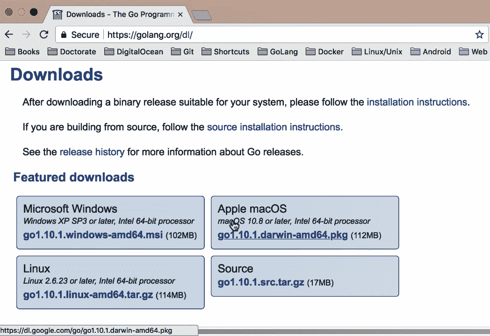

我将使用 macOS，但您会发现其他平台上的步骤也类似。让我们开始下载。

安装程序基本上是一个分步向导；您只需运行它，然后一直点击“继续”，直到安装完成。安装完成后，您可能还想做一件事，那就是设置您的环境变量。此外，您还需要设置您的工作空间。您将看到三个文件夹，`bin`、`pkg` 和 `src`，如下所示：


`src` 文件夹是您放置源文件的地方，`pkg` 文件夹是 Go 存储对象文件的地方，`bin` 文件夹是存储二进制文件的地方，这些二进制文件是实际的可执行文件。继续前进，我将使用我的 shell，您需要通过使用 `export` 来设置一些环境变量。您也可以使用配置文件来设置环境变量。如果您查看以下截图，您可以看到路径 `$PATH:/usr/local/go/bin`，这就是我的 Go 二进制文件所在的位置：

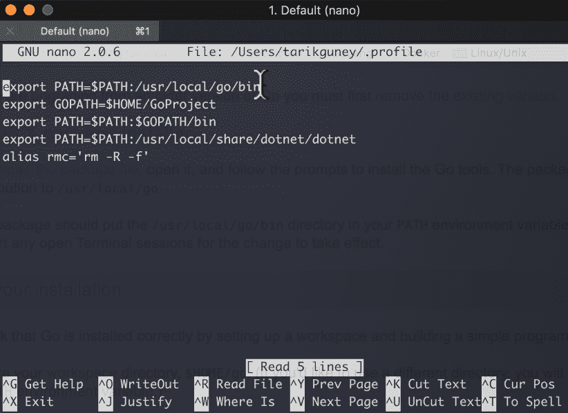

因此，当我运行 `Go` 命令时，它将自动找到 Go 程序的位置。

接下来，我们设置 `GOPATH`。`GOPATH`基本上是您的 Go 工作空间所在的位置。如果您还记得，工作空间包含三个文件夹，`pkg`、`src` 和 `bin`。`GoProject` 是该结构的父文件夹。最后是 `$GOPATH/bin`，当您想让终端找到已安装的 Go 二进制文件时使用。只需确保在重启终端之前添加这三样东西并保存此文件即可。然后，您就可以顺利地使用 Go 了！

您还可以通过点击以下截图中的链接来了解如何设置 Go 路径的环境变量，该链接位于同一页面：

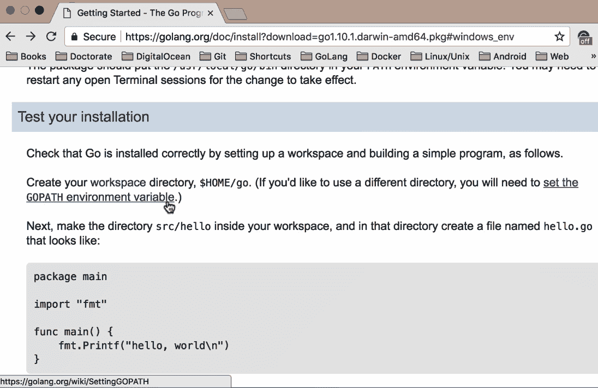

你会找到不同操作系统的说明。例如，对于基于 Unix 的系统，你可以使用`~/.bash_profile`，或者根据你使用的 shell，你可以使用各种配置文件。在我的系统中，我使用以下截图所示的配置文件：

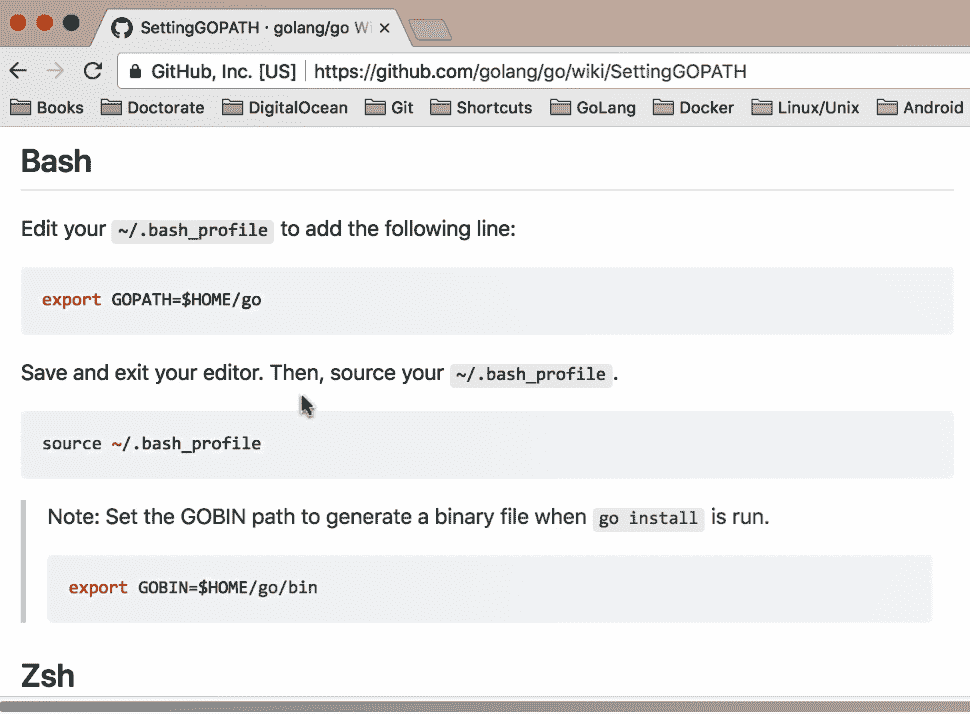

对于 Windows 系统，安装后，一旦你有了 Go 工作区，按照给出的说明操作，你就可以轻松地开始使用 Go 了。说明将类似于以下截图：

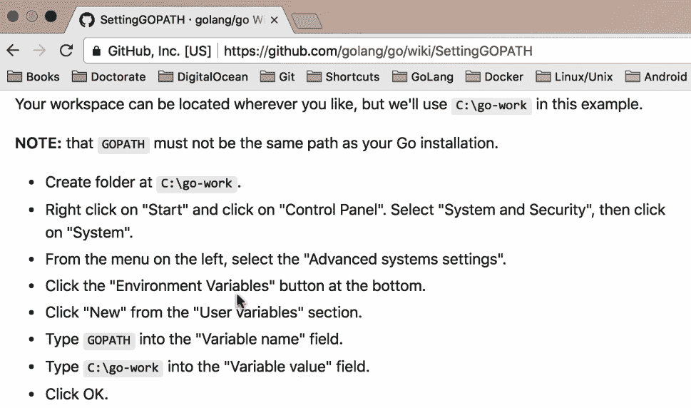

测试你是否已安装 Go 的最快方式就是直接输入`go`，如下面的截图所示：

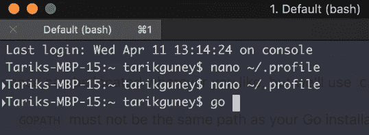

这将打开帮助教程，你可以通过使用 Go 版本看到可用的命令以及你拥有的代码版本。

这就是你可以轻松设置 Go 环境的方法。在下一节中，我们将快速浏览 Go 语言本身。

# 快速浏览 Go 语言

在本节中，我们将快速浏览 Go 编程语言。Go 是一种表达性强、简洁且干净的编程语言；它具有并发机制，这有助于程序员编写能够充分利用多核和网络机器的程序。它还可以快速编译成机器代码，并具有垃圾回收的便利性和运行时反射的强大功能。它是一种静态类型、编译型语言，但对于大多数人来说，它感觉像是一种动态类型和解释型语言。那么，让我们通过导航到[`tour.golang.org/welcome/1`](https://tour.golang.org/welcome/1)来查看 Go 的语法；这是那些想要学习 Go 语法的人的一个很好的起点：

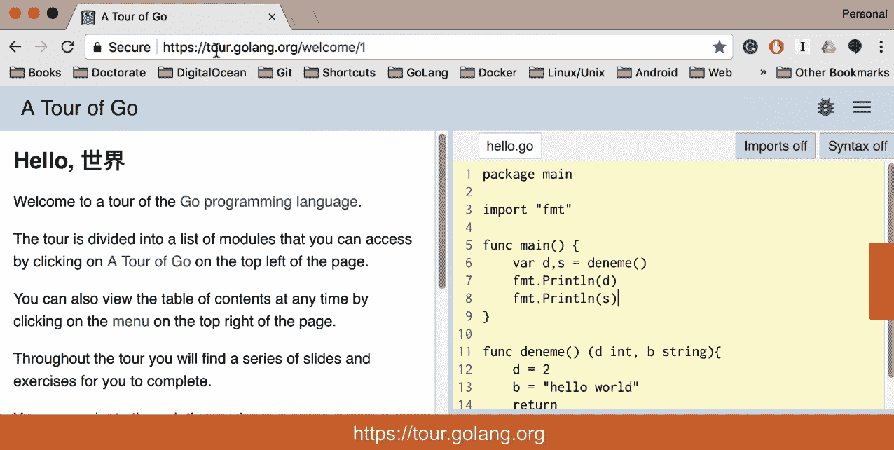

好的，所以如果你查看截图中的语法，如果你来自 Java 和 C#或 C 和 C++这样的语言，你可能觉得语法有点不同。例如，如果你查看返回类型，你实际上是在函数的末尾定义返回类型，而不是定义类型。我们还有一个主函数，它是我们应用程序的入口点，类似于许多其他编程语言，如果你查看以下截图所示的内容，你可以看到我们有包、变量和函数，以及流程控制语句：`for`、`if...else`以及`struct`、`slices`和`maps`等类型：

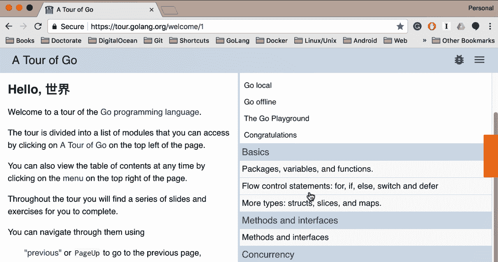

如果你想要创建一个类，例如结构体，你可以使用结构体类型并将其与指针结合。此外，它具有方法和接口以及并发性，但没有泛型。

说了这么多，我还会谈到在这本书中将要使用的工具。在**GoLand**中有几个可用的工具。GoLand 是 JetBrains 公司推出的一款相对较新的 IDE。我们将在整本书中使用 GoLand。你可以轻松创建新的项目，并为它们命名，选择 SDK，这里是 Go 1.9。你还可以添加新的文件或新的包，等等。

你可以定义你的配置，并通过输入你的入口文件来构建 Go，如下面的截图所示。然后你可以运行`main.go`并点击 OK：

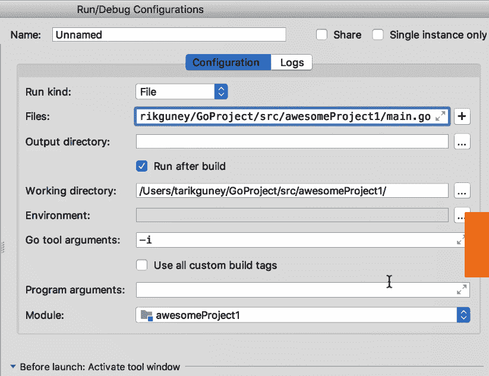

最后，按下*Ctrl*+*r*将构建你的项目，如下面的截图所示：

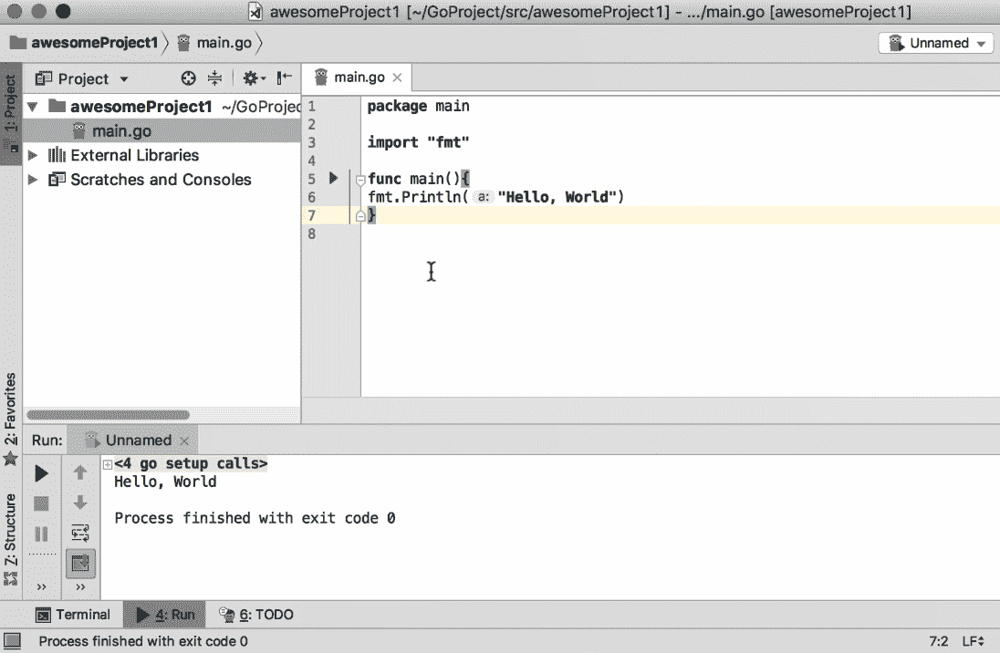

在我结束本章之前，让我快速展示一个仅使用终端的例子。我将使用`touch`命令创建`main.go`文件，并添加以下代码：

```go
package main
import "fmt"
func main(){
 fmt.Println(a:"Hello World")
}
```

你可以通过使用`go run main.go`命令来运行它，你将得到以下输出：

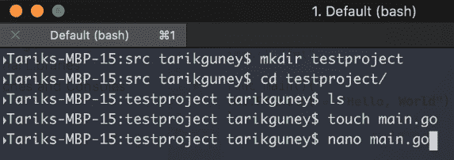

你可以保存它并运行它。所以，这就是你如何使用终端快速编写 Go 代码并运行它的方法。

# 摘要

在本章中，我们学习了如何安装 Go 二进制文件，并对 Go 语言进行了简要的浏览。我们学习了如何仅使用终端编写和运行 Go 代码。我们还查看了一章中将要使用的工具以及可以用来开发 Go 应用程序的其他工具。我们现在可以继续到下一章，我们将看到一些操作字符串值的食谱。
