# 操作字符串值

我们现在对这个书籍将带我们走向的内容有一个概述。我们知道如何安装 Go 二进制文件并编写 Go 代码，仅使用终端运行它。在本章中，我们将学习一些操作字符串值的食谱，例如从字符串的开始和结束处删除空格、提取子字符串、替换字符串的一部分、在字符串值中转义字符以及将字符串值大写。

# 从字符串的开始和结束处删除空格

让我们从从字符串的开始和结束处删除空格开始。你可能有很多原因想要从字符串的开始和结束处删除空格；例如，如果你接受一些值，如名字，你通常不需要在该字符串值的开始或结束处有空格。

因此，让我们继续我们的项目，看看我们如何在 Go 语言中执行此过程。所以，你必须添加一个新的项目用于删除空格，并有一个 `main.go` 文件，我们将把代码放入其中，然后我们只需运行它；你的屏幕应该看起来像这样：

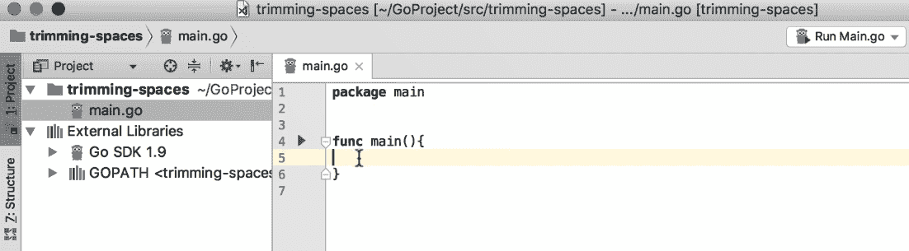

首先，让我们想象我们有一个包含一些空格的字符串变量：

```go
package main
import (
  "fmt"
  "strings"
)
func main(){
  greetings := "\t Hello, World "
  fmt.Printf("%d %s\n", len(greetings), greetings)
}
```

在前面的代码片段中，`/t` 表示制表符，并且在其后有一些空格。有 *hello World* 和一些更多的空格。我已经将这个字符串值及其长度属性放入控制台。`len` 函数将给出问候字符串的长度，表示该字符串中的字符数。让我们运行这个：

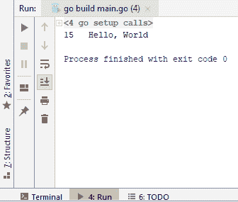

如截图所示，它有 15 个字符，包括制表符、空格以及字符串的其余部分。

现在，让我们继续并从变量中删除空格。我们有 `strings.TrimSpace`，它返回另一个字符串，如下面的截图所示：

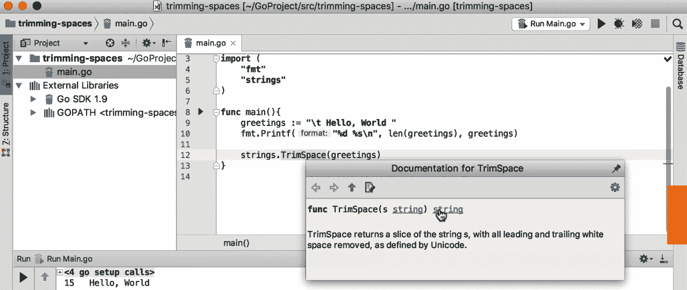

我们可以随后将字符串捕获到变量中。查看以下代码：

```go
package main
import (
 "fmt"
 "strings"
)
func main(){
 greetings := "\t Hello, World "
 fmt.Printf("%d %s\n", len(greetings), greetings)
trimmed := strings.TrimSpace(greetings)
 fmt.Printf("%d %s\n", len(trimmed), trimmed)
}
```

上述代码的输出如下：

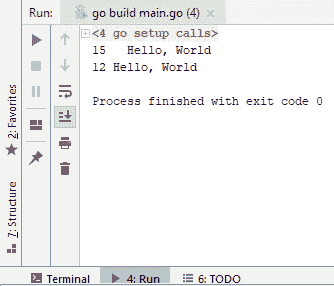

哇！正如你所见，我们的开始和结束处的空格，包括制表符，都消失了，现在我们这里有 12 个字符。这就是在 Go 中删除空格的方法。在下一节中，我们将看到如何从字符串值中提取子字符串。

# 从字符串值中提取子字符串

在本节中，你将学习如何从字符串值中提取子字符串。在 Go 语言中，字符串实际上是一个只读的字节切片，这意味着你可以在字符串上执行任何切片操作。让我们打开我们的编辑器，看看我们如何进行。

在编辑器中，添加一个新文件并将其命名为 `main.go`。你必须将包名改为 `main` 并添加一个名为 `main` 的新函数。这个 `main` 函数将是我们的示例的入口点。所以，让我们想象我们有一个如下所示的字符串值：

```go
package main
import "fmt"
func main(){
 greetings := "Hello, World and Mars"
```

我想从字符串中删除单词 *Mars* 和 *and*，并提取仅包含 *Hello, World* 的部分。可以这样做：

```go
package main
import "fmt"
func main(){
 greetings := "Hello, World and Mars"
 helloWorld := greetings[0:12]
 fmt.Println(helloWorld)
}
```

索引从 0 开始，因为它是一个切片。前面代码的输出如下：

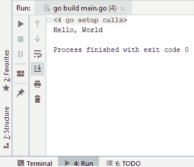

如你所见，我们只提取了整个短语中的 *Hello, World* 部分。即使索引中没有零，它仍然会工作。如果我们只想得到字符串中的 *World* 和 *Mars* 部分，索引可以是 [6:]。

这就是如何从字符串值中提取子字符串。在我们的下一个视频中，我们将看到如何将字符串的一部分替换为另一个字符串。

# 替换字符串的一部分

在本节中，我们将看到如何快速将字符串的一部分替换为另一个值。当涉及到 Go 语言的字符串操作时，你将在 strings 包下找到很多实用方法。在这里，我们将使用相同的包来替换字符串的一部分。让我们回到我们的编辑器，看看我们如何开始这个过程。

所以，我将有一个 `helloWorld` 变量，我们将把 *World* 替换为 *Mars*。请查看以下代码：

```go
package main
import (
 "strings"
 "fmt"
)
func main(){
 helloWorld := "Hello, World"
 helloMars := strings.Replace(helloWorld, "World", "Mars", 1)
 fmt.Println(helloMars)
}
```

以下截图将解释我们刚才看到的代码：

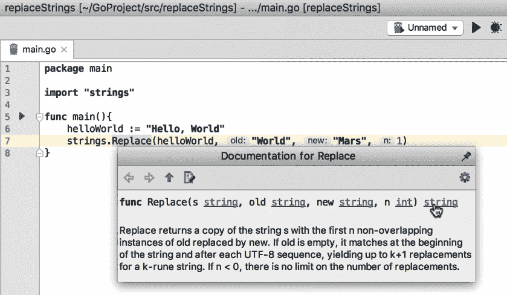

如截图所示，我们将使用 `strings` 包，它有一个 `replace` 函数，它接受我们将要搜索的变量作为第一个参数，即 *Hello, World*。旧字符串是我们想要替换的字符串中的内容，即 *World*。新字符串将是 *Mars*，我们想要应用到此替换的重复次数是 '1'。

如果你观察一下，这个方法的签名返回另一个字符串，我们将将其分配给另一个变量，在这个例子中是 `helloMars`。因此，你会看到以下输出：

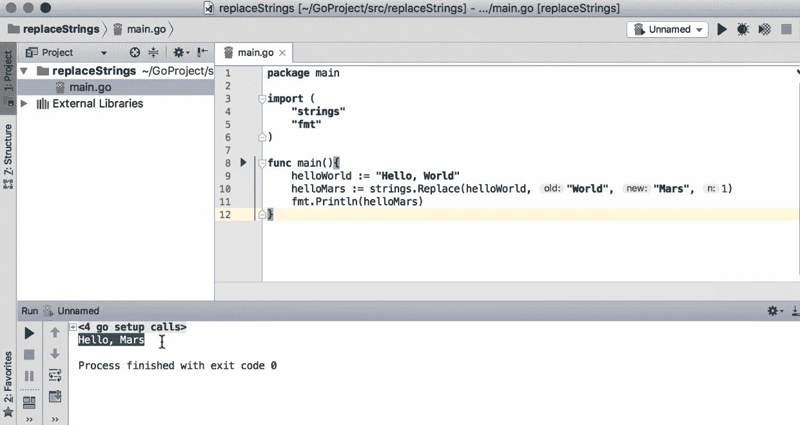

如你所见，我们已经将 *World* 替换为 *Mars*。

现在，让我们假设句子中有多个 *World* 实例，并且你使用了以下代码：

```go
package main
import (
 "strings"
 "fmt"
)
```

```go
func main(){
 helloWorld := "Hello, World. How are you World, I am good, thanks World."
 helloMars := strings.Replace(helloWorld, "World", "Mars", 1)
 fmt.Println(helloMars)
}
```

所以，如果你有一个那样的强度值，使用 1 将不会有所帮助。它只会替换单词 *World* 的第一个出现为 *Mars*，但其余部分仍然保持为 *World*，如以下截图所示：

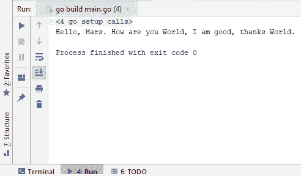

因此，你可以通过更改重复次数来替换 *World* 的任意多个实例。例如，如果你想将 *World* 的前两个实例替换为 *Mars*，重复次数将是 2，依此类推。如果你想将 *World* 的所有实例替换为 *Mars*，一种快速简单的方法是使用负一，这实际上告诉 Go 将字符串中可以找到的任何 *World* 实例替换为单词 *Mars*。让我们运行以下代码：

```go
package main
import (
 "strings"
 "fmt"
)
```

```go
func main(){
 helloWorld := "Hello, World. How are you World, I am good, thanks World."
 helloMars := strings.Replace(helloWorld, "World", "Mars", -1)
 fmt.Println(helloMars)
}
```

上述代码将给出以下输出：

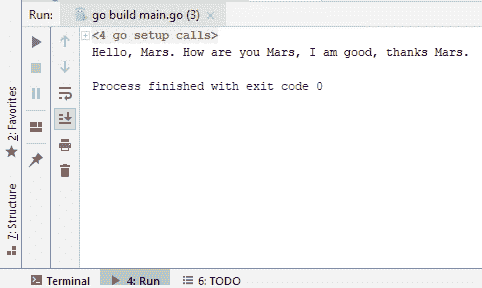

现在，所有的 "world" 实例都已被替换为单词 *Mars*。Go 的字符串包提供了许多其他选项，而且正如你所见，替换字符串实际上非常简单。在我们接下来的部分，我们将看到如何字符串中转义字符。

# 字符串中的转义字符

在本节中，我们将看到如何在字符串值中转义特殊字符。与市场上许多其他语言类似，Go 会以特殊方式处理某些字符。例如，如果 Go 在字符串值中看到 `\t` 字符，它将它们视为制表符。另外，如果不进行转义，你无法在双引号内使用双引号，现在我们将看到如何转义它们以正确地显示这些字符。

如往常一样，我们将有我们的 `main.go` 文件和 `main` 函数。所以让我们检查一个与上一个类似的例子。

```go
package main
import "fmt"
func main(){
  helloWorld := "Hello World, this is Tarik."
}
```

所以，如果我想在 Tarik 这个词周围包含双引号，我可以做到，但正如你所见，它给了我一个编译时错误，如下面的屏幕截图所示：

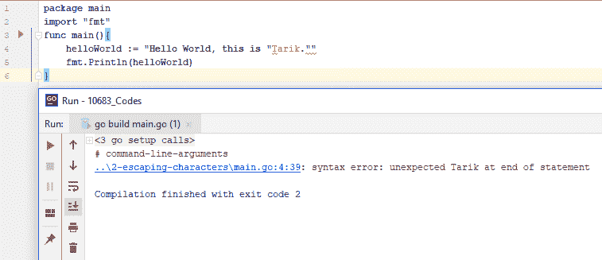

因此，让我们修复这个问题。我需要做的只是使用 `\`。所以，每次你想转义一个特殊字符时，你都用 `\` 来转义它。所以，让我们继续并把它添加到我们的控制台：

```go
package main
import "fmt" 
func main(){
 helloWorld := "Hello World, this is \"Tarik.\""
fmt.Println(helloWorld)
}
```

上述代码的输出将如下所示：

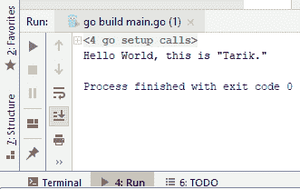

好吧！正如你所见，它写着 Hello World，这是 "Tarik."，但 Tarik 正如预期的那样被包含在两个双引号内。

现在，还有其他问题。让我们假设，出于某种原因，我想在不使用双引号的情况下输出 `\t`：

```go
package main
import "fmt"
func main(){
 helloWorld := "Hello World, this is \"Tarik.\" \t"
fmt.Println(helloWorld)
}
```

看起来一切正常，并且由于我们没有看到任何编译时错误，我们可以继续运行它。以下是我们得到的结果：

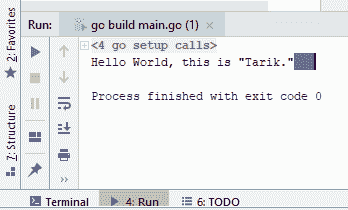

正如你所见，`\t` 没有出现在控制台中；实际上，我看到一个大制表符，因为这是一个特殊字符；`\t` 表示制表符。还有其他类似的特殊字符，例如 `\n`，它表示换行符。所以，让我们尝试运行以下代码：

```go
package main
import "fmt"
func main(){
 helloWorld := "Hello World, this is \"Tarik.\" \t\nHello again."
 fmt.Println(helloWorld)
}
```

上述代码将给出以下输出：

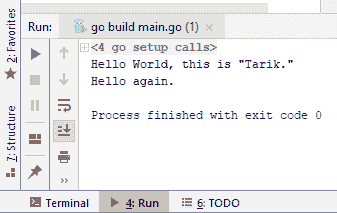

正如你所见，`Hello again` 并不是在同一行，而是被放置在了新的一行。如果我移除 `/n` 并再次运行代码，"hello again" 将会回到同一行，并且由于特殊字符 `\t` 的存在，我们还会看到一个大的空格：

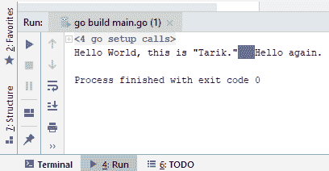

那么，我们如何转义 `\t`？让我们看看如果我们包含另一个 `\` 并运行以下代码会发生什么：

```go
package main
import "fmt"
func main(){
 helloWorld := "Hello World, this is \"Tarik.\" \\tHello again."
 fmt.Println(helloWorld)
}
```

正如以下屏幕截图所示，我们现在在字符串值中有 `\t`，而 Go 不再将其视为特殊字符：

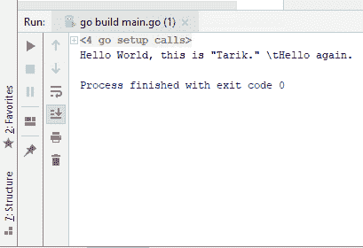

这就是你在 Go 中使用转义字符的方法。在我们接下来的部分，我们将看到如何轻松地将字符串值转换为大写。

# 字符串值的大写

在本节中，我们将看到如何在 Go 中将单词大写。你可能想要以各种方式在句子中将单词大写；例如，你可能想要将句子中的所有字母都大写，或者只将所有单词的首字母大写，我们将看到如何实现这一点。

让我们回到我们的编辑器。最初的几个步骤与从字符串的开始和结束处修剪空格时遵循的步骤相同。然而，这里我们有一个变量包含 "hello world, how are you today"，而我们只想将这个句子中所有单词的首字母大写。所以，我们在之前章节中已经见过的字符串包有一个名为 `title` 的函数，这个方法的签名也返回另一个字符串，我们可以将其分配给另一个变量，即 `HelloWorldtitle`。为了继续，我们必须运行刚才描述的代码：

```go
package main
import (
 "strings"
 "fmt"
)
func main(){
 helloWorld := "hello world, how are you today!"
 helloWorldtitle := strings.Title(helloWorld)
 fmt.Println(helloWorldtitle)
}
```

上述代码将给出以下输出：

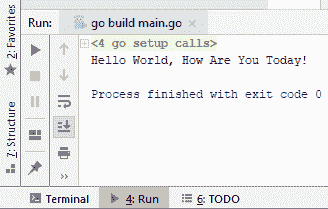

如你所见，代码已经将句子的所有首字母大写了。现在，如果我们想将这个句子中的所有字母都大写，我们必须使用新的 `ToUpper` 函数运行以下代码：

```go
package main
import (
 "strings"
 "fmt"
)
func main(){
 helloWorld := "hello world, how are you today!"
 helloWorldtitle := strings.Title(helloWorld)
 fmt.Println(helloWorldtitle)
helloWorldUpper := strings.ToUpper(helloWorld)
 fmt.Println(helloWorldUpper)
}
```

如果你打印 `Ln`，它实际上会在新的一行中打印那个字符串，而如果你不打印，它就不会这样做。我们刚才看到的代码将给出以下输出：

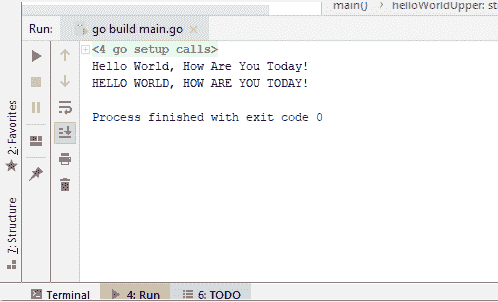

这一切都是关于大写字符串值！

# 摘要

在本章中，我们学习了如何从字符串的开始和结束处修剪空格，如何从字符串值中提取子字符串，如何替换字符串的一部分，如何转义字符串中的字符，以及如何大写字符串值。至此，我们已经完成了关于字符串操作的学习。下一章将描述如何在各种类型之间执行类型转换，我们将从将池转换为字符串值开始。
