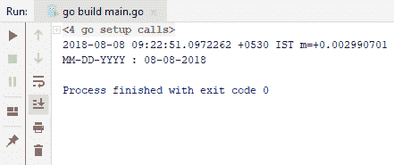
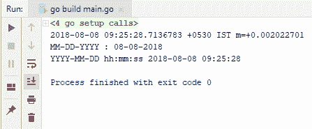
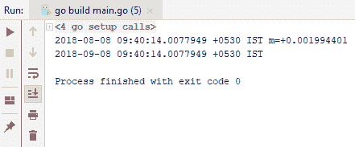
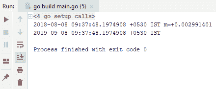
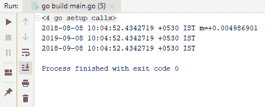
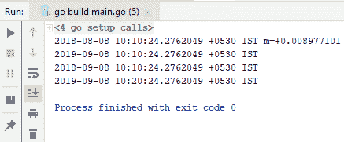
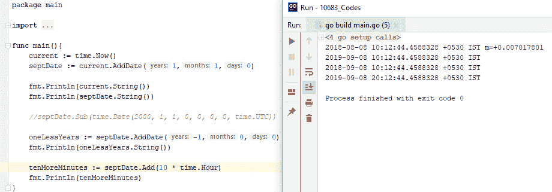
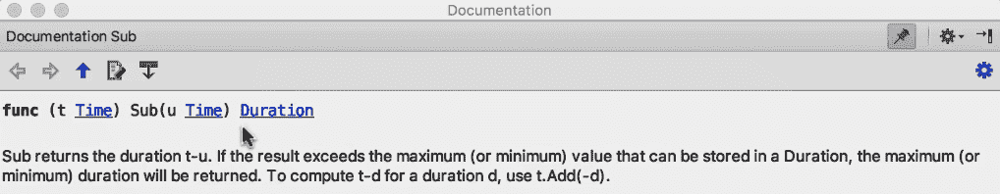
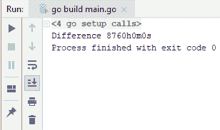
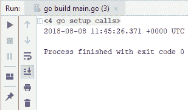

# 第四章：日期和时间

在本章中，我们将学习如何在 Go 编程语言中处理日期和时间。你将学习如何对`DateTime`值进行基本操作，例如找出两个日期之间的差异、获取今天的日期、对`DateTime`值进行简单的算术运算以及从字符串值中解析日期。在本章中，我们将涵盖以下主题：

+   查找今天的日期和时间

+   从日期中添加和减去

+   查找两个日期之间的差异

+   从字符串中解析日期和时间

# 查找今天的日期和时间

在本节中，我们将学习如何找到今天的日期和时间。我们可以使用`time.Now`来获取今天的日期，它导入了一个`time`包，`time`返回一个`time`类型，因此我们将将其分配给另一个变量并使用`String`函数。以下代码将帮助你更好地理解：

```go
package main

import (
  "time"
  "fmt"
)

func main(){
  current := time.Now()
  fmt.Println(current.String())
}
```

前一个代码的输出如下：


如你所见，我们得到了一个包含所有信息的长字符串，我们当然可以将其格式化到我们的需求。例如，我可以添加`current.Format`函数和一个预定义的布局，如以下屏幕截图所示：

```go
package main

import (
 "time"
 "fmt"
)

func main(){
 current := time.Now()
 fmt.Println(current.String())

 fmt.Println("MM-DD-YYYY :", current.Format("01-02-2006"))
}
```

前一个屏幕截图所示代码的输出如下：



在前一个屏幕截图中，你会看到今天的日期。你也可以通过跳过布局`snf`，提及你想要的输出格式（`YYYY-MM-DD hh:mm:ss`），来同时获得日期和时间，如下面的代码所示：

```go
package main

import (
  "time"
  "fmt"
)

func main(){
  current := time.Now()
  fmt.Println(current.String())

  fmt.Println("MM-DD-YYYY :", current.Format("01-02-2006"))

  fmt.Println("YYYY-MM-DD hh:mm:ss", current.Format("2006-01-02 15:04:05"))
}
```

在运行前一个屏幕截图中的代码后，我们得到了以下包含年、月、日以及时间信息的输出。这可以在以下屏幕截图中看到：



因此，这就是你如何在 Go 语言中简单地获取今天的日期，并以各种方式对其进行格式化的方法。在我们的下一个部分，我们将学习如何向或从日期值添加或减去。

# 向日期中添加和减去

在本节中，我们将学习如何向日期值添加和减去。

# 向日期添加内容

让我们继续学习如何向当前日期添加一个月。但在这样做之前，我们需要知道当前的日期。你可以通过遵循我们在前一个部分中学到的程序来完成这个操作。假设我得到了输出结果为 8 月 8 日（`2018-08-08 09:35:16.2687997 +0530 IST m=+0.003951601`），并且我们需要向这个值添加一个月。通过在`time`类型的`AddDate`函数上使用，我们可以添加任意年、月和日，因为它接受三个参数。这就是整个代码的看起来样子：

```go
package main

import (
  "time"
  "fmt"
)

func main(){
  current := time.Now()
  septDate := current.AddDate(0,1,0)

  fmt.Println(current.String())
  fmt.Println(septDate.String())
}
```

因此，查看以下输出屏幕截图，你会注意到我们已经通过将值`1`传递给第二个参数成功地向八月添加了一个额外的月份：



我们可以使用相同的程序来添加年份。你可以将`years:`参数改为`1`，然后在输出中将`2018`改为`2019`。这可以在下面的屏幕截图中看到：



这就是添加到日期值的基本方法。

# 从日期中减去

我们接下来要学习的是如何从当前日期中减去日期。正如你在下面的代码行中可以看到的，我们使用了`Sub`方法，因为它接受另一个`time`类型：

```go
septDate.Sub(time.Date(2000, 1, 1, 0, 0, 0, 0, time.UTC))
```

相反，我们将使用`AddDate`并传递一个负值给参数。所以，让我们将其分配给另一个变量并运行以下代码：

```go
package main

import (
  "time"
  "fmt"
)

func main(){
  current := time.Now()
  septDate := current.AddDate(1,1,0)

  fmt.Println(current.String())
  fmt.Println(septDate.String())

  //septDate.Sub(time.Date(2000, 1, 1, 0, 0, 0, 0, time.UTC))

  oneLessYears := septDate.AddDate(-1,0,0)
  fmt.Println(oneLessYears.String())
}
```

以下代码的输出将如下所示：



如你所见，我们通过从`2019`中减去`1`得到了`2018`。

# 添加时间

现在，考虑一下你需要添加时间而不是月份或年份。为了继续，我们必须使用`Add`，它有一个`duration`参数，这是你想要添加的时间量。

例如，让我们假设我们想要添加`10`分钟。检查以下代码：

```go
package main

import (
  "time"
  "fmt"
)

func main(){
  current := time.Now()
  septDate := current.AddDate(1,1,0)

  fmt.Println(current.String())
  fmt.Println(septDate.String())

  //septDate.Sub(time.Date(2000, 1, 1, 0, 0, 0, 0, time.UTC))

  oneLessYears := septDate.AddDate(-1,0,0)
  fmt.Println(oneLessYears.String())

  tenMoreMinutes := septDate.Add(10 * time.Minute)
  fmt.Println(tenMoreMinutes)
}
```

代码返回另一种类型或值，即`time`类型，如果你看这里的输出，我们添加了`10`分钟到 9 月份的日期：



现在，如果我看一下输出，我们可以看到我们添加了`10`分钟，所以`10:10:24`变成了`10:20:24`。如果我将`Minute`改为`Hour`并运行代码，我们将看到从 9 月份的日期中添加了`10`小时，这可以在下面的代码块中看到：

```go
package main

import (
  "time"
  "fmt"
)

func main(){
  current := time.Now()
  septDate := current.AddDate(1,1,0)

  fmt.Println(current.String())
  fmt.Println(septDate.String())

  oneLessYears := septDate.AddDate(-1,0,0)
  fmt.Println(oneLessYears.String())

  tenMoreMinutes := septDate.Add(10 * time.Hour)
  fmt.Println(tenMoreMinutes)
}
```

我们将得到以下输出：



所以，这就是基本的日期添加方法。在我们下一节中，我们将看到如何找出两个日期值之间的差异。

# 找出两个日期的差异

在本节中，我们将学习如何找出两个日期之间的差异。让我们假设我们有两个日期，如下面的代码块所示，你将看到这个方法的签名是自解释的。所以，我们只需要使用以下代码对减法方法进行操作，该方法从第二个日期中减去第一个日期：

```go
package main

import (
  "time"
  "fmt"
)

func main(){
  first := time.Date(2017, 1,1,0,0,0,0,time.UTC)
  second := time.Date(2018, 1,1,0,0,0,0,time.UTC)

  difference := second.Sub(first)
  fmt.Printf("Difference %v", difference)
}
```

现在，在我们运行代码并获取输出之前，如果你查看签名，你会看到该方法在日期之间返回`Duration`类型而不是`Time`类型：



返回到运行我们的代码，你会看到以下输出：



这就是简单地找出两个日期差异的方法。在我们下一节中，我们将学习如何从给定的字符串中解析日期和时间。

# 从字符串中解析日期和时间

在本节中，我们将学习如何从字符串中解析日期和时间。本节将结束本章。当您从字符串中解析日期和时间时，您需要两样东西：第一是布局，第二是您想要解析的实际字符串。所以，让我们想象我们有一个变量，它包含 `str := "2018-08-08T11:45:26.371Z"` 字符串值。

为了让 Go 理解这一点，您需要提供一个 `layout` 属性。`layout` 属性基本上描述了您的字符串 `DateTime` 的外观；它以年份开始，接着是月份，然后是日期，最后是时间。一如既往，`time` 包为我们提供了各种实用函数，我们可以使用这些函数来处理日期和时间。`Parse` 方法返回两样东西，一个是解析后的日期，另一个是错误。如果在解析过程中发生任何情况，可能会抛出错误，我们可以检查错误并查看出了什么问题，否则我们只会输出当前时间的字符串表示和解析的时间。所以，让我们运行以下代码：

```go
package main

import (
  "time"
  "fmt"
)

func main(){
  str := "2018-08-08T11:45:26.371Z"
  layout := "2006-01-02T15:04:05.000Z"
  t,err := time.Parse(layout, str)
  if err != nil{
    fmt.Println(err)
  }
  fmt.Println(t.String())
}
```

我们运行代码的输出如下：



如您所见，我们准确地解析了我们试图解析为日期的内容。这就是在 Go 中进行解析的方法。

# 摘要

在本章中，我们学习了如何查找当前日期和时间，如何对日期进行添加和减去操作，如何查找两个日期之间的差异，以及如何从字符串中解析日期和时间。在下一章中，您将学习如何在 Go 语言中处理映射和数组。您将看到实际示例，例如如何操作和迭代数组，合并数组和映射，以及测试一个键是否存在于映射中。
