# 映射和数组

在本章中，你将学习如何在 Go 中处理映射和数组。你将看到操作和迭代数组、合并数组和映射、以及测试键是否存在于映射中的实际示例。我们将在本章中介绍以下食谱：

+   从列表中提取唯一元素

+   从数组中查找元素

+   反转数组

+   遍历数组

+   将映射转换为键和值的数组

+   合并数组

+   合并映射

+   测试键在映射中的存在性

# 从数组中提取唯一元素

首先，我们将学习如何从列表中提取唯一元素。为了开始，让我们想象我们有一个包含重复元素的切片。

现在，假设我们想要提取唯一元素。由于 Go 中没有内置的结构，我们将创建自己的函数来完成提取。因此，我们有`uniqueIntSlice`函数，它接受`intSlice`或`intarray`。我们的唯一函数将接受`intSlice`并返回另一个切片。

因此，这个函数的想法是跟踪一个单独列表中的重复元素，如果元素在我们的给定列表中再次出现，那么我们不会将那个元素添加到我们的新列表中。现在，看看下面的代码：

```go
package main
import "fmt"
func main(){
  intSlice := []int{1,5,5,5,5,7,8,6,6, 6}
  fmt.Println(intSlice)
  uniqueIntSlice := unique(intSlice)
  fmt.Println(uniqueIntSlice)
}
func unique(intSlice []int) []int{
  keys := make(map[int]bool)
  uniqueElements := []int{}
  for _,entry := range intSlice {
    if _, value := keys[entry]; !value{
      keys[entry] =true
      uniqueElements = append(uniqueElements, entry)
    }
  }
  return uniqueElements
}
```

因此，我们将有一个`keys`，它基本上是一个映射，在其他语言中称为字典。我们还将有一个切片来保持我们的`uniqueElements`，我们将进行一个`for each`循环来遍历每个元素，如果它不是重复的，就将其添加到我们的新列表中。我们基本上通过传递一个`entry`来获取值；如果值是`false`，则将该条目添加到我们的键或映射中，并将其值设置为`true`，这样我们就可以看到该元素是否已经出现在我们的列表中。我们还有一个内置的`append`函数，它接受一个切片并将条目追加到我们的切片末尾，这会返回另一个切片。运行代码后，你应该获得以下输出：


如果你看看第一个数组，有重复的元素：`6`和`5`的多个实例。在我们的新数组或切片中，我们没有重复项，这就是我们从列表中提取唯一元素的方法。

在下一节中，我们将学习如何在 Go 中从数组中查找元素。

# 从数组中查找元素

在本节中，我们将学习如何在数组或切片中查找元素。你可以用很多方法来做这件事，但我们将在本章中介绍其中的两种。想象一下，我们有一个变量，它包含一个字符串切片。在这个切片中查找特定字符串的第一种方法将是使用`for`循环：

```go
package main
import (
 "fmt"
 "sort"
)
func main() {
 str := []string{"Sandy","Provo","St. George","Salt Lake City","Draper","South Jordan","Murray"}
 for i,v := range str{
 if v == "Sandy" {
 fmt.Println(i)
 }
 }
}
```

在运行前面的代码后，我们发现单词`Sandy`位于索引`0`：

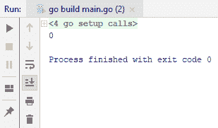

另一种方法是使用排序，我们可以先对切片进行排序，然后再搜索特定的项目。为了做到这一点，Go 提供了`sort`包。为了能够对切片进行排序，切片需要实现`sort`包需要的各种方法。`sort`包提供了一个名为`sort.stringslice`的类型，我们可以将我们的`stringslice`转换为`sort`提供的`StringSlice`类型。在这里，`sortedList`没有排序，所以我们必须显式地对其进行排序。现在，查看以下代码：

```go
package main
import (
  "fmt"
  "sort"
)
func main() {
  str := []string{"Sandy","Provo","St. George","Salt Lake City","Draper","South Jordan","Murray"}
  for i,v := range str{
    if v == "Sandy" {
      fmt.Println(i)
    }
  }
  sortedList := sort.StringSlice(str)
  sortedList.Sort()
  fmt.Println(sortedList)
}
```

运行代码后，将得到以下输出：

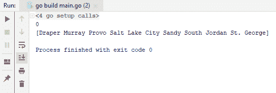

你可以看到`Draper`排在前面，然后是`Murray`，它基本上是按升序排序的。现在，要在这里搜索特定的项目，例如`Sandy`，只需在`main`函数中添加以下代码行：

```go
index := sortedList.Search("Sandy")
fmt.Println(index)
```

运行整个代码后，得到以下输出：

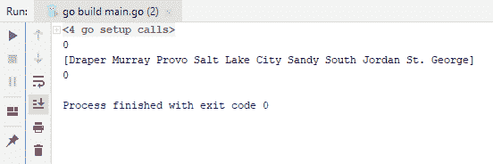

它输出`4`，这是单词`Sandy`的位置。这就是如何在数组中查找元素的方法。同样，这也适用于数字；例如，如果你查看`sort`包，你会找到`IntSlice`。使用整数切片可以极大地简化数字的排序和搜索操作。在下一节中，我们将看到如何反转数组。

# 反转数组

在本节中，我们将学习如何反转排序数组。我们将有一个变量，它包含一个数字切片。由于你现在熟悉 Go 中的`sort`包，你会知道`sort`包提供了许多我们可以用来排序数组和切片的功能。如果你查看`sort`包，你会看到许多类型和函数。

现在，我们需要`sort`函数，它接受一个接口，并且这个接口在`sort`包中定义；因此，我们可以称它为`Sort`接口。我们将把我们的数字切片转换为接口。查看以下代码：

```go
package main
import (
  "sort"
  "fmt"
)
func main() {
  numbers := []int{1, 5, 3, 6, 2, 10, 8}
  tobeSorted := sort.IntSlice(numbers)
  sort.Sort(tobeSorted)
  fmt.Println(tobeSorted)
}
```

这段代码将给出以下输出：

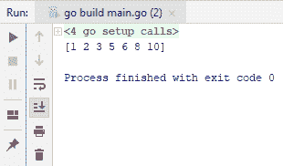

如果你查看输出，你会看到我们已经按升序排序了数字。如果我们想按降序排序它们怎么办？为了做到这一点，我们还有一个名为`Reverse`的类型，它实现了不同的函数来按降序排序。查看以下代码：

```go
package main
import (
  "sort"
  "fmt"
)
func main() {
  numbers := []int{1, 5, 3, 6, 2, 10, 8}
  tobeSorted := sort.IntSlice(numbers)
  sort.Sort(sort.Reverse(tobeSorted))
  fmt.Println(tobeSorted)
}
```

运行代码后，我们得到以下输出，你会看到数字是按降序排列的：

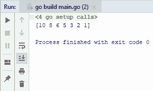

在下一节中，我们将看到如何遍历数组。

# 遍历数组

在本节中，我们将学习如何遍历数组。遍历数组是 Go 编程中最基本和最常用的操作之一。让我们打开我们的编辑器，看看我们如何轻松地做到这一点：

```go
package main

import "fmt"

func main(){
  numbers := []int{1, 5, 3, 6, 2, 10, 8}

  for index,value := range numbers{
     fmt.Printf("Index: %v and Value: %v\n", index, value)
  }
}
```

从前面的代码中，我们得到以下输出：

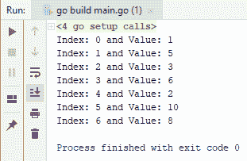

这就是你可以轻松遍历各种类型的切片，包括字符串切片、字节切片或字节数组的方式。

有时候，你不需要`index`。在这种情况下，你可以通过使用下划线（`_`）来忽略它。这意味着你只对值感兴趣。为了执行这个操作，你可以输入以下代码：

```go
package main

import "fmt"

func main(){
  numbers := []int{1, 5, 3, 6, 2, 10, 8}
  for _,value := range numbers{
    // fmt.Printf("Index: %v and Value: %v\n", index, value)
    fmt.Println(value)
  }
}
```

这段代码的输出将如下所示：

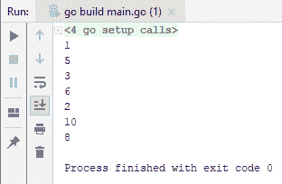

这就是你可以轻松遍历各种类型切片的方式。在下一节中，我们将看到我们如何将映射转换为键值数组。

# 将映射转换为键值数组

在本节中，我们将看到如何将映射转换为键值数组。让我们想象一个名为`nameAges`的变量，它具有映射，如下面的代码块所示，我们将字符串值映射到整型值。这里也有名字和年龄。

我们需要添加一个新的结构体名为`NameAge`，它将包含一个字符串类型的`Name`和一个整型类型的`Age`。现在我们将遍历我们的`nameAges`映射。我们将使用一个`for`循环，当你对一个映射类型使用范围操作符时，它返回两个东西，一个键和一个值。所以，让我们写下这段代码：

```go
package main
import "fmt"
type NameAge struct{
  Name string
  Age int
}
func main(){
  var nameAgeSlice []NameAge
  nameAges := map[string]int{
    "Michael": 30,
    "John": 25,
    "Jessica": 26,
    "Ali": 18,
  }
  for key, value := range nameAges{
    nameAgeSlice = append(nameAgeSlice, NameAge {key, value})
  }

  fmt.Println(nameAgeSlice)

}
```

在运行前面的代码后，你将获得以下输出：

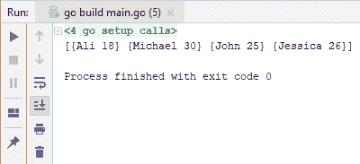

这就是你可以轻松将映射转换为数组的方式。在下一节中，我们将学习如何在 Go 中合并数组。

# 合并数组

在本节中，我们将看到如何在 Go 中轻松合并两个数组。假设我们有两个数组，我们打算将它们合并。如果你之前使用了`append`，你会知道它可以接受所需的所有参数。让我们检查以下代码：

```go
package main
import "fmt"
func main(){
  items1 := []int{3,4}
  items2 := []int{1,2}
  result := append(items1, items2...)
  fmt.Println(result)
}
```

在运行以下代码后，你将获得以下输出：

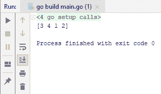

现在，我们可以在输出中看到`[3 4 1 2]`。你可以在数组中添加更多值，并且仍然可以合并它们。这就是我们如何在 Go 中轻松合并两个数组的方式。在下一节中，我们将看到这次如何合并映射。

# 合并映射

在本节中，我们将学习如何合并映射。查看以下截图中的两个映射：

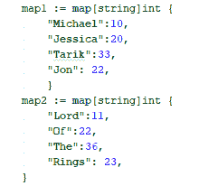

如您所见，这里有四个项目，映射基本上是将一个字符串映射到一个整数。

如果你不在`22`之后使用逗号，就像前面截图所示，你将得到一个编译时异常。这是因为 Go 中自动添加分号，这在代码中是不合适的。

好的，那么让我们继续合并这两个映射。不幸的是，没有内置的方法来做这件事，所以我们只需要遍历这两个映射并将它们合并在一起。查看以下代码：

```go
package main
import "fmt"
func main(){
  map1 := map[string]int {
   "Michael":10,
   "Jessica":20,
   "Tarik":33,
   "Jon": 22,
  }
  fmt.Println(map1)

  map2 := map[string]int {
    "Lord":11,
    "Of":22,
    "The":36,
    "Rings": 23,
  }
  for key, value := range map2{
    map1[key] = value
  }
  fmt.Println(map1)
}
```

前面代码的输出如下：

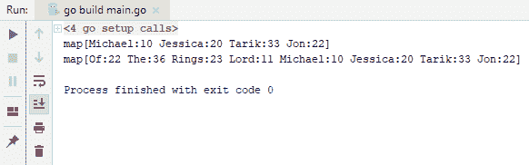

好的，所以第一行，如你所见，只有我们使用的初始元素，而第二行基本上包含了一切，也就是说，包含了`map2`中的所有项。所以，这就是你可以快速合并两个映射为一个的方法。在下一节，我们将学习如何测试映射中是否存在一个键。

# 测试映射中键的存在性

在本节中，我们将了解如何检查给定映射中是否存在键。所以我们有一个映射，`nameAges`，它基本上将名字映射到年龄。查看以下代码：

```go
package main
import "fmt"
func main() {
  nameAges := map[string]int{
    "Tarik": 32,
    "Michael": 30,
    "Jon": 25,
  }

  fmt.Println(nameAges["Tarik"])
}
```

如以下截图所示，我们基本上是从`Tarik`键中获取值。因此，它只返回了一个值，即`32`：


然而，使用这个映射还有另一种方法，它返回两件事：第一是值，第二是键是否存在。例如，查看以下代码：

```go
package main
import "fmt"
func main() {
  nameAges := map[string]int{
    "Tarik": 32,
    "Michael": 30,
    "Jon": 25,
  }

  value, exists := nameAges["Tarik"]
  fmt.Println(value)
  fmt.Println(exists)
}
```

输出将如下所示：

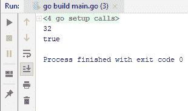

如你所见，代码返回`true`，因为`Tarik`在映射中存在，并且存在于`nameAges`中。现在，如果我们输入一个在映射中不存在的名字会怎样？如果我们把`nameAges`中的`Tarik`替换成`Jessica`，代码将返回`0`和`false`，而不是之前得到的`32`和`true`。

此外，你还可以使用 Go 的`if`条件，这是一种条件检查。查看以下代码：

```go
package main
import "fmt"
func main() {
  nameAges := map[string]int{
    "Tarik": 32,
    "Michael": 30,
    "Jon": 25,
  }
  if _, exists := nameAges["Jessica"]; exists{
    fmt.Println("Jessica has found")
  }else {
    fmt.Println("Jessica cannot be found")
  }
}
```

如果你查看以下输出，你可以看到我们得到`Jessica cannot be found`：

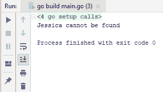

这意味着它不存在。现在，如果我向映射中添加`Jessica`并运行以下代码：

```go
package main
import "fmt"
func main() {
  nameAges := map[string]int{
    "Tarik": 32,
    "Michael": 30,
    "Jon": 25,
    "Jessica" : 20,
  }
  if _, exists := nameAges["Jessica"]; exists{
    fmt.Println("Jessica can be found")
  }else {
    fmt.Println("Jessica cannot be found")
  }
}
```

如前述代码的输出所示，代码返回`Jessica can be found`：

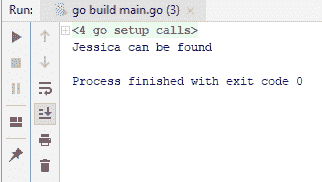

实际上，我们甚至可以在`if`后面添加一个`value`，就像我们之前看到的那样，并使用以下代码打印`value`：

```go
package main
import "fmt"
func main() {
  nameAges := map[string]int{
    "Tarik": 32,
    "Michael": 30,
    "Jon": 25,
    "Jessica" : 20,
  }
  if value, exists := nameAges["Jessica"]; exists{
    fmt.Println(value)
  }else {
    fmt.Println("Jessica cannot be found")
  }
}
```

我们将得到以下输出：

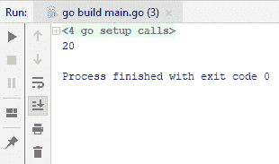

这样你就可以简单地看到给定映射中是否存在键。

# 摘要

本章带你了解了众多主题，例如从列表中提取唯一元素、从数组中查找元素、反转数组、将映射转换为键值数组、合并数组、合并映射以及测试映射中键的存在性。在第六章“错误和日志”，我们将看到错误和日志的配方，我们将从在 Go 中创建自定义错误类型开始。
