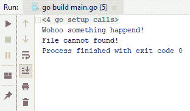
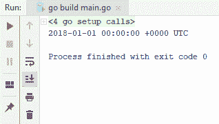
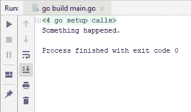
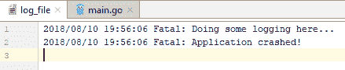
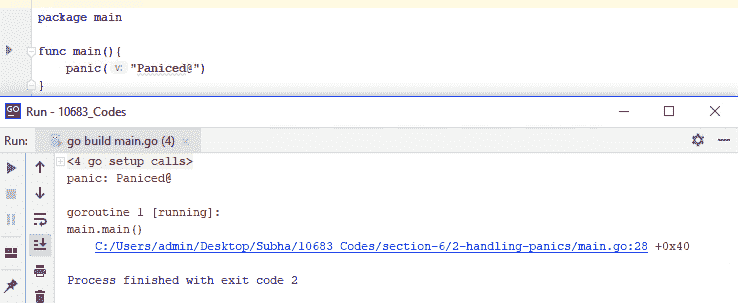
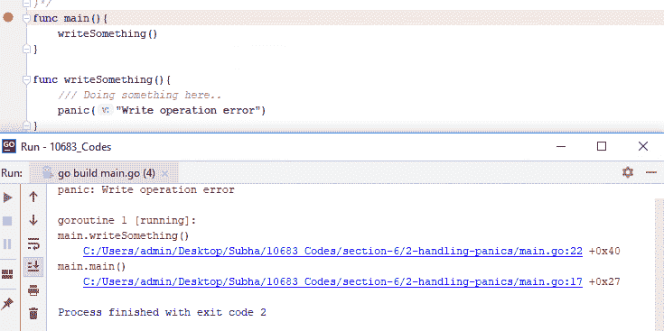
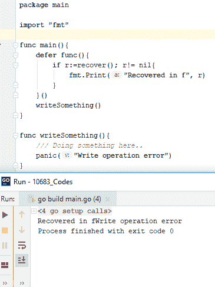
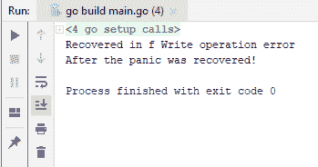

# 第六章：错误和日志记录

在本章中，我们将学习如何处理错误，并在需要时返回错误。Go 的错误机制与其他一些流行的语言不同，本节将教你如何以 Go 的方式处理错误。我们还将学习如何在你的应用程序中执行简单的日志记录操作，以便更好地调试正在运行的应用程序。在本章中，我们将涵盖以下主题：

+   创建自定义错误类型

+   Go 中的 `try...catch` 等价

+   在你的应用中进行简单的日志记录

+   优雅地处理恐慌

# 创建自定义错误类型

让我们从创建你的自定义错误类型开始。如果你来自像 C# 和 Java 这样的语言，你可能会发现 Go 中的错误机制略有不同。此外，你创建自己的自定义错误的方式非常简单，因为 Go 是一种鸭子类型语言，这意味着只要你的结构体满足一个接口，你就可以开始使用了。让我们继续创建我们自己的自定义错误，使用一个新的类型。所以，我将有两个字段，`ShortMessage` 和 `DetailedMessage`，它们都是字符串类型。你可以有尽可能多的字段，以捕获更多关于错误的信息。此外，为了满足 `error` 接口，我将实现一个新的方法 `*MyError`，它将返回一个 `string` 值，我们可以将这个错误输出到控制台或某个日志文件。

那么，我将要做的是返回错误信息。所以，你这样做的方式非常简单：你只需从你的方法中返回这个错误类型。让我们假设我们有一个 `doSomething` 方法，它返回一个错误。让我们假设我们在该方法中执行了一些代码行，并且由于某种原因返回了一个错误，比如一个 `"Wohoo something happened!"` 的 `ShortMessage` 实例。当然，你可能需要在这里使用更有意义的消息，并且不要忘记使用这个 `&` 操作符。因为它将获取你的 `*MyError` 对象的地址，因为我们在这里使用的是指针。如果你不这样做，你会看到有一个类型错误，解决方法之一就是移除那个 `*` 指针，错误就会得到修正。但你可能不希望有多个相同的对象副本，所以，而不是做我刚才描述的事情，你可以轻松地这样做：返回一个引用，这样你就有更好的内存管理。现在，让我们看看整个代码：

```go
package main

import "fmt"

type MyError struct{
  ShortMessage string
  DetailedMessage string
  //Name string
  //Age int
}

func (e *MyError) Error() string {
  return e.ShortMessage + "\n" +e.DetailedMessage

}
  func main(){
    err:= doSomething()
    fmt.Print(err)
}
func doSomething() error {
  //Doing something here...
  return &MyError{ShortMessage:"Wohoo something happened!", DetailedMessage:"File cannot found!"}
}
```

那么，让我们运行这个，当然它会返回一些错误；我们只是在这里添加 `err`，然后运行到控制台。现在，我们可以看到我们的消息或错误消息被写入到控制台，如下面的截图所示：



这就是你可以简单地创建自己的错误消息类型的方法。在我们接下来的部分，我们将学习 Go 中的 `try...catch` 等价。

# Go 中的 try...catch 等价

与其他语言不同，Go 中没有`try...catch`块。在本节中，我们将看到 Go 如何处理基本错误。所以，我们将首先看到如何处理 API 调用返回的错误。我们可以使用`time.Parse()`方法来做这件事，因为它接受一个布局和一个值字符串。它返回两件事，一个是`parsedDate`，另一个是错误。Go 通常不会返回异常，而是将其作为第二个参数返回一个错误。

现在，你可以通过检查`parsedDate`是否为 nil 来处理这种情况。如果它在 Go 中不是 nil，那么我们知道发生了错误，我们需要处理它。如果没有发生任何事情，我们可以安全地继续到下一行，那就是将`parsedDate`的内容写入输出。所以，为此，请检查以下代码示例：

```go
package main

import (
  "time"
  "fmt"
)

func main(){
  parsedDate, err:= time.Parse("2006", "2018")
  if err != nil {
    fmt.Println("An error occured", err.Error())
  }else{
    fmt.Println(parsedDate)
  }
}
```

前面的代码将给出以下输出：



你可以看到它运行正常。如果我们向`2018`之后添加一些`string`值会发生什么？让我们添加`abc`，然后运行代码。如果你看到以下截图，你可以看到解析时间时发生了错误；它还添加了错误消息`An error occured parsing time "2018 abc": extra text: abc`，如下截图所示：


现在，本节的第二部分是你自己返回错误的情况。假设我们有一个`doSomething`函数，它返回一个`err`类型。检查以下代码：

```go
package main
import (
  "fmt"
  "errors"
)
func main(){
  _, err := doSomething()
  if err != nil {
    fmt.Println(err)
  }
}
func doSomething() (string,error) {
  return "", errors.New("Something happened.")
}
```

前面的代码将给出以下输出：



所以，这就是在 Go 中如何做简单的`try...catch`等效操作。在我们下一节中，我们将看到如何在你的应用程序中做简单的日志记录。

# 在你的应用程序中做简单的日志记录

在本节中，我们将学习如何在你的应用程序中做简单的日志记录。当然，你可以用各种方法来做这件事，也有第三方包允许你这样做，但我们将使用 Go 提供的`log`包。所以，我们必须做的第一件事是使用`os`包创建一个新文件，如果在创建`log`文件时发生了错误，我们将将其写入控制台。我们还将使用`defer`函数。在`main`方法退出之前，这个`defer`函数将被调用，下一步将是设置输出：

```go
package main
import (
  "os"
  "fmt"
  "log"
)
func main(){
  log_file, err := os.Create("log_file")
  if err != nil{
    fmt.Println("An error occured...")
  }
  defer log_file.Close()
  log.SetOutput(log_file)

  log.Println("Doing some logging here...")
  log.Fatalln("Fatal: Application crashed!")
}
```

当我们运行前面的代码时，会创建一个名为`log_file`的新文件，内容如下：



你可能会想知道致命错误和普通信息错误之间的区别。让我们重新排列这两行，看看新的顺序会如何表现。因此，我们将首先运行`Fatalln`，然后运行`Println`，如下所示：

```go
package main
import (
  "os"
  "fmt"
  "log"
)
func main(){
  log_file, err := os.Create("log_file")
  if err != nil{
    fmt.Println("An error occured...")
  }
  defer log_file.Close()
  log.SetOutput(log_file)
  log.Fatalln("Fatal: Application crashed!")
  log.Println("Doing some logging here...")
}
```

如果你现在运行前面的代码并检查`log_file`的内容，你会看到第二个`Println`没有被写入：


差别在于`Fatalln`类似于`Println`，但它只跟随一个对`os.Exit`的调用。所以，它基本上是写个日志然后退出应用程序，这是两者之间的简单区别。这就是你如何在应用程序中简单地做日志记录。当然，如果你不想像我们在这里做的那样一直设置输出，你可以将`main`函数包装到你的包中。在我们接下来的部分，我们将看到如何优雅地处理恐慌。

# 优雅地处理恐慌

在本节中，我们将看到如何优雅地处理恐慌。与错误不同，如果你不从恐慌中恢复，它将停止你程序的执行。因此，如果你想让你的程序继续运行，处理它们是很重要的。首先，让我们看看我们如何在 Go 程序中抛出一个恐慌。你可以简单地使用一个叫做`panic`的关键字，这是一个内置函数，类型为 panic，并运行它以获得输出：



还有另一种方法来做这件事。让我们在这里使用另一个函数并写点东西。让我们想象我们在做某事，由于某种原因它突然恐慌了。这可能是一个第三方方法，这意味着它位于第三方包中，所以我们可能无法完全控制这个包。因此，在这里，如果你运行前面的代码，这就是我们在应用程序窗口中看到的内容，以及我们想要写入控制台的消息，如下所示：



我们还看到了我们的`panic`的堆栈跟踪。首先，它触发了主消息，然后触发了`writeSomething()`方法。那么我们如何处理这个`panic`呢？我们有这个`defer`关键字，你必须使用这个`defer`。`defer`的意思是；比如说，在你方法退出之前，你想运行另一段代码，所以你只需传递一个函数，并说“我想运行这个`defer`函数”。当然，它需要是这样的：`defer func(){}()`, 或者你可以说`defer writeSomething()`在这里。这无关紧要，但既然我打算运行几段代码，我就把它们封装在函数里了。我们还有一个叫做`recover`的关键字，它在`main`函数退出之前运行`defer`函数。在这个函数内部，我们也尝试`recover`。

如果发生了恐慌，这个`recover`会返回一些内容，如果没有恐慌，那就意味着它不会返回任何内容。因此，`r`的值将是`nil`，这意味着我们不需要在控制台写任何东西。然而，如果发生了恐慌，我们就会进入`if`条件，并直接写入`recover`构建方法中来的任何内容，然后继续运行下面的代码，我们将得到相应的输出：



因此，现在你可以看到我们基本上说“在 f 中恢复”，消息是 panic 抛出的内容，这是我们在这里写的。如果你想看到这个过程的延续，我们只需从`main`函数中复制`defer func()`函数。接下来，我们将创建另一个名为`sayHello()`的方法，并将`defer func()`粘贴进去。我想向你展示的是，我们已经从 panic 中恢复过来，所以执行也将触碰到这一行。所以，我们可以继续运行以下代码：

```go
package main

import "fmt"

func main(){
  sayHello()
  fmt.Println("After the panic was recovered!")
}

func sayHello(){
  defer func(){
    if r := recover(); r != nil {
      fmt.Println("Recovered in f", r)
    }
  }()
  writeSomething()
}

func writeSomething(){
  /// Doing something here..
  panic("Write operation error")
}
```

在执行`main`函数之后，现在我们看到以下消息：



如果我们没有`defer`函数，让我们看看那会是什么表现。现在你看到它没有触发`main`函数，我们这里有 panic 和所有的堆栈跟踪，这就是你可以在你的应用程序中优雅地处理 panic 的方式。

# 摘要

本章介绍了错误处理和日志记录。在下一章中，我们将学习如何在操作系统中处理文件和目录。我们还将了解如何解析和使用各种格式，例如 XML、YAML 和 JSON。
