# 文件和目录

在上一章中，你学习了如何处理错误和日志记录。在本章中，我们将看到在 Go 语言中处理文件和目录的食谱。你还将了解解析和使用各种格式，如 XML、YAML 和 JSON。本章将涵盖以下主题：

+   检查文件是否存在

+   读取文本文件的整个内容

+   写入文件

+   创建临时文件

+   计算文件中的行数

+   读取文件中的特定行

+   比较两个文件的内容

+   删除文件

+   复制或移动文件

+   重命名文件

+   删除目录及其内容

+   列出目录下的所有文件

# 检查文件是否存在

我们将首先检查文件是否存在。所以，首先，让我们通过点击“新建 | 文件”并命名为`log.txt`来创建一个文件。

要开始检查文件是否存在，我们将使用`os.Stat`包。它返回两个值：第一个是文件信息，第二个是错误。我们不需要文件信息，只需要错误本身，因为我们将要检查错误以查看文件是否存在。如果错误是`nil`（没有错误发生），则文件存在。查看以下代码：

```go
package main
import (
  "os"
  "fmt"
)
func main(){
  if _, err := os.Stat("log.txt"); err == nil{
    fmt.Println("Log.txt file exists")
  }
}
```

在运行前面的代码后，你将获得以下输出：

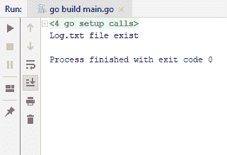

要以相反的方式检查文件是否存在，我们只需输入`os.IsNotExist()`并将我们捕获的`err`传递给它，然后将其打印到控制台。查看以下代码：

```go
package main
import (
  "os"
  "fmt"
)
func main(){
  if _, err := os.Stat("log.txt"); os.IsNotExist(err){
    fmt.Println("Log.txt file does not exist")
  }else{
    fmt.Println("Log.txt file exists")
  }
}
```

在运行前面的代码后，我们将得到相同的输出，表示“Log.txt 文件存在”。现在，让我们尝试运行相同的代码，但这次我们删除`log.txt`文件。你将得到以下输出：

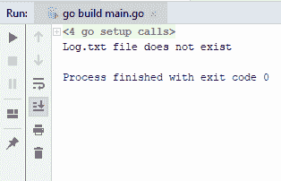

你可以看到现在输出显示“Log.txt 文件不存在”，这就是你可以轻松检查文件是否存在的方式。在我们下一节中，我们将了解如何读取文件的整个内容。

# 读取文本文件的整个内容

在本节中，我们将了解如何读取文件的整个内容。我们将创建一个名为`names`的新文件，我有一系列名字，例如，`Tarik`、`Guney`、`Michael`、`John`和`Montana`。我们将读取这个文件。我们将使用`io`实用工具包，它提供了一个读取文件的功能，它接受文件的路径，即`names.txt`。它返回两件事：文件的实际内容和错误。如果没有错误发生，我们将首先将`contentBytes`转换为字符串表示。现在让我们使用以下代码将内容写入控制台：

```go
package main
import (
  "io/ioutil"
  "fmt"
)
func main(){
  contentBytes, err := ioutil.ReadFile("names.txt")
  if err == nil{
    var contentStr string = string(contentBytes)
    fmt.Println(contentStr)
  }
}
```

通过在终端中使用`go run main.go`命令运行代码，你将获得以下输出：

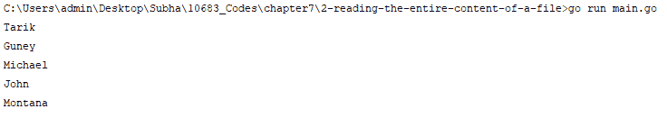

因此，你可以看到我们已经从文件中读取了所有名称。这就是如何轻松地将整个文件内容读入你的内存中。

在下一节中，我们将看到如何将内容写入文件。

# 写入文件

在本节中，我们将看到如何将内容写入文件。类似于读取文件，我们将使用`ioutil`包。我们将使用`ioutil.WriteFile`函数，它接受三个参数。第一个参数是我们将要写入的文件名，第二个参数是我们想要写入的数据，最后一个参数是文件权限。这里的优势是，如果文件不存在，则`WriteFile`将使用通过`perm`参数提供的权限创建文件，如果文件已存在，则在写入之前将截断文件。我们将继续将一些内容写入我们的文件，由于我们的文件尚不存在，它将为我们创建一个新文件。我们将写入`Hello, World`，这是一个`string`参数，在将其传递给`WriteFile`之前，我们需要将其转换为`byte`数组。文件名将是`hello_world`，第二个参数将是`hello`变量的字节表示。这将返回一个错误。如果它不是`nil`，则表示发生了某些事情。让我们检查一下代码：

```go
package main
import (
  "io/ioutil"
  "fmt"
)
```

```go
func main() {
  hello := "Hello, World"
  err := ioutil.WriteFile("hello_world", []byte(hello), 0644)
  if err != nil{
    fmt.Println(err)
  }
}
```

运行代码后，你会看到没有错误发生，并且我们的`hello_world`文件已存在。如果你打开文件，你会看到`Hello, World`被写入，如下所示：


如果我们再次运行代码，使用不同的`string`和`Hello, World Again`，你会看到之前的内容被清除并替换为新的内容，如下面的截图所示：

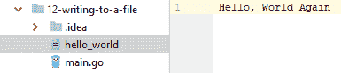

这基本上就是写入文件的方法。在下一节中，我们将看到如何创建临时文件。

# 创建临时文件

在本节中，我们将看到如何创建一个临时文件。让我们也定义一个包含字符串`helloWorld := "Hello, World"`的变量。我们将使用`ioutil`包，它提供了`TempFile()`方法。第一个参数是目录；如果你不传递任何内容给它，它将使用默认的临时目录，我们将在本例中使用它，第二个参数是为你的临时文件提供一个前缀，它将是`hello_world_temp`。它返回两个东西：第一个是创建的临时文件，第二个是错误（`err`）。现在，如果发生任何错误，我们将恐慌，并将错误作为消息抛出。

当你完成临时文件的使用后，建议你删除该文件，我们可以使用`defer`函数，其中包含`os.Remove()`方法。你只需要提供文件名，它将找到并删除它。现在我们将`helloWorld`写入我们的文件。现在让我们检查一下代码：

```go
package main
import (
 "io/ioutil"
 "fmt"
)
func main(){
 helloWorld := "Hello, World"
 file, err := ioutil.TempFile("", "hello_world_temp")
 if err != nil{
 panic(err)
 }
 defer os.Remove(file.Name())
 if _, err := file.Write([]byte(helloWorld)); err != nil {
 panic(err)
 }
 fmt.Println(file.Name())
}
```

运行前面的代码，你会得到以下输出：

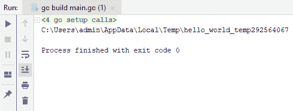

路径是我们文件所在的位置，选定的部分是文件名，它是一个临时文件，当然，这个文件会被删除。如果没有被删除，我们会在那个位置看到它。现在，我们不会通过注释掉前面代码块中的`defer os.Remove(file.Name())`行来删除文件。

此外，我们将打开文件，并使用终端，通过`less`命令（在 Linux 中）和`more <`命令（在 Windows 中）来显示该文件的内容，如截图所示：

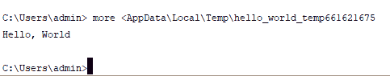

如果你查看前面的截图，你会看到`Hello, World`在那里。

这就是在 Go 中创建临时文件的方法。

在下一节中，我们将了解如何计算文件的行数。

# 文件中的行数计算

在本节中，我们将了解如何计算文件的行数。假设我们有一个文件，并且每行包含一些名字，我们需要计算文件中有多少行。首先，我们将使用`os.Open`包打开我们的文件，文件名为`names.txt`。它将返回一个错误，但在这个例子中，我们不会关心这个错误，因为我们知道文件是存在的。所以，我将使用文件扫描器来扫描文件。我们有`bufio.NewScanner`包，它有一个新的扫描器，它接受一个读取器，因此我们可以传递文件。行数将从`0`开始，我们将对`fileScanner.scan`执行此操作。因此，只要它扫描，行数就会增加。最后，我们将行数写入控制台。当然，当一切完成后，我们将使用`defer file.Close()`函数。让我们检查一下代码：

```go
package main
import (
  "os"
  "bufio"
  "fmt"
)
func main() {
  file, _ := os.Open("names.txt")
  fileScanner := bufio.NewScanner(file)
  lineCount := 0;
  for fileScanner.Scan(){
    lineCount++
  }
  defer file.Close()
  fmt.Println(lineCount)
}
```

当你运行前面的代码时，你会得到以下输出：

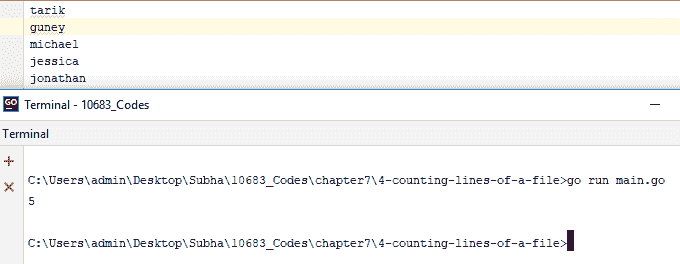

打印出的输出是`5`，你也可以通过去文件中手动计数来确认。

在下一节中，我们将了解如何在文件中读取特定的行。

# 在文件中读取特定的行

在本节中，我们将了解如何在文件中读取特定的行。我们有一个名为`names.txt`的文件，它每行包含一些名字：

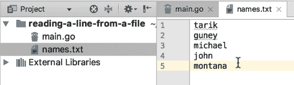

我们只想从文件中读取第三行。查看以下代码：

```go
package main
import (
  "os"
  "bufio"
  "fmt"
)
func main(){
  fmt.Println(ReadLine(3))
}
func ReadLine(lineNumber int) string{
  file, _ := os.Open("names.txt")
  fileScanner := bufio.NewScanner(file)
  lineCount := 0
  for fileScanner.Scan(){
    if lineCount == lineNumber{
      return fileScanner.Text()
    }
    lineCount++
  }
  defer file.Close()
  return ""
}
```

首先，我们将有一个`ReadLine()`函数，它接受行号并返回一个字符串。首先，我们将使用`os.Open()`函数打开文件，然后我们将使用`fileScanner`。然后我们将传递文件，我们将要使用的行数将从`0`开始。如果行数等于我们给出的行号，那么我们将返回文件`scanner.txt`；否则，我们将增加计数器。最后，我们将使用`defer file.Close()`函数。运行前面的代码后，你会得到以下输出：

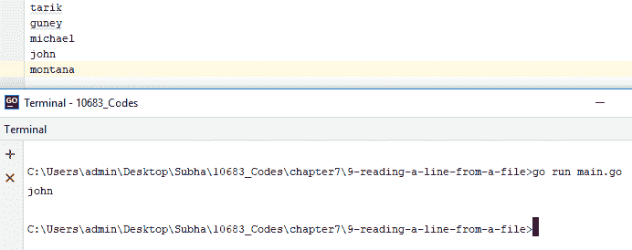

因此，它返回`john`，这是从您开始计数时的第三行。如果您想让它更符合人们期望的文件行数计数方式，您可以更改索引并从`1`开始。这就是您如何轻松地从文件中获取特定行的方法。

在下一节中，我们将看到如何比较两个文件的内容。

# 比较两个文件的内容

在本节中，我们将看到如何比较两个文件的内容。首先，我们将创建两个具有相同内容的文本文件，用于比较，分别是`one.txt`和`two.txt`。我们将使用`ioutil`包将文件读入内存；一如既往，我们将确保在导入第一个文件时没有错误，如果有错误，我们简单地会恐慌。我们还将导入第二个文件。有一个非常简单的方法来检查这两个文件是否有相同的内容（是否相等），那就是使用在`byte`包下定义的`Equal`函数。查看以下代码：

```go
package main
import (
  "io/ioutil"
  "bytes"
  "fmt"
)
func main(){
  one, err := ioutil.ReadFile("one.txt")
  if err != nil{
    panic(err)
  }
  two, err2 := ioutil.ReadFile("two.txt")
  if err2 != nil{
    panic(err2)
  }
  same := bytes.Equal(one, two)
  fmt.Println(same)
}
```

运行前面的代码后，您将得到以下输出：

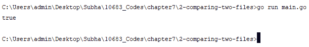

输出是`true`，这意味着文件的内容是相等的。如果您更改一个文件的内容并再次运行相同的代码，输出将是`false`。这就是您如何检查两个不同文件的内容是否相同。

在下一节中，我们将学习如何使用 Go 语言删除文件。

# 删除文件

在本节中，我们将看到如何在 Go 中删除文件。在 Go 中删除文件是最容易的操作之一，因为`os`包提供了一个名为`Remove()`的函数，允许您删除任何文件。所以，首先，我们将创建一个新的文件，并将其命名为`new.txt`。以下截图将显示创建`new.txt`后的文件夹结构：

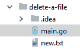

我们将看到如何删除`new.txt`文件。`Remove()`函数接受文件的路径。如果发生错误，它会返回一个错误，我们将捕获这个错误，如果它不是`nil`，我们将恐慌。查看以下代码：

```go
package main
import "os"
func main() {
  err := os.Remove("new.txt")
  if err != nil{
    panic(err)
  }
}
```

让我们运行代码并检查输出：


您可以看到`new.txt`文件已经消失，我们已经成功删除了该文件。所以，我将继续运行这个程序，正如您所看到的，`new.txt`文件消失了。让我们再次运行这个程序，看看我们会得到什么类型的恐慌，以及当您尝试删除一个最初就不存在的文件时，您会看到什么错误信息：

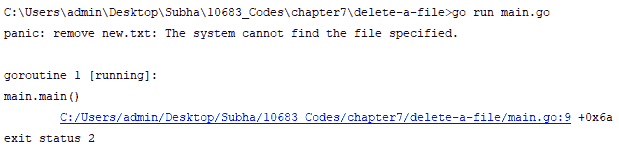

好吧，这就是您如何在 Go 中轻松删除文件的方法。在下一节中，我们将看到如何复制或移动文件。

# 复制或移动文件

在本节中，我们将看到如何复制或移动一个文件。你可以用各种方法来做这件事，其中一些取决于你将要使用的操作系统。然而，我们将看到一种不太多依赖操作系统的复制或移动文件的最简单方法。首先，我们将添加一个将要复制的文件，命名为`original.txt`，并在其中添加一些包含`Hello, World`的内容。然后，我们将使用`os.Open()`打开文件，这将返回两样东西，一个是我们的文件 original，另一个是错误。如果没有错误，我们将继续执行`defer`并关闭文件。此外，我们将使用`os.Create()`在相同位置创建一个新文件，这也会返回一个错误。现在最简单的事情是使用`io.Copy()`。因此，代码看起来可能像这样：

```go
package main
import (
  "os"
  "io"
)
func main(){
  original, err := os.Open("original.txt")
  if err != nil{
    panic(err)
  }
  defer original.close()
  original_copy, err2 := os.Create("copy.txt")
  if err2 != nil{
    panic(err2)
  }
  defer original_copy.Close()
  _, err3 := io.Copy(original_copy, original)
  if err3 != nil{
    panic(err3)
  }
}
```

运行代码后，我们看到`copy.txt`出现了，打开它后，我们可以看到其中包含从`original.txt`文件复制的`Hello, World`：

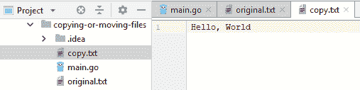

现在，让我们看看如何移动文件。首先，我们将创建一个名为`target`的新文件夹，并将`original.txt`复制到`target`中，然后删除放置在`target`文件夹外部的`original.txt`文件。为此，`original_copy, err2 := os.Create("copy.txt")`将改为`original_copy, err2 := os.Create("target/original.txt")`。如果你看到下面的屏幕截图，你会注意到`original.txt`文件已经被复制到`target`文件夹下：

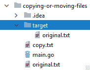

现在，我们可以删除外部的`original.txt`文件。在前面代码的`main`函数的末尾添加以下两行代码：

```go
original.Close()
os.Remove("original.txt")
```

运行前面的代码后，你会得到以下输出：

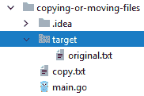

如你所见，代码有效地通过移动和删除文件移动了`original.txt`文件。这就是你如何在 Go 中简单地复制和移动文件的方法。

在下一节中，我们将看到我们如何在 Go 中轻松地重命名文件。

# 重命名文件

在本节中，我们将看到如何在 Go 中重命名文件。首先，我们将创建一个新文件，命名为`old.txt`，文件夹结构如下所示：

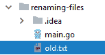

我们将把这个文件的名称改为`new.txt`。要做到这一点，最简单的方法是使用提供`Rename()`函数的`os`包。该函数接受旧路径，即`old.txt`，和新路径，即`new.txt`。让我们检查一下代码：

```go
package main
import "os"
func main() {
  os.Rename("old.txt", "new.txt")
}
```

运行代码后，你可以在下面的屏幕截图中看到，名称`old.txt`已更改为`new.txt`：

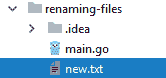

所以，这就是我们如何在 Go 中重命名文件的基本方法。

在下一节中，我们将看到如何删除一个目录及其所有内容。

# 删除目录及其内容

在本节中，我们将了解如何删除目录及其内容。我们将使用`os`包，它提供了两个函数，`Remove()`和`RemoveAll()`。我们将检查这两个函数。首先，我们将创建一个名为`hello`的新目录，并保持它为空，如下面的截图所示：

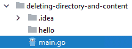

如前所述，我们将使用`os`包，它接受文件或目录。我们将传递一个目录，如果发生错误，它总是返回一个错误。我们必须检查这个错误是否不是`nil`。查看以下代码：

```go
package main
import (
  "os"
  "fmt"
)
func main(){
  err := os.Remove("hello")
  if err != nil{
    fmt.Println(err)
  }
}
```

如果你运行代码，你将获得以下文件夹结构作为输出：


如果你比较两个输出截图，你可以看到我们已经有效地删除了我们的`hello`目录。然而，如果目录中有一个文件（比如`world.txt`），即目录不为空，你运行相同的代码，目录将不会被删除，如果`hello`目录中有一个文件，将显示以下消息：

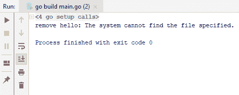

现在，有一个选项可以删除文件以及目录。我们可以使用本节开头提到的`RemoveAll()`函数。为此，只需将前面的代码中的`err := os.Remove("hello")`更改为`err := os.RemoveAll("hello")`。

运行前面的代码后，你会发现你已成功删除了文件和目录，你将再次查看以下文件夹结构：


在下一节中，我们将了解如何列出目录下的所有文件。

# 列出目录下的所有文件

在本节中，我们将了解如何列出目录下的所有文件。我们将创建一个包含三个文件的新目录，分别是`jupiter.txt`、`mars.txt`和`world.txt`：

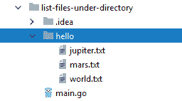

我们将要做的就是读取所有文件并将它们的名称输出到控制台。我们将使用`ioutil.ReadDir`包并将`hello`传入，这是我们的目录名称。这将返回两种类型的东西：两个文件和一个错误。我们将检查错误是否不是`nil`，并使用 panic 打印出内容。我们还将使用`for`循环遍历文件。查看以下代码：

```go
package main
import (
  "io/ioutil"
  "fmt"
)
func main() {
  files, err := ioutil.ReadDir("hello")
  if err != nil{
    panic(nil)
  }
  for _,f := range files{
    fmt.Println(f.Name())
  }
}
```

如果你运行前面的代码，你会得到以下输出：

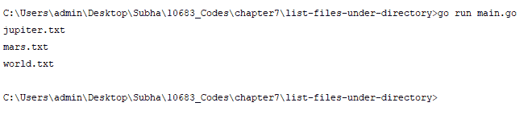

这样你就可以简单地列出你目录下的所有文件。

# 摘要

在本章中，你学习了如何在操作系统中处理文件和目录。你还学习了解析和使用各种格式，如 XML、YAML 和 JSON。在下一章中，我们将学习关于并发性的食谱，我们将从运行多个并发函数开始。 
