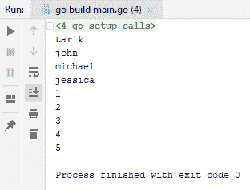
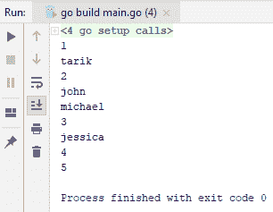
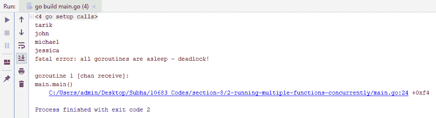
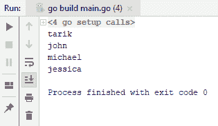
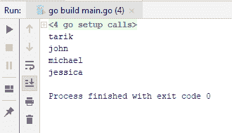
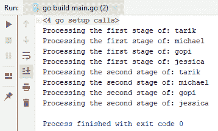
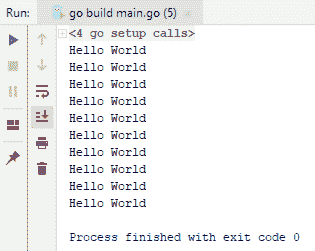
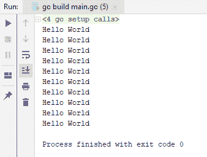
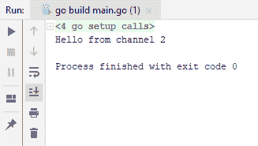

# 并发

Go 最强大的功能之一是其与 API 的并发性。在本章中，你将学习如何利用 Go 语言中的并发构造。本章将涵盖以下主题：

+   并发运行多个函数

+   在并发运行的功能之间传递数据

+   等待所有并发函数完成

+   选择并发函数的结果

# 并发运行多个函数

让我们从运行多个函数并发开始。

请查看以下代码块中的代码：

```go
import (
  "fmt"
  "time"
)

func main() {

  names := []string{"tarik", "john", "michael", "jessica"}

  for _, name := range names {
   time.Sleep(1 * time.Second)
   fmt.Println(name)
  }
ages := []int{1, 2, 3, 4, 5}
  for _, age:= range ages {
    time.Sleep(1 * time.Second)
    fmt.Println(age)
  }
}
```

从前面的代码中可以看出，有两个不同的列表；每个列表都有至少花费一秒钟完成的项目，但为了练习目的，我们不会实际编写代码，只是`fmt.Println`。我们在每个迭代中添加了`time.Sleep`一秒钟。如前所述的代码所示，我们首先处理名字，然后是年龄。你可以注意到，它们实际上并不相互依赖；它们实际上是两个不同的任务。所以，让我们继续运行它，看看在控制台上的效果如何：



如果你观察输出的过程，你会看到每一行输出在交付下一行之前都会等待一秒钟。你会看到，尽管它们实际上不依赖于彼此，但它们实际上是代码的连续片段。我们得等待循环完成，才能继续到第二个`for`循环。

我们可以通过使用并发模式使这个过程更具可扩展性和效率。为此，我们将使用 Go 中的 Go 协程。Go 协程比线程更轻量级，而且与线程不同，它们会自愿地交回控制权，而不是抢占式地交回。随着我们继续深入，你会更清楚地知道我确切的意思。请查看以下代码：

```go
package main

import (
  "fmt"
  "time"
)
func main() {

  go func() {
    names := []string{"tarik", "john", "michael", "jessica"}

    for _, name := range names {
      time.Sleep(1 * time.Second)
      fmt.Println(name)
    }
  }()

  go func(){
    ages := []int{1, 2, 3, 4, 5}
    for _, age:= range ages {
      time.Sleep(1 * time.Second)
      fmt.Println(age)
    }
  }()
  time.Sleep(10*time.Second)
}
```

如你所见，我们已经使用 Go 关键字和匿名函数将代码转换为独立的功能块，我们一直这样做。运行代码后，你将获得以下输出：



如你所见，输出不再是像之前那样按顺序出现，而是随机出现。这意味着两个循环都是并发处理的。

如果我们移除`time.Sleep`（使用`//`注释掉），我们将在控制台上看不到任何结果。这是因为主应用程序也是在 Go 协程下运行的，这意味着我们有三条 Go 协程：我们输入的两条和一条是整个主应用程序。正如之前提到的，问题是 Go 协程会自愿地将控制权交回其他 Go 协程，而不是抢占式地交回。这意味着当你使用`time.Sleep`时，控制权将交给其他 Go 协程，我们的系统将正常工作。

现在，如果我们用`1`秒代替上一次截图中的`10`秒，会发生什么呢？你将不会获得任何输出。这是因为`1`秒不足以让所有 Go 协程完成任务。一旦`main` Go 协程完成其过程，它就会关闭整个应用程序，并且没有给其他 Go 协程足够的时间来完成。有一种处理这种情况的方法，其中我们有一个称为通道的另一个结构。所以，为了简单起见，我们将移除第二个 Go 协程，现在使用通道。查看以下代码：

```go
package main

import (
    "time"
  "fmt"
)

func main() {

  nameChannel := make(chan string)

  go func() {
    names := []string{"tarik", "john", "michael", "jessica"}

    for _, name := range names {
    time.Sleep(1 * time.Second)
      //fmt.Println(name)
    nameChannel <- name
    }
  }()

  for data:= range nameChannel{
    fmt.Println(data)
  }
}
```

当你运行前面的代码时，你将得到以下异常：



这种异常的原因是，当你完成一个通道的使用后，你需要关闭它，否则`for`循环会一直等待。然而，因为你的 Go 协程已经完成了那个通道，循环将进入死锁状态并停止你的应用程序。所以，关闭通道的一种方法是通过添加以下高亮显示的代码行：

```go
package main

import (
    "time"
  "fmt"
)

func main() {

  nameChannel := make(chan string)

  go func() {
    names := []string{"tarik", "john", "michael", "jessica"}

    for _, name := range names {
    time.Sleep(1 * time.Second)
      //fmt.Println(name)
    nameChannel <- name
    }
    close(nameChannel)
    //nameChannel <- ""
  }()

  for data:= range nameChannel{
    fmt.Println(data)

    }

  //<-nameChannel
}
```

当一个通道被关闭时，循环将终止。所以，让我们继续运行并检查输出：



如你所见，这里没有出现任何异常，一切看起来都很正常。如果你不关心结果，并且如果你想使用我们的第一种方法，你可以使用以下代码：

```go
package main

import (
  "fmt"
  "time"
)

func main() {
  nameChannel := make(chan string)
  go func() {
    names := []string{"tarik", "john", "michael", "jessica"}
    for _, name := range names {
      time.Sleep(1 * time.Second)
      fmt.Println(name)
    }
    nameChannel <- ""
  }()
  <-nameChannel
}
```

我们所做的是将所有内容写入控制台，一旦循环完成，就设置`nameChannel`。此外，在这种情况下，我们等待从名称通道获取一些数据，因此我们不终止应用程序。一旦我们从名称通道获取一些数据，我们就读取它，实际上并没有将它分配给任何东西。当`main` Go 协程继续到下一行时，那里没有代码，因此`main`函数退出。因此，我们的应用程序关闭。你将获得以下输出：



这就是你可以使用通道和函数来进行并发操作的方法。在我们得出结论之前，让我们重申一下关于通道的一个要点。如果一个通道为空，而你尝试读取它，它将阻塞其 Go 协程。一旦它被填满，我们就可以从中读取一些内容；我们读取数据并继续。`main` Go 协程无法退出的原因是因为我们之前没有向它发送任何值，这比我们之前在示例中使用定时器要有效得多。

在下一节中，我们将看到如何在不同并发运行的功能之间传递数据。

# 在并发运行的功能之间传递数据

在本节中，我们将了解如何在 Go 协程之间传递数据。想象一下，我们有两个 Go 协程。第一个 Go 协程对数据进行一些操作，并将数据传递给另一个 Go 协程，该协程对数据进行第二阶段处理。现在，我们需要一种方法在第一个 Go 协程和第二个 Go 协程之间传递数据。正如你所看到的，我们可能需要在两个 Go 协程之间进行一些同步，因为第二个 Go 协程将不得不等待第二个 Go 协程提供一些数据给它。

首先，我们将使用以下代码：

```go
package main
import "fmt"
func main(){
  nameChannel := make(chan string)
  done := make(chan string)
  go func(){
    names := []string {"tarik", "michael", "gopi", "jessica"}
    for _, name := range names {
      // doing some operation
      fmt.Println("Processing the first stage of: " + name)
      nameChannel <- name
    }
    close(nameChannel)
  }()
  go func(){
    for name := range nameChannel{
      fmt.Println("Processing the second stage of: " + name)
    }
    done <- ""
  }()
  <-done
}
```

如果你查看代码，你可以看到我们再次使用了通道：`nameChannel`。由于我们需要从两个 Go 协程中访问 `nameChannel`，我们必须在 `main` 函数中声明它。在第一个 Go 协程中，我们将一些数据传递给 `nameChannel`，这个数据是 `name`。`name` 变量是一个包含一些数据的字符串数组，它来自第一个 Go 协程。在第二个 Go 协程中，我们将使用 `nameChannel` 并将其读取，就像它被填充一样。此外，我们还需要使用另一个 Go 协程来向主 Go 协程发出信号，表示所有 Go 协程都已完成（`done := make(chan string)`）。我们还需要使用 `close` 函数来终止应用程序，以避免任何死锁。当通道关闭时，`for` 循环将终止，Go 协程将向 `done` 变量发送一些数据。然后，我们的主 Go 协程将读取它，并继续到下一行，退出 `main` 函数，我们的应用程序将完成。这是无缓冲通道；也就是说，你可以在发送更多数据之前发送单个数据，该数据必须被读取和清空，否则它将被阻塞。

另一种方法是使用带缓冲的通道来提高性能。对前面代码的轻微修改将帮助我们。我们将添加整数 `5`，这意味着你可以发送五条数据到 `nameChannel` 而不需要等待。查看修改后的代码：

```go
package main
import "fmt"
func main(){
  nameChannel := make(chan string, 5)
  done := make(chan string)
  go func(){
    names := []string {"tarik", "michael", "gopi", "jessica"}
    for _, name := range names {
      // doing some operation
      fmt.Println("Processing the first stage of: " + name)
      nameChannel <- name
    }
    close(nameChannel)
  }()
  go func(){
    for name := range nameChannel{
      fmt.Println("Processing the second stage of: " + name)
    }
    done <- ""
  }()
  <-done
}
```

例如，它将发送一些数据，并且它不会等待，因为还有四个位置。因此，它将进入第二次迭代，并将数据发送到其中，直到计数达到 `5`。好事是，当我们向名称通道发送数据时，我们也会从它那里读取数据。以下将是输出：



这就是如何在多个 Go 协程之间传递数据。在我们下一节中，我们将了解如何等待所有并发函数完成。

# 等待所有并发函数完成

在本节中，我们将了解如何等待所有并发函数完成。假设我们有一段代码，如下所示：

```go
package main

import (
  "fmt"
  )

func main() {
  for i := 0; i < 10; i++ {
    go func(){
      fmt.Println("Hello World")
    }()
  }
}
```

假设我们想在循环中创建多个 Go 协程。在这种情况下，让我们假设我们想要有 10 个 Go 协程加上主 Go 协程，总共 11 个 Go 协程。如果你运行前面截图中的代码，你将找不到任何输出。

一种等待所有这些 Go 协程完成以便我们可以向控制台显示内容的方法是使用 `time.Sleep`，如下面的代码所示：

```go
package main

import (
  "fmt"
  "time"
)

func main() {
  for i := 0; i < 10; i++ {
   go func(){
      fmt.Println("Hello World")
    }()
  }

  time.Sleep(10*time.Second)
}

```

在运行前面的代码后，你将得到以下输出：



现在，你已经得到了一个输出，但这种方法的问题是你通常不知道所有 Go 协程完成需要多少时间；因此，你实际上无法预测时间。所以我们可以使用 Go 库本身提供的东西，那就是 `sync.WaitGroup`。正如其名所示，它基本上是一组等待，你可以用它来等待所有 Go 协程完成。查看以下代码：

```go
package main
import (
  "fmt"
  "sync"
)

func main() {
  var wg sync.WaitGroup
  for i := 0; i < 10; i++ {
    wg.Add(1)
    go func(){
      fmt.Println("Hello World")
      wg.Done()
    }()
  }
  wg.Wait()
}
```

所以，在这里，对于每次迭代，我们可以在我们的等待组中添加一个新的项目，在这种情况下将是 `1`。所以我们将基本上通过 `1` 增加这个 `WaitGroup` 中的等待次数。当一个 Go 协程完成时，它将通过 `wg.Done()` 信号，这将基本上将组中的等待次数减少 `1`。此外，`wg.Wait` 将阻塞主 Go 协程，直到所有我们的 Go 协程都完成。运行代码后，我们将得到以下输出：



这就是如何在你的应用程序中正确地等待所有 Go 协程完成的方法。在下一节中，我们将看到如何选择并发函数返回的结果。

# 选择并发函数的结果

在本节中，我们将看到如何选择并发排名函数返回的结果。假设我们在 `main` 函数中有两个 Go 协程，它们基本上是在设置自己的通道：`channel1` 和 `channel2`。让我们假设我们想要读取最先出现的内容，然后继续到下一行。为此，Go 提供了一个内置构造，称为 `select`，`select` 基本上等待一个通道被填充，看起来像是一个 `switch` 语句。所以，让我们看看它现在是什么样子：

```go
package main
import (
  "time"
  "fmt"
)
func main() {
  channel1 := make(chan string)
  channel2 := make(chan string)
  go func(){
    time.Sleep(1*time.Second)
    channel1 <- "Hello from channel1"
  }()
  go func(){
    time.Sleep(1 * time.Second)
    channel2 <- "Hello from channel2"
  }()
  var result string
  select {
  case result = <-channel1:
    fmt.Println(result)
  case result = <-channel2:
    fmt.Println(result)
  }
}
```

所以，你只需要说 `select`，比如说 `channel1`，当 `channel1` 准备就绪时，我们将做一些类似的事情，比如创建一个 `result` 变量，其类型为 `string`。所以，在这里，我将把 `channel1` 的值赋给 `result` 变量，该变量将通过 `Println` 打印到控制台。在第二种情况下，如果准备读取的不是 `channel1` 而是另一个 `channel2`，那么我们将读取它到我们的 `result` 变量中。`select` 语句将不会同时使用这两个情况；所以，例如，如果 `channel1` 和 `channel2` 同时准备就绪，那么 `select` 语句将随机选择其中一个。

由于`channel1`已经准备好，我们从`channel1`得到了输出`Hello`。如果我们再次运行代码，我们会得到`channel2`，正如你从下面的屏幕截图中所看到的：



因此，你可以很容易地看到输出中的随机性。这就是它的工作原理。

现在，可能会有一些情况需要你多次等待。在这种情况下，你可以使用循环：

```go
package main
import (
 "time"
 "fmt"
)
func main() {
 channel1 := make(chan string)
 channel2 := make(chan string)
go func(){
 time.Sleep(1*time.Second)
 channel1 <- "Hello from channel1"
 }()
go func(){
 time.Sleep(1 * time.Second)
 channel2 <- "Hello from channel2"
 }()
var result string
 for {
 select {
 case result = <-channel1:
 fmt.Println(result)
 case result = <-channel2:
 fmt.Println(result)
 }
 case <-quit:
 return
 }
}
```

想象一下，你正在编写一些需要不断等待某些传入数据的东西，当数据到来时，你想要将其写入控制台。或者，你可能想要对这些数据进行一些操作。在这种情况下，你可以在一个无限循环中等待它们。如果你想从这个循环中退出，你可以读取另一个通道，例如`quit`。如果`quit`已经存在，那么你可以直接跳出这个循环，或者如果它是一个函数，你可以使用`return`并从函数中退出。

所以，这就是你如何在 Go 中轻松读取来自多个函数的数据。这标志着我们并发章节的结束。

# 摘要

在本章中，你学习了如何在 Go 语言中使用并发构造。在下一章中，我们将学习系统编程，并从捕获信号开始。你还将学习如何使用 Go 处理命令行参数。
