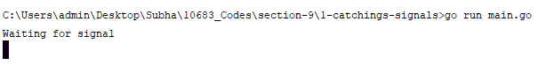
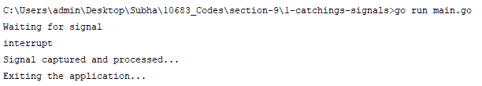
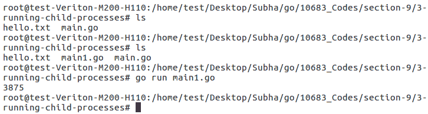
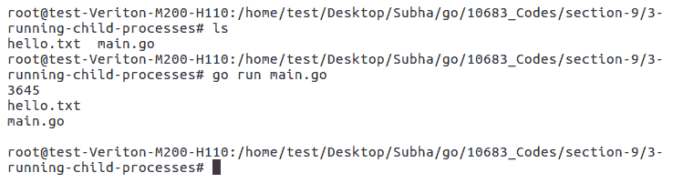
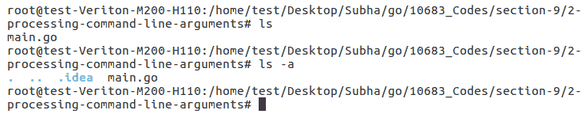
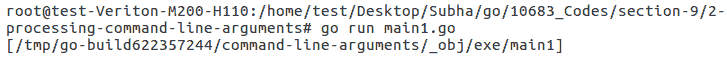
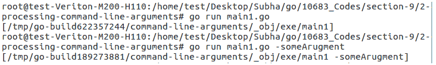
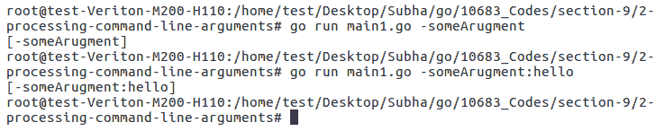
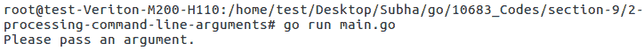
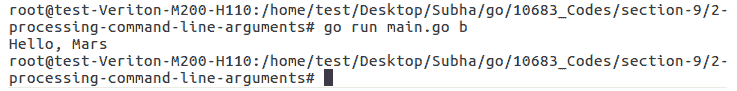

# 第九章：系统编程

系统编程允许你处理系统消息并运行处理任务。在本章中，你将学习如何使用 Go 处理命令行参数。本章将涵盖以下主题：

+   捕获信号

+   运行子进程

+   处理命令行参数

# 捕获信号

在我们深入探讨捕获信号之前，让我们了解什么是信号以及如何使用它们。信号是一种有限的进程间通信形式，通常用于 Unix 和类 Unix 操作系统。信号是一种异步通知，发送到同一进程或另一个目标进程中的特定线程，以通知它事件的发生。你可以出于各种原因捕获信号；例如，你可以捕获来自另一个进程的终止信号，以便在你的应用程序中执行一些终止清理操作。当涉及到 Go 时，Go 信号通知是通过在我们的通道上发送`os.signal`值来实现的。现在，让我们继续看看在我们的 Go 应用程序中它看起来是什么样子。

首先，我们将创建一个新的通道，称为 signals，并在其中使用`os.signal`。如果你想捕获多个信号，你可以使用一个带缓冲的通道，并输入 3 或 4 作为整数。如果你想一次只捕获一个信号，你可以输入 1，或者你可以只传递它，默认情况下将自动设置为 1。我们还需要其他一些通道来通知我们已经完成了信号处理，这样我们就可以终止我们的应用程序或执行其他操作。在我们的`signal`包中，有一个名为`Notify()`的方法，所以让我们继续看看文档，它说*Notify causes package signals to relay incoming signals to channel*。所以 Go 将自动监听信号并将这些信号关联到我们将作为其第一个参数提供的通道。现在，检查以下代码：

```go
package main
import (
  "os"
  "os/signal"
  "syscall"
  "fmt"
)
func main(){
  signals := make (chan os.Signal, 1)
  done := make(chan bool)
  signal.Notify(signals, syscall.SIGINT, syscall.SIGTERM)
  go func (){
    sig := <- signals
    fmt.Println(sig)
    fmt.Println("Signal captured and processed...")
    done <- true
  }()
  fmt.Println("Waiting for signal")
  <-done
  fmt.Println("Exiting the application...")
}
```

有参数可以过滤你想要监听的信号，即`syscall.SIGINT`和`syscall.SIGTERM`。此外，我们将创建一个 Go 协程，它将简单地监听这个信号并执行一个操作。此外，我们将读取信号的值并将信号的内容写入控制台。我们将添加一个`print`语句，表示`信号已捕获并处理...`。此外，`done <- true`将帮助我们处理信号。最后，我们将输入`print`语句`等待信号`，然后我们就完成了信号捕获和处理。让我们继续运行代码以获取输出。现在，我们将运行`main.go`应用程序，它将打印`等待信号`：



现在，我们可以使用*Ctrl* + *C*命令向应用程序发送信号以关闭它，正如你在下面的屏幕截图中所看到的，发生了中断。我们的中断被捕获并处理，现在我们退出了应用程序，这也可以在下面的屏幕截图中看到：



这就是如何在您的 Go 应用程序中捕获进程并使用信号的方法。在下一节中，我们将了解如何从 Go 应用程序中运行子进程。

# 运行子进程

在这个视频中，我们将了解如何在您的应用程序中运行子进程。在我们的应用程序中，我们将运行一个名为 `ls`（在 Linux 中）和 `dir`（在 Windows 中）的命令。`ls` 和 `dir` 命令是一个简单的应用程序，它会列出给定目录中的所有文件。因此，从我们的当前目录开始，它会给出 `hello.txt` 和 `main.go` 文件。我们将在我们的应用程序中运行这个 `ls` 实用程序。所以，我们首先必须使用 `exec` 包，它提供命令。我们现在将使用 `ls` 命令，并且现在不传递任何参数。这将返回命令本身。您将找到两个函数；一个是 `start`，另一个是 `run`。

`start` 和 `run` 的区别在于，如果您查看文档，您会看到 `run` 会启动指定的命令并等待其完成。根据您的需求，您可以选择 `start` 或 `run`。

我们还有 `PID`，即进程 ID，我们将将其输出到控制台。所以，让我们继续并运行代码。您可以看到以下内容：

```go
package main

import (
  "os/exec"
  "fmt"
  )

func main() {
  lsCommand := exec.Command("ls")
  lsCommand.Start()
  fmt.Println(lsCommand.Process.Pid)
}
```

您将得到以下输出：



如您所见，我们得到了进程 ID，但我们还没有看到目录中的文件。现在，让我们尝试 `run`。我们希望读取来自 `ls` 命令的任何内容，然后将其打印到控制台。我们将使用 `lsCommand.Output()`，它返回一个字节数组和一个错误，但现在我们将忽略错误。好的！现在让我们检查描述中的代码：

```go
package main
import (
  "os/exec"
  "fmt"
)
func main() {
  lsCommand := exec.Command("ls")
  output,_ := lsCommand.Output()
  lsCommand.Run()
  fmt.Println(lsCommand.Process.Pid)
  fmt.Println(string(output))
}
```

我们还将清除终端并检查输出：



如您所见，它给出了两个文件名和进程 ID。这就是您如何在您的 Go 应用程序中简单地运行一个进程的方法。当然，还有更多方法可以做到这一点。您可以运行其他类型的进程，例如 Google Chrome 或 Firefox，或者您开发的另一个应用程序。因此，这是一个非常强大的工具，您可能希望在需要从应用程序中启动进程时使用它。在下一节中，我们将了解我们如何处理命令行参数。

# 处理命令行参数

在本节中，我们将了解如何处理命令行参数。命令行参数的一个典型例子是 `ls -a`。在这里，`a` 是传递给我们的最后一个命令的命令行参数，而 `ls` 是操作系统中的一个程序。根据传递给 `ls` 命令的参数，它会以不同的方式运行。

例如，如果我们输入`ls`，它会显示所有可见的文件。如果我们输入`ls -a`，那么它将显示该目录下的所有内容，包括不可见的项目，如下面的截图所示：



因此，我们将对程序做同样的事情。您可以使用`os.Args`来读取传递给应用程序的参数。我们将读取和写入这些参数到控制台，并查看在向应用程序传递了一些参数之后看起来如何。我们首先需要清空终端并输入`go run main.go`。由于最初我们不会传递任何参数，我们可以预期只看到一个参数，那就是可执行文件的路径。然而，由于我们使用了`go run`，它将只创建一个临时可执行文件并为我们运行它，因此这是`temp`位置：



如果我们输入`go run main.go -someArgument`，我们将得到第二个项目，那就是`- someArgument`：



如果我们不关心第一个参数，我们可以使用`realArgs`：

```go
package main
import (
  "os"
  "fmt"
)

func main(){
  realArgs := os.Args[1:]
  fmt.Println(realArgs)
}
```

您将得到以下输出：



让我们继续检查一个真实世界的例子。假设我们只期望传递一个参数。检查以下代码：

```go
package main
import (
  "os"
  "fmt"
)
func main(){
  realArgs := os.Args[1:]
  if len(realArgs) == 0{
    fmt.Println("Please pass an argument.")
    return
  }
  if realArgs[0] == "a"{
    writeHelloWorld()
  }else if realArgs[0] == "b"{
    writeHelloMars()
  }else{
    fmt.Println("Please pass a valid argument.")
  }
}
func writeHelloWorld(){
  fmt.Println("Hello, World")
}
func writeHelloMars(){
  fmt.Println("Hello, Mars")
}
```

如您在前面代码中所见，我们输入了`realArgs[0] == "a"`，这将运行一个名为`writeHelloWorld()`的函数；如果它是`realArgs[0] == "b"`，那么它将运行`writeHelloMars()`，对于任何默认值，我们将打印警告`请传递有效的参数`。现在，我们将添加`writeHelloWorld()`和`writeHelloMars()`函数。此外，我们将使用内置函数来获取`realArgs`的长度，如果它是`0`，我们将打印`请传递参数`。完成这些后，我们需要添加一个`return`语句并退出。

运行代码后，您将得到以下输出：



如您所见，我们得到了第一条消息。如果我们输入`go run main.go a`，控制台将打印出`Hello, World`，如下面的截图所示：


如果我们输入`go run main.go b`，控制台将打印出`Hello, Mars`，如下面的截图所示：



这就是如何在 Go 应用程序中执行命令行参数处理。这标志着我们这一章的结束。

# 摘要

在本章中，您学习了如何捕获信号、运行子进程以及处理命令行参数。在下一章中，您将学习如何从互联网下载网页和文件。您还将看到如何创建文件和 Web 服务器，以及如何处理 HTTP 请求和响应。
