# 第十章：网络编程

在本章中，我们将看到涉及与互联网交互的有效食谱，例如下载网页、创建我们自己的示例 Web 服务器和处理 HTTP 请求。本章将涵盖以下主题：

+   从互联网下载网页

+   从互联网下载文件

+   创建一个简单的 Web 服务器

+   创建一个简单的文件服务器

# 从互联网下载网页

让我们从如何从互联网下载网页开始。我们将定义我们的 URL，它将是`golang.org`，我们将使用`net/http`包来获取此 URL 的内容。这将返回两件事：`response`和`error`。

如果你快速查看这里的文档，你会看到它发出一个`get`请求来指定 URL，它还根据响应返回一些 HTTP 代码：

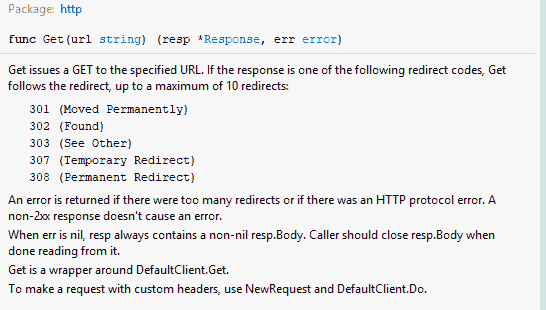

检查以下代码：

```go
package main
import (
  "net/http"
  "io/ioutil"
  "fmt"
)
func main(){
  url := "http://golang.org"
  response, err := http.Get(url)
  if err != nil{
   panic(err)
  }
  defer response.Body.Close()
  html, err2 := ioutil.ReadAll(response.Body)
  if err2 != nil{
    panic(err)
  }
  fmt.Println(html)
}
```

如果发生`err`错误，我们将调用`panic`，因此我们输入`panic(err)`，其中我们将`err`作为其参数。当一切完成后，我们必须关闭 body。让我们继续并在我们的终端中运行此代码以获取以下结果：


就像你看到的，它是一个字节数组，我们将将其转换为`string`：

```go
package main
import (
  "net/http"
  "io/ioutil"
  "fmt"
)
func main(){
  url := "http://golang.org"
  response, err := http.Get(url)
  if err != nil{
    panic(err)
  }
  defer response.Body.Close()
  html, err2 := ioutil.ReadAll(response.Body)
  if err2 != nil{
    panic(err)
  }
  fmt.Println(string(html))
}
```

如果我们现在运行代码，我们将获得以下输出：

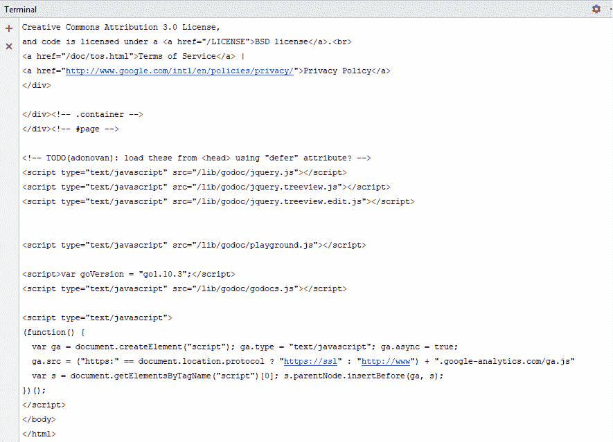

现在我们已经有了这个 HTML 源代码打印到我们的控制台，这就是如何使用 Go 简单地从互联网下载网页。在下一节中，我们将看到如何从互联网下载文件。

# 从互联网下载文件

在本节中，我们将看到如何从互联网下载文件。为此，我们将以下载一张图片为例。我们将输入图片的 URL，即 Go 的标志。检查以下代码：

```go
package main
import (
  "net/http"
  "os"
  "io"
  "fmt"
)
func main(){
  imageUrl := "https://golang.org/doc/gopher/doc.png"
  response, err := http.Get(imageUrl)
  if err != nil{
    panic(err)
  }
  defer response.Body.Close()
  file, err2 := os.Create("gopher.png")
  if err2 != nil{
    panic(err2)
  }
  _, err3 := io.Copy(file, response.Body)
  if err3 != nil{
    panic(err3)
  }
  file.Close()
  fmt.Println("Image downloading is successful.")
}
```

如你所见，我们在这里使用了`http.Get()`方法。如果我们的`err`不是`nil`，我们输入了`panic(err)`，并且我们将退出`defer response.Body.Close()`函数。在我们函数退出之前，我们将关闭`out`响应的 body。所以，我们首先要做的是创建一个新的文件，这样我们就可以将图片的内容复制到文件中。如果错误再次不是`nil`，我们将调用 panic，并使用`io.Copy()`。我们只是将图像下载成功写入控制台。

让我们继续运行代码以检查输出：

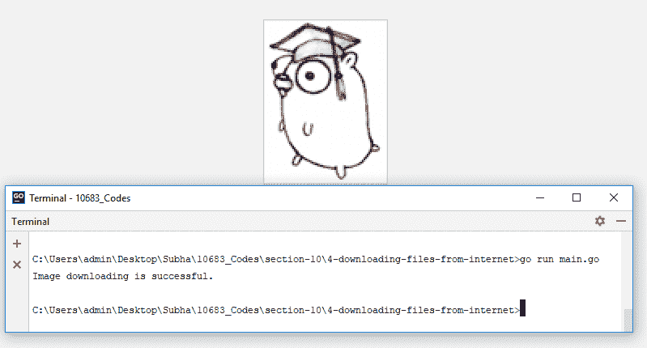

哇！下载成功。这就是如何使用 Golang 从互联网下载图片或任何类型的文件。在我们下一节中，我们将看到如何创建一个简单的 Web 服务器。

# 创建一个简单的 Web 服务器

在本节中，我们将看到如何使用 Go 创建一个简单的 Web 服务器。由于内置的 API，在 Go 中创建一个简单的 Web 服务器非常容易。首先，我们将使用 `net/http` 包。`net/http` 包有 `HandleFunc()` 方法，这意味着它将接受两件事。第一是 URL 的路径，第二是你想要处理传入请求的函数。请查看以下代码：

```go
package main
import "net/http"
func sayHello(w http.ResponseWriter, r *http.Request){
  w.Write([]byte("Hello, world"))
}
func main(){
  http.HandleFunc("/", sayHello)
  err := http.ListenAndServe(":5050", nil)
  if(err != nil){
    panic(err)
  }
}
```

只要你的方法签名满足 `func sayHello(w http.ResponseWriter, r *http.Request){}` 类型的方法，它就会被我们的 `HandleFunc()` 接受。我们将使用 `sayHello` 作为我们的函数，它将返回两件事，首先是一个 `http.ResponseWriter`，其次是请求本身作为指针。由于它将是一个问候服务器，我们只需将一些数据写回我们的响应，为此，我们将使用我们的响应写入器。由于我们必须监听特定的端口，我们将使用 `http.ListenAndServe.` 此外，我们使用了 `5050`；只要你选择的端口可用，你可以选择任何端口。我们还向函数中添加了 `nil`，如果发生意外情况，它将返回一个错误，如果错误不是 `nil`，我们将引发恐慌。所以让我们继续运行代码，并尝试使用我们的浏览器访问路径。我们首先需要运行我们的 `main.go` 文件并允许它，这样我们才能访问它：

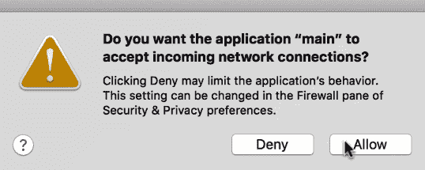

一旦完成，我们将在浏览器标签页中打开并尝试访问 `http://localhost:5050/`：

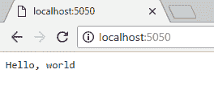

你将清楚地看到 `Hello, world`。现在，让我们再做一个带有查询字符串或 URL 参数的快速示例。我们将修改该方法，以便我们可以决定要向哪个行星说“你好”。请查看以下代码：

```go
package main
import "net/http"
func sayHello(w http.ResponseWriter, r *http.Request){
  planet := r.URL.Query().Get("planet")
  w.Write([]byte("Hello, " + planet))
}
func main(){
  http.HandleFunc("/", sayHello)
  err := http.ListenAndServe(":5050", nil)
  if(err != nil){
    panic(err)
  }
}
```

我们有一个带有查询功能的 URL。我们将读取查询字符串，也称为 URL 参数 `planet`，并将其值分配给一个变量。我们必须停止当前服务器并再次运行它。在打开 `http://localhost:5050/` 后，我们看不到任何行星的名字：

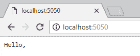

因此，你可以将 URL 更改为 `http://localhost:5050/?planet=World` 并再次尝试：

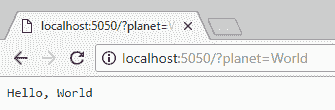

哇！现在让我们尝试使用行星 `木星`：

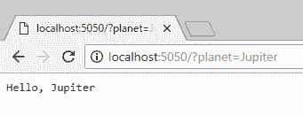

这就是我们在 Go 中快速创建自己的 Web 服务器的方法。

在我们的下一节中，我们将看到如何创建一个简单的文件服务器。

# 创建一个简单的文件服务器

在本节中，我们将看到如何创建一个简单的文件服务器。文件服务器背后的主要思想是提供静态文件，例如图片、CSS 文件或 JavaScript 文件，在我们的代码中，我们将看到如何做到这一点。请查看以下代码：

```go
package main

import "net/http"

func main() {
  http.Handle("/", http.FileServer(http.Dir("./images")))
  http.ListenAndServe(":5050", nil)
}
```

如您所见，我们使用了 HTTP 处理器，这里的 `Handle` 与 `handleFunc` 不同，它接受一个处理器接口作为第二个参数；第一个参数是 `pattern`。我们将使用一个特殊的 API，称为 `FileServer`，它在这里将作为一个文件服务器工作；我们将在服务器中添加一个位置（图片目录，`./images`）以提供静态文件。

因此，将要发生的事情是，当请求击中路由路径时，文件服务器将处理请求，并将在位置 `http.Dir("./images")` 下提供静态文件。我们将使用 `http.ListenAndServe(":5050", nil)`，就像在上一节中一样。此外，正如上一节中提到的，我们将运行服务器，允许权限，并在浏览器中输入 `localhost:5050`：

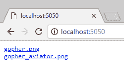

您可以在指定位置查看我们文件的列表，如果我们点击 gopher_aviator.png，它将给我们显示该位置的照片：

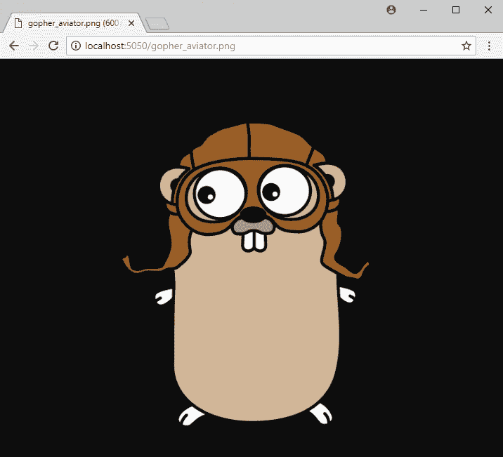

如果我们返回并点击另一个（gopher.png），它将显示以下图片：

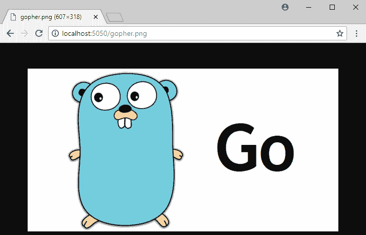

或者，您可以从前面的代码中注释掉 `http.Handle("/", http.FileServer(http.Dir("./images")))`，并将 `nil` 替换为位置。如果您按照我们之前的方法进行操作并检查浏览器，它仍然会正确地给我们显示这两张图片，这就是您如何在 Go 中创建一个简单的文件服务器的方法。

# 摘要

在本章中，您学习了从互联网下载网页、从互联网下载文件、创建一个简单的网页服务器以及创建一个简单的文件服务器。下一章将带您了解如何使用 Go 读取、更新、删除和创建关系型数据库中的数据的相关食谱。
