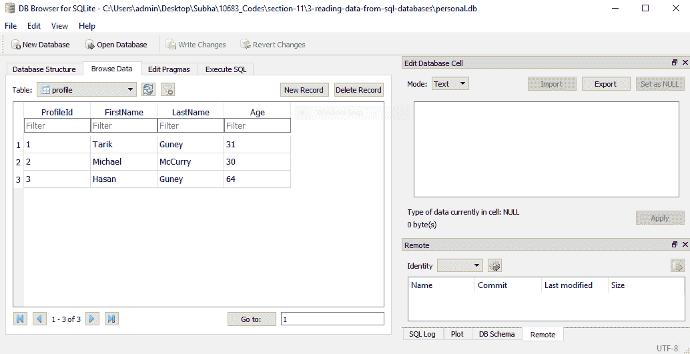
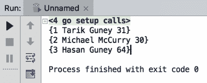
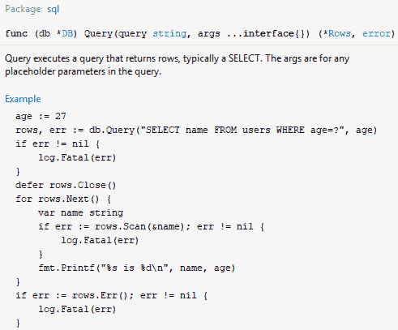
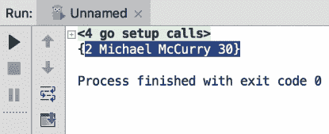
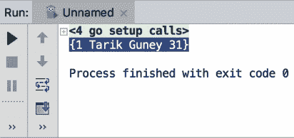
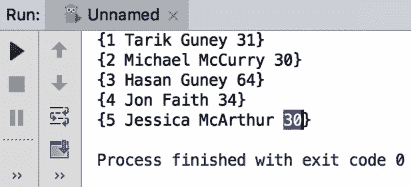
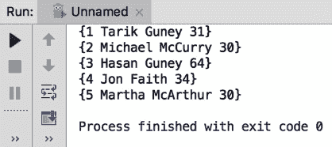
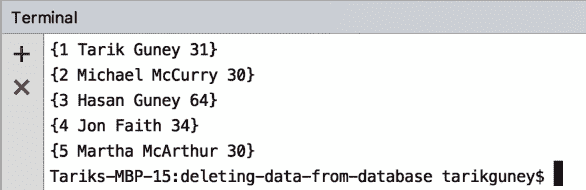
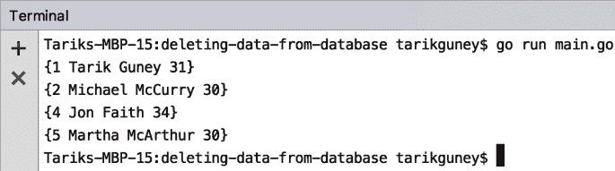

# 第十一章：关系型数据库

Go 可以与各种关系型数据库一起工作，包括 SQL Server、MySQL、PostgreSQL 和 SQLite。在本章中，我们将使用 SQLite。与更高级的数据库引擎相比，SQLite 可能稍微有限一些，但对我们来说已经足够了。在本节中，你将学习如何使用 Go 在关系型数据库中读取、更新、删除和创建数据。

本章将涵盖以下主题：

+   从数据库中读取数据

+   向数据库中插入数据

+   更新数据库中的数据

+   从数据库中删除数据

# 从数据库中读取数据

让我们从学习如何从 SQL 数据库中读取数据开始。在我们开始之前，我们必须创建一个名为 `personal.db` 的数据库。我们将使用一个 SQLite DB 浏览器，它允许我们创建新的 SQLite 数据库，编辑它们，添加新记录等等。你可以在 [`sqlitebrowser.org/`](http://sqlitebrowser.org/) 上找到更多关于这个工具的信息并下载它。这是一个免费工具，它支持 Windows、macOS 和 Linux。让我们从一个例子开始。查看以下截图：



在这里，我们只有一个表，称为 `profile`。在这个表上工作将足以让我们学习如何与 SQLite 数据库交互，然后你可以使用相同的技巧与 MySQL 或 SQL Server 交互。如果你查看截图，你可以看到我们有三个记录和四个列：`ProfileId`、`FirstName`、`LastName` 和 `Age`。`FirstName` 和 `LastName` 列是字符串，或文本，`Age` 列是数字，而 `ProfileId` 是我们的主键；它也是一个整数列。所以，让我们继续创建我们自己的结构体和代码：

```go
package main
import (_ "github.com/mattn/go-sqlite3"
  "database/sql"
  "fmt"
)

type Profile struct{
  ProfileId int
  FirstName string
  LastName string
  Age int
}
func main(){
  db, err := sql.Open("sqlite3", "./personal.db")
  checkError(err)
  var profile Profile
  rows, err := db.Query("select ProfileId, FirstName, LastName, Age from Profile")
  checkError(err)
  for rows.Next(){
    err := rows.Scan(&profile.ProfileId, &profile.FirstName, &profile.LastName, &profile.Age)
    checkError(err)
    fmt.Println(profile)
  }
  rows.Close()
  db.Close()
}
func checkError(err error) {
  if (err != nil) {
    panic(err)
  }
}
```

现在，让我们来解释一下代码。我们使用了结构体类型来将来自 SQL 数据库的数据映射到我们的内存对象。我们需要导入两个包：第一个是 SQL 数据库，第二个是 `go-sqlite3`。我们将进行一个空的或空白导入，这将自动移除 SQL 数据库导入，但这没关系，因为我们稍后会再次导入它。我们这样做的原因是，如果这个包中有初始化代码，它仍然会被执行。这个包将自己注册为底层的 SQL 驱动程序，所以我们将继续使用 SQL 数据库包作为我们的 API，但这个 API 将在幕后使用 `go-sqlite3` 包与我们的数据库交互，正如你将看到的，Go 中的数据库交互相当简单。所以，我们首先要做的是打开数据库。当我们使用 SQL 包时，你会发现它自动导入了我们的 SQL 数据库。

此外，我们将使用 SQLite 驱动程序，这是 SQLite 3 版本，我们还将指定数据库的位置。数据源名称可能会根据您使用的数据库类型而改变；它可能是一个 URL，但在我们的情况下，它是一个文件，因为 SQLite 与数据文件一起工作。所以，我们将输入`./personal.db`。我们还添加了错误检查实用函数，这样我们就不必一直检查错误。我们只需说`checkError`，错误就会被检查。我们将使用数据库查询来查询我们的数据库，这会返回两件事：其中之一是行，另一个是错误。数据库查询基本上接受这里的 SQL 查询。我们还将使用`for`循环和`rows.next`来迭代每一行，使用`rows.scan`来获取每一行的值。尊重从配置文件数据库中来的列的顺序是很重要的；如果您需要不同的顺序，您可以在`*`处指定它：`"select * from Profile"`。我通常建议明确指定每一行，而不是使用通配符（`*`）。

当您运行此代码时，您将获得以下输出：



如您所见，我们能够将数据库记录（`ProfileId`、`FirstName`、`LastName`和`Age`）捕获到表中。

现在，让我们快速看一下我们如何进行筛选。所以，我们将使用`where`子句，如果您了解 SQL，`where`子句用于筛选。我们将通过`ProfileId`进行筛选。看看这个方法的签名：



签名中的第二个参数是占位符的参数，由于它是一个非常古老的函数，只要您有匹配的占位符，您就可以提供尽可能多的参数。我们将添加`2`，正如您在下面的代码片段中可以看到的；您也可以使用变量名：

```go
var profile Profile
rows, err := db.Query("select ProfileId, FirstName, LastName, Age from Profile where ProfileID = ?", 2)
checkError(err)
```

现在，让我们继续运行修改后的代码：

```go
package main
import (_ "github.com/mattn/go-sqlite3"
  "database/sql"
  "fmt"
)
type Profile struct{
  ProfileId int
  FirstName string
  LastName string
  Age int
}
func main(){
  db, err := sql.Open("sqlite3", "./personal.db")
  checkError(err)
  var profile Profile
  rows, err := db.Query("select ProfileId, FirstName, LastName, Age from Profile where ProfileID = ?", 2)
  checkError(err)
  for rows.Next(){
    err := rows.Scan(&profile.ProfileId, &profile.FirstName, &profile.LastName, &profile.Age)
    checkError(err)
    fmt.Println(profile)
  }
  rows.Close()
  db.Close()
}
func checkError(err error) {
  if (err != nil) {
    panic(err)
  }
}
```

在运行前面的代码后，您将获得以下输出：



因此，我们从数据库中获取第二条记录。您也可以使用多个`where`子句，如下面的代码所示：

```go
package main
import (_ "github.com/mattn/go-sqlite3"
  "database/sql"
  "fmt"
)
type Profile struct{
  ProfileId int
  FirstName string
  LastName string
  Age int
}
func main(){
  db, err := sql.Open("sqlite3", "./personal.db")
  checkError(err)
  var profile Profile
  rows, err := db.Query("select ProfileId, FirstName, LastName, Age from Profile where FirstName = ? and LastName = ?","Tarik", "Guney")
  checkError(err)
  for rows.Next(){
    err := rows.Scan(&profile.ProfileId,   &profile.FirstName, &profile.LastName, &profile.Age)
    checkError(err)
    fmt.Println(profile)
  }
  rows.Close()
  db.Close()
}
func checkError(err error) {
  if (err != nil) {
    panic(err)
  }
}
```

您将获得以下输出：



完美！这正是我们预期的记录。这就是您如何在 Go 中轻松查询 SQL 数据库的方式。

在下一节中，我们将看到如何将数据插入 SQLite 数据库。

# 将数据插入数据库

在本节中，我们将了解如何将数据插入数据库。我们将使用我们在上一节中开发的代码，并添加一段新的代码，该代码将数据插入我们的 `personal.db` 数据库。我们将添加 `statement` 和 `err`，并使用 `insert` 语句将名字添加到我们的 `Profile` 表中。我们将指定要插入数据的列，但不会指定 `ProfileId`，因为它是表的键。我们将输入 `FirstName`、`LastName` 和 `Age`，而值将是占位符。我们还将使用 `statement.Exec` 并提供占位符的值，例如，`Jessica`、`McArthur` 和 `30`。以下是代码：

```go

package main
import (_ "github.com/mattn/go-sqlite3"
  "database/sql"
  "fmt"
)
type Profile struct{
  ProfileId int
  FirstName string
  LastName string
  Age int
}
func main(){
  db, err := sql.Open("sqlite3", "./personal.db")
  checkError(err)
  statement, err := db.Prepare("insert into Profile (FirstName, LastName, Age) values(?,?,?)")
  checkError(err)
  statement.Exec("Jessica", "McArthur", 30)
  var profile Profile
  rows, err := db.Query("select ProfileId, FirstName, LastName, Age from Profile")
  checkError(err)
  for rows.Next(){
    err := rows.Scan(&profile.ProfileId, &profile.FirstName, &profile.LastName, &profile.Age)
    checkError(err)
    fmt.Println(profile)
  }
  rows.Close()
  db.Close()
}

func checkError(err error) {
  if (err != nil) {
    panic(err)
  }
}
```

以下是上述代码的输出结果：



如您所见，我们的 ID 是 `5`，名字是 `Jessica`，姓氏是 `McArthur`，年龄是 `30`。这就是您如何简单地使用 Go 将数据插入数据库的方法。

在下一节中，我们将了解如何在数据库中更新现有数据。

# 数据库中的数据更新

在本节中，我们将了解如何在数据库中更新现有数据。我们将使用我们在上一节中开发的相同代码，但我们将更改一些字段。

我们将在 SQL 中使用一个 `update` 语句。因此，以下字段将会被更改：

```go
statement, err := db.Prepare("update Profile set FirstName = ? where ProfileId = ?")
checkError(err)

statement.Exec("Martha", 5)
```

更新我们的个人记录后，我们将列出 `profile` 表中的所有记录。如果您还记得我们之前的章节，最后一条记录的配置文件 ID 是 `5`，我们将对其进行更改。上一节输出中的最后一行是 `{5 Jessica McArthur 30}`，现在我们将更改更新代码中的名字：

```go
package main
import (_ "github.com/mattn/go-sqlite3"
  "database/sql"
  "fmt"
)
type Profile struct{
  ProfileId int
  FirstName string
  LastName string
  Age int
}
func main(){
  db, err := sql.Open("sqlite3", "./personal.db")
  checkError(err)
  statement, err := db.Prepare("update Profile set FirstName = ? where ProfileId = ?")
  checkError(err)
  statement.Exec("Martha", 5)
  var profile Profile
  rows, err := db.Query("select ProfileId, FirstName, LastName, Age from Profile")
  checkError(err)
  for rows.Next(){
    err := rows.Scan(&profile.ProfileId, &profile.FirstName, &profile.LastName, &profile.Age)
    checkError(err)
    fmt.Println(profile)
  }
  rows.Close()
  db.Close()
}
func checkError(err error) {
  if (err != nil) {
    panic(err)
  }
}
```

如果您运行代码，您将找到以下输出：



您可以看到我们已经成功将名字 `Jessica` 更改为 `Martha`。这就是您如何在 Go 中简单地执行更新操作。

在下一节中，我们将了解如何从数据库中删除数据。

# 从数据库中删除数据

在本节中，我们将了解如何从数据库中删除数据。我们仍将使用我们在上一节中开发的旧代码，并对它进行一些小的修改。查看以下代码：

```go
package main
import (
  _ "github.com/mattn/go-sqlite3"
  "database/sql"
  "fmt"
)
type Profile struct{
  ProfileId int
  FirstName string
  LastName string
  Age int
}
func main(){
  db, err := sql.Open("sqlite3", "./personal.db")
  checkError(err)

  var profile Profile
  rows, err := db.Query("select ProfileId, FirstName, LastName, Age from Profile")
  checkError(err)
  for rows.Next(){
    err := rows.Scan(&profile.ProfileId, &profile.FirstName, &profile.LastName, &profile.Age)
    checkError(err)
    fmt.Println(profile)
  }
  rows.Close()
  db.Close()
}
func checkError(err error) {
  if (err != nil) {
    panic(err)
  }
}
```

上述代码的输出将如下所示：



现在，要删除数据，比如本例中的行 `3`，您需要对代码进行一些更改。我们将使用 `statement`、`err` 和 `statement.Exec` 对代码进行小的修改。

因此，为了实现我们的目标，我们将使用以下修改后的代码：

```go
package main
import (
  _ "github.com/mattn/go-sqlite3"
  "database/sql"
  "fmt"
)
type Profile struct{
  ProfileId int
  FirstName string
  LastName string
  Age int
}
func main(){
  db, err := sql.Open("sqlite3", "./personal.db")
  checkError(err)
  statement ,err := db.Prepare("delete from Profile where  ProfileId = ?")
  checkError(err)
  statement.Exec(3)

  var profile Profile
  rows, err := db.Query("select ProfileId, FirstName, LastName, Age from Profile")
  checkError(err)
  for rows.Next(){
    err := rows.Scan(&profile.ProfileId, &profile.FirstName, &profile.LastName, &profile.Age)
    checkError(err)
    fmt.Println(profile)
  }
  rows.Close()
  db.Close()
}
func checkError(err error) {
  if (err != nil) {
    panic(err)
  }
}
```

您可以看到我们使用了 `db.Prepareand`。我们提供了来自 `profile` 的参数，其中 `ProfileId` 是占位符。我们还使用了 `statement.Exec`，这将使用参数执行；确保参数的数量与您在代码中放置的占位符数量相匹配。让我们运行代码并检查输出：



因此，如果你比较这两个输出，你可以看到我们已经成功删除了第三个条目，现在我们只有`4`个条目，第三个条目已经被删除。这就是你如何简单地从数据库中删除数据的方法。

# 摘要

这基本上就是我们的书的总结。你已经学到了很多关于 Go 语言的知识，现在你可以有效地在各种场景中使用这些知识。通过遵循本书中包含的简洁且易于理解的食谱，你现在可以克服开发者面临的最常见挑战。祝你好运！
