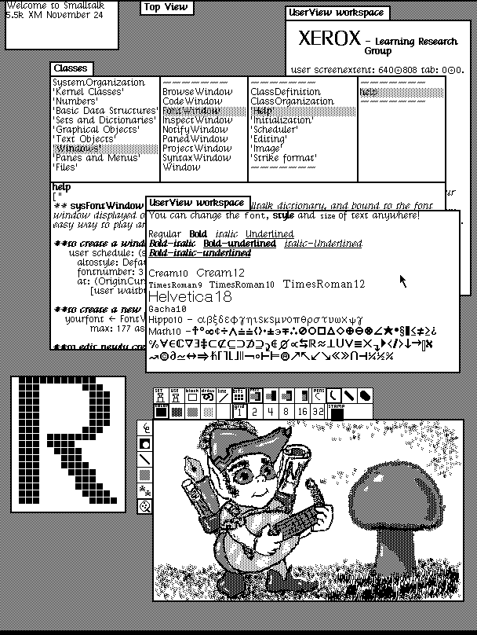
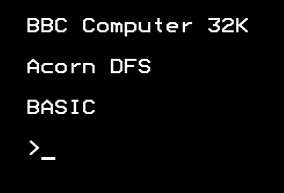
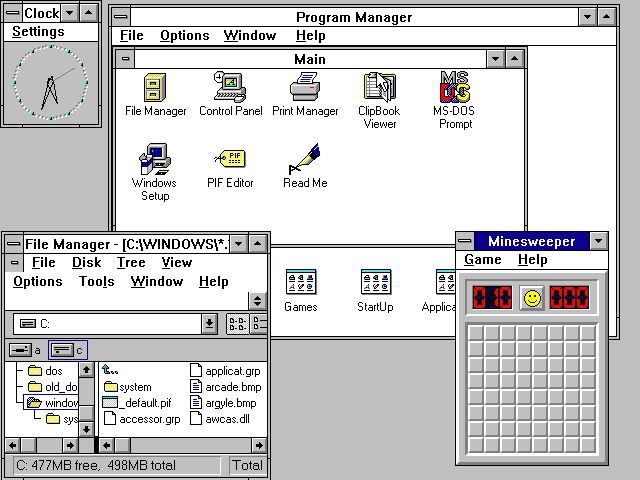
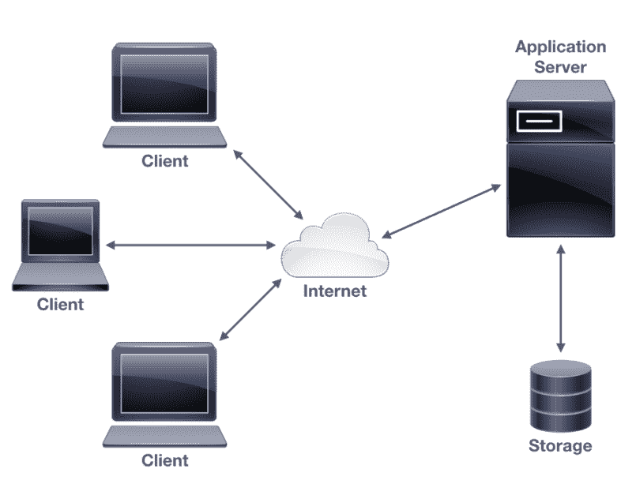

# 第一章：本地图形应用程序的好处

自从它们在 20 世纪 70 年代首次出现以来，很明显图形界面使与软件应用程序的工作变得更加容易。在早期，它们通常通过**窗口、图标、菜单和指针**（**WIMP**）界面呈现。尽管这些界面在设计上跨平台和时间有所变化，但交互相对一致。

软件开发中的近期变化增加了对用户体验的理解，这侧重于创建即使是经验最少的计算机用户也能直观使用的应用程序。这与推动计算机交互向后 WIMP（窗口、图标、菜单和指针）方法的移动相结合，引发了一个问题：桌面计算机软件的下一步是什么？

本章将涵盖以下主题：

+   图形用户界面（**GUIs**）的历史，涵盖桌面、网页和移动

+   优秀集成和响应式应用程序界面的重要性

+   用户对在线和离线本地应用程序的期望

+   开发者构建本地图形应用程序的好处

# 图形应用程序的回归

<q>"预测未来的最佳方式就是创造它。"</q>

<q>- 帕洛阿尔托研究中心的艾伦·凯</q>

那是 1973 年，**帕洛阿尔托研究中心**（**施乐 PARC**）刚刚完成了 Alto 计算机，这是第一个商业化的计算机 GUI 示例。尽管屏幕方向和缺乏颜色使其在现代人的眼中显得有些奇特，但它显然是一个图形界面，具有鼠标和键盘进行交互。尽管它花了另外七年才对公众普遍可用，但在 1981 年，作为施乐 Star，很明显这是某件大事的开始：

Dynabook 环境桌面（1976 年；在 Alto 上运行的 Smalltalk-76）。版权 SUMIM.ST，许可 CC BY-SA 4.0。

这是对计算机可用性的一次巨大飞跃——从标准文本模式计算机屏幕交互中迎来的一次欢迎的变化。图形界面不仅允许更高级的功能，而且对于想要入门的新手来说，学习起来也容易得多。尽管命令行界面在程序员和其他专家中仍然很受欢迎，但可以公平地说，如果没有 GUI，个人电脑就不会达到我们今天所知的这种普及程度：

传统的文本模式（命令行）界面在 20 世纪 80 年代中期仍然很常见

# 个人电脑

在施乐 Star 公开发布后的 10 年里，出现了许多图形平台，包括微软 Windows、苹果 Macintosh、X11（最初为 UNIX 计算机在麻省理工学院启动）和 DRI 的 GEM（主要用于 Atari ST）。尽管每个平台的背景都不同，但它们都拥有一个共同的目标，即为用户提供一个桌面环境，使用户能够同时与多个图形应用程序进行交互。

这是新兴的**个人电脑**（**PC**）市场的一个定义性特征，并引领了一个全新的计算机软件世界：

微软工作组 Windows 3.11。在此特别感谢微软的授权使用。

随着个人电脑（**PC**）变得更加强大，硬件的进步支持了更复杂的软件应用。更高分辨率的屏幕允许显示更多信息，可移动存储设备（如软盘、CD 和后来的 USB 闪存盘）使得在应用程序之间传输更大的数据集成为可能。曾经常见的简单界面和少量选项变得更为复杂和复杂。

默认的图形界面元素和布局需要扩展以保持同步。菜单变得更大，工具栏被引入以突出显示常见任务，内置的帮助系统变得必要，以帮助用户完成他们的任务。我们还看到平台开始展现自己的个性，这导致学习新软件时遇到额外的障碍。一个普通的现成软件产品通常附带的说明书比这本书还要长，解释如何与其各种功能交互。

# 从桌面到互联网

在 20 世纪 90 年代中期，万维网（将成为我们的全球通信平台）刚刚起步，个人电脑市场开始出现各种网络浏览器。这些浏览器最初以软件包的形式（在软盘上）分发，后来作为桌面环境的一部分（预装在新电脑上）。Mosaic、Netscape Navigator 和 Internet Explorer 相继出现，为早期采用者提供了进入新兴信息渠道的途径。在当时，主要是学术文本和参考资料；你需要知道在哪里寻找东西，并且与早期计算机使用类似，它并不特别直观。

然而，变得清晰的是，这种新媒体开始促进通信和信息交流的未来。人们开始意识到，成为该领域的主导技术将是至关重要的；于是，*浏览器大战*开始了。随着网络浏览器争夺首位，这项技术被嵌入到桌面平台上，作为一种快速提供精美内容的方式。最初，那些笨重的用户手册被转移到 HTML（网页语言）中，并捆绑在软件下载中，然后每个应用程序的功能越来越多地转移到线上。随着互联网连接在大多数家庭中变得司空见惯，我们看到了基于全网页的应用程序的兴起。

一个网络应用程序是指不需要在您的计算机上安装除互联网浏览器以外的任何软件的应用程序。它们总是直接从源头提供最新信息。这通常根据您的位置、偏好，甚至是在网络应用程序或合作伙伴公司的浏览历史中进行定制。此外，提供网络应用程序的公司可以随时对其进行改进；通常，在公司在实验中看到哪个版本的应用程序具有更好的用户体验后，会进行实验。以下插图展示了一个通过网络交付的应用程序的可能架构。

简单的网络应用程序架构

随着基于网络的程序背后的技术的发展，它们成为了桌面软件的有力替代品。软件公司开始意识到，通过网站直接交付产品比传统的下载模式要容易得多。不仅如此，这也意味着一个产品几乎可以在任何计算机上运行。过去尝试创建一次编写、在任何地方运行的平台（如 Python 和 Java）在当时取得了巨大成功，但后来随着网络技术的复杂性达到一定水平，很明显，跨平台解释器所需的性能惩罚和分发开销使得网络应用程序在可能的情况下更具吸引力。

# 智能手机、应用程序和客户保留

很长一段时间，网站似乎是为交付软件产品而设的未来，直到智能手机的出现。一旦移动电话技术发展到可以在手掌中访问网站的程度，基于网络的程序的需求再次发生了变化。现在，开发者需要考虑如何在小屏幕上呈现有意义的内客。基于触摸屏的用户界面如何在以前假设鼠标和键盘的地方操作？当人们只有五分钟等待咖啡订单时，他们如何以有意义的方式进行互动？

在桌面浏览器和手机上提供单一应用程序，跨越众多不同的操作系统和设备，对开发者来说具有明显的优势，但也存在挑战。互联网是一个非常大的地方，你的产品很容易在噪音中迷失；你如何吸引新用户，以及如何确保现有客户持续回来？对此的一个主要回应是，为移动设备引入了*原生应用*（为特定平台设计和构建的应用程序）。iPhone 最初只提供基于 Web 的应用程序，但八个月内，苹果为开发者提供了构建原生应用程序的能力。这些应用程序为用户提供了一种更有意义的互动；它们是为运行的设备设计的，可以通过市场或*应用商店*轻松找到，一旦安装，就会在设备的主屏幕上持续提醒。

因此，我们进入了一个时代，我们的目标受众已经习惯了为他们的设备专门设计的软件。如果公司希望吸引并留住客户，那么一个精致的用户体验是必不可少的。等待页面加载或处理间歇性错误已经成为用户不再愿意忍受的小麻烦。对于软件交付的更高标准现在是一个被广泛理解的现象，但通过移动设备交付的软件质量提升尚未在桌面端得到体现。直到最近，浏览器仍然是王者；长列表的网站书签被用来替代期望通过商店交付并安装到计算机上的应用程序。然而，这种情况正在改变，我们将探讨如何通过精美的桌面应用程序提供优质用户体验。

# 原生性能

<q>"用户真的很重视速度。"</q>

<q>- 玛丽莎·梅耶，谷歌副总裁</q>

企业经常选择基于网站的方法的主要原因之一是避免为他们希望支持的多个平台构建许多产品。我们在移动应用程序开发中也看到了类似的方法：随着更多平台进入市场，开发原生应用程序成为许多企业负担不起的开支。他们选择基于 Web 的方法或*混合应用*，用户认为他们安装的是一个原生应用，实际上只是一个打包成下载的网站。虽然这可以满足简单应用程序的基本数据处理，但通常无法满足用户期望。此外，Web 浏览器的交互模式通常与周围的系统应用程序不同。如果用户期望应用程序以某种方式运行，那么嵌入式 Web 浏览器可能会提供一种令人困惑的体验。

通过网络技术（通过浏览器或下载的应用程序）交付大型应用的最大挑战是实现良好的性能。由于浏览器主要是为信息交换而设计的，它并不适合大量数据处理或复杂的图形表示。当通过网络浏览器交付时，其中许多可以由具有运行复杂计算能力并将摘要返回给用户的远程服务器执行。不幸的是，当你运行本地应用时，这不能被依赖，并且用户期望在他们的应用程序中立即获得结果（记住，这不仅仅是一个浏览器窗口，在等待时可以打开很多标签页进行浏览）。此外，回想一下基于网络交付的一个好处——不断更新软件而无需分发问题的机会？虽然这对开发来说可能很好，但你的客户可能不希望界面不断变化；他们希望控制何时（以及是否）更新他们的系统。

在那些需要大量计算或复杂图形显示的应用中，大多数网络应用很难达到用户期望的运行速度。本地应用，由于是为它们所运行的计算机编译的（并且已经预先下载，因此无需等待），目前是获得高性能的最佳方式。存在各种虚拟化技术，旨在通过单个应用程序提供接近本地性能（例如，Java），但这并不总是合适或足够的，并且常常出现副作用，如漫长的启动时间或巨大的下载量。既然你选择了阅读这本书，你可能已经意识到另一种方法：一种允许你编写单个应用程序，但又能将其编译成支持任何平台的高性能本地应用程序的语言。

# 集成用户体验

一致的用户体验对于用户能够快速上手软件至关重要。当软件被编程以匹配系统设计和布局，以及使用标准组件时，新用户更容易理解应用程序可能的工作方式，而无需查阅那些沉重的用户手册。大多数流行操作系统的图形用户界面都经过精心设计，使得为它们编写的应用程序会感觉*自然*。用户应该本能地识别设计语言，并立即知道如何完成大多数主要任务。精心设计的平台，如 macOS 或 Windows 10，提供了一套工具，确保使用它构建的应用程序对用户来说会立即熟悉。这包括诸如如何选择文件打开、复制粘贴复杂文件类型时应该发生什么，以及如果项目被拖放到其窗口中，应用程序应该如何响应等外围项目。这些功能中非常少的是提供给或正确利用基于 Web 或命令行应用程序的。

对于专业应用程序制作者来说，还需要考虑辅助技术。使用平台标准工具包构建的 GUI 与提供的（或补充的）辅助技术增强器（如屏幕阅读器或盲文设备）一起工作。网页和基于文本的应用程序通常需要更加努力才能支持这些技术。记住，您的网页或混合应用程序将在其上加载的每个平台可能都有非常不同的标准辅助技术行为。使用目标平台工具构建图形应用程序通常会使您的用户受益，无论他们是否直接使用您设计的界面，还是通过辅助选项使用。

# 可靠性和离线功能

优秀应用程序的一个好处是它们能够在在线和离线状态下工作，甚至可以处理不可靠的互联网连接。例如，允许撰写但不需要互联网直到你发布的博客应用程序，或者文档编辑器在您在线时下载您的工作并共享您所做的任何更改，与始终在线的任何 Web 应用程序相比，具有显著的优势。台式计算机甚至最新的智能手机都有显著的计算能力和存储能力，作为应用程序开发者，我们应该充分利用可用的资源。用户体验不仅限于设计和系统集成，还包括应用程序的响应性和工作流程。如果我们能够隐藏过程或技术的复杂性，让最终用户无法察觉，我们可能会发现他们经常回到该应用程序——即使他们的互联网连接目前不可用。

虽然缓存（为离线工作保留下载内容）是一个相对容易解决的问题，但同步（结合来自各个位置的所有更改）则不是。幸运的是，原生应用程序有工具可以帮助完成这项复杂的任务，无论是通过平台工具包（如苹果的 iCloud 的 CloudKit）还是通过使用第三方技术（如 Dropbox 的 API 或 Firebase 为 iOS 和 Android 提供的离线功能）。由于移动应用程序的流行度急剧上升，大多数开发都集中在那里，但这些技术同样适用于桌面上的原生应用程序。

网络技术持续在提供更高的可靠性和离线功能方面取得进展，但它们距离满足对原生图形应用程序的期望标准还有很长的路要走。

# 可维护性和测试

<q>"机遇只青睐有准备的大脑"

- 路易·巴斯德</q>

为了支持软件开发的速度、技术的演变以及用户对更多功能的期望，我们的软件必须具有良好的组织结构和高度的可维护性。你的团队中的任何一个人，或者你自己在未来的某个时刻，都应该能够轻松理解代码的工作方式，并快速进行所需的变化或添加。支持这种未来的发展需要一个组织良好的项目和投入时间来维护标准。

原生应用程序通常使用为它们构建的平台的单一种语言编写。这种限制意味着整个应用程序可以遵循标准的布局、命名和语义约定，这使得对软件的任何部分进行工作都更容易。模块化和代码重用更容易实现，因此项目内部不太可能出现重复或不完整更改的问题。现在已被广泛使用的测试驱动开发方法，不需要代码库中的单一语言就能很好地工作，但实现它的工具根据语言的不同而有所变化，每个项目只支持一个设置是有益的。

其他形式的图形应用程序（主要是基于网络的）使用多种语言的原因也是它们更难测试的原因：它们的界面是通过网络浏览器（或嵌入式 HTML 渲染器）呈现的，这在不同平台之间可能有很大的差异。无论硬件的年龄或使用的设备类型如何，人们都会期望你的应用程序快速加载并看起来正确。这意味着需要处理很多变化，并且每个变化都需要进行大量测试。与此相比，原生图形应用程序的目标设备是已知的，并且由用于开发的工具包完全支持。测试更容易、更快，因此可以快速且自信地进行更改。原生图形应用程序确实是制作美丽、响应式应用程序的最佳方式，这些应用程序将激发目标受众的喜悦。

# 摘要

在 20 世纪 70 年代初，随着第一个图形用户界面的出现，计算机变得更加易于访问，从那时起，开发者和设计师一直在寻找改进用户体验的方法。随着技术的进步，焦点从桌面应用程序转移到了基于 Web 的软件和移动应用。在每一次的发展变化中，我们都看到了使应用程序响应、可靠和吸引人的需求。在本章中，我们探讨了图形用户界面的历史以及原生应用程序如何继续提供最佳的用户体验。

通过使用原生技术创建高质量的图形应用程序，开发者能够提供更好的可靠性和更响应式的用户界面。确保应用程序能够无缝集成到操作系统中，同时在线和离线都能良好运行，将提供一致的流程，让您的用户保持满意。我们还看到，原生应用程序的结构和格式可以造福软件开发者和支持流程，确保产品质量更高。

在下一章中，我们将发现这些好处如何在图形应用程序中创造出来，以及它们可能带来的挑战。我们将比较各种处理这些复杂性的方法，并概述在设计现代原生图形用户界面时需要做出的某些决策。
