# 图形用户界面挑战

在上一章中，我们探讨了图形用户界面的历史，了解了它们是如何演变的以及为什么它们可以比当代替代品提供更好的用户体验。不幸的是，尽管图形应用程序对最终用户有很多好处，但它们会给设计和构建它们的团队带来许多挑战。在本章中，我们将探讨团队在创建平均复杂度的图形应用程序的各个阶段可能面临的问题。

本章将涵盖以下主题：

+   选择与操作系统或产品品牌相匹配的外观和感觉

+   应用程序布局的不同方法和多个窗口

+   并发和云服务集成的挑战

+   在为多个平台开发图形应用程序时引入的 overheads

# 标准外观和感觉或应用程序主题

在设计你的图形应用程序时，一个早期的问题可能是关于视觉身份；应用程序是否应该符合操作系统的外观和感觉，或者它应该有自己的品牌？你希望为用户界面工作一个完整的主题，用户会认同它，还是希望利用用户操作系统的精心制作和普遍理解的界面元素？

就像我们在本章中会遇到的大多数问题一样，没有正确或错误的答案，你选择的任何路径都会有正面和负面的影响。完全使用标准组件可能会使开发更快，并且对用户来说更容易理解，但你如何使你的应用程序与其他应用程序区分开来？如果你从头开始设计完整的应用程序界面，那么你将为软件开发一个良好的品牌识别度，用户会认出它，但这可能需要他们更长的时间来学习，并且可能在目标平台上看起来不合适。

不同的设计方法通常适合不同类型的应用程序。游戏明显依赖于高度定制的图形界面，很少使用标准组件，但他们的用户，游戏社区，理解该类别的标准交互，因此不需要使用操作系统默认元素提供的常见视觉提示。实用应用程序（那些你在当前工作中快速完成任务时加载的应用程序）将受益于融入其中，这样操作它们时几乎不需要思考，并且不需要将任何身份与体验相关联：


微软 Excel 使用系统组件和品牌身份的混合。经微软许可使用。

假设你已经决定你的视觉设计是适合标准化外观还是需要更定制化的方法，你需要考虑你将部署的平台。这是一个为单一操作系统设计的应用，还是为多个操作系统设计的？如果你的软件只能在 Windows 上运行，那么使用标准的外观和感觉显然是可行的，但如果你在寻找跨平台分发呢？macOS 看起来与 Windows 截然不同，而 Windows 又与平均的 Linux 桌面不同。你将针对哪个？或者，你选择在所有平台上使用相同的界面设计？

跨平台 GUI 设计的复杂性不是一个新问题，但在设计应用体验时，它确实需要一些思考。如果你有一个适用于你的品牌或应用的标准化界面设计，它是否能在不同的操作系统上一视同仁呢？或者，如果你旨在在每个平台上使用标准组件，你将如何确保一致的用户体验，以及你将投入多少时间到支持材料或客服台？

当 Java Swing 是跨平台图形应用的标准时，它们的做法是独特的：允许开发者针对标准 API 编写代码以构建 GUI，但提供使其在不同平台上有不同呈现模式的能力，以保持跨平台的一致性，或者与它运行的系统融为一体。这意味着同一个应用可以被配置为在所有操作系统上看起来都一样，或者适应当前的桌面环境。不幸的是，这种方法有其局限性，因为它最终提供的是一组最低的共同功能集。除非它是所有支持操作系统的特性，否则一个区域的高级集成在跨平台应用中是不可用的。

此外，用户界面设计在操作系统外观发生剧烈变化的情况下可能会显得过时（例如，微软 Windows 从 Vista 到 7 再到 10 的转变，每个版本都有相当独特的样子）：

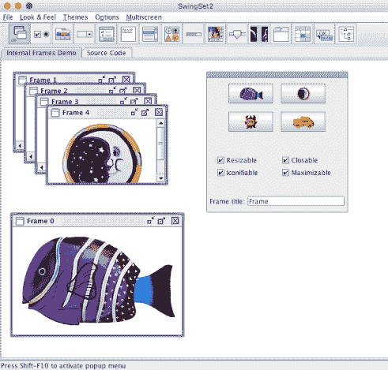

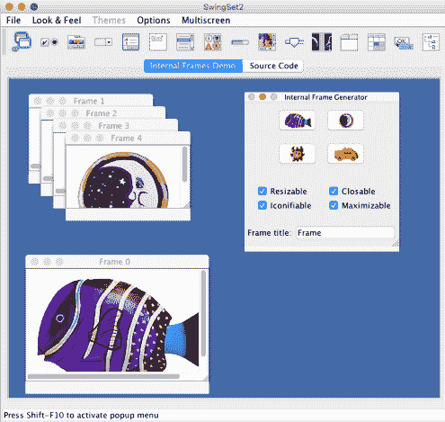

Java Swing 演示 - 顶部为跨平台外观（金属），底部为 macOS 系统外观

随着时间的推移，构建图形应用的方法越来越多，大多数编程语言都有很多选项。有些是为使用系统样式而设计的，有些则偏好自己的图形样式，而有些则留给开发者或用户偏好。因此，你必须做出选择：你希望你的应用融入标准操作系统的外观，还是你希望实现一个在每个系统上看起来都一样的品牌身份或设计？我们将在这本书的第二部分和第三部分中探讨这两种选项，即*使用现有小部件的工具包*和*现代图形工具包*。

# 图形用户界面和视觉层次结构

软件的图形语言和常见的视觉布局在消费软件产品的近期历史中已经发生了很大的变化，并且仍在不断发展。每个操作系统和图形工具包都专注于可用性，同时试图拥有独特的风格。这些原则推动了每个平台以略微不同的方向前进，这影响了我们所编写的软件和我们所呈现的内容。

# 多个文档

让我们先看看应用程序可以如何处理多个并发文档。这些界面都旨在同时处理多个文档的方式。无论是文字处理器、图像编辑器还是网页浏览器，都有许多方法可以做到这一点。操作系统通常有一个默认行为，鼓励应用程序开发者使用（有时通过推广最新的变化来提高可用性，有时通过在其各自的工具包中添加或删除 API）。这些界面偏好可能会随时间变化，但也可以围绕某些应用程序类别标准化。例如，在它们历史的早期，微软推广了 Windows **多文档界面（MDI**）布局，这种布局在文字编辑器和 **集成开发环境（IDE**）中仍然很受欢迎：

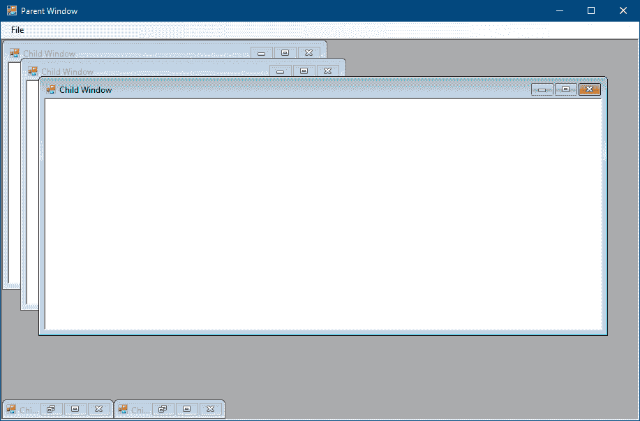

使用 Microsoft Windows MDI 布局的示例应用程序

鼓励开发原生 macOS 应用程序的开发者为每个文档使用一个新窗口，但将它们分组在同一个应用程序下，这样用户只看到一个将它们分组的图标：

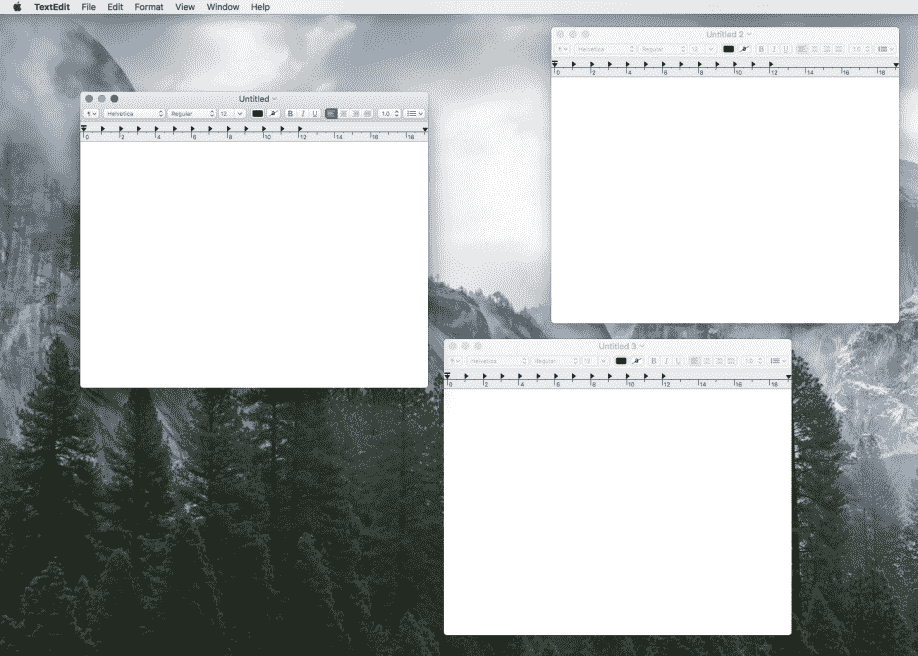

macOS 中多个文档作为单个应用程序的窗口加载

Chrome 网络浏览器决定将它们的标签显示集成到窗口标题栏中，这个空间通常只显示应用程序或加载文档的标题：

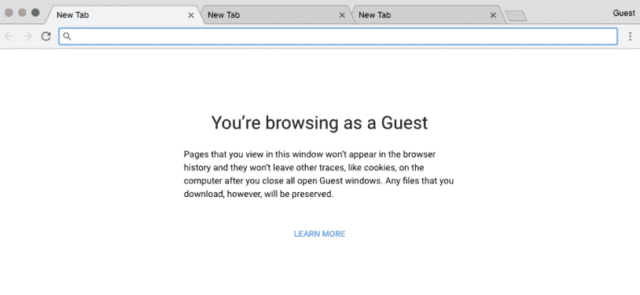

这张 Chrome 截图显示了加载网页标签显示的独特外观

在所有这些可能的方法中，哪一种适合您的应用程序？如果您必须处理多个文档，查看管理类似文件类型的应用程序或比较同一环境中各种应用程序如何处理窗口管理是值得的。

# 附加窗口

工具箱的位置和与常见功能区域相关的功能的分组也存在显著的差异。多年来，出现了许多迭代，如抽屉（从窗口滑出）和弹出对话框窗口（在上下文很重要但工具使用较少的地方仍然使用），但始终可见的工具栏或附加窗口仍然是最受欢迎的。

例如，为 Linux 和 Unix 桌面设计的应用程序通常使用单独的窗口为每个支持的工具面板呈现：

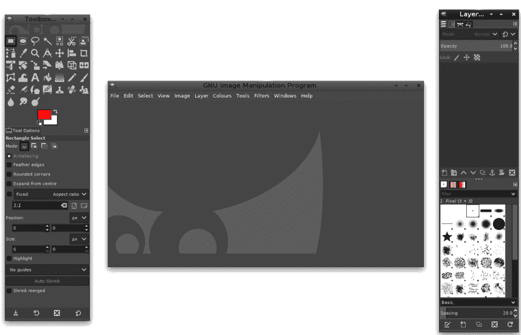

在 Gimp 这个流行的开源图像处理程序中，通常使用多个窗口

与通常在文档窗口的边缘定位控件的综合布局的 Windows 软件相比：

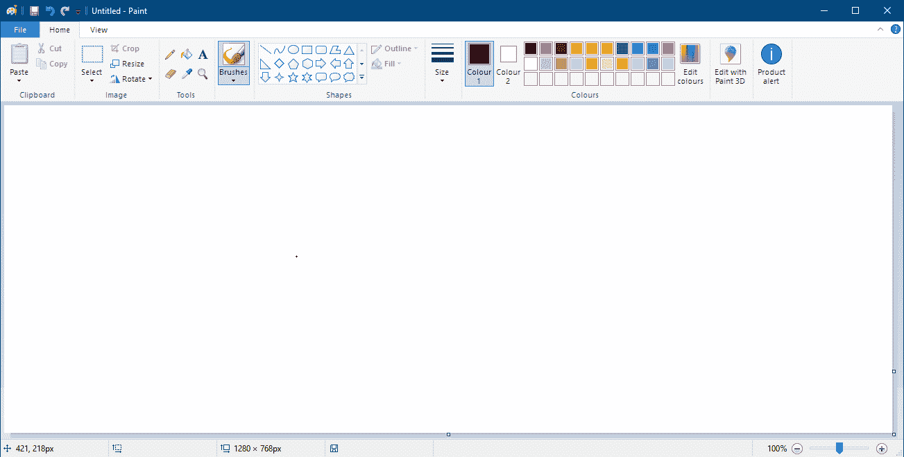

然而，在 Microsoft Paint 中，工具被分组在文档的顶部。本图使用已获得 Microsoft 的许可。

这两种方法在单一平台上都提供了一致的用户体验，但对于针对多个操作系统的图形应用来说，考虑哪种方法最适合是很重要的。你的软件特别适合哪种方法？也许如果它的图形设计适应了运行平台的规范，人们使用你的应用会更容易。

# 视觉层次结构

基于网络的应用的演变遵循了不同的路径。从历史上看，这种媒介一直被用来展示大量的文本信息和学术文档。这通常以超链接内容的形式呈现，并且通常包括一个在导航区域中的流行链接列表，这有助于人们找到重要内容。虽然每个网站都有非常个性化的外观（颜色和排版趋势一路走来都有所变化），但这种内容分组在互联网上大体上一致。这相对于当时的桌面软件来说是一个巨大的转变，但一旦用户学会了与一个网站交互的方式，他们就可以相对容易地找到大多数网站的方法。

在通过网站提供的应用方面，这有一个很大的好处：标准化的布局或视觉层次结构意味着新的、独特的设计仍然可以被大多数互联网用户使用。此外，它们在任何操作系统或网络浏览器上看起来都一样。这种对用户的一致性使得设计师更容易将丰富的视觉或品牌应用到网络应用中，而不会降低用户体验。随着不断发展的**层叠样式表（CSS**）开放标准的普及，共享这些设计子集以及将布局细节与视觉样式和品牌分离变得更加容易。因此，出现了用于构建网站和应用的通用代码，类似于开发者熟悉的桌面工具包。但结合任何互联网连接计算机的一致性，这种标准方法开始使桌面应用的学习显得更加复杂：

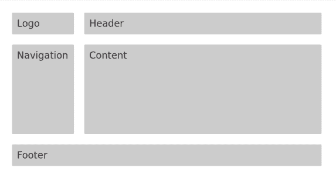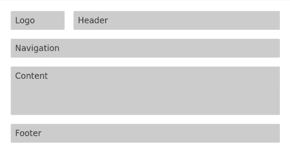

标准网页布局——在顶部，导航是一个侧边栏，

在下一张图片中，它是一个较短的行内区域

# 移动标准

移动应用程序提出了不同的设计挑战：如何在主要输入设备是触摸屏且手指可能会遮挡内容的情况下，在远小的屏幕上提供出色的用户体验。主要移动操作系统背后的公司（苹果、谷歌和微软）花费了许多年开发了一种视觉语言和标准交互，这些语言和交互为用户在日益复杂的应用程序中提供了流畅的流程。正如之前在 Web 应用程序中一样，对于用户快速学习和适应这些新平台来说，原生移动应用程序保持一致的行为方式非常重要。iOS、Android 和 Windows Phone 提供了标准 API，开发者可以使用这些 API 创建符合平台标准的应用程序。在每一个平台上，都有足够的定制选项来支持品牌识别，例如使用颜色、图标或应用中每个屏幕的内容。尽管移动平台的具体设计美学在过去几年中发生了变化，但精心设计的布局和工作流程方面始终保持一致。用户可以轻松地拿起最新的 iPhone，欣赏其新的设计，并且仍然完全熟悉应用程序的工作方式：

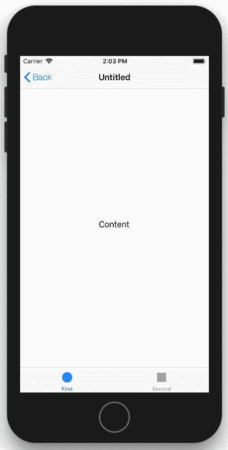

标准的 iOS 布局：顶部导航和底部操作

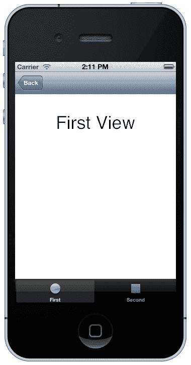

4 年前的类似 iOS 布局

设计应用程序 GUI 远不止设计工作流程和选择配色方案那么简单。你的应用程序是否会从现代应用程序 UX 中汲取灵感，还是针对那些更熟悉多年以来建立的桌面应用程序经典外观的用户？你将坚持使用单一平台及其标准的外观和感觉，还是对在多个操作系统上发布你的软件感兴趣？在我们查看不同的工具包之前，花些时间考虑这些选项，并确定哪种策略可能最适合你的应用程序。

# 并发和多线程

GUI 必须始终响应用户输入。虽然这主要是美学考虑，但操作系统也可能监控应用程序并强制无响应的用户界面退出。有效的事件处理使得这一点成为可能，这也是 GUI 的核心范式。事件处理器负责响应用户事件（如鼠标点击、手指轻触和键盘输入）、系统事件（如文件更改、网络可用性和应用程序状态），以及更新用户界面（如渲染内容、更改界面状态等）。任何阻止这项工作进行的因素都可能导致应用程序停止响应。在大多数图形工具包中，有一个负责事件处理和图形更新的单个线程（一个管理一组并发操作的任务）。在某些系统中，这是主线程（应用程序从中启动的地方），而在其他系统中，它是一个单独的线程或进程。了解您所使用的系统的语义很重要，因为通常只有图形或事件处理线程可以更改用户界面。

# 线程切换

不同的工具包和语言处理多线程和图形更新的方式差异很大。以下插图旨在强调此问题的复杂性，以防您不熟悉这些约束。具体细节有时会根据语言或版本而有所不同，但概念通常是统一的，否则使用 API 开发的软件将很难管理。

对于我们的第一个示例，考虑一个用 Java 编写的应用程序。它的惯例是图形和用户交互由单个事件调度线程处理。因此，您希望对用户界面进行的任何更改都需要使用`SwingUtilities.invokeLater()`推送到此线程：

```go
SwingUtilities.invokeLater(new Runnable() {
    public void run() {
        button.SetText("Updated!");
    }
});
```

与苹果操作系统的交互方法略有不同。使用 AppKit 或 UIKit（分别用于桌面和移动应用程序）构建的应用程序在主线程上启动用户界面事件处理。这意味着在界面配置完成后，所有处理都必须在后台线程上处理，并且对用户界面的更改必须在主线程上执行。Objective-C 的块结构（用于封装单个行为）使这变得稍微容易一些，但代码仍然相当复杂：

```go
dispatch_async(dispatch_get_main_queue(), ^{
    [button setTitle:@"Updated!" forState:UIControlStateNormal];
});
```

使用 GTK（支持为各种不同平台构建应用程序）的应用程序也有类似的限制。对于这些应用程序，图形更新必须在调用`gtk_init()`和`gtk_main()`的线程上处理。对于这类应用程序，`GLib`提供的线程处理可以帮助管理应用程序中的多线程，但您必须在界面初始化代码中设置此配置：

```go
...
gtk_init(&argc, &argv);
...
gdk_threads_enter();
gtk_main();
gdk_threads_leave();
...
```

然后，您可以使用 gdk 线程助手来管理后台更新，如下所示：

```go
gdk_threads_enter();
gtk_button_set_label(GTK_BUTTON(label), "Updated!");
gdk_threads_leave();
```

# 避免复杂性

图形工具包在尽可能避免并发复杂性方面做了很多工作。例如，按钮的点击处理程序通常在控制图形更新的线程上运行；这意味着简单的用户反馈或显示用户操作的结果可以完成，而无需担心多线程复杂性。一个 Android 应用程序的简单回调函数可能如下所示：

```go
button.setOnClickListener(new View.OnClickListener() {
    public void onClick(View v) {
        button.SetText("Updated!");
    }
});
```

然而，即使是简单的应用程序也不太可能长期避免这些复杂性。考虑一个简单的 RSS 新闻源应用程序；它所做的只是设置一个 GUI，从指定的 URL 加载新闻源的内容，并在用户界面中以列表的形式显示结果。为了保持响应性，图形界面必须在应用程序加载时呈现，在请求新闻源内容之前。随着内容的下载，它可以被解析并显示项目。然而，因为这是一个后台进程，它不允许简单地更改界面，例如添加列表项。相反，它必须识别要添加的项目，并将此信息传递回主线程（或事件调度线程）以向用户显示更新。这样的代码可能难以阅读，并且通常会引发调试复杂性，因为并发软件可能不会始终以相同的方式表现。在下一章中，我们将探讨 Go 处理并发的设计如何简化这一过程。

# 网络服务和云集成

网络服务和在线功能是当今大多数应用程序的核心部分。无论您是在处理从中央源下载的数据，在线协作存储的文档，还是仅仅想要分享您的创作，这很可能会通过互联网来完成。大多数图形工具包和 API 的核心都集中在小部件上——即用户界面的展示。尽管这有多种不同的原因（并且随着时间的推移而演变和扩展），但它主要反映了它们被创建的时期。例如，C 和 C++等编程语言是许多本地图形工具包的基础（尤其是那些针对多个平台的工具包），并且它们早于我们今天所知道的云服务和基于 Web 的 API。强大的网络服务和标准化的通信协议大大提高了基于 Web 应用程序的开发速度。相反，它们可能会使桌面上的本地图形应用程序更难，因为这些应用程序的核心语言或标准库缺乏支持。

# 通信

假设你选择的语言要么对连接到 HTTP 网络服务有良好的支持，要么已经确定了一个合适的库，那么从你的所需服务进行数据传输不会成为问题。然而，如果连接失败会怎样呢？虽然原生 GUI 应用程序通常位于桌面或笔记本电脑上，那里永久性网络连接很常见，但依赖这一点并不明智。随着远程工作的增加、咖啡店会议以及由 Wi-Fi 和蜂窝网络带来的更高流动性，任何现代应用程序都需要处理意外的网络条件。

在开发基于 Web 的应用程序时，可能不需要像用户可能已经在线那样勤奋。也可能互联网连接的失败对软件来说可能是一个致命的情况，所以在某些情况下，向用户显示的错误信息要求他们稍后再试可能是可以接受的。然而，用户对原生图形应用程序的期望要远高于此。智能手机及其所带的软件预计能够优雅地处理由网络条件或可用性的频繁变化引起的此类故障条件。那么，在这种情况下，我们能够做些什么来满足这种更高的期望呢？这可能需要一些规划；*稍后再试*的错误信息必须是最后的手段。

你的应用程序中有多少部分实际上需要一直（或在工作流程的特定点）保持互联网连接？（或者，是否有部分元素可以偶尔访问并本地存储（缓存）？）以及，是否可以接受出站通信在稍后而不是用户操作立即发生？在考虑网络连接及其真正需要的时候，富有创意是有帮助的。不久前，一个聊天客户端（如 IRC、ICQ、MSN 等）需要一直在线，如果连接停止响应，你就必须等待它重新连接。最近，期望已经发生了变化，新的聊天服务（如 Slack 和 Skype）允许你在离线时也能输入聊天或频道，消息会尽快送达。

在基于 Web 的互联世界中，一个额外的挑战是身份验证。基于旧密码和应用密钥的身份验证在大多数编程语言中工作得很好，但它们存在安全问题。最近采用的标准是 OAuth2，旨在确保用户知道当应用程序连接到受保护的服务时他们允许了什么。工作流程设计得很好，可以在 Web 浏览器中工作，但从一个原生应用程序内部，当请求权限时切换到 Web 浏览器是否是一个合理的用户体验？你通过在应用程序中嵌入 Web 视图来稍微改善流程吗？不幸的是，已经有人指出这也可能受到潜在的安全攻击，现在有一个文档专注于 OAuth2 集成到原生应用程序的最佳实践（IETF RFC 8252）。随着时间的推移，适应应用程序以实施这些建议将成为一项要求。

# 数据解析

建立与远程服务器（或从本地缓存加载数据）的连接后，接下来的挑战很可能是解析响应。复杂的字符串处理（由于它们的人读性设计，大多数基于 HTTP 的 API 都需要这种处理）并不是许多用于原生应用程序开发的较老编程语言的强项。已经开发了许多库来帮助完成这项任务，并且通常可以免费共享（使用开源软件许可），但如果编程语言没有很好的字符串处理能力，这仍然可能是一个非平凡的挑战。

**可扩展标记语言**（**XML**）和**JavaScript 对象表示法**（**JSON**）是互联网上传输数据的主要格式，它们在所有针对 Web 开发的语言中都得到了很好的支持（在 JavaScript 应用程序中 JSON 的使用是微不足道的，这应该不会让人感到惊讶）。正如其名称所暗示的，它们被设计用来传输面向对象或结构化数据，内容中应该包含足够的元数据，以便在客户端软件中无需复杂的反序列化代码即可重新创建对象。

# 标准组件

云服务与 Web 开发集成的一个巨大进步是添加了**异步 JavaScript 和 XML**（**AJAX**）功能。由于 JavaScript、XML 和 HTML 在现代浏览器中的普遍支持，Web 开发者可以配置用户界面的部分，使其在 Web 服务请求的结果下刷新。这种更新不需要数据解析或合并信息；服务器上的数据实际上可以替换用户界面（通常是 HTML 或 JavaScript 格式）的旧内容。

不幸的是，大多数本地应用程序工具包没有内置用于显示 Web 服务功能调用结果的组件。然而，随着时间的推移，流行的服务通常会发布帮助这些功能的库。如果提供 Web 服务的公司没有创建支持库或组件，通常情况下，可能已经有人独立创建并在线共享。支持外部模块或提供合适的包管理器的语言，通常能从这些类型的贡献中获得最大的好处。

# 为多个平台开发

除了本章前面描述的挑战之外，图形应用程序在针对多平台发行版时还会面临额外的复杂性。依赖性和包管理不在此节范围内，因为它们以相同的方式影响系统和网络应用程序，尽管系统应用程序很少需要处理打包资源（如图像和设计元素），而网络应用程序不太可能发布二进制包。本节概述了仅针对或对基于 GUI 的应用程序计划跨平台策略更具挑战性的主要挑战。虽然每个挑战都可以克服，但它们通常会在设计应用程序时引入额外的开发开销，这些开销应该被考虑在内。

# 跨平台 API

当为多个平台设计时，首先考虑的可能是外观和感觉（参见本章开头的*标准外观和感觉或应用主题*）。然而，考虑你的界面设计是否易于用户理解（是否应该与桌面小部件相匹配）也非常重要。对于高质量的图形应用程序，考虑它与用户环境的交互方式也很重要。例如，如果你的工作流程包括在当前界面之外打开网页，预期可能是在默认的网页浏览器中打开，这可能是操作系统配置的。你选择的工具包是否可以处理打开网页或其他由 URL 指定的文档类型？你是否需要为每个你希望支持的平台编写一些代码，以确保正确的行为发生？

为了从移动应用程序的最新发展中学习，我们应该看看“分享”功能。在 Android 上，以及最近在 iOS 上，一个应用程序可以启动分享操作，平台工具包将显示适当的视觉选择，以分享该类型的内容。然后用户将做出选择，注册处理该类型分享的应用程序将接收内容并请求任何进一步所需的信息。跨平台应用程序的原生开发者如何提供类似的功能？如果这对你的应用程序很重要，那么你可以寻找旨在提供此功能的语言或工具包，但你可能需要直接在你的代码中尝试实现它，或者与外部基于 Web 的服务合作以提供类似的经验。

# 图标和设计

大多数图形环境（如桌面、移动等）都有一个默认的图标集——那些用于显示文件类型、导航箭头和标准工具栏以帮助用户识别常见操作的图标。如果你的应用程序提供的不仅仅是简单的功能，那么可能需要在设计中添加一些图形元素——很可能是图标或符号来帮助用户。你的附加图标将与应用程序运行的环境提供的图标相匹配吗？如果你只支持一个平台，这可能不是问题，但当你追求跨平台解决方案时，这可能要困难得多：

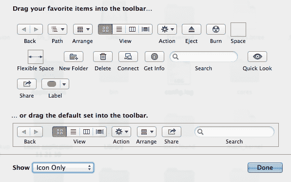

macOS 工具栏图标的默认样式

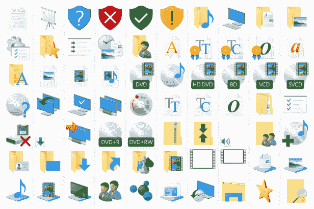

Windows 使用的样式与 macOS 非常不同

在设计应用程序 GUI 时考虑这个挑战：你需要额外的图标或图形元素吗？这样做可能与系统样式不同，但它可能与用户的期望相符。

# 测试

确保应用程序质量良好的唯一方法是在你打算支持的每个平台上对其进行测试。这同样适用于系统应用程序（例如，可能旨在在 Linux 和 Mac 上运行）和 Web 应用程序（每个 Web 浏览器的行为可能略有不同）。然而，图形桌面环境中的差异可能很大，可能导致用户界面的许多不同版本。此外，设置这些平台中的每一个可能需要更多的计算机，或者一些复杂的多重启动设置。虚拟化在这里提供了一个很好的解决方案：在可能的情况下，你可以创建虚拟环境来模拟你需要测试的每个操作系统安装。

如果你包含 Linux 或类似的开源操作系统，请记住，用户可以自由选择不同的桌面环境，每个环境都有不同的外观和默认行为。例如，如果你支持 Ubuntu Linux，你可能需要测试默认环境（Unity），但也需要非常常见的 *Gnome* 替代方案。Linux 有许多不同的桌面环境可以考虑，包括 KDE 和 Xfce，它们也非常受欢迎，每个都有不同的外观和感觉，通常还有不同的工作流程需要考虑。

即使你打算只关注 Windows 和 macOS 的支持，你仍然需要考虑你将支持哪些版本。外观和感觉，甚至默认交互，都可能从一个大版本到另一个大版本发生变化，那么你将致力于适应这些细微差别，还是只为这些系统的最新版本提供出色的体验？请务必记录你将支持的操作系统和版本（如果你打算针对 Linux，甚至包括桌面配置），并在可能的情况下为每个这些设置一个测试环境。这将在长期内有所帮助！

# 打包和分发

为多个平台打包本机图形应用程序可能会引入额外的挑战。本机 GUI 通常需要适应当前平台，并且它需要包含包元数据，以便在用户的桌面上按预期集成。大多数图形应用程序还需要将许多资产嵌入到发布包中。此外，安装应用程序的语义在不同的操作系统中各不相同。例如，macOS 预期应用程序被打包成一个 *包*，可以从 `下载` 文件夹拖动（或移动）到 `应用程序` 文件夹。Windows 用户将期望一个可执行文件，下载后运行一次，或者一个可以设置所需组件的安装程序。你打算分发的平台可能会影响你的应用程序功能或可以打包的资源，我们希望使用单个代码库来简化维护。

近年来，我们看到了许多平台创建了 *应用商店* 或类似的应用，用户可以浏览适用于其计算机的应用程序。这提供了一些免费的市场营销和新的下载渠道，但给开发者增加了额外的负担。你的应用程序的截图和其他元数据至少是必需的，为了脱颖而出，你可能甚至需要创建一个展示软件操作的演示视频。这样的商店对用户来说安装变得非常简单，但通常会对开发者施加额外的限制。如果你打算为你的应用程序使用这些分发方法，请务必进行研究。

# 摘要

在本章中，我们讨论了原生图形应用程序开发者可能面临的各种附加复杂性，尤其是如果他们打算为多个操作系统构建应用程序的话。解决图形展示方面的挑战（视觉层次、系统外观或应用程序设计以及自定义图形元素）需要一些规划和调查——不仅是为了设计理想的应用程序，还要选择你将与之工作的约束或开销。

剩余的技术挑战——并发、Web 集成、打包和分发——将根据实现语言的不同而有所差异。如前所述，许多图形工具包是使用最初并未提供对这些考虑因素支持的编程语言创建的。一些提供了低级支持，开发者必须在此基础上构建以使他们的应用程序达到现代基于 GUI 的应用程序所期望的功能水平。幸运的是，Go 语言为许多这些挑战提供了优雅的解决方案。尽管该语言并非专为内置 GUI 的标准库而设计，但下一章我们将探讨为什么 Go 语言非常适合这类应用程序。
