# Go 来拯救！

在阅读了关于构建原生图形应用程序挑战的上一章后，你可能想知道这一切是否值得。希望你对用户将欣赏你设计的优质用户体验充满信心，并且你的团队将热衷于看到采用这种方法而不是网页应用程序或其他方法的益处。幸运的是，设计 Go 编程语言的 Google 团队理解了这些挑战，并决定应该做些什么来帮助开发者们在他们的追求中取得进展！

在本章中，我们将详细探讨 Go 语言，并了解其设计如何解决（或帮助解决）在 第二章 “图形用户界面挑战” 中讨论的各种挑战。特别是，我们将探讨以下主题：

+   适用于任何应用程序的跨平台方法

+   并发模型如何帮助创建可靠的应用程序

+   内置支持与网络服务协同工作

+   选择你的 GUI 的外观和感觉以及管理 GUI 代码

到本章结束时，你将熟悉 Go 语言如何支持 GUI 应用程序设计，并准备好开始使用为 Go 开发者提供的各种框架来编写真实示例。

# 简介

Go 是一种语言，它（类似于 C、C++、Lisp 以及许多其他语言）在它支持的每一个平台上编译成原生二进制文件。这对于图形应用程序来说非常重要，因为这是在主流计算机硬件上创建最响应和最平滑的用户界面的最佳方式。在撰写本文时，Go 运行的平台包括 Windows、macOS、Linux、Solaris 以及其他流行的基于 Unix 的操作系统（这实际上涵盖了所有桌面个人电脑）。与其它现代语言相比，Go 的一个突出特点是它的源代码可以在不进行任何修改或特殊适配的情况下，编译成它支持的每一个平台的原生代码。该语言还包含了一个庞大的 API 库，完全支持它所支持的每一个操作系统。这对于想要为多个操作系统编写高效应用程序的开发者来说是一个巨大的优势，因为他们无需为每个平台维护略有不同的版本。Go 还是一种 *类型化* 语言，这意味着每个变量、常量、函数参数和返回类型都必须有一个单一、已定义的类型。与一些较老的类型化语言不同，Go 通常能够推断类型，这有助于避免在源代码中重复信息。这些特性有助于创建一个非常适合开发的语言——那么，让我们看看一些真实的代码以及它是如何构建和运行的。我们将使用一个简单的 *hello world* 示例，我们将将其写入一个名为 `main.go` 的文件：

```go
package main

import "fmt"

func main() {
    fmt.Println("Hello World!")
}
```

此示例展示了最基本的 Go 程序。第一行指示包名（在这里，`main` 表示该文件描述了一个可执行命令）。然后，我们有导入块，其中引用任何标准库包或外部代码。最后，有一个 `main()` 方法，这是任何 Go 程序的开始——该方法简单地使用 `fmt` 包将 *Hello World!* 打印到命令行。此方法没有提及返回类型（它将放在 `main()` 之后）——这意味着没有返回类型，例如 C 或 Java 程序中的 `void`。我们使用 `go run main.go` 命令运行此应用程序，如下所示：

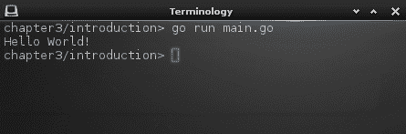

运行 main.go 输出消息然后退出

通常，每个 Go 文件旁边都会有一个测试文件，它会对主代码执行单元测试。让我们用一个简单的例子来演示。将以下代码输入到 `main_test.go` 中：

```go
package main

import "testing"

func TestLogic(t *testing.T) {
    if true == false {
        t.Error("It's illogical")
    }
}
```

在我们运行此代码之前，你应该注意到与常规 Go 文件相比有两个重要差异。首先，导入列表包括 `"testing"`——这是编写任何测试方法所必需的。其次，这次方法名以 `Test` 开头，并包含一个 `*testing.T` 类型的单个参数。任何符合这些条件且在以 `_test.go` 结尾的文件中的方法都将被视为单元测试。现在让我们使用内置的测试运行器来运行测试：

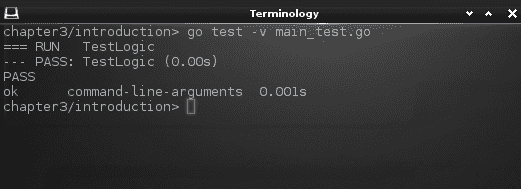

以详细模式运行 Go 测试

在这个命令中，`-v` 参数请求详细输出，显示正在运行的测试，以及结果中的 `command-line-arguments` 指示测试是在我们参数列表中指定的文件上运行的，而不是整个包。或者，键入 `go test` 将输出更少的信息，并运行当前包中的所有测试。

除了这些基本命令之外，Go 还附带了许多工具，可以帮助开发者编写和维护高质量的代码。以下是最常用的三个：

+   `gofmt`：这确保源代码按照 Go 规范格式化，如果请求（通过传递 `-w`）还可以重写你的文件。

+   `godoc`：这运行一个本地文档服务器来检查你的 API 将如何显示给其他开发者。

+   `go vet`：这检查代码中编译器无法检测到的常见编程错误。

你可能已经注意到，这些命令只是简单地运行，不需要编译——但如果 Go 是一种编译型语言，这是如何实现的呢？这是因为 `run` 命令实际上是一个构建应用程序然后运行的快捷方式。这使得运行应用程序的最新版本比通常的编译然后运行的方法要快得多，而且不会失去作为本地二进制文件的所有优势。在这种情况下，构建的应用程序在运行完成后将被丢弃。如果你想多次构建和运行，可以使用 `build` 命令，如下所示：

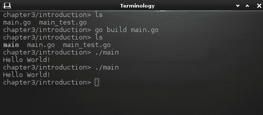

构建可多次运行的二进制文件

如您所见，编译器已创建了一个与我们所输入代码的文件名相同的可执行文件。这个文件是由我们的源代码构建的本地应用程序，它可以像任何其他应用程序一样运行。请注意，这是一个本地应用程序，因此它不像 Java 应用程序那样可移植。它将在我们构建它的计算机上以及其他类似计算机上运行，但基于 Windows 计算机构建的应用程序不能直接在 macOS 上运行。源代码与这两个平台兼容，但二进制应用程序则不兼容。

应该指出的是，Go 语言还提供了*垃圾回收*功能，这有助于开发过程的简化。这意味着当我们创建的对象不再需要时，系统将确保它们占用的内存被释放。与不提供这种功能的`C`和其他（较老）编译语言相比，我们编写的代码更少，并且我们的应用程序泄漏内存的风险要低得多。现在我们了解了这种语言，让我们来探索支持跨平台方法的编译器功能，并看看如何为不同的操作系统构建这些示例。

# 适用于任何应用程序的跨平台

在介绍中，我们了解到以`_test.go`结尾的文件将自动作为测试阶段的一部分运行。Go 使用这种命名约定为编译器提供额外的功能，以提供为特定平台或计算机架构包含代码的能力。例如，名为`main_windows.go`的文件只有在构建 Microsoft Windows 时才会被包含在编译中，而`main_darwin.go`文件将仅针对 macOS（darwin 是底层操作系统的名称）进行编译。同样，计算机架构也可以用来条件性地包含源代码，因此名为`main_arm.go`的文件将仅作为 32 位 ARM 架构处理器的构建的一部分。

Go 还支持通过使用构建约束（也称为构建标记）对任意文件进行条件编译。这些操作在文件级别上确定一个文件是否应该包含在构建中。要使用此功能，需要在文件顶部的包声明之前放置一个注释（之后有一个重要的空白行）：

```go
// +build linux,!386

package myapp
```

基本构建标记与之前描述的用于文件命名的平台和架构字符串相匹配，并且它们可以组合和否定（使用`!`字符）。因此，当编译针对非 32 位处理器的 Linux 系统时（`!386`），前面的示例将被包含在内。通过向编译器传递自定义标记，该功能可以进一步扩展。这样，一个仅针对 Macintosh 提供高级功能的程序可以更新文件以读取以下内容：

```go
// +build darwin,coolstuff

package myapp
```

这意味着，当为 macOS 计算机编译时，您可以通过添加一个额外的参数来调用编译器以启用此`coolstuff`功能，如下所示：`go build -tags coolstuff main.go`。

这种级别的条件编译意味着代码不会显得杂乱或难以阅读——每个文件在构建时要么被包含，要么不被包含。通常，包含条件代码的文件将与包含替代实现的另一个文件配对，例如`// +build !darwin !coolstuff`，以提供前面额外功能的回退（如果不在 macOS 上或没有传递`coolstuff`标签，则会被编译）。有关构建约束计算方式的更多信息，请参阅文档：[`golang.org/pkg/go/build/`](https://golang.org/pkg/go/build/)。

一个非常有用的编译器功能，在本地应用程序开发中非常有用（但应谨慎使用）是能够直接从 Go 代码中调用 C 代码，这被称为**Cgo**。以下示例演示了一个小的 Cgo 程序，通过导入`"C"`包，能够调用 C 代码。它还定义了一个小的内联函数，如果您在方法中需要多次调用 C 代码，这个函数可能会有所帮助：

```go
package main

/*
#include <stdio.h>
#include <stdlib.h>

void print_hello(const char *name) {
    printf("Hello %s!\n", name);
}
*/
import "C"
import "unsafe"

func main() {
    cName := C.CString("World")
    C.print_hello(cName)
    C.free(unsafe.Pointer(cName))
}
```

当像正常的 Go 程序一样运行时，这将打印出您预期的消息：

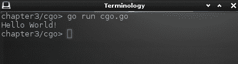

从 go 文件中运行 C 代码。

如您所见，内联 C 方法是注释的一部分，包括所需的导入，当放置在`import "C"`之前时，会被 Cgo 读取。请注意，Go 字符串不能直接传递给 C 代码，而必须通过`"C"`包转换为`CString`。从 C 代码中调用 Go 函数也是可能的，这被称为**Cgo**。Cgo 的完整解释超出了本书的范围，但更多信息可以在[`golang.org/cmd/cgo/`](https://golang.org/cmd/cgo/)的文档中找到。虽然这是一个非常强大的功能，但它会迅速导致平台特定的代码，因此除非绝对必要，否则不建议使用。

# 跨平台编译

我们迄今为止探索的编译器功能仅针对当前平台构建。这意味着当在 Linux 上开发时，编译器将创建（如果请求运行，则运行）一个本机 Linux 二进制文件（技术上称为 ELF）。如果在 macOS 上执行，结果将是一个针对 darwin（Mach-O 可执行文件）的本机二进制文件，而在 Windows 上则是一个针对 Windows 平台的本机二进制文件（PE32+）。如果开发者希望针对许多不同的平台，一个选项是为每个构建拥有不同的计算机，但这既昂贵又耗时。从开发者的计算机创建针对各种平台的本机二进制应用程序要方便得多——这被称为**跨平台编译**。

使用 Go 工具链进行交叉编译很简单。您需要知道的是您希望编译的操作系统和架构。为了运行针对不同平台的构建，我们只需设置`GOOS`和`GOARCH`环境变量（分别对应操作系统和架构）并调用`"go build"`。在这个例子中，我们通过为不同平台编译入门示例并使用 Unix 的`file`命令检查结果应用程序来阐述这个原则。如您从第一次调用中看到的那样，这个示例是在 64 位 Linux 计算机上执行的，然后我们分别为 32 位 Linux、Windows 和 macOS 进行构建：

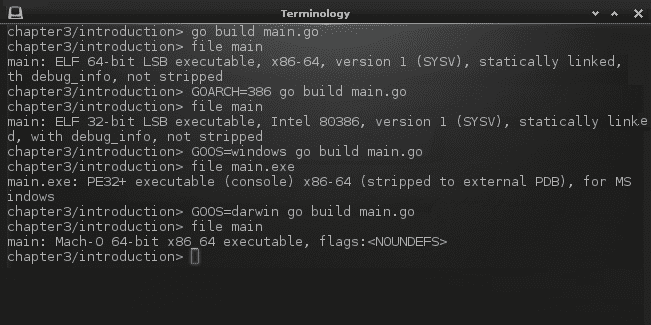

在一台计算机上为不同的平台构建

因此，您可以看到构建适用于任何平台的 Go 应用程序是多么简单。有了这些知识，我们可以在开发者的首选平台上创建图形应用程序，并将其交叉编译为许多最流行的操作系统，而无需任何自定义代码或构建配置。

# 标准库

编程语言的标准库是由语言运行时提供的 API 和功能集。例如，C 语言有一个非常小的标准库——作为一个底层语言，它支持的每个操作系统的功能数量是有限的。另一方面，Java 历史上以内存和启动时间消耗大而闻名，提供了一个庞大的标准库——包括在第二章中描述的 Swing GUI，*图形用户界面挑战*。

标准库的大小通常是选择编程语言时需要权衡的一部分。对于性能良好的原生应用程序，启动速度快，内置 API 的数量通常较小。当使用高级语言进行构建时，开发者通常期望有很多支持特性和 API 包——这通常会在启动时间或性能上带来一定的代价。Go 语言试图提供一个完整的标准库，而不带来任何运行时惩罚。这是通过其跨平台编译和静态链接来管理的，它包括正在构建的原生二进制文件中使用的所有功能。这意味着文件可能比从 C 代码编译的程序要大，并且可能需要更长的时间来编译——但这些一次性成本（构建和下载）使得 Go 应用程序在所有平台上都能实现高性能。

Go 附带的标准库在许多领域都提供了强大的功能，包括密码学、图像处理、文本处理（包括 Unicode）、网络、HTML 模板和 Web 服务集成。您可以在[`golang.org/pkg/#stdlib`](https://golang.org/pkg/#stdlib)上阅读完整的文档。

# 语言设计中的并发

在大多数主流编程语言中，并发和多线程可以增加复杂性，并使代码更难阅读。Go 的设计者决定从一开始就构建并发，使其易于管理许多执行线程，同时避免共享内存管理的困难。Go 不暴露传统的 *threads*，而是引入了 **goroutines** 的概念——这些类似于轻量级线程，但可以同时拥有数千个。共享内存通常是并发应用程序的主要通信机制，但在 Go 中，通信用于共享——这个内置特性被称为 **channels**。除了这些语言特性之外，Go 在标准库中有一个 `sync` 包，它提供了进一步并发管理的工具。

# Goroutines

首先，让我们检查最基础的 Go 并发特性：goroutine。任何正常函数在被调用时，都会执行其内部的代码，并在遇到 `return` 时退出，或者函数退出——此时它将控制权返回给调用它的函数。Goroutine 是一种开始执行但立即将控制权返回给调用它的函数的函数——本质上为每次调用创建一个后台进程。任何函数都可以通过在调用前加上 `go` 前缀作为 goroutine 调用，如下所示：

```go
package main

import (
    "fmt"
    "time"
)

func tick(message string) {
    for i := 0; i < 5; i++ {
        time.Sleep(10 * time.Millisecond)
        fmt.Println(message)
    }
}

func main() {
    go tick("goroutine")
    tick("function")
}
```

这个代码示例定义了一个 `tick(string)` 方法，它将每隔 10 毫秒输出请求的消息。`main()` 函数以两种不同的方式调用此代码：首先，它作为 goroutine 调用，然后作为正常的函数调用。如果这是作为两个连续的函数调用调用的，我们会在命令行中看到很多 `"goroutine"` 的副本，然后是多次 `"function"`。然而，goroutine 与以下代码并发执行，所以我们看到的是这个输出：

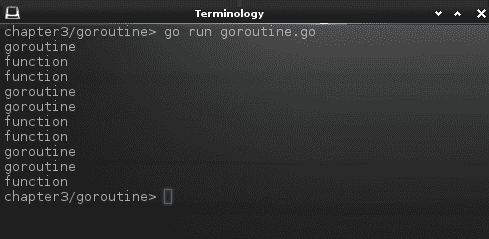

使用 goroutine 的并发输出

你看到的内容可能略有不同，因为顺序看起来有点随机。你应该看到的是，每一对输出行之间要么是 `"goroutine"` 或 `"function"`，并且它们之间有一个小的时间间隔。每一对顺序将取决于调度器，但你可以清楚地看到，`tick` 函数的两次调用是同时运行的（即并发）。Goroutines 并不仅限于这样的简单示例，但它们占用相同的地址空间（就像正常的函数调用一样），因此它们可以访问共享的内存区域。当多个线程可以写入同一内存区域时，通常需要同步来确保正确操作。为了提供更好的语义以这种方式进行通信，Go 语言有一个名为 **channels** 的特性。

# Channels

Go 中共享数据的哲学是*不要通过共享内存来通信；相反，通过通信来共享内存*。通道是支持这种方法的语言结构——它们允许通过在 goroutine 之间正确通信来共享数据，而不是共享公共数据。这是 Go 避免竞态条件（即一个线程写入数据，而其他线程读取相同的数据）的主要方式。通道在 Go 中用于各种模式——它们可以传递 goroutine 的结果（或在不同程序之间传递数据），在数据更改时提供更新，甚至可以发出进程应该结束的信号。

通道，就像 Go 中所有的变量和常量一样，需要有一个类型。通道的类型决定了可以通过它传递的数据。如果只想发送`true`/`false`这样的信息，类型可以是`bool`；如果您希望传递更多信息，例如数据更改通知，则可以是自定义的`struct`数据类型。在这个通道的例子中，我们使用了一个简单的字符串通道，它被读取多次，而 goroutine 继续向其中写入：

```go
package main

import "fmt"

func say(words string, to chan string) {
    fmt.Println("Speaking:", words)
    to <- words
}

func talk(to chan string) {
    say("Hello", to)
    say("Everyone", to)
    say("My name is...", to)
    fmt.Println("Never mind")
}

func listen(to chan string) {
    heard := <-to
    fmt.Println("I heard:", heard)}

func main() {
    chat := make(chan string)

    go talk(chat)

    listen(chat)
    listen(chat)
    fmt.Println("Bye")
}
```

运行此示例将演示每次向通道写入（在`say`中），它必须等待通道被读取（在`listen`中），然后才能再次写入。您还可以看到`talk`协程从未完成消息，因为我们没有读取它等待写入的所有数据：

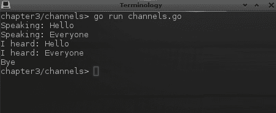

通过简单通道进行通信

默认情况下，向通道写入将阻塞，直到有代码准备好从另一端读取，同样，读取将阻塞，直到向通道写入数据，此时程序流程将继续。这种行为可以通过使用带缓冲的通道来改变——如果通道的缓冲区大小为 5，则可以写入 5 次而不阻塞；同样，从该通道读取可能会在阻塞之前返回 5 个值（在没有数据可用时，读取通道将始终阻塞）。如果我们更新前面的示例以创建一个大小为 3 的带缓冲通道（通过使用`make(chan string, 3)`），我们会看到完整的信息被写入，并且`talk`方法完成：

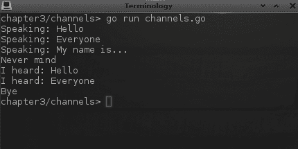

向通道添加缓冲

这个简单的例子说明了您如何在 goroutine 之间安全地通信，但让我们通过包含一些额外的功能来查看一些更实际的例子。例如，每次配置结构体更改时，都可以通过通道传递，这样应用程序就可以相应地做出反应：

```go
go func() {
    for {
        config := <-configManager
        myWidget.applyConfiguration(config)}
}()
```

为了能够管理多个 goroutine 之间的并发和通信，语言对 `select` 关键字进行了增强，它提供了在多个通道上等待的能力。这意味着你不需要为每个阻塞通道创建一个 goroutine。以下示例说明了后台函数如何处理一些复杂的计算（在这种情况下，`square`），并将结果反馈给主函数，同时等待信号以完成处理：

```go
package main

import "fmt"

func square(c, quit chan int) {
    sq := 2
    for {
        select {
        case c <- sq:
            sq*=sq
        case <-quit:
            fmt.Println("quitting")
            return
        }
    }
}

func main() {
    c := make(chan int)
    quit := make(chan int)
    go square(c, quit)

    func() {
        for i := 0; i < 5; i++ {
            fmt.Println("Square", <-c)
        }
        quit <- 1
    }()
}
```

运行此示例将输出计算结果，直到进程被信号通知停止：

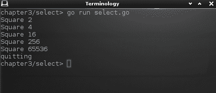

读取计算通道直到收到退出信号

最后，Go 中的通道可以被写入者关闭；这意味着从通道读取的函数可能停止接收新值。为了避免这种死锁情况，通道的读取者可以检测通道是否已关闭。检查通道状态的语法是读取一个可选的第二个参数，`val, ok := <-ch`，其中 `val` 是读取的值，`ok` 表示通道没有被关闭。此外，还增加了一个新的 `range` 关键字，它将迭代通道的值，直到它关闭。以下示例包括一个 `download()` 函数，该函数模拟下载数据并更新完成百分比。进程达到逻辑结论，因此 `main` 函数可以完成。你可以看到如何确保进度条在程序的其他部分继续运行时保持更新：

```go
package main

import "fmt"

func download(file string, c chan int) {
    fmt.Println("Downloading", file)

    c <- 10
    c <- 40
    c <- 65
    c <- 100

    close(c)
}

func main() {
    c := make(chan int)
    go download("myfile.jpg", c)

    for i := range c {
        fmt.Printf("Progress %d%%...\n", i)
    }
    fmt.Println("Download complete")
}
```

运行此示例将展示模拟下载的进度，并在进程完成后返回。简单的 `range` 关键字用于避免直接处理通道关闭条件：

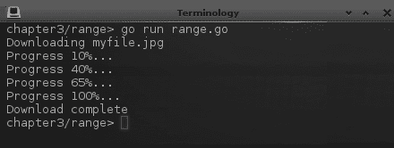

在通道范围内迭代

有时候，你需要超越并发原语并处理特殊情况。这正是标准库中的 `sync` 包所提供的。

# `sync` 包

Go 标准库的 `sync` 包提供了语言本身不包括的额外同步功能。它在并发管理方面的补充包括 Mutex、WaitGroup 和 Once，我们将简要介绍。

当你想确保互斥访问——也就是说，你只想让一个 goroutine 一次访问一块数据（以避免潜在的冲突）时，会使用 `Mutex`。关键方法是 `Lock()` 和 `Unlock()`，它们包围了不应该并发执行的代码段。如果第二个 goroutine 尝试进入该段，它将阻塞，直到锁被释放：

```go
var vals map[string]string
var lock sync.Mutex

func Get(key string) string {
    lock.Lock()
    defer lock.Unlock()
    return vals[key]
}

func Set(key, value string) {
    lock.Lock()
    vals[key] = value
    lock.Unlock()
}
```

在前面的例子中，我们有一个`vals`映射，我们想要共享，因此必须确保线程安全。我们添加`sync.Mutex`来保护访问并确保在使用映射之前获得锁。注意，在`Get`方法中，我们使用`defer`关键字来确保代码在方法退出时被调用——这避免了在返回之前需要访问映射、存储值和解锁的需要（使代码更整洁）。

`WaitGroup`很有用，如果你想要创建多个后台活动，然后等待它们全部完成。例如，这个代码片段创建了一个下载方法，它接受一个额外的参数，即它所属的组。每个下载实例在下载开始时增加组计数器（`Add(1)`），在下载结束时清除它（`Done()`）。调用函数设置一个等待组，然后调用`Wait()`，这将返回一旦所有下载完成：

```go
func Download(url string, group *sync.WaitGroup) {
    group.Add(1)
    http.Get(url)
    group.Done()
}

func main() {
    ...
    var group sync.WaitGroup
    go download("http://example.com/image1.png", group)
    go download("http://example.com/image2.png", group)
    group.Wait()
    fmt.Println("Done")
    ...
}
```

最后一个例子，`Once`，相当直观——它允许代码只执行一次。调用它的`Do(func())`方法将导致传递的函数不会被调用超过一次。如果你试图实现一个懒加载的单例模式，这很有帮助，如下面的代码所示：

```go
var instance *myStruct
var once sync.Once

func GetInstance() *myStruct {
    once.Do(func() {
        instance = &myStruct{}
    })

    return instance
}
```

完整文档可在[`golang.org/pkg/sync/`](https://golang.org/pkg/sync/)找到；然而，建议尽可能使用 channel 构造，而不是这些功能中的大多数。

# 标准包含的 Web 服务

作为一种现代编程语言，Go 提供了广泛的 HTTP 客户端、服务器和标准编码处理程序的支持，包括 JSON 和 XML。结合内置的字符串和映射功能，这消除了许多与 Web 服务一起工作的障碍。除此之外，Go 中结构体的格式允许额外的`tags`，可以为字段提供元数据。`encoding/json`和`encoding/xml`包都利用这一点来理解如何正确地编码和解码这些结构体的实例。以下示例通过连接到 Web 服务、访问 JSON 响应并将其解码为结构体来演示这些功能，然后像使用任何其他结构体一样使用它：

```go
package main

import "encoding/json"
import "fmt"
import "io/ioutil"
import "net/http"

type Person struct {
    Title     string `json:"title,omitempty"`
    Firstname string `json:"firstname"`
    Surname   string `json:"surname"`

    Username string `json:"username"`
    Password string `json:"-"`
}

func readFromURL(url string) ([]byte, error) {
    var body []byte
    resp, err := http.Get(url)
    if err != nil {
        return body, err
    }

    defer resp.Body.Close()
    return ioutil.ReadAll(resp.Body)
}

func main() {
    person := &Person{
        "",
        "John",
        "Doe",
        "someuser",
        "somepassword",
    }
    fmt.Println("Struct:", person)

    data, _ := json.MarshalIndent(person, "", "  ")
    fmt.Println("JSON:", string(data))

    fmt.Println("Downloading...")
    data, _ = readFromURL("http://echo.jsontest.com/title/Sir/" +
        "firstname/Anthony/surname/Other/username/anon123/")
    fmt.Println("Download:", string(data))

    person = &Person{}
    json.Unmarshal(data, person)
    fmt.Println("Decoded:", person)
}
```

在前面的示例代码中，你可以看到带有前缀`"json:"`的结构体标签的使用。这些为管理这些对象编码和解码的`"encoding/json"`包提供了提示。我们可以运行这个示例，并看到将结构体转换为 JSON 然后再转换回来的输出：

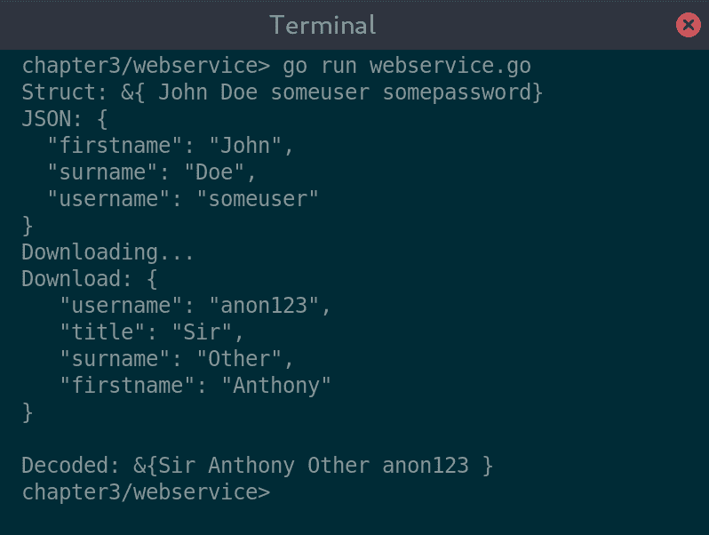

对 HTTP 请求进行 JSON 编码和解码

注意到标记为 `omitempty` 的零值字段未包含在 JSON 输出中，同样地，标记为 `"-"`（表示不包含）的密码字段在编码数据时也被忽略。从测试网络服务下载数据后，它被直接 marshaled 到 `Person` 结构体的实例中，缺失的字段保留其零值。这一切都是使用语言的内置特性和标准库功能实现的。这要归功于 Go 在处理网络服务方面的简便性。

# 选择外观和感觉

如 第二章 中所讨论的，*图形用户界面挑战*，图形应用程序有许多方法，让开发者可以在原生与混合（打包的 Web 应用）之间选择，让设计师可以从系统外观和感觉、多平台小部件集或甚至自定义设计中进行选择。您所做的选择可能会受到您的应用程序需求和目标平台的影响——性能是否重要，您是否希望实现跨平台部署？Go 没有标准的图形工具包，这种省略导致开发者认为它不是用于编码 GUI 应用的语言。然而，正如我们在本章中所看到的，它非常适合图形应用程序开发。这引出了一个问题：在 Go 中构建 GUI 应用程序有哪些工具包可用？

简而言之：很多。您可以在网上看到主要、目前维护的工具包列表，请访问 [`awesome-go.com/#gui`](https://awesome-go.com/#gui)——可能有一个选项适合大多数用例。由于我们正在寻找构建性能出色的高性能应用程序，我们将跳过依赖于捆绑网络内容以创建混合应用程序的项目。这仍然留下了一个庞大的列表！有些工具包提供对系统组件的直接访问，以实现真正的原生体验，有些则提供抽象的 API 以实现相同平台的外观和感觉。其他工具包提供他们自己的用户界面渲染，这在所有支持的平台上都是一致的（类似于 Java Swing 的 *Metal* 外观和感觉）。

除了是 GUI 开发的优秀语言外，Go 还为我们提供了选择适合我们应用程序的正确 GUI 工具包的机会。第二部分，*使用现有小部件的工具包*（第四章、5 章、6 章和 7 章）和第三部分，*现代图形工具包*（第八章、9 章和 10 章），介绍了每个主要选项，并展示了如何使用每个工具包开始构建美观的图形应用程序。第二部分，*使用现有小部件的工具包*，专注于构建与操作系统外观和感觉相匹配的应用程序，而第三部分，*现代图形工具包*，则是为那些追求更现代外观并旨在跨多个平台保持一致性的应用程序而设计的。

# 摘要

在本章中，我们探讨了 Go 语言在开发图形应用程序方面的优势。它处理并发的架构使得 GUI 所需的线程类型易于管理。通道，作为主要的线程通信特性，学习起来有点困难，但通过一些基本示例，我们看到了如何轻松避免常见的并发问题。Go 的“一次编写，到处编译”的理念意味着开发者可以轻松地编译相同的代码，并使用提供的工具从单一代码库在大多数常见平台上交付原生应用程序。作为一种现代语言，它旨在在互联的世界中运行，其对网络通信和 Web 服务的支持非常出色——我们运行了示例，展示了如何轻松地将对象转换为常见的 Web 格式。

探索了 Go 语言适用于图形应用开发的多种方式后，我们也反思了可供选择的众多工具包。尽管 Go 语言没有标准用户界面，但仍有许多可能性可以用来构建外观出色的图形应用程序。在第四章，*Walk - 构建图形窗口应用程序*，第五章，*andlabs UI - 跨平台原生 UI*，第六章，*Go-GTK - 多平台与 GTK*，第七章，*Go-Qt - 多平台与 Qt*，第八章，*Shiny - 实验性 Go GUI API*，第九章，*nk - Nuklear for Go*，以及第十章，*Fyne - 基于 Material Design 的 GUI*中，我们将探讨不同的工具包以及如何开始构建你的第一个基于 Go 的 GUI。我们首先从探索如何构建传统用户界面开始，从第四章，*Walk - 构建图形窗口应用程序*中的 Microsoft Windows 应用程序开始。
