# 第六章：Go-GTK - 使用 GTK+ 的多平台

我们在 第四章，*Walk - 构建图形窗口应用程序* 和 第五章，*andlabs UI - 跨平台原生 UI* 中探讨了直接连接到操作系统原生小部件集的工具包（仅适用于 Windows 的 Walk 和适用于 Windows、macOS 和 Linux 的 andlabs UI）。在本章和下一章（第七章，*Go-Qt - 使用 Qt 的多平台*）中，我们将查看旨在看起来类似于传统原生小部件同时为多平台分发而构建的小部件工具包。在每一章中，我们将使用一个流行的 Go 绑定，它提供了对底层 API 大多数功能的访问。

在本章中，我们将探索 Go-GTK，这是最流行的 GTK+ 小部件库的 Go 绑定。我们将涵盖以下内容：

+   GTK+ 背景知识

+   开始使用 Go-GTK

+   信号和命名空间

+   示例应用程序

+   主题设计

到本章结束时，你将熟悉 GTK+ 和 Go-GTK 库，通过探索一些示例应用程序。我们将构建 GoMail 应用程序的新版本，并将其与之前使用 Walk 和 andlabs UI 构建的版本进行比较。

# GTK+ 背景知识

GTK+，或称为 **GNU 图像处理程序**（**GIMP**）工具包（一个流行的跨平台图像编辑器），是一个用于创建图形应用程序的跨平台 API。该项目旨在提供一套完整的 GUI 小部件，支持从小型图形工具到大型应用程序套件：

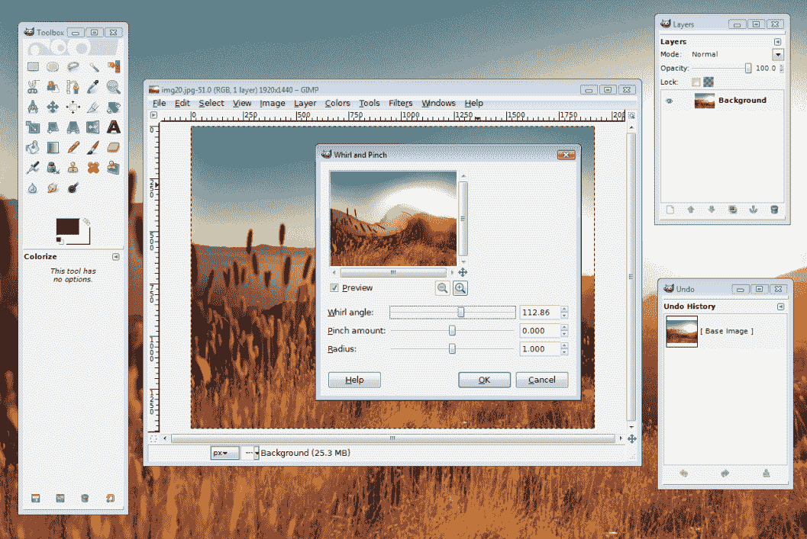

使用 GTK+ 的 GIMP，在 Windows Vista 上显示；版权所有 GTK+ 团队

自其创建以来，该工具包的采用率迅速扩大，得益于其开源许可，它支持在商业和免费应用程序中 alike 的使用。虽然 1.0 版本（于 1998 年发布）主要是为了支持 GIMP 应用程序的功能，但在一年后的 1.2 版本中，工具包的目标是更广泛的受众。2002 年，发布了 2.0 版本，这使得 GTK+ 成为 Gnome Linux 桌面的官方工具包。这个功能齐全的发布极大地扩大了采用率，成为跨平台开发中最受欢迎的控件集之一——2.x 版本的次要发布在 2018 年仍然非常受欢迎。2011 年，发布了 3.0 版本，其中包含了许多更改，其中最引人注目的是基于 **级联样式表**（**CSS**）的新主题引擎，这对于大多数网页开发者来说都很熟悉。尽管 CSS 更容易创建主题，但新方法也受到了批评，许多发行商继续提供 2.24 版本，尽管它已经超过七年了。

Go 语言的一个优点是它为在多个平台上表现一致的应用程序提供了一个单一的 API。GTK+（以及下一章中将要介绍的 Qt）是一个采用类似方法来启用 GUI 应用程序开发的 API。通过将 Go 语言与这两个 API 结合，我们可以创建出（根据用户的主题设置）在所有支持的操作系统（Windows、macOS、Linux 以及许多 Unix 发行版）上看起来和表现都一样的应用程序。在本章中我们使用的 Go 绑定是由 Yasuhiro Matsumoto 创建的，该项目有一长串的维护者名单。它专注于 GTK2 支持，并旨在提供完整的 API 绑定，但当前许多功能尚不可用。正如您在本章中将要看到的，目前可用的绑定支持了大多数应用程序的需求，因此它们目标的局部完成不会影响大多数开发者对这一 API 的使用。

# 开始使用 Go-GTK

要开始使用 Go-GTK，需要在您的系统上安装 GTK+库（如果尚未安装），设置 CGo，并下载 Go 绑定。使用 Go-GTK 构建的应用程序的用户需要在他们的计算机上安装 GTK+库，因此“安装 GTK+”部分可能需要包含在您的文档中。

# 先决条件

针对 GTK+库进行编译将需要设置 CGo；如果尚未完成，您可以查阅附录，*安装细节*。

# 安装 GTK+

使用包管理器安装 GTK+库是最简单的方法，因为它还会配置您的开发环境。

# macOS

对于 macOS，建议使用 Homebrew 进行安装。如果您之前没有设置 Homebrew，可以简单地遵循`https://brew.sh`上的说明。一旦安装了 Homebrew，只需打开一个终端并运行`brew install gtk+`即可。

# Windows

Windows 没有标准包管理器来处理 GTK+之类的工具，但`MSYS`项目旨在解决这个问题。使用已安装的`MSYS Mingw-w64`终端（如果您遵循了 CGo 设置说明，则已安装），我们可以安装额外的库。通过执行以下命令，正确的库应该可以正常运行：

```go
pacman -S mingw-w64-x86_64-gtk2
```

这将安装 GTK+库及其所有依赖项。本章中的示例需要从 MSYS 终端运行，即使已经构建完成。

# Linux

在 Linux 安装中，有很大可能性您已经安装了 GTK+ 2，因为许多应用程序都使用这个小部件集。如果没有（或者您不确定），那么您的系统包管理器将负责安装；只需查找名为`gtk2`或`gtk`的包。如果您的发行版将开发头文件与运行时库分开，您可能需要安装额外的`gtk2-dev`或`gtk-dev`包。

# 安装 Go-GTK

一旦 Go 运行并且 GTK+依赖项安装完毕，你可以简单地使用`go get github.com/mattn/go-gtk`，然后使用`go get github.com/mattn/go-pointer`，`go-gtk`项目依赖于它。安装好之后，我们就准备好构建一个测试应用程序。

# 构建

使用 Go-GTK 的基本欢迎世界应用程序与之前我们看到的类似：我们创建一个窗口，添加一个垂直框，并附加一个标签和一个按钮。下面的代码示例应该很简单，但我们将更详细地查看一些具体细节：

```go
package main

import "github.com/mattn/go-gtk/gtk"

func main() {
   gtk.Init(nil)
   window := gtk.NewWindow(gtk.WINDOW_TOPLEVEL)
   window.SetTitle("Hello")

   quit := gtk.NewButton()
   quit.SetLabel("Quit")
   quit.Clicked(func() {
      gtk.MainQuit()
   })

   vbox := gtk.NewVBox(false, 3)
   vbox.Add(gtk.NewLabel("Hello World!"))
   vbox.Add(quit)

   window.Add(vbox)
   window.SetBorderWidth(3)
   window.ShowAll()
   gtk.Main()
}
```

首先，我们导入`github.com/mattn/go-gtk/gtk`包作为主要的 GTK 命名空间。`Go-GTK`项目被分割成多个命名空间，我们将在本章后面进一步探讨。接下来，使用`gtk.NewWindow()`创建窗口——请注意，这个函数的参数是`window`类型，而不是它的标题（标题将在`SetTitle()`中设置）。使用`gtk.NewButton()`创建`Quit`按钮，并使用`SetLabel()`设置文本，然后我们添加使用`Clicked()`函数的代码来退出，传递一个匿名函数。

布局由使用`gtk.NewVBox(bool, int)`创建的垂直框管理。这个消息的参数首先是一个*均匀的*`bool`标志（确定所有子组件是否应该具有相同的大小），其次是用于*间距*的`int`值（这指定了在每个子元素之间放置的填充量）。

最后，使用`Add()`在窗口上设置内容，并使用`SetBorderWidth(3)`设置与 VBox 中间距一致的填充。调用`ShowAll()`将窗口及其内容设置为显示（因为小部件默认是隐藏的），调用`gtk.Main()`运行应用程序以渲染并响应用户输入。

你可以使用标准的`go build hello.go`命令构建这个程序，它应该为你的操作系统创建一个可运行的文件：

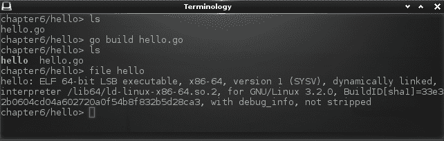

使用 Go-GTK 构建欢迎世界示例

# 运行

你可以通过双击文件图标或使用 Go 工具（使用`go run hello.go`）从命令行运行构建的文件。无论以何种方式启动，你应该看到类似以下截图的内容：

Go-GTK 欢迎世界：

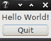

Go-GTK 在 macOS 上：

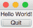

Go-GTK 默认 Windows 外观：

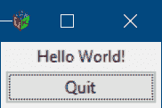

你可以看到，就像和 andlabs UI 一样，我们能够在许多操作系统上运行这个单个文件。这里的区别是应用程序看起来几乎完全相同。这就是使用像 GTK+这样的工具包的好处，这也是你为什么可能考虑为你的下一个应用程序使用 Go-GTK 的原因。

在我们查看更完整的应用程序用户界面之前，我们应该调查一些 Go-GTK API 的细节。

# 信号和命名空间

GTK+是一个事件驱动的工具包；这意味着除非发射了一个事件并且注册了一个回调来接收它，否则不会发生任何事情。GTK+中的事件通过信号实现，为信号注册回调称为连接。信号包括大多数涉及 GUI 行为和通信的事件，包括按钮点击事件或窗口生命周期。

# 信号

你注意到在我们的 hello world 示例中，`Quit`按钮会退出应用程序，但关闭窗口却没有吗？这是因为我们没有将任何回调连接到窗口销毁信号。我们可以通过添加以下行来修复这种情况：

```go
window.Connect("destroy", func() {
   gtk.MainQuit()
})
```

此代码将提供的匿名函数连接到`window`的`destroy`信号。当信号被发射时，函数被调用，应用程序现在将正确退出。由于`gtk.MainQuit()`函数不接受任何参数，我们可以更简洁地写成如下：

```go
window.Connect("destroy", gtk.MainQuit)
```

但等等，按钮点击是如何工作的呢？这是因为我们在`button`组件上使用了`Clicked()`函数。这是一个便利函数，它会为你设置信号连接（并且使代码更整洁！）！如果你查看`Button.Clicked()`函数的源代码，你会看到发生了什么：

```go
func (v *Button) Clicked(onclick interface{}, datas ...interface{}) int {
   return v.Connect("clicked", onclick, datas...)
}
```

因此，你可以看到，并不总是需要手动*连接*这些连接，因为`Go-GTK`提供了许多像这样的便利方法。

# 传递数据

之前的所有示例都使用了一个不带参数的函数。虽然这通常足够了，但向您的信号处理函数传递更多信息可能会有所帮助。这可以通过连接功能（通过`Clicked()`便利函数镜像）轻松完成，它允许发送额外的参数。在函数引用之后，您可以传递额外的数据参数，这些参数将可用于执行回调的函数。

我们可以通过创建一个新的按钮并将此按钮及其功能传递给信号连接来证明这一点：

```go
button := gtk.NewButton()
button.SetLabel(label)
button.Clicked(clicked, button)
```

在回调函数中，我们将函数签名更新为接受一个`*glib.CallbackContext`参数。此参数包含在连接信号时指定的数据。可以使用上下文的`Data()`函数调用访问数据。

转换返回数据的类型很方便，但记住在断言新类型时要小心，因为错误类型会导致你的程序崩溃：

```go
func clicked(ctx *glib.CallbackContext) {
   button := ctx.Data().(*gtk.Button)
   log.Println("Button clicked was:", button.GetLabel())
}
```

在一个简单的示例中，我们创建三个具有相同回调函数的按钮，我们可以看到这个数据参数如何使我们避免创建不必要的函数：

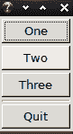    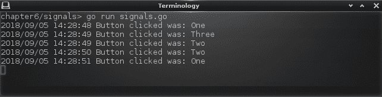

多个按钮；处理多个按钮点击回调的点击函数

如你所注意到的，之前的代码片段提到了一个新的包，`glib`。让我们看看`Go-GTK`项目包含的不同包以及你何时可能想要使用它们。

# 命名空间

`Go-GTK`项目包含多个命名空间，用于组织代码并使开发者更容易找到他们需要的内容。这些子项目或包反映了 GTK+主项目中的命名，因此熟悉这些内容的可以跳过这一部分。到目前为止的大多数示例都使用了`gtk`，这显然是构建用户界面时需要使用的主要包，但正如我们之前看到的，`glib`也可能很重要（对于与小部件无关的事情）。

让我们看看每个命名空间覆盖的内容，并看看在应用程序开发中它们可能在哪里有用：

| `gdk` | GDK 代表 GIMP 绘图工具包；它是 GTK+的低级组件，负责处理每个受支持平台上的渲染细节。这提供了操作系统细节的抽象，因此允许 GTK+的其他区域实现平台无关性。如果你的应用程序需要绘制任何自定义元素，这个包将非常有用。 |
| --- | --- |
| `gdkpixbuf` | Pixbuf 指的是包含用于渲染图像的像素数据的内存缓冲区。这个包提供了一些管理可以加载到 Go-GTK 应用程序中的图像的便利函数。值得注意的是`gdkpixbuf.NewPixbufFromData`函数，它与`make_inline_pixbuf`工具结合使用，允许加载嵌入到应用程序中的图像。 |
| `gio` | `gio`代表 GTK+应用程序的输入/输出抽象。它提供了一个一致的 API 来访问本地和远程文件。 |
| `glib` | `glib`是所有 GTK+功能和应用程序的支持库。它实现了面向对象的系统以及各种数据结构和实用工具。由于 Go 语言原生定义了许多这些，Go-GTK 中的 glib 包负责将 Go 结构转换为 glib（C）结构。这是处理线程管理和消息传递的地方，但大多数这些功能都被库的高级函数隐藏了。 |
| `gtk` | GTK+库中小部件的主要命名空间。正如我们已经看到的，它提供了一个跨平台的工具包来创建图形应用程序，这是由这里列出的其他包实现的。 |
| `pango` | **Pango**是一个字体渲染库，为 GTK+应用程序提供高质量的文本符号。你不太可能需要直接调用这些 API；它主要用于 GTK+内部渲染文本。 |

在查看`Go-GTK`（Go-GTK）中的主要包（并看到应用程序可能只需要使用`gtk`、`glib`和`gdk`）之后，我们将看到这些包是如何在一个更大的应用程序中结合在一起的。

# 示例应用

是时候再次整理 GoMail 应用程序的设计，并使其适应 GTK+小部件了。由于 andlabs UI 应用程序（在 Linux 上运行）使用 GTK+，因此从那里开始似乎是合理的。然而，这次我们不受*最低共同分母*设计约束的限制，andlabs 的本地跨平台设计绕过了这个限制，所以让我们从头开始，看看 GTK+能做什么。

# 布局

使用基于 GTK+的应用程序的基本布局使用熟悉的垂直和水平盒模型。Go-GTK（作为此 API 的直接绑定）公开了相同的功能。我们使用垂直盒定位菜单和工具栏在主内容上方来布局 GoMail 主窗口。然后，我们的主要内容是一个使用`gtk.NewHPaned()`创建的水平分割窗格（其中**H**指的是水平布局，而不是条形方向，条形方向是垂直的）。在查看细节之前，以下是主窗口的基本布局代码。为了简洁起见，省略了工具栏和菜单创建代码，但可以在示例代码仓库中找到：

```go
package main

import "github.com/mattn/go-gtk/gtk"

const padding = 3

func main() {
   gtk.Init(nil)
   window := gtk.NewWindow(gtk.WINDOW_TOPLEVEL)
   window.SetTitle("GoMail")
   window.Connect("destroy", func() {
      gtk.MainQuit()
   })

   list := gtk.NewTreeView()
   list.AppendColumn(gtk.NewTreeViewColumnWithAttributes("Inbox", gtk.NewCellRendererText(), "text", 0))
   meta := gtk.NewHBox(false, padding)

   labels := gtk.NewVBox(true, padding)
   labels.Add(gtk.NewLabel("To"))
   labels.Add(gtk.NewLabel("From"))
   labels.Add(gtk.NewLabel("Date"))
   values := gtk.NewVBox(true, padding)
   values.Add(gtk.NewLabel("email"))
   values.Add(gtk.NewLabel("email"))
   values.Add(gtk.NewLabel("date"))
   meta.Add(labels)
   meta.Add(values)

   content := gtk.NewTextView()
   content.GetBuffer().SetText("email content")
   content.SetEditable(false)

   detail := gtk.NewVBox(false, padding)
   detail.PackStart(gtk.NewLabel("subject"), false, true, 0)
   detail.PackStart(meta, false, true, 0)
   detail.Add(content)

   split := gtk.NewHPaned()
   split.Add1(list)
   split.Add2(detail)

   vbox := gtk.NewVBox(false, padding)
   vbox.PackStart(buildMenu(), false, true, 0)
   vbox.PackStart(buildToolbar(), false, true, 0)
   vbox.Add(split)

   window.Add(vbox)
   window.SetBorderWidth(padding)
   window.Resize(600, 400)
   window.ShowAll()
   gtk.Main()
}
```

在此代码中有两点值得注意。首先是在文件顶部定义的`padding`常量。盒模型没有定义标准间距，因此每次布局需要一些视觉填充时，我们都会传递这个常量。第二个重要的教训是`Add(IWidget)`和`PackStart(IWidget, bool, bool, uint)`方法在盒子上的区别。`Add`方法简单地将小部件追加到容器中（`gtk.Box`继承自`gtk.Container`），这将导致子项扩展以填充可用空间。对于菜单栏和工具栏，我们不希望垂直扩展，因此我们使用`PackStart`方法，这允许对行为有更多的控制。第一个布尔参数控制扩展；通过传递`false`，我们指示容器该小部件不应占用任何空闲空间。

第二个布尔参数控制填充，并确定小部件是否应在任何空间计算完成后填充任何可用空间，因此传递`true`指定我们的工具栏应占满全宽。在`gtk.VBox`中，扩展参数指的是垂直拉伸，而填充应用于水平。

我们还需要向列表视图添加一些内容，这需要创建一个模型来表示我们将要展示的内容。由于内容将是一个没有父/子关系的单列，我们可以使用`gtk.ListStore`，而不是更复杂的`gtk.TreeStore`。将内容设置到模型中的方法是使用迭代器并将值应用于数据表的每一行。对于此布局的目的，我们将`email1`和`email2`添加到视图的 0th（第一）列：

```go
   model := gtk.NewListStore(gtk.TYPE_STRING)
   list.SetModel(model)

   var iter gtk.TreeIter
   model.Append(&iter)
   model.SetValue(&iter, 0, "email1")
   model.Append(&iter)
   model.SetValue(&iter, 0, "email2")
```

工具栏 API 简单易用，通过利用 GTK+ 中包含的库存图标，为许多常见操作提供标准图标。由于我们的一些按钮是非标准的（例如“回复”和“全部回复”），我们将工具栏样式设置为显示图标和标签；稍后，我们可以添加一些自定义图标。每个项目都可以使用 `OnClicked()` 函数或通过连接 `clicked` 信号来设置其操作：

```go
   toolbar := gtk.NewToolbar()
   toolbar.SetStyle(gtk.TOOLBAR_BOTH)
   item := gtk.NewToolButtonFromStock(gtk.STOCK_NEW)
   item.OnClicked(showCompose)
   toolbar.Add(item)
```

其余的图标可以类似地添加。菜单代码稍微复杂一些；每个下拉菜单（无论是子菜单还是主菜单）都需要使用 `gtk.NewMenu()` 创建，并按所示添加其项目。然后，每个顶级菜单需要创建一个新的菜单项（例如，`gtk.NewMenuItemWithLabel()`），并使用 `SetSubmenu()` 连接菜单。构建的菜单可以随后附加到菜单栏：

```go
menubar := gtk.NewMenuBar()
fileMenu := gtk.NewMenuItemWithLabel("File")

menu := gtk.NewMenu()
item := gtk.NewMenuItemWithLabel("New")
item.Connect("activate", showCompose)
menu.Append(item)

fileMenu.SetSubmenu(menu)
menubar.Append(fileMenu)
```

在所有这些代码到位（以及工具栏和菜单中的几个更多项目）之后，我们有一个基本的布局，应该看起来很熟悉。如您所见，我们已经开始从更大的小部件工具包的附加功能中受益，包括标准图标、更完整的样式和布局：

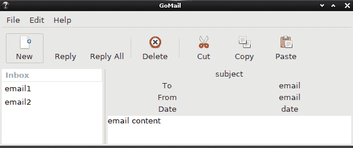

在我们进行任何样式调整之前，使用 Go-GTK 的 GoMail 的基本布局

使用 `label.SetAlignment(0, 0)` 可以设置左对齐，从而改善布局，尤其是电子邮件详情面板的布局。通过使用 `pango` 库的标记功能，可以将标签内容设置为粗体；只需调用 `label.SetMarkup(fmt.Sprintf("<b>%s</b>", label.GetText()))` 即可。前面的代码主要关注基本布局，因此这些调整被省略了。附加的细节包含在示例代码仓库中，完成的界面可以在关于主题的后续部分中查看。

# 撰写布局

显示撰写对话框的代码现在应该非常熟悉了。窗口被创建为 `gtk.WINDOW_TOPLEVEL`，因为 Go-GTK 只允许选择顶级或弹出（即浮动内容），而不是对话框等子窗口。我们设置了一个销毁函数，它会关闭窗口而不是退出应用程序。

剩余的布局代码是每个项目的常规垂直框，对于 `to` 标签，它位于输入字段左侧的水平框：

```go
func buildCompose() {
   window := gtk.NewWindow(gtk.WINDOW_TOPLEVEL)
   window.SetTitle("New GoMail")
   window.Connect("destroy", func() {
      window.Destroy()
   })

   vbox := gtk.NewVBox(false, padding)
   subject := gtk.NewEntry()
   subject.SetText("subject")
   vbox.PackStart(subject, false, true, 0)
   toBox := gtk.NewHBox(false, padding)
   toBox.PackStart(gtk.NewLabel("To"), false, true, 0)
   email := gtk.NewEntry()
   email.SetText("email")
   toBox.Add(email)
   vbox.PackStart(toBox, false, true, 0)

   content := gtk.NewTextView()
   content.GetBuffer().SetText("email content")
   content.SetEditable(true)
   vbox.Add(content)

   buttonBox := gtk.NewHBox(false, padding)
   buttonBox.PackEnd(gtk.NewButtonWithLabel("Cancel"), false, true, 0)
   buttonBox.PackEnd(gtk.NewButtonWithLabel("Send"), false, true, 0)
   vbox.PackEnd(buttonBox, false, true, 0)

   window.Add(vbox)
   window.SetBorderWidth(padding)
   window.Resize(400, 320)
   window.ShowAll()
}
```

如您通过 `buttonBox` 所见，我们已经使用了之前描述的 `PackEnd()` 函数，将按钮在撰写窗口的底部右对齐。我们还使用了主窗口的 `padding` 定义，为我们的小部件提供一致的间距。运行前面的代码应该会加载一个类似于这样的窗口：

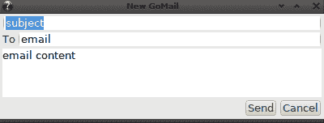

使用 Go-GTK 的 GoMail 撰写窗口

现在我们已经准备好了基本的布局和输入字段，让我们通过我们的测试电子邮件服务器连接到一些内容。

# 信号

在传统的 GTK+ 应用程序中，使用内置的信号处理能力是可能的，甚至是被推荐的。可以创建一个新的信号，然后在适当的时候由应用程序发出；组件可以连接到这个信号并做出相应的响应。然而，创建信号的能力并没有通过 Go-GTK API 暴露出来，因此我们将使用类似于前例的回调。

为了加载我们的测试服务器，我们首先更新 `main()` 函数以设置服务器并将其传递给用户界面创建代码。然后，我们设置内容以显示测试服务器的当前消息：

```go
func main() {
   server := client.NewTestServer()
   main := new(mainUI)
   main.showMain(server)
   main.setEmail(server.CurrentMessage())

   gtk.Main()
}
```

这使用了新的辅助函数，该函数将设置电子邮件详细面板的内容。我们将在稍后的列表选择代码中调用此函数：

```go
func (m *mainUI) setEmail(message *client.EmailMessage) {
   m.subject.SetText(message.Subject)
   m.to.SetText(message.ToEmailString())
   m.from.SetText(message.FromEmailString())
   m.date.SetText(message.DateString())

   m.content.GetBuffer().SetText(message.Content)
}
```

为了设置电子邮件列表的内容，我们在创建应用程序结构体时存储迭代器和模型，以便以后可以引用。以下辅助函数处理将项目预加到电子邮件列表中的细节。这个函数在 `server.ListMessages()` 中的每个消息上被调用，以设置初始列表：

```go
func (m *mainUI) prependEmail(message *client.EmailMessage) {
   m.listModel.Prepend(&m.listIter)
   m.listModel.SetValue(&m.listIter, 0, message.Subject)
}
```

与用户界面基本通信的最后一部分是处理树视图中项目的选择。为了处理这一点，我们的应用程序必须实现 `gtk.GtkTreeSelecter`，它有一个单一的 `Select()` 函数。以下实现将满足我们的需求。首先，请注意，这可以用于选择和取消选择，因此我们需要检查项目当前是否未被选中。然后，我们使用回调调用时指定的路径来确定被点击的行。这个行号用于从消息的服务器列表中获取电子邮件。然后，我们可以调用我们的有用函数 `setEmail()`：

```go
func (m *mainUI) Select(selection *gtk.TreeSelection, model *gtk.TreeModel, path *gtk.TreePath, selected bool) bool {
   if selected { // already selected, just return
      return true
   }

   row := path.GetIndices()[0]
   email := m.server.ListMessages()[row]

   m.setEmail(email)
   return true
}
```

为了使选择处理程序被调用，我们必须在创建 `gtk.ListView` 时注册它：

```go
var selecter gtk.GtkTreeSelecter
selecter = mainUI
list.GetSelection().SetSelectFunction(&selecter)
```

现在，用户界面应该已经完成。我们需要处理新电子邮件到达时的后台更新。

# 线程处理

在我们能够正确处理 Go-GTK（或任何 GTK+ 实现）的背景处理之前，我们必须正确初始化底层库（`glib` 和 `gdk`）的线程处理部分。这些行应该在应用程序的 `main()` 函数开始时输入：

```go
glib.ThreadInit(nil)
gdk.ThreadsInit()
gdk.ThreadsEnter()
gtk.Init(nil)
```

一旦设置了线程处理，我们就可以编写将与用户界面通信的后台代码。此代码必须在创建应用程序时相同的线程上执行。为了确保这一点，我们在要执行的代码周围使用辅助函数 `gdk.ThreadsEnter()` 和 `gdk.ThreadsLeave()`。为了使我们的应用程序在消息到达时将新消息添加到电子邮件列表的末尾，在调用 `gtk.Main()` 以启动应用程序之前立即添加以下代码：

```go
   go func() {
      for email := range server.Incoming() {   
gdk.ThreadsEnter()
         main.prependEmail(email)
         gdk.ThreadsLeave()
      }
   }()
```

这完成了我们在 Go-GTK 中实现 GoMail 应用程序的工作，但如何为不同的平台编译应用程序呢？

# 跨平台编译

为 Go-GTK 基于的应用程序编译针对额外平台需要安装额外的 C 编译器，以便 CGo 可以创建必要的二进制输出。如果您还没有这样做，完成此步骤的步骤在附录，*交叉编译设置*中。您还需要安装 GTK+，这显然已经是既定事实。由于 andlabs UI 使用 GTK+库针对某些目标平台，第四章的*构建图形窗口应用程序*部分已经详细说明了，所以我们在这里不再重复。由于 andlabs UI 使用 GTK+库针对某些目标平台，这个过程是相同的。请确保设置适当的`GOOS`、`GOARCH`、`CGO_ENABLED`、`CC`和`CXX`环境变量。

在我们结束对工具包的探索之前，我们应该看看它提供的主题功能带来的好处。

# 主题

使用基于 GTK+（或 Qt）的 API 的一个大优点是，小部件集可以主题化。用户可以安装任意数量的主题（或编写自己的主题）来控制应用程序的外观。虽然这可能会增加测试开销，但它们将在所有平台上表现相同，因此负担有所减轻。

让我们看看这里展示的 GoMail 应用程序应用的一些不同主题，首先是名为`Clearlooks`的出色浅色主题。

+   Linux 上的 Clearlooks 主题：

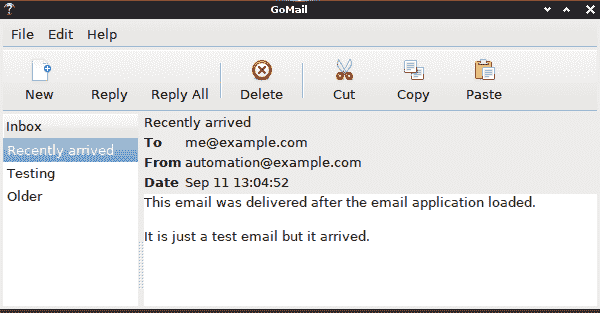

+   在 Clearlooks 中撰写：

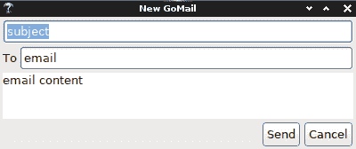

在 Windows 上，默认主题看起来更像标准小部件，尽管用户可以加载任何其他 GTK+主题。注意，默认图标也有所不同，更符合操作系统标准。

+   Windows 默认主题：

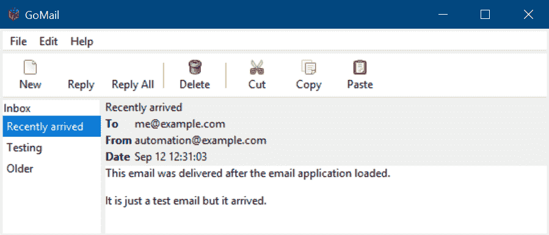

+   使用 Windows 撰写：

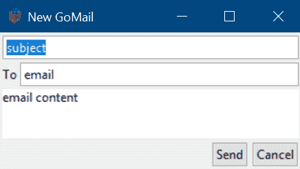

还有许多深色主题；*Arc Dark*非常受欢迎。

+   在 Linux 上运行的 Arc Dark 主题：


+   Ark Dark 撰写窗口：

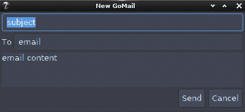

许多主题是为怀旧而设计的，包括这个基于 20 世纪 90 年代彩色桌面环境的 CDE 主题。

+   运行 CDE 主题以获得复古外观：

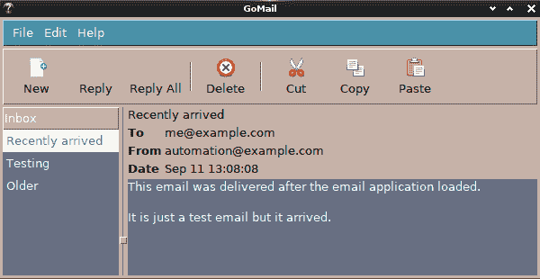

+   在 CDE 主题中撰写：

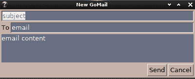

如您所见，用户界面元素的色彩可以有很大差异，但布局大体上一致。如果您查看按钮（撰写窗口中的`发送`和`取消`按钮），某些边缘的圆角也有所不同。使用 Go-GTK 构建的应用程序应该能够与任何加载的主题良好工作，但在质量保证过程中检查各种不同的配置是明智的。

# 摘要

在本章中，我们探讨了 GTK+工具包的细节以及它是如何通过 go-GTK 提供给 Go 的。我们研究了如何在 macOS、Windows 和 Linux 上设置它，以及这些平台上的应用程序看起来和行为方式完全相同。我们探讨了 API 设计、其各种组件以及其事件驱动模型是如何向开发者公开的。

然后，我们回到了第四章的 GoMail 应用程序，“Walk - 构建图形窗口应用程序”，以及第五章，“andlabs UI - 跨平台原生 UI”，使用 Go-GTK 库重新构建它。由于 API 提供了对大多数 GTK+功能的访问，我们发现该应用程序看起来比在第五章中使用的 andlabs UI 内由 Linux 驱动程序创建的基于 GTK+的应用程序更完整。我们在应用程序中实现了一些基本的线程和信号处理，以处理用户输入和后台事件。最后，我们探讨了强大的 GTK+主题引擎如何样式化创建的应用程序用户界面。

到现在为止，你应该已经熟悉了 Go-GTK 库，以及它是如何利用底层的 GTK+工具包，并允许使用 Go 快速开发 GUI 应用程序。这些应用程序将与操作系统标准的界面和感觉不同，但接近标准应用程序设计，因此应该对大多数用户来说都很熟悉。如果界面小部件设计或 API 并不是你想要的，那么请阅读下一章，我们将探讨 GTK 的替代方案，即 Qt 框架。
