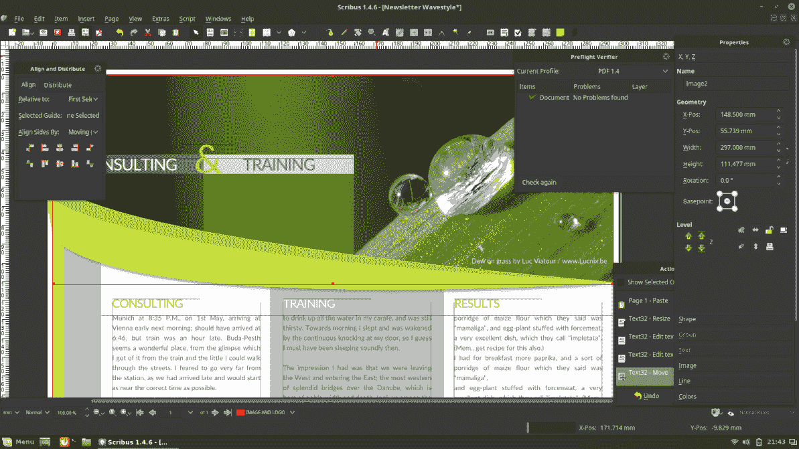
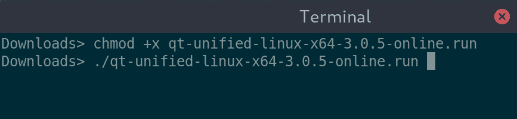
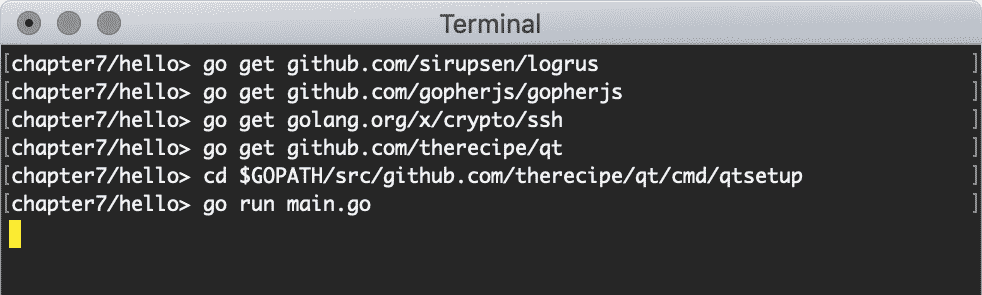
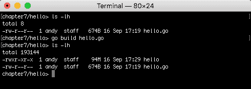
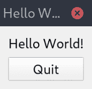
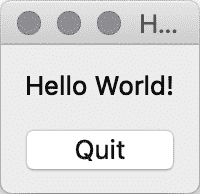
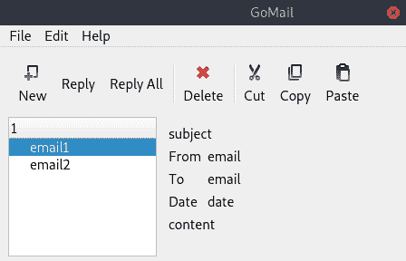
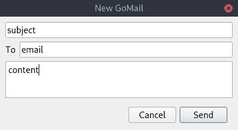
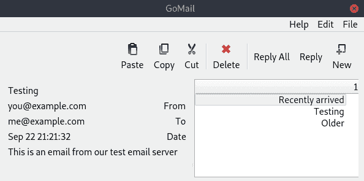

# Go-Qt - 使用 Qt 的多平台

与我们在上一章中探讨的 Go-GTK 库类似，therecipe 的 qt 允许你使用单个 Go 代码库编写跨平台的图形应用程序。它利用 Qt，这是一个为快速将应用程序交付到桌面和嵌入式计算环境而设计的多平台应用程序框架。像 GTK+一样，它旨在绘制用户熟悉的控件，但不依赖于操作系统提供的工具包。此外，Qt 为移动和嵌入式设备提供了不同的外观，用户期望不同的展示风格。所有这些都在框架内部控制，这样开发者就可以专注于开发单个应用程序。

在本章中，我们将探讨最广泛采用的 Go 语言 Qt 绑定 recipe/qt 的细节。我们将涵盖以下内容：

+   Qt 框架的历史和目标

+   API 是如何设计和桥接到 Go 的

+   使用 therecipe/qt 库创建应用程序

+   Qt 应用程序的主题功能

到本章结束时，你将熟悉 Qt 框架的功能及其对许多不同平台的支持。通过探索一些示例应用程序和我们的 GoMail 应用程序，你将了解 recipe 的 Go 绑定如何为 Go 开发提供对这些功能的访问。你还应该了解 Qt 框架是否适合你的下一个应用程序。

# Qt 背景

Qt 框架是由名为 Trolltech 的公司在 1991 年创建的（现在称为 Qt 公司）。KDE Linux 桌面是基于 Qt 的，Qt 的流行度的增加可能是 Qt 开发变得更加普遍的关键原因。作为一个部分针对嵌入式设备的平台，使用 Qt 的典型开发者与 GTK+框架的开发者不同。此外，由于他们的商业支持，可用的工具和支持得到了更好的发展。

Qt 框架以两种不同的发行版发布，一个是商业版，另一个是开源版（称为双重许可）。这样，他们可以免费支持符合开源规范的应用程序，同时为封闭源代码的商业项目提供无限制的使用。在 2000 年之前（2.2 版本的发布），免费分发的源代码在多种许可证下，一些团体认为这些许可证与常见的开源倡议不兼容。对于 2.2 版本的发布，它被改为 GPL 许可证，这解决了关于该团体对真正开源自由的承诺的任何疑虑。2007 年，发布了 Qt 4.5，他们为更喜欢更宽松许可证的开发者添加了 LGPL 作为选项。

在 2011 年，诺基亚公司成立了 Qt 项目，旨在开放 Qt 库的开发路线图。Qt 最大的市场是在嵌入式设备上，如汽车和家电，这项技术被特斯拉和奔驰等大型公司所采用：



Scribus 是一个用 Qt 编写的流行桌面出版应用程序（图片版权：Henrik Hüttemann）

therecipe 的 Go 绑定（其真实名称未与项目相关联），以及许多贡献者，旨在将 Qt API 及其庞大的支持平台列表带到 Go 语言中。该项目支持为 Windows、macOS 和 Linux 桌面计算机以及 Android、iOS 和许多其他移动和嵌入式设备构建应用程序。

# 开始使用 therecipe/qt

要开始探索 Qt 和 Go 的绑定，我们将构建一个简单的 *hello world* 应用程序。为了能够做到这一点，我们首先需要安装 recipe/qt，它依赖于各种必须首先设置的前提条件。

# 前提条件

与 Go-GTK 一样，我们将依赖于一个本地库，这要求我们设置 CGo 功能并安装适用于当前平台的 Qt 库。

# 准备 CGo

Qt Go 绑定，就像本书中介绍的其他许多工具包一样，需要 CGo 的存在来利用本地库。在一个完整的开发系统中，这可能是已经设置好的。如果您不确定或想回顾如何设置 CGo 依赖项，请查阅附录 *设置 CGo*。

# 安装 Qt

Qt 网站 ([www.qt.io/download](https://www.qt.io/download)) 提供了各种安装方法，包括任何拥有 Qt 账户的人都可以使用的定制在线安装程序（注册 Qt 账户是免费的）。通常，Qt 安装包括 Qt Creator（项目 IDE）、GUI 设计器、其他工具和示例。访问前面的网站将自动检测您的系统并建议最合适的下载（这通常是最佳选项）。

请注意，Qt 安装可能相当大。如果您硬盘上没有至少 40 GB 的空间，您需要在安装之前腾出一些空间。

一些操作系统将 Qt 库和工具作为其包管理器的一部分提供，这通常提供了一种更轻量级的安装方式，可以自动保持更新。然而，此选项并不提供 Qt 开发工具的完整功能集，本章中讨论的 Qt 绑定默认使用在线安装程序提供的标准 Qt 安装。

# macOS

在 Apple macOS 上，最佳安装方法是使用 Qt 下载网站提供的安装程序应用程序。访问 [www.qt.io/download](https://www.qt.io/download) 并下载 macOS 安装程序。下载完成后，打开包并运行程序；这将安装所选的编译器、工具和支持应用程序。如果在安装过程中遇到任何错误，第一步应该是检查您的 Xcode 安装是否完整且最新（更多信息，请参阅 *安装详情* 附录）。

# Windows

在 Windows 上安装比我们之前查看的一些工具包更简单，因为 Qt 安装程序捆绑了 `mingw` 包，用于设置大多数编译需求（尽管在绑定阶段仍建议您设置自己的编译器）。要安装它，请访问之前列出的下载页面并访问 Windows 安装程序。运行下载的可执行文件并按照屏幕上的说明操作。建议安装到默认位置。一旦完成，您就可以设置绑定了。

# Linux

使用来自 [`www.qt.io`](https://www.qt.io) 的在线安装程序是最简单的方法，尽管也可能通过您的系统包管理器进行安装（如果您想尝试包管理器方法，请首先阅读 Qt Linux 文档，见 [`github.com/therecipe/qt/wiki/Installation-on-Linux`](https://github.com/therecipe/qt/wiki/Installation-on-Linux)）。在大多数 Linux 平台上，Qt 下载网站将正确检测平台并提供一个简单的运行安装程序。下载文件后，您应该使其可执行，然后运行它：



在 Linux 上，您需要使安装文件可执行并运行它

这将启动安装程序，就像在 macOS 上一样；从这里开始，按照屏幕上的说明完成安装。

# 许可证 / Qt 账户

当来到登录屏幕时，如果您有 Qt 账户详情，请输入。如果您符合他们的开源许可证（GPL 或 LGPL），您可以跳过此步骤——要这样做，请确保电子邮件和密码字段为空。

# 安装 qt（绑定）

要使用 qt（Go Qt 绑定），我们需要下载项目和其依赖项，然后运行一个设置脚本以配置和编译库。如果使用 Windows，建议使用附录中描述的 MSYS2 终端。

如果您将 Qt 下载安装到了非默认位置，请确保将 `QT_DIR` 环境变量设置为所选位置。

首先，应使用 `go` 工具安装库及其依赖项，通过运行 `go get github.com/sirupsen/logrus` 和 `go get github.com/therecipe/qt`。

下载完成后，我们需要运行 `qtsetup` 工具，该工具包含在 qt 项目中；因此，在 `cmd/qtsetup` 文件夹中，执行 `go run main.go`。使用 Linux 终端，它应该看起来像这样：



执行 therecipe/qt 绑定的 qtsetup 脚本

一旦此过程完成，绑定应该可以使用了。如果您遇到错误，那么可能是因为 Qt 工具没有正确安装，或者位置被自定义了，而您忘记设置 `QT_DIR` 环境变量。

# 构建

要使用 Go 构建我们的第一个 qt 应用程序，让我们再创建一个 *Hello World* 应用程序。与之前的示例一样，我们将在单个应用程序窗口内使用一个简单的垂直框布局。以下代码应该足以加载你的第一个应用程序：

```go
package main

import (
   "os"

   "github.com/therecipe/qt/widgets"
)

func main() {
   app := widgets.NewQApplication(len(os.Args), os.Args)

   window := widgets.NewQMainWindow(nil, 0)
   window.SetWindowTitle("Hello World")

   widget := widgets.NewQWidget(window, 0)
   widget.SetLayout(widgets.NewQVBoxLayout())
   window.SetCentralWidget(widget)

   label := widgets.NewQLabel2("Hello World!", window, 0)
   widget.Layout().AddWidget(label)

   button := widgets.NewQPushButton2("Quit", window)
   button.ConnectClicked(func(bool) {
      app.QuitDefault()
   })
   widget.Layout().AddWidget(button)

   window.Show()
   widgets.QApplication_Exec()
}
```

让我们从这段代码中注意一些细节。您会看到每个小部件构造函数通常接受两个参数，每个参数都是父小部件和一个 `flags` 参数。传递给这些值的附加类型通常会在函数名中添加一个注释，表明有额外的参数。例如，`widgets.NewQLabel2(title, parent, flags)` 等同于 `widgets.NewQLabel(parent, flags).SetTitle(title)`。此外，您会看到布局是通过 `SetLayout(layout)` 应用到新的 `widgets.QWidget` 上的，并且通过 `window.SetCentralWidget(widget)` 设置为窗口内容。

要加载显示并运行应用程序，我们调用 `window.Show()` 然后调用 `widgets.QApplication_Exec()`。此文件以通常的方式构建，使用 `go build hello.go`：



构建很简单，但输出文件相当大

由于 Qt 框架的大小，构建的文件相当大。在为特定发行版打包时，这将显著减少。这个主题将在第十四章“分发你的应用程序”中深入探讨。

# 运行

构建阶段的输出是一个可以在当前计算机上执行的二进制文件，无论是在命令行上还是在文件管理器中双击。此外，您还可以直接使用 `go run hello.go` 来执行它——无论哪种方式，您都应该看到一个简单的窗口，如图所示：



在 Linux 上运行 qt Hello



在 macOS 上运行

在这个阶段，二进制文件可以在安装了 Qt 的具有相同架构的计算机上执行。我们将在本章后面讨论更广泛的分发。在此之前，让我们更深入地了解 Qt API 和 qt 绑定的运作方式。

# 对象模型和事件处理

Qt 框架是用 C++ 语言编写的，因此其架构对之前使用过 C++ 编码的人来说非常熟悉。需要注意的是，Go 不是一个完整的面向对象语言，因此它不能直接匹配这些功能。特别是，我们应该关注继承，因为它对 Qt 对象模型非常重要。

# 继承

Qt API 是一个完全面向对象的模型，大量使用了继承模型。虽然 Go 并不完全支持传统方式的对象继承，但其组合方法非常强大，并且在其位置上运行良好。结果是，你可能不会注意到任何区别！这只有在你想实现一个自定义小部件时才会出现，而这超出了本章的范围。

# 内存管理

正如你在前面的示例中所注意到的，每个小部件都期望将父对象传递给构造函数。这使得 Qt 框架能够处理小部件树的清理和内存释放。`QObject`（它是所有 Qt API 的基对象）跟踪其子对象，因此当被移除时，它也可以移除其子对象。这使得创建和删除复杂的 widget 层次结构更容易正确处理。为了使用这个功能，你应该始终记得将父对象传递给小部件的构造函数（以 `New...` 开头的 Go 函数），尽管传递 `nil` 可能看起来像是在工作。

# 信号和槽

Qt 与 GTK+ 类似，是一个事件驱动的框架，并广泛使用信号来处理事件管理和数据通信。在 Qt 中，这个概念被分为信号和槽；信号是事件发生时将生成的内容，槽是可以接收信号的内容。将槽设置为接收信号的动作称为**连接**，这会导致当连接的信号被调用时，槽函数将被调用。在 Qt 中，这些是类型化的事件，意味着每个信号都有一个与其关联的类型参数列表。当信号被定义时，这个类型被设置，任何希望连接到信号的槽都需要有相同的类型。

在 qt Go 代码中，信号和槽使用类似于 `func(string) `signal:"mySignal"`` 和 `func(string) `slot:"mySlot"`` 的结构标签来定义，这些标签为 Go 类型系统提供元数据，就像我们在第三章“Go to the Rescue!”中的 JSON 示例一样。给定一个定义这些属性的 `s` 结构，我们可以设置一个函数，当 `mySignal` 触发时执行以下代码：

```go
s.ConnectMySignal(
   func(msg string) {
      log.Println("Signalled message", msg)
   }
)
```

信号和槽是 Qt Designer 生成的用户界面的动力源泉，也是处理多线程应用程序的推荐方式。一个信号可能从后台线程触发，用户界面代码可以将这个信号连接到自己的槽——本质上是在监听信号。当信号触发时，任何相关数据（信号的参数）将从一条线程传递到另一条线程，以便在 GUI 更新中安全使用。在许多方面，这与我们在第三章“Go to the Rescue!”中广泛讨论的 Go 通道的工作方式相似。

由于 Qt 是对 Qt API 的轻量级绑定，Go 特定的文档很少，但你可以在官方文档中找到更多关于 Qt 设计和所有可用类的信息，官方文档的网址是 [`doc.qt.io/qt-5/classes.html`](https://doc.qt.io/qt-5/classes.html)。

既然我们已经了解了 Qt 应用程序和 qt Go 实现的设置，让我们通过回到我们的 GoMail 示例来探索一个更完整的应用程序。

# 示例应用程序

为了查看一个更完整的应用程序，我们将重新审视 GoMail 应用程序的原始设计——毕竟，它们最初是用 Qt Designer 创建的。我们将重新创建第四章“构建图形窗口应用程序”中生成的确切布局，并在进行过程中解释实现方式。

# 布局

在我们的 GoMail 示例中，我们首次拥有了一个工具包，它提供了所有所需的布局来匹配我们在第二部分“使用现有小部件的工具包”开始时设计的用户界面。这或许并不令人惊讶，因为它使用了 Qt 工具创建，但这是一个探索 Qt 提供的更完整布局集以及通过 qt 绑定提供的机会。最有用的布局如下：

| **布局** | **描述** |
| --- | --- |
| **框** | 框布局现在非常熟悉；它将小部件布局在水平或垂直框中。因此，它使用`widgets.NewQVBoxLayout()`或`widgets.NewQVBoxLayout()`相应地创建。 |
| **表单** | 这是一个便利的布局，基本上是一个两列网格，其中左侧列的所有小部件都是标签。它根据 Qt Creator 中看到的设计进行了相应的样式化。 |
| **网格** | 这种布局代表了一种灵活的网格布局，使得单元格不必都强制保持相同的大小，而是行和列会根据网格中打包项目的最小尺寸进行伸缩以适应。 |
| **间隔** | 虽然间隔项本身不是布局，但它可以在布局中用来创建视觉空间。使用`widgets.NewQSpacerItem(width, height, hPolicy, vPolicy)`构造，可以使用这个有用的类添加各种不同类型的间隔。 |
| **堆叠** | 堆叠布局将所有子对象设置为包含小部件的全尺寸，但确保一次只能看到一个。可以使用`SetCurrentWidget()`和`SetCurrentIndex()`函数来控制哪个子对象可见。这对于实现标签面板或分页控件非常有用。 |

利用这些知识，我们可以使用纯 Qt 小部件重新创建 GoMail 浏览界面。现在，大部分代码都很熟悉，但也有不少显著的不同之处。首先，你可以看到布局（如之前所列）通常设置在 `widgets.QWidget` 上，而不是为它们自己的目的创建全新的小部件。这种方法意味着可以保持不同小部件的数量较低，但也导致一些功能被附加到布局上而不是小部件上。例如，我们设置在 `detail` 小部件上的 `widgets.NewQFormLayout()` 是为了布局表单组件，因此具有添加行（例如 `form.AddRow3`）的辅助函数。要使用这些函数，我们必须保持对布局（本代码中的 `form` 变量）的引用以进行操作。你还可以看到 `AddWidget()` 是在 `widget.Layout()` 上而不是直接在 `widget` 上调用的。

这个片段包含了创建我们基本布局的大部分代码。一些工具栏和菜单代码（相当重复）已被省略，但可以在伴随本书的代码仓库中找到。我们首先导入并创建一个基本的菜单栏框架：

```go
package main

import (
   "github.com/therecipe/qt/core"
   "github.com/therecipe/qt/gui"
   "github.com/therecipe/qt/widgets"
   "os"
)

func buildMenu() *widgets.QMenuBar {
   menu := widgets.NewQMenuBar(nil)

   file := widgets.NewQMenu2("File", menu)
   ...
   menu.AddMenu(file)

   ...

   return menu
}
```

同样，我们可以使用内置图标创建一个新的工具栏：

```go
func buildToolbar() *widgets.QToolBar {
   toolbar := widgets.NewQToolBar("tools", nil)
   toolbar.SetToolButtonStyle(core.Qt__ToolButtonTextUnderIcon)
   toolbar.AddAction2(gui.QIcon_FromTheme2("document-new", nil), "New")

   ...

   return toolbar
}
```

最后，我们布局窗口的主要内容：

```go
func main() {
   widgets.NewQApplication(len(os.Args), os.Args)

   window := widgets.NewQMainWindow(nil, 0)
   window.SetWindowTitle("GoMail")

   widget := widgets.NewQWidget(window, 0)
   widget.SetLayout(widgets.NewQVBoxLayout())
   window.SetMinimumSize2(600, 400)
   window.SetCentralWidget(widget)

   window.SetMenuBar(buildMenu())
   widget.Layout().AddWidget(buildToolbar())

   list := widgets.NewQTreeView(window)
   list.SetModel(core.NewQStringListModel2([]string{"email1", "email2"}, widget))

   detail := widgets.NewQWidget(window, 0)
   form := widgets.NewQFormLayout(detail)
   detail.SetLayout(form)
   form.AddRow5(widgets.NewQLabel2("subject", detail, 0))
   form.AddRow3("From", widgets.NewQLabel2("email", detail, 0))
   form.AddRow3("To", widgets.NewQLabel2("email", detail, 0))
   form.AddRow3("Date", widgets.NewQLabel2("date", detail, 0))
   form.AddRow5(widgets.NewQLabel2("content", detail, 0))

   splitter := widgets.NewQSplitter(window)
   splitter.AddWidget(list)
   splitter.AddWidget(detail)
   widget.Layout().AddWidget(splitter)

   window.Show()
   widgets.QApplication_Exec()
}
```

之前的代码结构与上一章类似（因为 GTK+ 和 Qt API 有很多相似之处），尽管命名会让你想起第四章（3b8f1272-2158-4744-945f-3258b5c4f61c.xhtml），*构建图形窗口应用程序*，以及 Walk 示例。显然，由于 Walk 主要基于 Qt，命名通常是相同的，但这里使用的 Qt API 不提供相同的声明性语法，因此必须使用基于函数的构造函数来创建。

本例介绍了两个新的 Qt 包，`core` 和 `gui`。如你所见，我们使用 `core` 包与数据模型（许多更复杂的小部件都使用）一起使用。`gui` 包提供了有助于使用户界面更具吸引力的辅助功能；在这种情况下，我们使用 `gui.QIcon_FromTheme2` 函数查找标准图标。在一个更完整的应用程序中，我们可以提供备选图标，以完成回复和全部回复的工具栏按钮：



使用 Qt 的 GoMail 应用程序的完整布局

如从这张截图所示，一个 Qt 应用程序甚至可以用最基础的代码看起来也很精致。你可能注意到了电子邮件列表上方的数字 1 而不是收件箱；这是由于用于此布局示例的 `core.QStringListModel` 的限制，应在我们的完整实现中解决。

# 编写布局

GoMail 的撰写布局甚至更简单：我们再次使用`widgets.QFormLayout`，尽管`To`字段是唯一包含标签的行。对于这个更简单的窗口，我们创建`widgets.QDialog`并将布局直接设置在对话框小部件上。为了在屏幕底部添加按钮，我们使用一个新的`widgets.QWidget`，其布局设置为`widgets.NewQHBoxLayout()`以水平排列按钮。为了管理右对齐，我们在按钮之前首先包含`widgets.NewQSpacerItem()`在按钮框中。最后请注意，我们在`send`按钮上调用`SetDefault(true)`，使其成为默认操作：

```go
package main

import "github.com/therecipe/qt/widgets"

func showCompose() {
   dialog := widgets.NewQDialog(nil, 0)
   dialog.SetModal(false)
   dialog.SetWindowTitle("New GoMail")

   form := widgets.NewQFormLayout(dialog)
   dialog.SetLayout(form)
   dialog.SetMinimumSize2(400, 320)

   form.AddRow5(widgets.NewQLineEdit2("subject", dialog))
   form.AddRow3("To", widgets.NewQLineEdit2("email", dialog))
   form.AddRow5(widgets.NewQTextEdit2("content", dialog))

   buttons := widgets.NewQWidget(dialog, 0)
   buttons.SetLayout(widgets.NewQHBoxLayout())
   buttons.Layout().AddItem(widgets.NewQSpacerItem(0, 0, widgets.QSizePolicy__Expanding, 0))
   buttons.Layout().AddWidget(widgets.NewQPushButton2("Cancel", buttons))
   send := widgets.NewQPushButton2("Send", buttons)
   send.SetDefault(true)
   buttons.Layout().AddWidget(send)
   form.AddRow5(buttons)

   dialog.Show()
}
```

从前面的代码中，我们得到以下期望的结果——一个简单且熟悉的撰写对话框窗口：



使用 Qt 小部件的电子邮件撰写对话框

现在布局已经完成，让我们将我们的测试电子邮件服务器连接起来，以显示一些电子邮件数据。

# 信号

为了完成 GoMail 示例的交互，我们将使用 Qt 中的标准信号和槽。首先，我们需要设置我们的测试电子邮件服务器的一个实例并加载数据。我们添加一个`setMessage(*client.EmailMessage)`函数来设置标签的内容，这个函数可以在我们的 GUI 加载时和电子邮件列表被点击时调用：

```go
func (m *mainUI) setMessage(message *client.EmailMessage) {
   m.subject.SetText(message.Subject)
   m.to.SetText(message.ToEmailString())
   m.from.SetText(message.FromEmailString())
   m.date.SetText(message.DateString())

   m.content.SetText(message.Content)
}
```

处理点击电子邮件列表的代码看起来像以下片段。我们创建一个匿名函数并将其连接到`selectionChanged`信号。记住在查找所选行号之前检查是否没有选中的索引：

```go
list.ConnectSelectionChanged(func(selected *core.QItemSelection, _ *core.QItemSelection) {
   if len(selected.Indexes()) == 0 {
      return
   }

   row := selected.Indexes()[0].Row()
   m.setMessage(m.server.ListMessages()[row])
})
```

接下来，我们需要更新我们的工具栏和菜单，以便在点击“新建”时打开撰写对话框。要连接的信号是`triggered`；我们需要将`showCompose()`包裹在一个匿名函数中，因为信号类型传递一个`bool`标志（用于检查状态），而我们想忽略这个标志。代码对于工具栏和菜单是相同的：

```go
new := file.AddAction("New")
new.ConnectTriggered(func(_ bool){showCompose()})
```

相似的代码用于处理按钮点击，它发送一个`clicked`信号；我们的撰写对话框`c`将连接一个匿名函数来撰写电子邮件，发送它，并在点击“发送”时隐藏对话框：

```go
send.ConnectClicked(func(_ bool) {
   email := c.createEmail()
   c.server.Send(email)
   c.dialog.Close()
})
```

# 线程处理

如前所述的点击处理程序所示，复杂应用程序的多线程方面由 Qt 中的信号-槽设计处理。在槽中执行的代码将在正确的线程上运行以进行图形更新。此外，任何作为信号定义一部分传递的数据都可以以线程安全的方式访问。我们将利用这个特性来处理我们的后台电子邮件通知。

为了设置这个，我们创建一个新的自定义信号。这是由`qtmoc`工具实现的，该工具与 recipe/qt 绑定一起提供。我们将更新我们的`mainUI`结构定义，使其继承自`core.QObject`（这是一个要求），然后定义一个带有`signal`标记的匿名函数，该标记定义了信号的名字：

```go
core.QObject
_ func(message *client.EmailMessage) `signal:"newMail"`
```

一旦设置好，你应该在当前目录下运行 `qtmoc` 工具；这将生成包括 `ConnectNewMail()` 和 `NewMail()` 方法（分别连接方法和信号触发器）以及一个新的构造函数。一旦完成，我们必须更新我们的代码以使用新生成的构造函数（如果你的信号没有触发槽，那么这个步骤可能被遗漏了）：

```go
main := NewMainUI(nil)
```

我们随后添加新的代码来将 `prependEmail(client.EmailMessage)` 连接到 `newMail` 信号。一旦连接成功，我们就监听 `server.Incoming()` 通道，并且每次有消息到达时，我们使用生成的 `NewMail(client.EmailMessage)` 函数发送信号：

```go
main.ConnectNewMail(main.prependEmail)
go func() {
   for email := range main.server.Incoming() {
      main.NewMail(email)
   }
}()
```

在此代码到位后，我们的后台代码将触发适当的处理程序，并且所有更新都将在正确的线程上发生，以便立即更新屏幕。

# 跨编译

为其他桌面平台编译基于 Qt 的应用程序目前不支持与其他示例相同的方式。然而，有一个替代方法，即使用 Docker 作为部署方法。使用这种方式设置工具和运行构建超出了本章的范围，但你可以在 [github.com/therecipe/qt/wiki/Deploying-Application](https://github.com/therecipe/qt/wiki/Deploying-Application) 上了解更多关于部署 Qt 应用程序的信息。

# 主题化

Qt 主题（在 Qt 术语中称为 *Style*）可以像前一章中的 GTK 应用程序一样进行调整。在 Qt 5 之前，当前主题可以通过标准设置应用程序进行配置，但在 Qt 5 中，目标是与当前桌面兼容——因此，应用程序样式将适应以融合。可以在每个应用程序的基础上覆盖这些设置。由于我们的应用程序在 `QApplication` 构造函数中传递了命令行参数（`widgets.NewQApplication(len(os.Args), os.Args)`），我们继承了某些有用的选项，例如 `-style=OtherStyle`。

另一个可能对应用程序非常有用的默认参数是 `-reverse`。此选项将告诉所有布局以从右到左的方向工作，而不是默认的从左到右：



带有反向布局的 GoMail

# 摘要

在本章中，我们探讨了流行的 Qt 工具包，其历史以及我们如何使用它用 Go 构建吸引人的图形应用程序。我们看到了创建一个在许多支持的平台上工作方式相同的 GUI 是多么容易。

通过探索我们的 GoMail 应用程序，我们发现强大的布局和内置的标准图标有助于快速构建吸引人的用户界面。therecipe 的 Qt 绑定提供的工具允许我们创建自定义信号来处理我们的后台处理并避免多线程问题。我们将在第十四章 Distributing Your Application 中进一步探讨这些 Go 应用的多操作系统分发。

在第三部分“现代图形工具包”中，我们告别了那些使用标准小部件集的熟悉工具包。我们将探讨各种小部件工具包，这些工具包要么是为了跨平台交付而从头设计的，要么是为了与 Go 编程语言完美匹配。
