# nk - Nuklear for Go

Nuklear 是一个专注于图形界面的轻量级小部件库。它提供了一个丰富的工具包，可以在所有支持的平台上以相同的方式渲染。最初是为嵌入式系统设计的，它避免了应用程序生命周期、窗口和用户交互的复杂性，以保持其 API 焦点和完全平台无关。其实施没有依赖关系，通过避免特定平台的渲染库或操作系统驱动程序来实现这一点。

本章将涵盖以下主题：

+   Nuklear 项目的设计和目的

+   使用 Nuklear 和 Go 绑定进行设置，nk

+   如何创建渲染上下文并使用工具包小部件

+   使用 nk 构建 complete application

到本章结束时，你将创建一个使用 OpenGL 后端且可在所有主流桌面操作系统上运行的基于 nk 的应用程序。

# Nuklear 的背景和设计

Nuklear 是为构建嵌入式应用程序和游戏图形用户界面而设计的。它旨在轻量级且完全平台无关。它通过将窗口管理、操作系统特定的方法和甚至渲染驱动程序留给单独的模块或使用库的应用程序来管理这一点。许多这些功能都由附加模块提供；由于 Nuklear 的流行，有众多渲染驱动程序可供选择（一些是针对特定操作系统的，而另一些可以在多个平台上工作）。Nuklear 已在公共领域内提供，这也使其成为嵌入商业软件中的有吸引力的选择。

Nuklear 提供了许多小部件、布局和功能，用于创建丰富的应用程序 GUI，这些 GUI 还可以根据应用程序设计进行皮肤化。以下截图是标准界面设计的示例：更多内容可以在项目网站上的画廊部分找到：[`github.com/vurtun/nuklear#gallery`](https://github.com/vurtun/nuklear#gallery)

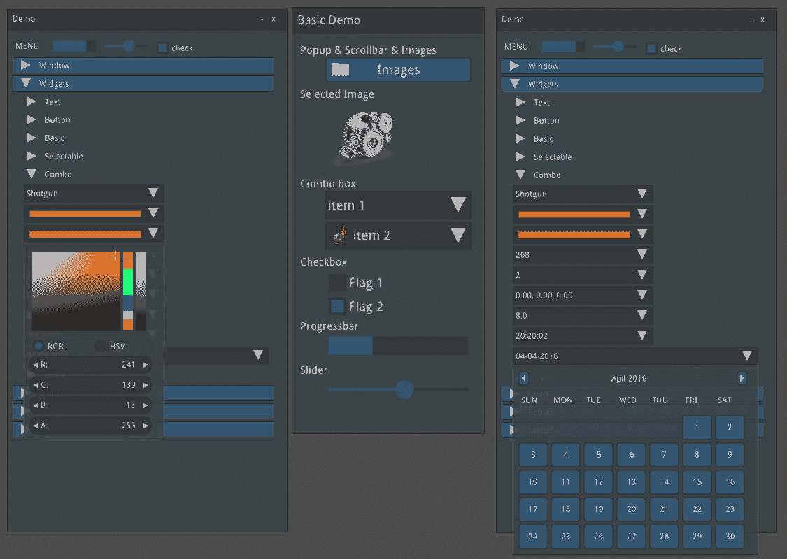

项目网站上的 Nuklear 小部件截图（版权：Micha Mettke）

除了与其他我们探索过的工具包相比的差异之外，还有一个更大的区别——Nuklear 是一个 *即时模式* GUI 工具包。相比之下，我们在本书中使用的其他工具包都是 *保留模式* 用户界面。在保留模式 API 中，开发者通过创建按钮和输入框等对象、将它们排列在布局中，然后工具包将绘制这些功能到屏幕上来描述应用程序 GUI。当发生事件时，工具包将更改项目的状态，结果图形变化将在屏幕上反映出来，可选地将更改发送到应用程序代码。

当使用即时模式库时，没有状态被保留。应用程序开发者不会创建按钮和控件以供以后使用；相反，这些控件在渲染过程中被定义，纯粹是为了下一次图形更新。乍一看，这似乎效率不高，但实际上这与图形渲染管道的工作方式非常匹配，因此可以更加高效。它也是一个更节省内存的过程，因为没有在内存中代表整个应用程序 GUI 的额外结构。这个决定的主要影响，正如我们稍后将会看到的，是如何布局创建 GUI 的代码以及如何处理事件。与其进一步描述，你可以在本章后面的部分（在“入门 nk”的*代码*部分）看到它的实际操作。

# 渲染和平台支持

Nuklear 库灵活性的核心是其模块化设计。库不会将内容渲染到屏幕上，也不会管理用户输入；此类功能由伴随库的模块提供。应用程序通常会利用 Nuklear 库的核心功能来处理小部件和布局，以及其中一个渲染模块来控制窗口的打开、渲染和处理用户输入。

# 渲染模块

Nuklear 项目包括许多渲染模块，为各种不同的环境或操作系统提供支持。在撰写本文时，你可以从以下后端中进行选择：

+   Windows：

    +   **图形设备接口**（**GDI**）

    +   GDI+

    +   **Direct3D**（**D3D**）

+   Linux 或 Unix：

    +   X11

    +   X11 OpenGL

+   游戏开发：

    +   Allegro

+   跨平台开发：

    +   **简单直接媒体层**（**SDL**）

    +   **简单快速多媒体库**（**SFML**）

    +   **图形库框架**（**GLFW**）

一些渲染器是 3D 加速的，而另一些则不是，一些专注于嵌入式和低功耗设备，而另一些则针对桌面或智能手机类型的设备。由于 GLFW 模块支持大多数桌面操作系统（以及一些智能手机），我们将使用此模块来编写下一章。如果你选择使用不同的模块，那么应用程序生命周期代码应该进行适配，但我们将探索的 nk 代码保持不变。

# 支持的平台

由于工具包提供了如此广泛的渲染器，Nuklear 为各种不同的操作系统提供了卓越的覆盖范围。它支持 Windows、Linux、macOS、BSD、iPhone 和 Android，为多个平台提供的支持比我们探索的其他库更好。通过选择跨平台的 GLFW Nuklear 模块，我们略微减少了可能支持的平台数量，但它仍然支持 Windows、macOS 和 Linux 桌面应用程序以及 Android 移动应用程序。

GLFW 库有 Go 绑定，可以与 OpenGL Go 绑定一起使用（两者都是由同一作者编写的）。对于大多数平台，它们不依赖于安装任何外部包或库。这对于快速使用 nk 来说是一个巨大的好处，因为我们不需要安装额外的包或配置我们的开发环境。所以，让我们开始吧。

# 开始使用 nk

要使用 GLFW 和 Go-GL，我们需要链接到一些 C API；然而，这些在大多数系统上不是外部库。唯一的原生依赖项是 OpenGL 原生库（通常是操作系统的一部分），任何中间库都嵌入在 Go 项目中，这意味着我们只需要准备 CGo。

# 预先条件

由于我们将为 nk 使用需要访问原生 C API 的渲染器，我们需要 CGo 正确运行，以便我们的应用程序能够构建。在大多数平台上，这意味着安装一个兼容的 C 编译器。这只是一个开发依赖项，我们构建的应用程序的用户（除了需要一个兼容 OpenGL 的系统之外）不需要安装。如果你已经完成了这本书的前几章，那么你可能已经设置了这些。如果没有，或者你不确定，那么请遵循 *设置 CGo* 部分的 附录 中 *安装细节* 部分的步骤。

一些平台将需要安装额外的开发文件，以便正确编译代码的操作系统特定部分。macOS 和 Windows 开发者可以跳过这一部分，因为 CGo 的开发环境已经提供了所有所需的内容。Linux 或 Android 开发者可能需要采取以下额外步骤。

# Linux

要在 Linux 上使用 nk，我们需要确保安装一些额外的开发头文件。由于 GLFW 依赖于 Xorg 进行窗口管理和输入处理，我们需要能够编译其库。如果你的发行版将开发头文件与库分开打包，你需要确保它们已安装，以便编译成功。所需的包在 Debian 或 Ubuntu 上称为 `xorg-dev`，在 Arch Linux 上称为 `xorg-server-devel`，在 Fedora 或 CentOS 上称为 `xorg-x11-server-devel`。

因此，以下任一命令都应正确安装开发依赖项：

+   对于 Debian 或 Ubuntu，请使用以下命令：

    `sudo apt-get install xorg-dev`

+   对于 Arch Linux（这可能会已经安装），请使用以下命令：

    `sudo pacman -S xorg-server-devel`

+   对于 Fedora 或 CentOS，请使用以下命令：

    `sudo yum install xorg-x11-server-devel`

如果找不到 `sudo` 命令，请尝试 `su -c`。一旦安装了这个库，你应该能够遵循下一节的设置步骤并运行一个 nk 示例应用程序。

# macOS 和 Windows

一旦你在计算机上设置了 Go 和 CGo，就没有其他预先条件了，你可以跳到以下 *设置* 部分。

# Android

要使用 nk 构建 Android 应用程序，需要一些额外的步骤。移动应用程序的开发不在此书的范围之内，但对于好奇的人来说，这些步骤包括在内，以帮助您开始。首先，您必须安装 Android **软件开发工具包**（**SDK**）和**本地开发工具包**（**NDK**）。最简单的方法可能是安装 Android Studio（可在[`developer.android.com/studio/`](https://developer.android.com/studio/)获取）并使用内置的 SDK Manager（在 SDK 工具下）安装`NDK`包：

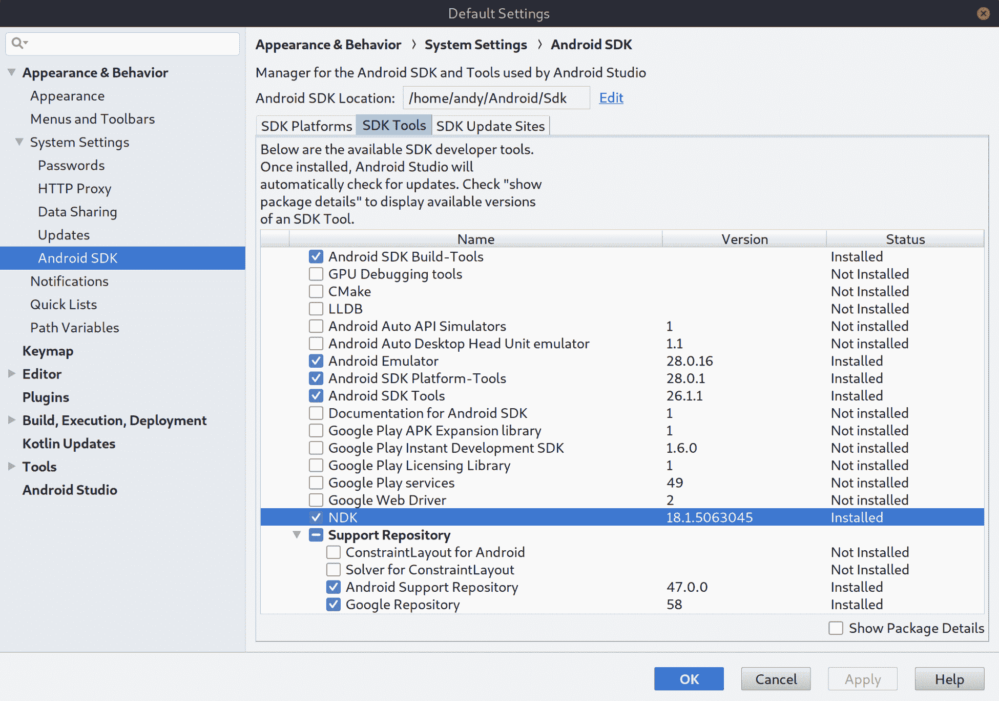

确保安装了最新版本的 NDK 包，以便进行 Android nk 开发

完成以下步骤以完成`nk-android`构建，这将导致一个完整的发展环境。构建工具链需要设置`ANDROID_HOME`和`NDK`环境变量，并正确更新您的`PATH`。您可能不需要设置所有这些环境变量，因为如果您已经完成了之前的 Android 项目，它们可能已经配置好了。更多文档可在[`github.com/golang-ui/nuklear#android-demo`](https://github.com/golang-ui/nuklear#android-demo)找到：

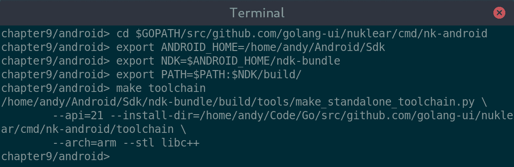

设置 Android 环境和构建 nk-android 工具链

这应该为使用 nk 和 Go 进行 Android 开发准备您的桌面。本章的其余部分专注于桌面开发，但如果工具运行正确，您应该能够将说明适应基于 Android NDK 的部署。

现在您的平台准备工作已经完成，让我们设置 nk 并运行我们的第一个示例应用程序。

# 设置

将`nk`包设置为从 Go 使用 Nuklear，就像使用标准`go`工具安装`github.com/golang-ui/nuklear/nk`包一样简单：

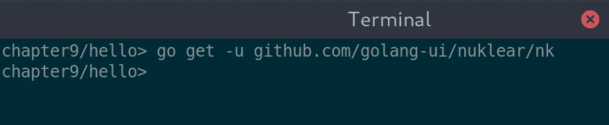

如果您已经安装并运行了 CGo，安装 nk 就非常直接

现在您已经安装了库，让我们运行一个示例来看看 nk 的实际应用。

# 示例

Go Nuklear 绑定项目提供了一个示例应用程序来演示一些小部件；我们可以使用这个来快速检查一切是否正常工作。在完成之前的设置步骤后，运行演示就像安装 Go 项目并运行它一样简单。代码位于[github.com/golang-ui/nuklear](https://github.com/golang-ui/nuklear)的`cmd/nk-example`子项目中；我们可以使用`go install`下载并安装示例，然后使用`nk-example`运行：

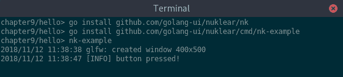

一旦设置好 CGo，安装和运行 nuklear 示例就非常简单

运行前面的命令应该在您的屏幕上出现以下示例窗口。此示例展示了 Nuklear 工具包提供的一些小部件，包括嵌入的窗口：

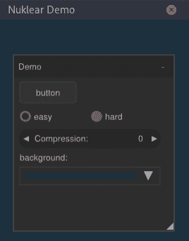

在 Linux 上运行的 nk-example 应用程序

# 代码

要开始我们的第一个 nk 应用程序，我们需要编写一定数量的设置代码。Nuklear 专注于提供图形工具包 API，而不是操作系统特定的代码，例如管理窗口和用户输入。为了避免必须自己编写所有这些代码，我们将使用 `glfw` Go 绑定来创建并显示我们的应用程序窗口。以下代码将设置应用程序窗口并显示它（没有任何内容）。我们还需要调用 `runtime.LockOSThread()`，因为此设置代码必须在主线程上执行：

```go
package main

import "runtime"
import "github.com/go-gl/glfw/v3.2/glfw"
import "github.com/go-gl/gl/v3.2-core/gl"

func init() {
   runtime.LockOSThread()
}

func main() {
   glfw.Init()
   win, _ := glfw.CreateWindow(120, 80, "Hello World", nil, nil)
   win.MakeContextCurrent()
   gl.Init()

   ...
}
```

在初始化 `glfw` 之后，我们需要创建一个窗口，这由 `glfw.CreateWindow()` 为我们处理。我们在前三个参数中指定窗口大小和标题。第四个参数用于全屏窗口；通过传递一个 `*glfw.Monitor` 引用，我们请求一个窗口，该窗口在其默认视频模式下填充指定的监视器。最后一个参数与 *上下文共享* 相关，传递一个现有的 `*glfw.Window` 引用请求这个新窗口共享相同的图形上下文以重用纹理和其他资源。然后我们使新窗口成为当前窗口，以便其上下文在下面的代码中使用。请注意，窗口可能不会完全符合请求的参数（精确的窗口大小或监视器模式可能不受支持），因此创建后检查这些值而不是假设结果是很重要的。

我们必须做的其他设置是创建一个 OpenGL 上下文，Nuklear 代码可以利用它。为此任务，我们将导入 `go-gl` 库（由与 `glfw` Go 绑定相同的作者编写）。我们初始化 OpenGL 库，准备使用由 `glfw` 创建的窗口的上下文。

此外，`nk` 包需要初始化，并且我们需要设置一个默认字体。幸运的是，Nuklear 提供了一个标准字体包，但我们需要运行一些代码来将其设置为默认字体（或者为我们的应用程序加载一个自定义字体）：

```go
import "github.com/golang-ui/nuklear/nk"

func main() {
   ...

   ctx := nk.NkPlatformInit(win, nk.PlatformInstallCallbacks)
   atlas := nk.NewFontAtlas()
   nk.NkFontStashBegin(&atlas)
   font := nk.NkFontAtlasAddDefault(atlas, 14, nil)
   nk.NkFontStashEnd()
   nk.NkStyleSetFont(ctx, font.Handle())

   ...
}
```

所有设置完成后，窗口看起来仍然和之前一样，因为我们还没有渲染任何内容。要实际运行一个 Nuklear 应用程序，我们需要添加一个处理事件管理和 GUI 刷新的运行循环。下面的代码并不是最简单的可能的事件循环（可以使用`for !win.ShouldClose() { ... }`，但那样会消耗整个 CPU！），但它对于简洁性来说效率是合理的。它设置了一个循环，该循环将检查任何事件，然后每秒刷新用户界面 30 次。下面的代码块完成了我们的基本 nk `main()` 函数：

```go
import "time"

func main() {
   ...

   quit := make(chan struct{}, 1)
   ticker := time.NewTicker(time.Second / 30)
   for {
      select {
      case < -quit:
         nk.NkPlatformShutdown()
         glfw.Terminate()
         ticker.Stop()
         return
      case<-ticker.C:
         if win.ShouldClose() {
            close(quit)
            continue
         }
         glfw.PollEvents()
         draw(win, ctx)
      }
   }
}
```

上述代码将运行我们的应用程序，但我们还没有定义用户界面。在上述代码中调用`draw()`函数的秘密在于此，因此我们现在应该实现它。让我们将方法分为两部分来看：首先，GUI 布局，其次，实际渲染。为了设置我们的界面，我们创建一个新的*框架*（想象一下视频的单个快照），它将在用户界面的下一次刷新时被绘制。在调用`nk.NkPlatformNewFrame()`之后，我们可以设置我们的界面；在`nk.NkBegin()`和`nk.NkEnd()`之间的任何代码都将是我们刚刚开始的框架的 UI 更新的一部分。我们可以通过检查返回的`update`变量来找出是否需要重新绘制；如果它是`0`，则没有发生变化，我们可以跳过 UI 代码。

在`if update > 0 { ... }`块内部，我们布局应用程序界面，每行包含一个单元格。在第一行（使用`nk.NkLayoutRowStatic()`创建），我们添加了一个包含文本*Hello World!*的`nk.NkLabel`。在第二行，我们使用`nk.NkButtonLabel()`创建了一个退出按钮。由于这是一个即时模式用户界面，我们不会保留按钮的引用以检查其状态，也不会传递点击处理程序；我们只需检查小部件绘制函数的返回值。如果按钮已被点击，则返回的值将大于`0`；因此，我们可以放置内联代码，告诉窗口关闭，从而关闭应用程序：

```go
const pad = 8

func draw(win *glfw.Window, ctx *nk.Context) {
   // Define GUI
   nk.NkPlatformNewFrame()
   width, height := win.GetSize()
   bounds := nk.NkRect(0, 0, float32(width), float32(height))
   update := nk.NkBegin(ctx, "", bounds, nk.WindowNoScrollbar)

   if update > 0 {
      cellWidth := int32(width-pad*2)
      cellHeight := float32(height-pad*2) / 2.0
      nk.NkLayoutRowStatic(ctx, cellHeight, cellWidth, 1)
      {
         nk.NkLabel(ctx, "Hello World!", nk.TextCentered)
      }
      nk.NkLayoutRowStatic(ctx, cellHeight, cellWidth, 1)
      {
         if nk.NkButtonLabel(ctx, "Quit") > 0 {
            win.SetShouldClose(true)
         }
      }
   }
   nk.NkEnd(ctx)

   ...
}
```

最后，在`draw()`函数的末尾，我们需要要求我们的 OpenGL 视口渲染创建的用户界面。为此，我们使用`gl.Viewport()`设置 OpenGL 视口——正如你所见，我们使用实际窗口大小的宽度和高度参数，而不是假设我们在代码开始时请求的大小是正确的。一旦视口设置好，我们就清除它并设置一个背景颜色（使用`gl.ClearColor()`）。主要的渲染工作由`nk.NkPlatformRender()`处理，它接受我们之前定义的框架并将其绘制到当前图形上下文中。此函数要求我们指定顶点和元素缓冲区的大小。我们传递的数字将足够大，以满足我们的演示目的。

最后，我们通过调用`win.SwapBuffers()`来显示内容。由于`glfw.Window`是*双缓冲*，我们一直在绘制一个当前不在屏幕上的后缓冲区。通过调用交换，我们将后缓冲区移动到屏幕上，并将之前显示的前缓冲区设置为隐藏，以便绘制下一帧：

```go
func draw(win *glfw.Window, ctx *nk.Context) {
   ...

   // Draw to viewport
   gl.Viewport(0, 0, int32(width), int32(height))
   gl.Clear(gl.COLOR_BUFFER_BIT)
   gl.ClearColor(0x10, 0x10, 0x10, 0xff)
   nk.NkPlatformRender(nk.AntiAliasingOn, 4096, 1024)
   win.SwapBuffers()
}
```

这样就应该完成了我们的*Hello World*应用程序的代码。虽然设置了很多，但 UI 定义代码相对简洁，因此构建更复杂的界面不会增加太多工作量。

# 构建 和 运行

简单地构建或运行`hello.go`，你将看到预期的 Hello World 窗口。点击退出按钮将告诉窗口关闭，从而退出应用程序：

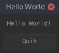

使用 nk 的 Hello World

# 交叉编译

将基于 nk 的应用程序编译到不同的操作系统可能是一个复杂的过程，因为它需要使用 CGo 与本地 OpenGL 库进行通信。然而，如果你已经完成了第五章，*andlabs UI - 跨平台原生 UI*，或者第八章，*Shiny - 实验性 Go GUI API*，那么这些应该已经设置好了。如果你直接跳到了这一章，那么你可能需要遵循附录中的步骤，在*交叉编译设置*中。一旦完成，你应该会有新的编译器可用（macOS 上命名为`o32-clang`，Windows 上命名为`x86_64-w64-mingw32-gcc`），它们能够分别链接到 macOS Foundation API 和 Windows 系统调用。

要构建应用程序，我们现在设置与之前相同的`GOOS`和`CGO_ENABLED`标志，但还通过额外的`CC`环境变量指定要使用的编译器，将其设置为 Darwin OS 的`o32-clang`或 Windows 的`x86_64-w64-mingw32-gcc`。完成此配置后，我们可以从 Linux 终端构建我们的 nk 应用程序用于 macOS 和 Windows：

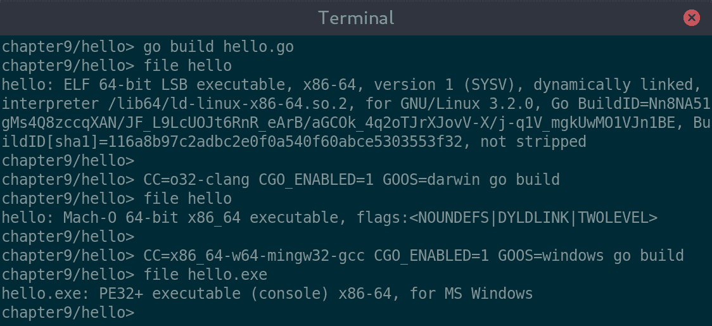

从 Linux 终端编译 Linux、macOS 和 Windows

现在我们已经构建了第一个 nk 应用程序，让我们进一步了解底层 Nuklear 库支持构建应用程序 GUI 的功能。

# 控件、布局和皮肤

由于 Nuklear 库专注于应用程序工具包的控件方面，其在该领域的功能与更成熟的应用程序库相当。正如你将在下面看到的，有一个很长的控件列表可以包含在任何 Nuklear 应用程序中。由于 nk 绑定公开了所有库功能，这些功能对 nk 应用程序也是可用的。

GUI 功能分为三个广泛领域：**控件**（主要用户界面元素）、**绘制**（直接绘制到画布上）和**布局**（在屏幕上排列元素）。在本节中，我们将依次查看每个领域，从主要控件开始。

# 控件

Nuklear 控件（以及展示它们的 nk API）在许多方面应该是熟悉的。合理的命名使得在您最喜欢的 IDE 中编程时可以发现许多这些功能，但让我们探索主要的控件及其功能：

| **控件名称** | **描述** |
| --- | --- |
| `NkButtonLabel` | 一个标准的按钮控件，API 报告了它何时被点击。参见`NkButtonImage`（使用图像而不是文本标签）和`NkButtonImageLabel`（包含两者）。 |
| `NkCheckboxLabel` | 复选框显示一个熟悉的框，旁边是标签，可以是勾选的或未勾选的。API 报告其值何时发生变化。 |
| `NkColorPicker` | 这是一个特殊的按钮，用于打开颜色选择器。此表单返回当前选定的颜色，或者您可以使用 `NkColorPick`，它会在值更改时报告。 |
| `NkComboBox` | 这是一个下拉选择组合框容器。其中每个项目可以包含文本、图像或两者（请参阅以 `NkComboItem` 开头的 API）。 |
| `NkGroup(Begin/End)` | 这为界面中的控件添加分组。一个分组有一个标题，如果需要，还有一个滚动条。要手动控制滚动行为，您可以使用 `NkGroupScrolledBegin`。在开始和结束之间声明的控件将被包含。开始函数返回 `> 0` 如果内容应该被绘制。 |
| `NkImage` | 这在界面中显示一个简单的图像。 |
| `NkMenubar(Begin/End)` | 要向用户界面添加菜单栏，这需要使用以 `NkMenu` 和 `NkMenuItem` 开头的各种 API。开始函数返回 `> 0` 如果内容应该被绘制。 |
| `NkPopup(Begin/End)` | 这将在当前内容上显示一个弹出窗口；在开始和结束之间声明的控件将被包含。开始函数返回 `> 0` 如果内容应该被绘制。 |
| `NkRadioLabel` | 单选选择类似于组合框，但提供多个可能的值，每个值都使用此函数添加。返回值指示指定的项目是否已被选中。 |
| `NkSlider(Int/Float)` | `NkSlider` 函数添加一个具有指定最小值、最大值和当前值的滑动条。API 报告值何时已更改。另一种格式 `NkSlide(Int/Float)` 返回当前值。 |
| `NkTexteditString` | 这是一个文本输入控件。此函数需要一个缓冲区来编辑；这可以通过 `NkEditStringZeroTerminated()` 更容易地设置。还有许多以 `NkTextedit` 开头的有用 API，可以用来管理文本内容。 |
| `NkTree(Push/Pop)` | 树形控件可用于允许用户界面的部分被展开和折叠，或用于在屏幕上显示基于树的 数据。以 `NkTreePush` 开头的函数标记新树部分的开始，而 `NkTreePop` 结束该部分（或树的根）。名为 `TreeNode` 的 `TreeType` 标记用户界面样式树，而 `TreeTab` 用于数据样式树。 |
| Window (`NkBegin`, `NkEnd`) | 窗口（`NkBegin`，`NkEnd`）是必需的，以包含 Nuklear 中的所有小部件（在此作用域之外声明的任何内容都将被忽略或导致错误）。窗口通过 `NkBegin` 或 `NkBeginTitled` 声明，并通过 `NkEnd` 标记为完成。提供了各种窗口管理函数，它们以 `NkWindow` 开头。 |

如您所见，这些部件中的许多都很直接。更复杂的部件具有随时间变得熟悉的打开和关闭其定义的语义。这是由于 API 的即时模式性质及其设计不保留任何状态。常见的语义是当容器需要绘制时返回大于 `0` 的值。同样，对用户事件做出响应的项目在激活或更改时将返回非零值。

现在我们已经探索了可用的部件，让我们看看我们如何在我们 GUI 中排列元素。

# 布局

Nuklear 的布局系统遵循简单的行列方法。为了布局部件，每个项目都应该位于一行内；当根据行配置中设置的参数添加部件时，会隐式创建列。当向已满的行添加部件时，将自动创建一个新的行，其参数与上一个相同。可以通过更改参数或在不填满剩余列的情况下完成前一行的布局来开始一个新的行。基本的布局由这里描述的 NkLayoutRow API 控制；还有一个有用的基于模板的布局在 `NkLayoutRowTemplate` 中，我们将在之后探索。最后，`NkLayoutSpace` 允许直接设置部件的位置和大小——我们将最后探索这一点。

# NkLayoutRow

布局的简单方法是从使用 `NkLayoutRowDynamic()` 或 `NkLayoutRowStatic()` 开始新的一行。这两个函数都指定了行中的单元格数量。两者之间的区别在于，动态行分配将分割单元格之间的所有空间，并在窗口或容器大小改变时调整它们的大小。使用静态排列时，所有单元格的大小将保持不变，无论容器大小如何。在开始一行后添加的部件将附加到该行，直到它填满；如果进一步添加部件，则将为新部件创建一个新的行。这会一直持续到调用 `NkLayoutRowEnd()` 或使用这些替代函数之一开始不同的行配置。

通过使用 `NkLayoutRowBegin()` 函数开始一行，可以增加一些控制；这指定了行高和列数，但并不指定列的大小。在通过调用 `NkLayoutRowPush()` 将部件附加到行之前，会向行中添加单元格；这为下一个单元格设置大小或比例，并且应该随后声明一个部件来填充该单元格。这种类型的行也应该通过调用 `NkLayoutRowEnd()` 来结束。

最后，可以直接调用 `NkLayoutRow` 来设置后续行的参数，静态或动态大小，以及指定高度或比例和指定列数。

# NkLayoutRowTemplate

使用模板机制是一种更强大的排列行的方法。通过调用`NkLayoutRowTemplateBegin()`，可以为所有后续行设置模板。列的大小是通过三种模板函数之一定义的。首先，`NkLayoutRowTemplatePushStatic()`指定该列中的小部件应具有固定宽度。`NkLayoutRowTemplatePushDynamic()`，类似于没有模板的动态分配定义，将行宽分配给动态列（如果没有可用空间，这可能是`0`）。最后，还有一个额外的调用`NkLayoutRowTemplatePushVariable()`函数；这将确保小部件获得它们所需的最小空间，并将占用任何额外的空间（或者平均分配给其他可变宽度列）。

在模板指定的末尾，您必须调用`NkLayoutRowTemplateEnd()`；这将指示添加的任何小部件将开始创建声明模板之后的布局行。与之前一样，如果有更多小部件适合一行，则将自动创建新行，并且小部件将开始添加到新行。与之前指定行中列数的常规行布局函数不同，使用此方法将在行中添加与模板定义中项目数量一样多的小部件。

# NkLayoutSpace

最后，空间布局提供了对 Nuklear 应用程序中项目位置和大小的完全控制。布局的起始和结束方式与之前的基于行的布局相同；使用`NkLayoutSpaceBegin()`开始基于空间布局，使用`NkLayoutSpaceEnd()`完成布局。在您希望添加到界面中的每个小部件之前，调用`NkLayoutSpacePush()`函数，传递`NkRect`，它指定下一个要添加的小部件的大小和位置。

除了布局控制函数外，还有许多使用`NkLayoutSpace` API 前缀的辅助函数。最有用的是`NkLayoutSpaceBounds()`——如果在空间布局中调用，它将返回可用于工作的总空间。如果您希望右对齐或底对齐或在小部件中居中定位，这很重要。

这些就是 nk API 提供的所有布局选项；现在让我们看看库的绘图功能。

# 绘图

绘图 API 提供了一个相当标准的**二维**（**2D**）矢量图形库，主要用于高级小部件。由于它是公共 API 的一部分，因此也可以在您的应用程序中使用它们。

# 命令队列

要绘制应用程序的定制区域，我们的应用程序将直接与 Nuklear 绘制命令队列（用于渲染用户界面帧的绘制项列表）交互，因此建议小心操作。您可以通过使用`NkWindowGetCanvas()`函数来获取访问`nk.CommandBuffer`的权限，这是每个绘制命令所需的。重要的是，这只能在窗口活动时调用（在`NkBegin`之后和`NkEnd`之前）。位置值需要了解其他加载的控件和布局，这可能会很快变得复杂——在通常空白的窗口中使用这些命令绘制是最简单的，这样可以避免覆盖其他控件。

# 绘制函数

如果您想直接使用这些绘制命令，可以使用以下方法：

| **描边函数** | **填充函数** | **注意事项** |
| --- | --- | --- |
| `NkStrokeLine()` |  | 使用指定颜色绘制单个线段。 |
| `NkStrokeCurve()` |  | 使用指定颜色绘制单个曲线段。 |
| `NkStrokeRect()` | `NkFillRect()`, `NkFillRectMultiColor()`   | 使用指定颜色（或颜色组合）绘制矩形（或正方形）轮廓，或实心矩形。要绘制轮廓填充的矩形，请先调用`NkFillRect()`，然后使用相同坐标调用`NkStrokeRect()`。`NkFillRectMultiColor()`是快速在矩形中绘制渐变的方法。 |
| `NkStrokeCircle()` | `NkFillCircle()` | 使用指定颜色绘制圆（或椭圆）轮廓或填充。 |
| `NkStrokeArc()` | `NkFillArc()` | 在指定颜色中围绕中心点绘制轮廓或填充圆弧。 |
| `NkStrokeTriangle()` | `NkFillTriangle()` | 使用指定颜色绘制三角形轮廓或实心三角形。 |
| `NkStrokePolyline()` |  | 使用指定颜色绘制一系列线段。 |
| `NkStrokePolygon()` | `NkFillPolygon()` | 使用定义边界的点列表绘制轮廓或填充形状。 |
| `NkDrawImage()` |  | 在指定的矩形和背景颜色中绘制图像。 |
| `NkDrawText()` |  | 使用指定的背景和前景颜色绘制文本字符串。 |

现在我们已经探索了所有的小部件和绘图功能，我们可以直接开始构建一个完整的应用程序。然而，Nuklear 还有一个很酷的功能值得我们关注：使用皮肤化来改变界面设计。

# 皮肤化

除了为包含的组件定义自己的样式外，Nuklear 还支持**皮肤化**——加载主题以改变应用程序的外观。这是一个强大的功能——与我们在 GTK+和 Qt 中看到的主题非常相似，但由应用程序而不是最终用户选择。任何希望为他们的应用程序设置皮肤化的 nk 应用程序开发者可能会发现这并不容易做到——这是由于大多数配置都是通过底层的 Nuklear API 从 C 结构中暴露出来的方式。虽然这些元素大多可以通过 Go API 绑定获得，但它需要大量的指针转换和不安全的赋值，这可能会影响应用程序的稳定性。然而，通过 CGo，在应用程序中包含一些 C 代码是可能的。

以下 C 代码是从 Nuklear 皮肤化示例中提取的，以防开发者希望在他们的应用程序中包含自定义皮肤并且愿意在 Go 代码中嵌入 C。该示例使用单个纹理图像，该图像定义了所有定义主题的不同图像。首先，必须将纹理加载到当前 OpenGL 上下文中，然后识别加载纹理中的各个区域，如下所示：

```go
   glEnable(GL_TEXTURE_2D);
   media.skin = image_load("../skins/gwen.png");
   media.check = nk_subimage_id(media.skin, 512,512, nk_rect(464,32,15,15));
   media.check_cursor = nk_subimage_id(media.skin, 512,512, nk_rect(450,34,11,11));

   ...
```

上述代码片段仅指定了两个子纹理，而在实际使用中会有更多。在纹理加载后，我们定义一个与主题匹配的样式结构指针（在这里，我们正在皮肤化复选框）。然后，将此指针的值设置为加载的样式配置的位置（这就是为什么在纯 Go 代码中很难重新创建）。对于结构中的每个字段，应设置适当的图像或颜色：

```go
 {struct nk_style_toggle *toggle;
 toggle = &ctx.style.checkbox;
 toggle->normal = nk_style_item_image(media.check);
 toggle->hover = nk_style_item_image(media.check);
 toggle->active = nk_style_item_image(media.check);
 toggle->cursor_normal = nk_style_item_image(media.check_cursor);
 toggle->cursor_hover = nk_style_item_image(media.check_cursor);
 toggle->text_normal = nk_rgb(95,95,95);
 toggle->text_hover = nk_rgb(95,95,95);
 toggle->text_active = nk_rgb(95,95,95);}
```

应该将相同的技巧应用于所有将在皮肤化应用程序中使用的组件。这是一项大量工作，甚至工具包的作者也警告说，由于耗时性，现在应避免这样做！以下是*Gwen*皮肤的样式纹理以及加载了此主题的应用程序的截图：

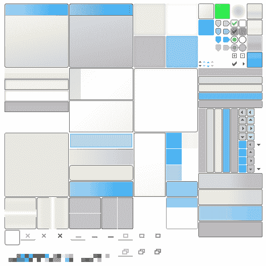 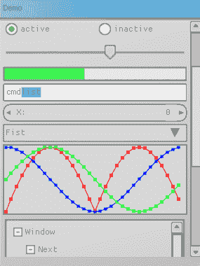

Gwen 皮肤用于演示 Nuklear 皮肤功能（左）；Gwen 皮肤的实际应用（右）

完整的实现可以在[`github.com/vurtun/nuklear/blob/master/example/skinning.c`](https://github.com/vurtun/nuklear/blob/master/example/skinning.c)的示例存储库中找到。

# 构建用户界面

让我们再次回到我们的 GoMail 应用程序，尝试使用 nk API。Nuklear 是一个功能丰富的成熟工具包，因此它应该能够像之前的示例一样构建用户界面。当我们构建用户界面时，我们将看到即时模式工具包是如何不同的，包括代码的排列方式和事件处理的管理方式。

我们可以先复制 hello world 应用程序，这样我们就不必重新编写所有的设置代码和生命周期管理。由于这个应用程序将包含更多的图形元素，我们需要增加使用`NkPlatformRender()`设置的缓冲区大小。在这个例子中，用以下行替换原始行。在你的应用程序中，这个值可能需要更高——如果数字太低，你可能注意到当弹出窗口和菜单项出现时，图形元素不会显示或消失：

```go
nk.NkPlatformRender(nk.AntiAliasingOn, 512 * 1024, 128 * 1024)
```

# 布局

我们将从基本的应用布局开始；首先，我们将更新我们的`draw()`函数，以便调用一个单独的`drawLayout()`函数，在那里我们将添加我们的新代码。这个新函数需要传递窗口的高度以正确填充垂直空间，正如你稍后将会看到的：

```go
func draw(win *glfw.Window, ctx *nk.Context) {
   nk.NkPlatformNewFrame()
   width, height := win.GetSize()
   bounds := nk.NkRect(0, 0, float32(width), float32(height))
   update := nk.NkBegin(ctx, "", bounds, nk.WindowNoScrollbar)

   if update > 0 {
      drawLayout(win, ctx, height)
   }
   nk.NkEnd(ctx)

   gl.Viewport(0, 0, int32(width), int32(height))
   gl.Clear(gl.COLOR_BUFFER_BIT)
   gl.ClearColor(0x10, 0x10, 0x10, 0xff)
   nk.NkPlatformRender(nk.AntiAliasingOn, 512 * 1024, 128 * 1024)
}
```

上述代码对于使用 nk 绘制窗口来说是相当标准的。让我们直接进入我们的新布局代码。

# 主要电子邮件窗口

我们从一个简单的布局函数`drawLayout()`开始。这将设置类似于我们在第四章，*Walk - 构建图形窗口应用程序*中创建的 GoMail 设计的基本应用程序布局。代码的开始为菜单和工具栏留出空间，这些空间将扩展以填充窗口的宽度。然后我们开始使用`NkLayoutRowTemplateBegin()`启动一个模板布局，以便在左侧有一个固定大小的列用于我们的电子邮件列表，以及一个更宽的、可变宽度的列，当窗口调整大小时将扩展：

```go
func drawLayout(win *glfw.Window, ctx *nk.Context, height int) {
   toolbarHeight := float32(36)
   nk.NkLayoutRowDynamic(ctx, toolbarHeight, 1)
   nk.NkLabel(ctx, "Toolbar", nk.TextAlignLeft)

   nk.NkLayoutRowTemplateBegin(ctx, float32(height)-toolbarHeight)
   nk.NkLayoutRowTemplatePushStatic(ctx, 80)
   nk.NkLayoutRowTemplatePushVariable(ctx, 320)
   nk.NkLayoutRowTemplateEnd(ctx)

   nk.NkGroupBegin(ctx, "Inbox", 1)
   nk.NkLayoutRowDynamic(ctx,0, 1)
   nk.NkLabel(ctx, "Item1", nk.TextAlignLeft)
   nk.NkLabel(ctx, "Item2", nk.TextAlignLeft)
   nk.NkLabel(ctx, "Item3", nk.TextAlignLeft)
   nk.NkGroupEnd(ctx)

   ...
```

注意，虽然我们布局的宽度可以自动调整，但高度并不那么灵活。在这个例子中，我们传递窗口的高度并从中减去我们分配给工具栏的高度。这个总数传递给我们的模板布局，以便它扩展到剩余的窗口高度。

在主布局的第一列中，我们添加一个名为`"Inbox"`的新组用于我们的电子邮件列表，并添加三个简单的标签项来表示加载的列表。接下来，我们添加另一个将占用模板布局第二个空间的组。此代码设置了一组一列和两列的行，将显示电子邮件内容。

我们打开组并使用`NkLayoutRowDynamic()`设置一个简单的动态行，包含一个列，并在该单元格中插入`NkLabel`主题。接下来，我们添加另一个模板布局，以便我们可以有一个窄的、固定宽度的列用于标签，以及一个可变宽度的列用于值。之后，`NkLabel`可以插入标签和值以形成一个网格。最后，我们开始另一个单列动态行用于主要电子邮件内容：

```go
   ...

   nk.NkGroupBegin(ctx, "Content", 1)
   nk.NkLayoutRowDynamic(ctx,0, 1)
   nk.NkLabel(ctx, "Subject", nk.TextAlignLeft)
   nk.NkLayoutRowTemplateBegin(ctx, 0)
   nk.NkLayoutRowTemplatePushStatic(ctx, 50)
   nk.NkLayoutRowTemplatePushVariable(ctx, 320)
   nk.NkLayoutRowTemplateEnd(ctx)
   nk.NkLabel(ctx, "From", nk.TextAlignRight)
   nk.NkLabel(ctx, "email", nk.TextAlignLeft)
   nk.NkLabel(ctx, "To", nk.TextAlignRight)
   nk.NkLabel(ctx, "email", nk.TextAlignLeft)
   nk.NkLabel(ctx, "Date", nk.TextAlignRight)
   nk.NkLabel(ctx, "date", nk.TextAlignLeft)
   nk.NkLayoutRowDynamic(ctx,0, 1)
   nk.NkLabel(ctx, "Content", nk.TextAlignLeft)
   nk.NkGroupEnd(ctx)
}
```

运行上述代码，以及从我们的*Hello world*示例中必要的样板代码，应该显示一个窗口，看起来很像以下这样：

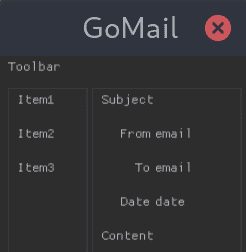

使用 nk API 创建的基本 GoMail 布局

# 电子邮件编写对话框

要开始我们的 compose 窗口布局，我们创建一个新的 `drawComposeLayout()` 函数（用于测试，我们可以调用它而不是从 `draw()` 函数中调用 `drawLayout()`）。在我们能够添加电子邮件编写 UI 将使用的文本编辑小部件之前，我们需要创建缓冲区来管理它们将编辑的内容。记住，这是一个即时模式工具包，因此，为了记住任何状态，我们必须提供数据存储。这就是 compose 窗口将存储新电子邮件的主题、电子邮件地址和内容的地方：

```go
var composeSubject = make([]byte, 512, 512)
var composeEmail = make([]byte, 512, 512)
var composeContent = make([]byte, 4096, 4096)
```

对于用户来说，提供提示（通常称为占位符）也很有帮助——为了做到这一点，我们需要在绘制循环开始之前将一些数据复制到缓冲区中：

```go
copy(composeSubject[:], "subject")
copy(composeEmail[:], "email")
copy(composeContent[:], "content")
```

现在，让我们看看电子邮件编写窗口的布局。布局与我们之前布局代码中电子邮件显示组的布局相似，设置了一个动态行用于主题小部件，然后是一个行模板用于 *To* 标签和电子邮件地址输入。这次，我们不是使用 `NkLabel()`，而是使用 `NkEditStringZeroTerminated()` 创建一个文本输入小部件，并带有多个参数。`nk.EditBox|nk.EditSelectable|nk.EditClipboard` 标志告诉 Nuklear 我们正在设置一个可以选中文本并与系统剪贴板交互的编辑框。我们还需要告诉小部件它应该编辑哪个缓冲区（在这种情况下是 `composeSubject`）以及字符的最大数量应该是多少（我们将其设置为缓冲区的长度 `int32(len(composeSubject))`）。然后，对于电子邮件和内容输入小部件，我们重复这个过程：

```go
func drawComposeLayout(ctx *nk.Context, height int) {
   nk.NkLayoutRowDynamic(ctx,0, 1)
   nk.NkEditStringZeroTerminated(ctx, nk.EditBox|nk.EditSelectable|nk.EditClipboard,
      composeSubject, int32(len(composeSubject)), nil)
   nk.NkLayoutRowTemplateBegin(ctx, 0)
   nk.NkLayoutRowTemplatePushStatic(ctx, 25)
   nk.NkLayoutRowTemplatePushVariable(ctx, 320)
   nk.NkLayoutRowTemplateEnd(ctx)
   nk.NkLabel(ctx, "To", nk.TextAlignRight)
   nk.NkEditStringZeroTerminated(ctx, nk.EditBox|nk.EditSelectable|nk.EditClipboard,
      composeEmail, int32(len(composeEmail)), nil)
   nk.NkLayoutRowDynamic(ctx, float32(height-114), 1)
   nk.NkEditStringZeroTerminated(ctx, nk.EditBox|nk.EditSelectable|nk.EditClipboard,
      composeContent, int32(len(composeContent)), nil)

   ...
```

最后，我们需要将按钮添加到屏幕底部——我们为此使用另一个行模板。在这个布局中，变量空间被设置为行的大小减去我们按钮的大小，这样按钮就会对齐到右边。我们在第一个单元格中插入一个空的 `NkLabel` 作为填充物。两个 `NkButtonLabel()` 函数调用设置了布局右下角的按钮：

```go
   ...

   nk.NkLayoutRowTemplateBegin(ctx, 0)
   nk.NkLayoutRowTemplatePushVariable(ctx, 234)
   nk.NkLayoutRowTemplatePushStatic(ctx, 64)
   nk.NkLayoutRowTemplatePushStatic(ctx, 64)
   nk.NkLayoutRowTemplateEnd(ctx)
   nk.NkLabel(ctx, "", nk.TextAlignLeft)
   nk.NkButtonLabel(ctx, "Cancel")
   nk.NkButtonLabel(ctx, "Send")
}
```

创建了布局代码后，我们可以显示窗口并看到一个类似于以下截图的电子邮件 Compose 窗口：

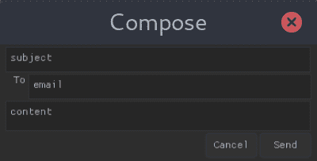

使用 nk 工具包的基本 Compose 布局

# 工具栏和菜单

使用 `NkMenubarBegin()`、`NkMenuBeginLabel()` 和 `NkMenuItemLabel()` 等函数，可以在 nk 窗口中添加菜单。设置菜单的难点在于我们还需要为栏和其项目添加适当的布局。重要的是（实际上，是强制性的），栏必须在一个 `y=0` 的布局中，所以我们立即使用 `NkLayoutRowBegin()` 添加一个新的行布局，并使用动态大小。然后，我们使用 `NLayoutRowPush()` 推送这个布局的单元格大小。

使用`NkMenuBeginLabel()`打开一个菜单项，我们必须检查这个函数的返回值——`0`表示菜单被隐藏。如果它返回非零值，那么我们应该在栏下方布局菜单。我们使用`NkLayoutRowDynamic()`开始一个新的动态行布局，使用单个列来包含每个菜单项。然后使用`NkMenuItemLabel()`添加每个菜单项，并使用适当的`label`字符串。这个函数的返回值表示项目是否被点击。如果我们得到非零值，那么我们应该执行该操作——如所示

`Quit`项。最后，如果菜单已打开，我们必须再次使用`NkMenuEnd()`关闭它：

```go
   nk.NkMenubarBegin(ctx)
   nk.NkLayoutRowBegin(ctx, nk.LayoutStaticRow, 25, 3)
   nk.NkLayoutRowPush(ctx, 45)
   if nk.NkMenuBeginLabel(ctx, "File", nk.TextAlignLeft, nk.NkVec2(120, 200)) > 0 {
      nk.NkLayoutRowDynamic(ctx, 25, 1)
      nk.NkMenuItemLabel(ctx, "New", nk.TextAlignLeft)
      if nk.NkMenuItemLabel(ctx, "Quit", nk.TextAlignLeft) > 0 {
         win.SetShouldClose(true)
      }

      nk.NkMenuEnd(ctx)
   }

   ...
```

进一步的菜单（例如`Edit`和`Help`）可以通过使用`NkMenuBeginLabel()`开始另一个块来简单地添加。对于完整的列表，你可以查看本书的代码库：`chapter9/gomail`。

添加工具栏不如使用`Nuklear`工具包没有直接的工具栏支持那么直接。我们将通过在栏中添加一行固定大小且左对齐的按钮来模拟。为此，我们打开一个新的静态行布局，指定按钮的期望大小为单元格宽度（以及正确的列数）。然后我们使用`NkButtonLabel()`添加每个按钮，传递一个按钮标签。理想情况下，我们会使用`NkButtonImage()`，但没有标准的工具栏图标可用。我们可以自己打包所需的图标并加载图像，但目前从 Go 代码中加载图像的支持很少；有一个提议要添加`NkImageFromRgba()`，但在撰写本文时，这还不存在。实现图像加载超出了本章的范围：

```go
   ...

   toolbarHeight := float32(24)
   nk.NkLayoutRowStatic(ctx, toolbarHeight, 78, 7)
   nk.NkButtonLabel(ctx, "New")
   nk.NkButtonLabel(ctx, "Reply")
   nk.NkButtonLabel(ctx, "Reply All")

   nk.NkButtonLabel(ctx, "Delete")

   nk.NkButtonLabel(ctx, "Cut")
   nk.NkButtonLabel(ctx, "Copy")
   nk.NkButtonLabel(ctx, "Paste")

   ...
```

这些按钮返回的，是一个`int`类型的值，就像前面的菜单项一样，表示它是否被点击。我们将在下一节中添加按钮处理，*与 GUI 通信*。有了这段代码，我们看到一个完整的电子邮件浏览窗口用户界面：

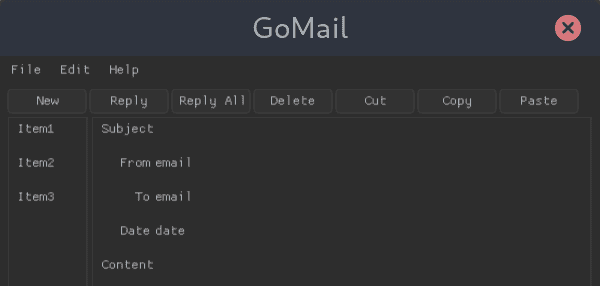

我们编辑窗口的完成布局

# 与 GUI 通信

现在我们已经完成了所有布局，我们需要连接数据源并处理适当的交互事件。我们首先导入之前示例中使用的`client`电子邮件包。一旦导入，我们设置一个新的测试服务器并缓存当前消息（这将通过点击一个项目而稍后更改）。如前所述，我们必须在应用程序代码中而不是用户界面中保存所有状态：

```go
import "github.com/PacktPublishing/Hands-On-GUI-Application-Development-in-Go/client"

var server = client.NewTestServer()
var current = server.CurrentMessage()
```

更新电子邮件列表组就像在`for`循环中包装标签创建，该循环遍历`server.ListMessages()`的范围：

```go
nk.NkGroupBegin(ctx, "Inbox", 1)
nk.NkLayoutRowDynamic(ctx,0, 1)
for _, email := range server.ListMessages() {
   nk.NkLabel(ctx, email.Subject, nk.TextAlignLeft)
}
nk.NkGroupEnd(ctx)
```

内容是从我们保存为`current`的`client.EmailMessage`加载的，如下所示：

```go
   nk.NkLabel(ctx, ui.current.Subject, nk.TextAlignLeft)
   ...
   nk.NkLabel(ctx, "From", nk.TextAlignRight)
   nk.NkLabel(ctx, string(ui.current.From), nk.TextAlignLeft)
   nk.NkLabel(ctx, "To", nk.TextAlignRight)
   nk.NkLabel(ctx, string(ui.current.To), nk.TextAlignLeft)
   nk.NkLabel(ctx, "Date", nk.TextAlignRight)
   nk.NkLabel(ctx, ui.current.DateString(), nk.TextAlignLeft)
   ...
   nk.NkLabel(ctx, ui.current.Content, nk.TextAlignLeft)
```

对于主界面，最后的交互是菜单和工具栏按钮；当项目被激活时，每个相关功能都会返回`> 0`。我们可以像之前处理`Quit`项一样给菜单项添加点击处理程序：

```go
   if nk.NkMenuItemLabel(ctx, "Quit", nk.TextAlignLeft) > 0 {
      win.SetShouldClose(true)
   }
```

同样的模式也可以用于工具栏按钮。对于“新建”按钮，我们设置一个撰写窗口在点击时出现。由于我们需要在本地维护所有状态，你将看到这里的按钮点击正在设置一个`composeUI`实例（一个用于撰写状态的定制类型）；这将在以下内容中使用，以决定是否应该打开撰写窗口：

```go
   if nk.NkButtonLabel(ctx, "New") > 0 {
      compose = newComposeUI(this)
   }
```

由于 Nuklear 后端通常不支持多个原生操作系统窗口，我们需要在 GoMail 主用户界面中加载我们的撰写窗口。在主界面布局代码运行后，我们可以插入一个新的检查，检查我们之前设置的`compose`值。当这个值为`nil`时，我们没有撰写窗口可以显示，但当它被设置后，我们将在第一个窗口内创建第二个窗口：

```go
   ...
   nk.NkEnd(ctx)

   if compose != nil {
      drawCompose(ctx)
   }

   ...
```

上述代码在主窗口（由`NkEnd()`标记）之后执行。如果设置了撰写状态，我们需要调用新的`drawCompose()`函数：

```go
func (ui *mainUI) drawCompose(ctx *nk.Context) {
   bounds := nk.NkRect(20, 20, 400, 320)
   update := nk.NkBegin(ctx, "Compose", bounds, nk.WindowNoScrollbar | nk.WindowBorder | nk.WindowTitle | nk.WindowMovable | nk.WindowMinimizable)

   if update > 0 {
      compose.drawLayout(ctx, 296)
   }

   nk.NkEnd(ctx)
}
```

这个新函数设置一个子窗口，然后调用我们之前定义的`drawComposeLayout()`——现在重命名为`drawLayout()`，在新的`composeUI`类型中。我们需要将撰写状态（我们之前声明的数据缓冲区）封装在单独的类型中；这允许我们跟踪多个撰写窗口中做出的更改（因为撰写窗口没有状态）。

要根据列表中选定的项目更改电子邮件，我们可以将`NkLabel`更改为`NkSelectableLabel`。此小部件接受一个额外的参数，用于指定是否选中，如果将选择更改为指定项目，则将返回非零值。更新列表代码应如下所示（需要一些额外的代码将`bool`转换为`int32`）：

```go
   for _, email := range ui.server.ListMessages() {
      var selected int32
      if email == ui.current {
         selected = 1
      }
      if nk.NkSelectableLabel(ctx, email.Subject, nk.TextAlignLeft, &selected) > 0 {
         ui.current = email
      }
   }
```

在将所有数据加载并从“新建”工具栏或菜单项打开撰写窗口后，我们看到如下内容：

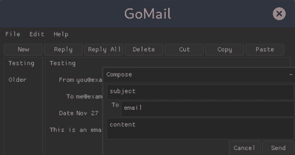

我们完成的 GoMail 应用，nk 显示一个撰写窗口

# 背景处理

立即模式用户界面工具包的一个好处是没有隐藏状态。当我们看到新电子邮件到达时，我们不需要将更改通知给列表小部件（或等效的）以指示它添加新行。只要模型数据在事件发生时更新，就没有额外的工作要做。我们的 nk 代码将在下一帧自动添加新数据，因此用户界面将相应刷新。

这也意味着我们不需要在我们的用户界面代码中处理多个线程的复杂性。如果你确保任何模型数据是线程安全的（使用标准的 Go 工具），那么用户界面将始终在主线程上刷新。所有渲染代码必须在同一线程上运行是一个要求，但由于工具包的设计方式，这不太可能成为问题。

# 摘要

在本章中，我们探讨了三个工具包中的第二个，这些工具包旨在摆脱我们在第二部分*使用现有小部件的工具包*中探讨的传统工具包。Nuklear 项目主要针对嵌入式应用，但我们看到，在许多方面，它也适合桌面应用。其定制的小部件设计意味着应用将在所有支持的操作系统上看起来完全相同，这个列表比 Shiny 更长——包括用于移动开发的 Android。

我们探讨了 Nuklear 框架的设计以及它与提供实际绘图和用户输入实现的各个后端之间的交互。我们检查了主要的 API 功能，包括其绘图能力、它包含的控件以及它为构建用户界面提供的布局算法。然后，我们通过使用 nk API 和功能创建一个完整的应用程序，实现了在第四章“Walk - 构建图形窗口应用程序”和第七章“Go-Qt - 使用 Qt 的多平台”中创建的相同 GoMail 项目，从第四章到第七章。在处理即时模式 GUI 框架时有许多不同之处，但在许多方面，实现我们的基本应用程序更容易。

在下一章中，我们将探讨**Fyne**，这是我们将在详细探讨的最后一个工具包。与 Shiny 一样，它是一个受材料设计启发的控件库，但与 Nuklear 类似，它的重点是提供完整的控件工具包。
