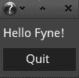
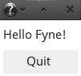

# 第十章：Fyne - 基于 Material Design 的 GUI

Fyne 是一个 UI 工具包和应用 API，旨在易于使用。其界面设计遵循材料设计原则，提供跨平台的图形，在所有支持的平台上都看起来相同。本章探讨了如何使用 Fyne 编写多平台的图形应用程序。

我们将涵盖以下主题：

+   Fyne 项目的愿景和设计

+   构建基于 Fyne 的简单多平台应用程序

+   API 设计和 Fyne 提供的小部件

+   如何使用 Fyne 创建完整的应用程序

到本章结束时，你应该对 Fyne 项目的雄心壮志有所了解，并且将使用工具包构建了多个跨平台的图形应用程序。

# Fyne 的背景和愿景

Fyne 项目是由本书的作者 Andrew Williams 创建的，以回应人们对现有图形工具包和应用 API 复杂性的日益批评。它旨在易于使用，并选择了 Go 语言，因为它具有强大的简洁性。就像我们在 第八章 中探索的 Shiny 项目一样，*Shiny – Experimental Go GUI API*，其 API 从为 Go 语言专门创建中受益。

与 第三部分 中其他小部件工具包一样，*现代图形工具包*，它便于构建在所有平台上看起来相同的图形应用程序，而不是采用操作系统的外观和感觉。

"Fyne 的 API 旨在为开发美观、易用和轻量级的桌面和超越桌面应用程序提供最佳选择。"

-[g](https://github.com/fyne-io/fyne/wiki/Vision)[ithub.com/fyne-io/fyne/wiki/Vision](https://github.com/fyne-io/fyne/wiki/Vision)

工具包最初是使用 Enlightenment Foundation Libraries (EFL: [enlightenment.org/about-efl](https://www.enlightenment.org/about-efl)) 构建的，以促进跨平台渲染。从那时起，Fyne 已经转向基于 OpenGL 的驱动程序，就像上一章中的 nk 包一样。这使得设置更加简单，并且意味着使用 Fyne 创建的应用程序没有运行时依赖。在我们详细检查工具包之前，让我们看看如何设置一个简单的 Fyne 应用程序。

# 开始使用 Fyne

在我们开始构建 Fyne 应用程序之前，我们将逐步进行安装并运行一个示例应用程序。对于大多数系统，设置就像使用标准的 Go 工具安装 `fyne.io/fyne` 包一样简单。然而，对于某些系统，存在需要检查的开发前提条件，所以让我们从这里开始。

# 前提条件

对于大多数平台，开始使用 Fyne 无需安装任何要求。在 macOS 和 Windows 上，工具包使用内置的 OpenGL 功能，因此你可以直接跳到以下 *设置* 部分（然而，如果你是第一次在 macOS 上开发，请检查以下说明）。如果你在与 Linux（或其他 Unix 系统）一起工作，那么可能需要安装一些系统头文件。

# Linux

要在 Linux 上编译，你需要安装 Xorg 和 GL（*mesa* 或类似）头文件（运行应用程序不需要这些）。具体要求会因系统而异，但最常见的要求如下：

+   Debian / Ubuntu:

    `libgl1-mesa-dev` 和 `xorg-dev`

+   Fedora / CentOS:

    `libX11-devel`, `libXcursor-devel`, `libXrandr-devel`, `libXinerama-devel`, `mesa-libGL-devel`, 和 `libXi-devel`

+   Arch Linux:

    `mesa`

在开发计算机上，这些软件包可能已经安装，但如果你在本章的后面部分遇到编译错误，首先应该检查这些软件包或它们在你系统中的等效软件包是否正确安装。

# macOS

对于在 macOS 上开发，你必须安装 Xcode 命令行工具。如果你之前已经使用过 C 或 CGo，那么这可能是已经设置好的；如果没有，那么你可能需要执行 `xcode-select --install` 命令：


如果你还没有安装命令行工具，那么 xcode-select 将显示此提示

# 设置

使用 `go get` 命令下载 Fyne API 以进行设置非常简单。项目通过其基本导入名称访问，`fyne.io/fyne`：


一旦设置好 CGo，安装 Fyne 就变得简单

# 示例

Fyne 工具包内置了一个示例应用程序，可以用来探索其功能和资产。我们可以使用这个应用程序来验证设置是否正常。只需使用 Go 工具安装应用程序，然后使用 `fyne_demo` 命令运行它：


从项目仓库安装并运行 fyne_demo 命令

运行演示应用程序将打开一个窗口，该窗口提供各种选项以供探索。如果我们点击几个项目，将打开额外的窗口，你应该看到如下所示的内容：


Fyne 示例应用程序中展示的一些功能

# 代码

使用 Fyne 的基本 *Hello World* 应用程序相当简洁，因为应用程序设置封装在一个单独的调用中。由 `app` 子包提供的入口点 `app.New()` 设置了一个新的应用程序，我们使用它来打开一个新窗口。`widget` 子包定义了我们可以添加到新窗口的各种小部件：

```go
package main

import "fyne.io/fyne/app"
import "fyne.io/fyne/widget"

func main() {
   app := app.New()

   win := app.NewWindow("Hello World")
   win.SetContent(widget.NewVBox(
      widget.NewLabel("Hello World!"),
      widget.NewButton("Quit", func() {
         app.Quit()
      }),
   ))

   win.ShowAndRun()
}
```

如前一个代码块所示，新创建的 `fyne.Window` 将其内容设置为一个新的 `widget.VBox`，它提供了基本的布局。在这个布局中，我们使用 `widget.NewLabel()` 添加了一个 *Hello World* 标签，并使用 `widget.NewButton()` 添加了一个退出按钮。按钮的第二个参数是 `func()`，当按钮被点击时会调用这个函数。

最后，我们在创建的窗口上调用 `ShowAndRun()`。这个函数将显示窗口并启动应用程序 `event` 循环。它是 `win.Show(); app.Run()` 的简写。

# 构建 和 运行

这个简单应用程序可以直接使用 `go run hello.go` 运行，或者使用 `go build hello.go` 构建，然后运行编译后的二进制文件：


在任何支持的系统上直接编译或运行的效果相同

运行代码应该会生成一个看起来像下面的简单应用程序。点击退出按钮或关闭窗口将退出应用程序：


在 macOS 上运行 Hello World

# 跨平台编译

由于依赖于 CGo，为除你正在开发的平台之外的平台编译，不幸的是，并不像设置 `GOOS` 环境变量那样简单。为不同的平台构建需要为目标操作系统安装 C 编译器。如果你一直在阅读前面的章节，那么这可能已经设置好了，如果没有，那么这个过程在 附录 2 中有文档说明，*交叉编译器设置*。

一旦安装了适当的编译器，构建过程就通过设置 `GOOS`、`CGO_ENABLED` 和 `CC` 环境变量来配置。你可能还需要更新你的路径——建议将其添加到你的终端或 shell 配置中：


在 macOS 和 Windows 上从 Linux 构建是一个使用正确编译器的例子

现在我们已经探讨了如何启动和运行以及为多个平台编译的细节，让我们更深入地了解 Fyne 的设计和组织方式。

# 渲染和矢量图形

Fyne 小部件（类似于第九章 [48b682de-d742-4c7b-b9a8-2926a76d7cb8.xhtml] 中 Nuklear 库中的那些）由简单的图形对象组成，渲染驱动程序负责绘制这些对象。驱动程序作为包的一部分包含在内，因此不需要额外的设置即可启动应用程序。类似于我们在第八章 [9e373c53-f82e-4bf2-ba31-7a59c22d9791.xhtml] 中探索的 Shiny 工具包（*Shiny – Experimental Go GUI API*），图标都是基于矢量的，Fyne 使用矢量图形来创建可缩放的用户界面，以适应设备屏幕的密度。

# 矢量图形

向量图形指的是由线条和形状组成的图像，而不是像素集合（称为位图图形）。虽然这些图像加载可能较慢，但它们非常适合在任何比例下绘制完美的图像。随着计算机屏幕和智能手机像素密度的持续增加，以每英寸点数（**DPI**）衡量，生产在所有设备上看起来都好的位图图形变得越来越困难。例如，iOS 平台历史上通过要求相同内容的不同分辨率的多个文件来解决这个问题——如`Icon.png`、`Icon@2x.png`和`Icon@3x.png`（例如，分别为 60 x 60、120 x 120 或 180 x 180 像素）——以便可以使用最适合屏幕的图像。使用向量图标时，您将提供一个单独的图像，`Icon.svg`（**可缩放矢量图形**），它可以绘制出所需的精确分辨率，以获得清晰的图像。

Fyne 工具包在整个工具包中使用向量图形，以便使用它构建的应用程序可以适当地缩放以适应任何计算机屏幕。当应用程序启动时，它会计算当前屏幕的像素密度（DPI）并设置适当的缩放比例。此外，当 Fyne 窗口移动到具有不同分辨率的屏幕时，内容（以及包含它的窗口）将相应地调整大小。这意味着当在笔记本电脑（通常是高分辨率屏幕）上运行的应用程序移动到外部显示器（通常是低分辨率）时，窗口将调整到更少的像素数量，以尝试保持用户的一致大小。如果您希望覆盖自动检测到的缩放比例，那么在启动应用程序之前设置`FYNE_SCALE`环境变量是可能的。

设置比例值的示例——注意清晰的文本和图标：


FYNE_SCALE=0.5


FYNE_SCALE=2.5

在某些情况下，使用位图图像而不是向量图像可能是合适的。如果您想要绘制与可用空间中可见像素数量完全相同的像素，这通常是有帮助的。这种情况的一个例子可以在图像处理程序中找到，或者在绘制复杂计算的结果时。对于这些情况，Fyne API（使用`canvas.NewRaster()`创建）中存在一种图像类型，它提供了这种功能。Fyne 提供的示例之一是分形查看器，其中每个像素都是使用位图图像功能计算和绘制的：


为输出设备逐像素计算出的曼德布罗特分形。观察细节水平

# 驾驶员

Fyne 中的驱动程序负责渲染文本、画布对象和图像，以及处理窗口管理和用户输入。驱动程序还必须处理任何后台的线程管理。通过采用这种设计，背景进程或异步事件可以在没有任何图形工具包中常见的线程管理代码的情况下更新用户界面。

Fyne 的默认驱动程序使用 Go-GL 和 Go GLFW 绑定，这意味着它具有与我们在上一章中工作的示例相同的依赖项，即*nk – Nuklear for Go*。如果你的电脑和目标客户电脑支持 OpenGL（这包括所有最新的桌面电脑、大多数笔记本电脑、智能手机和平板电脑等），那么你不需要任何额外的库或支持包。安装适当的 Go 开发者工具（参见*入门 Fyne*中的*先决条件*，前面已讨论）就是你所需要的，并且你的应用程序用户没有运行时要求。

如果你希望为旧电脑或没有 OpenGL 支持电脑构建，可以使用替代的`efl`驱动程序。这个驱动程序使用 Enlightenment Foundation Libraries 以跨平台的方式处理渲染、窗口管理和用户输入。它们在广泛平台上的多年开发（除了桌面平台，它们还支持 Playstation、Tizen、Samsung Gear 手表和各种机顶盒）意味着应用程序可以在更广泛的设备上运行。要使用此驱动程序运行，只需在任意的 go 构建或运行命令中添加`-tags efl`，例如`go run -tags efl hello.go`。虽然这个驱动程序确实提供了更好的多平台支持，但它也要求在开发者的电脑和目标设备上都安装了 EFL 库。因此，当使用 Fyne 时，这通常不是首选的方法。

# 支持的平台

尽管不同的 Fyne 驱动程序可能支持不同的平台，但核心工具包仅支持一组标准的操作系统。在撰写本文时，这包括 macOS、Windows、Linux 和 BSD 变体。任何特定操作系统的代码都理解应用程序应该如何在这些目标上运行。与第三部分中的其他工具包不同，*现代图形工具包*，Fyne 旨在为应用程序及其图形界面提供 API。例如，`app.OpenURL()`允许应用程序在每个支持的系统上使用默认浏览器启动外部文档。

现在我们已经探讨了 Fyne 项目背景，以及其设计和操作系统支持，让我们来探索它为应用程序开发者提供的 API。

# 画布、小部件和布局

Fyne API 被划分为多个子包，用于基本绘图定义、容器布局、高级小部件和主题描述。在本节中，我们将逐一查看。这些包提供了从应用程序开发人员的角度来看有用的实现细节，并且它们通常实现通用接口。这些接口定义位于层次结构的顶层，包括如 `fyne.CanvasObject`（任何可以添加到画布的对象都实现了它）、`fyne.Container`（描述多个对象如何分组和布局）和 `fyne.Resource`（表示嵌入的应用程序资源，如图标或字体）。此外，还有一些数学和几何实用工具以及事件和文本处理的定义。

我们将不会介绍其他一些额外的包，包括 `dialog`（用于常见对话框窗口的有用类）、`driver`（驱动程序从这里加载）和 `test`（提供有用的测试设施）。让我们探索其他更常用的包。

# Canvas (绘图)

`canvas` 包包含 Fyne 理解的所有基本绘图对象的定义。这些类型中的每一个都定义了代表配置的多个字段，例如颜色、大小和可见性。这些是 Fyne 驱动程序将遍历的对象，将每个对象绘制出来以创建渲染的用户界面：

| `Circle` | 这是一个由边界左上角到右下角的矩形定义的圆形或椭圆。它可以由 `NewCircle()` 或 `&Circle{}` 创建。在大多数应用程序中并不常用。 |
| --- | --- |
| `Image` | 一张图像可能是一个从文件（使用 `NewImageFromFile()`）或嵌入的资源加载的矢量或位图图像，或者它可能是一个动态生成的图像以填充可用空间（使用 `NewRaster()` 和 `func(w, h int) *image.Image` 回调）。 |
| `Line` | 这是一个从一点绘制到另一点的简单线条。除非绘制图表，否则并不常用。 |
| `Rectangle` | 是小部件的基本构建块，矩形以指定的颜色绘制一个区域。可以通过 `NewRectangle()` 或 `&Rectangle{}` 创建。 |
| `Text` | 文本画布原语以指定的颜色和对齐方式在屏幕上绘制单个字符串。它不处理任何特殊字符或格式。可以直接使用 `&Text{}` 或使用辅助 `NewText()` 函数创建。 |

上述列表构成了 Fyne 画布的原始绘图元素。接下来，我们将查看如何使用布局在容器内定位它们。

# Layout

Fyne 中的多个对象被分组在 `fyne.Container` 类型中，其子对象通过 `fyne.Layout` 进行布局。提供了各种标准布局，具体细节如下表所示。布局提供两个功能：首先，它管理一系列 `fyne.CanvasObject` 对象的大小和位置；其次，它必须定义容纳所有它安排的对象所需的最小大小：

| `BorderLayout` | 边界布局将特定的画布对象放置在容器的顶部、底部、左侧和右侧边缘。容器中的任何其他对象将填充中央空间。 |
| --- | --- |
| `BoxLayout` | 箱式布局是垂直或水平（使用`NewVBoxLayout()`或`NewHBoxLayout()`函数创建）。它将项目排列在列表中，每个项目都位于其最小高度（垂直）或宽度（水平），另一个维度将扩展到容器边缘。箱式布局还可以包含一个填充器，它将扩展以填充可用空间（通常使用`NewSpacer()`创建）。 |
| `FixedGridLayout` | 固定网格布局指定每个单元格的大小，然后在可用空间内按行排列它们。当下一个小部件扩展到容器宽度之外时，将创建新的一行。 |
| `GridLayout` | 网格布局具有指定的列数，每个子对象将占据容器宽度的适当比例。高度以类似的方式定义，取决于子画布对象的数量。例如，如果有五个对象分布在两列中，将有三行等高。 |
| `MaxLayout` | 这是最简单的布局。每个项目都设置为相同的大小以填充可用空间。请注意，以正确的顺序指定容器对象（第一个将被绘制在后续任何项目下方）。例如，一个按钮可能只是一个矩形，文本位于上方，两者都应等比例扩展。 |

还可以通过实现`fyne.Layout`接口来编写自定义布局。`MinSize()`函数应确定所需的大小（可能尊重子对象上的`MinSize()`函数）并且`Layout()`函数在子对象上调用`Move()`和`Resize()`以配置显示以进行渲染。

虽然容器和布局很有用，但我们将大部分时间将花费在高级小部件定义上，所以让我们看看有哪些可用。

# 小部件

Fyne 小部件分为两部分：行为，这是主 API 暴露的内容，以及渲染器，它控制小部件的外观。除非你正在构建自定义小部件，否则不建议访问渲染功能（隐藏在`widget.Renderer()`实用函数后面）。如果需要，用户界面的定制应使用`theme`包管理（参考下一节）。

所有小部件都可以使用它们的构造函数（如`NewButton("text", callback)`）或使用初始化语法创建，例如`&Button{Text: "text", OnTapped: callback}`。如果使用后者，则还可以在初始化小部件后立即设置字段，直到它首次渲染。小部件显示后，应使用设置函数（如`SetText()`）来确保 GUI 更新以反映更改。小部件字段仍然很有用——如果您想一次性更新多个属性，可以将适当的字段设置为在单个刷新中应用。只需确保在应用更改后调用`widget.Refresh(myObject)`即可。

写作时的完整小部件列表如下：

| `Box` | 这是一个简单的使用`layout.BoxLayout`来排列子对象在水平或垂直列表中的小部件。 |
| --- | --- |
| `Button` | 基本按钮包含文本和/或图标，并在被轻触时调用传递的`func()`。 |
| `Check` | 复选框小部件显示在复选框旁边的标签，并在切换时触发`func(bool)`回调。 |
| `Entry` | 用于单行或多行输入的文本输入小部件。 |
| `Form` | 表单小部件布局一个简单的数据表单，其中标签在一列，输入小部件在另一列。设置`OnSubmit`或`OnCancel`回调字段将包括在附加行上的适当按钮。 |
| `Group` | 子对象的视觉分组。在项目周围绘制一条线，并在它们上方绘制一个标题标签。 |
| `Icon` | 用于绘制主题图标的简单小部件。使用图标资源（参考以下部分的*主题*）创建它，它将适应当前主题配置。 |
| `Label` | 这是一个简单的文本小部件，使用当前主题文本颜色绘制，并在颜色更改时更新。 |
| `PasswordEntry` | 与前面的`Entry`小部件相同，但文本以`*`字符隐藏。 |
| `TabContainer` | 与标准容器类似，但可以显示不同的内容。每个子容器都与一个标签按钮相关联，当按下时，将显示适当的内容。 |
| `Toolbar` | 工具栏小部件显示一行图标按钮，可选地用`NewToolbarSpacer()`（一个不可见的空间）或`NewToolbarSeparator()`（一条细线以显示分组）分隔。 |

实现自己的小部件是可能的——它们需要做的只是实现`fyne.Widget`接口。除了基本的`fyne.CanvasObject`函数外，小部件还必须定义一个返回`fyne.WidgetRenderer`实例的`CreateRenderer()`函数。小部件渲染器类似于容器对象，但它还具有背景颜色，并且应该反映当前主题（如果更改主题，将调用所有小部件的所需`ApplyTheme()`函数）。正如我们多次提到的，现在让我们进一步探索 Fyne 主题提供的内容。

# 主题

`theme`包是一个受材料设计启发的用户界面实现。它提供了显示 Fyne 用户界面所需的色彩方案、图标、字体和间距信息：


“基准”材料设计色彩方案。Fyne 默认使用蓝色/灰色变体

小部件广泛使用主题包以匹配当前设置。例如，按钮将被着色为`theme.ButtonColor()`（除非它是主按钮，在这种情况下为`theme.PrimaryColor()`），而标签文本为`theme.TextColor()`。Fyne 还打包了一个标准字体，可以使用`theme.TextFont()`（及其变体）访问，但这些通常不需要。相反，请在文本对象或标签上使用`fyne.TextStyle`属性。然而，`theme.TextSize()`和`theme.Padding()`是匹配自定义小部件用户界面风格的有用方式。

Fyne 主题还提供了一组可以在任何应用程序中使用的材料设计图标，例如，`theme.ContentPasteIcon()`。从主题加载的图标在使用任何标准小部件时将适应新的主题加载。这些图标与工具包捆绑在一起，不需要安装或与应用程序一起发送任何额外项目。

每次使用主题方法时，重要的是要意识到结果可能会随时间而改变——可能会加载新的主题或用户可能会更改配置。为了正确处理这种情况，您应该实现`fyne.ThemedObject`，它需要一个函数`ApplyTheme()`。在这个函数内部，您应该重新应用任何访问过的基于主题的值。这种功能由小部件自动处理，因此通常不需要应用程序处理主题更改。

# 打包的主题

Fyne 工具包提供了两个主题以匹配用户的偏好——浅色主题和深色主题。要更改应用程序的主题，可以将环境变量`FYNE_THEME`设置为*light*或*dark*。如果您正在实现自定义小部件，建议至少使用这些两个主题进行测试：



默认的深色主题



可选的浅色主题

在撰写本文时，Fyne 不提供下载用户创建的自定义主题的功能，但未来可能会有所改变。然而，应用程序可以使用自己的主题进行显示。在实现`fyne.Theme`接口后，您应使用`app.Settings().SetTheme()`将类型的实例传递给应用程序配置。

# 构建用户界面

要进一步探索 Fyne 工具包，让我们构建第四章中设计的 GoMail 应用程序的最新版本，*Walk – 构建图形窗口应用程序*。我们将从设置基本应用程序布局开始。

# 布局

使用 Fyne 创建复杂布局的情况是将多个容器组合起来，每个容器都使用提供的布局之一。我们有可能编写自己的布局来使用单个容器设置界面，但在这个探索中，我们将仅使用内置组件。让我们从创建主应用程序窗口开始。

# 主要电子邮件窗口

要加载 Fyne 应用程序的第一个窗口，我们必须使用`app.New()`创建一个新的应用程序实例。之后，我们可以在该应用程序对象上调用`NewWindow()`函数。返回的`fyne.Window`对象允许我们控制屏幕上的窗口并设置其内容：

```go
import "fyne.io/fyne/app"

func main() {
   mailApp := app.New()
   browse := mailApp.NewWindow("GoMail")

   ...
}
```

接下来，我们将为我们的 GUI 创建所需的控件。这首先是通过添加控件导入行开始的，然后我们在之前创建的`main()`函数中添加声明。使用`widget.NewToolbar()`添加了一个工具栏（我们稍后会向其中添加项目）。对于左侧的电子邮件列表，我们使用`widget.NewGroup()`创建一个新的带标题的组，标题为`Inbox`。我们向这个组添加了占位符标签，使用`widget.NewLabel()`。

然后，我们为电子邮件的内容和主题创建新的标签以显示。我们使用`fyne.TextStyle`声明设置主题标签的文本。最后，我们使用`widget.NewForm()`设置我们的电子邮件元数据的网格布局。表单小部件符合我们的设计，即列出带有描述小部件的粗体文本标签的行。对于表单，我们添加了**收件人**、**发件人**和**日期**项，如下所示：

```go
import "fyne.io/fyne/widget"

func main() {
   ...

   toolbar := widget.NewToolbar()
   list := widget.NewGroup("Inbox",
      widget.NewLabel("Item1"),
      widget.NewLabel("Item2"),
      widget.NewLabel("Item3"),
   )
   content := widget.NewLabel("Content")
   subject := widget.NewLabel("subject")
   subject.TextStyle = fyne.TextStyle{Bold:true}

   meta := widget.NewForm()
   meta.Append("To", widget.NewLabel("email"))
   meta.Append("From", widget.NewLabel("email"))
   meta.Append("Date", widget.NewLabel("date"))

   ...
}
```

现在我们已经定义了所有控件，我们需要适当地布局它们。在 Fyne 中，我们通常使用`fyne.Container`对象，并可选地传递一个布局来控制其设置方式。还有一些辅助控件提供了更易于使用的 API，例如在下一节中使用的`widget.NewVBox()`（它设置了一个容器，其中项目按垂直列表排列）。

在此代码片段中的两个容器中，我们使用的是`BorderLayout`。在调用`layout.NewBorderLayout()`时，我们传递了应该放置在布局顶部、底部、左侧和右侧的对象（如果它们要留空，则为`nil`）。任何包含在容器中但未在特定位置列出的项目将被排列以填充布局的中心，占据所有剩余空间。记住，要放置在边框部分的项目也应作为后续参数传递给`fyne.NewContainerWithLayout()`函数，因为这控制了将在容器内绘制的对象。请参阅以下部分，了解如何将`subject`和`box`传递给布局以及容器，因为我们希望它们由布局定位并由容器绘制。

在第一个容器（`detail`）中，我们将 `subject` 标签设置为沿顶部拉伸，并将包含我们的元数据和内容的 `box` 在容器内左对齐。下一个容器（`container`）是我们的整体应用程序布局，它将 `toolbar` 放在顶部，将电子邮件 `list` 放在左侧，并将 `detail` 容器填充布局的剩余空间（因为它没有指定为边框参数）：

```go
import "fyne.io/fyne"
import "fyne.io/fyne/layout"

func main() {
   ...

   box := widget.NewVBox(meta, content)
   detail := fyne.NewContainerWithLayout(
      layout.NewBorderLayout(subject, nil, box, nil),
      subject, box)
   container := fyne.NewContainerWithLayout(
      layout.NewBorderLayout(toolbar, nil, list, nil),
      toolbar, list, detail)

   ...
}
```

在定义了所有容器和布局之后，我们需要通过设置其内容并可选地指定大小来完成窗口。你可能不需要在窗口上调用 `Resize()` 函数——它的默认大小将适合所有小部件和容器在其最小尺寸。

最后，我们在窗口上调用 `ShowAndRun()`，这将使窗口出现并启动应用程序的主循环。任何后续的窗口只需简单地调用 `Show()`（因为应用程序应该只启动一次）：

```go
   ...

   browse.SetContent(container)
   browse.Resize(fyne.NewSize(600, 400))
   browse.ShowAndRun()
}
```

运行前面的代码（可以在本书的源代码仓库中找到）应该会产生一个类似于以下窗口的窗口：


使用 Fyne 的基本应用程序布局。顶部的栏是一个空的工具栏

# 撰写对话框

要启动我们的次要窗口，即撰写对话框，我们可以使用 Fyne 中的自定义对话框功能（使用 `dialog.ShowCustom()` 创建）。然而，Fyne 中的所有对话框窗口都是固定大小的，而我们希望撰写窗口是灵活的。因此，我们将创建一个新的窗口，就像我们的 `main()` 函数中一样，使用 `app.NewWindow()`。为此，我们需要将应用程序实例传递给一个新的 `ShowCompose()` 函数（因为窗口是从应用程序对象创建的）：

```go
func ShowCompose(app fyne.App) {
   compose := app.NewWindow("GoMail Compose")

   ...
}
```

接下来，我们创建用于撰写窗口的小部件。我们将为每个文本输入组件使用 `widget.NewEntry()`。对于多行消息小部件，我们可以将 `Entry.MultiLine` 设置为 `true`，但相反，我们使用 `widget.NewMultiLineEntry()` 辅助函数。在每个实例中，我们使用 `Entry.SetPlaceHolder()` 设置一个占位符值（在用户输入自己的文本之前将显示为提示）。

使用 `widget.NewButton()` 创建了两个新的按钮，一个带有 `"Send"` 标签，另一个带有 `"Cancel"`。我们保留了对 `send` 按钮的引用，以便我们可以将 `Button.Style` 设置为 `widget.PrimaryButton`。这突出了按钮作为窗口的默认操作。最后，我们使用 `widget.NewHBox()` 创建了一个新的水平框用于按钮栏。在这个框中，我们首先添加了一个填充物以使按钮右对齐（使用 `layout.NewSpacer()`），然后包括了取消和发送按钮：

```go
func ShowCompose(app fyne.App) {
   ...

   subject := widget.NewEntry()
   subject.SetPlaceHolder("subject")
   toLabel := widget.NewLabel("To")
   to := widget.NewEntry()
   to.SetPlaceHolder("email")

   message := widget.NewMultiLineEntry()
   message.SetPlaceHolder("content")

   send := widget.NewButton("Send", func() {})
   send.Style = widget.PrimaryButton
   buttons := widget.NewHBox(
      layout.NewSpacer(),
      widget.NewButton("Cancel", func() {
         compose.Close()
      }),
      send)

   ...
}
```

最后，我们设置窗口的布局。再次强调，这是一个非平凡的布局，因为 Fyne 的布局选项很简单。我们使用`layout.NewBorderLayout()`来指定哪些组件应该拉伸，哪些应该放置在其周围。`top`布局将主题放置在其顶部边缘，并将`to`字段与扩展的`toLabel`左对齐。第二个布局`content`将`message`编辑器放置在中心，`top`布局在其上方，`buttons`栏在其下方。

然后，我们设置新`compose`窗口的内容，将其设置为默认大小（大于布局计算的`minSize()`），并调用`Show()`。记住，这次我们不使用`ShowAndRun()`，因为应用程序已经运行：

```go
func ShowCompose(app fyne.App) {
   ...

   top := fyne.NewContainerWithLayout(
      layout.NewBorderLayout(subject, nil, toLabel, nil),
      subject, toLabel, to)

   content := fyne.NewContainerWithLayout(
      layout.NewBorderLayout(top, buttons, nil, nil),
      top, message, buttons)

   compose.SetContent(content)
   compose.Resize(fyne.NewSize(400, 320))
   compose.Show()
}
```

尽管我们还没有`compose`按钮，但此代码可以从`main()`函数立即调用，在`browse.ShowAndRun()`之前进行测试（记得之后删除此行）。结果应该类似于以下内容：


我们使用基本的 Fyne 组件创建的 compose 对话框

# 工具栏和菜单

不幸的是，Fyne 没有菜单栏支持（尽管在以下项目问题中提出了建议：[`github.com/fyne-io/fyne/issues/41`](https://github.com/fyne-io/fyne/issues/41)）。我们也不能轻易地从更简单的组件中创建一个，因为目前没有对弹出小部件的支持。因此，我们只需添加一个工具栏（如一些之前的示例所示）。

使用 Fyne 内置的图标（来自材料设计项目），我们可以快速创建一个吸引人的工具栏。为了设置工具栏，我们将创建一个新的函数`buildToolbar()`，该函数将创建工具栏并添加项目。我们传递应用程序实例，以便`Compose`项目可以将其传递到我们之前创建的`ShowCompose()`函数。

工具栏构建函数接受一个`ToolbarItem`对象列表（任何实现`widget.ToolbarItem`的控件或类型）。在创建工具栏后，也可以调用`Append()`或`Prepend()`。对于应在工具栏中出现的每个项目，我们使用`widget.NewToolbarAction()`传递一个操作项。工具栏操作接受一个`fyne.Resource`参数（图标）和一个当项目被点击时调用的`func()`。对于资源，我们使用主题 API 来访问框架中打包的标准图标。此外，我们添加一个分隔符来分组操作，使用`widget.NewToolbarSeparator()`：

```go
func buildToolbar(app fyne.App) *widget.Toolbar {
   return widget.NewToolbar(
      widget.NewToolbarAction(theme.MailComposeIcon(), func() {
         ShowCompose(app)
      }),
      widget.NewToolbarAction(theme.MailReplyIcon(), func() {
      }),
      widget.NewToolbarAction(theme.MailReplyAllIcon(), func() {
      }),
      widget.NewToolbarSeparator(),
      widget.NewToolbarAction(theme.DeleteIcon(), func() {
      }),
      widget.NewToolbarAction(theme.CutIcon(), func() {
      }),
      widget.NewToolbarAction(theme.CopyIcon(), func() {
      }),
      widget.NewToolbarAction(theme.PasteIcon(), func() {
      }),
   )
}
```

要使用这个新方法，我们更新了`main()`方法中的工具栏创建代码，使其简单地读取`toolbar := buildToolbar(mailApp)`。这些更改到位后，我们会在主窗口顶部看到使用材料设计图标的完整工具栏，如下所示：


内置的 Fyne 工具栏为许多操作提供了默认图标

# 与 GUI 通信

设置用户界面以显示真实数据并执行适当的交互，就像设置文本值和填写点击处理程序一样简单。首先，我们将添加两个辅助方法。

# 加载电子邮件

第一个新函数，`setMessage()`，将简单地调用 `SetText()` 对每个 `widget.Label` 元素。这需要保存之前在本节中创建的 `to`、`from`、`date`、`subject` 和 `content` 标签小部件的引用。它们的内容可以使用以下 `SetText()` 函数更新：

```go

func setMessage(email *client.EmailMessage) {
   subject.SetText(email.Subject)

   to.SetText(email.ToEmailString())
   from.SetText(email.FromEmailString())
   date.SetText(email.DateString())

   content.SetText(email.Content)
}
```

我们还将创建另一个辅助函数，`addEmail()`，用于向列表中添加新电子邮件。这与我们最初添加到 `widget.Group` 中的 `widget.Labels` 列表不同——我们正在使用按钮来利用它们内置的点击处理功能。在此函数中创建的按钮将标签设置为电子邮件主题，就像之前一样，并在被点击时调用新的 `setMessage()` 函数：

```go
func addEmail(email *client.EmailMessage) fyne.CanvasObject {
   return widget.NewButton(email.Subject, func() {
      setMessage(email)
   })
}
```

然后，列表代码更新为在加载用户界面时调用新的 `addEmail()` 函数：

```go
list := widget.NewGroup("Inbox")
for _, email := range server.ListMessages() {
   list.Append(addEmail(email))
}
```

这些是我们需要实现以使浏览器界面功能性的唯一更改。现在，让我们向编写窗口添加适当的处理代码。

# 发送电子邮件

为了完成编写视图的工作，我们需要更新按钮的回调。对于取消按钮，只需要在窗口对象上调用 `Close()`。在发送按钮的点击处理程序中，我们将构建一个新的电子邮件并使用服务器对象的 `Send()` 函数发送它。`client.NewMessage()` 函数处理电子邮件对象的创建。我们只需要使用每个输入的 `Entry.Text` 字段来访问当前状态：

```go
send := widget.NewButton("Send", func() {
   email := client.NewMessage(subject.Text, content.Text,
      client.Email(to.Text), "", time.Now())
   server.Send(email)
   compose.Close()
})
send.Style = widget.PrimaryButton
buttons := widget.NewHBox(
   layout.NewSpacer(),
   widget.NewButton("Cancel", func() {
      compose.Close()
   }),
   send)
```

在此代码到位后，应用程序应该与之前构建的示例完全一样地运行。尽管编写窗口看起来没有变化，但我们的电子邮件浏览器窗口现在有一些真实数据，看起来应该像这样：


在 Fyne 默认深色主题下的完成 GoMail 接口

由于 Fyne 提供了两种内置主题，我们还可以看到如果用户更喜欢浅色主题，应用程序看起来会是什么样子。通过将 `FYNE_THEME` 环境变量设置为 "light"，我们可以加载替代主题，如下所示：


您可以在环境中设置 FYNE_THEME 或将其传递给运行命令

设置正确的主题值将导致应用程序加载一个浅色版本：


我们带有浅色 Fyne 主题的 GoMail 接口

在我们完成此应用程序之前，我们还应该涵盖后台处理部分——处理新电子邮件到达的情况。

# 后台处理

使用 Fyne 进行后台处理以更新用户界面不需要任何特殊的线程处理代码。你可以在任何 goroutine 中执行完整的图形和控件命令——工具包将负责任何系统线程管理。

要将新收到的电子邮件添加到我们应用程序中的列表，我们只需要为新的 `client.EmailMessage` 调用 `addEmail()` 并将其传递给 `list.Prepend()` 函数。代码就像以下这样：

```go
go func() {
   for email := range server.Incoming() {
      list.Prepend(addEmail(email))
   }
}()
```

这样就完成了我们的基本 GoMail 应用程序。鉴于 Fyne 项目与我们在第八章中探讨的 Shiny 工具包相似，即 Shiny – Experimental Go GUI API，让我们也看看我们如何重新构建图像查看器应用程序。

# 构建图像查看器

由于 Fyne 工具包包括类似于 Shiny 项目的画布 API 和图像处理，因此与我们在第八章中创建的图像查看器应用程序进行比较也是有意义的，即 Shiny – Experimental Go GUI API。让我们像往常一样，从基本的应用程序布局开始。

# 布局

由于我们将使用画布 API、控件和布局，我们需要首先导入大多数 Fyne 子包。除了 *canvas*，其中我们获取基本的图像 API，我们还将使用 `theme` 包来访问图标，并使用 `app` 包来启动我们的应用程序。我们不需要导入图像库，如 `image/jpeg`，因为 Fyne 图像控件会为我们导入它们：

```go
import (
   "fyne.io/fyne"
   "fyne.io/fyne/app"
   "fyne.io/fyne/canvas"
   "fyne.io/fyne/layout"
   "fyne.io/fyne/theme"
   "fyne.io/fyne/widget"
)
```

与任何 Fyne 应用程序一样，我们首先使用 `app.New()` 创建一个应用程序，然后通过调用 `NewWindow()` 并提供一个合适的标题来为应用程序创建一个窗口：

```go
func main() {
   imageApp := app.New()
   win := imageApp.NewWindow("GoImages")

   ...
}
```

接下来，我们将创建主布局的控件。为了实现一个视觉上独特的导航栏，让我们像在 GoMail 应用程序中那样使用工具栏。除了标准图标按钮外，我们还添加了一个空格（使用 `widget.NewToolbarSpacer()`），以便第二个按钮在栏中右对齐。我们稍后会回到导航，添加文件名显示和功能。

接下来，我们使用 `widget.Group` 控件来视觉上分组文件列表（如果更喜欢无边框的外观，我们可以使用 `widget.Box` 控件）。在组中，我们添加各种标签，它们将作为文件占位符。最后，我们加载图像视图以显示占位符文件。`canvas.NewImageFromFile()` 函数为我们处理所有图像加载，如下面的代码块所示：

```go
func main() {
   ...

   navBar := widget.NewToolbar(
      widget.NewToolbarAction(theme.NavigateBackIcon(), func() {}),
      widget.NewToolbarSpacer(),
      widget.NewToolbarAction(theme.NavigateNextIcon(), func() {}))
   fileList := widget.NewGroup("directory",
      widget.NewLabel("Image 1"),
      widget.NewLabel("Image 2"),
      widget.NewLabel("Image 3"))
   image := canvas.NewImageFromFile("shiny-hall.jpg")

   ...
}
```

对于这个应用程序，简单的 `layout.BorderLayout` 将提供我们需要的精确布局。我们创建一个新的布局，其中 `navBar` 在顶部，`fileList` 在左侧。容器还包括 `image`，它将被拉伸以填充剩余的空间：

```go
func main() {
   ...

   container := fyne.NewContainerWithLayout(
      layout.NewBorderLayout(navBar, nil, fileList, nil),
      navBar, fileList, image,
   )

   ...
}
```

最后，我们将此容器设置为窗口的内容，将整个窗口的大小调整为大于计算出的最小尺寸，并显示它。和之前一样，我们使用`ShowAndRun()`作为运行应用程序的快捷方式：

```go
func main() {
   ...

   win.SetContent(container)
   win.Resize(fyne.NewSize(640, 480))

   win.ShowAndRun()
}
```

在所有这些代码到位后，可以运行示例。你应该会看到一个与以下非常相似的窗口（假设你正在使用默认的深色主题）：


使用默认 Fyne 小部件的基本图像查看器布局

# 导航

为了完成导航栏，我们还需要在栏的中间显示文件名。正如你可能已经注意到的，没有工具栏小部件允许显示文本，但我们可以创建自己的。工具栏中的每个项目都实现了`widget.ToolbarItem`接口，因此我们可以创建一个遵循此模式的新类型。通过实现`ToolbarObject()`（该接口仅要求一个函数），我们可以返回适当的标签以显示：

```go
type toolbarLabel struct {
}

func (t *toolbarLabel) ToolbarObject() fyne.CanvasObject {
   return widget.NewLabel("filename")
}
```

当我们更新导航栏时，我们应该创建占位符函数来处理“上一个”（左箭头）和“下一个”（右箭头）按钮的点击。空参数列表与`widget.Button`回调的函数类型相匹配，因此这些函数很简单如下：

```go
func previousImage() {}

func nextImage() {}
```

最后，我们将导航栏的创建更新为使用我们创建的新`toolbarLabel`类型。通过添加第二个间隔小部件，我们要求布局将标签居中，同时保留下一个按钮的右对齐：

```go
navBar := widget.NewToolbar(
   widget.NewToolbarAction(theme.NavigateBackIcon(), previousImage),
   widget.NewToolbarSpacer(),
   &toolbarLabel{},
   widget.NewToolbarSpacer(),
   widget.NewToolbarAction(theme.NavigateNextIcon(), nextImage))
```

在这些更改到位后，运行代码应该导致以下更新的导航栏。我们将在稍后返回此设置正确的文件名，但现在，我们将继续处理界面左侧的文件列表：


使用自定义工具栏组件创建的导航栏

# 文件列表

由于 Fyne 列表小部件不支持图标和文本的组合，我们需要从基本组件构建一个。在文件组中，我们将每个项目更新为调用一个新函数`makeRow()`，该函数将在稍后定义。我们向此函数传递文件名，以便它可以加载图像并显示合适的标题：

```go
fileList := widget.NewGroup("directory",
   makeRow("shiny-hall.jpg"),
   makeRow("shiny-hall.jpg"),
   makeRow("shiny-hall.jpg"))
```

新的`makeRow()`函数将返回一个包含图像预览和标题文本的水平框小部件。预览图像使用`canvas.NewImageFromFile()`加载，并使用`SetMinSize()`设置一个合适的大小。为了在尺寸上保持一致，使用`theme.IconInlineSize()`作为高度，以及 50%更大的宽度——假设大多数图片是横向的。最后，这在一个水平框中返回，以及一个新的标签小部件，使用`widget.NewHBox()`：

```go
func makeRow(text string, file string) fyne.CanvasObject {
   preview := canvas.NewImageFromFile(file)
   iconHeight := theme.IconInlineSize()
   preview.SetMinSize(fyne.NewSize(int(float32(iconHeight)*1.5), iconHeight))

   return widget.NewHBox(preview, widget.NewLabel(text))
}
```

在这些更改到位后，你应该会看到每个文件名前都有图标预览的相同界面。在我们完成布局之前，让我们润色一下图像视图，看看我们如何保持图像的宽高比：


添加到界面的占位符文件和图像缩略图

# 图像视图

要完成图像查看器布局，我们需要查看主图像视图。Fyne 中图像的默认行为是它们将扩展以填充可用空间（这是`canvas.ImageFillStretch`模式）。然而，我们希望图像保持其宽高比，同时保持在查看区域范围内。我们还将添加一个背景图案，就像在第八章的 Shiny 示例中做的那样，*Shiny – 实验性 Go GUI API*。

首先，我们为背景图案创建一个新的图像。Fyne 提供了一个名为`canvas.NewRasterWithPixels()`的辅助方法，用于创建一个动态绘制的图像。它接受一个参数，即返回请求像素的`color.Color`值的像素计算函数。其参数是`x, y, width, height`（所有`int`变量）。这意味着我们可以仅使用`x`和`y`坐标，或者我们可以根据宽度和高度值（指定每个轴上的像素数）进行计算。

在我们的检查器图案实现中，我们简单地返回浅灰色或深灰色以形成正方形图案。这些块的大小为 10 x 10 像素，我们计算像素坐标位于哪个正方形内，如下所示：

```go
func checkerColor(x, y, _, _ int) color.Color {
   xr := x/10
   yr := y/10

   if xr%2 == yr%2 {
      return color.RGBA{0xc0, 0xc0, 0xc0, 0xff}
   } else {
      return color.RGBA{0x99, 0x99, 0x99, 0xff}
   }
}
```

检查器图案图像是通过将我们的`checkerColor`函数传递给`canvas.NewRasterWithPixels()`函数创建的。现在，这个变量可以像任何其他`canvas.Image`类型一样使用：

```go
checkers := canvas.NewRasterWithPixels(checkerColor)
```

此外，主图像视图应设置为在可用空间内保持其宽高比。为此，我们将`image`变量的`FillMode`字段设置为`canvas.ImageFillContain`。类似于 CSS3 定义，这将使图像在空间内以最大缩放尺寸居中：

```go
image := canvas.NewImageFromFile("shiny-hall.jpg")
image.FillMode = canvas.ImageFillContain
```

最后，我们将检查器图案图像添加到我们的布局中。通过将其传递到主图像对象之前，我们指定它在绘制顺序中位于较低层，因此被设置为背景。请注意，任何未明确指定在边框位置中的项目都将调整大小以填充剩余空间。这样，我们的图像视图就在背景之上绘制，并且两者都被设置为填充边框小部件内的空间：

```go
container := fyne.NewContainerWithLayout(
   layout.NewBorderLayout(navBar, nil, fileList, nil),
   navBar, fileList, checkers, image,
)
```

使用这些更改更新代码将产生完成的图像查看器布局，其外观应如下所示：


在棋盘图案上居中图像

# 与 GUI 进行通信

要添加处理 GUI 更新和响应用户事件的代码，我们需要保存对已创建的一些小部件的引用；主要是`widget.Label`工具栏和主视图`canvas.Image`。通过存储这些引用，我们可以在以后更新它们的内容。

此外，我们将在访问的目录中添加一个 `[]string` 列表 `images`，并保存当前图像的 `int` `index`，以便我们可以计算上一个和下一个。一旦这些创建完成，我们就可以填写 `previousImage()` 和 `nextImage()` 函数的内容，以调用一个新的 `chooseImage()` 函数来更新显示：

```go
var images []string
var index int

var image *canvas.Image
var label *widget.Label

func previousImage() {
   if index == 0 {
      return
   }

   chooseImage(index-1)
}

func nextImage() {
   if index == len(images)-1 {
      return
   }

   chooseImage(index+1)
}
```

`chooseImage()` 函数从稍后将要加载的图像列表中访问文件路径，并使用这些信息来更新我们的用户界面。从 `path`，我们调用 `label.SetText()` 来显示文件名，然后设置 `image.File` 以更新主图像显示的路径：

```go
func chooseImage(id int) {
   path := images[id]
   label.SetText(filepath.Base(path))
   image.File = path
   canvas.Refresh(image)
   index = id
}
```

为了最简单地实现点击处理行为以从列表中选择图像，我们将从 `widget.Label` 更改为 `widget.Button` 项目。由于按钮具有不同的颜色背景，我们应该使用 `layout.BorderLayout` 来整理显示，以便按钮填充可用空间。最后，因为按钮比标签高，我们更新 `minSize()` 预览代码，使其相对于按钮的最小高度，而不是之前由主题定义的行内图标大小：

```go
func makeRow(id int, path string) fyne.CanvasObject {
   filename := filepath.Base(path)
   button := widget.NewButton(filename, func() {
      chooseImage(id)
   })

   preview := canvas.NewImageFromFile(path)
   iconHeight := button.MinSize().Height
   preview.SetMinSize(fyne.NewSize(int(float32(iconHeight)*1.5),
      iconHeight))

   return fyne.NewContainerWithLayout(
      layout.NewBorderLayout(nil, nil, preview, nil),
      preview, button)
}
```

接下来，我们需要添加一个 `getImageList()` 函数，该函数将访问目录中的图像列表。此函数的内容与第八章 Shiny – Experimental Go GUI API 中相同的函数相同，因此为了简洁起见在此省略。有了这个，我们可以更新我们的 `makeList()` 函数，它现在接受一个 `dir` 参数，以加载图像文件列表并使用 `makeRow()` 创建新行，以及填充我们存储的 `images` 列表：

```go
func makeList(dir string) *widget.Group {
   files := getImageList(dir)
   group := widget.NewGroup(filepath.Base(dir))

   for idx, name := range files {
      path := filepath.Join(dir, name)
      images = append(images, path)

      group.Append(makeRow(idx, path))
   }

   return group
}
```

然后，我们更新 `main()` 函数中 `fileList` 的创建，以传递要加载的目录路径：

```go
fileList := makeList(dirpath)
```

与之前的 GoImages 代码一样，我们可以使用内置的 `flag` 处理来允许用户指定要显示的目录。代码在此列出，我们可以通过将前面的 `dirpath` 变量设置为 `parseArgs()` 的结果来调用它（如果您添加此代码，请记住导入 `flag`、`fmt` 和 `os` 包）：

```go
func parseArgs() string {
   dir, _ := os.Getwd()

   flag.Usage = func() {
      fmt.Println("goimages takes a single, optional, directory parameter")
   }
   flag.Parse()

   if len(flag.Args()) > 1 {
      flag.Usage()
      os.Exit(2)
   } else if len(flag.Args()) == 1 {
      dir = flag.Args()[0]

      if _, err := ioutil.ReadDir(dir); os.IsNotExist(err) {
         fmt.Println("Directory", dir, "does not exist or could not be read")
         os.Exit(1)
      }
   }

   return dir
}
```

更新所有前面的代码应该会导致我们的完整图像查看器应用程序。如果您想访问完整的代码，可以从本书的源代码仓库在 GitHub 上下载：


我们完成的图像查看器显示了壁纸目录

与之前的 GoMail 示例一样，我们可以通过在命令行环境中指定 `FYNE_THEME=light` 来使用浅色主题加载此界面：


与使用 Fyne 浅色主题的相同应用程序和目录

# 背景处理

使用 Fyne 时，许多图像处理已经在多个线程上进行了处理，但这可能对于图像密集型应用来说还不够。在这个 GoImages 应用中，在用户界面显示之前，有大量图像正在被加载。我们可以更新图像处理，以便让 GUI 显示得更快。为此，我们再次创建一个新的 `asyncImage` 类型，在显示之前在后台线程上加载图像。与 Shiny 直接将图像传递给渲染器不同，在这里，我们向 `canvas.Image` 对象提供它们，因此代码略有不同。

我们首先创建基本的 `asyncImage` 类型——其主要工作在 `load()` 函数中，该函数将在后台线程上运行。`loadPath()` 函数设置要加载的文件的路径并开始后台处理。请注意，一旦我们更改了图像数据，我们需要调用 `canvas.Refresh()` 来确保界面更新——由于 Fyne 会为我们处理，因此不需要任何线程处理代码：

```go
type asyncImage struct {
   path   string
   image  *canvas.Image
   pixels image.Image
}

func (a *asyncImage) load() {
   if a.path == "" {
      return
   }
   reader, err := os.Open(a.path)
   if err != nil {
      log.Fatal(err)
   }
   defer reader.Close()

   a.pixels, _, err = image.Decode(reader)
   if err != nil {
      log.Fatal(err)
   }

   canvas.Refresh(a.image)
}

func (a *asyncImage) loadPath(path string) {
   a.path = path
   go a.load()
}
```

由于这个异步图像加载器将提供原始图像数据给图像小部件，我们还需要实现 `image.Image` API。在每个方法中，我们检查 `pixels` 变量是否已设置（在图像加载之前将是 `nil`），返回适当的值或合理的回退：

```go

func (a *asyncImage) ColorModel() color.Model {
   if a.pixels == nil {
      return color.RGBAModel
   }

   return a.pixels.ColorModel()
}

func (a *asyncImage) Bounds() image.Rectangle {
   if a.pixels == nil {
      return image.ZR
   }

   return a.pixels.Bounds()
}

func (a *asyncImage) At(x, y int) color.Color {
   if a.pixels == nil {
      return color.Transparent
   }

   return a.pixels.At(x, y)
}
```

最后，我们的 `asyncImage` 类型将受益于一个便利的构造函数来设置将要渲染的 `image` 小部件。我们还开始在后台线程上加载第一个图像文件，`path`：

```go
func newAsyncImage(path string) *asyncImage {
   async := &asyncImage{}
   async.image = canvas.NewImageFromImage(async)
   async.loadPath(path)

   return async
}
```

为了完成异步图像加载器的使用，我们更新了 `chooseImage()` 函数以设置新的路径。通过这个更改，应用程序将在后台线程上加载所有图像，而不是在主循环上。Go 将适当地分布到我们的处理器上，以利用可用的 CPU：

```go
func chooseImage(id int) {
   path := images[id]
   label.SetText(filepath.Base(path))
   async.loadPath(path)
   index = id
}
```

运行这个新版本的应用程序将加载得更快。你也会看到，随着每个文件的加载完成，图像将出现。通过在加载每个图像后使用简单的 `canvas.Refresh()` 调用，我们确保用户界面适当地更新。

# 摘要

在本章中，我们探讨了本书要探索的最后一种工具包，Fyne。我们学习了它是如何专门为 Go 创建的，以便于构建图形应用程序。我们很快设置了工具包，并探讨了如何构建在 macOS、Windows 和 Linux 上运行完全相同的应用程序。

我们探讨了 Fyne 工具包的架构及其使用矢量图形提供可伸缩的图形界面。通过学习 `layout`、`canvas` 和 `widget` 包的功能，我们看到了如何快速构建基本用户界面。我们还看到了 Fyne 提供的两个不同的主题，*浅色* 和 *深色*，它们将根据用户设置或环境变量来使用。

应用这一知识，我们构建了 GoMail 应用的第六版，其中包含了内置的材料设计图标，并避免了任何线程处理复杂性。我们还通过重新构建第八章中设计的 GoImages 应用，即“Shiny – 实验性 Go GUI API”，探索了图像 API 和后台处理能力。

现在我们已经探索了可用的主要工具包，我们将转向第四部分，*“增长和分发您的应用”*。在这本书的最后部分，我们将关注所有图形应用都适用的主题，无论使用哪种工具包。我们将探讨有助于润色和分发完整图形用户界面的主题，*从第十一章开始*，*“导航和多窗口”。
