# 导航和多个窗口

在过去的七个章节中，我们探讨了如何使用不同的工具包和技术构建相对简单的图形用户界面。在每个例子中，我们都看到了小部件和 API 设计的优势，但也看到了在选择工具包时经常面临的挑战。在本章中，我们将重点转向更复杂 GUI 的计划和实施——无论选择哪个工具包和技术，都会遇到的挑战。

在本章中，我们将涵盖以下主题：

+   规划更复杂 GUI 的工作流程

+   窗口管理和通知，以提供干净的用户体验

+   操作系统特定的细节以及如何适应跨平台应用程序

在本章结束时，你将检查更复杂图形应用程序中的应用流程和导航的更大图景问题。你将思考你的 GUI 如何适应当前平台的流程，以及如何适当地通知或吸引用户。因此，让我们从查看复杂应用程序的导航开始。

# 规划应用程序布局

规划大型图形应用程序可能是一项艰巨的任务，如果你在考虑你软件的不同用户以及它将在哪些不同的设备上使用。或者，如果你的雄心可以通过使用标准设计应用程序（如 Qt Creator 或 Glade for GTK+）来实现，这些应用程序可以从拖放界面生成代码，那么它可能看起来相当直接。不出所料，为你的应用程序界面创造一个出色的用户体验可能需要一段时间来探索、规划和设计以获得最佳结果。最大的复杂性可能是导航或应用程序的整体布局——我们将首先查看跨多个平台的布局技术。

# 标准布局

我们所探讨的每个工具包都提供标准的布局组件，有助于以整洁、标准化的方式组织小部件和界面元素。然而，当你考虑这些布局的命名时（例如，VBox、Border 和 Frame），它们通常描述的是细粒度控制，而不是更高层次的设计概念。对于本节，我们需要稍微退后一步，思考应用程序的整体流程，应用程序最常用的部分是什么，以及用户首次加载用户界面时应该看到什么。

如第二章“图形用户界面挑战”中所述，桌面应用程序已经围绕一个相当常见的布局进行标准化：菜单、工具栏、调色板和内容。随着应用程序变得更加复杂，人们试图将更多功能和特性放入这个空间，以便用户能够访问这些越来越强大的应用程序的全部功能集。随着智能手机和移动应用程序的普及，关于如何更好地利用屏幕空间以及如何利用有限的资源创造出色的用户体验的讨论也很多。

关于屏幕使用、内容可读性及相关主题的研究现在在网页设计方面也很普遍。例如，*如何眼动扫描影响 UX 设计中的视觉层次*这类主题常常出现在那些希望提高网站可用性或用户保留率的推荐阅读列表上。考虑到这一点，作为桌面或跨平台应用程序的创作者，我们可能需要更加仔细地思考我们的软件是如何呈现的，以及传统方法是否适合我们的特定用例。

一些 GUI 工具包开始提供更高层次的布局，这些布局反映意图而不是静态视觉布局。例如，当空间可用时，Apple 的 iOS 中的`UISplitViewController`会并排显示列表视图和详细视图，或者当屏幕较小时（当列表被点击时，详细视图会滑动出来）：

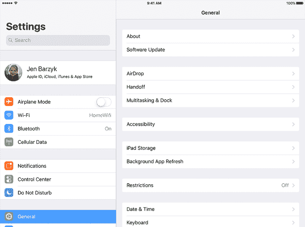

用于 iPad 设置应用的 iOS 分割视图

（图片版权：Apple）

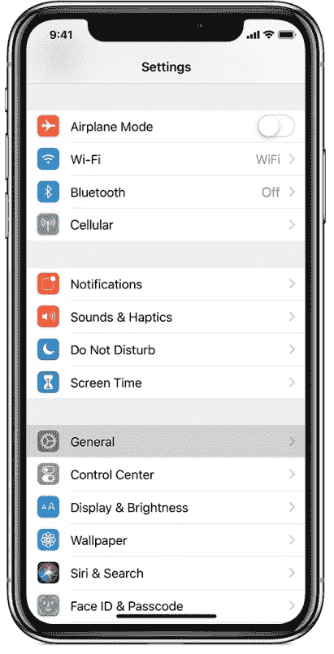

iPhone 上的相同分割视图

（图片版权：Apple）

在可能的情况下，应在您的应用程序中使用这些元素，以便您的界面根据当前设备进行适当配置，但可能需要进一步的定制。让我们看看影响更复杂布局设计的一些因素。

# 设备形态因素

虽然主要考虑的是移动和现代便携式设备，但应用程序布局应考虑到设备的物理设计。桌面上的视觉和交互技术在过去 25 年中基本保持一致，导致标准化了界面设计——但这也在发生变化。现在，计算机更常见地配备超高分辨率屏幕，其中许多也是触摸表面。如果您的方法是跨平台应用程序开发，包括移动设备，您需要考虑屏幕尺寸以及设备的方向。

当然，屏幕并不是唯一需要考虑的因素；现在输入设备的变化也很常见。鼠标和键盘可能是用户输入的主要配置，但许多便携式电脑现在都有*平板模式*，其中触摸输入可以替代鼠标，并且可以出现虚拟键盘进行文字输入。如果你想要支持这种配置，那么你的布局需要在屏幕的一部分（可能是底部边缘）被虚拟键盘覆盖时仍然有效。更重要的是，基于手指的输入（通常称为*多点触控*）比点击和点选的方法要丰富得多；你的应用程序是否旨在支持*捏合缩放*或*触摸旋转*？如果你打算支持这些类型的特性，那么请确保你选择的框架支持*输入手势*。每个工具包都在快速发展，因此，为了避免出版时过时，本书中省略了这些细节。

除了完整的设备功能外，传统的桌面应用程序可以通过许多用户操作进行移动和调整大小或方向——你的设计是否旨在适应这些配置的变化？当在平板设备上并排显示应用程序时，你会看到当正确实现时，不同的布局可以有多么强大。

# 响应式或自适应设计

为了能够适应广泛的设备，通常不可能使用单一的用户界面设计。因此，可能需要对当前环境进行某种形式的适应。关于适应屏幕和设备功能的变化，有两种主要的思想流派：响应式和自适应设计。两者都旨在提供一个适合当前设备的适当用户体验。虽然这些原则目前主要指的是网络应用程序设计，但它们也可以应用于原生应用程序，尤其是当设计针对多个平台时。

当遵循适应性原则时，应用程序设计师会选择一个有限的设备配置集来设计，通常是一个移动设备（可能具有多个方向），一个平板设备，和一个常规桌面。通过为这些类别设计，为特定设备设计所花费的时间将减少，只需关注这些定义的配置。当专注于少数几种变化时，设计可以针对这些不同的用例进行优化，从而创造一个非常流畅的体验。当以这种方式实施时，应用程序将检测其正在运行的设备类别，并加载相应的布局（有时这由框架自动处理）。这种方法已被苹果的 iOS SDK（用户界面为 iPhone、iPhone Plus 和 iPad）所证实，正确的用户界面将被加载，单个应用程序可以以任何配置执行。适应性方法的局限性在于，*中间*设备，即比预期小或大的设备（或具有不寻常的配置），可能不会以用户期望的方式看起来或运行。

相比之下，响应式设计旨在定义一个单一的用户界面，使其能够响应当前设备的配置。以这种方式创建的布局通常会有某些触发值或拐点，这些值或拐点决定了元素的可见性或始终应显示的项目（在 CSS 中，这通常是通过*媒体查询*来实现的）。响应式技术在设计旨在为各种不同设备提供良好体验的网站中越来越受欢迎；它可能无法提供适应性设计所追求的完美用户界面，但它确实为从最小、最不具能力的设备到完整的桌面体验的每一款设备都提供了支持。这种方法很好地映射到跨平台方法，这可能是使用 Go 开发应用程序 GUI 的团队意图的一部分，因为我们通常不知道我们的软件将在哪些设备上运行。

本书探讨的工具包为响应式布局提供了一定程度的支持。根据可用空间和屏幕布局来布局内容的网格是一个良好的起点。一些工具包正在进一步探索这个领域，通过提供能够正确适应当前设备的语义布局：

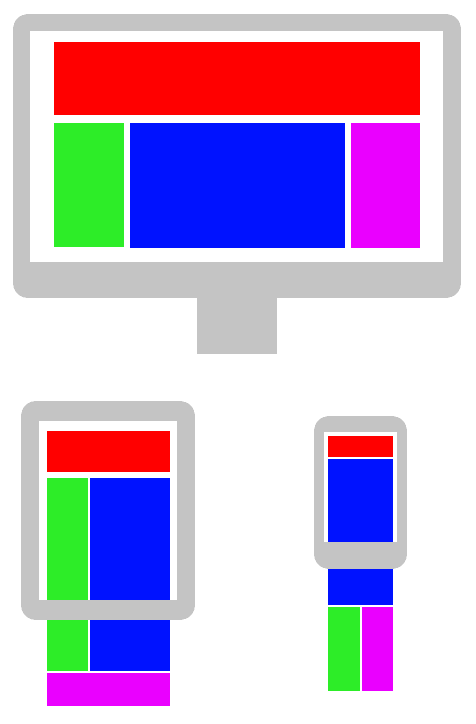

三种不同尺寸的可能响应式布局示例

# 自定义布局

您的应用程序可能具有与标准布局不同的要求，或者比工具包的 API 支持的更复杂。尽可能使用标准布局是推荐的，但这并不意味着必须放弃您理想的应用程序设计。每个工具包都以某种方式支持自定义布局，您可以利用它来填补可用标准布局的空白。以这种方式实现自定义布局时，基本方法是设置父容器内每个组件的固定位置。为了更好地适应可用的屏幕空间，请记住考虑界面的当前宽度和高度；使用比率或百分比而不是绝对值（例如，列表组件是屏幕宽度的 25%或内容列是可用空间的 1/3）通常更容易实现。

在更高级的工具包中，还有一个基于约束的布局可用，它根据配置的方程而不是硬编码的值来布局组件。约束布局的标准算法名为 Cassowary，并在[`overconstrained.io/`](http://overconstrained.io/)上进行了全面文档记录。基本原理是每个布局值都可以定义为形式为`item1.attr1 = item2.attr2 × multiplier + constant`的方程的结果（例如，`button.top = content.bottom × 1.0 + 25`）。基于约束的布局（也称为**自动布局**）在 iOS 和 Android 中是标准的，但在桌面工具包中并不常见。现代 GUI 通常包括这项功能作为标准，但在 Qt 和 GTK 等其他工具包中使用此功能将需要集成第三方项目（因为这些目前无法通过 Go 绑定获得，因此集成超出了本章的范围）：

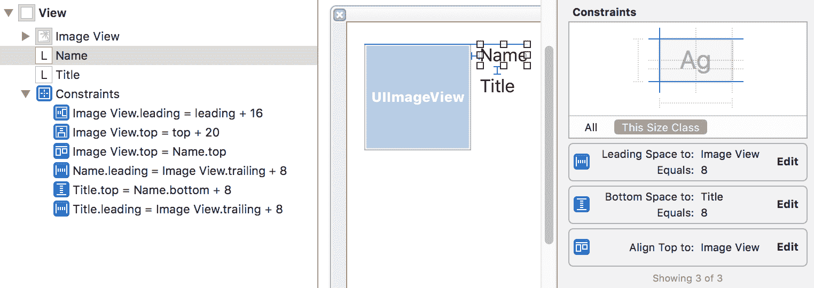

使用 Xcode 向标签添加约束（图片版权：Big Nerd Ranch, LLC）

# 导航您的应用程序

在复杂的应用程序中实现一致且易于遵循的导航是困难的，但做得好可以显著提高用户体验。典型的应用程序有一个核心功能集——这些功能应该始终容易访问——以及一个更大的辅助工具和功能集，这些工具和功能使用频率较低。在核心功能和附加功能之间保持平衡是许多应用程序尚未解决的问题。过于拥挤的工具栏和非常长的菜单是我们经常遇到的问题：

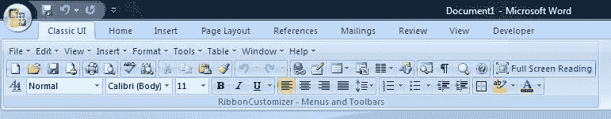

在 Microsoft Office 2007 中，菜单、工具栏、快捷方式和下拉列表都位于文档上方

寻找限制屏幕上各种选项的方法应该会导致用户困惑减少。应用设计师的责任是创建一个清晰且易于使用的界面，而不是展示所有选项并期望用户学习如何导航。调整用户界面以关注基本或最有用功能的方法有很多；我们将在以下章节中探讨它们。

# 渐进式披露

在较大的应用程序（如之前所示），可能无法轻松地在最小用户界面中展示所有可用功能。在这种情况下，应用设计师将面临一个新的挑战，即为新用户提供平滑的学习曲线。如何设计一个应用程序的用户界面，既能满足复杂的功能集，又易于产品新手学习？

渐进式披露是一种帮助集中用户注意力并促进学习复杂系统的技术。这是通过隐藏对完成当前任务不必要的功能或数据来实现的。通常，这是通过从可见的基本功能集开始，并在用户探索超出基本范围的区域时扩展来实现的。扩展可用功能的触发器可能包括访问新的菜单项、高级按钮，或者简单地使用应用程序一段时间或添加足够的数据。

# 示例 1 – Microsoft Edge

流行网络浏览器的一个标准功能是它们包含的开发者工具，但这不是核心功能。当构建新的网络浏览器 Edge 时，微软决定专注于核心功能，将更高级的功能，如开发者工具，隐藏在普通用户之外。

如果通过单个菜单项（...菜单，然后按 F12 开发者工具）或*F12*键盘快捷键启用，开发者功能将被激活。从那时起，浏览器将在所有预期位置展示开发者功能，创建一个功能更丰富的应用程序功能集：

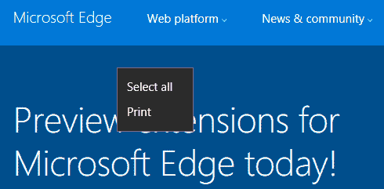

默认 Edge 上下文菜单

F12 或开发者工具菜单项：

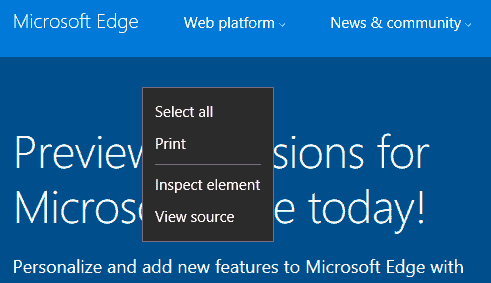

在启用开发者工具后

# 示例 2 – Skyscanner 航班搜索

Skyscanner 服务的主要功能([`www.skyscanner.net/`](https://www.skyscanner.net/))是搜索众多航班，根据价格、时间、位置等标准进行匹配。在（最初看起来最小的）移动应用中找到合适的旅程后，用户通常会通过预订流程购买他们的航班。

如果用户还没有准备好购买，应用程序用户可以将航班组合*收藏*起来以备后用。完成此操作后，应用程序中会出现一个菜单，用户可以从中返回收藏的搜索。如果这些搜索被访问多次，则会出现另一个新功能，称为*关注的航班*，允许更高级的假日规划者监控搜索价格的变动。

# 菜单和工具栏

当您希望向应用程序用户提供许多项目时，菜单或工具栏是方便的选择，但应谨慎且适度地使用。将太多选项添加到工具栏可能会增加类似于微软 Office 的杂乱无章的*功能区*用户界面，如之前所示。同样，为每个功能添加菜单项可能会导致认知过载，因为用户会花费太多时间试图找到项目或记住它们的位置。

# 工具栏

工具栏非常适合用于日常操作。例如，在我们的电子邮件应用程序中，回复将是一个常用的操作，同样还有新建和删除。通过将工具栏项目按相似性分组（例如，回复和全部回复或剪切、复制和粘贴），可以帮助用户快速找到您的快捷方式。按使用频率对这些组进行排序意味着，如果用户界面小于预期，则最有用的功能仍然可见。为了提供无法放入屏幕的工具的访问权限，您可以使用溢出项（其中弹出不可见项目的列表），使工具栏可滚动，或在不同的地方提供访问权限，例如菜单或第二行。

工具栏在大多数设备形态中都很受欢迎，从小型手机到大型桌面应用程序。主要区别是可包含的项目数量。如果您在响应式或自适应布局中包含工具栏，您可能需要考虑比最左侧可见更复杂的策略。例如，在电子邮件应用程序中，如果只能显示五个项目，那么删除全部回复以便显示删除可能是一个好方法；用户可以在按下回复后，在撰写窗口中选择全部回复。

许多应用程序选择允许工具栏中的项目重新排列，这是某些图形工具包提供的一项功能（例如，苹果 iOS 设备的 UIKit 和桌面应用程序的 AppKit）：

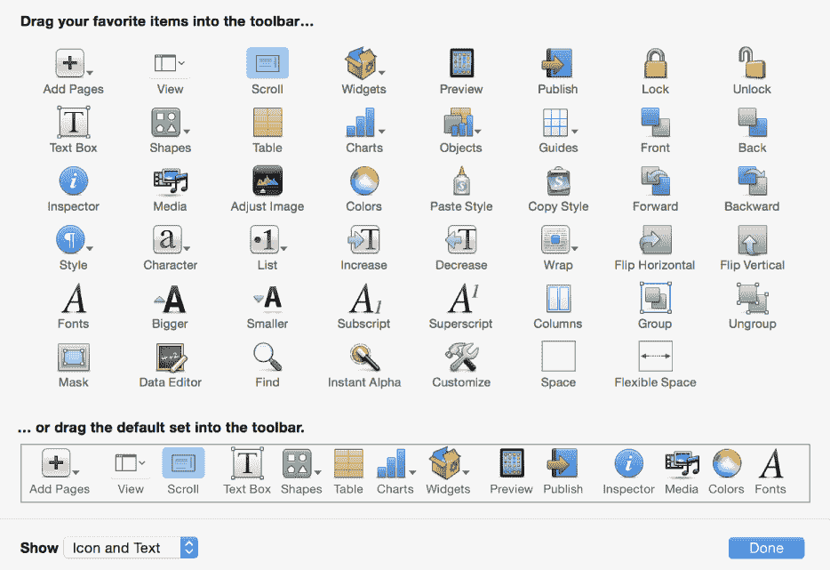

macOS 中自定义工具栏的示例用户界面（图片版权：苹果）

# 菜单

菜单栏传统上被认为是放置应用程序中所有其他缺失功能访问的最佳位置。随着菜单标题中项目数量的不断增加，应用程序菜单很快就会变得难以导航。这通常被认为是由于平均人类在短期记忆中可以保持的项目数量。乔治·米勒在 1956 年的实验表明，通常可以保持在工作记忆中的项目数量在五到九之间（七加减二——米勒的“神奇数字”）。更近期的估计显示，这个数字通常更低，接近四到五个项目。

考虑到这一点，我们可以理解为什么保持菜单数量少且简短很重要——在导航的每一步，应该不超过九个选项，如果可能的话，则更少。

菜单的呈现方式因平台而异，标准的是窗口顶部或屏幕顶部，在桌面应用中最为常见，而在移动布局中，屏幕左上角的图标（被称为汉堡菜单）最为普遍。无论布局如何，你都会注意到顶级列表大约有五个项目，如果需要更多选项，下拉菜单不会比这更长。如果你发现你的菜单变得过长，也许可以考虑任务特定的工具栏或其他与上下文相关的快捷方式分组，可能从单个菜单项打开。

无论你选择哪种设计来提供功能，请记住用户的主要焦点或当前上下文。

你不希望它们变得如此复杂，以至于每一步都需要进行大量的思考：

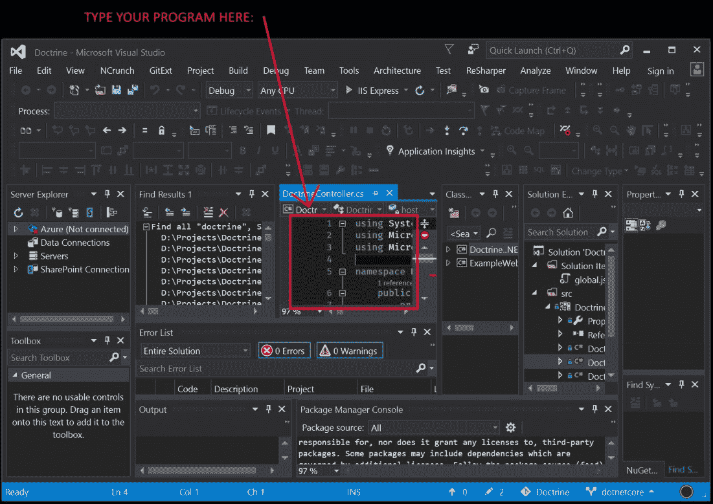

（版权所有：Dylan Beattie）Visual Studio 的所有视图和工具栏都已开启

# 多个窗口

帮助你的应用程序更容易导航的另一种方法是将内容分割成多个窗口。每个窗口都将是你应用程序的不同视图，其中可以展示适合当前上下文的适当工具栏或菜单。正如我们的 GoMail 示例所示，我们在单独的窗口中编写新消息；这允许我们将与编辑相关的项目分组在输入字段附近，并允许我们同时草拟多个消息，而不会使我们的电子邮件浏览窗口变得杂乱。

当然，不同的平台上的多个窗口不一定具有相同的语义。如果我们在一个智能手机设备上采取同样的方法，将合成窗口作为现有应用的叠加显示是很常见的。用户是否可以在该模式和浏览窗口之间切换，可能取决于操作系统的设计，或者我们可能决定，在较小的设备上运行时，合成窗口应该是一个**模态**窗口（即，它阻止对父窗口的访问。这一点将在稍后进一步讨论）。

我们在第二章，*图形用户界面挑战*中看到的一种另一种方法是为主应用程序的焦点提供多个窗口。这些外围窗口通常是工具栏或主窗口中内容详细信息/控制的详细信息，在基于内容创建的应用程序中尤其有帮助。随着内容扩展以填充整个主窗口，工具栏和上下文操作已被放置在单独的窗口中，以保持用户专注。这种布局和导航通常在*专业*应用程序中采用，其中用户对领域非常了解。这种方法的附加复杂性可能导致产品早期用户感到困惑，因此作为应用程序的设计师和开发者，我们应该注意我们在用户界面中呈现的窗口数量或不同的布局和上下文。

# 窗口类型和保持整洁

管理多个窗口对于任何应用程序都将成为必要，无论是通过像前面那样的布局设计的一部分，还是为了向用户展示重要信息以吸引他们的注意或接收他们的输入。对于您应用程序中显示的每个窗口，了解其外观是否应该立即吸引他们的注意，支持屏幕上已有的内容，或者只是可以稍后关注的事情，这一点很重要。了解显示的每个窗口的意图将有助于支持而不是阻碍用户的工作流程，并保持您应用程序的用户体验整洁。

# 标准对话框

在应用程序流程中显示额外窗口的最常见原因是请求用户输入或确认，或提醒他们（通常是意外的）事件。这些是标准交互，因此通常最有效的方法是尽可能使用所使用的工具包提供的对话框窗口。使用提供的 API 通常将提供最一致的用户体验，并且几乎肯定会导致您的应用程序中的代码更少。

工具包提供的标准对话框类型通常包括文件处理（打开和保存）、进度（当用户必须等待时）、消息（显示警告或错误）以及确认对话框（立即提问）。在更高级的工具包中，您还可以期待找到用于颜色选择、字体选择、文档打印甚至标准关于窗口的对话框 API。以下 API 是开始使用本书前面提到的某些工具包的绝佳起点（如果它不是默认的，则包括命名空间）：

|  | **遍历** | **andlabs UI** | **GoGTK** | **qt** | **Fyne** |
| --- | --- | --- | --- | --- | --- |
| **打开** | `ShowOpen` | `OpenFile` | `NewFileChooserDialog` | `widgets.NewQFileDialog` |  |
| **保存** | `ShowSave` | `SaveFile` | `NewFileChooserDialog` | `widgets.NewQFileDialog` |  |
| **进度** |  |  |  | `widgets.NewQProgressDialog` | `dialog.NewProgress` |
| **消息** |  | `MsgBox` `MsgBoxError` | `NewMessageDialog` | `widgets.NewQMessageBox` `widgets.NewErrorMessage` | `dialog.ShowInformation` `dialog.ShowError` |
| **确认** |  |  |  | `widgets.NewQMessageBox` | `dialog.ShowConfirmation` |
| **输入** |  |  |  | `widgets.NewQInputDialog` |  |
| **颜色** |  |  |  | `widgets.NewQColorDialog` |  |
| **字体** |  |  | `FontSelection` | `widgets.NewQFontDialog` |  |
| **打印** |  |  |  | `printsupport.NewQPrintDialog` |  |
| **关于** |  |  | `NewAboutDialog` |  |  |
| **自定义** | `NewDialog` |  | `NewDialog` | `widgets.NewQDialog` | `dialog.ShowCustom` |

有时显示一个小型的选择或确认窗口，而不在先前的列表中（要么是因为你的需求不同，要么是因为工具包尚未实现该功能）。这可以通过创建一个新窗口，打包内容并显示它来实现，但推荐的方法是使用自定义对话框 API。显示对话框而不是标准窗口允许工具包将窗口配置为最佳效果。这通常涉及将其设置为不可调整大小的、最顶层的模态窗口（意味着用户在对话框关闭之前不能与下面的窗口交互）。

# 模态窗口

如前所述，模态窗口是一种阻止用户向其上方的窗口输入的窗口。这通常意味着它被放置在父窗口的中心，下面的窗口将被禁用或变灰，将用户交互集中在新的对话框窗口上。这是对话框窗口的典型特征，因为它们设计为仅在用户无法继续当前任务（直到信息、确认或进度完成）时出现（此时对话框消失，控制权返回）。 

为了以这种方式运行，模态窗口通常会被传递一个父窗口，该窗口应该被遮挡。输入将被强制导向新的模态窗口（根据桌面环境和配置，如果父窗口当前不是最顶层应用程序，则可能不会这样）以与新的界面交互。不同的平台可以使用各种样式来显示模态窗口；一些看起来像普通窗口（通常禁用最大化和小化按钮），其他则将内容嵌入到当前窗口中，还有一些（如 macOS）可以从父窗口的标题栏中显示它们。使用内置的 API 进行自定义对话框将意味着这些视觉风格在你的应用程序中是一致的。

然而，可能存在某种原因，使得你的应用程序需要在不同的工作流程中打开一个新窗口以获取焦点。在这些情况下，工具包通常允许直接设置窗口的**模态**。这可能是一个强大的功能，但请确保考虑是否没有更好的 API 来管理此流程，或者是否自定义对话框窗口可能更适合。

# 窗口提示

窗口的属性（在许多系统中被称为*提示*）允许应用程序向操作系统指示某些期望的属性，这将控制窗口的展示方式。由于各种原因（包括用户体验甚至安全性），在大多数情况下，应用程序不能强制规定窗口如何以及何时展示；因此，重要的是要记住，这些提示可能不会被强制执行。

# 尺寸

最常见的提示设置与大小相关——即用户界面应占用的最小和可能的最大尺寸。最小尺寸几乎在所有图形系统中都得到支持；每个图形系统都会尽量允许应用程序使用它声称需要的空间。但是，请确保尺寸合理，因为，尤其是当针对多种不同的平台类型时，最小尺寸不应大于可用的屏幕！为了避免这种情况，操作系统可能会显示比请求的更小的应用程序窗口，这样用户就不会遇到访问屏幕外用户界面部分的问题。仅出于这个原因，建议设置的最低尺寸确实是 GUI 能够正确运行的最低尺寸。

为了确保应用程序在首次加载时比例正确，通常设置一个默认或首选的大小（通常通过`SetDefaultSize()`、`SetSize()`或`Resize()`实现）。这意味着，尽可能多的情况下，应用程序将以一个合理的尺寸加载，但如果屏幕不够大，则可能更小。在我们的*新 GoMail*电子邮件编写窗口的例子中，我们可以设置一个良好的默认值，以便在保持合理的最小尺寸（可能由工具包计算得出）的同时，允许访问所有输入字段。

此外，为您的窗口设置一个最大尺寸可能也有帮助；虽然不像最小或默认尺寸那样常用，但这可能很有帮助。最常见的情况是，如果您希望窗口保持较小（例如工具箱或信息窗口）或仅向一个方向扩展（仅允许高度调整，或将最小和最大宽度设置为相同的值）。在展示自定义对话框时，将最小和最大尺寸设置为相同的值也很有帮助，因此请求窗口为固定大小。一些工具包通过提供`SetFixedSize()`函数使这变得更容易。

# 其他提示

可以在窗口上设置许多其他类型的属性或提示，以帮助用户在应用程序中导航。根据工具包的不同，可能可以设置窗口类型。这通常在显示对话框窗口时自动处理（因为它们可以具有特殊属性），但对于其他类型的窗口创建可能不会处理。请检查您选择的工具包中的窗口 API，以查看您是否可以在创建工具箱窗口或信息面板等应属于父窗口的窗口时设置窗口类型。

最有指导意义的窗口提示是在任务栏、应用程序切换器以及可能窗口边框中显示的图标。在某些系统中，默认图标是应用程序的图标，而在其他系统中则是特定于窗口的图像。通常，将相同图标设置在您的应用程序窗口和应用程序图标上是一个好主意，这可能由您使用的工具包处理。为窗口设置不同的图标应仅保留在窗口服务于与主窗口不同目的时。为了避免用户混淆，与主图标不同的窗口图标应通过样式或内容表明它们与哪个主图标相关。设置窗口图标通常是通过调用`window.SetIcon()`或`widget.SetWindowIcon()`（对于顶级小部件）来实现的。在某些情况下，`application.SetDefaultIcon()`可能允许您通过单个调用为所有窗口设置图标。

设置应用程序图标是平台特定的，并在第十四章，*分发您的应用程序*中进一步探讨。重要的是要意识到，一些系统允许加载自定义图标主题。在这种情况下，自定义应用程序或窗口图标可能对用户来说不太熟悉，因此您可能考虑在应用程序本身中包含一些品牌元素。

# 通知和任务状态

如我们之前所见，大多数工具包 API 提供方便的方式来打开对话框窗口，显示信息、进度报告和错误以吸引用户的注意。然而，权力越大，责任越大；除非真的有必要，否则不要打断工作流程。想想看，你不得不等待或关闭的许多“文件下载完成！”或“请等待下载更新...”对话框窗口，你就会明白正确的方向。

那么，解决方案是什么？让我们看看如何以不太妨碍的方式向用户呈现非关键警报或后台进度。

# 小型警报

应向用户呈现的许多消息可能并不重要，因此可能不需要中断他们的流程。信息可能不足以证明显示另一个窗口，或者可能是基于时间的，因此如果应用程序不活跃，当用户回来时可能就不再相关。大多数操作系统中的更好方法是通知区域。

最初作为系统托盘的一部分呈现，通知以气泡或呼出区域的形式显示，如果用户准备好分心，则可以吸引他们的注意力；否则，可以忽略。更现代的呈现方式是在通知区域（可能并不总是可见）中放置所有应用程序通知。这提供了一种方法，可以在更方便的时间对所有消息进行分组处理。通常显示预览，因此保持消息简短是一个好主意。

可以使用我们讨论过的许多框架的内置 API 来创建通知，例如 Qt 中的`NewQSystemTrayIcon().ShowMessage()`或 Walk 中的`NewNotifyIcon().ShowMessage()`。使用这些函数通常会在当前平台的默认通知区域显示通知，从而提供一致的用户体验。然而，这意味着即使在旨在跨多个平台完全一致的用户界面工具包中，此代码的行为也可能不同，因此在编写文档时务必测试所有支持的平台，并牢记这些差异：

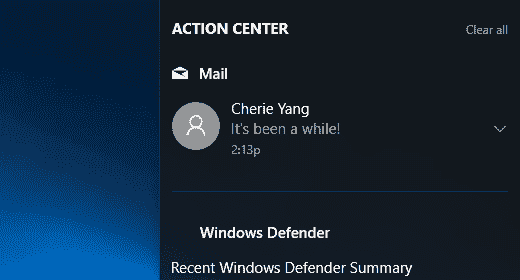

通知出现在 Windows 10 的操作中心（图片版权：微软）

# 背景进度

Qt、Fyne 和其他提供的进度对话框窗口非常适合显示用户还需要等待多长时间才能完成关键过程（例如打开大文件、缓冲电影或从网站加载数据）。它们不适合报告用户在应用程序中继续任务时可以运行的任务的进度。为此，我们应该考虑在应用程序或屏幕的其他位置显示信息。

许多系统开始添加在标准区域报告任务进度的支持，例如前面描述的通知空间。不幸的是，这还没有在足够的操作系统上普及，以至于我们探索的工具包可以提供支持；因此，我们必须使用另一种方法。对于此类后台进程，有两种常见的策略来传达任务进度，这可能取决于您是否期望同时运行多个任务。

对于可能运行单个后台任务的应用程序（例如运行构建的 IDE 或与服务器同步的任务列表），传统的做法是在应用程序的某个位置嵌入进度条。这将显示在后台任务开始时，并在完成后消失。这样的视觉提示通常位于状态栏或其他用户通常寻找辅助信息的信息区域。

如果您的应用程序经常需要运行多个后台事件，例如文件下载或图像转换，那么在任务运行时通常会看到一个新窗口或工具面板出现。这个用户界面新增功能通常会列出所有正在进行的任务及其进度，并在完成后隐藏它们。由于这些对当前工作流程不是关键，因此很重要的一点是不要在当前工作之上显示这些元素——实际上，一些应用程序（如苹果的 Safari 网络浏览器）甚至不会显示此窗口，除非用户请求有关下载进度的详细信息：

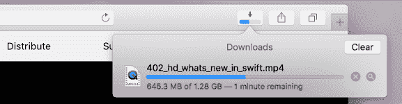

Safari 中的下载列表默认情况下不可见，但如果请求将提供详细信息（图片版权：苹果）

# 平台特定考虑事项

尽管大多数小部件工具包在它们支持的平台上工作方式相似，但在操作系统行为上仍有一些差异。这些差异可能是由于希望与竞争对手区分开来，或者认为他们的方法提供了更好的用户体验。这些区别应该被考虑进去。在本节中，我们将探讨平台方法中的一些显著差异。

# 窗口分组

在 Windows 10 的任务栏和大多数 macOS 版本中，一个应用程序的所有窗口都聚集在单个图标下。这使得用户界面不那么杂乱，但也意味着打开许多窗口的应用程序可能更难导航，因为没有简单的图标点击来显示特定窗口。再加上 macOS 和 Ubuntu Linux（或使用 Gnome 桌面的其他发行版）在任务切换器中将窗口聚集在单个图标下的行为（键盘*Alt* + *Tab*）。在 Gnome 中，你可以通过按向下箭头键或使用鼠标来探索图标下的窗口，但在 macOS 上，你需要使用替代的键盘组合（*Alt* *+~）来循环应用程序的窗口。

这种将窗口分组的趋势可能会影响展示多个窗口的应用程序的设计；如果你每次启动应用程序时都打开三个窗口，那么；在打开三个文档之后，你可能会打开九个窗口。在这种情况下最常见的方法是只打开一次支持窗口，使它们的工具或信息假设当前文档的上下文（可能是最顶层的窗口）。然而，这可能会增加你应用程序的复杂性，因为它需要与其他已经打开的软件实例进行通信。

# 应用程序实例

尽管在现代任务切换器中有些隐藏，但可以注意到一些操作系统更倾向于只打开一个应用程序实例，而不是打开多个（例如，每个文档一个）。在为 macOS 开发应用程序时，建议在任何时候只运行一个副本-尝试运行同一应用程序的第二个实例通常会导致原始窗口被带到前台。如果你的应用程序旨在支持*并发实例*语义不同的平台，应该花时间决定你的应用程序应该如何表现。你的设计是否会在所有平台上以相同的方式工作，还是适应当前的环境？

要根据平台更改行为，可以在运行时检测操作系统，但通常操作系统是决定性因素，因此您可以使用在第三章中讨论的 Go 内置构建标签，*Go to the Rescue!*。例如，我们可以有两个不同的文件来控制应用程序的打开方式：`launch_darwin.go` 将在为 macOS 编译时使用，而 `launch_other.go` 将在其他平台上运行。设置此示例可能如下所示。

首先，我们创建一个处理标准机制（称为 `launch_other.go`）的文件；打开文件或新文档将创建一个带有适当文档的窗口并显示它：

```go
// +build !darwin
package main

type app struct {
}

func (a *app) openFile(file string) {
   newWindow(openDocument(file)).Show()
}

func (a *app) openBlank() {
   newWindow(newDocument()).Show()
}
```

然后，我们为 macOS 创建一个版本（命名为 `launch_darwin.go`），它首先检查是否有正在运行的实例。如果找到，我们将调用一些 **RPC**（**远程过程调用**）函数在运行的应用程序中打开文件，否则我们像以前一样加载窗口：

```go
package main

import (
   "log"
   "os"
)

type app struct {
}

func (a *app) openFile(file string) {
   running := getFirstInstance(a)
   if running != nil {
      log.Println("Found running app, opening document", file)
      running.openFile(file)
      os.Exit(0)
   } else {
      newWindow(openDocument(file)).Show()
   }
}

func (a *app) openBlank() {
   running := getFirstInstance(a)
   if running != nil {
      log.Println("Found running app, opening blank document")
      running.openBlank()
      os.Exit(0)
   } else {
      newWindow(newDocument()).Show()
   }
}
```

启动此应用程序的主函数可能主要是解析命令行参数以确定是否传递了文件名，如下所示：

```go
func main() {
   app := &app{}

   if len(os.Args) <= 1 {
      app.openBlank()
   } else {
      app.openFile(os.Args[1])
   }
}
```

`getFirstInstance()` 和 RPC 代码的详细信息超出了本章的范围，但可以在本书的代码仓库中的 `chapter11/singleapp` 文件夹中找到。这种模型可能被某些工具包支持，但也有项目旨在使其更容易，例如 [`github.com/marcsauter/single`](https://github.com/marcsauter/single)。

# 额外功能

在某些情况下，可能无法在您的应用程序或工具包支持的所有平台上找到等效的行为或用户界面元素。在这些情况下，您可能会发现工具包提供了特定于操作系统的扩展，这些扩展可以在您的应用程序代码中使用。如果您使用这些特定平台的项，您需要确保您的代码在其他目标系统上仍然能够正确运行。这通常由构建约束来处理，如前面的示例，其中某些实现可能没有或减少了功能以匹配最低的共同基数。

这样的平台扩展是 Qt Windows Extras，它提供了任务栏图标进度 API 和提供 *跳转列表*（来自应用程序图标的快捷方式集）的方法。该项目可以在 [`doc.qt.io/qt-5/qtwinextras-index.html`](http://doc.qt.io/qt-5/qtwinextras-index.html) 找到。

# 摘要

在本章中，我们探讨了设计和编程更复杂图形应用程序的技术。在查看复杂布局和深层导航结构的原则时，我们比较了常见应用程序如何处理这些挑战，并注意到了要避免的复杂用户界面类型。为了在这些应用程序中提供更丰富、一致的用户体验，我们研究了提供标准对话框窗口并允许开发者配置应用程序窗口以与应用程序工作流程保持一致的 API。

后台任务进度和系统通知应该是可见的，但不能打断用户的操作流程。我们探讨了如何使用工具包小部件和常见技术来提供这种平衡的通信。为了进一步与当前操作系统集成，我们探讨了桌面平台之间的差异以及它们提供的附加功能，以便应用程序可以在保持单一代码库的同时进行跨平台开发。

在下一章中，我们将关注 Go 提供的后台操作和网络功能，以及如何在图形应用程序中有效地使用它们。我们将回到我们的 GoMail 示例，并利用云服务来扩展它们，以提供更丰富的用户体验。
