# 并发、网络和云服务

到目前为止，我们一直专注于设计和构建应用程序的图形元素。大多数现代软件如果没有与互联网服务和网络功能稳固的连接就不完整。如果未正确管理，向远程服务添加依赖项可能会影响应用程序的稳定性。并发也是管理与远程服务交互的关键部分；我们需要添加更高级的任务处理来管理这些不同的通信渠道。

在本章中，我们将探讨以下主题：

+   线程处理和管理用户界面

+   在你的应用程序中包含远程资源

+   连接到云服务并处理错误情况

+   在网络断开时维护用户体验

到本章结束时，你应该能够将远程资源和云服务集成到你的应用程序中。你还将看到如何维护响应式用户界面，尽管这种新功能依赖于可能不可靠或不稳定的网络连接。随着应用程序更新以管理来自多个来源的数据，长时间运行的后台过程和它们可能引起的通信挑战将完全解决。

# 并发、线程和 GUI 更新

Goroutines 是运行并发操作和后台任务的非常强大的工具，尤其是如果它们是短运行的。随着我们将更多的应用程序逻辑和数据处理移到后台进程，我们需要添加适当的保障措施来确保错误得到处理，并且用户界面保持最新。

# 管理长时间运行的过程

通常创建 goroutine 是为了在后台任务完成的同时继续代码流程。如果这些任务开始用于应用程序关键任务或处理重要数据，尤其是如果这些任务可能需要很长时间，我们需要更仔细地管理它们。主要考虑的是如何在应用程序退出时优雅地关闭后台任务。这可能看起来不是必需的，对于某些任务可能确实不是，但如果过程涉及数据完整性，我们希望确保提前终止不会引起问题。

# 信号关闭

为了演示这个问题，让我们从一个简单的 goroutine 演示开始；我们将启动三个线程来打印进度。对于每个线程，我们将打印`Started`然后是`.`，直到线程停止，此时将打印`Ended`：

```go
package main

import (
   "fmt"
   "time"
)

func tick() {
   fmt.Println("Started")

   for _ = range time.NewTicker(time.Second).C {
      fmt.Print(".")
   }

   fmt.Println("Ended")
}

func main() {
   go tick()
   go tick()
   go tick()

   time.Sleep(5 * time.Second)
}
```

如果你运行此代码，你将看到以下输出。线程按预期启动并计时，在`5`秒超时后，程序退出。没有看到`Ended`消息：

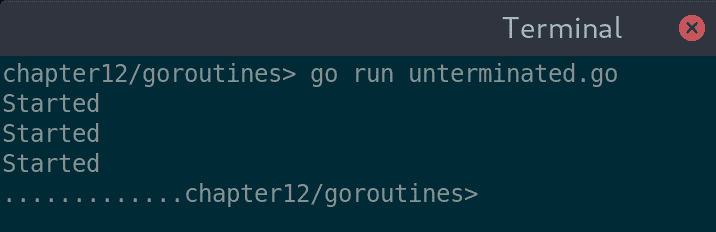

未终止 goroutine 的输出

如您从这个简单的演示中看到的，goroutines 并没有优雅地终止；它们只是停止运行。如果我们正在编写复杂的数据，向远程服务器发送消息，或等待重要响应，这可能会导致数据损坏或其他意外结果。让我们看看如何在应用程序终止时如何向 goroutines 发出停止信号。

我们首先创建一个简单的名为`stop`的通道，并将其传递给每个 goroutine。当应用程序准备退出时，我们将向每个线程发出信号，以便它们可以通过关闭此通道来完成工作。我们更新 tick 函数以检查这个新通道是否已关闭，如果是，它将退出。为了在应用程序退出之前允许代码完成，我们必须在`main()`的末尾添加一个新的暂停，以便进行清理。更新的代码如下所示：

```go
package main

import (
   "fmt"
   "time"
)

func tickUntil(stop chan(struct{})) {
   fmt.Println("Started")

   ticker := time.NewTicker(time.Second).C
   for {
      select {
      case <-ticker:
         fmt.Print(".")
      case <-stop:
         fmt.Println("Ended")
         return
      }
   }
}

func main() {
   stop := make(chan(struct{}))

   go tickUntil(stop)
   go tickUntil(stop)
   go tickUntil(stop)

   time.Sleep(5 * time.Second)
   close(stop)

   time.Sleep(10 * time.Millisecond)
}
```

运行此代码应显示以下输出，这正是我们最初所寻找的：

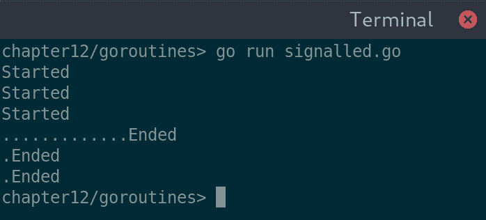

使用信号通道，我们的线程可以在程序退出前结束

# 检查完成情况

上述示例在技术上可行，但依赖于定时器等待线程完成并不可靠。如果线程需要等待响应或正在进行长时间的计算，如果定时器超时，我们仍然有可能出现数据损坏。解决方案是在清理完成后让 goroutine 发出信号。这可以通过`sync.WaitGroup`或使用另一个通道来实现。

对于我们的完成线程示例，我们创建`sync.WaitGroup`，并将其传递给每个 tick 线程。在我们启动 goroutine 之前，我们使用`wg.Add(1)`增加等待线程的数量。一旦每个线程完成，它们就会使用`wg.Done()`标记。然后，我们的应用程序可以自由地立即在退出前调用`wg.Wait()`，安全地知道它不会提前终止任何分组的后台进程。

以下代码演示了如何向多个 goroutines 发出信号和等待：

```go
package main

import (
   "fmt"
   "sync"
   "time"
)

func tickAndEnd(stop chan (struct{}), wg *sync.WaitGroup) {
   wg.Add(1)
   go func() {
      fmt.Println("Started")

      ticker := time.NewTicker(time.Second).C
      for {
         select {
         case <-ticker:
            fmt.Print(".")
         case <-stop:
            fmt.Println("Ended")
            wg.Done()
            return
         }
      }
   }()
}

func main() {
   stop := make(chan (struct{}))
   wg := &sync.WaitGroup{}

   tickAndEnd(stop, wg)
   tickAndEnd(stop, wg)
   tickAndEnd(stop, wg)

   time.Sleep(5 * time.Second)
   close(stop)

   wg.Wait()
}
```

这个输出几乎与上一个版本完全相同，但线程结束的具体时间略有不同：

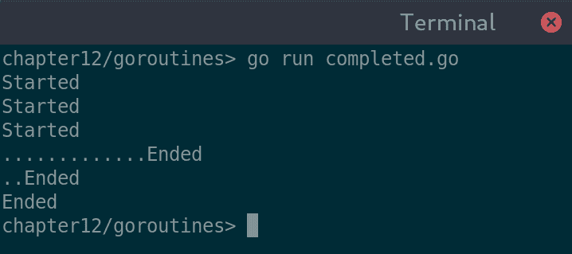

等待 goroutines 完成而不是等待固定的时间

# 通过通道进行通信

正如我们在前面的章节中看到的，goroutines 提供了强大而简单的并发操作。大多数这些示例都是生成输出或响应用户请求，但长时间运行的过程通常会产生需要由应用程序利用的数据。在这个例子中，我们看到如何使用通道有效地从多个线程收集数据以聚合和报告。

我们的示例是一个简单的工具，可以获取目录的磁盘使用情况。对于这个目录内的每个元素，我们将启动一个 goroutine（`dirSize()`），它会计算目录及其包含的文件使用的空间。这个函数通过通道返回结果，这样应用程序就可以在信息可用时使用它：

```go
package main

import (
   "fmt"
   "os"
   "path/filepath"
)

type sizeInfo struct {
   name string
   size int64
}

func dirSize(path string, result chan sizeInfo) {
   var size int64

   filepath.Walk(path, func(_ string, file os.FileInfo, err error) error {
      if err == nil {
         size += file.Size()
      }

      return nil
   })

   result <- sizeInfo{filepath.Base(path), size}
}
```

在`reportUsage()`函数中，我们为指定目录中报告的每个文件启动尽可能多的 goroutine。然后代码在 goroutine 完成时打印使用结果，使用`for info := range result`，并在每个结果返回时终止（`if results == len(files) {break}`），在我们退出之前添加一个简单的总数：

```go
func reportUsage(path string) {
   f, _ := os.Open(path)
   files, _ := f.Readdir(-1)
   f.Close()

   result := make(chan sizeInfo)
   for _, file := range files {
      go dirSize(filepath.Join(path, file.Name()), result)
   }

   var total int64
   results := 0
   for info := range result {
      total += info.size
      fmt.Printf("%s:\t%d\n", info.name, info.size)

      results++
      if results == len(files) {
         break
      }
   }
   fmt.Printf("\nTotal:\t\t%d\n", total)
}
```

最后，我们添加一个`main()`函数，它简单地解析参数以初始化`reportUsage()`函数。如果没有指定参数，我们将为`os.Getwd()`报告的当前目录报告：

```go
func main() {
   path, _ := os.Getwd()

   if len(os.Args) == 2 {
      path = os.Args[1]
   }

   fmt.Println("Scanning", path)
   reportUsage(path)
}
```

运行此示例可能立即返回，但如果你在大型目录上调用它，可能需要一些时间才能完成。通过这样做，你可以看到每个打印的输出都会在相关的 goroutine 完成时立即出现，而总数总是最后出现。前面的列表中没有包括在结果截图（可在本书的代码库中找到）中看到的一些样板数字格式化：

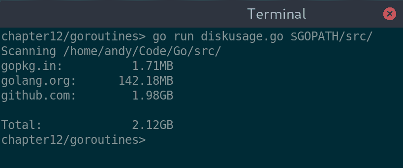

报告目录的使用情况；通常较小的项目先出现，因为它们计算得更快

# 来自 goroutine 的图形更新

与图形界面（在大多数框架中）通信意味着正确管理线程。在先前的示例中，我们可以在`dirSize()`方法中更新 GUI，例如添加一行到表格中。从理论上讲，这样就可以避免需要通道和传递回`reportUsage()`函数的结构。然而，更改线程是一个（相对）缓慢的过程，这取决于其他应用程序活动，而且我们应尝试将我们的逻辑和数据处理与用户界面代码分离。这样做将使以后重用代码更容易，并且如果我们的需求发生变化，还可能更容易更改工具包。

我们的设计是将大部分用户交互处理在一个单独的函数中，这意味着我们的实际目录使用代码与用户界面完全分离。让我们更新前面的示例，以生成图形输出。这次我们将使用 Go-GTK，因为它的线程处理非常明确：

```go
func gtkReportUsage(path string, list *gtk.ListStore, totalLabel *gtk.Label) {
   f, _ := os.Open(path)
   files, _ := f.Readdir(-1)
   f.Close()

   result := make(chan sizeInfo)
   for _, file := range files {
      go dirSize(filepath.Join(path, file.Name()), result)
   }

   var total int64
   results := 0
   for info := range result {
      var listIter gtk.TreeIter
      total += info.size

      gdk.ThreadsEnter()
      list.Append(&listIter)
      list.SetValue(&listIter, 0, info.name)
      list.SetValue(&listIter, 1, formatSize(info.size))
      gdk.ThreadsLeave()

      results++
      if results == len(files) {
         break
      }
   }

   gdk.ThreadsEnter()
   totalLabel.SetText(fmt.Sprintf("Total: %s", formatSize(total)))
   gdk.ThreadsLeave()
}
```

注意，我们的替代使用报告方法有两个`gdk.ThreadsEnter()`和`gdk.ThreadsLeave()`实例；每次我们更新用户界面时，我们必须切换到`gdk`主线程。正如之前的 Go-GTK 示例中那样，我们还需要更新主方法以正确初始化线程处理：

```go
func main() {
   glib.ThreadInit(nil)
   gdk.ThreadsInit()
   gdk.ThreadsEnter()
   gtk.Init(nil)

   window := gtk.NewWindow(gtk.WINDOW_TOPLEVEL)

...

   gtk.Main()
}

```

为了简洁起见，本章省略了完整的用户界面创建，但可以在本书的源代码中找到（在`chapter12/goroutines/gtkdiskusage.go`中）。大多数图形工具包都要求后台进程在更新用户界面时切换到主线程或图形线程。一些，如 Fyne，没有这个要求，您可以在示例的替代版本中看到这一点（本书的代码库中也可用，在`chapter12/goroutines/fynediskusage.go`）。我们不是在线程处理代码中包装 GUI 调用，而是简单地从后台代码调用`list.Append()`或`label.SetText()`，界面将相应更新：

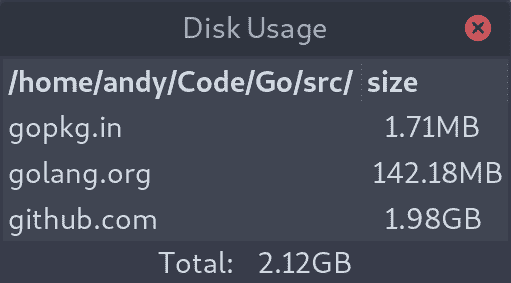

用于磁盘使用示例的 GTK 界面

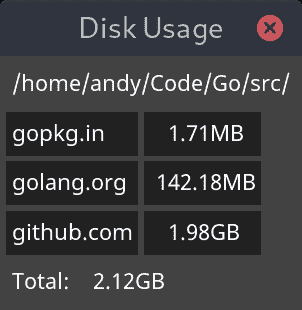

使用 Fyne 的相同磁盘使用示例

# 网络资源和缓存

访问远程资源，无论是在本地网络中还是在互联网上的服务器上，在大多数应用程序中都可能扮演一定的角色。不幸的是，这也可能是许多潜在问题的来源：响应缓慢、数据意外或根本没有数据。让我们看看一些我们可以采取的方法，即使在需要使用网络和集成云服务的情况下，也能创建一个健壮的应用程序。

# 加载远程资源

在 Go 中访问资源通常是通过字节流进行的，无论是本地（用于嵌入式资源或文件系统访问）还是远程（用于 HTTP 请求和远程服务器上的数据）。由于读取本地和远程数据的方法相似，我们可以在大多数使用本地或嵌入式资源的地方加载远程资源。

# 图像

遵循基于流的架构，Go 的`image`包可以从流中解码图像。通过连接到远程流并从请求中读取字节，我们可以轻松地从 Web 服务器渲染图像。以下代码使用 Fyne 的`canvas.NewImageFromImage()`函数来渲染从[`golang.org/doc/gopher/frontpage.png`](https://golang.org/doc/gopher/frontpage.png) URL 使用`image.Decode()`加载的 Go 解码图像：

```go
package main

import (
   "image"
   _ "image/png"
   "io"
   "log"
   "net/http"

   "fyne.io/fyne"
   "fyne.io/fyne/app"
   "fyne.io/fyne/canvas"
)

func readStream(url string) io.ReadCloser {
   res, err := http.Get(url)
   if err != nil || res.StatusCode != 200 {
      log.Fatal("Error reading URL", err)
   }

   return res.Body
}

func remoteImage(url string) image.Image {
   stream := readStream(url)
   defer stream.Close()

   m, _, err := image.Decode(stream)
   if err != nil {
      log.Fatal("Error reading image", err)
   }

   return m
}

func main() {
   app := app.New()
   w := app.NewWindow("Remote Image")

   img := canvas.NewImageFromImage(remoteImage("https://golang.org/doc/gopher/frontpage.png"))
   img.SetMinSize(fyne.Size{180, 250})
   w.SetContent(img)
   w.ShowAndRun()
}
```

如您所预期，此应用程序打开一个窗口，其中包含加载的图像作为其内容：


从互联网上加载文件

但这仅在互联网连接表现正常时才适用，即使如此，也可能比用户预期的加载时间更长。在我们探讨改进策略之前，让我们看看如何从 Web 服务下载的数据执行相同的操作。

# JSON

要探索如何与来自网络服务的远程数据一起工作，我们将从第三章的示例开始，*Go to the Rescue!*。代码被精简并更新，以使用为前面的图片示例创建的相同`readStream()`函数。生成的代码非常基础，但展示了我们可以如何轻松地使用内置的 Go 功能将 JSON 数据解码到结构体中：

```go
type Person struct {
   Title     string `json:"title,omitempty"`
   Firstname string `json:"firstname"`
   Surname   string `json:"surname"`

   Username string `json:"username"`
   Password string `json:"-"`
}

func main() {
   fmt.Println("Downloading...")
   stream := remote.ReadStream("http://echo.jsontest.com/title/Sir/" +
      "firstname/Tom/surname/Jones/username/singer1/")
   defer stream.Close()

   person := &Person{}
   json.NewDecoder(stream).Decode(person)
   fmt.Println("Decoded:", person)
}
```

使用单一方法来加载我们的资源使我们能够在一个中央位置放置更健壮的错误处理。在我们做出这些改进之前，如果请求失败（例如没有互联网或服务器错误），我们的应用程序将会崩溃：

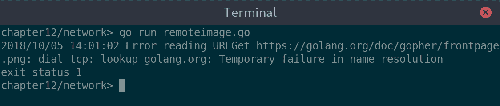

没有网络连接时的图片加载失败

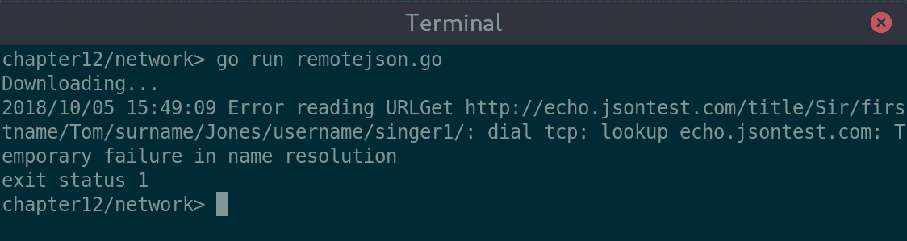

离线时也无法访问 JSON

虽然这些错误可以得到更好的处理，但我们仍然没有下载任何内容。图片加载失败可能无关紧要，但连接存在但缺少 JSON 数据的情况可能会降低我们应用程序的功能。我们应该努力改善连接不存在或响应不正确的情况。

# 缓存资源数据

当网络连接缓慢或不稳定时，我们提供更好体验的第一种方法是为我们的远程资源实现缓存机制。这样一来，应用程序的一次在线运行就足以防御连接问题，因为它会填充缓存数据。额外的好处是，在应用程序的重复运行中，加载这些资源会更快。

在前面的图片示例的基础上，我们实现了一个新的函数，`cacheStream()`，我们将用它来代替`readStream()`。一个名为`cacheFileName()`的辅助函数根据`url`参数确定用于缓存的文件位置。每次我们使用此函数请求 URL 时，它都会尝试从该位置加载缓存的副本；如果存在，则直接返回该位置的`io.ReadCloser`。如果缓存文件不存在，则我们使用原始的`readStream()`函数将内容下载到缓存文件中，然后像以前一样返回缓存文件的流：

```go
func cacheFileName(u string) string {
   id, _ := url.Parse(u)
   file := filepath.Base(id.Path)
   return path.Join("/tmp/", fmt.Sprintf("%s:%s", id.Hostname(), file))
}

func cacheStream(url string) io.ReadCloser {
   cacheFile := cacheFileName(url)
   if _, err := os.Stat(cacheFile); !os.IsNotExist(err) {
      fmt.Println("Found cached file at", cacheFile)
      file, _ := os.Open(cacheFile)
      return file
   }

   fmt.Println("No cache found, downloading")
   stream := readStream(url)
   writer, _ := os.Create(cacheFile)
   io.Copy(writer, stream)
   stream.Close()
   writer.Close()

   fmt.Println("Saved to", cacheFile)
   stream, _ = os.Open(cacheFile)
   return stream
}
```

这种实现只是说明了如何做到这一点；如果要在生产应用程序中使用，你需要使用更好的缓存位置并处理潜在的线程问题。

在 Go 1.11 版本中，有一个新的`os.UserCacheDir()`函数。然而，在依赖新功能之前等待一段时间通常是明智的，因为并非所有人都会升级。

基于流的这种方法的优点是，我们可以用它来处理除了图片之外的资产。就像图片示例一样，我们可以更新我们的 JSON 代码，用`cacheStream()`代替`readStream()`，然后我们的数据将下载一次，然后由缓存代码从本地文件读取：

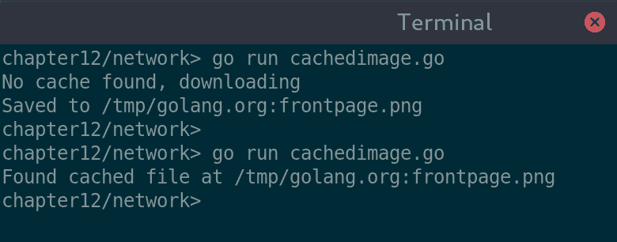

缓存远程图像意味着应用程序具有更好的弹性

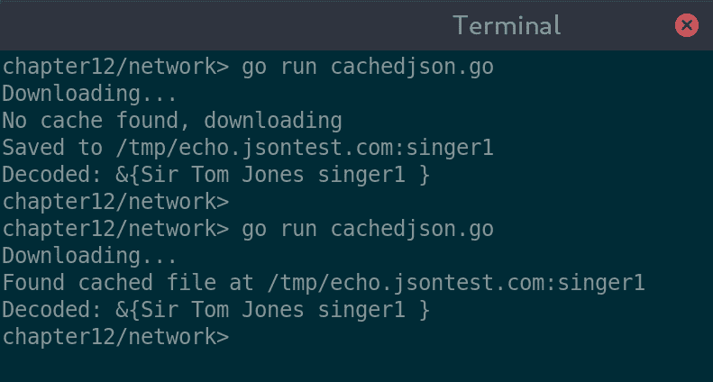

通过缓存 JSON，即使网络失败，我们的应用程序也能正常运行

这些示例应该有助于在您的应用程序中处理远程资源，但它们相对简单。我们如何处理更复杂的云服务？

# 连接到云服务

有许多框架和库旨在帮助您在 Go 中使用云服务。然而，如果您询问 Go 社区哪个最好，他们可能会建议您坚持使用内置包。对于来自 C 或 Java（或许多在互联网连接应用程序变得普遍之前创建的语言）的人来说，这样做可能看起来很奇怪，但 Go 的标准库非常强大。我们将探讨如何使用提供的工具，并在不添加额外依赖项的情况下将基于云服务的功能添加到我们的代码中。

# 编码

要开始查看这个，我们将回到在 `client` 包中定义的 `EmailMessage` 模型，该模型在之前的章节中已导入。[`github.com/PacktPublishing/Hands-On-GUI-Application-Development-in-Go/tree/master/client`](https://github.com/PacktPublishing/Hands-On-GUI-Application-Development-in-Go/tree/master/client)。通过向此对象添加简单的提示，我们可以轻松地在 JSON 和 XML 格式之间进行序列化和反序列化。

# JSON

由于 JSON 中的约定是映射键为小写，我们在结构体中添加了 `json:"subject"` 形式的提示，告诉 `json` 包如何处理结构体内的字段名称。更新后的定义应如下代码所示：

```go
type EmailMessage struct {
   Subject string    `json:"subject"`
   Content string    `json:"content"`
   To      Email     `json:"to"`
   From    Email     `json:"from"`
   Date    time.Time `json:"sent"`
}
```

为了便于测试，我们还在定义中添加了一个 `String()` 函数，以便稍后更容易进行调试：

```go
func (e *EmailMessage) String() string {
   format := "EmailMessage{\n  To:%s\n  From:%s\n  Subject:%s\n  Date:%s\n}"
   return fmt.Sprintf(format, e.To, e.From, e.Subject, e.Date.String())
}
```

一旦设置好，我们就可以添加一些代码来演示其用法。首先，让我们构建一个新的 `EmailMessage` 对象并将其编码为 JSON。编码非常简单，如下所示。我们创建一个新的 `json.Encoder` 实例（它将输出到标准输出），设置缩进值（以提高可读性），并要求它将我们的结构体编码：

```go
fmt.Println("To JSON:")
encoder := json.NewEncoder(os.Stdout)
encoder.SetIndent("", "  ")
encoder.Encode(email)
```

从 JSON 解码结构体也很简单。我们连接到一个 URL，使用本章前面（为了简洁省略了 URL）中的代码打开一个流，并延迟关闭该流。然后，从这个流中创建一个新的 `json.Decoder` 实例，并要求它将数据解码到电子邮件结构体中。然后，我们将数据（使用前面的有用 `String()` 函数）输出以查看结果：

```go
stream := readStream(urlOmitted)
defer stream.Close()

email := &EmailMessage{}
json.NewDecoder(stream).Decode(email)
fmt.Println("Downloaded:", email)
```

运行所有这些将产生一些非常易于阅读的输出，显示我们已经成功创建了、编码了，然后解码了结构体的 JSON 数据：

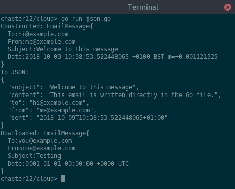

从结构体和 WebService 获取的 JSON 数据

# XML

与 XML 一起工作与 JSON 非常相似。事实上，由于 XML 和 Go 共享将公共变量名首字母大写的语义，所需的映射注解更少，因此结构体只需要一个映射标签：

```go
type EmailMessage struct {
   Subject string
   Content string
   To      Email
   From    Email
   Date    time.Time `xml:"Sent"`
}
```

编码和解码几乎相同；显然，我们需要创建`xml.Encoder`和`xml.Decoder`而不是 JSON 的对应版本。唯一的另一个区别是设置缩进的方法调用（仅用于美化打印）：

```go
fmt.Println("To XML:")
encoder := xml.NewEncoder(os.Stdout)
encoder.Indent("", "  ")
encoder.Encode(email)
```

此外，我们可以使用一个网络服务为我们提供 XML 进行解码（为了简洁，这里省略了 URL，但可以在本书的源代码库中找到）：

```go
stream := readStream(urlOmitted)
defer stream.Close()

email := &EmailMessage{}
xml.NewDecoder(stream).Decode(email)
fmt.Println("Downloaded:", email)
```

执行所有前面的代码将给出与 JSON 示例相似的输出，但在编码时格式不同。注意，变量名以大写字母开头，这在 XML 中很常见：

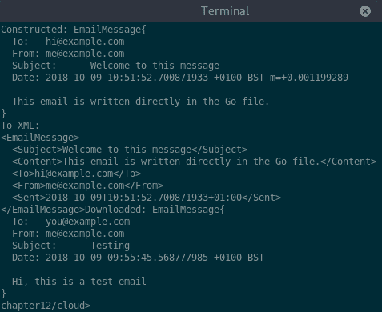

与 Web 服务通信时，同样可以轻松地使用 XML 数据。

# 认证 – OAuth 2.0

认证通常是访问网络服务的必要条件——不一定适用于整个 API，但肯定需要访问受保护的用户数据。目前大多数基于 Web 的认证都使用 OAuth 2.0，这是一个框架，允许应用程序在用户授权后获得对用户数据的部分访问权限。认证需要在第一次访问资源时显示一个网页来解释请求。作为一个基于 GUI 的应用程序，这个工作流程通常通过嵌入的浏览器窗口来展示，以隐藏访问网页进行权限请求的复杂性。不幸的是，这种功能并没有集成在我们所讨论的许多工具包中，所以我们将会简单地打开一个外部 Web 浏览器来展示这个工作流程。这仅适用于首次使用，之后，授权的访问应该可以在应用程序运行之间被记住。

为了演示认证，我们将进一步扩展每个 GoMail 示例中使用的客户端代码。我们将扩展它以从 Gmail API 中读取并下载消息。为此，你需要有一个 Gmail 账户，并在 Google 开发者控制台中创建了一个项目并启用了 API 访问，这将生成`CLIENT_ID`和`CLIENT_SECRET`。首先，我们将创建一个新的函数`authStream()`，它将接受一个`string`类型的 URL 参数，并返回一个类似于之前的`readStream()`和`cacheStream()`函数的`io.ReadCloser`流。

# 第一次请求

为了返回一个经过认证的流，我们需要检查是否需要认证（HTTP 请求上的状态码 401 意味着正是如此）。如果我们已经认证过，那么请求将正常完成，我们只需返回请求体。如果需要认证，那么我们必须通过在正确的 URL 加载一个网络浏览器来启动这个过程，请求用户的权限；这个过程由一个辅助函数`openBrowser()`完成，该函数可以在本书的源代码库中找到。

当浏览器窗口打开时，用户将被告知正在请求的权限，如果他们接受，页面将重定向到回调 URL。我们需要设置一个简单的本地 Web 服务器来处理这个重定向。为此，我们在`/oauth/callback`路径上注册一个处理程序，并等待在端口 19999 上的连接。

服务器启动后，函数将阻塞，直到我们稍后关闭它：

```go
func authStream(url string) io.ReadCloser {
   ret, err := client.Get(url)

   if err == nil && ret.StatusCode != 401 {
      return ret.Body
   }

   fmt.Println("Requesting authorization")
   openbrowser(conf.AuthCodeURL("state", oauth2.AccessTypeOffline))

   http.HandleFunc("/oauth/callback", callbackHandler)
   server = &http.Server{Addr: ":19999", Handler: nil}
   server.ListenAndServe()

   return retReader
}
```

回调处理程序相对简单。它负责从重定向中提取授权码，并使用此代码从发送一次性代码的服务器请求一个可重复使用的令牌（这由`conf.Exchange()`处理）。交换完成后，我们再次尝试连接到最初指定的 URL；如果我们成功，则设置返回流，如果不成功，则失败并返回适当的错误。无论结果如何，我们都会提示用户关闭浏览器窗口（因为网页安全规定这不能自动完成）。在我们将此内容返回给用户后，我们将关闭服务器。这会将控制权交回原始的`authStream()`函数，该函数将返回新认证的请求流：

```go
func callbackHandler(w http.ResponseWriter, r *http.Request) {
   queryParts, _ := url.ParseQuery(r.URL.RawQuery)

   authCode := queryParts["code"][0]
   tok, err := conf.Exchange(ctx, authCode)
   if err != nil {
      log.Fatal(err)
   }
   client = conf.Client(ctx, tok)

   ret, err := client.Get("https://www.googleapis.com/gmail/v1/users/me/messages")
   if err != nil {
      fmt.Fprint(w, "<p><strong>Authentication Failed</strong></p>")
      fmt.Fprintf(w, "<p style=\"color: red\">%s</p>", err.Error())
      fmt.Fprint(w, "<p>Please close this window and try again.</p>")
      log.Fatal(err)
   } else {
      fmt.Fprint(w, "<p><strong>Authentication Completed</strong></p>")
      fmt.Fprint(w, "<p>Please close this window.</p>")

      retReader = ret.Body
   }

   server.Shutdown(context.Background())
}
```

这个谜题的最后一步是设置 OAuth2 配置和上下文。我们将从 Gmail API 请求`只读`认证范围，并指定我们的本地服务器作为回调 URL。为了正确运行，您需要提供`CLIENT_ID`和`CLIENT_SECRET`的值。大部分配置都由`golang.org/x/oauth2/google`包中的`google.Endpoint`定义提供帮助：

```go
func setupOAuth() {
   // Your credentials should be obtained from the Google Developer Console
   // (https://console.developers.google.com).
   conf = &oauth2.Config{
      ClientID:     "CLIENT_ID",
      ClientSecret: "CLIENT_SECRET",
      Scopes:       []string{"https://www.googleapis.com/auth/gmail.readonly"},
      Endpoint:     google.Endpoint,
      RedirectURL:  "http://127.0.0.1:19999/oauth/callback",
   }
   ctx = context.WithValue(context.Background(), oauth2.HTTPClient, client)
}
```

# 存储令牌

对于重复请求，我们可以通过重新使用我们收到的令牌来避免让用户再次经历权限工作流程。`conf.Exchange()`返回的令牌可以持久化并用于后续请求。此令牌包含一个用于刷新令牌的引用，这意味着即使令牌已过期，应用程序也可以自动请求新的令牌。

为了存储和检索令牌，我们将使用已经设置在`oauth2.Token`类型上的 JSON 序列化。当令牌最初颁发时，我们将将其保存到文件中（这可以是数据库或任何其他应用程序可以访问的持久化存储）。因为我们使用的`client`对象是共享的；我们不需要为每个请求重新加载令牌。相反，我们可以在应用程序下次启动时简单地加载它。这意味着，在第二次启动示例时，您将立即看到结果，而无需再次进行权限请求。

因此，我们更新`callbackHandler()`函数以存储令牌，如果它成功返回：

```go
   if err != nil {
      log.Fatal(err)
   }
   saveToken(tok)
   client = conf.Client(ctx, tok)
```

在我们应用程序的`main()`函数中，我们在设置 OAuth 配置后立即添加令牌加载行：

```go
func main() {
   setupOAuth()
   token = loadToken()

...
}
```

这将存储的令牌（如果有的话）加载到全局变量中，以便稍后由 `authStream()` 函数访问，该函数应更新以检查令牌是否已加载：

```go
func authStream(url string) io.ReadCloser {
   if token != nil {
      fmt.Println("Reusing stored token")
      client = conf.Client(ctx, token)
   }
   ret, err := client.Get(url)

...
}
```

在源代码库中有简单的 `saveToken()` 和 `loadToken()` 实现。为了测试目的，将内容打印到系统输出并复制粘贴到 `loadToken()` 函数中，以便在下次运行之前，这已经足够了。有了所有这些，我们可以实现一个简单的请求，该请求将计算用户收件箱中的消息数量。此函数请求需要身份验证的 Gmail API，并计算结果 JSON 消息列表中的项目数量：

```go
func countMessages() {
   in := authStream("https://www.googleapis.com/gmail/v1/users/me/messages")
   defer in.Close()

   var content interface{}
   decoder := json.NewDecoder(in)
   decoder.Decode(&content)

   if body, ok := content.(map[string]interface{}); ok {
      list := body["messages"].([]interface{})
      fmt.Println(len(list), "messages found")
   }
}
```

当我们运行两次时，我们可以看到第一次请求需要浏览器打开并确认授权。在第二次运行中，该令牌被重用，并且返回相同的内容，而不会中断用户：

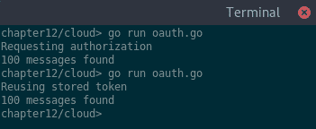

第一次请求 OAuth2 授权时将打开浏览器窗口；重复调用使用我们保存的令牌

# 发布数据

将数据发布到网络服务应该和将 `Get()` 函数调用改为 `Post()` 一样简单，但通常会有一些复杂情况。考虑我们的电子邮件示例和连接到 Gmail 的任务。API 很简单，我们可以轻松地发出请求，但数据必须适当地格式化。当发送到邮件服务器时，电子邮件具有复杂的编码，我们需要实现这一点才能与 API 一起工作。Gmail 服务需要一个 RFC 2822 编码的电子邮件（Go 标准库不提供），然后进行 base64url 编码（标准库可以处理这一点）。在我们能够发布任何电子邮件之前，我们需要向我们的 `EmailMessage` 类型添加一个编码器，如下所示：

```go
func (e *EmailMessage) ToGMailEncoding() string {
   m := mime.NewMultipartMessage("alternative", "")
   m.SetHeader("Subject", mime.EncodeWord(e.Subject))
   m.SetHeader("From", mime.EncodeWord("Demo") + " <" + string(e.From) + ">")
   m.SetHeader("To", mime.EncodeWord("Demo") + " <" + string(e.To) + ">")
   plain := mime.NewTextMessage(qprintable.UnixTextEncoding, bytes.NewBufferString(e.Content))
   plain.SetHeader("Content-Type", "text/plain")
   m.AddPart(plain)

   var buf bytes.Buffer
   io.Copy(&buf, m)
   return base64.URLEncoding.EncodeToString(buf.Bytes())
}
```

此代码使用了外部库 `github.com/sloonz/go-mime-message`，并且为了方便起见，我们使用了 `mime` 名称；在这些示例中我们没有记录人们的名字，如果您愿意，可以省略该部分。为了实现发送电子邮件，我们可以查看 Google 文档 [`developers.google.com/gmail/api/v1/reference/users/messages/send`](https://developers.google.com/gmail/api/v1/reference/users/messages/send)，以了解我们需要传递一个与 `raw` 键关联的编码数据的 JSON 有效负载。一个简单的方法应该能够打包并发送到 API：

```go
func postMessage(msg *EmailMessage) {
   raw := msg.ToGMailEncoding()
   body := fmt.Sprintf("{\"raw\": \"%s\"}", raw)

   ret := authPost("https://www.googleapis.com/gmail/v1/users/me/messages/send",
      "application/json", strings.NewReader(body))
   io.Copy(os.Stdout, ret)
   ret.Close()
}
```

对于这段代码，我们还需要一个额外的函数，`authPost()`。这个函数将对我们的 URL 进行认证发送，将内容类型和请求体作为第二个和第三个参数传递。这种方法可以将 URL、内容类型和有效负载保存下来，以便在需要授权工作流程时重新提交，但通常对于 HTTP POST 请求来说，这既不明智也不可行，所以我们简单地重新使用之前在 `authStream()` 函数中生成的令牌。如果你确实重新使用了这个令牌，那么你需要记得更新代码以请求额外的权限；更新的作用域应如下所示：

```go
   Scopes: []string{"https://www.googleapis.com/auth/gmail.readonly",
      "https://www.googleapis.com/auth/gmail.compose"},
```

通过这个更改，将颁发新的令牌，并且，在放置了前面的代码之后，我们可以执行一个简单的方法，使用之前列出的 `postMessage()` 函数发送电子邮件：

```go
func main() {
   setupOAuth()
   token = loadToken()

   msg := &EmailMessage{
      "GoMail Test Email",
      "This is a test email sent from a Go example",
      "test@example.com",
      "me@example.com",
      time.Now()}
   postMessage(msg)
}
```

之前的 `postMessage()` 函数输出了有用的调试信息，但显然可以将其关闭，并且可以通过更合适的方式处理电子邮件发送失败：

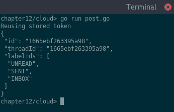

来自我们电子邮件发送示例的调试信息；Gmail 返回消息和线程 ID 以及标签信息

# GUI 集成

在之前的 *并发、线程和 GUI 更新* 部分，我们探讨了线程管理以及如何从后台任务更新用户界面。现在我们正在使用真实的云服务，让我们看看我们可能需要处理的额外复杂性。

# 来信消息

用于模拟连接到电子邮件服务器的客户端 API 包括 `Incoming()` 函数，该函数返回一个 `EmailMessage` 对象的通道。每当有新电子邮件到达时，都会向该通道发送一条新消息，我们也可以使用这个相同的模型来连接真实的电子邮件服务器。电子邮件消息抽象用于传达标准结构，因此新的电子邮件连接（如前面的 Gmail 示例）需要做的只是将传入的数据打包到 `EmailMessage` 结构体中，并将其添加到通道中。

这意味着我们唯一需要做的额外工作就是更新服务器连接包中的代码，以监视新消息，并在检测到新消息时添加一些 JSON 解码。所有这些都可以在不更改我们 GoMail 示例应用程序 GUI 的任何一行代码的情况下完成。实际上，为了激活真实的 Gmail 账户而不是我们的测试服务器 "我们需要将 `client.NewTestServer()` 函数调用更改为 `client.NewGmailServer()`（有关此 Gmail 提供者的完整描述可在最后的 附录，*将 GoMail 连接到真实电子邮件服务器*)。

# 活动通知

对于用户来说，知道应用程序何时在后台执行代码可能很有帮助。例如，如果你想在应用程序中包含一个检查电子邮件的按钮，那么指示电子邮件正在被检查可能有助于用户知道按下按钮不会做任何事情。作为开发者，这种情况最常见于 IDE 状态栏，指示构建正在进行或打包任务正在运行。如果在笔记本电脑上工作，风扇开始旋转，了解后台正在执行什么操作是有用的，这样任何潜在的问题都可以暂时搁置。

为了支持这种界面更新，我们需要追踪任务何时开始和结束。根据视觉设计的类型，我们可以使用两种策略：后台任务的简单计数器或正在运行的任务列表。前者更容易实现，但后者能够向应用程序用户报告更多信息。如果你只是使用旋转器或无限进度条，那么第一种策略将很好地工作。然而，如果你想要添加一个显示当前运行任务的进度条，那么你需要选择第二种策略。

# 旋转器

一个旋转器（或其他简单的活动指示器）可以是有助于可视化是否有后台活动。如果后台任务的数量非零，它将是可见的。为了追踪这一点，我们可以在应用程序中实现一个简单的计数器，并使用`StartTask()`和`StopTask()`函数更新它。然后，一个监听器或通道会通知用户界面元素正在运行的任务数量已更改，以便它可以通过显示或隐藏可视化元素来更新 GUI。

在一个基于云的应用程序中，如果后台任务正在使用网络连接，这将带来额外的优势：我们可以将这些任务追踪功能调用插入到网络请求代码中。例如，我们可以更新`readStream()`以调用`StartTask()`，这样所有的后台任务都会增加计数器。为了表示任务已结束，我们将返回一个包装器到流中，这样当调用`Close()`时，它就可以正确地调用`StopTask()`。

# 状态面板

一个状态面板，用于显示当前（或最近的）任务，将需要我们在任务开始时追踪任务名称。为了准确显示哪些任务仍在运行，我们还需要追踪哪些任务结束（否则，一个在长时间运行的任务之后开始并停止的快速任务将无法正确更新状态显示）。

一个示例实现是，适当的开始函数返回一个任务引用，然后直接停止，例如，`task := StartTask("我的任务名称")`，稍后使用`task.Stop()`停止。还需要一个类似的监听器或通道，但这次数据是任务引用而不是后台任务的数量。

# 离线时保持一致的用户体验

在现代图形应用程序中，良好的用户体验显然取决于优秀的设计和高质量，但处理网络和服务故障也同样重要。在本章的*网络资源和缓存*部分，我们介绍了缓存服务器响应以提高容错性和加快应用程序加载速度，但这只是为出色的离线支持制定更大策略的一小部分。

# 缓存响应

本章前面引入的响应缓存代码可以应用于几乎所有的 HTTP 请求，但我们只使用了它来处理 HTTP GET。在许多不同的 HTTP 请求类型中，只有三种被认为是可缓存的（GET、HEAD 和 POST），而 HEAD 请求不返回主体，因此在我们的应用程序中并不有用。POST 方法表示正在执行的操作，所以在我们这个上下文（以及大多数其他上下文）中，知道它是否完成比保存它引起的响应更重要（请参阅下一节的*排队操作*）。要了解更多关于 HTTP 请求类型的信息，请参阅[`en.wikipedia.org/wiki/Hypertext_Transfer_Protocol`](https://en.wikipedia.org/wiki/Hypertext_Transfer_Protocol)。

此外，可能不适合缓存每个 GET 请求的响应。虽然 HTTP 是无状态协议，但你正在与之通信的服务器可能正在跟踪可能影响你请求响应的状态。如果你的应用程序知道请求的响应将是时间敏感的，你可以确保它跳过缓存或在该缓存条目上设置超时。不幸的是，可能并不总是能够提前知道这一点；这就是 HTTP 头部（以及 HEAD 方法）可以发挥作用的地方。通过检查响应的头部，你可能看到 Last-Modified 或 ETag 元数据（通过发出 HEAD 请求，你可以访问这些信息而不需要发送完整的响应数据）。如果 Last-Modified 头部包含一个早于你的缓存条目创建时间的日期，那么你的缓存仍然可以使用，否则你应该删除缓存的项并用新的请求替换它。使用 ETag 通常更高效，因为它不需要任何日期解析，但你需要为每个缓存的响应存储适当的标签。这些元数据用作响应内容的唯一标识符，如果数据以任何方式更改，ETag 也会更改（此时你应该像之前提到的那样重置缓存）。

如果实现完整的 HTTP 缓存，还有其他一些头部信息需要注意，最值得注意的是`Cache-Control`。如果这个值设置为`no-cache`或`no-store`（或包括这些值的组合），服务器表明响应不得被缓存。这可能是内容针对特定请求和时间的一个指示，或者有其他原因导致再次发出相同的请求会返回不同的响应体。

在妥善处理所有这些考虑因素之后，管理响应缓存的代码比本章前面所展示的要复杂得多，这也是为什么存在各种 Go 包来管理细节。在您最喜欢的搜索引擎中搜索“golang http cache”可能会返回最相关的结果。

# 队列操作

其他 HTTP 方法，如 POST、PUT 或 DELETE，通常表示用户操作，确认其已被传达是主要要求。在这些情况下，缓存没有帮助；如果再次请求，缓存可能会阻止我们的操作到达服务器。因此，通常不会缓存这些请求。此外，如果我们打算构建一个健壮的应用程序，我们需要为失败的请求做出计划。在这些情况下，服务器可能已经或未收到我们的请求，操作可能已经或未处理。

应对这一挑战的通常方法是为出站响应构建一个队列。将请求添加到此类队列可以是“发射并忘记”，用户不关心请求何时完成，或者添加一个回调，以便在完成时传达适当的通知（例如，“邮件已发送”）。使用 Go 构建此类队列有很好的文档支持；对多线程、通道和等待组的支持使其相对简单，所以我们不会深入探讨如何执行。然而，重要的是确定请求是成功还是失败。

如果一个 HTTP POST 请求（例如）超时或返回 500（或更高）的错误，我们必须假设它失败了。重新发出相同的请求是安全的，因为如果它第一次成功完成，重新发出一个相同的 POST 请求不应该引起任何额外的状态变化。从 400 到 499 的响应代码意味着请求有误，重试不会解决问题。在这些情况下，可能需要通知用户失败（并且代码应该以某种方式记录错误到你的团队）。

注意不要盲目地将状态码 200（OK）视为成功；许多协议在成功的 HTTP 响应体中传达某些失败条件。请确保阅读您所使用的 API 文档，了解如何检查额外的错误。例如，一个典型的`graphql`响应可能会返回 HTTP 状态码 200，但内部可能已经失败；是否在后台重试或向应用程序用户传达错误将取决于服务和遇到的错误。在以下示例中，服务器响应有用地指出重试可能有助于解决问题：

```go
{
  "errors" => [
    {
      "message" => "Temporary storage failure",
      "retry" => true,
      "path" => ["user", "add"],
    }
  ]
}
```

# 离线启动

上述策略有助于处理间歇性互联网连接，或者在线一段时间后继续以离线模式使用应用程序。但如果您的应用程序从一开始就被设计为离线工作呢？如果不需要立即登录，那么您可能能够支持初始离线状态；这可能不是电子邮件客户端的理想选择，但对于协作文档平台或娱乐系统来说可能是有预期的。如果没有网络可用，我们如何利用我们已经探索过的技术来提供出色的首次使用体验呢？

解决这个问题的最简单方法可能是将数据与应用程序捆绑在一起，以便在没有最近缓存的可用数据时用作缓存。以这种方式，应用程序可以尝试使用本地缓存（如果存在），否则回退到应用程序数据，如果两者都不可用，则尝试建立远程连接，如下面的典型函数所示：

```go
func cacheFallbackStream(url string) io.ReadCloser {
   stream := cacheStream(url)
   if stream != nil {
      return stream
   }

   stream = resourceStream(url)
   if stream != nil {
      return stream
   }

   return readStream(url)
}
```

在这个例子中，我们在之前重新使用了`cacheStream()`和`readStream()`函数，并使用了一个名为`resourceStream()`的新（假设的）函数，该函数将编码 URL，在应用程序中查找一些捆绑的资源，并在找到时返回一个流。另一种方法是，在应用程序首次运行时提取所有已打包的缓存资源并设置本地缓存，然后后续代码可以像之前一样简单地使用`cacheStream()`。有关捆绑资源以进行分发的更多信息，请参阅第十四章，*分发您的应用程序*。

当然，无论您使用哪种策略，都务必考虑数据保持最新程度的重要性；将旧缓存捆绑到应用程序中是否是您数据的良好策略？您是否希望定期更新此信息的地方副本？如果数据必须尽可能新鲜，那么前面的函数可能需要更改，以便在可能的情况下尝试`resourceStream()`或`cacheStream()`之前尝试`readStream()`，并尝试进行实时请求。如果您采取这种方法，请务必考虑超时和其他失败条件，并适当地处理用户期望。

# 摘要

在本章中，我们探讨了开发具有长时间运行的后台线程和依赖远程资源或网络服务的丰富应用程序的一些更复杂方面。我们首先回顾了 goroutines 和线程处理的基础知识，然后研究了如何设计后台进程以最小化某些图形工具包所需的代码开销。

本章讨论的大部分复杂性涉及与远程资源和网络服务的工作。我们看到了如何实现缓存策略以及它们如何在网络条件不佳时帮助创建一个更具弹性的应用程序。我们还探讨了请求的认证（使用常见的 OAuth2 工作流程），并将 GoMail 示例连接到一个真实的 Gmail 账户以读取和发送电子邮件。

所有这些主题都有助于将健壮性构建到应用程序中，并在所需资源不可用的情况下保持高质量的用户体验。在下一章，第十三章，*Go GUI 开发的最佳实践*中，我们将关注点从用户体验转移到优秀的源代码，并探讨使用 Go 进行 GUI 开发的最佳实践。我们还将介绍如何设置代码以方便开发和协作，以及沿途将帮助的工具和流程。
