# 第十四章：分发您的应用程序

到现在为止，您应该已经熟悉了如何使用 Go 语言构建应用程序的图形用户界面。构建图形应用程序的任何旅程的最后一步是分发。打包和发布您完成的产品可能具有挑战性，尤其是如果您正在向多个平台发布，我们将在本章中探讨这些细节。

尽管 Go 语言以及我们在本书中迄今为止使用的库使得为多个平台编写软件变得容易，但不同操作系统要求原生图形应用程序以不同格式存在的事实是无法回避的。对于开发者来说，往往很容易忘记这一点，因为 Go 工具以在不同系统上一致的方式从源代码构建。为了准备应用程序发布，我们将探讨以下主题：

+   为我们的应用程序准备元数据和图标

+   将资源捆绑以适应 Go 的*单个二进制*分发

+   为不同的操作系统打包完成的应用程序

+   上传到平台市场和应用商店

到本章结束时，您应该能够打包和分发准备与目标受众分享的图形应用程序。您将完成创建应用程序包的步骤，这些包可以像您每个分发平台上的用户期望的那样下载或安装。我们首先收集您完成任何系统市场分发的所有必要信息。

# 元数据和图标

在我们开始创建应用程序发布的技术细节之前，有一些先决条件需要考虑。应用程序的名称可能已经确定，但您是否有一个出色的描述？您知道如何以吸引潜在用户注意的方式阐述您软件的关键特性吗？您（或您的设计团队）是否创建了一个令人难忘且能体现其功能的优秀应用程序图标？

如果您不会通过如应用商店这样的管理渠道进行分发，您应该考虑您的应用程序如何被目标受众发现。关于**搜索引擎优化**（**SEO**）和越来越多的关于**应用商店优化**（**ASO**）的讨论和信息在网上有很多，所以我们不会在这里详细介绍。在当前的软件环境中，显而易见的是，易于发现和记忆现在比以往任何时候都更加重要。

# 应用程序图标

选择您的图标可能是准备发布应用程序最重要的单个部分。它需要令人难忘，并激发一些关于软件用途的想法。一个优秀的图标在显示大或小尺寸时都应该看起来很好，并且通常应避免或仅用于设计的不重要方面。确保您的图标以高分辨率创建；1024 x 1024 像素是图标在各种设备上看起来出色的最低要求。同时，考虑透明度的使用也很重要——根据您希望分发的平台，这可能或可能不被推荐。大多数桌面系统允许使用形状图标，但并非所有都允许*半透明*区域。

花些时间查看您预期应用程序将在其中使用的每个操作系统或桌面环境中的流行或常见图标。您能否成功地将您的图标风格与它们匹配？这些系统的用户是否期望特定的形状或风格？可能最好，或者必要的是，为不同的平台创建不同的图形版本。这样做没有问题，并且可以通过传递不同的图标给我们在稍后工作的构建工具来适应。

# 描述您的应用程序

在这个开发阶段，为所创建的软件准备一些营销材料并不罕见。这是考虑如何最好地吸引新用户描述的时候。无论是通过网络搜索引擎还是应用程序市场，您使用的文本对于说服任何人安装您的应用程序至关重要。除了应用程序的名称和其主要功能外，请确保您考虑它如何为您的用户带来好处。您预计他们在搜索您构建的解决方案时将尝试完成哪些任务？不用担心使这段文字很长，但请尽量包括这些重要观点。

无论您打算通过在线商店还是简单的网站发布您的应用程序，在继续到发布流程之前，确保您已经完成了元数据是明智的。

# 打包资源

Go 应用程序被设计为从单个二进制文件运行。这意味着它们可以轻松分发，并且不依赖于安装脚本。不幸的是，这种好处给开发者带来了成本——我们不能像网络或移动应用开发者那样（在我们开发过程中所做的那样）依赖资源紧邻我们的应用程序。为了确保我们的应用程序符合这种设计，我们必须将任何所需的资产嵌入到应用程序的二进制文件中。这包括字体、图像以及任何其他应用程序正确运行所需的静态内容。

# go-bindata

基于 GUI 的应用程序并非唯一需要解决这个挑战的，因此已经有许多解决方案可用。最常用的工具被称为 `go-bindata`，可在 [github.com/jteeuwen/go-bindata](https://github.com/jteeuwen/go-bindata) 获取。这是一个简单的实用工具，可以将静态文件转换为 Go 源代码，以便它们可以被编译到应用程序中。这种方法是最容易工作的，因为嵌入的资源成为源代码的一部分，因此将与项目中的其余部分一起检出和构建。不幸的是，该包已不再维护，尽管它在社区中仍然被广泛使用。虽然存在新的、积极维护的版本，但在此时的受欢迎程度较低。

要使用这个资源打包器，我们使用 `go get -u github.com/jteeuwen/go-bindata/...` 从 GitHub 安装它，然后运行 `go-bindata` 命令，传入 `asset` 目录的名称：

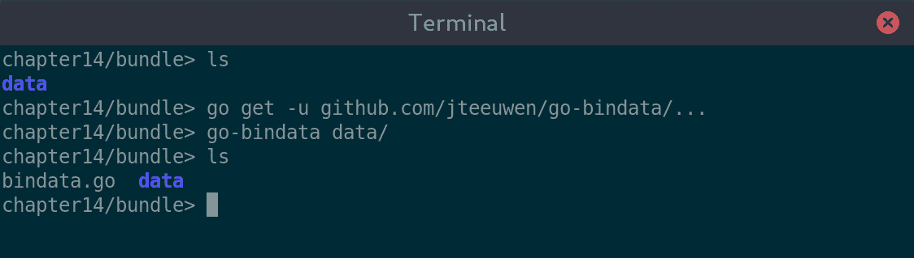

运行 go-bindata 会创建一个名为 bindata.go 的新文件

通过包含生成的 Go 文件，我们可以访问到许多新导出的方法。其中最重要的方法是 `Asset()` 和 `MustAsset()`，它们各自接受从捆绑目录中 `asset` 文件的名称。第一个方法查找资源，如果找到则返回数据，否则返回错误。后者返回数据，但如果找不到指定的资源则会引发恐慌。有了这个新功能，我们可以从代码中加载所需的资源，如下所示：

`data, err := Asset("shiny-hall.jpg")`

您还可以使用 `AssetNames()` 命令获取可用资源的列表，或使用 `AssetInfo()` 命令获取有关资源的更多信息。

# packr

由托管在 [github.com/gobuffalo/packr](https://github.com/gobuffalo/packr) 的 packr 项目提供了一种替代方法。这个实用工具在 `go-bindata` 和其他类似工具的基础上提供了额外的功能——在开发过程中能够直接从文件系统中加载资源。这种灵活性可以加快处理多个资源的工作，因为您不再需要在每次更改后重新生成打包的源代码。然而，这种灵活性需要稍微改变工作流程，并且在构建用于安装或发布的应用程序时，必须使用 `packr` 命令代替 `go` 命令。

要使用这种捆绑技术，我们需要安装 `packr` 工具（使用 `go get -u github.com/gobuffalo/packr/packr`），这将确保库也被安装。在我们可以运行构建之前，我们需要编写查找我们资源的代码，如下所示：

```go
package main

import "log"
import "github.com/gobuffalo/packr"

func main() {
   box := packr.NewBox("./data")
   data, err := box.Find("shiny-hall.jpg")

   log.Println("datLen", len(data), "err", err)
}
```

保存此代码后，我们可以像平常一样运行，例如，`go run main.go`，它将从文件系统加载资源。当我们想要安装应用程序或构建用于发布时，我们必须使用 `packr` 命令，例如 `packr install`。此命令将找到我们引用的所有资源目录，将它们捆绑到 Go 代码中，然后构建包括附加代码的应用程序：

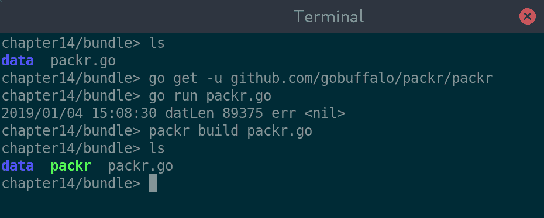

我们可以像平常一样运行代码，但在构建时必须使用 packr。

如前述截图所示，在开发过程中没有额外的步骤，它的工作方式与任何其他 Go 代码一样。当构建用于发布的应用程序时，我们使用 `packr` 命令在构建过程中将 `assets` 捆绑到可执行文件中。

# rsrc

如果你的应用程序是使用 Walk 或其他特定于 Windows 的工具包构建的，你可能需要考虑 `rsrc` 工具。`rsrc` 用于将清单文件和图标文件捆绑到可执行文件中。这个过程涉及运行工具以生成一个 `.syso` 文件，然后在运行 `go build` 时将其编译到最终的二进制输出中。这是在 第四章 中描述的相同过程，*Walk – 构建图形 Windows 应用程序*，用于嵌入应用程序的清单文件。我们还在本章的后面使用此工具嵌入应用程序图标以供 Windows 分发。

要将图标打包到应用程序中，你可以运行 `rsrc -ico myicon.ico,anothericon.ico`，然后重新构建你的应用程序。以这种方式嵌入的资源可以使用 `walk.NewIconFromResource("myicon.ico")` 访问。如果你专门为 Windows 编写应用程序，这是一种嵌入图标资源的有用方法。如果你打算与多个目标平台一起工作，它可能不太有用，因为你的 macOS 或 Linux 可执行文件将无法访问这些图标。

# fyne bundle

之前提到的工具可以与任何 Go GUI 框架一起使用，但如果你正在使用 Fyne 工具包，你可以利用它自己的捆绑工具（在 Fyne 项目的一部分 `fyne` 命令中）。在使用基于 Fyne 的应用程序时使用此特定工具的好处是它会为每个嵌入的资源生成 `fyne.Resource` 定义。这使得将资产传递到各种 Fyne API 上变得更加容易。`fyne bundle` 的过程与 `go-bindata` 类似——运行此实用程序将资产从文件系统转换为 Go 源代码，然后可以在构建过程中将其编译到应用程序中。最大的区别是我们如何引用这些资产，即通过声明的变量而不是查找系统。

`bundle` 命令是 `fyne` 可执行文件的一部分，它将嵌入的文件作为其主要参数。它将结果打印到系统输出，因此我们使用控制台重定向（`>`）将生成的 Go 源代码发送到合适的文件：

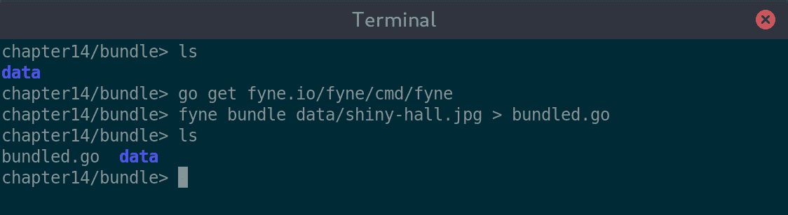

Fyne 打包命令输出到 stdout，因此我们将输出重定向到 Go 文件

一旦文件生成（或附加到现有文件中），我们可以使用创建的符号（`*fyne.StaticResource` 类型，实现了 `fyne.Resource` 接口）来引用它。这可以像使用任何其他资源一样使用，因此我们可以以下这种方式将其加载为图像：

`image := canvas.NewImageFromResource(resourceShinyHallJpg)`

生成的变量名可能不适合您的使用，但可以使用额外的命令参数进行更改。例如，如果您想导出这个新符号，可以使用 `-name ShinyHall` 将名称大写。要打包目录，您可以选择传递目录名而不是文件名，或者使用额外的 `-append` 参数重复运行命令。

# 构建发布版本

现在您的代码已经完成，您已经准备好了所有元数据，并且已经嵌入资产文件，现在是时候实际构建发布版本了。我们将按以下三个阶段来查看这个过程：

1.  决定要发布哪些平台并设置工具

1.  构建发布版本的二进制文件

1.  准备您将要分发的实际软件包

假设您将分发到多个操作系统，在您能够构建所有发布版本的二进制文件之前，可能需要经过一些准备阶段。

# 准备工作

如果您是为了使用 Walk 框架并因此仅针对 Windows 操作系统进行分发而进入这一章节，您可以跳过这个准备步骤，因为您不需要任何额外的编译工具。本书中我们探索的所有其他工具包都需要 CGo 来实现某些功能。启用 CGo 的 C 编译器应该已经为您的开发平台设置好了，但还需要进行额外的工作以启用对其他平台的交叉编译。如果您为每个目标平台都有一个单独的操作系统安装，则可以跳过此步骤。

对于本节，我们假设在首选操作系统上进行开发，因此需要为额外的目标平台进行交叉编译。这样做将需要为每个目标平台安装一个 GCC 兼容的编译器（例如，基于 Linux 的开发者可能需要安装 Windows 和 macOS 的编译器）。

# 编译器安装

每个额外的平台（与当前操作系统不同）都需要安装一个 C 编译器。本书中推荐的使用如下（以及与 CGo 一起使用的 CC 环境变量）：

| **目标平台** | **CC=** | **下载** | **备注** |
| --- | --- | --- | --- |
| macOS (darwin) | o32-clang | [github.com/tpoechtrager/osxcross/](https://github.com/tpoechtrager/osxcross/) | 您还需要 macOS SDK（参见 osxcross 文档） |
| Windows | x86_64-w64-mingw32-gcc | 在 macOS 上: [brew.sh/](https://brew.sh/) 在 Linux 上: 使用您的包管理器 | macOS: 安装 `mingw-w64` 软件包 Linux: 包名可能不同 |
| Linux/BSD | gcc-linux | 在 macOS 上: [brew.sh/](https://brew.sh/) 在 Windows 上: [cygwin.com/install.html](https://cygwin.com/install.html) | macOS: 安装 `FiloSottile/musl-cross/musl-cross` Windows: 安装 `gcc-linux` 软件包 |

安装交叉编译工具可能很复杂——请务必阅读每个下载页面的文档，并在安装后检查您的环境配置。

如何安装和设置这些编译器的详细信息可以在 附录 2，*交叉编译器设置* 中找到。

# 构建

在安装了所有适当的编译器和库之后，我们可以继续到构建阶段。对于每个目标操作系统，您需要设置正确的环境变量并执行这些步骤。建议先为某个平台构建，然后完成下表中列出的包装步骤，再切换到下一个配置。这是因为一个平台的发布二进制文件可能会覆盖另一个（例如，当编译时，macOS 和 Linux 的二进制文件具有相同的名称）。请注意，当为当前平台构建发布版本时，可以省略 `CGO_ENABLED` 和 `CC` 环境变量：

| **目标平台** | **GOOS=** | **CGO_ENABLED=** | **CC=** | **备注** |
| --- | --- | --- | --- | --- |
| macOS | darwin | 1 | o32-clang | 确保您已准备好 SDK 并将其复制到 osxcross 的 `tarballs/` 目录。 |
| Windows | windows | 1 | x86_64-w64-mingw32-gcc | 如果您更改 `GOARCH`，可能需要不同的 CC 或编译器。 |
| Linux | linux | 1 | gcc-linux | 在 macOS 上，您可能需要使用 x86_64-linux-musl-gcc 作为 CC。 |

在设置适当的这些环境变量后，我们可以执行构建命令。您可能还想设置 `GOARCH` 以指定不同的 CPU 架构，但这超出了本章的范围。如果您使用 Packr 资产打包器，则需要使用 `packr build` 命令，否则可以执行 `go build` 命令。这通常会比正常运行或构建花费更长的时间，因为可能需要在编译您的应用程序之前为新的目标平台构建所有应用程序依赖项。

要查看实际操作，我们可以打开 Linux 终端并为每个构建设置环境。当为当前平台编译时，我们不需要指定 `CGO_ENABLED` 或 `CC` 变量，因为这些变量有正确的默认值。每次构建后，我们都有一个为所需平台生成的单个应用程序二进制文件，我们将将其放在一边并在下一步中使用（例如，包装）：

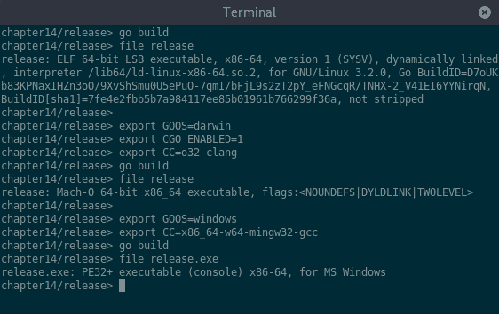

为 Linux、macOS 和 Windows 编译带有 CGo

一旦编译了二进制文件，我们就可以分发应用程序——这将是命令行工具或网络应用程序的正常流程。然而，对于基于 GUI 的应用程序，用户将期望有视觉元素，例如图标，以及与平台应用程序启动器的集成。这些信息在打包阶段添加，并且因平台和工具包而异。

# 打包

要完成创建图形应用程序的发布文件，我们必须在刚刚编译的二进制文件旁边添加额外的图像和元数据。这些需要以特定格式存在，每种操作系统的格式都不同。

# Linux

Linux 上应用程序包的格式因发行版而异（`.rpm`、`.deb`和`.tar.gz`是常见的格式），但它们都需要相同的资产，我们现在将构建这些资产。除了编译的应用程序外，我们还需要一个`icon`文件和一个`desktop entry`文件（由 FreeDesktop.org 定义的标准：[standards.freedesktop.org/desktop-entry-spec/desktop-entry-spec-latest.html](https://standards.freedesktop.org/desktop-entry-spec/desktop-entry-spec-latest.html)）。`icon`文件是支持格式之一（PNG、XPM 和 SVG）的简单图像文件。对于位图图标，建议使用 PNG，如果您的图标是矢量图，则应使用 SVG 格式。

# 创建元数据文件

`.desktop`文件是一个具有分组的标准键值格式简单文本文件。有一些键是必需的，还有很多可选的（我们在这里不会介绍）。一个基本的桌面条目文件可能看起来像这样：

```go
[Desktop Entry]
Type=Application
Name=My Application
Exec=myapp %f
Icon=myapp.png
Categories=Utility
```

将内容保存到合适命名的文件中，例如与编译的二进制文件相邻的`myapp.desktop`。此文件概述了基本的应用程序信息——它描述的可执行文件类型（`应用程序`）以及用于显示的名称（如果需要，您可以使用`Comment`添加附加信息）。名称可以进行本地化（以不同语言显示）——为此，请使用`Name[fr]=French Name`格式。然后我们指定可执行文件（这可以是文件名，在这种情况下，将查找位置，或者指向已安装二进制文件的绝对路径）。`%f`参数表示可执行文件可以接受单个文件参数，这对于诸如将文件拖放到应用程序图标上之类的操作很有用（如果不支持命令参数，则省略此参数）。我们需要指定`icon`参数以告诉系统如何找到此应用程序的图标（在这种情况下，它将在主题图标路径中查找`myapp.png`）。可选地，我们可以指定此应用程序应出现在其中的类别——省略此元素可能意味着图标不会出现在系统菜单中。支持的所有类别完整列表可在网上找到，地址为[specifications.freedesktop.org/menu-spec/latest/apa.html#main-category-registry](https://specifications.freedesktop.org/menu-spec/latest/apa.html#main-category-registry)。

为了使用户在安装软件后更容易找到它，请确保选择一个清晰的名字并为您的应用程序设置正确的类别。您可以使用 `Comment` 属性提供更多信息，但这可能并不总是显示。

在某些系统中，类别不仅仅是菜单分组。例如，*设置* 类别中的项目可能被放置在控制面板而不是主应用程序列表中。

# 软件包发布

Linux 软件包以两种方式之一分发：作为源代码或作为二进制（编译）软件包。当以源代码形式提供时，会包含一个 makefile 或类似的文件，以指导编译器如何创建可执行文件。由于 Go 的标准结构和构建工具，所以在这种情况下我们不需要包含 makefile。作为开发者，我们只需为当前项目调用 `go install` 或为尚未下载的项目调用 `go get`。任何熟悉 Go 的人都会知道这个过程，所以在这种情况下不需要构建信息。

然而，我们是为普通用户分发软件包，而不是为开发者。为了使其工作，我们可以使用特定于发行版的软件包打包（我们将在本章后面讨论）或构建一个适用于任何 Linux 系统的软件包。为了做到后者，我们可以准备一个结构化的软件包，可以简单地展开到用户的系统中。非系统软件包的标准安装位置是 `/usr/local`，因此我们从该位置开始放置我们的文件（我们在当前目录中镜像这个结构）。预期的文件树应如下所示（*hicolor* 是查找图标的备用主题名称）：

| **文件路径** | **描述** |
| --- | --- |
| `usr/local/share/applications/myapp.desktop` | `Desktop Entry` 元数据 |
| `usr/local/share/icons/hicolor/512x512/apps/myapp.png` | 应用程序图标（512 x 512 像素的位图图像） |
| `usr/local/share/icons/hicolor/scalable/apps/myapp.svg` | 应用程序图标（矢量图像） |
| `usr/local/bin/myapp` | 可执行文件（来自 go build） |

在所有这些文件都放在正确的文件夹中后，我们可以使用 `tar` 工具构建一个应用程序包。创建包含此内容的新文件的完整命令是 `tar -cf myapp.tar.gz usr`，如下面的截图所示：

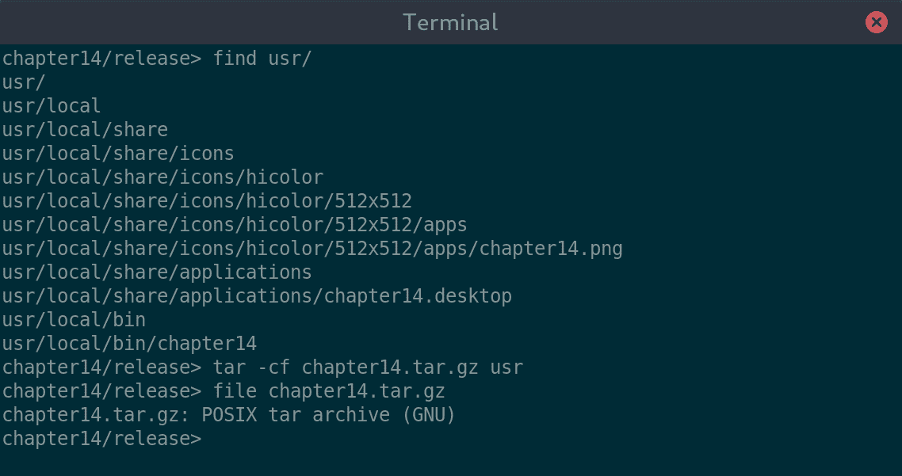

打包我们的 usr/local 目录结构的内容

生成的软件包可以共享用于安装，接收者应从文件系统的根目录使用 `sudo tar -xf myapp.tar.gz` 进行解压。在这个例子中，我们传递了额外的 `-C /` 参数以避免需要更改目录，如下面的截图所示：

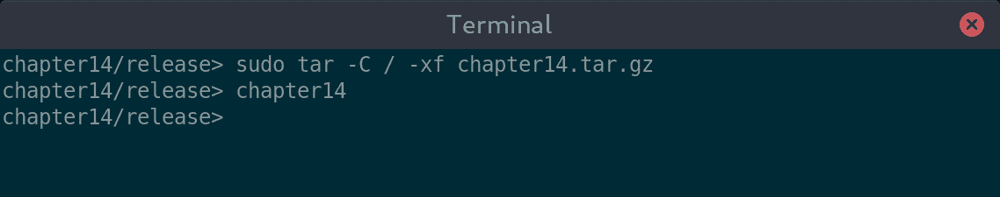

安装软件包后，我们可以从 $PATH 中运行它

这种软件包格式适用于所有 Linux 发行版，但为软件包管理器打包是额外的工作。我们将在本章后面讨论发行版工具。

# macOS

要在 macOS 上分发的应用程序还需要特定的目录结构和相关的元数据。这些文件不会像前面展示的 Linux 示例那样安装，而是从我们创建的目录中运行。这种格式称为 **应用程序包**，需要我们创建一些元数据文件来描述应用程序。

# 创建元数据文件

macOS 应用程序的主要元数据文件称为 `Info.plist`，就像 Linux 的桌面条目一样，它是一个结构化文本文件。对于 Go 项目，最好直接编辑文本，而不是使用已安装的 Xcode 工具。此文件包含一个键值对列表，描述了我们构建的应用程序。重要的是不要更改 `CFBundlePackageType` 或 `CFBundleInfoDictionaryVersion` 的值，因为这些值将文件标识为 macOS 的应用程序。

定制的主要键是 `CFBundleExecutable`，它设置可执行文件名；`CFBundleName`，用于应用程序的人类可见名称；以及 `CFBundleIconFile`，用于指定图标文件名。设置 `CFBundleIdentifier` 的合理值很重要，因为这唯一地标识了此应用程序，以及 `CFBundleShortVersionString`，它指定了包含的应用程序版本。将这些值全部放入 `plist` 格式，你应该有一个类似以下文件：

```go
<!DOCTYPE plist PUBLIC \"-//Apple Computer//DTD PLIST 1.0//EN\" 
      \"http://www.apple.com/DTDs/PropertyList-1.0.dtd\">
<plist version=\"1.0\">
   <dict>
      <key>CFBundleExecutable</key>
      <string>myapp</string>
      <key>CFBundleIdentifier</key>
      <string>com.example.myapp</string>
      <key>CFBundleName</key>
      <string>MyApp</string>
      <key>CFBundleIconFile</key>
      <string>myapp.icns</string>
      <key>CFBundleShortVersionString</key>
      <string>1.0</string>
      <key>CFBundleInfoDictionaryVersion</key>
      <string>6.0</string>
      <key>CFBundlePackageType</key>
      <string>APPL</string>
   </dict>
</plist>
```

一定要设置一个全局唯一的 `CFBundleIdentifier` 值——通常通过使用前面展示的逆向域名格式来实现。此配置用于将文件类型与您的应用程序关联起来，并且 App Store 不会接受未正确设置此值的应用程序。

在创建 macOS 软件包时，还需要额外的一步，即图标必须是 `ICNS` 格式。`ICNS` 文件包含许多不同尺寸的图标，这样 macOS 就可以在各种分辨率下显示清晰的图形。有许多图形工具可以操作这些文件（网上搜索 `create icns file`），但 XCode 命令行工具包括 `iconutil`，这是一个简单的实用程序，可以从一组图标创建这些文件。

当调用 `iconutil` 时，我们使用 `-c icns` 参数指定它应该转换为 `icns` 格式，并使用 `-o <filename>` 提供输出文件名。最后一个参数是 `iconset` 输入——一个包含适当命名文件的目录，这些文件将被包含在内。对于我们的 1024 x 1024 像素的图标，我们称之为 `icon_512x512@2x.png`，但建议提供多个不同分辨率的版本。运行该命令将创建我们应用程序图标所需的 `.icns` 文件，如下所示：

```go
iconutil -c icns -o Chapter14.app/Contents/Resources/chapter14.icns chapter14.iconset/
```

# 打包发布

现在元数据已经创建，我们可以创建 macOS 应用程序包所需的目录结构。文件的位置很重要，如下所示：

文件 `pathDescription`

| `myapp.app/Contents/Info.plist` | 前面概述的应用程序元数据 |
| --- | --- |
| `myapp.app/Contents/Resources/myapp.icns` | ICNS 格式的应用程序图标 |
| `myapp.app/Contents/MacOS/myapp` | 应用程序的可执行文件 |

在创建这些目录并将文件移动到正确的位置后，你就拥有了一个完整的应用程序包。可以通过双击图标来执行它，并且可以以这种状态进行分发。安装过程是将此图标拖动到计算机的 `Applications` 文件夹中，如下所示：

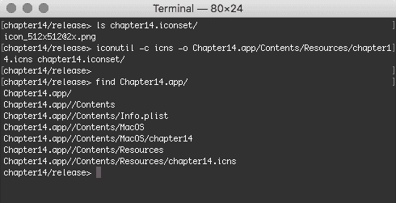

创建 `.app` 目录结构和添加元数据可以创建一个 macOS 应用程序

在 Finder 中查看结果，我们看到新目录被识别为应用程序，其 `.app` 扩展名被隐藏，图标与我们之前设置的一样。你可以像其他任何应用程序一样启动、安装或删除此应用程序：

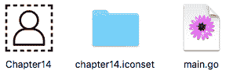

我们的 `.app` 目录显示为它所描述的应用程序

# Windows

Windows 中的应用程序元数据嵌入到可执行文件中，而不是在附加文件中。为此，我们创建元数据文件，然后使用资源工具将它们包含在最终的执行文件中。

# 创建元数据文件

要包含应用程序元数据，我们创建一个类似于 第三章，“Go to the Rescue!” 和 第四章，“Walk – Building Graphical Windows Applications” 中使用的应用程序清单文件，当时我们使用 Common Controls 小部件集（通过 Walk 和 andlabs UI）构建应用程序。`assemblyIdentity` 实例的内容用于确定有关可执行文件的元数据。对于平台无关的 GUI，文件应如下所示：

```go
<?xml version="1.0" encoding="UTF-8" standalone="yes"?>
<assembly  manifestVersion="1.0" >
   <assemblyIdentity version="1.0.0.0" processorArchitecture="*" name="Chapter14" type="win32"/>
</assembly>
```

然而，如果你使用 Walk、andlabs UI 或其他需要在清单文件中列出依赖项的工具集，请不要删除 `<dependency>` 部分。

要添加可能对用户有用的更多元数据（例如，产品名称和版本），你需要手动设置额外的值。来自 [github.com/josephspurrier/goversioninfo/](https://github.com/josephspurrier/goversioninfo/) 的 goversioninfo 工具是添加这些值的简单方法。请注意，你只能写入 `.syso` 文件一次，因为再次运行这些工具将覆盖之前的内容。

为了准备我们的图标以供 Windows 使用，它必须被转换成 `.ico` 文件（微软图标格式）。虽然 Windows 中没有预安装的图标转换工具，但有许多付费应用程序可以工作。如果你更喜欢免费解决方案，有一些网站提供免费图像转换服务。如果你的开发平台是 Linux 或 macOS，你可以安装 `icotool`，它支持 `.ico` 格式。

# 打包发布

为了打包发布的数据，我们将此元数据嵌入到应用程序二进制文件中。这样做需要创建一个二进制资源文件（以`.syso`结尾），它将封装清单和图标文件。最简单的方法是使用第四章，*Walk – 构建图形 Windows 应用程序*中使用的`rsrc`工具。如果您尚未安装`rsrc`，可以使用`go get github.com/akavel/rsrc`进行安装。我们告诉工具在哪里找到清单和图标文件，它将在当前目录中输出一个`rsrc.syso`文件，如下所示：

```go
rsrc -manifest myapp.exe.manifest -ico myapp.ico
```

如果您正在为 64 位目标编译，您需要指定一个额外的`-arch amd64`参数。重要的是生成的资源文件与您正在编译的应用程序具有相同的架构（i386 或 amd64）。

现在元数据已经打包到资源文件中，我们必须重新构建我们的项目。确保这次，您添加了`-ldflags="-H windowsgui"`参数，否则生成的应用程序在启动时将显示终端窗口：

```go
go build -ldflags="-H windowsgui"
```

一旦构建完成，我们将创建一个包含图标和元数据的 Windows 可执行文件。现在您可以从命令行或通过双击图标来启动它：

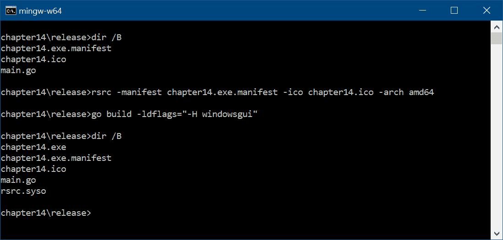

在生成资源包之后构建应用程序将自动包含数据

在这里，我们看到 Windows 资源管理器中的相同目录。在下面的屏幕截图中，应用程序位于左侧，使用我们包含的图标显示：

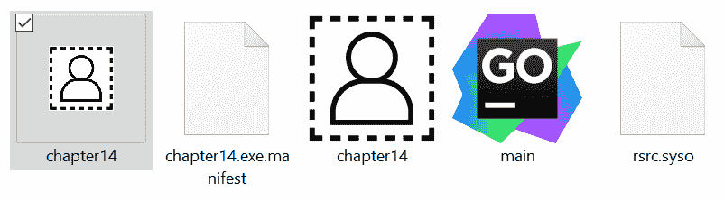

我们嵌入图标的 Windows 应用程序

这些过程很慢，并且可能容易出错。为了避免手动执行此过程，我们将探讨可以自动化此过程的工具。

# 跨平台打包工具

如您所见，每个操作系统都需要非常不同的打包方式。此外，通常使过程变得简单的工具通常是平台特定的，这使得从单个系统构建变得更加困难。GUI 应用程序的发行是一个 Go 工具也缺乏的领域。Go 语言非常适合快速创建跨平台软件，但它并不是为了处理图形应用程序打包的复杂性而设计的。

在第二部分，*使用现有小部件的工具包*中，我们探讨了非常成熟的工具包，但它们要么不是为 Go 编写的，要么不是为跨平台设计的，因此它们不提供我们可以使用的工具。第三部分，*现代图形工具包*则研究了更专注于提供图形功能而不是应用程序生命周期的工具包，因此也不提供合适的工具。

# fyne 打包

一个例外是 Fyne 项目，因为它旨在提供全应用生命周期的 API，因此工具支持在多个平台上分发完整的桌面应用程序。虽然该项目仍处于早期阶段，但它确实有一个可以帮助应用打包的工具（即使你尚未在代码中使用 Fyne）。`fyne package` 命令旨在生成并打包应用程序在 macOS、Linux 或 Windows 上分发的所有必需元数据。使用 `-os <platform>` 参数（使用 "darwin"、"linux" 或 "windows" 之一）将在当前目录中创建一个完整打包的应用程序。在执行此命令之前，应用程序应该已经编译为发布版本。

例如，我们可以使用 `fyne package -os linux` 从 Linux 计算机创建 macOS 应用程序包。有许多其他参数可以更改应用程序的内容，其中最有用的是 `-icon <filename>` 参数（这是必需的）。如果你之前没有使用 Fyne，那么应该使用以下命令安装：`go get fyne.io/fyne/cmd/fyne`。

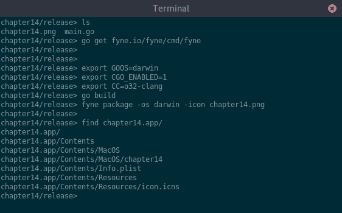

在 Linux 上使用 "fyne package" 构建 macOS 应用程序包

如前述截图所示，该工具从 Linux 终端生成了一个 `.app` 目录结构（它定义了一个 macOS 应用程序）。我们为 `GOOS` 环境和 `fyne package` 的 `-os` 参数使用了相同的平台名称。建议为单个平台构建并打包，然后再更改目标操作系统，以避免输出包中可能出现的错误。

在本节中构建的应用程序可以立即分发。上传到网站或以其他方式共享文件都可以，但我们希望为用户提供一个完全无缝的过程。让我们通过查看直接向最终用户交付桌面应用程序的各种分发渠道来结束本章。

# 分发到平台市场

大多数操作系统现在都有一个中心位置用于发现和安装应用程序。苹果创建了 Mac App Store，Windows 有微软商店，每个 Linux 发行版都有自己的首选包管理器。在平台市场中列出（并由其托管）的应用程序可以显著增加你预期的用户数量，并降低相关的托管成本。当与精心准备的元数据（如本章开头所述）相结合时，市场可以轻松成为你最大的分发渠道。如何将这些目录中的应用程序包含在内，每个平台都有其特定的方法，因此我们将依次查看每个平台的过程。

# Mac App Store

Mac App Store 是苹果著名的 iOS App Store 的桌面版本。它提供了成千上万的应用程序可供购买、下载或赠送给他人。此外，还有精选内容，包括各种类别中最受欢迎的应用程序列表，以及员工精选和推荐软件。如果有人购买，苹果还提供教育折扣以及免费提供给家庭成员的副本。您还可以使用礼品卡兑换购买应用程序或订阅的费用。不幸的是，Mac App Store 不能在线浏览，因为它需要预安装在兼容 Mac 电脑上的 App Store 软件。

除了安装开发工具之外，您还需要注册苹果开发者计划。如果您还不是会员，可以在此网站上注册：[developer.apple.com/programs/enroll/](https://developer.apple.com/programs/enroll/)。开发资源可以免费访问，但访问代码签名工具需要支付年度订阅费用，这些工具是发布软件到其任何 App Store 所必需的。

# 打包

提交应用程序的打包由 XCode 工具（您应该已经安装了）管理。该过程针对使用 XCode 构建的应用程序提交进行了优化，因为它不支持 Go，所以我们有一些手动步骤需要完成。

我们之前创建的应用程序包（针对 macOS 分发）在我们可以上传到 App Store 之前必须进行签名。代码签名是一个复杂的设置过程，因此在本描述中，我们假设您已经安装了分发证书。您需要记下证书的名称（使用“密钥链访问”查找您的开发者证书），然后在以下命令中使用该名称：

```go
codesign -s "CertificateName" /path/to/MyApp.app
```

生成的应用程序包已准备好上传到 App Store Connect 网站进行验证。

# 上传

App Store 应用程序通过 App Store Connect 网站（在[appstoreconnect.apple.com/](https://appstoreconnect.apple.com/)）进行管理。使用您的苹果开发者账户登录并创建一个新的应用程序（如果您还没有这样做）。这是您添加将在商店中显示的元数据的地方——务必仔细检查信息，因为一些数据发布后无法更改。精心挑选的描述和截图将有助于您的应用程序更容易被发现。在此应用程序定义中，您需要开始准备一个新的版本，包括适当的版本号和相关支持信息。您可能会注意到您还不能选择构建版本——为了启用此功能，我们首先需要上传编译包。

应用程序加载工具是上传新构建的最简单方法：打开应用并使用您的 Apple ID 登录。登录后，您将被要求选择要上传的应用程序；选择匹配的应用程序并继续上传。完成后，构建将出现在 App Store Connect 网站上（您可能需要刷新页面）。如果您更喜欢用于管理进度的命令行工具，可以使用`xcrun altool`，它提供相同的功能。一旦您选择了这个新构建，您就可以点击“提交审核”按钮开始审核流程。

# 审核过程

一旦应用程序提交审核，它将经过一系列自动的代码检查。此过程验证应用程序不包含元数据或代码签名中的明显错误，并执行代码分析以确保您没有使用苹果公司专有的或受限制的 API。假设这些自动检查通过，则应用程序将被发送给 App Store 审核团队的一员进行最终接受。

审核团队会检查您的应用程序的质量、可靠性、是否符合**人类界面指南**（**HIG** - [developer.apple.com/app-store/review/](https://developer.apple.com/app-store/review/)），以及它是否符合商店收录的其他标准。此过程通常需要一两天，但新应用程序的首次发布可能需要更长的时间。一旦过程完成，您的软件将在 App Store 上可供购买或下载。在您的第一周分发中，它甚至可能被包括在“新功能和值得注意”部分。

# 微软商店

微软商店是查找和安装所有当前 Windows、Windows Phone 和 Xbox 设备的软件、应用程序和游戏的官方位置。除了提供托管和搜索功能外，它还处理非免费软件的支付，并支持折扣和优惠券。您可以通过在线浏览微软商店的内容（在[www.microsoft.com/store/apps](https://www.microsoft.com/store/apps)）或使用它支持的每个系统上的商店应用程序。

要将应用程序提交到微软商店，您需要一个微软账户（如果您已登录 Windows、Xbox 或 Office 365，您可能已经有了）。您还必须开始年度订阅以访问开发者门户的相关部分。您可以在[appdev.microsoft.com/StorePortals](https://appdev.microsoft.com/StorePortals)登录和注册。

# 打包

创建用于上传到微软商店的应用程序包所需的工具包含在 Windows 软件开发工具包中。如果您尚未安装，可以从[developer.microsoft.com/en-us/windows/downloads](https://developer.microsoft.com/en-us/windows/downloads)下载，无论是作为 Visual Studio 的一部分还是作为单独的包。

要将应用程序上传到商店，我们必须创建一个`.appx`文件（一个应用程序包）。这需要一个额外的清单文件，名为`AppxManifest.xml`，其中包含正在打包的应用程序的元数据。其内容在微软网站上进行了文档化，网址为[docs.microsoft.com/en-us/uwp/schemas/appxpackage/how-to-create-a-basic-package-manifest](https://docs.microsoft.com/en-us/uwp/schemas/appxpackage/how-to-create-a-basic-package-manifest)。生成的清单文件应在`Applications`部分至少包含一个`Application`元素。

从我们的源文件创建软件包时，我们使用`MakeAppx.exe`命令，如下面的代码片段所示。通过使用`/d`参数，我们可以指定要打包的文件目录 - 如果您只想使用文件的一部分，您可以使用映射文件并通过`/f`参数指定它：

```go
MakeAppx.exe bundle /d sourcedir /p myapp.appx
```

一旦创建`.appx`文件，它必须进行签名。可以使用`SignTool.exe`命令对应用程序包进行签名。设置用于应用程序签名的证书超出了本章的范围，但微软开发者门户上的文档将指导您完成此过程。请确保清单文件中列出的发布者与您创建用于签名包的证书相匹配。

# 上传

完成的软件包应上传到开发者门户中的“软件包”页面。在准备上传时，请确保您的所有应用程序元数据都已添加到正确的位置，以便人们可以轻松找到您的软件。

一旦软件包上传，它将检查各种可能导致其无法发布的错误。如果您遇到任何警告，您需要从门户中删除已上传的构建版本并修复问题。一旦解决，您需要重新打包、重新签名并上传新的软件包以进行重新测试。

# 审查

一旦您的软件包上传并通过初步验证，它将被添加到队列中等待审查。微软的工作人员将审查您的应用程序的正确性和适用性，并验证其质量是否足够高，可以包含在商店中。假设所有这些检查都通过，他们将发布它以便在您在提交过程中指定的设备上分发。

# Linux 软件包管理器

多年来，Linux 发行版在处理软件包分发方面享有良好声誉。桌面系统可能有一个图形化的软件包管理应用程序，它提供易于搜索的索引，包含数千个软件包。最近，各种应用程序被创建出来，以帮助软件发现（使查找新软件包更容易）。

例如 *Discover*（更多关于此的信息可以在 [userbase.kde.org/Discover](https://userbase.kde.org/Discover) 找到）这样的应用可以在大多数系统上使用，通过配合许多不同的包管理器工作。其他一些，如 *Ubuntu 软件中心*，旨在通过类别、评分和其他增强元数据使特定系统的应用程序查找更加容易。

尽管有数百种不同的 Linux 发行版，但只需要少数几种打包格式来支持它们。在本节中，我们将探讨三种最流行的格式：*Debian*、*Red Hat* 和 *Tarball*。一旦为系统创建了软件包，应用程序开发者就可以将其提交到包列表中。然而，由于 Linux 是一个开源系统，你可能发现现有的包维护者可能很乐意为你做这件事！

# Debian (.deb)

Debian 的分发与我们在前面创建的 `.tar.gz` 分发非常相似，只是增加了特定的元数据，这使得 Debian 工具能够搜索和正确安装软件。Debian 的打包在他们的网站上详细描述（[wiki.debian.org/HowToPackageForDebian](https://wiki.debian.org/HowToPackageForDebian)），但基本过程是添加元数据（*Debian 化*），构建符合其文件系统布局的软件包，然后（可选）对软件包进行签名，以便用户知道他们可以信任内容。

# 打包

提供了 `dh_make` 命令来自动创建所需的元数据文件，并在现有的 Linux 打包目录结构中运行它将添加必要的文件。一旦运行，你应该检查 `debian/` 目录中的所有文件，根据需要更新信息。一旦添加了元数据，`debuild` 命令将为我们的软件创建一个 Debian 软件包。创建后，你应该使用 `lintian` 命令检查软件包是否存在许多常见错误。

虽然不是必需的，但你可以使用 `debsigs` 工具对软件包进行签名。这会创建一个签名的软件包，它提供了加密证明，表明软件包包含开发者所期望的内容。如前所述，设置证书和签名是复杂的过程，本书不涉及。

# 分发

一旦你的软件包准备就绪，你可以直接将其文件分发给其他 Debian 用户。然而，目标是将其包含在软件包列表中。为此，需要开始于在他们的错误跟踪器中提交“打包意图”([bugs.debian.org/cgi-bin/pkgreport.cgi?pkg=wnpp;dist=unstable](https://bugs.debian.org/cgi-bin/pkgreport.cgi?pkg=wnpp;dist=unstable)))。要完成这个过程，你需要为你的软件包找到一个赞助者或成为 Debian 开发者。无论哪种情况，你都需要联系开发社区以了解更多信息；详细信息可以在 [wiki.debian.org/DebianMentorsFaq](https://wiki.debian.org/DebianMentorsFaq) 找到。

# Red Hat (.rpm)

RPM 文件与 Debian 软件包非常相似，但具有不同的元数据集。同样，有一些标准工具可以帮助创建这些文件，并创建最终的软件包。首先，你应该在你的 Linux 发行版中安装 `rpm` 或 `rpm-build` 软件包，它应该包括必要的命令。

# 打包

首先，我们必须创建一个 `.spec` 文件来描述这个软件包。`rpmdev-newspec` 命令可以从模板选项中提供一个，帮助你开始。根据你的应用程序信息更新内容。这个文件将包含关于你的软件的所有元数据（包括其源位置、许可证和作者）。spec 文件还提供了组装软件包所需的构建信息，以及安装脚本和更多内容。

一旦元数据完成，就可以使用 `rpmbuild` 命令构建软件包。第一次尝试不成功是正常的。阅读输出并根据需要更新 `.spec` 文件，然后重新运行构建命令。完成后的输出将是你的完成 `.rpm` 文件，准备进行测试。此时，你可以通过手动安装（在兼容的 Linux 计算机上）并验证软件是否按预期工作来测试该文件。

# 分发

现在软件包已经准备好了，可以通过你的网站进行分发——RPM 文件可以相对容易地下载和安装。Linux 发行版的包含是一个复杂的过程，每个变种的细节都不同。CentOS、Fedora 和 Red Hat Enterprise Linux 都使用 RPM 软件包格式，许多其他发行版也是如此，但提交过程并没有很好地记录。Fedora 项目有全面的文档，你可以在 [fedoraproject.org/wiki/Package_Review_Process](https://fedoraproject.org/wiki/Package_Review_Process) 上参考。对于大多数软件包查询，最好的方法是联系当前的发行版维护者。

# 打包文件 (.tar.gz)

打包文件是对应用程序的二进制（和基于源）分发的通用打包。我们在本章前面构建的 `.tar.gz` 软件包是一个可能的打包文件分发的例子。在 Linux 中，大多数应用程序是开源的，这意味着打包通常是从源代码而不是从编译输出进行的。我们可以使用二进制发布版，就像我们构建的那样，但请记住，一些发行版可能会根据它们自己的政策反对包含这样的软件包。

# Arch Linux

Arch Linux 的包管理器 pacman 依赖于 `PKGBUILD` 文件来了解如何定位和安装软件包。`PKGBUILD` 文件是一种特定的 shell 脚本格式（命令行可执行文本文件），它描述了包的元数据、必须首先安装的任何依赖项以及包的安装过程。`PKGBUILD` 文件的完整详情可以在 [wiki.archlinux.org/index.php/PKGBUILD](https://wiki.archlinux.org/index.php/PKGBUILD) 找到。一个有效的文件必须至少包含 `pkgname`、`pkgver`、`pkgrel` 和 `arch` 变量。

创建包的过程是在创建 `PKGBUILD` 文件后运行 `makepkg` 命令。这将执行脚本文件中定义的步骤并准备生成的包。建议使用 `namcap` 命令检查完成的包文件，以确保没有犯下某些常见的错误。

新创建的包可以提交到 *Arch 用户仓库*，其他 Arch Linux 用户将能够安装它。随着时间的推移，值得注意的包可以从该位置提升到官方仓库。有关提交您的包的详细信息可以在 [wiki.archlinux.org/index.php/Arch_User_Repository#Submitting_packages](https://wiki.archlinux.org/index.php/Arch_User_Repository#Submitting_packages) 找到。

# Gentoo Linux

Gentoo Linux 是（并非唯一）基于源的分发版。这意味着包系统仅包含描述如何下载和安装软件的指令文件。此文件称为 `ebuild` 文件，类似于之前的 `PKGBUILD` 文件，包含有关元数据、依赖项和构建指令的信息。与 Arch Linux 不同，此描述文件是完整的分发版 – 打包者不使用元数据文件构建二进制分发包。

将新包提交给 Gentoo Linux 的过程（一旦创建了 `ebuild` 文件）可以在他们的社区文档 [`wiki.gentoo.org/wiki/Submitting_ebuilds`](https://wiki.gentoo.org/wiki/Submitting_ebuilds) 中找到。与其他发行版一样，您需要成为开发社区的一部分才能自己添加包，但您可以说服现有的开发者为您维护该包。

# 其他

许多其他 Linux 发行版使用类似的打包系统，但在此章节中提及所有这些会过于冗长。每个网站都会提供有关如何完成包并将其提交到其应用程序列表的信息。

# 容器

应用程序分发的越来越流行的方法是**应用容器化**。这种方法意味着每个应用程序都被打包成一个*容器*，类似于 Docker 和其他工具为基于服务器的软件所做的那样。应用程序容器是一个模拟文件系统的单个文件，应用程序被安装在其中。应用程序可以从网站或通过包管理器下载，并且不需要安装即可运行。相同的容器文件可以在任何 Linux 发行版上运行；甚至还有一些容器格式旨在支持多个操作系统。AppImage、Snap 和 Zero Install 是一些流行的格式，每个都有其特定的优势或目标受众。如果您想为您的应用程序分发单个 Linux 软件包，并且不太关心将其包含在平台软件列表中，这种方法可能适合您。

# 摘要

在本章的最后，我们探讨了如何打包和分发基于 Go 的图形应用程序。与命令行或系统工具的分发不同，交付 GUI 应用程序的过程需要额外的元数据和打包。图形应用程序的用户期望以特定方式找到和安装软件，这取决于他们的操作系统。我们首先探讨了良好元数据的重要性以及如何选择一个图标和描述来吸引潜在用户尝试我们的新软件。然后我们学习了如何将资源打包到基于 Go 的应用程序中。由于该语言是为单二进制分发而设计的，我们必须在分发之前将所有支持文件合并到可执行文件中。

为不同平台打包可能会很复杂，因此我们介绍了构建原生外观的图形包所需的步骤，包括 macOS、Windows 和 Linux。每个包都有自己的元数据格式和包结构，但我们能够为每种特定格式打包我们的简单应用程序。这一步骤产生的包可以通过网站或其他文件共享机制进行分发。然而，我们希望将应用程序分发到用户期望找到的地方——系统应用商店。因此，我们完成了为每个平台市场准备和分发包的过程。Windows 和 macOS 商店为应用程序在发布后赚取收入提供了机会，而 Linux 软件列表将有助于提高我们的软件包的可见性。

通过学习使用 Go 语言构建 GUI 的各种方法并探索可用的工具包，我们已经完成了从零到有、从有到完整的图形应用程序的构建。希望你在学习过程中学到了很多，并且成功创建了原本想要构建的应用程序——仅使用 Go 语言来支持高效、可维护且美观的用户界面。
